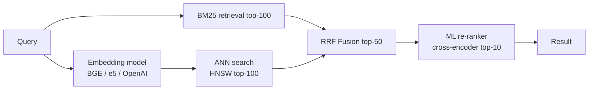
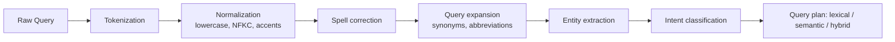

# Вопросы на собеседовании: `Design Search System`

`Search System` (Google Search, site search, product search) — глубокий system design. Tradeoff indexing latency vs query latency, ranking, typo tolerance, scale. Обычно рассматривается site/product search (не web-scale crawler Google), но principles те же.

## Полезные ссылки

- [Elasticsearch: definitive guide](https://www.elastic.co/guide/en/elasticsearch/guide/current/index.html)
- [Lucene internals](https://lucene.apache.org/)
- [How Google search works](https://www.google.com/search/howsearchworks/)
- [System Design Primer](https://github.com/donnemartin/system-design-primer)
- [High Scalability — search](http://highscalability.com/)

## Содержание

- [Полезные ссылки](#полезные-ссылки)
- [See also](#see-also)

**Requirements**
- [Q1. (!) Functional и non-functional requirements?](#q1--functional-и-non-functional-requirements)
- [Q2. (!) Capacity estimation?](#q2--capacity-estimation)

**Indexing**
- [Q3. (!) Inverted index — что это?](#q3--inverted-index--что-это)
- [Q4. (!) Tokenization, normalization, stemming?](#q4--tokenization-normalization-stemming)
- [Q5. Elasticsearch vs Lucene — разница?](#q5-elasticsearch-vs-lucene--разница)

**Architecture**
- [Q6. (!) High-level architecture?](#q6--high-level-architecture)
- [Q7. (!) Indexing pipeline?](#q7--indexing-pipeline)
- [Q8. Near real-time индексация?](#q8-near-real-time-индексация)

**Query**
- [Q9. (!) Query flow (scatter-gather)?](#q9--query-flow-scatter-gather)
- [Q10. (!) Relevance scoring: TF-IDF, BM25?](#q10--relevance-scoring-tf-idf-bm25)
- [Q11. Ranking beyond text (ML)?](#q11-ranking-beyond-text-ml)

**Scalability**
- [Q12. (!) Sharding стратегии?](#q12--sharding-стратегии)
- [Q13. Replication?](#q13-replication)

**Features**
- [Q14. (!) Autocomplete / typeahead?](#q14--autocomplete--typeahead)
- [Q15. (!) Typo tolerance / fuzzy match?](#q15--typo-tolerance--fuzzy-match)
- [Q16. Faceted search / filters?](#q16-faceted-search--filters)
- [Q17. Semantic search / vector embeddings?](#q17-semantic-search--vector-embeddings)

**Production**
- [Q18. (!) Analytics и learning-to-rank?](#q18--analytics-и-learning-to-rank)
- [Q19. Hot queries cache?](#q19-hot-queries-cache)
- [Q20. Index rebuild / rollover?](#q20-index-rebuild--rollover)

**Современные паттерны 2026**
- [Q21. (!) BM25 vs TF-IDF — формулы и saturation?](#q21--bm25-vs-tf-idf--формулы-и-saturation)
- [Q22. (!) Hybrid search: BM25 + dense + RRF fusion?](#q22--hybrid-search-bm25--dense--rrf-fusion)
- [Q23. Faceted search — refinement и aggregation?](#q23-faceted-search--refinement-и-aggregation)
- [Q24. (!) Geo search — geohash, S2, R-tree, bbox vs distance?](#q24--geo-search--geohash-s2-r-tree-bbox-vs-distance)
- [Q25. Real-time indexing — Lucene segments и refresh_interval?](#q25-real-time-indexing--lucene-segments-и-refresh_interval)
- [Q26. Query understanding pipeline?](#q26-query-understanding-pipeline)
- [Q27. (!) Multi-tenancy — per-tenant index vs single + filter?](#q27--multi-tenancy--per-tenant-index-vs-single--filter)
- [Q28. Personalization signals — click history и re-ranking?](#q28-personalization-signals--click-history-и-re-ranking)
- [Q29. (!) Quality metrics — recall@k, MRR, NDCG, p99 latency?](#q29--quality-metrics--recallk-mrr-ndcg-p99-latency)
- [Q30. (!) Антипаттерны и подводные камни?](#q30--антипаттерны-и-подводные-камни)

## Q1. (!) Functional и non-functional requirements?

**Functional (site/e-commerce search):**
- Full-text query over documents
- Autocomplete / suggestions
- Typo tolerance
- Filters (price, category, rating)
- Sort (relevance, price, date)
- Pagination
- Highlight matching terms

**Non-functional:**
- **Low latency** (< 200ms p99)
- **High QPS** (thousands of queries/sec)
- **Fresh data** (newly added items searchable in seconds-minutes)
- **High availability** (99.9%+)
- **Relevance quality** (precision + recall)

**Scope:**
- NOT web crawler (Google-scale — separate topic)
- Assume documents provided (products, articles)

## Q2. (!) Capacity estimation?

**Assumptions (e-commerce):**
- 100M products indexed
- 1000 queries/sec average, 10k peak
- Product record ~ 1KB
- 5 product updates/sec

**Index size:**
- Documents: 100M × 1KB = **100 GB raw**
- Inverted index: ~50% of raw (terms, postings)
- Plus: fields, stored vectors, analyzers
- Total: ~150-200 GB (single copy)
- Replication 2x: 400 GB
- 3 replicas: 600 GB

**Query throughput:**
- 10k QPS peak
- Per-query CPU: ~10ms on single shard
- 10 shards parallel: near constant; aggregate ~100 queries per shard-second
- Need ~10 nodes для 10k QPS

**Memory для performance:**
- Hot indices in RAM → faster
- ~100 GB RAM across cluster for hot data

## Q3. (!) Inverted index — что это?

**Forward index:** doc → words (normal DB).
```
doc_1: "the quick brown fox"
doc_2: "quick fox jumps"
```

**Inverted index:** word → docs.
```
"quick" → [doc_1, doc_2]
"brown" → [doc_1]
"fox" → [doc_1, doc_2]
```

**Why:** query "quick fox" → intersect postings of "quick" + "fox" → candidates.

**Richer structure:**
- Term → [(doc_id, frequency, positions)]:
  ```
  "quick" → [(1, 1, [1]), (2, 1, [0])]
  ```
- Positions enable phrase queries

**Storage:**
- Disk: compressed (variable-byte encoding, delta encoding)
- Memory: cached hot terms

**Lucene:** implementation в Apache Lucene = basis for Elasticsearch, Solr.

## Q4. (!) Tokenization, normalization, stemming?

**Pipeline при indexing:**

**1. Tokenization:**
- Split text into tokens: `"Hello, world!"` → `["Hello", "world"]`
- Language-dependent (CJK different)
- Character filters (HTML strip, mapping)

**2. Normalization:**
- Lowercase: `"Hello"` → `"hello"`
- Unicode normalization (NFC, NFD)
- ASCII fold: `café` → `cafe`
- Remove punctuation

**3. Stop words:**
- Remove common words: "the", "a", "is"
- Saves space; marginal for relevance

**4. Stemming:**
- Reduce to root: `"running", "runs", "ran"` → `"run"`
- Porter, Snowball stemmers

**5. Lemmatization:**
- Smart stemming (dictionary-based): `"better"` → `"good"`
- More accurate, slower

**6. Synonyms:**
- `"automobile" → "car"`
- At index time or query time

**Example:**
- Input: `"Running the fastest cars"`
- After pipeline: `["run", "fast", "car"]`
- Query "car races" matches thanks to stemming

**Same pipeline at query time:**
- Consistency mandatory
- Misconfigured analyzer = terms в index don't match query tokens

## Q5. Elasticsearch vs Lucene — разница?

**Lucene:** Java library (индекс + search на одном машины).

**Elasticsearch:** distributed wrapper вокруг Lucene.
- REST API
- Cluster management
- Sharding + replication
- JSON docs
- Aggregations

**Solr:** another Lucene-based product; similar capabilities.

**Comparison:**

| Aspect | Lucene | Elasticsearch |
|--------|--------|---------------|
| Type | Library | Distributed product |
| API | Java | REST/JSON |
| Scale | Single machine | Cluster |
| Features | Core search | + aggregations, monitoring, Kibana |
| Learning curve | Low-level | User-friendly |

**Choose Elasticsearch** for most enterprise (cluster out-of-box).

**Alternatives:**
- **OpenSearch** (AWS fork of ES, open license)
- **Typesense** — simpler, lower ops
- **Meilisearch** — lightweight typo-tolerant
- **Algolia** — SaaS (fast, but $$$)

## Q6. (!) High-level architecture?

```
Data sources → [Indexing Pipeline] → [Index Service (Elasticsearch)] ← [Query Service]
                       ↑                                                     ↑
                 [Change Stream/Kafka]                               [API Gateway]
                       ↑                                                     ↑
               [Product DB, CMS]                                       [Clients]
```

**Components:**

- **Indexing Pipeline:** ingest + transform data → index service
- **Index Service:** Elasticsearch cluster (master + data nodes)
- **Query Service:** fronts search API; handles query parsing, result post-processing, cache
- **Cache:** Redis для popular queries
- **Analytics:** clicked results → training data для ranking

**Separation of concerns:**
- Index path: write-heavy, batch-friendly
- Query path: read-heavy, latency-sensitive

## Q7. (!) Indexing pipeline?

**Batch indexing:**
```
Source (DB) → ETL → Transform → Bulk index (ES)
```
- Pull всё periodically (nightly)
- Simple, high latency

**Real-time CDC:**
```
Source DB → WAL → Debezium → Kafka → Consumer → Index (ES)
```
- Changes flow в seconds
- Scales well

**Event-driven:**
```
Application → Kafka topic → Consumer → Index (ES)
```
- Each write emits event
- Decoupled

**Pipeline stages:**
1. Read from source (CDC or event)
2. Transform (enrich, denormalize, derive fields)
3. Analyze (tokenize)
4. Bulk write к ES (_bulk API)

**Handle failures:**
- Retry on failure
- Dead-letter queue
- Idempotency (document ID from source)

**Bulk performance:**
- ES bulk API: 500-5000 docs per request
- Measure throughput vs latency

## Q8. Near real-time индексация?

**Elasticsearch:**
- Documents indexed в in-memory buffer
- `refresh_interval` (default 1s) flushes buffer → segment → searchable
- Trade-off: too frequent = costly; rare = stale

**Tuning:**
- Real-time: `refresh_interval=1s` (default)
- Bulk loading: disable refresh (`-1`), enable after load
- Relaxed: `30s` — reduce indexing overhead

**Durability:**
- Translog (write-ahead log) persists immediately
- Can recover on crash

**Visibility:**
- Write → in-memory → refresh → searchable (delay = refresh interval)

**When matters:**
- Product catalog update: 5s delay OK
- Chat search: near real-time critical

## Q9. (!) Query flow (scatter-gather)?

**Distributed search:**
```
Query
  ↓
Coordinator node receives
  ↓
Fan out to ALL shards (scatter)
  ↓
Each shard performs local search, returns top K
  ↓
Coordinator merges + re-ranks globally (gather)
  ↓
Coordinator fetches full docs for top K
  ↓
Return results
```

**Steps:**
1. Parse query
2. Send to shards (parallel)
3. Each shard returns (doc_id, score) for local top K
4. Coordinator merges — top K globally
5. Fetch docs (by ID)
6. Format response

**Latency:**
- p99 = slowest shard + merge + fetch
- Slow shard = entire query slow (scatter-gather amplifies tail)

**Optimizations:**
- **adaptive_replica_selection:** send к fastest replica
- **search_timeout:** abort slow shards
- **Pre-filtering:** narrow по индексу before scoring

## Q10. (!) Relevance scoring: TF-IDF, BM25?

**TF-IDF:**
- TF (term frequency): more occurrences = more relevant
- IDF (inverse doc frequency): rare terms more informative
- Score = TF × IDF

**BM25 (default в Lucene/ES):**
- Improved TF-IDF
- Term saturation (diminishing returns for TF)
- Document length normalization

**Formula BM25:**
```
score = IDF(term) × (TF × (k+1)) / (TF + k × (1 - b + b × |D|/avgdl))
```
- `k = 1.2` — saturation parameter
- `b = 0.75` — length normalization
- `|D|` = doc length; `avgdl` = avg doc length

**Why BM25 better:**
- TF-IDF: doc с 100 occurrences of "quick" scored 100x than 1 occurrence
- BM25: saturation — 10 occurrences ≈ 100 (diminishing)
- More realistic

**Default:** ES uses BM25.

**Practical search score:**
- BM25 base
- Field boosts: title weight × 3, body weight × 1
- Freshness decay
- Popularity boost

## Q11. Ranking beyond text (ML)?

**Text relevance только часть:**

**Signals:**
- Query-doc match (BM25, embeddings similarity)
- Freshness (recent > older)
- Popularity (click-through, sales)
- User personalization (past searches, location)
- Quality (reviews, editorial score)

**Approaches:**

**1. Hand-tuned formula:**
- `score = BM25 + 0.5×freshness + 0.3×popularity`
- Simple, understandable

**2. Learning-to-Rank (LTR):**
- ML model scores (user features, query features, doc features)
- Training data: clicks, engagement
- Models: LambdaMART (gradient boosting), DNN

**3. Two-stage (common):**
- Stage 1: candidate retrieval (BM25 gets top 1000)
- Stage 2: re-rank с ML (deep model on top 100)

**Elasticsearch LTR plugin:**
- Feature extractors define signals
- External model (XGBoost) scores

**A/B testing:**
- New ranker vs baseline
- Metric: CTR, conversion, revenue

## Q12. (!) Sharding стратегии?

**Shard:** partition of index on one node.

**Number of shards:**
- More = parallelism, но overhead per shard
- Rule: shard size 20-50GB; plan capacity
- Example: 200GB data, 50GB/shard → 4 shards

**Sharding modes:**

**Per-index (default):**
- Documents hash to shards by doc_id
- Even distribution
- Query: scatter to all shards

**Routing (custom):**
- Specify shard key (`routing` parameter)
- Example: by user_id → all user's data on 1 shard
- Query: targeted (if routing known) = faster
- Uneven если hot user

**Time-based (rollover):**
- Daily/monthly indices: `logs-2024-01`, `logs-2024-02`
- Query: time filter → search relevant indices only
- Old: close or move to cold storage

**Cross-cluster search:**
- Multiple clusters searchable as one
- Geo-distributed

## Q13. Replication?

**Replica shard:** copy for HA + read scale.

**Configuration:**
- Primary shard + N replicas
- Replicas distributed across nodes (no two on same node)

**Purposes:**
- **Durability:** node failure → replica promoted
- **Read throughput:** queries served by primaries + replicas (round-robin)
- **Zero-downtime restarts:** rolling restart

**Typical:**
- 1 replica (2 copies total): some HA
- 2 replicas (3 copies): safer (quorum)

**Write flow:**
- Write to primary
- Primary replicates to replicas (sync)
- All in-sync before ACK (default)

**Tuning:**
- `index.number_of_replicas: 1-2` typically
- More replicas = more storage + write cost, но better read scale

## Q14. (!) Autocomplete / typeahead?

**Goal:** suggest completions as user types.

**Challenges:**
- Ultra-low latency (< 50ms)
- Relevance (popular first)
- Typo-tolerant

**Implementations:**

**1. Prefix-based inverted index:**
- Elasticsearch `completion` suggester
- FST (Finite State Transducer) data structure
- In-memory, very fast
- Supports fuzzy matching

**2. Dedicated cache (Redis sorted sets):**
- Each prefix → sorted set of terms with popularity scores
- `ZRANGE prefix:"app" 0 5 WITHSCORES`
- Precompute on schedule

**3. Trie:**
- Classic data structure
- In-memory per-node
- Distributed trie сложно

**Ranking:**
- By popularity (search frequency)
- Personalization (user's history)
- Context (current page, location)

**Real-time update:**
- On query logs → update scores
- Periodic rebuild

## Q15. (!) Typo tolerance / fuzzy match?

**Goal:** "appel" finds "apple".

**Approaches:**

**1. Edit distance (Levenshtein):**
- Distance = chars to change (insert/delete/replace)
- Match terms with distance ≤ N
- Elasticsearch `fuzzy` query: `fuzziness: 2`

**2. Damerau-Levenshtein:**
- Adds transposition (swap)
- Better for common typo patterns

**3. N-gram indexing:**
- Index substrings (3-grams: "app", "ppl", "ple" for "apple")
- Query partial "appl" matches
- Higher storage cost

**4. Phonetic encoding:**
- Soundex, Metaphone
- "Smith" and "Smyth" → same code
- Useful для names

**5. ML spell correction:**
- Train on query logs (user retypes after typo)
- Suggest corrections: "Did you mean ..."

**Elasticsearch:**
- `fuzzy` query for edit-distance
- `ngram` analyzer для partial match
- `phonetic` analyzer

**Trade-off:**
- More tolerance = more recall, less precision (irrelevant matches)
- Tune по use case

## Q16. Faceted search / filters?

**Facets:** categorical breakdowns (brand, price range, rating).

**Use case:** e-commerce "Nike shoes under $100, rating 4+".

**Implementation (Elasticsearch aggregations):**
```json
{
  "query": { "match": { "name": "shoes" } },
  "aggs": {
    "brands": { "terms": { "field": "brand" } },
    "price_ranges": {
      "range": {
        "field": "price",
        "ranges": [
          { "to": 50 }, { "from": 50, "to": 100 }, { "from": 100 }
        ]
      }
    }
  }
}
```

**Response:**
- Top matches + counts per facet

**UI:**
- Facets as sidebar filters
- Click filter → narrow search

**Performance:**
- Aggregations cached (filter cache)
- Cardinality (# unique values) affects speed

## Q17. Semantic search / vector embeddings?

**Problem:** lexical search (BM25) misses synonyms, semantic similarity.
- Query "running shoes" won't match "jogging footwear"

**Semantic search:**
- Embed query и docs в vector space (dense vectors)
- Similar meaning = close vectors
- Nearest-neighbor search

**Embedding models:**
- BERT, sentence-transformers
- OpenAI text-embedding-3 (API)
- Domain-specific fine-tuned

**Vector DBs:**
- Elasticsearch (dense_vector + kNN 8+)
- Pinecone, Weaviate, Milvus
- pgvector (Postgres extension)

**Hybrid search:**
- BM25 + vector similarity
- Combine scores: `score = α × bm25 + (1-α) × vector_similarity`
- Best of both (lexical precision + semantic recall)

**RAG (LLM context):**
- Embed knowledge base
- Query → retrieve similar chunks → pass to LLM
- See [RAG](../ai-ml/rag-interview.md)

**Challenges:**
- Embedding drift (model updates → re-index)
- High-dim vector storage expensive
- ANN index trade-off (approximate для speed)

## Q18. (!) Analytics и learning-to-rank?

**Query logs:**
- Every search + click → event log
- Build training data for ranking

**Metrics:**
- **Click-through rate (CTR):** clicks / impressions
- **NDCG (Normalized Discounted Cumulative Gain):** relevance with position
- **Mean Reciprocal Rank (MRR):** position of first relevant
- **Conversion rate:** search → purchase

**LTR feedback loop:**
- Collect: query, shown results, click, dwell time, conversion
- Label training: clicked = relevant, not = less
- Train: XGBoost / neural
- Deploy via A/B test
- Measure, iterate

**Counterfactual evaluation:**
- "If we'd ranked differently, CTR would be X" — estimate without full A/B
- Inverse propensity scoring

**Personalization:**
- User features (history, location) — input к ranker
- Privacy considerations

## Q19. Hot queries cache?

**20% queries = 80% volume** typically.

**Cache layers:**

**CDN / HTTP cache:**
- Public queries (no user-specific) → CDN cacheable
- `Cache-Control: public, max-age=60`

**Redis query cache:**
- Key: hash(query + filters + sort)
- Value: result IDs + metadata
- TTL 60s-5min

**Elasticsearch native:**
- **Request cache:** cached by shard for structured queries
- **Query cache:** cached filter results (bit sets)
- Default enabled

**Invalidation:**
- TTL for most
- Event-driven для specific (product out of stock → invalidate key)

**Measure:**
- Hit ratio: track
- Stale risk: acceptable lag vs freshness requirement

## Q20. Index rebuild / rollover?

**When needed:**
- Schema change (new analyzer, new fields)
- Bulk backfill after data migration
- Language analyzer update

**Zero-downtime rebuild:**
1. Build new index (alongside old)
2. Populate: `reindex` API (or from source)
3. Switch alias: `old` → `new`
4. Queries use new index seamlessly
5. Delete old

**Alias pattern:**
```
alias "products" → index "products-v1"
# rebuild:
alias "products" → index "products-v2"
```

**Rollover (time-based):**
- Indices per day/month
- Alias points to current
- Auto-rollover when size/age reached:
```
POST products/_rollover
```

**Cost:**
- Double storage temporarily
- Takes hours for large dataset
- Plan maintenance window

## Q21. (!) BM25 vs TF-IDF — формулы и saturation?

**TF-IDF (classical):**
```
score(q, d) = Σ_t∈q TF(t, d) × IDF(t)
TF(t, d) = freq(t, d)
IDF(t) = log(N / df(t))
```
- Простой, линейно растёт по `TF` — 100 повторений = 100× score.
- Минус: keyword stuffing работает. Документ с 100 повторами `apple` ранжируется как 100×.

**BM25 (default Elasticsearch 5+):**
```
score(q, d) = Σ_t∈q IDF(t) × (TF × (k+1)) / (TF + k × (1 - b + b × |D|/avgdl))
```
Параметры:
- `k = 1.2` — term frequency saturation: после 1-2 встреч термина прирост score замедляется.
- `b = 0.75` — length normalization: длинные документы получают penalty (иначе они выигрывают за счёт большего количества вхождений).
- `|D|` — длина документа, `avgdl` — средняя длина по корпусу.

**Когда что использовать:**

| Сценарий | Выбор |
|---|---|
| Default site search | BM25 |
| Legacy Lucene/Solr 4.x | TF-IDF |
| Short documents (titles, names) | BM25 с `b=0.0` (отключить length penalty) |
| Long documents (articles) | BM25 default |
| Custom domain (legal, medical) | BM25 с tuned `k1`, `b` через grid search |

**Альтернативы:**
- **BM25F** — multi-field BM25 (title weight ×3, body ×1). Используется в Lucene через `MultiMatchQuery` boost.
- **BM25+** — добавляет lower-bound на TF (защита от очень коротких документов с TF=0).
- **DFR (Divergence From Randomness)** — другой probabilistic фреймворк, экспериментальный.

**Tuning:**
- `_explain` API в ES показывает breakdown score → видно вклад IDF, TF saturation, length norm.
- A/B testing с реальными query logs.

## Q22. (!) Hybrid search: BM25 + dense + RRF fusion?

Современный стандарт (Elasticsearch 8+, Vespa, Qdrant, Pinecone hybrid): объединение `lexical` (BM25) и `semantic` (dense vector embeddings) для максимального recall + precision.

**Зачем гибрид:**

| Подход | Сильные стороны | Слабые |
|---|---|---|
| BM25 | Exact keyword match, product codes, names | Не понимает синонимов, парафраз |
| Dense (embeddings) | Semantic similarity, paraphrasing, multilingual | Слабее на rare terms, OOV, exact IDs |
| Hybrid | Лучшее из обоих | Сложнее tuning + 2× indexing cost |

**Простое объединение (weighted sum):**
```
score_hybrid = α × normalize(score_bm25) + (1-α) × cosine_similarity(q_vec, d_vec)
```
Проблема: scores из разных шкал (BM25 — 0..∞, cosine — -1..1) — нормализация хрупкая.

**Reciprocal Rank Fusion (RRF, рекомендуется):**
```
RRF_score(d) = Σ_query 1 / (k + rank(d, query))
```
где `k = 60` (heuristic), `rank` — позиция документа в каждом списке (BM25 и dense).

**Свойства RRF:**
- Не требует нормализации scores.
- Устойчив к outliers.
- Используется в Elasticsearch `rank_constant=60`.

**Архитектура:**


**Vector storage:**
- `Elasticsearch dense_vector` с HNSW index (since 8.0).
- `Qdrant`, `Pinecone`, `Weaviate`, `Vespa`.
- `pgvector` для Postgres (для < 10M vectors).

**Embedding models 2026:**
- `text-embedding-3-small` (OpenAI, 1536 dim, $0.00002/1K tokens).
- `BGE-M3`, `e5-mistral-7b` (open-source, многоязычные).
- `Cohere embed-v3` (high-quality, поддерживает int8 quantization).

**Edge cases:**
- Cold start новой модели — re-index всей коллекции; double storage временно.
- Long documents — chunk на 256-512 tokens, store chunks с `parent_id`.
- Multilingual — модели типа BGE-M3 / multilingual-e5.

## Q23. Faceted search — refinement и aggregation?

**Цель:** показать пользователю фильтры с counts «найдено N товаров»: brand: Nike (45), Adidas (30), category: Shoes (60), Apparel (15).

**Elasticsearch aggregations:**
```json
{
  "query": { "match": { "name": "running" } },
  "aggs": {
    "brands": { "terms": { "field": "brand.keyword", "size": 10 } },
    "price_ranges": {
      "range": {
        "field": "price",
        "ranges": [{ "to": 50 }, { "from": 50, "to": 100 }, { "from": 100 }]
      }
    },
    "rating_avg": { "avg": { "field": "rating" } }
  }
}
```

**Refinement flow:**
- User кликает `brand: Nike` → URL `?brand=Nike`.
- Backend добавляет `filter` в bool query.
- Counts пересчитываются на новом результате (или через `post_filter` для facet UI).

**Post-filter (важный паттерн):**
- `query` влияет на scoring + filters + aggregations.
- `post_filter` применяется ПОСЛЕ aggregations → counts видны для всех brands даже когда выбран один.
- Стандарт e-commerce: search относится к query, выбранный facet — к post_filter.

**Cardinality issues:**
- `terms` aggregation по `user_id` (миллионы значений) → OOM.
- Решения: `cardinality` (HyperLogLog approximation), `composite` aggregation (pagination).

**Aggregation cache:**
- ES `request_cache` кэширует aggregations с `size=0`.
- TTL invalidate при refresh.

**Production кейсы:**
- Amazon e-commerce search: brand/price/seller/rating facets.
- Airbnb: location/price/amenities filters.
- LinkedIn search: industry/seniority/location.

## Q24. (!) Geo search — geohash, S2, R-tree, bbox vs distance?

**Use cases:** Uber «найти водителей в радиусе 2 км», Yelp «restaurants near me», Airbnb «listings в Берлине».

**Подходы:**

**1. Geohash (Elasticsearch default):**
- Координата `(lat, lon)` → base32-строка `u4pruydqqvj`.
- Префикс = регион (`u4` ≈ Германия + Польша).
- Точность зависит от длины: 6 chars ≈ 1.2 km, 8 chars ≈ 40 m.
- Поиск bbox: prefix scan.
- Плюсы: простой, inverted index работает.
- Минусы: соседние клетки могут иметь сильно разные prefix (на границах квадрантов).

**2. S2 (Google, Uber, Foursquare):**
- Делит землю на иерархические клетки разного уровня (Hilbert curve).
- Cell ID = 64-bit integer.
- Соседи всегда close in ID space → лучше locality.
- Hierarchical: уровни 0 (всё полушарие) … 30 (~1 cm²).
- Используется в Uber H3, Snowflake GIS.

**3. R-tree:**
- Дерево bounding rectangles.
- Используется в PostGIS, MongoDB 2dsphere.
- Хорошо для bbox queries, но дороже balance при writes.

**4. H3 (Uber):**
- Hexagonal hierarchy (равные соседи, все на одинаковом distance).
- Используется для surge pricing, ETA.
- См. `design-uber-interview Q5`.

**Bbox vs distance:**

```
# Bounding box (быстро, грубо)
GET /restaurants/_search
{ "query": { "geo_bounding_box": { "loc": { "top_left": {...}, "bottom_right": {...} } } } }

# Distance (точно, медленнее)
GET /restaurants/_search
{ "query": { "geo_distance": { "distance": "5km", "loc": { "lat": ..., "lon": ... } } } }
```

**Trade-off:**
- Bbox: ~10× быстрее, но захватывает «углы» прямоугольника (на 30% больший radius).
- Distance: точный круг, дороже (Haversine для каждого кандидата).
- Гибрид: bbox для retrieval → distance для filtering top-N.

**Edge cases:**
- Антимеридиан (Pacific dateline): bbox через ±180° ломается; S2/H3 — нет.
- Полюса: широта clamped к ±85.05 (Web Mercator); S2 покрывает корректно.

## Q25. Real-time indexing — Lucene segments и refresh_interval?

**Lucene segments:**
- Документы пишутся в **in-memory buffer**.
- `refresh` (default каждые 1s) → buffer → новый immutable Lucene `segment` → searchable.
- Каждый поиск проходит по всем сегментам, merge results.
- `merge` (background) объединяет мелкие сегменты в крупные (фоновый процесс).

**Refresh interval tuning:**

| Сценарий | Настройка | Эффект |
|---|---|---|
| Near real-time UI | `refresh_interval: 1s` (default) | Свежие данные сразу видны |
| Bulk loading | `refresh_interval: -1` (отключено) | 3-5× быстрее indexing |
| Logging (mass write) | `refresh_interval: 30s` | Меньше segments, меньше overhead |
| Analytics-only | `refresh_interval: 60s` | Максимальная throughput |

**Durability через translog:**
- Каждый write записывается в WAL (translog) **до** появления в segment.
- Сегмент видно только после refresh, но потеря данных невозможна (translog flushes).
- `index.translog.durability: request` (sync на каждый write — медленно, надёжно) vs `async` (default 5s, чуть быстрее, 5s data loss risk).

**Merge policy:**
- Tiered merge: объединяет сегменты схожего размера.
- Force merge перед запросом архива: `POST index/_forcemerge?max_num_segments=1`.

**Trade-off для interview:**
- Меньше refresh interval → fresher data, но больше overhead.
- Bulk load best practice: disable refresh + replicas → load → re-enable.

**Production кейсы:**
- Logging (Elastic Stack): refresh_interval 30s + force_merge для old indices.
- Product search: 5s refresh достаточно.
- Chat search: 1s default.

## Q26. Query understanding pipeline?

Подготовка query до retrieval — это отдельный pipeline:



**Стадии:**

1. **Tokenization** — split по whitespace, punctuation, CJK character-by-character.
2. **Normalization** — lowercase, Unicode NFKC, ASCII fold (`café → cafe`).
3. **Spell correction** — `appel → apple` через edit distance / phonetic / ML correction (Q15).
4. **Query expansion:**
   - Synonyms: `car → automobile, vehicle` (через synonym dictionary).
   - Abbreviations: `NYC → New York City`.
   - Stemming: `running → run` (Q4).
5. **Entity extraction (NER):**
   - `Nike running shoes` → entities: `Nike (brand)`, `running shoes (category)`.
   - Boost matches на extracted entities.
6. **Intent classification:**
   - Navigational (`facebook.com`), informational (`how to bake bread`), transactional (`buy iphone`), local (`pizza near me`).
   - Влияет на routing: navigational → exact match, informational → semantic search.

**Tools:**
- ES Token Filters (synonym, stop, stemmer).
- spaCy / Hugging Face NER модели.
- Внутренние ML классификаторы intent.

**Latency budget:**
- Tokenization + normalization: < 1 ms.
- Spell correction: 5-20 ms (если ML).
- Entity extraction: 20-50 ms (ML inference).
- Total before retrieval: < 100 ms (часть p99 search budget).

**Edge cases:**
- Multilingual query — отдельные analyzers per language.
- Mixed-script (`айфон 15 pro` — RU + EN) — общий analyzer с NFKC + script detection.

## Q27. (!) Multi-tenancy — per-tenant index vs single + filter?

Когда несколько customers / merchants / спейсов делят одну поисковую инфраструктуру (Shopify, Algolia, Slack):

**Вариант 1: Index per tenant.**
- `products_tenant_42`, `products_tenant_99`.
- Pro: изоляция, можно настраивать analyzer per language tenant, удаление tenant = drop index.
- Con: тысячи мелких индексов → metadata overhead, JVM heap pressure (каждый index держит state).
- ES recommended limit: < 1000 indices per cluster.

**Вариант 2: Single index + tenant_id filter.**
- Все documents в `products` с полем `tenant_id`.
- Каждый query: `bool { must: query, filter: { term: tenant_id: 42 } }`.
- Pro: меньше overhead, легче scale.
- Con: scatter-gather по всем шардам даже для одного tenant.

**Вариант 3 (hybrid): Routing by tenant.**
- Single index + `routing=tenant_id` параметр.
- Все docs одного tenant попадают на один shard → targeted search.
- Pro: low overhead + быстрый retrieval per tenant.
- Con: hot tenant = hot shard (uneven distribution).

**Когда что:**

| Tenants | Approach |
|---|---|
| < 100 | Index per tenant |
| 100-10 000 | Single index + routing |
| 10 000+ | Single index + filter (если каждый tenant маленький) |
| Очень разные размеры | Index per large tenants + shared index для small (`tiered`) |

**Real:**
- Shopify Search: routing by `shop_id` (большие магазины + tiered index для крошечных).
- Algolia: index per application (each customer gets own index).
- Slack search: index per workspace (большие workspace → dedicated cluster).

**Security:**
- Filter всегда обязателен (даже при routing) — защита от bug в routing logic.
- Per-tenant API key + middleware enforce.

## Q28. Personalization signals — click history и re-ranking?

Базовый search (BM25 / hybrid) одинаков для всех. Personalization добавляет user-specific сигналы:

**Сигналы:**
- **Click history** — пользователь часто кликает на категорию X → boost X в результатах.
- **Purchase history** — для e-commerce boost related products.
- **Browse history** — последние просмотренные товары.
- **Location** — bias к local restaurants/services.
- **Language preference** — boost матчи на user's language.
- **Time-of-day / day-of-week** — обед vs ужин для food delivery.

**Реализация:**

**Stage 1: Retrieval (impersonal).**
- BM25 / hybrid top-100 candidates.
- Эта стадия не использует user signals — кеш-friendly.

**Stage 2: Re-ranking (personalized).**
- ML модель: input = (query_features, doc_features, user_features).
- Output: score → re-order top-100.
- Latency: 10-30 ms на CPU, < 5 ms на GPU (batched).

**User features:**
- Embedding vector от user history (последние N кликов / покупок).
- Category preferences (one-hot).
- Demographics (если есть).

**Model:**
- LambdaMART (GBM) — стандарт, легко интерпретируется.
- Two-tower neural (query-tower + user-tower) — Amazon, LinkedIn.
- Transformer cross-encoder — best quality, дороже.

**Cold start:**
- New user без history → fallback на global popularity.
- Postpone personalization до collect of первых 5-10 кликов.

**Privacy:**
- User features hashed / aggregated.
- GDPR right-to-erasure → удалить click history по запросу.

**A/B testing:**
- Метрика: CTR + conversion + session quality.
- Сравнение `personalized` vs `impersonal baseline`.

## Q29. (!) Quality metrics — recall@k, MRR, NDCG, p99 latency?

**Качество результатов:**

**Recall@k:**
- Доля релевантных документов в top-k.
- `recall@10 = 7/10 = 0.7` — из 10 показанных 7 релевантны.
- Хорошо для precision-критичных задач (top results matter).

**Precision@k:**
- Доля найденных релевантных из всех релевантных в корпусе.
- Сложнее измерить (нужна полная разметка).

**MRR (Mean Reciprocal Rank):**
- Среднее `1/rank` для первого релевантного результата.
- Penalty за «нашёл, но низко» — на месте 3 = 1/3, на месте 10 = 1/10.
- Хорошо для navigational queries («найди эту страницу»).

**NDCG (Normalized Discounted Cumulative Gain):**
- Учитывает позицию И градацию релевантности (relevance label 0..4).
- `DCG = Σ (2^rel - 1) / log2(rank + 1)`.
- `NDCG = DCG / ideal_DCG` (нормализация на оптимальный порядок).
- Стандарт для academic IR и LTR.

**Click-based metrics (production):**
- **CTR @ position 1** — доля кликов на топ результат.
- **Mean clicked rank** — средняя позиция первого клика.
- **Abandonment rate** — доля сессий без клика.
- **Reformulation rate** — пользователь переписал запрос (значит первый не помог).

**Latency metrics:**
- `search_latency_ms_p50 / p95 / p99 / p999`.
- Target: p99 < 200 ms (e-commerce), < 1 sec (web search).
- `indexing_lag_seconds` — задержка от source до searchable (< 5s для NRT).

**Failure modes:**
- `search_timeout_total` — slow shard or query.
- `zero_result_rate` — доля запросов без результатов (target < 5%).
- `cache_hit_ratio` (target > 60%).

**Tracking pipeline:**
- Click events → Kafka → Flink aggregation → ClickHouse / BigQuery.
- Dashboards: Grafana / Looker.
- Alerts: PagerDuty / Slack.

## Q30. (!) Антипаттерны и подводные камни?

**1. Single shard на 100M+ docs.**
- 200 GB на один shard → slow merge, full GC, OOM.
- Fix: `number_of_shards` на этапе создания (нельзя изменить позже!), 20-50 GB на shard.

**2. Sync indexing на write path.**
- `POST /product → INSERT DB → INDEX ES → ACK` — latency пользователя = ES latency.
- ES сбой = product creation failure.
- Fix: CDC через Debezium / Kafka — async pipeline (Q7).

**3. Нет analyzer per language.**
- Один `standard` analyzer для всех языков → плохая токенизация CJK, без stemming для русского.
- Fix: per-language analyzer (`russian`, `english`, `japanese` (kuromoji)).

**4. Без cache для popular queries.**
- 20% queries = 80% traffic → DB / ES перегружены без cache.
- Fix: Redis с TTL 60s + ES request_cache (Q19).

**5. Index per user в multi-tenancy.**
- 100 000 users × 1 index каждый = ES cluster collapses (metadata overhead).
- Fix: routing by user_id или single index + filter (Q27).

**6. Wildcard queries с leading `*`.**
- `*shoes*` = full table scan, latency 10+ s.
- Fix: n-gram analyzer или edge_ngram для partial match.

**7. Sort by string field без `.keyword`.**
- Sort by `name` (analyzed) → ES fielddata loaded into heap → OOM.
- Fix: `sort: name.keyword`.

**8. Nested mapping для arrays of objects без причины.**
- Каждый nested doc = отдельный Lucene doc → 5-10× index size.
- Fix: nested только когда нужны cross-field queries; иначе flat.

**9. `update_by_query` на проде во время traffic.**
- Бьёт I/O, может зависеть от shards с активным indexing.
- Fix: rolling update batches + monitoring.

**10. Polling DB для freshness вместо CDC.**
- `SELECT * FROM products WHERE updated > last_check` каждые 5 min → DB load + миссы.
- Fix: Debezium / Kafka Connect CDC (Q7).

**11. Без LTR / personalization для e-commerce.**
- Pure BM25 → bad conversion (popular items не в топе).
- Fix: BM25 retrieval + LTR re-ranking (Q11, Q18, Q28).

**12. Нет `_explain` API в production debug.**
- При ranking issues нельзя понять почему документ не в топе.
- Fix: `GET /index/_explain/{id}?q=...` для каждого incident.

**13. Bulk indexing без disable refresh.**
- 1M docs с `refresh_interval: 1s` → 1M refresh = millions of small segments → cluster melt.
- Fix: `refresh_interval: -1` на время bulk load, потом снова `1s`.

**14. Без translog durability tuning.**
- `index.translog.durability: async` для критичных данных → 5s data loss window.
- Fix: `request` для financial / compliance data, `async` для logs/analytics.

**15. Cross-cluster search без timeout.**
- Один slow remote cluster блокирует весь query.
- Fix: per-cluster timeout + `skip_unavailable`.

---

## See also

- [Elasticsearch](../databases/elasticsearch-interview.md) — deep dive
- [Design URL Shortener](design-url-shortener-interview.md) — read-heavy patterns
- [Design Feed System](design-feed-system-interview.md) — ranking parallels
- [Caching](../architecture/caching-strategies-interview.md) — query cache
- [Scalability Patterns](../architecture/scalability-patterns-interview.md) — sharding
- [Distributed Systems](../architecture/distributed-systems-interview.md) — scatter-gather
- [LLM Basics](../ai-ml/llm-basics-interview.md) — semantic search for RAG
- [Embeddings](../ai-ml/embeddings-interview.md) — vector search
- [MLOps](../ai-ml/mlops-interview.md) — LTR model deployment
