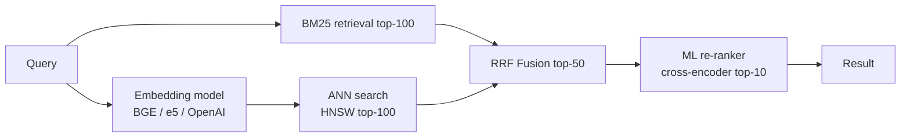
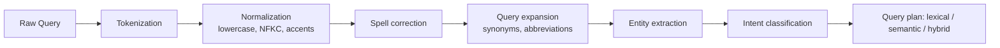

# Вопросы на собеседовании: `Design Search System`

`Search System` (Google Search, поиск по сайту, поиск товаров) — глубокий system design. Здесь важны компромиссы: indexing latency против query latency, ранжирование, устойчивость к опечаткам, масштаб. Обычно на собеседовании разбирают поиск по сайту или по каталогу товаров (а не web-scale краулер Google), но принципы те же.

## Полезные ссылки

- [Elasticsearch: definitive guide](https://www.elastic.co/guide/en/elasticsearch/guide/current/index.html)
- [Lucene internals](https://lucene.apache.org/)
- [How Google search works](https://www.google.com/search/howsearchworks/)
- [System Design Primer](https://github.com/donnemartin/system-design-primer)
- [High Scalability — search](http://highscalability.com/)

## Содержание

- [Полезные ссылки](#полезные-ссылки)
- [See also](#see-also)

**Requirements**
- [Q1. (!) Функциональные и нефункциональные требования к поиску?](#q1--функциональные-и-нефункциональные-требования-к-поиску)
- [Q2. (!) Оценка нагрузки и объёмов (capacity estimation)?](#q2--оценка-нагрузки-и-объёмов-capacity-estimation)

**Indexing**
- [Q3. (!) Что такое inverted index (инвертированный индекс)?](#q3--что-такое-inverted-index-инвертированный-индекс)
- [Q4. (!) Что делают tokenization, normalization, stemming?](#q4--что-делают-tokenization-normalization-stemming)
- [Q5. Чем Elasticsearch отличается от Lucene?](#q5-чем-elasticsearch-отличается-от-lucene)

**Architecture**
- [Q6. (!) Архитектура поиска верхнего уровня?](#q6--архитектура-поиска-верхнего-уровня)
- [Q7. (!) Как устроен конвейер индексации?](#q7--как-устроен-конвейер-индексации)
- [Q8. Что значит near real-time индексация?](#q8-что-значит-near-real-time-индексация)

**Query**
- [Q9. (!) Как проходит запрос: scatter-gather?](#q9--как-проходит-запрос-scatter-gather)
- [Q10. (!) Ранжирование релевантности: TF-IDF и BM25?](#q10--ранжирование-релевантности-tf-idf-и-bm25)
- [Q11. Ранжирование за пределами текста (ML)?](#q11-ранжирование-за-пределами-текста-ml)

**Scalability**
- [Q12. (!) Стратегии шардирования (sharding)?](#q12--стратегии-шардирования-sharding)
- [Q13. Зачем нужна репликация шардов?](#q13-зачем-нужна-репликация-шардов)

**Features**
- [Q14. (!) Как сделать autocomplete (typeahead)?](#q14--как-сделать-autocomplete-typeahead)
- [Q15. (!) Как обеспечить устойчивость к опечаткам (fuzzy match)?](#q15--как-обеспечить-устойчивость-к-опечаткам-fuzzy-match)
- [Q16. Что такое faceted search (поиск по фасетам)?](#q16-что-такое-faceted-search-поиск-по-фасетам)
- [Q17. Что такое semantic search и vector embeddings?](#q17-что-такое-semantic-search-и-vector-embeddings)

**Production**
- [Q18. (!) Аналитика и learning-to-rank?](#q18--аналитика-и-learning-to-rank)
- [Q19. Как кэшировать популярные запросы?](#q19-как-кэшировать-популярные-запросы)
- [Q20. Как перестроить индекс без даунтайма (rebuild / rollover)?](#q20-как-перестроить-индекс-без-даунтайма-rebuild--rollover)

**Современные паттерны 2026**
- [Q21. (!) BM25 против TF-IDF: формулы и насыщение (saturation)?](#q21--bm25-против-tf-idf-формулы-и-насыщение-saturation)
- [Q22. (!) Гибридный поиск: BM25 + dense + слияние RRF?](#q22--гибридный-поиск-bm25--dense--слияние-rrf)
- [Q23. Фасетный поиск: уточнение и агрегация (refinement, aggregation)?](#q23-фасетный-поиск-уточнение-и-агрегация-refinement-aggregation)
- [Q24. (!) Гео-поиск: geohash, S2, R-tree, bbox против distance?](#q24--гео-поиск-geohash-s2-r-tree-bbox-против-distance)
- [Q25. Индексация в реальном времени: Lucene-сегменты и refresh_interval?](#q25-индексация-в-реальном-времени-lucene-сегменты-и-refresh_interval)
- [Q26. Как устроен конвейер понимания запроса (query understanding)?](#q26-как-устроен-конвейер-понимания-запроса-query-understanding)
- [Q27. (!) Multi-tenancy: индекс на тенанта против единого индекса с фильтром?](#q27--multi-tenancy-индекс-на-тенанта-против-единого-индекса-с-фильтром)
- [Q28. Сигналы персонализации: история кликов и re-ranking?](#q28-сигналы-персонализации-история-кликов-и-re-ranking)
- [Q29. (!) Метрики качества: recall@k, MRR, NDCG, p99 latency?](#q29--метрики-качества-recallk-mrr-ndcg-p99-latency)
- [Q30. (!) Антипаттерны и подводные камни поиска?](#q30--антипаттерны-и-подводные-камни-поиска)

## Q1. (!) Функциональные и нефункциональные требования к поиску?

Прежде чем рисовать архитектуру, на собеседовании всегда фиксируют требования — иначе непонятно, какие компромиссы оправданы. Главный конфликт в поиске: **latency индексации против latency запроса** и **качество ранжирования против простоты**.

**Функциональные (поиск по сайту / e-commerce) — что система должна уметь:**
- Полнотекстовый запрос по документам
- Autocomplete / подсказки при наборе
- Устойчивость к опечаткам
- Фильтры (цена, категория, рейтинг)
- Сортировка (релевантность, цена, дата)
- Пагинация
- Подсветка совпавших термов в выдаче

**Нефункциональные — каким система должна быть:**
- **Низкая задержка** — p99 < 200 ms; поиск ощущается мгновенным, иначе пользователь уходит.
- **Высокий QPS** — тысячи запросов/сек, нагрузка нарастает скачками.
- **Свежесть данных** — только что добавленный товар находится за секунды-минуты (для каталога) или мгновенно (для чата).
- **Высокая доступность** — 99.9%+; поиск часто главная точка входа в продукт.
- **Качество релевантности** — баланс precision (мало мусора в выдаче) и recall (ничего не упущено).

**Границы задачи (явно проговорить, чтобы сузить scope):**
- Это НЕ web-краулер Google-масштаба — краулинг и ранжирование триллионов страниц это отдельная тема.
- Считаем, что документы уже даны (товары, статьи) — задача в их индексации и поиске, а не в добыче.

## Q2. (!) Оценка нагрузки и объёмов (capacity estimation)?

Цель прикидки — обосновать число нод, объём диска и RAM, а не угадать точные цифры. Идём от допущений к размеру индекса, затем к пропускной способности.

**Допущения (e-commerce):**
- 100M товаров в индексе
- 1000 запросов/сек в среднем, 10k в пике
- Запись товара ~ 1 KB
- 5 обновлений товаров/сек

**Размер индекса** — считаем по слоям, не только сырые данные:
- Документы: 100M × 1 KB = **100 GB сырых данных**
- Inverted index: ~50% от сырого (термы, postings)
- Плюс поля, stored-векторы, analyzers
- Итого ~150-200 GB на одну копию
- Репликация ×2: ~400 GB; ×3: ~600 GB — реплики кратно множат диск, это главный драйвер стоимости.

**Пропускная способность по запросам** — узкое место это CPU на скоринг:
- 10k QPS в пике
- CPU на запрос ~10 ms на одном шарде → одно ядро успевает ~100 запросов/сек (1000 ms / 10 ms)
- Нода с N ядрами тянет ~100×N RPS — без оговорки про число ядер прикидка не сходится
- 10 шардов работают параллельно: каждое ядро шарда даёт свои ~100 запросов на shard-секунду
- Итого 10k QPS требуют ~100 ядер суммарно; при нодах на ~10 ядер нужно ~10 нод, чтобы переварить 10k QPS

**Память** — критична, потому что поиск по диску на порядок медленнее:
- Горячие индексы должны помещаться в RAM (page cache) → быстрые ответы.
- Ориентир: ~100 GB RAM по кластеру под горячие данные.

**Эмпирическое правило:** диск определяют реплики, число нод — пиковый QPS и CPU на скоринг, а latency — то, влезает ли горячий индекс в RAM.

## Q3. (!) Что такое inverted index (инвертированный индекс)?

Inverted index — это структура «слово → список документов, где оно встречается». Именно она делает поиск быстрым: вместо перебора всех документов мы сразу прыгаем к нужным.

**Forward index** хранит «документ → слова», как обычная БД:
```
doc_1: "the quick brown fox"
doc_2: "quick fox jumps"
```
По нему нельзя быстро ответить «в каких документах есть слово fox» — пришлось бы читать всё.

**Inverted index** переворачивает связь — «слово → документы»:
```
"quick" → [doc_1, doc_2]
"brown" → [doc_1]
"fox" → [doc_1, doc_2]
```

**Зачем это нужно:** запрос «quick fox» сводится к пересечению списков (postings) термов «quick» и «fox» — мгновенно получаем документы-кандидаты, не трогая остальные.

**Более богатая структура** хранит не только факт вхождения, но и частоту с позициями — `term → [(doc_id, frequency, positions)]`:
  ```
  "quick" → [(1, 1, [1]), (2, 1, [0])]
  ```
Частота нужна для скоринга (BM25, Q10), а позиции — для фразовых запросов («точно подряд эти слова»).

**Хранение:**
- На диске postings-списки сжимают (variable-byte encoding, delta encoding) — экономия места и быстрее чтение.
- Горячие термы кэшируются в памяти.

**Реализация:** каноническая — Apache Lucene, на нём построены Elasticsearch и Solr.

## Q4. (!) Что делают tokenization, normalization, stemming?

Текст нельзя индексировать «как есть» — иначе «Running» и «run» окажутся разными термами и запрос не совпадёт. Поэтому при индексации текст прогоняют через analyzer — конвейер, который приводит слова к единой канонической форме. Тот же конвейер обязан применяться и к запросу.

**Конвейер анализа (по шагам):**

**1. Tokenization (разбиение на токены):**
- `"Hello, world!"` → `["Hello", "world"]`
- Правила зависят от языка: для CJK (китайский/японский/корейский) пробелов нет, нужна сегментация по словарю.
- На входе ещё работают character filters — вырезают HTML, делают маппинг символов.

**2. Normalization (нормализация):**
- Приведение к нижнему регистру: `"Hello"` → `"hello"`
- Unicode-нормализация (NFC, NFD) — одинаковые символы в разных кодировках сводятся к одному.
- ASCII fold: `café` → `cafe`
- Удаление пунктуации.

**3. Stop words (стоп-слова):**
- Удаляем частые слова: «the», «a», «is».
- Экономит место в индексе и слабо влияет на релевантность.

**4. Stemming (стемминг):**
- Сведение к корню: `"running", "runs", "ran"` → `"run"`.
- Алгоритмические стеммеры Porter, Snowball — быстро, но грубо.

**5. Lemmatization (лемматизация):**
- «Умный» стемминг на основе словаря: `"better"` → `"good"`.
- Точнее стемминга, но медленнее.

**6. Synonyms (синонимы):**
- `"automobile" → "car"`.
- Можно раскрывать на этапе индексации (раздувает индекс) или на этапе запроса (гибче).

**Пример сквозь весь конвейер:**
- Вход: `"Running the fastest cars"`
- После анализа: `["run", "fast", "car"]`
- Поэтому запрос «car races» совпадёт — оба сведены к одному корню.

**Подводный камень:** один и тот же analyzer ОБЯЗАН применяться при индексации и при запросе. Если они расходятся, термы в индексе не совпадут с токенами запроса — поиск молча перестанет находить документы.

## Q5. Чем Elasticsearch отличается от Lucene?

Коротко: **Lucene — это движок поиска, Elasticsearch — распределённая система вокруг него**. Lucene умеет индексировать и искать на одной машине, но ничего не знает о кластере, сети и масштабировании. Elasticsearch берёт Lucene и оборачивает в распределённую инфраструктуру.

**Lucene** — Java-библиотека: inverted index, скоринг, анализ текста на одной машине. Это «ядро».

**Elasticsearch** добавляет всё, что нужно для продакшена поверх Lucene:
- REST API вместо вызовов Java-классов
- управление кластером
- sharding + репликацию
- работу с JSON-документами
- aggregations (агрегации для фасетов, метрик)

**Solr** — ещё один продукт на базе того же Lucene с близким набором возможностей.

**Сравнение:**

| Аспект | Lucene | Elasticsearch |
|--------|--------|---------------|
| Тип | Библиотека | Распределённый продукт |
| API | Java | REST/JSON |
| Масштаб | Одна машина | Кластер |
| Возможности | Базовый поиск | + aggregations, мониторинг, Kibana |
| Порог входа | Низкоуровневый | Дружелюбный к пользователю |

**Когда что:** для большинства enterprise-задач берут Elasticsearch — кластер, репликация и API доступны из коробки. Голый Lucene имеет смысл, только если поиск встраивается в одно приложение и распределённость не нужна.

**Альтернативы:**
- **OpenSearch** — форк ES от AWS с открытой лицензией (после смены лицензии Elastic).
- **Typesense** — проще, меньше эксплуатационных затрат.
- **Meilisearch** — лёгкий, из коробки устойчив к опечаткам.
- **Algolia** — SaaS: очень быстрый, но дорогой.

## Q6. (!) Архитектура поиска верхнего уровня?

Ключевая идея — **разделить два независимых пути: индексацию (запись) и запросы (чтение)**. У них противоположные требования, поэтому их масштабируют и оптимизируют отдельно.

```
Data sources → [Indexing Pipeline] → [Index Service (Elasticsearch)] ← [Query Service]
                       ↑                                                     ↑
                 [Change Stream/Kafka]                               [API Gateway]
                       ↑                                                     ↑
               [Product DB, CMS]                                       [Clients]
```

**Компоненты:**
- **Indexing Pipeline** — забирает данные из источников, трансформирует и пишет в индекс.
- **Index Service** — кластер Elasticsearch (master + data nodes), хранит inverted index.
- **Query Service** — фасад перед поисковым API: парсит запрос, постобрабатывает выдачу, ходит в кэш.
- **Cache** — Redis для популярных запросов, снимает нагрузку с ES.
- **Analytics** — клики по результатам собираются как обучающие данные для ранжирования (Q18).

**Почему пути разделены:**
- Путь индексации — write-heavy, терпит задержку, удобно гнать батчами.
- Путь запросов — read-heavy и чувствителен к latency.

Смешивать их нельзя: всплеск индексации не должен тормозить пользовательский поиск.

## Q7. (!) Как устроен конвейер индексации?

Задача конвейера — доставить изменение из источника (БД, CMS) в поисковый индекс. Выбор подхода это компромисс «свежесть данных против сложности». Есть три типовых варианта от простого к продвинутому.

**Batch (пакетная) индексация:**
```
Source (DB) → ETL → Transform → Bulk index (ES)
```
- Периодически перечитываем всё (например, ночью).
- Просто реализовать, но высокая задержка свежести — изменения видны только после следующего прогона.

**Real-time CDC (захват изменений из лога БД):**
```
Source DB → WAL → Debezium → Kafka → Consumer → Index (ES)
```
- Debezium читает WAL базы и публикует изменения в Kafka — изменения доходят за секунды.
- Хорошо масштабируется и не нагружает БД поллингом.

**Event-driven (через события приложения):**
```
Application → Kafka topic → Consumer → Index (ES)
```
- Само приложение шлёт событие на каждое изменение.
- Развязано (decoupled), но требует дисциплины: легко забыть отправить событие.

**Стадии конвейера:**
1. Чтение из источника (CDC или событие).
2. Трансформация — обогащение, денормализация, вычисляемые поля.
3. Анализ — токенизация (Q4).
4. Пакетная запись в ES через `_bulk` API.

**Обработка сбоев** (обязательна для надёжного конвейера):
- Retry при временной ошибке.
- Dead-letter queue для «ядовитых» сообщений, которые не обрабатываются.
- Идемпотентность — document ID берём из источника, чтобы повтор не создал дубликат.

**Производительность bulk:**
- ES `_bulk` принимает 500-5000 документов за запрос.
- Размер пачки подбирают замером: больше пачка — выше throughput, но и выше latency на запрос.

## Q8. Что значит near real-time индексация?

«Near real-time» означает, что записанный документ становится доступен для поиска не мгновенно, а через короткую фиксированную задержку — обычно ~1 секунду. Так устроен Elasticsearch, и причина — в том, что Lucene-сегменты неизменяемы и поиск идёт только по уже сброшенным сегментам.

**Как это работает в Elasticsearch:**
- Новый документ сначала попадает в in-memory buffer — для поиска он ещё невидим.
- По `refresh_interval` (по умолчанию 1 s) буфер сбрасывается в новый сегмент, и документ становится виден.
- Компромисс: частый refresh = много мелких сегментов и накладные расходы; редкий = устаревшие данные в выдаче.

**Настройка под нагрузку:**
- Near real-time: `refresh_interval=1s` (значение по умолчанию).
- Массовая загрузка: отключить refresh (`-1`), включить обратно после загрузки — кратно быстрее.
- Спокойный режим: `30s` — снижает накладные расходы индексации, когда свежесть некритична.

**Надёжность (durability):** даже до refresh данные не теряются — каждая запись сразу пишется в translog (write-ahead log), по которому кластер восстанавливается после сбоя.

**Путь видимости:** запись → in-memory buffer → refresh → доступно для поиска. Задержка видимости = refresh interval.

**Когда это важно:**
- Каталог товаров: задержка 5 s допустима, можно расслабить refresh.
- Поиск по чату/сообщениям: near real-time критичен, оставляем 1 s.

## Q9. (!) Как проходит запрос: scatter-gather?

Индекс разбит на шарды, поэтому ни один узел не видит все данные. Координатор рассылает запрос на все шарды (scatter), каждый ищет локально, затем координатор собирает и сливает результаты (gather). Это и есть scatter-gather.

**Распределённый поиск:**
```
Query
  ↓
Coordinator node receives
  ↓
Fan out to ALL shards (scatter)
  ↓
Each shard performs local search, returns top K
  ↓
Coordinator merges + re-ranks globally (gather)
  ↓
Coordinator fetches full docs for top K
  ↓
Return results
```

**Шаги по порядку:**
1. Распарсить запрос.
2. Разослать на все шарды параллельно (scatter).
3. Каждый шард возвращает `(doc_id, score)` для своего локального top-K — это фаза query (без тел документов).
4. Координатор сливает локальные top-K в глобальный top-K.
5. Дотягивает тела документов по ID — фаза fetch.
6. Форматирует ответ.

**Откуда latency:** p99 = самый медленный шард + merge + fetch. Запрос не быстрее самого медленного шарда — scatter-gather усиливает хвост распределения (один тормозящий шард тормозит весь ответ).

**Как бороться с хвостом:**
- **adaptive_replica_selection** — слать на самую быструю реплику по измеренной задержке.
- **search_timeout** — обрывать медленные шарды, возвращая частичный результат.
- **Pre-filtering** — сузить набор кандидатов по индексу ещё до скоринга, чтобы шардам было меньше работы.

## Q10. (!) Ранжирование релевантности: TF-IDF и BM25?

Скоринг отвечает на вопрос «насколько документ подходит запросу» и определяет порядок выдачи. Базовый принцип у обоих алгоритмов один: важны частота терма в документе и редкость терма в корпусе. BM25 — это улучшенная версия TF-IDF и стандарт по умолчанию.

**TF-IDF** — две идеи:
- TF (term frequency): чем чаще терм в документе, тем релевантнее.
- IDF (inverse document frequency): чем реже терм в корпусе, тем он информативнее.
- Итоговый score = TF × IDF.

**BM25** (по умолчанию в Lucene/ES) добавляет к TF-IDF два важных улучшения:
- Term saturation — убывающая отдача от роста TF (нельзя «накрутить» score повторами).
- Нормализацию по длине документа — длинные тексты не выигрывают просто за счёт объёма.

**Формула BM25:**
```
score = IDF(term) × (TF × (k+1)) / (TF + k × (1 - b + b × |D|/avgdl))
```
- `k = 1.2` — параметр saturation (как быстро насыщается вклад TF).
- `b = 0.75` — сила нормализации по длине.
- `|D|` — длина документа; `avgdl` — средняя длина по корпусу.

**Почему BM25 лучше TF-IDF:** в TF-IDF документ со 100 вхождениями «quick» получает в 100× больший score, чем с одним — keyword stuffing работает. В BM25 за счёт saturation 10 вхождений ≈ 100, отдача убывает — это ближе к реальному восприятию релевантности.

**Практический score в продакшене редко равен голому BM25** — поверх накручивают сигналы:
- База — BM25.
- Field boosts: вес title ×3, body ×1 — совпадение в заголовке важнее.
- Freshness decay — затухание по свежести, новое выше старого.
- Буст по популярности (продажи, клики).

## Q11. Ранжирование за пределами текста (ML)?

Текстовое совпадение — лишь один сигнал. Реальная выдача должна учитывать свежесть, популярность и персонализацию, поэтому продвинутые системы переходят от формулы к ML-ранжированию.

**Сигналы, которые влияют на порядок:**
- Совпадение query-doc (BM25, близость эмбеддингов).
- Свежесть (новое выше старого).
- Популярность (click-through, продажи).
- Персонализация (прошлые поиски, локация пользователя).
- Качество (отзывы, редакторская оценка).

**Подходы — от простого к сложному:**

**1. Формула вручную:**
- `score = BM25 + 0.5×freshness + 0.3×popularity`
- Просто и прозрачно, но веса подбираются на глаз и плохо обобщаются.

**2. Learning-to-Rank (LTR):**
- ML-модель скорит документ по фичам пользователя, запроса и документа.
- Обучается на кликах и вовлечённости.
- Модели: LambdaMART (gradient boosting), DNN.

**3. Двухстадийный отбор (стандарт в продакшене):**
- Стадия 1 — дешёвый retrieval: BM25 берёт top-1000 кандидатов.
- Стадия 2 — дорогой re-rank: тяжёлая ML-модель переупорядочивает только top-100.
- Так дорогую модель применяют к малому числу документов, а не ко всему индексу.

**Как это в Elasticsearch:** плагин LTR — feature extractors описывают сигналы, а внешняя модель (например, XGBoost) их скорит.

**Проверка эффекта — A/B-тест:** новый ранкер против baseline, метрика бизнесовая — CTR, конверсия, выручка, а не абстрактный score.

## Q12. (!) Стратегии шардирования (sharding)?

**Shard** — это часть индекса, живущая на одной ноде. Шардирование позволяет индексу не помещаться целиком на один сервер и распараллеливает поиск. Главный вопрос — сколько шардов и по какому ключу.

**Сколько шардов:**
- Больше шардов = больше параллелизм, но и накладные расходы на каждый.
- Эмпирическое правило: 20-50 GB на шард — планируйте от объёма данных.
- Пример: 200 GB данных при 50 GB на шард → 4 шарда.
- Важно: число primary-шардов задаётся при создании индекса и потом не меняется — ошибка здесь дорогая.

**Режимы шардирования:**

**Per-index (по умолчанию):**
- Документы распределяются по шардам хешем от doc_id.
- Равномерная нагрузка, но любой запрос идёт scatter-gather по всем шардам.

**Routing (кастомный ключ шарда):**
- Задаём параметр `routing` — например, по user_id.
- Все данные одного пользователя оказываются на одном шарде → запрос с известным routing бьёт точечно, без scatter — быстрее.
- Минус: «горячий» пользователь делает горячим один шард (перекос нагрузки).

**Time-based (rollover по времени):**
- Отдельные индексы по периодам: `logs-2024-01`, `logs-2024-02`.
- Запрос с фильтром по времени ищет только в нужных индексах.
- Старые индексы закрывают или уносят в cold storage — дёшево хранить историю.

**Cross-cluster search:**
- Несколько кластеров опрашиваются как один — для гео-распределённых данных.

## Q13. Зачем нужна репликация шардов?

Реплика — это полная копия primary-шарда на другой ноде. Репликация даёт сразу две вещи: отказоустойчивость (потеряли ноду — не потеряли данные) и масштабирование чтения (запросы обслуживают и primary, и реплики).

**Конфигурация:** primary-шард + N реплик, причём реплики разносятся по разным нодам — иначе падение одной ноды унесёт и primary, и его копию.

**Что даёт репликация:**
- **Отказоустойчивость:** упала нода с primary — одна из реплик повышается до primary, данные доступны.
- **Пропускная способность чтения:** запросы раскидываются по primary и репликам (round-robin), читающая нагрузка делится.
- **Рестарты без даунтайма:** rolling restart нод по очереди — кластер всё время отвечает.

**Сколько реплик:**
- 1 реплика (2 копии) — базовая отказоустойчивость.
- 2 реплики (3 копии) — безопаснее, поддерживает кворум.

**Поток записи:** запись идёт в primary, тот синхронно реплицирует на реплики, и только после подтверждения всеми in-sync копиями отдаётся ACK (поведение по умолчанию) — поэтому реплики не отстают.

**Компромисс:** `index.number_of_replicas: 1-2` обычно. Больше реплик = лучше чтение и надёжность, но дороже по диску и медленнее запись (каждую запись надо разослать на больше копий).

## Q14. (!) Как сделать autocomplete (typeahead)?

Autocomplete предлагает завершения запроса прямо во время набора. Главное требование — он должен реагировать на каждое нажатие клавиши, поэтому работает на отдельной, заранее подготовленной структуре, а не на основном поисковом индексе.

**Что делает задачу сложной:**
- Сверхнизкая задержка (< 50 ms) — реакция на каждую букву.
- Релевантность — популярные подсказки первыми.
- Устойчивость к опечаткам.

**Варианты реализации:**

**1. Префиксный индекс (FST):**
- Elasticsearch `completion` suggester.
- Под капотом структура FST (Finite State Transducer) — компактный автомат для префиксов.
- Живёт в памяти, отвечает очень быстро, поддерживает fuzzy matching.

**2. Выделенный кэш на Redis sorted sets:**
- Каждый префикс → sorted set термов со скорами популярности.
- `ZRANGE prefix:"app" 0 5 WITHSCORES` — топ-5 завершений по популярности.
- Скоры считаются заранее по расписанию.

**3. Trie (префиксное дерево):**
- Классическая структура для подсказок, in-memory на каждой ноде.
- Минус: распределённый trie сложно поддерживать на кластере.

**Чем ранжировать подсказки:**
- Популярность (частота поиска).
- Персонализация (история пользователя).
- Контекст (текущая страница, локация).

**Обновление в реальном времени:** скоры пересчитывают по query logs и периодически перестраивают структуру — так свежие тренды всплывают в подсказках.

## Q15. (!) Как обеспечить устойчивость к опечаткам (fuzzy match)?

Цель — чтобы «appel» нашло «apple». Поскольку люди ошибаются при наборе, поиск должен сопоставлять близкие, а не только точные термы. Подходы различаются тем, что считать «близким».

**1. Edit distance (Levenshtein):**
- Расстояние = число правок символов (вставка/удаление/замена).
- Совпадают термы с расстоянием ≤ N.
- В Elasticsearch — запрос `fuzzy` с `fuzziness: 2`.

**2. Damerau-Levenshtein:**
- Добавляет транспозицию (перестановку соседних символов).
- Лучше ловит типичные опечатки вроде «teh» → «the».

**3. N-gram indexing:**
- Индексируем подстроки фиксированной длины (3-граммы «app», «ppl», «ple» для «apple»).
- Частичный запрос «appl» совпадёт по общим n-граммам.
- Минус: заметно больше стоимость хранения.

**4. Phonetic encoding (фонетическое кодирование):**
- Soundex, Metaphone сводят похоже звучащие слова к одному коду: «Smith» и «Smyth» → один код.
- Особенно полезно для имён собственных.

**5. ML-исправление опечаток:**
- Учим на query logs — где пользователь перенабрал запрос после неудачи.
- Показываем подсказку «Возможно, вы имели в виду …».

**В Elasticsearch это:** запрос `fuzzy` для edit-distance, analyzer `ngram` для частичного совпадения, analyzer `phonetic` для фонетики.

**Компромисс:** чем выше толерантность, тем выше recall, но ниже precision — в выдачу проникает мусор. Уровень fuzziness подбирают под конкретный сценарий.

## Q16. Что такое faceted search (поиск по фасетам)?

Фасеты — это разбивки результатов по категориям (бренд, диапазон цены, рейтинг) с подсчётом, сколько товаров попадает в каждую. Они дают пользователю сузить выдачу кликами по фильтрам, не переформулируя запрос.

**Сценарий применения:** e-commerce «кроссовки Nike до $100, рейтинг 4+».

Под капотом фасеты считаются через aggregations Elasticsearch — один запрос возвращает и совпадения, и счётчики по каждому фасету.

**Реализация (Elasticsearch aggregations):**
```json
{
  "query": { "match": { "name": "shoes" } },
  "aggs": {
    "brands": { "terms": { "field": "brand" } },
    "price_ranges": {
      "range": {
        "field": "price",
        "ranges": [
          { "to": 50 }, { "from": 50, "to": 100 }, { "from": 100 }
        ]
      }
    }
  }
}
```

**В ответе:** топ совпадений плюс counts по каждому фасету — за один запрос.

**На UI:** фасеты показывают как фильтры в боковой панели; клик по фильтру сужает поиск.

**Производительность:**
- Aggregations кэшируются (filter cache) — повторные запросы дешевле.
- Скорость зависит от кардинальности (числа уникальных значений): фасет по бренду быстр, по user_id — нет.

## Q17. Что такое semantic search и vector embeddings?

Лексический поиск (BM25) ищет по совпадению слов, поэтому упускает синонимы и перефразировки: запрос «running shoes» не найдёт документ «jogging footwear», хотя смысл тот же. Semantic search решает это, сопоставляя смысл, а не буквы.

**Как работает semantic search:**
- Запрос и документы переводят в векторы (dense-эмбеддинги) — числовое представление смысла.
- Близкий смысл = близкие векторы в пространстве.
- Поиск превращается в задачу nearest-neighbor — найти ближайшие векторы к вектору запроса.

**Embedding-модели:** BERT, sentence-transformers, OpenAI text-embedding-3 (через API); часто дообучают под домен.

**Где хранить векторы (vector DB):**
- Elasticsearch (`dense_vector` + kNN, начиная с 8.x).
- Pinecone, Weaviate, Milvus.
- pgvector (расширение Postgres) — для небольших объёмов.

**Hybrid search — объединить лексику и семантику:**
- BM25 + vector similarity.
- Простое слияние скоров: `score = α × bm25 + (1-α) × vector_similarity`.
- Берём лучшее из двух миров: точность лексики (precision) + охват по смыслу (recall). Подробнее в Q22.

**RAG — частный случай semantic search для LLM:**
- Эмбеддим базу знаний.
- Запрос → достаём похожие чанки → передаём в LLM как контекст.
- См. [RAG](../ai-ml/rag-interview.md).

**Подводные камни:**
- Дрейф эмбеддингов: обновили модель — нужно переиндексировать всю коллекцию.
- Хранение высокоразмерных векторов дорого по памяти.
- ANN-индекс (приближённый поиск) ускоряет ценой небольшой потери точности — это осознанный компромисс: жертвуем долей recall ради скорости.

## Q18. (!) Аналитика и learning-to-rank?

Поведение пользователей — главный источник сигналов для улучшения ранжирования. Идея LTR: вместо ручной настройки весов учим модель прямо на кликах и конверсиях, замыкая цикл «выдача → клики → новая модель».

**Query logs:** каждый поиск и клик пишутся в лог событий — из них строят обучающие данные для ранжирования.

**Метрики качества:**
- **CTR (click-through rate):** клики / показы.
- **NDCG (Normalized Discounted Cumulative Gain):** релевантность с учётом позиции в выдаче.
- **MRR (Mean Reciprocal Rank):** позиция первого релевантного результата.
- **Conversion rate:** доля поисков, дошедших до покупки.

**Цикл обратной связи LTR:**
1. Собрать сигналы: запрос, показанные результаты, клик, dwell time, конверсию.
2. Разметить для обучения: кликнули = релевантно, проигнорировали = менее релевантно.
3. Обучить модель: XGBoost / нейросеть.
4. Выкатить через A/B-тест.
5. Замерить эффект и повторить итерацию.

**Контрфактическая оценка** позволяет прикинуть «если бы ранжировали иначе, CTR был бы X» без полноценного A/B — через inverse propensity scoring. Полезно, когда гонять A/B на каждую гипотезу дорого.

**Персонализация:** фичи пользователя (история, локация) подаются в ранкер как дополнительный вход — но с оглядкой на приватность.

## Q19. Как кэшировать популярные запросы?

Распределение запросов сильно перекошено: обычно **20% запросов дают 80% объёма**. Поэтому кэш горячих запросов снимает большую часть нагрузки с ES малыми средствами. Кэшируют слоями — от самого дешёвого к самому свежему.

**Слои кэша:**

**CDN / HTTP-кэш** — самый дешёвый, дальше всего от ES:
- Публичные запросы (без user-specific данных) кэшируются прямо на CDN.
- `Cache-Control: public, max-age=60`.

**Redis query cache** — на стороне приложения:
- Ключ: hash(query + filters + sort).
- Значение: ID результатов + метаданные.
- TTL 60 s — 5 min.

**Встроенный в Elasticsearch** — ближе всего к данным:
- Request cache — кэширует результат по шарду для структурированных запросов.
- Query cache — кэширует результаты фильтров (bit sets).
- Включены по умолчанию.

**Инвалидация:**
- Для большинства слоёв — по TTL.
- Event-driven для конкретных ключей: товар закончился → точечно сбросить его ключ.

**За чем следить:**
- Hit ratio — насколько кэш реально работает.
- Риск устаревания — допустимое отставание данных против требования к свежести (Q1). Кэш всегда торгует свежесть на скорость.

## Q20. Как перестроить индекс без даунтайма (rebuild / rollover)?

Схема индекса частично неизменяема — нельзя на лету сменить analyzer или тип поля. Поэтому при изменениях индекс перестраивают заново, а переключение делают через alias, чтобы пользователи ничего не заметили.

**Когда нужна перестройка:**
- Изменение схемы — новый analyzer, новые поля, смена типа.
- Bulk-бэкфилл после миграции данных.
- Обновление языкового analyzer.

**Перестройка без даунтайма (через alias):**
1. Построить новый индекс рядом со старым.
2. Заполнить его — через `reindex` API или заново из источника.
3. Атомарно переключить alias: `old` → `new`.
4. Запросы бесшовно начинают идти в новый индекс.
5. Удалить старый.

Фокус в том, что приложение всегда обращается к alias, а не к конкретному индексу — переключение alias мгновенно и атомарно.

**Паттерн с alias:**
```
alias "products" → index "products-v1"
# rebuild:
alias "products" → index "products-v2"
```

**Rollover (по времени) — для постоянно растущих данных вроде логов:**
- Отдельные индексы по дням/месяцам.
- Alias всегда указывает на текущий «пишущий» индекс.
- Авто-rollover при достижении заданного размера или возраста:
```
POST products/_rollover
```

**Чего это стоит:**
- На время перестройки хранилище занято вдвое (старый + новый индекс).
- На большом датасете reindex занимает часы.
- Планируйте maintenance window и запас по диску.

## Q21. (!) BM25 против TF-IDF: формулы и насыщение (saturation)?

Это углублённая версия Q10 с формулами. Главная разница в одном слове — **saturation**: TF-IDF верит частоте линейно, BM25 — с убывающей отдачей. Из этого вытекает, почему BM25 устойчив к накрутке.

**TF-IDF (классический):**
```
score(q, d) = Σ_t∈q TF(t, d) × IDF(t)
TF(t, d) = freq(t, d)
IDF(t) = log(N / df(t))
```
- Простой; score растёт линейно по `TF` — 100 повторений дают 100× score.
- Минус: keyword stuffing работает — документ со 100 повторами `apple` ранжируется как 100×, хотя релевантнее он не стал.

**BM25 (по умолчанию в Elasticsearch 5+):**
```
score(q, d) = Σ_t∈q IDF(t) × (TF × (k+1)) / (TF + k × (1 - b + b × |D|/avgdl))
```
Параметры и их смысл:
- `k = 1.2` — насыщение по частоте: после 1-2 встреч терма прирост score резко замедляется, накрутить нельзя.
- `b = 0.75` — нормализация по длине: длинные документы получают penalty (иначе они выигрывали бы просто за счёт большего числа вхождений).
- `|D|` — длина документа, `avgdl` — средняя длина по корпусу.

**Когда что использовать:**

| Сценарий | Выбор |
|---|---|
| Дефолтный поиск по сайту | BM25 |
| Legacy Lucene/Solr 4.x | TF-IDF |
| Короткие документы (заголовки, имена) | BM25 с `b=0.0` (отключить length penalty) |
| Длинные документы (статьи) | BM25 по умолчанию |
| Кастомный домен (legal, medical) | BM25 с подобранными `k1`, `b` через grid search |

**Альтернативы:**
- **BM25F** — multi-field BM25 (title weight ×3, body ×1). Используется в Lucene через `MultiMatchQuery` boost.
- **BM25+** — добавляет lower-bound на TF (защита от очень коротких документов с TF=0).
- **DFR (Divergence From Randomness)** — другой probabilistic фреймворк, экспериментальный.

**Tuning:**
- `_explain` API в ES показывает breakdown score → видно вклад IDF, TF saturation, length norm.
- A/B testing с реальными query logs.

## Q22. (!) Гибридный поиск: BM25 + dense + слияние RRF?

Современный стандарт (Elasticsearch 8+, Vespa, Qdrant, Pinecone hybrid) — объединять лексический поиск (BM25) и семантический (dense-эмбеддинги). Поодиночке каждый проваливается там, где силён другой, поэтому их комбинируют ради одновременно высоких recall и precision.

**Зачем гибрид — подходы дополняют друг друга:**

| Подход | Сильные стороны | Слабые |
|---|---|---|
| BM25 | Точное совпадение по ключевым словам, коды товаров, имена | Не понимает синонимов, парафраз |
| Dense (embeddings) | Семантическая близость, парафраз, многоязычность | Слабее на rare terms, OOV, точных ID |
| Hybrid | Лучшее из обоих | Сложнее tuning + 2× стоимость индексации |

**Простое объединение (взвешенная сумма):**
```
score_hybrid = α × normalize(score_bm25) + (1-α) × cosine_similarity(q_vec, d_vec)
```
Проблема: scores из разных шкал (BM25 даёт 0..∞, cosine — -1..1), и нормализация между ними хрупкая — один выброс ломает баланс.

**Reciprocal Rank Fusion (RRF) — рекомендуемый способ:**
```
RRF_score(d) = Σ_query 1 / (k + rank(d, query))
```
где `k = 60` (эмпирическая константа), `rank` — позиция документа в каждом списке (BM25 и dense). Ключевая идея: RRF складывает не сами scores, а **ранги**, поэтому несовместимость шкал перестаёт быть проблемой.

**Чем хорош RRF:**
- Не требует нормализации scores — работает с рангами.
- Устойчив к выбросам (outliers).
- В Elasticsearch управляется параметром `rank_constant=60`.

**Архитектура:**


**Хранение векторов:**
- `Elasticsearch dense_vector` с HNSW-индексом (начиная с 8.0).
- `Qdrant`, `Pinecone`, `Weaviate`, `Vespa`.
- `pgvector` для Postgres (при < 10M векторов).

**Embedding-модели 2026:**
- `text-embedding-3-small` (OpenAI, 1536 dim, $0.00002 за 1K токенов).
- `BGE-M3`, `e5-mistral-7b` (open-source, многоязычные).
- `Cohere embed-v3` (высокое качество, поддерживает int8-квантизацию).

**Граничные случаи:**
- Cold start новой модели — придётся переиндексировать всю коллекцию; временно двойной объём хранилища.
- Длинные документы — режут на чанки по 256-512 токенов и хранят с `parent_id`, чтобы потом собрать обратно.
- Многоязычность — берут модели вроде BGE-M3 / multilingual-e5, обученные на многих языках.

## Q23. Фасетный поиск: уточнение и агрегация (refinement, aggregation)?

Это практическое продолжение Q16. Цель — показать пользователю фильтры со счётчиками «найдено N товаров»: brand: Nike (45), Adidas (30), category: Shoes (60), Apparel (15). Тонкость в том, чтобы счётчики оставались осмысленными после выбора фильтра.

**Elasticsearch aggregations:**
```json
{
  "query": { "match": { "name": "running" } },
  "aggs": {
    "brands": { "terms": { "field": "brand.keyword", "size": 10 } },
    "price_ranges": {
      "range": {
        "field": "price",
        "ranges": [{ "to": 50 }, { "from": 50, "to": 100 }, { "from": 100 }]
      }
    },
    "rating_avg": { "avg": { "field": "rating" } }
  }
}
```

**Поток уточнения (refinement):**
- Пользователь кликает `brand: Nike` → в URL появляется `?brand=Nike`.
- Backend добавляет `filter` в bool query.
- Счётчики пересчитываются на новом результате (или через `post_filter` для facet-UI).

**Post-filter — ключевой паттерн фасетов:**
- `query` влияет сразу на scoring, фильтрацию и aggregations.
- `post_filter` применяется ПОСЛЕ aggregations → счётчики остаются видны для всех брендов, даже когда один уже выбран.
- Без него, выбрав Nike, пользователь увидел бы у остальных брендов ноль и не смог бы переключиться. Поэтому стандарт e-commerce: смысловой запрос идёт в `query`, выбранный фасет — в `post_filter`.

**Проблема кардинальности:**
- `terms`-агрегация по полю с миллионами значений (например, `user_id`) → OOM.
- Решения: `cardinality` (приближённый подсчёт через HyperLogLog), `composite` aggregation (с пагинацией).

**Кэш агрегаций:** ES `request_cache` кэширует aggregations при `size=0`; инвалидация по TTL при refresh.

**Примеры из продакшена:**
- Amazon: фасеты бренд / цена / продавец / рейтинг.
- Airbnb: локация / цена / удобства.
- LinkedIn: отрасль / уровень / локация.

## Q24. (!) Гео-поиск: geohash, S2, R-tree, bbox против distance?

Гео-поиск отвечает на запросы «что рядом со мной». Суть в том, чтобы превратить двумерные координаты в нечто, по чему можно искать индексом — обычно в строку или число с сохранением пространственной близости. Разные кодировки по-разному решают этот компромисс.

**Сценарии применения:** Uber «найти водителей в радиусе 2 км», Yelp «рестораны рядом», Airbnb «объявления в Берлине».

**Подходы:**

**1. Geohash (по умолчанию в Elasticsearch):**
- Координата `(lat, lon)` кодируется в base32-строку `u4pruydqqvj`.
- Общий префикс = общий регион (`u4` ≈ Германия + Польша) — близкие точки имеют близкие префиксы.
- Точность задаётся длиной: 6 символов ≈ 1.2 km, 8 символов ≈ 40 m.
- Поиск bbox сводится к скану по префиксу.
- Плюс: просто, работает на обычном inverted index.
- Минус: на границах квадрантов соседние клетки имеют сильно разные префиксы — близкие точки выглядят далёкими.

**2. S2 (Google):**
- Делит землю на иерархические клетки разного уровня (Hilbert curve).
- Cell ID = 64-битное целое.
- Соседи всегда близки в пространстве ID → лучше locality.
- Иерархично: уровни 0 (всё полушарие) … 30 (~1 cm²).
- Библиотека Google: используется в Google Maps и BigQuery GIS.
- Не путать с H3: Uber разработал собственную гексагональную систему, она НЕ построена на S2 (см. пункт 4).

**3. R-tree:**
- Дерево ограничивающих прямоугольников.
- Используется в PostGIS, MongoDB 2dsphere.
- Хорошо для bbox-запросов, но дороже балансировать при записях.

**4. H3 (Uber):**
- Hexagonal hierarchy (равные соседи, все на одинаковом distance).
- Используется для surge pricing, ETA.
- См. `design-uber-interview Q5`.

**Bounding box против distance — два способа задать «рядом»:**

```
# Bounding box (быстро, грубо)
GET /restaurants/_search
{ "query": { "geo_bounding_box": { "loc": { "top_left": {...}, "bottom_right": {...} } } } }

# Distance (точно, медленнее)
GET /restaurants/_search
{ "query": { "geo_distance": { "distance": "5km", "loc": { "lat": ..., "lon": ... } } } }
```

**Компромисс bbox против distance:**
- Bbox (прямоугольник): ~10× быстрее, но захватывает «углы» — фактический радиус до ~30% больше.
- Distance (круг): точно, но дороже — Haversine считается для каждого кандидата.
- Гибрид на практике: bbox для грубого отбора кандидатов → distance для точной фильтрации top-N.

**Граничные случаи:**
- Антимеридиан (линия перемены дат, ±180°): bbox через неё ломается; S2/H3 — нет.
- Полюса: широта обрезается к ±85.05 (Web Mercator); S2 покрывает полюса корректно.

## Q25. Индексация в реальном времени: Lucene-сегменты и refresh_interval?

Это «как устроено внутри» к Q8. Ключ к пониманию — **Lucene-сегменты неизменяемы**: документ нельзя изменить на месте, можно только записать новый сегмент. Из этой неизменяемости вытекают и refresh-задержка, и фоновые merge.

**Жизненный цикл сегментов:**
- Документы сначала пишутся в **in-memory buffer**.
- `refresh` (по умолчанию раз в 1 s) сбрасывает буфер в новый неизменяемый Lucene-сегмент → документы становятся доступны для поиска.
- Каждый поиск проходит по всем сегментам и сливает результаты.
- Фоновый `merge` объединяет мелкие сегменты в крупные — иначе их число растёт и поиск замедляется.

**Refresh interval tuning:**

| Сценарий | Настройка | Эффект |
|---|---|---|
| Near real-time UI | `refresh_interval: 1s` (default) | Свежие данные сразу видны |
| Bulk loading | `refresh_interval: -1` (отключено) | 3-5× быстрее indexing |
| Logging (mass write) | `refresh_interval: 30s` | Меньше segments, меньше overhead |
| Analytics-only | `refresh_interval: 60s` | Максимальная throughput |

**Надёжность через translog:**
- Каждая запись попадает в WAL (translog) **до** появления в сегменте.
- Сегмент виден только после refresh, но потеря данных невозможна — translog переживает сбой.
- `index.translog.durability: request` (sync на каждую запись — медленно, но надёжно) против `async` (по умолчанию раз в 5 s — чуть быстрее, но окно потери до 5 s).

**Политика слияния (merge):**
- Tiered merge объединяет сегменты схожего размера.
- Перед уходом индекса в архив делают force merge в один сегмент: `POST index/_forcemerge?max_num_segments=1` — поиск по такому индексу быстрее.

**Главный компромисс для собеседования:** меньше refresh interval → свежее данные, но больше накладных расходов.

**Рекомендация для bulk-загрузки:** на время загрузки отключить refresh и реплики → загрузить → вернуть обратно. Так избегают миллионов мелких сегментов.

**Примеры из продакшена:**
- Логи (Elastic Stack): refresh_interval 30 s + force merge для старых индексов.
- Поиск по товарам: достаточно refresh 5 s.
- Поиск по чату: 1 s (по умолчанию).

## Q26. Как устроен конвейер понимания запроса (query understanding)?

Прежде чем искать, запрос нужно «понять»: исправить опечатки, расширить синонимами, выделить сущности и намерение. Это отдельный конвейер перед retrieval — от того, насколько хорошо разобран запрос, сильно зависит качество выдачи.



**Стадии конвейера:**

1. **Tokenization** — разбиение по пробелам и пунктуации; для CJK — посимвольно.
2. **Normalization** — нижний регистр, Unicode NFKC, ASCII fold (`café → cafe`).
3. **Spell correction** — `appel → apple` через edit distance / фонетику / ML-исправление (Q15).
4. **Query expansion (расширение запроса)** — добавляем варианты, чтобы не упустить совпадения:
   - Синонимы: `car → automobile, vehicle` (через словарь).
   - Аббревиатуры: `NYC → New York City`.
   - Stemming: `running → run` (Q4).
5. **Entity extraction (выделение сущностей, NER):**
   - `Nike running shoes` → сущности `Nike (brand)`, `running shoes (category)`.
   - Совпадения по извлечённым сущностям бустятся.
6. **Intent classification (определение намерения):**
   - Navigational (`facebook.com`), informational (`how to bake bread`), transactional (`buy iphone`), local (`pizza near me`).
   - От намерения зависит маршрутизация: navigational → точное совпадение, informational → semantic search.

**Инструменты:**
- ES token filters (synonym, stop, stemmer).
- NER-модели spaCy / Hugging Face.
- Внутренние ML-классификаторы намерения.

**Бюджет задержки** (важно: всё это укладывается в общий p99 поиска):
- Tokenization + normalization: < 1 ms.
- Spell correction: 5-20 ms (если ML).
- Entity extraction: 20-50 ms (ML-инференс).
- Итого до retrieval: < 100 ms.

**Граничные случаи:**
- Многоязычный запрос — отдельные analyzers на каждый язык.
- Смешанные алфавиты (`айфон 15 pro` — RU + EN) — общий analyzer с NFKC и определением скрипта.

## Q27. (!) Multi-tenancy: индекс на тенанта против единого индекса с фильтром?

Когда несколько клиентов / магазинов / спейсов делят одну поисковую инфраструктуру (Shopify, Algolia, Slack), встаёт вопрос изоляции. Это классический компромисс между изоляцией и накладными расходами — три варианта от максимальной изоляции к максимальной экономии.

**Вариант 1. Индекс на каждого тенанта.**
- `products_tenant_42`, `products_tenant_99`.
- Плюс: полная изоляция, можно настроить analyzer под язык тенанта, удаление тенанта = drop index.
- Минус: тысячи мелких индексов дают overhead метаданных и давление на JVM heap — каждый индекс держит состояние.
- Рекомендация ES: < 1000 индексов на кластер.

**Вариант 2. Единый индекс + фильтр по tenant_id.**
- Все документы в одном `products` с полем `tenant_id`.
- Каждый запрос: `bool { must: query, filter: { term: tenant_id: 42 } }`.
- Плюс: минимум overhead, легко масштабировать.
- Минус: scatter-gather по всем шардам даже ради одного тенанта.

**Вариант 3 (гибрид). Единый индекс + routing по тенанту.**
- Единый индекс с параметром `routing=tenant_id`.
- Все документы одного тенанта ложатся на один шард → поиск бьёт точечно, без scatter.
- Плюс: низкий overhead и быстрый retrieval на тенанта.
- Минус: крупный тенант делает свой шард горячим (перекос нагрузки).

**Когда что:**

| Tenants | Подход |
|---|---|
| < 100 | Индекс на каждый tenant |
| 100-10 000 | Единый индекс + routing |
| 10 000+ | Единый индекс + filter (если каждый tenant маленький) |
| Очень разные размеры | Индекс на крупные tenant + общий индекс для мелких (`tiered`) |

**Как делают на практике:**
- Shopify Search: routing по `shop_id` (крупные магазины + tiered-индекс для крошечных).
- Algolia: индекс на каждое приложение — каждый клиент получает свой.
- Slack search: индекс на каждый workspace, большие workspace выносят на выделенный кластер.

**Безопасность:**
- Фильтр по тенанту обязателен ВСЕГДА, даже при routing — это страховка на случай бага в логике routing, чтобы данные одного тенанта не утекли другому.
- API-ключ на тенанта + проверка в middleware.

## Q28. Сигналы персонализации: история кликов и re-ranking?

Базовый поиск (BM25 / hybrid) одинаков для всех. Персонализация добавляет сигналы, специфичные для конкретного пользователя, и подмешивает их на этапе переранжирования. Важно делать это так, чтобы не ломать кэшируемость основного поиска.

**Какие сигналы используют:**
- **История кликов** — пользователь часто заходит в категорию X → бустим X в выдаче.
- **История покупок** — для e-commerce буст связанных товаров.
- **История просмотров** — недавно просмотренные товары.
- **Локация** — смещение в сторону локальных ресторанов и сервисов.
- **Язык** — буст совпадений на языке пользователя.
- **Время суток / день недели** — обед против ужина для доставки еды.

**Реализация — двухстадийная, и это не случайно:**

**Стадия 1. Retrieval (без персонализации):**
- BM25 / hybrid отбирает top-100 кандидатов.
- Здесь user-сигналы не используются специально — выдача одинакова для всех, поэтому хорошо кэшируется.

**Стадия 2. Re-ranking (персонализированный):**
- ML-модель: вход = (фичи запроса, фичи документа, фичи пользователя).
- Выход — score, по которому переупорядочиваем те же top-100.
- Задержка: 10-30 ms на CPU, < 5 ms на GPU при батчинге.

Такое разделение позволяет держать дорогую персонализацию только на маленьком top-100, а тяжёлый retrieval — кэшируемым и общим.

**Фичи пользователя:**
- Embedding-вектор из истории пользователя (последние N кликов / покупок).
- Предпочтения по категориям (one-hot).
- Демография (если есть).

**Модель:**
- LambdaMART (GBM) — стандарт, легко интерпретируется.
- Two-tower neural (query-tower + user-tower) — Amazon, LinkedIn.
- Transformer cross-encoder — лучшее качество, дороже.

**Cold start:**
- Новый пользователь без истории → fallback на глобальную популярность.
- Откладываем персонализацию до накопления первых 5-10 кликов.

**Приватность:**
- Фичи пользователя хэшируются / агрегируются.
- GDPR right-to-erasure → удалить историю кликов по запросу.

**A/B-тестирование:**
- Метрика: CTR + конверсия + качество сессии.
- Сравнение `personalized` против `impersonal baseline`.

## Q29. (!) Метрики качества: recall@k, MRR, NDCG, p99 latency?

«Хороший» поиск надо уметь измерять. Метрики делятся на офлайновые (по размеченным данным — precision, recall, MRR, NDCG), продуктовые (по кликам) и инженерные (latency). Хорошие метрики ловят не «нашли ли вообще», а «насколько высоко стоит релевантное».

**Метрики качества выдачи:**

**Precision@k:**
- Доля релевантных документов среди top-k выданных результатов — точность выдачи.
- `precision@10 = 7/10 = 0.7` — из 10 показанных 7 релевантны.
- Важна там, где смотрят только на верх выдачи.

**Recall@k:**
- Доля найденных в top-k от ВСЕХ релевантных документов корпуса — полнота.
- Пример: в корпусе 20 релевантных, в top-10 попало 7 → `recall@10 = 7/20 = 0.35`.
- Сложнее измерить — нужна полная разметка корпуса.

**MRR (Mean Reciprocal Rank):**
- Среднее `1/rank` позиции первого релевантного результата.
- Штрафует за «нашёл, но низко»: место 3 = 1/3, место 10 = 1/10.
- Хороша для navigational-запросов («найди вот эту конкретную страницу»).

**NDCG (Normalized Discounted Cumulative Gain):**
- Учитывает и позицию, и градацию релевантности (метка 0..4, а не просто «да/нет»).
- `DCG = Σ (2^rel - 1) / log2(rank + 1)`.
- `NDCG = DCG / ideal_DCG` — нормализация на идеальный порядок, чтобы значение было в [0,1].
- Стандарт академического IR и LTR — самая информативная из офлайновых.

**Метрики по кликам (продуктовые) — отражают реальную пользу:**
- **CTR на позиции 1** — доля кликов на топ-результат.
- **Средняя позиция клика** — на какой строке пользователь обычно кликает.
- **Abandonment rate** — доля сессий вообще без клика.
- **Reformulation rate** — как часто пользователь переписывает запрос (значит первая выдача не помогла).

**Метрики задержки (инженерные):**
- `search_latency_ms_p50 / p95 / p99 / p999`.
- Цель: p99 < 200 ms (e-commerce), < 1 s (web search).
- `indexing_lag_seconds` — задержка от источника до появления в поиске (< 5 s для NRT).

**Сигналы проблем:**
- `search_timeout_total` — медленный шард или запрос.
- `zero_result_rate` — доля запросов без результатов (цель < 5%).
- `cache_hit_ratio` — попадания в кэш (цель > 60%).

**Конвейер сбора метрик:**
- События кликов → Kafka → агрегация во Flink → ClickHouse / BigQuery.
- Дашборды: Grafana / Looker.
- Алерты: PagerDuty / Slack.

## Q30. (!) Антипаттерны и подводные камни поиска?

Это список ошибок, на которых чаще всего «спотыкаются» в продакшене. Большинство сводится к двум корневым причинам: неверная топология индекса (шарды, реплики, маппинг) и синхронная связка поиска с основным write-путём. У каждого пункта — симптом и фикс.

**1. Один шард на 100M+ документов.**
- 200 GB на один шард → медленный merge, full GC, OOM.
- Фикс: задать `number_of_shards` при создании (потом не изменить!), держать 20-50 GB на шард.

**2. Синхронная индексация на write-пути.**
- `POST /product → INSERT DB → INDEX ES → ACK` — задержка пользователя становится равна задержке ES.
- Сбой ES = провал создания товара, хотя поиск к товару отношения не имеет.
- Фикс: вынести индексацию в асинхронный конвейер через CDC (Debezium / Kafka), Q7.

**3. Нет analyzer на каждый язык.**
- Один `standard` analyzer для всех языков → плохая токенизация CJK, нет стемминга для русского.
- Фикс: analyzer на каждый язык (`russian`, `english`, `japanese` (kuromoji)).

**4. Нет кэша для популярных запросов.**
- 20% запросов = 80% трафика → DB / ES перегружены без кэша.
- Фикс: Redis с TTL 60s + ES request_cache (Q19).

**5. Индекс на каждого пользователя в multi-tenancy.**
- 100 000 пользователей × 1 индекс каждый = кластер ES разваливается (overhead метаданных).
- Фикс: routing по user_id или единый индекс + filter (Q27).

**6. Wildcard-запросы с ведущим `*`.**
- `*shoes*` = full table scan, latency 10+ с.
- Фикс: n-gram analyzer или edge_ngram для частичного совпадения.

**7. Сортировка по строковому полю без `.keyword`.**
- Сортировка по `name` (analyzed) → ES грузит fielddata в heap → OOM.
- Фикс: `sort: name.keyword`.

**8. Nested-маппинг для массивов объектов без причины.**
- Каждый nested-документ = отдельный Lucene-документ → 5-10× размер индекса.
- Фикс: nested только когда нужны cross-field-запросы; иначе flat.

**9. `update_by_query` на проде во время трафика.**
- Бьёт по I/O, может зависнуть на шардах с активной индексацией.
- Фикс: rolling update батчами + мониторинг.

**10. Поллинг БД ради свежести вместо CDC.**
- `SELECT * FROM products WHERE updated > last_check` каждые 5 мин → нагрузка на БД + промахи.
- Фикс: Debezium / Kafka Connect CDC (Q7).

**11. Нет LTR / персонализации для e-commerce.**
- Чистый BM25 → плохая конверсия (популярные товары не в топе).
- Фикс: BM25 retrieval + LTR re-ranking (Q11, Q18, Q28).

**12. Нет `_explain` API при отладке на проде.**
- При проблемах с ранжированием нельзя понять, почему документ не в топе.
- Фикс: `GET /index/_explain/{id}?q=...` на каждый инцидент.

**13. Bulk-индексация без отключения refresh.**
- 1M документов с `refresh_interval: 1s` → 1M refresh = миллионы мелких сегментов → кластер плавится.
- Фикс: `refresh_interval: -1` на время bulk-загрузки, потом снова `1s`.

**14. Нет настройки durability у translog.**
- `index.translog.durability: async` для критичных данных → окно потери 5s.
- Фикс: `request` для financial / compliance данных, `async` для логов/аналитики.

**15. Cross-cluster search без timeout.**
- Один медленный удалённый кластер блокирует весь запрос.
- Фикс: timeout на каждый кластер + `skip_unavailable`.

---

## See also

- [Elasticsearch](../databases/elasticsearch-interview.md) — deep dive
- [Design URL Shortener](design-url-shortener-interview.md) — read-heavy patterns
- [Design Feed System](design-feed-system-interview.md) — ranking parallels
- [Caching](../architecture/caching-strategies-interview.md) — query cache
- [Scalability Patterns](../architecture/scalability-patterns-interview.md) — sharding
- [Distributed Systems](../architecture/distributed-systems-interview.md) — scatter-gather
- [LLM Basics](../ai-ml/llm-basics-interview.md) — semantic search for RAG
- [Embeddings](../ai-ml/embeddings-interview.md) — vector search
- [MLOps](../ai-ml/mlops-interview.md) — LTR model deployment
