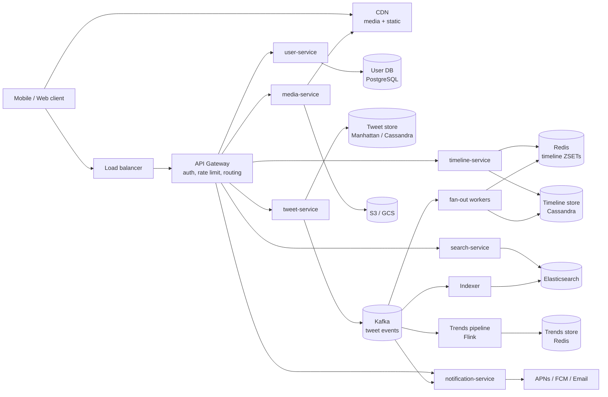
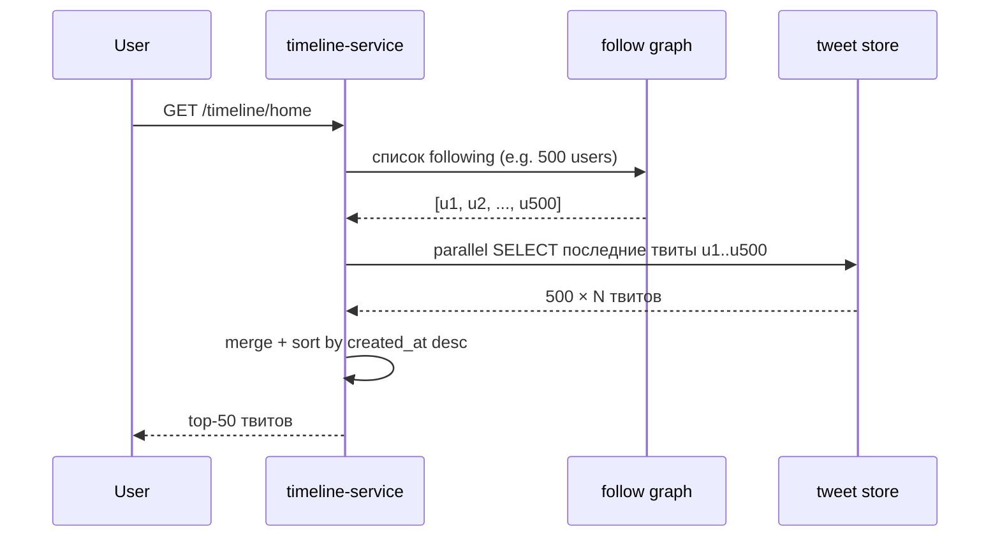
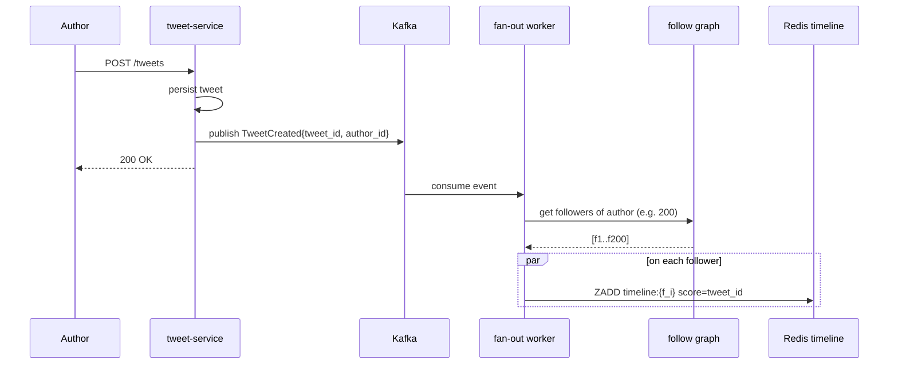
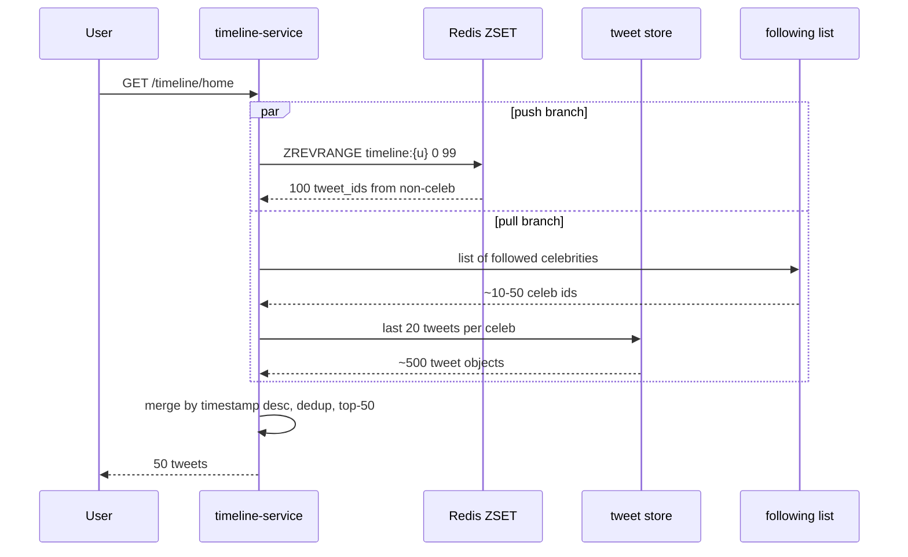

# System Design: Дизайн Twitter (X)

Классический интервью-кейс senior/staff уровня. Главная развилка — **push vs pull vs hybrid timeline**. Дальше — `fan-out`, hot users (Justin Bieber problem), trends, поиск, sharding, multi-region. Кейс ценен тем, что покрывает почти весь стандартный bingo: write-heavy paths, read-heavy paths, stream processing, search, cache, CDN, eventual consistency.

## Полезные ссылки

- [Twitter Engineering — Timelines at scale](https://www.infoq.com/presentations/Twitter-Timeline-Scalability/)
- [The Infrastructure Behind Twitter (Twitter Blog)](https://blog.twitter.com/engineering/en_us/topics/infrastructure)
- [High Scalability — Twitter posts](http://highscalability.com/blog/category/twitter)
- [Designing Data-Intensive Applications, M. Kleppmann](https://dataintensive.net/) — глава про Twitter timeline в Chapter 1.
- [Manhattan: Twitter's real-time, multi-tenant distributed DB](https://blog.twitter.com/engineering/en_us/a/2014/manhattan-our-real-time-multi-tenant-distributed-database-for-twitter-scale)
- [System Design Primer](https://github.com/donnemartin/system-design-primer)

## Содержание

**Requirements и capacity**
- [Q1. (!) Functional requirements?](#q1--functional-requirements)
- [Q2. (!) Non-functional requirements и SLA?](#q2--non-functional-requirements-и-sla)
- [Q3. (!) Back-of-the-envelope capacity estimation?](#q3--back-of-the-envelope-capacity-estimation)
- [Q4. API design — какие эндпоинты?](#q4-api-design--какие-эндпоинты)

**High-level design**
- [Q5. (!) Высокоуровневая архитектура и сервисы?](#q5--высокоуровневая-архитектура-и-сервисы)
- [Q6. Data models — User, Tweet, Follower, Timeline?](#q6-data-models--user-tweet-follower-timeline)
- [Q7. Storage choice — какую БД под что?](#q7-storage-choice--какую-бд-под-что)

**Timeline (push/pull/hybrid)**
- [Q8. (!) Pull (fan-in on read) — как работает, плюсы и минусы?](#q8--pull-fan-in-on-read--как-работает-плюсы-и-минусы)
- [Q9. (!) Push (fan-out on write) — как работает, плюсы и минусы?](#q9--push-fan-out-on-write--как-работает-плюсы-и-минусы)
- [Q10. (!) Hybrid — как объединить push и pull?](#q10--hybrid--как-объединить-push-и-pull)
- [Q11. Fan-out implementation через Kafka?](#q11-fan-out-implementation-через-kafka)
- [Q12. Redis ZSET как структура timeline?](#q12-redis-zset-как-структура-timeline)
- [Q13. (!) Hot users problem — Justin Bieber / Lady Gaga?](#q13--hot-users-problem--justin-bieber--lady-gaga)

**Storage и sharding**
- [Q14. (!) Sharding tweets и timelines?](#q14--sharding-tweets-и-timelines)
- [Q15. Cassandra schema для timeline?](#q15-cassandra-schema-для-timeline)
- [Q16. Media storage — где хранить картинки и видео?](#q16-media-storage--где-хранить-картинки-и-видео)
- [Q17. Likes и retweets counters — как избежать bottleneck?](#q17-likes-и-retweets-counters--как-избежать-bottleneck)

**Search и trends**
- [Q18. (!) Search — как искать по тысячам терабайт твитов?](#q18--search--как-искать-по-тысячам-терабайт-твитов)
- [Q19. Trends — как считать топовые хэштеги real-time?](#q19-trends--как-считать-топовые-хэштеги-real-time)

**Notifications и media**
- [Q20. Notifications, mentions, replies — как доставить?](#q20-notifications-mentions-replies--как-доставить)
- [Q21. CDN для media — какие edge-преимущества?](#q21-cdn-для-media--какие-edge-преимущества)

**Edge cases и failures**
- [Q22. Deleted и edited tweets — как propagate?](#q22-deleted-и-edited-tweets--как-propagate)
- [Q23. Rate limiting — как защититься от спама и абуза?](#q23-rate-limiting--как-защититься-от-спама-и-абуза)
- [Q24. Multi-region и geo-distribution?](#q24-multi-region-и-geo-distribution)

**Trade-offs и обсуждение**
- [Q25. (!) Главные trade-offs дизайна?](#q25--главные-trade-offs-дизайна)
- [Q26. Capacity planning — сколько железа надо?](#q26-capacity-planning--сколько-железа-надо)
- [Q27. CAP theorem — где жертвуем consistency?](#q27-cap-theorem--где-жертвуем-consistency)

## Q1. (!) Functional requirements?

Минимум, что нужно подтвердить с интервьюером в первые 2-3 минуты:

- **Post tweet** — текст ≤ 280 символов, опционально media (1-4 картинки, 1 видео ≤ 2:20).
- **Follow / unfollow** user.
- **Home timeline** — feed твитов от подписок, отсортированный по времени (или по ranking).
- **User timeline** — все твиты конкретного пользователя.
- **Retweet, reply, like, mention** (`@username`), hashtag (`#topic`).
- **Search** — по тексту и хэштегам.
- **Trends** — top-K хэштегов / тем за последние N минут, опционально per-region.
- **Notifications** — кому-то лайкнули, упомянули, ответили.

Что **обычно out of scope** на интервью: ads, DMs (отдельная система), spaces/livestream, monetization.

## Q2. (!) Non-functional requirements и SLA?

| Параметр | Цель |
|---|---|
| DAU | ~500M |
| Tweets/sec (average) | ~6K |
| Tweets/sec (peak, World Cup / NYE) | ~12-25K |
| Reads/writes ratio | ~1000:1 (read-heavy) |
| Home timeline latency p99 | < 200 ms |
| Post tweet latency p99 | < 500 ms (writer ack), distribution async |
| Search latency p99 | < 500 ms |
| Availability | 99.99% (~52 min/year downtime) |
| Consistency | **Eventual** для timeline, **strong** для user/auth |
| Durability | Никакой потери опубликованных твитов |

Сразу формулируем: **выбираем AP по CAP** для timeline. Свежий твит может появиться у одного фолловера на 5-10 сек позже — это ок.

## Q3. (!) Back-of-the-envelope capacity estimation?

**Объёмы writes:**

- 500M DAU × 2 твита/день в среднем = **1B твитов/день** = ~12K tweets/sec (включая peaks).
- Один твит metadata ≈ 1 KB (id 8B + user_id 8B + text 280B + timestamps + flags + counters).
- **Storage per day**: 1B × 1 KB = **1 TB/day metadata**, ~365 TB/год **только метаданные**.
- Media: ~30% твитов с media, средний размер 500 KB → 0.3 × 1B × 500 KB = **150 TB/день media**, ~55 PB/год. Это уже к S3-классу.

**Объёмы reads:**

- Read:write = 1000:1 → ~12M reads/sec на timeline.
- Каждое чтение timeline = 50-100 твитов → ~600M-1.2B твит-объектов отдаётся в секунду.
- Bandwidth (outgoing): 1B твитов × 2 KB (с media metadata, URLs) = ~2 TB/sec пиковая нагрузка на edge. Media отдаём через CDN.

**Fan-out estimation:**

- Average followers: ~200, median ~50, P99 ~10K, max ~100M (топ-аккаунты).
- 6K tweets/sec × 200 avg followers = **1.2M timeline writes/sec** только на fan-out. И это без учёта селебрити.

Эти цифры сразу диктуют: **горизонтальный шардинг обязателен**, in-memory cache для горячих timeline, async fan-out, CDN для media.

## Q4. API design — какие эндпоинты?

REST + WebSocket (для real-time notifications). gRPC — internal.

```
# Tweets
POST   /api/v1/tweets                       body: {text, media_ids[]}
GET    /api/v1/tweets/{id}
DELETE /api/v1/tweets/{id}
POST   /api/v1/tweets/{id}/like
POST   /api/v1/tweets/{id}/retweet
POST   /api/v1/tweets/{id}/reply            body: {text}

# Timelines
GET    /api/v1/timeline/home?cursor=...&limit=50
GET    /api/v1/timeline/user/{user_id}?cursor=...&limit=50

# Social graph
POST   /api/v1/users/{user_id}/follow
DELETE /api/v1/users/{user_id}/follow
GET    /api/v1/users/{user_id}/followers
GET    /api/v1/users/{user_id}/following

# Search / trends
GET    /api/v1/search?q=...&type=tweets|users|hashtags
GET    /api/v1/trends?region=...

# Media
POST   /api/v1/media (multipart) -> returns media_id
```

Пагинация — **cursor-based** (по `(timestamp, tweet_id)`), не offset: offset на больших данных деградирует, и при новых вставках страницы съезжают.

## Q5. (!) Высокоуровневая архитектура и сервисы?



Главные сервисы:

- **tweet-service** — приём твита, валидация, запись в tweet store, публикация события в Kafka.
- **timeline-service** — отдаёт home/user timeline, читает из Redis (hot), fallback в Cassandra. Делает hybrid merge для celeb.
- **user-service** — профили, follow graph.
- **search-service** — Elasticsearch front.
- **notification-service** — push/email/in-app.
- **media-service** — upload, transcode, отдача URL.
- **fan-out workers** — Kafka consumers, размножают tweet по timeline followers.

## Q6. Data models — User, Tweet, Follower, Timeline?

```sql
-- User (PostgreSQL, normalized)
CREATE TABLE users (
    user_id BIGINT PRIMARY KEY,         -- Snowflake ID
    handle VARCHAR(15) UNIQUE NOT NULL,
    display_name VARCHAR(50),
    bio TEXT,
    avatar_url TEXT,
    followers_count BIGINT DEFAULT 0,   -- denormalized counter
    following_count BIGINT DEFAULT 0,
    created_at TIMESTAMPTZ NOT NULL,
    verified BOOLEAN DEFAULT FALSE
);

-- Tweet (Manhattan / Cassandra, by user_id + time)
CREATE TABLE tweets (
    tweet_id BIGINT,                    -- Snowflake (timestamp-ordered)
    user_id BIGINT,
    text VARCHAR(280),
    media_ids LIST<BIGINT>,
    parent_tweet_id BIGINT,             -- reply
    conversation_id BIGINT,             -- root of thread
    retweet_of_id BIGINT,
    created_at TIMESTAMP,
    PRIMARY KEY (user_id, tweet_id)
) WITH CLUSTERING ORDER BY (tweet_id DESC);

-- Followers (edge table) — двунаправленно или две таблицы под два запроса
CREATE TABLE followers (
    user_id BIGINT,            -- кого фолловят
    follower_id BIGINT,        -- кто фолловит
    created_at TIMESTAMP,
    PRIMARY KEY (user_id, follower_id)
);
CREATE TABLE following (
    follower_id BIGINT,
    user_id BIGINT,
    created_at TIMESTAMP,
    PRIMARY KEY (follower_id, user_id)
);

-- Timeline (precomputed feed per user)
CREATE TABLE home_timeline (
    user_id BIGINT,
    tweet_id BIGINT,
    author_id BIGINT,
    inserted_at TIMESTAMP,
    PRIMARY KEY (user_id, tweet_id)
) WITH CLUSTERING ORDER BY (tweet_id DESC);
```

`tweet_id` через **Snowflake** (64 бита: 41 timestamp + 10 machine + 12 sequence) — даёт сортируемость по времени и уникальность без координации.

## Q7. Storage choice — какую БД под что?

| Данные | Хранилище | Почему |
|---|---|---|
| User profile, auth | PostgreSQL / MySQL | Строгая консистентность, OLTP, JOIN-ы для admin/moderation |
| Tweet content | Manhattan / Cassandra | Write-heavy, eventual ok, простая модель ключ-значение, шардинг из коробки |
| Follower graph | MySQL + GizmoDuck (Twitter) / graph DB | Read-heavy graph queries; reverse-indexed таблицы; кэш в Redis |
| Home timeline | Cassandra + Redis cache | Sequential write (fan-out), read top-N → Redis ZSET; cold tail → Cassandra |
| Search index | Elasticsearch | Inverted index, fuzzy, ranking |
| Trends | Redis sorted set | Top-K real-time, TTL |
| Media | S3 / GCS + CloudFront | Object storage + CDN edge |
| Counters (likes, retweets) | Redis (INCR) → flush в Manhattan | Hot counters, batched persistence |
| Sessions / tokens | Redis | TTL, low-latency |

## Q8. (!) Pull (fan-in on read) — как работает, плюсы и минусы?

**Идея:** timeline ничего не хранит; при запросе `/timeline/home` собираем твиты из таблиц всех, на кого подписан.



**Плюсы:**

- Write **дёшев**: один INSERT в `tweets`, без размножения.
- Свежесть **идеальная** — timeline всегда актуален.
- Меньше storage (нет precomputed feed).
- Прост в реализации.

**Минусы:**

- Read **дорог**: для пользователя с 1000 подписок — 1000 запросов (или scatter-gather на много шардов).
- Latency растёт с количеством подписок — нарушаем p99 < 200ms.
- Holiday peak: миллионы concurrent reads × 1000 fan-in = взрыв нагрузки на tweet store.

**Когда подходит:** пользователи с **редкими сессиями** или **много подписок и мало входов** (selebrity-фолловер).

## Q9. (!) Push (fan-out on write) — как работает, плюсы и минусы?

**Идея:** при публикации твита **сразу** размножаем его в timeline каждого фолловера (precomputed feed).



**Плюсы:**

- Read **сверх-дёшев**: `ZREVRANGE timeline:{user_id} 0 49` — один Redis-вызов, ~1ms.
- Latency p99 < 50ms легко достижим.
- Масштабируется горизонтально: больше fan-out workers — больше throughput.

**Минусы:**

- Write **дорог** для аккаунтов с миллионами фолловеров — один твит = 100M INSERT-ов в timeline.
- **Justin Bieber problem**: пока размножаем твит Bieber-а по 100M timelines, обычные посты ждут.
- Storage **взрывается**: один твит хранится в N копиях (где N = followers).
- Wasted work: писать в timeline неактивных пользователей.

**Когда подходит:** **большинство пользователей** (≤ 10K followers) и read-heavy паттерн — это основной случай Twitter.

## Q10. (!) Hybrid — как объединить push и pull?

**Идея:** threshold-based выбор стратегии per author:

- Author с **< 1M followers** → push (fan-out on write).
- Author с **≥ 1M followers** (celebrity) → pull-only: его твиты **не размножаются** в timeline фолловеров.

При запросе `/timeline/home`:

1. Достаём **precomputed home timeline** из Redis (только не-celebrity твиты).
2. Параллельно достаём **последние твиты celebrities**, на которых подписан пользователь, из tweet store (это обычно ≤ 50 человек).
3. **Merge by timestamp** → отдаём top-50.



**Threshold tuning:**

- Слишком низкий → много пользователей попадают в pull, дорого читать.
- Слишком высокий → fan-out пишет в десятки миллионов timeline.
- Реально у Twitter cutoff где-то **~1M-10M** followers; нюанс в том, что считают и **активные** пользователи, а не общее число.

**Дополнительные оптимизации:**

- Не делать fan-out на **неактивных** фолловеров (last_login > 30 дней) — пишем при первом возвращении (lazy materialization).
- Per-pair throttling: если автор постит 10 твитов за секунду — батчим в один fan-out.

## Q11. Fan-out implementation через Kafka?

Pipeline:

1. `tweet-service` пишет твит в Manhattan + публикует событие в Kafka topic `tweets.created`.
2. Топик партиционирован по `author_id` (или `tweet_id` для лучшего балансирования; trade-off — ordering).
3. **fan-out workers** (consumer group) читают события и для каждого:
   - получают список followers из Redis-cache или follow-graph DB,
   - для каждого follower делают `ZADD timeline:{follower_id} {tweet_id} {tweet_id}` в Redis,
   - параллельно (или batch) пишут в Cassandra `home_timeline`.
4. Большие fan-out батчатся: для автора с 100K followers — pipeline Redis batch по 5-10K за запрос.

```properties
# Kafka topic
name=tweets.created
partitions=256
replication.factor=3
retention.ms=86400000        # 24h, на случай отстающего consumer
compression=lz4
min.insync.replicas=2
```

```kotlin
// Fan-out worker (упрощённо)
@KafkaListener(topics = ["tweets.created"], groupId = "fanout")
fun onTweet(event: TweetCreated) {
    val author = userService.get(event.authorId)
    if (author.followersCount >= CELEB_THRESHOLD) {
        return            // celeb: pull-only, fan-out skipped
    }
    val followers = followGraph.getActiveFollowers(event.authorId)
    followers.chunked(5_000).forEach { batch ->
        redis.pipelined {
            batch.forEach { fid ->
                zadd("timeline:$fid", event.tweetId.toDouble(), event.tweetId)
                zremrangeByRank("timeline:$fid", 0, -801)  // cap at 800
            }
        }
    }
}
```

## Q12. Redis ZSET как структура timeline?

Sorted set Redis — почти идеальное соответствие задаче «top-N по timestamp». Score = `tweet_id` (Snowflake уже отсортирован по времени).

```
ZADD       timeline:{user_id} <tweet_id> <tweet_id>     -- O(log N) insert
ZREVRANGE  timeline:{user_id} 0 49                       -- top-50, O(log N + M)
ZCARD      timeline:{user_id}                            -- count
ZREMRANGEBYRANK timeline:{user_id} 0 -801                -- trim to 800
```

Capping важен: храним только последние **500-800** твитов per timeline. Старее → подгружаем из Cassandra при скролле (cold tail).

**Memory math:** один tweet_id в ZSET ~50 байт (key overhead). 500 entries × 50B × 500M users = **~12 TB** RAM-кэша. Это уже cluster класса Redis Cluster на 100+ инстансов или Twemproxy / Twitter's Pelikan.

**Eviction policy:** для неактивных юзеров — TTL 30 дней, lazy materialization при возврате.

## Q13. (!) Hot users problem — Justin Bieber / Lady Gaga?

«Justin Bieber problem» — fan-out 100M followers убивает воркеры. Решения:

1. **Threshold + pull-only для celebrities** (см. Q10). Главное решение.
2. **Replicated celeb cache:** каждый regional cluster держит топ-1000 celeb-аккаунтов в отдельном local Redis. Read целебрити-твитов идёт в local cache → нет cross-region latency.
3. **Pre-fetch на следующую сессию:** при запросе timeline кешируем «merged» вид (push + pull) на 30-60 сек — повторные запросы юзера попадают в кэш.
4. **Sharded celebrity timeline cache:** для каждого celeb отдельный `celeb_tweets:{author_id}` ZSET, который читает любой клиент его подписчиков. Это один общий кэш, а не 100M персональных.
5. **Backpressure на Kafka:** если fan-out lag растёт, throttle author posting rate (или drop low-priority embedded retweets).

«Hot read» (твит мега-звезды лайкает миллион человек) — отдельная проблема counters (см. Q17).

## Q14. (!) Sharding tweets и timelines?

**Tweet store (Manhattan/Cassandra):**

- Partition key = `user_id`. Все твиты одного автора → один partition → быстрое чтение `user_timeline`.
- Clustering key = `tweet_id DESC` — последние первыми.
- Hot partition risk у celeb: smooth-ится тем, что не очень много writes (1 человек физически не публикует > N tweets/sec), но reads — да; решается репликами + кэшем.

**Home timeline (Cassandra):**

- Partition key = `follower_id` (= user_id того, кому принадлежит timeline).
- Clustering key = `tweet_id DESC`.
- Запись = маленький INSERT, чтение = single-partition scan.

**Follow graph:**

- Две шардированные таблицы: `followers(user_id PK)` для «кто меня фолловит» и `following(follower_id PK)` для «кого я фолловю». Шардинг — consistent hashing по PK.

**Search (Elasticsearch):**

- Sharding по hash(`tweet_id`) или по time-based индексам (`tweets-2026-05`) для retention.

**Антипаттерны:** sharding по `tweet_id` для tweet store ломает user_timeline (нужен scatter-gather по всем шардам); sharding home_timeline по `author_id` ломает home read.

## Q15. Cassandra schema для timeline?

```sql
CREATE KEYSPACE timelines WITH replication = {
  'class': 'NetworkTopologyStrategy',
  'us-east': 3,
  'eu-west': 3
};

CREATE TABLE timelines.home (
    user_id      bigint,
    bucket       int,             -- yyyymm для очистки старого
    tweet_id     bigint,
    author_id    bigint,
    PRIMARY KEY ((user_id, bucket), tweet_id)
) WITH CLUSTERING ORDER BY (tweet_id DESC)
  AND default_time_to_live = 2592000;   -- 30 дней

CREATE TABLE timelines.user (
    author_id    bigint,
    tweet_id     bigint,
    PRIMARY KEY (author_id, tweet_id)
) WITH CLUSTERING ORDER BY (tweet_id DESC);
```

Замечания:

- **Bucket** в PK предотвращает unbounded partition: при 1000 твитов/день за 5 лет partition вырастает до 1.8M строк — Cassandra деградирует на больших партициях.
- `default_time_to_live` авто-чистит старые записи без compaction-tombstones-hell, если TTL ставить разумно.
- `Replication factor = 3` per datacenter + `LOCAL_QUORUM` на reads/writes — баланс между latency и durability.

## Q16. Media storage — где хранить картинки и видео?

- **S3 / GCS** для объектов. Никаких CDN-вылазок в БД.
- **CloudFront / Akamai / Fastly** перед S3.
- При upload: media-service принимает файл → presigned PUT URL в S3 → асинхронный pipeline:
  - **Image:** resize в несколько размеров (`100x100`, `400x400`, `1080x1080`), конвертация в **AVIF + WebP + JPEG fallback**, EXIF strip, NSFW-чек.
  - **Video:** transcode через FFmpeg → HLS chunks (240p/360p/720p/1080p), thumbnail extraction, audio normalize.
- В метаданных твита хранится только `media_id`, mapping `media_id → URLs` лежит в отдельной таблице.
- URL-ы подписаны (CDN signed cookies) на 24h для приватных аккаунтов.

CDN-латентность твита с media с регионального edge — десятки миллисекунд против сотен из origin S3.

## Q17. Likes и retweets counters — как избежать bottleneck?

Проблема: «всем миром» лайкают твит знаменитости → 1M `UPDATE tweets SET likes = likes + 1 WHERE id = X` создают write-conflict hellscape.

Подходы:

- **Redis INCR + periodic flush:** `INCR likes:{tweet_id}` принимает миллионы ops/sec. Раз в N сек или N инкрементов — `INCRBY` итог в Manhattan/MySQL.
- **Sharded counter:** разбить counter на K шардов (`likes:{tweet_id}:0..K-1`), писать в случайный, на read суммировать. Решает hot key.
- **Approximate counter:** для не-критичных счётчиков (просмотры) — HyperLogLog: `PFADD views:{tweet_id} {user_id}` → `PFCOUNT views:{tweet_id}`. Меньше памяти, ±2% точность.
- **Async pipeline:** like → Kafka → consumer aggregates per minute → batch update в БД.

Read counter — почти всегда из Redis. Точность ±N (где N = batch flush) приемлема.

## Q18. (!) Search — как искать по тысячам терабайт твитов?

**Архитектура:**

- Отдельный **Elasticsearch cluster** (или Apache Lucene custom — у Twitter это Earlybird).
- Pipeline индексации: `tweets.created` Kafka topic → indexer service → ES bulk API.
- Каждый твит индексируется через секунды (eventually).
- Раздельные индексы по времени (`tweets-2026-05`) — старые индексы можно closed/cold-tier (SSD → HDD → S3 frozen).

**Запросы:**

- Full-text по `text`, фильтры по `user_id`, `created_at`, `lang`, `media_present`.
- Ranking: tf-idf / BM25 + signals (likes count, retweets count, recency, author authority).
- Top-K с pagination через `search_after` (cursor).

**Real-time search:** Twitter использует in-memory inverted index в **Earlybird** для последних 1-2 недель (горячее окно). Долгий tail — на холодных ES-индексах.

**Trends ≠ search.** Trends — это stream processing, см. Q19.

**Capacity:** при 1B твитов/день и сохранении за 30 дней — 30B документов. Шардируем индекс на 100-200 шардов, primary + 2 replicas.

## Q19. Trends — как считать топовые хэштеги real-time?

**Sliding window top-K по hashtag count за последние 5-15 минут.**

Pipeline:

1. Kafka topic `tweets.created` → **Flink job** (или Kafka Streams).
2. Парсим хэштеги (`#nba`, `#elections`), нормализуем (lowercase, NFKC).
3. **Count-Min Sketch** + sliding window 5 минут — даёт approx counts на терабайт-stream без точного хранения.
4. **Top-K (Space-Saving algorithm)** — поддерживает heap топ-100 хэштегов по приближённому counter.
5. Каждые 30 сек — snapshot топа в Redis ZSET `trends:global`, `trends:{region}`, TTL 5 минут.
6. API `/api/v1/trends` читает из Redis — `ZREVRANGE` за миллисекунду.

**Per-region trends:** Flink параллельно держит windows per locale (`trends:us`, `trends:ru`, `trends:jp`) — IP geo / user profile задаёт region.

**Anti-spam:** одно слово, повторяющееся от одного юзера — отфильтровать (dedupe по `author_id` в окне).

## Q20. Notifications, mentions, replies — как доставить?

Pipeline:

1. tweet-service публикует `tweets.created` в Kafka.
2. **notification-service** consumer:
   - парсит `@mentions` из текста → создаёт `mention_notification` per mention.
   - если твит — reply (`parent_tweet_id`) → нотификация автору родителя.
   - если retweet — нотификация автору оригинала.
3. Запись в `notifications` таблицу (Cassandra) для in-app inbox.
4. Параллельно: **push pipeline** → APNs (iOS) / FCM (Android) → device tokens.
5. Email digest (если user_id не открывал push 24h) — отдельный батч.

**Counters in-app**: Redis ZSET unread notifications per user, ZADD на каждое событие, ZCARD для бейджа.

**Real-time delivery в открытое приложение:** WebSocket / SSE поверх gateway, server-side push при появлении новой нотификации (через **fanout pub-sub** — Redis pub/sub или dedicated push-service).

## Q21. CDN для media — какие edge-преимущества?

- **Edge caching:** статика (картинки, видео chunks) отдаётся с PoP в стране пользователя, RTT 20-50ms вместо 150-300ms до origin.
- **Bandwidth offload:** 90%+ media-трафика никогда не доходит до S3 → экономия egress.
- **TLS termination на edge** → меньше CPU нагрузка на origin.
- **DDoS mitigation:** CDN (CloudFront, Cloudflare) держит SYN floods, L7 floods.
- **Image optimization on the fly:** некоторые CDN (Cloudflare Polish, Fastly Image Opto) ресайзят / конвертируют формат по `Accept: image/avif` без перегенерации в origin.
- **Video chunked delivery:** HLS chunks (2-10 сек) перекэшируются, начало потока стартует за < 1сек.

Cache key для media обычно immutable URL (хэш контента в имени файла) → unlimited cache lifetime, инвалидация не нужна.

## Q22. Deleted и edited tweets — как propagate?

**Delete:**

- Soft-delete в tweet store (`deleted = true`), оригинал хранится для audit/compliance/GDPR-delay.
- Publish `tweets.deleted` в Kafka.
- Consumers:
  - search-indexer → `DELETE` из ES.
  - fan-out service → ZREM из timeline:{follower_id} **только активных** фолловеров (для неактивных — фильтр на read).
  - notification-service → mark related notifications as obsolete.
- На read: timeline-service фильтрует tweet_id, у которых tweet store отдаёт `deleted=true` (read-time filter — это страховка).

**Edit (X feature):**

- Edited tweet — новая ревизия, привязанная к оригинальному `tweet_id`: `edits[]` массив с timestamp.
- Время на edit ограничено (X: 30 минут, до 5 правок).
- Search re-indexes последнюю версию.
- Timeline не перешафливаем — твит остаётся на старой позиции, в карточке метка «edited».

## Q23. Rate limiting — как защититься от спама и абуза?

Многоуровневый rate limiting:

| Уровень | Ключ | Лимит | Хранилище |
|---|---|---|---|
| Per IP | client IP | 1000 req/min | Redis token bucket |
| Per user | user_id | API-зависимый: 300 tweets/3h, 1000 follows/day | Redis token bucket |
| Per app key | OAuth app_id | Tier-based (free/paid) | Redis |
| Per endpoint | path+user | Different per endpoint | Redis sliding window |

**Token bucket в Redis:**

```
-- Lua atomic
local key = KEYS[1]
local limit = tonumber(ARGV[1])
local refill_rate = tonumber(ARGV[2])  -- tokens/sec
local now = tonumber(ARGV[3])
local data = redis.call('HMGET', key, 'tokens', 'last_refill')
local tokens = tonumber(data[1]) or limit
local last_refill = tonumber(data[2]) or now
tokens = math.min(limit, tokens + (now - last_refill) * refill_rate)
if tokens < 1 then return 0 end
tokens = tokens - 1
redis.call('HMSET', key, 'tokens', tokens, 'last_refill', now)
redis.call('EXPIRE', key, 3600)
return 1
```

**Anti-spam:** ML classifier на content + behavioural (burst follow, repeated content, IP reputation, device fingerprint). См. шпаргалку про rate limiter.

## Q24. Multi-region и geo-distribution?

**Стратегия — multi-region active-active:**

- Каждый регион (US-East, EU-West, AP-Southeast) держит **полную копию** stateless services и read replicas данных.
- **User profile / follow graph** — async-replicated cross-region (MySQL/Manhattan multi-DC), читаем locally, пишем в home region пользователя.
- **Tweet store / timeline** — replicated cross-DC через Manhattan/Cassandra (NetworkTopologyStrategy, RF=3 per DC, LOCAL_QUORUM).
- **Kafka** — MirrorMaker 2 или Confluent Replicator зеркалит `tweets.created` cross-region; fan-out workers в каждом регионе самостоятельно строят timelines на основе locally cached follow graph.

**Trade-offs:**

- Strong consistency для `follow/unfollow` (избежать «unfollow появился, но потом откатился») — пишем в home region пользователя, read-after-write локальный.
- Eventual consistency для timeline (новый твит появляется в EU спустя 1-2 сек после публикации в US) — приемлемо.
- DNS-routing (Route53 / Cloudflare Geo) → пользователь попадает на ближайший регион.

**Failover:** при падении региона DNS переключает на ближайший живой, в idle stays warm cache.

## Q25. (!) Главные trade-offs дизайна?

| Trade-off | Куда выбираем | Почему |
|---|---|---|
| Push vs Pull timeline | Hybrid | Push для большинства (fast read), pull для celeb (избежать fan-out взрыва) |
| Денормализация vs нормализация | Денормализация (timeline, counters) | Read-heavy, AP по CAP |
| Eventual vs strong consistency | Eventual для timeline/feeds | 1-2 сек задержки приемлемы |
| Strong для | follow/unfollow, profile, auth | Иначе UX баг и security risk |
| SQL vs NoSQL | NoSQL для tweets/timeline, SQL для users | Write-heavy timeseries vs OLTP |
| In-memory cache | Redis для top-N timeline + counters | RAM ≪ disk latency |
| Synchronous vs async | Async (Kafka) для fan-out, search index, notifications | Изолируем post latency от downstream |
| Geo strategy | Multi-region active-active | Latency + availability worth complexity |
| Counters precise vs approx | Approx (Redis + flush) | Точность ±N допустима, throughput критичен |

## Q26. Capacity planning — сколько железа надо?

Грубые числа для 500M DAU:

- **API tier** (stateless): 12M reads/sec × 5ms CPU = 60K CPU-сек/сек = **60K cores** = ~2000 servers по 32 ядра. С запасом 3x на peak — **~6000 servers**.
- **tweet-service / timeline-service**: 10-20K cores.
- **Redis timeline cache**: 12 TB RAM → 200+ instances по 64 GB (или Redis Cluster с 100 shards × 128 GB).
- **Cassandra tweet store**: 300 TB data × 3 replication = 900 TB → ~500 nodes по 2 TB SSD.
- **Cassandra timeline store**: похоже, ещё 500+ nodes.
- **Kafka**: 100K msg/sec на partition × 256 partitions × 3 replication = 100+ brokers.
- **Elasticsearch**: 30B documents × 2 replicas → 100-200 nodes.
- **Network**: 2 TB/sec peak egress → DDoS-protected ISP × несколько uplink, CDN снимает >90%.

Это **порядок** — реальный sizing зависит от benchmark, hot spots, региональных peaks.

## Q27. CAP theorem — где жертвуем consistency?

| Подсистема | C/A/P trade-off | Комментарий |
|---|---|---|
| User profile, auth | CP (strong) | Нельзя терять login state, password change должен быть atomic |
| Follow graph | Eventual (AP), но с read-your-writes | После follow юзер должен увидеть себя в following list немедленно (sticky to home DC) |
| Tweet store | AP, eventual | Твит может появиться в other DC с задержкой 1-2 сек |
| Home timeline | AP, eventual | Цена: новый твит селебрити может «прыгать» по позициям из-за hybrid merge |
| Counters (likes) | AP, eventual + approximate | Точность ±N приемлема |
| Search | AP, eventual | Индексация 1-5 сек после публикации — норма |
| Trends | AP, approximate | Top-K через CMS, ±5% точность |
| Notifications | AP, at-least-once | Дубль push лучше, чем потерянный; idempotency by event_id |
| Payments / monetization (out of scope) | CP | Деньги — никогда AP |

Общее правило: **timeline и feed-related — AP**, **identity и money — CP**. Twitter — это AP-система с локальными strong-consistency островами.

---

## See also

- [Дизайн News Feed System (близкий кейс)](design-feed-system-interview.md)
- [System Design Interview — общий процесс](system-design-interview.md)
- [Дизайн Chat System (WebSocket, presence)](design-chat-system-interview.md)
- [Дизайн Search Engine](design-search-interview.md)
- [Дизайн Rate Limiter](design-rate-limiter-interview.md)
- [Scalability patterns](../architecture/scalability-patterns-interview.md)
- [Caching strategies](../architecture/caching-strategies-interview.md)
- [CAP theorem](../architecture/cap-theorem-interview.md)
- [Latency numbers every programmer should know](../architecture/latency-numbers-interview.md)
- [Cassandra — wide-column store](../databases/cassandra-interview.md)
- [Database sharding](../databases/database-sharding-interview.md)
- [Apache Kafka](../messaging/kafka-interview.md)
