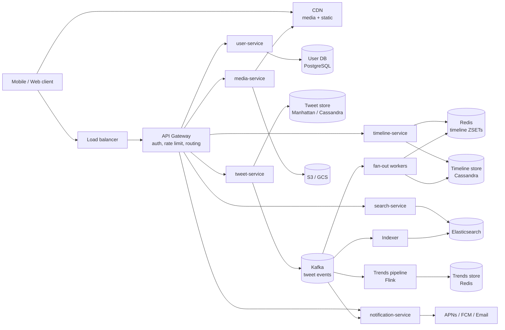
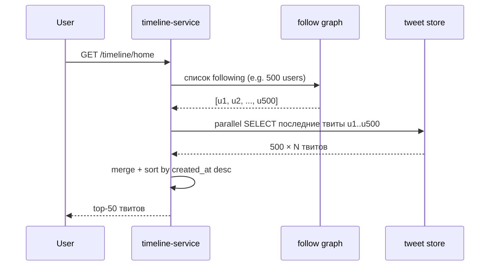
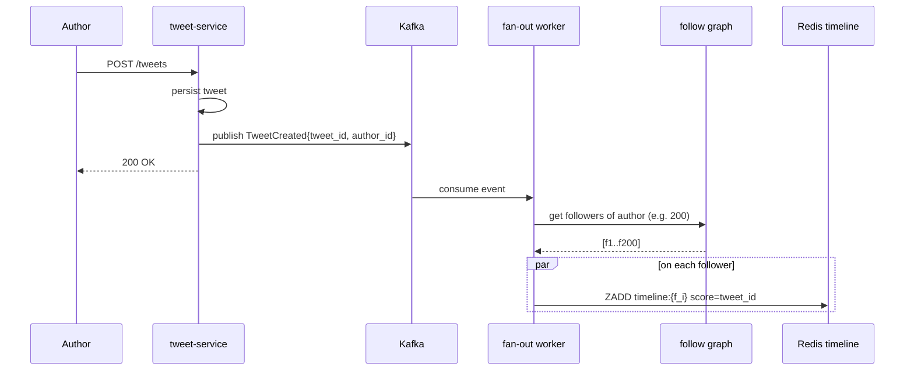
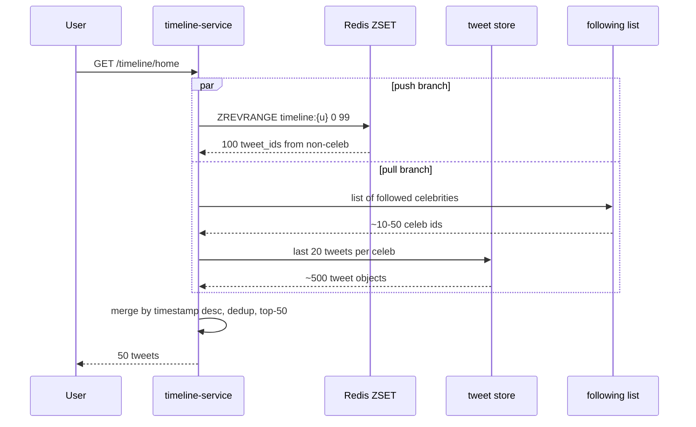

# System Design: Дизайн Twitter (X)

Классический интервью-кейс senior/staff уровня. Главная развилка, вокруг которой крутится всё остальное, — **push vs pull vs hybrid timeline**. Дальше — `fan-out`, hot users (Justin Bieber problem), trends, поиск, sharding, multi-region. Кейс ценен тем, что в одной задаче собран почти весь стандартный набор тем: write-heavy-пути, read-heavy-пути, stream processing, поиск, кэш, CDN, eventual consistency. Если уверенно ведёшь именно его, большинство других system-design-вопросов раскладываются по тем же полочкам.

## Полезные ссылки

- [Twitter Engineering — Timelines at scale](https://www.infoq.com/presentations/Twitter-Timeline-Scalability/)
- [The Infrastructure Behind Twitter (Twitter Blog)](https://blog.twitter.com/engineering/en_us/topics/infrastructure)
- [High Scalability — Twitter posts](http://highscalability.com/blog/category/twitter)
- [Designing Data-Intensive Applications, M. Kleppmann](https://dataintensive.net/) — глава про Twitter timeline в Chapter 1.
- [Manhattan: Twitter's real-time, multi-tenant distributed DB](https://blog.twitter.com/engineering/en_us/a/2014/manhattan-our-real-time-multi-tenant-distributed-database-for-twitter-scale)
- [System Design Primer](https://github.com/donnemartin/system-design-primer)

## Содержание

**Requirements и capacity**
- [Q1. (!) Функциональные требования к Twitter?](#q1--функциональные-требования-к-twitter)
- [Q2. (!) Non-functional requirements и SLA?](#q2--non-functional-requirements-и-sla)
- [Q3. (!) Прикидка нагрузки на салфетке (capacity estimation)?](#q3--прикидка-нагрузки-на-салфетке-capacity-estimation)
- [Q4. Дизайн API — какие эндпоинты нужны?](#q4-дизайн-api--какие-эндпоинты-нужны)

**High-level design**
- [Q5. (!) Высокоуровневая архитектура и сервисы?](#q5--высокоуровневая-архитектура-и-сервисы)
- [Q6. Модели данных — User, Tweet, Follower, Timeline?](#q6-модели-данных--user-tweet-follower-timeline)
- [Q7. Выбор хранилищ — какую БД подо что?](#q7-выбор-хранилищ--какую-бд-подо-что)

**Timeline (push/pull/hybrid)**
- [Q8. (!) Pull (fan-in on read) — как работает, плюсы и минусы?](#q8--pull-fan-in-on-read--как-работает-плюсы-и-минусы)
- [Q9. (!) Push (fan-out on write) — как работает, плюсы и минусы?](#q9--push-fan-out-on-write--как-работает-плюсы-и-минусы)
- [Q10. (!) Hybrid — как объединить push и pull?](#q10--hybrid--как-объединить-push-и-pull)
- [Q11. Реализация fan-out через Kafka?](#q11-реализация-fan-out-через-kafka)
- [Q12. Redis ZSET как структура timeline?](#q12-redis-zset-как-структура-timeline)
- [Q13. (!) Проблема горячих пользователей — Justin Bieber / Lady Gaga?](#q13--проблема-горячих-пользователей--justin-bieber--lady-gaga)

**Storage и sharding**
- [Q14. (!) Шардинг твитов и timeline?](#q14--шардинг-твитов-и-timeline)
- [Q15. Схема Cassandra для timeline?](#q15-схема-cassandra-для-timeline)
- [Q16. Хранение media — где держать картинки и видео?](#q16-хранение-media--где-держать-картинки-и-видео)
- [Q17. Счётчики likes и retweets — как избежать узкого места?](#q17-счётчики-likes-и-retweets--как-избежать-узкого-места)

**Search и trends**
- [Q18. (!) Поиск — как искать по тысячам терабайт твитов?](#q18--поиск--как-искать-по-тысячам-терабайт-твитов)
- [Q19. Trends — как считать топовые хэштеги в реальном времени?](#q19-trends--как-считать-топовые-хэштеги-в-реальном-времени)

**Notifications и media**
- [Q20. Уведомления, mentions, replies — как доставить?](#q20-уведомления-mentions-replies--как-доставить)
- [Q21. CDN для media — какие преимущества даёт edge?](#q21-cdn-для-media--какие-преимущества-даёт-edge)

**Edge cases и failures**
- [Q22. Удалённые и отредактированные твиты — как разнести изменения?](#q22-удалённые-и-отредактированные-твиты--как-разнести-изменения)
- [Q23. Rate limiting — как защититься от спама и абуза?](#q23-rate-limiting--как-защититься-от-спама-и-абуза)
- [Q24. Multi-region и гео-распределение?](#q24-multi-region-и-гео-распределение)

**Trade-offs и обсуждение**
- [Q25. (!) Главные компромиссы дизайна?](#q25--главные-компромиссы-дизайна)
- [Q26. Capacity planning — сколько железа надо?](#q26-capacity-planning--сколько-железа-надо)
- [Q27. CAP-теорема — где жертвуем consistency?](#q27-cap-теорема--где-жертвуем-consistency)

## Q1. (!) Функциональные требования к Twitter?

Прежде чем рисовать архитектуру, зафиксируй scope: какие сценарии система обязана поддержать. Это первые 2-3 минуты интервью — без них дальнейший дизайн повиснет в воздухе. Минимум, что нужно проговорить с интервьюером:

- **Публикация твита** — текст ≤ 280 символов, опционально media (1-4 картинки, 1 видео ≤ 2:20).
- **Follow / unfollow** пользователя.
- **Home timeline** — лента твитов от подписок, отсортированная по времени (или по ranking).
- **User timeline** — все твиты конкретного пользователя.
- **Retweet, reply, like, упоминание** (`@username`), хэштег (`#topic`).
- **Поиск** — по тексту и хэштегам.
- **Trends** — top-K хэштегов / тем за последние N минут, опционально по регионам.
- **Уведомления** — кому-то лайкнули, упомянули, ответили.

**Что обычно вне scope** на интервью: реклама, DM (отдельная система), spaces/livestream, монетизация. Явно отсечь их в начале — это сигнал, что ты управляешь временем и не утонешь в деталях. Главная функциональная развилка, к которой всё сведётся, — **как формируется home timeline**: именно её защищаешь оставшуюся часть собеседования.

## Q2. (!) Non-functional requirements и SLA?

Нефункциональные требования задают рамки, которые потом определяют каждое архитектурное решение. Ключевая цифра — **read:write ≈ 1000:1**: Twitter подавляюще read-heavy, поэтому всё строится вокруг дешёвого чтения timeline даже ценой дорогой записи. Конкретные цели:

| Параметр | Цель |
|---|---|
| DAU | ~500M |
| Твитов/сек (в среднем) | ~6K |
| Твитов/сек (пик: World Cup / Новый год) | ~12-25K |
| Соотношение reads/writes | ~1000:1 (read-heavy) |
| Латентность home timeline p99 | < 200 мс |
| Латентность публикации твита p99 | < 500 мс (ack писателю), рассылка асинхронная |
| Латентность поиска p99 | < 500 мс |
| Доступность | 99.99% (~52 мин/год простоя) |
| Консистентность | **Eventual** для timeline, **strong** для user/auth |
| Долговечность | Никакой потери опубликованных твитов |

Главный вывод из таблицы: для timeline **выбираем AP по CAP**. Лента — это лента развлечений, а не банковский счёт: если свежий твит появится у фолловера на 5-10 сек позже, никто не пострадает. Зато доступность и низкая латентность критичны. Identity (профиль, auth) и follow/unfollow — наоборот, **strong consistency**: пользователь должен сразу видеть результат своего действия, а смена пароля обязана быть атомарной.

## Q3. (!) Прикидка нагрузки на салфетке (capacity estimation)?

Цель прикидки — не точные числа, а **порядки величин**, которые сразу диктуют решения: нужен ли шардинг, поместится ли кэш в RAM, выдержит ли одна БД. Считаем в три захода — запись, чтение, fan-out.

**Объёмы записи (writes):**

- 500M DAU × 2 твита/день в среднем = **1B твитов/день** = ~12K твитов/сек (включая пики).
- Метаданные одного твита ≈ 1 KB (id 8B + user_id 8B + text 280B + timestamps + флаги + счётчики).
- **Хранилище в день**: 1B × 1 KB = **1 TB/день метаданных**, ~365 TB/год **только метаданные**.
- Media: ~30% твитов с media, средний размер 500 KB → 0.3 × 1B × 500 KB = **150 TB/день media**, ~55 PB/год. Это уже уровень S3.

**Объёмы чтения (reads):**

- read:write = 1000:1 → ~12M reads/сек на timeline.
- Каждое чтение timeline = 50-100 твитов → ~600M-1.2B твит-объектов отдаётся в секунду.
- Полоса (исходящая): 1B твитов × 2 KB (с metadata media, URL-ами) = ~2 TB/сек пиковая нагрузка на edge. Media отдаём через CDN.

**Оценка fan-out:**

- Среднее число фолловеров: ~200, медиана ~50, P99 ~10K, максимум ~100M (топ-аккаунты).
- 6K твитов/сек × 200 фолловеров в среднем = **1.2M записей в timeline/сек** только на fan-out. И это без учёта селебрити.

**Вывод.** Эти цифры сразу диктуют четыре опоры дизайна: данные не влезают на один узел → **горизонтальный шардинг обязателен**; 12M reads/сек не вытянуть с диска → **in-memory cache** для горячих timeline; 1.2M записей/сек на fan-out нельзя делать синхронно → **асинхронный fan-out** через очередь; 55 PB/год media и 2 TB/сек egress → **CDN** обязателен. Всё, что обсуждаем дальше, — следствие этих четырёх цифр.

## Q4. Дизайн API — какие эндпоинты нужны?

API строится вокруг трёх групп ресурсов: твиты, ленты и социальный граф (плюс поиск/trends и media). Выбор протоколов:

- **REST** наружу — простой, кэшируемый, понятный клиентам.
- **WebSocket** — для real-time-уведомлений (push в открытое приложение).
- **gRPC** — для внутренних вызовов между сервисами (бинарный, быстрый, со схемой).

```
# Tweets
POST   /api/v1/tweets                       body: {text, media_ids[]}
GET    /api/v1/tweets/{id}
DELETE /api/v1/tweets/{id}
POST   /api/v1/tweets/{id}/like
POST   /api/v1/tweets/{id}/retweet
POST   /api/v1/tweets/{id}/reply            body: {text}

# Timelines
GET    /api/v1/timeline/home?cursor=...&limit=50
GET    /api/v1/timeline/user/{user_id}?cursor=...&limit=50

# Social graph
POST   /api/v1/users/{user_id}/follow
DELETE /api/v1/users/{user_id}/follow
GET    /api/v1/users/{user_id}/followers
GET    /api/v1/users/{user_id}/following

# Search / trends
GET    /api/v1/search?q=...&type=tweets|users|hashtags
GET    /api/v1/trends?region=...

# Media
POST   /api/v1/media (multipart) -> returns media_id
```

**Пагинация — на курсорах** (по `(timestamp, tweet_id)`), а не на offset. Причины две: offset на больших данных деградирует (БД физически пропускает N строк перед выдачей), а в ленте, куда постоянно прилетают новые твиты, offset «съезжает» — между запросами страниц вставки сдвигают границы, и пользователь видит дубли или пропуски. Курсор фиксирует позицию по содержимому, а не по номеру строки.

## Q5. (!) Высокоуровневая архитектура и сервисы?

Архитектура — набор узких микросервисов за API Gateway, связанных через Kafka. Ключевая идея: **синхронный путь публикации твита максимально короткий** (записал в store, кинул событие в Kafka, ответил клиенту), а вся тяжёлая работа — fan-out, индексация, trends, уведомления — висит асинхронными консьюмерами на одном и том же потоке событий `tweets.created`. Так латентность записи изолирована от downstream-нагрузки.



Главные сервисы:

- **tweet-service** — приём твита, валидация, запись в tweet store, публикация события в Kafka.
- **timeline-service** — отдаёт home/user timeline, читает из Redis (горячий слой), fallback в Cassandra. Делает hybrid-merge для селебрити.
- **user-service** — профили, граф подписок.
- **search-service** — фронт к Elasticsearch.
- **notification-service** — push/email/внутри приложения.
- **media-service** — загрузка, транскодинг, отдача URL.
- **fan-out workers** — Kafka-консьюмеры, размножают твит по timeline фолловеров.

## Q6. Модели данных — User, Tweet, Follower, Timeline?

Четыре основные сущности. Главное проектное решение здесь — **двунаправленный граф подписок** (две таблицы `followers` и `following` под два противоположных запроса) и **денормализованный home_timeline** как отдельная предрассчитанная таблица. Это сознательная избыточность ради дешёвого чтения.

```sql
-- User (PostgreSQL, normalized)
CREATE TABLE users (
    user_id BIGINT PRIMARY KEY,         -- Snowflake ID
    handle VARCHAR(15) UNIQUE NOT NULL,
    display_name VARCHAR(50),
    bio TEXT,
    avatar_url TEXT,
    followers_count BIGINT DEFAULT 0,   -- denormalized counter
    following_count BIGINT DEFAULT 0,
    created_at TIMESTAMPTZ NOT NULL,
    verified BOOLEAN DEFAULT FALSE
);

-- Tweet (Manhattan / Cassandra, by user_id + time)
CREATE TABLE tweets (
    tweet_id BIGINT,                    -- Snowflake (timestamp-ordered)
    user_id BIGINT,
    text VARCHAR(280),
    media_ids LIST<BIGINT>,
    parent_tweet_id BIGINT,             -- reply
    conversation_id BIGINT,             -- root of thread
    retweet_of_id BIGINT,
    created_at TIMESTAMP,
    PRIMARY KEY (user_id, tweet_id)
) WITH CLUSTERING ORDER BY (tweet_id DESC);

-- Followers (edge table) — двунаправленно или две таблицы под два запроса
CREATE TABLE followers (
    user_id BIGINT,            -- кого фолловят
    follower_id BIGINT,        -- кто фолловит
    created_at TIMESTAMP,
    PRIMARY KEY (user_id, follower_id)
);
CREATE TABLE following (
    follower_id BIGINT,
    user_id BIGINT,
    created_at TIMESTAMP,
    PRIMARY KEY (follower_id, user_id)
);

-- Timeline (precomputed feed per user)
CREATE TABLE home_timeline (
    user_id BIGINT,
    tweet_id BIGINT,
    author_id BIGINT,
    inserted_at TIMESTAMP,
    PRIMARY KEY (user_id, tweet_id)
) WITH CLUSTERING ORDER BY (tweet_id DESC);
```

**Зачем Snowflake для `tweet_id`** (64 бита: 41 timestamp + 10 machine + 12 sequence). Два свойства за одно: ID монотонно растёт во времени (его можно использовать прямо как score сортировки timeline — не нужно отдельное поле времени), и генерируется локально на любом узле без обращения к центральному координатору. Альтернатива — auto-increment в одной БД — стала бы узким местом записи на масштабе Twitter.

## Q7. Выбор хранилищ — какую БД подо что?

Принцип — **polyglot persistence**: одно хранилище не покрывает все паттерны, поэтому под каждый тип данных берём то, что лучше подходит по профилю «запись/чтение/консистентность». Грубое правило: OLTP и identity → реляционная БД (strong), write-heavy таймсерии твитов → wide-column NoSQL (eventual), горячее чтение → Redis, поиск → inverted index, media → object store + CDN.

| Данные | Хранилище | Почему |
|---|---|---|
| Профиль пользователя, auth | PostgreSQL / MySQL | Строгая консистентность, OLTP, JOIN-ы для админки/модерации |
| Содержимое твита | Manhattan / Cassandra | Write-heavy, eventual подходит, простая модель ключ-значение, шардинг из коробки |
| Граф фолловеров | MySQL + GizmoDuck (Twitter) / графовая БД | Read-heavy запросы по графу; reverse-indexed таблицы; кэш в Redis |
| Home timeline | Cassandra + Redis cache | Последовательная запись (fan-out), чтение top-N → Redis ZSET; холодный хвост → Cassandra |
| Поисковый индекс | Elasticsearch | Inverted index, fuzzy-поиск, ranking |
| Trends | Redis sorted set | Top-K в реальном времени, TTL |
| Media | S3 / GCS + CloudFront | Объектное хранилище + CDN edge |
| Счётчики (likes, retweets) | Redis (INCR) → flush в Manhattan | Горячие счётчики, батчевая персистентность |
| Сессии / токены | Redis | TTL, низкая латентность |

## Q8. (!) Pull (fan-in on read) — как работает, плюсы и минусы?

**Суть:** timeline нигде заранее не хранится. Всю работу делаем в момент чтения — при запросе `/timeline/home` на лету собираем последние твиты у всех, на кого подписан пользователь, сливаем и сортируем. Отсюда и название fan-in: лента «втягивается» из многих источников на чтении.



**Плюсы:**

- **Дешёвая запись:** один INSERT в `tweets`, без размножения по фолловерам.
- **Идеальная свежесть:** timeline всегда актуален, ведь собирается из первоисточника в момент чтения.
- **Минимум storage:** нет предрассчитанной ленты, которую надо хранить.
- **Простота реализации.**

**Минусы:**

- **Дорогое чтение:** для пользователя с 1000 подписок — 1000 запросов (или scatter-gather на много шардов) на каждый показ ленты.
- **Латентность растёт с числом подписок** — на популярных аккаунтах легко нарушаем цель p99 < 200 мс.
- **Хрупкость на пике:** праздничный всплеск = миллионы одновременных чтений × 1000 fan-in = лавина нагрузки на tweet store именно тогда, когда он и так перегружен.

**Сценарий применения:** редко заходящие пользователи (нечего предрассчитывать впрок) и противоположный, хитрый случай — **селебрити-сторона** гибрида: твиты звезды дешевле тянуть на чтении немногих, чем размножать по миллионам лент (см. Q10).

## Q9. (!) Push (fan-out on write) — как работает, плюсы и минусы?

**Суть:** работу переносим с чтения на запись. При публикации твита **сразу** размножаем его в предрассчитанный timeline каждого фолловера (precomputed feed). Чтение потом становится тривиальным — лента уже собрана и лежит в Redis.



**Плюсы:**

- **Сверх-дешёвое чтение:** `ZREVRANGE timeline:{user_id} 0 49` — один Redis-вызов, ~1 мс. Ровно то, что нужно при read:write = 1000:1.
- **Низкая латентность чтения:** p99 < 50 мс достижим легко.
- **Горизонтальное масштабирование:** упёрся в throughput fan-out — добавил воркеров.

**Минусы:**

- **Дорогая запись для крупных аккаунтов:** один твит автора со 100M фолловеров = 100M операций записи в ленты.
- **Justin Bieber problem:** пока размножаем твит звезды по 100M лент, обычные посты простаивают в очереди (см. Q13).
- **Взрыв storage:** один твит дублируется в N лент (N = число фолловеров).
- **Бесполезная работа:** пишем в timeline пользователям, которые месяцами не заходят.

**Сценарий применения:** **подавляющее большинство пользователей** (≤ 10K фолловеров) при read-heavy-паттерне — это и есть основной случай Twitter, поэтому push берут как базовую стратегию, а проблемные хвосты лечат гибридом.

## Q10. (!) Hybrid — как объединить push и pull?

**Суть:** взять лучшее от обеих стратегий, переключаясь по порогу для каждого автора. Push хорош для обычных авторов, но убийственен для звёзд → именно звёзд исключаем из fan-out и тянем их твиты на чтении.

- Автор с **< 1M фолловеров** → push (fan-out при записи): дешёвое чтение для всех его подписчиков.
- Автор с **≥ 1M фолловеров** (селебрити) → только pull: его твиты **не размножаются** по лентам, иначе один пост = десятки миллионов записей.

При запросе `/timeline/home`:

1. Достаём **предрассчитанный home timeline** из Redis (только не-селебрити твиты).
2. Параллельно достаём **последние твиты селебрити**, на которых подписан пользователь, из tweet store (это обычно ≤ 50 человек).
3. **Сливаем по timestamp** → отдаём top-50.



**Как выбрать порог** (компромисс):

- Слишком низкий → слишком много авторов уходит в pull, и чтение ленты дорожает.
- Слишком высокий → fan-out снова пишет в десятки миллионов лент.
- Реально у Twitter порог где-то **~1M-10M** фолловеров. Важный нюанс: считают **активных** фолловеров, а не общее число — писать в ленты «мёртвых» аккаунтов бессмысленно.

**Дополнительные оптимизации:**

- **Lazy materialization:** не делать fan-out на **неактивных** фолловеров (last_login > 30 дней) — их ленту собираем при первом возвращении. Экономит огромную долю бесполезных записей.
- **Батчинг по паре автор-фолловер:** если автор постит 10 твитов за секунду — объединяем их в один fan-out вместо десяти.

## Q11. Реализация fan-out через Kafka?

Kafka здесь играет роль буфера, который развязывает быструю публикацию и медленное размножение по лентам: tweet-service отвечает клиенту сразу, а fan-out идёт асинхронно и переживает всплески за счёт ретеншена топика. Конвейер:

1. `tweet-service` пишет твит в Manhattan + публикует событие в Kafka topic `tweets.created`.
2. Топик партиционирован по `author_id` (или `tweet_id` для лучшего балансирования; компромисс — ordering: по `author_id` сохраняется порядок твитов одного автора).
3. **fan-out workers** (consumer group) читают события и для каждого:
   - получают список фолловеров из Redis-кэша или БД графа подписок,
   - для каждого фолловера делают `ZADD timeline:{follower_id} {tweet_id} {tweet_id}` в Redis,
   - параллельно (или батчем) пишут в Cassandra `home_timeline`.
4. Большие fan-out батчатся: для автора со 100K фолловеров — Redis-pipeline батчами по 5-10K за запрос.

```properties
# Kafka topic
name=tweets.created
partitions=256
replication.factor=3
retention.ms=86400000        # 24h, на случай отстающего consumer
compression=lz4
min.insync.replicas=2
```

```kotlin
// Fan-out worker (упрощённо)
@KafkaListener(topics = ["tweets.created"], groupId = "fanout")
fun onTweet(event: TweetCreated) {
    val author = userService.get(event.authorId)
    if (author.followersCount >= CELEB_THRESHOLD) {
        return            // celeb: pull-only, fan-out skipped
    }
    val followers = followGraph.getActiveFollowers(event.authorId)
    followers.chunked(5_000).forEach { batch ->
        redis.pipelined {
            batch.forEach { fid ->
                zadd("timeline:$fid", event.tweetId.toDouble(), event.tweetId)
                zremrangeByRank("timeline:$fid", 0, -801)  // cap at 800
            }
        }
    }
}
```

## Q12. Redis ZSET как структура timeline?

Redis sorted set почти идеально ложится на задачу «отдать top-N по времени»: элементы автоматически держатся отсортированными по score, а взять последние 50 — операция за O(log N). Хитрость в выборе score = `tweet_id`: Snowflake-ID уже монотонно растёт во времени, поэтому сортировка по нему = сортировка по времени, и отдельное поле timestamp не нужно.

```
ZADD       timeline:{user_id} <tweet_id> <tweet_id>     -- O(log N) insert
ZREVRANGE  timeline:{user_id} 0 49                       -- top-50, O(log N + M)
ZCARD      timeline:{user_id}                            -- count
ZREMRANGEBYRANK timeline:{user_id} 0 -801                -- trim to 800
```

**Зачем capping.** Храним только последние **500-800** твитов на ленту: дальше пользователь почти никогда не скроллит, а память дорогая. Что старее — подгружаем из Cassandra при скролле (cold tail). Без обрезки лента активного пользователя росла бы бесконечно и съела бы кэш.

**Подсчёт памяти:** один tweet_id в ZSET ~50 байт (с overhead на ключ). 500 записей × 50B × 500M пользователей = **~12 TB** RAM-кэша. Это уже кластер уровня Redis Cluster на 100+ инстансов или Twemproxy / Pelikan от Twitter — отсюда и решение не материализовать ленты неактивных юзеров.

**Политика вытеснения:** для неактивных юзеров — TTL 30 дней + lazy materialization при возврате (восстанавливаем ленту из Cassandra, когда юзер реально зашёл).

## Q13. (!) Проблема горячих пользователей — Justin Bieber / Lady Gaga?

**Суть проблемы:** при чистом push один твит селебрити со 100M фолловеров порождает 100M операций fan-out — это перегружает воркеров и забивает очередь, из-за чего «зависают» твиты обычных пользователей. Решения, по убыванию важности:

1. **Порог + только pull для селебрити** (см. Q10). Главное решение.
2. **Реплицируемый кэш селебрити:** каждый региональный кластер держит топ-1000 селебрити-аккаунтов в отдельном локальном Redis. Чтение твитов селебрити идёт в локальный кэш → нет cross-region латентности.
3. **Pre-fetch на следующую сессию:** при запросе timeline кешируем «слитый» вид (push + pull) на 30-60 сек — повторные запросы юзера попадают в кэш.
4. **Шардированный кэш timeline селебрити:** для каждого селебрити отдельный ZSET `celeb_tweets:{author_id}`, который читает любой клиент его подписчиков. Это один общий кэш, а не 100M персональных.
5. **Backpressure на Kafka:** если lag fan-out растёт, троттлим частоту постинга автора (или отбрасываем low-priority встроенные retweets).

«Горячее чтение» (твит мега-звезды лайкает миллион человек) — отдельная проблема счётчиков (см. Q17).

## Q14. (!) Шардинг твитов и timeline?

Главное правило шардинга — **partition key выбирается под основной запрос**: ключ должен собирать все данные одного запроса в одну партицию, чтобы чтение не превращалось в scatter-gather по всему кластеру. Отсюда разные ключи для разных таблиц.

**Tweet store (Manhattan/Cassandra):**

- Partition key = `user_id`. Все твиты одного автора → один partition → быстрое чтение `user_timeline`.
- Clustering key = `tweet_id DESC` — последние первыми.
- Hot partition risk у celeb: smooth-ится тем, что не очень много writes (1 человек физически не публикует > N tweets/sec), но reads — да; решается репликами + кэшем.

**Home timeline (Cassandra):**

- Partition key = `follower_id` (= user_id того, кому принадлежит timeline).
- Clustering key = `tweet_id DESC`.
- Запись = маленький INSERT, чтение = скан одной партиции.

**Follow graph:**

- Две шардированные таблицы: `followers(user_id PK)` для «кто меня фолловит» и `following(follower_id PK)` для «кого я фолловю». Шардинг — consistent hashing по PK.

**Search (Elasticsearch):**

- Шардинг по hash(`tweet_id`) или по индексам на основе времени (`tweets-2026-05`) для retention.

**Антипаттерны** (нарушают то самое правило «ключ под запрос»): шардинг tweet store по `tweet_id` разбрасывает твиты автора по всем шардам → user_timeline превращается в scatter-gather; шардинг home_timeline по `author_id` разносит ленту одного пользователя по разным узлам → чтение home требует обхода всего кластера.

## Q15. Схема Cassandra для timeline?

Две таблицы: `home` (предрассчитанная лента под каждого пользователя) и `user` (все твиты автора). Два проектных приёма, на которые стоит обратить внимание интервьюера: **bucket в составном ключе партиции** (чтобы партиция не росла бесконечно) и **TTL** (чтобы старые записи самоудалялись без ручной чистки).

```sql
CREATE KEYSPACE timelines WITH replication = {
  'class': 'NetworkTopologyStrategy',
  'us-east': 3,
  'eu-west': 3
};

CREATE TABLE timelines.home (
    user_id      bigint,
    bucket       int,             -- yyyymm для очистки старого
    tweet_id     bigint,
    author_id    bigint,
    PRIMARY KEY ((user_id, bucket), tweet_id)
) WITH CLUSTERING ORDER BY (tweet_id DESC)
  AND default_time_to_live = 2592000;   -- 30 дней

CREATE TABLE timelines.user (
    author_id    bigint,
    tweet_id     bigint,
    PRIMARY KEY (author_id, tweet_id)
) WITH CLUSTERING ORDER BY (tweet_id DESC);
```

Замечания:

- **Bucket в ключе партиции спасает от unbounded partition.** Без него партиция активного юзера росла бы без предела: при 1000 твитов/день за 5 лет — 1.8M строк, а Cassandra деградирует на больших партициях (медленный compaction, hot read). Bucket (`yyyymm`) режет её на месячные куски.
- **TTL вместо ручной чистки.** `default_time_to_live` авто-удаляет старые записи — но TTL надо ставить разумно, иначе массовые tombstone-ы превратят чтение в ад при compaction.
- **RF=3 на каждый дата-центр + `LOCAL_QUORUM`** на чтении/записи — баланс между латентностью (кворум внутри локального DC, без cross-region round-trip) и durability (переживём отказ одной реплики).

## Q16. Хранение media — где держать картинки и видео?

Принцип: **бинарники — в объектное хранилище, БД — только метаданные**. Класть файлы в базу нельзя (раздует строки, убьёт кэш, сломает репликацию). В метаданных твита лежит лишь `media_id`, а сами файлы отдаются через CDN. Конкретно:

- **S3 / GCS** для объектов. Никаких бинарников в БД.
- **CloudFront / Akamai / Fastly** перед S3.
- При загрузке: media-service принимает файл → presigned PUT URL в S3 → асинхронный pipeline:
  - **Картинка:** ресайз в несколько размеров (`100x100`, `400x400`, `1080x1080`), конвертация в **AVIF + WebP + JPEG fallback**, удаление EXIF, NSFW-проверка.
  - **Видео:** транскодинг через FFmpeg → HLS-чанки (240p/360p/720p/1080p), извлечение thumbnail, нормализация аудио.
- В метаданных твита хранится только `media_id`, mapping `media_id → URLs` лежит в отдельной таблице.
- URL-ы подписаны (CDN signed cookies) на 24h для приватных аккаунтов.

**Зачем CDN.** Картинка с регионального edge доезжает за десятки миллисекунд против сотен из origin-S3 — и 90%+ media-трафика вообще не доходит до origin, разгружая S3 и экономя на egress (подробнее в Q21).

## Q17. Счётчики likes и retweets — как избежать узкого места?

**Проблема:** твит знаменитости лайкают «всем миром» → 1M одновременных `UPDATE tweets SET likes = likes + 1 WHERE id = X` бьются за одну строку. Это классический hot row: блокировки, write-конфликты, деградация всей таблицы. Лекарство — убрать инкремент с диска и/или размазать горячий ключ.

Подходы:

- **Redis INCR + периодический flush:** `INCR likes:{tweet_id}` держит миллионы ops/sec в памяти. Раз в N сек или N инкрементов сбрасываем итог одним `INCRBY` в Manhattan/MySQL — вместо миллиона записей на диск получаем одну.
- **Шардированный счётчик:** разбить counter на K подсчётчиков (`likes:{tweet_id}:0..K-1`), писать в случайный из них, на чтении суммировать. Размазывает запись по K ключам и устраняет сам hot key.
- **Приближённый счётчик:** для некритичных метрик (просмотры) — HyperLogLog: `PFADD views:{tweet_id} {user_id}` → `PFCOUNT views:{tweet_id}`. Считает уникальные за константную память ценой точности ±2%.
- **Асинхронный pipeline:** like → Kafka → консьюмер агрегирует поминутно → батчевый update в БД. Полностью развязывает клиентский запрос и запись счётчика.

**Чтение счётчика** почти всегда идёт из Redis. Точность ±N (где N = размер flush-батча) для лайков приемлема — никто не заметит, что под звездой 1 000 000, а не 1 000 003.

## Q18. (!) Поиск — как искать по тысячам терабайт твитов?

Полнотекстовый поиск по такому объёму — задача для **inverted index**, а не для реляционной БД (`LIKE '%...%'` тут немыслим). Индекс строится асинхронно из того же потока `tweets.created`, поэтому твит становится находимым через секунды после публикации (eventual). Горячее окно последних дней держим в памяти ради скорости, длинный хвост — на холодных индексах.

**Архитектура:**

- Отдельный **Elasticsearch-кластер** (или кастомный Apache Lucene — у Twitter это Earlybird).
- Pipeline индексации: Kafka-топик `tweets.created` → indexer-сервис → ES bulk API.
- Каждый твит индексируется через секунды (eventually).
- Раздельные индексы по времени (`tweets-2026-05`) — старые индексы можно closed/cold-tier (SSD → HDD → S3 frozen).

**Запросы:**

- Full-text по `text`, фильтры по `user_id`, `created_at`, `lang`, `media_present`.
- Ranking: tf-idf / BM25 + сигналы (число likes, число retweets, свежесть, авторитет автора).
- Top-K с пагинацией через `search_after` (курсор).

**Real-time search:** Twitter использует in-memory inverted index в **Earlybird** для последних 1-2 недель (горячее окно). Долгий tail — на холодных ES-индексах.

**Trends ≠ поиск.** Trends — это потоковая обработка (stream processing), см. Q19.

**Capacity:** при 1B твитов/день и сохранении за 30 дней — 30B документов. Шардируем индекс на 100-200 шардов, primary + 2 replicas.

## Q19. Trends — как считать топовые хэштеги в реальном времени?

**Задача:** найти top-K хэштегов по частоте в скользящем окне последних 5-15 минут. Точный подсчёт на терабайтном потоке невозможен (не хранить же счётчик на каждое слово в памяти), поэтому ключевая идея — **приближённые алгоритмы**: Count-Min Sketch для оценки частот + Space-Saving для топа. Это даёт ответ за константную память ценой пары процентов точности, что для trends совершенно нормально.

Конвейер:

1. Kafka-топик `tweets.created` → **Flink-job** (или Kafka Streams).
2. Парсим хэштеги (`#nba`, `#elections`), нормализуем (lowercase, NFKC).
3. **Count-Min Sketch** + скользящее окно 5 минут — даёт приближённые counts на терабайтном потоке без точного хранения.
4. **Top-K (алгоритм Space-Saving)** — поддерживает heap топ-100 хэштегов по приближённому счётчику.
5. Каждые 30 сек — снимок топа в Redis ZSET `trends:global`, `trends:{region}`, TTL 5 минут.
6. API `/api/v1/trends` читает из Redis — `ZREVRANGE` за миллисекунду.

**Trends по регионам:** Flink параллельно держит окна на каждый locale (`trends:us`, `trends:ru`, `trends:jp`) — IP geo / профиль пользователя задаёт регион.

**Anti-spam:** одно слово, повторяющееся от одного юзера — отфильтровать (дедупликация по `author_id` в окне).

## Q20. Уведомления, mentions, replies — как доставить?

Уведомления — ещё один консьюмер того же топика `tweets.created`: notification-service разбирает каждое событие, понимает, кого уведомить (упоминание, ответ, ретвит), и развозит по каналам. Доставка разбита на два пути — **inbox внутри приложения** (хранимый список) и **push на устройство** (APNs/FCM), плюс email-дайджест для тех, кто давно не заходил. Конвейер:

1. tweet-service публикует `tweets.created` в Kafka.
2. Консьюмер **notification-service**:
   - парсит `@mentions` из текста → создаёт `mention_notification` на каждое упоминание.
   - если твит — reply (`parent_tweet_id`) → уведомление автору родителя.
   - если retweet — уведомление автору оригинала.
3. Запись в таблицу `notifications` (Cassandra) для inbox внутри приложения.
4. Параллельно: **push pipeline** → APNs (iOS) / FCM (Android) → токены устройств.
5. Email-дайджест (если пользователь не открывал push 24 ч) — отдельный батч.

**Счётчики внутри приложения**: Redis ZSET непрочитанных уведомлений на пользователя, ZADD на каждое событие, ZCARD для бейджа.

**Доставка в реальном времени в открытое приложение:** WebSocket / SSE поверх gateway, server-side push при появлении нового уведомления (через **fanout pub-sub** — Redis pub/sub или выделенный push-сервис).

## Q21. CDN для media — какие преимущества даёт edge?

CDN — это сеть кэширующих серверов (PoP) близко к пользователю. Для Twitter, где media — основной объём трафика, CDN решает сразу две задачи: **скорость** (контент рядом) и **разгрузка origin** (S3 почти не трогается). Конкретные выгоды:

- **Edge-кэширование:** статика (картинки, видео-чанки) отдаётся с PoP в стране пользователя, RTT 20-50 мс вместо 150-300 мс до origin.
- **Разгрузка полосы:** 90%+ media-трафика никогда не доходит до S3 → экономия на egress.
- **Терминация TLS на edge** → меньше нагрузки CPU на origin.
- **Защита от DDoS:** CDN (CloudFront, Cloudflare) держит SYN-флуды, L7-флуды.
- **Оптимизация картинок на лету:** некоторые CDN (Cloudflare Polish, Fastly Image Opto) ресайзят / конвертируют формат по `Accept: image/avif` без перегенерации в origin.
- **Чанковая доставка видео:** HLS-чанки (2-10 сек) перекэшируются, начало потока стартует за < 1 сек.

Cache key для media обычно неизменяемый URL (хэш контента в имени файла) → неограниченное время жизни кэша, инвалидация не нужна.

## Q22. Удалённые и отредактированные твиты — как разнести изменения?

Твит уже размножился по многим местам — лентам, поисковому индексу, уведомлениям. Поэтому удаление/правка — это не один UPDATE, а **событие, которое надо разослать всем консьюмерам**, плюс страховочный фильтр на чтении (потому что разослать на 100% надёжно нельзя).

**Удаление:**

- Soft-delete в tweet store (`deleted = true`), оригинал хранится для audit/compliance/GDPR-delay.
- Публикуем `tweets.deleted` в Kafka.
- Консьюмеры:
  - search-indexer → `DELETE` из ES.
  - fan-out service → ZREM из timeline:{follower_id} **только активных** фолловеров (для неактивных — фильтр на чтении).
  - notification-service → помечает связанные уведомления устаревшими.
- На чтении: timeline-service фильтрует tweet_id, у которых tweet store отдаёт `deleted=true` (фильтр на чтении — это страховка).

**Редактирование (фича X):**

- Отредактированный твит — новая ревизия, привязанная к оригинальному `tweet_id`: массив `edits[]` с timestamp.
- Время на редактирование ограничено (X: 30 минут, до 5 правок).
- Поиск переиндексирует последнюю версию.
- Timeline не перешафливаем — твит остаётся на старой позиции, в карточке метка «edited».

## Q23. Rate limiting — как защититься от спама и абуза?

Защита строится в несколько слоёв, потому что один уровень обходится: лимит по IP не остановит распределённую атаку, а лимит по пользователю — ботнет с тысячей аккаунтов. Поэтому считаем независимо по IP, пользователю, ключу приложения и эндпоинту — атакующий должен пробить все сразу.

| Уровень | Ключ | Лимит | Хранилище |
|---|---|---|---|
| На IP | IP клиента | 1000 req/min | Redis token bucket |
| На пользователя | user_id | Зависит от API: 300 твитов/3ч, 1000 подписок/день | Redis token bucket |
| На ключ приложения | OAuth app_id | По тарифу (free/paid) | Redis |
| На эндпоинт | path+user | Свой на каждый эндпоинт | Redis sliding window |

**Token bucket в Redis:**

```
-- Lua atomic
local key = KEYS[1]
local limit = tonumber(ARGV[1])
local refill_rate = tonumber(ARGV[2])  -- tokens/sec
local now = tonumber(ARGV[3])
local data = redis.call('HMGET', key, 'tokens', 'last_refill')
local tokens = tonumber(data[1]) or limit
local last_refill = tonumber(data[2]) or now
tokens = math.min(limit, tokens + (now - last_refill) * refill_rate)
if tokens < 1 then return 0 end
tokens = tokens - 1
redis.call('HMSET', key, 'tokens', tokens, 'last_refill', now)
redis.call('EXPIRE', key, 3600)
return 1
```

**Anti-spam:** ML-классификатор по контенту + поведению (всплеск подписок, повторяющийся контент, репутация IP, отпечаток устройства). См. шпаргалку про rate limiter.

## Q24. Multi-region и гео-распределение?

Несколько регионов нужны ради двух вещей: **латентность** (пользователь ходит в ближайший дата-центр) и **доступность** (падение одного региона не кладёт сервис). Главный нюанс — где какие данные пишутся: read-heavy timeline спокойно реплицируем во все регионы (eventual ок), а консистентные вещи (профиль, follow/unfollow) пишем в **домашний регион** пользователя, чтобы получить read-your-writes.

**Стратегия — multi-region active-active:**

- Каждый регион (US-East, EU-West, AP-Southeast) держит **полную копию** stateless-сервисов и read-реплики данных.
- **Профиль пользователя / граф подписок** — async-репликация cross-region (MySQL/Manhattan multi-DC), читаем локально, пишем в домашний регион пользователя.
- **Tweet store / timeline** — реплицируются cross-DC через Manhattan/Cassandra (NetworkTopologyStrategy, RF=3 на DC, LOCAL_QUORUM).
- **Kafka** — MirrorMaker 2 или Confluent Replicator зеркалит `tweets.created` cross-region; fan-out workers в каждом регионе самостоятельно строят timeline на основе локально закэшированного графа подписок.

**Компромиссы:**

- **Strong consistency для `follow/unfollow`** (иначе «unfollow появился, но потом откатился») — пишем в домашний регион пользователя, read-after-write локальный.
- **Eventual consistency для timeline** (новый твит появляется в EU спустя 1-2 сек после публикации в US) — приемлемо.
- **DNS-роутинг** (Route53 / Cloudflare Geo) → пользователь попадает на ближайший регион.

**Отказоустойчивость (failover):** при падении региона DNS переключает трафик на ближайший живой; во время простоя кэш остаётся прогретым, поэтому переключение не вызывает лавину промахов.

## Q25. (!) Главные компромиссы дизайна?

Хороший ответ на интервью — не просто «я выбрал X», а «я выбрал X, потому что пожертвовал Y ради Z». Сводная таблица ключевых развилок Twitter и обоснований; красная нить через всю таблицу — **read-heavy + AP**: почти везде жертвуем строгой консистентностью и тратим запись/память ради дешёвого и быстрого чтения.

| Компромисс | Куда выбираем | Почему |
|---|---|---|
| Push vs Pull timeline | Hybrid | Push для большинства (быстрое чтение), pull для селебрити (избежать взрыва fan-out) |
| Денормализация vs нормализация | Денормализация (timeline, счётчики) | Read-heavy, AP по CAP |
| Eventual vs strong consistency | Eventual для timeline/лент | Задержки 1-2 сек приемлемы |
| Strong для | follow/unfollow, профиль, auth | Иначе UX-баг и риск безопасности |
| SQL vs NoSQL | NoSQL для tweets/timeline, SQL для users | Write-heavy таймсерии vs OLTP |
| In-memory cache | Redis для top-N timeline + счётчики | RAM ≪ латентность диска |
| Синхронно vs асинхронно | Async (Kafka) для fan-out, поискового индекса, уведомлений | Изолируем латентность публикации от downstream |
| Geo-стратегия | Multi-region active-active | Латентность + доступность стоят усложнения |
| Точные vs приближённые счётчики | Приближённые (Redis + flush) | Точность ±N допустима, throughput критичен |

## Q26. Capacity planning — сколько железа надо?

Цель — показать, что прикидка из Q3 превращается в конкретные кластеры, и что нигде нет «волшебного одного сервера». Метод простой: нагрузка (reads/sec, объём данных, RAM кэша) делится на ёмкость одной машины, плюс запас на пик и репликацию. Грубые числа для 500M DAU:

- **API-tier** (stateless): 12M reads/sec × 5 мс CPU = 60K CPU-сек/сек = **60K ядер** = ~2000 серверов по 32 ядра. С запасом 3x на пик — **~6000 серверов**.
- **tweet-service / timeline-service**: 10-20K ядер.
- **Redis timeline cache**: 12 TB RAM → 200+ инстансов по 64 GB (или Redis Cluster со 100 шардами × 128 GB).
- **Cassandra tweet store**: 300 TB данных × 3 репликации = 900 TB → ~500 нод по 2 TB SSD.
- **Cassandra timeline store**: похоже, ещё 500+ нод.
- **Kafka**: 100K msg/sec на партицию × 256 партиций × 3 репликации = 100+ брокеров.
- **Elasticsearch**: 30B документов × 2 реплики → 100-200 нод.
- **Сеть**: 2 TB/sec пикового egress → DDoS-защищённый ISP × несколько uplink, CDN снимает >90%.

Это **порядок** — реальный sizing зависит от бенчмарка, горячих точек, региональных пиков.

## Q27. CAP-теорема — где жертвуем consistency?

CAP применяется **не ко всей системе, а к каждой подсистеме отдельно** — это и есть зрелый ответ. Twitter не «AP-система» и не «CP-система»: это AP-система с островами strong-consistency. Где можно потерпеть рассинхрон ради доступности — выбираем AP; где цена ошибки высока (деньги, identity) — CP.

| Подсистема | C/A/P | Комментарий |
|---|---|---|
| Профиль пользователя, auth | CP (strong) | Нельзя терять состояние логина, смена пароля должна быть атомарной |
| Граф подписок | Eventual (AP), но с read-your-writes | После follow юзер должен сразу увидеть себя в списке following (привязка к домашнему DC) |
| Tweet store | AP, eventual | Твит может появиться в другом DC с задержкой 1-2 сек |
| Home timeline | AP, eventual | Цена: новый твит селебрити может «прыгать» по позициям из-за hybrid-merge |
| Счётчики (likes) | AP, eventual + приближённо | Точность ±N приемлема |
| Поиск | AP, eventual | Индексация 1-5 сек после публикации — норма |
| Trends | AP, приближённо | Top-K через CMS, точность ±5% |
| Уведомления | AP, at-least-once | Дубль push лучше, чем потерянный; идемпотентность по event_id |
| Платежи / монетизация (вне scope) | CP | Деньги — никогда AP |

Общее правило: **timeline и всё, что связано с лентой, — AP**, **identity и деньги — CP**. Twitter — это AP-система с локальными островами strong-consistency.

---

## See also

- [Дизайн News Feed System (близкий кейс)](design-feed-system-interview.md)
- [System Design Interview — общий процесс](system-design-interview.md)
- [Дизайн Chat System (WebSocket, presence)](design-chat-system-interview.md)
- [Дизайн Search Engine](design-search-interview.md)
- [Дизайн Rate Limiter](design-rate-limiter-interview.md)
- [Scalability patterns](../architecture/scalability-patterns-interview.md)
- [Caching strategies](../architecture/caching-strategies-interview.md)
- [CAP theorem](../architecture/cap-theorem-interview.md)
- [Latency numbers every programmer should know](../architecture/latency-numbers-interview.md)
- [Cassandra — wide-column store](../databases/cassandra-interview.md)
- [Database sharding](../databases/database-sharding-interview.md)
- [Apache Kafka](../messaging/kafka-interview.md)
