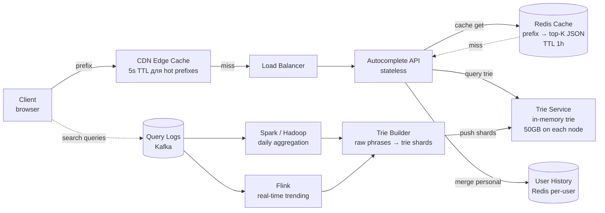
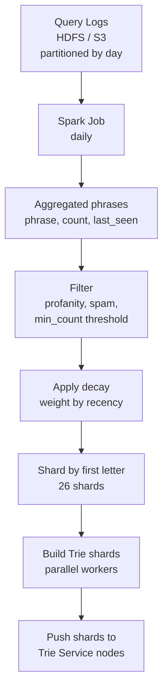
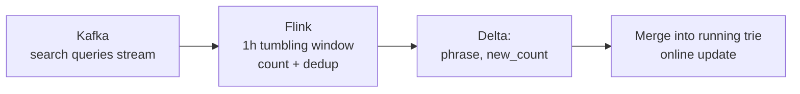
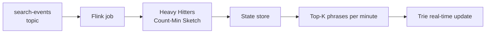

# System Design: `Typeahead / Autocomplete`

`Typeahead` (autocomplete suggestion) — то, что показывает Google под строкой поиска, как только вы начали печатать. На каждый keystroke сервис обязан вернуть top-N подсказок (5-10) за десятки миллисекунд. Глубокий system design: trie с top-K, popularity ranking, real-time + batch pipeline, sharding, personalization, spell correction.

Дата: 2026-05-22.

## Полезные ссылки

- [System Design Interview — Alex Xu, ch. Design Typeahead](https://www.amazon.com/System-Design-Interview-insiders-Second/dp/B08CMF2CQF)
- [How Google autocomplete works](https://blog.google/products/search/google-search-autocomplete/)
- [Designing Data-Intensive Applications — Kleppmann](https://dataintensive.net/)
- [Symspell — fast spell correction](https://github.com/wolfgarbe/SymSpell)
- [Trie data structure (CP-Algorithms)](https://cp-algorithms.com/string/aho_corasick.html)
- [Redis ZRANGEBYLEX](https://redis.io/commands/zrangebylex/)
- [Apache Flink — streaming aggregation](https://flink.apache.org/)

## Содержание

- [Полезные ссылки](#полезные-ссылки)
- [See also](#see-also)

**Requirements и capacity**
- [Q1. (!) Functional и non-functional requirements?](#q1--functional-и-non-functional-requirements)
- [Q2. (!) Capacity estimation?](#q2--capacity-estimation)
- [Q3. Storage estimation для trie?](#q3-storage-estimation-для-trie)

**Trie основа и top-K**
- [Q4. (!) Почему trie, а не SQL `LIKE 'prefix%'`?](#q4--почему-trie-а-не-sql-like-prefix)
- [Q5. (!) Структура trie node с top-K?](#q5--структура-trie-node-с-top-k)
- [Q6. (!) Как обновлять top-K при write?](#q6--как-обновлять-top-k-при-write)
- [Q7. Compressed trie / Radix tree — когда?](#q7-compressed-trie--radix-tree--когда)

**Pipeline (online + offline)**
- [Q8. (!) High-level architecture?](#q8--high-level-architecture)
- [Q9. (!) Offline batch pipeline — как строится trie?](#q9--offline-batch-pipeline--как-строится-trie)
- [Q10. (!) Online query path — как обслуживается запрос?](#q10--online-query-path--как-обслуживается-запрос)

**Sharding и репликация**
- [Q11. (!) Sharding стратегии для trie?](#q11--sharding-стратегии-для-trie)
- [Q12. Replication и failover?](#q12-replication-и-failover)

**Real-time updates и popularity decay**
- [Q13. (!) Hourly delta merge — как добавлять свежие запросы?](#q13--hourly-delta-merge--как-добавлять-свежие-запросы)
- [Q14. Popularity decay / trending — exponential decay?](#q14-popularity-decay--trending--exponential-decay)
- [Q15. Real-time streaming через Flink / Kafka Streams?](#q15-real-time-streaming-через-flink--kafka-streams)

**Spell correction и personalization**
- [Q16. (!) Spell correction — BK-tree, Symspell, Levenshtein?](#q16--spell-correction--bk-tree-symspell-levenshtein)
- [Q17. Personalization — мерж user-specific top-K?](#q17-personalization--мерж-user-specific-top-k)
- [Q18. Geo / locale personalization?](#q18-geo--locale-personalization)

**Latency optimization**
- [Q19. (!) Cache layer (Redis / CDN edge)?](#q19--cache-layer-redis--cdn-edge)
- [Q20. Client-side debouncing и HTTP/2 multiplexing?](#q20-client-side-debouncing-и-http2-multiplexing)
- [Q21. Storage choice — почему in-memory, а не Cassandra/Elasticsearch?](#q21-storage-choice--почему-in-memory-а-не-cassandraelasticsearch)

**Edge cases**
- [Q22. Filtering — profanity, spam, copyright?](#q22-filtering--profanity-spam-copyright)
- [Q23. Empty prefix, unicode, emoji?](#q23-empty-prefix-unicode-emoji)
- [Q24. Privacy и PII в query logs?](#q24-privacy-и-pii-в-query-logs)
- [Q25. A/B testing для ranking changes?](#q25-ab-testing-для-ranking-changes)

**ML ranking и качество**
- [Q26. (!) ML ranking model — Learning-to-Rank поверх trie?](#q26--ml-ranking-model--learning-to-rank-поверх-trie)
- [Q27. Query understanding: entity / intent / category?](#q27-query-understanding-entity--intent--category)
- [Q28. (!) Multi-language: shared trie vs per-locale + transliteration?](#q28--multi-language-shared-trie-vs-per-locale--transliteration)

**Производительность и monitoring**
- [Q29. (!) Monitoring — какие metrics обязательны?](#q29--monitoring--какие-metrics-обязательны)
- [Q30. (!) Антипаттерны и подводные камни?](#q30--антипаттерны-и-подводные-камни)

## Q1. (!) Functional и non-functional requirements?

**Функциональные:**

- На каждое нажатие клавиши возвращать `top-N` подсказок (`N = 5..10`).
- Prefix matching: пользователь печатает `goo`, видит `google`, `goosebumps`, `good morning`.
- Ранжирование по популярности (частота поисков в логах).
- Персонализация: учитывать историю пользователя.
- Исправление опечаток: `gooogle` → `google` (одна опечатка).
- Multi-locale: en-US, ru-RU, en-UK — разные наборы подсказок.
- Trending: актуальные запросы в реальном времени (новости).

**Нефункциональные:**

- `Latency p99 < 100ms` — это критично, иначе UI «лагает» на каждое нажатие.
- `Throughput` ~60K QPS (5B запросов/день / 86400с).
- `Availability` 99.99% — autocomplete не должен падать чаще основного поиска.
- `Freshness`: trending-обновления в течение часа, новые слова — в течение дня.
- `Quality`: точность (precision) важнее полноты (recall) — 5 точных лучше 10 шумных.

**Что вне scope:**

- Сам поиск (выдача результатов) — отдельный дизайн.
- Web crawler / индексация — отдельная подсистема.
- Глубокий ML re-ranking — упрощённо.

## Q2. (!) Capacity estimation?

| Метрика | Значение | Расчёт |
|---|---|---|
| Запросов в день | 5B | дано |
| QPS (в среднем) | ~60K | 5B / 86400 |
| QPS (пик, ×2-3) | ~150K | типичный всплеск трафика |
| Нажатий на запрос | ~5-10 | пользователь печатает 5-10 символов |
| Чтений autocomplete | 30-60K QPS (с debounce) | без debounce было бы 600K |
| Хранение trie | 50-100 GB | ~10M фраз × ~50 байт в среднем |
| Кэш (Redis) | 5-10 GB | топ-1M префиксов × ~5 KB |
| Новых фраз в день | ~100K | новые поисковые запросы |

**Количество серверов:**

- Trie serving: каждый узел держит trie в памяти (box ~64GB). 10-20 узлов для прода (с резервом и репликами).
- Redis cache: кластер из 3-5 узлов по 32GB.
- Агрегация: Spark / Flink — пара десятков executor'ов на ночной job.

> Важно: 60K QPS × 5-10 символов не равно 600K, потому что клиентским debounce (50ms) гасим промежуточные нажатия.

## Q3. Storage estimation для trie?

**Грубая оценка (английский, 10M фраз):**

- Средняя длина фразы: ~20 символов
- Среднее число уникальных узлов на фразу: ~10 (благодаря общим префиксам)
- На узел: 1 символ + map дочерних узлов + список top-K (10 фраз × ~30 байт) = ~400-500 байт

```
nodes ≈ 10M × 10 = 100M
storage ≈ 100M × 500 bytes = 50 GB
```

С репликацией ×3 → 150 GB.

**Со сжатым trie (Radix):** экономия ×2-3 → 15-25 GB на одну реплику. Помещается в RAM одного среднего сервера.

## Q4. (!) Почему trie, а не SQL `LIKE 'prefix%'`?

| Подход | Время prefix lookup | Top-K | Масштабируется? |
|---|---|---|---|
| `SELECT ... LIKE 'goo%' ORDER BY freq DESC LIMIT 10` | O(N) скан или O(log N) с B-tree | нужен ORDER BY на каждый запрос | при 10M фраз — десятки мс даже с индексом |
| Elasticsearch-запрос `prefix` | ~10-50ms | да | работает, но overkill, тяжелее по памяти |
| Redis `ZRANGEBYLEX` | O(log N + M) | да | годится для небольших словарей |
| **Trie с заранее посчитанным top-K** | **O(p)**, где `p` = длина префикса | **уже в узле** | да, главный выбор |

**Trie выигрывает, потому что:**

1. Lookup не зависит от размера словаря — только от длины префикса.
2. `Top-K` хранится в каждом узле — не нужен ORDER BY в рантайме.
3. Полностью in-memory — без диска.

**SQL `LIKE` плох:** даже с B-tree индексом нет предпосчитанного top-K, нужна сортировка на каждый запрос, p99 уплывает за 100ms на больших таблицах.

## Q5. (!) Структура trie node с top-K?

Каждый узел хранит:

- `char` — символ (один)
- `children` — `Map<Char, TrieNode>`
- `is_terminal` — флаг конца слова
- `top_k` — заранее посчитанный массив топ-K фраз с весами, проходящих через этот узел

```java
class TrieNode {
    char ch;
    Map<Character, TrieNode> children = new HashMap<>();
    boolean isTerminal = false;
    String fullPhrase = null;     // только для терминальных
    long frequency = 0;

    // Pre-computed top-K для всех фраз в поддереве
    List<Suggestion> topK = new ArrayList<>(10);
}

record Suggestion(String phrase, long score) {}
```

**Алгоритм lookup:**

```
function query(prefix):
    node = root
    for c in prefix:
        if c not in node.children: return []
        node = node.children[c]
    return node.topK    // O(1) — уже посчитано
```

`O(p)`, где `p` ≤ длине префикса. Для `p = 5` это 5 hash-lookup'ов — десятки наносекунд.

**Альтернатива (без top-K в узле):** на каждый запрос делать BFS/DFS по поддереву и собирать `top-K` — это `O(subtree_size × log K)`, медленно для коротких префиксов вроде `a` (огромное поддерево).

## Q6. (!) Как обновлять top-K при write?

При вставке новой фразы или изменении частоты нужно обновить top-K **во всех узлах префикса**.

**Алгоритм (insert):**

```
function insert(phrase, freq):
    node = root
    path = []
    for c in phrase:
        node = node.children.getOrCreate(c)
        path.append(node)
    node.isTerminal = true
    node.frequency = freq
    node.fullPhrase = phrase

    # Update top-K на всех узлах пути
    for node in path:
        node.topK = merge_topK(node.topK, Suggestion(phrase, freq))
```

`merge_topK` поддерживает min-heap размера K либо сортирует и берёт первые K.

**Важно — ленивое обновление:**

- Писать в trie онлайн на каждый поисковый запрос **нельзя** — O(p × K log K) на каждую запись × 60K QPS = взрыв.
- Решение: trie строится **батчево** (раз в час) на основе агрегированных логов. См. Q9.

**Оптимизация:** если новая фраза не попадает в top-K узла, трогать его не нужно. Проверка дешёвая: `if freq < node.topK.last().score: skip`.

## Q7. Compressed trie / Radix tree — когда?

**Проблема обычного trie:** длинные «коридоры» из узлов с одним ребёнком (`g → o → o → g → l → e`).

**Radix tree (PATRICIA trie):** «схлопывает» такие цепочки в один узел со строковой меткой.

```
plain trie:
g -> o -> o -> g -> l -> e
              \-> d -> b -> y -> e

radix tree:
"goo" -> "gle"
       -> "dbye"
```

**Плюсы:** -50-70% памяти, особенно для словарей с длинными словами.

**Минусы:**

- Сложнее реализация (split / merge при insert).
- Lookup всё равно O(p), но со сравнением строк на каждом «прыжке».

**В проде Google и подобных:** комбинация — radix для компактного хранения + кэш на горячих узлах.

## Q8. (!) High-level architecture?



**Две стороны:**

1. **Online (путь чтения)**: client → CDN → API → Redis → Trie service. Цель — p99 меньше 100ms.
2. **Offline (путь записи)**: логи → агрегация → ранжированные фразы → построение trie → atomic swap.

Они **полностью разделены** — запись не блокирует чтение, потому что новый trie готовится в фоне и подменяется атомарно (как blue-green).

## Q9. (!) Offline batch pipeline — как строится trie?



**Шаг за шагом:**

1. **Агрегация**: за последние 7-30 дней — `SELECT query, COUNT(*) FROM logs GROUP BY query`. Скользящее окно.
2. **Фильтрация**:
   - убрать запросы с count < 10 (шум)
   - убрать ненормативную лексику / спам / запрещёнку
   - убрать PII (похожее на email, номера карт)
3. **Decay**: `weight = sum(occurrences × exp(-λ × days_ago))`. Свежее = тяжелее.
4. **Шардирование**: по первой букве (или диапазону букв) — 26 шардов.
5. **Построение**: каждый шард собирает свой sub-trie с top-K в узлах. Чистая функция, параллелится тривиально.
6. **Публикация**: новые шарды заливаются на trie-серверы. Атомарный swap: загрузили в shadow-структуру → переключили указатель.

**Псевдокод агрегации в Spark:**

```scala
val phrases = spark.read.parquet("logs/2026/05/*")
  .filter($"query".isNotNull && length($"query") <= 50)
  .groupBy("query")
  .agg(
    count("*").as("freq"),
    max("ts").as("last_seen")
  )
  .withColumn("score", $"freq" * exp(-$"days_ago" * 0.1))
  .filter($"freq" >= 10)
```

Job длится десятки минут — для autocomplete это нормально, обновляем раз в сутки + почасовая дельта.

## Q10. (!) Online query path — как обслуживается запрос?

**Последняя миля (бюджет латентности ~100ms):**

```
1. Client debounce 50ms                        →  budget left: 50ms
2. Client → CDN edge:                          ~5-15ms
3. CDN hit?  YES → return immediately. NO →   ~5ms
4. CDN → API gateway → Autocomplete service:   ~5ms
5. Redis GET prefix:                           ~1-2ms
6. Redis hit?  YES → return + write back to CDN
   NO → step 7
7. Trie Service RPC: O(p) lookup:              ~1-5ms
8. Merge with user history (Redis):            ~2ms
9. Filter, ranking adjust:                     ~1ms
10. Response                                   total ~20-50ms
```

**Иерархия кэша:**

- **CDN edge** (TTL 5s для популярных префиксов вроде `g`, `goo`, `goog`) — самые горячие, обновляются часто, но кэшируются на короткое время.
- **Redis** (TTL 1h) — все префиксы, которые когда-либо запрашивали.
- **Trie** — fallback, in-memory, но не такой быстрый, как Redis.

**Пример чтения:**

```http
GET /autocomplete?q=goo&locale=en-US&user_id=42
→
{
  "suggestions": [
    {"text": "google", "score": 0.98},
    {"text": "good morning", "score": 0.85},
    {"text": "goose", "score": 0.62},
    ...
  ]
}
```

## Q11. (!) Sharding стратегии для trie?

Trie 50-100GB — теоретически помещается в RAM одного box (256GB сейчас не редкость). Но ради надёжности и QPS нужно несколько серверов.

**Вариант A — Реплицировать полный trie везде:**

- На каждом из N узлов лежит полная копия trie.
- Любой узел может ответить на любой запрос.
- Плюс: проще роутинг, нет cross-shard lookups.
- Минус: память × N, дороже.
- **Подходит при trie ≤ 100GB и до 50-100 узлов.**

**Вариант B — Шардирование по первой букве (26 шардов):**

- a-шард, b-шард, ..., z-шард.
- Роутинг: client/LB смотрит на первую букву префикса → шлёт в нужный шард.
- Плюс: экономия памяти.
- Минусы:
  - неравномерность (буква `s` — много слов, `x` — мало)
  - сложнее роутинг
  - нет естественного роутинга для не-латиницы

**Вариант C — Шардирование по диапазону префиксов:**

- a-c → shard1, d-g → shard2, ... балансируется по размеру.
- Минимизирует перекос (skew).

**Вариант D — Хэш целого слова:**

- Не работает! При хэшировании префиксы попадают в разные шарды → нельзя сделать prefix lookup.

**Реальный выбор:** в большинстве задач — **реплицировать полный trie** (вариант A), потому что 50-100GB действительно влезает. Шардирование нужно только при словаре > 1B фраз или при multi-locale = много отдельных tries (Q18).

## Q12. Replication и failover?

- **Active-active реплики**: 3+ копии каждого trie-шарда. Чтения балансируются round-robin.
- **Health checks**: каждые 5s. Нездоровый узел вынимается из ротации.
- **Atomic deploy**: новая версия trie льётся на ноду в shadow-структуру → переключение указателя → освобождение старой. Без даунтайма.
- **Rolling deploy**: обновляем по 1 ноде из 3 → проверяем health → следующая.
- **Snapshot**: trie сериализуется в файл и кладётся в S3 — на случай рестарта всех нод (холодный старт без логов).

**Холодный старт:** новая нода загружает последний snapshot из S3 (~10 минут на 50GB), затем догоняет почасовые дельты из Kafka.

## Q13. (!) Hourly delta merge — как добавлять свежие запросы?

Полный rebuild trie занимает часы. Чтобы свежие запросы (вечернее новостное событие, тренды) появлялись быстрее — **почасовая дельта**.



**Логика merge:**

1. Каждый час Flink выдаёт топ-N свежих фраз с их count.
2. Для каждой фразы:
   - Если уже в trie → увеличить частоту, пересчитать top-K на пути.
   - Если новая → insert + обновить top-K.
3. Параллельно — старые фразы с резко упавшей частотой опускаются вниз в top-K (см. decay в Q14).

**Эта операция дешёвая** — десятки тысяч фраз в час, не миллионы. Можно делать **прямо на горячем trie** под коротким lock'ом / copy-on-write на затронутых узлах.

## Q14. Popularity decay / trending — exponential decay?

Старые популярные запросы должны проигрывать новым актуальным.

**Экспоненциальный decay:**

```
score(phrase, now) = Σ over events e: 1 × exp(-λ × (now - e.ts))
```

`λ` задаёт период полураспада (half-life):

- `λ = ln(2) / 7 days` → half-life 7 дней (медленный decay для вечнозелёных запросов)
- `λ = ln(2) / 1 day` → half-life 1 день (для trending)

**В проде** считается **двухуровнево**:

- `long_term_score` — с медленным decay (неделя/месяц), для базового ранжирования
- `short_term_score` — для trending (часы)
- `final = α × long_term + (1-α) × short_term`

`α` подбирается экспериментально — обычно 0.7 для baseline, 0.3-0.5 для локалей, где много новостей.

**Детекция trending:** если `short_term / long_term > threshold` (резкий всплеск) — продвижение в top-K.

## Q15. Real-time streaming через Flink / Kafka Streams?

Trending-подсказки (свежие новости, спортивные события, мемы) должны появляться за минуты, а не за часы.

**Pipeline:**



**Приёмы:**

- **Count-Min Sketch** для приближённого подсчёта частот без хранения миллионов уникальных фраз — экономия памяти.
- **HyperLogLog** для подсчёта уникальных.
- **Tumbling window** 1 мин для trending, 1 ч для слияния в long-term.
- **Heavy Hitters** (Misra-Gries) — топ-K за окно.

**При всплеске:** если новая фраза за 30 секунд появилась 10K раз — пушим её в trie вне очереди, минуя batch.

## Q16. (!) Spell correction — BK-tree, Symspell, Levenshtein?

Пользователь печатает `gooogle` → нужно показать `google`.

**Наивный подход:** для каждого запроса считать расстояние Левенштейна до всех слов в словаре — `O(N × m)`, где N = 10M, m = длина. Не работает.

**BK-tree (Burkhard-Keller):**

- Дерево, использующее метрику расстояния (Левенштейн).
- Lookup: за `O(log N)` найти все слова с расстоянием ≤ d.
- Хорош для расстояния ≤ 2-3.

**Symspell (Wolf Garbe):**

- Заранее вычисляет все возможные «варианты с удалениями» из словаря (для каждого слова — варианты с удалёнными буквами на расстоянии ≤ d).
- При запросе тоже генерим варианты с удалениями из запроса → hash lookup.
- В 1000× быстрее BK-tree, но в 10× больше памяти.

**Стратегия:**

1. Сначала точный prefix match в trie.
2. Если результатов меньше N — добавить варианты с исправленными опечатками через Symspell.
3. Исправленные варианты помечаем в ответе (`"corrected": true`) — UI может показать «Возможно, вы имели в виду...?».

**Расстояние редактирования ≤ 2** покрывает большинство опечаток без ложных срабатываний.

## Q17. Personalization — мерж user-specific top-K?

**Что хранить на пользователя:**

- Недавнюю историю поиска (последние 100 запросов).
- Историю кликов (что выбирал из autocomplete).
- Частоту фраз для конкретного пользователя.

**Хранилище:** Redis `user:<id>:history` — ZSET с фраза → click_count.

**Алгоритм слияния:**

```
function get_personalized_suggestions(prefix, user_id):
    global = trie.query(prefix)               # global top-K
    personal = redis.zrange("user:" + user_id + ":history", prefix)  # personal

    merged = []
    for s in global:
        boost = personal.get(s.phrase, 0) * 2.0   # boost personal
        merged.append((s.phrase, s.score + boost))

    return top_K(merged, K=10)
```

**Приватность:**

- Хэшировать user_id (без PII).
- Опция «отключить персонализацию» — в настройках UI.
- TTL на историю (90 дней).

**Холодный старт:** для нового пользователя — только глобальный top-K. Постепенно накапливается история.

## Q18. Geo / locale personalization?

Запрос `apple` в США → top-K вокруг компании; в России → возможно про фрукт; в Австралии → tech.

**Решение:** отдельные tries на каждую локаль.

- `trie_en_US`, `trie_en_UK`, `trie_ru_RU`, ...
- Роутинг по заголовку `Accept-Language` или гео-IP.
- Для редких локалей — fallback на ближайшую родственную (en-NZ → en-AU → en-UK → en-US).

**Мини-локали (город):** Москва ≠ Питер по trending, но обычно city-level — это overkill, достаточно уровня страны.

**Стоимость:** N локалей × 50GB → суммарно 1-2 TB при 30+ локалях. Распределяется по разным шардам (Q11 — вариант B наконец обретает смысл).

## Q19. (!) Cache layer (Redis / CDN edge)?

**Двухуровневый кэш:**

| Уровень | TTL | Ключ | Hit rate (типично) |
|---|---|---|---|
| **CDN edge** | 5s | `prefix + locale` | 60-70% для горячих префиксов (`g`, `go`, `goo`) |
| **Redis cluster** | 1h | `prefix + locale + user_segment` | 90%+ суммарно |
| **Trie service** | — | полная структура | 100% fallback |

**Почему два уровня:**

- CDN на 5s = свежесть + защита от внезапного всплеска трафика на один префикс (вирусное событие).
- Redis 1h = долговременный hit для всего «длинного хвоста» префиксов.

**Инвалидация кэша:**

- При обновлении trie (почасовая дельта) — **не** инвалидируем всё, ждём естественного истечения TTL.
- Альтернатива: pub/sub-событие `cache-invalidate` на изменённые префиксы.

**Защита от cache stampede:**

- Redis-кэш наполняется лениво при miss → используем `request coalescing` (в данный момент только один запрос в trie service на один префикс).
- Stale-while-revalidate: возвращаем чуть устаревший закэшированный результат, обновляя его в фоне.

## Q20. Client-side debouncing и HTTP/2 multiplexing?

**Debounce на стороне клиента:**

```javascript
let timer = null;
input.addEventListener('input', e => {
    clearTimeout(timer);
    timer = setTimeout(() => fetchAutocomplete(e.target.value), 50);
});
```

50ms — типичное значение: достаточно, чтобы погасить промежуточные нажатия при быстрой печати, и незаметно для пользователя. Снижает QPS в 5-10×.

**HTTP/2 multiplexing:**

- Несколько in-flight запросов на одном TCP-соединении.
- Если предыдущий запрос устарел (пользователь дописал) — отменяем его (`AbortController` в браузере).
- Без HTTP/2 каждое нажатие открывает новое соединение (или ждёт в очереди в HTTP/1.1).

**Переиспользование соединений:**

- API-сервер держит keep-alive с CDN, CDN — с клиентом, так что нет TCP/TLS handshake на каждый запрос.

**Предиктивный пре-фетч:**

- Если пользователь напечатал `goo`, фронт может предзагрузить `goog`, `gool`, `good` — велик шанс, что он их допечатает. Компромисс с объёмом трафика.

## Q21. Storage choice — почему in-memory, а не Cassandra/Elasticsearch?

| Хранилище | p99 latency | Плюсы | Минусы |
|---|---|---|---|
| **In-memory trie** | 1-5ms | lookup за доли мс, предпосчитанный top-K | требует RAM, рестарт = перезагрузка |
| Elasticsearch (prefix query) | 10-50ms | ad-hoc-запросы, full-text | overkill для prefix, горячие шарды |
| Cassandra (token prefix) | 10-30ms | хороша для write-heavy | нет нативного top-K по префиксу, секции читаются целиком |
| Redis ZRANGEBYLEX | 1-3ms | годится для небольших словарей | плохо для top-K + популярности, плохо масштабируется на 10M фраз |
| RocksDB / LevelDB (LSM) | 5-15ms | на диске, ок для огромных словарей | дисковая latency, нужен кэш в RAM |

**Выбор:** in-memory trie. Альтернатива Redis ZRANGEBYLEX подходит для небольших продуктовых autocomplete (поиск по e-commerce-сайту, до 100K фраз) — где важнее простота.

**Elasticsearch в роли primary** — частая ошибка. ES хорош для основного поиска, но autocomplete с p99 < 100ms требует структуры, заточенной под prefix + top-K.

## Q22. Filtering — profanity, spam, copyright?

**Фильтр на этапе сборки (offline pipeline):**

- Блоклист ненормативной лексики / hate speech (для многих языков).
- Copyright-фильтр — известные защищённые названия (если этого требует законодательство).
- Детекция спама — фразы с подозрительными паттернами (SEO-спам, бессмыслица).
- Фильтр персональных данных — запросы с паттернами email / телефона / карты не попадают в trie.

**Фильтр в рантайме:**

- Блоклист на каждую локаль (одно слово ок на en, не ок на ru).
- Режим безопасности на пользователя (kids mode).
- Юридические удаления — Right to be forgotten в EU.

**Побочный эффект:** блоклист нужно обновлять в hot-path (без полного rebuild). Решение — отдельный Bloom filter с запрещёнными фразами, проверяемый на стадии формирования ответа.

## Q23. Empty prefix, unicode, emoji?

**Пустой префикс (пользователь только открыл поле):**

- Показывать **trending** (топ фраз за последний час).
- Или **недавние поиски** пользователя.
- Не возвращать «топ всех времён» — слишком статично.

**Unicode / не-ASCII:**

- Trie работает не на байтах, а на code points / графемах.
- Нормализовать в NFC перед lookup.
- Для китайского / японского: trie по hiragana/pinyin для романизированного ввода + отдельный trie по иероглифам.

**Emoji:**

- Обрабатывать как обычные code points.
- В trie можно проиндексировать `pizza 🍕` — пользователь печатает `pizza` → emoji-вариант видит ниже.

**Регистронезависимость:**

- При сборке и запросе — lowercase. Оригинальный регистр сохранять в `top-K` только для отображения.

**Диакритика (é → e):**

- Опционально срезать — пользователь печатает `cafe` → находит `café`.
- Зависит от локали (в немецком ä, ö, ü — отдельные буквы, а не варианты).

## Q24. Privacy и PII в query logs?

**Принципы:**

1. **K-анонимность для фраз**: фраза попадает в trie только если её искали ≥ K разных пользователей (K = 10-50). Иначе это уникальный поиск конкретного человека.
2. **Редакция PII**: regex для email, телефона, номера карты, SSN — удаляем из логов до агрегации.
3. **Retention**: сырые логи — 30-90 дней, затем удаляются. Агрегированные фразы — без user_id.
4. **История на пользователя**: хранится отдельно, encrypted at rest, TTL 90 дней. Пользователь может удалить.
5. **Right to be forgotten (GDPR)**: API-эндпоинт `DELETE /history/me` → стирает историю пользователя в Redis + ставит flag в log-пайплайне.
6. **Трансграничные данные**: трафик EU не сливается в US-only trie без соблюдения compliance.

**Что НЕ должно попадать в глобальный trie:**

- Поиск собственного имени пользователя.
- Поиск собственного email / телефона / адреса.
- Здоровье / lgbtq / политика — чувствительные категории фильтруются отдельно.

## Q25. A/B testing для ranking changes?

**Инфраструктура:**

- Experiment-инфра (in-house или Optimizely / Split.io).
- Бакетирование по хэшу user_id → группы control / treatment.
- Метрики:
  - **Click-through rate (CTR)** на подсказку — главная.
  - **Time-to-click** — как быстро пользователь делает выбор.
  - **Abandonment rate** — печатал и закрыл без выбора.
  - **Downstream search quality** — как влияет на саму поисковую сессию.

**Какие эксперименты прогонять:**

1. Новая формула decay (λ = 0.1 vs 0.2).
2. Размер top-K (8 vs 10 vs 12).
3. Буст персонализации (×1.5 vs ×2 vs ×3).
4. Порог исправления опечаток (расстояние ≤ 1 vs ≤ 2).

**Статистическая значимость:** обычно нужно 1-2 недели на 1% трафика, чтобы получить решающий сигнал по CTR.

**Shadow traffic / dry-run:**

- Новая логика ранжирования возвращает результат, но не показывается пользователю.
- Сравнение с production по логам.
- Безопасно тестировать радикальные изменения.

## Q26. (!) ML ranking model — Learning-to-Rank поверх trie?

Чистое ранжирование по популярности даёт baseline, но плохо работает для long-tail-запросов и персонализации. Современные autocomplete-системы (Google, Bing, Amazon) применяют ML-ранжирование поверх кандидатов из trie.

**Двухстадийный пайплайн:**

```
client query "good m"
   ↓
1. Candidate generation (trie lookup) → top-50 by popularity
   ↓
2. ML re-ranker (LambdaMART / DLRM / BERT-tiny) → top-10 by score
   ↓
return to client
```

**Стадия 1 — генерация кандидатов:**
- Trie выдаёт top-50 по популярности (широкий recall).
- Дополнительные источники: исправление опечаток, переформулировки запроса, entity-завершения.

**Стадия 2 — ML re-ranker:**
- Признаки (~100):
  - Запрос: длина префикса, есть ли опечатка, вопрос ли это.
  - Кандидат: популярность, свежесть, click_rate, completion_rate (выбран/показан).
  - Пользователь: страна, язык, эмбеддинги истории (вектор последних 100 запросов).
  - Контекст: время суток, день недели, тип устройства.
- Модель:
  - LambdaMART (gradient-boosted trees) — проверена в проде, inference < 5 ms на CPU.
  - DLRM / two-tower neural — для высоконагруженных платформ с GPU-инференсом.
  - BERT-tiny / DistilBERT — для семантической близости (матчинг интента запроса).
- Inference: выделенный ranker-сервис (gRPC), batch по 50 кандидатов на запрос.

**Обучение:**
- Логи кликов → размеченные пары `(query, candidate, clicked: 0/1)`.
- Loss: pairwise ranking loss (LambdaRank) или listwise (ListNet).
- Переобучение еженедельно + online learning через streaming-обновления (Vowpal Wabbit).

**Бюджет латентности:**
- Trie lookup: 5 ms.
- Получение признаков (feature store / Redis): 10 ms.
- ML inference: 5-15 ms.
- Итого: ~25-30 ms — укладывается в бюджет 100 ms p99.

**Компромисс:**
- Чистая популярность: просто, быстро, но плохо для персонализации.
- ML re-ranker: +10-20% CTR (по данным Google), +30-50% вовлечённости на long-tail.
- Цена: GPU/CPU-инференс; поддержка feature store.

## Q27. Query understanding: entity / intent / category?

Не все запросы одинаковы. `apple` может быть фруктом, компанией, музыкальным лейблом. Query understanding улучшает релевантность подсказок.

**Детекция сущностей (entity):**

- Lookup в knowledge graph (Wikidata, ConceptNet) → определяет сущность для префикса.
- Пример: `obama` → сущность `Barack Obama (politician)`.
- Подсказка включает entity-aware-завершения: `obama biography`, `obama age`.

**Классификация интента:**

- ML-классификатор: navigational / informational / transactional / local.
- `pizza near me` → local-интент → буст гео-подсказок.
- `how to tie a tie` → informational → буст how-to-завершений.

**Буст категории:**

- Если пользователь в shopping-сессии (предыдущий клик на товар), бустим product-завершения.
- E-commerce (Amazon): category-aware autocomplete — `iphone` в категории `Electronics` против `Books` даёт разные результаты.

**Реализация:**

```
client query "java"
   ↓
1. Trie candidates (50)
   ↓
2. Entity detector → ["Java (programming)", "Java (island)", "Java (coffee)"]
   ↓
3. Intent classifier → "informational" (history shows tech queries)
   ↓
4. Re-ranker boosts "Java tutorial", "Java spring boot", "Java install" → top-10
```

**Кейсы в проде:**
- Google: глубокое query understanding с BERT, интеграция RankBrain.
- Amazon: контекст категории (текущий browse-путь влияет на завершения).
- Bing: entity-завершения из knowledge graph.

**Компромисс:**
- Качество ↑↑, но latency растёт (+20-30 ms на инференс entity / intent).
- Не для всех запросов — для коротких префиксов (< 3 символов) часто пропускают.

## Q28. (!) Multi-language: shared trie vs per-locale + transliteration?

Глобальный autocomplete должен работать для 50+ языков с разными алфавитами (латиница, кириллица, CJK, арабский).

**Архитектурные варианты:**

**Вариант 1: Один глобальный trie с Unicode-ключами.**
- Все запросы в одном trie.
- Плюс: простая инфраструктура.
- Минус: горячие популярные английские запросы вытесняют локали с малым трафиком (приватность / качество).

**Вариант 2: Trie на каждую локаль (рекомендуется).**
- Отдельный trie на пару `(язык, страна)`: `en-US`, `ru-RU`, `ja-JP`.
- Роутинг на edge по заголовку `Accept-Language` + гео-IP.
- Плюс: популярность специфична для локали, нет взаимного влияния между локалями.
- Минус: больше накладных расходов (N tries в памяти), зато они меньше.

**Вариант 3: Гибрид — базовый trie + наложение локали (overlay).**
- Глобальный trie с универсальными запросами (бренды: `youtube`, `amazon`).
- Locale-specific overlay добавляет популярные локальные запросы.
- Подсказка = merge(global_top_K, locale_top_K) с переранжированием.

**Транслитерация:**

Часто пользователь печатает латиницей, ожидая результат на кириллице / арабском:
- `pelmeni` → `пельмени` (RU).
- `arigato` → `ありがとう` (JA).

**Реализация:**
- При индексации: добавляем транслитерированный alias в trie.
- Например: пара (`pelmeni`, `пельмени`) с популярностью родительской фразы.
- При запросе: префикс `pelm` совпадает и с `pelmeni`, и с кластером `пельмени`.

**Инструменты:**
- Библиотека транслитерации ICU (`Latin-Cyrillic`, `Latin-Hiragana`).
- Кастомные правила для конкретных пар (например, yandex `gost-7.79`).

**Особенности CJK:**

- Китайский / японский / корейский — посимвольные, а не пословные.
- Каждый «символ» = отдельный узел (не как 1 байт латиницы).
- IME (Input Method Editor) — клиент может слать pinyin (`zhong wen`) → подсказать `中文`.
- Две стадии: trie по pinyin → маппинг на китайские иероглифы.

**RTL (справа налево):**

- Арабский / иврит — направление UI разворачивается, но структура trie та же (prefix matching работает по логическому порядку).

**Запросы со смешанным письмом:**

- `iPhone 15` (латиница) и `айфон 15` (кириллица) — показываем оба, оба бустим по популярности.
- Кастомная нормализация: lowercase, NFKC unicode-нормализация, срезание диакритики.

## Q29. (!) Monitoring — какие metrics обязательны?

**Ключевые метрики латентности:**

| Метрика | Цель | Alert |
|---|---|---|
| `typeahead_latency_p50_ms` | < 30 ms | > 60 ms в течение 5 минут |
| `typeahead_latency_p99_ms` | < 100 ms | > 200 ms в течение 5 минут |
| `trie_node_lookup_ms` | < 5 ms | > 15 ms |
| `cache_hit_ratio_redis` | > 90% | < 70% |

**Метрики качества:**

| Метрика | Цель |
|---|---|
| `click_through_rate` (CTR) | > 35% (на показанную подсказку) |
| `time_to_click_p50_ms` | < 800 ms (пользователь быстро находит) |
| `abandonment_rate` | < 20% (пользователь печатал и закрыл) |
| `suggestion_coverage` | > 95% запросов получают ≥ 1 подсказку |

**Свежесть:**

- `trie_age_seconds` — время с последнего delta merge (цель < 1 часа).
- `trending_lag_seconds` — задержка от новостного события до появления в trie (< 10 минут).

**Режимы отказа:**

- `trie_oom_total` — OOM при загрузке trie (alert).
- `cache_stampede_events` — всплеск miss → шторм обращений к БД.
- `ml_inference_timeout_total` — fallback на ранжирование только по trie.

**Бизнес-метрики:**

- `search_session_initiated_from_typeahead` — % поисков, начатых с клика по подсказке.
- `avg_query_length_with_typeahead` — короче, потому что typeahead помогает.

**Трейсинг:**
- OpenTelemetry: trace ID через все синхронные вызовы.
- Семплировать 1% трафика для полного трейса, 100% — для ошибок.

**Дашборды:**
- Latency / CTR по локалям (выявляет региональные проблемы).
- Показы / клики по top-K-подсказкам (выявляет устаревшую популярность).
- Частота срабатывания исправления опечаток (выявляет проблемы с качеством индекса).

**Алертинг:**
- Поднимать on-call: p99 > 200 ms 5 минут подряд.
- Slack: падение CTR > 5% (деградация модели).
- Email: лаг trending > 30 минут.

## Q30. (!) Антипаттерны и подводные камни?

**1. SQL `LIKE 'prefix%'` на каждое нажатие клавиши.**
- p99 > 500 ms даже с индексом; не масштабируется на 60K QPS.
- Используй in-memory trie (Q4).

**2. Опрос БД на каждый запрос без кэша.**
- БД перегружена; latency растёт; стоимость растёт.
- Многоуровневый кэш (Redis + CDN edge) — Q19.

**3. Один глобальный trie без шардирования.**
- Trie на 50 GB не помещается в один JVM heap; GC-паузы 500+ ms.
- Шардирование по первому символу или (locale, первый символ) — Q11.

**4. Синхронное обновление счётчиков популярности на каждый поиск.**
- Hot key на популярный запрос → шторм блокировок строк.
- Асинхронный пайплайн: search log → Kafka → агрегация Flink → батчевое обновление trie (Q13).

**5. Делать ML-инференс на каждое нажатие без debouncing.**
- Один пользователь печатает 10 символов → 10 ML-вызовов.
- Client-side debounce 150 ms + отмена предыдущего при новом нажатии (Q20).

**6. Не учитывать длину префикса в ранжировании.**
- Префикс `a` (популярный) даёт top-K, но они быстро становятся нерелевантными.
- Бустить кандидатов с длиной ближе к префиксу (`a` → `apple` лучше, чем `a quick brown fox`).

**7. Хранить полную историю пользователя в глобальном trie.**
- Утечка PII, нарушение GDPR; компрометация приватности между пользователями.
- Персонализация на пользователя — в отдельном хранилище, merge на чтении (Q17, Q24).

**8. Игнорировать unicode-нормализацию.**
- `café` (NFC) и `café` (NFD, decomposed) — разные строки в trie.
- ICU NFKC-нормализация на индексации + запросе (Q23).

**9. Не фильтровать оскорбительные / спам-запросы.**
- Топовая подсказка = спам-кейворд = удар по бренду (мемы про «autocomplete fail» у Google).
- Блоклист + ML-классификатор + ручное ревью топовых категорий (Q22).

**10. Загрузка всего trie на старте без прогрева.**
- Первые 5 минут после деплоя — холодный кэш, p99 > 1 сек.
- Предзагрузить топ-1K шардов, постепенно прогреть остальное.

**11. Не учитывать вирусное / trending в реальном времени.**
- Новостное событие, всплеск запросов → подсказки устаревшие.
- Real-time-стрим (Flink) добавляет trending в trie за < 10 минут (Q15).

**12. ML-модель без offline-оценки перед раскаткой.**
- Сломанный ranker → CTR падает на 30%; удар по выручке.
- Shadow traffic + offline NDCG-оценка + канареечная раскатка 1% → 5% → 50% (Q25).

**13. Единая точка отказа — один Redis для кэша.**
- Падение Redis → 100K запросов/сек в БД → крах БД.
- Redis Cluster + circuit breaker с fallback на локальный Caffeine (Q19).

**14. Игнорировать языки с письмом справа налево в UI.**
- UI для арабского / иврита ломается, подсказка рендерится наоборот.
- RTL-aware CSS + логический порядок в trie (Q28).

**15. Без мониторинга дрейфа CTR.**
- Устаревшая популярность, сломанная модель — никто не заметит неделями.
- Ежедневные алерты на CTR по локалям при дрейфе > 5% (Q29).

---

## See also

- [System Design Interview (общий обзор)](system-design-interview.md)
- [Design Search System](design-search-interview.md)
- [Design Instagram](design-instagram-interview.md)
- [Design Twitter](design-twitter-interview.md)
- [Caching strategies](../architecture/caching-strategies-interview.md)
- [Scalability patterns](../architecture/scalability-patterns-interview.md)
- [CDN](../architecture/cdn-interview.md)
- [Latency numbers every programmer should know](../architecture/latency-numbers-interview.md)
- [Redis](../databases/redis-interview.md)
- [Elasticsearch](../databases/elasticsearch-interview.md)
- [Trees (trie data structure)](../algorithms/data-structures/trees-interview.md)
- [Hash tables](../algorithms/data-structures/hash-tables-interview.md)
