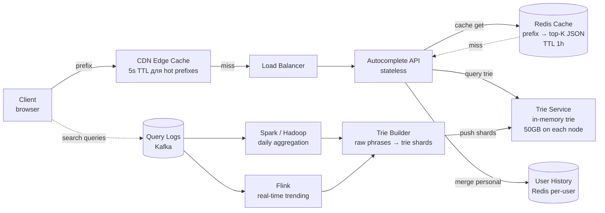
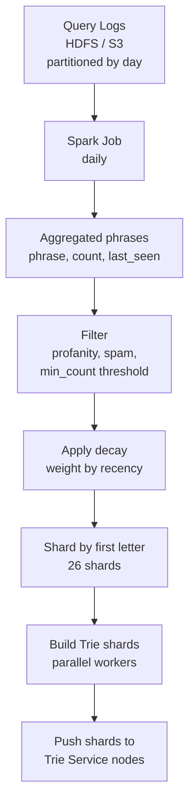
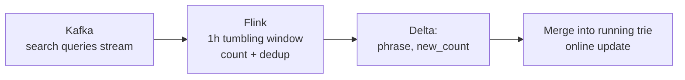

# System Design: `Typeahead / Autocomplete`

`Typeahead` (autocomplete suggestion) — то, что показывает Google под строкой поиска, как только вы начали печатать. На каждый keystroke сервис обязан вернуть top-N подсказок (5-10) за десятки миллисекунд. Глубокий system design: trie с top-K, popularity ranking, real-time + batch pipeline, sharding, personalization, spell correction.

Дата: 2026-05-22.

## Полезные ссылки

- [System Design Interview — Alex Xu, ch. Design Typeahead](https://www.amazon.com/System-Design-Interview-insiders-Second/dp/B08CMF2CQF)
- [How Google autocomplete works](https://blog.google/products/search/google-search-autocomplete/)
- [Designing Data-Intensive Applications — Kleppmann](https://dataintensive.net/)
- [Symspell — fast spell correction](https://github.com/wolfgarbe/SymSpell)
- [Trie data structure (CP-Algorithms)](https://cp-algorithms.com/string/aho_corasick.html)
- [Redis ZRANGEBYLEX](https://redis.io/commands/zrangebylex/)
- [Apache Flink — streaming aggregation](https://flink.apache.org/)

## Содержание

- [Полезные ссылки](#полезные-ссылки)
- [See also](#see-also)

**Requirements и capacity**
- [Q1. (!) Functional и non-functional requirements?](#q1--functional-и-non-functional-requirements)
- [Q2. (!) Capacity estimation?](#q2--capacity-estimation)
- [Q3. Storage estimation для trie?](#q3-storage-estimation-для-trie)

**Trie основа и top-K**
- [Q4. (!) Почему trie, а не SQL `LIKE 'prefix%'`?](#q4--почему-trie-а-не-sql-like-prefix)
- [Q5. (!) Структура trie node с top-K?](#q5--структура-trie-node-с-top-k)
- [Q6. (!) Как обновлять top-K при write?](#q6--как-обновлять-top-k-при-write)
- [Q7. Compressed trie / Radix tree — когда?](#q7-compressed-trie--radix-tree--когда)

**Pipeline (online + offline)**
- [Q8. (!) High-level architecture?](#q8--high-level-architecture)
- [Q9. (!) Offline batch pipeline — как строится trie?](#q9--offline-batch-pipeline--как-строится-trie)
- [Q10. (!) Online query path — как обслуживается запрос?](#q10--online-query-path--как-обслуживается-запрос)

**Sharding и репликация**
- [Q11. (!) Sharding стратегии для trie?](#q11--sharding-стратегии-для-trie)
- [Q12. Replication и failover?](#q12-replication-и-failover)

**Real-time updates и popularity decay**
- [Q13. (!) Hourly delta merge — как добавлять свежие запросы?](#q13--hourly-delta-merge--как-добавлять-свежие-запросы)
- [Q14. Popularity decay / trending — exponential decay?](#q14-popularity-decay--trending--exponential-decay)
- [Q15. Real-time streaming через Flink / Kafka Streams?](#q15-real-time-streaming-через-flink--kafka-streams)

**Spell correction и personalization**
- [Q16. (!) Spell correction — BK-tree, Symspell, Levenshtein?](#q16--spell-correction--bk-tree-symspell-levenshtein)
- [Q17. Personalization — мерж user-specific top-K?](#q17-personalization--мерж-user-specific-top-k)
- [Q18. Geo / locale personalization?](#q18-geo--locale-personalization)

**Latency optimization**
- [Q19. (!) Cache layer (Redis / CDN edge)?](#q19--cache-layer-redis--cdn-edge)
- [Q20. Client-side debouncing и HTTP/2 multiplexing?](#q20-client-side-debouncing-и-http2-multiplexing)
- [Q21. Storage choice — почему in-memory, а не Cassandra/Elasticsearch?](#q21-storage-choice--почему-in-memory-а-не-cassandraelasticsearch)

**Edge cases**
- [Q22. Filtering — profanity, spam, copyright?](#q22-filtering--profanity-spam-copyright)
- [Q23. Empty prefix, unicode, emoji?](#q23-empty-prefix-unicode-emoji)
- [Q24. Privacy и PII в query logs?](#q24-privacy-и-pii-в-query-logs)
- [Q25. A/B testing для ranking changes?](#q25-ab-testing-для-ranking-changes)

**ML ranking и качество**
- [Q26. (!) ML ranking model — Learning-to-Rank поверх trie?](#q26--ml-ranking-model--learning-to-rank-поверх-trie)
- [Q27. Query understanding: entity / intent / category?](#q27-query-understanding-entity--intent--category)
- [Q28. (!) Multi-language: shared trie vs per-locale + transliteration?](#q28--multi-language-shared-trie-vs-per-locale--transliteration)

**Производительность и monitoring**
- [Q29. (!) Monitoring — какие metrics обязательны?](#q29--monitoring--какие-metrics-обязательны)
- [Q30. (!) Антипаттерны и подводные камни?](#q30--антипаттерны-и-подводные-камни)

## Q1. (!) Functional и non-functional requirements?

**Functional:**

- На каждый keystroke возвращать `top-N` suggestions (`N = 5..10`).
- Prefix matching: пользователь печатает `goo`, видит `google`, `goosebumps`, `good morning`.
- Ranking по popularity (частота поисков в логах).
- Personalization: учитывать историю пользователя.
- Spell correction: `gooogle` → `google` (1 typo).
- Multi-locale: en-US, ru-RU, en-UK — разные suggestion-наборы.
- Trending: real-time актуальные запросы (новости).

**Non-functional:**

- `Latency p99 < 100ms` — это критично, иначе UI «лагает» на каждое нажатие.
- `Throughput` ~60K QPS (5B запросов/день / 86400с).
- `Availability` 99.99% — autocomplete не должен падать чаще основного поиска.
- `Freshness`: trending updates в течение часа, новые слова — в течение дня.
- `Quality`: precision важнее recall (5 точных лучше 10 шумных).

**Scope (out):**

- Сам поиск (выдача результатов) — отдельный design.
- Web crawler / indexing — отдельная подсистема.
- ML re-ranking deep — упрощённо.

## Q2. (!) Capacity estimation?

| Метрика | Значение | Расчёт |
|---|---|---|
| Daily queries | 5B | given |
| QPS (average) | ~60K | 5B / 86400 |
| QPS (peak, ×2-3) | ~150K | typical traffic spike |
| Keystrokes per query | ~5-10 | пользователь печатает 5-10 символов |
| Autocomplete reads | 30-60K QPS (с debounce) | без debounce было бы 600K |
| Trie storage | 50-100 GB | ~10M phrases × ~50 bytes avg |
| Cache (Redis) | 5-10 GB | top 1M prefixes × ~5 KB |
| Daily new phrases | ~100K | новые поисковые запросы |

**Server count:**

- Trie serving: каждый узел держит trie в памяти (~64GB box). 10-20 nodes для прода (с резервом и репликами).
- Redis cache: 3-5 node cluster, по 32GB.
- Aggregation: Spark / Flink — пара десятков executor'ов на ночной job.

> Важно: 60K QPS × 5-10 chars не равно 600K, потому что мы клиентским debounce'ом (50ms) гасим промежуточные нажатия.

## Q3. Storage estimation для trie?

**Грубая оценка (English, 10M phrases):**

- Avg phrase length: ~20 chars
- Avg unique nodes per phrase: ~10 (благодаря shared prefixes)
- Per node: 1 char + map of children + top-K list (10 phrases × ~30 bytes) = ~400-500 bytes

```
nodes ≈ 10M × 10 = 100M
storage ≈ 100M × 500 bytes = 50 GB
```

С replication ×3 → 150 GB.

**С compressed trie (Radix):** ×2-3 экономия → 15-25 GB на одну реплику. Помещается в RAM одного среднего сервера.

## Q4. (!) Почему trie, а не SQL `LIKE 'prefix%'`?

| Подход | Время prefix lookup | Top-K | Масштабируется? |
|---|---|---|---|
| `SELECT ... LIKE 'goo%' ORDER BY freq DESC LIMIT 10` | O(N) scan или O(log N) с B-tree | требуется ORDER BY на каждый запрос | при 10M phrases — десятки ms даже с индексом |
| Elasticsearch `prefix` query | ~10-50ms | да | OK, но overkill, тяжелее памяти |
| Redis `ZRANGEBYLEX` | O(log N + M) | да | работает для маленьких словарей |
| **Trie с pre-computed top-K** | **O(p)** где `p` = prefix length | **уже в узле** | да, главный выбор |

**Trie выигрывает, потому что:**

1. Lookup независим от размера словаря — только от длины префикса.
2. `Top-K` хранится в каждом узле — не нужен ORDER BY на runtime.
3. Полностью in-memory — без диска.

**SQL `LIKE` плох:** даже с B-tree индексом — нет precomputed top-K, нужен sort на каждый запрос, p99 уплывает за 100ms на больших таблицах.

## Q5. (!) Структура trie node с top-K?

Каждый узел хранит:

- `char` — символ (один)
- `children` — `Map<Char, TrieNode>`
- `is_terminal` — флаг конца слова
- `top_k` — заранее посчитанный массив топ-K фраз с весом, проходящих через этот узел

```java
class TrieNode {
    char ch;
    Map<Character, TrieNode> children = new HashMap<>();
    boolean isTerminal = false;
    String fullPhrase = null;     // только для терминальных
    long frequency = 0;

    // Pre-computed top-K для всех фраз в поддереве
    List<Suggestion> topK = new ArrayList<>(10);
}

record Suggestion(String phrase, long score) {}
```

**Lookup алгоритм:**

```
function query(prefix):
    node = root
    for c in prefix:
        if c not in node.children: return []
        node = node.children[c]
    return node.topK    // O(1) — уже посчитано
```

`O(p)` где `p` ≤ длине префикса. Для `p = 5` это 5 hash-lookup'ов — десятки наносекунд.

**Альтернатива (без top-K в узле):** на каждый query делать BFS/DFS по поддереву и собирать `top-K` — это `O(subtree_size × log K)`, медленно для коротких префиксов вроде `a` (огромное поддерево).

## Q6. (!) Как обновлять top-K при write?

При вставке новой фразы или изменении frequency нужно обновить top-K **во всех узлах префикса**.

**Algorithm (insert):**

```
function insert(phrase, freq):
    node = root
    path = []
    for c in phrase:
        node = node.children.getOrCreate(c)
        path.append(node)
    node.isTerminal = true
    node.frequency = freq
    node.fullPhrase = phrase

    # Update top-K на всех узлах пути
    for node in path:
        node.topK = merge_topK(node.topK, Suggestion(phrase, freq))
```

`merge_topK` поддерживает min-heap размера K или сортирует и берёт первые K.

**Important — lazy update:**

- Online писать в trie на каждый поисковый запрос **нельзя** — O(p × K log K) на каждый write × 60K QPS = взрыв.
- Решение: trie строится **батчево** (раз в час) на основе агрегированных логов. См. Q9.

**Optimization:** если новая фраза не попадает в top-K узла, не нужно его трогать. Проверка дешёвая: `if freq < node.topK.last().score: skip`.

## Q7. Compressed trie / Radix tree — когда?

**Проблема обычного trie:** длинные «коридоры» из узлов с одним ребёнком (`g → o → o → g → l → e`).

**Radix tree (PATRICIA trie):** «схлопывает» цепочки в один узел с строковой меткой.

```
plain trie:
g -> o -> o -> g -> l -> e
              \-> d -> b -> y -> e

radix tree:
"goo" -> "gle"
       -> "dbye"
```

**Pros:** -50-70% памяти, особенно для словарей с длинными словами.

**Cons:**

- Сложнее реализация (split / merge при insert).
- Lookup всё равно O(p), но с string-comparison на каждом «прыжке».

**В проде Google/etc:** комбинация — radix для compact storage + кэш на горячих узлах.

## Q8. (!) High-level architecture?



**Две стороны:**

1. **Online (read path)**: client → CDN → API → Redis → Trie service. Цель — sub-100ms p99.
2. **Offline (write path)**: logs → aggregation → ranked phrases → trie build → atomic swap.

Они **разделены полностью** — write не блокирует read, потому что новый trie готовится в фоне и подменяется атомарно (как blue-green).

## Q9. (!) Offline batch pipeline — как строится trie?



**Step by step:**

1. **Aggregate**: за последние 7-30 дней — `SELECT query, COUNT(*) FROM logs GROUP BY query`. Sliding window.
2. **Filter**:
   - убрать запросы с count < 10 (шум)
   - убрать profanity / спам / запрещёнку
   - убрать PII (email-подобные, номера карт)
3. **Decay**: `weight = sum(occurrences × exp(-λ × days_ago))`. Свежее = тяжелее.
4. **Shard**: по первой букве (или диапазону букв) — 26 shards.
5. **Build**: каждый shard собирает свой sub-trie с top-K в узлах. Pure-функция, параллелится тривиально.
6. **Publish**: новые shards заливаются на trie-серверы. Атомарный swap: загрузили в shadow-структуре → переключили pointer.

**Pseudo-code Spark aggregation:**

```scala
val phrases = spark.read.parquet("logs/2026/05/*")
  .filter($"query".isNotNull && length($"query") <= 50)
  .groupBy("query")
  .agg(
    count("*").as("freq"),
    max("ts").as("last_seen")
  )
  .withColumn("score", $"freq" * exp(-$"days_ago" * 0.1))
  .filter($"freq" >= 10)
```

Job длится десятки минут — для autocomplete это OK, обновляем раз в сутки + hourly delta.

## Q10. (!) Online query path — как обслуживается запрос?

**Last mile (latency budget ~100ms):**

```
1. Client debounce 50ms                        →  budget left: 50ms
2. Client → CDN edge:                          ~5-15ms
3. CDN hit?  YES → return immediately. NO →   ~5ms
4. CDN → API gateway → Autocomplete service:   ~5ms
5. Redis GET prefix:                           ~1-2ms
6. Redis hit?  YES → return + write back to CDN
   NO → step 7
7. Trie Service RPC: O(p) lookup:              ~1-5ms
8. Merge with user history (Redis):            ~2ms
9. Filter, ranking adjust:                     ~1ms
10. Response                                   total ~20-50ms
```

**Cache hierarchy:**

- **CDN edge** (5s TTL для популярных префиксов вроде `g`, `goo`, `goog`) — самые горячие, обновляются часто но кэшируются короткое время.
- **Redis** (1h TTL) — все префиксы, которые когда-либо запрашивали.
- **Trie** — fallback, in-memory но не такой быстрый как Redis.

**Read example:**

```http
GET /autocomplete?q=goo&locale=en-US&user_id=42
→
{
  "suggestions": [
    {"text": "google", "score": 0.98},
    {"text": "good morning", "score": 0.85},
    {"text": "goose", "score": 0.62},
    ...
  ]
}
```

## Q11. (!) Sharding стратегии для trie?

Trie 50-100GB — теоретически помещается в RAM одного box (256GB сейчас не редкость). Но для надёжности и QPS нужно несколько серверов.

**Вариант A — Replicate full trie everywhere:**

- На каждом из N nodes лежит полная копия trie.
- Любой узел может ответить на любой query.
- Plus: проще роутинг, нет cross-shard lookups.
- Minus: память × N, дороже.
- **Подходит при ≤ 100GB trie и до 50-100 nodes.**

**Вариант B — Shard by first letter (26 shards):**

- a-shard, b-shard, ..., z-shard.
- Routing: client/LB смотрит на первую букву prefix → шлёт в нужный shard.
- Plus: экономия памяти.
- Minus:
  - неравномерность (буква `s` — много слов, `x` — мало)
  - сложнее routing
  - нет естественного routing для не-латиницы

**Вариант C — Shard by prefix range:**

- a-c → shard1, d-g → shard2, ... балансируется по размеру.
- Минимизирует skew.

**Вариант D — Hash full word:**

- Не работает! При hash префиксы попадают в разные shards → нельзя сделать prefix lookup.

**Реальный выбор:** в большинстве задач — **replicate full trie** (Variant A), потому что 50-100GB действительно влезает. Шардинг нужен только при vocabulary > 1B phrases или multi-locale = много отдельных tries (Q18).

## Q12. Replication и failover?

- **Active-active replicas**: 3+ копии каждого trie shard. Reads балансируются round-robin.
- **Health checks**: каждые 5s. Unhealthy node вынимается из ротации.
- **Atomic deploy**: новая версия trie льётся на ноду в shadow-структуру → swap pointer → release старой. Без даунтайма.
- **Rolling deploy**: обновляем по 1 ноде из 3 → проверяем health → следующая.
- **Snapshot**: trie сериализуется в файл, в S3 — на случай restart всех нод (cold start без logs).

**Cold start:** новая нода загружает последний snapshot из S3 (~10 минут на 50GB), потом догоняет hourly deltas из Kafka.

## Q13. (!) Hourly delta merge — как добавлять свежие запросы?

Полный rebuild trie занимает часы. Чтобы свежие запросы (вечерний news event, тренды) появлялись быстрее — **hourly delta**.



**Merge logic:**

1. Каждый час Flink выдаёт топ-N свежих phrases с count.
2. Для каждой phrase:
   - Если уже в trie → bump frequency, пересчитать top-K на пути.
   - Если новая → insert + update top-K.
3. Параллельно — старые phrases с резко упавшей частотой опускаются вниз top-K (см. decay в Q14).

**Эта операция дешёвая** — десятки тысяч phrases в час, не миллионы. Можно делать **прямо на горячем trie** под коротким lock'ом / copy-on-write на затронутых узлах.

## Q14. Popularity decay / trending — exponential decay?

Старые популярные запросы должны проигрывать новым актуальным.

**Exponential decay:**

```
score(phrase, now) = Σ over events e: 1 × exp(-λ × (now - e.ts))
```

`λ` определяет half-life:

- `λ = ln(2) / 7 days` → half-life 7 дней (медленный decay для эвергрин-запросов)
- `λ = ln(2) / 1 day` → half-life 1 день (для trending)

**В проде** считается **двухуровнево**:

- `long_term_score` — с медленным decay (week/month), для базового ranking
- `short_term_score` — для trending (часы)
- `final = α × long_term + (1-α) × short_term`

`α` подбирается экспериментально — обычно 0.7 для baseline, 0.3-0.5 для locales где много новостей.

**Trending detection:** если `short_term / long_term > threshold` (резкий всплеск) — promotion в top-K.

## Q15. Real-time streaming через Flink / Kafka Streams?

Trending suggestions (свежие новости, спортивные события, мемы) появляются за минуты, а не часы.

**Pipeline:**


**Tricks:**

- **Count-Min Sketch** для приближённого подсчёта частот без хранения миллионов уникальных phrases — экономия памяти.
- **HyperLogLog** для unique count.
- **Tumbling window** 1min для trending, 1h для merge into long-term.
- **Heavy Hitters algorithm** (Misra-Gries) — топ-K за окно.

**При burst:** если новая phrase появилась за 30 секунд 10K раз — пушим её в trie вне очереди, минуя batch.

## Q16. (!) Spell correction — BK-tree, Symspell, Levenshtein?

Пользователь печатает `gooogle` → должны показать `google`.

**Naive подход:** для каждого запроса проверить Levenshtein distance до всех слов в словаре — `O(N × m)`, где N = 10M, m = длина. Не работает.

**BK-tree (Burkhard-Keller):**

- Дерево, использующее metric distance (Levenshtein).
- Lookup: за `O(log N)` найти все слова с distance ≤ d.
- Хорош для distance ≤ 2-3.

**Symspell (Wolf Garbe):**

- Pre-compute все возможные «удалённые варианты» из dictionary (для каждого word — варианты с удалёнными буквами на distance ≤ d).
- При query тоже генерим удалённые варианты query → hash lookup.
- В 1000× быстрее BK-tree, но в 10× больше памяти.

**Strategy:**

1. Сначала точное prefix match в trie.
2. Если результатов меньше N — добавить spell-corrected варианты через Symspell.
3. Spell-corrected помечаем в response (`"corrected": true`) — UI может показать «Did you mean...?».

**Edit distance ≤ 2** покрывает большинство опечаток без false positives.

## Q17. Personalization — мерж user-specific top-K?

**Что хранить per user:**

- Recent search history (last 100 queries).
- Click history (что выбрал из autocomplete).
- Per-user phrase frequency.

**Storage:** Redis `user:<id>:history` — ZSET с phrase → click_count.

**Merge algorithm:**

```
function get_personalized_suggestions(prefix, user_id):
    global = trie.query(prefix)               # global top-K
    personal = redis.zrange("user:" + user_id + ":history", prefix)  # personal

    merged = []
    for s in global:
        boost = personal.get(s.phrase, 0) * 2.0   # boost personal
        merged.append((s.phrase, s.score + boost))

    return top_K(merged, K=10)
```

**Privacy:**

- Hash user_id (no PII).
- Опция «turn off personalization» — UI controls.
- TTL на history (90 дней).

**Cold start:** новый пользователь — только global top-K. Постепенно набирается история.

## Q18. Geo / locale personalization?

Запрос `apple` в США → top-K вокруг компании; в России → возможно про фрукт; в Австралии → tech.

**Решение:** отдельные tries per locale.

- `trie_en_US`, `trie_en_UK`, `trie_ru_RU`, ...
- Routing по `Accept-Language` header или IP geo.
- Для редких locales — fallback на ближайший родственный (en-NZ → en-AU → en-UK → en-US).

**Mini-locales (city):** Москва ≠ Питер по trending, но обычно city-level overkill — достаточно country.

**Стоимость:** N locales × 50GB → суммарно 1-2 TB при 30+ locales. Распределяется по разным шардам (Q11 — Variant B наконец имеет смысл).

## Q19. (!) Cache layer (Redis / CDN edge)?

**Two-tier cache:**

| Layer | TTL | Key | Hit rate (типично) |
|---|---|---|---|
| **CDN edge** | 5s | `prefix + locale` | 60-70% для hot prefixes (`g`, `go`, `goo`) |
| **Redis cluster** | 1h | `prefix + locale + user_segment` | 90%+ overall |
| **Trie service** | — | full structure | 100% fallback |

**Почему два уровня:**

- CDN на 5s = свежесть + защита от внезапного traffic spike на один prefix (viral event).
- Redis 1h = долговременный hit для всего «длинного хвоста» префиксов.

**Cache invalidation:**

- При update trie (hourly delta) — **не** инвалидируем всё, ждём естественного TTL.
- Альтернатива: pub/sub `cache-invalidate` событие на изменённые префиксы.

**Cache stampede protection:**

- Redis cache populated lazily при miss → используем `request coalescing` (только один запрос в trie service на один prefix в данный момент).
- Stale-while-revalidate: возвращаем чуть устаревший cached результат, фоном обновляем.

## Q20. Client-side debouncing и HTTP/2 multiplexing?

**Client-side debounce:**

```javascript
let timer = null;
input.addEventListener('input', e => {
    clearTimeout(timer);
    timer = setTimeout(() => fetchAutocomplete(e.target.value), 50);
});
```

50ms типично — достаточно, чтобы погасить промежуточные нажатия при быстрой печати, и незаметно для пользователя. Снижает QPS в 5-10×.

**HTTP/2 multiplexing:**

- Множественные in-flight requests на одном TCP connection.
- Если предыдущий request устарел (пользователь дописал) — отменяем (`AbortController` в браузере).
- Без HTTP/2 — каждое нажатие открывает новый connection (или ждёт в очереди в HTTP/1.1).

**Connection reuse:**

- API server держит keep-alive с CDN, CDN с client — нет TCP/TLS handshake на каждый запрос.

**Predictive pre-fetch:**

- Если пользователь напечатал `goo`, фронт может предзагрузить `goog`, `gool`, `good` — chances они потом напечатают. Trade-off с traffic.

## Q21. Storage choice — почему in-memory, а не Cassandra/Elasticsearch?

| Storage | p99 latency | Pros | Cons |
|---|---|---|---|
| **In-memory trie** | 1-5ms | sub-ms lookup, precomputed top-K | требует RAM, restart = reload |
| Elasticsearch (prefix query) | 10-50ms | ad-hoc queries, full-text | overkill для prefix, hot shards |
| Cassandra (token prefix) | 10-30ms | хорошо для write-heavy | нет нативного top-K по prefix, секции читаются полностью |
| Redis ZRANGEBYLEX | 1-3ms | работает для маленьких словарей | плохо для top-K + popularity, плохо масштабируется на 10M phrases |
| RocksDB / LevelDB (LSM) | 5-15ms | disk-based, ОК для огромных словарей | дисковая latency, нужен кэш в RAM |

**Выбор:** in-memory trie. Альтернатива Redis ZRANGEBYLEX подходит для small-scale продуктовых autocomplete (e-commerce site search, до 100K phrases) — простота прежде всего.

**Elasticsearch как primary** — частая ошибка. ES хорош для основного поиска, но autocomplete с p99 < 100ms требует структуры заточенной под prefix + top-K.

## Q22. Filtering — profanity, spam, copyright?

**Build-time filter (offline pipeline):**

- Блоклист profanity / hate speech (multi-language).
- Copyright filter — известные защищённые названия (если требуется по законодательству).
- Spam detection — фразы с подозрительными паттернами (SEO spam, gibberish).
- Personal data filter — query с email-like / phone-like / card-like patterns не попадают в trie.

**Runtime filter:**

- Per-locale blocklist (одно слово ОК на en, не ОК на ru).
- Per-user safety mode (kids mode).
- Legal removals — Right to be forgotten в EU.

**Side effect:** blocklist надо обновлять в hot-path (без полного rebuild). Решение — отдельный Bloom filter с запрещёнными phrases, проверяется на response stage.

## Q23. Empty prefix, unicode, emoji?

**Empty prefix (пользователь только открыл поле):**

- Показывать **trending** (top phrases за последний час).
- Или **recent searches** пользователя.
- Не возвращать «топ всех времён» — слишком статично.

**Unicode / non-ASCII:**

- Trie работает не на байтах, а на code points / graphemes.
- Normalize NFC перед lookup.
- Для китайского / японского: trie по hiragana/pinyin для романизированного ввода + отдельная trie по символам.

**Emoji:**

- Treat as regular code points.
- В trie можно индексировать `pizza 🍕` — пользователь печатает `pizza` → emoji-вариант видит ниже.

**Case-insensitivity:**

- При build и query — lowercase. Сохранять original case в `top-K` только для отображения.

**Diacritics (é → e):**

- Опционально strip — пользователь печатает `cafe` → находит `café`.
- Locale-зависимо (в немецком ä, ö, ü — отдельные буквы, не варианты).

## Q24. Privacy и PII в query logs?

**Принципы:**

1. **K-anonymity для phrases**: фраза попадает в trie только если её искали ≥ K разных пользователей (K = 10-50). Иначе — это уникальный поиск конкретного человека.
2. **PII redaction**: regex для email, phone, credit card, SSN — удаляем из logs до aggregation.
3. **Retention**: raw logs — 30-90 дней, потом удаляются. Aggregated phrases — без user_id.
4. **Per-user history**: отдельно, encrypted at rest, TTL 90 дней. Пользователь может удалить.
5. **Right to be forgotten (GDPR)**: API endpoint `DELETE /history/me` → стирает user-history Redis + flag в log pipeline.
6. **Cross-border data**: EU traffic не сливается в US-only trie без compliance.

**Что НЕ должно попадать в global trie:**

- Поиск собственного имени пользователя.
- Поиск собственного email/телефона/адреса.
- Здоровье / lgbtq / political — controversial категории фильтруются отдельно.

## Q25. A/B testing для ranking changes?

**Setup:**

- Experiment infra (in-house или Optimizely / Split.io).
- Bucketing по user_id hash → control / treatment группы.
- Метрики:
  - **Click-through rate (CTR)** на suggestion — главный.
  - **Time-to-click** — насколько быстро пользователь выбирает.
  - **Abandonment rate** — печатал и закрыл без выбора.
  - **Downstream search quality** — pour into actual search session.

**Experiments to run:**

1. Новая формула decay (λ = 0.1 vs 0.2).
2. Top-K size (8 vs 10 vs 12).
3. Personalization boost (×1.5 vs ×2 vs ×3).
4. Spell correction threshold (distance ≤ 1 vs ≤ 2).

**Statistical significance:** обычно нужно 1-2 недели на 1% traffic для решающего сигнала на CTR.

**Shadow traffic / dry-run:**

- Новая ranking логика возвращает результат, но не показывается пользователю.
- Сравнение с production на logs.
- Безопасно тестировать радикальные изменения.

## Q26. (!) ML ranking model — Learning-to-Rank поверх trie?

Pure popularity ranking даёт baseline, но плохо для long-tail queries и personalization. Современные autocomplete системы (Google, Bing, Amazon) применяют ML-ranking поверх candidates из trie.

**Two-stage pipeline:**

```
client query "good m"
   ↓
1. Candidate generation (trie lookup) → top-50 by popularity
   ↓
2. ML re-ranker (LambdaMART / DLRM / BERT-tiny) → top-10 by score
   ↓
return to client
```

**Stage 1 — candidate generation:**
- Trie выдаёт top-50 по popularity (broad recall).
- Дополнительные источники: spell correction, query rewrites, entity completions.

**Stage 2 — ML re-ranker:**
- Features (~100):
  - Query: prefix length, has_typo, is_question.
  - Candidate: popularity, recency, click_rate, completion_rate (selected/shown).
  - User: country, language, history embeddings (last 100 queries vector).
  - Context: time of day, day of week, device type.
- Model:
  - LambdaMART (gradient-boosted trees) — production-proven, inference < 5 ms на CPU.
  - DLRM / two-tower neural — для high-volume платформ с GPU inference.
  - BERT-tiny / DistilBERT — для semantic similarity (query intent matching).
- Inference: dedicated ranker service (gRPC), batch 50 candidates per request.

**Training:**
- Click logs → labeled pairs `(query, candidate, clicked: 0/1)`.
- Loss: pairwise ranking loss (LambdaRank) или listwise (ListNet).
- Retrain weekly + online learning через streaming updates (Vowpal Wabbit).

**Latency budget:**
- Trie lookup: 5 ms.
- Feature retrieval (feature store / Redis): 10 ms.
- ML inference: 5-15 ms.
- Total: ~25-30 ms — укладывается в 100 ms p99 budget.

**Trade-off:**
- Pure popularity: simple, fast, но плохо для personalization.
- ML re-ranker: +10-20% CTR (Google data), +30-50% engagement на long-tail.
- Cost: GPU/CPU inference; feature store maintenance.

## Q27. Query understanding: entity / intent / category?

Не все query одинаковы. `apple` может быть фрукт, компания, музыкальный лейбл. Query understanding улучшает relevance suggestion.

**Entity detection:**

- Knowledge graph lookup (Wikidata, ConceptNet) → определяет entity для prefix.
- Пример: `obama` → entity `Barack Obama (politician)`.
- Suggestion включает entity-aware completions: `obama biography`, `obama age`.

**Intent classification:**

- ML классификатор: navigational / informational / transactional / local.
- `pizza near me` → local intent → boost geo-suggestions.
- `how to tie a tie` → informational → boost how-to completions.

**Category boost:**

- Если user в shopping-сессии (предыдущий клик на товар), boost product-completions.
- E-commerce (Amazon): category-aware autocomplete — `iphone` в category `Electronics` vs `Books` даёт разные результаты.

**Implementation:**

```
client query "java"
   ↓
1. Trie candidates (50)
   ↓
2. Entity detector → ["Java (programming)", "Java (island)", "Java (coffee)"]
   ↓
3. Intent classifier → "informational" (history shows tech queries)
   ↓
4. Re-ranker boosts "Java tutorial", "Java spring boot", "Java install" → top-10
```

**Production кейсы:**
- Google: deep query understanding с BERT, RankBrain integration.
- Amazon: category context (текущий browse path влияет на completions).
- Bing: knowledge graph entity completions.

**Trade-off:**
- Quality ↑↑, но latency растёт (+20-30 ms на entity / intent inference).
- Не для всех queries — для коротких префиксов (< 3 chars) часто skip.

## Q28. (!) Multi-language: shared trie vs per-locale + transliteration?

Глобальный autocomplete должен работать для 50+ языков с разными alphabets (latin, cyrillic, CJK, arabic).

**Архитектурные варианты:**

**Вариант 1: Single global trie с Unicode keys.**
- Все queries в одном trie.
- Pro: простая инфраструктура.
- Con: hot popular english queries вытесняют low-traffic locales (privacy / quality).

**Вариант 2: Per-locale trie (recommended).**
- Отдельный trie на `(language, country)` пару: `en-US`, `ru-RU`, `ja-JP`.
- Routing на edge по `Accept-Language` header + geo-IP.
- Pro: locale-specific popularity, нет cross-locale interference.
- Con: больше overhead (N tries в памяти), но они меньше.

**Вариант 3: Hybrid — base trie + locale overlay.**
- Global trie с universal queries (brand names: `youtube`, `amazon`).
- Locale-specific overlay добавляет local popular queries.
- Suggestion = merge(global_top_K, locale_top_K) с re-ranking.

**Transliteration:**

Часто пользователь печатает на latin, ожидая результат на cyrillic / arabic:
- `pelmeni` → `пельмени` (RU).
- `arigato` → `ありがとう` (JA).

**Реализация:**
- При indexing: добавляем transliterated alias в trie.
- Например: пара (`pelmeni`, `пельмени`) с popularity родительского.
- При query: prefix `pelm` matches и `pelmeni`, и `пельмени` cluster.

**Tools:**
- ICU transliteration library (`Latin-Cyrillic`, `Latin-Hiragana`).
- Custom rules для конкретных пар (например yandex `gost-7.79`).

**CJK особенности:**

- Chinese / Japanese / Korean — character-based, не word-based.
- Каждый «character» = отдельный node (не как 1 byte latin).
- IME (Input Method Editor) — клиент может слать pinyin (`zhong wen`) → suggest `中文`.
- Two-stage: pinyin trie → chinese characters mapping.

**RTL (right-to-left):**

- Arabic / Hebrew — UI flow reversed, но trie structure такая же (prefix matching работает на logical order).

**Mixed-script queries:**

- `iPhone 15` (latin) с `айфон 15` (cyrillic) — оба показываем, оба boost по popularity.
- Custom normalisation: lowercase, NFKC unicode normalization, strip diacritics.

## Q29. (!) Monitoring — какие metrics обязательны?

**Core latency metrics:**

| Метрика | Цель | Alert |
|---|---|---|
| `typeahead_latency_p50_ms` | < 30 ms | > 60 ms 5 минут |
| `typeahead_latency_p99_ms` | < 100 ms | > 200 ms 5 минут |
| `trie_node_lookup_ms` | < 5 ms | > 15 ms |
| `cache_hit_ratio_redis` | > 90% | < 70% |

**Quality metrics:**

| Метрика | Цель |
|---|---|
| `click_through_rate` (CTR) | > 35% (per suggestion shown) |
| `time_to_click_p50_ms` | < 800 ms (user быстро находит) |
| `abandonment_rate` | < 20% (user печатал и закрыл) |
| `suggestion_coverage` | > 95% queries get ≥ 1 suggestion |

**Freshness:**

- `trie_age_seconds` — время с последнего delta merge (target < 1 час).
- `trending_lag_seconds` — задержка от новостного события до появления в trie (< 10 минут).

**Failure modes:**

- `trie_oom_total` — OOM на trie load (alert).
- `cache_stampede_events` — burst miss → DB hit storm.
- `ml_inference_timeout_total` — fallback на trie-only ranking.

**Business metrics:**

- `search_session_initiated_from_typeahead` — % searches начатых с suggestion click.
- `avg_query_length_with_typeahead` — короче, потому что typeahead помогает.

**Tracing:**
- OpenTelemetry: trace ID через все sync calls.
- Sample 1% traffic для full-trace, 100% для errors.

**Dashboards:**
- Per-locale latency / CTR (выявляет regional issues).
- Top-K suggestions impressions / clicks (выявляет stale popularity).
- Spell correction trigger rate (выявляет index quality issues).

**Alerting:**
- Page on-call: p99 > 200 ms 5 min подряд.
- Slack: CTR drop > 5% (model degradation).
- Email: trending lag > 30 min.

## Q30. (!) Антипаттерны и подводные камни?

**1. SQL `LIKE 'prefix%'` на каждый keystroke.**
- p99 > 500 ms даже с index; не масштабируется на 60K QPS.
- Используй trie in-memory (Q4).

**2. Polling DB на каждом запросе без cache.**
- DB перегружена; latency растёт; cost растёт.
- Multi-tier cache (Redis + CDN edge) — Q19.

**3. Single global trie без sharding.**
- 50 GB trie не помещается в одну JVM heap; GC pauses 500+ ms.
- Sharding по first char или (locale, first char) — Q11.

**4. Synchronous updating popularity counters на каждый search.**
- Hot key на популярный query → row lock storm.
- Async pipeline: search log → Kafka → Flink aggregation → batch trie update (Q13).

**5. Делать ML inference на каждый keystroke без debouncing.**
- 1 user печатает 10 chars → 10 ML calls.
- Client-side debounce 150 ms + cancel previous on new keystroke (Q20).

**6. Не учитывать prefix length в ranking.**
- Префикс `a` (популярный) даёт top-K, но они быстро становятся irrelevant.
- Boost candidates с length closer to prefix (`a` → `apple` лучше чем `a quick brown fox`).

**7. Хранить full user history в global trie.**
- PII leak, GDPR violation; cross-user privacy compromise.
- Per-user personalization в отдельном store, merge на read (Q17, Q24).

**8. Игнорировать unicode normalization.**
- `café` (NFC) и `café` (NFD, decomposed) — разные strings в trie.
- ICU NFKC normalization на indexing + query (Q23).

**9. Не filtering offensive / spam queries.**
- Top suggestion = spam keyword = brand damage (Google «autocomplete fail» memes).
- Blocklist + ML classifier + human review для top categories (Q22).

**10. Загрузка всего trie на старте без warm-up.**
- Первые 5 минут после deploy — cold cache, p99 > 1 sec.
- Pre-load top-1K shards, gradually warm rest.

**11. Не учитывать viral / trending в реальном времени.**
- Новостное событие, queries spike → suggestions устаревшие.
- Real-time stream (Flink) добавляет trending в trie за < 10 минут (Q15).

**12. ML model без offline evaluation перед roll-out.**
- Broken ranker → CTR drops 30%; revenue impact.
- Shadow traffic + offline NDCG evaluation + canary 1% → 5% → 50% rollout (Q25).

**13. Single point of failure — один Redis для cache.**
- Redis outage → 100K DB queries/sec → DB crash.
- Redis Cluster + circuit breaker fallback to local Caffeine (Q19).

**14. Игнорировать right-to-left languages в UI.**
- Arabic / Hebrew UI ломается, suggestion рендерится наоборот.
- RTL-aware CSS + logical order в trie (Q28).

**15. Без monitoring CTR drift.**
- Stale popularity, broken model — никто не заметит неделями.
- CTR per-locale daily alerts на drift > 5% (Q29).

---

## See also

- [System Design Interview (общий обзор)](system-design-interview.md)
- [Design Search System](design-search-interview.md)
- [Design Instagram](design-instagram-interview.md)
- [Design Twitter](design-twitter-interview.md)
- [Caching strategies](../architecture/caching-strategies-interview.md)
- [Scalability patterns](../architecture/scalability-patterns-interview.md)
- [CDN](../architecture/cdn-interview.md)
- [Latency numbers every programmer should know](../architecture/latency-numbers-interview.md)
- [Redis](../databases/redis-interview.md)
- [Elasticsearch](../databases/elasticsearch-interview.md)
- [Trees (trie data structure)](../algorithms/data-structures/trees-interview.md)
- [Hash tables](../algorithms/data-structures/hash-tables-interview.md)
