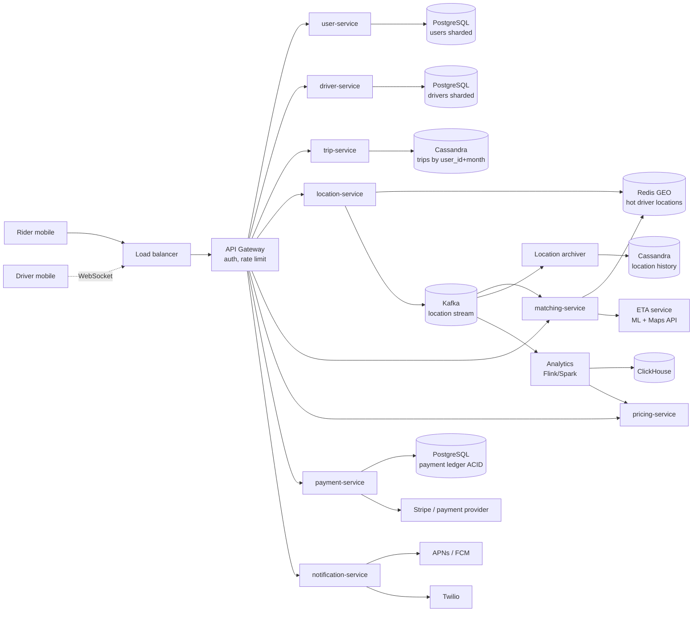
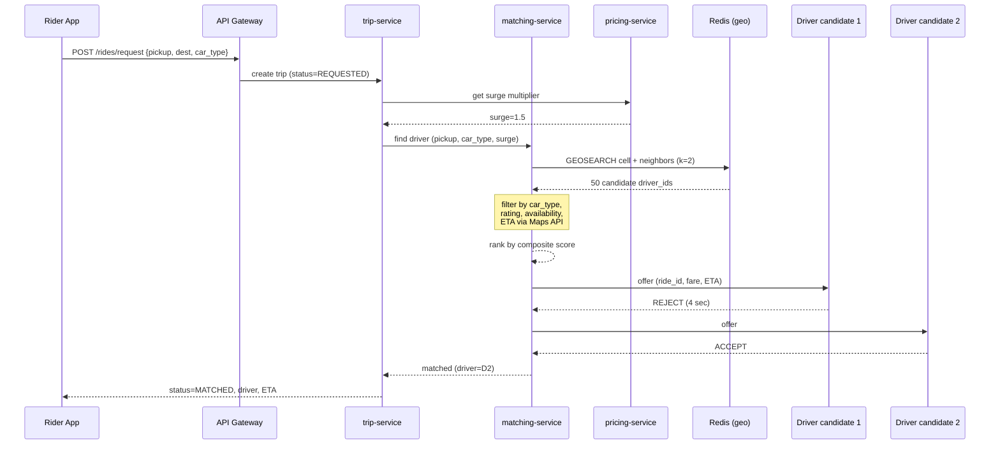
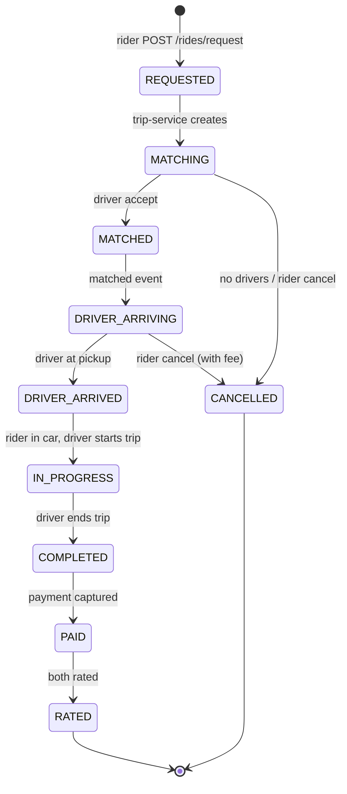
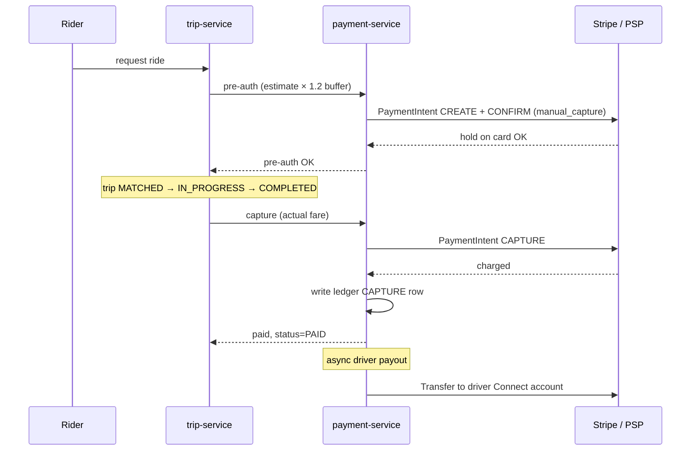

# System Design: Дизайн Uber/Lyft

Senior/staff-уровневый кейс: real-time matching драйверов и райдеров, geo-spatial индексы (`H3` / `S2` / `geohash`), потоковая обработка локаций, surge pricing, trip state machine, payment flow и geo-distribution. Сильный гипотетический dual — «write-heavy location updates» и «latency-critical matching». Хороший рассказ про этот кейс заходит на любую позицию backend/infra-уровня.

## Полезные ссылки

- [Uber Engineering Blog](https://www.uber.com/blog/engineering/) — десятки разборов про matching, surge, H3, marketplace.
- [H3: Uber's Hexagonal Hierarchical Spatial Index](https://www.uber.com/blog/h3/) — оригинальный анонс H3.
- [H3 Documentation](https://h3geo.org/docs/) — концепты, API, разрешения.
- [Google S2 Geometry Library](https://s2geometry.io/) — конкурирующий sphere-based index.
- [Lyft Engineering Blog](https://eng.lyft.com/) — matching, ETA, marketplace.
- [DoorDash — Building Faster Indexing with Apache Kafka and Elasticsearch](https://doordash.engineering/) — близкий по проблематике geo-marketplace.
- [Designing Data-Intensive Applications, M. Kleppmann](https://dataintensive.net/) — stream processing глава.

## Содержание

**Requirements и capacity**
- [Q1. (!) Functional requirements?](#q1--functional-requirements)
- [Q2. (!) Non-functional requirements и SLA?](#q2--non-functional-requirements-и-sla)
- [Q3. (!) Back-of-the-envelope capacity?](#q3--back-of-the-envelope-capacity)
- [Q4. API design — какие эндпоинты?](#q4-api-design--какие-эндпоинты)

**High-level design**
- [Q5. (!) Высокоуровневая архитектура?](#q5--высокоуровневая-архитектура)
- [Q6. Data models — User, Driver, Trip, Location?](#q6-data-models--user-driver-trip-location)

**Geo-spatial indexing**
- [Q7. (!) Зачем geo-spatial index — почему не SQL `WHERE lat BETWEEN ...`?](#q7--зачем-geo-spatial-index--почему-не-sql-where-lat-between-)
- [Q8. (!) Geohash — как работает, плюсы и минусы?](#q8--geohash--как-работает-плюсы-и-минусы)
- [Q9. Google S2 — sphere-based hierarchical index?](#q9-google-s2--sphere-based-hierarchical-index)
- [Q10. (!) Uber H3 — гексагональный индекс, почему его выбрал Uber?](#q10--uber-h3--гексагональный-индекс-почему-его-выбрал-uber)
- [Q11. Geohash vs S2 vs H3 — сравнительная таблица?](#q11-geohash-vs-s2-vs-h3--сравнительная-таблица)

**Location streaming и storage**
- [Q12. (!) Как драйверы стримят координаты — WebSocket / MQTT / HTTP?](#q12--как-драйверы-стримят-координаты--websocket--mqtt--http)
- [Q13. (!) Storage для driver locations — Redis, Cassandra, in-memory grid?](#q13--storage-для-driver-locations--redis-cassandra-in-memory-grid)
- [Q14. Redis GEO commands vs кастомный H3 grid — что выбрать?](#q14-redis-geo-commands-vs-кастомный-h3-grid--что-выбрать)

**Matching algorithm**
- [Q15. (!) Алгоритм матчинга — pipeline от запроса до accept?](#q15--алгоритм-матчинга--pipeline-от-запроса-до-accept)
- [Q16. Sequential vs broadcast vs batched matching?](#q16-sequential-vs-broadcast-vs-batched-matching)
- [Q17. Как ранжировать кандидатов — ETA, rating, supply-demand?](#q17-как-ранжировать-кандидатов--eta-rating-supply-demand)

**Surge pricing**
- [Q18. (!) Surge pricing — как считается и где?](#q18--surge-pricing--как-считается-и-где)

**Trip state machine, storage и payment**
- [Q19. (!) Trip state machine — какие состояния и события?](#q19--trip-state-machine--какие-состояния-и-события)
- [Q20. (!) Storage choice — какую БД под trips, locations, payments?](#q20--storage-choice--какую-бд-под-trips-locations-payments)
- [Q21. ETA estimation — Google Maps, ML, что и когда?](#q21-eta-estimation--google-maps-ml-что-и-когда)
- [Q22. Payment flow — pre-auth, capture, refunds, driver payout?](#q22-payment-flow--pre-auth-capture-refunds-driver-payout)

**Geo-distribution и hot regions**
- [Q23. Geo-distribution — региональные дата-центры и роутинг?](#q23-geo-distribution--региональные-дата-центры-и-роутинг)
- [Q24. Hot regions (NYC, SF, London) — как масштабировать?](#q24-hot-regions-nyc-sf-london--как-масштабировать)
- [Q25. Sharding strategy — по чему шардить trips, locations, payments?](#q25-sharding-strategy--по-чему-шардить-trips-locations-payments)

**Anti-fraud и trade-offs**
- [Q26. Anti-fraud — GPS spoofing, fake drivers, payment fraud?](#q26-anti-fraud--gps-spoofing-fake-drivers-payment-fraud)
- [Q27. (!) CAP — где AP, где CP?](#q27--cap--где-ap-где-cp)
- [Q28. (!) Anti-patterns — типичные ошибки в дизайне Uber?](#q28--anti-patterns--типичные-ошибки-в-дизайне-uber)
- [Q29. Scheduled rides и multi-stop — отдельный поток?](#q29-scheduled-rides-и-multi-stop--отдельный-поток)
- [Q30. Главные trade-offs дизайна?](#q30-главные-trade-offs-дизайна)

## Q1. (!) Functional requirements?

Что должна уметь система — формулируем в первые 2-3 минуты интервью:

- **Request ride** — райдер выбирает pickup и destination, тип машины (`UberX`, `Comfort`, `Black`), получает price estimate и ETA.
- **Driver matching** — система находит ближайшего подходящего драйвера за < 5 секунд.
- **Real-time tracking** — обе стороны видят позицию друг друга на карте в реальном времени.
- **Trip lifecycle** — driver arriving → pickup → in-progress → completed.
- **Payment** — pre-auth карты при запросе, charge при завершении, tip, split fare, refund.
- **Rating** — обе стороны ставят 1-5 звёзд после поездки.
- **Surge pricing** — динамическое подорожание в зонах высокого спроса.
- **Ride history** — список прошлых поездок, receipts.

**Сопутствующие фичи**, которые надо упомянуть, но детали обсудить только если попросят:
- **Multi-stop rides** — несколько waypoints в одной поездке.
- **Scheduled rides** — заказ заранее на конкретное время.
- **Pool / Shared rides** — несколько райдеров в одной машине.

**Out of scope** для типичного интервью: maps & navigation (используем Google Maps API), driver onboarding & verification, accounting/financial reports, fraud investigations dashboard.

## Q2. (!) Non-functional requirements и SLA?

| Параметр | Цель |
|---|---|
| DAU | 100M+ (riders + drivers) |
| Rides per day | 20M |
| Active drivers concurrently | ~5M peak |
| Active rides concurrently | ~500K-1M peak |
| Location update frequency | 1 update / 4 sec per driver |
| Match latency p99 | < 5 сек от request до driver assigned |
| Tracking latency p99 | < 1 сек от driver GPS до rider screen |
| Availability | 99.99% (~52 мин/год downtime) |
| Consistency для locations | **Eventual** — позиция 2 сек назад приемлема |
| Consistency для payments | **Strong** — деньги нельзя терять, ACID + ledger |
| Durability | Никакой потери trip records, receipts, payments |
| Geo-distribution | Multi-region, latency < 100 ms от user до DC |

Сразу формулируем выбор по CAP: **AP для location/matching**, **CP для payments и trip ledger**. Это разделение определяет выбор БД дальше.

## Q3. (!) Back-of-the-envelope capacity?

**Writes (driver locations — самая горячая часть):**

- 5M active drivers × 1 update / 4 sec = **1.25M location writes/sec**.
- Один location update ≈ 100 байт (driver_id 8B + lat 8B + lng 8B + ts 8B + heading + speed + status + accuracy ≈ 50-100B на сериализации).
- **Write throughput**: 1.25M × 100B = **125 MB/sec** только location updates.
- При TTL 1 час в hot store: 1.25M × 3600 = 4.5B записей в окне → но логически overwrite, реально хранится по 1 на driver = 5M ключей.

**Writes (trip events):**

- 20M rides/day = ~230 trips/sec average, peak (Friday evening NYC) ×10 → 2-5K trips/sec.
- Каждая поездка → ~20-50 событий (state transitions, locations along route, payment events) → 50-100K events/sec в Kafka peak.

**Reads:**

- Каждый rider открывает приложение в среднем 2 раза/день, делает ping каждые 5 сек во время поездки.
- Active rides 1M × 1 ping / 5 sec = 200K reads/sec just for tracking.
- Matching queries: 2-5K/sec, каждый делает `GEOSEARCH` по нескольким H3 cells.

**Storage:**

- **Locations hot** (Redis): 5M drivers × 100B = 500 MB — всегда в памяти.
- **Locations cold** (Cassandra): 1.25M × 100B × 86400 sec = ~10 TB/day, retention 90 дней → ~1 PB.
- **Trips**: 20M/day × 10 KB metadata = 200 GB/day, год = ~70 TB.
- **Payments**: 20M/day × 2 KB = 40 GB/day = ~15 TB/год (ACID-критичные данные).

Эти цифры сразу диктуют: **horizontal sharding обязателен**, **in-memory geo-grid для matching**, **Kafka для event streaming**, **отдельные БД для hot/cold/ACID**.

## Q4. API design — какие эндпоинты?

REST для CRUD, WebSocket для real-time tracking и driver location stream, gRPC — internal.

```
# Rider flow
POST   /api/v1/rides/estimate          body: {pickup, destination, car_type}
                                       resp: {fare_estimate, eta, surge_multiplier}
POST   /api/v1/rides/request           body: {pickup, destination, car_type, payment_method_id}
                                       resp: {ride_id, status: "MATCHING"}
GET    /api/v1/rides/{ride_id}
POST   /api/v1/rides/{ride_id}/cancel
POST   /api/v1/rides/{ride_id}/rate    body: {rating, comment}
GET    /api/v1/rides/history?cursor=...

# Driver flow
POST   /api/v1/drivers/status          body: {status: ONLINE|OFFLINE}
POST   /api/v1/drivers/location        body: {lat, lng, heading, speed}     # via WebSocket
POST   /api/v1/rides/{ride_id}/accept
POST   /api/v1/rides/{ride_id}/arrived
POST   /api/v1/rides/{ride_id}/start
POST   /api/v1/rides/{ride_id}/complete

# WebSocket (both)
WS     /ws/tracking?ride_id=...        — server pushes location updates 1/sec
WS     /ws/driver-stream               — driver pushes location, receives offers

# Payments
POST   /api/v1/payments/methods
GET    /api/v1/payments/receipts/{ride_id}
POST   /api/v1/payments/tip            body: {ride_id, amount}
```

`POST /rides/request` — критичный эндпоинт. Возвращает `202 Accepted` мгновенно с `ride_id`, дальше клиент подписан через WebSocket на матчинг. Это даёт SLA по latency < 200 ms на сам HTTP-запрос, а сам matching работает asynchronously.

## Q5. (!) Высокоуровневая архитектура?



Главные сервисы:

- **`user-service` / `driver-service`** — профили, auth, статусы. Owners of `users`/`drivers` таблиц.
- **`location-service`** — принимает WebSocket поток от драйверов, пишет в Redis (hot) и Kafka (durable). Точка входа для tracking.
- **`matching-service`** — читает Kafka location-events + получает ride requests, делает spatial query, ранжирует, рассылает offers.
- **`trip-service`** — owner of trip state machine, обрабатывает события `REQUESTED → MATCHED → ...`, пишет в Cassandra.
- **`pricing-service`** — считает estimate, surge multiplier per H3 cell, читает supply/demand из аналитики.
- **`payment-service`** — pre-auth, capture, refund, payout. Единственный сервис со strong consistency.
- **`notification-service`** — push, SMS, WebSocket для tracking.
- **`ETA-service`** — обёртка над Google Maps Distance Matrix + ML-модель.

Между сервисами — **Kafka как event backbone**: `driver.location.updated`, `trip.requested`, `trip.matched`, `trip.completed`, `payment.captured`. Это даёт async fan-out для аналитики и истории.

## Q6. Data models — User, Driver, Trip, Location?

```sql
-- users / drivers — PostgreSQL, sharded by user_id
CREATE TABLE users (
  user_id        BIGINT PRIMARY KEY,
  phone          VARCHAR(20) UNIQUE,
  email          VARCHAR(255),
  payment_methods JSONB,           -- token IDs from Stripe
  rating         FLOAT,
  created_at     TIMESTAMP
);

CREATE TABLE drivers (
  driver_id      BIGINT PRIMARY KEY,
  phone          VARCHAR(20) UNIQUE,
  car_id         BIGINT,
  status         VARCHAR(16),      -- OFFLINE|ONLINE|BUSY
  rating         FLOAT,
  total_rides    BIGINT,
  documents      JSONB,            -- license, insurance refs
  home_region    VARCHAR(8)
);
```

```cql
-- trips — Cassandra, sharded by (user_id, month)
CREATE TABLE trips_by_user (
  user_id       BIGINT,
  month         INT,               -- YYYYMM
  trip_id       TIMEUUID,
  driver_id     BIGINT,
  status        TEXT,
  pickup        FROZEN<geo_point>,
  destination   FROZEN<geo_point>,
  fare          DECIMAL,
  surge         FLOAT,
  events        LIST<FROZEN<trip_event>>,
  created_at    TIMESTAMP,
  PRIMARY KEY ((user_id, month), trip_id)
) WITH CLUSTERING ORDER BY (trip_id DESC);

-- driver_locations_hot — Redis ZSET / GEO
-- ключ: drivers:geo  значение: driver_id  scores: H3 cell id (или geohash)
-- TTL обрабатывается отдельным sweeper если driver идёт OFFLINE
```

```sql
-- payments — PostgreSQL ACID, ledger pattern
CREATE TABLE payment_ledger (
  txn_id        BIGINT PRIMARY KEY,
  ride_id       BIGINT,
  user_id       BIGINT,
  type          VARCHAR(16),       -- PREAUTH|CAPTURE|REFUND|TIP|PAYOUT
  amount        DECIMAL(12,2),
  currency      VARCHAR(3),
  status        VARCHAR(16),
  provider_ref  TEXT,              -- Stripe payment_intent_id
  created_at    TIMESTAMP,
  CONSTRAINT chk_amount CHECK (amount >= 0)
);
```

Ключевое: **trips отдельно от locations** — у них разные access patterns. Trip — это «прочитать одну запись» (для receipt) или «список за месяц» (для history). Locations — «найти всё в радиусе R от точки» — для этого PostgreSQL/Cassandra не приспособлены, нужен geo-spatial index.

## Q7. (!) Зачем geo-spatial index — почему не SQL `WHERE lat BETWEEN ...`?

Очень частый вопрос — почему нельзя «просто SELECT WHERE». Разбираем по пунктам:

**Наивный подход в SQL:**

```sql
SELECT driver_id, lat, lng
FROM driver_locations
WHERE lat BETWEEN 40.7 AND 40.8
  AND lng BETWEEN -74.1 AND -74.0
  AND status = 'ONLINE';
```

**Что с этим не так:**

1. **Bounding box не равен радиусу.** Угол квадрата дальше центра в √2 раза → отфильтровывать кандидатов нужно повторно по реальному расстоянию.
2. **Index не помогает.** B-tree по `(lat, lng)` поможет только первой колонке. По `lat` отфильтруется до полосы 11 км широтой — это в Нью-Йорке миллионы строк.
3. **Высокая частота update.** 1.25M writes/sec в SQL = смерть. Каждый update инвалидирует индекс, vacuum не успевает.
4. **Earth — не плоскость.** Около полюсов 1° longitude = ~10 км, на экваторе = 111 км. Прямоугольник в координатах перекошен.
5. **Запрос нужен не просто «в радиусе», а «ближайшие N с учётом ETA».** ETA зависит от дорог, не от air distance.

**Что нужно вместо:**

- **Spatial index** (geohash / S2 / H3 / R-tree / QuadTree) → быстрый prefix или cell lookup.
- **In-memory hash** «cell_id → list of driver_ids» → O(1) поиск кандидатов в ячейке + соседних.
- **Отдельная подсистема** для location, не общая SQL БД.

Это и есть базовый аргумент в пользу H3 и Redis GEO в этом дизайне.

## Q8. (!) Geohash — как работает, плюсы и минусы?

**Geohash** — алгоритм Густаво Нимейера (2008), преобразует пару `(lat, lng)` в строку из base-32 символов через рекурсивное деление 2D-плоскости пополам.

**Как кодируется:**

1. Берётся диапазон `lat ∈ [-90, 90]`, `lng ∈ [-180, 180]`.
2. На каждом шаге делим пополам по очереди (`lng` бит, `lat` бит, …) и пишем 0/1 в зависимости от того, в какую половину попала точка.
3. Биты группируются по 5 и кодируются в base-32 (`0123456789bcdefghjkmnpqrstuvwxyz` — без `a, i, l, o`).

```
NYC Times Square (40.7580, -73.9855):
  geohash precision 8 = "dr5regw3"
  geohash precision 7 = "dr5regw"  (cell ~150m × 150m)
  geohash precision 6 = "dr5reg"   (cell ~1.2 km × 0.6 km)
  geohash precision 5 = "dr5re"    (cell ~5 km × 5 km)
```

**Главное свойство:** если у двух точек одинаковый префикс geohash — они близко. Запрос «всё в радиусе» сводится к **prefix scan** по индексу строк.

**Плюсы:**

- Просто, библиотеки на всех языках, работает поверх любой KV/SQL БД.
- Native поддержка в Redis (`GEOADD`, `GEOSEARCH` под капотом юзают geohash).
- Сортируемый ключ — отлично работает с B-tree.

**Минусы:**

- **Edge problem:** соседние ячейки могут иметь совершенно разные префиксы. Точки на границе outline (например, `dr5regw` и `dr5regx`) физически рядом, но префиксного матча нет → надо отдельно искать **8 соседей**.
- **Non-uniform cells.** Около полюсов клетки сжимаются по широте. Для глобальной системы это неудобно.
- **Discontinuity на ±180° meridian** — geohash `8` и `r` рядом физически, но далеко в строковом порядке.

В Uber изначально использовали geohash, но при глобальном масштабе перешли на H3.

## Q9. Google S2 — sphere-based hierarchical index?

**S2** — библиотека от Google, появилась в Google Maps в 2010-х. Главное отличие: работает **на сфере**, а не на плоскости.

**Как:**

1. Сфера Земли проецируется на куб (6 граней).
2. Каждая грань разбивается на ячейки **Hilbert curve** — fractal curve, который заполняет 2D-пространство, сохраняя локальность.
3. Каждая ячейка получает **64-bit cell ID** (`uint64`).
4. 30 уровней разрешения — от `level 0` (~85M км² на ячейку) до `level 30` (~1 см²).

```python
import s2sphere
ll = s2sphere.LatLng.from_degrees(40.7580, -73.9855)
cell = s2sphere.CellId.from_lat_lng(ll).parent(15)   # level 15 ~ 300m
print(cell.id())  # 9926595690553475072
```

**Плюсы:**

- **Uniform area** на любой широте — нет вырождения у полюсов.
- **Hilbert curve** сохраняет локальность: близкие cell IDs = близкие точки.
- **64-bit integer** — компактнее geohash-строки, faster comparisons.
- Используется в Google Maps, Pokemon GO, Foursquare.

**Минусы:**

- **Квадратные ячейки** — 4 соседа по стороне + 4 по углу с разным расстоянием.
- Сложнее в чтении/отладке — не human-readable.
- Меньше готовых интеграций в storage layers (нет нативной поддержки в большинстве БД).

S2 часто противопоставляется H3 — оба uniform, но H3 решает проблему «равных соседей» гексагонами.

## Q10. (!) Uber H3 — гексагональный индекс, почему его выбрал Uber?

**H3** — open-source гексагональная hierarchical иерархия от Uber (2018, [github](https://github.com/uber/h3)).

**Как:**

1. Сфера Земли проецируется на **icosahedron** (20-гранник).
2. Каждая грань тесселируется гексагонами.
3. 16 уровней разрешения (`res 0` — самые крупные ~4.25M км², `res 15` — ~1 м²).
4. Каждая ячейка — **64-bit integer**.

```python
import h3
# lat, lng, resolution
cell = h3.latlng_to_cell(40.7580, -73.9855, 9)   # res 9 ~ 174m edge
# '8a2a1072b5b7fff'
neighbors = h3.grid_disk(cell, k=1)             # cell + 6 immediate neighbors
edge_length_m = h3.average_hexagon_edge_length(9, unit='m')   # ~174
```

**Почему гексагоны лучше квадратов для matching:**

- **6 равноудалённых соседей** (vs 4 + 4 диагональных). Расстояние от центра до центра соседа одинаково — идеально для distance-based запросов.
- **Нет угловых соседей** — `GEOSEARCH` не надо отдельно обрабатывать диагонали.
- **Меньше искажений** при движении объектов через границы — гексагональная сетка более «изотропна».

**Hierarchical свойство:** каждая ячейка имеет 7 «детей» на следующем уровне (центр + 6). Можно агрегировать данные на любом уровне.

**Почему Uber выбрал H3 для production:**

1. Surge pricing считается **per hexagon** — один multiplier на ячейку.
2. Driver supply/demand метрики агрегируются hierarchical.
3. Matching query: «дай мне всех драйверов в hex и соседях» — это `h3.grid_disk(cell, k)`.
4. Совместимо с ML-моделями для prediction.

**Минусы H3:**

- На юникурвe icosahedron'а есть **12 «pentagons»** (вместо гексагонов) — edge cases в географически узких местах (как раз посреди океана, повезло).
- Hex не tessellates на плоскости с «идеальным» родительским разбиением — родительский hex не точно содержит 7 детей, есть overlap → надо аккуратно с агрегацией.

## Q11. Geohash vs S2 vs H3 — сравнительная таблица?

| Параметр | Geohash | Google S2 | Uber H3 |
|---|---|---|---|
| Форма ячейки | Прямоугольник | Квадрат (на сфере) | Гексагон |
| Проекция | Plane | Cube → sphere | Icosahedron |
| Соседи | 8 (4+4 углы) | 8 (4+4 углы) | **6 равноудалённых** |
| Кодирование | base-32 string | 64-bit int (Hilbert curve) | 64-bit int |
| Uniform area | Нет (вырождение у полюсов) | Да | Да (почти) |
| Hierarchical | Префиксная вложенность | 30 уровней parent/child | 16 уровней parent/child (с overlap) |
| Antimeridian / poles | Discontinuity | OK | OK (но есть 12 pentagons) |
| Native в Redis | Да (`GEOADD`) | Нет | Нет (требует библиотеку) |
| Использование | Простые карты, мобильные | Google Maps, Pokemon GO | Uber, real-estate, weather |
| Сложность интеграции | Низкая | Средняя | Средняя |
| Edge case bias | Граничные точки | Edge of cube faces | 12 pentagons |
| Размер cell на типичном уровне | precision 7 ≈ 150m | level 15 ≈ 300m | res 9 ≈ 174m edge |

**Практический выбор:**

- **MVP / стартап** — Redis + geohash. Запустился за день.
- **Глобальный сервис с map heatmaps и ML** — H3.
- **Существующий стек Google** — S2.

В этом дизайне берём **H3** как production-grade, но в hot path для real-time lookup используем Redis GEO (он внутри geohash) поверх H3-разделения зон.

## Q12. (!) Как драйверы стримят координаты — WebSocket / MQTT / HTTP?

Главный вопрос: 5M драйверов × 1 update / 4 sec = **1.25M писем/сек**. Чем стримить?

**Опции:**

| Транспорт | Pro | Contra |
|---|---|---|
| **HTTP POST** каждые 4 сек | Просто, любой LB, retry | Overhead на TLS handshake, новые connection per request, не подходит для server→client push |
| **HTTP/2 long-poll** | Один connection, multiplexing | Всё ещё overhead, не bi-directional нативно |
| **WebSocket** | Bi-directional, persistent, low overhead | Sticky session к gateway, надо керамить keep-alive, retry на reconnect |
| **MQTT** | Designed для IoT, QoS levels, retain msg, низкий overhead | Нужен MQTT-broker (EMQX, HiveMQ), сложнее интеграция в браузер |
| **gRPC streams** | HTTP/2, типизация, bidi-streaming | Не работает в большинстве мобильных SDK без обёрток |

**Реальное решение Uber/Lyft** — **WebSocket** для большинства случаев, **MQTT** для IoT-устройств водителей (планшеты в машинах).

**Архитектура потока:**

```
Driver mobile  --(WebSocket: lat,lng,ts,heading,speed)-->  location-service ingress (sticky LB)
                                                            |
                                                            v
                                                Redis ZSET (hot, overwrite)
                                                            |
                                                            v
                                                Kafka topic driver.location.updated
                                                            |
                                          --------------+--------------+--------------
                                          |             |              |
                              matching-service   location-archiver   analytics
                                          |             |              |
                                       (read)     Cassandra hist    Flink/Spark
```

**Почему именно так:**

- **Redis hot store** для real-time matching reads. `GEOSEARCH` O(log N + M).
- **Kafka** для durable stream — multiple consumers (matching, history, analytics) не мешают друг другу.
- **Sticky LB** к location-service — иначе WebSocket reconnects будут летать по подам.
- **Batching на клиенте** — драйвер шлёт не каждые 4 сек, а накапливает 2-3 update в batch.

**Compression:** location update — это маленький binary message. Используем Protobuf, не JSON. Размер уменьшается в 2-3 раза, парсинг быстрее.

## Q13. (!) Storage для driver locations — Redis, Cassandra, in-memory grid?

Многоуровневое хранилище — каждое для своей цели.

**1. Hot — текущая позиция активных драйверов:**

- **Redis** с `GEOADD`/`GEOSEARCH` либо custom hash «cell_id → set of driver_ids».
- 5M ключей × 100B = 500 MB → одна крупная нода вмещает, но для HA нужен cluster + replication.
- Read latency < 1 мс, write — тоже.
- **TTL не используется в Redis нативно** для GEO — driver просто overwrite свою запись, sweeper удаляет OFFLINE.

**2. Warm — последние N минут позиций (для tracking историй и replay):**

- **In-memory geo-grid** на matching-service worker'ах. Hash `H3_cell_id → list[(driver_id, lat, lng, ts)]`.
- Локальный кэш, обновляется из Kafka stream → matching не ходит в Redis при каждом запросе.
- Memory footprint: 5M × 200B (history 60 sec × 4 sec) = 1 GB на ноду.

**3. Cold — историческая траектория всех поездок:**

- **Cassandra** с partition key `(driver_id, day)`, clustering `ts`.
- Retention 90 дней (compliance + аналитика), потом архив в S3 Parquet.
- 1 PB at scale. Используется для disputes, ETA-модели training, fraud investigations.

**4. Analytics:**

- Kafka → **Flink/Spark** → **ClickHouse / BigQuery** для аналитики surge zones, heatmaps, supply/demand.

Ключевая идея: **разные системы хранят одну и ту же логическую сущность, но с разным lifetime и access pattern**.

## Q14. Redis GEO commands vs кастомный H3 grid — что выбрать?

**Redis GEO** — встроенные команды поверх sorted set с geohash как score.

```
GEOADD drivers:online -73.9855 40.7580 driver:42
GEOADD drivers:online -73.9870 40.7585 driver:99

# Найти ближайшие в радиусе 2 km, top 10
GEOSEARCH drivers:online FROMLONLAT -73.9855 40.7580 BYRADIUS 2 km ASC COUNT 10
```

**Плюсы:**
- Не нужно писать spatial logic — всё встроено.
- Atomic операции через `MULTI`/`EXEC`.
- Распределённость через Redis Cluster (но осторожно — все драйверы в одном `drivers:online` ключе → один slot, hot key).

**Минусы:**
- **Single-key bottleneck.** `GEOSEARCH` для одного миллиона driver IDs в Redis Cluster всегда упадёт на одну ноду.
- Нельзя фильтровать **по другим полям** (car_type, rating) — после `GEOSEARCH` надо отдельно идти в БД за метаданными.
- Дорого хранить kilo-driver метаданные.

**Кастомный H3 grid:**

```
hash key = "drivers:cell:8a2a1072b5b7fff"  (один H3 cell)
value    = set/hash of driver_ids → {lat, lng, ts, car_type, rating}
```

- Каждая ячейка — отдельный Redis hash → распределяется по slots **автоматически**.
- Запрос: вычислить `h3.grid_disk(cell, k=1)` (7 ячеек) → сделать 7 параллельных `HGETALL` → merge.
- Метаданные **рядом** с геоданными → один round-trip.

**Гибрид — реальный production:**

- Redis hash partitioned по H3 cell.
- В каждом hash: `driver_id → packed_metadata` (Protobuf).
- Sweeper TTL: если driver не обновляется 30 sec → drop.

Выбираем гибрид. Чистый `GEOADD` — для MVP/прототипа.

## Q15. (!) Алгоритм матчинга — pipeline от запроса до accept?



**Шаги pipeline:**

1. **Get pickup H3 cell** на нужном разрешении (res 9 ≈ 174 m edge).
2. **Get candidates** — `h3.grid_disk(cell, k=2)` → 19 cells → `GEOSEARCH`/`HGETALL` parallel → собрать union driver IDs (типично 50-200 кандидатов в густом городе).
3. **Filter** — car_type matches, status=ONLINE, rating ≥ threshold, не в blacklist по rider'у.
4. **Rank** — composite score (см. Q17): ETA, driver rating, accept rate, supply/demand, fairness (cool-down между offers).
5. **Send offer** — sequential к top-K (см. Q16). Driver app получает push + WebSocket message, имеет 10-15 сек принять.
6. **First accept wins** — остальные offers cancel'ятся.
7. **Update state machine** — `trip-service` пишет `MATCHED` событие в Kafka, нотифицирует rider.

**SLA matching:** p50 ≤ 2 сек, p99 ≤ 5 сек. Если не нашли драйвера за 30 сек — `NO_DRIVERS_AVAILABLE`, рекомендуем surge или ждать.

## Q16. Sequential vs broadcast vs batched matching?

**Sequential (один-за-другим):**
- Offer один драйверу → ждём 10-15 сек → reject → следующий.
- **Pro:** справедливость, нет race condition, простая state machine.
- **Contra:** медленно. Если первые 3 отказали — 30+ сек.

**Broadcast (всем сразу):**
- Offer всем top-K параллельно.
- **Pro:** быстро, скорость = скорость самого быстрого.
- **Contra:** race condition (надо синхронизировать accept), unfair — далёкие драйверы тратят время и могут злиться.

**Batched (real Uber approach):**
- **Накопить N запросов за окно T (5-10 сек)**, потом **решать всех вместе** — bipartite matching (Hungarian algorithm).
- Минимизирует **global ETA**, а не локальный.
- **Pro:** оптимальный global throughput, эффективен в hot regions с большим количеством одновременных запросов.
- **Contra:** добавляет 5-10 сек к latency, требует более умной orchestration.

**Реальное решение:** в неплотных зонах — sequential, в hot regions с >100 одновременных запросов — batched. Sequential параметризуется: offer к top-3 одновременно, кто первый accept — забирает. Это broadcast-ish с малым K.

## Q17. Как ранжировать кандидатов — ETA, rating, supply-demand?

Композитный score per (rider, driver):

```
score = w1 × (1 / ETA)            # быстрее приехать — лучше
      + w2 × driver_rating         # 5 звёзд лучше
      + w3 × driver_accept_rate    # ответственный
      + w4 × (1 - recent_offers)   # cool-down — не спамим одному
      + w5 × fairness_bonus        # давно не работал → приоритет
      - w6 × cancellation_history  # часто отменяет — penalty
```

**Веса** тюнятся offline на исторических данных: target — максимум `accept_rate × (1 - cancellation_rate) × NPS`.

**ETA в score** — самый важный фактор. Считается через **Google Maps Distance Matrix API** или собственную **road graph + ML** (для топ-городов Uber имеет свою road graph).

**Supply-demand awareness:**
- Если в ячейке мало драйверов, а запросов много → расширить radius search (`k=3` вместо `k=2`).
- Если избыток драйверов → жёсткий фильтр, лучшие выигрывают.

**Anti-poaching:** один драйвер не получает offer чаще раза в N секунд (cool-down), чтобы избежать «гонок».

**ML-модель** в production: gradient boosting (XGBoost → DNN), фичи — driver history, rider history, time of day, weather, traffic.

## Q18. (!) Surge pricing — как считается и где?

**Цель:** баланс supply/demand в реальном времени. При нехватке драйверов — поднять цену, чтобы:
1. отпугнуть часть райдеров (снизить спрос),
2. привлечь больше драйверов в зону (увеличить supply через push «surge zone here»).

**Алгоритм:**

```
для каждой H3 cell на res 7 (≈ 5 km²):
    demand = ride_requests за последние 5 мин
    supply = available_drivers in cell + neighbors
    raw_ratio = demand / max(supply, 1)
    multiplier = ML_model(raw_ratio, hour, weather, events, history)
    multiplier ∈ [1.0, 5.0]   # capped
```

**Архитектура pipeline:**

```
Kafka: trip.requested ─┐
                       ├──► Flink job ──► surge_multipliers (Redis)
Kafka: driver.location.updated ─┘                       │
                                                        ▼
                                              pricing-service reads
                                                        │
                                                        ▼
                                              estimate / request flow
```

- **Окно:** sliding window 5 мин с пересчётом каждую 1 мин.
- **Сглаживание:** не больше +0.2 multiplier за минуту, чтобы не было «прыжков».
- **Broadcast:** изменение surge в зоне → push драйверам через WebSocket + heatmap в driver-app.

**Edge cases:**
- **Concert / stadium event** — pre-defined zones с заранее повышенным supply.
- **Anti-gaming:** драйверы не должны массово offline'иться, чтобы поднять surge → детектируется (см. anti-fraud).
- **Fair pricing:** GDPR/regulatory регионы (Чикаго, NYC) требуют capping surge.

**Storage:** Redis hash `surge:cell:<h3_id>` → `{multiplier, ttl, updated_at}`. Read latency < 1 ms.

## Q19. (!) Trip state machine — какие состояния и события?



**Каждый переход — событие в Kafka:**

```json
{
  "event_id": "uuid",
  "trip_id": "uuid",
  "type": "MATCHED",
  "from": "MATCHING",
  "to": "MATCHED",
  "actor": "driver:42",
  "payload": { "driver_id": 42, "eta_seconds": 240 },
  "ts": "2026-05-26T10:33:00Z"
}
```

**Почему через Kafka:** trip-service пишет в Cassandra + emit event → fan-out для:
- `notification-service` шлёт push.
- `payment-service` слушает `IN_PROGRESS` → ставит pre-auth hold.
- `analytics` агрегирует время в каждом state.

**Idempotency:** каждый transition требует `event_id`. Drug consumer'ы используют `event_id` как dedup key — переход дважды не сработает.

**Optimistic locking** в Cassandra: `IF status = 'MATCHING'` (LWT, Light-Weight Transaction) — гарантирует, что два конкурирующих accept'а не оба «победят».

**Compensation:** если payment fails после COMPLETED — переход `PAID_FAILED`, повторная попытка через Outbox pattern.

## Q20. (!) Storage choice — какую БД под trips, locations, payments?

| Подсистема | Хранилище | Почему |
|---|---|---|
| **User profiles, drivers** | PostgreSQL, sharded by user_id | ACID для profile updates, JSONB для payment methods |
| **Trip metadata** | Cassandra, partition `(user_id, month)` | Write-heavy, read by user history, time-series-ish |
| **Driver locations (hot)** | Redis (GEO + H3 hash) | < 1 ms read, in-memory |
| **Driver locations (cold)** | Cassandra, partition `(driver_id, day)` | Time-series, retention 90d |
| **Payment ledger** | PostgreSQL (multi-region with sync replication для CP) | ACID, ledger pattern, financial audit |
| **Surge multipliers** | Redis hash, key per H3 cell | Read-heavy, broadcast updates |
| **Analytics events** | Kafka → ClickHouse / BigQuery | OLAP, heatmaps, dashboards |
| **Ride history search** | Elasticsearch (optional) | Поиск по дате, локации, статусу |
| **ML feature store** | Cassandra или Redis | Real-time features для ranking |

**Принципы выбора:**
- **OLTP CRUD** (users, drivers, payments) → PostgreSQL.
- **Time-series, write-heavy** (trips, locations history) → Cassandra.
- **Hot key-value, sub-ms** (locations active, surge) → Redis.
- **Stream / event log** → Kafka.
- **Analytics, OLAP** → ClickHouse / BigQuery.

**Никогда:** PostgreSQL для real-time locations, или Cassandra для payments (нужна ACID, multi-row transactions).

## Q21. ETA estimation — Google Maps, ML, что и когда?

**ETA нужен в 3 точках:**

1. **Estimate перед request** — сколько ехать от A до B → fare estimate.
2. **Pickup ETA** — сколько драйверу ехать до pickup.
3. **Live ETA** — обновляющийся ETA пока едем.

**Эволюция подхода:**

| Этап | Решение | Когда |
|---|---|---|
| MVP | Google Maps Distance Matrix API | < 10K requests/day, можно платить по запросу |
| Scale-up | Свой road graph (OSM) + классический Dijkstra/A* | Объёмы > $$$/мес на Google |
| ML-era | XGBoost / DNN модель на historical data | Когда есть терабайты данных по реальным trips |

**Фичи ML-модели для ETA:**

- Distance, route polyline.
- Time of day, day of week.
- Real-time traffic (Inrix, Waze, или sensor data самих драйверов).
- Weather.
- Special events (concerts, sports, road closures).
- Driver-specific behavior (быстрый или медленный водитель).
- Recent ETAs в этом районе (5 мин history).

**Caching:**

- Same origin-destination pair за последние 5 мин → reuse ETA (route-level cache).
- LRU cache в pricing-service.

**Live update** во время поездки: пересчёт каждые 30 сек по факту current location + remaining route.

## Q22. Payment flow — pre-auth, capture, refunds, driver payout?



**Ключевые моменты:**

- **Pre-auth (hold)** при request — резервируем сумму на карте, чтобы убедиться, что rider платежеспособен. Сумма = estimate × 1.2 для buffer (на случай overage).
- **Capture при COMPLETED** — реальная charge. Если actual < pre-auth → release разницы.
- **Refund** при cancel — `PAY` создаёт refund row в ledger + Stripe refund.
- **Split fare** — несколько rider'ов в одной поездке → N pre-auths → N captures с пропорциональным share.
- **Tip** — отдельный PaymentIntent через 24 часа (rider может изменить tip).
- **Driver payout** — daily/weekly Transfer через **Stripe Connect** или **Adyen for Platforms**. Не в реальном времени — банковский ACH занимает 1-2 дня.

**Ledger pattern:** каждый финансовый event — **append-only row**, никаких updates. `balance = SUM(amount) WHERE user_id = X`. Это даёт reconciliation, audit, и решает проблему concurrent updates.

**Idempotency:** все запросы к Stripe — с `Idempotency-Key`. Retry safe.

**Failures:**
- Pre-auth fail → ride cancelled, rider notified.
- Capture fail (карта истекла за время поездки) → fall back to another payment method, либо ride записывается как «debt» — rider не может заказать следующую, пока не оплатит.

## Q23. Geo-distribution — региональные дата-центры и роутинг?

**Геораспределение** обязательно — latency от Сан-Франциско до Сингапура 180 мс RTT.

**Архитектура:**

- 4-6 регионов: **US-East**, **US-West**, **EU**, **Asia-Pacific**, **LatAm**, **MENA**.
- Каждый регион — **независимая deployment** со своим набором сервисов.
- Anycast DNS / GeoDNS направляет user к ближайшему DC.
- **Within-region data** — full strong consistency.
- **Cross-region** — eventual replication (Kafka mirror, Cassandra DC-aware replication).

**Что реплицируется глобально:**

- **User profiles** — async, нужны на всех регионах для авторизации (пользователь летит в другую страну).
- **Driver profiles** — async, но driver работает в основном в home region.
- **Trip history** — async, для отображения «my rides» из любой точки.

**Что НЕ реплицируется:**

- **Live driver locations** — только в home region (не нужно знать где driver в SF, если запрос в Берлине).
- **Active trips** — pinned к региону создания.

**Roaming case:** американский rider в Лондоне → London DC создаёт trip, US DC синхронизирует факт через CDC. Payment ledger — multi-region sync replication (strong consistency).

**Routing:**

```
api.uber.com → GeoDNS → us-east.api.uber.com / eu.api.uber.com / ...
```

## Q24. Hot regions (NYC, SF, London) — как масштабировать?

**Проблема:** в Манхэттене peak Friday evening — 100K active drivers + 50K concurrent ride requests. Один регион — bottleneck.

**Решения:**

- **Sub-region sharding по H3 cells.** Manhattan = ~100 H3 res-7 cells → раздаём cells по shards matching-service.
- **Dedicated infra для hot cities** — отдельные Kafka clusters, отдельные Redis clusters, отдельный matching-service deployment.
- **Pre-warm cache** перед peak (по historical data — каждую пятницу 17:00).
- **Auto-scaling по предсказанию**, не по реактивному CPU. ML предсказывает нагрузку → kubernetes scales up за 30 мин до peak.
- **Surge как natural backpressure** — повышенная цена реально снижает demand.
- **Reserved capacity для VIP / corporate**.
- **Regional caches** для surge multipliers, driver pool, fare tables.
- **Disaster scenarios** — если хост-регион падает, ride history failover в neighbor region, но active rides — лучше grace shutdown.

**Метрики hot regions:**
- request_to_match_latency p99 < 5 sec.
- match_failure_rate < 1%.
- driver_offer_acceptance_rate > 80%.

## Q25. Sharding strategy — по чему шардить trips, locations, payments?

| Подсистема | Shard key | Почему |
|---|---|---|
| **Users / drivers** | `user_id % N` | Uniform load, no hot spot |
| **Trips (recent)** | `(user_id, year_month)` | History query «my last month rides» — single partition |
| **Trips (active)** | `(driver_id, day)` или `ride_id` | Driver dashboard «my today's rides» |
| **Driver locations** | **H3 cell ID** | Geo-locality — все драйверы рядом в одном shard, дёшево искать |
| **Payments** | `user_id` | All payments for user — single shard, ACID |
| **Surge** | H3 cell ID | Read per cell |
| **Analytics** | `event_date / hour` | OLAP partitioning |

**Композитная ключевая стратегия:**

- Часть «по гео» (для location queries) — `H3 cell`.
- Часть «по пользователю» (для history) — `user_id`.

**Re-sharding hot spots:**
- Hot cells (Times Square) → дополнительное **virtual sharding**: внутри cell делим по `driver_id % K`.
- Hot users (corporate accounts с тысячами поездок в день) → дополнительное partitioning по году/месяцу.

**Anti-pattern:** шардить trips по `ride_id` (UUID) — каждое получение «my rides» → scatter-gather по всем shards. Не делать.

## Q26. Anti-fraud — GPS spoofing, fake drivers, payment fraud?

**Категории мошенничества и противодействие:**

| Тип | Признаки | Защита |
|---|---|---|
| **GPS spoofing** (драйвер «телепортируется» в зону surge) | Скорость > 200 km/h, прыжки координат, mock-location flag | Sanity check скорости/ускорения, Android `isMockLocation()`, ML на траектории |
| **Fake driver accounts** (бот для accept rides) | Stereo activity patterns, нет реальной поездки, no IRL-photo update | Selfie verification перед сменой, behavioral biometrics |
| **Collusion** (driver и rider дружат, оплачивают пустую поездку для рейтинга) | Повторяющиеся пары, route совпадает с известным fake spot | Graph analysis, flagged pairs |
| **Card fraud** (украденная карта) | New device, unusual location, multiple payment methods | 3D Secure, device fingerprint, Stripe Radar |
| **Cancel scamming** (рад accept → cancel с fee) | Высокий accept-then-cancel rate | Driver suspension thresholds |
| **Promo abuse** (множественные fake аккаунты для bonus) | Same device, same IP, similar phone numbers | Device fingerprint, phone verification, ML clustering |
| **Inflated tips** (карта чужая, тип на максимум) | Tip > 100% от fare, новый аккаунт | Caps, ML score |

**Архитектура:**

- **Real-time signals** → Flink job → fraud-score per event → если score > threshold → block + manual review queue.
- **Batch ML retraining** на исторических disputes — обновляем модель weekly.
- **Manual review team** — флагированные cases.

## Q27. (!) CAP — где AP, где CP?

| Подсистема | C/A/P trade-off | Комментарий |
|---|---|---|
| **User / driver profiles** | CP (strong) | Login, документы, статус — нельзя терять |
| **Live driver locations** | AP (eventual) | Позиция 2 сек назад — ок, главное availability |
| **Matching** | AP | Если не нашли driver — лучше дать «нет» быстро, чем ждать full consistency |
| **Trip state machine** | CP (within region) | Нельзя дважды accept, нужны LWT в Cassandra или PG-row-lock |
| **Surge multipliers** | AP (eventual + approximate) | ±0.1 в multiplier — норма |
| **Payments / ledger** | **CP**, multi-region sync replication | Money нельзя терять. Two-phase commit, distributed locks |
| **Trip history** | AP (eventual) | OK если ride появится в history через 5 сек |
| **Notifications** | AP, at-least-once | Дубль push лучше потерянного, idempotency by event_id |
| **Analytics** | AP, eventual | Аппроксимация — норма, лишь бы конвергировало |

**Общее правило:**

- **Локально (within region)** — strong consistency для trip / payment / driver state.
- **Глобально (cross-region)** — eventual для всего, кроме money.
- **Real-time data (locations, surge, matching)** — всегда AP.

## Q28. (!) Anti-patterns — типичные ошибки в дизайне Uber?

1. **SQL для real-time locations.** `WHERE lat BETWEEN ...` — на 1.25M writes/sec SQL умирает. Spatial index обязателен.
2. **Single global matching service.** Один deployment на весь мир → latency 200+ мс из Asia. Регионализация обязательна.
3. **Strong consistency для locations.** Бессмысленно: к моменту, как ты прочитал «consistent» позицию, drvier уже в другой точке. Eventual is the only sane choice.
4. **Sequential matching без timeout.** Один driver зависает с offer на 60 сек → rider ждёт. Timeout 10-15 сек обязателен.
5. **Долгие синхронные вызовы в payment.** Stripe API падает → весь trip flow стоит. Async + Outbox pattern.
6. **Игнорирование idempotency.** Webhook от Stripe приходит дважды → двойной charge. Idempotency-Key obligatorio.
7. **Один Redis key для всех drivers.** `GEOADD drivers:all ...` — всё в одном Redis slot, hot key. Partitioning по cell.
8. **Polling locations.** Драйвер POST'ит каждые 4 сек → миллион новых TCP connections/sec. WebSocket / MQTT.
9. **Pre-auth на полную сумму без buffer.** Toll прибавил $5 → capture > pre-auth → денег нет. Buffer 1.2x.
10. **Сохранять локации forever.** GDPR / privacy violation. Retention 90d для precise, потом aggregation в zones.
11. **Без circuit breaker на Google Maps API.** Maps лежит → ВСЯ платформа лежит. Fallback на distance/road graph.
12. **One state machine table on hot row.** Все updates на `trips.status` для одной trip — row contention. Append-only events + materialized view.

## Q29. Scheduled rides и multi-stop — отдельный поток?

**Scheduled rides:**

- Райдер заказывает на 19:00 завтра → запись в **отдельной таблице** `scheduled_rides`.
- За 15 мин до scheduled time → cron / Quartz / Temporal workflow триггерит matching обычным путём.
- Гарантии: лучше найти driver за 15 мин, но не raised expectation, что «ровно в 19:00».
- Fallback: если основной driver cancel — за 5 мин до scheduled запускается параллельный backup matching.

**Multi-stop rides:**

- Trip имеет `waypoints: [pickup, stop1, stop2, dropoff]`.
- ETA — sum через каждый сегмент.
- Pricing — суммарная дистанция × rate + waiting fee на каждом stop.
- Маршрут — solver задачи **TSP** (для multi-stop с гибким порядком) или fixed sequence (если порядок заранее).
- Re-routing: если на stop2 rider передумал — добавляем event `STOP_ADDED` в state machine, перерасчёт.

**Pool / Shared rides:**

- Отдельный matching algorithm — **batched ride sharing**: ищем 2-3 trip с пересекающимися маршрутами.
- Сложнее ETA — на каждой остановке pick-up/drop-off дополнительные waypoints.
- Pricing per rider ниже, но driver получает больше за один маршрут.

**Reality:** scheduled и pool — отдельные **microservices** с собственными очередями и orchestration (Temporal/Cadence). Просто recycle main flow получится плохо.

## Q30. Главные trade-offs дизайна?

| Trade-off | Что выбираем | Цена |
|---|---|---|
| Geohash vs S2 vs **H3** | H3 для production | Сложнее интеграция, нет нативного Redis support, 12 pentagon edge cases |
| Sequential vs broadcast vs **batched matching** | Hybrid: parallel top-K в нормальных зонах, batched в hot | Сложность state machine, риск race condition |
| Redis GEO vs **custom H3 grid** | Custom grid поверх Redis hash | Своя логика, но автоматический partitioning |
| SQL vs **Cassandra** для trips | Cassandra | Нет JOIN, eventual между partitions, harder analytics |
| HTTP polling vs **WebSocket** для location stream | WebSocket | Sticky LB, keep-alive overhead, harder failover |
| Strong vs **eventual** для locations | Eventual | UI может показать stale 2 сек позицию |
| **Strong** для payments | Strong + ACID + ledger | Дороже, кросс-региональная latency |
| **Multi-region active-active** vs single global | Multi-region active-active | Сложность синка, конфликты, бо́льший COGS |
| Surge by **H3 cell** vs by neighborhood | H3 cell | Hexagonal не совпадает с человеческими границами районов → confusing UX |
| **Async** payment capture vs sync | Async с Outbox | Возможны delays в receipts, надо reconciliation |
| **ML ETA** vs Google Maps | Hybrid: Maps fallback, ML in top cities | Свой road graph — огромная инженерная задача |

Главный принцип: **разные части системы — разные SLAs, разные БД, разные consistency models**. Не пытайся унифицировать.

---

## See also

- [System Design Interview — общий процесс](system-design-interview.md)
- [Дизайн Twitter (timeline и fan-out)](design-twitter-interview.md)
- [Дизайн Instagram (media и feed)](design-instagram-interview.md)
- [Дизайн Payment System (ledger, idempotency)](design-payment-system-interview.md)
- [Дизайн Rate Limiter](design-rate-limiter-interview.md)
- [Scalability patterns](../architecture/scalability-patterns-interview.md)
- [Distributed systems fundamentals](../architecture/distributed-systems-interview.md)
- [CAP theorem](../architecture/cap-theorem-interview.md)
- [CDN](../architecture/cdn-interview.md)
- [Latency numbers every programmer should know](../architecture/latency-numbers-interview.md)
- [Cassandra — wide-column store](../databases/cassandra-interview.md)
- [Redis — in-memory store](../databases/redis-interview.md)
- [Database sharding](../databases/database-sharding-interview.md)
- [Apache Kafka](../messaging/kafka-interview.md)
