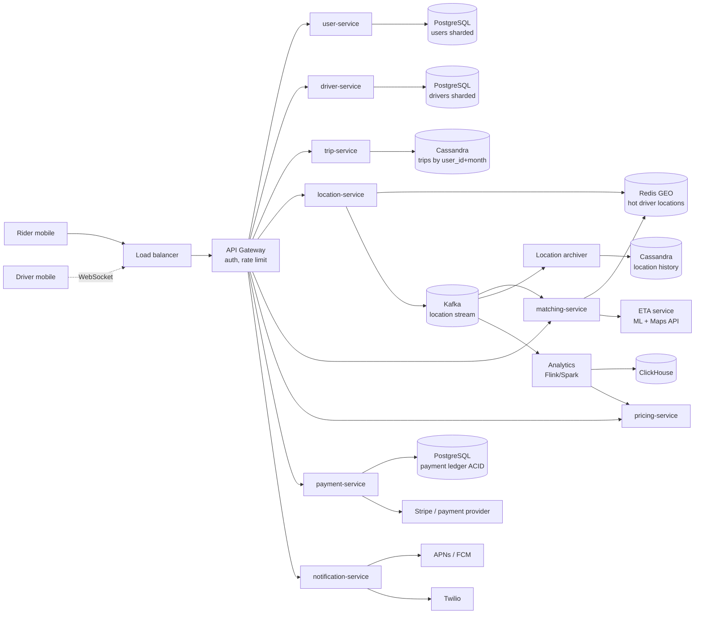
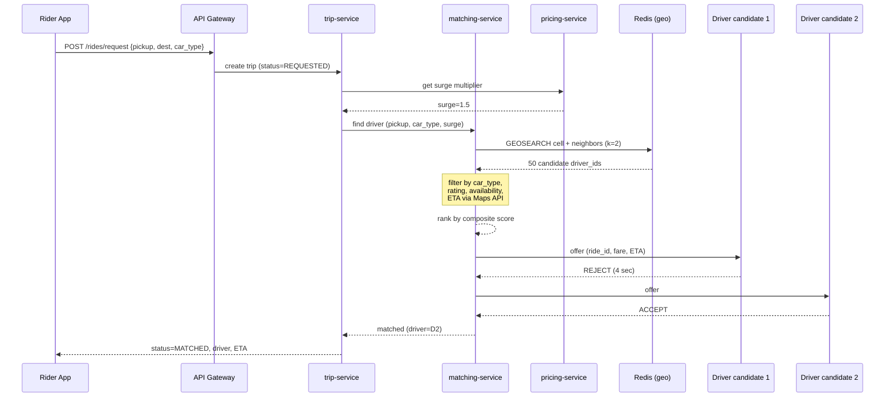
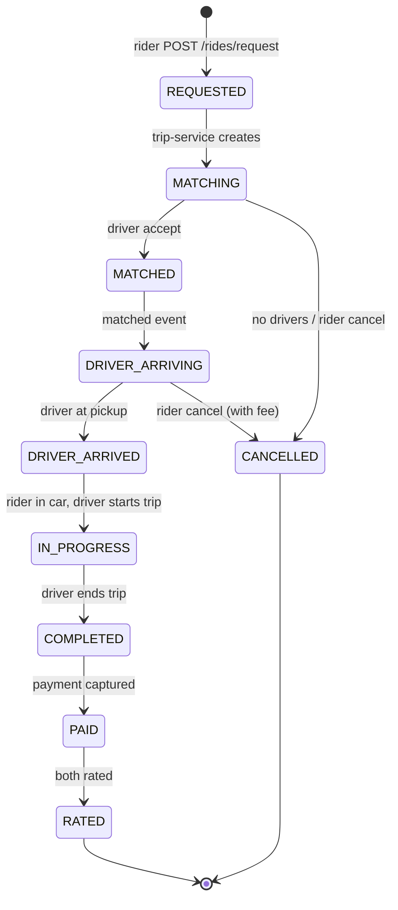
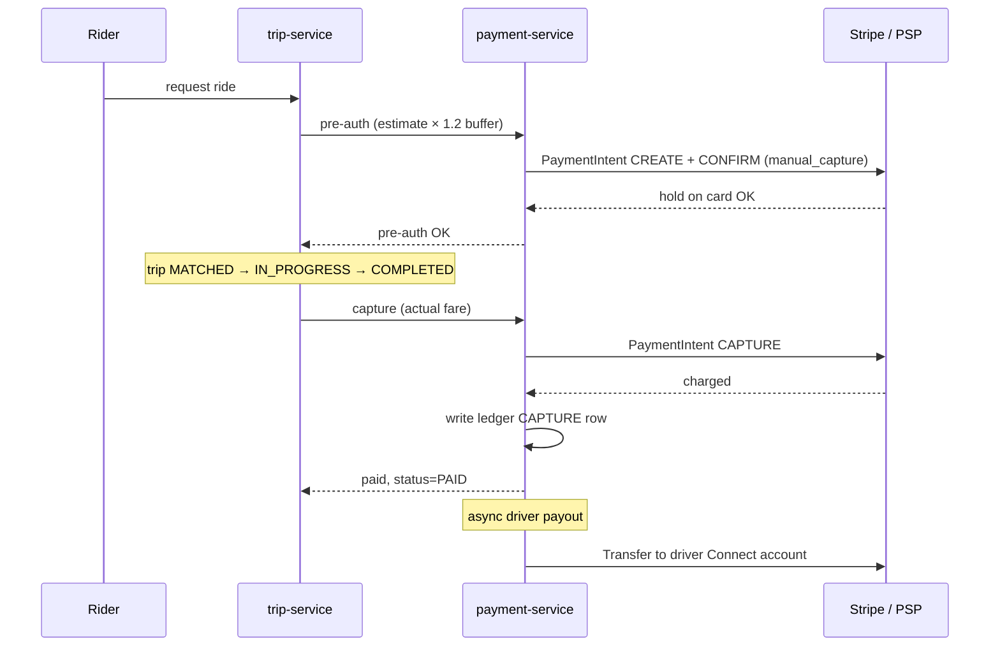

# System Design: Дизайн Uber/Lyft

Кейс senior/staff-уровня: матчинг водителей и райдеров в реальном времени, geo-spatial-индексы (`H3` / `S2` / `geohash`), потоковая обработка локаций, surge pricing, машина состояний поездки, поток оплаты и геораспределение. Главное напряжение дизайна — двойственность нагрузки: поток обновлений локаций write-heavy, а матчинг latency-critical. Хороший рассказ по этому кейсу заходит на любую позицию backend- или infra-уровня.

## Полезные ссылки

- [Uber Engineering Blog](https://www.uber.com/blog/engineering/) — десятки разборов про matching, surge, H3, marketplace.
- [H3: Uber's Hexagonal Hierarchical Spatial Index](https://www.uber.com/blog/h3/) — оригинальный анонс H3.
- [H3 Documentation](https://h3geo.org/docs/) — концепты, API, разрешения.
- [Google S2 Geometry Library](https://s2geometry.io/) — конкурирующий sphere-based index.
- [Lyft Engineering Blog](https://eng.lyft.com/) — matching, ETA, marketplace.
- [DoorDash — Building Faster Indexing with Apache Kafka and Elasticsearch](https://doordash.engineering/) — близкий по проблематике geo-marketplace.
- [Designing Data-Intensive Applications, M. Kleppmann](https://dataintensive.net/) — stream processing глава.

## Содержание

**Requirements и capacity**
- [Q1. (!) Функциональные требования к системе?](#q1--функциональные-требования-к-системе)
- [Q2. (!) Нефункциональные требования и SLA?](#q2--нефункциональные-требования-и-sla)
- [Q3. (!) Прикидка нагрузки на салфетке (capacity estimation)?](#q3--прикидка-нагрузки-на-салфетке-capacity-estimation)
- [Q4. Дизайн API — какие эндпоинты?](#q4-дизайн-api--какие-эндпоинты)

**High-level design**
- [Q5. (!) Высокоуровневая архитектура?](#q5--высокоуровневая-архитектура)
- [Q6. Модели данных — User, Driver, Trip, Location?](#q6-модели-данных--user-driver-trip-location)

**Geo-spatial indexing**
- [Q7. (!) Зачем geo-spatial index — почему не SQL `WHERE lat BETWEEN ...`?](#q7--зачем-geo-spatial-index--почему-не-sql-where-lat-between-)
- [Q8. (!) Geohash — как работает, плюсы и минусы?](#q8--geohash--как-работает-плюсы-и-минусы)
- [Q9. Google S2 — иерархический индекс на сфере?](#q9-google-s2--иерархический-индекс-на-сфере)
- [Q10. (!) Uber H3 — гексагональный индекс, почему его выбрал Uber?](#q10--uber-h3--гексагональный-индекс-почему-его-выбрал-uber)
- [Q11. Geohash vs S2 vs H3 — сравнительная таблица?](#q11-geohash-vs-s2-vs-h3--сравнительная-таблица)

**Location streaming и storage**
- [Q12. (!) Как водители стримят координаты — WebSocket / MQTT / HTTP?](#q12--как-водители-стримят-координаты--websocket--mqtt--http)
- [Q13. (!) Где хранить локации водителей — Redis, Cassandra, in-memory grid?](#q13--где-хранить-локации-водителей--redis-cassandra-in-memory-grid)
- [Q14. Redis GEO vs собственный H3-grid — что выбрать?](#q14-redis-geo-vs-собственный-h3-grid--что-выбрать)

**Matching algorithm**
- [Q15. (!) Алгоритм матчинга — pipeline от запроса до accept?](#q15--алгоритм-матчинга--pipeline-от-запроса-до-accept)
- [Q16. Последовательный, широковещательный или батчевый матчинг?](#q16-последовательный-широковещательный-или-батчевый-матчинг)
- [Q17. Как ранжировать кандидатов — ETA, рейтинг, баланс спроса?](#q17-как-ранжировать-кандидатов--eta-рейтинг-баланс-спроса)

**Surge pricing**
- [Q18. (!) Surge pricing — как считается и где?](#q18--surge-pricing--как-считается-и-где)

**Trip state machine, storage и payment**
- [Q19. (!) Машина состояний поездки — какие состояния и события?](#q19--машина-состояний-поездки--какие-состояния-и-события)
- [Q20. (!) Какую БД выбрать под поездки, локации и платежи?](#q20--какую-бд-выбрать-под-поездки-локации-и-платежи)
- [Q21. Оценка ETA — Google Maps, ML: что и когда применять?](#q21-оценка-eta--google-maps-ml-что-и-когда-применять)
- [Q22. Поток оплаты — холд, списание, возвраты, выплата водителю?](#q22-поток-оплаты--холд-списание-возвраты-выплата-водителю)

**Geo-distribution и hot regions**
- [Q23. Геораспределение — региональные дата-центры и роутинг?](#q23-геораспределение--региональные-дата-центры-и-роутинг)
- [Q24. Горячие регионы (NYC, SF, London) — как масштабировать?](#q24-горячие-регионы-nyc-sf-london--как-масштабировать)
- [Q25. Стратегия шардинга — по какому ключу делить поездки, локации, платежи?](#q25-стратегия-шардинга--по-какому-ключу-делить-поездки-локации-платежи)

**Anti-fraud и trade-offs**
- [Q26. Anti-fraud — подмена GPS, фейковые водители, платёжный фрод?](#q26-anti-fraud--подмена-gps-фейковые-водители-платёжный-фрод)
- [Q27. (!) CAP — где выбираем AP, где CP?](#q27--cap--где-выбираем-ap-где-cp)
- [Q28. (!) Антипаттерны — типичные ошибки в дизайне Uber?](#q28--антипаттерны--типичные-ошибки-в-дизайне-uber)
- [Q29. Заказы заранее и поездки с остановками — отдельный поток?](#q29-заказы-заранее-и-поездки-с-остановками--отдельный-поток)
- [Q30. Главные компромиссы дизайна?](#q30-главные-компромиссы-дизайна)

## Q1. (!) Функциональные требования к системе?

Сначала очертим, что система обязана уметь, — это первые 2-3 минуты интервью, и от этого списка зависит вся дальнейшая архитектура. Главное — отделить ядро (без него Uber не Uber) от сопутствующих фич.

**Ядро (must-have):**

- **Заказ поездки** — райдер выбирает точку подачи (pickup) и назначения, тип машины (`UberX`, `Comfort`, `Black`), видит оценку стоимости и ETA до подачи.
- **Подбор водителя (matching)** — система находит ближайшего подходящего драйвера за < 5 секунд.
- **Трекинг в реальном времени** — обе стороны видят позицию друг друга на карте.
- **Жизненный цикл поездки** — водитель едет к точке подачи → посадка → поездка → завершение.
- **Оплата** — холд на карте при заказе, списание при завершении, чаевые, деление счёта (split fare), возврат.
- **Рейтинг** — обе стороны ставят 1-5 звёзд после поездки.
- **Surge pricing** — динамическое подорожание в зонах высокого спроса.
- **История поездок** — список прошлых поездок и чеки (receipts).

**Сопутствующие фичи** — упомянуть стоит, но детали раскрывать только по просьбе интервьюера:

- **Поездки с остановками (multi-stop)** — несколько промежуточных точек (waypoints) в одной поездке.
- **Заказ заранее (scheduled rides)** — бронирование на конкретное время.
- **Совместные поездки (Pool / Shared)** — несколько райдеров в одной машине.

**Вне рамок (out of scope)** для типичного интервью: карты и навигация (берём готовый Google Maps API), онбординг и верификация водителей, бухгалтерия и финансовая отчётность, дашборд расследования мошенничества.

## Q2. (!) Нефункциональные требования и SLA?

Нефункциональные требования здесь важнее, чем в обычном CRUD: система write-heavy (миллион обновлений локаций в секунду) и одновременно latency-critical (матчинг за секунды). Числа ниже задают порядок величин и сразу диктуют выбор хранилищ.

| Параметр | Цель |
|---|---|
| DAU | 100M+ (riders + drivers) |
| Rides per day | 20M |
| Active drivers concurrently | ~5M peak |
| Active rides concurrently | ~500K-1M peak |
| Location update frequency | 1 update / 4 sec per driver |
| Match latency p99 | < 5 сек от request до driver assigned |
| Tracking latency p99 | < 1 сек от driver GPS до rider screen |
| Availability | 99.99% (~52 мин/год downtime) |
| Consistency для locations | **Eventual** — позиция 2 сек назад приемлема |
| Consistency для payments | **Strong** — деньги нельзя терять, ACID + ledger |
| Durability | Никакой потери trip records, receipts, payments |
| Geo-distribution | Multi-region, latency < 100 ms от user до DC |

Главный вывод, который надо озвучить сразу: **разные подсистемы живут по разным правилам консистентности**. По CAP выбираем **AP для локаций и матчинга** (доступность важнее точности — позиция двухсекундной давности приемлема) и **CP для платежей и журнала поездок** (деньги терять нельзя). Это разделение определяет выбор БД на всех следующих шагах.

## Q3. (!) Прикидка нагрузки на салфетке (capacity estimation)?

Цель этой прикидки — понять, какая часть системы «горит» сильнее всего. Здесь это однозначно поток обновлений локаций: он на два порядка больше всего остального и определяет архитектуру.

**Запись — локации водителей (самая горячая часть):**

- 5M активных водителей × 1 обновление / 4 сек = **1.25M записей локаций в секунду**.
- Одно обновление локации ≈ 100 байт (driver_id 8B + lat 8B + lng 8B + ts 8B + heading + speed + status + accuracy ≈ 50-100B после сериализации).
- **Пропускная способность записи**: 1.25M × 100B = **125 MB/sec** только на обновлениях локаций.
- В hot store позиция логически перезаписывается (overwrite), а не копится: хотя за час прошло 1.25M × 3600 = 4.5B обновлений, фактически хранится по одной записи на водителя = 5M ключей.

**Запись — события поездок (trip events):**

- 20M поездок/день = ~230 поездок/сек в среднем; в пик (пятничный вечер в NYC) ×10 → 2-5K поездок/сек.
- Каждая поездка порождает ~20-50 событий (переходы состояний, точки маршрута, события оплаты) → 50-100K событий/сек в Kafka на пике.

**Чтение:**

- Райдер открывает приложение ~2 раза в день и пингует позицию каждые 5 сек во время поездки.
- Активные поездки 1M × 1 пинг / 5 сек = 200K чтений/сек только на трекинг.
- Запросы матчинга: 2-5K/сек, каждый делает `GEOSEARCH` по нескольким ячейкам H3.

**Объёмы хранения:**

- **Локации, hot** (Redis): 5M водителей × 100B = 500 MB — всегда в памяти.
- **Локации, cold** (Cassandra): 1.25M × 100B × 86400 sec = ~10 TB/день, retention 90 дней → ~1 PB.
- **Поездки**: 20M/день × 10 KB метаданных = 200 GB/день, за год ~70 TB.
- **Платежи**: 20M/день × 2 KB = 40 GB/день = ~15 TB/год (ACID-критичные данные).

Из этих цифр сразу следуют четыре решения: **горизонтальный шардинг обязателен**, **in-memory geo-grid для матчинга** (а не SQL по координатам), **Kafka как шина событий**, **раздельные БД под hot / cold / ACID** — у каждого слоя свой профиль нагрузки.

## Q4. Дизайн API — какие эндпоинты?

Выбор транспорта по задаче: REST для CRUD-операций, WebSocket для трекинга в реальном времени и потока локаций водителя, gRPC — для внутренних вызовов между сервисами.

```
# Rider flow
POST   /api/v1/rides/estimate          body: {pickup, destination, car_type}
                                       resp: {fare_estimate, eta, surge_multiplier}
POST   /api/v1/rides/request           body: {pickup, destination, car_type, payment_method_id}
                                       resp: {ride_id, status: "MATCHING"}
GET    /api/v1/rides/{ride_id}
POST   /api/v1/rides/{ride_id}/cancel
POST   /api/v1/rides/{ride_id}/rate    body: {rating, comment}
GET    /api/v1/rides/history?cursor=...

# Driver flow
POST   /api/v1/drivers/status          body: {status: ONLINE|OFFLINE}
POST   /api/v1/drivers/location        body: {lat, lng, heading, speed}     # via WebSocket
POST   /api/v1/rides/{ride_id}/accept
POST   /api/v1/rides/{ride_id}/arrived
POST   /api/v1/rides/{ride_id}/start
POST   /api/v1/rides/{ride_id}/complete

# WebSocket (both)
WS     /ws/tracking?ride_id=...        — server pushes location updates 1/sec
WS     /ws/driver-stream               — driver pushes location, receives offers

# Payments
POST   /api/v1/payments/methods
GET    /api/v1/payments/receipts/{ride_id}
POST   /api/v1/payments/tip            body: {ride_id, amount}
```

**Ключевой приём — асинхронность.** `POST /rides/request` — самый критичный эндпоинт, и он не ждёт результата матчинга. Он мгновенно возвращает `202 Accepted` с `ride_id`, а дальше клиент получает ход подбора водителя по WebSocket. Так HTTP-запрос укладывается в SLA < 200 ms, а сам матчинг (он может занять секунды) работает в фоне и не держит соединение.

## Q5. (!) Высокоуровневая архитектура?

Система раскладывается на узкоспециализированные сервисы, потому что у подсистем радикально разные профили нагрузки и консистентности (см. Q2). Связующее звено между ними — Kafka как шина событий: она даёт асинхронный fan-out, при котором аналитика и история не нагружают горячий путь матчинга.



Главные сервисы и зона ответственности каждого:

- **`user-service` / `driver-service`** — профили, авторизация, статусы. Владельцы таблиц `users` / `drivers`.
- **`location-service`** — принимает WebSocket-поток от водителей, пишет в Redis (hot) и Kafka (durable). Точка входа для трекинга.
- **`matching-service`** — читает события локаций из Kafka, получает запросы поездок, делает spatial-запрос, ранжирует кандидатов, рассылает офферы.
- **`trip-service`** — владелец машины состояний поездки, обрабатывает переходы `REQUESTED → MATCHED → ...`, пишет в Cassandra.
- **`pricing-service`** — считает оценку стоимости и surge-множитель на ячейку H3, берёт supply/demand из аналитики.
- **`payment-service`** — холд, списание, возврат, выплата. Единственный сервис со строгой консистентностью.
- **`notification-service`** — push, SMS, WebSocket для трекинга.
- **`ETA-service`** — обёртка над Google Maps Distance Matrix плюс ML-модель.

Связь между сервисами — **Kafka как магистраль событий**: `driver.location.updated`, `trip.requested`, `trip.matched`, `trip.completed`, `payment.captured`. Это даёт асинхронный fan-out: одно событие потребляют сразу несколько подписчиков (матчинг, история, аналитика), не мешая друг другу.

## Q6. Модели данных — User, Driver, Trip, Location?

Модели подобраны под разные паттерны доступа: профили — это OLTP-CRUD в PostgreSQL, поездки — write-heavy таймсерия в Cassandra, горячие локации — key-value в Redis, платежи — append-only журнал с ACID. Главная идея — не хранить всё в одной БД.

```sql
-- users / drivers — PostgreSQL, sharded by user_id
CREATE TABLE users (
  user_id        BIGINT PRIMARY KEY,
  phone          VARCHAR(20) UNIQUE,
  email          VARCHAR(255),
  payment_methods JSONB,           -- token IDs from Stripe
  rating         FLOAT,
  created_at     TIMESTAMP
);

CREATE TABLE drivers (
  driver_id      BIGINT PRIMARY KEY,
  phone          VARCHAR(20) UNIQUE,
  car_id         BIGINT,
  status         VARCHAR(16),      -- OFFLINE|ONLINE|BUSY
  rating         FLOAT,
  total_rides    BIGINT,
  documents      JSONB,            -- license, insurance refs
  home_region    VARCHAR(8)
);
```

```cql
-- trips — Cassandra, sharded by (user_id, month)
CREATE TABLE trips_by_user (
  user_id       BIGINT,
  month         INT,               -- YYYYMM
  trip_id       TIMEUUID,
  driver_id     BIGINT,
  status        TEXT,
  pickup        FROZEN<geo_point>,
  destination   FROZEN<geo_point>,
  fare          DECIMAL,
  surge         FLOAT,
  events        LIST<FROZEN<trip_event>>,
  created_at    TIMESTAMP,
  PRIMARY KEY ((user_id, month), trip_id)
) WITH CLUSTERING ORDER BY (trip_id DESC);

-- driver_locations_hot — Redis ZSET / GEO
-- ключ: drivers:geo  значение: driver_id  scores: H3 cell id (или geohash)
-- TTL обрабатывается отдельным sweeper если driver идёт OFFLINE
```

```sql
-- payments — PostgreSQL ACID, ledger pattern
CREATE TABLE payment_ledger (
  txn_id        BIGINT PRIMARY KEY,
  ride_id       BIGINT,
  user_id       BIGINT,
  type          VARCHAR(16),       -- PREAUTH|CAPTURE|REFUND|TIP|PAYOUT
  amount        DECIMAL(12,2),
  currency      VARCHAR(3),
  status        VARCHAR(16),
  provider_ref  TEXT,              -- Stripe payment_intent_id
  created_at    TIMESTAMP,
  CONSTRAINT chk_amount CHECK (amount >= 0)
);
```

Ключевое: **поездки хранятся отдельно от локаций**, потому что у них принципиально разные паттерны доступа. Поездка — это «прочитать одну запись» (для чека) или «список за месяц» (для истории), и реляционная/wide-column модель тут идеальна. А локации — это «найти всё в радиусе R от точки»: для такого запроса ни PostgreSQL, ни Cassandra не приспособлены, нужен geo-spatial index (об этом — следующий вопрос).

## Q7. (!) Зачем geo-spatial index — почему не SQL `WHERE lat BETWEEN ...`?

Короткий ответ: реляционный `WHERE lat BETWEEN ...` не умеет эффективно искать «ближайших», ломается на частых записях и геометрически некорректен. Geo-spatial index превращает «поиск в радиусе» в быстрый lookup по ячейкам. Это очень частый вопрос на интервью — разберём по пунктам, почему наивный SQL не годится.

**Наивный подход в SQL:**

```sql
SELECT driver_id, lat, lng
FROM driver_locations
WHERE lat BETWEEN 40.7 AND 40.8
  AND lng BETWEEN -74.1 AND -74.0
  AND status = 'ONLINE';
```

**Что с этим не так — пять проблем:**

1. **Прямоугольник (bounding box) — это не круг.** Угол квадрата дальше центра в √2 раза, поэтому кандидатов всё равно придётся повторно фильтровать по реальному расстоянию.
2. **Индекс почти не помогает.** B-tree по `(lat, lng)` использует по сути только первую колонку. Фильтр по `lat` оставляет полосу шириной ~11 км — в Нью-Йорке это миллионы строк, которые движок проверяет по второй колонке перебором.
3. **Слишком частые записи.** 1.25M записей/сек в SQL — это смерть БД: каждая запись инвалидирует индекс, autovacuum не успевает чистить мёртвые версии строк.
4. **Земля — не плоскость.** Около полюсов 1° долготы ≈ 10 км, на экваторе ≈ 111 км. Прямоугольник в координатах сильно искажён.
5. **Нужны не просто «в радиусе», а «ближайшие N с учётом ETA».** А ETA зависит от дорог, а не от расстояния по прямой (air distance).

**Что нужно вместо этого:**

- **Spatial index** (geohash / S2 / H3 / R-tree / QuadTree) → быстрый поиск по префиксу или по ячейке.
- **In-memory hash** «cell_id → список driver_id» → поиск кандидатов в ячейке и соседних за O(1).
- **Отдельная подсистема** под локации, а не общая SQL-БД.

Это и есть базовый аргумент в пользу H3 и Redis GEO в этом дизайне.

## Q8. (!) Geohash — как работает, плюсы и минусы?

**Geohash** — алгоритм Густаво Нимейера (2008): превращает пару `(lat, lng)` в строку из base-32 символов через рекурсивное деление 2D-плоскости пополам. Суть в том, что чем длиннее общий префикс у двух geohash-строк, тем ближе точки на карте, — а значит, поиск сводится к сравнению префиксов.

**Как кодируется:**

1. Берутся диапазоны `lat ∈ [-90, 90]`, `lng ∈ [-180, 180]`.
2. На каждом шаге диапазон делится пополам по очереди (бит `lng`, бит `lat`, …) и пишется 0 или 1 в зависимости от того, в какую половину попала точка.
3. Биты группируются по 5 и кодируются в base-32 (`0123456789bcdefghjkmnpqrstuvwxyz` — без `a, i, l, o`, чтобы не путать буквы и цифры).

```
NYC Times Square (40.7580, -73.9855):
  geohash precision 8 = "dr5regw3"
  geohash precision 7 = "dr5regw"  (cell ~150m × 150m)
  geohash precision 6 = "dr5reg"   (cell ~1.2 km × 0.6 km)
  geohash precision 5 = "dr5re"    (cell ~5 km × 5 km)
```

**Главное свойство:** общий префикс geohash означает близость точек, поэтому запрос «всё в радиусе» сводится к **сканированию по префиксу** в индексе строк.

**Плюсы:**

- Просто: библиотеки есть на всех языках, работает поверх любой KV- или SQL-БД.
- Нативная поддержка в Redis (`GEOADD`, `GEOSEARCH` под капотом используют geohash).
- Сортируемый ключ — отлично ложится на B-tree.

**Минусы:**

- **Проблема границ.** У соседних ячеек могут быть совершенно разные префиксы: точки `dr5regw` и `dr5regx` физически рядом, но префиксного совпадения нет. Из-за этого приходится отдельно проверять **8 соседних ячеек**.
- **Неравномерные ячейки.** Около полюсов клетки сжимаются по широте — для глобальной системы это неудобно.
- **Разрыв на меридиане ±180°.** Geohash-ячейки `8` и `r` физически рядом, но далеки в строковом порядке.

Именно поэтому Uber начинал с geohash, но при выходе на глобальный масштаб перешёл на H3.

## Q9. Google S2 — иерархический индекс на сфере?

**S2** — библиотека от Google, появилась в Google Maps в 2010-х. Главное отличие от geohash: индекс строится **на сфере**, а не на плоскости, поэтому ячейки не вырождаются у полюсов.

**Как устроен:**

1. Сфера Земли проецируется на куб (6 граней).
2. Каждая грань нумеруется по **кривой Гильберта** (Hilbert curve) — фрактальной кривой, которая обходит 2D-пространство, сохраняя локальность: соседние номера соответствуют соседним точкам.
3. Каждая ячейка получает **64-битный cell ID** (`uint64`).
4. 30 уровней разрешения — от `level 0` (~85M км² на ячейку) до `level 30` (~1 см²).

```python
import s2sphere
ll = s2sphere.LatLng.from_degrees(40.7580, -73.9855)
cell = s2sphere.CellId.from_lat_lng(ll).parent(15)   # level 15 ~ 300m
print(cell.id())  # 9926595690553475072
```

**Плюсы:**

- **Равная площадь ячеек** на любой широте — нет вырождения у полюсов.
- **Кривая Гильберта** сохраняет локальность: близкие cell ID соответствуют близким точкам.
- **64-битное целое** компактнее geohash-строки и быстрее сравнивается.
- Используется в Google Maps, Pokemon GO, Foursquare.

**Минусы:**

- **Квадратные ячейки** — 4 соседа по сторонам плюс 4 по углам, причём на разном расстоянии. Это усложняет distance-запросы.
- Сложнее читать и отлаживать — cell ID не human-readable.
- Меньше готовых интеграций в слое хранения — нативной поддержки нет в большинстве БД.

S2 часто сравнивают с H3: оба дают ячейки равной площади, но H3 вдобавок решает проблему «равноудалённых соседей» за счёт гексагонов.

## Q10. (!) Uber H3 — гексагональный индекс, почему его выбрал Uber?

**H3** — open-source иерархический гексагональный индекс от Uber (2018, [github](https://github.com/uber/h3)). Ключевая идея: разбить мир на шестиугольники, у которых все соседи равноудалены, — это и есть то, чего не хватало geohash и S2.

**Как устроен:**

1. Сфера Земли проецируется на **икосаэдр** (20-гранник).
2. Каждая грань замощается гексагонами (тесселяция).
3. 16 уровней разрешения (`res 0` — самые крупные ~4.25M км², `res 15` — ~1 м²).
4. Каждая ячейка — **64-битное целое**.

```python
import h3
# lat, lng, resolution
cell = h3.latlng_to_cell(40.7580, -73.9855, 9)   # res 9 ~ 174m edge
# '8a2a1072b5b7fff'
neighbors = h3.grid_disk(cell, k=1)             # cell + 6 immediate neighbors
edge_length_m = h3.average_hexagon_edge_length(9, unit='m')   # ~174
```

**Почему гексагоны лучше квадратов для матчинга:**

- **6 равноудалённых соседей** (против 4 по сторонам + 4 по диагонали у квадрата). Расстояние от центра ячейки до центра любого соседа одинаково — идеально для запросов «найти ближайших».
- **Нет угловых соседей** — `GEOSEARCH` не надо отдельно обрабатывать диагонали, логика проще.
- **Меньше искажений** при пересечении границ движущимся объектом: гексагональная сетка более изотропна (одинакова по всем направлениям).

**Иерархия:** у каждой ячейки на следующем уровне ~7 «детей» (центр + 6), поэтому данные можно агрегировать на любом масштабе.

**Почему Uber выбрал H3 для production:**

1. Surge pricing считается **на гексагон** — один множитель на ячейку.
2. Метрики supply/demand водителей агрегируются иерархически.
3. Запрос матчинга «дай всех водителей в ячейке и соседях» — это ровно `h3.grid_disk(cell, k)`.
4. Хорошо сочетается с ML-моделями прогнозирования.

**Минусы H3:**

- На икосаэдре неизбежно появляются **12 «пятиугольников»** (pentagons) вместо гексагонов — граничные случаи в узких местах сетки (но они приходятся в основном на океан, так что на практике почти не мешают).
- Гексагоны не дают идеального вложения: родительская ячейка не содержит ровно 7 дочерних, есть небольшой перекрытие (overlap) — это надо учитывать при агрегации, чтобы не двойного счёта.

## Q11. Geohash vs S2 vs H3 — сравнительная таблица?

Все три решают одну задачу — индексировать точки на поверхности, — но по-разному жертвуют простотой, равномерностью и удобством соседей. Таблица сводит ключевые различия.

| Параметр | Geohash | Google S2 | Uber H3 |
|---|---|---|---|
| Форма ячейки | Прямоугольник | Квадрат (на сфере) | Гексагон |
| Проекция | Plane | Cube → sphere | Icosahedron |
| Соседи | 8 (4+4 углы) | 8 (4+4 углы) | **6 равноудалённых** |
| Кодирование | base-32 string | 64-bit int (Hilbert curve) | 64-bit int |
| Uniform area | Нет (вырождение у полюсов) | Да | Да (почти) |
| Hierarchical | Префиксная вложенность | 30 уровней parent/child | 16 уровней parent/child (с overlap) |
| Antimeridian / poles | Discontinuity | OK | OK (но есть 12 pentagons) |
| Native в Redis | Да (`GEOADD`) | Нет | Нет (требует библиотеку) |
| Использование | Простые карты, мобильные | Google Maps, Pokemon GO | Uber, real-estate, weather |
| Сложность интеграции | Низкая | Средняя | Средняя |
| Edge case bias | Граничные точки | Edge of cube faces | 12 pentagons |
| Размер cell на типичном уровне | precision 7 ≈ 150m | level 15 ≈ 300m | res 9 ≈ 174m edge |

**Практический выбор:**

- **MVP / стартап** — Redis + geohash: можно запуститься за день.
- **Глобальный сервис с тепловыми картами и ML** — H3.
- **Готовый стек Google** — S2.

В этом дизайне берём **H3** как production-уровень, но в горячем пути (hot path) для real-time-поиска используем Redis GEO (внутри он на geohash) поверх разбиения зон на H3.

## Q12. (!) Как водители стримят координаты — WebSocket / MQTT / HTTP?

Главная проблема — масштаб потока: 5M водителей × 1 обновление / 4 сек = **1.25M сообщений/сек**. Транспорт нужен такой, который не открывает новое соединение на каждое сообщение и умеет двусторонний обмен (сервер тоже шлёт водителю офферы).

**Варианты транспорта:**

| Транспорт | Плюсы | Минусы |
|---|---|---|
| **HTTP POST** каждые 4 сек | Просто, любой балансировщик, ретраи из коробки | Накладные расходы на TLS-handshake, новое соединение на каждый запрос, нет push сервер→клиент |
| **HTTP/2 long-poll** | Одно соединение, мультиплексирование | Всё ещё overhead, двусторонность не нативная |
| **WebSocket** | Двусторонний, постоянное соединение, малый overhead | Нужна sticky-сессия к шлюзу, keep-alive, ретрай на переподключении |
| **MQTT** | Создан для IoT: уровни QoS, retain-сообщения, низкий overhead | Нужен MQTT-брокер (EMQX, HiveMQ), сложнее интеграция в браузере |
| **gRPC-стримы** | HTTP/2, типизация, двусторонний стриминг | Не работает в большинстве мобильных SDK без обёрток |

**Что выбирают Uber/Lyft на практике** — **WebSocket** для большинства случаев и **MQTT** для IoT-устройств водителей (планшеты в машинах, где важны QoS-гарантии).

**Архитектура потока:**

```
Driver mobile  --(WebSocket: lat,lng,ts,heading,speed)-->  location-service ingress (sticky LB)
                                                            |
                                                            v
                                                Redis ZSET (hot, overwrite)
                                                            |
                                                            v
                                                Kafka topic driver.location.updated
                                                            |
                                          --------------+--------------+--------------
                                          |             |              |
                              matching-service   location-archiver   analytics
                                          |             |              |
                                       (read)     Cassandra hist    Flink/Spark
```

**Почему именно так:**

- **Redis как hot store** для чтений real-time-матчинга: `GEOSEARCH` работает за O(log N + M).
- **Kafka как durable-поток**: несколько потребителей (матчинг, история, аналитика) читают одни и те же события независимо, не мешая друг другу.
- **Sticky-балансировка** к location-service: иначе переподключения WebSocket будут «прыгать» между подами, теряя сессию.
- **Батчинг на клиенте**: водитель шлёт не каждые 4 сек по одному, а копит 2-3 обновления и отправляет пачкой — меньше сетевых вызовов.

**Сжатие:** обновление локации — это маленькое бинарное сообщение. Кодируем его в Protobuf, а не в JSON: размер падает в 2-3 раза, а парсинг быстрее.

## Q13. (!) Где хранить локации водителей — Redis, Cassandra, in-memory grid?

Одна логическая сущность («где сейчас водитель») хранится сразу на нескольких уровнях, потому что у каждой задачи свои требования к скорости, времени жизни и паттерну доступа.

**1. Hot — текущая позиция активных водителей:**

- **Redis** с `GEOADD` / `GEOSEARCH` либо собственный хеш «cell_id → множество driver_id».
- 5M ключей × 100B = 500 MB: помещается в одну крупную ноду, но ради отказоустойчивости (HA) нужен кластер с репликацией.
- Задержка чтения и записи < 1 мс.
- **Нативный TTL в Redis GEO не используется**: водитель просто перезаписывает свою запись, а отдельный sweeper удаляет тех, кто ушёл OFFLINE.

**2. Warm — позиции за последние N минут (для трекинг-историй и переигрывания маршрута):**

- **In-memory geo-grid** на воркерах matching-service. Хеш `H3_cell_id → список (driver_id, lat, lng, ts)`.
- Это локальный кэш, который обновляется из Kafka-потока, — благодаря ему матчинг не ходит в Redis на каждый запрос.
- Объём памяти: 5M × 200B (история за 60 сек по точке каждые 4 сек) ≈ 1 GB на ноду.

**3. Cold — историческая траектория всех поездок:**

- **Cassandra** с partition key `(driver_id, day)` и кластеризацией по `ts`.
- Retention 90 дней (требования регуляторов + аналитика), затем архив в S3 в формате Parquet.
- В масштабе ~1 PB. Используется для разбора споров, обучения ETA-модели, расследований мошенничества.

**4. Аналитика:**

- Kafka → **Flink/Spark** → **ClickHouse / BigQuery** для анализа surge-зон, тепловых карт, баланса supply/demand.

Ключевая идея: **одна и та же сущность живёт в нескольких системах, но с разным временем жизни и паттерном доступа** — горячая в Redis, тёплая в памяти воркера, холодная в Cassandra, агрегированная в OLAP.

## Q14. Redis GEO vs собственный H3-grid — что выбрать?

Короткий ответ: для прототипа — встроенный Redis GEO, для production — собственный H3-grid поверх Redis-хешей. Причина — в том, как они шардятся и как фильтруют по доп. полям.

**Redis GEO** — встроенные команды поверх sorted set, где geohash используется как score.

```
GEOADD drivers:online -73.9855 40.7580 driver:42
GEOADD drivers:online -73.9870 40.7585 driver:99

# Найти ближайшие в радиусе 2 km, top 10
GEOSEARCH drivers:online FROMLONLAT -73.9855 40.7580 BYRADIUS 2 km ASC COUNT 10
```

**Плюсы:**
- Не нужно писать собственную spatial-логику — всё встроено.
- Атомарные операции через `MULTI` / `EXEC`.
- Масштабирование через Redis Cluster — но осторожно: все водители в одном ключе `drivers:online` попадают в один слот, и это становится hot key.

**Минусы:**
- **Узкое место на одном ключе.** `GEOSEARCH` по миллиону driver_id в Redis Cluster всегда упирается в одну ноду — горизонтально не масштабируется.
- **Нельзя фильтровать по другим полям** (car_type, rating): после `GEOSEARCH` приходится отдельно идти в БД за метаданными — лишний round-trip.
- Дорого держать метаданные тысяч водителей прямо в geo-структуре.

**Собственный H3-grid:**

```
hash key = "drivers:cell:8a2a1072b5b7fff"  (один H3 cell)
value    = set/hash of driver_ids → {lat, lng, ts, car_type, rating}
```

- Каждая ячейка — отдельный Redis-хеш, поэтому ключи **автоматически** распределяются по слотам кластера.
- Запрос: вычислить `h3.grid_disk(cell, k=1)` (7 ячеек) → сделать 7 параллельных `HGETALL` → объединить результаты.
- Метаданные лежат **рядом** с геоданными → один round-trip вместо двух.

**Гибрид — то, что реально работает в production:**

- Redis-хеши, шардированные по ячейке H3.
- Внутри каждого хеша: `driver_id → упакованные метаданные` (Protobuf).
- Sweeper играет роль TTL: если водитель не обновлялся 30 сек — запись удаляется.

Выбираем гибрид. Чистый `GEOADD` оставляем для MVP или прототипа.

## Q15. (!) Алгоритм матчинга — pipeline от запроса до accept?



**Шаги конвейера (pipeline):**

1. **Найти ячейку H3 точки подачи** на нужном разрешении (res 9 ≈ 174 м по ребру).
2. **Собрать кандидатов** — `h3.grid_disk(cell, k=2)` → 19 ячеек → параллельные `GEOSEARCH` / `HGETALL` → объединить driver_id (типично 50-200 кандидатов в плотном городе).
3. **Отфильтровать** — подходящий car_type, status=ONLINE, рейтинг ≥ порога, не в чёрном списке этого райдера.
4. **Ранжировать** — композитный score (см. Q17): ETA, рейтинг водителя, доля принятых офферов, баланс supply/demand, справедливость (cool-down между офферами).
5. **Отправить оффер** — последовательно top-K (см. Q16). Приложение водителя получает push + сообщение по WebSocket, на ответ даётся 10-15 сек.
6. **Кто первый принял — тот и забирает** — остальные офферы отменяются.
7. **Обновить машину состояний** — `trip-service` пишет событие `MATCHED` в Kafka и уведомляет райдера.

**SLA матчинга:** p50 ≤ 2 сек, p99 ≤ 5 сек. Если водитель не нашёлся за 30 сек — возвращаем `NO_DRIVERS_AVAILABLE` и предлагаем подождать или согласиться на surge.

## Q16. Последовательный, широковещательный или батчевый матчинг?

Три стратегии рассылки офферов — это компромисс между скоростью, справедливостью и оптимальностью распределения.

**Последовательный (sequential, один за другим):**
- Шлём оффер одному водителю → ждём 10-15 сек → отказ → следующий.
- **Плюсы:** справедливость, нет гонок (race condition), простая машина состояний.
- **Минусы:** медленно. Если первые трое отказали — уже 30+ сек ожидания.

**Широковещательный (broadcast, всем сразу):**
- Шлём оффер всем top-K параллельно.
- **Плюсы:** быстро — скорость матча равна скорости самого быстрого водителя.
- **Минусы:** гонка при приёме (нужна синхронизация accept), несправедливо — далёкие водители зря тратят время и раздражаются.

**Батчевый (batched, реальный подход Uber):**
- **Копим N запросов за окно T (5-10 сек)** и **решаем всех разом** — двудольное паросочетание (bipartite matching, венгерский алгоритм).
- Минимизирует **суммарный (global) ETA**, а не локальный для одного райдера.
- **Плюсы:** оптимальная общая пропускная способность, эффективен в горячих зонах с множеством одновременных запросов.
- **Минусы:** добавляет 5-10 сек к задержке, нужна более умная оркестрация.

**Что выбирают на практике:** в разреженных зонах — последовательный, в горячих зонах с >100 одновременными запросами — батчевый. Последовательный обычно параметризуют: шлём оффер сразу top-3, кто первый принял — забирает. По сути это «мягкий broadcast» с маленьким K.

## Q17. Как ранжировать кандидатов — ETA, рейтинг, баланс спроса?

Каждой паре (райдер, водитель) присваивается композитный score, и кандидаты сортируются по нему. Главный фактор — ETA (быстрее подъехать важнее всего), остальные слагаемые корректируют выбор ради качества и справедливости.

```
score = w1 × (1 / ETA)            # быстрее приехать — лучше
      + w2 × driver_rating         # 5 звёзд лучше
      + w3 × driver_accept_rate    # ответственный
      + w4 × (1 - recent_offers)   # cool-down — не спамим одному
      + w5 × fairness_bonus        # давно не работал → приоритет
      - w6 × cancellation_history  # часто отменяет — penalty
```

**Веса** подбираются офлайн на исторических данных; целевая метрика — максимум `accept_rate × (1 - cancellation_rate) × NPS`.

**ETA в score** — самый весомый фактор. Считается через **Google Maps Distance Matrix API** или собственный **дорожный граф + ML** (для топовых городов у Uber есть собственный road graph).

**Учёт баланса спроса и предложения (supply/demand):**
- Если в ячейке мало водителей, а запросов много → расширяем радиус поиска (`k=3` вместо `k=2`).
- Если водителей избыток → ужесточаем фильтр, побеждают только лучшие.

**Защита от «переманивания» (anti-poaching):** один водитель не получает оффер чаще раза в N секунд (cool-down) — чтобы не было гонок и спама.

**ML-модель** в production: градиентный бустинг (XGBoost, далее DNN); признаки — история водителя, история райдера, время суток, погода, трафик.

## Q18. (!) Surge pricing — как считается и где?

**Цель** — балансировать спрос и предложение в реальном времени. Когда водителей не хватает, цена растёт, и это работает с двух сторон сразу:
1. отпугивает часть райдеров (снижает спрос),
2. привлекает водителей в зону через push «здесь surge» (повышает предложение).

**Алгоритм:**

```
для каждой H3 cell на res 7 (≈ 5 km²):
    demand = ride_requests за последние 5 мин
    supply = available_drivers in cell + neighbors
    raw_ratio = demand / max(supply, 1)
    multiplier = ML_model(raw_ratio, hour, weather, events, history)
    multiplier ∈ [1.0, 5.0]   # capped
```

**Архитектура pipeline:**

```
Kafka: trip.requested ─┐
                       ├──► Flink job ──► surge_multipliers (Redis)
Kafka: driver.location.updated ─┘                       │
                                                        ▼
                                              pricing-service reads
                                                        │
                                                        ▼
                                              estimate / request flow
```

- **Окно:** скользящее окно 5 мин с пересчётом раз в минуту.
- **Сглаживание:** не больше +0.2 к множителю за минуту, чтобы цена не «прыгала».
- **Рассылка:** изменение surge в зоне → push водителям по WebSocket плюс тепловая карта в их приложении.

**Граничные случаи:**
- **Концерт / событие на стадионе** — заранее заданные зоны с предварительно подтянутым предложением.
- **Защита от манипуляций:** водители не должны массово уходить в offline, чтобы искусственно поднять surge — это детектируется (см. anti-fraud).
- **Справедливая цена:** в регулируемых регионах (Чикаго, NYC) surge обязаны ограничивать сверху (capping).

**Хранение:** Redis-хеш `surge:cell:<h3_id>` → `{multiplier, ttl, updated_at}`. Задержка чтения < 1 мс.

## Q19. (!) Машина состояний поездки — какие состояния и события?

Поездка — это конечный автомат: строго определённый набор состояний и допустимых переходов между ними. Каждый переход не просто меняет статус, а порождает событие в Kafka, на которое реагируют другие сервисы.



**Каждый переход — событие в Kafka:**

```json
{
  "event_id": "uuid",
  "trip_id": "uuid",
  "type": "MATCHED",
  "from": "MATCHING",
  "to": "MATCHED",
  "actor": "driver:42",
  "payload": { "driver_id": 42, "eta_seconds": 240 },
  "ts": "2026-05-26T10:33:00Z"
}
```

**Почему через Kafka:** trip-service пишет в Cassandra и одновременно публикует событие — получается fan-out на нескольких потребителей:
- `notification-service` шлёт push.
- `payment-service` слушает `IN_PROGRESS` → ставит холд (pre-auth).
- `analytics` агрегирует время, проведённое в каждом состоянии.

**Идемпотентность:** у каждого перехода есть `event_id`, и потребители используют его как ключ дедупликации — один и тот же переход не сработает дважды.

**Оптимистичная блокировка** в Cassandra: условие `IF status = 'MATCHING'` (LWT, lightweight transaction) гарантирует, что из двух конкурирующих accept «победит» только один.

**Компенсация:** если оплата падает уже после COMPLETED — переходим в `PAID_FAILED` и повторяем попытку через паттерн Outbox (надёжная доставка события).

## Q20. (!) Какую БД выбрать под поездки, локации и платежи?

Единого «правильного» хранилища нет — выбор делается по паттерну доступа. Правило: OLTP-CRUD → PostgreSQL, write-heavy таймсерия → Cassandra, горячий sub-ms доступ → Redis, поток событий → Kafka, аналитика → OLAP. Сводка ниже.

| Подсистема | Хранилище | Почему |
|---|---|---|
| **User profiles, drivers** | PostgreSQL, sharded by user_id | ACID для profile updates, JSONB для payment methods |
| **Trip metadata** | Cassandra, partition `(user_id, month)` | Write-heavy, read by user history, time-series-ish |
| **Driver locations (hot)** | Redis (GEO + H3 hash) | < 1 ms read, in-memory |
| **Driver locations (cold)** | Cassandra, partition `(driver_id, day)` | Time-series, retention 90d |
| **Payment ledger** | PostgreSQL (multi-region with sync replication для CP) | ACID, ledger pattern, financial audit |
| **Surge multipliers** | Redis hash, key per H3 cell | Read-heavy, broadcast updates |
| **Analytics events** | Kafka → ClickHouse / BigQuery | OLAP, heatmaps, dashboards |
| **Ride history search** | Elasticsearch (optional) | Поиск по дате, локации, статусу |
| **ML feature store** | Cassandra или Redis | Real-time features для ranking |

**Принципы выбора:**
- **OLTP-CRUD** (users, drivers, payments) → PostgreSQL.
- **Таймсерия, write-heavy** (trips, история локаций) → Cassandra.
- **Горячий key-value, sub-ms** (активные локации, surge) → Redis.
- **Поток / журнал событий** → Kafka.
- **Аналитика, OLAP** → ClickHouse / BigQuery.

**Чего делать нельзя:** PostgreSQL под real-time-локации (захлебнётся на записи) или Cassandra под платежи (там нужны ACID и многострочные транзакции, которых у неё нет).

## Q21. Оценка ETA — Google Maps, ML: что и когда применять?

**ETA нужен в трёх точках сценария:**

1. **Оценка до заказа** — сколько ехать от A до B → из неё считается стоимость.
2. **ETA подачи** — сколько водителю ехать до точки подачи.
3. **Живой ETA** — постоянно обновляемая оценка прямо во время поездки.

**Эволюция подхода** (от простого к сложному, по мере роста объёмов):

| Этап | Решение | Когда уместно |
|---|---|---|
| MVP | Google Maps Distance Matrix API | < 10K запросов/день, дешевле платить поштучно |
| Рост | Свой дорожный граф (OSM) + классический Dijkstra/A* | Когда счёт за Google становится заметным |
| ML-эра | Модель XGBoost / DNN на исторических данных | Когда накопились терабайты данных по реальным поездкам |

**Признаки ML-модели для ETA:**

- Дистанция и геометрия маршрута (polyline).
- Время суток, день недели.
- Трафик в реальном времени (Inrix, Waze или данные с датчиков самих водителей).
- Погода.
- Особые события (концерты, спорт, перекрытия дорог).
- Поведение конкретного водителя (быстрый он или медленный).
- Недавние ETA в этом районе (история за 5 мин).

**Кеширование:**

- Одна и та же пара «откуда-куда» за последние 5 мин → переиспользуем ETA (кеш на уровне маршрута).
- LRU-кеш внутри pricing-service.

**Живое обновление** во время поездки: пересчёт каждые 30 сек по фактической текущей позиции и остатку маршрута.

## Q22. Поток оплаты — холд, списание, возвраты, выплата водителю?

Платёж разбит на две фазы: при заказе делаем холд (резервируем деньги), а при завершении — реальное списание (capture). Это защищает от ситуации «райдер неплатёжеспособен» ещё до начала поездки и позволяет списать точную сумму по факту.



**Ключевые моменты:**

- **Холд (pre-auth)** при заказе — резервируем сумму на карте, чтобы убедиться в платёжеспособности райдера. Сумма = оценка × 1.2, запас на возможное превышение (платные дороги, простой).
- **Списание (capture) при COMPLETED** — реальный платёж. Если факт меньше холда → разницу освобождаем.
- **Возврат (refund)** при отмене — `PAY` пишет строку refund в журнал и делает refund в Stripe.
- **Деление счёта (split fare)** — несколько райдеров в одной поездке → N холдов → N списаний с пропорциональными долями.
- **Чаевые (tip)** — отдельный PaymentIntent через 24 часа (райдер может передумать и изменить сумму).
- **Выплата водителю (payout)** — ежедневный/еженедельный Transfer через **Stripe Connect** или **Adyen for Platforms**. Не в реальном времени: банковский ACH занимает 1-2 дня.

**Паттерн журнала (ledger):** каждое финансовое событие — это **append-only строка**, без обновлений. Баланс считается как `SUM(amount) WHERE user_id = X`. Это даёт сверку, аудит и снимает проблему конкурентных апдейтов одной строки.

**Идемпотентность:** все запросы к Stripe идут с `Idempotency-Key`, поэтому ретраи безопасны (повторный запрос не приведёт к двойному списанию).

**Сбои:**
- Холд не прошёл → поездка отменяется, райдер уведомлён.
- Списание не прошло (карта истекла за время поездки) → переключаемся на другой способ оплаты, либо поездка записывается как «долг» — следующую заказать нельзя, пока не оплачено.

## Q23. Геораспределение — региональные дата-центры и роутинг?

Геораспределение обязательно: задержка от Сан-Франциско до Сингапура — ~180 мс RTT, и держать всех пользователей мира в одном ДЦ нельзя. Идея — близкие к пользователю регионы со строгой консистентностью внутри и eventual-репликацией между ними.

**Архитектура:**

- 4-6 регионов: **US-East**, **US-West**, **EU**, **Asia-Pacific**, **LatAm**, **MENA**.
- Каждый регион — **независимый деплой** со своим набором сервисов.
- Anycast DNS / GeoDNS направляет пользователя в ближайший ДЦ.
- **Данные внутри региона** — полностью строгая консистентность.
- **Между регионами** — eventual-репликация (Kafka mirror, DC-aware-репликация Cassandra).

**Что реплицируется глобально:**

- **Профили пользователей** — асинхронно; нужны во всех регионах для авторизации (человек улетел в другую страну).
- **Профили водителей** — асинхронно, хотя водитель работает в основном в своём home-регионе.
- **История поездок** — асинхронно, чтобы «мои поездки» открывались из любой точки.

**Что НЕ реплицируется:**

- **Живые локации водителей** — только в home-регионе (незачем знать позицию водителя в SF, если запрос пришёл из Берлина).
- **Активные поездки** — привязаны (pinned) к региону создания.

**Случай роуминга:** американский райдер в Лондоне → London-ДЦ создаёт поездку, US-ДЦ синхронизирует факт через CDC. Журнал платежей реплицируется между регионами синхронно (строгая консистентность).

**Маршрутизация:**

```
api.uber.com → GeoDNS → us-east.api.uber.com / eu.api.uber.com / ...
```

## Q24. Горячие регионы (NYC, SF, London) — как масштабировать?

**Проблема:** в пик пятничного вечера на Манхэттене — 100K активных водителей и 50K одновременных запросов поездок. Один регион становится узким местом.

**Решения:**

- **Шардинг внутри региона по ячейкам H3.** Манхэттен ≈ 100 ячеек H3 res-7 → раздаём ячейки по шардам matching-service.
- **Выделенная инфраструктура для горячих городов** — отдельные кластеры Kafka и Redis, отдельный деплой matching-service.
- **Прогрев кеша перед пиком** по историческим данным (каждую пятницу в 17:00).
- **Автомасштабирование по прогнозу, а не по реактивной загрузке CPU.** ML предсказывает нагрузку → Kubernetes поднимает мощности за 30 мин до пика.
- **Surge как естественный backpressure** — повышенная цена реально снижает спрос.
- **Зарезервированная ёмкость для VIP / корпоративных клиентов.**
- **Региональные кеши** для surge-множителей, пула водителей, тарифных таблиц.
- **Сценарии аварий** — если хост-регион падает, история поездок переключается (failover) на соседний регион, а активные поездки лучше завершить штатно (grace shutdown), чем потерять.

**Целевые метрики горячих регионов:**
- задержка «запрос → матч», p99 < 5 сек;
- доля неуспешных матчей < 1%;
- доля принятых офферов > 80%.

## Q25. Стратегия шардинга — по какому ключу делить поездки, локации, платежи?

Ключ шардинга выбирается под главный запрос подсистемы: данные должны лежать так, чтобы типовой запрос попадал в один шард (single-partition), а не разлетался по всем (scatter-gather). Отсюда — два разных «измерения»: гео-данные шардим по ячейке H3, пользовательские — по user_id.

| Подсистема | Ключ шардинга | Почему |
|---|---|---|
| **Users / drivers** | `user_id % N` | Uniform load, no hot spot |
| **Trips (recent)** | `(user_id, year_month)` | History query «my last month rides» — single partition |
| **Trips (active)** | `(driver_id, day)` или `ride_id` | Driver dashboard «my today's rides» |
| **Driver locations** | **H3 cell ID** | Geo-locality — все драйверы рядом в одном shard, дёшево искать |
| **Payments** | `user_id` | All payments for user — single shard, ACID |
| **Surge** | H3 cell ID | Read per cell |
| **Analytics** | `event_date / hour` | OLAP partitioning |

**Композитная стратегия ключа:**

- Гео-часть (для location-запросов) — ячейка `H3 cell`.
- Пользовательская часть (для истории) — `user_id`.

**Решардинг горячих точек:**
- Горячие ячейки (Times Square) → дополнительный **виртуальный шардинг**: внутри ячейки делим по `driver_id % K`.
- Горячие пользователи (корпоративные аккаунты с тысячами поездок в день) → дополнительное партиционирование по году/месяцу.

**Антипаттерн:** шардить поездки по `ride_id` (UUID). Тогда каждый запрос «мои поездки» превращается в scatter-gather по всем шардам. Так делать нельзя.

## Q26. Anti-fraud — подмена GPS, фейковые водители, платёжный фрод?

Принцип борьбы один: собирать сигналы в реальном времени, считать по ним fraud-score и блокировать или отправлять на ручную проверку при превышении порога. Основные категории мошенничества и противодействие:

| Тип | Признаки | Защита |
|---|---|---|
| **Подмена GPS** (водитель «телепортируется» в surge-зону) | Скорость > 200 км/ч, скачки координат, флаг mock-локации | Проверка скорости/ускорения на адекватность, Android `isMockLocation()`, ML по траектории |
| **Фейковые аккаунты водителей** (бот, принимающий поездки) | Шаблонная активность, нет реальной поездки, не обновляется фото | Селфи-верификация перед сменой, поведенческая биометрия |
| **Сговор** (водитель и райдер заодно, оплачивают пустую поездку ради рейтинга) | Повторяющиеся пары, маршрут совпадает с известной фейковой точкой | Анализ графа связей, помеченные пары |
| **Фрод с картой** (украденная карта) | Новое устройство, нетипичная локация, много способов оплаты | 3D Secure, отпечаток устройства, Stripe Radar |
| **Развод на отмене** (быстро принял → отменил, забрав комиссию) | Высокая доля «принял-и-отменил» | Пороги для блокировки водителя |
| **Злоупотребление промокодами** (куча фейковых аккаунтов ради бонусов) | Одно устройство, один IP, похожие номера телефонов | Отпечаток устройства, верификация телефона, ML-кластеризация |
| **Накрутка чаевых** (чужая карта, чаевые на максимум) | Чаевые > 100% от стоимости, новый аккаунт | Лимиты (caps), ML-оценка |

**Архитектура:**

- **Сигналы в реальном времени** → Flink-задача → fraud-score на событие → если score выше порога, блокируем и отправляем в очередь ручной проверки.
- **Пакетное переобучение ML** на истории споров — обновляем модель еженедельно.
- **Команда ручного разбора** — для помеченных случаев.

## Q27. (!) CAP — где выбираем AP, где CP?

Универсального ответа нет: разные подсистемы выбирают разные углы CAP. Логика простая — где важнее доступность и данные «протухают» сами по себе (локации), берём AP; где важнее не потерять и не задвоить (деньги, состояние поездки), берём CP.

| Подсистема | Выбор C/A/P | Комментарий |
|---|---|---|
| **Профили пользователей / водителей** | CP (strong) | Логин, документы, статус — терять нельзя |
| **Живые локации водителей** | AP (eventual) | Позиция двухсекундной давности — ок, важнее доступность |
| **Матчинг** | AP | Лучше быстро ответить «нет», чем ждать полной согласованности |
| **Машина состояний поездки** | CP (внутри региона) | Нельзя принять дважды — нужны LWT в Cassandra или row-lock в PostgreSQL |
| **Surge-множители** | AP (eventual + приближённо) | Погрешность ±0.1 в множителе — норма |
| **Платежи / журнал** | **CP**, синхронная межрегиональная репликация | Деньги терять нельзя: two-phase commit, распределённые блокировки |
| **История поездок** | AP (eventual) | Ничего страшного, если поездка появится в истории через 5 сек |
| **Уведомления** | AP, at-least-once | Дубль push лучше потерянного; идемпотентность по event_id |
| **Аналитика** | AP, eventual | Приближённость допустима, лишь бы данные сходились со временем |

**Общее правило:**

- **Локально (внутри региона)** — строгая консистентность для состояния поездки, платежей, профиля водителя.
- **Глобально (между регионами)** — eventual для всего, кроме денег.
- **Real-time-данные (локации, surge, матчинг)** — всегда AP.

## Q28. (!) Антипаттерны — типичные ошибки в дизайне Uber?

Каждый пункт — частая ловушка на интервью: сначала сама ошибка, затем чем её чинят.

1. **SQL под real-time-локации.** `WHERE lat BETWEEN ...` на 1.25M записей/сек убивает БД. Обязателен spatial index.
2. **Единый глобальный matching-service.** Один деплой на весь мир даёт 200+ мс задержки из Азии. Регионализация обязательна.
3. **Строгая консистентность для локаций.** Бессмысленна: пока вы читаете «согласованную» позицию, водитель уже в другой точке. Eventual — единственный разумный выбор.
4. **Последовательный матчинг без таймаута.** Один водитель завис с оффером на 60 сек → райдер ждёт. Таймаут 10-15 сек обязателен.
5. **Долгие синхронные вызовы в оплате.** Stripe API упал → весь поток поездки встал. Нужны асинхронность и паттерн Outbox.
6. **Игнорирование идемпотентности.** Webhook от Stripe пришёл дважды → двойное списание. `Idempotency-Key` обязателен.
7. **Один Redis-ключ на всех водителей.** `GEOADD drivers:all ...` кладёт всё в один слот — hot key. Нужно партиционирование по ячейке.
8. **Поллинг локаций по HTTP.** Водитель шлёт POST каждые 4 сек → миллион новых TCP-соединений/сек. Нужны WebSocket / MQTT.
9. **Холд на полную сумму без запаса.** Платная дорога добавила $5 → списание больше холда → денег не хватает. Запас 1.2x.
10. **Хранить локации вечно.** Нарушение GDPR и приватности. Retention 90 дней для точных координат, дальше — агрегация в зоны.
11. **Без circuit breaker на Google Maps API.** Maps упал → лежит ВСЯ платформа. Нужен fallback на расстояние/дорожный граф.
12. **Одна горячая строка под машину состояний.** Все апдейты `trips.status` по одной поездке — конкуренция за строку. Лучше append-only события плюс materialized view.

## Q29. Заказы заранее и поездки с остановками — отдельный поток?

Короткий ответ: да, отдельный. Заказ заранее и совместные поездки плохо ложатся на основной flow матчинга, поэтому их выносят в отдельные сервисы с собственной оркестрацией.

**Заказы заранее (scheduled rides):**

- Райдер бронирует на 19:00 завтра → запись в **отдельной таблице** `scheduled_rides`.
- За 15 мин до времени поездки cron / Quartz / Temporal-workflow запускает обычный матчинг.
- Гарантии аккуратные: обещаем найти водителя за 15 мин, но не «ровно в 19:00» — иначе завышаем ожидания.
- Подстраховка: если назначенный водитель отменился — за 5 мин до времени запускается параллельный резервный матчинг.

**Поездки с остановками (multi-stop):**

- У поездки есть `waypoints: [pickup, stop1, stop2, dropoff]`.
- ETA — сумма по всем сегментам.
- Стоимость — суммарная дистанция × тариф + плата за ожидание на каждой остановке.
- Маршрут — решение задачи **коммивояжёра (TSP)**, если порядок остановок гибкий, или фиксированная последовательность, если порядок задан заранее.
- Перестроение: если на stop2 райдер передумал — добавляем событие `STOP_ADDED` в машину состояний и пересчитываем.

**Совместные поездки (Pool / Shared):**

- Отдельный алгоритм матчинга — **батчевый ride-sharing**: ищем 2-3 поездки с пересекающимися маршрутами.
- ETA считать сложнее — на каждой остановке появляются дополнительные waypoints под посадку/высадку.
- Стоимость на одного райдера ниже, но водитель за один маршрут зарабатывает больше.

**Как на самом деле:** заказы заранее и Pool — это отдельные **микросервисы** со своими очередями и оркестрацией (Temporal/Cadence). Попытка «переиспользовать» основной flow работает плохо.

## Q30. Главные компромиссы дизайна?

Хороший финал ответа на интервью — собрать ключевые развилки в одну таблицу: что выбрали и какой ценой. Это показывает, что вы понимаете не только «что», но и «чем за это платим».

| Компромисс | Что выбираем | Цена |
|---|---|---|
| Geohash vs S2 vs **H3** | H3 для production | Сложнее интеграция, нет нативной поддержки в Redis, 12 пятиугольников как граничные случаи |
| Последовательный vs broadcast vs **батчевый матчинг** | Гибрид: параллельно top-K в обычных зонах, батчем в горячих | Усложнение машины состояний, риск гонок |
| Redis GEO vs **собственный H3-grid** | Свой grid поверх Redis-хешей | Своя логика, зато автоматический шардинг |
| SQL vs **Cassandra** для поездок | Cassandra | Нет JOIN, eventual между партициями, аналитика сложнее |
| HTTP-поллинг vs **WebSocket** для потока локаций | WebSocket | Sticky-балансировка, накладные расходы на keep-alive, сложнее failover |
| Строгая vs **eventual**-консистентность для локаций | Eventual | UI может показать позицию двухсекундной давности |
| **Строгая** консистентность для платежей | Strong + ACID + журнал | Дороже, межрегиональная задержка |
| **Multi-region active-active** vs единый глобальный | Multi-region active-active | Сложность синхронизации, конфликты, выше операционные затраты |
| Surge по **ячейке H3** vs по району | Ячейка H3 | Гексагоны не совпадают с привычными границами районов → UX путанее |
| **Асинхронное** списание vs синхронное | Асинхронно с Outbox | Возможны задержки в чеках, нужна сверка (reconciliation) |
| **ML-ETA** vs Google Maps | Гибрид: Maps как fallback, ML в топовых городах | Собственный дорожный граф — огромная инженерная задача |

Главный принцип всего дизайна: **у разных частей системы — разные SLA, разные БД, разные модели консистентности**. Не пытайтесь всё унифицировать — именно разделение даёт системе работать в таком масштабе.

---

## See also

- [System Design Interview — общий процесс](system-design-interview.md)
- [Дизайн Twitter (timeline и fan-out)](design-twitter-interview.md)
- [Дизайн Instagram (media и feed)](design-instagram-interview.md)
- [Дизайн Payment System (ledger, idempotency)](design-payment-system-interview.md)
- [Дизайн Rate Limiter](design-rate-limiter-interview.md)
- [Scalability patterns](../architecture/scalability-patterns-interview.md)
- [Distributed systems fundamentals](../architecture/distributed-systems-interview.md)
- [CAP theorem](../architecture/cap-theorem-interview.md)
- [CDN](../architecture/cdn-interview.md)
- [Latency numbers every programmer should know](../architecture/latency-numbers-interview.md)
- [Cassandra — wide-column store](../databases/cassandra-interview.md)
- [Redis — in-memory store](../databases/redis-interview.md)
- [Database sharding](../databases/database-sharding-interview.md)
- [Apache Kafka](../messaging/kafka-interview.md)
