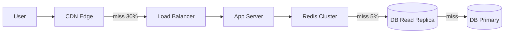
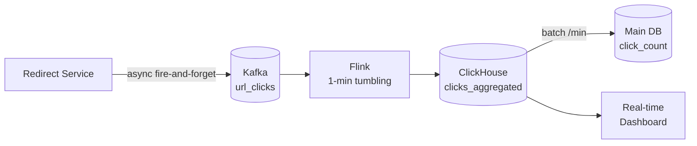
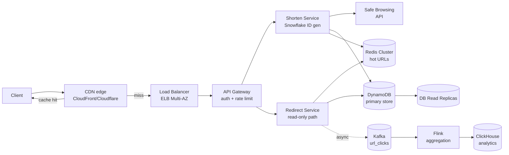

# Вопросы на собеседовании: `Design URL Shortener`

`URL Shortener` (TinyURL, bit.ly, t.co) — классический system design кейс. Компактный (укладывается в 45 минут), но покрывает множество концепций: hashing, encoding, caching, read-heavy scale, click analytics, anti-abuse, multi-region. Стандарт middle/senior interviews.

## Полезные ссылки

- [System Design Primer — url-shortening-service](https://github.com/donnemartin/system-design-primer/blob/master/solutions/system_design/pastebin/README.md)
- [TinyURL on High Scalability](http://highscalability.com/)
- [Bit.ly engineering blog](https://word.bitly.com/)
- [Twitter t.co architecture](https://blog.twitter.com/engineering/en_us/topics/infrastructure)
- [Snowflake ID generation (Twitter)](https://github.com/twitter-archive/snowflake)
- [Google Safe Browsing API](https://developers.google.com/safe-browsing)

## Содержание

**Requirements и capacity**
- [Q1. (!) Functional и non-functional requirements?](#q1--functional-и-non-functional-requirements)
- [Q2. (!) Capacity estimation — сколько storage, QPS?](#q2--capacity-estimation--сколько-storage-qps)
- [Q3. (!) API endpoints и flow?](#q3--api-endpoints-и-flow)

**Encoding и generation**
- [Q4. (!) Как генерировать short URL (Base62/hash/counter)?](#q4--как-генерировать-short-url-base62hashcounter)
- [Q5. (!) Почему Base62, а не Base64?](#q5--почему-base62-а-не-base64)
- [Q6. Как избежать collisions?](#q6-как-избежать-collisions)
- [Q19. (!) Distributed counter (Snowflake, ZooKeeper key ranges)?](#q19--distributed-counter-snowflake-zookeeper-key-ranges)

**HTTP redirect**
- [Q18. (!) HTTP 301 vs 302 vs 307 — analytics implications?](#q18--http-301-vs-302-vs-307--analytics-implications)

**Storage и sharding**
- [Q7. (!) Database schema?](#q7--database-schema)
- [Q8. SQL vs NoSQL — какой выбор?](#q8-sql-vs-nosql--какой-выбор)
- [Q11. (!) Sharding strategy?](#q11--sharding-strategy)
- [Q25. Migration / re-sharding без downtime?](#q25-migration--re-sharding-без-downtime)

**Scalability и cache**
- [Q9. (!) Как scale reads (cache, CDN)?](#q9--как-scale-reads-cache-cdn)
- [Q10. (!) Cache strategy (write-through vs cache-aside)?](#q10--cache-strategy-write-through-vs-cache-aside)
- [Q27. Hot key / viral URL handling?](#q27-hot-key--viral-url-handling)
- [Q28. Cache stampede на популярном коде?](#q28-cache-stampede-на-популярном-коде)

**Features**
- [Q12. Custom aliases?](#q12-custom-aliases)
- [Q13. TTL / expiration?](#q13-ttl--expiration)
- [Q14. (!) Analytics (click tracking pipeline)?](#q14--analytics-click-tracking-pipeline)
- [Q21. Custom domains (white-label `brand.com`)?](#q21-custom-domains-white-label-brandcom)
- [Q22. Bulk shortening API (batch + idempotency)?](#q22-bulk-shortening-api-batch--idempotency)

**Production**
- [Q15. (!) Reliability и SPOFs?](#q15--reliability-и-spofs)
- [Q16. Security (spam, phishing)?](#q16-security-spam-phishing)
- [Q17. Rate limiting?](#q17-rate-limiting)
- [Q20. (!) High-level architecture (CDN → LB → API → Redis → DB)?](#q20--high-level-architecture-cdn--lb--api--redis--db)
- [Q23. Anti-bot detection (one-time tokens, CAPTCHA escalation)?](#q23-anti-bot-detection-one-time-tokens-captcha-escalation)
- [Q24. (!) Geo-distributed (multi-region DNS, edge reads)?](#q24--geo-distributed-multi-region-dns-edge-reads)
- [Q26. (!) Monitoring metrics обязательные?](#q26--monitoring-metrics-обязательные)
- [Q29. Bot traffic vs legitimate redirects в analytics?](#q29-bot-traffic-vs-legitimate-redirects-в-analytics)
- [Q30. (!) Антипаттерны и подводные камни?](#q30--антипаттерны-и-подводные-камни)

## Q1. (!) Functional и non-functional requirements?

**Functional:**
- Shorten long URL → short code (7 char typical).
- Redirect short → long.
- Optional: custom alias (vanity URL).
- Optional: expiration (TTL).
- Optional: analytics (click counts).

**Non-functional:**
- Read-heavy (100:1 reads:writes typical).
- High availability (99.99%+).
- Low latency (< 100 ms redirect).
- Predictable (не падает на spike).
- Unpredictable URLs (can't guess next).
- No duplicate codes.
- Scalability (billions URLs).

**Explicitly not required (scope tight):**
- User accounts (MVP no auth).
- Edit/delete URLs (later).
- Multi-region consistency — eventual OK.

**Interview tip:** clarify с interviewer — scope matters greatly для design.

## Q2. (!) Capacity estimation — сколько storage, QPS?

**Assumptions (bit.ly-scale):**
- 100M new URLs/month = ~40 writes/sec.
- Read:write = 100:1 → ~4 000 reads/sec.
- Peak spike: 10× → 40 K reads/sec.

**Storage per URL:**
- `short_code`: 7 chars = 7 B.
- `long_url`: avg 100 B.
- `created_at`, `expires_at`, `user_id`: ~30 B.
- Total: ~150 B per record.

**5 years:**
- 100M × 12 × 5 = **6 billion URLs**.
- 6B × 150 B = **900 GB** raw.
- + indexes + replicas: ~3-5 TB.

**Bandwidth:**
- Read: 4 000 QPS × 100 B = 400 KB/s.
- Peak (10×): 4 MB/s.
- Write: 40 QPS × 150 B = 6 KB/s.

**Memory для cache (80/20):**
- 20% URLs дают 80% трафика → top 200M URLs hot.
- 200M × 150 B = **30 GB** Redis — feasible на крупной single instance, но для HA — Redis Cluster.

**Takeaway:** не огромная система, но требует careful caching для read latency.

## Q3. (!) API endpoints и flow?

**POST /shorten:**
```http
POST /api/v1/shorten
Content-Type: application/json
Authorization: Bearer <token>
Idempotency-Key: <uuid>

{
  "url": "https://very/long/url",
  "custom_alias": "myalias",
  "ttl_seconds": 2592000
}
```
Response:
```http
200 OK
{
  "short_url": "https://tiny.url/abc1234",
  "short_code": "abc1234",
  "expires_at": "2026-06-25T00:00:00Z"
}
```

**GET /{short_code} (redirect):**
```http
GET /abc1234
→ 302 Found
Location: https://very/long/url
Cache-Control: private, no-cache
```

**GET /api/v1/stats/{short_code}** — click analytics (auth required).

**DELETE /api/v1/links/{short_code}** — revocation (owner-only).

**Flow shorten:**
1. Validate URL syntax + Safe Browsing scan.
2. Check idempotency-key dedup.
3. Generate short code (распределённый counter / random pool).
4. Insert in DB с UNIQUE constraint.
5. Warm cache.
6. Return short URL.

**Flow redirect:**
1. Lookup CDN edge cache → hit → 302.
2. Miss → app server → Redis → hit → 302.
3. Miss → DB read replica → 302 + warm Redis.
4. Not found → 404.
5. Async — Kafka event `url_clicks` for analytics.

## Q4. (!) Как генерировать short URL (Base62/hash/counter)?

**Три основных подхода:**

**1. Hash (MD5/SHA + Base62 truncate):**
```python
hash = md5(long_url + salt)
short = base62_encode(int(hash, 16))[:7]
```
- Pros: detеrministic (same URL → same code, free dedup).
- Cons: collisions неизбежны (birthday paradox); требует retry + UNIQUE constraint.

**2. Counter + Base62:**
```python
id = autoincrement_counter
short = base62_encode(id)
```
- 1 → `"1"`, 1 000 000 000 → `"aZl8N0"`.
- Pros: collision-free; predictable.
- Cons:
  - Enumerable (`/1`, `/2` → discover all URLs — security).
  - Global counter — bottleneck (single point).
  - Решение: distributed counter (Snowflake, key ranges per host) — см. Q19.

**3. Random (62^7):**
```python
short = ''.join(random.choices(ALPHABET, k=7))
if db.exists(short): retry()
```
- 62^7 = 3.5 trillion combinations.
- Pros: unpredictable, no coordination.
- Cons: probabilistic collisions (~10M на 6B codes — handle с retry).

**Hybrid (production-pattern):**
- Pre-generate batches of random codes offline → fill pool в Redis.
- Service consumes from pool → no online collision work.
- Pool refilled background job.

**Длина:**
- 6 chars: 56B combinations — на пределе.
- 7 chars: 3.5T — safe на decade.
- 8 chars: 218T — overkill, но flexibility.

**Industry default:** counter + Base62 с distributed counter (Q19) ИЛИ offline-generated random pool.

## Q5. (!) Почему Base62, а не Base64?

**Base62 alphabet:** `[a-zA-Z0-9]` — 62 chars.

**Base64 alphabet:** Base62 + `+` и `/` (or `-`, `_` в URL-safe variant).

**Проблема Base64:**
- `+` и `/` требуют URL encoding (`%2B`, `%2F`) — уродливо.
- URL-safe Base64 (`-`, `_`) лучше, но не universally supported (legacy parsers).

**Base62 advantages:**
- URL-safe inherently.
- Double-click selects (textbox) — `-`/`_` may break selection.
- Эстетично.

**Why not Base10 (decimal)?**
- 7 chars Base62 = 3.5T, 7 chars Base10 = 10M (too few).
- Base62 в 4.1× компактнее bit-wise.

**Encoding (Python):**
```python
ALPHABET = "0123456789abcdefghijklmnopqrstuvwxyzABCDEFGHIJKLMNOPQRSTUVWXYZ"

def encode(num):
    if num == 0: return ALPHABET[0]
    result = []
    while num:
        result.append(ALPHABET[num % 62])
        num //= 62
    return ''.join(reversed(result))

def decode(s):
    return sum(ALPHABET.index(c) * 62**i for i, c in enumerate(reversed(s)))
```

## Q6. Как избежать collisions?

**В hash-based approach:** collision rate низкий, но не 0. На billion entries birthday paradox даёт несколько collisions.

**Стратегии:**

**1. Check-and-insert:**
```python
while True:
    code = generate_code()
    try:
        db.insert(code, url)  # UNIQUE constraint
        break
    except DuplicateKeyError:
        continue
```
- Race condition защищена UNIQUE constraint.

**2. Bloom filter + DB check:**
- Bloom: fast «probably seen» — false positive 1-2%, miss DB check anyway.
- Negative answer гарантирован — code новый.

**3. Pre-generated pool:**
- Background job заполняет pool unique codes.
- Online consumer берёт из pool.
- Нет collision check на критическом пути.

**4. Counter-based (no collisions):**
- Snowflake / Redis INCR / key ranges per host.

**Suffix trick:**
- При collision — append char или increment counter в коде.

**Retry limit:**
- 3-5 retries; если все fail → увеличить длину до 8 chars (extension API).

**Probability:**
- 3.5T space, 6B codes → P(collision) per new = 6B/3.5T = 0.17%.
- ~10M ожидаемых collisions на 6B → handle gracefully.

## Q7. (!) Database schema?

**Главная таблица:**
```sql
CREATE TABLE urls (
  short_code VARCHAR(10) PRIMARY KEY,
  long_url   TEXT NOT NULL,
  user_id    BIGINT,
  created_at TIMESTAMPTZ DEFAULT NOW(),
  expires_at TIMESTAMPTZ,
  click_count BIGINT DEFAULT 0,
  is_custom  BOOLEAN DEFAULT FALSE,
  scan_score REAL,
  deleted_at TIMESTAMPTZ
);

CREATE INDEX idx_user ON urls (user_id);
CREATE INDEX idx_expires ON urls (expires_at) WHERE expires_at IS NOT NULL;
```

**Clicks (отдельная высокописная таблица):**
```sql
CREATE TABLE clicks (
  id           BIGSERIAL PRIMARY KEY,
  short_code   VARCHAR(10),
  clicked_at   TIMESTAMPTZ DEFAULT NOW(),
  ip_hash      VARCHAR(64),
  country      VARCHAR(2),
  referrer     TEXT,
  ua_family    VARCHAR(50)
) PARTITION BY RANGE (clicked_at);

-- Партиция на месяц — дроп через 12 месяцев.
CREATE TABLE clicks_2026_05 PARTITION OF clicks
  FOR VALUES FROM ('2026-05-01') TO ('2026-06-01');
```

**Users (если auth):**
```sql
CREATE TABLE users (
  id    BIGSERIAL PRIMARY KEY,
  email VARCHAR(255) UNIQUE,
  tier  VARCHAR(20),
  created_at TIMESTAMPTZ
);
```

**Considerations:**
- `short_code` PRIMARY KEY → быстрый lookup.
- НЕ join clicks на каждый redirect (counter denormalized, batch update раз в минуту).
- `click_count` eventually consistent (см. Q14).

## Q8. SQL vs NoSQL — какой выбор?

**SQL (PostgreSQL / MySQL):**
- Transactions, strong consistency.
- Complex queries (analytics joins).
- ACID, battle-tested.
- Vertical scaling предел ~50K QPS.

**NoSQL (DynamoDB / Cassandra):**
- Key-value паттерн идеально fits (short_code → long_url).
- Unlimited horizontal scale.
- p99 ~10 ms на любом масштабе.
- Eventual consistency acceptable.

**Verdict:** оба работают; **key-value NoSQL preferred для scale**.
- Primary use case = lookup by key — exactly what KV stores optimize.
- DynamoDB: 10 ms p99 при любом scale.
- Redis as cache, не primary (durability issues).

**Reality:**
- bit.ly — Redis + MySQL (Redis cache, MySQL persistence).
- Twitter t.co — Manhattan (own KV store).
- Google-scale (deprecated goo.gl) — Bigtable.

**Schema в DynamoDB:**
```
Table: urls
  PK: short_code (S)
  Attrs: long_url, created_at, expires_at (TTL), user_id
  GSI: user_id-created_at-index (для «My links»)
```

**Analytics — отдельный pipeline (Kafka → Flink → ClickHouse/BigQuery)** независимо от primary store.

## Q9. (!) Как scale reads (cache, CDN)?

**Read amplification:** один URL может обслуживать миллиарды redirects. Layered cache — единственный способ.



**Layers:**

**L0 — Browser cache (через 301):** уже cached, но теряем analytics.

**L1 — CDN edge (CloudFront / Cloudflare):** edge cache redirect response, `Cache-Control: public, max-age=300, s-maxage=3600`; hit ratio 50-70% для top URLs.

**L2 — Redis cluster:** hot URLs in memory, ~1 ms lookup; hit ratio 95%+ от того, что прошло через CDN.

**L3 — DB read replicas:** rarely touched; geo-distributed replicas.

**Hit ratios cascade:**
```
40K QPS global
   ↓ CDN (hit 60%)
16K QPS app
   ↓ Redis (hit 95%)
800 QPS DB
   ↓ read replicas split
~200 QPS на replica
```

**Origin DB видит < 0.1% исходного трафика** — exactly то, что нужно при viral URL.

## Q10. (!) Cache strategy (write-through vs cache-aside)?

**Write-through:**
- On shorten: write DB + Redis atomically.
- Read always hits Redis.
- Cons: write amplification 2× на ВСЕ creates, включая URLs которые никто не кликнет (90% long tail).

**Cache-aside (lazy):**
- On read: check Redis → miss → DB → store в Redis.
- DB — single source of truth.
- Первый read after write — cache miss.
- Default choice для read-heavy KV.

**Write-behind (async DB write):**
- НЕ применимо для URL shortener: после shorten user уже отправил ссылку другу; Redis crash до flush → 404 на user-visible action.

**Recommended:** cache-aside с LFU eviction + 24h TTL.

**Eviction policy:**
- `allkeys-lfu` (Redis 4.0+) — лучше LRU для frequency-based (viral URLs кликают долго, LRU выбросит после burst новых).
- 30 GB Redis Cluster для top 200M URLs (80/20 rule).

**TTL:**
- 24h типично; URLs immutable после creation, длинный TTL OK.
- Negative caching (404) — 60 sec, защита от scanning attacks.

**Thundering herd на cache expiry:** см. Q28.

## Q11. (!) Sharding strategy?

**Стратегии:**

| Подход | Pros | Cons |
|---|---|---|
| Hash `mod N` short_code | Even distribution | Resharding = 100% migration |
| Range по prefix | Простой для debug | Hot shards (новые codes концентрируются) |
| Consistent hashing + vnodes | Add/remove shard = 1/N migration | Чуть сложнее implementation |
| By user_id | «My links» fast | Hot user = hot shard; redirect by code requires scatter-gather |

**Production-pattern:** **consistent hashing по short_code** + virtual nodes + shard-prefix encoding.

**Shard-prefix encoding:**
```python
shard_id = host_local_counter % NUM_SHARDS
suffix = base62(snowflake_id)
short_code = base62(shard_id) + suffix   # "aB7xK2p"

# Lookup
shard = decode_prefix(short_code[0])
long_url = shards[shard].get(short_code)
```
Каждый shard генерирует свои коды независимо → нет distributed counter contention.

**DynamoDB:** автоматический partitioning по `hash(short_code)`, auto-split при > 1 000 WCU per partition.

**Cassandra:** `PARTITION KEY = short_code` + `num_tokens: 256`.

**Hot partition при viral URL:**
- Митигация через **write sharding** (suffix к key: `viral_url#0`, `viral_url#1`, ..., aggregation на read) — см. Q27.
- ИЛИ CDN edge cache (Q9).

**Cross-shard query** (например «top URLs by clicks»):
- Scatter-gather дорого; используем отдельный analytics store (ClickHouse).

## Q12. Custom aliases?

User requests `/myalias` instead of `/abc1234`.

**Реализация:**
```sql
INSERT INTO urls (short_code, long_url, user_id, is_custom)
VALUES ('promo2026', $1, $2, TRUE)
ON CONFLICT (short_code) DO NOTHING
RETURNING short_code;
-- 0 rows → 409 Conflict
```

**UNIQUE constraint** на `short_code` даёт atomic check-and-insert — две параллельные транзакции не могут оба claim `promo2026`. DB engine гарантирует атомарность; distributed lock (Redis SETNX) — over-engineering.

**Reserved namespace:** заранее INSERT системных alias (`admin`, `api`, `login`, `support`, `terms`) при bootstrap; user не может claim.

**Case sensitivity:** normalize на write (lowercase) ИЛИ `UNIQUE INDEX ON LOWER(short_code)`.

**Length constraints:** 3-30 chars (CHECK constraint).

**Abuse / trademarks:**
- Blocklist trademarks (`apple`, `google`, `tesla`).
- Premium namespaces (paid only).

**Pricing:** often paid feature (vanity URL = premium tier).

## Q13. TTL / expiration?

**Logical expiration** (на read):
```sql
SELECT long_url FROM urls
WHERE short_code = $1
  AND (expires_at IS NULL OR expires_at > NOW())
  AND deleted_at IS NULL;
-- 0 rows → 410 Gone
```

**Physical cleanup** — два варианта:

**1. DynamoDB TTL attribute:**
```yaml
Table: urls
  TimeToLiveSpecification:
    AttributeName: expires_at
    Enabled: true
# AWS auto-deletes within 48h of expiration, free
```

**2. Background sweep (SQL):**
```sql
DELETE FROM urls
WHERE deleted_at < NOW() - INTERVAL '30 days'
  AND short_code IN (
    SELECT short_code FROM urls
    WHERE deleted_at IS NOT NULL
    ORDER BY deleted_at ASC LIMIT 10000
  );
```
Cron в low-traffic window, batch 10K rows.

**Grace window:** между logical expiration и physical delete — 7-30 дней для accidental expiration recovery или legal hold.

**Redis TTL:** auto-expire в cache (`SETEX 86400`), но Redis ≠ source of truth — DB всегда checked при cache miss.

**Edge case:** DynamoDB TTL — eventual (до 48 часов задержки); для time-critical revocation нужна дополнительная app-level проверка через `deleted_at` flag.

## Q14. (!) Analytics (click tracking pipeline)?

**Цель:** 40K+ redirects/sec без impact на p99 redirect latency.

**Pipeline:**



**Redirect path остаётся read-only:**
- После `302 Found` app асинхронно публикует event в Kafka (fire-and-forget с local disk buffer для durability при Kafka outage).
- НЕ синхронный `UPDATE click_count` — это убивает latency (row lock + WAL fsync).

**Event format:**
```json
{
  "short_code": "abc1234",
  "ts": 1715616000000,
  "ip_hash": "sha256(...)",
  "country": "RU",
  "referrer": "facebook.com",
  "ua_family": "Chrome"
}
```

**Kafka topic** partitioned by `short_code` → 100 partitions.

**Flink** делает 1-min tumbling window, агрегирует counts + geo + UA breakdown, пишет в ClickHouse.

**ClickHouse** — columnar, оптимизирован для time-series aggregation; queries «clicks by day/country/referrer» в миллисекундах.

**Main DB `click_count`** обновляется batch раз в минуту (single UPDATE с aggregated delta вместо +1 на event) — write QPS на main DB снижается в 1 000+ раз.

**Privacy:**
- IP hashing on ingest (SHA-256 truncate).
- Retention policy: raw clicks 30 дней, aggregates вечно.
- GDPR right-to-erasure → delete user's hashes.

**Edge cases:**
- At-least-once Kafka → duplicate clicks; dedup по `(short_code, ip_hash, ts_minute)`.
- Backpressure при Kafka outage — local disk buffer 5-10 мин, alarm metric.

## Q15. (!) Reliability и SPOFs?

**99.99% SLA** = max 52 минуты downtime/year. Single-component failure не должен вызывать user-visible outage.

**SPOFs to eliminate:**

| Layer | Mitigation |
|---|---|
| Load balancer | Multiple LBs (ELB Multi-AZ, DNS round-robin) |
| App servers | Horizontal scale + auto-scaling group (stateless) |
| Cache | Redis Cluster + Sentinel / replicas |
| DB | Primary + replicas + Multi-AZ automatic failover |
| Counter (code generation) | Snowflake distributed IDs OR key ranges per host |
| CDN | Multi-vendor (CloudFront + Cloudflare) optional |

**Circuit breakers (Resilience4j):**
```java
@CircuitBreaker(name = "redis", fallbackMethod = "getFromDb")
String resolve(String shortCode) { return redis.get(shortCode); }

@CircuitBreaker(name = "db", fallbackMethod = "getFromLocalCache")
String getFromDb(String shortCode, Throwable t) { return db.lookup(shortCode); }

String getFromLocalCache(String shortCode, Throwable t) {
    return caffeineCache.getIfPresent(shortCode);  // last-resort
}
```

**Graceful degradation:**
- Redis down → fallback DB direct (slower).
- DB down → serve from cache only (reads); reject writes.
- Cache + DB down → serve stale из in-proc Caffeine + 503 для cold misses.

**Bulkhead isolation:** отдельные thread pools для DB и Redis — DB outage не exhaust app threads.

**Multi-region (active-active)** обязательно для real four-nines: DB recovery time часто > 5 минут, что съедает 99.99% budget.

**Chaos engineering:** Chaos Monkey, AWS Fault Injection Simulator — регулярно тестировать failover; не тестированные failover работают только 40% времени (Netflix data).

## Q16. Security (spam, phishing)?

**Опасность:** shortener скрывает destination → phishing через trusted domain (bit.ly/...).

**Defence in depth:**

**1. Create-time URL scan:**
- Google Safe Browsing API (50ms latency) — known phishing/malware.
- PhishTank — community-driven.
- Own ML classifier — score 0-1 по features (домен age, redirect chain, SSL, content).
- Static blocklist (banking impersonations, scam patterns).

**2. Rate limiting** per IP/account (см. Q17):
- 10 URLs/hour anon, 1 000/hour authenticated.
- Отсекает mass-creation атак.

**3. Display-time interstitial:**
- «Вы переходите на example.com, продолжить?» для suspicious patterns (новый домен, IDN homograph, mismatch shortener brand).

**4. Continuous re-scan:**
- Target URL может стать malicious позже (compromised site).
- Periodic background re-scan с automated revocation при threshold reports/scan score.

**5. User reporting:**
- 1-click report button → flagged for human review.
- Automated revocation при > N reports.

**6. Legal/compliance:**
- Clear ToS, DMCA flow, transparency reports.
- Log scan decisions для DMCA defence.

**Anti-pattern:** полагаться только на Google Safe Browsing — GSB обновляется с задержкой часы-дни для new phishing.

## Q17. Rate limiting?

**Защита от:** abuse, DoS, cost control.

**Layers:**
- **Per-IP**: 100 redirects/min.
- **Per-user**: 10 shortens/hour anonymous, 1 000/hour authenticated.
- **Per-API-key**: tier-based (Stripe-style — free / paid).

**Algorithm:** token bucket в Redis с Lua script (atomic). Подробности — в [Design Rate Limiter](design-rate-limiter-interview.md).

**Headers (RFC 6585):**
```
X-RateLimit-Limit: 1000
X-RateLimit-Remaining: 987
X-RateLimit-Reset: 1640003600
Retry-After: 13
```
**HTTP 429 Too Many Requests** при превышении.

**Anti-pattern:** in-memory counter per app server — не distributed; user может делать N × limit (по limit на каждый instance).

**DDoS:** CDN (CloudFront) + WAF handle L7 attacks; rate limiter — application layer.

## Q18. (!) HTTP 301 vs 302 vs 307 — analytics implications?

**301 Moved Permanently:**
- Browser caches forever (или по `Cache-Control`).
- Subsequent clicks НЕ доходят до сервера — analytics ломается.
- Bit.ly использует 301 с `Cache-Control: private, max-age=90` для компромисса.

**302 Found (temporary):**
- НЕ кешируется по умолчанию.
- Каждый click hits server — analytics работает.
- Стандарт для shortener (TinyURL, Bit.ly free tier).

**307 Temporary Redirect:**
- Как 302, но method preservation (POST остаётся POST).
- Для shortener малорелевантно (только GET-redirects).

**308 Permanent Redirect:**
- Как 301, но method preservation.
- Не используется в shorteners.

| Code | Cached | Analytics | Method preserved | Use case |
|---|---|---|---|---|
| 301 | да | сломан | нет (POST→GET) | static migration |
| 302 | нет | работает | нет | **shortener default** |
| 307 | нет | работает | да | API redirects |
| 308 | да | сломан | да | API permanent |

**Trade-off:**
- 301 → better performance, теряем analytics + сложная revocation (browser cache stale).
- 302 → каждый click — server hit; nessure analytics + revocation works.

**Revocation problem с 301:**
- Phishing URL заблокирован → у миллионов пользователей в browser cache остался 301 на месяцы.
- 302 — invalidation works мгновенно.

**Production-выбор:** **302** для shorteners. Single `Cache-Control: public, max-age=300, s-maxage=3600` (короткий browser TTL для revocation, длинный CDN TTL для offload).

## Q19. (!) Distributed counter (Snowflake, ZooKeeper key ranges)?

**Проблема:** глобальный auto-increment counter → single point of contention. При 40+ writes/sec один counter limits throughput; single counter service = SPOF.

**Решения:**

**1. Snowflake (Twitter):**
```
64-bit ID:
  [1 bit sign] [41 bits timestamp ms] [10 bits machine_id] [12 bits sequence]
```
- 41 bits timestamp = 69 лет с custom epoch.
- 10 bits machine_id = 1 024 workers.
- 12 bits sequence = 4 096 IDs/ms per worker.
- Total: ~4M IDs/sec global, monotonically increasing.
- Pros: no coordination after machine_id assigned.
- Cons: clock drift sensitivity (требует NTP); machine_id allocation needs coordination (ZooKeeper).

**2. ZooKeeper key ranges:**
- Каждый host claims range (e.g., 1M IDs).
- Использует local counter в range; при истощении — запрашивает new range.
- Pros: no hot key on Redis/ZK после claim.
- Cons: range gaps (host crashed с unused IDs); coordination для range allocation.

**3. Redis INCR + key ranges (hybrid):**
- Host A claims `INCR counter_range` → получает 1, использует IDs 1-1M.
- Host B claims → 2, использует 1M-2M.
- Local sequential within range, distributed across hosts.

**4. UUID v7 (time-ordered):**
- 128-bit, time-prefixed → sortable.
- Cons: 22+ chars Base62 — too long для shortener.

**Production stack:**
- Twitter: Snowflake.
- Discord: Snowflake-like.
- Stripe: own ID generator с region prefix.

**Anti-pattern:** глобальный INCR в Redis без key ranges → bottleneck при peak load; latency на shorten растёт; SPOF на Redis.

## Q20. (!) High-level architecture (CDN → LB → API → Redis → DB)?



**Service boundaries:**
- **CDN edge** — cache redirects близко к user (latency 5-20 ms).
- **LB** — distribute traffic; multi-AZ.
- **API Gateway** — auth (JWT), rate limit, routing.
- **Shorten Service** — generation + Safe Browsing scan + DB insert.
- **Redirect Service** — read-only; pure lookup + async analytics emit.
- **Redis Cluster** — hot URLs (30 GB top 200M).
- **DB (DynamoDB)** — primary store, 10ms p99.
- **Read replicas** — для analytics queries «My links».
- **Kafka + Flink + ClickHouse** — async analytics pipeline.

**Inter-service:**
- Sync: gRPC + mTLS внутри cluster.
- Async: Kafka events.

**Multi-region:** active-active с regional Redis + DB replication (DynamoDB Global Tables).

## Q21. Custom domains (white-label `brand.com`)?

**Use case:** customer хочет `customer.brand.com/abc` вместо `bit.ly/abc`.

**Architecture:**
1. Customer создаёт CNAME `customer.brand.com → cnames.shortener.com`.
2. Customer provides SSL cert (или shortener manages через Let's Encrypt SNI).
3. Backend ингресс читает `Host` header → lookup customer config → определяет `domain_id`.
4. Lookup `short_code` в context `domain_id`:
   ```sql
   SELECT long_url FROM urls
   WHERE domain_id = $1 AND short_code = $2
   ```

**Schema extension:**
```sql
ALTER TABLE urls ADD COLUMN domain_id INTEGER REFERENCES domains(id);
CREATE TABLE domains (
  id BIGSERIAL PRIMARY KEY,
  hostname VARCHAR(255) UNIQUE,
  user_id BIGINT,
  ssl_cert_arn VARCHAR(500),
  verified_at TIMESTAMPTZ
);
-- Composite key: уникальность по (domain_id, short_code)
CREATE UNIQUE INDEX idx_domain_code ON urls (domain_id, short_code);
```

**SSL:**
- **Option 1:** Customer upload PEM cert + private key.
- **Option 2:** Shortener provisions cert via ACME (Let's Encrypt) при verification.
- **Option 3:** AWS Certificate Manager + CloudFront SNI.

**Verification:**
- Customer adds TXT record `_shortener-verify.brand.com = <token>`.
- Backend checks DNS до accepting domain.

**Multi-tenant DNS routing:**
- Single ingress (Cloudflare / nginx) с SNI matching → routes по hostname.
- Wildcard cert для `*.cnames.shortener.com` + customer-specific cert mounted dynamically.

**Pricing:** обычно premium tier (Bit.ly Brand, Rebrandly).

**Edge cases:**
- Customer dropped DNS → graceful 503 / redirect to status page.
- Cert renewal — auto через Let's Encrypt 30 дней до expiry.

## Q22. Bulk shortening API (batch + idempotency)?

**Use case:** marketing campaign creates 10K URLs одной операцией.

**Endpoint:**
```http
POST /api/v1/shorten/bulk
Authorization: Bearer <token>
Idempotency-Key: <batch-uuid>

{
  "urls": [
    { "url": "https://example.com/p1", "custom_alias": null, "client_ref": "campaign-1-link-1" },
    { "url": "https://example.com/p2", "client_ref": "campaign-1-link-2" },
    ...
  ]
}
```
Response:
```json
{
  "batch_id": "bat_abc123",
  "results": [
    { "client_ref": "campaign-1-link-1", "short_code": "aB7xK2p", "short_url": "..." },
    { "client_ref": "campaign-1-link-2", "short_code": "Bc8yL3q", "short_url": "..." }
  ]
}
```

**Реализация:**
- Limit batch size (e.g., max 10K URLs per call).
- Process в parallel (concurrent inserts).
- **Idempotency на двух уровнях:**
  - Batch-level: `Idempotency-Key` header → если retry, return cached batch_result.
  - Item-level: `client_ref` provided by client → если retry batch, обновляем mapping `client_ref → short_code` без duplicates.

**Async / job pattern (для очень больших batches > 100K):**
```http
POST /api/v1/shorten/batch
→ 202 Accepted
{ "batch_id": "bat_abc123", "status_url": "/api/v1/batches/bat_abc123" }
```
Client polls status URL.

**Rate limiting:** batch counts proportional к size (10K URLs = 10K tokens).

**Anti-pattern:** synchronous batch без timeout — 10K Safe Browsing API calls могут не уложиться в HTTP timeout 30s; нужен async job pattern.

## Q23. Anti-bot detection (one-time tokens, CAPTCHA escalation)?

**Use case:** атакующий пытается mass-create URLs (spam, phishing) через автоматизацию.

**Defence layers:**

**1. CAPTCHA for anonymous high-volume:**
- Anonymous user > 5 shortens/hour → CAPTCHA (hCaptcha, reCAPTCHA, Cloudflare Turnstile).
- Authenticated users — без CAPTCHA (auth уже provides bot resistance).

**2. Device fingerprinting:**
- Browser canvas, fonts, timezone, screen → unique fingerprint.
- Suspicious patterns (curl UA, missing browser headers) → CAPTCHA escalation.

**3. Behavioral signals:**
- Time-to-submit < 1 sec → likely bot.
- Mouse movement pattern (browsers have it, headless not).

**4. One-time CSRF tokens:**
- Browser получает token на page load.
- Submit без token — reject.
- Bots без full browser context fail.

**5. IP-based throttling:**
- Same IP > 10 shortens/hour → CAPTCHA.
- Cloudflare automatically blocks известные bot networks.

**6. Honeypot fields:**
- Hidden form field `email_url` (CSS hidden) — humans не fill, bots do.
- Submit с filled honeypot → silent drop.

**7. Account graph analysis:**
- Many new accounts из one IP/payment → flag.
- Linked accounts через shared device fingerprint.

**Escalation flow:**
```
normal traffic → allow
suspicious (rate > threshold) → CAPTCHA challenge
failed CAPTCHA 3× → temp block 1h
repeat offender → permanent block + log
```

**Anti-pattern:** CAPTCHA для всех users — ломает API use case (партнёрские integrations) и UX. Только для suspicious.

## Q24. (!) Geo-distributed (multi-region DNS, edge reads)?

**Цель:** redirect latency < 50 ms из любой geo + DR.

**Architecture:**

**Multi-region active-active:**
- 3-5 regions: US-East, US-West, EU-West, APAC-Singapore, APAC-Tokyo.
- Каждый region — full stack (Redirect Service + Redis + DB replica).
- DynamoDB Global Tables — cross-region async replication.

**DNS routing:**
- AWS Route 53 latency-based routing → user идёт в ближайший region.
- Health checks → automatic failover при regional outage (TTL 60 sec).

**Edge cache (CDN):**
- CloudFront / Cloudflare 200+ POPs.
- Cached redirect response 5-20 ms close to user.
- Origin shielding: edge → regional shield → origin (доп. cache layer).

**Reads at edge:**
- Cloudflare Workers + KV — execute redirect logic на edge без origin call.
- DynamoDB Global Tables — read replica в каждом region.

**Writes:**
- Customer pinned к home region (geo-IP or registered country).
- Cross-region replication async (eventual consistency).
- При новом URL — visible в other regions через 1-5 sec.

**Failover:**
- Reads — automatic (DNS).
- Writes — controlled (per-region primary); при primary loss promote replica.

**Data residency:**
- EU customers' data — only EU region (GDPR).
- RU data — RU territory (PD-152).

**Edge cases:**
- Cross-region write для viral URL — replicate через MirrorMaker.
- Split-brain risk при network partition — accept eventual consistency.

## Q25. Migration / re-sharding без downtime?

**Сценарий:** shards переполнены; нужно добавить новые shards без сервис-downtime.

**Steps (online resharding):**

**1. Dual-write phase:**
- Application пишет в old и new shards parallel.
- Reads из old (source of truth).
- Backfill background job копирует existing data в new shards.

**2. Verification:**
- Compare row count old vs new.
- Sample-check random keys.

**3. Read switch:**
- Flip flag → reads из new shards.
- Continue dual-write на случай rollback.

**4. Cleanup:**
- После N дней stability → stop writes в old shards.
- Delete old shards.

**Tools:**
- **Vitess** (YouTube/Slack): online resharding для MySQL.
- **DynamoDB:** автоматический partition split при > 1 000 WCU — no manual resharding.
- **Cassandra:** add nodes, run `nodetool repair` + `cleanup`.

**Consistent hashing** минимизирует migration (только 1/N keys двигаются при +1 shard).

**Anti-patterns:**
- Modulo hashing (`hash % N`) — изменение N = 100% data move.
- Stop-the-world migration — недопустимо для 99.99% SLA.

**Edge case:** in-flight transactions during switch — drain connections, use timeout-based completion.

## Q26. (!) Monitoring metrics обязательные?

**Core metrics:**

| Metric | Type | Alert threshold |
|---|---|---|
| `urls_created_total{user_tier}` | counter | growth anomaly |
| `redirect_latency_seconds` | histogram | p99 > 50 ms |
| `cache_hit_ratio{layer}` | gauge | Redis < 90%, CDN < 50% |
| `db_read_qps` | counter | unusual spike = cache outage |
| `db_write_qps` | counter | abuse if growing |
| `safe_browsing_blocks_total` | counter | malicious URL rate |
| `rate_limit_429_total{endpoint}` | counter | per-user abuse |
| `analytics_pipeline_lag_seconds` | gauge | > 5 min = pipeline degraded |
| `circuit_breaker_state{service}` | gauge | open = degraded |
| `top_short_codes` (LFU) | gauge | hot key detection |

**Tracing:**
- OpenTelemetry; trace ID через все sync calls + Kafka headers.
- Visibility: `redirect 8 ms = CDN miss + Redis hit 5 ms + 302 response 3 ms`.

**Logging:**
- Structured JSON; correlation_id, short_code, user_id (где есть).
- Mask PII (user emails в logs только hash).
- 90-day online retention.

**Alerting:**
- Page on-call: `redirect_latency_p99 > 100 ms` 5 минут подряд.
- Slack: `safe_browsing_blocks_total` spike (DDoS-like creation).
- Email: `analytics_lag` > 1 час.

**Dashboards:**
- Per-region health (latency, errors).
- Top denied keys (potential abuse).
- Business: creation rate, redirect rate, retention.

## Q27. Hot key / viral URL handling?

**Проблема:** один viral URL получает 100K+ redirects/sec → один Redis shard / DB partition перегружен.

**Mitigation:**

**1. CDN edge cache** (Q9) — миллионы reads без origin hit.

**2. Per-pod L1 in-process cache (Caffeine):**
- Top-100 URLs in-memory; nanosecond access.
- TTL 30 sec; periodic refresh.

**3. Probabilistic admission:**
- На каждый N-й request делаем real lookup; остальные из L1.

**4. Write sharding для hot key:**
- Не применимо для read-side (один short_code = один key).
- Применимо если viral URL имеет mutable state (counter): `viral_url#0..15`, aggregate on read.

**5. Auto-detection:**
- `top_codes` LFU tracker → hot URLs replicated на N Redis shards.
- Client randomly picks shard for read.

**6. Cloudflare Workers cache:**
- Viral URLs cached на edge worker для 1 час; origin видит только misses.

**7. Stale-while-revalidate:**
- Cache TTL 5 минут, но serve stale до 1 часа при cache miss + async refresh.

**Real:** Bit.ly Twitter t.co для viral tweets — multi-tier edge caching доминирует.

## Q28. Cache stampede на популярном коде?

**Проблема:** популярный short_code expires в Redis → миллион concurrent requests миссируют → 1M concurrent DB lookups → DB overload.

**Решения:**

**1. Probabilistic early refresh (XFetch):**
```python
delta = -log(random()) * beta * compute_time
if ttl - delta < 0:
    refresh_cache_async()
return cached_value
```
Кто-то рефрешит проactively before expiry.

**2. Single-flight / mutex:**
```python
def get_url(short_code):
    val = redis.get(short_code)
    if val: return val
    if redis.set(f"lock:{short_code}", 1, nx=True, ex=10):  # acquire lock
        try:
            val = db.lookup(short_code)
            redis.setex(short_code, 86400, val)
            return val
        finally:
            redis.delete(f"lock:{short_code}")
    else:
        time.sleep(0.05)  # other request fetching
        return redis.get(short_code)
```
Один process refresh-ит, остальные ждут.

**3. Stale-while-revalidate:**
- Cache TTL 24h, но serve stale до 25h при miss + async refresh.
- User не видит latency spike.

**4. Negative cache:**
- 404 cached 60 sec для предотвращения scanning attack-amplified DB load.

**5. Pre-emptive warming:**
- Top-1000 URLs cached на app start через replay log.

**Anti-pattern:** `if cache_miss: db_lookup()` без protection → thundering herd при viral key expiry.

## Q29. Bot traffic vs legitimate redirects в analytics?

**Проблема:** до 50% redirects могут быть bots (link preview crawlers, scanners, scrapers); реальная analytics для clients требует фильтрации.

**Bot signals:**

**1. User-Agent patterns:**
- `Twitterbot`, `facebookexternalhit`, `LinkedInBot`, `Slackbot-LinkExpanding` — link previews.
- Headless browser fingerprints.
- Curl / wget без referrer.

**2. Behavioral:**
- Multiple redirects из one IP < 1 sec apart.
- No subsequent page load на destination (no JS execution).
- Geographic anomalies (datacenter IPs vs residential).

**3. JA3/JA4 TLS fingerprint:**
- Bot frameworks имеют specific TLS handshake patterns.
- Cloudflare publishes known bot signatures.

**Classification на ingest:**
```json
{
  "short_code": "abc",
  "ts": 1715616000000,
  "bot_score": 0.85,
  "bot_type": "link_preview_crawler",
  "ip_class": "datacenter"
}
```

**Two analytics views:**
- **Raw clicks** — all hits (cost monitoring, security analysis).
- **Human clicks** — filtered, что показываем customers (true engagement).

**Privacy:**
- Bot IPs не PII; can store full.
- Human IPs — hashed/truncated.

**Edge case:** link previewers (Twitter Card crawler) полезны (показ preview раскручивает CTR), но не считаются human clicks; нужно include в counts с пометкой.

## Q30. (!) Антипаттерны и подводные камни?

**1. UUID как short_code.**
- 32-36 chars → не «short».
- Используй Base62 7-8 chars.

**2. Глобальный auto-increment counter без sharding.**
- SPOF + bottleneck.
- Используй Snowflake / key ranges (Q19).

**3. Synchronous click counter UPDATE.**
- Row lock на hot URL → redirect latency 200+ ms.
- Async Kafka pipeline (Q14).

**4. 301 без consideration analytics impact.**
- Browser caches → analytics ломается; revocation невозможен.
- 302 default для shorteners (Q18).

**5. Hash-based codes без UNIQUE constraint.**
- Birthday paradox → silent overwrites на billion scale.
- Always UNIQUE constraint + retry (Q6).

**6. Sharding по user_id.**
- Optimal для «My links», но redirect by short_code requires scatter-gather (Q11).
- Sharding по short_code = primary access pattern.

**7. Cache write-through на ALL inserts.**
- 90% URLs (long tail) никогда не читаются → wasted Redis memory.
- Cache-aside (Q10).

**8. LRU eviction для cache.**
- Viral URLs популярны месяцами; LRU выбрасывает при burst of new shortens.
- LFU `allkeys-lfu` (Q10).

**9. Modulo hashing для sharding.**
- Add shard → 100% data migration.
- Consistent hashing + vnodes (Q11, Q25).

**10. Single Redis instance.**
- SPOF + 100 K QPS ceiling.
- Redis Cluster + replicas.

**11. CAPTCHA на каждый shorten.**
- Ломает API/programmatic use case.
- Только на suspicious (Q23).

**12. Synchronous Safe Browsing call в shorten path без timeout.**
- 200-500 ms API call blocks user-facing latency.
- Cache known clean domains 1 час; async re-scan.

**13. Hard DELETE при expiration без grace window.**
- Accidental expiry = permanent loss; нет audit trail.
- Soft delete + 30-day grace (Q13).

**14. Не нормализованный URL.**
- `https://example.com/a` и `https://example.com/a/` создают разные codes → дубликаты.
- Normalize (lowercase host, strip trailing slash, canonical query order) — даёт free dedup для hash-based codes.

**15. Полагаться только на Redis durability.**
- AOF теряет 1 сек данных при crash; RDB — минуты.
- Redis как cache, не primary; durable store (DynamoDB/Postgres) — source of truth (Q8, Q15).

---

## See also

- [Design Rate Limiter](design-rate-limiter-interview.md) — token bucket, distributed Redis Lua, 429 + Retry-After
- [Design Payment System](design-payment-system-interview.md) — idempotency keys + outbox + saga
- [Design Feed System](design-feed-system-interview.md) — read-heavy at scale, hot keys
- [System Design Interview](system-design-interview.md) — общая методология
- [Caching Strategies](../architecture/caching-strategies-interview.md) — Redis, CDN, multi-tier
- [Database Sharding](../databases/database-sharding-interview.md) — consistent hashing, vnodes
- [Database Replication](../databases/database-replication-interview.md) — multi-region async replication
- [Distributed Systems](../architecture/distributed-systems-interview.md) — eventual consistency, CAP
- [Redis](../databases/redis-interview.md) — cluster, eviction, AOF/RDB
- [Resilience Patterns](../architecture/resilience-patterns-interview.md) — circuit breaker, graceful degradation
- [API Security](../security/api-security-interview.md) — Safe Browsing, rate limiting, CAPTCHA
- [Load Balancing](../architecture/load-balancing-interview.md) — ELB Multi-AZ, DNS routing
- [Kafka](../messaging/kafka-interview.md) — async analytics pipeline
