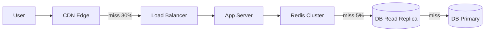
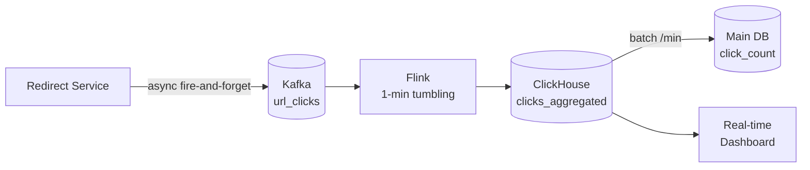
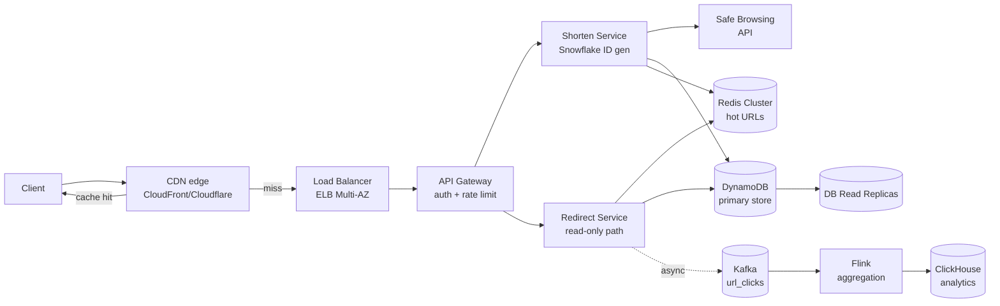

# Вопросы на собеседовании: `Design URL Shortener`

`URL Shortener` (TinyURL, bit.ly, t.co) — классический system design кейс. Компактный (укладывается в 45 минут), но покрывает множество концепций: hashing, encoding, caching, read-heavy scale, click analytics, anti-abuse, multi-region. Стандарт middle/senior interviews.

## Полезные ссылки

- [System Design Primer — url-shortening-service](https://github.com/donnemartin/system-design-primer/blob/master/solutions/system_design/pastebin/README.md)
- [TinyURL on High Scalability](http://highscalability.com/)
- [Bit.ly engineering blog](https://word.bitly.com/)
- [Twitter t.co architecture](https://blog.twitter.com/engineering/en_us/topics/infrastructure)
- [Snowflake ID generation (Twitter)](https://github.com/twitter-archive/snowflake)
- [Google Safe Browsing API](https://developers.google.com/safe-browsing)

## Содержание

**Requirements и capacity**
- [Q1. (!) Functional и non-functional requirements?](#q1--functional-и-non-functional-requirements)
- [Q2. (!) Capacity estimation — сколько storage, QPS?](#q2--capacity-estimation--сколько-storage-qps)
- [Q3. (!) API endpoints и flow?](#q3--api-endpoints-и-flow)

**Encoding и generation**
- [Q4. (!) Как генерировать short URL (Base62/hash/counter)?](#q4--как-генерировать-short-url-base62hashcounter)
- [Q5. (!) Почему Base62, а не Base64?](#q5--почему-base62-а-не-base64)
- [Q6. Как избежать collisions?](#q6-как-избежать-collisions)
- [Q19. (!) Distributed counter (Snowflake, ZooKeeper key ranges)?](#q19--distributed-counter-snowflake-zookeeper-key-ranges)

**HTTP redirect**
- [Q18. (!) HTTP 301 vs 302 vs 307 — analytics implications?](#q18--http-301-vs-302-vs-307--analytics-implications)

**Storage и sharding**
- [Q7. (!) Database schema?](#q7--database-schema)
- [Q8. SQL vs NoSQL — какой выбор?](#q8-sql-vs-nosql--какой-выбор)
- [Q11. (!) Sharding strategy?](#q11--sharding-strategy)
- [Q25. Migration / re-sharding без downtime?](#q25-migration--re-sharding-без-downtime)

**Scalability и cache**
- [Q9. (!) Как scale reads (cache, CDN)?](#q9--как-scale-reads-cache-cdn)
- [Q10. (!) Cache strategy (write-through vs cache-aside)?](#q10--cache-strategy-write-through-vs-cache-aside)
- [Q27. Hot key / viral URL handling?](#q27-hot-key--viral-url-handling)
- [Q28. Cache stampede на популярном коде?](#q28-cache-stampede-на-популярном-коде)

**Features**
- [Q12. Custom aliases?](#q12-custom-aliases)
- [Q13. TTL / expiration?](#q13-ttl--expiration)
- [Q14. (!) Analytics (click tracking pipeline)?](#q14--analytics-click-tracking-pipeline)
- [Q21. Custom domains (white-label `brand.com`)?](#q21-custom-domains-white-label-brandcom)
- [Q22. Bulk shortening API (batch + idempotency)?](#q22-bulk-shortening-api-batch--idempotency)

**Production**
- [Q15. (!) Reliability и SPOFs?](#q15--reliability-и-spofs)
- [Q16. Security (spam, phishing)?](#q16-security-spam-phishing)
- [Q17. Rate limiting?](#q17-rate-limiting)
- [Q20. (!) High-level architecture (CDN → LB → API → Redis → DB)?](#q20--high-level-architecture-cdn--lb--api--redis--db)
- [Q23. Anti-bot detection (one-time tokens, CAPTCHA escalation)?](#q23-anti-bot-detection-one-time-tokens-captcha-escalation)
- [Q24. (!) Geo-distributed (multi-region DNS, edge reads)?](#q24--geo-distributed-multi-region-dns-edge-reads)
- [Q26. (!) Monitoring metrics обязательные?](#q26--monitoring-metrics-обязательные)
- [Q29. Bot traffic vs legitimate redirects в analytics?](#q29-bot-traffic-vs-legitimate-redirects-в-analytics)
- [Q30. (!) Антипаттерны и подводные камни?](#q30--антипаттерны-и-подводные-камни)

## Q1. (!) Functional и non-functional requirements?

**Функциональные:**
- Сократить длинный URL → short code (обычно 7 символов).
- Редирект short → long.
- Опционально: custom alias (vanity URL).
- Опционально: expiration (TTL).
- Опционально: аналитика (счётчики кликов).

**Нефункциональные:**
- Read-heavy (типично 100:1 reads:writes).
- Высокая доступность (99.99%+).
- Низкая latency (< 100 ms на редирект).
- Предсказуемость (не падает на spike).
- Непредсказуемые URL (нельзя угадать следующий).
- Без дублирующихся кодов.
- Масштабируемость (миллиарды URL).

**Явно не требуется (scope узкий):**
- Аккаунты пользователей (в MVP без auth).
- Редактирование/удаление URL (позже).
- Кросс-региональная согласованность — eventual допустима.

**Совет на собеседовании:** уточняйте scope у интервьюера — он сильно влияет на дизайн.

## Q2. (!) Capacity estimation — сколько storage, QPS?

**Допущения (масштаб bit.ly):**
- 100M новых URL/месяц = ~40 writes/sec.
- Read:write = 100:1 → ~4 000 reads/sec.
- Пиковый spike: 10× → 40 K reads/sec.

**Storage на один URL:**
- `short_code`: 7 символов = 7 B.
- `long_url`: в среднем 100 B.
- `created_at`, `expires_at`, `user_id`: ~30 B.
- Итого: ~150 B на запись.

**За 5 лет:**
- 100M × 12 × 5 = **6 миллиардов URL**.
- 6B × 150 B = **900 GB** raw.
- + индексы + реплики: ~3-5 TB.

**Bandwidth:**
- Чтение: 4 000 QPS × 100 B = 400 KB/s.
- Пик (10×): 4 MB/s.
- Запись: 40 QPS × 150 B = 6 KB/s.

**Память под cache (80/20):**
- 20% URL дают 80% трафика → top 200M URL — горячие.
- 200M × 150 B = **30 GB** Redis — реально на крупном single instance, но для HA — Redis Cluster.

**Вывод:** система не гигантская, но требует аккуратного кеширования ради read latency.

## Q3. (!) API endpoints и flow?

**POST /shorten:**
```http
POST /api/v1/shorten
Content-Type: application/json
Authorization: Bearer <token>
Idempotency-Key: <uuid>

{
  "url": "https://very/long/url",
  "custom_alias": "myalias",
  "ttl_seconds": 2592000
}
```
Ответ:
```http
200 OK
{
  "short_url": "https://tiny.url/abc1234",
  "short_code": "abc1234",
  "expires_at": "2026-06-25T00:00:00Z"
}
```

**GET /{short_code} (redirect):**
```http
GET /abc1234
→ 302 Found
Location: https://very/long/url
Cache-Control: private, no-cache
```

**GET /api/v1/stats/{short_code}** — аналитика кликов (требуется auth).

**DELETE /api/v1/links/{short_code}** — отзыв ссылки (только владелец).

**Flow создания (shorten):**
1. Валидация синтаксиса URL + скан Safe Browsing.
2. Проверка дедупликации по idempotency-key.
3. Генерация short code (распределённый counter / random pool).
4. Вставка в БД с UNIQUE constraint.
5. Прогрев кеша.
6. Возврат short URL.

**Flow редиректа:**
1. Lookup в CDN edge cache → hit → 302.
2. Miss → app server → Redis → hit → 302.
3. Miss → DB read replica → 302 + прогрев Redis.
4. Не найдено → 404.
5. Асинхронно — Kafka-событие `url_clicks` для аналитики.

## Q4. (!) Как генерировать short URL (Base62/hash/counter)?

**Три основных подхода:**

**1. Hash (MD5/SHA + Base62 truncate):**
```python
hash = md5(long_url + salt)
short = base62_encode(int(hash, 16))[:7]
```
- Плюсы: детерминированно (один URL → один код, бесплатная дедупликация).
- Минусы: коллизии неизбежны (birthday paradox); нужен retry + UNIQUE constraint.

**2. Counter + Base62:**
```python
id = autoincrement_counter
short = base62_encode(id)
```
- 1 → `"1"`, 1 000 000 000 → `"aZl8N0"`.
- Плюсы: без коллизий; предсказуемо.
- Минусы:
  - Перечислимо (`/1`, `/2` → можно обнаружить все URL — проблема безопасности).
  - Глобальный counter — bottleneck (single point).
  - Решение: distributed counter (Snowflake, key ranges per host) — см. Q19.

**3. Random (62^7):**
```python
short = ''.join(random.choices(ALPHABET, k=7))
if db.exists(short): retry()
```
- 62^7 = 3,5 триллиона комбинаций.
- Плюсы: непредсказуемо, без координации.
- Минусы: вероятностные коллизии (~10M на 6B кодов — обрабатываются через retry).

**Гибрид (production-паттерн):**
- Заранее генерируем батчи случайных кодов offline → наполняем pool в Redis.
- Сервис берёт коды из pool → нет работы по коллизиям на онлайн-пути.
- Pool пополняется фоновым джобом.

**Длина:**
- 6 символов: 56B комбинаций — на пределе.
- 7 символов: 3,5T — безопасно на десятилетие.
- 8 символов: 218T — overkill, но даёт запас гибкости.

**Отраслевой дефолт:** counter + Base62 с distributed counter (Q19) ЛИБО offline-генерируемый random pool.

## Q5. (!) Почему Base62, а не Base64?

**Алфавит Base62:** `[a-zA-Z0-9]` — 62 символа.

**Алфавит Base64:** Base62 + `+` и `/` (или `-`, `_` в URL-safe варианте).

**Проблема Base64:**
- `+` и `/` требуют URL encoding (`%2B`, `%2F`) — выглядит уродливо.
- URL-safe Base64 (`-`, `_`) лучше, но поддерживается не везде (legacy-парсеры).

**Преимущества Base62:**
- URL-safe по своей природе.
- Выделение двойным кликом (в текстовом поле) — `-`/`_` могут разорвать выделение.
- Эстетично.

**Почему не Base10 (десятичный)?**
- 7 символов Base62 = 3,5T, 7 символов Base10 = 10M (слишком мало).
- Base62 в 4,1× компактнее по битам.

**Кодирование (Python):**
```python
ALPHABET = "0123456789abcdefghijklmnopqrstuvwxyzABCDEFGHIJKLMNOPQRSTUVWXYZ"

def encode(num):
    if num == 0: return ALPHABET[0]
    result = []
    while num:
        result.append(ALPHABET[num % 62])
        num //= 62
    return ''.join(reversed(result))

def decode(s):
    return sum(ALPHABET.index(c) * 62**i for i, c in enumerate(reversed(s)))
```

## Q6. Как избежать collisions?

**В hash-based подходе:** частота коллизий низкая, но не 0. На миллиарде записей birthday paradox даёт несколько коллизий.

**Стратегии:**

**1. Check-and-insert:**
```python
while True:
    code = generate_code()
    try:
        db.insert(code, url)  # UNIQUE constraint
        break
    except DuplicateKeyError:
        continue
```
- Race condition закрывается UNIQUE constraint.

**2. Bloom filter + проверка в БД:**
- Bloom: быстрое «вероятно встречалось» — false positive 1-2%, при miss всё равно проверяем БД.
- Отрицательный ответ гарантирован — код новый.

**3. Pre-generated pool:**
- Фоновый джоб наполняет pool уникальными кодами.
- Онлайн-потребитель берёт из pool.
- Нет проверки коллизий на критическом пути.

**4. Counter-based (без коллизий):**
- Snowflake / Redis INCR / key ranges per host.

**Suffix-трюк:**
- При коллизии — дописываем символ или инкрементируем счётчик в коде.

**Лимит retry:**
- 3-5 повторов; если все провалились → увеличить длину до 8 символов (extension API).

**Вероятность:**
- Пространство 3,5T, 6B кодов → P(коллизии) на новый = 6B/3,5T = 0,17%.
- ~10M ожидаемых коллизий на 6B → обрабатываются gracefully.

## Q7. (!) Database schema?

**Главная таблица:**
```sql
CREATE TABLE urls (
  short_code VARCHAR(10) PRIMARY KEY,
  long_url   TEXT NOT NULL,
  user_id    BIGINT,
  created_at TIMESTAMPTZ DEFAULT NOW(),
  expires_at TIMESTAMPTZ,
  click_count BIGINT DEFAULT 0,
  is_custom  BOOLEAN DEFAULT FALSE,
  scan_score REAL,
  deleted_at TIMESTAMPTZ
);

CREATE INDEX idx_user ON urls (user_id);
CREATE INDEX idx_expires ON urls (expires_at) WHERE expires_at IS NOT NULL;
```

**Clicks (отдельная высокописная таблица):**
```sql
CREATE TABLE clicks (
  id           BIGSERIAL PRIMARY KEY,
  short_code   VARCHAR(10),
  clicked_at   TIMESTAMPTZ DEFAULT NOW(),
  ip_hash      VARCHAR(64),
  country      VARCHAR(2),
  referrer     TEXT,
  ua_family    VARCHAR(50)
) PARTITION BY RANGE (clicked_at);

-- Партиция на месяц — дроп через 12 месяцев.
CREATE TABLE clicks_2026_05 PARTITION OF clicks
  FOR VALUES FROM ('2026-05-01') TO ('2026-06-01');
```

**Users (если есть auth):**
```sql
CREATE TABLE users (
  id    BIGSERIAL PRIMARY KEY,
  email VARCHAR(255) UNIQUE,
  tier  VARCHAR(20),
  created_at TIMESTAMPTZ
);
```

**Что учесть:**
- `short_code` PRIMARY KEY → быстрый lookup.
- НЕ джойнить clicks на каждый редирект (счётчик денормализован, batch-обновление раз в минуту).
- `click_count` eventually consistent (см. Q14).

## Q8. SQL vs NoSQL — какой выбор?

**SQL (PostgreSQL / MySQL):**
- Транзакции, strong consistency.
- Сложные запросы (аналитические джойны).
- ACID, проверено в бою.
- Потолок вертикального масштабирования ~50K QPS.

**NoSQL (DynamoDB / Cassandra):**
- Key-value паттерн ложится идеально (short_code → long_url).
- Неограниченное горизонтальное масштабирование.
- p99 ~10 ms на любом масштабе.
- Eventual consistency приемлема.

**Вердикт:** работают оба; **для масштаба предпочтительнее key-value NoSQL**.
- Основной use case = lookup по ключу — ровно то, под что оптимизированы KV-хранилища.
- DynamoDB: 10 ms p99 на любом масштабе.
- Redis как cache, а не primary (проблемы с durability).

**Как в реальности:**
- bit.ly — Redis + MySQL (Redis — кеш, MySQL — персистентность).
- Twitter t.co — Manhattan (собственное KV-хранилище).
- Google-масштаб (закрытый goo.gl) — Bigtable.

**Схема в DynamoDB:**
```
Table: urls
  PK: short_code (S)
  Attrs: long_url, created_at, expires_at (TTL), user_id
  GSI: user_id-created_at-index (для «My links»)
```

**Аналитика — отдельный pipeline (Kafka → Flink → ClickHouse/BigQuery)** независимо от primary store.

## Q9. (!) Как scale reads (cache, CDN)?

**Read amplification:** один URL может обслуживать миллиарды редиректов. Многослойный кеш — единственный способ.



**Слои:**

**L0 — кеш браузера (через 301):** уже закешировано, но теряем аналитику.

**L1 — CDN edge (CloudFront / Cloudflare):** edge кеширует ответ-редирект, `Cache-Control: public, max-age=300, s-maxage=3600`; hit ratio 50-70% для top URL.

**L2 — Redis cluster:** горячие URL в памяти, lookup ~1 ms; hit ratio 95%+ от того, что прошло через CDN.

**L3 — DB read replicas:** задеваются редко; geo-распределённые реплики.

**Каскад hit ratio:**
```
40K QPS global
   ↓ CDN (hit 60%)
16K QPS app
   ↓ Redis (hit 95%)
800 QPS DB
   ↓ read replicas split
~200 QPS на replica
```

**Origin DB видит < 0,1% исходного трафика** — ровно то, что нужно при viral URL.

## Q10. (!) Cache strategy (write-through vs cache-aside)?

**Write-through:**
- При создании: пишем в БД + Redis атомарно.
- Чтение всегда попадает в Redis.
- Минусы: write amplification 2× на ВСЕ создания, включая URL, которые никто не кликнет (90% long tail).

**Cache-aside (lazy):**
- При чтении: проверяем Redis → miss → БД → кладём в Redis.
- БД — single source of truth.
- Первое чтение после записи — cache miss.
- Дефолтный выбор для read-heavy KV.

**Write-behind (асинхронная запись в БД):**
- НЕ применимо для URL shortener: после shorten пользователь уже отправил ссылку другу; падение Redis до flush → 404 на действии, видимом пользователю.

**Рекомендуется:** cache-aside с LFU-вытеснением + TTL 24h.

**Политика вытеснения:**
- `allkeys-lfu` (Redis 4.0+) — лучше LRU для частотного паттерна (viral URL кликают долго, LRU выбросит их после всплеска новых).
- Redis Cluster на 30 GB для top 200M URL (правило 80/20).

**TTL:**
- 24h типично; URL неизменяемы после создания, длинный TTL — нормально.
- Negative caching (404) — 60 sec, защита от scanning-атак.

**Thundering herd при истечении кеша:** см. Q28.

## Q11. (!) Sharding strategy?

**Стратегии:**

| Подход | Плюсы | Минусы |
|---|---|---|
| Hash `mod N` от short_code | Равномерное распределение | Resharding = миграция 100% |
| Range по prefix | Прост для отладки | Горячие shards (новые коды концентрируются) |
| Consistent hashing + vnodes | Добавить/убрать shard = миграция 1/N | Чуть сложнее в реализации |
| По user_id | «Мои ссылки» быстро | Горячий пользователь = горячий shard; редирект по коду требует scatter-gather |

**Production-паттерн:** **consistent hashing по short_code** + virtual nodes + shard-prefix encoding.

**Shard-prefix encoding:**
```python
shard_id = host_local_counter % NUM_SHARDS
suffix = base62(snowflake_id)
short_code = base62(shard_id) + suffix   # "aB7xK2p"

# Lookup
shard = decode_prefix(short_code[0])
long_url = shards[shard].get(short_code)
```
Каждый shard генерирует свои коды независимо → нет contention на distributed counter.

**DynamoDB:** автоматическое партиционирование по `hash(short_code)`, auto-split при > 1 000 WCU на партицию.

**Cassandra:** `PARTITION KEY = short_code` + `num_tokens: 256`.

**Горячая партиция при viral URL:**
- Митигация через **write sharding** (суффикс к ключу: `viral_url#0`, `viral_url#1`, ..., агрегация на чтении) — см. Q27.
- ИЛИ CDN edge cache (Q9).

**Кросс-шардовый запрос** (например, «top URL по кликам»):
- Scatter-gather дорог; используем отдельное analytics-хранилище (ClickHouse).

## Q12. Custom aliases?

Пользователь запрашивает `/myalias` вместо `/abc1234`.

**Реализация:**
```sql
INSERT INTO urls (short_code, long_url, user_id, is_custom)
VALUES ('promo2026', $1, $2, TRUE)
ON CONFLICT (short_code) DO NOTHING
RETURNING short_code;
-- 0 rows → 409 Conflict
```

**UNIQUE constraint** на `short_code` даёт атомарный check-and-insert — две параллельные транзакции не могут обе занять `promo2026`. Движок БД гарантирует атомарность; distributed lock (Redis SETNX) — это over-engineering.

**Зарезервированное пространство имён:** заранее INSERT системных alias (`admin`, `api`, `login`, `support`, `terms`) при bootstrap; пользователь не может их занять.

**Регистрозависимость:** нормализуем при записи (lowercase) ЛИБО `UNIQUE INDEX ON LOWER(short_code)`.

**Ограничения длины:** 3-30 символов (CHECK constraint).

**Злоупотребления / товарные знаки:**
- Блок-лист товарных знаков (`apple`, `google`, `tesla`).
- Премиальные пространства имён (только платно).

**Тарификация:** часто платная фича (vanity URL = премиум-тариф).

## Q13. TTL / expiration?

**Логическое истечение** (на чтении):
```sql
SELECT long_url FROM urls
WHERE short_code = $1
  AND (expires_at IS NULL OR expires_at > NOW())
  AND deleted_at IS NULL;
-- 0 rows → 410 Gone
```

**Физическая очистка** — два варианта:

**1. Атрибут TTL в DynamoDB:**
```yaml
Table: urls
  TimeToLiveSpecification:
    AttributeName: expires_at
    Enabled: true
# AWS auto-deletes within 48h of expiration, free
```

**2. Фоновая зачистка (SQL):**
```sql
DELETE FROM urls
WHERE deleted_at < NOW() - INTERVAL '30 days'
  AND short_code IN (
    SELECT short_code FROM urls
    WHERE deleted_at IS NOT NULL
    ORDER BY deleted_at ASC LIMIT 10000
  );
```
Cron в окне низкого трафика, батч 10K строк.

**Grace-окно:** между логическим истечением и физическим удалением — 7-30 дней на восстановление при случайном истечении или для legal hold.

**Redis TTL:** авто-истечение в кеше (`SETEX 86400`), но Redis ≠ source of truth — при cache miss БД проверяется всегда.

**Edge case:** TTL в DynamoDB — eventual (задержка до 48 часов); для отзыва, критичного по времени, нужна дополнительная проверка на уровне приложения через флаг `deleted_at`.

## Q14. (!) Analytics (click tracking pipeline)?

**Цель:** 40K+ редиректов/sec без влияния на p99 redirect latency.

**Pipeline:**



**Путь редиректа остаётся read-only:**
- После `302 Found` приложение асинхронно публикует событие в Kafka (fire-and-forget с локальным дисковым буфером ради durability при отказе Kafka).
- НЕ синхронный `UPDATE click_count` — он убивает latency (row lock + WAL fsync).

**Формат события:**
```json
{
  "short_code": "abc1234",
  "ts": 1715616000000,
  "ip_hash": "sha256(...)",
  "country": "RU",
  "referrer": "facebook.com",
  "ua_family": "Chrome"
}
```

**Kafka-топик** партиционирован по `short_code` → 100 партиций.

**Flink** делает 1-минутное tumbling window, агрегирует счётчики + geo + разбивку по UA, пишет в ClickHouse.

**ClickHouse** — колоночный, оптимизирован под time-series агрегацию; запросы «клики по дню/стране/реферреру» — за миллисекунды.

**`click_count` в основной БД** обновляется батчем раз в минуту (один UPDATE с агрегированной дельтой вместо +1 на каждое событие) — write QPS на основную БД снижается в 1 000+ раз.

**Приватность:**
- Хеширование IP на приёме (SHA-256 с усечением).
- Политика хранения: сырые клики 30 дней, агрегаты вечно.
- GDPR right-to-erasure → удаляем хеши пользователя.

**Edge cases:**
- At-least-once в Kafka → дублирующиеся клики; дедупликация по `(short_code, ip_hash, ts_minute)`.
- Backpressure при отказе Kafka — локальный дисковый буфер на 5-10 мин, метрика для алерта.

## Q15. (!) Reliability и SPOFs?

**SLA 99.99%** = максимум 52 минуты downtime в год. Отказ одного компонента не должен вызывать видимый пользователю outage.

**SPOF, которые надо устранить:**

| Слой | Митигация |
|---|---|
| Load balancer | Несколько LB (ELB Multi-AZ, DNS round-robin) |
| App-серверы | Горизонтальное масштабирование + auto-scaling group (stateless) |
| Кеш | Redis Cluster + Sentinel / реплики |
| БД | Primary + реплики + Multi-AZ автоматический failover |
| Counter (генерация кодов) | Распределённые ID Snowflake ИЛИ key ranges per host |
| CDN | Мульти-вендор (CloudFront + Cloudflare) опционально |

**Circuit breakers (Resilience4j):**
```java
@CircuitBreaker(name = "redis", fallbackMethod = "getFromDb")
String resolve(String shortCode) { return redis.get(shortCode); }

@CircuitBreaker(name = "db", fallbackMethod = "getFromLocalCache")
String getFromDb(String shortCode, Throwable t) { return db.lookup(shortCode); }

String getFromLocalCache(String shortCode, Throwable t) {
    return caffeineCache.getIfPresent(shortCode);  // last-resort
}
```

**Graceful degradation:**
- Redis недоступен → fallback напрямую в БД (медленнее).
- БД недоступна → отдаём только из кеша (чтения); записи отклоняем.
- Кеш + БД недоступны → отдаём stale из in-process Caffeine + 503 на холодные miss.

**Bulkhead-изоляция:** отдельные пулы потоков для БД и Redis — отказ БД не исчерпывает потоки приложения.

**Multi-region (active-active)** обязателен для настоящих four-nines: время восстановления БД часто > 5 минут, что съедает весь бюджет 99.99%.

**Chaos engineering:** Chaos Monkey, AWS Fault Injection Simulator — регулярно тестируйте failover; непротестированные failover срабатывают лишь в 40% случаев (данные Netflix).

## Q16. Security (spam, phishing)?

**Опасность:** shortener скрывает destination → фишинг через доверенный домен (bit.ly/...).

**Защита в глубину:**

**1. Скан URL при создании:**
- Google Safe Browsing API (latency 50ms) — известный фишинг/малварь.
- PhishTank — на основе сообщества.
- Собственный ML-классификатор — score 0-1 по признакам (возраст домена, цепочка редиректов, SSL, контент).
- Статический блок-лист (подделки под банки, скам-паттерны).

**2. Rate limiting** по IP/аккаунту (см. Q17):
- 10 URL/час для анонимов, 1 000/час для аутентифицированных.
- Отсекает атаки массового создания.

**3. Промежуточная страница при переходе:**
- «Вы переходите на example.com, продолжить?» для подозрительных паттернов (новый домен, IDN homograph, несовпадение с брендом shortener).

**4. Непрерывный пере-скан:**
- Целевой URL может стать вредоносным позже (взломанный сайт).
- Периодический фоновый пере-скан с автоматическим отзывом при достижении порога жалоб/scan score.

**5. Жалобы пользователей:**
- Кнопка жалобы в 1 клик → помечается для ручного ревью.
- Автоматический отзыв при > N жалоб.

**6. Юридическое/комплаенс:**
- Понятный ToS, DMCA-процесс, отчёты о прозрачности.
- Логируем решения сканера для защиты по DMCA.

**Антипаттерн:** полагаться только на Google Safe Browsing — GSB обновляется с задержкой в часы-дни для нового фишинга.

## Q17. Rate limiting?

**Защита от:** злоупотреблений, DoS, контроля затрат.

**Слои:**
- **Per-IP**: 100 редиректов/мин.
- **Per-user**: 10 созданий/час для анонимов, 1 000/час для аутентифицированных.
- **Per-API-key**: по тарифу (в стиле Stripe — free / paid).

**Алгоритм:** token bucket в Redis с Lua-скриптом (атомарно). Подробности — в [Design Rate Limiter](design-rate-limiter-interview.md).

**Заголовки (RFC 6585):**
```
X-RateLimit-Limit: 1000
X-RateLimit-Remaining: 987
X-RateLimit-Reset: 1640003600
Retry-After: 13
```
**HTTP 429 Too Many Requests** при превышении.

**Антипаттерн:** in-memory счётчик на каждый app-сервер — не распределённый; пользователь может делать N × limit (по limit на каждый instance).

**DDoS:** CDN (CloudFront) + WAF гасят атаки L7; rate limiter работает на уровне приложения.

## Q18. (!) HTTP 301 vs 302 vs 307 — analytics implications?

**301 Moved Permanently:**
- Браузер кеширует навсегда (или по `Cache-Control`).
- Последующие клики НЕ доходят до сервера — аналитика ломается.
- Bit.ly использует 301 с `Cache-Control: private, max-age=90` как компромисс.

**302 Found (временный):**
- По умолчанию НЕ кешируется.
- Каждый клик попадает на сервер — аналитика работает.
- Стандарт для shortener (TinyURL, Bit.ly free tier).

**307 Temporary Redirect:**
- Как 302, но с сохранением метода (POST остаётся POST).
- Для shortener малорелевантно (только GET-редиректы).

**308 Permanent Redirect:**
- Как 301, но с сохранением метода.
- В shortener-ах не используется.

| Код | Кешируется | Аналитика | Метод сохраняется | Сценарий |
|---|---|---|---|---|
| 301 | да | сломана | нет (POST→GET) | статическая миграция |
| 302 | нет | работает | нет | **дефолт для shortener** |
| 307 | нет | работает | да | API-редиректы |
| 308 | да | сломана | да | постоянный API-редирект |

**Trade-off:**
- 301 → лучше производительность, но теряем аналитику + сложный отзыв (кеш браузера устаревает).
- 302 → каждый клик — обращение к серверу; гарантирует аналитику, и отзыв работает.

**Проблема отзыва с 301:**
- Фишинговый URL заблокирован → у миллионов пользователей в кеше браузера остаётся 301 на месяцы.
- 302 — инвалидация работает мгновенно.

**Production-выбор:** **302** для shortener-ов. Один `Cache-Control: public, max-age=300, s-maxage=3600` (короткий browser TTL для отзыва, длинный CDN TTL для разгрузки).

## Q19. (!) Distributed counter (Snowflake, ZooKeeper key ranges)?

**Проблема:** глобальный auto-increment counter → единая точка contention. При 40+ writes/sec один counter ограничивает throughput; единый counter-сервис = SPOF.

**Решения:**

**1. Snowflake (Twitter):**
```
64-bit ID:
  [1 bit sign] [41 bits timestamp ms] [10 bits machine_id] [12 bits sequence]
```
- 41 bits timestamp = 69 лет от кастомной эпохи.
- 10 bits machine_id = 1 024 воркеров.
- 12 bits sequence = 4 096 ID/мс на воркер.
- Итого: ~4M ID/sec глобально, монотонно возрастающие.
- Плюсы: без координации после выдачи machine_id.
- Минусы: чувствительность к clock drift (нужен NTP); выдача machine_id требует координации (ZooKeeper).

**2. ZooKeeper key ranges:**
- Каждый host занимает диапазон (например, 1M ID).
- Использует локальный counter внутри диапазона; при истощении — запрашивает новый.
- Плюсы: нет горячего ключа на Redis/ZK после захвата.
- Минусы: дыры в диапазонах (host упал с неиспользованными ID); координация для выдачи диапазонов.

**3. Redis INCR + key ranges (гибрид):**
- Host A делает `INCR counter_range` → получает 1, использует ID 1-1M.
- Host B захватывает → 2, использует 1M-2M.
- Локально последовательно внутри диапазона, распределено по хостам.

**4. UUID v7 (упорядоченный по времени):**
- 128 бит, с временным префиксом → сортируемый.
- Минусы: 22+ символа в Base62 — слишком длинно для shortener.

**Production-стек:**
- Twitter: Snowflake.
- Discord: Snowflake-подобный.
- Stripe: собственный генератор ID с региональным префиксом.

**Антипаттерн:** глобальный INCR в Redis без key ranges → bottleneck при пиковой нагрузке; latency на shorten растёт; SPOF на Redis.

## Q20. (!) High-level architecture (CDN → LB → API → Redis → DB)?



**Границы сервисов:**
- **CDN edge** — кеширует редиректы близко к пользователю (latency 5-20 ms).
- **LB** — распределяет трафик; multi-AZ.
- **API Gateway** — auth (JWT), rate limit, маршрутизация.
- **Shorten Service** — генерация + скан Safe Browsing + вставка в БД.
- **Redirect Service** — read-only; чистый lookup + асинхронная отправка аналитики.
- **Redis Cluster** — горячие URL (30 GB на top 200M).
- **DB (DynamoDB)** — primary store, p99 10ms.
- **Read replicas** — для аналитических запросов «Мои ссылки».
- **Kafka + Flink + ClickHouse** — асинхронный analytics pipeline.

**Межсервисное взаимодействие:**
- Синхронно: gRPC + mTLS внутри кластера.
- Асинхронно: события Kafka.

**Multi-region:** active-active с региональным Redis + репликацией БД (DynamoDB Global Tables).

## Q21. Custom domains (white-label `brand.com`)?

**Сценарий:** клиент хочет `customer.brand.com/abc` вместо `bit.ly/abc`.

**Архитектура:**
1. Клиент создаёт CNAME `customer.brand.com → cnames.shortener.com`.
2. Клиент предоставляет SSL-сертификат (или shortener управляет им через Let's Encrypt SNI).
3. Backend-ингресс читает заголовок `Host` → ищет конфиг клиента → определяет `domain_id`.
4. Lookup `short_code` в контексте `domain_id`:
   ```sql
   SELECT long_url FROM urls
   WHERE domain_id = $1 AND short_code = $2
   ```

**Schema extension:**
```sql
ALTER TABLE urls ADD COLUMN domain_id INTEGER REFERENCES domains(id);
CREATE TABLE domains (
  id BIGSERIAL PRIMARY KEY,
  hostname VARCHAR(255) UNIQUE,
  user_id BIGINT,
  ssl_cert_arn VARCHAR(500),
  verified_at TIMESTAMPTZ
);
-- Composite key: уникальность по (domain_id, short_code)
CREATE UNIQUE INDEX idx_domain_code ON urls (domain_id, short_code);
```

**SSL:**
- **Вариант 1:** клиент загружает PEM-сертификат + приватный ключ.
- **Вариант 2:** shortener выпускает сертификат через ACME (Let's Encrypt) при верификации.
- **Вариант 3:** AWS Certificate Manager + CloudFront SNI.

**Верификация:**
- Клиент добавляет TXT-запись `_shortener-verify.brand.com = <token>`.
- Backend проверяет DNS прежде, чем принять домен.

**Multi-tenant DNS-маршрутизация:**
- Единый ингресс (Cloudflare / nginx) с матчингом по SNI → маршрутизирует по hostname.
- Wildcard-сертификат для `*.cnames.shortener.com` + специфичный для клиента сертификат, монтируемый динамически.

**Тарификация:** обычно премиум-тариф (Bit.ly Brand, Rebrandly).

**Edge cases:**
- Клиент убрал DNS → graceful 503 / редирект на статус-страницу.
- Обновление сертификата — автоматически через Let's Encrypt за 30 дней до истечения.

## Q22. Bulk shortening API (batch + idempotency)?

**Сценарий:** маркетинговая кампания создаёт 10K URL одной операцией.

**Endpoint:**
```http
POST /api/v1/shorten/bulk
Authorization: Bearer <token>
Idempotency-Key: <batch-uuid>

{
  "urls": [
    { "url": "https://example.com/p1", "custom_alias": null, "client_ref": "campaign-1-link-1" },
    { "url": "https://example.com/p2", "client_ref": "campaign-1-link-2" },
    ...
  ]
}
```
Ответ:
```json
{
  "batch_id": "bat_abc123",
  "results": [
    { "client_ref": "campaign-1-link-1", "short_code": "aB7xK2p", "short_url": "..." },
    { "client_ref": "campaign-1-link-2", "short_code": "Bc8yL3q", "short_url": "..." }
  ]
}
```

**Реализация:**
- Ограничить размер батча (например, максимум 10K URL на вызов).
- Обрабатывать параллельно (конкурентные вставки).
- **Идемпотентность на двух уровнях:**
  - Уровень батча: заголовок `Idempotency-Key` → при повторе возвращаем закешированный batch_result.
  - Уровень элемента: `client_ref` от клиента → при повторе батча обновляем маппинг `client_ref → short_code` без дублей.

**Async / job-паттерн (для очень больших батчей > 100K):**
```http
POST /api/v1/shorten/batch
→ 202 Accepted
{ "batch_id": "bat_abc123", "status_url": "/api/v1/batches/bat_abc123" }
```
Клиент опрашивает status URL.

**Rate limiting:** батч считается пропорционально размеру (10K URL = 10K токенов).

**Антипаттерн:** синхронный батч без timeout — 10K вызовов Safe Browsing API могут не уложиться в HTTP timeout 30s; нужен async job-паттерн.

## Q23. Anti-bot detection (one-time tokens, CAPTCHA escalation)?

**Сценарий:** атакующий пытается массово создавать URL (спам, фишинг) через автоматизацию.

**Слои защиты:**

**1. CAPTCHA для анонимного high-volume:**
- Анонимный пользователь > 5 созданий/час → CAPTCHA (hCaptcha, reCAPTCHA, Cloudflare Turnstile).
- Аутентифицированные пользователи — без CAPTCHA (auth уже даёт устойчивость к ботам).

**2. Фингерпринтинг устройства:**
- Browser canvas, шрифты, часовой пояс, экран → уникальный fingerprint.
- Подозрительные паттерны (UA от curl, отсутствие browser-заголовков) → эскалация до CAPTCHA.

**3. Поведенческие сигналы:**
- Время до отправки < 1 sec → вероятно бот.
- Паттерн движения мыши (у браузеров он есть, у headless — нет).

**4. Одноразовые CSRF-токены:**
- Браузер получает токен при загрузке страницы.
- Отправка без токена — отклоняется.
- Боты без полного контекста браузера проваливаются.

**5. Throttling по IP:**
- Один IP > 10 созданий/час → CAPTCHA.
- Cloudflare автоматически блокирует известные bot-сети.

**6. Honeypot-поля:**
- Скрытое поле формы `email_url` (скрыто через CSS) — люди его не заполняют, боты заполняют.
- Отправка с заполненным honeypot → тихий drop.

**7. Анализ графа аккаунтов:**
- Много новых аккаунтов с одного IP/способа оплаты → флаг.
- Связанные аккаунты через общий fingerprint устройства.

**Поток эскалации:**
```
normal traffic → allow
suspicious (rate > threshold) → CAPTCHA challenge
failed CAPTCHA 3× → temp block 1h
repeat offender → permanent block + log
```

**Антипаттерн:** CAPTCHA для всех пользователей — ломает API-сценарий (партнёрские интеграции) и UX. Только для подозрительных.

## Q24. (!) Geo-distributed (multi-region DNS, edge reads)?

**Цель:** redirect latency < 50 ms из любой географии + DR.

**Архитектура:**

**Multi-region active-active:**
- 3-5 регионов: US-East, US-West, EU-West, APAC-Singapore, APAC-Tokyo.
- Каждый регион — полный стек (Redirect Service + Redis + реплика БД).
- DynamoDB Global Tables — асинхронная кросс-региональная репликация.

**DNS-маршрутизация:**
- AWS Route 53 latency-based routing → пользователь идёт в ближайший регион.
- Health checks → автоматический failover при региональном outage (TTL 60 sec).

**Edge cache (CDN):**
- CloudFront / Cloudflare 200+ POP.
- Закешированный ответ-редирект за 5-20 ms рядом с пользователем.
- Origin shielding: edge → региональный shield → origin (доп. слой кеша).

**Чтения на edge:**
- Cloudflare Workers + KV — исполняют логику редиректа на edge без обращения к origin.
- DynamoDB Global Tables — read-реплика в каждом регионе.

**Записи:**
- Клиент закреплён за домашним регионом (geo-IP или зарегистрированная страна).
- Кросс-региональная репликация асинхронна (eventual consistency).
- Новый URL виден в других регионах через 1-5 sec.

**Failover:**
- Чтения — автоматически (DNS).
- Записи — контролируемо (per-region primary); при потере primary продвигаем реплику.

**Резидентность данных:**
- Данные EU-клиентов — только в EU-регионе (GDPR).
- Данные РФ — на территории РФ (152-ФЗ о ПД).

**Edge cases:**
- Кросс-региональная запись для viral URL — реплицируем через MirrorMaker.
- Риск split-brain при network partition — принимаем eventual consistency.

## Q25. Migration / re-sharding без downtime?

**Сценарий:** shards переполнены; нужно добавить новые без downtime сервиса.

**Шаги (онлайн-resharding):**

**1. Фаза dual-write:**
- Приложение пишет в старые и новые shards параллельно.
- Чтения из старых (source of truth).
- Фоновый backfill-джоб копирует существующие данные в новые shards.

**2. Верификация:**
- Сравнить количество строк старые vs новые.
- Выборочно проверить случайные ключи.

**3. Переключение чтений:**
- Переключаем флаг → чтения из новых shards.
- Продолжаем dual-write на случай отката.

**4. Очистка:**
- После N дней стабильности → останавливаем записи в старые shards.
- Удаляем старые shards.

**Инструменты:**
- **Vitess** (YouTube/Slack): онлайн-resharding для MySQL.
- **DynamoDB:** автоматический partition split при > 1 000 WCU — без ручного resharding.
- **Cassandra:** добавить узлы, запустить `nodetool repair` + `cleanup`.

**Consistent hashing** минимизирует миграцию (при +1 shard двигается только 1/N ключей).

**Антипаттерны:**
- Modulo hashing (`hash % N`) — изменение N = перемещение 100% данных.
- Stop-the-world миграция — недопустима для SLA 99.99%.

**Edge case:** транзакции в полёте во время переключения — дренируем соединения, завершаем по timeout.

## Q26. (!) Monitoring metrics обязательные?

**Ключевые метрики:**

| Метрика | Тип | Порог алерта |
|---|---|---|
| `urls_created_total{user_tier}` | counter | аномалия роста |
| `redirect_latency_seconds` | histogram | p99 > 50 ms |
| `cache_hit_ratio{layer}` | gauge | Redis < 90%, CDN < 50% |
| `db_read_qps` | counter | необычный спайк = отказ кеша |
| `db_write_qps` | counter | злоупотребление при росте |
| `safe_browsing_blocks_total` | counter | частота вредоносных URL |
| `rate_limit_429_total{endpoint}` | counter | злоупотребление per-user |
| `analytics_pipeline_lag_seconds` | gauge | > 5 min = pipeline деградировал |
| `circuit_breaker_state{service}` | gauge | open = деградация |
| `top_short_codes` (LFU) | gauge | детект горячих ключей |

**Трейсинг:**
- OpenTelemetry; trace ID через все синхронные вызовы + заголовки Kafka.
- Видимость: `redirect 8 ms = CDN miss + Redis hit 5 ms + 302 response 3 ms`.

**Логирование:**
- Структурированный JSON; correlation_id, short_code, user_id (где есть).
- Маскирование PII (email пользователей в логах только хешем).
- Онлайн-хранение 90 дней.

**Алертинг:**
- Будим on-call: `redirect_latency_p99 > 100 ms` 5 минут подряд.
- Slack: спайк `safe_browsing_blocks_total` (DDoS-подобное создание).
- Email: `analytics_lag` > 1 час.

**Дашборды:**
- Здоровье по регионам (latency, ошибки).
- Top отклонённых ключей (потенциальное злоупотребление).
- Бизнес: частота создания, частота редиректов, удержание.

## Q27. Hot key / viral URL handling?

**Проблема:** один viral URL получает 100K+ редиректов/sec → один Redis shard / DB partition перегружен.

**Митигация:**

**1. CDN edge cache** (Q9) — миллионы чтений без обращения к origin.

**2. L1 in-process кеш на под (Caffeine):**
- Top-100 URL в памяти; доступ за наносекунды.
- TTL 30 sec; периодический refresh.

**3. Вероятностный допуск:**
- На каждый N-й запрос делаем реальный lookup; остальные из L1.

**4. Write sharding для горячего ключа:**
- Не применимо к стороне чтения (один short_code = один key).
- Применимо, если у viral URL есть изменяемое состояние (счётчик): `viral_url#0..15`, агрегация на чтении.

**5. Авто-детект:**
- LFU-трекер `top_codes` → горячие URL реплицируются на N Redis-шардов.
- Клиент случайно выбирает shard для чтения.

**6. Кеш Cloudflare Workers:**
- Viral URL кешируются на edge worker на 1 час; origin видит только miss-ы.

**7. Stale-while-revalidate:**
- TTL кеша 5 минут, но при cache miss отдаём stale до 1 часа + асинхронный refresh.

**Как в реальности:** Bit.ly и Twitter t.co для viral-твитов — доминирует многоуровневое edge-кеширование.

## Q28. Cache stampede на популярном коде?

**Проблема:** популярный short_code истекает в Redis → миллион конкурентных запросов промахиваются → 1M конкурентных DB lookup → перегрузка БД.

**Решения:**

**1. Вероятностный ранний refresh (XFetch):**
```python
delta = -log(random()) * beta * compute_time
if ttl - delta < 0:
    refresh_cache_async()
return cached_value
```
Кто-то рефрешит проактивно ещё до истечения.

**2. Single-flight / mutex:**
```python
def get_url(short_code):
    val = redis.get(short_code)
    if val: return val
    if redis.set(f"lock:{short_code}", 1, nx=True, ex=10):  # acquire lock
        try:
            val = db.lookup(short_code)
            redis.setex(short_code, 86400, val)
            return val
        finally:
            redis.delete(f"lock:{short_code}")
    else:
        time.sleep(0.05)  # other request fetching
        return redis.get(short_code)
```
Один процесс рефрешит, остальные ждут.

**3. Stale-while-revalidate:**
- TTL кеша 24h, но при miss отдаём stale до 25h + асинхронный refresh.
- Пользователь не видит спайка latency.

**4. Negative cache:**
- 404 кешируется на 60 sec, чтобы не получить нагрузку на БД, усиленную scanning-атакой.

**5. Превентивный прогрев:**
- Top-1000 URL кешируются при старте приложения через replay log.

**Антипаттерн:** `if cache_miss: db_lookup()` без защиты → thundering herd при истечении viral-ключа.

## Q29. Bot traffic vs legitimate redirects в analytics?

**Проблема:** до 50% редиректов могут быть ботами (краулеры link-preview, сканеры, скраперы); реальная аналитика для клиентов требует фильтрации.

**Сигналы бота:**

**1. Паттерны User-Agent:**
- `Twitterbot`, `facebookexternalhit`, `LinkedInBot`, `Slackbot-LinkExpanding` — превью ссылок.
- Фингерпринты headless-браузеров.
- Curl / wget без referrer.

**2. Поведенческие:**
- Несколько редиректов с одного IP с интервалом < 1 sec.
- Нет последующей загрузки страницы на destination (нет исполнения JS).
- Географические аномалии (датацентровые IP vs резидентные).

**3. TLS-фингерпринт JA3/JA4:**
- Bot-фреймворки имеют специфичные паттерны TLS handshake.
- Cloudflare публикует известные сигнатуры ботов.

**Классификация на приёме:**
```json
{
  "short_code": "abc",
  "ts": 1715616000000,
  "bot_score": 0.85,
  "bot_type": "link_preview_crawler",
  "ip_class": "datacenter"
}
```

**Два представления аналитики:**
- **Raw clicks** — все обращения (мониторинг затрат, анализ безопасности).
- **Human clicks** — отфильтрованные, то, что показываем клиентам (реальная вовлечённость).

**Приватность:**
- IP ботов не PII; можно хранить полностью.
- IP людей — хешируются/усекаются.

**Edge case:** превьюшники ссылок (краулер Twitter Card) полезны (показ preview раскручивает CTR), но не считаются human clicks; нужно включать в счётчики с пометкой.

## Q30. (!) Антипаттерны и подводные камни?

**1. UUID в роли short_code.**
- 32-36 символов → это не «short».
- Используй Base62 7-8 символов.

**2. Глобальный auto-increment counter без шардирования.**
- SPOF + bottleneck.
- Используй Snowflake / key ranges (Q19).

**3. Синхронный UPDATE счётчика кликов.**
- Row lock на горячем URL → redirect latency 200+ ms.
- Асинхронный Kafka-pipeline (Q14).

**4. 301 без учёта влияния на аналитику.**
- Браузер кеширует → аналитика ломается; отзыв невозможен.
- 302 по умолчанию для shortener-ов (Q18).

**5. Hash-based коды без UNIQUE constraint.**
- Birthday paradox → тихие перезаписи на масштабе миллиардов.
- Всегда UNIQUE constraint + retry (Q6).

**6. Шардирование по user_id.**
- Оптимально для «Моих ссылок», но редирект по short_code требует scatter-gather (Q11).
- Шардирование по short_code = основной паттерн доступа.

**7. Cache write-through на ВСЕ вставки.**
- 90% URL (long tail) никогда не читаются → впустую растраченная память Redis.
- Cache-aside (Q10).

**8. LRU-вытеснение для кеша.**
- Viral URL популярны месяцами; LRU выбрасывает их при всплеске новых созданий.
- LFU `allkeys-lfu` (Q10).

**9. Modulo hashing для шардирования.**
- Добавил shard → миграция 100% данных.
- Consistent hashing + vnodes (Q11, Q25).

**10. Единственный инстанс Redis.**
- SPOF + потолок 100 K QPS.
- Redis Cluster + реплики.

**11. CAPTCHA на каждый shorten.**
- Ломает API/программный сценарий.
- Только на подозрительных (Q23).

**12. Синхронный вызов Safe Browsing в пути shorten без timeout.**
- API-вызов 200-500 ms блокирует latency, видимую пользователю.
- Кешируй заведомо чистые домены на 1 час; пере-скан асинхронно.

**13. Hard DELETE при истечении без grace-окна.**
- Случайное истечение = безвозвратная потеря; нет audit trail.
- Soft delete + grace 30 дней (Q13).

**14. Ненормализованный URL.**
- `https://example.com/a` и `https://example.com/a/` создают разные коды → дубликаты.
- Нормализация (lowercase host, обрезка trailing slash, канонический порядок query) — даёт бесплатную дедупликацию для hash-based кодов.

**15. Полагаться только на durability Redis.**
- AOF теряет 1 сек данных при crash; RDB — минуты.
- Redis как кеш, а не primary; долговечное хранилище (DynamoDB/Postgres) — source of truth (Q8, Q15).

---

## See also

- [Design Rate Limiter](design-rate-limiter-interview.md) — token bucket, distributed Redis Lua, 429 + Retry-After
- [Design Payment System](design-payment-system-interview.md) — idempotency keys + outbox + saga
- [Design Feed System](design-feed-system-interview.md) — read-heavy at scale, hot keys
- [System Design Interview](system-design-interview.md) — общая методология
- [Caching Strategies](../architecture/caching-strategies-interview.md) — Redis, CDN, multi-tier
- [Database Sharding](../databases/database-sharding-interview.md) — consistent hashing, vnodes
- [Database Replication](../databases/database-replication-interview.md) — multi-region async replication
- [Distributed Systems](../architecture/distributed-systems-interview.md) — eventual consistency, CAP
- [Redis](../databases/redis-interview.md) — cluster, eviction, AOF/RDB
- [Resilience Patterns](../architecture/resilience-patterns-interview.md) — circuit breaker, graceful degradation
- [API Security](../security/api-security-interview.md) — Safe Browsing, rate limiting, CAPTCHA
- [Load Balancing](../architecture/load-balancing-interview.md) — ELB Multi-AZ, DNS routing
- [Kafka](../messaging/kafka-interview.md) — async analytics pipeline
