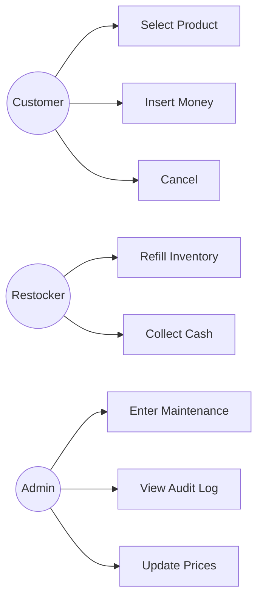
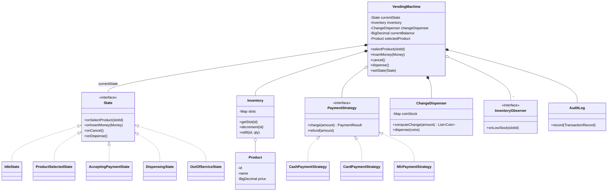
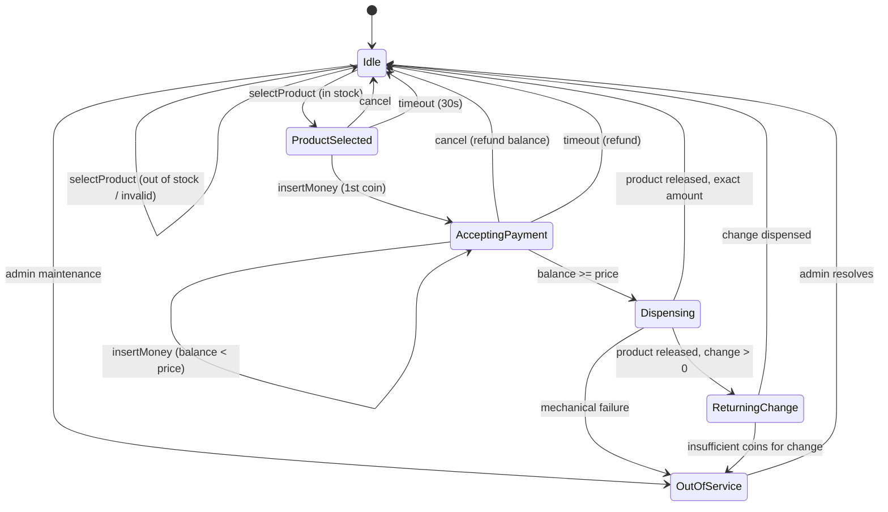
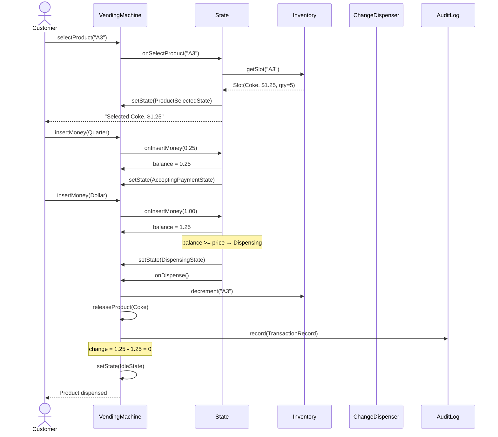

# Вопросы на собеседовании: `OO Design — Vending Machine`

`Vending Machine` — **классическая задача на State pattern**. Главный фокус: state machine с явными переходами, no `if-else` на состояние, точная работа с деньгами (BigDecimal!), change-making algorithm, thread safety при concurrent restocking. Это **LLD-задача 30-45 мин**: показать чистый OO-дизайн, паттерны GoF и понимание edge cases (jam, out-of-change, power failure).

## Полезные ссылки

- [Refactoring Guru — State pattern](https://refactoring.guru/design-patterns/state)
- [Refactoring Guru — Strategy pattern](https://refactoring.guru/design-patterns/strategy)
- [GoF Design Patterns (книга)](https://en.wikipedia.org/wiki/Design_Patterns)
- [Java BigDecimal — почему не float для денег](https://docs.oracle.com/javase/8/docs/api/java/math/BigDecimal.html)
- [Change-making problem (Wikipedia)](https://en.wikipedia.org/wiki/Change-making_problem)
- [Canonical coin systems (Pearson)](https://arxiv.org/abs/0809.0400)

## Содержание

**Requirements**
- [Q1. Functional + non-functional requirements](#q1-functional--non-functional-requirements-)
- [Q2. Actors и use-cases](#q2-actors-и-use-cases)

**Классы и responsibilities**
- [Q3. Core entities (VendingMachine, Product, Inventory, Slot)](#q3-core-entities-vendingmachine-product-inventory-slot)
- [Q4. Currency: Coin, Note, Payment method (!)](#q4-currency-coin-note-payment-method-)
- [Q5. Почему BigDecimal/cents, а не float (!)](#q5-почему-bigdecimalcents-а-не-float-)

**UML class diagram**
- [Q6. Class diagram VendingMachine + State + Strategy](#q6-uml-class-diagram)

**State machine**
- [Q7. Состояния и переходы (Idle → ProductSelected → ...) (!)](#q7-состояния-и-переходы-idle--productselected---)
- [Q8. State pattern: интерфейс + 5 концретных классов (!)](#q8-state-pattern-интерфейс--5-конкретных-классов-)
- [Q9. Illegal-state guards: что блокировать в каждом состоянии](#q9-illegal-state-guards-что-блокировать-в-каждом-состоянии)

**Sequence flows**
- [Q10. Happy path: select → pay → dispense → change](#q10-happy-path-select--pay--dispense--change)
- [Q11. Cancel mid-payment — refund](#q11-cancel-mid-payment--refund)
- [Q12. Out-of-stock и insufficient funds](#q12-out-of-stock-и-insufficient-funds)

**Паттерны GoF**
- [Q13. State (главный), Strategy (Payment), Observer, Command, Singleton (!)](#q13-паттерны-gof-)
- [Q14. Почему State а не switch-case (!)](#q14-почему-state-а-не-switch-case-)

**Change-making algorithm**
- [Q15. Greedy для canonical coin systems (US/EUR) (!)](#q15-greedy-для-canonical-coin-systems-useur-)
- [Q16. DP алгоритм для arbitrary denominations](#q16-dp-алгоритм-для-arbitrary-denominations)
- [Q17. Exact-change-only mode и edge cases](#q17-exact-change-only-mode-и-edge-cases)

**SOLID применение**
- [Q18. SRP/OCP/DIP через State и Strategy](#q18-solid-применение)

**Thread safety и edge cases**
- [Q19. Concurrent restocking vs purchase: synchronized/ReentrantLock (!)](#q19-concurrent-restocking-vs-purchase-synchronizedreentrantlock-)
- [Q20. Power failure mid-dispense, money jam, fraud](#q20-power-failure-mid-dispense-money-jam-fraud)
- [Q21. Audit log транзакций](#q21-audit-log-транзакций)

**Extensions**
- [Q22. Cashless (NFC/Stripe), loyalty, multi-product cart, dynamic pricing](#q22-cashless-nfcstripe-loyalty-multi-product-cart-dynamic-pricing)
- [Q23. Testing approach: state-transition + property-based](#q23-testing-approach-state-transition--property-based)
- [Q24. Anti-patterns: huge switch, float money, exposed mutable state](#q24-anti-patterns-huge-switch-float-money-exposed-mutable-state)

---

## Q1. Functional + non-functional requirements (!)

**Functional (что машина делает):**

| Use-case | Описание |
|---|---|
| Select product | Покупатель выбирает слот (например, `A3`) |
| Insert coins/notes | Принимать монеты/банкноты, считать баланс |
| Insert card (NFC) | Cashless оплата через payment gateway |
| Dispense product | Выдать товар после успешной оплаты |
| Return change | Точно посчитать и выдать сдачу |
| Cancel | Вернуть вставленные деньги в любой момент до dispense |
| Restock (admin) | Авторизованный персонал пополняет товар |
| Maintenance mode | Перевод в `OutOfService` (для ремонта) |

**Non-functional:**

- **Real-time response** (< 1 сек на каждый шаг — это hardware, не cloud).
- **Никогда не отдать продукт без оплаты** — invariant, нарушение = убыток.
- **Точная сдача** — float-математика запрещена.
- **Audit log транзакций** — для reconciliation и fraud detection.
- **Доступность** — `OutOfService` явный, не silent fail.
- **Безопасность** — admin-доступ через auth (key/RFID/passcode).

---

## Q2. Actors и use-cases



- **Customer** — основной актёр (один за раз).
- **Restocker** — пополняет товар, забирает наличность.
- **Admin** — конфигурация, отчёты, prices.

---

## Q3. Core entities (VendingMachine, Product, Inventory, Slot)

```java
public class VendingMachine {                    // Context (State pattern)
    private State currentState;                  // current state object
    private final Inventory inventory;
    private final ChangeDispenser changeDispenser;
    private final AuditLog auditLog;
    private final List<InventoryObserver> observers = new ArrayList<>();

    // Транзакционный контекст текущей покупки
    private Product selectedProduct;
    private BigDecimal currentBalance = BigDecimal.ZERO;
    private PaymentStrategy paymentStrategy;

    // Делегирование событий текущему состоянию
    public void selectProduct(String slotId) { currentState.onSelectProduct(slotId); }
    public void insertMoney(Money m)         { currentState.onInsertMoney(m); }
    public void cancel()                     { currentState.onCancel(); }
    public void dispense()                   { currentState.onDispense(); }

    void setState(State next) { this.currentState = next; }
    // ... getters для состояний
}

public final class Product {
    private final String id;        // SKU
    private final String name;
    private final BigDecimal price;  // в той же валюте, что Money
}

public final class Slot {           // физический слот в автомате
    private final String slotId;    // "A3"
    private final Product product;
    private int quantity;           // текущее количество в слоте
}

public class Inventory {
    private final Map<String, Slot> slots;  // slotId → Slot

    public Optional<Slot> getSlot(String id)   { ... }
    public boolean isAvailable(String id)      { ... }
    public synchronized void decrement(String id) { ... }
    public synchronized void refill(String id, int qty) { ... }
}
```

---

## Q4. Currency: Coin, Note, Payment method (!)

```java
public enum Coin {
    PENNY(new BigDecimal("0.01")),
    NICKEL(new BigDecimal("0.05")),
    DIME(new BigDecimal("0.10")),
    QUARTER(new BigDecimal("0.25"));
    private final BigDecimal value;
    Coin(BigDecimal v) { this.value = v; }
    public BigDecimal getValue() { return value; }
}

public enum Note {
    ONE(new BigDecimal("1")),
    FIVE(new BigDecimal("5")),
    TEN(new BigDecimal("10")),
    TWENTY(new BigDecimal("20"));
    // ...
}

public sealed interface Money permits CoinMoney, NoteMoney, CardCharge {
    BigDecimal amount();
}
public record CoinMoney(Coin coin) implements Money {
    public BigDecimal amount() { return coin.getValue(); }
}
public record NoteMoney(Note note) implements Money { ... }
public record CardCharge(BigDecimal amount, String tokenizedCard) implements Money { ... }
```

**Payment method (Strategy):**

```java
public interface PaymentStrategy {
    PaymentResult charge(BigDecimal amount);
    void refund(BigDecimal amount);
}

public class CashPaymentStrategy implements PaymentStrategy { ... }
public class CardPaymentStrategy implements PaymentStrategy {
    private final PaymentGateway gateway;        // Stripe/Adyen
    public PaymentResult charge(BigDecimal amount) {
        return gateway.charge(amount, tokenizedCard);
    }
}
public class NfcPaymentStrategy implements PaymentStrategy { ... }
```

---

## Q5. Почему BigDecimal/cents, а не float (!)

```java
double a = 0.1 + 0.2;          // 0.30000000000000004 ❗
BigDecimal b = new BigDecimal("0.1").add(new BigDecimal("0.2"));  // 0.3 ✓
```

**Float/double — IEEE 754 binary** — не представляет десятичные дроби точно. `0.1` в binary = бесконечная периодическая дробь.

**Варианты для денег:**

| Подход | Плюсы | Минусы |
|---|---|---|
| `BigDecimal` со scale=2 | Точно, читабельно, MathContext | Чуть медленнее, нужно явный `.setScale(2, RoundingMode.HALF_UP)` |
| `long cents` (integer cents) | Быстро, нативно для DB | Нет mixed-currency safety, ручной forматтинг |
| `Money` value-object (Joda Money / Moneta) | Type-safe, валюта в типе | Зависимость |
| `double` / `float` | — | **Никогда. Запрещено для денег.** |

**Правило:** на собесе сразу декларировать `BigDecimal` + `RoundingMode.HALF_UP` для всех ценовых операций. Это маркер senior-уровня.

---

## Q6. UML class diagram



---

## Q7. Состояния и переходы (Idle → ProductSelected → ...) (!)



**Ключевые transitions:**

| From → To | Trigger | Side effect |
|---|---|---|
| `Idle → ProductSelected` | `selectProduct(slotId)` валиден | сохранить `selectedProduct` |
| `ProductSelected → AcceptingPayment` | `insertMoney(m)` | `balance += m.amount()` |
| `AcceptingPayment → Dispensing` | `balance >= price` | charge, decrement inventory |
| `* → Idle (cancel)` | `cancel()` | refund `currentBalance` |
| `Dispensing → ReturningChange` | dispense done, `change > 0` | compute coins |
| `ReturningChange → Idle` | change dispensed | log transaction |

---

## Q8. State pattern: интерфейс + 5 концретных классов (!)

**Интерфейс State (default-методы бросают `IllegalStateException`):**

```java
public interface State {
    default void onSelectProduct(String slotId) { illegal("selectProduct"); }
    default void onInsertMoney(Money m)         { illegal("insertMoney"); }
    default void onCancel()                     { illegal("cancel"); }
    default void onDispense()                   { illegal("dispense"); }

    default void illegal(String op) {
        throw new IllegalStateException(op + " not allowed in " + getClass().getSimpleName());
    }
}
```

**Idle:**

```java
public class IdleState implements State {
    private final VendingMachine vm;
    public IdleState(VendingMachine vm) { this.vm = vm; }

    @Override
    public void onSelectProduct(String slotId) {
        var slot = vm.getInventory().getSlot(slotId)
            .orElseThrow(() -> new InvalidSlotException(slotId));
        if (slot.getQuantity() == 0) {
            vm.showMessage("Sold out: " + slotId);
            return;     // остаёмся в Idle
        }
        vm.setSelectedProduct(slot.getProduct());
        vm.setState(new ProductSelectedState(vm));
        vm.showMessage("Selected: " + slot.getProduct().getName()
                       + ". Price: " + slot.getProduct().getPrice());
    }
    // onInsertMoney/onCancel/onDispense → IllegalStateException (default)
}
```

**ProductSelected:**

```java
public class ProductSelectedState implements State {
    private final VendingMachine vm;

    @Override
    public void onInsertMoney(Money m) {
        vm.addToBalance(m.amount());
        vm.setState(new AcceptingPaymentState(vm));
        checkAndAdvance();
    }

    @Override
    public void onCancel() {
        vm.clearSelection();
        vm.setState(new IdleState(vm));
    }

    @Override
    public void onSelectProduct(String slotId) {
        // переключение выбора до оплаты — разрешено
        vm.setState(new IdleState(vm));
        vm.getState().onSelectProduct(slotId);
    }

    private void checkAndAdvance() {
        if (vm.getCurrentBalance().compareTo(vm.getSelectedProduct().getPrice()) >= 0) {
            vm.setState(new DispensingState(vm));
            vm.getState().onDispense();
        }
    }
}
```

**AcceptingPayment:**

```java
public class AcceptingPaymentState implements State {
    private final VendingMachine vm;

    @Override
    public void onInsertMoney(Money m) {
        vm.addToBalance(m.amount());
        if (vm.getCurrentBalance().compareTo(vm.getSelectedProduct().getPrice()) >= 0) {
            vm.setState(new DispensingState(vm));
            vm.getState().onDispense();
        }
    }

    @Override
    public void onCancel() {
        vm.getPaymentStrategy().refund(vm.getCurrentBalance());
        vm.clearTransaction();
        vm.setState(new IdleState(vm));
    }
}
```

**Dispensing:**

```java
public class DispensingState implements State {
    private final VendingMachine vm;

    @Override
    public void onDispense() {
        var product  = vm.getSelectedProduct();
        var price    = product.getPrice();
        var balance  = vm.getCurrentBalance();
        var change   = balance.subtract(price);

        // 1) charge для card payment
        vm.getPaymentStrategy().charge(price);
        // 2) физически выдать
        vm.releaseProduct(product);
        // 3) decrement inventory
        vm.getInventory().decrement(product.getId());

        vm.getAuditLog().record(new TransactionRecord(
            Instant.now(), product, price, vm.getPaymentStrategy().method(), change));

        if (change.compareTo(BigDecimal.ZERO) > 0) {
            vm.setState(new ReturningChangeState(vm, change));
            vm.getState().onDispense();   // self-trigger
        } else {
            vm.clearTransaction();
            vm.setState(new IdleState(vm));
        }
    }
}
```

**ReturningChange:**

```java
public class ReturningChangeState implements State {
    private final VendingMachine vm;
    private final BigDecimal amount;

    @Override
    public void onDispense() {
        try {
            var coins = vm.getChangeDispenser().computeChange(amount);
            vm.getChangeDispenser().dispense(coins);
            vm.clearTransaction();
            vm.setState(new IdleState(vm));
        } catch (InsufficientCoinsException e) {
            vm.notifyAdmin("Cannot make change: " + amount);
            vm.setState(new OutOfServiceState(vm));
        }
    }
}
```

**OutOfService:**

```java
public class OutOfServiceState implements State {
    private final VendingMachine vm;

    @Override
    public void onSelectProduct(String slotId) {
        vm.showMessage("Out of service. Please use another machine.");
    }
    public void resolve() {  // вызывается admin-ом
        vm.setState(new IdleState(vm));
    }
}
```

---

## Q9. Illegal-state guards: что блокировать в каждом состоянии

| State | onSelect | onInsertMoney | onCancel | onDispense |
|---|---|---|---|---|
| `Idle` | OK | ❌ illegal | ❌ illegal | ❌ illegal |
| `ProductSelected` | OK (re-select) | → AcceptingPayment | refund (0) | ❌ illegal |
| `AcceptingPayment` | ❌ illegal | OK | refund balance | (internal trigger) |
| `Dispensing` | ❌ illegal | ❌ illegal | ❌ illegal | (internal trigger) |
| `OutOfService` | message | ❌ illegal | ❌ illegal | ❌ illegal |

**Принцип:** illegal операции → `IllegalStateException` (default-метод интерфейса). Это **fail-fast**: баг в логике вскрывается сразу, а не приводит к загадочному поведению. UI должен disable-ить кнопки в зависимости от состояния, но domain-слой всё равно проверяет — defence in depth.

---

## Q10. Happy path: select → pay → dispense → change



**Если бы customer вставил $2** — на шаге `setState(DispensingState)` change = $0.75, далее переход в `ReturningChangeState`, который вычислит coins (3×Quarter) и dispense.

---

## Q11. Cancel mid-payment — refund

```java
// В AcceptingPaymentState
public void onCancel() {
    BigDecimal toRefund = vm.getCurrentBalance();
    if (toRefund.compareTo(BigDecimal.ZERO) > 0) {
        var coins = vm.getChangeDispenser().computeChange(toRefund);
        vm.getChangeDispenser().dispense(coins);
    }
    vm.getAuditLog().record(TransactionRecord.cancelled(toRefund));
    vm.clearTransaction();
    vm.setState(new IdleState(vm));
}
```

**Edge case:** оплата уже была card (NFC) — refund через payment gateway (`paymentStrategy.refund(amount)`). При cash — те же монеты не возвращаются физически (они уже в hopper); выдаётся эквивалент из change pool.

---

## Q12. Out-of-stock и insufficient funds

**Out-of-stock на selection:**

```java
// IdleState.onSelectProduct
if (slot.getQuantity() == 0) {
    vm.showMessage("Sold out");
    return;     // остаёмся в Idle, no state change
}
```

**Insufficient funds (customer ушёл с балансом < price):**

- Timeout 30 сек в `AcceptingPaymentState` → автоматический cancel + refund.

```java
// Scheduler в VendingMachine
public void onUserInactive() {
    if (currentState instanceof AcceptingPaymentState
            || currentState instanceof ProductSelectedState) {
        currentState.onCancel();
    }
}
```

**Race condition — last item:** если 2 customer-а одновременно (admin restocking сценарий) — `synchronized` на `Inventory.decrement` гарантирует, что только один получит товар.

---

## Q13. Паттерны GoF (!)

| Паттерн | Где | Зачем |
|---|---|---|
| **State** (главный) | `VendingMachine` + `State` интерфейс + 5 концретов | Убрать `switch/if` по состоянию, добавлять состояния без правки Context |
| **Strategy** | `PaymentStrategy` (Cash/Card/NFC) | Подменять способ оплаты, добавлять новые без правки VM |
| **Observer** | `InventoryObserver` слушает `Inventory.decrement` | Low-stock алерт админу, dashboard updates |
| **Command** | `Action` интерфейс: `SelectAction`, `InsertMoneyAction`, `CancelAction` | Undo/redo (отмена), очередь действий, audit log |
| **Singleton** | `VendingMachine` (один на физический автомат) | Hardware bound — один контроллер на машину |
| **Factory** | `StateFactory.create(StateType, vm)` | Если состояний много и они с зависимостями |
| **Template Method** | `AbstractPaymentStrategy.process()` = validate → charge → log | Общий каркас для всех payment-стратегий |

**Observer — пример:**

```java
public interface InventoryObserver {
    void onLowStock(String slotId, int remaining);
    void onOutOfStock(String slotId);
}

public class AdminDashboard implements InventoryObserver {
    @Override public void onLowStock(String slotId, int remaining) {
        sendAlert("Low stock " + slotId + ": " + remaining + " left");
    }
}

// в Inventory
public synchronized void decrement(String slotId) {
    var slot = slots.get(slotId);
    slot.setQuantity(slot.getQuantity() - 1);
    if (slot.getQuantity() == 0) {
        observers.forEach(o -> o.onOutOfStock(slotId));
    } else if (slot.getQuantity() <= LOW_THRESHOLD) {
        observers.forEach(o -> o.onLowStock(slotId, slot.getQuantity()));
    }
}
```

**Command — для admin restocking:**

```java
public sealed interface AdminCommand {
    void execute(VendingMachine vm);
}
public record RefillCommand(String slotId, int qty) implements AdminCommand {
    public void execute(VendingMachine vm) {
        vm.getInventory().refill(slotId, qty);
    }
}
public record SetPriceCommand(String slotId, BigDecimal price) implements AdminCommand { ... }
public record EnterMaintenanceCommand() implements AdminCommand { ... }
```

---

## Q14. Почему State а не switch-case (!)

**Anti-pattern (наивный подход):**

```java
public void insertMoney(Money m) {
    switch (state) {
        case IDLE:
            throw new IllegalStateException();
        case PRODUCT_SELECTED:
        case ACCEPTING_PAYMENT:
            balance = balance.add(m.amount());
            if (balance.compareTo(price) >= 0) {
                state = DISPENSING;
                dispense();
            } else {
                state = ACCEPTING_PAYMENT;
            }
            break;
        case DISPENSING:
            throw new IllegalStateException();
        // ...
    }
}
// и такой же switch в каждом методе onSelectProduct, onCancel, onDispense
```

**Проблемы:**

- **Дублирование** — switch на state в каждом из ~5 методов.
- **OCP-нарушение** — новое состояние → правки во всех методах.
- **Невозможно тестировать состояние изолированно** — все в одном классе.
- **Cognitive load** — поведение размазано по 5×5=25 веткам switch.

**State pattern лечит:**

- Каждое состояние — отдельный класс, поведение в одном месте.
- Добавление состояния = новый класс, никаких правок существующего кода.
- Юнит-тест на каждое состояние независим.

---

## Q15. Greedy для canonical coin systems (US/EUR) (!)

```java
public List<Coin> computeChangeGreedy(BigDecimal amount) {
    BigDecimal remaining = amount;
    var result = new ArrayList<Coin>();
    // По убыванию номинала
    var coins = List.of(Coin.QUARTER, Coin.DIME, Coin.NICKEL, Coin.PENNY);
    for (var c : coins) {
        while (remaining.compareTo(c.getValue()) >= 0 && hasInStock(c)) {
            result.add(c);
            remaining = remaining.subtract(c.getValue());
            consumeFromStock(c);
        }
    }
    if (remaining.compareTo(BigDecimal.ZERO) > 0) {
        throw new InsufficientCoinsException(amount, remaining);
    }
    return result;
}
```

**Почему greedy работает для US/EUR:**

- **Canonical coin system** — система, где жадный алгоритм всегда даёт оптимум.
- US (1, 5, 10, 25 cents) — canonical.
- EUR (1, 2, 5, 10, 20, 50 cents) — canonical.
- **Контрпример** (non-canonical): {1, 3, 4} и сдача 6 — greedy даст `4+1+1=3 монеты`, а оптимум `3+3=2 монеты`.

**Сложность:** `O(n × k)` где `n` — номиналов, `k` — макс. количество монет в сдаче. На практике — мгновенно.

---

## Q16. DP алгоритм для arbitrary denominations

```java
public List<Coin> computeChangeDP(BigDecimal amount) {
    // Конвертируем в cents для integer DP
    int target = amount.movePointRight(2).intValueExact();
    int[] coins = {25, 10, 5, 1};   // или любые

    // dp[i] = минимум монет для суммы i
    int[] dp = new int[target + 1];
    int[] prev = new int[target + 1];   // для восстановления решения
    Arrays.fill(dp, Integer.MAX_VALUE);
    dp[0] = 0;

    for (int i = 1; i <= target; i++) {
        for (int c : coins) {
            if (i - c >= 0 && dp[i - c] != Integer.MAX_VALUE && dp[i - c] + 1 < dp[i]) {
                dp[i] = dp[i - c] + 1;
                prev[i] = c;
            }
        }
    }
    if (dp[target] == Integer.MAX_VALUE) throw new InsufficientCoinsException();

    // Восстановление
    var result = new ArrayList<Coin>();
    for (int i = target; i > 0; i -= prev[i]) result.add(centsToCoin(prev[i]));
    return result;
}
```

**Сравнение:**

| Алгоритм | Сложность | Когда |
|---|---|---|
| **Greedy** | `O(n)` | Canonical coin system (US, EUR) — почти всегда |
| **DP unbounded knapsack** | `O(target × n)` | Arbitrary denominations, либо unbounded coins |
| **DP bounded (limited stock)** | `O(target × n × max_stock)` | Учёт реального запаса монет каждого номинала |

**В реальном автомате**: greedy + проверка stock, fallback на DP при необходимости — практичный компромисс.

---

## Q17. Exact-change-only mode и edge cases

**Insufficient coins for change:**

```java
public class ChangeDispenser {
    public List<Coin> computeChange(BigDecimal amount) {
        var result = tryGreedy(amount);
        if (result == null) throw new InsufficientCoinsException(amount);
        return result;
    }

    // Если pre-check показал, что сдачу не выдать — включить exact-change mode
    public boolean canMakeChange(BigDecimal amount) {
        return tryGreedy(amount) != null;
    }
}
```

**В IdleState — pre-check:**

```java
// если для любой возможной разницы (price - max_note) сдача невозможна → ECO-mode
if (changeDispenser.lowOnCoins()) {
    vm.showMessage("EXACT CHANGE ONLY");
}
```

**Опции при невозможности сдачи:**

| Стратегия | Плюсы | Минусы |
|---|---|---|
| Отказ от транзакции | Никаких убытков | Customer недоволен |
| Round down (выдать меньше) | Транзакция проходит | Юридически — нельзя без согласия |
| Купон/credit на следующую покупку | Customer возвращается | Нужна персистентность |
| Перейти в `OutOfService` | Honest | Прибыль = 0 до restock |

**Правильный подход:** при невозможности сдачи **отказаться от транзакции до dispense** (вернуть деньги), товар не выдаётся. Перевод в `OutOfService` только при критическом low.

---

## Q18. SOLID применение

**SRP** — каждый класс одну вещь:
- `VendingMachine` — координация (Context).
- Каждый `State` — поведение в одном режиме.
- `Inventory` — управление товаром.
- `ChangeDispenser` — выдача сдачи.
- `AuditLog` — логирование.

**OCP** — добавить новое состояние (например, `MaintenanceCalibrationState`) = новый класс, без правки `VendingMachine` или существующих состояний.

**LSP** — все `State`-реализации заменяемы; default-методы интерфейса гарантируют, что не реализованные операции бросают `IllegalStateException`, а не молча проходят.

**ISP** — `State` интерфейс узкий (4 метода), а не «толстый» с методами для admin. Admin-операции в отдельном API `VendingMachine.adminCommand(...)`.

**DIP** — `VendingMachine` зависит от `PaymentStrategy` интерфейса, а не от `StripeClient`. Тесты подменяют на `FakePaymentStrategy`.

---

## Q19. Concurrent restocking vs purchase: synchronized/ReentrantLock (!)

**Сценарий:** customer покупает Coke (`A3`, qty=1), одновременно admin вызывает `refill("A3", 10)`.

```java
public class Inventory {
    private final Map<String, Slot> slots = new ConcurrentHashMap<>();

    public synchronized boolean decrement(String slotId) {
        var slot = slots.get(slotId);
        if (slot == null || slot.getQuantity() == 0) return false;
        slot.setQuantity(slot.getQuantity() - 1);
        notifyObservers(slot);
        return true;
    }

    public synchronized void refill(String slotId, int qty) {
        slots.compute(slotId, (k, s) -> {
            if (s == null) return new Slot(slotId, defaultProduct(slotId), qty);
            s.setQuantity(s.getQuantity() + qty);
            return s;
        });
    }
}
```

**Альтернатива — `ReentrantLock`** для более тонкого контроля (timeout, tryLock):

```java
private final ReentrantLock lock = new ReentrantLock();

public boolean decrement(String slotId) {
    try {
        if (!lock.tryLock(100, TimeUnit.MILLISECONDS)) return false;
        // ... critical section
    } finally { lock.unlock(); }
}
```

**Lock-free вариант:**

```java
public class Slot {
    private final AtomicInteger quantity;

    public boolean tryDecrement() {
        while (true) {
            int cur = quantity.get();
            if (cur == 0) return false;
            if (quantity.compareAndSet(cur, cur - 1)) return true;
        }
    }
}
```

**Practical:** реальный автомат — single-user (физически один человек у машины), но admin-операции могут идти параллельно (через сервисный port / remote). `synchronized` достаточно; lock-free overengineering.

**Maintenance mode при restock:** chrysalis-вариант — перевести в `OutOfService` на время refill, чтобы не было race с покупателем вообще.

---

## Q20. Power failure mid-dispense, money jam, fraud

**Power failure mid-dispense:**

- **Persistent state** — текущая транзакция пишется в non-volatile storage (EEPROM/flash) перед физической выдачей.
- При reboot — `VendingMachine.recover()` читает last transaction, проверяет sensor (вышел ли товар), доделывает или refund.

```java
public void recover() {
    var pending = auditLog.findLastPendingTransaction();
    if (pending == null) return;
    if (sensors.productDelivered(pending.slotId())) {
        auditLog.markComplete(pending);
    } else {
        auditLog.markFailed(pending);
        scheduleRefund(pending);
    }
}
```

**Money jam (монета застряла):**

- Sensor not triggered after timeout → `OutOfService` + admin alert.
- Customer-side: если deposit-валидатор не подтвердил приём — не увеличивать balance.

**Fraud (counterfeit detection):**

- Bill validator — IR/magnetic check; rejected coins/notes — не учитываются.
- String pull attack (монета на нитке) — рассматривается hardware (anti-pullback).
- На software-уровне: rate limiting (slow drop за 10 сек = подозрительно), audit log событий.

**Card fraud:**

- Tokenization (PCI-DSS) — карта не хранится, только token.
- 3DS для cardholder-not-present.
- Velocity check (та же карта 10 раз за минуту → block).

---

## Q21. Audit log транзакций

```java
public record TransactionRecord(
    UUID id,
    Instant timestamp,
    String slotId,
    String productName,
    BigDecimal price,
    BigDecimal paid,
    BigDecimal change,
    PaymentMethod method,
    TransactionStatus status     // SUCCESS, CANCELLED, FAILED, REFUNDED
) {}

public interface AuditLog {
    void record(TransactionRecord r);
    List<TransactionRecord> between(Instant from, Instant to);
    BigDecimal totalRevenue(LocalDate date);
    Optional<TransactionRecord> findLastPendingTransaction();
}
```

**Хранилище:**

- **Локально**: SQLite на контроллере автомата (write-ahead logging, durable).
- **Sync**: периодическая выгрузка в central system (для bookkeeping + reconciliation).
- **Reconciliation**: cash in hopper at end of day должен = `sum(paid) - sum(change) - sum(refunds)`.

---

## Q22. Cashless (NFC/Stripe), loyalty, multi-product cart, dynamic pricing

**Cashless integration (Strategy + Adapter):**

```java
public class StripeCardPaymentStrategy implements PaymentStrategy {
    private final StripeClient stripe;

    @Override
    public PaymentResult charge(BigDecimal amount) {
        var intent = stripe.paymentIntents().create(PaymentIntentCreate.builder()
            .amount(amount.movePointRight(2).longValueExact())
            .currency("usd")
            .confirm(true)
            .paymentMethod(currentPaymentMethod)
            .build());
        return intent.status().equals("succeeded")
            ? PaymentResult.success(intent.id())
            : PaymentResult.failure(intent.lastError());
    }
}
```

**Loyalty points:**

- `LoyaltyAccount` — отдельная entity, привязка через card scan / mobile app.
- Скидка применяется на этапе `IdleState.onSelectProduct` — корректировка `effectivePrice`.

**Multi-product cart:**

```java
// Расширение: вместо selectedProduct — корзина
public class VendingMachine {
    private final List<Product> cart = new ArrayList<>();
    private final BigDecimal cartTotal();
}
// State machine та же, но Dispensing → multiple dispenses
```

**Dynamic pricing:**

- Time-of-day (happy hour −20%).
- Inventory pressure (последние 2 шт → +10%).
- Demand-based (popular product → +5%).
- Реализация: `PricingStrategy` (ещё одна Strategy), вызывается в `IdleState.onSelectProduct`.

---

## Q23. Testing approach: state-transition + property-based

**1. State-transition table tests:**

```java
@ParameterizedTest
@MethodSource("stateTransitionMatrix")
void stateTransition(State from, Event event, Class<? extends State> expectedTo) {
    var vm = new VendingMachine();
    vm.setState(from);
    event.applyTo(vm);
    assertThat(vm.getState()).isInstanceOf(expectedTo);
}

static Stream<Arguments> stateTransitionMatrix() {
    return Stream.of(
        Arguments.of(idle(), selectProduct("A3"), ProductSelectedState.class),
        Arguments.of(productSelected(), insertMoney(0.25), AcceptingPaymentState.class),
        Arguments.of(acceptingPayment(), cancel(), IdleState.class),
        // полная матрица переходов
    );
}
```

**2. Illegal transitions:**

```java
@Test
void insertMoney_inIdle_throwsIllegalState() {
    var vm = new VendingMachine();  // в Idle
    assertThatThrownBy(() -> vm.insertMoney(new CoinMoney(Coin.QUARTER)))
        .isInstanceOf(IllegalStateException.class);
}
```

**3. Property-based (jqwik):**

```java
// Invariant: cash_in - cash_out = 0 после любой последовательности cancel-операций
@Property
void noMoneyLoss(@ForAll List<Event> events) {
    var vm = new VendingMachine();
    BigDecimal cashIn = BigDecimal.ZERO;
    BigDecimal cashOut = BigDecimal.ZERO;
    for (var e : events) {
        if (e instanceof InsertMoney im) cashIn = cashIn.add(im.amount());
        try { e.applyTo(vm); } catch (IllegalStateException ignored) {}
        cashOut = cashOut.add(vm.flushDispensedChange());
    }
    // Все продукты выданы + изменение должны сходиться
    var productsCost = vm.totalProductsDispensedValue();
    assertThat(cashIn).isEqualTo(productsCost.add(cashOut));
}
```

**4. Concurrency tests:**

```java
@Test
void concurrentDecrementAndRefill_noLostUpdate() throws Exception {
    var inventory = new Inventory();
    inventory.refill("A3", 100);
    var threads = 10;
    var executor = Executors.newFixedThreadPool(threads);
    var latch = new CountDownLatch(threads * 100);
    for (int i = 0; i < threads * 100; i++) {
        executor.submit(() -> { inventory.decrement("A3"); latch.countDown(); });
    }
    latch.await();
    assertThat(inventory.getSlot("A3").get().getQuantity()).isZero();
}
```

---

## Q24. Anti-patterns: huge switch, float money, exposed mutable state

| Anti-pattern | Почему плохо | Как правильно |
|---|---|---|
| `switch (state)` в каждом методе | Дублирование, OCP-нарушение | State pattern |
| `double price` | Floating-point ошибки | `BigDecimal` + scale=2 |
| `String state` ("idle", "paid") | Stringly-typed, опечатки молча проходят | Enum или классы State |
| `vm.setState(SomeState)` публично | Любой код может сломать FSM | `setState()` package-private, only State классы вызывают |
| Бизнес-логика в UI | Невозможно тестировать без UI | Domain отделён, UI делегирует |
| `Map<String, Integer>` для inventory | Нет инкапсуляции, race-conditions | `Inventory` класс с synchronized методами |
| Хранение карты целиком | PCI-DSS нарушение | Tokenization (только token) |
| `Thread.sleep` для timeout | Блокирует поток | `ScheduledExecutorService` + cancellation |
| Один гигантский `process()` метод | God-method | Каждая операция = отдельный метод State |
| `vm.getInventory().getSlots()` возвращает изменяемую `Map` | Caller может ломать инварианты | `Collections.unmodifiableMap` или DTO |

**Запах кода: «много `instanceof`»** —

```java
// ПЛОХО
if (state instanceof IdleState) { ... }
else if (state instanceof ProductSelectedState) { ... }
```

→ это значит, поведение, которое должно быть **в** State, вытащено наружу. Переместить в метод State.

---

## See also

- [System Design Interview — meta-методология](./system-design-interview.md)
- [OO Design: Parking Lot — родственный паттерн (Strategy/Factory)](./design-parking-lot-oo-interview.md)
- [OO Design: Elevator — State pattern + multi-elevator scheduling](./design-elevator-oo-interview.md)
- [Java Core — enum, sealed, records, BigDecimal](../programming-languages/java/java-core-interview.md)
- [Java Concurrency — synchronized, ReentrantLock, AtomicInteger](../programming-languages/java/java-concurrency-interview.md)
- [Clean Architecture — слои, DIP, тестируемость](../architecture/clean-architecture-interview.md)
- [Dynamic Programming — change-making как unbounded knapsack](../algorithms/algorithmic-paradigms/dynamic-programming-interview.md)
- [Algorithms — greedy, complexity analysis](../algorithms/algorithms-interview.md)
- [Design Payment System — реальная интеграция со Stripe/3DS](./design-payment-system-interview.md)
