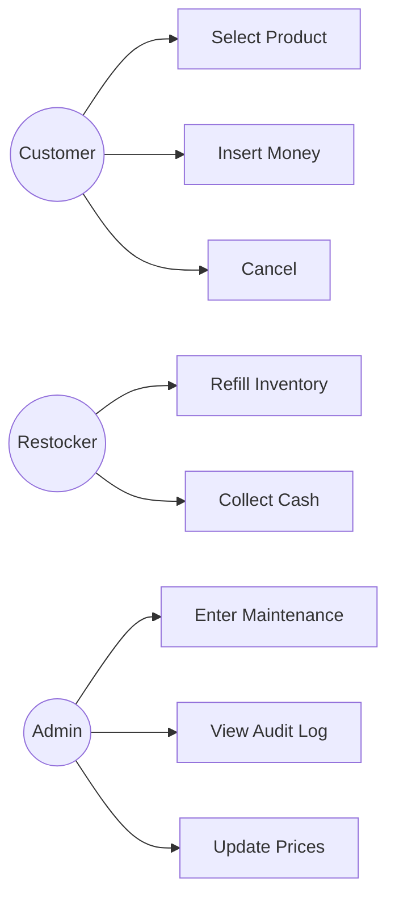
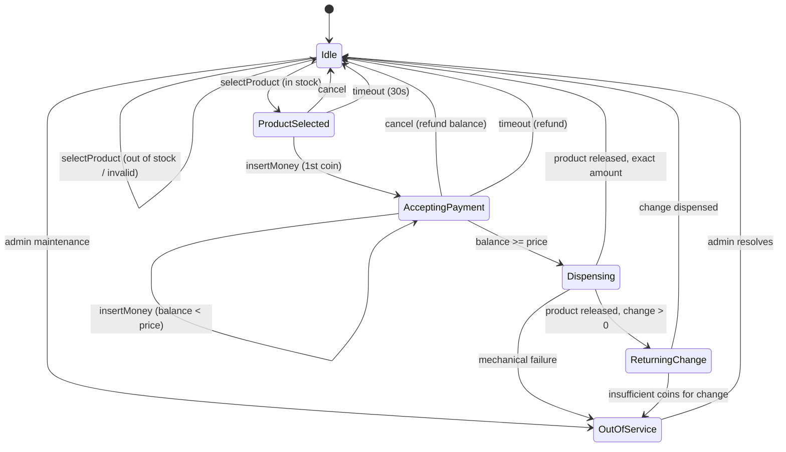
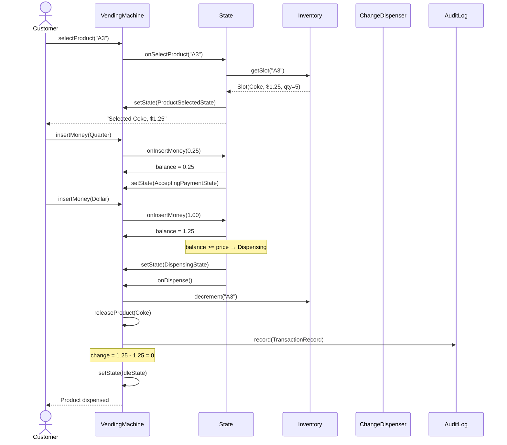

# Вопросы на собеседовании: `OO Design — Vending Machine`

`Vending Machine` — **классическая задача на State pattern**. Главный фокус: state machine с явными переходами, no `if-else` на состояние, точная работа с деньгами (BigDecimal!), change-making algorithm, thread safety при concurrent restocking. Это **LLD-задача 30-45 мин**: показать чистый OO-дизайн, паттерны GoF и понимание edge cases (jam, out-of-change, power failure).

## Полезные ссылки

- [Refactoring Guru — State pattern](https://refactoring.guru/design-patterns/state)
- [Refactoring Guru — Strategy pattern](https://refactoring.guru/design-patterns/strategy)
- [GoF Design Patterns (книга)](https://en.wikipedia.org/wiki/Design_Patterns)
- [Java BigDecimal — почему не float для денег](https://docs.oracle.com/javase/8/docs/api/java/math/BigDecimal.html)
- [Change-making problem (Wikipedia)](https://en.wikipedia.org/wiki/Change-making_problem)
- [Canonical coin systems (Pearson)](https://arxiv.org/abs/0809.0400)

## Содержание

**Requirements**
- [Q1. Функциональные и нефункциональные требования (!)](#q1-функциональные-и-нефункциональные-требования-)
- [Q2. Действующие лица и сценарии использования](#q2-действующие-лица-и-сценарии-использования)

**Классы и responsibilities**
- [Q3. Ключевые сущности: VendingMachine, Product, Inventory, Slot](#q3-ключевые-сущности-vendingmachine-product-inventory-slot)
- [Q4. Деньги: Coin, Note, способ оплаты (!)](#q4-деньги-coin-note-способ-оплаты-)
- [Q5. Почему деньги — это BigDecimal/центы, а не float (!)](#q5-почему-деньги--это-bigdecimalценты-а-не-float-)

**UML class diagram**
- [Q6. UML-диаграмма классов](#q6-uml-диаграмма-классов)

**State machine**
- [Q7. Состояния и переходы (Idle → ProductSelected → ...) (!)](#q7-состояния-и-переходы-idle--productselected---)
- [Q8. State pattern: интерфейс + 5 конкретных классов (!)](#q8-state-pattern-интерфейс--5-конкретных-классов-)
- [Q9. Защита от недопустимых действий: что блокировать в каждом состоянии](#q9-защита-от-недопустимых-действий-что-блокировать-в-каждом-состоянии)

**Sequence flows**
- [Q10. Основной сценарий: выбор → оплата → выдача → сдача](#q10-основной-сценарий-выбор--оплата--выдача--сдача)
- [Q11. Отмена в середине оплаты — возврат денег](#q11-отмена-в-середине-оплаты--возврат-денег)
- [Q12. Нет товара и недостаточно денег](#q12-нет-товара-и-недостаточно-денег)

**Паттерны GoF**
- [Q13. Паттерны GoF (!)](#q13-паттерны-gof-)
- [Q14. Почему State, а не switch-case (!)](#q14-почему-state-а-не-switch-case-)

**Change-making algorithm**
- [Q15. Жадный алгоритм для канонических систем монет (US/EUR) (!)](#q15-жадный-алгоритм-для-канонических-систем-монет-useur-)
- [Q16. Алгоритм DP для произвольных номиналов](#q16-алгоритм-dp-для-произвольных-номиналов)
- [Q17. Режим «только без сдачи» и граничные случаи](#q17-режим-только-без-сдачи-и-граничные-случаи)

**SOLID применение**
- [Q18. Применение принципов SOLID](#q18-применение-принципов-solid)

**Thread safety и edge cases**
- [Q19. Параллельное пополнение и покупка: synchronized / ReentrantLock (!)](#q19-параллельное-пополнение-и-покупка-synchronized--reentrantlock-)
- [Q20. Сбой питания при выдаче, замятие монет, мошенничество](#q20-сбой-питания-при-выдаче-замятие-монет-мошенничество)
- [Q21. Журнал транзакций (audit log)](#q21-журнал-транзакций-audit-log)

**Extensions**
- [Q22. Расширения: безналичная оплата, лояльность, корзина, динамическое ценообразование](#q22-расширения-безналичная-оплата-лояльность-корзина-динамическое-ценообразование)
- [Q23. Подход к тестированию: переходы состояний + property-based](#q23-подход-к-тестированию-переходы-состояний--property-based)
- [Q24. Антипаттерны: гигантский switch, деньги во float, открытое изменяемое состояние](#q24-антипаттерны-гигантский-switch-деньги-во-float-открытое-изменяемое-состояние)

---

## Q1. Функциональные и нефункциональные требования (!)

Сначала фиксируем границы задачи. Это запускает любое LLD-собеседование: показать, что вы отделяете *что* система делает (функции) от того, *насколько хорошо* она это делает (нефункциональные ограничения). У автомата продаж эти ограничения непривычно жёсткие — он работает с реальными деньгами и физическим товаром, поэтому ошибка стоит денег, а не просто 500-й ответ.

**Функциональные требования (что машина делает):**

| Сценарий | Описание |
|---|---|
| Select product | Покупатель выбирает слот (например, `A3`) |
| Insert coins/notes | Принимать монеты/банкноты, считать баланс |
| Insert card (NFC) | Безналичная оплата через payment gateway |
| Dispense product | Выдать товар после успешной оплаты |
| Return change | Точно посчитать и выдать сдачу |
| Cancel | Вернуть вставленные деньги в любой момент до выдачи товара |
| Restock (admin) | Авторизованный персонал пополняет товар |
| Maintenance mode | Перевод в `OutOfService` (для ремонта) |

**Нефункциональные требования** — здесь и проявляется специфика именно автомата:

- **Отклик в реальном времени** (< 1 сек на каждый шаг). Это hardware-устройство, а не облачный сервис: пользователь стоит у машины и ждёт реакции мгновенно.
- **Никогда не отдать товар без оплаты** — главный инвариант. Его нарушение = прямой убыток, поэтому проверяется на доменном уровне, а не только в UI.
- **Точная сдача** — арифметика с float запрещена: ошибка округления на копейку при тысячах транзакций превращается в недостачу кассы.
- **Журнал транзакций** — нужен для сверки кассы (reconciliation) и выявления мошенничества (fraud detection).
- **Честная недоступность** — состояние `OutOfService` явное и видимое, а не молчаливый отказ: пользователь сразу понимает, что машина не работает.
- **Безопасность** — admin-доступ только через аутентификацию (ключ / RFID / passcode), чтобы никто чужой не пополнял кассу и не менял цены.

---

## Q2. Действующие лица и сценарии использования

С системой работают три разных типа пользователей, и у каждого свой набор операций. Развести их важно: права и доступные действия у покупателя и обслуживающего персонала не пересекаются, и это сразу задаёт границу между публичным и admin-API.



- **Customer** — основной актёр; физически у машины он один за раз, и это упрощает модель concurrency (см. Q19).
- **Restocker** — пополняет товар, забирает наличность из кассы.
- **Admin** — конфигурация, отчёты, управление ценами; работает через защищённый канал, а не через лицевую панель.

---

## Q3. Ключевые сущности: VendingMachine, Product, Inventory, Slot

Скелет дизайна — четыре класса с чётко разведёнными зонами ответственности. `VendingMachine` играет роль Context в паттерне State: он не содержит логики переходов, а делегирует каждое событие текущему состоянию. Состояние одной покупки (выбранный товар, накопленный баланс, выбранная стратегия оплаты) живёт прямо в Context, потому что оно общее для всех состояний и переживает их смену.

Обратите внимание на разделение `Product` и `Slot`. Это типичная ошибка — слить их в одно. Но `Product` (SKU, имя, цена) — это *что* продаётся, а `Slot` (`"A3"`, количество) — это *где физически лежит* товар: один и тот же `Product` может занимать несколько слотов, а слот привязан к конкретной ячейке автомата.

```java
public class VendingMachine {                    // Context (State pattern)
    private State currentState;                  // current state object
    private final Inventory inventory;
    private final ChangeDispenser changeDispenser;
    private final AuditLog auditLog;
    private final List<InventoryObserver> observers = new ArrayList<>();

    // Транзакционный контекст текущей покупки
    private Product selectedProduct;
    private BigDecimal currentBalance = BigDecimal.ZERO;
    private PaymentStrategy paymentStrategy;

    // Делегирование событий текущему состоянию
    public void selectProduct(String slotId) { currentState.onSelectProduct(slotId); }
    public void insertMoney(Money m)         { currentState.onInsertMoney(m); }
    public void cancel()                     { currentState.onCancel(); }
    public void dispense()                   { currentState.onDispense(); }

    void setState(State next) { this.currentState = next; }
    // ... getters для состояний
}

public final class Product {
    private final String id;        // SKU
    private final String name;
    private final BigDecimal price;  // в той же валюте, что Money
}

public final class Slot {           // физический слот в автомате
    private final String slotId;    // "A3"
    private final Product product;
    private int quantity;           // текущее количество в слоте
}

public class Inventory {
    private final Map<String, Slot> slots;  // slotId → Slot

    public Optional<Slot> getSlot(String id)   { ... }
    public boolean isAvailable(String id)      { ... }
    public synchronized void decrement(String id) { ... }
    public synchronized void refill(String id, int qty) { ... }
}
```

---

## Q4. Деньги: Coin, Note, способ оплаты (!)

Деньги моделируются типобезопасно, а не «числом и строкой». Номиналы — это `enum`: множество монет и банкнот фиксировано и известно на этапе компиляции, поэтому невозможно вставить «монету в 7 центов». Само платёжное средство — `sealed interface Money` с тремя реализациями (монета, банкнота, списание с карты): sealed-иерархия гарантирует, что компилятор знает полный список вариантов и `switch` по ним проверяется на полноту.

Способ оплаты вынесен в отдельную ось — паттерн **Strategy**. Это разводит два независимых вопроса: *чем* платят (кэш / карта / NFC) и *что* при этом происходит с балансом. Добавить новый способ оплаты можно, не трогая `VendingMachine` (см. Q13, Q18).

```java
public enum Coin {
    PENNY(new BigDecimal("0.01")),
    NICKEL(new BigDecimal("0.05")),
    DIME(new BigDecimal("0.10")),
    QUARTER(new BigDecimal("0.25"));
    private final BigDecimal value;
    Coin(BigDecimal v) { this.value = v; }
    public BigDecimal getValue() { return value; }
}

public enum Note {
    ONE(new BigDecimal("1")),
    FIVE(new BigDecimal("5")),
    TEN(new BigDecimal("10")),
    TWENTY(new BigDecimal("20"));
    // ...
}

public sealed interface Money permits CoinMoney, NoteMoney, CardCharge {
    BigDecimal amount();
}
public record CoinMoney(Coin coin) implements Money {
    public BigDecimal amount() { return coin.getValue(); }
}
public record NoteMoney(Note note) implements Money { ... }
public record CardCharge(BigDecimal amount, String tokenizedCard) implements Money { ... }
```

**Payment method (Strategy):**

```java
public interface PaymentStrategy {
    PaymentResult charge(BigDecimal amount);
    void refund(BigDecimal amount);
}

public class CashPaymentStrategy implements PaymentStrategy { ... }
public class CardPaymentStrategy implements PaymentStrategy {
    private final PaymentGateway gateway;        // Stripe/Adyen
    public PaymentResult charge(BigDecimal amount) {
        return gateway.charge(amount, tokenizedCard);
    }
}
public class NfcPaymentStrategy implements PaymentStrategy { ... }
```

---

## Q5. Почему деньги — это BigDecimal/центы, а не float (!)

Коротко: `float` и `double` физически не могут хранить десятичные дроби точно, поэтому для денег они запрещены. Причина — представление **IEEE 754 binary**: дробь `0.1` в двоичной системе бесконечна и периодична, и при сложении накапливается ошибка.

```java
double a = 0.1 + 0.2;          // 0.30000000000000004 ❗
BigDecimal b = new BigDecimal("0.1").add(new BigDecimal("0.2"));  // 0.3 ✓
```

В автомате это критично вдвойне: цена, баланс и сдача складываются и вычитаются сотни раз в день, и накопленная ошибка округления превращается в реальную недостачу в кассе при вечерней сверке.

**Чем считать деньги — варианты:**

| Подход | Плюсы | Минусы |
|---|---|---|
| `BigDecimal` со scale=2 | Точно, читабельно, есть MathContext | Чуть медленнее, нужен явный `.setScale(2, RoundingMode.HALF_UP)` |
| `long cents` (целые центы) | Быстро, ложится в БД нативно | Нет защиты от смешения валют, ручное форматирование |
| `Money` value-object (Joda Money / Moneta) | Типобезопасно, валюта внутри типа | Внешняя зависимость |
| `double` / `float` | — | **Никогда. Для денег запрещено.** |

**Эмпирическое правило:** на собеседовании сразу объявите `BigDecimal` + `RoundingMode.HALF_UP` для всех операций с ценами. Это маркер senior-уровня — интервьюер видит, что вы знаете о проблеме до того, как она выстрелит.

---

## Q6. UML-диаграмма классов

Диаграмма собирает воедино всё, что обсуждалось выше. Главное, на что смотреть при чтении, — тип связей:

- **Композиция** (закрашенный ромб, `*--`): `VendingMachine` владеет `State`, `Inventory`, `ChangeDispenser`, `AuditLog` — эти части не живут без машины.
- **Агрегация** (пустой ромб, `o--`): `PaymentStrategy` и набор `InventoryObserver` подключаются извне и заменяемы.
- **Реализация** (`<|..`): пять конкретных состояний реализуют `State`, три стратегии — `PaymentStrategy`.

Именно эти связи позволяют расширять систему через новые классы, а не правки существующих (см. OCP в Q18).


---

## Q7. Состояния и переходы (Idle → ProductSelected → ...) (!)

Это ядро задачи. Автомат — конечный автомат (FSM): в каждый момент он ровно в одном состоянии, и набор допустимых действий полностью определяется этим состоянием. Сначала рисуют диаграмму переходов — она становится спецификацией, по которой потом пишется код состояний (Q8) и тесты переходов (Q23).

Читайте диаграмму как контракт: стрелка — это разрешённый переход с указанием триггера. Всё, чего на диаграмме нет, — запрещено и должно падать с `IllegalStateException` (Q9). Обратите внимание на «петли»: `AcceptingPayment → AcceptingPayment` при `balance < price` означает, что машина копит баланс, пока его не хватит на товар.



**Ключевые переходы** (триггер → побочный эффект):

| Переход | Триггер | Побочный эффект |
|---|---|---|
| `Idle → ProductSelected` | `selectProduct(slotId)` валиден | сохранить `selectedProduct` |
| `ProductSelected → AcceptingPayment` | `insertMoney(m)` | `balance += m.amount()` |
| `AcceptingPayment → Dispensing` | `balance >= price` | списать оплату, уменьшить остаток |
| `* → Idle (cancel)` | `cancel()` | вернуть `currentBalance` |
| `Dispensing → ReturningChange` | товар выдан, `change > 0` | посчитать монеты сдачи |
| `ReturningChange → Idle` | сдача выдана | записать транзакцию в журнал |

---

## Q8. State pattern: интерфейс + 5 конкретных классов (!)

Теперь переводим диаграмму из Q7 в код. Каждое состояние — отдельный класс, реализующий общий интерфейс `State`. Ключевой приём — **default-методы в интерфейсе бросают `IllegalStateException`**: состоянию достаточно переопределить только те операции, которые в нём разрешены, а все остальные автоматически становятся запрещёнными. Это убирает горы шаблонного кода и делает «запрещено по умолчанию» поведением, а не тем, о чём надо помнить.

**Интерфейс State (default-методы бросают `IllegalStateException`):**

```java
public interface State {
    default void onSelectProduct(String slotId) { illegal("selectProduct"); }
    default void onInsertMoney(Money m)         { illegal("insertMoney"); }
    default void onCancel()                     { illegal("cancel"); }
    default void onDispense()                   { illegal("dispense"); }

    default void illegal(String op) {
        throw new IllegalStateException(op + " not allowed in " + getClass().getSimpleName());
    }
}
```

**Idle:**

```java
public class IdleState implements State {
    private final VendingMachine vm;
    public IdleState(VendingMachine vm) { this.vm = vm; }

    @Override
    public void onSelectProduct(String slotId) {
        var slot = vm.getInventory().getSlot(slotId)
            .orElseThrow(() -> new InvalidSlotException(slotId));
        if (slot.getQuantity() == 0) {
            vm.showMessage("Sold out: " + slotId);
            return;     // остаёмся в Idle
        }
        vm.setSelectedProduct(slot.getProduct());
        vm.setState(new ProductSelectedState(vm));
        vm.showMessage("Selected: " + slot.getProduct().getName()
                       + ". Price: " + slot.getProduct().getPrice());
    }
    // onInsertMoney/onCancel/onDispense → IllegalStateException (default)
}
```

**ProductSelected:**

```java
public class ProductSelectedState implements State {
    private final VendingMachine vm;

    @Override
    public void onInsertMoney(Money m) {
        vm.addToBalance(m.amount());
        vm.setState(new AcceptingPaymentState(vm));
        checkAndAdvance();
    }

    @Override
    public void onCancel() {
        vm.clearSelection();
        vm.setState(new IdleState(vm));
    }

    @Override
    public void onSelectProduct(String slotId) {
        // переключение выбора до оплаты — разрешено
        vm.setState(new IdleState(vm));
        vm.getState().onSelectProduct(slotId);
    }

    private void checkAndAdvance() {
        if (vm.getCurrentBalance().compareTo(vm.getSelectedProduct().getPrice()) >= 0) {
            vm.setState(new DispensingState(vm));
            vm.getState().onDispense();
        }
    }
}
```

**AcceptingPayment:**

```java
public class AcceptingPaymentState implements State {
    private final VendingMachine vm;

    @Override
    public void onInsertMoney(Money m) {
        vm.addToBalance(m.amount());
        if (vm.getCurrentBalance().compareTo(vm.getSelectedProduct().getPrice()) >= 0) {
            vm.setState(new DispensingState(vm));
            vm.getState().onDispense();
        }
    }

    @Override
    public void onCancel() {
        vm.getPaymentStrategy().refund(vm.getCurrentBalance());
        vm.clearTransaction();
        vm.setState(new IdleState(vm));
    }
}
```

**Dispensing:**

```java
public class DispensingState implements State {
    private final VendingMachine vm;

    @Override
    public void onDispense() {
        var product  = vm.getSelectedProduct();
        var price    = product.getPrice();
        var balance  = vm.getCurrentBalance();
        var change   = balance.subtract(price);

        // 1) charge для card payment
        vm.getPaymentStrategy().charge(price);
        // 2) физически выдать
        vm.releaseProduct(product);
        // 3) decrement inventory
        vm.getInventory().decrement(product.getId());

        vm.getAuditLog().record(new TransactionRecord(
            Instant.now(), product, price, vm.getPaymentStrategy().method(), change));

        if (change.compareTo(BigDecimal.ZERO) > 0) {
            vm.setState(new ReturningChangeState(vm, change));
            vm.getState().onDispense();   // self-trigger
        } else {
            vm.clearTransaction();
            vm.setState(new IdleState(vm));
        }
    }
}
```

**ReturningChange:**

```java
public class ReturningChangeState implements State {
    private final VendingMachine vm;
    private final BigDecimal amount;

    @Override
    public void onDispense() {
        try {
            var coins = vm.getChangeDispenser().computeChange(amount);
            vm.getChangeDispenser().dispense(coins);
            vm.clearTransaction();
            vm.setState(new IdleState(vm));
        } catch (InsufficientCoinsException e) {
            vm.notifyAdmin("Cannot make change: " + amount);
            vm.setState(new OutOfServiceState(vm));
        }
    }
}
```

**OutOfService:**

```java
public class OutOfServiceState implements State {
    private final VendingMachine vm;

    @Override
    public void onSelectProduct(String slotId) {
        vm.showMessage("Out of service. Please use another machine.");
    }
    public void resolve() {  // вызывается admin-ом
        vm.setState(new IdleState(vm));
    }
}
```

---

## Q9. Защита от недопустимых действий: что блокировать в каждом состоянии

Эта таблица — обратная сторона диаграммы переходов: на каждом пересечении «состояние × действие» видно, разрешена операция или нет. Если ячейка помечена ❌, машина обязана отвергнуть действие, а не сделать вид, что ничего не произошло.

| Состояние | onSelect | onInsertMoney | onCancel | onDispense |
|---|---|---|---|---|
| `Idle` | OK | ❌ illegal | ❌ illegal | ❌ illegal |
| `ProductSelected` | OK (re-select) | → AcceptingPayment | refund (0) | ❌ illegal |
| `AcceptingPayment` | ❌ illegal | OK | refund balance | (internal trigger) |
| `Dispensing` | ❌ illegal | ❌ illegal | ❌ illegal | (internal trigger) |
| `OutOfService` | message | ❌ illegal | ❌ illegal | ❌ illegal |

**Принцип:** недопустимые операции → `IllegalStateException` (через default-метод интерфейса). Это подход **fail-fast**: баг в логике вскрывается сразу и громко, а не приводит к загадочному поведению где-то дальше по коду.

Важный момент про слои: UI должен блокировать кнопки в зависимости от состояния (нельзя нажать «выдать», пока не оплачено), но домен всё равно проверяет сам. Это **эшелонированная защита** (defence in depth) — нельзя полагаться на то, что «снаружи» всё проверили правильно, потому что к домену можно обратиться и в обход UI (например, через сервисный порт).

---

## Q10. Основной сценарий: выбор → оплата → выдача → сдача

Диаграмма последовательности показывает, как объекты обмениваются сообщениями в успешном сценарии. Главное наблюдение — `VendingMachine` (Context) сам ничего не решает: он принимает команду от покупателя и тут же делегирует её текущему состоянию (`S`). Логика перехода живёт в состоянии, а уже оно дёргает `Inventory`, `ChangeDispenser` и `AuditLog`.



**Вариант со сдачей:** если бы покупатель вставил $2, то на шаге `setState(DispensingState)` сдача составила бы $0.75. Тогда вместо возврата в `Idle` машина перешла бы в `ReturningChangeState`, который посчитал бы монеты (3×Quarter) и выдал их.

---

## Q11. Отмена в середине оплаты — возврат денег

Покупатель вправе передумать в любой момент до выдачи товара. Обработчик `onCancel` живёт в `AcceptingPaymentState`: он возвращает накопленный баланс и сбрасывает транзакцию обратно в `Idle`. Принципиально, что *перед* возвратом в `Idle` фиксируется запись в журнал — отмена тоже событие, которое должно сойтись при сверке кассы.

```java
// В AcceptingPaymentState
public void onCancel() {
    BigDecimal toRefund = vm.getCurrentBalance();
    if (toRefund.compareTo(BigDecimal.ZERO) > 0) {
        var coins = vm.getChangeDispenser().computeChange(toRefund);
        vm.getChangeDispenser().dispense(coins);
    }
    vm.getAuditLog().record(TransactionRecord.cancelled(toRefund));
    vm.clearTransaction();
    vm.setState(new IdleState(vm));
}
```

**Граничный случай — способ возврата зависит от способа оплаты:**

- **Карта / NFC:** деньги возвращаются через payment gateway вызовом `paymentStrategy.refund(amount)` — физических наличных тут нет.
- **Наличные:** те самые монеты, что вставил покупатель, уже упали в общий приёмник (hopper) и физически недостижимы. Поэтому возвращается *эквивалентная* сумма монетами из разменного фонда (change pool) — отсюда зависимость от того, есть ли в фонде подходящие номиналы (см. Q17).

---

## Q12. Нет товара и недостаточно денег

Два разных «неудачных» пути, и обрабатываются они принципиально по-разному.

**Товар закончился (на этапе выбора):** машина просто остаётся в `Idle` и сообщает об этом. Это не ошибка состояния — состояние не меняется, денег ещё не было.

```java
// IdleState.onSelectProduct
if (slot.getQuantity() == 0) {
    vm.showMessage("Sold out");
    return;     // остаёмся в Idle, no state change
}
```

**Денег недостаточно** — главная опасность в том, что покупатель ушёл, оставив в машине баланс меньше цены. Деньги нельзя «зависнуть» в автомате навсегда. Решение — таймаут бездействия (30 сек) в `AcceptingPaymentState`: по нему машина сама выполняет cancel и возвращает баланс.

```java
// Scheduler в VendingMachine
public void onUserInactive() {
    if (currentState instanceof AcceptingPaymentState
            || currentState instanceof ProductSelectedState) {
        currentState.onCancel();
    }
}
```

**Гонка за последним товаром:** если покупка и пополнение (restocking админом) идут одновременно, `synchronized` на `Inventory.decrement` гарантирует, что счётчик не «потеряет» обновление и только один получит последний товар (подробнее в Q19).

---

## Q13. Паттерны GoF (!)

Сильный ответ — не просто перечислить паттерны, а привязать каждый к конкретной проблеме в этом дизайне. State и Strategy здесь несущие, остальные — опциональные расширения, которые стоит назвать, чтобы показать кругозор, но не тащить в базовое решение без необходимости.

| Паттерн | Где | Зачем |
|---|---|---|
| **State** (главный) | `VendingMachine` + `State` интерфейс + 5 концретов | Убрать `switch/if` по состоянию, добавлять состояния без правки Context |
| **Strategy** | `PaymentStrategy` (Cash/Card/NFC) | Подменять способ оплаты, добавлять новые без правки VM |
| **Observer** | `InventoryObserver` слушает `Inventory.decrement` | Low-stock алерт админу, dashboard updates |
| **Command** | `Action` интерфейс: `SelectAction`, `InsertMoneyAction`, `CancelAction` | Undo/redo (отмена), очередь действий, audit log |
| **Singleton** | `VendingMachine` (один на физический автомат) | Hardware bound — один контроллер на машину |
| **Factory** | `StateFactory.create(StateType, vm)` | Если состояний много и они с зависимостями |
| **Template Method** | `AbstractPaymentStrategy.process()` = validate → charge → log | Общий каркас для всех payment-стратегий |

**Observer — пример:**

```java
public interface InventoryObserver {
    void onLowStock(String slotId, int remaining);
    void onOutOfStock(String slotId);
}

public class AdminDashboard implements InventoryObserver {
    @Override public void onLowStock(String slotId, int remaining) {
        sendAlert("Low stock " + slotId + ": " + remaining + " left");
    }
}

// в Inventory
public synchronized void decrement(String slotId) {
    var slot = slots.get(slotId);
    slot.setQuantity(slot.getQuantity() - 1);
    if (slot.getQuantity() == 0) {
        observers.forEach(o -> o.onOutOfStock(slotId));
    } else if (slot.getQuantity() <= LOW_THRESHOLD) {
        observers.forEach(o -> o.onLowStock(slotId, slot.getQuantity()));
    }
}
```

**Command — для admin restocking:**

```java
public sealed interface AdminCommand {
    void execute(VendingMachine vm);
}
public record RefillCommand(String slotId, int qty) implements AdminCommand {
    public void execute(VendingMachine vm) {
        vm.getInventory().refill(slotId, qty);
    }
}
public record SetPriceCommand(String slotId, BigDecimal price) implements AdminCommand { ... }
public record EnterMaintenanceCommand() implements AdminCommand { ... }
```

---

## Q14. Почему State, а не switch-case (!)

Частый встречный вопрос интервьюера: «зачем городить пять классов, если можно одним `switch` по состоянию?» Ответ — наивный `switch` приводит к одной и той же конструкции в *каждом* методе, и поведение размазывается. Покажем антипаттерн и чем именно он плох.

**Антипаттерн (наивный подход):**

```java
public void insertMoney(Money m) {
    switch (state) {
        case IDLE:
            throw new IllegalStateException();
        case PRODUCT_SELECTED:
        case ACCEPTING_PAYMENT:
            balance = balance.add(m.amount());
            if (balance.compareTo(price) >= 0) {
                state = DISPENSING;
                dispense();
            } else {
                state = ACCEPTING_PAYMENT;
            }
            break;
        case DISPENSING:
            throw new IllegalStateException();
        // ...
    }
}
// и такой же switch в каждом методе onSelectProduct, onCancel, onDispense
```

**Чем плохо:**

- **Дублирование** — один и тот же `switch` по состоянию в каждом из ~5 методов.
- **Нарушение OCP** — новое состояние требует правок во *всех* методах сразу, легко что-то забыть.
- **Состояние нельзя протестировать изолированно** — вся логика свалена в один класс.
- **Высокая когнитивная нагрузка** — поведение размазано по 5×5 = 25 веткам `switch`, целостную картину одного состояния в голове не собрать.

**Как State это лечит:**

- Каждое состояние — отдельный класс, всё его поведение собрано в одном месте.
- Добавление состояния = новый класс, без правок существующего кода (OCP).
- Юнит-тест на каждое состояние пишется независимо от остальных.

---

## Q15. Жадный алгоритм для канонических систем монет (US/EUR) (!)

Сдача — это задача «набрать сумму минимальным числом монет». Жадный (greedy) алгоритм — берём самый крупный номинал, который ещё помещается, и повторяем. Он простой и быстрый, но даёт оптимум *не всегда* — только для так называемых канонических систем монет. К счастью, реальные валюты (доллар, евро) каноничны, поэтому в автомате жадный подход корректен.

```java
public List<Coin> computeChangeGreedy(BigDecimal amount) {
    BigDecimal remaining = amount;
    var result = new ArrayList<Coin>();
    // По убыванию номинала
    var coins = List.of(Coin.QUARTER, Coin.DIME, Coin.NICKEL, Coin.PENNY);
    for (var c : coins) {
        while (remaining.compareTo(c.getValue()) >= 0 && hasInStock(c)) {
            result.add(c);
            remaining = remaining.subtract(c.getValue());
            consumeFromStock(c);
        }
    }
    if (remaining.compareTo(BigDecimal.ZERO) > 0) {
        throw new InsufficientCoinsException(amount, remaining);
    }
    return result;
}
```

**Почему greedy корректен для US/EUR:**

- **Каноническая система монет** — это система, в которой жадный алгоритм всегда выдаёт оптимум.
- US (1, 5, 10, 25 центов) — каноническая.
- EUR (1, 2, 5, 10, 20, 50 центов) — каноническая.
- **Контрпример** (неканоническая система): номиналы {1, 3, 4} и сдача 6 — жадный возьмёт `4+1+1 = 3 монеты`, а оптимум `3+3 = 2 монеты`. Именно из-за таких систем жадность нельзя применять вслепую.

**Сложность:** `O(n × k)`, где `n` — число номиналов, `k` — максимальное количество монет в сдаче. На практике выполняется мгновенно.

---

## Q16. Алгоритм DP для произвольных номиналов

Если система монет неканоническая (или нужна гарантия оптимума при любом наборе номиналов), на смену жадности приходит динамическое программирование. Идея: `dp[i]` — минимальное число монет, чтобы набрать сумму `i`; считаем снизу вверх от 0 до целевой суммы, перебирая для каждой суммы все номиналы. Массив `prev` хранит, какой монетой пришли в каждую сумму, — по нему потом восстанавливается сам набор монет. Считать удобнее в целых центах, чтобы уйти от дробей.

```java
public List<Coin> computeChangeDP(BigDecimal amount) {
    // Конвертируем в cents для integer DP
    int target = amount.movePointRight(2).intValueExact();
    int[] coins = {25, 10, 5, 1};   // или любые

    // dp[i] = минимум монет для суммы i
    int[] dp = new int[target + 1];
    int[] prev = new int[target + 1];   // для восстановления решения
    Arrays.fill(dp, Integer.MAX_VALUE);
    dp[0] = 0;

    for (int i = 1; i <= target; i++) {
        for (int c : coins) {
            if (i - c >= 0 && dp[i - c] != Integer.MAX_VALUE && dp[i - c] + 1 < dp[i]) {
                dp[i] = dp[i - c] + 1;
                prev[i] = c;
            }
        }
    }
    if (dp[target] == Integer.MAX_VALUE) throw new InsufficientCoinsException();

    // Восстановление
    var result = new ArrayList<Coin>();
    for (int i = target; i > 0; i -= prev[i]) result.add(centsToCoin(prev[i]));
    return result;
}
```

**Сравнение:**

| Алгоритм | Сложность | Когда |
|---|---|---|
| **Greedy** | `O(n)` | Canonical coin system (US, EUR) — почти всегда |
| **DP unbounded knapsack** | `O(target × n)` | Arbitrary denominations, либо unbounded coins |
| **DP bounded (limited stock)** | `O(target × n × max_stock)` | Учёт реального запаса монет каждого номинала |

**Эмпирическое правило для реального автомата:** жадный алгоритм с проверкой остатка монет, а DP — как запасной вариант, если жадность упёрлась в нехватку нужных номиналов. Это практичный компромисс между скоростью и корректностью.

---

## Q17. Режим «только без сдачи» и граничные случаи

Тонкий момент, который отличает продуманное решение: в фонде может физически не хватить монет нужных номиналов, чтобы выдать сдачу. Это надо обнаружить *заранее*, а не после того, как товар уже выдан. Отсюда две вещи: метод `canMakeChange` для предварительной проверки и режим «exact change only» (ровная сумма), который машина включает, когда разменный фонд опустел.

**Нехватка монет для сдачи:**

```java
public class ChangeDispenser {
    public List<Coin> computeChange(BigDecimal amount) {
        var result = tryGreedy(amount);
        if (result == null) throw new InsufficientCoinsException(amount);
        return result;
    }

    // Если pre-check показал, что сдачу не выдать — включить exact-change mode
    public boolean canMakeChange(BigDecimal amount) {
        return tryGreedy(amount) != null;
    }
}
```

**В IdleState — pre-check:**

```java
// если для любой возможной разницы (price - max_note) сдача невозможна → ECO-mode
if (changeDispenser.lowOnCoins()) {
    vm.showMessage("EXACT CHANGE ONLY");
}
```

**Что делать, если сдачу выдать нечем — варианты:**

| Стратегия | Плюсы | Минусы |
|---|---|---|
| Отказать в транзакции | Никаких убытков | Покупатель недоволен |
| Округлить вниз (выдать меньше) | Транзакция проходит | Юридически нельзя без согласия покупателя |
| Купон / кредит на следующую покупку | Покупатель возвращается | Нужна персистентность |
| Перейти в `OutOfService` | Честно по отношению к клиенту | Прибыль = 0 до пополнения |

**Рекомендация:** при невозможности выдать сдачу **отменить транзакцию до выдачи товара** — вернуть деньги, товар не выдавать. Это не нарушает главный инвариант (не отдать товар без полной корректной оплаты). Перевод в `OutOfService` оправдан только при критической нехватке монет, когда машина в принципе не может корректно работать.

---

## Q18. Применение принципов SOLID

State и Strategy в этом дизайне — не самоцель, а способ выполнить SOLID. Полезно уметь явно показать, какой принцип закрывает каждое решение: интервьюер часто спрашивает «а где здесь SOLID?», и ответ «вот эти классы дают вот эти свойства» звучит куда сильнее общих слов.

**SRP (единственная ответственность)** — каждый класс делает одну вещь:
- `VendingMachine` — координация (Context).
- Каждый `State` — поведение в одном режиме.
- `Inventory` — управление товаром.
- `ChangeDispenser` — выдача сдачи.
- `AuditLog` — логирование.

**OCP (открытость/закрытость)** — добавить новое состояние (например, `MaintenanceCalibrationState`) = написать новый класс, не трогая `VendingMachine` и существующие состояния. Система открыта для расширения, но закрыта для изменения.

**LSP (подстановка Лисков)** — все реализации `State` взаимозаменяемы; default-методы интерфейса гарантируют, что нереализованная операция бросает `IllegalStateException`, а не молча проходит, нарушая контракт.

**ISP (разделение интерфейсов)** — интерфейс `State` узкий (4 метода), а не «толстый» с примесью admin-методов. Admin-операции вынесены в отдельный API `VendingMachine.adminCommand(...)`, чтобы состояния не тащили лишних зависимостей.

**DIP (инверсия зависимостей)** — `VendingMachine` зависит от абстракции `PaymentStrategy`, а не от конкретного `StripeClient`. Благодаря этому тесты подставляют `FakePaymentStrategy` без сети и реального платёжного шлюза.

---

## Q19. Параллельное пополнение и покупка: synchronized / ReentrantLock (!)

Опасность в том, что чтение и запись счётчика остатка — не атомарная операция. Если покупка (`decrement`) и пополнение (`refill`) выполнятся вперемешку, одно из обновлений потеряется (lost update), и физический остаток разойдётся с учётным. Лечится сериализацией доступа к слоту. Ниже три уровня решения — от простого к тонкому.

**Сценарий:** покупатель берёт Coke (`A3`, qty=1), и в тот же момент админ вызывает `refill("A3", 10)`.

```java
public class Inventory {
    private final Map<String, Slot> slots = new ConcurrentHashMap<>();

    public synchronized boolean decrement(String slotId) {
        var slot = slots.get(slotId);
        if (slot == null || slot.getQuantity() == 0) return false;
        slot.setQuantity(slot.getQuantity() - 1);
        notifyObservers(slot);
        return true;
    }

    public synchronized void refill(String slotId, int qty) {
        slots.compute(slotId, (k, s) -> {
            if (s == null) return new Slot(slotId, defaultProduct(slotId), qty);
            s.setQuantity(s.getQuantity() + qty);
            return s;
        });
    }
}
```

**Альтернатива — `ReentrantLock`** даёт более тонкий контроль (таймаут, `tryLock`): можно не блокироваться навечно, а отказать, если слот занят дольше заданного времени.

```java
private final ReentrantLock lock = new ReentrantLock();

public boolean decrement(String slotId) {
    try {
        if (!lock.tryLock(100, TimeUnit.MILLISECONDS)) return false;
        // ... critical section
    } finally { lock.unlock(); }
}
```

**Lock-free вариант** — на `AtomicInteger` и CAS-цикле (compare-and-set): обновляем счётчик без блокировки, повторяя попытку, если кто-то опередил.

```java
public class Slot {
    private final AtomicInteger quantity;

    public boolean tryDecrement() {
        while (true) {
            int cur = quantity.get();
            if (cur == 0) return false;
            if (quantity.compareAndSet(cur, cur - 1)) return true;
        }
    }
}
```

**Что выбрать на практике:** реальный автомат однопользовательский — у машины физически один человек, поэтому конкурируют не два покупателя, а покупка и admin-операция (через сервисный порт / удалённо). Для такой нагрузки `synchronized` полностью достаточно; lock-free здесь — преждевременная оптимизация (overengineering), и это стоит честно сказать на собеседовании.

**Самый чистый вариант на время пополнения:** перевести машину в `OutOfService` на время `refill`, чтобы гонки с покупателем не было вообще — пополнение и покупка просто не пересекаются во времени.

---

## Q20. Сбой питания при выдаче, замятие монет, мошенничество

Это вопрос на устойчивость к сбоям физического устройства — то, чего нет в чисто софтверных задачах. Главный принцип всех трёх случаев один: деньги уже взяты, поэтому при любом сбое система обязана либо завершить транзакцию, либо вернуть средства, но никогда не «потерять» их молча.

**Сбой питания во время выдачи** — самый коварный случай: товар мог выйти, а мог застрять.

- **Сохранение состояния:** текущая транзакция пишется в энергонезависимую память (EEPROM/flash) *до* физической выдачи. Тогда после перезагрузки факт незавершённой покупки не теряется.
- При перезагрузке `VendingMachine.recover()` читает последнюю транзакцию, опрашивает датчик (вышел ли товар) и в зависимости от ответа либо помечает покупку завершённой, либо инициирует возврат денег.

```java
public void recover() {
    var pending = auditLog.findLastPendingTransaction();
    if (pending == null) return;
    if (sensors.productDelivered(pending.slotId())) {
        auditLog.markComplete(pending);
    } else {
        auditLog.markFailed(pending);
        scheduleRefund(pending);
    }
}
```

**Замятие монеты (money jam):**

- Если датчик не сработал в течение таймаута → переход в `OutOfService` + оповещение админа.
- Со стороны покупателя ключевое правило: пока валидатор приёма не подтвердил, что монета принята, баланс **не** увеличивается. Иначе застрявшую монету засчитали бы как оплату.

**Распознавание подделок (counterfeit detection):**

- Валидатор купюр и монет проверяет их физически (IR / магнитная проверка); отклонённые монеты и банкноты в баланс не идут.
- Атака «монета на нитке» (string pull — монету втягивают обратно после засчёта) парируется на уровне железа (anti-pullback).
- На уровне софта: ограничение частоты (rate limiting — десяток медленных «вбросов» за 10 сек подозрителен) и журнал всех событий для разбора.

**Мошенничество с картой:**

- Токенизация (PCI-DSS): сам номер карты не хранится, только токен — компрометировать нечего.
- 3DS для операций без присутствия держателя карты (cardholder-not-present).
- Контроль частоты (velocity check): одна и та же карта 10 раз за минуту → блокировка.

---

## Q21. Журнал транзакций (audit log)

Журнал — это не «логирование для дебага», а финансовая необходимость. Каждая транзакция (успех, отмена, отказ, возврат) фиксируется записью с суммами и статусом, и в конце дня всё это должно сойтись с наличными в кассе. Без журнала невозможны ни сверка (reconciliation), ни расследование пропаж, ни восстановление после сбоя из Q20.

```java
public record TransactionRecord(
    UUID id,
    Instant timestamp,
    String slotId,
    String productName,
    BigDecimal price,
    BigDecimal paid,
    BigDecimal change,
    PaymentMethod method,
    TransactionStatus status     // SUCCESS, CANCELLED, FAILED, REFUNDED
) {}

public interface AuditLog {
    void record(TransactionRecord r);
    List<TransactionRecord> between(Instant from, Instant to);
    BigDecimal totalRevenue(LocalDate date);
    Optional<TransactionRecord> findLastPendingTransaction();
}
```

**Где хранить:**

- **Локально:** SQLite на контроллере автомата с журналированием (WAL) — записи переживают перезагрузку (durable), это и нужно для `recover()` из Q20.
- **Синхронизация:** периодическая выгрузка в центральную систему для бухгалтерии и сверки.
- **Сверка (reconciliation):** наличные в кассе на конец дня должны равняться `sum(paid) − sum(change) − sum(refunds)`. Если не сходится — журнал покажет, где разошлось.

---

## Q22. Расширения: безналичная оплата, лояльность, корзина, динамическое ценообразование

Финал собеседования — показать, что дизайн расширяемый. Сила базового решения в том, что почти все эти фичи добавляются через уже заложенные точки расширения (Strategy, состояния), а не переписыванием ядра.

**Безналичная оплата (Strategy + Adapter):** новый способ оплаты — это ещё одна реализация `PaymentStrategy`, обёрнутая вокруг SDK провайдера (Stripe). Ядро автомата про Stripe ничего не знает.

```java
public class StripeCardPaymentStrategy implements PaymentStrategy {
    private final StripeClient stripe;

    @Override
    public PaymentResult charge(BigDecimal amount) {
        var intent = stripe.paymentIntents().create(PaymentIntentCreate.builder()
            .amount(amount.movePointRight(2).longValueExact())
            .currency("usd")
            .confirm(true)
            .paymentMethod(currentPaymentMethod)
            .build());
        return intent.status().equals("succeeded")
            ? PaymentResult.success(intent.id())
            : PaymentResult.failure(intent.lastError());
    }
}
```

**Программа лояльности:**

- `LoyaltyAccount` — отдельная сущность, привязывается через скан карты или мобильное приложение.
- Скидка применяется на этапе `IdleState.onSelectProduct` — там вычисляется `effectivePrice` с учётом баллов, и дальше вся машина работает с уже скорректированной ценой.

**Корзина из нескольких товаров:**

```java
// Расширение: вместо selectedProduct — корзина
public class VendingMachine {
    private final List<Product> cart = new ArrayList<>();
    private final BigDecimal cartTotal();
}
// State machine та же, но Dispensing → multiple dispenses
```

**Динамическое ценообразование** — цена зависит от условий:

- По времени суток (happy hour −20%).
- По остатку (последние 2 шт → +10%).
- По спросу (популярный товар → +5%).
- **Реализация:** ещё одна Strategy — `PricingStrategy`, вызывается в `IdleState.onSelectProduct`. Логика «как считать цену» снова вынесена за пределы ядра, и правила можно менять, не трогая state machine.

---

## Q23. Подход к тестированию: переходы состояний + property-based

Конечный автомат удобно тестировать именно потому, что он формально описан. Диаграмма переходов из Q7 напрямую превращается в матрицу тест-кейсов «из состояния X по событию Y → ожидаем состояние Z». А самое ценное свойство (деньги не теряются) проверяется property-based тестом, который сам генерирует случайные последовательности действий.

**1. Тесты по таблице переходов:** каждая допустимая стрелка диаграммы — отдельный кейс.

```java
@ParameterizedTest
@MethodSource("stateTransitionMatrix")
void stateTransition(State from, Event event, Class<? extends State> expectedTo) {
    var vm = new VendingMachine();
    vm.setState(from);
    event.applyTo(vm);
    assertThat(vm.getState()).isInstanceOf(expectedTo);
}

static Stream<Arguments> stateTransitionMatrix() {
    return Stream.of(
        Arguments.of(idle(), selectProduct("A3"), ProductSelectedState.class),
        Arguments.of(productSelected(), insertMoney(0.25), AcceptingPaymentState.class),
        Arguments.of(acceptingPayment(), cancel(), IdleState.class),
        // полная матрица переходов
    );
}
```

**2. Недопустимые переходы:** проверяем, что запрещённое действие падает с `IllegalStateException`.

```java
@Test
void insertMoney_inIdle_throwsIllegalState() {
    var vm = new VendingMachine();  // в Idle
    assertThatThrownBy(() -> vm.insertMoney(new CoinMoney(Coin.QUARTER)))
        .isInstanceOf(IllegalStateException.class);
}
```

**3. Property-based (jqwik):** вместо ручных примеров формулируем инвариант, а фреймворк сам прогоняет сотни случайных последовательностей событий, пытаясь его сломать. Здесь проверяется главное финансовое свойство — деньги не возникают и не пропадают.

```java
// Invariant: cash_in - cash_out = 0 после любой последовательности cancel-операций
@Property
void noMoneyLoss(@ForAll List<Event> events) {
    var vm = new VendingMachine();
    BigDecimal cashIn = BigDecimal.ZERO;
    BigDecimal cashOut = BigDecimal.ZERO;
    for (var e : events) {
        if (e instanceof InsertMoney im) cashIn = cashIn.add(im.amount());
        try { e.applyTo(vm); } catch (IllegalStateException ignored) {}
        cashOut = cashOut.add(vm.flushDispensedChange());
    }
    // Все продукты выданы + изменение должны сходиться
    var productsCost = vm.totalProductsDispensedValue();
    assertThat(cashIn).isEqualTo(productsCost.add(cashOut));
}
```

**4. Тесты на конкурентность:** нагружаем `Inventory` множеством потоков и проверяем, что обновления не теряются (lost update из Q19) — итоговый остаток сходится.

```java
@Test
void concurrentDecrementAndRefill_noLostUpdate() throws Exception {
    var inventory = new Inventory();
    inventory.refill("A3", 100);
    var threads = 10;
    var executor = Executors.newFixedThreadPool(threads);
    var latch = new CountDownLatch(threads * 100);
    for (int i = 0; i < threads * 100; i++) {
        executor.submit(() -> { inventory.decrement("A3"); latch.countDown(); });
    }
    latch.await();
    assertThat(inventory.getSlot("A3").get().getQuantity()).isZero();
}
```

---

## Q24. Антипаттерны: гигантский switch, деньги во float, открытое изменяемое состояние

Эта таблица — чек-лист того, чего интервьюер ждёт, что вы *не* сделаете. Каждая строка — частая ошибка и её правильная альтернатива из нашего дизайна. Пройтись по ней в конце ответа — хороший способ показать зрелость: вы не только знаете, как делать, но и понимаете, как делать не надо.

| Антипаттерн | Почему плохо | Как правильно |
|---|---|---|
| `switch (state)` в каждом методе | Дублирование, нарушение OCP | State pattern |
| `double price` | Ошибки floating-point | `BigDecimal` + scale=2 |
| `String state` («idle», «paid») | Тип-как-строка: опечатки молча проходят компиляцию | Enum или классы State |
| Публичный `vm.setState(SomeState)` | Любой код может сломать автомат | `setState()` package-private, вызывают только классы State |
| Бизнес-логика в UI | Невозможно тестировать без UI | Домен отделён, UI лишь делегирует |
| `Map<String, Integer>` вместо inventory | Нет инкапсуляции, гонки | Класс `Inventory` с synchronized-методами |
| Хранение номера карты целиком | Нарушение PCI-DSS | Токенизация (хранится только токен) |
| `Thread.sleep` для таймаута | Блокирует поток | `ScheduledExecutorService` + отмена задачи |
| Один гигантский метод `process()` | God-метод | Каждая операция = отдельный метод State |
| `vm.getInventory().getSlots()` отдаёт изменяемую `Map` | Вызывающий код может сломать инварианты | `Collections.unmodifiableMap` или DTO |

**Запах кода — «много `instanceof`»:**

```java
// ПЛОХО
if (state instanceof IdleState) { ... }
else if (state instanceof ProductSelectedState) { ... }
```

Если вы пишете такие цепочки, значит поведение, которому место **внутри** State, вытащено наружу. Лечится переносом этой логики в метод соответствующего состояния — тогда диспетчеризация по состоянию делается полиморфизмом, а не вручную.

---

## See also

- [System Design Interview — meta-методология](./system-design-interview.md)
- [OO Design: Parking Lot — родственный паттерн (Strategy/Factory)](./design-parking-lot-oo-interview.md)
- [OO Design: Elevator — State pattern + multi-elevator scheduling](./design-elevator-oo-interview.md)
- [Java Core — enum, sealed, records, BigDecimal](../programming-languages/java/java-core-interview.md)
- [Java Concurrency — synchronized, ReentrantLock, AtomicInteger](../programming-languages/java/java-concurrency-interview.md)
- [Clean Architecture — слои, DIP, тестируемость](../architecture/clean-architecture-interview.md)
- [Dynamic Programming — change-making как unbounded knapsack](../algorithms/algorithmic-paradigms/dynamic-programming-interview.md)
- [Algorithms — greedy, complexity analysis](../algorithms/algorithms-interview.md)
- [Design Payment System — реальная интеграция со Stripe/3DS](./design-payment-system-interview.md)
