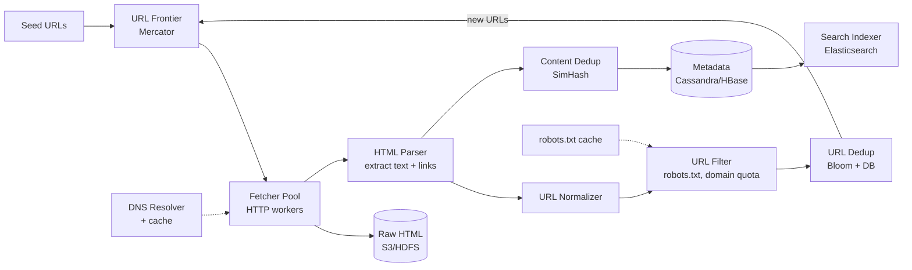
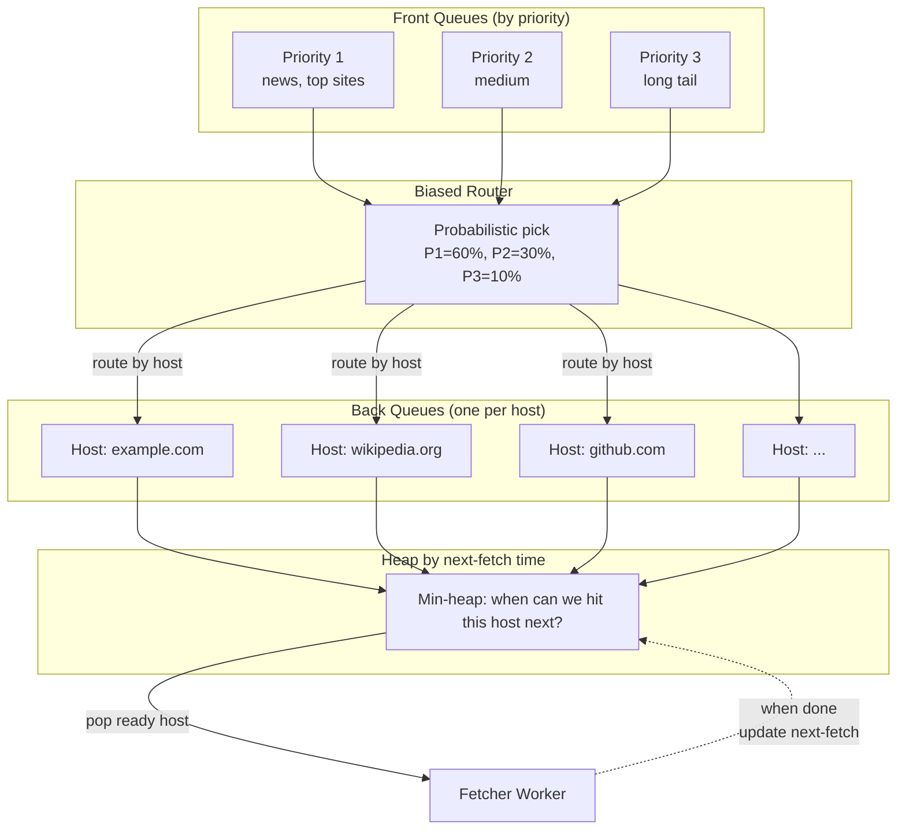
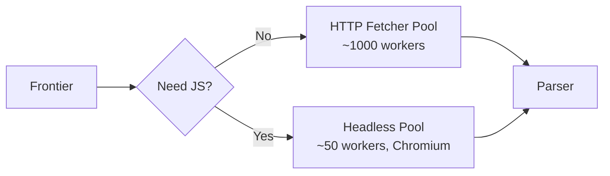

# System Design: Распределённый Web Crawler

Классический интервью-кейс уровня senior/staff. Crawler — это «двигатель» поисковика (Googlebot, Bingbot, Yandex). На собеседовании ценен тем, что покрывает почти весь стандартный bingo: distributed queues, sharding, dedup (Bloom + SimHash), rate limiting, DNS, retry, storage tiers, политики (robots.txt, politeness), edge cases (spider traps, JS-rendered pages).

Главный архитектурный артефакт — **URL Frontier** в стиле Mercator: разделённый на front (priority) и back (per-host) очереди. Всё остальное — обвязка вокруг него.

## Полезные ссылки

- [Mercator: A Scalable, Extensible Web Crawler (A. Heydon, M. Najork, 1999)](https://www.cindoc.csic.es/cybermetrics/pdf/68.pdf) — каноническая статья про дизайн frontier.
- [Heritrix — Internet Archive open-source crawler](https://github.com/internetarchive/heritrix3)
- [Common Crawl](https://commoncrawl.org/) — публичный архив 250B+ страниц.
- [Apache Nutch](https://nutch.apache.org/) — distributed crawler на Hadoop.
- [Designing Data-Intensive Applications, M. Kleppmann](https://dataintensive.net/) — про дедуп и storage.
- [System Design Primer — Web Crawler](https://github.com/donnemartin/system-design-primer)
- [Google's robots.txt specification](https://developers.google.com/search/docs/crawling-indexing/robots/robots_txt)

## Содержание

**Requirements и capacity**
- [Q1. (!) Функциональные требования к crawler-у?](#q1--функциональные-требования-к-crawler-у)
- [Q2. (!) Нефункциональные требования и SLA?](#q2--нефункциональные-требования-и-sla)
- [Q3. (!) Прикидка ёмкости на пальцах (back-of-the-envelope)?](#q3--прикидка-ёмкости-на-пальцах-back-of-the-envelope)

**High-level design**
- [Q4. (!) Высокоуровневая архитектура crawler-а?](#q4--высокоуровневая-архитектура-crawler-а)
- [Q5. Какой жизненный цикл проходит каждый URL?](#q5-какой-жизненный-цикл-проходит-каждый-url)

**URL Frontier (Mercator)**
- [Q6. (!) Что такое URL Frontier и почему он критичен?](#q6--что-такое-url-frontier-и-почему-он-критичен)
- [Q7. (!) Схема Mercator — front и back queues?](#q7--схема-mercator--front-и-back-queues)
- [Q8. BFS или DFS — что выбрать для обхода и почему?](#q8-bfs-или-dfs--что-выбрать-для-обхода-и-почему)
- [Q9. Как приоритизировать URLs во front queue?](#q9-как-приоритизировать-urls-во-front-queue)

**Politeness и robots.txt**
- [Q10. (!) Politeness — что это и как реализовать?](#q10--politeness--что-это-и-как-реализовать)
- [Q11. (!) robots.txt — как парсить и кэшировать?](#q11--robotstxt--как-парсить-и-кэшировать)
- [Q12. DNS resolution — почему это узкое место?](#q12-dns-resolution--почему-это-узкое-место)

**Fetcher и parsing**
- [Q13. Как устроен Fetcher worker?](#q13-как-устроен-fetcher-worker)
- [Q14. Как парсер извлекает текст и outlinks?](#q14-как-парсер-извлекает-текст-и-outlinks)
- [Q15. URL normalization — что и как нормализуем?](#q15-url-normalization--что-и-как-нормализуем)

**URL и content dedup**
- [Q16. (!) Как избежать повторного обхода одного URL?](#q16--как-избежать-повторного-обхода-одного-url)
- [Q17. (!) Content dedup — SimHash или MinHash?](#q17--content-dedup--simhash-или-minhash)

**Storage и search backend**
- [Q18. Где хранить raw HTML, метаданные и индекс?](#q18-где-хранить-raw-html-метаданные-и-индекс)
- [Q19. Схема Cassandra/HBase для URL state?](#q19-схема-cassandrahbase-для-url-state)

**Re-crawl и freshness**
- [Q20. Как решать, когда переобходить страницу?](#q20-как-решать-когда-переобходить-страницу)
- [Q21. Sitemap.xml — как использовать?](#q21-sitemapxml--как-использовать)

**Edge cases и traps**
- [Q22. (!) Spider traps — как детектить и обходить?](#q22--spider-traps--как-детектить-и-обходить)
- [Q23. JavaScript-рендеринг страниц — нужен ли headless browser?](#q23-javascript-рендеринг-страниц--нужен-ли-headless-browser)
- [Q24. Обработка сбоев — упал worker, retry, мёртвые URL?](#q24-обработка-сбоев--упал-worker-retry-мёртвые-url)

**Trade-offs**
- [Q25. (!) Централизованный или распределённый frontier?](#q25--централизованный-или-распределённый-frontier)
- [Q26. (!) Главные trade-offs дизайна?](#q26--главные-trade-offs-дизайна)

## Q1. (!) Функциональные требования к crawler-у?

Crawler **обходит веб** начиная с seed URLs и извлекает контент для последующего индексирования. Суть — замкнутый цикл «скачать страницу → достать ссылки → скачать страницы по ссылкам». На собеседовании сначала проговорите этот цикл, потом распишите его этапы.

Базовый функционал, который надо подтвердить с интервьюером:

- **Seed URLs** — на вход подаётся список starting points (например, топ-1000 сайтов мира + DMOZ-like директории).
- **Fetch HTML** — скачиваем страницу по HTTP/HTTPS, сохраняем raw response.
- **Extract content** — извлекаем текст для индексации, метаданные (`<title>`, meta description), structured data.
- **Extract outlinks** — парсим `<a href>`, нормализуем, кладём обратно в frontier.
- **Recurse** — повторяем процесс с новыми URLs.
- **Store** — raw HTML + parsed content в durable storage для downstream-сервисов (indexer, search).

Что **не** входит (типовой out-of-scope для собеседования) — важно очертить границы, чтобы не утонуть:

- Сам search backend (ranking, query parsing) — это `design-search-interview.md`.
- Indexer pipeline (построение inverted index) — отдельный сервис.
- Personalization, рендеринг страницы выдачи (SERP).

Уточняющие вопросы интервьюеру:

- Какие протоколы — только HTTP/HTTPS или ещё FTP, gopher? (обычно только HTTP/HTTPS).
- Обходим весь веб или вертикаль (news, e-commerce)? От этого зависит seed-стратегия.
- Нужна ли поддержка JavaScript-rendered SPA (React/Vue)? (требует отдельного pool с headless Chrome).
- Multi-language? Тогда UTF-8 + корректное определение charset.

## Q2. (!) Нефункциональные требования и SLA?

Эти цифры — фундамент всего дизайна: из них напрямую следуют объёмы хранилища, число воркеров и пропускная способность сети (см. Q3). Типовой набор для интервью:

| Параметр | Значение |
|----------|----------|
| Pages per month | **1 billion** |
| QPS (sustained) | ~400 fetches/sec |
| Peak QPS | ~1000 fetches/sec |
| Avg page size | ~100 KB |
| Page size range | 1 KB - 500 KB |
| Pages crawled total | ~50B URLs (известные + queued) |
| Freshness (important sites) | ≤ 7 дней (новостные — ≤ 1 час) |
| URL coverage target | 99% reachable web |
| Politeness | 1 req/sec/domain default |
| Crawl-delay override | respect robots.txt directive |

Дополнительные ограничения:

- **Соблюдение robots.txt** — обязательно, иначе IP забанят и заработаешь репутацию источника DDoS.
- **Bandwidth** — порядка 100 Gbps egress на регион; держим под мониторингом.
- **Отказоустойчивость** — потеря 10% воркеров не должна останавливать crawl.
- **Идемпотентность** — повторный обход того же URL даёт тот же state (если контент не менялся).

## Q3. (!) Прикидка ёмкости на пальцах (back-of-the-envelope)?

Цель прикидки — за минуту показать, что система реализуема и где её узкие места. Опорные цифры полезно знать наизусть.

**Storage**:

- 1B pages × 100 KB = **100 TB raw HTML / месяц**.
- При сжатии gzip (typical 3-5×) → ~25 TB compressed.
- Метаданные: URL (200B) + status + headers + timestamps + content-hash ≈ 500B/URL → 1B × 500B = **500 GB metadata/месяц**.
- Total per год: ~1.2 PB raw HTML, ~300 TB compressed.

**URL index** (frontier + visited set):

- 50B known URLs × 200B = **10 TB** URL DB (sharded по hash).
- Bloom filter для quick "seen" check: 50B URLs × 10 bits ≈ **60 GB RAM** (sharded across cluster).

**Bandwidth**:

- 400 fetches/sec × 100 KB = 40 MB/sec = **320 Mbps** sustained ingress.
- Peak: ~800 Mbps. С учётом overhead (DNS, retries, JS rendering) — закладываем 2 Gbps на регион.

**CPU/workers**:

- Один fetcher worker = ~50 concurrent requests (async I/O), один процесс ~10-20 RPS.
- 400 RPS → ~25-40 worker processes. Distribute across 5-10 хостов для fault tolerance.

**DNS**:

- 1 DNS lookup на новый домен; с кэшем TTL=1h hit ratio ~95%.
- Sustained: ~20 DNS lookups/sec → отдельный resolver cluster.

## Q4. (!) Высокоуровневая архитектура crawler-а?

Crawler — это замкнутый конвейер вокруг центральной очереди (Frontier): из неё берут URL, скачивают, парсят, извлекают новые ссылки и возвращают их обратно в очередь. Стандартная компонентная схема:



Главное в этой схеме:

- **Frontier — центральная структура**, всё крутится вокруг неё.
- Цикл замкнут: Parser → Filter → Dedup → Frontier (новые URLs возвращаются туда же).
- **Хранилище отделено от обработки**: raw HTML — в дешёвый object store (S3), метаданные — в быстрый column-store.
- DNS и robots.txt — **общие сервисы (shared services)**, кэшируются.

## Q5. Какой жизненный цикл проходит каждый URL?

От обнаружения ссылки до её повторного обхода URL проходит фиксированную цепочку этапов. Понимать её важно: каждый этап — это отдельный компонент системы, и на собеседовании по нему могут копнуть.

Lifecycle одного URL:

1. **Discovered** — extracted из outlinks или sitemap.
2. **Normalized** — canonical form (см. Q15).
3. **Dedup check** — был ли уже? (Bloom + DB lookup).
4. **Filter** — robots.txt allow? Domain quota не превышен? Не trap pattern?
5. **Queued** — добавлен в frontier с приоритетом.
6. **Politeness wait** — back queue per host, ждём slot.
7. **DNS resolve** — IP адрес домена (или cache hit).
8. **Fetched** — HTTP GET, follow redirects (limit 5).
9. **Parsed** — HTML → DOM → text + outlinks.
10. **Stored** — raw HTML в S3, metadata в Cassandra.
11. **Content dedup** — SimHash, если дубль контента — пометить.
12. **Outlinks** — каждый назад в шаг 1.
13. **Re-crawl scheduled** — по freshness policy.

States в URL DB: `discovered → queued → in_flight → fetched | error | filtered | duplicate`.

## Q6. (!) Что такое URL Frontier и почему он критичен?

**URL Frontier** — это распределённая priority queue, которая решает, **что и когда** скачивать. Это не просто «список URLs»: она одновременно балансирует три конфликтующих требования, и именно в этом сложность.

1. **Politeness** — не бить один домен чаще, чем разрешено.
2. **Priority** — важные страницы (высокий PageRank, news) скачивать первыми.
3. **Throughput** — воркеры всегда заняты, без простоя (idle time).

Почему наивная реализация (один FIFO) ломается — два конкретных провала:

- Если 90% URLs во frontier ведут на один домен, то либо мы забиваем его запросами (нарушаем politeness), либо все воркеры ждут своей очереди по этому домену и простаивают.
- Если очередь обрабатывается равномерно, то низкоприоритетные URLs обгоняют высокоприоритетные — свежесть и важные страницы страдают.

Решение разводит эти конфликты по двум уровням — **two-level queue (Mercator scheme)**: front queues отвечают за приоритет, back queues — за politeness (см. Q7).

## Q7. (!) Схема Mercator — front и back queues?

Каноническая двухуровневая схема из статьи Heydon & Najork (1999); используется в Heritrix и Nutch. Идея: разделить «что скачать в первую очередь» (приоритет) и «когда можно ударить по конкретному хосту» (politeness) на два независимых уровня очередей.



Как это работает, сверху вниз:

- **Front queues** — 3-5 очередей с разными приоритетами; высокоприоритетные обслуживаются чаще.
- **Biased router** — выбирает URL из front queue с вероятностью, пропорциональной приоритету (P1=60%, P2=30%, P3=10%).
- **Back queues** — **одна очередь на host**. Ключевая гарантия: URLs одного host не разлетаются по разным очередям, поэтому politeness можно контролировать в одной точке.
- **Heap по next-fetch time** — min-heap из пар (host, ready_time). Воркер берёт вершину — это хост, который готов к скачиванию раньше всех.
- Когда back queue **пустеет**, она пополняется из front queue (тем же хостом, если для него есть URLs; иначе берётся новый хост).

Почему эта конструкция закрывает все три требования из Q6:

- **Politeness** гарантирована: один host = одна очередь, ready_time соблюдается.
- **Priority** учитывается на уровне front queue.
- **Throughput**: воркеры не простаивают, пока heap не пуст.

Псевдокод воркера:
```python
while True:
    host, back_queue = heap.pop_min_ready_time()  # waits if needed
    url = back_queue.pop()
    response = fetcher.fetch(url)  # ~100ms-30s
    store(response)
    next_ready_time = now() + crawl_delay_for(host)
    if back_queue.empty():
        refill_from_front(back_queue, host)
    heap.push(host, next_ready_time)
```

## Q8. BFS или DFS — что выбрать для обхода и почему?

Короткий ответ: **BFS с приоритетами**. Веб — это граф, и формально применимы оба обхода, но на практике production-crawler всегда идёт вширь.

| Подход | Плюсы | Минусы |
|--------|-------|--------|
| **BFS** (в ширину) | Хорошее покрытие, естественная приоритизация (близкие к seed = более важные), легко параллелится | Память: frontier разрастается |
| **DFS** (в глубину) | Низкое потребление памяти | Можно надолго застрять в одном поддереве, плохое разнообразие (diversity), риск spider trap |

Почему все production-crawlers выбирают BFS (в стиле Mercator):

- BFS хорошо коррелирует с PageRank: страницы ближе к hub-узлам обычно важнее, и BFS добирается до них первыми.
- DFS опасен: попал в календарь `?page=1&date=2024-01-01` — и ушёл на 10000 уровней вниз, выкачивая мусор.
- BFS легко шардируется: уровни обхода независимы по разным частям графа.

**Нюанс:** с приоритетами это уже не чистый BFS, а **best-first search** — из frontier достаём не «самое старое», а «с максимальным приоритетом». То есть BFS задаёт общий каркас, а priority-функция (см. Q9) решает порядок внутри него.

## Q9. Как приоритизировать URLs во front queue?

Приоритет — это число (score), которым мы решаем, какой URL скачать раньше. Считаем его из нескольких сигналов, каждый отражает «насколько эта страница важна и насколько срочно её надо обойти»:

- **PageRank / авторитет домена** — старая, но рабочая метрика. Топ-1000 доменов получают priority 1.
- **Частота обновления** — news-сайты обновляются часто, поэтому им поднимаем приоритет ради свежести.
- **Глубина от seed** — глубокие страницы (depth > 5) опускаем в приоритете.
- **Давность последнего обхода** — если страница не обновлялась 30 дней, поднимаем приоритет на re-crawl.
- **Квота домена** — нельзя дать одному домену забить всю очередь.

Скоринг (упрощённо):

```python
def url_priority(url, meta):
    score = 0
    score += 100 * domain_authority(url.host)        # 0..100
    score += 50 if is_news_domain(url.host) else 0
    score -= 5 * meta.depth                          # глубокие хуже
    score += freshness_bonus(meta.last_crawled)      # давно не были — поднять
    return score
```

Технически front queue реализуют двумя способами: либо priority queue (heap по score), либо набор FIFO-очередей разной приоритетности с biased router (как в Mercator).

## Q10. (!) Politeness — что это и как реализовать?

**Politeness** — это правило «не вредить целевому сайту». Без неё crawler ведёт себя как DDoS-атака, и его быстро забанят по IP — поэтому politeness не опция, а условие выживания краулера.

Базовые правила:

- **1 запрос/сек на домен** по умолчанию.
- **Соблюдать crawl-delay** из robots.txt (может быть 5s, 10s, ...).
- **Последовательно, не параллельно** — не открывать 100 соединений к одному хосту одновременно.
- **Опознаваемый User-Agent** — `Mozilla/5.0 (compatible; MyCrawler/1.0; +https://example.com/bot)`, чтобы админ сайта мог с нами связаться.

Основная реализация — **back queue на хост + heap по ready_time** (см. Q7). Альтернатива — token bucket на хост:

```python
# Token bucket per host
class HostRateLimiter:
    def __init__(self, rate_per_sec):
        self.rate = rate_per_sec
        self.tokens = rate_per_sec
        self.last = time.time()

    def try_acquire(self):
        now = time.time()
        self.tokens = min(self.rate, self.tokens + (now - self.last) * self.rate)
        self.last = now
        if self.tokens >= 1:
            self.tokens -= 1
            return True
        return False
```

Почему back queue Mercator-а лучше: он масштабируется одним глобальным heap-ом вместо миллионов состояний bucket-ов в RAM.

Дополнительные аспекты politeness:

- **Bandwidth politeness** — не качать на полной скорости с одного сайта, даже если запросы разрешены.
- **Время суток** — некоторые crawlers замедляются в рабочие часы для конкретных доменов, чтобы не мешать живому трафику.
- **HTTP 429 / 503** — экспоненциальный backoff, а не слепой retry: сайт явно просит притормозить.

## Q11. (!) robots.txt — как парсить и кэшировать?

`https://example.com/robots.txt` — текстовый файл, в котором сайт описывает, что crawler-у можно, а что нельзя.

Пример:
```
User-agent: *
Disallow: /admin/
Disallow: /private/
Allow: /private/public-page

User-agent: MyBot
Disallow: /

Crawl-delay: 10
Sitemap: https://example.com/sitemap.xml
```

Логика проверки:

1. Перед первым fetch домена скачать `/robots.txt`.
2. Распарсить группы по `User-agent`: ищем точное совпадение с нашим UA, иначе fallback на `*`.
3. Внутри группы — упорядоченные правила `Allow`/`Disallow`.
4. Для проверки URL применить **longest-prefix match** (спецификация Google): побеждает правило с самым длинным совпавшим префиксом.
5. Если URL запрещён — отбросить.

**Кэширование** (robots.txt качать на каждый запрос нельзя — это лишний трафик и нагрузка на сайт):

- TTL: 24 часа (рекомендация Google).
- Ключ кэша: hostname.
- Хранилище: Redis cluster (sharded по host), backup в Cassandra.
- При 4xx (robots.txt нет) — считаем «всё разрешено», TTL = 24h.
- При 5xx — временно считаем «всё запрещено» (1 час) и повторяем попытку: сайт может быть просто недоступен, и лучше не нарушить чужие правила.

Псевдокод:

```python
def can_fetch(url, user_agent):
    robots = cache.get(url.host)
    if robots is None or robots.expired():
        robots = fetch_robots_txt(url.host)
        cache.set(url.host, robots, ttl=24*3600)
    return robots.allowed(url.path, user_agent)
```

Дополнительные директивы:

- `Crawl-delay: N` — минимум N секунд между запросами (переопределяет наш дефолт 1s).
- `Sitemap:` — URL карты сайта; используем для discovery (см. Q21).

## Q12. DNS resolution — почему это узкое место?

Перед скачиванием с нового домена нужно резолвить его имя в IP (A/AAAA record), и этот шаг неожиданно дорогой. При 400 RPS и cache hit ratio 95%:

- 400 × 0.05 = **20 DNS-запросов/сек**.
- Стандартный glibc DNS синхронный и блокирующий, ~10-50ms на запрос — то есть воркер на эти миллисекунды простаивает.

Откуда узкое место:

- **Дефолтный OS-резолвер** — обычно один-два сервера, легко перегрузить.
- **Дефолтный cache TTL** — приложение может его игнорировать, и кэш не работает.
- **Асинхронный резолвинг не из коробки** — нужны c-ares, aiodns или getaddrinfo_a.

Решение в production — снять резолвинг с критического пути:

- **Выделенный DNS-резолвер-кластер** — Unbound / BIND / dnsmasq, 4-8 хостов.
- **DNS-кэш на уровне приложения** — Redis или in-memory LRU с TTL 1 час (перекрывая слишком низкие TTL сайтов).
- **Асинхронный резолвер** (aiodns) — не блокирует event loop.
- **Прогрев (pre-warm)** — для seed-доменов сделать lookup при старте.

Полезные ссылки: см. `../architecture/dns-interview.md` и `../architecture/latency-numbers-interview.md`.

## Q13. Как устроен Fetcher worker?

Fetcher — это HTTP-клиент, который выполняет само скачивание страницы. Его задача — забрать ответ надёжно и экономно: не зависнуть на медленном сайте, не выкачать гигабайтный файл и по возможности не качать то, что не менялось.

Ключевые параметры:

| Параметр | Значение |
|----------|----------|
| Connect timeout | 5 sec |
| Read timeout | 30 sec |
| Max redirects | 5 |
| Max response size | 5 MB (cut-off для огромных файлов) |
| Concurrent connections (per worker) | 50-200 (async) |
| Retry attempts | 3 (на 5xx, network errors) |
| Backoff | exponential: 1s, 4s, 16s |

Важные HTTP-заголовки:

- `User-Agent: MyCrawler/1.0 (+https://example.com/bot)` — обязательно.
- `Accept: text/html, application/xhtml+xml, application/xml;q=0.9, */*;q=0.8`.
- `Accept-Encoding: gzip, deflate, br` — обязательно, экономит 3-5× трафика.
- `If-Modified-Since: <last_crawl_time>` — условный запрос, экономит bandwidth при re-crawl.
- `If-None-Match: <etag>` — то же самое, но по ETag.

Как работает Conditional GET (`If-Modified-Since` / `If-None-Match`) — ключевая экономия при повторных обходах:

- 304 Not Modified → тело не качаем, расходуем только заголовки.
- 200 OK → пришёл новый контент, обрабатываем как обычно.

Оптимизации сетевого уровня:

- **HTTP/2 multiplexing** — если сайт поддерживает, держим несколько streams через одно соединение.
- **SSL session cache** — переиспользуем TLS-handshake между запросами одного хоста.
- **Connection pooling** — пул на хост (см. Q10), не создаём новое соединение на каждый GET.

## Q14. Как парсер извлекает текст и outlinks?

Парсер делает три вещи: извлекает текстовый контент (для индексации), вытаскивает outlinks (новые ссылки для frontier) и собирает structured data (title, meta, canonical). Outlinks при этом сразу приводятся к абсолютному виду и очищаются от фрагментов.

Pipeline:

```python
def parse(html_bytes, base_url, content_type):
    # 1. Charset detection (BeautifulSoup умеет, или chardet)
    encoding = detect_encoding(html_bytes, content_type)
    html = html_bytes.decode(encoding, errors='replace')

    # 2. DOM parsing — lxml быстрее BeautifulSoup
    dom = lxml.html.fromstring(html)

    # 3. Outlinks
    outlinks = []
    for a in dom.xpath('//a[@href]'):
        href = a.get('href')
        absolute = urljoin(base_url, href)
        absolute = strip_fragment(absolute)
        outlinks.append(absolute)

    # 4. Text content (для indexing)
    text = dom.text_content()

    # 5. Metadata
    title = dom.findtext('.//title')
    meta_desc = extract_meta(dom, 'description')
    canonical = extract_canonical(dom)  # <link rel="canonical">

    return ParseResult(text, outlinks, title, meta_desc, canonical)
```

Тонкости, на которых легко споткнуться:

- **lxml** (C-расширение) намного быстрее чистого Python BeautifulSoup на больших объёмах.
- **Apache Tika** — универсальный экстрактор (PDF, DOC, HTML, XML), используется в Heritrix.
- **Jericho** (Java) — стандарт в Nutch.
- **Определение charset** — по приоритету: `<meta charset="...">`, заголовок Content-Type, BOM, fallback на chardet.
- **`rel="nofollow"`** — некоторые crawlers пропускают такие ссылки (Google учитывает формально).
- **`<link rel="canonical">`** — указывает на канонический URL, используем для дедупа.
- **Robots meta-теги** — `<meta name="robots" content="noindex,nofollow">` учитываем наравне с robots.txt.

## Q15. URL normalization — что и как нормализуем?

`http://Example.COM/path/?b=2&a=1#section` и `https://example.com/path?a=1&b=2` — это **один ресурс**, но разные строки. Без приведения к канонической форме дедуп (Q16) не сработает: один и тот же URL будет считаться разными, и мы скачаем его много раз. Цель нормализации — чтобы одинаковый ресурс всегда давал одинаковую строку.

Шаги нормализации:

1. **Схема** в нижний регистр: `HTTP` → `http`.
2. **Хост** в нижний регистр: `Example.COM` → `example.com`.
3. **Дефолтный порт** убрать: `:80` для http, `:443` для https.
4. **Percent-encoding** — декодировать где безопасно (`%7E` → `~`), кодировать где нужно.
5. **Путь** — разрешить сегменты `.` и `..`, убрать двойные `//`.
6. **Trailing slash** на корне оставляем `/`, на пути — единая политика (обычно убираем).
7. **Фрагмент** убрать: `#section` на сервер не уходит и ресурс не меняет.
8. **Query-параметры** — сортировать по ключу, убирать tracking-параметры (`utm_*`, `fbclid`, `gclid`).
9. **Session ID** — убирать (`jsessionid=...`, `phpsessid=...`): частая причина «штормов дубликатов», когда каждый визит даёт новый URL.
10. **Префикс WWW** — единая политика (обычно `www.example.com` ≡ `example.com`, но не всегда).

Псевдокод:

```python
import re
from urllib.parse import urlparse, urlunparse, parse_qsl, urlencode

TRACKING_PARAMS = {'utm_source', 'utm_medium', 'utm_campaign', 'utm_term',
                   'utm_content', 'fbclid', 'gclid', 'msclkid'}
SESSION_PATTERNS = re.compile(r'(jsessionid|phpsessid|sessionid)=[^&]*', re.I)

def normalize_url(url):
    p = urlparse(url)
    scheme = p.scheme.lower()
    host = p.hostname.lower()
    port = '' if (scheme == 'http' and p.port == 80) or \
                 (scheme == 'https' and p.port == 443) else f':{p.port}' if p.port else ''
    path = re.sub(r'/+', '/', p.path) or '/'

    # Sort + strip tracking + strip sessions
    params = [(k, v) for k, v in parse_qsl(p.query) if k.lower() not in TRACKING_PARAMS]
    params.sort()
    query = urlencode(params)
    query = SESSION_PATTERNS.sub('', query).strip('&')

    return urlunparse((scheme, host + port, path, '', query, ''))
```

Проверка корректности: после нормализации **одинаковый ресурс даёт одинаковую строку URL**.

## Q16. (!) Как избежать повторного обхода одного URL?

Проверять «видели ли мы уже этот URL» нужно для каждой из миллиардов ссылок, поэтому проверка должна быть и быстрой, и компактной по памяти. Отсюда двухуровневая схема: дешёвый, но приблизительный фильтр в RAM плюс точная проверка в БД только при попадании.

**Уровень 1 — Bloom filter** (in-memory, быстрый, приблизительный):

- Размер: 50B URLs × 10 бит ≈ 60 GB. Шардируется по hash(url) на 16-32 узла.
- Доля ложноположительных (false positive): ~1% — приемлемо для нашего сценария.
- Ложноотрицательных (false negative) **не бывает**: если Bloom говорит «не видел» — значит точно не видел.
- На ответе «возможно видел» идём на уровень 2 за точной проверкой.

```python
from pybloom_live import ScalableBloomFilter

bloom = ScalableBloomFilter(initial_capacity=1_000_000, error_rate=0.01)

def maybe_seen(url):
    return url in bloom  # True = возможно, False = точно нет

def mark_seen(url):
    bloom.add(url)
```

**Уровень 2 — шардированная URL DB** (RocksDB / Cassandra) — даёт точный ответ, когда Bloom сказал «возможно»:

- Ключ: `hash(url)` (8-16 байт) + строка url (для верификации, чтобы исключить hash-коллизию).
- Значение: state (`fetched | queued | error | filtered`) + таймстемпы.
- Шардирование: по hash(host) — так URLs одного host попадают на один shard, что упрощает per-host запросы.

Логика:

```python
def is_new_url(url):
    if not maybe_seen(url):     # Bloom: точно не видели
        return True
    # Bloom сказал «возможно» — проверяем DB
    return not url_db.exists(hash(url), url)

def register_url(url):
    bloom.add(url)
    url_db.put(hash(url), url, state='queued')
```

Почему именно Bloom + DB, а не что-то одно (сравнение по стоимости памяти):

- **Только hash-set** (без Bloom) — нужно 50B × 16B = 800 GB RAM, дорого.
- **Распределённый кэш (Redis)** — 50B ключей × ~50B = 2.5 TB Redis, тоже дорого.
- **Bloom + DB** — оптимальный компромисс: дешёвый RAM под Bloom, а точная проверка в БД только при попадании (1% случаев).

## Q17. (!) Content dedup — SimHash или MinHash?

Разные URLs могут вести на **один и тот же контент** (зеркала, syndication, copy-paste статей), поэтому одного URL-дедупа из Q16 мало — нужен дедуп по содержимому. Сложность в том, что страницы редко идентичны побитово: меняются дата генерации, реклама, A/B-варианты. Значит, нужно искать «почти дубликаты».

**Точный дедуп**: `SHA256(normalized_text)`. Работает только для побитово идентичных страниц и не ловит near-duplicates — для веба этого мало.

**Поиск near-duplicates** — две основные техники:

### SimHash (Charikar 2002, используется в Google)

- 64-битный отпечаток (fingerprint): каждый бит — знак взвешенной суммы хэшей фич документа.
- Два документа считаются похожими, если их SimHash отличается ≤ k бит (обычно k=3, Hamming distance).
- Сравнение мгновенное: bitwise XOR + popcount.

```python
def simhash(text, ngram=3):
    features = ngrams(tokenize(text), ngram)
    v = [0] * 64
    for f in features:
        h = hash64(f)
        for i in range(64):
            v[i] += 1 if (h >> i) & 1 else -1
    return sum((1 << i) for i in range(64) if v[i] > 0)

def near_duplicate(a, b, k=3):
    return bin(a ^ b).count('1') <= k
```

### MinHash + LSH (Broder 1997)

- Основан на множествах: документ = набор шинглов (k-грамм). Похожесть = Jaccard similarity.
- MinHash-сигнатура: для N хэш-функций берём min(hash(shingle)) → N-мерный вектор.
- LSH (Locality-Sensitive Hashing) раскладывает по bucket-ам, чтобы сравнивать лишь немногих кандидатов, а не всех со всеми.

| Критерий | SimHash | MinHash + LSH |
|---------|---------|---------------|
| Что меряет | Cosine similarity по взвешенным фичам | Jaccard similarity множеств |
| Скорость сравнения | XOR + popcount — мгновенно | Сравнение векторов, медленнее |
| Память на документ | 64-128 бит | 100-200 hash-значений |
| Индекс для поиска | Bit-bucket index | LSH buckets |
| Где применяют | Google web crawler | Hadoop, рекомендации |

**Вывод для web crawler:** SimHash — быстро и компактно. MinHash выигрывает там, где у документа явная set-структура (например, корзины пользователей).

Хранение и поиск кандидатов:
- В Cassandra: колонка `simhash bigint` рядом с метаданными URL.
- Индекс: bit-permutation tables (Manku et al. 2007) — ищут кандидатов на расстоянии ≤ k бит за O(log n), а не полным перебором.

## Q18. Где хранить raw HTML, метаданные и индекс?

Главный принцип — **многоуровневое хранилище (tiered storage)**: у разных данных разный профиль доступа, поэтому и системы под них разные. Raw HTML читают редко и большими батчами — ему подходит дешёвый object store; метаданные нужны постоянно и с низкой задержкой — им нужен быстрый column-store.

| Тип данных | Storage | Reason |
|-----------|---------|--------|
| Raw HTML (compressed) | **S3 / HDFS** | дёшево ($0.023/GB), durable, read-once-then-cold |
| URL metadata, state | **Cassandra / HBase** | high write throughput, wide-column, sharded по host |
| Visited URLs (bloom + index) | **Sharded RocksDB cluster** | low-latency point lookups |
| Robots.txt cache | **Redis cluster** | TTL, fast lookup |
| Full-text index | **Elasticsearch / Solr** | downstream search |
| SimHash index | **Cassandra + custom permutation tables** | near-dup queries |
| Crawl logs | **Kafka → ClickHouse** | analytics, debugging |

Ссылки внутри cheatsheet:
- `../databases/elasticsearch-interview.md` — про индексацию текста.
- `../databases/database-sharding-interview.md` — sharding strategies.
- `../messaging/kafka-interview.md` — Kafka как backbone между этапами.
- `../algorithms/data-structures/hash-tables-interview.md` — bloom filter подробно.

**Жизненный цикл данных** (чем старше, тем дешевле хранилище):

- Raw HTML: горячий → S3 Standard (30 дней) → S3 IA (90 дней) → Glacier.
- Метаданные горячие всегда — они нужны для решений о re-crawl.
- Логи — TTL 30 дней.

## Q19. Схема Cassandra/HBase для URL state?

Главное в схеме — **партиционирование по host**, чтобы все URLs одного хоста лежали рядом: это ускоряет наполнение frontier и упрощает per-host politeness. Пример схемы Cassandra:

```sql
CREATE TABLE crawl.url_state (
    host_shard int,           -- partition key: hash(host) % N
    host text,                -- clustering
    url_hash blob,            -- clustering (хэш для compact key)
    url text,                 -- full URL для verification
    state text,               -- queued | in_flight | fetched | error | filtered
    priority int,
    depth int,
    last_crawled_at timestamp,
    next_crawl_at timestamp,
    http_status int,
    content_hash blob,        -- SHA256 для exact-dup
    simhash bigint,           -- near-dup detection
    fetch_count int,
    error_count int,
    error_msg text,
    PRIMARY KEY ((host_shard), host, url_hash)
);

CREATE INDEX ON crawl.url_state (next_crawl_at);  -- для re-crawl scheduler
```

Что даёт партиционирование по `(host_shard)`:

- **Локальность по host**: все URLs одного host в одной партиции → быстрый scan при наполнении frontier.
- **Параллелизм**: разные hosts ложатся на разные ноды.
- **Удобно для politeness**: per-host операции выполняются на одном узле.

Отдельная таблица для outlinks (граф ссылок):

```sql
CREATE TABLE crawl.outlinks (
    from_url_hash blob,
    to_url_hash blob,
    anchor_text text,
    PRIMARY KEY (from_url_hash, to_url_hash)
);
```

Outlinks нужны downstream-пайплайну для расчёта PageRank.

## Q20. Как решать, когда переобходить страницу?

Это **freshness policy** — компромисс между свежестью данных и бюджетом crawler-а: переобходить всё подряд слишком дорого, поэтому частоту настраиваем по сигналам, насколько вероятно, что страница изменилась.

Сигналы для приоритета re-crawl:

- **Заголовок Last-Modified / доля 304 на `If-Modified-Since`** — если страница часто отвечает 304, понижаем частоту обхода.
- **Тип домена** — news = ежечасно, e-commerce = ежедневно, статья 2010 года = раз в год.
- **PageRank / трафик** — популярные страницы переобходим чаще.
- **Замеренная частота изменений** — exponential moving average по diff-ам последних обходов.

Простой планировщик:

```python
def next_crawl_time(url_meta):
    base_interval = {
        'news': timedelta(hours=1),
        'blog': timedelta(days=1),
        'evergreen': timedelta(days=30),
    }[classify(url_meta)]

    # adaptive: если контент не менялся последние N crawls, удваиваем interval
    if url_meta.consecutive_unchanged >= 3:
        base_interval *= 2

    return url_meta.last_crawled + base_interval
```

Архитектурно это отдельный **Re-crawl Scheduler service**:
- Периодически сканирует `WHERE next_crawl_at < now()`.
- Кладёт подошедшие URLs обратно в frontier с приоритетом.
- Реализуется через таблицу Cassandra TWCS или Redis sorted set с ключом `next_crawl_at`.

## Q21. Sitemap.xml — как использовать?

`Sitemap.xml` — это **подсказка от сайта**: «вот мои важные URL и вот когда они обновляются». Главная ценность — discovery без обхода: URLs можно класть прямо во frontier, минуя цепочку «скачать страницу → распарсить → достать ссылки».

Формат (упрощённо):
```xml
<urlset>
  <url>
    <loc>https://example.com/article/1</loc>
    <lastmod>2026-05-20</lastmod>
    <changefreq>weekly</changefreq>
    <priority>0.8</priority>
  </url>
  ...
</urlset>
```

Как используем:

- **Discovery** — берём URLs прямо во frontier, минуя обход и парсинг ради поиска ссылок.
- **Lastmod** — если `lastmod` ≤ нашего last_crawled, страницу можно пропустить (не менялась).
- **Changefreq / Priority** — входные сигналы для re-crawl policy.
- **Sitemap index** — для огромных сайтов sitemap может ссылаться на другие sitemaps.

Где искать:
- `/sitemap.xml` (стандартный путь).
- Директива `Sitemap:` в `robots.txt`.

Для крупных сайтов (e-commerce с миллионами товаров) sitemaps **существенно ускоряют** discovery — иначе пришлось бы добираться до товаров обходом по ссылкам.

## Q22. (!) Spider traps — как детектить и обходить?

**Spider trap** — паттерн, генерирующий бесконечное количество URLs, причём часто это один и тот же контент под разными адресами. Без защиты crawler уходит в такую ловушку навсегда, тратя бюджет впустую. Поэтому нужны и детект, и жёсткие лимиты.

Типичные примеры:

- **Бесконечный календарь**: `/calendar?date=2050-01-01`, `?date=2050-01-02`, ... — каждая страница ссылается на следующий день.
- **Session ID в URL**: `/page?sid=xyz123` — каждый визит даёт новый sid, то есть каждый раз «новый» URL.
- **Глубокая рекурсия**: `/dir/dir/dir/.../page` — относительные ссылки `../foo`, к которым забыли применить нормализацию.
- **Фасетная навигация**: `/search?color=red&size=M&brand=...` — N×M×K комбинаций фильтров.
- **Пагинация**: `/?page=1`, `?page=2`, ... вплоть до `?page=99999` на пустых страницах пагинации.

Детект и меры (mitigation):

| Trap | Detection | Mitigation |
|------|-----------|------------|
| Infinite depth | depth > 10-15 | hard depth limit per domain |
| Session IDs | URL normalize удаляет (Q15) | normalize обязательно |
| Faceted nav | content SimHash повторяется | content dedup отбрасывает |
| Per-domain explosion | quota: max 100K URLs/domain | hard cap |
| Same-pattern URLs | regex pattern frequency | URL pattern blacklist (auto-detect: 1000+ URLs с одинаковым path шаблоном) |
| Calendar traps | path matches `/\d{4}/\d{2}/\d{2}` + date > today+30d | date-based heuristic |

Самый универсальный сигнал — **одинаковость контента**: если 100 разных URLs дают почти идентичный SimHash, это либо ловушка, либо технический шум — в обоих случаях снижаем приоритет.

Жёсткие лимиты в коде (последняя линия обороны):

```python
MAX_DEPTH = 15
MAX_URLS_PER_DOMAIN = 1_000_000  # реально >1M на крупных сайтах
MAX_PATH_LENGTH = 256
MAX_QUERY_PARAMS = 20
```

Превышение лимита → URL помечается filtered и во frontier не попадает.

## Q23. JavaScript-рендеринг страниц — нужен ли headless browser?

Современные SPA (React/Vue/Angular) отдают **пустой HTML + JS**: обычный HTTP-fetch получает `<div id="root"></div>` без контента, индексировать нечего. Чтобы достать реальный контент, страницу нужно отрендерить как браузер.

Решение — **headless browser** (Puppeteer / Playwright / Splash):

- Загружает страницу, исполняет JS, ждёт `DOMContentLoaded`, нужный селектор или таймаут (5-10s).
- Возвращает уже отрендеренный HTML.

Минусы — почему это нельзя включать на всё подряд:

- **В 20-50× медленнее** обычного HTTP (cold-start Chrome, CPU, память).
- ~100 MB RAM на один инстанс браузера.
- Сложнее масштабировать.

Поэтому архитектурно выносим рендеринг в **отдельный pool**:



Как решить, нужен ли вообще JS (чтобы не платить 20-50× зря):

- **Эвристика**: сначала забираем обычный HTML; если есть `<noscript>`-предупреждение, или `<body>` почти пустой (< 1KB текста), или одни `<script src=*.js>` без статичного контента — перезабираем через JS pool.
- **Whitelist доменов** — известные SPA-домены сразу направляем в JS pool.
- **По стоимости**: для top-N доменов рендерим JS, для long tail ограничиваемся HTML.

Альтернативы headless-рендерингу:

- **Prerender.io / Rendertron** — внешние сервисы рендеринга.
- **Schema.org / JSON-LD** в обычном HTML — часто структурированные данные доступны и без JS.

## Q24. Обработка сбоев — упал worker, retry, мёртвые URL?

На масштабе миллиардов страниц сбои на любом этапе — норма, а не исключение. Поэтому система должна сама восстанавливать «зависшие» URL и по-разному реагировать на временные и постоянные ошибки.

**Падение воркера:**

- Воркер умер с URL «в полёте» → его state остался `in_flight`, и URL завис.
- Решение — **liveness-проверка + lease timeout**: у state `in_flight` есть timestamp; если прошло > 5 минут, считаем воркер мёртвым и возвращаем URL во frontier (state `queued`).

```sql
UPDATE url_state SET state = 'queued'
WHERE state = 'in_flight' AND in_flight_since < now() - 5min;
```

**HTTP-ошибки — реакция зависит от того, временная ошибка или постоянная:**

| HTTP Status | Action |
|-------------|--------|
| 200, 201, 203, 206 | success, store, parse |
| 301, 302, 307, 308 | follow redirect (limit 5), update canonical URL |
| 304 Not Modified | skip body, update last_crawled |
| 400, 404 | permanent fail, mark `dead`, don't retry |
| 401, 403 | permanent fail, possibly auth required |
| 410 Gone | hard delete from index |
| 429 Too Many Requests | exponential backoff, увеличить crawl-delay |
| 500, 502, 503, 504 | retry with backoff (3 attempts), затем mark `error` |
| Network timeout | retry up to 3 times |
| DNS NXDOMAIN | permanent fail, mark `dead` |

**Уборка мёртвых URL:**

- URLs с consecutive_errors > 5 → state `dead`, TTL 90 дней, затем удаление.
- `dead`-URLs во frontier не возвращаем — это защита от самозаспама.

**Персистентность frontier — критично:**

- Frontier хранится в durable storage (Cassandra / Kafka log), а не только в памяти.
- При рестарте кластера URLs не теряются.
- Оригинальный Mercator использовал disk-backed очереди.

## Q25. (!) Централизованный или распределённый frontier?

Короткий ответ: на старте — централизованный (проще), на масштабе Google — распределённый по `hash(host)`. Два паттерна:

### Централизованный frontier

Один кластер (оригинальный Mercator, Heritrix). Все воркеры конкурируют за задачи из общего frontier.

| Плюсы | Минусы |
|-------|--------|
| Простая логика politeness (один heap) | Узкое место на frontier-сервисе |
| Легко перебалансировать | Single point of failure (нужна репликация) |
| Глобальная видимость приоритетов | Сложно масштабировать за пределы одного DC |

### Распределённый frontier (Google-scale)

Партиционирование по `hash(host)`: каждый shard целиком владеет своим подмножеством доменов.

| Плюсы | Минусы |
|-------|--------|
| Линейное масштабирование | Cross-shard URLs: нашли в shard-1 ссылку на host из shard-2 → надо её туда передать |
| Politeness локальна (один shard = свои хосты) | Сложнее перебалансировать |
| Изоляция сбоев | Hot shards, если один host доминирует |

На практике **большие crawlers — распределённые**:

- Шардируем по `hash(host) mod N_shards` (например, 256).
- Внутри каждого shard — frontier в стиле Mercator.
- Cross-shard outlinks передаются через Kafka topic `outlinks-to-shard-N`.

```mermaid
flowchart LR
    Worker[Worker in Shard 1] -->|extracted outlink<br/>for host in shard 5| Kafka[Kafka<br/>topic outlinks]
    Kafka -->|partitioned by<br/>hash(host)| Shard5[Frontier Shard 5]
```

Подробнее про распределённые системы — `../architecture/distributed-systems-interview.md`, `../architecture/scalability-patterns-interview.md`.

## Q26. (!) Главные trade-offs дизайна?

Сводная таблица на последние минуты собеседования: по каждому решению — две опции и выбор с обоснованием. Если успеете проговорить её, покажете, что видите систему целиком, а не отдельные куски.

| Trade-off | Опция A | Опция B | Что выбираем и почему |
|-----------|---------|---------|----------------------|
| Traversal order | DFS | BFS + priority | **BFS + priority** — лучшее покрытие, контроль глубины |
| Frontier | Centralized | Distributed (sharded) | **Distributed** для scale, **Centralized** для simplicity на старте |
| Dedup | Hash set (exact) | Bloom + DB | **Bloom + DB** — memory-efficient, точность по запросу |
| Content dedup | SHA256 (exact) | SimHash | **SimHash** — ловит near-duplicates, mirrors, syndication |
| Politeness | Token bucket | Per-host back queue | **Per-host queue (Mercator)** — лучше scales |
| robots.txt | Per-fetch check | Cached TTL 24h | **Cached** — обязательно, иначе сам себя DDoS-ишь |
| JS rendering | Все страницы | Selective (по signal) | **Selective** — JS render в 20-50× дороже |
| Storage HTML | All hot in DB | S3 + tiered | **S3 + tiered** — дёшево, durable, downstream batch |
| URL state DB | Single SQL | Cassandra/HBase sharded | **Cassandra** — write-heavy, partition by host |
| Re-crawl | Fixed interval | Adaptive по change freq | **Adaptive** — экономит бюджет |
| Discovery | Crawl only | Crawl + sitemap.xml | **Crawl + sitemap** — sitemap ускоряет 10-100× |
| Spider traps | Pray | Depth limit + pattern detect + content sim | **Все три**, иначе бесконечный crawl |
| Failure | Best effort | Lease + retry + state machine | **Lease+retry** — для idempotency |

Главный мета-принцип: **frontier — это сердце системы**. Если frontier спроектирован правильно (politeness + priority + persistence), всё остальное — обвязка вокруг него. Если же frontier — простой FIFO, у вас не crawler, а генератор DDoS.

---

## See also

- [System Design Interview (общий)](./system-design-interview.md)
- [Design Search](./design-search-interview.md)
- [Design Twitter](./design-twitter-interview.md)
- [Scalability Patterns](../architecture/scalability-patterns-interview.md)
- [Distributed Systems](../architecture/distributed-systems-interview.md)
- [DNS Interview](../architecture/dns-interview.md)
- [Latency Numbers](../architecture/latency-numbers-interview.md)
- [Elasticsearch](../databases/elasticsearch-interview.md)
- [Database Sharding](../databases/database-sharding-interview.md)
- [Kafka](../messaging/kafka-interview.md)
- [Hash Tables (Bloom filter)](../algorithms/data-structures/hash-tables-interview.md)
