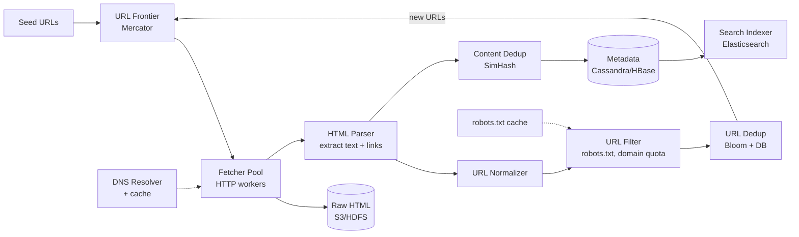
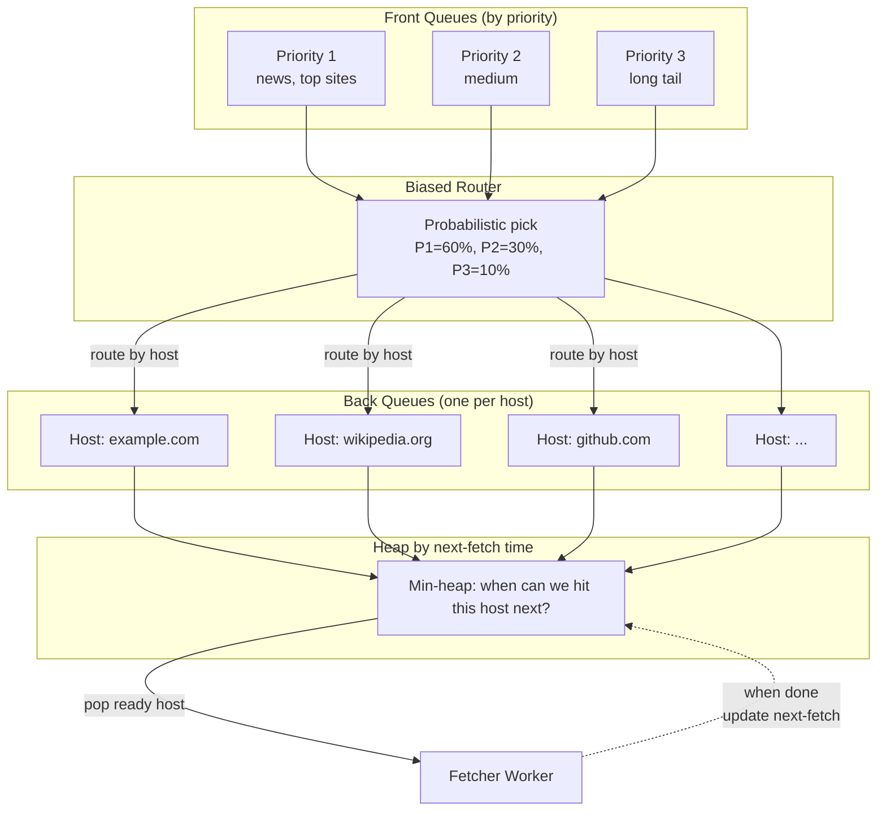
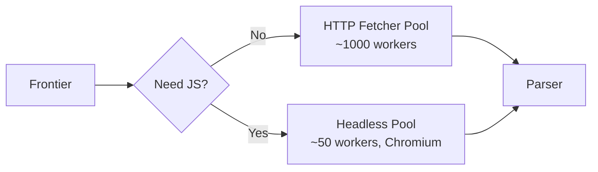

# System Design: Распределённый Web Crawler

Классический интервью-кейс уровня senior/staff. Crawler — это «двигатель» поисковика (Googlebot, Bingbot, Yandex). На собеседовании ценен тем, что покрывает почти весь стандартный bingo: distributed queues, sharding, dedup (Bloom + SimHash), rate limiting, DNS, retry, storage tiers, политики (robots.txt, politeness), edge cases (spider traps, JS-rendered pages).

Главный архитектурный артефакт — **URL Frontier** в стиле Mercator: разделённый на front (priority) и back (per-host) очереди. Всё остальное — обвязка вокруг него.

## Полезные ссылки

- [Mercator: A Scalable, Extensible Web Crawler (A. Heydon, M. Najork, 1999)](https://www.cindoc.csic.es/cybermetrics/pdf/68.pdf) — каноническая статья про дизайн frontier.
- [Heritrix — Internet Archive open-source crawler](https://github.com/internetarchive/heritrix3)
- [Common Crawl](https://commoncrawl.org/) — публичный архив 250B+ страниц.
- [Apache Nutch](https://nutch.apache.org/) — distributed crawler на Hadoop.
- [Designing Data-Intensive Applications, M. Kleppmann](https://dataintensive.net/) — про дедуп и storage.
- [System Design Primer — Web Crawler](https://github.com/donnemartin/system-design-primer)
- [Google's robots.txt specification](https://developers.google.com/search/docs/crawling-indexing/robots/robots_txt)

## Содержание

**Requirements и capacity**
- [Q1. (!) Functional requirements?](#q1--functional-requirements)
- [Q2. (!) Non-functional requirements и SLA?](#q2--non-functional-requirements-и-sla)
- [Q3. (!) Back-of-the-envelope capacity estimation?](#q3--back-of-the-envelope-capacity-estimation)

**High-level design**
- [Q4. (!) Высокоуровневая архитектура crawler-а?](#q4--высокоуровневая-архитектура-crawler-а)
- [Q5. Какой цикл проходит каждый URL?](#q5-какой-цикл-проходит-каждый-url)

**URL Frontier (Mercator)**
- [Q6. (!) Что такое URL Frontier и почему он критичен?](#q6--что-такое-url-frontier-и-почему-он-критичен)
- [Q7. (!) Mercator scheme — front и back queues?](#q7--mercator-scheme--front-и-back-queues)
- [Q8. BFS vs DFS — что выбрать и почему?](#q8-bfs-vs-dfs--что-выбрать-и-почему)
- [Q9. Как приоритизировать URLs во front queue?](#q9-как-приоритизировать-urls-во-front-queue)

**Politeness и robots.txt**
- [Q10. (!) Politeness — что это и как реализовать?](#q10--politeness--что-это-и-как-реализовать)
- [Q11. (!) robots.txt — как парсить и кэшировать?](#q11--robotstxt--как-парсить-и-кэшировать)
- [Q12. DNS resolution — почему это узкое место?](#q12-dns-resolution--почему-это-узкое-место)

**Fetcher и parsing**
- [Q13. Как устроен Fetcher worker?](#q13-как-устроен-fetcher-worker)
- [Q14. Parser и extraction outlinks?](#q14-parser-и-extraction-outlinks)
- [Q15. URL normalization — что и как нормализуем?](#q15-url-normalization--что-и-как-нормализуем)

**URL и content dedup**
- [Q16. (!) Как избежать повторного обхода одного URL?](#q16--как-избежать-повторного-обхода-одного-url)
- [Q17. (!) Content dedup — SimHash vs MinHash?](#q17--content-dedup--simhash-vs-minhash)

**Storage и search backend**
- [Q18. Где хранить raw HTML, метаданные, индекс?](#q18-где-хранить-raw-html-метаданные-индекс)
- [Q19. Cassandra/HBase schema для URL state?](#q19-cassandrahbase-schema-для-url-state)

**Re-crawl и freshness**
- [Q20. Как решать когда переобходить страницу?](#q20-как-решать-когда-переобходить-страницу)
- [Q21. Sitemap.xml — как использовать?](#q21-sitemapxml--как-использовать)

**Edge cases и traps**
- [Q22. (!) Spider traps — как детектить и обходить?](#q22--spider-traps--как-детектить-и-обходить)
- [Q23. JavaScript-rendered страницы — headless browser?](#q23-javascript-rendered-страницы--headless-browser)
- [Q24. Failure handling — упал worker, retry, dead URLs?](#q24-failure-handling--упал-worker-retry-dead-urls)

**Trade-offs**
- [Q25. (!) Centralized vs distributed frontier?](#q25--centralized-vs-distributed-frontier)
- [Q26. (!) Главные trade-offs дизайна?](#q26--главные-trade-offs-дизайна)

## Q1. (!) Functional requirements?

Crawler — это сервис, который **обходит веб** начиная с seed URLs и извлекает контент для дальнейшего индексирования.

Базовый функционал, который надо подтвердить с интервьюером:

- **Seed URLs** — на вход подаётся список starting points (например, топ-1000 сайтов мира + DMOZ-like директории).
- **Fetch HTML** — скачиваем страницу по HTTP/HTTPS, сохраняем raw response.
- **Extract content** — извлекаем текст для индексации, метаданные (`<title>`, meta description), structured data.
- **Extract outlinks** — парсим `<a href>`, нормализуем, кладём обратно в frontier.
- **Recurse** — повторяем процесс с новыми URLs.
- **Store** — raw HTML + parsed content в durable storage для downstream-сервисов (indexer, search).

Что **не** входит (typical out-of-scope для собеседования):

- Сам search backend (ranking, query parsing) — это `design-search-interview.md`.
- Indexer pipeline (inverted index building) — отдельный сервис.
- Personalization, SERP rendering.

Уточняющие вопросы интервьюеру:

- Какие протоколы — только HTTP/HTTPS или ещё FTP, gopher? (обычно только HTTP/HTTPS).
- Crawl whole web или vertical (news, e-commerce)? Это меняет seed strategy.
- Нужна ли поддержка JavaScript-rendered SPA (React/Vue)? (отдельный pool с headless Chrome).
- Multi-language? UTF-8 + правильный charset detection.

## Q2. (!) Non-functional requirements и SLA?

Цифры, на которые опирается весь дизайн (типовые для интервью):

| Параметр | Значение |
|----------|----------|
| Pages per month | **1 billion** |
| QPS (sustained) | ~400 fetches/sec |
| Peak QPS | ~1000 fetches/sec |
| Avg page size | ~100 KB |
| Page size range | 1 KB - 500 KB |
| Pages crawled total | ~50B URLs (известные + queued) |
| Freshness (important sites) | ≤ 7 дней (новостные — ≤ 1 час) |
| URL coverage target | 99% reachable web |
| Politeness | 1 req/sec/domain default |
| Crawl-delay override | respect robots.txt directive |

Дополнительные ограничения:

- **Robots.txt compliance** — обязательно (иначе IP-banned, репутация DDoS-источника).
- **Bandwidth** — order of 100 Gbps egress per region; мониторим.
- **Fault tolerance** — потеря 10% workers не должна остановить crawl.
- **Idempotency** — повторный обход того же URL даёт тот же state (если контент не менялся).

## Q3. (!) Back-of-the-envelope capacity estimation?

Опорные цифры — их полезно знать наизусть.

**Storage**:

- 1B pages × 100 KB = **100 TB raw HTML / месяц**.
- При сжатии gzip (typical 3-5×) → ~25 TB compressed.
- Метаданные: URL (200B) + status + headers + timestamps + content-hash ≈ 500B/URL → 1B × 500B = **500 GB metadata/месяц**.
- Total per год: ~1.2 PB raw HTML, ~300 TB compressed.

**URL index** (frontier + visited set):

- 50B known URLs × 200B = **10 TB** URL DB (sharded по hash).
- Bloom filter для quick "seen" check: 50B URLs × 10 bits ≈ **60 GB RAM** (sharded across cluster).

**Bandwidth**:

- 400 fetches/sec × 100 KB = 40 MB/sec = **320 Mbps** sustained ingress.
- Peak: ~800 Mbps. С учётом overhead (DNS, retries, JS rendering) — закладываем 2 Gbps на регион.

**CPU/workers**:

- Один fetcher worker = ~50 concurrent requests (async I/O), один процесс ~10-20 RPS.
- 400 RPS → ~25-40 worker processes. Distribute across 5-10 хостов для fault tolerance.

**DNS**:

- 1 DNS lookup на новый домен; с кэшем TTL=1h hit ratio ~95%.
- Sustained: ~20 DNS lookups/sec → отдельный resolver cluster.

## Q4. (!) Высокоуровневая архитектура crawler-а?

Стандартная компонентная схема:



Главное в этой схеме:

- **Frontier — центральная структура**, всё крутится вокруг неё.
- Цикл замкнут: Parser → Filter → Dedup → Frontier (новые URLs туда же).
- **Storage отделён** от processing: raw HTML в дешёвый object store (S3), метаданные в быстрой column-store.
- DNS и robots.txt — **shared services**, кэшируются.

## Q5. Какой цикл проходит каждый URL?

Lifecycle одного URL:

1. **Discovered** — extracted из outlinks или sitemap.
2. **Normalized** — canonical form (см. Q15).
3. **Dedup check** — был ли уже? (Bloom + DB lookup).
4. **Filter** — robots.txt allow? Domain quota не превышен? Не trap pattern?
5. **Queued** — добавлен в frontier с приоритетом.
6. **Politeness wait** — back queue per host, ждём slot.
7. **DNS resolve** — IP адрес домена (или cache hit).
8. **Fetched** — HTTP GET, follow redirects (limit 5).
9. **Parsed** — HTML → DOM → text + outlinks.
10. **Stored** — raw HTML в S3, metadata в Cassandra.
11. **Content dedup** — SimHash, если дубль контента — пометить.
12. **Outlinks** — каждый назад в шаг 1.
13. **Re-crawl scheduled** — по freshness policy.

States в URL DB: `discovered → queued → in_flight → fetched | error | filtered | duplicate`.

## Q6. (!) Что такое URL Frontier и почему он критичен?

**URL Frontier** — это distributed priority queue, которая решает **что и когда** скачивать. Это не просто «список URLs», а структура, которая балансирует одновременно три требования:

1. **Politeness** — не бить один домен чаще, чем разрешено.
2. **Priority** — важные страницы (high PageRank, news) скачивать первыми.
3. **Throughput** — workers всегда заняты (нет idle time).

Наивная реализация (один FIFO) ломается:

- Если 90% URLs из frontier ведут на один домен → либо забиваем его (нарушаем politeness), либо все workers ждут (idle).
- Если queue равномерная → low-priority URLs обгоняют high-priority.

Решение — **two-level queue (Mercator scheme)**: front queues для приоритета, back queues для politeness.

## Q7. (!) Mercator scheme — front и back queues?

Каноническая схема из статьи Heydon & Najork (1999), используется в Heritrix, Nutch.



Как это работает:

- **Front queues** (например, 3-5 очередей с разными приоритетами). Высокоприоритетные обслуживаются чаще.
- **Biased router** — выбирает URL из front queue с вероятностью пропорциональной приоритету.
- **Back queues** — **одна очередь на host**. Гарантия: URLs одного host не разлетаются по разным очередям → politeness легко контролировать.
- **Heap по next-fetch time** — min-heap (host, ready_time). Worker берёт top — это host, готовый к скачиванию раньше всех.
- Когда back queue **пустеет** — пополняется из front queue (тот же host, если есть; иначе новый).

Свойства:

- Politeness гарантирована (один host = одна очередь, ready_time соблюдается).
- Priority учитывается через front queue.
- Workers никогда не простаивают, если heap не пуст.

Pseudo-code worker:
```python
while True:
    host, back_queue = heap.pop_min_ready_time()  # waits if needed
    url = back_queue.pop()
    response = fetcher.fetch(url)  # ~100ms-30s
    store(response)
    next_ready_time = now() + crawl_delay_for(host)
    if back_queue.empty():
        refill_from_front(back_queue, host)
    heap.push(host, next_ready_time)
```

## Q8. BFS vs DFS — что выбрать и почему?

Web crawl — это traversal графа, и формально применимы оба подхода.

| Подход | Плюсы | Минусы |
|--------|-------|--------|
| **BFS** (breadth-first) | Хорошее покрытие, естественное приоритезирование (близкие к seed = более важные), легко параллелится | Память — frontier разрастается |
| **DFS** (depth-first) | Низкое потребление памяти | Можно надолго застрять в одном поддереве, плохая diversity, риск spider trap |

**На практике все production-crawlers используют BFS с приоритетами** (Mercator-style). Почему:

- BFS близко коррелирует с PageRank: страницы ближе к hub-узлам обычно важнее.
- DFS опасен: попал в `?page=1&date=2024-01-01` календарь — ушёл на 10000 уровней вниз.
- BFS легко sharded: уровни обхода независимы по сторонам графа.

С приоритетами это уже не чистый BFS, а **best-first search**: достаём из frontier не «самое старое», а «с максимальным приоритетом».

## Q9. Как приоритизировать URLs во front queue?

Сигналы для priority score:

- **PageRank / domain authority** — старая, но рабочая метрика. Топ-1000 доменов имеют priority 1.
- **Update frequency** — news сайты обновляются часто, ставим priority выше для freshness.
- **Depth from seed** — глубокие страницы (depth > 5) опускаем в priority.
- **Last-crawled age** — если страница не обновлялась 30 дней, поднимаем приоритет (re-crawl).
- **Domain quota** — нельзя дать одному домену забить всю очередь.

Скоринг (упрощённо):

```python
def url_priority(url, meta):
    score = 0
    score += 100 * domain_authority(url.host)        # 0..100
    score += 50 if is_news_domain(url.host) else 0
    score -= 5 * meta.depth                          # глубокие хуже
    score += freshness_bonus(meta.last_crawled)      # давно не были — поднять
    return score
```

Front queue — это либо priority queue (heap по score), либо набор FIFO разной приоритетности с biased router (как в Mercator).

## Q10. (!) Politeness — что это и как реализовать?

**Politeness** — не вредить целевому сайту. Без неё crawler выглядит как DDoS-атака и его быстро забанят по IP.

Базовые правила:

- **1 request/sec/domain** по умолчанию.
- **Respect crawl-delay** из robots.txt (может быть 5s, 10s, ...).
- **Sequential, не parallel** — не открывать 100 connections к одному host одновременно.
- **Identifying User-Agent** — `Mozilla/5.0 (compatible; MyCrawler/1.0; +https://example.com/bot)` — чтобы admin сайта мог связаться.

Реализация — **per-host back queue + heap by ready_time** (см. Q7). Альтернатива — token bucket:

```python
# Token bucket per host
class HostRateLimiter:
    def __init__(self, rate_per_sec):
        self.rate = rate_per_sec
        self.tokens = rate_per_sec
        self.last = time.time()

    def try_acquire(self):
        now = time.time()
        self.tokens = min(self.rate, self.tokens + (now - self.last) * self.rate)
        self.last = now
        if self.tokens >= 1:
            self.tokens -= 1
            return True
        return False
```

Mercator-back-queue лучше масштабируется (один глобальный heap вместо millions of bucket states в RAM).

Дополнительно:

- **Bandwidth politeness** — не качать на полной скорости с одного сайта, даже если allowed.
- **Time-of-day** — некоторые crawlers замедляются в bizhours для конкретных доменов.
- **HTTP 429 / 503** — backoff exponential, не просто retry.

## Q11. (!) robots.txt — как парсить и кэшировать?

`https://example.com/robots.txt` — текстовый файл, описывает что можно/нельзя crawler-у.

Пример:
```
User-agent: *
Disallow: /admin/
Disallow: /private/
Allow: /private/public-page

User-agent: MyBot
Disallow: /

Crawl-delay: 10
Sitemap: https://example.com/sitemap.xml
```

Логика:

1. Перед первым fetch домена — скачать `/robots.txt`.
2. Распарсить группы по `User-agent` (точное совпадение с нашим UA → fallback на `*`).
3. Для каждой группы — упорядоченные `Allow`/`Disallow` правила.
4. Применить **longest-prefix match** (Google спец) для проверки URL.
5. Если URL запрещён — отбросить.

**Кэширование**:

- TTL: 24 часа (Google рекомендация).
- Cache key: hostname.
- Storage: Redis cluster (sharded по host), backup в Cassandra.
- При 4xx (no robots.txt) — считаем «всё разрешено», cache TTL = 24h.
- При 5xx — считаем «всё запрещено» временно (1 час), retry.

Pseudo-code:

```python
def can_fetch(url, user_agent):
    robots = cache.get(url.host)
    if robots is None or robots.expired():
        robots = fetch_robots_txt(url.host)
        cache.set(url.host, robots, ttl=24*3600)
    return robots.allowed(url.path, user_agent)
```

Дополнительные директивы:

- `Crawl-delay: N` — минимум N секунд между запросами (переопределяет наш default 1s).
- `Sitemap:` — URL карты сайта, использовать для discovery (см. Q21).

## Q12. DNS resolution — почему это узкое место?

Каждый новый домен = DNS lookup (A/AAAA record). При 400 RPS и cache hit ratio 95%:

- 400 × 0.05 = **20 DNS lookups/sec**.
- Standard glibc DNS — synchronous, blocking, ~10-50ms.

Проблемы:

- **Default OS resolver** — обычно один или два сервера, легко overload.
- **Default cache TTL** — может игнорироваться приложением.
- **Async resolution не из коробки** — нужен c-ares, aiodns, getaddrinfo_a.

Решение в production:

- **Dedicated DNS resolver cluster** — Unbound / BIND / dnsmasq, 4-8 хостов.
- **Application-level DNS cache** — Redis или in-memory LRU, TTL 1 час (overriding low TTLs).
- **Async resolver** (aiodns) — не блокирует event loop.
- **Pre-warm** — для seed доменов сделать lookup при старте.

Полезные ссылки: см. `../architecture/dns-interview.md` и `../architecture/latency-numbers-interview.md`.

## Q13. Как устроен Fetcher worker?

Fetcher — это HTTP клиент, который выполняет фактический скачивание.

Ключевые параметры:

| Параметр | Значение |
|----------|----------|
| Connect timeout | 5 sec |
| Read timeout | 30 sec |
| Max redirects | 5 |
| Max response size | 5 MB (cut-off для огромных файлов) |
| Concurrent connections (per worker) | 50-200 (async) |
| Retry attempts | 3 (на 5xx, network errors) |
| Backoff | exponential: 1s, 4s, 16s |

HTTP-headers (важные):

- `User-Agent: MyCrawler/1.0 (+https://example.com/bot)` — обязательно.
- `Accept: text/html, application/xhtml+xml, application/xml;q=0.9, */*;q=0.8`.
- `Accept-Encoding: gzip, deflate, br` — обязательно, экономия 3-5× на трафике.
- `If-Modified-Since: <last_crawl_time>` — для условного запроса, экономит bandwidth при re-crawl.
- `If-None-Match: <etag>` — то же самое с ETag.

Conditional GET с `If-Modified-Since`:
- 304 Not Modified → не качаем тело, экономим bandwidth.
- 200 OK → новый контент.

Дополнительно:

- **HTTP/2 multiplexing** — если сайт поддерживает, можем держать несколько streams через одно connection.
- **SSL session cache** — переиспользуем TLS handshake между запросами одного хоста.
- **Connection pooling** — pool per-host (см. Q10), не создаём новое connection на каждый GET.

## Q14. Parser и extraction outlinks?

Парсер делает три вещи: extract text content, extract outlinks, extract structured data.

Pipeline:

```python
def parse(html_bytes, base_url, content_type):
    # 1. Charset detection (BeautifulSoup умеет, или chardet)
    encoding = detect_encoding(html_bytes, content_type)
    html = html_bytes.decode(encoding, errors='replace')

    # 2. DOM parsing — lxml быстрее BeautifulSoup
    dom = lxml.html.fromstring(html)

    # 3. Outlinks
    outlinks = []
    for a in dom.xpath('//a[@href]'):
        href = a.get('href')
        absolute = urljoin(base_url, href)
        absolute = strip_fragment(absolute)
        outlinks.append(absolute)

    # 4. Text content (для indexing)
    text = dom.text_content()

    # 5. Metadata
    title = dom.findtext('.//title')
    meta_desc = extract_meta(dom, 'description')
    canonical = extract_canonical(dom)  # <link rel="canonical">

    return ParseResult(text, outlinks, title, meta_desc, canonical)
```

Тонкости:

- **lxml** (C-extension) намного быстрее pure-python BeautifulSoup на больших объёмах.
- **Apache Tika** — универсальный экстрактор (PDF, DOC, HTML, XML), используется в Heritrix.
- **Jericho** (Java) — стандарт в Nutch.
- **Charset detection** — `<meta charset="...">`, Content-Type header, BOM, fallback chardet.
- **`rel="nofollow"`** — некоторые crawlers пропускают (Google формально считает).
- **`<link rel="canonical">`** — указывает на канонический URL, используем для dedup.
- **Robots meta tags** — `<meta name="robots" content="noindex,nofollow">` — учитываем.

## Q15. URL normalization — что и как нормализуем?

URL `http://Example.COM/path/?b=2&a=1#section` и `https://example.com/path?a=1&b=2` — это **один и тот же ресурс**, но разные строки. Без нормализации дедуп не работает.

Шаги нормализации:

1. **Scheme** lowercase: `HTTP` → `http`.
2. **Host** lowercase: `Example.COM` → `example.com`.
3. **Default port** убрать: `:80` для http, `:443` для https.
4. **Percent-encoding** — decode где безопасно (`%7E` → `~`), encode где нужно.
5. **Path** — resolve `.` и `..` segments, убрать `//`.
6. **Trailing slash** на корне: оставить `/`, на пути — единая политика (обычно убирать).
7. **Fragment** убрать: `#section` не идёт на сервер.
8. **Query params** — сортировать по ключу, убирать tracking-params (`utm_*`, `fbclid`, `gclid`).
9. **Session IDs** — убирать (`jsessionid=...`, `phpsessid=...`) — частая причина duplicate-storms.
10. **WWW prefix** — единая политика (обычно `www.example.com` ≡ `example.com`, но не всегда).

Pseudo-code:

```python
import re
from urllib.parse import urlparse, urlunparse, parse_qsl, urlencode

TRACKING_PARAMS = {'utm_source', 'utm_medium', 'utm_campaign', 'utm_term',
                   'utm_content', 'fbclid', 'gclid', 'msclkid'}
SESSION_PATTERNS = re.compile(r'(jsessionid|phpsessid|sessionid)=[^&]*', re.I)

def normalize_url(url):
    p = urlparse(url)
    scheme = p.scheme.lower()
    host = p.hostname.lower()
    port = '' if (scheme == 'http' and p.port == 80) or \
                 (scheme == 'https' and p.port == 443) else f':{p.port}' if p.port else ''
    path = re.sub(r'/+', '/', p.path) or '/'

    # Sort + strip tracking + strip sessions
    params = [(k, v) for k, v in parse_qsl(p.query) if k.lower() not in TRACKING_PARAMS]
    params.sort()
    query = urlencode(params)
    query = SESSION_PATTERNS.sub('', query).strip('&')

    return urlunparse((scheme, host + port, path, '', query, ''))
```

Проверочный смысл — после нормализации **одинаковый ресурс даёт одинаковую строку URL**.

## Q16. (!) Как избежать повторного обхода одного URL?

Двухуровневая схема dedup:

**Уровень 1 — Bloom filter** (in-memory, fast):

- Размер: 50B URLs × 10 bits = ~60 GB. Sharded по hash(url) на 16-32 узла.
- False positive rate: ~1% (нормально для нашего use case).
- False negatives: **исключены** — если Bloom говорит «не видел», то точно не видел.
- На «возможно видел» — идём в уровень 2.

```python
from pybloom_live import ScalableBloomFilter

bloom = ScalableBloomFilter(initial_capacity=1_000_000, error_rate=0.01)

def maybe_seen(url):
    return url in bloom  # True = возможно, False = точно нет

def mark_seen(url):
    bloom.add(url)
```

**Уровень 2 — Sharded URL DB** (RocksDB / Cassandra):

- Key: `hash(url)` (8-16 байт) + url string (для verification).
- Value: state (`fetched | queued | error | filtered`) + timestamps.
- Sharding: по hash(host) — так URLs одного host попадают на один shard (упрощает per-host queries).

Логика:

```python
def is_new_url(url):
    if not maybe_seen(url):     # Bloom: точно не видели
        return True
    # Bloom сказал «возможно» — проверяем DB
    return not url_db.exists(hash(url), url)

def register_url(url):
    bloom.add(url)
    url_db.put(hash(url), url, state='queued')
```

Альтернативные подходы:

- **Hash-only set** (без bloom) — нужно 50B × 16B = 800 GB RAM, дорого.
- **Distributed cache (Redis)** — 50B keys × ~50B = 2.5 TB Redis, тоже дорого.
- **Bloom + DB** — сладкое пятно: дешёвый RAM, точная проверка только при попадании.

## Q17. (!) Content dedup — SimHash vs MinHash?

Разные URLs могут вести на **один и тот же content** (зеркала, mirrors, syndication, copy-paste статьи). Нужен **content-based** dedup.

**Exact dedup**: `SHA256(normalized_text)`. Работает только для побитово идентичных страниц. Не ловит near-duplicates (отличия в дате генерации, рекламе, A/B-варианты).

**Near-duplicate detection** — две основные техники:

### SimHash (Charikar 2002, используется Google)

- 64-битный fingerprint, в котором каждый бит = знак weighted sum of feature hashes.
- Два документа «похожи», если их SimHash отличается ≤ k бит (typical k=3, Hamming distance).
- Очень быстро: bitwise XOR + popcount.

```python
def simhash(text, ngram=3):
    features = ngrams(tokenize(text), ngram)
    v = [0] * 64
    for f in features:
        h = hash64(f)
        for i in range(64):
            v[i] += 1 if (h >> i) & 1 else -1
    return sum((1 << i) for i in range(64) if v[i] > 0)

def near_duplicate(a, b, k=3):
    return bin(a ^ b).count('1') <= k
```

### MinHash + LSH (Broder 1997)

- Set-based: документ = set of shingles (k-gram). Similarity = Jaccard.
- MinHash signature: для N hash functions берём min(hash(shingle)) → N-мерный вектор.
- LSH (Locality-Sensitive Hashing) — bucketing, чтобы кандидатов на сравнение было мало.

| Метрика | SimHash | MinHash + LSH |
|---------|---------|---------------|
| Что меряет | Cosine similarity weighted features | Jaccard similarity sets |
| Скорость сравнения | XOR + popcount — мгновенно | Vector comparison, slower |
| Память на документ | 64-128 бит | 100-200 hash values |
| Индекс для retrieval | Bit-bucket index | LSH buckets |
| Где используют | Google web crawler | Hadoop, recommendation |

**На практике** для web crawler — SimHash (быстро и компактно). MinHash лучше для документов с явной set-структурой (e.g., user baskets).

Хранение:
- В Cassandra: `simhash bigint` колонка рядом с URL metadata.
- Index: bit-permutation tables (Manku et al. 2007) для поиска ≤ k-bit-distance кандидатов за O(log n).

## Q18. Где хранить raw HTML, метаданные, индекс?

Tiered storage — разные данные в разные системы.

| Тип данных | Storage | Reason |
|-----------|---------|--------|
| Raw HTML (compressed) | **S3 / HDFS** | дёшево ($0.023/GB), durable, read-once-then-cold |
| URL metadata, state | **Cassandra / HBase** | high write throughput, wide-column, sharded по host |
| Visited URLs (bloom + index) | **Sharded RocksDB cluster** | low-latency point lookups |
| Robots.txt cache | **Redis cluster** | TTL, fast lookup |
| Full-text index | **Elasticsearch / Solr** | downstream search |
| SimHash index | **Cassandra + custom permutation tables** | near-dup queries |
| Crawl logs | **Kafka → ClickHouse** | analytics, debugging |

Ссылки внутри cheatsheet:
- `../databases/elasticsearch-interview.md` — про индексацию текста.
- `../databases/database-sharding-interview.md` — sharding strategies.
- `../messaging/kafka-interview.md` — Kafka как backbone между этапами.
- `../algorithms/data-structures/hash-tables-interview.md` — bloom filter подробно.

**Lifecycle data**:

- Raw HTML hot → S3 Standard (30 дней) → S3 IA (90 дней) → Glacier.
- Метаданные hot всегда (нужны для re-crawl decisions).
- Logs — TTL 30 дней.

## Q19. Cassandra/HBase schema для URL state?

Пример Cassandra schema:

```sql
CREATE TABLE crawl.url_state (
    host_shard int,           -- partition key: hash(host) % N
    host text,                -- clustering
    url_hash blob,            -- clustering (хэш для compact key)
    url text,                 -- full URL для verification
    state text,               -- queued | in_flight | fetched | error | filtered
    priority int,
    depth int,
    last_crawled_at timestamp,
    next_crawl_at timestamp,
    http_status int,
    content_hash blob,        -- SHA256 для exact-dup
    simhash bigint,           -- near-dup detection
    fetch_count int,
    error_count int,
    error_msg text,
    PRIMARY KEY ((host_shard), host, url_hash)
);

CREATE INDEX ON crawl.url_state (next_crawl_at);  -- для re-crawl scheduler
```

Партиционирование по `(host_shard)` обеспечивает:

- **Локальность по host**: URLs одного host в одной партиции → быстрый scan для frontier refill.
- **Параллелизм**: разные hosts на разные node.
- **Politeness friendly**: per-host операции на одном узле.

Отдельная таблица для outlinks (graph):

```sql
CREATE TABLE crawl.outlinks (
    from_url_hash blob,
    to_url_hash blob,
    anchor_text text,
    PRIMARY KEY (from_url_hash, to_url_hash)
);
```

Outlinks нужны для PageRank computation в downstream pipeline.

## Q20. Как решать когда переобходить страницу?

**Freshness policy** — компромисс между свежестью данных и бюджетом crawler-а.

Сигналы для re-crawl priority:

- **Last-Modified header** / `If-Modified-Since` 304 ratio — если страница часто 304, понижаем частоту.
- **Domain type** — news сайт = ежечасно, e-commerce = ежедневно, статья 2010 года = раз в год.
- **PageRank / traffic** — популярные страницы re-crawl чаще.
- **Detected change frequency** — exponential moving average по diffs последних crawls.

Простой scheduler:

```python
def next_crawl_time(url_meta):
    base_interval = {
        'news': timedelta(hours=1),
        'blog': timedelta(days=1),
        'evergreen': timedelta(days=30),
    }[classify(url_meta)]

    # adaptive: если контент не менялся последние N crawls, удваиваем interval
    if url_meta.consecutive_unchanged >= 3:
        base_interval *= 2

    return url_meta.last_crawled + base_interval
```

Архитектурно — отдельный **Re-crawl Scheduler service**:
- Periodic scan `WHERE next_crawl_at < now()`.
- Кладёт URLs обратно в frontier с приоритетом.
- Можно реализовать через Cassandra TWCS таблицу или Redis sorted set по `next_crawl_at`.

## Q21. Sitemap.xml — как использовать?

`Sitemap.xml` — это **подсказка** от сайта: «вот мои важные URL, вот когда они обновляются».

Формат (упрощённо):
```xml
<urlset>
  <url>
    <loc>https://example.com/article/1</loc>
    <lastmod>2026-05-20</lastmod>
    <changefreq>weekly</changefreq>
    <priority>0.8</priority>
  </url>
  ...
</urlset>
```

Использование:

- **Discovery** — берём URLs прямо в frontier (минуем crawl + parse шага для discovery).
- **Lastmod** — если `lastmod` <= нашего last_crawled, можно скипнуть.
- **Changefreq / Priority** — input в re-crawl policy.
- **Sitemap index** — для огромных сайтов, sitemap может ссылаться на другие sitemaps.

Где искать:
- `/sitemap.xml` (стандарт).
- `Sitemap:` директива в `robots.txt`.

Sitemaps **существенно ускоряют** discovery для крупных сайтов (e-commerce с миллионами товаров).

## Q22. (!) Spider traps — как детектить и обходить?

**Spider trap** — паттерн, который генерирует бесконечное количество URLs (часто one-and-the-same content под разными URL).

Типичные примеры:

- **Infinite calendar**: `/calendar?date=2050-01-01`, `?date=2050-01-02`, ... — каждая страница ссылается на следующий день.
- **Session IDs in URL**: `/page?sid=xyz123`, каждый visit = новый sid → каждый раз «новый» URL.
- **Deep recursion**: `/dir/dir/dir/.../page` — относительные ссылки `../foo` забывают применять normalization.
- **Faceted navigation**: `/search?color=red&size=M&brand=...` — N×M×K комбинаций.
- **Pagination**: `/?page=1`, `?page=2`, ... вплоть до `?page=99999` для пустых пагинаций.

Detection и mitigation:

| Trap | Detection | Mitigation |
|------|-----------|------------|
| Infinite depth | depth > 10-15 | hard depth limit per domain |
| Session IDs | URL normalize удаляет (Q15) | normalize обязательно |
| Faceted nav | content SimHash повторяется | content dedup отбрасывает |
| Per-domain explosion | quota: max 100K URLs/domain | hard cap |
| Same-pattern URLs | regex pattern frequency | URL pattern blacklist (auto-detect: 1000+ URLs с одинаковым path шаблоном) |
| Calendar traps | path matches `/\d{4}/\d{2}/\d{2}` + date > today+30d | date-based heuristic |

Полезный сигнал — **content sameness**: если 100 URLs дают почти идентичный SimHash, это либо trap, либо технический шум — снижаем приоритет.

Hard limits в коде:

```python
MAX_DEPTH = 15
MAX_URLS_PER_DOMAIN = 1_000_000  # реально >1M на крупных сайтах
MAX_PATH_LENGTH = 256
MAX_QUERY_PARAMS = 20
```

Превышение → URL filtered, в frontier не попадает.

## Q23. JavaScript-rendered страницы — headless browser?

Современные SPA (React/Vue/Angular) возвращают **пустой HTML + JS**. Plain HTTP fetch получает `<div id="root"></div>` без контента.

Решение — **headless browser** (Puppeteer / Playwright / Splash):

- Загружает страницу, исполняет JS, ждёт `DOMContentLoaded` / specific selector / timeout (5-10s).
- Возвращает rendered HTML.

Минусы:

- **20-50× медленнее** plain HTTP (cold-start Chrome, CPU, memory).
- ~100 MB RAM per browser instance.
- Сложнее масштабировать.

Архитектура — **отдельный pool**:



Как решить «нужен ли JS»:

- **Heuristic**: fetch plain HTML → если `<noscript>` warning, или `<body>` почти пустой (< 1KB text), или есть `<script src=*.js>` без статичного контента → re-fetch через JS pool.
- **Domain whitelist** — известные SPA доменам сразу в JS pool.
- **Cost-based**: для top-N доменов рендерим JS; long tail — только HTML.

Альтернативы:

- **Prerender.io / Rendertron** — внешние сервисы.
- **Schema.org / JSON-LD** в plain HTML — часто структурированные данные доступны без JS.

## Q24. Failure handling — упал worker, retry, dead URLs?

Failures на любом этапе — норма. Что предусматриваем:

**Worker failure**:

- Worker умер с in-flight URL → URL state остался `in_flight`.
- **Liveness check** + lease timeout: state `in_flight` с timestamp; если > 5 min → возвращаем в frontier (state `queued`).

```sql
UPDATE url_state SET state = 'queued'
WHERE state = 'in_flight' AND in_flight_since < now() - 5min;
```

**HTTP errors** — разные стратегии:

| HTTP Status | Action |
|-------------|--------|
| 200, 201, 203, 206 | success, store, parse |
| 301, 302, 307, 308 | follow redirect (limit 5), update canonical URL |
| 304 Not Modified | skip body, update last_crawled |
| 400, 404 | permanent fail, mark `dead`, don't retry |
| 401, 403 | permanent fail, possibly auth required |
| 410 Gone | hard delete from index |
| 429 Too Many Requests | exponential backoff, увеличить crawl-delay |
| 500, 502, 503, 504 | retry with backoff (3 attempts), затем mark `error` |
| Network timeout | retry up to 3 times |
| DNS NXDOMAIN | permanent fail, mark `dead` |

**Dead URLs cleanup**:

- URLs с consecutive_errors > 5 → state `dead`, TTL 90 дней, потом удалить.
- Не возвращаем `dead` в frontier (защита от заспама).

**Persistence of frontier** — критично:

- Frontier хранится в durable storage (Cassandra / Kafka log), не in-memory only.
- При restart cluster URLs не теряются.
- Mercator оригинальный использовал disk-backed queues.

## Q25. (!) Centralized vs distributed frontier?

Два паттерна:

### Centralized frontier

Один cluster (Mercator оригинальный, Heritrix). Все workers конкурируют за tasks из shared frontier.

| Плюсы | Минусы |
|-------|--------|
| Простая логика politeness (один heap) | Bottleneck на frontier service |
| Легко перебалансировать | Single point of failure (нужна репликация) |
| Глобальная видимость priority | Сложно scale за пределы одного DC |

### Distributed frontier (Google-scale)

Партиционирование по `hash(host)`. Каждый shard владеет subset доменов целиком.

| Плюсы | Минусы |
|-------|--------|
| Линейный scale | Cross-shard URLs (нашли в shard-1 outlink на host из shard-2 → надо передать) |
| Politeness локальна (одна шарда = свои хосты) | Сложнее перебалансировать |
| Изоляция failures | Hot shards если один host доминирует |

В реальности **большие crawlers — distributed**:

- Shard по `hash(host) mod N_shards` (например, 256).
- Внутри shard — Mercator-style frontier.
- Cross-shard outlinks отправляются через Kafka topic `outlinks-to-shard-N`.

```mermaid
flowchart LR
    Worker[Worker in Shard 1] -->|extracted outlink<br/>for host in shard 5| Kafka[Kafka<br/>topic outlinks]
    Kafka -->|partitioned by<br/>hash(host)| Shard5[Frontier Shard 5]
```

Подробнее про распределённые системы — `../architecture/distributed-systems-interview.md`, `../architecture/scalability-patterns-interview.md`.

## Q26. (!) Главные trade-offs дизайна?

Финальная сводка для финальных минут собеседования.

| Trade-off | Опция A | Опция B | Что выбираем и почему |
|-----------|---------|---------|----------------------|
| Traversal order | DFS | BFS + priority | **BFS + priority** — лучшее покрытие, контроль глубины |
| Frontier | Centralized | Distributed (sharded) | **Distributed** для scale, **Centralized** для simplicity на старте |
| Dedup | Hash set (exact) | Bloom + DB | **Bloom + DB** — memory-efficient, точность по запросу |
| Content dedup | SHA256 (exact) | SimHash | **SimHash** — ловит near-duplicates, mirrors, syndication |
| Politeness | Token bucket | Per-host back queue | **Per-host queue (Mercator)** — лучше scales |
| robots.txt | Per-fetch check | Cached TTL 24h | **Cached** — обязательно, иначе сам себя DDoS-ишь |
| JS rendering | Все страницы | Selective (по signal) | **Selective** — JS render в 20-50× дороже |
| Storage HTML | All hot in DB | S3 + tiered | **S3 + tiered** — дёшево, durable, downstream batch |
| URL state DB | Single SQL | Cassandra/HBase sharded | **Cassandra** — write-heavy, partition by host |
| Re-crawl | Fixed interval | Adaptive по change freq | **Adaptive** — экономит бюджет |
| Discovery | Crawl only | Crawl + sitemap.xml | **Crawl + sitemap** — sitemap ускоряет 10-100× |
| Spider traps | Pray | Depth limit + pattern detect + content sim | **Все три**, иначе бесконечный crawl |
| Failure | Best effort | Lease + retry + state machine | **Lease+retry** — для idempotency |

Главный мета-принцип: **frontier — это сердце системы**. Если frontier дизайн правильный (politeness + priority + persistent), всё остальное обвязка. Если frontier — простой FIFO, у вас не crawler, а DDoS-генератор.

---

## See also

- [System Design Interview (общий)](./system-design-interview.md)
- [Design Search](./design-search-interview.md)
- [Design Twitter](./design-twitter-interview.md)
- [Scalability Patterns](../architecture/scalability-patterns-interview.md)
- [Distributed Systems](../architecture/distributed-systems-interview.md)
- [DNS Interview](../architecture/dns-interview.md)
- [Latency Numbers](../architecture/latency-numbers-interview.md)
- [Elasticsearch](../databases/elasticsearch-interview.md)
- [Database Sharding](../databases/database-sharding-interview.md)
- [Kafka](../messaging/kafka-interview.md)
- [Hash Tables (Bloom filter)](../algorithms/data-structures/hash-tables-interview.md)
