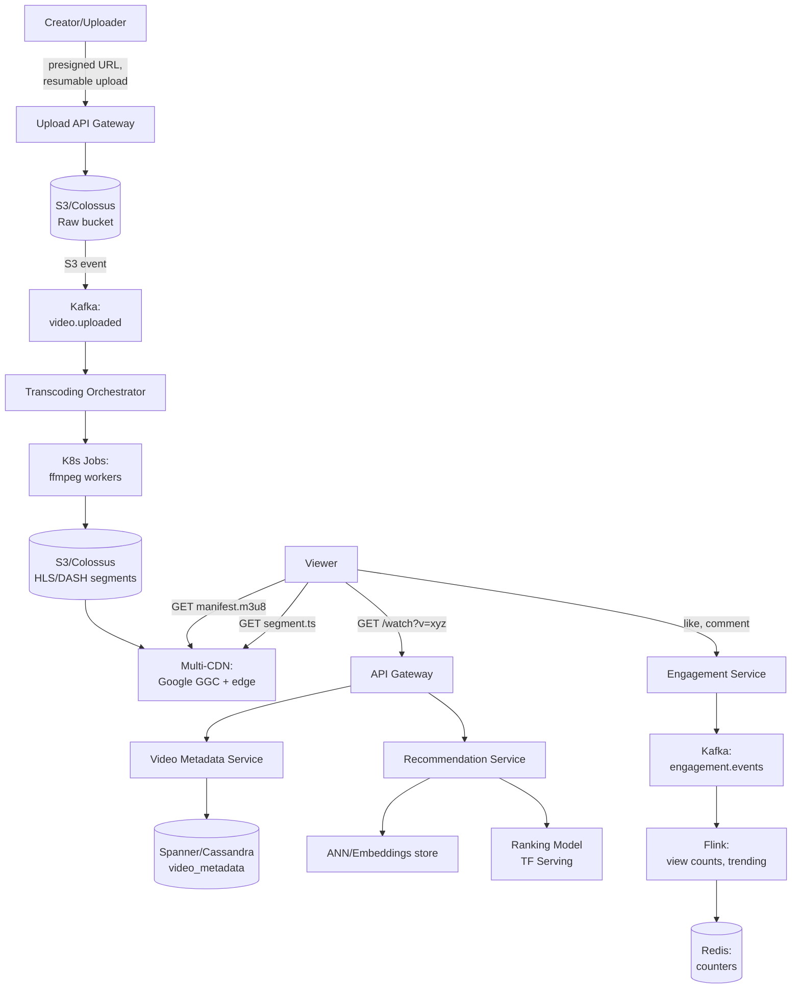
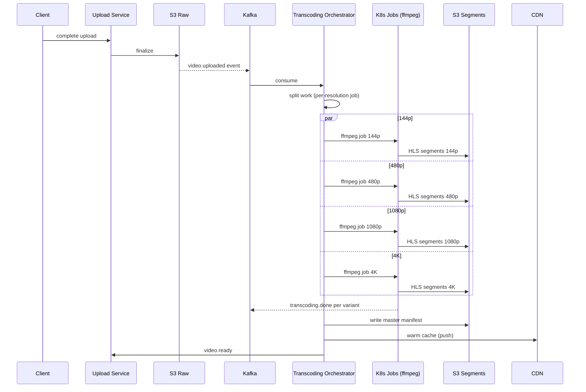
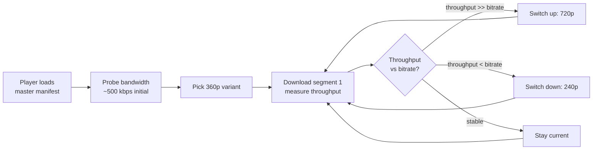
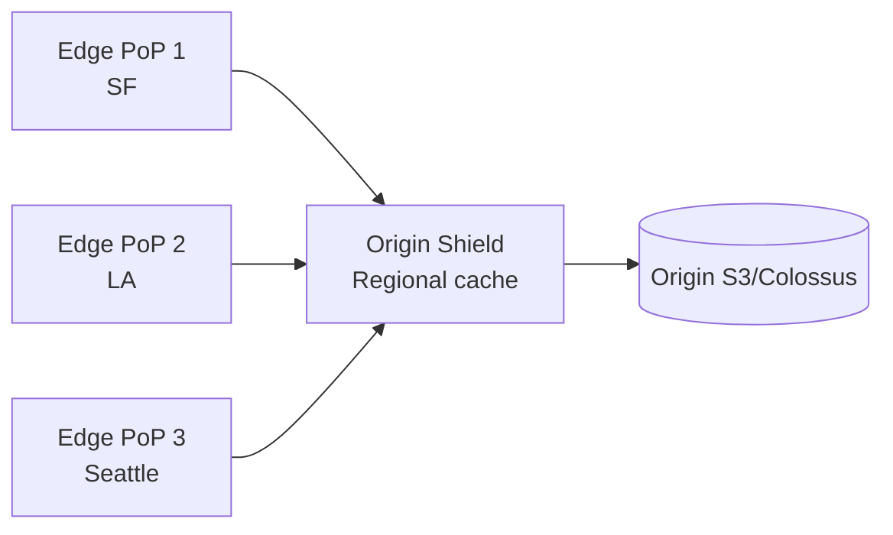
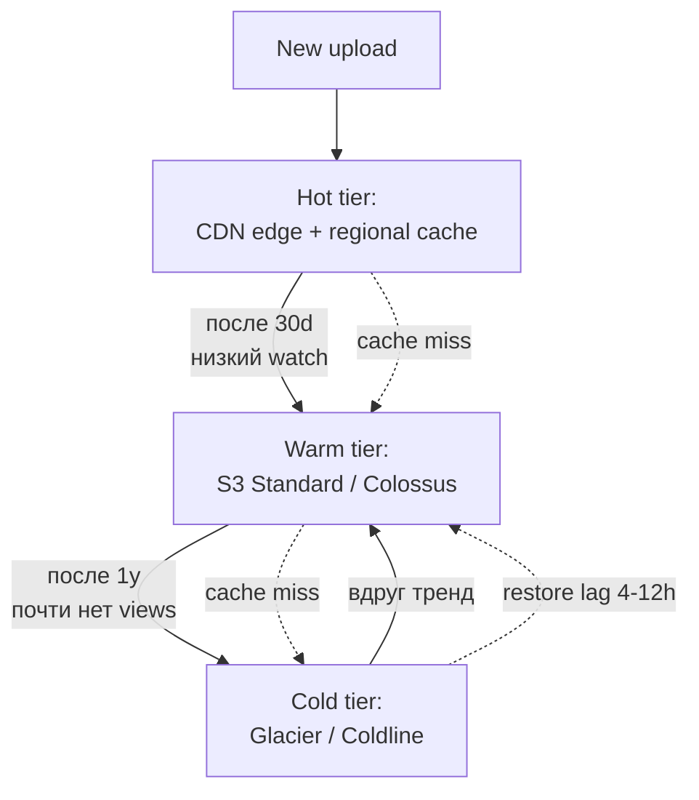
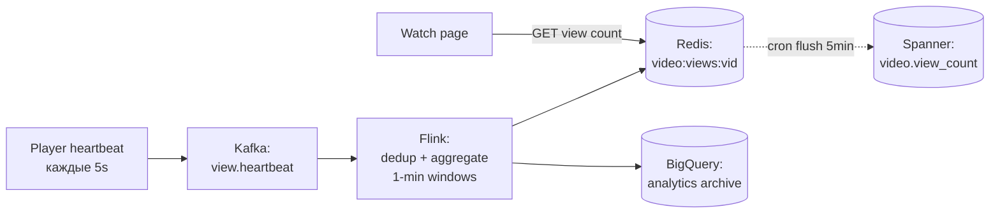
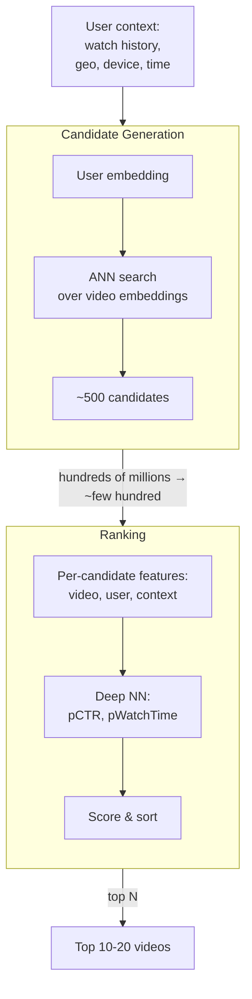
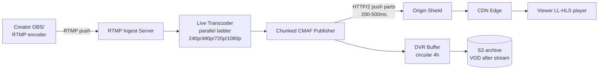
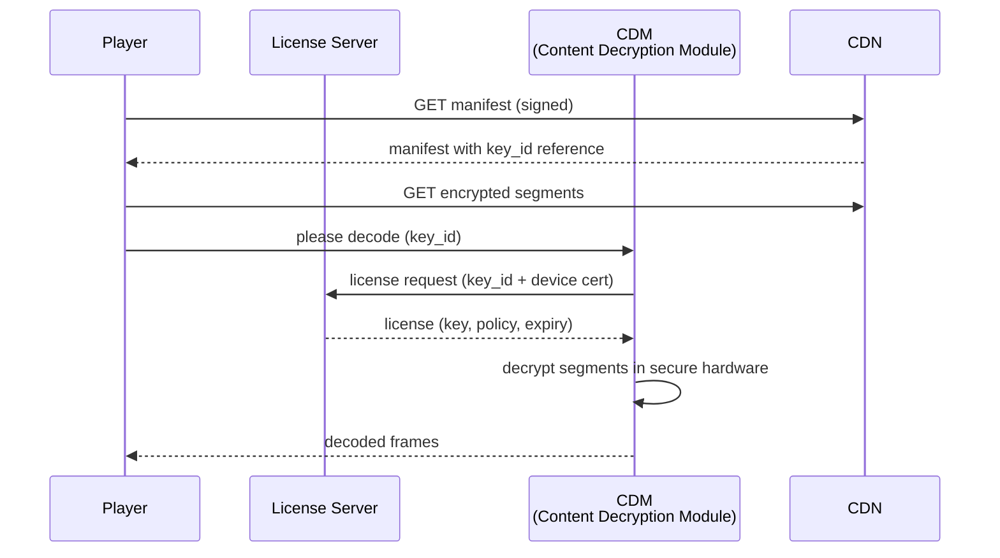
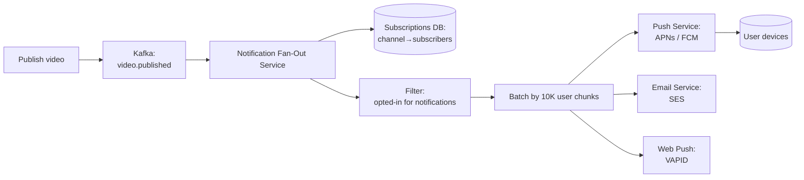

# Вопросы на собеседовании: `Design YouTube`

`YouTube` — крупнейший видеосервис: 2.5B MAU, 500 часов видео в минуту загружается, 1B часов смотрится в день. System design YouTube — про экстремальный масштаб storage (экзабайты), egress (сотни Tbps), pipeline transcoding и ML-рекомендации.

Эта шпаргалка — про архитектуру, capacity, trade-offs и production-практики Google/YouTube.

## Полезные ссылки

- [YouTube Engineering Blog](https://blog.youtube/inside-youtube/tags/engineering-and-developers/)
- [HTTP Live Streaming (HLS) spec — RFC 8216](https://datatracker.ietf.org/doc/html/rfc8216)
- [MPEG-DASH spec — ISO/IEC 23009-1](https://www.iso.org/standard/79329.html)
- [CMAF — Common Media Application Format](https://www.iso.org/standard/79106.html)
- [Deep Neural Networks for YouTube Recommendations (Google, 2016)](https://research.google/pubs/pub45530/)
- [Recommending What Video to Watch Next (Google, 2019)](https://research.google/pubs/pub48434/)
- [Content ID — How it works](https://support.google.com/youtube/answer/2797370)
- [Widevine DRM Documentation](https://developers.google.com/widevine)
- [Low-Latency HLS (Apple)](https://developer.apple.com/documentation/http_live_streaming/enabling_low-latency_http_live_streaming_hls)
- [System Design Primer](https://github.com/donnemartin/system-design-primer)

## Содержание

- [Полезные ссылки](#полезные-ссылки)
- [See also](#see-also)

**Requirements и capacity**
- [Q1. (!) Functional и non-functional requirements?](#q1--functional-и-non-functional-requirements)
- [Q2. (!) Capacity estimation: storage, bandwidth, QPS?](#q2--capacity-estimation-storage-bandwidth-qps)
- [Q3. High-level архитектура YouTube?](#q3-high-level-архитектура-youtube)

**Upload pipeline и transcoding**
- [Q4. (!) Upload flow: presigned URL, resumable, chunked?](#q4--upload-flow-presigned-url-resumable-chunked)
- [Q5. (!) Transcoding pipeline: ffmpeg, ladder, codecs?](#q5--transcoding-pipeline-ffmpeg-ladder-codecs)
- [Q6. Какие resolutions/bitrates и почему ladder?](#q6-какие-resolutionsbitrates-и-почему-ladder)
- [Q7. HLS vs DASH vs CMAF?](#q7-hls-vs-dash-vs-cmaf)

**Streaming и ABR**
- [Q8. (!) Adaptive bitrate streaming — как работает?](#q8--adaptive-bitrate-streaming--как-работает)
- [Q9. Manifest (m3u8/mpd) — формат и доставка?](#q9-manifest-m3u8mpd--формат-и-доставка)
- [Q10. Segment size trade-offs (2s vs 6s vs 10s)?](#q10-segment-size-trade-offs-2s-vs-6s-vs-10s)

**CDN и storage**
- [Q11. (!) CDN strategy: multi-CDN, origin shield, edge cache?](#q11--cdn-strategy-multi-cdn-origin-shield-edge-cache)
- [Q12. Storage tiering: hot/warm/cold?](#q12-storage-tiering-hotwarmcold)
- [Q13. Hot videos (viral) — как обрабатывать?](#q13-hot-videos-viral--как-обрабатывать)

**Metadata, views, engagement**
- [Q14. (!) Metadata DB: схема, sharding?](#q14--metadata-db-схема-sharding)
- [Q15. View counts — как считать на масштабе?](#q15-view-counts--как-считать-на-масштабе)
- [Q16. Likes, comments, subscriptions feed?](#q16-likes-comments-subscriptions-feed)

**Recommendations (ML)**
- [Q17. (!) Two-stage recommendation model: candidate + ranking?](#q17--two-stage-recommendation-model-candidate--ranking)
- [Q18. Features для ranking model?](#q18-features-для-ranking-model)
- [Q19. Search: ES, transcripts, ranking?](#q19-search-es-transcripts-ranking)

**Live streaming и monetization**
- [Q20. (!) Live streaming pipeline: RTMP ingest → LL-HLS?](#q20--live-streaming-pipeline-rtmp-ingest--ll-hls)
- [Q21. Ad insertion: SSAI vs CSAI, VAST/VPAID?](#q21-ad-insertion-ssai-vs-csai-vastvpaid)

**Moderation, DRM, geo**
- [Q22. (!) Content moderation: CSAM, Content ID fingerprinting?](#q22--content-moderation-csam-content-id-fingerprinting)
- [Q23. DRM: Widevine, FairPlay, PlayReady?](#q23-drm-widevine-fairplay-playready)
- [Q24. Geo-distribution и regional restrictions?](#q24-geo-distribution-и-regional-restrictions)

**Edge cases и trade-offs**
- [Q25. Failed upload / failed transcoding — recovery?](#q25-failed-upload--failed-transcoding--recovery)
- [Q26. (!) Trade-offs: transcode upfront vs on-demand, CDN cost vs latency?](#q26--trade-offs-transcode-upfront-vs-on-demand-cdn-cost-vs-latency)
- [Q27. CDN cache invalidation для удалённых видео?](#q27-cdn-cache-invalidation-для-удалённых-видео)
- [Q28. Notifications subscribers нового видео?](#q28-notifications-subscribers-нового-видео)

---

## Q1. (!) Functional и non-functional requirements?

**Functional requirements:**

- Upload video (загрузка с прогрессом, resumable).
- Watch video (streaming, ABR, multiple qualities).
- Like / dislike / comment / share.
- Subscribe to channel, notifications.
- Recommendations (homepage feed, Up Next).
- Search (по title, description, transcript).
- Channel page (список видео автора).
- Live streaming.
- Monetization (ads, channel memberships).

**Non-functional requirements:**

| Метрика | Цель |
|---------|------|
| MAU | 2.5B пользователей |
| Upload rate | 500 часов видео в минуту |
| Watch volume | 1B часов в день |
| Start-up latency | < 2s от click до first frame |
| Rebuffering ratio | < 0.5% времени просмотра |
| Availability | 99.95% (watch path) |
| Durability | 11x9s (как S3) для original uploads |
| Geo | Глобальное покрытие, < 50ms от user до CDN edge |

**Out of scope (на интервью):** Premium subscription billing, Studio analytics dashboard, monetization payouts, kids/family separate app.

**Trade-off для интервью:** скажи явно «фокус на watch path и upload pipeline; recommendations упомяну на верхнем уровне». Иначе утонешь в ML.

---

## Q2. (!) Capacity estimation: storage, bandwidth, QPS?

**Upload storage:**

- 500 часов / мин × 60 мин × 24 ч × 365 дн = **263M часов / год** uploaded.
- Raw upload средний bitrate ~5 Mbps → 1 час ≈ 2.25 GB. Многие в 1080p+/4K → среднее ~4 GB/час original.
- 263M × 4 GB ≈ **1 EB original / год**.
- Transcoded variants (10 resolutions × 2 codecs): множитель ×3-5 (старшие resolutions больше всего). Итого storage ~**3-5 EB / год** после transcoding.

**Egress bandwidth:**

- 1B часов смотрится в день → ~42M часов / час.
- Средний bitrate смотрового потока ~3 Mbps (720p смесь mobile/desktop).
- 42M × 3600 сек × 3 Mbps / 3600 = 42M × 3 Mbps = **126 Tbps average**.
- Peak (prime time, viral video): ×2-3 → **250-400 Tbps peak**.
- Для сравнения: peak Netflix ≈ 100 Tbps, peak Cloudflare network ≈ 150 Tbps. YouTube сопоставим с глобальным интернет-трафиком крупного континента.

**QPS:**

- Watch starts: 1B часов / день, средняя сессия ~10 мин → ~6B starts/день → **70K QPS avg**, ~200K QPS peak.
- Upload starts: 500 h / min × ~10 min average = ~50 uploads/min активных. Низкий QPS, но heavy bytes.
- Metadata reads (video page, channel page, recommendations): ~10× watch starts → **2M QPS metadata**.

**CDN egress dominates** infrastructure cost. Поэтому YouTube строит собственную CDN (Google Global Cache, GGC) — серверы внутри ISP.

---

## Q3. High-level архитектура YouTube?



Ключевые компоненты:

- **Upload path:** API Gateway → presigned URL → object store (raw) → Kafka → transcoding workers → object store (segments) → CDN.
- **Watch path:** API Gateway → metadata service → manifest URL → CDN (segments).
- **Recommendation path:** offline batch (Spark/Beam) генерит candidates, online ranking при запросе.
- **Engagement path:** Kafka → Flink → counters в Redis.

Услуга — **read-heavy (~100:1)** на уровне segments. Поэтому всё CDN-кеширование агрессивно.

---

## Q4. (!) Upload flow: presigned URL, resumable, chunked?

**Шаги:**

1. Client → `POST /api/v1/uploads/init` с `{filename, size, mimeType}`.
2. Server создаёт `video_id`, генерит **resumable upload URL** (signed, expires 24h). Сохраняет в `uploads` table.
3. Client загружает чанками (5-100 MB) на signed URL: `PUT /upload?uploadId=xxx&partNumber=N`.
4. После всех чанков → `POST /api/v1/uploads/{video_id}/complete`. S3 Multipart Complete объединяет parts.
5. S3 event → SNS/SQS/Kafka → запускает transcoding pipeline.

**Resumable (RFC 7233 Range):**

```http
POST /upload?uploadId=abc HTTP/1.1
Content-Range: bytes 0-5242879/52428800
Content-Length: 5242880

[5MB chunk]
```

Если сеть упала на 30% — client делает `HEAD /upload?uploadId=abc`, сервер отвечает `Range: bytes=0-15728639/52428800`, client возобновляет с offset 15728640.

**Java snippet (S3 multipart):**

```java
// 1. Initiate
InitiateMultipartUploadResponse init = s3.initiateMultipartUpload(
    InitiateMultipartUploadRequest.builder()
        .bucket("yt-raw-uploads")
        .key("videos/" + videoId + "/original.mp4")
        .build()
);
String uploadId = init.uploadId();

// 2. Upload parts (parallel, 5MB-100MB each)
List<CompletedPart> parts = new ArrayList<>();
for (int i = 0; i < chunks.size(); i++) {
    UploadPartResponse resp = s3.uploadPart(
        UploadPartRequest.builder()
            .bucket("yt-raw-uploads")
            .key(key)
            .uploadId(uploadId)
            .partNumber(i + 1)
            .build(),
        RequestBody.fromBytes(chunks.get(i))
    );
    parts.add(CompletedPart.builder().partNumber(i + 1).eTag(resp.eTag()).build());
}

// 3. Complete
s3.completeMultipartUpload(
    CompleteMultipartUploadRequest.builder()
        .bucket("yt-raw-uploads")
        .key(key)
        .uploadId(uploadId)
        .multipartUpload(CompletedMultipartUpload.builder().parts(parts).build())
        .build()
);
```

**Зачем presigned URL:** клиент льёт байты **напрямую** в object store, минуя backend. Backend не масштабирует TB/sec пропускную способность.

---

## Q5. (!) Transcoding pipeline: ffmpeg, ladder, codecs?



**ffmpeg команда для одного варианта HLS 720p H.264:**

```bash
ffmpeg -i input.mp4 \
  -c:v libx264 -profile:v main -preset veryfast \
  -b:v 2800k -maxrate 2996k -bufsize 4200k \
  -vf "scale=-2:720" -g 48 -keyint_min 48 -sc_threshold 0 \
  -c:a aac -ar 48000 -b:a 128k \
  -hls_time 6 -hls_playlist_type vod \
  -hls_segment_filename "720p_%04d.ts" \
  720p.m3u8
```

Ключевое:

- `-g 48` — GOP size 48 кадров (2 секунды при 24fps). Keyframe в начале каждого segment — обязательно для seek/ABR-switch.
- `-keyint_min 48 -sc_threshold 0` — выключает scene-cut keyframes, GOP строго фиксированный.
- `-hls_time 6` — segment ~6 секунд.

**Параллелизм:** YouTube распиливает video на **chunks по времени** (например, 30-секундные блоки) и запускает 100+ workers в параллель → 1-часовое видео transcodes за минуты. Затем merge.

**Codecs (multiple для разных клиентов):**

| Codec | Год | Compression | Decoder support |
|-------|-----|-------------|-----------------|
| H.264 (AVC) | 2003 | baseline | универсально, hardware everywhere |
| H.265 (HEVC) | 2013 | -50% bitrate vs H.264 | Apple, modern Android, royalty issues |
| VP9 | 2013 | сопоставимо с HEVC | YouTube/Chrome native, royalty-free |
| AV1 | 2018 | -30% vs VP9 | новейшие клиенты, медленный encode |

YouTube кодирует **VP9 (приоритет) + H.264 (fallback)**, для топовых видео ещё AV1 на 4K.

---

## Q6. Какие resolutions/bitrates и почему ladder?

**Bitrate ladder** — набор `{resolution, bitrate}` для ABR. Каждая «ступенька» нацелена на конкретную bandwidth-категорию клиентов.

| Resolution | Bitrate (H.264) | Use case |
|------------|-----------------|----------|
| 144p | 80-100 kbps | extreme mobile (2G), audio-first |
| 240p | 300 kbps | slow 3G |
| 360p | 700 kbps | 3G |
| 480p (SD) | 1.2 Mbps | 4G, low-end Wi-Fi |
| 720p (HD) | 2.8 Mbps | 4G/Wi-Fi default |
| 1080p (FHD) | 5 Mbps | broadband |
| 1440p (QHD) | 8 Mbps | broadband, desktop |
| 2160p (4K) | 16 Mbps | fast broadband, 4K display |

**Зачем 144p в 2026?** Развивающиеся рынки (Индия, Африка), плохое 3G, экономия mobile data. У YouTube огромный non-Western user base.

**Per-title encoding** (Netflix approach, теперь и YouTube): анализируют сложность контента, выдают **разный ladder для разных видео**. Talking-head ролик может на 720p уложиться в 1 Mbps, а action-сцена требует 4 Mbps.

**Content-aware encoding (CAE):** двухпроходный анализ → variable bitrate (VBR) с peak constraints.

---

## Q7. HLS vs DASH vs CMAF?

| | HLS | DASH | CMAF |
|---|---|---|---|
| Создатель | Apple (2009) | MPEG (2012) | MPEG (2018) |
| Manifest | `.m3u8` (text) | `.mpd` (XML) | использует HLS или DASH |
| Container | `.ts` (исторически), теперь `.fmp4` | `.m4s` (fragmented MP4) | `.cmfv` (fragmented MP4) |
| iOS/Safari | native | через MSE polyfill | native (CMAF-HLS) |
| Android/Chrome | native (с Android 3+) | native | native |
| Smart TVs | hit-or-miss | широко | широко |
| DRM | FairPlay (sample-AES) | Widevine + PlayReady (CENC) | CENC universal |

**Проблема двух стандартов:** до CMAF приходилось хранить **двойной набор segments** (TS для HLS + m4s для DASH) → 2× storage cost на CDN.

**CMAF (Common Media Application Format):** **одни и те же** `.cmfv` segments шарятся между HLS и DASH manifests. Encode 1 раз → serve обоим. **Срезает CDN storage в 2 раза.**

YouTube **давно перешёл на CMAF**. HLS-плееры запрашивают `master.m3u8` → внутри ссылки на `.cmfv` segments. DASH-плееры запрашивают `manifest.mpd` → ссылки на те же `.cmfv`.

---

## Q8. (!) Adaptive bitrate streaming — как работает?

**ABR (Adaptive Bitrate)** — клиент **сам** переключает quality на лету в зависимости от bandwidth.



**Алгоритмы:**

1. **Throughput-based (наивный):** скользящее среднее последних N сегментов. Бьётся об bursty network.
2. **Buffer-based (BBA, Netflix-style):** смотрит на **buffer occupancy** (сколько секунд в буфере). Buffer низкий → drop quality, buffer высокий → bump up. Стабильнее.
3. **MPC / Pensieve (RL):** combine оба signal-а через model-predictive control / deep RL. Google использует ML-based ABR.

**Switch granularity:** на границе **segment** (т.е. каждые 2-6s). Поэтому сегменты короче → быстрее адаптация, но больше overhead manifest-запросов.

**Bandwidth estimator** для cellular: использует **TCP throughput** последнего сегмента. Для QUIC/HTTP3 — congestion window от транспорта.

**Java-style псевдокод выбора варианта:**

```java
public Variant pickNextVariant(double measuredThroughputBps, double bufferSeconds) {
    double safetyFactor = bufferSeconds > 20 ? 1.0 : 0.7; // консервативно при низком буфере
    double targetBitrate = measuredThroughputBps * safetyFactor;
    return ladder.stream()
        .filter(v -> v.bitrateBps() <= targetBitrate)
        .max(Comparator.comparing(Variant::bitrateBps))
        .orElse(ladder.lowest());
}
```

---

## Q9. Manifest (m3u8/mpd) — формат и доставка?

**Master HLS manifest:**

```m3u8
#EXTM3U
#EXT-X-VERSION:6

#EXT-X-STREAM-INF:BANDWIDTH=300000,RESOLUTION=426x240,CODECS="avc1.42c015"
240p/playlist.m3u8

#EXT-X-STREAM-INF:BANDWIDTH=700000,RESOLUTION=640x360,CODECS="avc1.4d401e"
360p/playlist.m3u8

#EXT-X-STREAM-INF:BANDWIDTH=2800000,RESOLUTION=1280x720,CODECS="avc1.640020"
720p/playlist.m3u8

#EXT-X-STREAM-INF:BANDWIDTH=5000000,RESOLUTION=1920x1080,CODECS="avc1.640028"
1080p/playlist.m3u8
```

**Media playlist (720p):**

```m3u8
#EXTM3U
#EXT-X-VERSION:6
#EXT-X-TARGETDURATION:6
#EXT-X-MEDIA-SEQUENCE:0
#EXT-X-PLAYLIST-TYPE:VOD

#EXTINF:6.000,
720p_0000.cmfv
#EXTINF:6.000,
720p_0001.cmfv
#EXTINF:6.000,
720p_0002.cmfv
...
#EXT-X-ENDLIST
```

**Доставка:**

- Master manifest **per video_id** — почти immutable, кешируется в CDN на длинный TTL (24h).
- Segments **immutable** — длинный TTL (year), versioned URL (`/segments/{video_id}/720p_0001_v3.cmfv`).
- Manifest URL signed: `?token=xxx&exp=...` — для DRM/access control.

**Edge case live:** для live manifest **меняется** (новые сегменты добавляются). TTL короткий (1-2s), используются `#EXT-X-PART` для LL-HLS.

---

## Q10. Segment size trade-offs (2s vs 6s vs 10s)?

| Segment | Pro | Con |
|---------|-----|-----|
| 2s | Быстрая ABR-адаптация, низкая live latency | Много запросов (overhead), TCP slow start на каждом, hurt CDN |
| 6s | Баланс (default HLS) | Стандарт VOD |
| 10s | Меньше запросов, лучше CDN cache hit rate | Медленная адаптация, высокая live latency |

**Для VOD:** YouTube использует **5-6s** segments. Достаточно частая адаптация, низкий overhead.

**Для live:** **2s** + LL-HLS parts по **200-500ms** (HTTP/2 push или CTE — chunked transfer encoding). Это даёт **end-to-end latency ~3s** vs стандартные HLS ~30s.

**Math:** при 1-часовом видео и 6s сегментах → 600 файлов. Manifest ~50 KB. Каждый segment ~2 MB на 720p. Total /1080p ladder ≈ 1.5 GB per hour per variant.

---

## Q11. (!) CDN strategy: multi-CDN, origin shield, edge cache?

**Multi-CDN:**

YouTube использует **собственную CDN** — Google Global Cache (GGC):

- **GGC nodes** размещены **внутри ISP** по всему миру (1500+ ISP). Когда ты в Москве смотришь YouTube — segments идут с GGC-сервера твоего провайдера, **не выходя из его сети**.
- Это **edge peering**: ISP экономит transit-трафик, Google экономит egress. Win-win.
- На границе — Google's own edge PoPs (Google Edge Network), затем Google's backbone.

Для **не-Google services** (CDN-as-a-product) commercial multi-CDN: CloudFront + Akamai + Cloudflare + Fastly с DNS-based load balancing (например, Cedexis/Citrix ITM) или client-side selection.

**Origin shield:**



Edge node при miss идёт не сразу в origin, а в **regional shield**. Виральное видео → много edges miss-ятся параллельно → shield делает **одну** запросу к origin, остальные ждут (request coalescing). Защищает origin от thundering herd.

**Edge caching:**

- Segments — **immutable, content-hashed URLs** → cache TTL = 1 year.
- Master manifest — TTL 24h (можно поменять при reencode).
- Live manifest — TTL 1s + `Cache-Control: no-store` для playlist top.
- Eviction policy на edge: **LRU** + popularity-aware (LFU). Long-tail видео вылетают первыми.

---

## Q12. Storage tiering: hot/warm/cold?



**Tiers и стоимость (порядок величин):**

| Tier | Cost / GB / month | Read latency | Use case |
|------|--------------------|--------------|----------|
| CDN edge | $0 (sunk) | ~5ms | top 0.1% видео |
| S3 Standard / Colossus | $0.023 | ~50ms | active long-tail |
| S3 IA | $0.0125 | ~100ms | редко смотримое |
| Glacier Instant | $0.004 | ~100ms | архив, иногда читаемый |
| Glacier Deep Archive | $0.00099 | ~12h restore | очень редко |

**Power-law distribution:** ~80% watch time приходится на **~0.1% видео** (популярные). Остальные 99.9% — long tail, может месяцами не запрашиваться.

YouTube **не** держит весь long-tail в hot CDN — только manifest + первый segment (для fast start). Остальные сегменты pre-fetch при old video request.

**Trade-off:** хранить транскодированные variants long-tail видео или **транскодировать on-demand** при первом запросе? YouTube исторически **транскодирует всё upfront** (CPU дешевле storage retrieval latency для UX). Но Netflix на части контента делает on-demand.

---

## Q13. Hot videos (viral) — как обрабатывать?

Когда видео становится viral (миллион views/час):

1. **Pre-warm cache** в большем числе PoP — push к множеству edges заранее.
2. **Priority transcoding lane:** если только что загружено и резко взлетело — пропускают через transcoding ladder быстрее (приоритетный K8s queue).
3. **Adaptive replication** в metadata DB: hot rows реплицируются в больше регионов (read replicas).
4. **Request coalescing на origin shield** (см. Q11) — защита от thundering herd.
5. **Premium codec:** для топ-0.001% видео генерят AV1 (-30% bitrate) → экономия egress в долгосрочной перспективе.
6. **Predictive caching:** ML-модель предсказывает upcoming spike (по early signals: subscriber count, geographic spread of first views) → push в CDN до пика.

**Cache stampede protection** при miss:

```
GET segment_X.cmfv → cache miss → 1000 параллельных requests на shield
                                    ↓
                          shield deduplicates: первый request идёт в origin,
                          остальные блокируются на short-lived lock
                                    ↓
                          response пришёл → unlock → все отвечают из shield cache
```

---

## Q14. (!) Metadata DB: схема, sharding?

**`video_metadata` table:**

| column | type | примечание |
|--------|------|-----------|
| video_id | string (11 chars) | partition key, sharded by hash |
| uploader_user_id | bigint | secondary index |
| title | string | до 100 chars |
| description | text | до 5K chars |
| upload_ts | timestamp | |
| publish_ts | timestamp | nullable (scheduled publish) |
| duration_sec | int | |
| visibility | enum | public/unlisted/private |
| category | string | |
| tags | array<string> | |
| transcoding_status | enum | pending/processing/ready/failed |
| manifest_url | string | путь к master.m3u8/cmaf |
| thumbnail_urls | array<string> | preview frames |
| age_restricted | bool | |
| geo_blocked_countries | array<string> | |

**Storage choice — Spanner (или Cassandra):**

- Spanner — globally consistent, transactional, sharded by primary key. Для core metadata.
- Cassandra — eventually consistent, write-heavy. Можно для analytics или comments.
- BigTable — для view counts (KV).

**Sharding strategy:**

- `video_metadata` — hash partition by `video_id`. Равномерное распределение, hot video не убивает один shard.
- `channel_videos` (videos by uploader) — partition by `user_id`, sort by `upload_ts DESC`. Channel page query — точечный.
- `subscriptions` — partition by `subscriber_user_id`, list of `channel_id`. Для feed.
- `comments` — partition by `video_id`, but **secondary partition by time-bucket** для популярных видео с миллионами комментов.

**Video ID:** короткие 11-символьные base64 → URL-safe. Генерация через UUID → base64 → truncate, проверка уникальности через DB.

---

## Q15. View counts — как считать на масштабе?

Точный count нерентабелен: 1B views/день × write-amplification → миллионы writes/sec в БД.

**Решение — Lambda-like pipeline:**



**Логика count:**

- View засчитывается, если watched ≥ **30 секунд** (правило YouTube исторически).
- Player отправляет heartbeat каждые 5s с `{video_id, user_id, position, session_id}`.
- Flink дедуплицирует по `(video_id, user_id, session_id)` за окно (борьба с refresh-spam).
- Counts в Redis (INCR по ключу `video:views:{video_id}`).
- Каждые 5 мин flush Redis → Spanner (durable count).
- UI читает из Redis (eventual consistency, +/- секунды задержки).

**Anti-fraud:**

- Bot detection (Frequency analysis, browser fingerprint).
- View threshold (30s) защищает от skip-spam.
- Throttling: 1 view per user per video per 24h.

**Spike protection:** при viral spike Redis INCR может стать bottleneck → шардить counter по hash partitions, sum at read time.

---

## Q16. Likes, comments, subscriptions feed?

**Likes:**

- Same pattern: Kafka → Flink → Redis counter. Eventual consistency.
- Uniqueness: `like(user_id, video_id)` в DB; если уже liked, не инкрементить.

**Comments:**

- Сторадж: Cassandra или Spanner, partition by `video_id`.
- Hot videos: миллионы комментов → пагинация cursor-based (`?after=comment_id`).
- Sort: by `top` (replies/upvotes), `new`, `controversial`.
- Threading: parent_comment_id, depth limit 2 (top-level + replies).

**Subscriptions feed:**

- На pull-time: для каждого user'а взять `subscriptions[user_id]` → для каждого channel взять последние 10 видео → merge by time → top N.
- При scale неэффективно для **heavy fan-out** каналов (MrBeast с 200M subscribers).
- Гибрид: pull для регулярных пользователей, push (fan-out на write) для top creators с лимитом — но в feed-таблицу всех subs.
- См. подробнее: [design-feed-system-interview.md](design-feed-system-interview.md), [design-twitter-interview.md](design-twitter-interview.md).

---

## Q17. (!) Two-stage recommendation model: candidate + ranking?

YouTube recommendations (Up Next + homepage) — **two-stage**:



**Stage 1: Candidate Generation:**

- Цель — из ~10⁹ видео отобрать ~10² релевантных. Recall > precision.
- Модель: two-tower neural network. Учит **user embedding** и **video embedding** в общем латентном пространстве.
- При serve: query = user embedding → **ANN (approximate nearest neighbor)** search через миллионы video embeddings (FAISS, ScaNN).
- Latency target: < 50ms.

**Stage 2: Ranking:**

- Цель — точно ранжировать ~500 candidates → top 10-20. Precision matters.
- Deep neural network с **сотнями features**: video features (age, language, channel quality), user features (watch history, demographics), context (device, time of day).
- Multi-objective: predict CTR, predicted watch time, predicted satisfaction (likes/dislikes).
- Latency target: < 100ms на весь батч из 500.

**Offline vs online:**

- Embeddings (offline): Spark/Beam обучает раз в N часов, batch encode видео.
- Ranking model (online): TF Serving / KFServing.
- A/B testing постоянный — десятки экспериментов параллельно.

---

## Q18. Features для ranking model?

**Video features:**

- `video_age_hours`, `total_views`, `like_ratio`, `comment_count`.
- `channel_quality_score` (uploader signals).
- `topic_embedding` (category, tags, transcript).
- `language`, `geographic_target`.
- `monetization_eligible` (для ads).

**User features:**

- `watch_history_embedding` (последние 50 видео).
- `search_history_embedding`.
- `demographics` (age band, country, device).
- `subscription_signal` (subscribed to channel?).
- `time_since_last_visit`.

**Context:**

- `device_type` (mobile/TV/desktop).
- `time_of_day`, `day_of_week`.
- `referrer` (homepage / search / channel page).
- `previous_video_in_session`.

**Cross features:** user × video взаимодействия — например, «smartphone user × video в landscape orientation» — модель учит non-linear combinations через feature crosses или deep embedding.

**Multi-objective head:** одна модель предсказывает **сразу несколько** скаляров:

- p(click | impression)
- E[watch_time | click]
- p(like | watch)
- p(share)
- p(skip-within-5s) — negative signal

Финальный score: weighted combination, веса настраиваются под бизнес-метрику (engagement vs revenue).

См. также: [embeddings-interview.md](../ai-ml/embeddings-interview.md), [llm-integration-patterns-interview.md](../ai-ml/llm-integration-patterns-interview.md).

---

## Q19. Search: ES, transcripts, ranking?

**Pipeline:**

1. На upload + transcoding параллельно гонят **ASR (Automatic Speech Recognition)** → transcript.
2. Index в Elasticsearch:
   - `title`, `description` — text fields с custom analyzer (russian + english).
   - `tags` — keyword.
   - `transcript_chunks` — отдельный field, chunked по 30s windows. Позволяет deep-link «search jump to position».
   - `channel_name`, `category` — keyword.
3. Query: multi-match across поля + boost по engagement (views, recency).
4. Ranking model — отдельная Learn-to-Rank модель (LambdaMART / DNN), переранжирует top-100 ES результатов.

```json
{
  "query": {
    "function_score": {
      "query": {
        "multi_match": {
          "query": "kubernetes tutorial",
          "fields": ["title^3", "description^1", "transcript_chunks.text^0.5", "tags^2"],
          "fuzziness": "AUTO"
        }
      },
      "functions": [
        {"field_value_factor": {"field": "log_views", "factor": 1.2}},
        {"gauss": {"upload_ts": {"scale": "30d", "decay": 0.5}}}
      ],
      "score_mode": "multiply"
    }
  }
}
```

**Autocomplete:** отдельный сервис на edge-ngram + popularity counter (top queries last 24h из Redis). Latency target < 50ms.

**Typo tolerance:** ES fuzzy + phonetic + spell correction (custom dictionary с misspellings).

См. подробнее: [design-search-interview.md](design-search-interview.md).

---

## Q20. (!) Live streaming pipeline: RTMP ingest → LL-HLS?



**Ingest:** creator пушит **RTMP** (TCP) или **SRT/WebRTC** (UDP) на ingest server. RTMP — стандарт, но latency 5-30s.

**Live transcoding ladder:** real-time encode в multiple resolutions. На GPU/ASIC (для cost) — H.264 NVENC, или Google's VCU (Video Coding Unit) custom silicon.

**LL-HLS (Low-Latency HLS):**

- Segments по 2s, но внутри segments — **HTTP/2 push of parts** по 200-500ms.
- Manifest содержит `#EXT-X-PART` tags:

```m3u8
#EXT-X-PART:DURATION=0.33,URI="seg42_part0.cmfv"
#EXT-X-PART:DURATION=0.33,URI="seg42_part1.cmfv",INDEPENDENT=YES
#EXT-X-PART:DURATION=0.33,URI="seg42_part2.cmfv"
#EXT-X-PRELOAD-HINT:TYPE=PART,URI="seg42_part3.cmfv"
```

- `INDEPENDENT=YES` — этот part начинается с keyframe → можно сразу switch ABR.
- End-to-end latency 2-5s vs обычный HLS 30s+.

**Альтернативы:** WebRTC — sub-second latency, но плохо масштабируется (peer-based). Используется для interactive (call, live chat), не для broadcast.

**DVR:** последние N часов live-стрима хранятся в circular buffer → user может «отмотать назад» во время трансляции.

**После окончания стрима:** finalize в **VOD** asset — сегменты копируются в long-term storage, добавляется в transcoding pipeline для дополнительных codecs (AV1 и т.п.).

---

## Q21. Ad insertion: SSAI vs CSAI, VAST/VPAID?

**Forms:**

- **Pre-roll** — реклама до видео.
- **Mid-roll** — встроена в середину.
- **Post-roll** — после.
- **Bumper** — короткая 6s non-skippable.
- **Overlay/banner** — поверх плеера.

**Two strategies of stitching:**

| | CSAI (Client-Side) | SSAI (Server-Side) |
|---|---|---|
| Как работает | Player знает про ads, делает паузу основного видео, играет ad asset | Сервер вставляет ad segments **прямо в manifest** между content segments |
| AdBlock | легко блокировать (отдельный domain) | сложно (тот же manifest) |
| Pixel tracking | rich (player-aware) | ограниченный (server log) |
| Latency switching content↔ad | заметный (загрузка ad player) | seamless (тот же бuffer) |
| Personalization | per-user | per-user (server inserts разный ad per session) |
| Используется | Mobile apps, Web | LL-стримы, Connected TV |

**VAST (Video Ad Serving Template)** — XML стандарт от IAB:

```xml
<VAST version="4.2">
  <Ad>
    <InLine>
      <AdSystem>YouTube Ads</AdSystem>
      <Impression><![CDATA[https://ads.example/impression?adid=123]]></Impression>
      <Creatives>
        <Creative>
          <Linear>
            <Duration>00:00:15</Duration>
            <TrackingEvents>
              <Tracking event="complete"><![CDATA[https://ads.example/complete]]></Tracking>
            </TrackingEvents>
            <MediaFiles>
              <MediaFile type="video/mp4" bitrate="2000">
                <![CDATA[https://ads.example/creative.mp4]]>
              </MediaFile>
            </MediaFiles>
          </Linear>
        </Creative>
      </Creatives>
    </InLine>
  </Ad>
</VAST>
```

**VPAID** — interactive ads (clickable overlays, surveys). Был популярен, теперь deprecated в пользу **SIMID**.

**Frequency capping:** не показывать одну и ту же рекламу одному user'у >N раз/день → counter в Redis per (user_id, ad_id).

---

## Q22. (!) Content moderation: CSAM, Content ID fingerprinting?

**Layers of moderation:**

1. **Pre-upload (on raw):**
   - **CSAM detection** (PhotoDNA / Google CSAI Match): hash-based matching against known database of child-abuse material. Mandatory by law.
   - Virus scan.
2. **Post-transcoding (on output):**
   - **Content ID (copyright):** Google's fingerprinting system. Rights holders upload reference content → каждое новое video fingerprinted (audio + video) → matched против reference DB. Match → claim, blocking, monetization re-routing.
   - **ML classifier:** nudity / violence / extremism / hate speech → enqueue для human review.
3. **At watch-time:**
   - Age-restriction enforcement (требуется sign-in).
   - Regional restrictions (geo-block).
4. **Post-publication (community signals):**
   - User reports → review queue.
   - Spam/comment moderation (ML + community).

**Content ID detail:**

- **Audio fingerprint:** acoustic fingerprint (spectrogram hashing à la Shazam) → robust к re-encoding, pitch shift.
- **Video fingerprint:** perceptual hash (pHash) per keyframe → robust к crop, watermark, mild quality loss.
- Match results: claim → owner decides: **block** / **monetize** (ads revenue идёт owner) / **track**.

**Scale:** ~500 часов uploaded/min × fingerprint extraction → массивный GPU/TPU pipeline. Async, не блокирует publish — claim может появиться через минуты-часы.

---

## Q23. DRM: Widevine, FairPlay, PlayReady?

**Зачем DRM:** premium content (YouTube Movies, Premium streams, кино) — rights holders требуют **encryption + key management** + secure decode.

**Three major DRMs:**

| DRM | Vendor | Platforms |
|-----|--------|-----------|
| Widevine | Google | Chrome, Android, ChromeOS, Smart TVs |
| FairPlay | Apple | Safari, iOS, tvOS, macOS |
| PlayReady | Microsoft | Edge, Windows, Xbox, некоторые TV |

**Flow:**



**Key concepts:**

- **CENC (Common Encryption):** standard AES-128 CTR/CBC. **Один и тот же** encrypted asset работает с **всеми** DRM-системами — отличается только license server и key delivery.
- **Secure media path:** decode и render в **TEE/SGX/Secure Element** (на hardware level). Screen capture блокируется или downgrades quality.
- **License policy:** TTL (например, 24h), playback restrictions (HDCP required, offline playback yes/no, max resolution).
- **Multi-DRM packaging:** один CMAF file + multiple license servers (Widevine + FairPlay + PlayReady) → разные platforms.

**Для regular YouTube видео:** DRM не используется (free content). Только sample-AES для premium streams, Movies, music.

---

## Q24. Geo-distribution и regional restrictions?

**Geo-distribution:**

- DNS-based: user queries `youtube.com` → resolution возвращает **closest CDN PoP** (через GeoDNS / Anycast).
- Google использует **Anycast IP** — один IP, маршрутизация BGP к ближайшему дата-центру.
- CDN edges в каждом крупном регионе (NA, EU, APAC, LATAM, Africa, AU).
- Storage replication: 3+ regions для durability.

**Regional restrictions (geo-block):**

- Per-video field `geo_blocked_countries: ["US", "UK"]`.
- При watch request: backend resolves user country (IP geo-lookup) → если в blocklist → return 451 (Unavailable For Legal Reasons) + alternative recommendations.
- VPN bypass: возможно, YouTube старается обнаруживать через IP reputation / device fingerprint, но не блокирует радикально.

**Compliance:**

- DMCA (US), copyright takedowns.
- GDPR (EU): right-to-be-forgotten — удалить user data, comments anonymize.
- Local content laws (Russia, China, Saudi — где сервис вообще доступен).

**Language localization:**

- Auto-translated captions (ASR + MT).
- Auto-dubbed audio (TTS) — beta.
- Localized search/recommendations per locale.

---

## Q25. Failed upload / failed transcoding — recovery?

**Failed upload:**

- Resumable upload (RFC 7233) — client возобновляет с last byte (см. Q4).
- Если client не возобновляется в течение 24h → cleanup job удаляет orphan parts из S3 (S3 multipart aborted).
- Если upload **complete** но client не закрыл сессию → backend всё равно триггерит transcoding по S3 event.

**Failed transcoding:**

- K8s Job retries: 3 attempts. Если все failed → enqueue в **dead-letter topic**.
- DLT consumer: alerting + manual investigation. Часто причина — corrupted source (broken codec, incomplete file).
- На UI: status `failed` → uploader видит «video processing failed», может re-upload.
- **Partial success:** если 720p закодировано но 4K упал → publish с 720p, retry 4K в background. Видео доступно, просто без top quality.

**Removed video:**

- Delete API → soft delete (status=deleted) в metadata.
- Cron job: cleanup S3 objects, DRM keys revoke.
- **CDN purge:** active purge через CDN API (`PURGE /video/{id}/*`) → инвалидирует edge cache во всех PoPs. Latency: 1-30 секунд.
- Manifest URL переадресуется на error page после purge.

**Corrupted CDN edge:**

- Health check каждые 30s. Failed edge → DNS removes из rotation.
- User retry на следующем segment hits другой edge.

---

## Q26. (!) Trade-offs: transcode upfront vs on-demand, CDN cost vs latency?

**Transcode upfront (eager) vs on-demand (lazy):**

| | Upfront | On-demand |
|---|---|---|
| Storage | высокий (×N variants stored) | низкий (только original) |
| First-watch latency | мгновенно | medium (transcode время) |
| Compute cost | upfront (1 раз для всех) | per-request (теоретически каждый раз, на практике cached) |
| Long-tail efficiency | плохо (тратим storage на нечитаемые видео) | хорошо |

YouTube **транскодирует всё upfront**: storage дешевле UX-задержки на старте. Netflix на части старого long-tail каталога переходит на on-demand: original + JIT-transcoding на CDN edge для нечастых форматов.

**CDN cost vs latency:**

| | Aggressive CDN (всё кешируется) | Lean CDN (только top видео) |
|---|---|---|
| Storage cost на edge | высокий | низкий |
| Origin egress | низкий | высокий |
| User latency | низкий | medium |
| Cache hit ratio | 99%+ | 80% |

YouTube: **GGC внутри ISP** (zero transit cost), поэтому **aggressive caching** очень дешёв (только storage edge node, нет egress fee). Это структурное преимущество над commercial CDN-customers.

**CMAF universal vs HLS+DASH split:**

- Universal: storage halved, но плееры должны поддерживать.
- Split: больший storage, но совместимость со старыми devices (legacy HLS).
- YouTube: universal CMAF с 2018-2020, тестировал backwards compatibility.

**Многоcodec ladder (AV1 + VP9 + H.264) vs один:**

- Multi: -30-50% egress (AV1), но 3× transcoding cost upfront.
- Single H.264: simplest, дешёвый encode, дороже delivery.
- YouTube: H.264 + VP9 для most, AV1 для top 1% видео (где экономия egress >> cost encode).

---

## Q27. CDN cache invalidation для удалённых видео?

Проблема: video removed (DMCA, terms violation, owner delete). Сегменты могут быть закешированы на 1000+ edges с TTL=1 year.

**Стратегии invalidation:**

1. **Active purge:**
   - CDN API: `POST /purge?path=/videos/abc/*`.
   - Propagates через edges: 1-30 sec на крупный CDN (Akamai, Cloudflare).
   - Cost: API rate limits, может быть expensive at scale.
2. **Versioned URLs (immutability):**
   - Каждый segment версия в URL: `/videos/abc/v3/720p_0001.cmfv`.
   - Удалить = обновить manifest, чтобы ссылок на старую версию не было. Сами segments живут в кеше до TTL.
   - **Не подходит** для DMCA: контент всё ещё доступен по прямой ссылке если кто-то её сохранил.
3. **Manifest invalidation only:**
   - Очистить только manifest (~1 KB). Без manifest player не знает segment URLs.
   - Но bypass возможен если segment URLs скопированы.
4. **Hybrid:**
   - Manifest purge → быстро (latest playback impossible).
   - Segment purge → асинхронно, в течение часа на все edges.
   - При request на removed video → CDN edge возвращает 410 Gone из «tombstone» list.

**YouTube подход:** combination — manifest purge мгновенно, segments async cleanup, edges имеют **blacklist** видео-IDs для немедленного 410.

---

## Q28. Notifications subscribers нового видео?

**Pipeline:**



**Challenges:**

- **Fan-out scale:** MrBeast (200M subscribers) → нужно отправить 200M push'ей за разумное время.
- **Throttling:** APNs/FCM имеют rate limits → распределить пуши в течение 5-30 минут (smear).
- **Personalization:** не всем нужны notifications на новое video — только subscribers who opted in to «all notifications» (vs «personalized» = ML-based).
- **Cost:** push + email на огромных каналах — expensive.

**Two-tier:**

- **Bell-on subscribers** («all notifications»): push notification сразу.
- **Default subscribers:** не нотифицируются на каждое video — попадают в homepage feed и personalized notifications через ML.

**Batching:** worker берёт 10K user_id'ов из subscriptions table, шлёт батч в FCM/APNs (FCM поддерживает до 500 tokens per request).

**Idempotency:** notification message содержит `(video_id, user_id)` — если retry, FCM/APNs дедуплицируют (server-side `collapse_key`).

См. также: [kafka-interview.md](../messaging/kafka-interview.md), [design-feed-system-interview.md](design-feed-system-interview.md).

---

## See also

- [design-twitter-interview.md](design-twitter-interview.md) — fan-out timeline patterns
- [design-instagram-interview.md](design-instagram-interview.md) — media upload и feed
- [design-search-interview.md](design-search-interview.md) — search engine deep dive
- [design-chat-system-interview.md](design-chat-system-interview.md) — real-time messaging
- [system-design-interview.md](system-design-interview.md) — general system design framework
- [cdn-interview.md](../architecture/cdn-interview.md) — CDN deep dive
- [caching-strategies-interview.md](../architecture/caching-strategies-interview.md) — кеширование
- [scalability-patterns-interview.md](../architecture/scalability-patterns-interview.md) — scale-out паттерны
- [latency-numbers-interview.md](../architecture/latency-numbers-interview.md) — latency intuition
- [database-sharding-interview.md](../databases/database-sharding-interview.md) — sharding video metadata
- [llm-integration-patterns-interview.md](../ai-ml/llm-integration-patterns-interview.md) — recommendation context
- [embeddings-interview.md](../ai-ml/embeddings-interview.md) — two-tower models
- [kafka-interview.md](../messaging/kafka-interview.md) — event pipeline backbone
