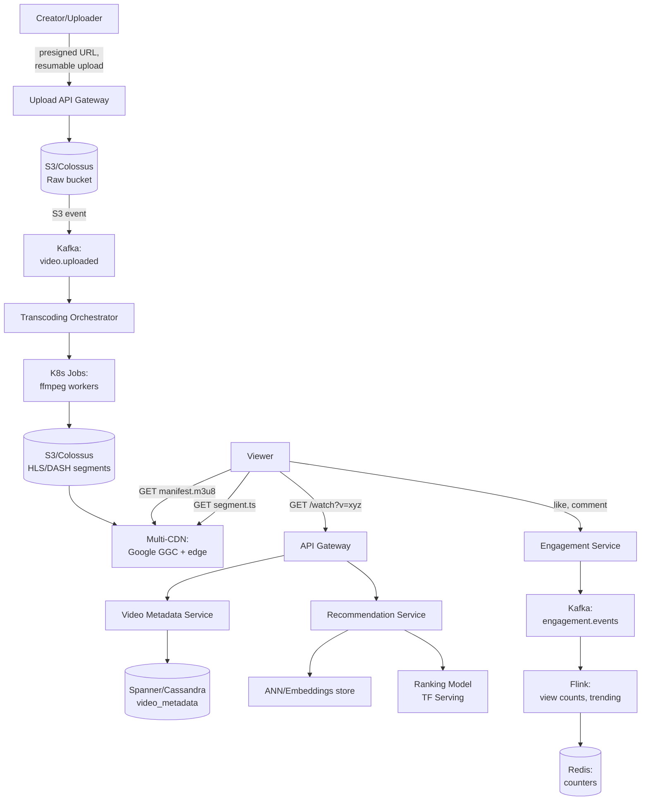
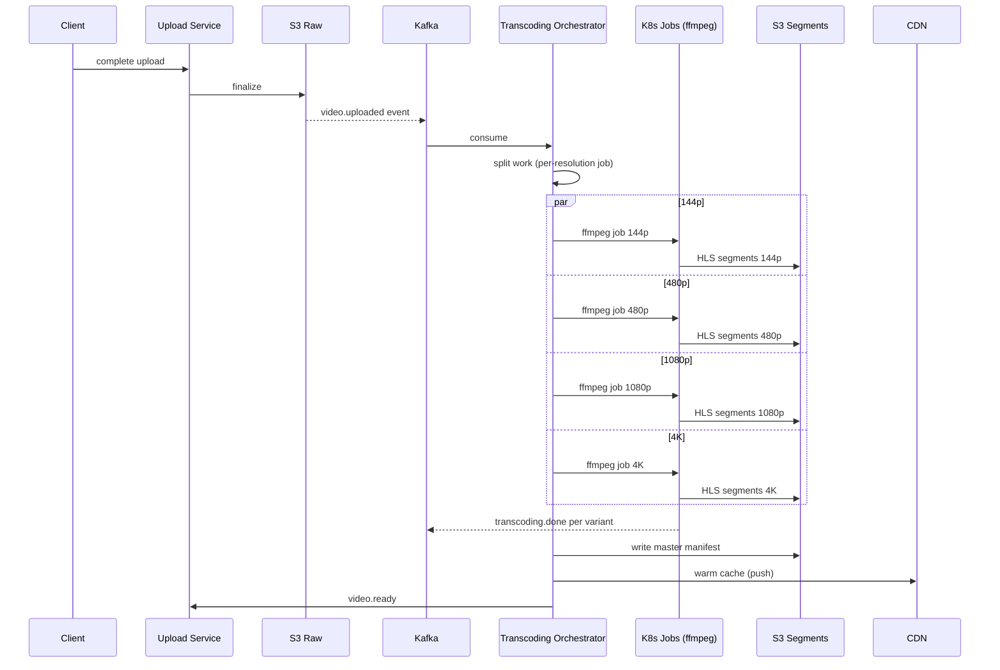
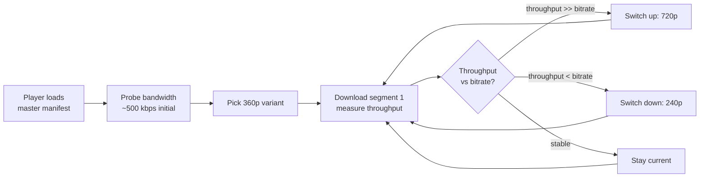
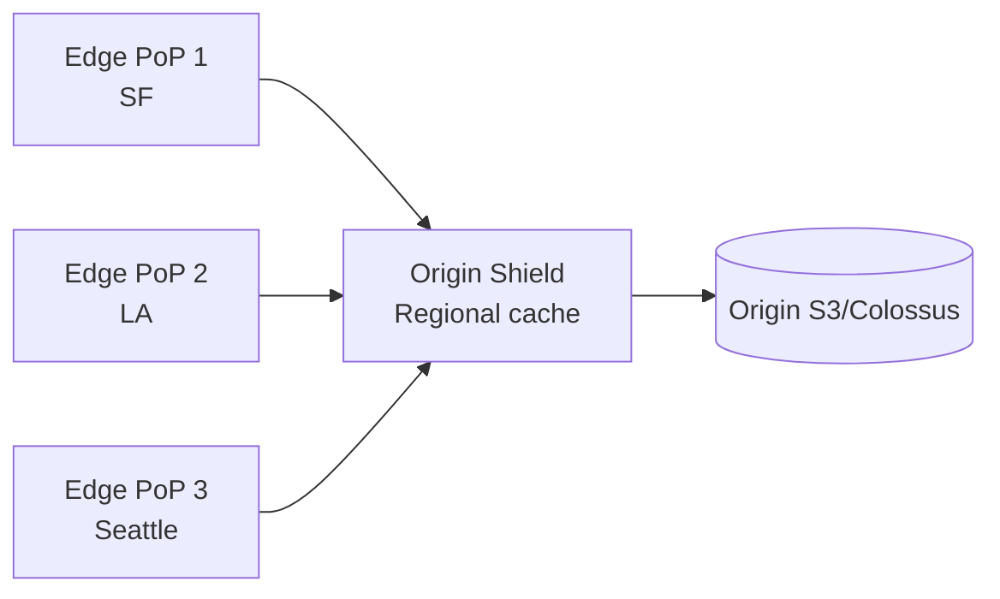
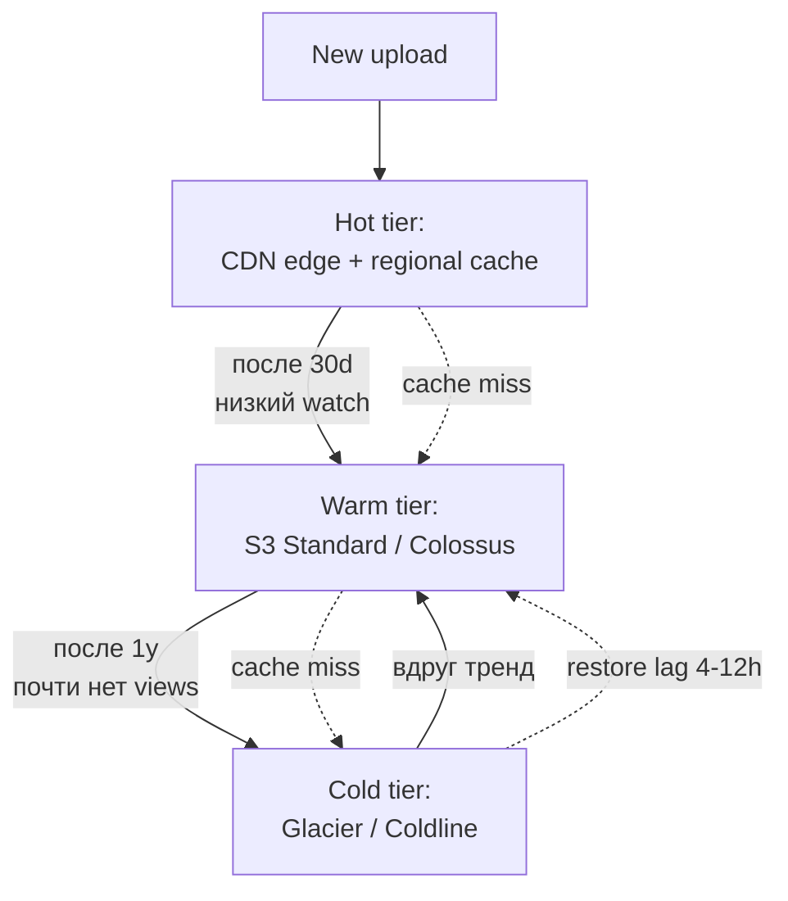
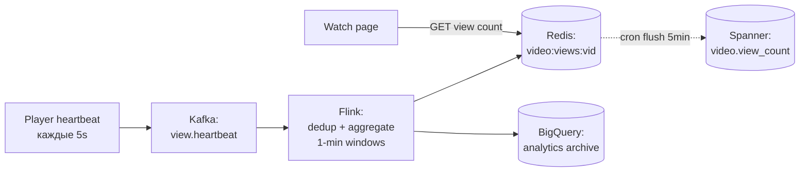
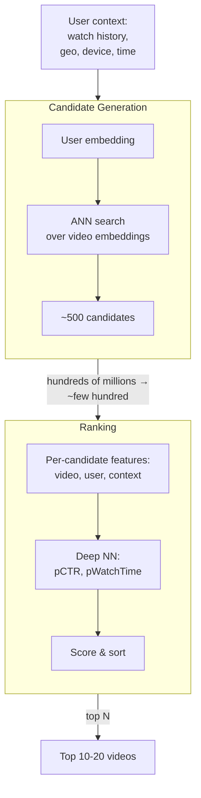
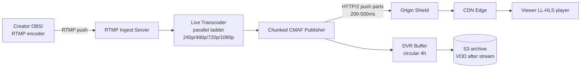
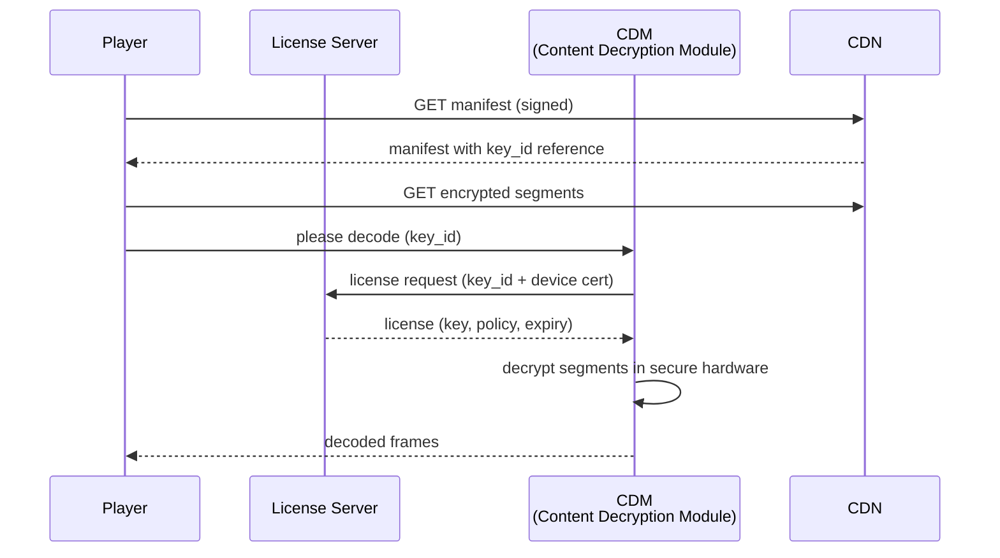
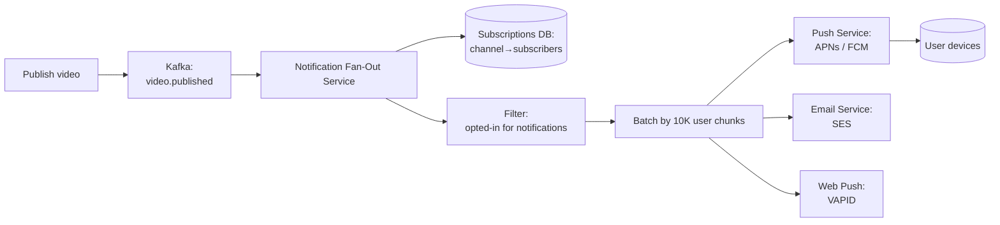

# Вопросы на собеседовании: `Design YouTube`

`YouTube` — крупнейший видеосервис: 2.5B MAU, загружается 500 часов видео в минуту, просматривается 1B часов в день. System design YouTube — это про экстремальный масштаб хранилища (экзабайты), egress (сотни Tbps), pipeline транскодирования и ML-рекомендации.

Эта шпаргалка — про архитектуру, ёмкость (capacity), компромиссы (trade-offs) и production-практики Google/YouTube.

## Полезные ссылки

- [YouTube Engineering Blog](https://blog.youtube/inside-youtube/tags/engineering-and-developers/)
- [HTTP Live Streaming (HLS) spec — RFC 8216](https://datatracker.ietf.org/doc/html/rfc8216)
- [MPEG-DASH spec — ISO/IEC 23009-1](https://www.iso.org/standard/79329.html)
- [CMAF — Common Media Application Format](https://www.iso.org/standard/79106.html)
- [Deep Neural Networks for YouTube Recommendations (Google, 2016)](https://research.google/pubs/pub45530/)
- [Recommending What Video to Watch Next (Google, 2019)](https://research.google/pubs/pub48434/)
- [Content ID — How it works](https://support.google.com/youtube/answer/2797370)
- [Widevine DRM Documentation](https://developers.google.com/widevine)
- [Low-Latency HLS (Apple)](https://developer.apple.com/documentation/http_live_streaming/enabling_low-latency_http_live_streaming_hls)
- [System Design Primer](https://github.com/donnemartin/system-design-primer)

## Содержание

- [Полезные ссылки](#полезные-ссылки)
- [See also](#see-also)

**Requirements и capacity**
- [Q1. (!) Functional и non-functional requirements?](#q1--functional-и-non-functional-requirements)
- [Q2. (!) Capacity estimation: storage, bandwidth, QPS?](#q2--capacity-estimation-storage-bandwidth-qps)
- [Q3. High-level архитектура YouTube?](#q3-high-level-архитектура-youtube)

**Upload pipeline и transcoding**
- [Q4. (!) Upload flow: presigned URL, resumable, chunked?](#q4--upload-flow-presigned-url-resumable-chunked)
- [Q5. (!) Transcoding pipeline: ffmpeg, ladder, codecs?](#q5--transcoding-pipeline-ffmpeg-ladder-codecs)
- [Q6. Какие resolutions/bitrates и почему ladder?](#q6-какие-resolutionsbitrates-и-почему-ladder)
- [Q7. HLS vs DASH vs CMAF?](#q7-hls-vs-dash-vs-cmaf)

**Streaming и ABR**
- [Q8. (!) Adaptive bitrate streaming — как работает?](#q8--adaptive-bitrate-streaming--как-работает)
- [Q9. Manifest (m3u8/mpd) — формат и доставка?](#q9-manifest-m3u8mpd--формат-и-доставка)
- [Q10. Segment size trade-offs (2s vs 6s vs 10s)?](#q10-segment-size-trade-offs-2s-vs-6s-vs-10s)

**CDN и storage**
- [Q11. (!) CDN strategy: multi-CDN, origin shield, edge cache?](#q11--cdn-strategy-multi-cdn-origin-shield-edge-cache)
- [Q12. Storage tiering: hot/warm/cold?](#q12-storage-tiering-hotwarmcold)
- [Q13. Hot videos (viral) — как обрабатывать?](#q13-hot-videos-viral--как-обрабатывать)

**Metadata, views, engagement**
- [Q14. (!) Metadata DB: схема, sharding?](#q14--metadata-db-схема-sharding)
- [Q15. View counts — как считать на масштабе?](#q15-view-counts--как-считать-на-масштабе)
- [Q16. Likes, comments, subscriptions feed?](#q16-likes-comments-subscriptions-feed)

**Recommendations (ML)**
- [Q17. (!) Two-stage recommendation model: candidate + ranking?](#q17--two-stage-recommendation-model-candidate--ranking)
- [Q18. Features для ranking model?](#q18-features-для-ranking-model)
- [Q19. Search: ES, transcripts, ranking?](#q19-search-es-transcripts-ranking)

**Live streaming и monetization**
- [Q20. (!) Live streaming pipeline: RTMP ingest → LL-HLS?](#q20--live-streaming-pipeline-rtmp-ingest--ll-hls)
- [Q21. Ad insertion: SSAI vs CSAI, VAST/VPAID?](#q21-ad-insertion-ssai-vs-csai-vastvpaid)

**Moderation, DRM, geo**
- [Q22. (!) Content moderation: CSAM, Content ID fingerprinting?](#q22--content-moderation-csam-content-id-fingerprinting)
- [Q23. DRM: Widevine, FairPlay, PlayReady?](#q23-drm-widevine-fairplay-playready)
- [Q24. Geo-distribution и regional restrictions?](#q24-geo-distribution-и-regional-restrictions)

**Edge cases и trade-offs**
- [Q25. Failed upload / failed transcoding — recovery?](#q25-failed-upload--failed-transcoding--recovery)
- [Q26. (!) Trade-offs: transcode upfront vs on-demand, CDN cost vs latency?](#q26--trade-offs-transcode-upfront-vs-on-demand-cdn-cost-vs-latency)
- [Q27. CDN cache invalidation для удалённых видео?](#q27-cdn-cache-invalidation-для-удалённых-видео)
- [Q28. Notifications subscribers нового видео?](#q28-notifications-subscribers-нового-видео)

---

## Q1. (!) Functional и non-functional requirements?

**Функциональные требования (functional):**

- Загрузка видео (с прогрессом, resumable).
- Просмотр видео (streaming, ABR, несколько качеств).
- Like / dislike / комментарии / шеринг.
- Подписка на канал, уведомления.
- Рекомендации (лента на главной, Up Next).
- Поиск (по title, description, transcript).
- Страница канала (список видео автора).
- Live streaming.
- Монетизация (реклама, channel memberships).

**Нефункциональные требования (non-functional):**

| Метрика | Цель |
|---------|------|
| MAU | 2.5B пользователей |
| Темп загрузки | 500 часов видео в минуту |
| Объём просмотра | 1B часов в день |
| Latency старта | < 2s от клика до первого кадра |
| Доля ребуферинга | < 0.5% времени просмотра |
| Доступность | 99.95% (watch path) |
| Durability | 11x9s (как S3) для исходных загрузок |
| Гео | Глобальное покрытие, < 50ms от пользователя до CDN edge |

**Вне рамок (на интервью):** биллинг Premium-подписки, аналитический дашборд Studio, выплаты по монетизации, отдельное kids/family-приложение.

**Trade-off для интервью:** явно проговори «фокус на watch path и upload pipeline; рекомендации упомяну на верхнем уровне». Иначе утонешь в ML.

---

## Q2. (!) Capacity estimation: storage, bandwidth, QPS?

**Хранилище загрузок:**

- 500 часов / мин × 60 мин × 24 ч × 365 дн = **263M часов / год** загружается.
- Средний bitrate сырой загрузки ~5 Mbps → 1 час ≈ 2.25 GB. Многие в 1080p+/4K → в среднем ~4 GB/час оригинала.
- 263M × 4 GB ≈ **1 EB оригиналов / год**.
- Транскодированные варианты (10 разрешений × 2 кодека): множитель ×3-5 (старшие разрешения занимают больше всего). Итого хранилище ~**3-5 EB / год** после транскодирования.

**Egress bandwidth:**

- 1B часов смотрится в день → ~42M часов / час.
- Средний bitrate смотрового потока ~3 Mbps (720p — смесь mobile/desktop).
- 42M × 3600 сек × 3 Mbps / 3600 = 42M × 3 Mbps = **126 Tbps в среднем**.
- Пик (prime time, виральное видео): ×2-3 → **250-400 Tbps на пике**.
- Для сравнения: пик Netflix ≈ 100 Tbps, пик сети Cloudflare ≈ 150 Tbps. YouTube сопоставим с глобальным интернет-трафиком крупного континента.

**QPS:**

- Старты просмотров: 1B часов / день, средняя сессия ~10 мин → ~6B стартов/день → **70K QPS в среднем**, ~200K QPS на пике.
- Старты загрузок: 500 h / min × ~10 min в среднем = ~50 активных загрузок/мин. Низкий QPS, но много байт.
- Чтения метаданных (страница видео, страница канала, рекомендации): ~10× от стартов просмотра → **2M QPS на метаданных**.

**Egress CDN доминирует** в стоимости инфраструктуры. Поэтому YouTube строит собственную CDN (Google Global Cache, GGC) — серверы внутри ISP.

---

## Q3. High-level архитектура YouTube?



Ключевые компоненты:

- **Upload path:** API Gateway → presigned URL → object store (raw) → Kafka → воркеры транскодирования → object store (segments) → CDN.
- **Watch path:** API Gateway → сервис метаданных → URL манифеста → CDN (segments).
- **Recommendation path:** offline-batch (Spark/Beam) генерит кандидатов, online-ranking при запросе.
- **Engagement path:** Kafka → Flink → счётчики в Redis.

Сервис — **read-heavy (~100:1)** на уровне сегментов. Поэтому всё CDN-кеширование агрессивно.

---

## Q4. (!) Upload flow: presigned URL, resumable, chunked?

**Шаги:**

1. Клиент → `POST /api/v1/uploads/init` с `{filename, size, mimeType}`.
2. Сервер создаёт `video_id`, генерит **resumable upload URL** (signed, истекает через 24h). Сохраняет в таблице `uploads`.
3. Клиент загружает чанками (5-100 MB) на signed URL: `PUT /upload?uploadId=xxx&partNumber=N`.
4. После всех чанков → `POST /api/v1/uploads/{video_id}/complete`. S3 Multipart Complete объединяет parts.
5. S3-событие → SNS/SQS/Kafka → запускает pipeline транскодирования.

**Resumable (RFC 7233 Range):**

```http
POST /upload?uploadId=abc HTTP/1.1
Content-Range: bytes 0-5242879/52428800
Content-Length: 5242880

[5MB chunk]
```

Если сеть упала на 30% — клиент делает `HEAD /upload?uploadId=abc`, сервер отвечает `Range: bytes=0-15728639/52428800`, клиент возобновляет с offset 15728640.

**Java-сниппет (S3 multipart):**

```java
// 1. Initiate
InitiateMultipartUploadResponse init = s3.initiateMultipartUpload(
    InitiateMultipartUploadRequest.builder()
        .bucket("yt-raw-uploads")
        .key("videos/" + videoId + "/original.mp4")
        .build()
);
String uploadId = init.uploadId();

// 2. Upload parts (parallel, 5MB-100MB each)
List<CompletedPart> parts = new ArrayList<>();
for (int i = 0; i < chunks.size(); i++) {
    UploadPartResponse resp = s3.uploadPart(
        UploadPartRequest.builder()
            .bucket("yt-raw-uploads")
            .key(key)
            .uploadId(uploadId)
            .partNumber(i + 1)
            .build(),
        RequestBody.fromBytes(chunks.get(i))
    );
    parts.add(CompletedPart.builder().partNumber(i + 1).eTag(resp.eTag()).build());
}

// 3. Complete
s3.completeMultipartUpload(
    CompleteMultipartUploadRequest.builder()
        .bucket("yt-raw-uploads")
        .key(key)
        .uploadId(uploadId)
        .multipartUpload(CompletedMultipartUpload.builder().parts(parts).build())
        .build()
);
```

**Зачем presigned URL:** клиент льёт байты **напрямую** в object store, минуя backend. Backend не вытянул бы масштабирование пропускной способности до TB/sec.

---

## Q5. (!) Transcoding pipeline: ffmpeg, ladder, codecs?



**Команда ffmpeg для одного варианта HLS 720p H.264:**

```bash
ffmpeg -i input.mp4 \
  -c:v libx264 -profile:v main -preset veryfast \
  -b:v 2800k -maxrate 2996k -bufsize 4200k \
  -vf "scale=-2:720" -g 48 -keyint_min 48 -sc_threshold 0 \
  -c:a aac -ar 48000 -b:a 128k \
  -hls_time 6 -hls_playlist_type vod \
  -hls_segment_filename "720p_%04d.ts" \
  720p.m3u8
```

Ключевое:

- `-g 48` — размер GOP 48 кадров (2 секунды при 24fps). Keyframe в начале каждого сегмента обязателен для seek и переключения ABR.
- `-keyint_min 48 -sc_threshold 0` — выключает scene-cut keyframes, GOP строго фиксированный.
- `-hls_time 6` — сегмент ~6 секунд.

**Параллелизм:** YouTube распиливает видео на **чанки по времени** (например, 30-секундные блоки) и запускает 100+ воркеров параллельно → часовое видео транскодируется за минуты. Затем merge.

**Кодеки (несколько — под разных клиентов):**

| Кодек | Год | Сжатие | Поддержка декодером |
|-------|-----|-------------|-----------------|
| H.264 (AVC) | 2003 | baseline | универсально, hardware повсюду |
| H.265 (HEVC) | 2013 | -50% bitrate vs H.264 | Apple, современный Android, проблемы с роялти |
| VP9 | 2013 | сопоставимо с HEVC | native в YouTube/Chrome, royalty-free |
| AV1 | 2018 | -30% vs VP9 | новейшие клиенты, медленный encode |

YouTube кодирует **VP9 (приоритет) + H.264 (fallback)**, для топовых видео ещё AV1 на 4K.

---

## Q6. Какие resolutions/bitrates и почему ladder?

**Bitrate ladder** — набор `{разрешение, bitrate}` для ABR. Каждая «ступенька» нацелена на конкретную bandwidth-категорию клиентов.

| Разрешение | Bitrate (H.264) | Сценарий |
|------------|-----------------|----------|
| 144p | 80-100 kbps | предельный mobile (2G), audio-first |
| 240p | 300 kbps | медленный 3G |
| 360p | 700 kbps | 3G |
| 480p (SD) | 1.2 Mbps | 4G, слабый Wi-Fi |
| 720p (HD) | 2.8 Mbps | default для 4G/Wi-Fi |
| 1080p (FHD) | 5 Mbps | broadband |
| 1440p (QHD) | 8 Mbps | broadband, desktop |
| 2160p (4K) | 16 Mbps | быстрый broadband, 4K-дисплей |

**Зачем 144p в 2026?** Развивающиеся рынки (Индия, Африка), плохой 3G, экономия мобильного трафика. У YouTube огромная не-западная аудитория.

**Per-title encoding** (подход Netflix, теперь и YouTube): анализируют сложность контента и выдают **разный ladder для разных видео**. Ролик с говорящей головой может уложиться в 1 Mbps на 720p, а экшн-сцена требует 4 Mbps.

**Content-aware encoding (CAE):** двухпроходный анализ → переменный bitrate (VBR) с ограничениями по пику.

---

## Q7. HLS vs DASH vs CMAF?

| | HLS | DASH | CMAF |
|---|---|---|---|
| Создатель | Apple (2009) | MPEG (2012) | MPEG (2018) |
| Manifest | `.m3u8` (текст) | `.mpd` (XML) | использует HLS или DASH |
| Контейнер | `.ts` (исторически), теперь `.fmp4` | `.m4s` (fragmented MP4) | `.cmfv` (fragmented MP4) |
| iOS/Safari | native | через MSE-polyfill | native (CMAF-HLS) |
| Android/Chrome | native (с Android 3+) | native | native |
| Smart TV | как повезёт | широко | широко |
| DRM | FairPlay (sample-AES) | Widevine + PlayReady (CENC) | универсальный CENC |

**Проблема двух стандартов:** до CMAF приходилось хранить **двойной набор сегментов** (TS для HLS + m4s для DASH) → 2× стоимость хранения на CDN.

**CMAF (Common Media Application Format):** **одни и те же** сегменты `.cmfv` шарятся между манифестами HLS и DASH. Кодируешь 1 раз → отдаёшь обоим. **Срезает CDN storage в 2 раза.**

YouTube **давно перешёл на CMAF**. HLS-плееры запрашивают `master.m3u8` → внутри ссылки на сегменты `.cmfv`. DASH-плееры запрашивают `manifest.mpd` → ссылки на те же `.cmfv`.

---

## Q8. (!) Adaptive bitrate streaming — как работает?

**ABR (Adaptive Bitrate)** — клиент **сам** переключает качество на лету в зависимости от пропускной способности.



**Алгоритмы:**

1. **На основе throughput (наивный):** скользящее среднее по последним N сегментам. Спотыкается на bursty-сети.
2. **На основе буфера (BBA, Netflix-style):** смотрит на **заполненность буфера** (сколько секунд в буфере). Буфер низкий → снижаем качество, буфер высокий → повышаем. Стабильнее.
3. **MPC / Pensieve (RL):** комбинирует оба сигнала через model-predictive control / deep RL. Google использует ABR на базе ML.

**Гранулярность переключения:** на границе **сегмента** (то есть каждые 2-6s). Поэтому короче сегменты → быстрее адаптация, но больше накладных расходов на запросы манифеста.

**Оценщик bandwidth** для cellular: использует **TCP throughput** последнего сегмента. Для QUIC/HTTP3 — congestion window от транспорта.

**Псевдокод выбора варианта в стиле Java:**

```java
public Variant pickNextVariant(double measuredThroughputBps, double bufferSeconds) {
    double safetyFactor = bufferSeconds > 20 ? 1.0 : 0.7; // консервативно при низком буфере
    double targetBitrate = measuredThroughputBps * safetyFactor;
    return ladder.stream()
        .filter(v -> v.bitrateBps() <= targetBitrate)
        .max(Comparator.comparing(Variant::bitrateBps))
        .orElse(ladder.lowest());
}
```

---

## Q9. Manifest (m3u8/mpd) — формат и доставка?

**Мастер-манифест HLS:**

```m3u8
#EXTM3U
#EXT-X-VERSION:6

#EXT-X-STREAM-INF:BANDWIDTH=300000,RESOLUTION=426x240,CODECS="avc1.42c015"
240p/playlist.m3u8

#EXT-X-STREAM-INF:BANDWIDTH=700000,RESOLUTION=640x360,CODECS="avc1.4d401e"
360p/playlist.m3u8

#EXT-X-STREAM-INF:BANDWIDTH=2800000,RESOLUTION=1280x720,CODECS="avc1.640020"
720p/playlist.m3u8

#EXT-X-STREAM-INF:BANDWIDTH=5000000,RESOLUTION=1920x1080,CODECS="avc1.640028"
1080p/playlist.m3u8
```

**Медиа-плейлист (720p):**

```m3u8
#EXTM3U
#EXT-X-VERSION:6
#EXT-X-TARGETDURATION:6
#EXT-X-MEDIA-SEQUENCE:0
#EXT-X-PLAYLIST-TYPE:VOD

#EXTINF:6.000,
720p_0000.cmfv
#EXTINF:6.000,
720p_0001.cmfv
#EXTINF:6.000,
720p_0002.cmfv
...
#EXT-X-ENDLIST
```

**Доставка:**

- Мастер-манифест **на каждый video_id** — почти неизменяем, кешируется в CDN на длинный TTL (24h).
- Сегменты **неизменяемы** — длинный TTL (год), versioned URL (`/segments/{video_id}/720p_0001_v3.cmfv`).
- URL манифеста подписан: `?token=xxx&exp=...` — для DRM и контроля доступа.

**Edge case с live:** для live-трансляции манифест **меняется** (добавляются новые сегменты). TTL короткий (1-2s), для LL-HLS используются `#EXT-X-PART`.

---

## Q10. Segment size trade-offs (2s vs 6s vs 10s)?

| Сегмент | За | Против |
|---------|-----|-----|
| 2s | Быстрая адаптация ABR, низкая live-latency | Много запросов (overhead), TCP slow start на каждом, бьёт по CDN |
| 6s | Баланс (default в HLS) | Стандарт для VOD |
| 10s | Меньше запросов, выше cache hit rate на CDN | Медленная адаптация, высокая live-latency |

**Для VOD:** YouTube использует сегменты по **5-6s**. Достаточно частая адаптация, низкий overhead.

**Для live:** **2s** + LL-HLS-парты по **200-500ms** (HTTP/2 push или CTE — chunked transfer encoding). Это даёт **end-to-end latency ~3s** против стандартного HLS ~30s.

**Расчёт:** для часового видео с сегментами по 6s → 600 файлов. Манифест ~50 KB. Каждый сегмент ~2 MB на 720p. Итого для ladder /1080p ≈ 1.5 GB на час на вариант.

---

## Q11. (!) CDN strategy: multi-CDN, origin shield, edge cache?

**Multi-CDN:**

YouTube использует **собственную CDN** — Google Global Cache (GGC):

- **GGC-ноды** размещены **внутри ISP** по всему миру (1500+ провайдеров). Когда ты в Москве смотришь YouTube — сегменты идут с GGC-сервера твоего провайдера, **не выходя из его сети**.
- Это **edge peering**: ISP экономит transit-трафик, Google экономит egress. Win-win.
- На границе — собственные edge-PoP Google (Google Edge Network), затем backbone Google.

Для **не-Google-сервисов** (CDN как продукт) — коммерческий multi-CDN: CloudFront + Akamai + Cloudflare + Fastly с балансировкой на базе DNS (например, Cedexis/Citrix ITM) или выбором на стороне клиента.

**Origin shield:**



Edge-нода при miss идёт не сразу в origin, а в **regional shield**. Виральное видео → много edges промахиваются параллельно → shield делает **один** запрос к origin, остальные ждут (request coalescing). Защищает origin от thundering herd.

**Edge-кеширование:**

- Сегменты — **неизменяемые, content-hashed URL** → cache TTL = 1 год.
- Мастер-манифест — TTL 24h (можно поменять при перекодировании).
- Live-манифест — TTL 1s + `Cache-Control: no-store` для верхушки плейлиста.
- Политика вытеснения на edge: **LRU** + с учётом популярности (LFU). Long-tail-видео вылетают первыми.

---

## Q12. Storage tiering: hot/warm/cold?



**Tiers и стоимость (порядок величин):**

| Tier | Цена / GB / мес | Latency чтения | Сценарий |
|------|--------------------|--------------|----------|
| CDN edge | $0 (sunk) | ~5ms | топ-0.1% видео |
| S3 Standard / Colossus | $0.023 | ~50ms | активный long-tail |
| S3 IA | $0.0125 | ~100ms | редко смотримое |
| Glacier Instant | $0.004 | ~100ms | архив, изредка читаемый |
| Glacier Deep Archive | $0.00099 | ~12h на restore | совсем редко |

**Степенное распределение (power-law):** ~80% времени просмотра приходится на **~0.1% видео** (популярные). Остальные 99.9% — long tail, могут месяцами не запрашиваться.

YouTube **не** держит весь long-tail в горячем CDN — только манифест + первый сегмент (для быстрого старта). Остальные сегменты подгружаются (pre-fetch) при запросе старого видео.

**Trade-off:** хранить транскодированные варианты long-tail-видео или **транскодировать on-demand** при первом запросе? YouTube исторически **транскодирует всё заранее** (CPU дешевле, чем latency извлечения из storage для UX). Но Netflix на части контента делает on-demand.

---

## Q13. Hot videos (viral) — как обрабатывать?

Когда видео становится виральным (миллион просмотров/час):

1. **Pre-warm кеша** в большем числе PoP — заранее push на множество edges.
2. **Приоритетная очередь транскодирования:** если видео только что загрузили и оно резко взлетело — пропускают через transcoding ladder быстрее (приоритетная K8s-очередь).
3. **Адаптивная репликация** в metadata DB: горячие строки реплицируются в большее число регионов (read-реплики).
4. **Request coalescing на origin shield** (см. Q11) — защита от thundering herd.
5. **Premium-кодек:** для топ-0.001% видео генерят AV1 (-30% bitrate) → экономия egress на длинной дистанции.
6. **Предиктивное кеширование:** ML-модель предсказывает грядущий всплеск (по ранним сигналам: число подписчиков, географический разброс первых просмотров) → push в CDN до пика.

**Защита от cache stampede** при miss:

```
GET segment_X.cmfv → cache miss → 1000 параллельных requests на shield
                                    ↓
                          shield deduplicates: первый request идёт в origin,
                          остальные блокируются на short-lived lock
                                    ↓
                          response пришёл → unlock → все отвечают из shield cache
```

---

## Q14. (!) Metadata DB: схема, sharding?

**Таблица `video_metadata`:**

| колонка | тип | примечание |
|--------|------|-----------|
| video_id | string (11 символов) | partition key, шардинг по хешу |
| uploader_user_id | bigint | вторичный индекс |
| title | string | до 100 символов |
| description | text | до 5K символов |
| upload_ts | timestamp | |
| publish_ts | timestamp | nullable (отложенная публикация) |
| duration_sec | int | |
| visibility | enum | public/unlisted/private |
| category | string | |
| tags | array<string> | |
| transcoding_status | enum | pending/processing/ready/failed |
| manifest_url | string | путь к master.m3u8/cmaf |
| thumbnail_urls | array<string> | превью-кадры |
| age_restricted | bool | |
| geo_blocked_countries | array<string> | |

**Выбор хранилища — Spanner (или Cassandra):**

- Spanner — глобально консистентный, транзакционный, шардится по primary key. Для основных метаданных.
- Cassandra — eventually consistent, write-heavy. Подходит для аналитики или комментариев.
- BigTable — для счётчиков просмотров (KV).

**Стратегия шардинга:**

- `video_metadata` — hash-партиционирование по `video_id`. Равномерное распределение, горячее видео не убивает один shard.
- `channel_videos` (видео по аплоадеру) — партиция по `user_id`, сортировка по `upload_ts DESC`. Запрос страницы канала — точечный.
- `subscriptions` — партиция по `subscriber_user_id`, список `channel_id`. Для ленты.
- `comments` — партиция по `video_id`, но с **вторичной партицией по time-bucket** для популярных видео с миллионами комментариев.

**Video ID:** короткие 11-символьные base64 → URL-safe. Генерация через UUID → base64 → обрезка, проверка уникальности через БД.

---

## Q15. View counts — как считать на масштабе?

Точный подсчёт нерентабелен: 1B просмотров/день × write-amplification → миллионы записей/сек в БД.

**Решение — pipeline в духе Lambda-архитектуры:**



**Логика подсчёта:**

- Просмотр засчитывается, если посмотрели ≥ **30 секунд** (исторически правило YouTube).
- Плеер шлёт heartbeat каждые 5s с `{video_id, user_id, position, session_id}`.
- Flink дедуплицирует по `(video_id, user_id, session_id)` за окно (борьба с refresh-спамом).
- Счётчики в Redis (INCR по ключу `video:views:{video_id}`).
- Каждые 5 мин flush из Redis → Spanner (durable-счётчик).
- UI читает из Redis (eventual consistency, задержка ±секунды).

**Анти-фрод:**

- Детектирование ботов (частотный анализ, browser fingerprint).
- Порог просмотра (30s) защищает от skip-спама.
- Throttling: 1 просмотр на пользователя на видео за 24h.

**Защита от всплесков:** при виральном всплеске Redis INCR может стать узким местом → шардить счётчик по hash-партициям, суммировать при чтении.

---

## Q16. Likes, comments, subscriptions feed?

**Лайки:**

- Тот же паттерн: Kafka → Flink → счётчик в Redis. Eventual consistency.
- Уникальность: `like(user_id, video_id)` в БД; если уже лайкнуто — не инкрементить.

**Комментарии:**

- Хранилище: Cassandra или Spanner, партиция по `video_id`.
- Горячие видео: миллионы комментариев → пагинация на курсорах (`?after=comment_id`).
- Сортировка: по `top` (ответы/апвоуты), `new`, `controversial`.
- Threading: parent_comment_id, ограничение глубины 2 (верхний уровень + ответы).

**Лента подписок (subscriptions feed):**

- На pull-time: для каждого пользователя взять `subscriptions[user_id]` → для каждого канала взять последние 10 видео → merge по времени → top N.
- На масштабе неэффективно для каналов с **heavy fan-out** (MrBeast с 200M подписчиков).
- Гибрид: pull для обычных пользователей, push (fan-out на write) для топовых креаторов с лимитом — но в feed-таблицу всех подписчиков.
- См. подробнее: [design-feed-system-interview.md](design-feed-system-interview.md), [design-twitter-interview.md](design-twitter-interview.md).

---

## Q17. (!) Two-stage recommendation model: candidate + ranking?

Рекомендации YouTube (Up Next + главная) — **двухстадийные (two-stage)**:



**Стадия 1: генерация кандидатов (Candidate Generation):**

- Цель — из ~10⁹ видео отобрать ~10² релевантных. Recall важнее precision.
- Модель: two-tower neural network. Учит **user embedding** и **video embedding** в общем латентном пространстве.
- При обслуживании запроса: query = user embedding → поиск **ANN (approximate nearest neighbor)** по миллионам video embeddings (FAISS, ScaNN).
- Целевая latency: < 50ms.

**Стадия 2: ранжирование (Ranking):**

- Цель — точно ранжировать ~500 кандидатов → top 10-20. Здесь важна precision.
- Deep neural network с **сотнями фич**: фичи видео (возраст, язык, качество канала), фичи пользователя (история просмотров, демография), контекст (устройство, время суток).
- Multi-objective: предсказать CTR, ожидаемое время просмотра, ожидаемую удовлетворённость (лайки/дизлайки).
- Целевая latency: < 100ms на весь батч из 500.

**Offline vs online:**

- Эмбеддинги (offline): Spark/Beam обучает раз в N часов, batch-кодирование видео.
- Модель ранжирования (online): TF Serving / KFServing.
- A/B-тестирование постоянное — десятки экспериментов параллельно.

---

## Q18. Features для ranking model?

**Фичи видео:**

- `video_age_hours`, `total_views`, `like_ratio`, `comment_count`.
- `channel_quality_score` (сигналы аплоадера).
- `topic_embedding` (категория, теги, transcript).
- `language`, `geographic_target`.
- `monetization_eligible` (для рекламы).

**Фичи пользователя:**

- `watch_history_embedding` (последние 50 видео).
- `search_history_embedding`.
- `demographics` (возрастная группа, страна, устройство).
- `subscription_signal` (подписан ли на канал?).
- `time_since_last_visit`.

**Контекст:**

- `device_type` (mobile/TV/desktop).
- `time_of_day`, `day_of_week`.
- `referrer` (главная / поиск / страница канала).
- `previous_video_in_session`.

**Cross-фичи:** взаимодействия пользователь × видео — например, «пользователь со смартфона × видео в landscape-ориентации» — модель учит нелинейные комбинации через feature crosses или deep embedding.

**Multi-objective head:** одна модель предсказывает **сразу несколько** скаляров:

- p(click | impression)
- E[watch_time | click]
- p(like | watch)
- p(share)
- p(skip-within-5s) — негативный сигнал

Итоговый score: взвешенная комбинация, веса настраиваются под бизнес-метрику (вовлечённость vs выручка).

См. также: [embeddings-interview.md](../ai-ml/embeddings-interview.md), [llm-integration-patterns-interview.md](../ai-ml/llm-integration-patterns-interview.md).

---

## Q19. Search: ES, transcripts, ranking?

**Pipeline:**

1. При загрузке + транскодировании параллельно гонят **ASR (Automatic Speech Recognition)** → transcript.
2. Индексация в Elasticsearch:
   - `title`, `description` — text-поля с кастомным анализатором (russian + english).
   - `tags` — keyword.
   - `transcript_chunks` — отдельное поле, разбитое на окна по 30s. Позволяет deep-link «перейти к позиции из поиска».
   - `channel_name`, `category` — keyword.
3. Запрос: multi-match по полям + boost по вовлечённости (просмотры, свежесть).
4. Модель ранжирования — отдельная Learn-to-Rank-модель (LambdaMART / DNN), переранжирует top-100 результатов ES.

```json
{
  "query": {
    "function_score": {
      "query": {
        "multi_match": {
          "query": "kubernetes tutorial",
          "fields": ["title^3", "description^1", "transcript_chunks.text^0.5", "tags^2"],
          "fuzziness": "AUTO"
        }
      },
      "functions": [
        {"field_value_factor": {"field": "log_views", "factor": 1.2}},
        {"gauss": {"upload_ts": {"scale": "30d", "decay": 0.5}}}
      ],
      "score_mode": "multiply"
    }
  }
}
```

**Автодополнение:** отдельный сервис на edge-ngram + счётчик популярности (топ-запросы за последние 24h из Redis). Целевая latency < 50ms.

**Устойчивость к опечаткам:** ES fuzzy + phonetic + spell correction (кастомный словарь с типичными опечатками).

См. подробнее: [design-search-interview.md](design-search-interview.md).

---

## Q20. (!) Live streaming pipeline: RTMP ingest → LL-HLS?



**Ingest:** креатор пушит **RTMP** (TCP) или **SRT/WebRTC** (UDP) на ingest-сервер. RTMP — стандарт, но latency 5-30s.

**Live transcoding ladder:** энкодинг в реальном времени в несколько разрешений. На GPU/ASIC (ради стоимости) — H.264 NVENC, или собственный кремний Google VCU (Video Coding Unit).

**LL-HLS (Low-Latency HLS):**

- Сегменты по 2s, но внутри сегментов — **HTTP/2 push of parts** по 200-500ms.
- Манифест содержит теги `#EXT-X-PART`:

```m3u8
#EXT-X-PART:DURATION=0.33,URI="seg42_part0.cmfv"
#EXT-X-PART:DURATION=0.33,URI="seg42_part1.cmfv",INDEPENDENT=YES
#EXT-X-PART:DURATION=0.33,URI="seg42_part2.cmfv"
#EXT-X-PRELOAD-HINT:TYPE=PART,URI="seg42_part3.cmfv"
```

- `INDEPENDENT=YES` — этот part начинается с keyframe → можно сразу переключить ABR.
- End-to-end latency 2-5s против обычного HLS 30s+.

**Альтернативы:** WebRTC — sub-second latency, но плохо масштабируется (peer-based). Используется для интерактива (звонки, live-чат), не для broadcast.

**DVR:** последние N часов live-стрима хранятся в кольцевом буфере → пользователь может «отмотать назад» во время трансляции.

**После окончания стрима:** финализация в **VOD**-ассет — сегменты копируются в долговременное хранилище, видео добавляется в pipeline транскодирования для дополнительных кодеков (AV1 и т.п.).

---

## Q21. Ad insertion: SSAI vs CSAI, VAST/VPAID?

**Форматы:**

- **Pre-roll** — реклама до видео.
- **Mid-roll** — встроена в середину.
- **Post-roll** — после.
- **Bumper** — короткая 6s без пропуска.
- **Overlay/banner** — поверх плеера.

**Две стратегии сшивки (stitching):**

| | CSAI (Client-Side) | SSAI (Server-Side) |
|---|---|---|
| Как работает | Плеер знает про рекламу, ставит основное видео на паузу, проигрывает ad-ассет | Сервер вставляет ad-сегменты **прямо в манифест** между сегментами контента |
| AdBlock | легко блокировать (отдельный домен) | сложно (тот же манифест) |
| Pixel tracking | богатый (player-aware) | ограниченный (server log) |
| Latency переключения контент↔реклама | заметная (загрузка ad-плеера) | бесшовная (тот же буфер) |
| Персонализация | per-user | per-user (сервер вставляет разную рекламу на каждую сессию) |
| Где используется | мобильные приложения, веб | LL-стримы, Connected TV |

**VAST (Video Ad Serving Template)** — XML-стандарт от IAB:

```xml
<VAST version="4.2">
  <Ad>
    <InLine>
      <AdSystem>YouTube Ads</AdSystem>
      <Impression><![CDATA[https://ads.example/impression?adid=123]]></Impression>
      <Creatives>
        <Creative>
          <Linear>
            <Duration>00:00:15</Duration>
            <TrackingEvents>
              <Tracking event="complete"><![CDATA[https://ads.example/complete]]></Tracking>
            </TrackingEvents>
            <MediaFiles>
              <MediaFile type="video/mp4" bitrate="2000">
                <![CDATA[https://ads.example/creative.mp4]]>
              </MediaFile>
            </MediaFiles>
          </Linear>
        </Creative>
      </Creatives>
    </InLine>
  </Ad>
</VAST>
```

**VPAID** — интерактивная реклама (кликабельные оверлеи, опросы). Был популярен, теперь deprecated в пользу **SIMID**.

**Frequency capping:** не показывать одну и ту же рекламу одному пользователю >N раз/день → счётчик в Redis по (user_id, ad_id).

---

## Q22. (!) Content moderation: CSAM, Content ID fingerprinting?

**Слои модерации:**

1. **До загрузки (на сыром файле):**
   - **Детектирование CSAM** (PhotoDNA / Google CSAI Match): hash-сопоставление с известной базой материалов с насилием над детьми. Обязательно по закону.
   - Антивирусное сканирование.
2. **После транскодирования (на выходном файле):**
   - **Content ID (копирайт):** система фингерпринтинга от Google. Правообладатели загружают эталонный контент → каждое новое видео фингерпринтится (audio + video) → сопоставляется с эталонной БД. Совпадение → claim, блокировка, перенаправление монетизации.
   - **ML-классификатор:** нагота / насилие / экстремизм / hate speech → в очередь на ручную проверку.
3. **Во время просмотра:**
   - Применение возрастных ограничений (требуется вход в аккаунт).
   - Региональные ограничения (geo-block).
4. **После публикации (сигналы сообщества):**
   - Жалобы пользователей → очередь на ревью.
   - Модерация спама/комментариев (ML + сообщество).

**Детали Content ID:**

- **Аудио-фингерпринт:** акустический отпечаток (spectrogram hashing в духе Shazam) → устойчив к перекодированию, сдвигу высоты тона.
- **Видео-фингерпринт:** перцептивный хеш (pHash) на каждый keyframe → устойчив к кропу, вотермаркам, лёгкой потере качества.
- Результаты совпадения: claim → владелец решает: **заблокировать** / **монетизировать** (доход с рекламы идёт владельцу) / **отслеживать**.

**Масштаб:** ~500 часов загрузок/мин × извлечение фингерпринта → массивный GPU/TPU pipeline. Асинхронно, не блокирует публикацию — claim может появиться через минуты-часы.

---

## Q23. DRM: Widevine, FairPlay, PlayReady?

**Зачем DRM:** премиум-контент (YouTube Movies, Premium-стримы, кино) — правообладатели требуют **шифрования + управления ключами** + защищённого декодирования.

**Три основных DRM:**

| DRM | Вендор | Платформы |
|-----|--------|-----------|
| Widevine | Google | Chrome, Android, ChromeOS, Smart TV |
| FairPlay | Apple | Safari, iOS, tvOS, macOS |
| PlayReady | Microsoft | Edge, Windows, Xbox, некоторые TV |

**Поток:**



**Ключевые концепции:**

- **CENC (Common Encryption):** стандартный AES-128 CTR/CBC. **Один и тот же** зашифрованный ассет работает со **всеми** DRM-системами — отличаются только license server и доставка ключей.
- **Secure media path:** декодирование и рендеринг в **TEE/SGX/Secure Element** (на уровне железа). Захват экрана блокируется или ведёт к снижению качества.
- **Политика лицензии:** TTL (например, 24h), ограничения воспроизведения (требуется HDCP, можно ли offline-воспроизведение, максимальное разрешение).
- **Multi-DRM packaging:** один CMAF-файл + несколько license-серверов (Widevine + FairPlay + PlayReady) → под разные платформы.

**Для обычных видео YouTube:** DRM не используется (бесплатный контент). Только sample-AES для премиум-стримов, Movies, музыки.

---

## Q24. Geo-distribution и regional restrictions?

**Гео-распределение:**

- На базе DNS: пользователь запрашивает `youtube.com` → резолвинг возвращает **ближайший CDN PoP** (через GeoDNS / Anycast).
- Google использует **Anycast IP** — один IP, маршрутизация BGP к ближайшему дата-центру.
- CDN-edges в каждом крупном регионе (NA, EU, APAC, LATAM, Африка, AU).
- Репликация хранилища: 3+ региона ради durability.

**Региональные ограничения (geo-block):**

- Поле на каждое видео `geo_blocked_countries: ["US", "UK"]`.
- При watch-запросе: backend определяет страну пользователя (IP geo-lookup) → если в blocklist → возвращает 451 (Unavailable For Legal Reasons) + альтернативные рекомендации.
- Обход через VPN: возможен; YouTube пытается выявлять по IP-репутации / device fingerprint, но не блокирует радикально.

**Комплаенс:**

- DMCA (US), запросы на удаление по копирайту.
- GDPR (EU): право на забвение — удалить данные пользователя, анонимизировать комментарии.
- Локальное законодательство о контенте (Россия, Китай, Саудовская Аравия — там, где сервис вообще доступен).

**Локализация языка:**

- Автопереведённые субтитры (ASR + MT).
- Автодублированное аудио (TTS) — beta.
- Локализованные поиск/рекомендации под локаль.

---

## Q25. Failed upload / failed transcoding — recovery?

**Неуспешная загрузка:**

- Resumable upload (RFC 7233) — клиент возобновляет с последнего байта (см. Q4).
- Если клиент не возобновился в течение 24h → cleanup-job удаляет осиротевшие parts из S3 (S3 multipart aborted).
- Если загрузка **завершена**, но клиент не закрыл сессию → backend всё равно триггерит транскодирование по S3-событию.

**Неуспешное транскодирование:**

- Повторы K8s Job: 3 попытки. Если все провалились → в **dead-letter topic**.
- Consumer DLT: алертинг + ручной разбор. Частая причина — повреждённый исходник (битый кодек, неполный файл).
- На UI: статус `failed` → аплоадер видит «обработка видео не удалась», может загрузить заново.
- **Частичный успех:** если 720p закодировано, а 4K упало → публикуем с 720p, повторяем 4K в фоне. Видео доступно, просто без топового качества.

**Удалённое видео:**

- Delete API → soft delete (status=deleted) в метаданных.
- Cron-job: очистка S3-объектов, отзыв DRM-ключей.
- **CDN purge:** активный purge через CDN API (`PURGE /video/{id}/*`) → инвалидирует edge-кеш во всех PoP. Latency: 1-30 секунд.
- URL манифеста после purge переадресуется на страницу ошибки.

**Повреждённый CDN edge:**

- Health-check каждые 30s. Упавший edge → DNS убирает его из ротации.
- Повтор пользователя на следующем сегменте попадает на другой edge.

---

## Q26. (!) Trade-offs: transcode upfront vs on-demand, CDN cost vs latency?

**Транскодирование заранее (eager) vs по запросу (lazy):**

| | Заранее | По запросу |
|---|---|---|
| Хранилище | высокое (хранится ×N вариантов) | низкое (только оригинал) |
| Latency первого просмотра | мгновенно | средняя (время транскодирования) |
| Стоимость вычислений | заранее (1 раз на всех) | на каждый запрос (теоретически каждый раз, на практике кешируется) |
| Эффективность на long-tail | плохо (тратим storage на невостребованные видео) | хорошо |

YouTube **транскодирует всё заранее**: storage дешевле, чем задержка UX на старте. Netflix на части старого long-tail-каталога переходит на on-demand: оригинал + JIT-транскодирование на CDN edge для редких форматов.

**Стоимость CDN vs latency:**

| | Агрессивный CDN (кешируется всё) | Экономный CDN (только топовые видео) |
|---|---|---|
| Стоимость storage на edge | высокая | низкая |
| Egress с origin | низкий | высокий |
| Latency пользователя | низкая | средняя |
| Cache hit ratio | 99%+ | 80% |

YouTube: **GGC внутри ISP** (нулевая стоимость транзита), поэтому **агрессивное кеширование** очень дёшево (только storage edge-ноды, нет платы за egress). Это структурное преимущество перед клиентами коммерческих CDN.

**Универсальный CMAF vs раздельный HLS+DASH:**

- Универсальный: storage вдвое меньше, но плееры должны поддерживать.
- Раздельный: больше storage, зато совместимость со старыми устройствами (legacy HLS).
- YouTube: универсальный CMAF с 2018-2020, тестировал обратную совместимость.

**Многокодековый ladder (AV1 + VP9 + H.264) vs один:**

- Многокодековый: -30-50% egress (AV1), но 3× стоимость транскодирования заранее.
- Только H.264: проще всего, дешёвый encode, дороже доставка.
- YouTube: H.264 + VP9 для большинства, AV1 для топ-1% видео (где экономия egress >> стоимости encode).

---

## Q27. CDN cache invalidation для удалённых видео?

Проблема: видео удалено (DMCA, нарушение правил, удаление владельцем). Сегменты могут быть закешированы на 1000+ edges с TTL=1 год.

**Стратегии инвалидации:**

1. **Активный purge:**
   - CDN API: `POST /purge?path=/videos/abc/*`.
   - Распространяется по edges: 1-30 sec на крупном CDN (Akamai, Cloudflare).
   - Цена: rate-лимиты API, на масштабе может быть дорого.
2. **Versioned URL (неизменяемость):**
   - Каждый сегмент с версией в URL: `/videos/abc/v3/720p_0001.cmfv`.
   - Удалить = обновить манифест так, чтобы ссылок на старую версию не было. Сами сегменты живут в кеше до TTL.
   - **Не подходит** для DMCA: контент всё ещё доступен по прямой ссылке, если кто-то её сохранил.
3. **Инвалидация только манифеста:**
   - Очистить только манифест (~1 KB). Без манифеста плеер не знает URL сегментов.
   - Но обход возможен, если URL сегментов скопированы.
4. **Гибрид:**
   - Purge манифеста → быстро (свежее воспроизведение невозможно).
   - Purge сегментов → асинхронно, в течение часа на все edges.
   - При запросе удалённого видео → CDN edge возвращает 410 Gone из «tombstone»-списка.

**Подход YouTube:** комбинация — purge манифеста мгновенно, очистка сегментов асинхронно, у edges есть **blacklist** video-ID для немедленного 410.

---

## Q28. Notifications subscribers нового видео?

**Pipeline:**



**Сложности:**

- **Масштаб fan-out:** MrBeast (200M подписчиков) → нужно разослать 200M пушей за разумное время.
- **Throttling:** у APNs/FCM есть rate-лимиты → размазать пуши на 5-30 минут (smear).
- **Персонализация:** не всем нужны уведомления о новом видео — только подписчикам, выбравшим «все уведомления» (vs «персонализированные» = на базе ML).
- **Стоимость:** push + email на огромных каналах — дорого.

**Два уровня:**

- **Подписчики с включённым колокольчиком** («все уведомления»): push-уведомление сразу.
- **Обычные подписчики:** не получают уведомление о каждом видео — попадают в ленту на главной и в персонализированные уведомления через ML.

**Батчинг:** воркер берёт 10K user_id из таблицы подписок, шлёт батч в FCM/APNs (FCM поддерживает до 500 токенов на запрос).

**Идемпотентность:** сообщение-уведомление содержит `(video_id, user_id)` — при повторе FCM/APNs дедуплицируют (на стороне сервера через `collapse_key`).

См. также: [kafka-interview.md](../messaging/kafka-interview.md), [design-feed-system-interview.md](design-feed-system-interview.md).

---

## See also

- [design-twitter-interview.md](design-twitter-interview.md) — fan-out timeline patterns
- [design-instagram-interview.md](design-instagram-interview.md) — media upload и feed
- [design-search-interview.md](design-search-interview.md) — search engine deep dive
- [design-chat-system-interview.md](design-chat-system-interview.md) — real-time messaging
- [system-design-interview.md](system-design-interview.md) — general system design framework
- [cdn-interview.md](../architecture/cdn-interview.md) — CDN deep dive
- [caching-strategies-interview.md](../architecture/caching-strategies-interview.md) — кеширование
- [scalability-patterns-interview.md](../architecture/scalability-patterns-interview.md) — scale-out паттерны
- [latency-numbers-interview.md](../architecture/latency-numbers-interview.md) — latency intuition
- [database-sharding-interview.md](../databases/database-sharding-interview.md) — sharding video metadata
- [llm-integration-patterns-interview.md](../ai-ml/llm-integration-patterns-interview.md) — recommendation context
- [embeddings-interview.md](../ai-ml/embeddings-interview.md) — two-tower models
- [kafka-interview.md](../messaging/kafka-interview.md) — event pipeline backbone
