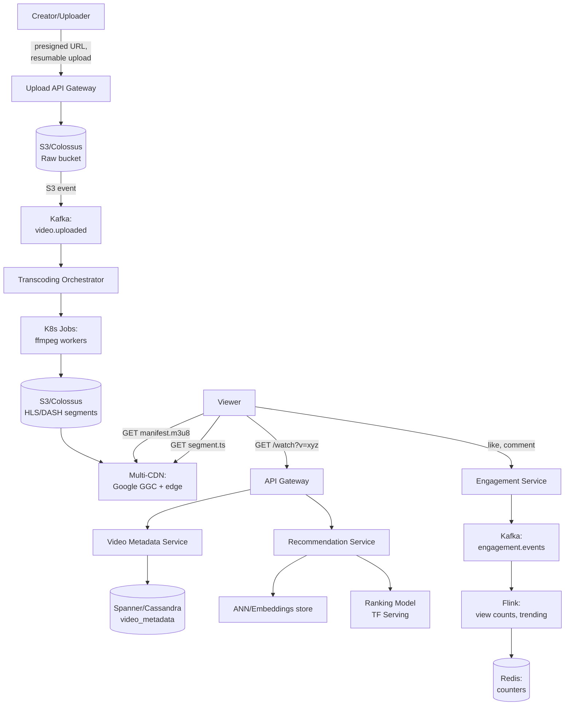
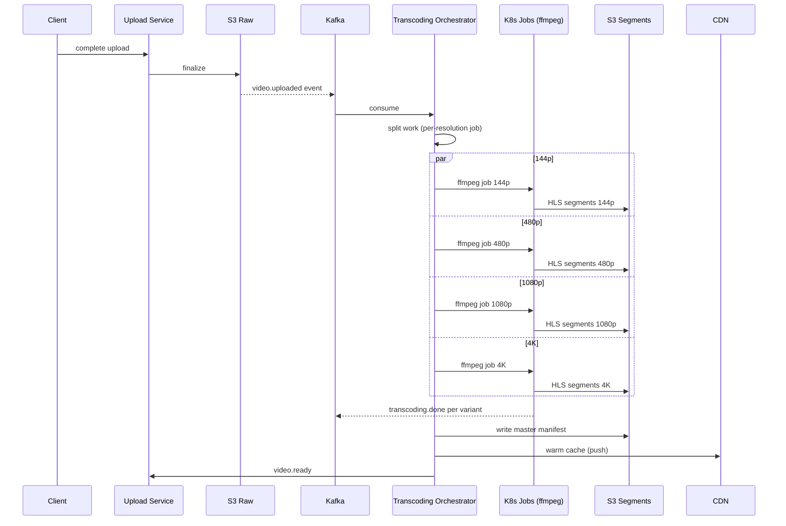
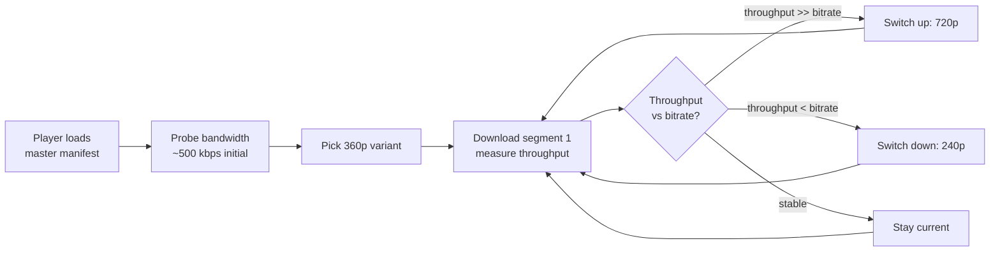
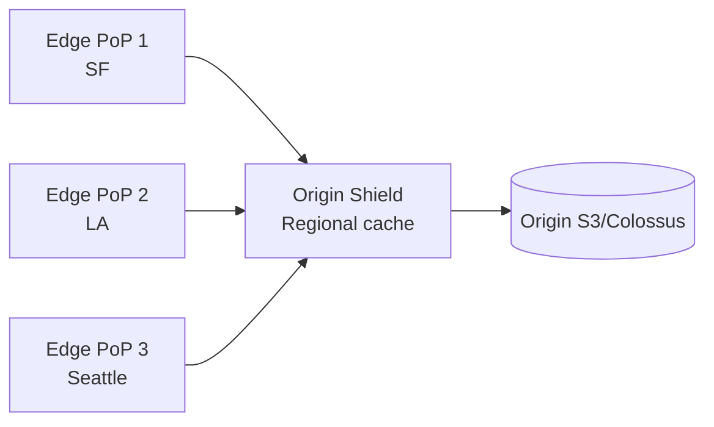
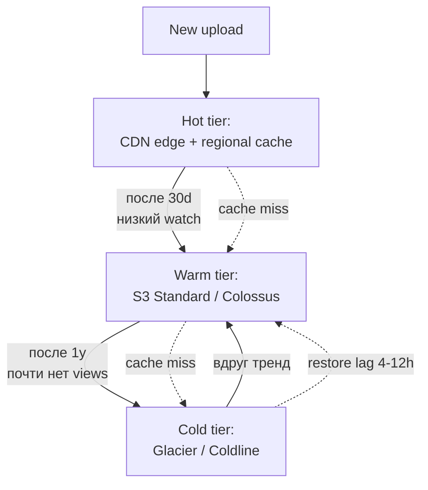
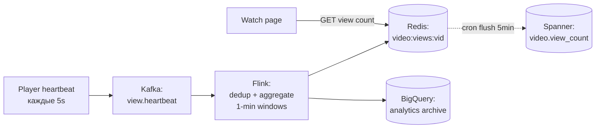
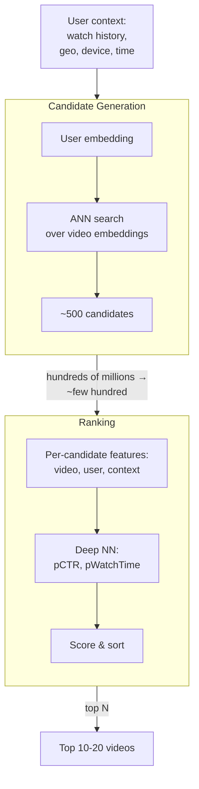
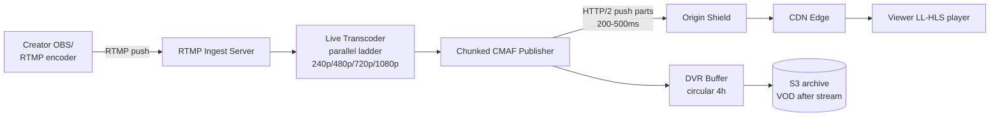
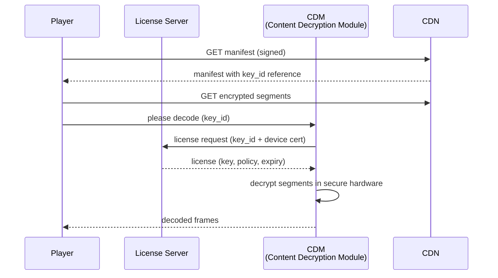
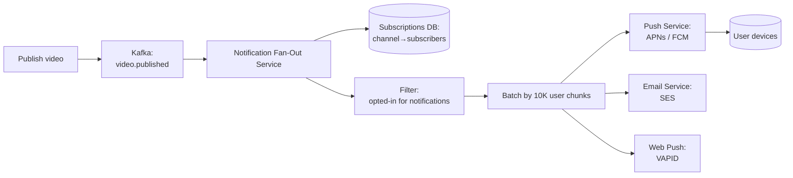

# Вопросы на собеседовании: `Design YouTube`

`YouTube` — крупнейший видеосервис: 2.5B MAU, загружается 500 часов видео в минуту, просматривается 1B часов в день. System design YouTube — это про экстремальный масштаб хранилища (экзабайты), egress (сотни Tbps), pipeline транскодирования и ML-рекомендации.

Эта шпаргалка — про архитектуру, ёмкость (capacity), компромиссы (trade-offs) и production-практики Google/YouTube.

## Полезные ссылки

- [YouTube Engineering Blog](https://blog.youtube/inside-youtube/tags/engineering-and-developers/)
- [HTTP Live Streaming (HLS) spec — RFC 8216](https://datatracker.ietf.org/doc/html/rfc8216)
- [MPEG-DASH spec — ISO/IEC 23009-1](https://www.iso.org/standard/79329.html)
- [CMAF — Common Media Application Format](https://www.iso.org/standard/79106.html)
- [Deep Neural Networks for YouTube Recommendations (Google, 2016)](https://research.google/pubs/pub45530/)
- [Recommending What Video to Watch Next (Google, 2019)](https://research.google/pubs/pub48434/)
- [Content ID — How it works](https://support.google.com/youtube/answer/2797370)
- [Widevine DRM Documentation](https://developers.google.com/widevine)
- [Low-Latency HLS (Apple)](https://developer.apple.com/documentation/http_live_streaming/enabling_low-latency_http_live_streaming_hls)
- [System Design Primer](https://github.com/donnemartin/system-design-primer)

## Содержание

- [Полезные ссылки](#полезные-ссылки)
- [See also](#see-also)

**Requirements и capacity**
- [Q1. (!) Какие функциональные и нефункциональные требования к YouTube?](#q1--какие-функциональные-и-нефункциональные-требования-к-youtube)
- [Q2. (!) Как оценить ёмкость YouTube: хранилище, пропускную способность, QPS?](#q2--как-оценить-ёмкость-youtube-хранилище-пропускную-способность-qps)
- [Q3. Как выглядит высокоуровневая архитектура YouTube?](#q3-как-выглядит-высокоуровневая-архитектура-youtube)

**Upload pipeline и transcoding**
- [Q4. (!) Как устроен upload-флоу: presigned URL, resumable, chunked?](#q4--как-устроен-upload-флоу-presigned-url-resumable-chunked)
- [Q5. (!) Как устроен pipeline транскодирования: ffmpeg, ladder, кодеки?](#q5--как-устроен-pipeline-транскодирования-ffmpeg-ladder-кодеки)
- [Q6. Какие разрешения и bitrate использует YouTube и зачем нужен ladder?](#q6-какие-разрешения-и-bitrate-использует-youtube-и-зачем-нужен-ladder)
- [Q7. Чем различаются HLS, DASH и CMAF?](#q7-чем-различаются-hls-dash-и-cmaf)

**Streaming и ABR**
- [Q8. (!) Как работает adaptive bitrate streaming (ABR)?](#q8--как-работает-adaptive-bitrate-streaming-abr)
- [Q9. Что такое манифест (m3u8/mpd), как он устроен и доставляется?](#q9-что-такое-манифест-m3u8mpd-как-он-устроен-и-доставляется)
- [Q10. Как выбрать размер сегмента (2s vs 6s vs 10s) и в чём компромисс?](#q10-как-выбрать-размер-сегмента-2s-vs-6s-vs-10s-и-в-чём-компромисс)

**CDN и storage**
- [Q11. (!) Какая у YouTube CDN-стратегия: multi-CDN, origin shield, edge-кеш?](#q11--какая-у-youtube-cdn-стратегия-multi-cdn-origin-shield-edge-кеш)
- [Q12. Как устроено многоуровневое хранилище (hot/warm/cold)?](#q12-как-устроено-многоуровневое-хранилище-hotwarmcold)
- [Q13. Как обрабатывать виральные (hot) видео?](#q13-как-обрабатывать-виральные-hot-видео)

**Metadata, views, engagement**
- [Q14. (!) Как спроектировать БД метаданных: схема и шардинг?](#q14--как-спроектировать-бд-метаданных-схема-и-шардинг)
- [Q15. Как считать просмотры (view counts) на таком масштабе?](#q15-как-считать-просмотры-view-counts-на-таком-масштабе)
- [Q16. Как устроены лайки, комментарии и лента подписок?](#q16-как-устроены-лайки-комментарии-и-лента-подписок)

**Recommendations (ML)**
- [Q17. (!) Как устроена двухстадийная модель рекомендаций (candidate + ranking)?](#q17--как-устроена-двухстадийная-модель-рекомендаций-candidate--ranking)
- [Q18. Какие признаки (features) идут в ranking-модель?](#q18-какие-признаки-features-идут-в-ranking-модель)
- [Q19. Как устроен поиск: Elasticsearch, транскрипты, ранжирование?](#q19-как-устроен-поиск-elasticsearch-транскрипты-ранжирование)

**Live streaming и monetization**
- [Q20. (!) Как устроен pipeline live-стриминга: от RTMP-ingest до LL-HLS?](#q20--как-устроен-pipeline-live-стриминга-от-rtmp-ingest-до-ll-hls)
- [Q21. Как вставляется реклама: SSAI vs CSAI, VAST/VPAID?](#q21-как-вставляется-реклама-ssai-vs-csai-vastvpaid)

**Moderation, DRM, geo**
- [Q22. (!) Как работает модерация контента: CSAM и Content ID fingerprinting?](#q22--как-работает-модерация-контента-csam-и-content-id-fingerprinting)
- [Q23. Как устроен DRM: Widevine, FairPlay, PlayReady?](#q23-как-устроен-drm-widevine-fairplay-playready)
- [Q24. Как устроены гео-распределение и региональные ограничения?](#q24-как-устроены-гео-распределение-и-региональные-ограничения)

**Edge cases и trade-offs**
- [Q25. Как восстанавливаться после сбоя загрузки или транскодирования?](#q25-как-восстанавливаться-после-сбоя-загрузки-или-транскодирования)
- [Q26. (!) Главные компромиссы: транскодировать заранее или по запросу, стоимость CDN vs latency?](#q26--главные-компромиссы-транскодировать-заранее-или-по-запросу-стоимость-cdn-vs-latency)
- [Q27. Как инвалидировать CDN-кеш для удалённого видео?](#q27-как-инвалидировать-cdn-кеш-для-удалённого-видео)
- [Q28. Как уведомлять подписчиков о новом видео?](#q28-как-уведомлять-подписчиков-о-новом-видео)

---

## Q1. (!) Какие функциональные и нефункциональные требования к YouTube?

Любой дизайн начинается с того, что система должна делать (функциональные требования) и насколько хорошо (нефункциональные). Для YouTube главное — успеть сузить scope: иначе на интервью утонешь в рекомендациях и потеряешь время на ключевом — watch path и upload pipeline.

**Функциональные требования (что система делает):**

- Загрузка видео (с прогрессом, resumable).
- Просмотр видео (streaming, ABR, несколько качеств).
- Like / dislike / комментарии / шеринг.
- Подписка на канал, уведомления.
- Рекомендации (лента на главной, Up Next).
- Поиск (по title, description, transcript).
- Страница канала (список видео автора).
- Live streaming.
- Монетизация (реклама, channel memberships).

**Нефункциональные требования (насколько хорошо):**

| Метрика | Цель |
|---------|------|
| MAU | 2.5B пользователей |
| Темп загрузки | 500 часов видео в минуту |
| Объём просмотра | 1B часов в день |
| Latency старта | < 2s от клика до первого кадра |
| Доля ребуферинга | < 0.5% времени просмотра |
| Доступность | 99.95% (watch path) |
| Durability | 11x9s (как S3) для исходных загрузок |
| Гео | Глобальное покрытие, < 50ms от пользователя до CDN edge |

**Вне рамок (на интервью):** биллинг Premium-подписки, аналитический дашборд Studio, выплаты по монетизации, отдельное kids/family-приложение. Проговорить их вслух полезно — это показывает, что ты осознанно сужаешь scope, а не забыл.

**Совет на интервью:** в первую же минуту явно зафиксируй приоритет — «фокус на watch path и upload pipeline; рекомендации разберу на верхнем уровне». Watch path определяет всю стоимость (egress, CDN) и архитектуру; рекомендации — отдельная ML-вселенная, в которую легко провалиться и не успеть показать главное.

---

## Q2. (!) Как оценить ёмкость YouTube: хранилище, пропускную способность, QPS?

Цель оценки — понять, какой ресурс становится узким местом и определяет архитектуру. Для YouTube ответ однозначен: **egress CDN-трафика** доминирует над всем остальным, и именно он диктует решение строить собственную CDN. Считаем по порядку величин, без точности до процента.

**Хранилище загрузок:**

- 500 часов / мин × 60 мин × 24 ч × 365 дн = **263M часов / год** загружается.
- Средний bitrate сырой загрузки ~5 Mbps → 1 час ≈ 2.25 GB. Многие в 1080p+/4K → в среднем ~4 GB/час оригинала.
- 263M × 4 GB ≈ **1 EB оригиналов / год**.
- Транскодированные варианты (10 разрешений × 2 кодека) дают множитель ×3-5: каждое исходное видео раскладывается в десяток файлов, и старшие разрешения занимают больше всего. Итого хранилище ~**3-5 EB / год** после транскодирования.

**Egress bandwidth:**

- 1B часов смотрится в день → ~42M часов / час.
- Средний bitrate смотрового потока ~3 Mbps (720p — смесь mobile/desktop).
- 42M × 3600 сек × 3 Mbps / 3600 = 42M × 3 Mbps = **126 Tbps в среднем**.
- Пик (prime time, виральное видео): ×2-3 → **250-400 Tbps на пике**.
- Для сравнения: пик Netflix ≈ 100 Tbps, пик сети Cloudflare ≈ 150 Tbps. YouTube сопоставим с глобальным интернет-трафиком крупного континента.

**QPS:**

- Старты просмотров: 1B часов / день, средняя сессия ~10 мин → ~6B стартов/день → **70K QPS в среднем**, ~200K QPS на пике.
- Старты загрузок: 500 h / min × ~10 min в среднем = ~50 активных загрузок/мин. Низкий QPS, но много байт.
- Чтения метаданных (страница видео, страница канала, рекомендации): ~10× от стартов просмотра → **2M QPS на метаданных**.

**Вывод.** Egress CDN-трафика (сотни Tbps на пике) доминирует в стоимости инфраструктуры — на порядки дороже, чем хранилище или метаданные. Именно поэтому YouTube строит собственную CDN (Google Global Cache, GGC) с серверами внутри сетей ISP: это убирает плату за транзитный трафик. Если на интервью ты выделишь egress как главный драйвер стоимости и предложишь собственную CDN — это сильный сигнал, что ты понимаешь экономику видео.

---

## Q3. Как выглядит высокоуровневая архитектура YouTube?

Удобнее всего разложить систему на четыре независимых «пути» (path), каждый со своими требованиями: загрузка и транскодирование (write-heavy, асинхронный), просмотр (read-heavy, latency-critical), рекомендации (ML, offline + online) и вовлечённость (поток событий). На диаграмме ниже эти пути сходятся в общих хранилищах, но масштабируются и оптимизируются по отдельности.



Четыре пути и их суть:

- **Upload path** (запись, асинхронно): API Gateway → presigned URL → object store (raw) → Kafka → воркеры транскодирования → object store (segments) → CDN. Видео не показывается, пока не пройдёт транскодирование, поэтому путь можно делать медленным, но надёжным.
- **Watch path** (чтение, критично к latency): API Gateway → сервис метаданных → URL манифеста → CDN (segments). Сами байты видео идут с CDN, минуя бэкенд.
- **Recommendation path** (ML): offline-batch (Spark/Beam) заранее генерит кандидатов, online-ranking ранжирует их при запросе. Разделение на offline/online — стандарт для рекомендаций под latency-бюджет.
- **Engagement path** (поток событий): Kafka → Flink → счётчики в Redis. Точные записи в БД на каждый лайк/просмотр не выдержат нагрузки, поэтому всё агрегируется в стриме.

Ключевое свойство для понимания всей архитектуры: на уровне сегментов сервис **read-heavy (~100:1)** — одно загруженное видео смотрят миллионы раз. Поэтому CDN-кеширование строится максимально агрессивным: чем больше попаданий в edge-кеш, тем меньше нагрузка на origin и стоимость.

---

## Q4. (!) Как устроен upload-флоу: presigned URL, resumable, chunked?

Суть: клиент льёт байты **напрямую** в object store по подписанному URL, разбивая файл на чанки, чтобы пережить обрывы сети. Бэкенд только выдаёт URL и реагирует на событие о завершении — он не пропускает через себя терабайты видео. Эти три приёма (presigned URL, chunked, resumable) решают три разные проблемы: масштаб пропускной способности, устойчивость к обрывам и продолжение с места разрыва.

**Шаги:**

1. Клиент → `POST /api/v1/uploads/init` с `{filename, size, mimeType}`.
2. Сервер создаёт `video_id`, генерит **resumable upload URL** (signed, истекает через 24h). Сохраняет в таблице `uploads`.
3. Клиент загружает чанками (5-100 MB) на signed URL: `PUT /upload?uploadId=xxx&partNumber=N`.
4. После всех чанков → `POST /api/v1/uploads/{video_id}/complete`. S3 Multipart Complete объединяет parts.
5. S3-событие → SNS/SQS/Kafka → запускает pipeline транскодирования.

**Resumable (RFC 7233 Range):** каждый чанк помечается заголовком `Content-Range`, говорящим «это байты с X по Y из общего размера Z». Сервер знает, какие диапазоны уже получены.

```http
POST /upload?uploadId=abc HTTP/1.1
Content-Range: bytes 0-5242879/52428800
Content-Length: 5242880

[5MB chunk]
```

Если сеть оборвалась на 30% загрузки — клиент делает `HEAD /upload?uploadId=abc`, сервер отвечает `Range: bytes=0-15728639/52428800` (вот докуда дошло), и клиент возобновляет с offset 15728640, **не перезаливая уже принятые байты**. Для часового 4K-видео это разница между «потерял всё» и «дослал последний мегабайт».

**Java-сниппет (S3 multipart):**

```java
// 1. Initiate
InitiateMultipartUploadResponse init = s3.initiateMultipartUpload(
    InitiateMultipartUploadRequest.builder()
        .bucket("yt-raw-uploads")
        .key("videos/" + videoId + "/original.mp4")
        .build()
);
String uploadId = init.uploadId();

// 2. Upload parts (parallel, 5MB-100MB each)
List<CompletedPart> parts = new ArrayList<>();
for (int i = 0; i < chunks.size(); i++) {
    UploadPartResponse resp = s3.uploadPart(
        UploadPartRequest.builder()
            .bucket("yt-raw-uploads")
            .key(key)
            .uploadId(uploadId)
            .partNumber(i + 1)
            .build(),
        RequestBody.fromBytes(chunks.get(i))
    );
    parts.add(CompletedPart.builder().partNumber(i + 1).eTag(resp.eTag()).build());
}

// 3. Complete
s3.completeMultipartUpload(
    CompleteMultipartUploadRequest.builder()
        .bucket("yt-raw-uploads")
        .key(key)
        .uploadId(uploadId)
        .multipartUpload(CompletedMultipartUpload.builder().parts(parts).build())
        .build()
);
```

**Зачем presigned URL:** клиент льёт байты напрямую в object store, минуя backend. Если бы трафик шёл через приложение, бэкенд пришлось бы масштабировать под TB/sec пропускной способности и платить за двойной трансфер. Подписанный URL переносит эту нагрузку на object store, который для этого и предназначен, а бэкенд держит только лёгкий control-plane (создание видео, реакция на событие).

---

## Q5. (!) Как устроен pipeline транскодирования: ffmpeg, ladder, кодеки?

Транскодирование превращает один загруженный файл в десятки вариантов «разрешение × bitrate × кодек» (bitrate ladder), нарезанных на сегменты для стриминга. Это самая CPU-затратная часть YouTube, поэтому её делают массово-параллельной: видео режут на короткие куски по времени, кодируют сотнями воркеров одновременно и собирают обратно. Так часовое видео обрабатывается за минуты, а не за час.



**Команда ffmpeg для одного варианта HLS 720p H.264:**

```bash
ffmpeg -i input.mp4 \
  -c:v libx264 -profile:v main -preset veryfast \
  -b:v 2800k -maxrate 2996k -bufsize 4200k \
  -vf "scale=-2:720" -g 48 -keyint_min 48 -sc_threshold 0 \
  -c:a aac -ar 48000 -b:a 128k \
  -hls_time 6 -hls_playlist_type vod \
  -hls_segment_filename "720p_%04d.ts" \
  720p.m3u8
```

Что здесь важно и почему:

- `-g 48` — размер GOP 48 кадров (2 секунды при 24fps). Keyframe (I-frame) в начале каждого сегмента **обязателен**: без него нельзя ни перемотать на этот сегмент, ни переключить качество ABR — плеер должен начать декодировать с самодостаточного кадра.
- `-keyint_min 48 -sc_threshold 0` — выключает scene-cut keyframes, чтобы GOP был строго фиксированным. Это гарантирует, что границы сегментов у всех вариантов ladder **совпадают** по времени — иначе ABR не сможет бесшовно переключаться между качествами.
- `-hls_time 6` — длина сегмента ~6 секунд.

**Параллелизм.** YouTube распиливает видео на **чанки по времени** (например, 30-секундные блоки) и запускает 100+ воркеров параллельно, затем склеивает результат (merge). Поскольку каждый чанк кодируется независимо, часовое видео обрабатывается за минуты вместо часа — линейное ускорение по числу воркеров.

**Кодеки — несколько под разных клиентов:**

| Кодек | Год | Сжатие | Поддержка декодером |
|-------|-----|-------------|-----------------|
| H.264 (AVC) | 2003 | baseline | универсально, hardware повсюду |
| H.265 (HEVC) | 2013 | -50% bitrate vs H.264 | Apple, современный Android, проблемы с роялти |
| VP9 | 2013 | сопоставимо с HEVC | native в YouTube/Chrome, royalty-free |
| AV1 | 2018 | -30% vs VP9 | новейшие клиенты, медленный encode |

Логика выбора простая: **H.264** даёт совместимость со всем железом (fallback, который точно сыграет везде), **VP9** экономит трафик без роялти (приоритет YouTube), а **AV1** даёт максимальную экономию, но кодируется медленно — поэтому его гонят только на топовых 4K-видео, где экономия egress окупает дорогой encode. Так YouTube кодирует **VP9 (приоритет) + H.264 (fallback)**, плюс AV1 для самых просматриваемых.

---

## Q6. Какие разрешения и bitrate использует YouTube и зачем нужен ladder?

**Bitrate ladder** — это лестница из вариантов `{разрешение, bitrate}`, которые система готовит заранее. Зачем лестница, а не одно качество: у зрителей кардинально разная пропускная способность — от 2G в развивающихся странах до гигабитного broadband. Каждая «ступенька» нацелена на свою категорию канала, и ABR на лету выбирает максимальную, которую тянет сеть зрителя (см. Q8). Без ladder пришлось бы либо мучить медленных зрителей буферизацией, либо отдавать всем низкое качество.

| Разрешение | Bitrate (H.264) | Сценарий |
|------------|-----------------|----------|
| 144p | 80-100 kbps | предельный mobile (2G), audio-first |
| 240p | 300 kbps | медленный 3G |
| 360p | 700 kbps | 3G |
| 480p (SD) | 1.2 Mbps | 4G, слабый Wi-Fi |
| 720p (HD) | 2.8 Mbps | default для 4G/Wi-Fi |
| 1080p (FHD) | 5 Mbps | broadband |
| 1440p (QHD) | 8 Mbps | broadband, desktop |
| 2160p (4K) | 16 Mbps | быстрый broadband, 4K-дисплей |

**Зачем 144p в 2026?** Не пережиток, а необходимость: развивающиеся рынки (Индия, Африка), плохой 3G, экономия мобильного трафика. У YouTube огромная не-западная аудитория, для которой 144p — разница между «видео играет» и «видео не грузится».

**Per-title encoding** (придумал Netflix, применяет и YouTube): вместо фиксированного ladder для всех видео анализируют сложность конкретного контента и подбирают **свой ladder под каждое видео**. Ролик с говорящей головой укладывается в 1 Mbps на 720p, а экшн-сцена с быстрым движением требует 4 Mbps для того же разрешения. Это экономит хранилище и egress на «простых» видео без потери качества.

**Content-aware encoding (CAE)** — техническая реализация: двухпроходный анализ контента → переменный bitrate (VBR) с потолком по пику, чтобы биты тратились там, где их видно.

---

## Q7. Чем различаются HLS, DASH и CMAF?

Все три — протоколы доставки видео по HTTP с поддержкой ABR. **HLS** придумал Apple (де-факто стандарт для iOS/Safari), **DASH** — открытый MPEG-стандарт (везде, кроме Apple-экосистемы). Историческая боль: чтобы покрыть и тех и других, приходилось хранить два набора сегментов. **CMAF** решает эту боль — единый формат сегментов для обоих протоколов.

| | HLS | DASH | CMAF |
|---|---|---|---|
| Создатель | Apple (2009) | MPEG (2012) | MPEG (2018) |
| Manifest | `.m3u8` (текст) | `.mpd` (XML) | использует HLS или DASH |
| Контейнер | `.ts` (исторически), теперь `.fmp4` | `.m4s` (fragmented MP4) | `.cmfv` (fragmented MP4) |
| iOS/Safari | native | через MSE-polyfill | native (CMAF-HLS) |
| Android/Chrome | native (с Android 3+) | native | native |
| Smart TV | как повезёт | широко | широко |
| DRM | FairPlay (sample-AES) | Widevine + PlayReady (CENC) | универсальный CENC |

**Проблема двух стандартов.** До CMAF, чтобы покрыть и HLS-, и DASH-клиентов, приходилось хранить **двойной набор сегментов** (TS для HLS + m4s для DASH) — то есть 2× хранилища на CDN и 2× работы транскодера на каждое видео.

**Решение — CMAF (Common Media Application Format).** Это единый контейнер `.cmfv`: **одни и те же** сегменты подходят и под HLS, и под DASH — различается только манифест, который на них ссылается. Кодируешь один раз → отдаёшь обоим протоколам. Эффект: **CDN storage и encode-нагрузка падают вдвое.**

Поэтому YouTube **давно перешёл на CMAF**. HLS-плееры запрашивают `master.m3u8`, внутри которого ссылки на сегменты `.cmfv`; DASH-плееры запрашивают `manifest.mpd` со ссылками на те же `.cmfv`. Манифестов два, физических сегментов — один комплект.

---

## Q8. (!) Как работает adaptive bitrate streaming (ABR)?

**ABR (Adaptive Bitrate)** — это механизм, где **сам плеер** (клиент, не сервер) выбирает качество на лету под текущую пропускную способность сети. Ключевая идея: решение принимает клиент, потому что только он видит реальную скорость скачивания и состояние своего буфера. Сервер же просто отдаёт все варианты ladder и манифест; никакого «согласования качества» с сервером нет.

Цикл работы: плеер скачивает сегмент, замеряет, как быстро тот пришёл, и на границе следующего сегмента решает — повысить качество, понизить или оставить.



**Три семейства алгоритмов** (от простого к умному):

1. **На основе throughput (наивный):** берёт скользящее среднее скорости по последним N сегментам и выбирает под него вариант. Прост, но спотыкается на «рваной» (bursty) сети — то завышает качество, то резко роняет.
2. **На основе буфера (BBA, Netflix-style):** ориентируется не на скорость, а на **заполненность буфера** (сколько секунд видео уже скачано вперёд). Буфер тает → снижаем качество, буфер полный → можно повышать. Стабильнее, потому что буфер — интегральный сигнал, сглаживающий всплески скорости.
3. **MPC / Pensieve (RL):** комбинирует оба сигнала через model-predictive control или deep RL, предсказывая будущее. Google использует ABR на базе ML.

**Гранулярность переключения** — на границе **сегмента** (каждые 2-6s), потому что переключить кодек можно только начав с keyframe, а он стоит в начале сегмента. Отсюда компромисс: короче сегменты → быстрее адаптация, но больше HTTP-запросов и overhead.

**Чем меряют bandwidth:** для cellular — **TCP throughput** последнего сегмента; для QUIC/HTTP3 — congestion window прямо из транспорта (точнее, чем эвристика поверх TCP).

**Псевдокод выбора варианта** (throughput + поправка на буфер): берём измеренную скорость, при низком буфере закладываем запас безопасности (`safetyFactor`) и выбираем самый качественный вариант, который укладывается в этот таргет.

```java
public Variant pickNextVariant(double measuredThroughputBps, double bufferSeconds) {
    double safetyFactor = bufferSeconds > 20 ? 1.0 : 0.7; // консервативно при низком буфере
    double targetBitrate = measuredThroughputBps * safetyFactor;
    return ladder.stream()
        .filter(v -> v.bitrateBps() <= targetBitrate)
        .max(Comparator.comparing(Variant::bitrateBps))
        .orElse(ladder.lowest());
}
```

---

## Q9. Что такое манифест (m3u8/mpd), как он устроен и доставляется?

Манифест — это «оглавление» видео для плеера: текстовый файл, где перечислены все варианты ladder и список сегментов каждого. Иерархия двухуровневая: **мастер-манифест** ссылается на варианты качества, а у каждого варианта свой **медиа-плейлист** со списком сегментов. Плеер сначала качает мастер, выбирает стартовый вариант, затем тянет его медиа-плейлист и по нему — сами сегменты.

**Мастер-манифест HLS** (перечень вариантов с их bitrate/разрешением):

```m3u8
#EXTM3U
#EXT-X-VERSION:6

#EXT-X-STREAM-INF:BANDWIDTH=300000,RESOLUTION=426x240,CODECS="avc1.42c015"
240p/playlist.m3u8

#EXT-X-STREAM-INF:BANDWIDTH=700000,RESOLUTION=640x360,CODECS="avc1.4d401e"
360p/playlist.m3u8

#EXT-X-STREAM-INF:BANDWIDTH=2800000,RESOLUTION=1280x720,CODECS="avc1.640020"
720p/playlist.m3u8

#EXT-X-STREAM-INF:BANDWIDTH=5000000,RESOLUTION=1920x1080,CODECS="avc1.640028"
1080p/playlist.m3u8
```

**Медиа-плейлист (720p)** — список сегментов выбранного варианта с длительностью каждого:

```m3u8
#EXTM3U
#EXT-X-VERSION:6
#EXT-X-TARGETDURATION:6
#EXT-X-MEDIA-SEQUENCE:0
#EXT-X-PLAYLIST-TYPE:VOD

#EXTINF:6.000,
720p_0000.cmfv
#EXTINF:6.000,
720p_0001.cmfv
#EXTINF:6.000,
720p_0002.cmfv
...
#EXT-X-ENDLIST
```

**Доставка и кеширование** (для VOD всё неизменяемо, поэтому кешируется агрессивно):

- Мастер-манифест **на каждый video_id** почти неизменяем → кешируется в CDN на длинный TTL (24h).
- Сегменты **неизменяемы** → очень длинный TTL (год) + versioned URL (`/segments/{video_id}/720p_0001_v3.cmfv`): новая версия = новый URL, инвалидация не нужна.
- URL манифеста подписан: `?token=xxx&exp=...` — это точка контроля доступа и DRM (без валидного токена плеер не получит даже оглавление).

**Отличие live от VOD:** в live-трансляции манифест **постоянно меняется** — в конец дописываются новые сегменты по мере эфира. Поэтому TTL короткий (1-2s), а для минимальной задержки (LL-HLS) внутрь добавляют теги `#EXT-X-PART` с под-сегментами (см. Q20).

---

## Q10. Как выбрать размер сегмента (2s vs 6s vs 10s) и в чём компромисс?

Размер сегмента — это компромисс между **скоростью адаптации/задержкой** и **накладными расходами**. Короткие сегменты дают плееру чаще пересматривать качество и снижают live-latency, но множат число HTTP-запросов: на каждый сегмент — новый запрос, новый TCP slow start и лишняя нагрузка на CDN. Длинные сегменты экономят запросы и лучше кешируются, но медленнее реагируют на изменение сети.

| Сегмент | За | Против |
|---------|-----|-----|
| 2s | Быстрая адаптация ABR, низкая live-latency | Много запросов (overhead), TCP slow start на каждом, бьёт по CDN |
| 6s | Баланс (default в HLS) | Стандарт для VOD |
| 10s | Меньше запросов, выше cache hit rate на CDN | Медленная адаптация, высокая live-latency |

**Выбор YouTube — разный для VOD и live:**

- **VOD:** сегменты по **5-6s** — золотая середина: адаптация всё ещё достаточно частая (раз в несколько секунд), а overhead и нагрузка на CDN низкие. Для записанного видео мгновенная реакция на сеть не критична.
- **Live:** сегменты по **2s** + LL-HLS-парты по **200-500ms** (доставляются через HTTP/2 push или chunked transfer encoding). Здесь задержка важнее всего, поэтому жертвуем overhead ради скорости — получаем **end-to-end latency ~3s** против стандартного HLS ~30s.

**Прикидка объёма:** часовое видео с сегментами по 6s → 600 файлов; манифест ~50 KB; сегмент ~2 MB на 720p. Один вариант 1080p за час ≈ 1.5 GB — и это умножается на число ступеней ladder и кодеков, отсюда экзабайтные масштабы хранилища из Q2.

---

## Q11. (!) Какая у YouTube CDN-стратегия: multi-CDN, origin shield, edge-кеш?

CDN — это сердце watch path: именно она отдаёт сотни Tbps видео, и от неё зависит и latency, и стоимость. У YouTube тут структурное преимущество — собственная CDN внутри сетей ISP, поэтому egress почти бесплатен и кешировать можно агрессивно. Разберём три уровня стратегии: где стоят кеширующие ноды (GGC / multi-CDN), как защитить origin от лавины запросов (origin shield) и по каким правилам кешировать на edge.

**Собственная CDN — Google Global Cache (GGC):**

- **GGC-ноды** размещены **внутри ISP** по всему миру (1500+ провайдеров). Когда ты в Москве смотришь YouTube — сегменты идут с GGC-сервера твоего провайдера, **не выходя из его сети**.
- Это **edge peering**: ISP экономит transit-трафик, Google экономит egress. Win-win.
- На границе — собственные edge-PoP Google (Google Edge Network), затем backbone Google.

Если бы своей CDN не было (типичный кейс для не-Google-сервиса), стандартный ответ — **коммерческий multi-CDN**: несколько провайдеров (CloudFront + Akamai + Cloudflare + Fastly) с балансировкой на базе DNS (Cedexis/Citrix ITM) или выбором на стороне клиента. Несколько CDN дают отказоустойчивость и рычаг для торга по цене, но требуют слоя выбора «кому слать трафик прямо сейчас».

**Origin shield — защита origin от лавины промахов:**



Идея: edge-нода при промахе идёт не напрямую в origin, а в промежуточный **regional shield**. Когда видео вирусится, десятки edge по региону промахиваются одновременно — но shield схлопывает их в **один** запрос к origin (request coalescing), остальные ждут результата. Без shield origin захлестнула бы лавина дублирующих запросов (thundering herd).

**Правила edge-кеширования** (TTL диктуется изменяемостью контента):

- Сегменты — **неизменяемые, content-hashed URL** → TTL = 1 год: их можно держать в кеше как угодно долго.
- Мастер-манифест — TTL 24h (изредка меняется при перекодировании).
- Live-манифест — TTL 1s + `Cache-Control: no-store` для верхушки плейлиста, потому что он обновляется каждые пару секунд.
- Вытеснение на edge: **LRU** с поправкой на популярность (LFU) — редко смотримый long-tail вылетает первым, освобождая место горячему контенту.

---

## Q12. Как устроено многоуровневое хранилище (hot/warm/cold)?

Идея tiering — платить за быстрый доступ только там, где он нужен. Просмотры подчиняются степенному закону: ~80% времени смотрят ~0.1% видео, а остальные 99.9% — long tail, который месяцами никто не открывает. Держать весь каталог в дорогом горячем хранилище разорительно, поэтому данные «остывают» по уровням: горячий CDN-кеш → стандартный object store → дешёвый архив. Чем холоднее уровень, тем дешевле гигабайт и тем выше latency чтения.



**Tiers и стоимость (порядок величин):**

| Tier | Цена / GB / мес | Latency чтения | Сценарий |
|------|--------------------|--------------|----------|
| CDN edge | $0 (sunk) | ~5ms | топ-0.1% видео |
| S3 Standard / Colossus | $0.023 | ~50ms | активный long-tail |
| S3 IA | $0.0125 | ~100ms | редко смотримое |
| Glacier Instant | $0.004 | ~100ms | архив, изредка читаемый |
| Glacier Deep Archive | $0.00099 | ~12h на restore | совсем редко |

**Хитрость с long-tail.** YouTube не держит весь long-tail целиком в горячем CDN, но и не убирает полностью: в кеше остаётся **манифест + первый сегмент**, чтобы старое видео стартовало мгновенно, а остальные сегменты подтягиваются (pre-fetch) уже по ходу. Так первый кадр быстрый даже у видео, которое не смотрели год.

**Компромисс — хранить или транскодировать заново.** Держать транскодированные варианты long-tail в storage или **транскодировать on-demand** при первом за долгое время запросе? YouTube исторически **транскодирует всё заранее**: CPU дешевле, чем риск задержки на старте из-за извлечения из медленного хранилища — UX важнее экономии на редких видео. Netflix на части старого каталога идёт другим путём и делает on-demand (подробнее — Q26).

---

## Q13. Как обрабатывать виральные (hot) видео?

Виральное видео (миллион+ просмотров в час) ломает обычные допущения: один контент создаёт лавину одинаковых запросов в одну точку. Стратегия — заранее размножить его по кешам, защитить origin от дублей и при необходимости перекодировать в более экономный кодек. Все приёмы сводятся к двум идеям: **больше реплик ближе к зрителю** и **схлопывание одинаковых запросов**.

1. **Pre-warm кеша:** заранее push сегментов на большее число edge-PoP, не дожидаясь промахов.
2. **Приоритетная очередь транскодирования:** если только что загруженное видео резко взлетело — прогоняют его через ladder вне очереди (приоритетная K8s-очередь), чтобы быстрее появились все качества.
3. **Адаптивная репликация в metadata DB:** горячие строки реплицируются в больше регионов (read-реплики), чтобы чтения метаданных не упирались в один shard.
4. **Request coalescing на origin shield** (см. Q11) — лавина промахов схлопывается в один запрос к origin.
5. **Premium-кодек:** для топ-0.001% видео генерят AV1 (-30% bitrate) — на гигантских объёмах просмотров экономия egress окупает дорогой encode.
6. **Предиктивное кеширование:** ML-модель ловит всплеск заранее по ранним сигналам (число подписчиков канала, географический разброс первых зрителей) и пушит видео в CDN до пика, а не реактивно после.

**Защита от cache stampede** при промахе — тот же request coalescing на shield, по шагам:

```
GET segment_X.cmfv → cache miss → 1000 параллельных requests на shield
                                    ↓
                          shield deduplicates: первый request идёт в origin,
                          остальные блокируются на short-lived lock
                                    ↓
                          response пришёл → unlock → все отвечают из shield cache
```

---

## Q14. (!) Как спроектировать БД метаданных: схема и шардинг?

Метаданные (title, описание, статус транскодирования, ссылка на манифест и т.п.) читаются на каждый watch-запрос, поэтому БД должна выдерживать миллионы QPS и не иметь горячих точек. Главные решения здесь два: **как шардить** (по чему партиционировать каждую таблицу под её паттерн запросов) и **какое хранилище выбрать** (сильно-консистентное для основных данных, eventually-consistent для аналитики/счётчиков).

**Таблица `video_metadata`:**

| колонка | тип | примечание |
|--------|------|-----------|
| video_id | string (11 символов) | partition key, шардинг по хешу |
| uploader_user_id | bigint | вторичный индекс |
| title | string | до 100 символов |
| description | text | до 5K символов |
| upload_ts | timestamp | |
| publish_ts | timestamp | nullable (отложенная публикация) |
| duration_sec | int | |
| visibility | enum | public/unlisted/private |
| category | string | |
| tags | array<string> | |
| transcoding_status | enum | pending/processing/ready/failed |
| manifest_url | string | путь к master.m3u8/cmaf |
| thumbnail_urls | array<string> | превью-кадры |
| age_restricted | bool | |
| geo_blocked_countries | array<string> | |

**Выбор хранилища под тип данных** (одного движка на всё не хватает):

- **Spanner** — глобально консистентный и транзакционный, шардится по primary key. Берут для основных метаданных, где важна правильность.
- **Cassandra** — eventually consistent, заточена под высокий поток записей. Хороша для аналитики и комментариев, где можно потерпеть лёгкую несогласованность ради throughput.
- **BigTable** — KV-хранилище для счётчиков просмотров.

**Стратегия шардинга — ключ партиции под паттерн запроса:**

- `video_metadata` — hash по `video_id`: равномерное распределение, и даже виральное видео не перегружает один shard (его строка одна, а читается она из кеша).
- `channel_videos` (видео аплоадера) — партиция по `user_id`, сортировка по `upload_ts DESC`: страница канала собирается одним точечным запросом к одной партиции.
- `subscriptions` — партиция по `subscriber_user_id`, внутри список `channel_id`: при построении ленты сразу видны все подписки пользователя.
- `comments` — партиция по `video_id`, плюс **вторичная партиция по time-bucket** для популярных видео: иначе миллионы комментариев одного видео не влезут в одну партицию.

Общий принцип: партиционируй так, чтобы типичный запрос бил в **одну** партицию, а нагрузка размазывалась равномерно.

**Video ID** — короткие 11-символьные base64, URL-safe (`youtube.com/watch?v=...`). Генерация: UUID → base64 → обрезка до 11 символов, проверка уникальности по БД.

---

## Q15. Как считать просмотры (view counts) на таком масштабе?

Прямой подсчёт (INCREMENT в БД на каждый просмотр) не выживает: 1B просмотров/день с учётом heartbeat-амплификации — это миллионы записей в секунду в транзакционную БД. Решение — **не считать синхронно**: события просмотра уходят в Kafka, стрим-процессор (Flink) их дедуплицирует и агрегирует по окнам, а готовые счётчики лежат в Redis для быстрого чтения и периодически сбрасываются в durable-БД. Точное значение жертвуется ради масштаба — пользователю достаточно «примерно столько просмотров с задержкой в секунды».

**Pipeline в духе Lambda-архитектуры:**



**Логика подсчёта — по шагам:**

- Просмотр засчитывается только если смотрели ≥ **30 секунд** (историческое правило YouTube) — это сразу отсекает случайные клики и skip-спам.
- Плеер шлёт heartbeat каждые 5s с `{video_id, user_id, position, session_id}` — по ним видно, что зритель реально смотрит.
- Flink дедуплицирует по `(video_id, user_id, session_id)` в окне — чтобы накрутка через refresh не давала лишних просмотров.
- Засчитанные просмотры идут в Redis (`INCR video:views:{video_id}`) — быстрый счётчик для чтения.
- Каждые 5 мин Redis flush'ится в Spanner — durable-источник истины на случай перезапуска.
- UI читает из Redis: eventual consistency, отставание в ±секунды, что для счётчика просмотров приемлемо.

**Анти-фрод** (без него счётчики легко накрутить):

- Детектирование ботов — частотный анализ, browser fingerprint.
- Порог 30 секунд отсекает skip-спам (быстрые перемотки не считаются).
- Throttling — 1 просмотр на пользователя на видео за 24h.

**Узкое место на всплесках.** Виральное видео шлёт лавину `INCR` в один ключ Redis — это горячий ключ. Решение: шардить счётчик по hash-партициям (`video:views:{id}:{shard}`) и суммировать партиции при чтении, размазывая нагрузку записи.

---

## Q16. Как устроены лайки, комментарии и лента подписок?

Это три разных по природе задачи: лайки — счётчики (как просмотры), комментарии — иерархическое хранилище с пагинацией, лента подписок — классическая задача fan-out, где главная развилка push vs pull.

**Лайки** (тот же паттерн, что и просмотры):

- Поток событий: Kafka → Flink → счётчик в Redis, eventual consistency.
- Защита от двойного лайка: запись `like(user_id, video_id)` в БД; если такая пара уже есть — счётчик не инкрементим (идемпотентность).

**Комментарии:**

- Хранилище: Cassandra или Spanner, партиция по `video_id` — все комментарии видео рядом.
- Горячие видео с миллионами комментариев → пагинация на курсорах (`?after=comment_id`), а не offset: курсор стабилен при дописывании новых комментариев.
- Сортировка: `top` (по апвоутам/ответам), `new`, `controversial`.
- Threading плоское: `parent_comment_id` с ограничением глубины 2 (верхний уровень + ответы) — без бесконечной вложенности, которую тяжело и хранить, и рендерить.

**Лента подписок (subscriptions feed)** — развилка push vs pull:

- **Pull (fan-out on read):** при запросе берём `subscriptions[user_id]` → по последним 10 видео с каждого канала → merge по времени → top N. Просто, но дорого читать.
- Проблема pull — каналы с **огромным fan-out**: у MrBeast 200M подписчиков, и пересобирать ленту для каждого на лету накладно.
- **Гибрид** (как у Twitter): для обычных пользователей pull, а видео топ-креаторов заранее push'ат (fan-out on write) в feed-таблицы подписчиков. Так редкие гигантские каналы не убивают чтение, а массовые мелкие — запись.
- Подробный разбор fan-out: [design-feed-system-interview.md](design-feed-system-interview.md), [design-twitter-interview.md](design-twitter-interview.md).

---

## Q17. (!) Как устроена двухстадийная модель рекомендаций (candidate + ranking)?

Рекомендации YouTube (Up Next + главная) строятся в **две стадии**, потому что нельзя одной тяжёлой моделью ранжировать миллиард видео за десятки миллисекунд. Поэтому задачу делят: сначала дешёвая модель грубо отбирает ~сотни кандидатов из ~миллиарда (стадия candidate generation, важен recall), затем дорогая модель точно ранжирует эту короткую выборку (стадия ranking, важна precision). Это стандартный приём «воронки» в рекомендательных системах: сужай пространство поиска перед дорогим вычислением.



**Стадия 1 — генерация кандидатов (Candidate Generation):** грубый, но быстрый отбор.

- Цель — из ~10⁹ видео отобрать ~10² релевантных. **Recall важнее precision**: нельзя пропустить хорошее видео, а лишние отсеет стадия 2.
- Модель: two-tower neural network. Она учит **user embedding** и **video embedding** в одном латентном пространстве так, что близость векторов = релевантность.
- При запросе: считаем user embedding → ищем ближайшие video embeddings через **ANN (approximate nearest neighbor)** по миллионам векторов (FAISS, ScaNN). ANN, потому что точный перебор миллиарда векторов не уложится в latency-бюджет.
- Целевая latency: < 50ms.

**Стадия 2 — ранжирование (Ranking):** дорогая, но точная.

- Цель — упорядочить ~500 кандидатов → top 10-20. Здесь **важна precision**: что окажется наверху, то и увидит пользователь.
- Deep neural network с **сотнями фич**: про видео (возраст, язык, качество канала), про пользователя (история просмотров, демография), про контекст (устройство, время суток).
- Multi-objective: модель предсказывает не одно число, а сразу CTR, ожидаемое время просмотра и удовлетворённость (лайки/дизлайки) — потому что «кликнул» и «досмотрел» не одно и то же.
- Целевая latency: < 100ms на весь батч из 500 — дорого, но работаем уже не с миллиардом, а с сотнями.

**Offline vs online — что считается когда:**

- Эмбеддинги — **offline**: Spark/Beam пересчитывает их раз в N часов и кодирует каталог пачкой. При запросе их не учат, только используют.
- Ранжирование — **online**: модель крутится на TF Serving / KFServing в момент запроса.
- Поверх всего — постоянное A/B-тестирование, десятки экспериментов параллельно: рекомендации настраивают эмпирически по метрикам, а не «на глаз».

---

## Q18. Какие признаки (features) идут в ranking-модель?

Фичи ranking-модели делятся на три группы по источнику — про видео, про пользователя и про контекст запроса — плюс отдельно стоят cross-фичи (взаимодействия между ними) и multi-objective выход (модель предсказывает несколько целей сразу). Идея вопроса на интервью: показать, что ранжирование учитывает не только «хорошее ли видео», но и «хорошо ли оно именно этому человеку здесь и сейчас».

**Фичи видео:**

- `video_age_hours`, `total_views`, `like_ratio`, `comment_count`.
- `channel_quality_score` (сигналы аплоадера).
- `topic_embedding` (категория, теги, transcript).
- `language`, `geographic_target`.
- `monetization_eligible` (для рекламы).

**Фичи пользователя:**

- `watch_history_embedding` (последние 50 видео).
- `search_history_embedding`.
- `demographics` (возрастная группа, страна, устройство).
- `subscription_signal` (подписан ли на канал?).
- `time_since_last_visit`.

**Контекст:**

- `device_type` (mobile/TV/desktop).
- `time_of_day`, `day_of_week`.
- `referrer` (главная / поиск / страница канала).
- `previous_video_in_session`.

**Cross-фичи** — взаимодействия пользователь × видео, которые поодиночке ничего не значат, а вместе предсказывают поведение. Пример: «пользователь со смартфона × видео в landscape-ориентации». Модель ловит такие нелинейные комбинации через feature crosses или deep embedding, а не как сумму отдельных признаков.

**Multi-objective head** — одна модель выдаёт **сразу несколько** предсказаний, потому что «успех» рекомендации многомерен:

- p(click | impression) — кликнет ли;
- E[watch_time | click] — сколько досмотрит;
- p(like | watch) — понравится ли;
- p(share) — поделится ли;
- p(skip-within-5s) — негативный сигнал, штрафует кликбейт.

Итоговый score — **взвешенная сумма** этих предсказаний, и веса крутят под бизнес-цель: больше времени просмотра (вовлечённость) или больше показов рекламы (выручка). Именно через эти веса бизнес рулит лентой, не переучивая модель.

См. также: [embeddings-interview.md](../ai-ml/embeddings-interview.md), [llm-integration-patterns-interview.md](../ai-ml/llm-integration-patterns-interview.md).

---

## Q19. Как устроен поиск: Elasticsearch, транскрипты, ранжирование?

Поиск по видео — это две стадии: **retrieval** (Elasticsearch достаёт кандидатов по тексту) и **ranking** (отдельная ML-модель переупорядочивает их по релевантности и вовлечённости). Изюминка YouTube — индексировать не только title/description, но и **транскрипт речи** из видео (через ASR), что позволяет находить момент внутри ролика и делать deep-link на нужную секунду.

**Этапы обработки:**

1. При загрузке параллельно с транскодированием гонят **ASR (Automatic Speech Recognition)** → получают transcript из звуковой дорожки.
2. Индексация в Elasticsearch:
   - `title`, `description` — text-поля с кастомным анализатором (russian + english).
   - `tags` — keyword.
   - `transcript_chunks` — отдельное поле, разбитое на окна по 30s. Позволяет deep-link «перейти к позиции из поиска».
   - `channel_name`, `category` — keyword.
3. Запрос: multi-match по полям + boost по вовлечённости (просмотры, свежесть) — ES быстро достаёт грубый top-100.
4. Финальное ранжирование — отдельная Learn-to-Rank-модель (LambdaMART / DNN) переупорядочивает эти top-100. ES хорош в retrieval, но релевантность лучше предсказывает обученная модель, поэтому два шага разделены.

```json
{
  "query": {
    "function_score": {
      "query": {
        "multi_match": {
          "query": "kubernetes tutorial",
          "fields": ["title^3", "description^1", "transcript_chunks.text^0.5", "tags^2"],
          "fuzziness": "AUTO"
        }
      },
      "functions": [
        {"field_value_factor": {"field": "log_views", "factor": 1.2}},
        {"gauss": {"upload_ts": {"scale": "30d", "decay": 0.5}}}
      ],
      "score_mode": "multiply"
    }
  }
}
```

**Автодополнение** — отдельный сервис (не основной поиск, у него другой паттерн): edge-ngram для префиксного матчинга + счётчик популярности (топ-запросы за 24h из Redis), чтобы подсказки были не только корректными, но и популярными. Целевая latency < 50ms — подсказки должны появляться на лету при наборе.

**Устойчивость к опечаткам:** ES fuzzy-матчинг + phonetic + spell correction по кастомному словарю типичных опечаток — иначе «kuberentes» не найдёт ничего.

См. подробнее: [design-search-interview.md](design-search-interview.md).

---

## Q20. (!) Как устроен pipeline live-стриминга: от RTMP-ingest до LL-HLS?

Live отличается от VOD одним: нельзя транскодировать заранее — всё делается в реальном времени, и главная метрика — задержка между событием и тем, что видит зритель. Поток: креатор пушит видео по RTMP → сервер транскодирует ladder на лету → нарезает на крошечные CMAF-парты → раздаёт через CDN с минимальной задержкой (LL-HLS). Параллельно поток пишется в DVR-буфер (чтобы зритель мог отмотать) и архивируется в VOD после эфира.



**Ingest:** креатор пушит **RTMP** (поверх TCP) или **SRT/WebRTC** (поверх UDP) на ingest-сервер. RTMP — де-факто стандарт (его умеют все энкодеры вроде OBS), но даёт latency 5-30s; SRT/WebRTC быстрее, но менее распространены.

**Live transcoding ladder:** энкодинг в несколько разрешений **в реальном времени** — на запас времени нет, поэтому кодируют на GPU/ASIC ради скорости и стоимости (H.264 NVENC или собственный кремний Google VCU — Video Coding Unit).

**LL-HLS (Low-Latency HLS)** — как срезать задержку с 30s до пары секунд:

- Сегменты остаются по 2s, но внутри них видео нарезается на **парты** по 200-500ms и доставляется через HTTP/2 push, не дожидаясь готовности всего сегмента.
- Манифест содержит теги `#EXT-X-PART`, описывающие эти парты:

```m3u8
#EXT-X-PART:DURATION=0.33,URI="seg42_part0.cmfv"
#EXT-X-PART:DURATION=0.33,URI="seg42_part1.cmfv",INDEPENDENT=YES
#EXT-X-PART:DURATION=0.33,URI="seg42_part2.cmfv"
#EXT-X-PRELOAD-HINT:TYPE=PART,URI="seg42_part3.cmfv"
```

- `INDEPENDENT=YES` помечает part, начинающийся с keyframe, — с него можно сразу переключить качество ABR, не дожидаясь начала следующего сегмента.
- Итог: end-to-end latency 2-5s против обычного HLS 30s+.

**Когда нужна суб-секундная задержка** (звонки, интерактивный live-чат) — берут WebRTC: latency < 1s, но масштабируется плохо (peer-based, не CDN). Для broadcast на миллионы зрителей он не подходит — там LL-HLS.

**DVR:** последние N часов эфира лежат в кольцевом буфере, поэтому зритель может «отмотать назад» прямо во время трансляции, не дожидаясь её конца.

**После эфира:** стрим финализируется в **VOD**-ассет — сегменты копируются в долговременное хранилище, а видео отправляется в обычный pipeline транскодирования за дополнительными кодеками (AV1 и т.п.), которые не успели сделать в реальном времени.

---

## Q21. Как вставляется реклама: SSAI vs CSAI, VAST/VPAID?

Главное решение здесь — **где** склеивать рекламу с контентом: на клиенте (CSAI) или на сервере (SSAI). Сервер вставляет ad-сегменты прямо в манифест, поэтому реклама неотличима от контента и почти не блокируется AdBlock, но теряется богатый player-aware трекинг. Стандарты вроде **VAST** описывают, какую рекламу проиграть и какие события отслеживать.

**Форматы рекламы:**

- **Pre-roll** — реклама до видео.
- **Mid-roll** — встроена в середину.
- **Post-roll** — после.
- **Bumper** — короткая 6s без пропуска.
- **Overlay/banner** — поверх плеера.

**Две стратегии сшивки (stitching):**

| | CSAI (Client-Side) | SSAI (Server-Side) |
|---|---|---|
| Как работает | Плеер знает про рекламу, ставит основное видео на паузу, проигрывает ad-ассет | Сервер вставляет ad-сегменты **прямо в манифест** между сегментами контента |
| AdBlock | легко блокировать (отдельный домен) | сложно (тот же манифест) |
| Pixel tracking | богатый (player-aware) | ограниченный (server log) |
| Latency переключения контент↔реклама | заметная (загрузка ad-плеера) | бесшовная (тот же буфер) |
| Персонализация | per-user | per-user (сервер вставляет разную рекламу на каждую сессию) |
| Где используется | мобильные приложения, веб | LL-стримы, Connected TV |

Вывод по выбору: CSAI проще и даёт детальный трекинг, но легко режется блокировщиками; SSAI сложнее и беднее на метрики, зато бесшовен и устойчив к AdBlock — поэтому он доминирует на Connected TV и в LL-стримах.

**VAST (Video Ad Serving Template)** — XML-стандарт от IAB, описывающий, какой ролик показать, его длительность и какие события (impression, complete) отслеживать:

```xml
<VAST version="4.2">
  <Ad>
    <InLine>
      <AdSystem>YouTube Ads</AdSystem>
      <Impression><![CDATA[https://ads.example/impression?adid=123]]></Impression>
      <Creatives>
        <Creative>
          <Linear>
            <Duration>00:00:15</Duration>
            <TrackingEvents>
              <Tracking event="complete"><![CDATA[https://ads.example/complete]]></Tracking>
            </TrackingEvents>
            <MediaFiles>
              <MediaFile type="video/mp4" bitrate="2000">
                <![CDATA[https://ads.example/creative.mp4]]>
              </MediaFile>
            </MediaFiles>
          </Linear>
        </Creative>
      </Creatives>
    </InLine>
  </Ad>
</VAST>
```

**VPAID** — расширение для интерактивной рекламы (кликабельные оверлеи, опросы). Был популярен, но из-за проблем с безопасностью и производительностью deprecated в пользу **SIMID**.

**Frequency capping** — не показывать одну рекламу одному пользователю чаще N раз/день. Реализация — счётчик в Redis по ключу `(user_id, ad_id)`: перед показом проверяем, не превышен ли лимит.

---

## Q22. (!) Как работает модерация контента: CSAM и Content ID fingerprinting?

Модерация — это не один фильтр, а **несколько слоёв на разных этапах жизни видео**: до загрузки (обязательная по закону проверка на CSAM), после транскодирования (копирайт через Content ID + ML-классификаторы), во время просмотра (возрастные и гео-ограничения) и после публикации (жалобы сообщества). Большая часть работает асинхронно и не блокирует публикацию — иначе 500 часов видео в минуту встали бы в очередь. Ключевая техника — **fingerprinting**: устойчивый отпечаток аудио и видео, который сопоставляется с эталонными базами.

**Слои модерации:**

1. **До загрузки (на сыром файле):**
   - **Детектирование CSAM** (PhotoDNA / Google CSAI Match): hash-сопоставление с известной базой материалов с насилием над детьми. Обязательно по закону.
   - Антивирусное сканирование.
2. **После транскодирования (на выходном файле):**
   - **Content ID (копирайт):** система фингерпринтинга от Google. Правообладатели загружают эталонный контент → каждое новое видео фингерпринтится (audio + video) → сопоставляется с эталонной БД. Совпадение → claim, блокировка, перенаправление монетизации.
   - **ML-классификатор:** нагота / насилие / экстремизм / hate speech → в очередь на ручную проверку.
3. **Во время просмотра:**
   - Применение возрастных ограничений (требуется вход в аккаунт).
   - Региональные ограничения (geo-block).
4. **После публикации (сигналы сообщества):**
   - Жалобы пользователей → очередь на ревью.
   - Модерация спама/комментариев (ML + сообщество).

**Как именно фингерпринтит Content ID** (и почему его сложно обмануть):

- **Аудио-фингерпринт** — акустический отпечаток (spectrogram hashing в духе Shazam). Устойчив к перекодированию и сдвигу высоты тона, поэтому пережатие или замедление трека не спасает от детекта.
- **Видео-фингерпринт** — перцептивный хеш (pHash) на каждый keyframe. Устойчив к кропу, вотермаркам и лёгкой потере качества: меняешь пиксели — хеш почти не меняется.
- При совпадении создаётся claim, и **правообладатель** выбирает реакцию: **заблокировать** видео / **монетизировать** (тогда доход с рекламы идёт ему) / просто **отслеживать** статистику.

**Масштаб и почему асинхронно.** ~500 часов загрузок в минуту × извлечение фингерпринта = огромный GPU/TPU pipeline. Поэтому он работает **асинхронно** и не блокирует публикацию — видео выходит сразу, а claim может прилететь через минуты или часы. Блокировать публикацию на время фингерпринтинга было бы и медленно для авторов, и неподъёмно по нагрузке.

---

## Q23. Как устроен DRM: Widevine, FairPlay, PlayReady?

DRM защищает премиум-контент (YouTube Movies, кино, Premium-стримы): правообладатели требуют, чтобы видео было зашифровано, ключи выдавались под контролем, а декодирование шло в защищённом железе, откуда нельзя «слить» картинку. Три DRM покрывают три экосистемы (Google / Apple / Microsoft), но — и это главное — **сам зашифрованный файл один и тот же** (стандарт CENC), различаются только license-серверы. Это позволяет шифровать видео один раз и отдавать на все платформы.

**Три основных DRM (под три экосистемы):**

| DRM | Вендор | Платформы |
|-----|--------|-----------|
| Widevine | Google | Chrome, Android, ChromeOS, Smart TV |
| FairPlay | Apple | Safari, iOS, tvOS, macOS |
| PlayReady | Microsoft | Edge, Windows, Xbox, некоторые TV |

**Поток воспроизведения** (сегменты приходят зашифрованными, ключ — отдельно от license-сервера):



**Ключевые концепции:**

- **CENC (Common Encryption)** — стандартный AES-128 (CTR/CBC). Благодаря ему **один** зашифрованный ассет работает со **всеми** DRM: отличаются только license-сервер и доставка ключей. Это и есть причина, почему не нужно шифровать видео трижды.
- **Secure media path** — декодирование и рендеринг идут в защищённом железе (**TEE/SGX/Secure Element**), куда ОС и приложения не имеют доступа. Захват экрана либо блокируется, либо роняет качество — украсть чистый поток нельзя.
- **Политика лицензии** — задаётся license-сервером: TTL (например, 24h), требование HDCP, разрешён ли offline-просмотр, максимальное разрешение. Один и тот же файл можно отдать с разными правами.
- **Multi-DRM packaging** — один CMAF-файл + три license-сервера (Widevine + FairPlay + PlayReady) покрывают все платформы.

**Важный нюанс:** для обычных бесплатных видео YouTube DRM **не используется** — он нужен только для премиум-контента (Movies, музыка, Premium-стримы), где его и применяют (sample-AES). DRM стоит денег и усложняет воспроизведение, поэтому навешивать его на весь каталог незачем.

---

## Q24. Как устроены гео-распределение и региональные ограничения?

Тут две разные задачи. **Гео-распределение** — про производительность: направить зрителя на ближайший edge, чтобы видео шло с минимальной задержкой. **Региональные ограничения** — про легальность: одни видео нельзя показывать в определённых странах (лицензии, законы), и это нужно проверять на каждый запрос.

**Гео-распределение (направить к ближайшему edge):**

- На базе DNS: пользователь запрашивает `youtube.com` → резолвинг возвращает **ближайший CDN PoP** (GeoDNS / Anycast). Расстояние до edge напрямую определяет latency.
- Google использует **Anycast IP** — один и тот же IP анонсируется из многих дата-центров, а маршрутизация BGP сама ведёт пакеты в ближайший.
- CDN-edges стоят в каждом крупном регионе (NA, EU, APAC, LATAM, Африка, AU).
- Хранилище реплицируется в 3+ региона ради durability и живучести при отказе региона.

**Региональные ограничения (geo-block):**

- У каждого видео поле `geo_blocked_countries: ["US", "UK"]`.
- На watch-запрос backend определяет страну зрителя (IP geo-lookup) и, если она в blocklist, возвращает **451 (Unavailable For Legal Reasons)** + альтернативные рекомендации вместо видео.
- VPN-обход возможен; YouTube пытается ловить его по IP-репутации / device fingerprint, но не блокирует жёстко — баланс между комплаенсом и UX.

**Комплаенс:**

- DMCA (US), запросы на удаление по копирайту.
- GDPR (EU): право на забвение — удалить данные пользователя, анонимизировать комментарии.
- Локальное законодательство о контенте (Россия, Китай, Саудовская Аравия — там, где сервис вообще доступен).

**Локализация языка:**

- Автопереведённые субтитры (ASR + MT).
- Автодублированное аудио (TTS) — beta.
- Локализованные поиск/рекомендации под локаль.

---

## Q25. Как восстанавливаться после сбоя загрузки или транскодирования?

Принцип на каждом этапе — **деградировать частично, а не падать целиком**: сбой загрузки решается возобновлением, сбой транскодирования одного качества не блокирует публикацию остальных, а удаление видео распространяется по всем кешам асинхронно. Разберём по этапам.

**Сбой загрузки:**

- Resumable upload (RFC 7233) — клиент возобновляет с последнего принятого байта (см. Q4), не перезаливая всё.
- Если клиент не вернулся за 24h → cleanup-job удаляет осиротевшие parts из S3 (S3 multipart abort), чтобы не платить за мусор.
- Если байты **долились**, но клиент не вызвал `complete` → транскодирование всё равно стартует по S3-событию: pipeline не зависит от того, дождался ли клиент ответа.

**Сбой транскодирования:**

- K8s Job ретраится до 3 раз. Если все попытки провалились → задача уходит в **dead-letter topic**.
- DLT-консьюмер шлёт алерт на ручной разбор. Частая причина — повреждённый исходник (битый кодек, неполный файл), который не починить ретраем.
- В UI статус видео становится `failed` — автор видит «обработка не удалась» и может загрузить заново.
- **Частичный успех — ключевой приём:** если 720p закодировалось, а 4K упало, видео публикуют с 720p и доделывают 4K в фоне. Зритель смотрит сразу, просто без топового качества — лучше, чем держать готовое видео скрытым из-за одной упавшей ступени ladder.

**Удаление видео** (тоже форма «recovery» — откат публикации):

- Delete API делает soft delete (`status=deleted`) в метаданных — сразу, чтобы видео исчезло из выдачи.
- Cron-job дочищает фон: S3-объекты, отзыв DRM-ключей.
- **CDN purge** — активная инвалидация edge-кеша во всех PoP через CDN API (`PURGE /video/{id}/*`), latency 1-30 секунд. Без purge удалённое видео крутилось бы из кеша ещё долго (см. Q27).
- После purge URL манифеста переадресуется на страницу ошибки.

**Отказ CDN edge:**

- Health-check каждые 30s; упавший edge DNS убирает из ротации.
- Следующий запрос сегмента от пользователя уходит уже на другой edge — обрыв воспроизведения незаметен, плеер просто берёт сегмент с соседней ноды.

---

## Q26. (!) Главные компромиссы: транскодировать заранее или по запросу, стоимость CDN vs latency?

Хороший ответ на интервью — это не «правильное» решение, а понимание развилок. Здесь четыре ключевых компромисса дизайна YouTube; в каждом покажем оба полюса и почему YouTube выбрал свой вариант (часто из-за того, что egress у него почти бесплатен благодаря собственной CDN).

**Компромисс 1. Транскодировать заранее (eager) vs по запросу (lazy):**

| | Заранее | По запросу |
|---|---|---|
| Хранилище | высокое (хранится ×N вариантов) | низкое (только оригинал) |
| Latency первого просмотра | мгновенно | средняя (время транскодирования) |
| Стоимость вычислений | заранее (1 раз на всех) | на каждый запрос (теоретически каждый раз, на практике кешируется) |
| Эффективность на long-tail | плохо (тратим storage на невостребованные видео) | хорошо |

YouTube **транскодирует всё заранее**: storage дешевле, чем риск задержки на старте. Netflix на части старого long-tail-каталога идёт в on-demand — хранит оригинал + JIT-транскодирует на CDN edge для редких форматов. Выбор зависит от того, что у тебя дешевле: хранилище или вычисления на лету.

**Компромисс 2. Агрессивный CDN vs экономный (стоимость storage vs latency):**

| | Агрессивный CDN (кешируется всё) | Экономный CDN (только топовые видео) |
|---|---|---|
| Стоимость storage на edge | высокая | низкая |
| Egress с origin | низкий | высокий |
| Latency пользователя | низкая | средняя |
| Cache hit ratio | 99%+ | 80% |

У YouTube **GGC внутри ISP** даёт нулевую стоимость транзита, поэтому агрессивное кеширование почти бесплатно (платишь лишь за storage edge-ноды, не за egress). Это структурное преимущество: для клиента коммерческого CDN тот же выбор выглядел бы иначе, потому что там egress стоит реальных денег.

**Компромисс 3. Универсальный CMAF vs раздельный HLS+DASH:**

- Универсальный CMAF: storage вдвое меньше, но требует, чтобы плееры понимали `.cmfv`.
- Раздельный: больше storage, зато совместимость со старыми устройствами (legacy HLS на TS).
- YouTube перешёл на универсальный CMAF в 2018-2020, предварительно проверив обратную совместимость.

**Компромисс 4. Многокодековый ladder (AV1 + VP9 + H.264) vs один кодек:**

- Многокодековый: -30-50% egress (AV1), но 3× стоимость транскодирования заранее.
- Только H.264: проще всего и дёшево кодировать, зато дороже доставлять.
- YouTube берёт середину: H.264 + VP9 для большинства, AV1 — только для топ-1% видео, где экономия egress на гигантских просмотрах перекрывает дорогой encode.

---

## Q27. Как инвалидировать CDN-кеш для удалённого видео?

Проблема острая именно из-за агрессивного кеширования: сегменты неизменяемы и лежат на 1000+ edges с TTL=1 год. Когда видео нужно срочно убрать (DMCA, нарушение правил, удаление автором), нельзя просто ждать истечения TTL — контент останется доступен ещё год. При этом удалять с тысяч edge синхронно дорого. Поэтому применяют комбинацию: мгновенно убить точку входа (манифест), а тяжёлые сегменты чистить асинхронно, прикрыв их blacklist'ом.

**Стратегии инвалидации:**

1. **Активный purge:**
   - CDN API: `POST /purge?path=/videos/abc/*`.
   - Распространяется по edges: 1-30 sec на крупном CDN (Akamai, Cloudflare).
   - Цена: rate-лимиты API, на масштабе может быть дорого.
2. **Versioned URL (неизменяемость):**
   - Каждый сегмент с версией в URL: `/videos/abc/v3/720p_0001.cmfv`.
   - Удалить = обновить манифест так, чтобы ссылок на старую версию не было. Сами сегменты живут в кеше до TTL.
   - **Не подходит** для DMCA: контент всё ещё доступен по прямой ссылке, если кто-то её сохранил.
3. **Инвалидация только манифеста:**
   - Очистить только манифест (~1 KB). Без манифеста плеер не знает URL сегментов.
   - Но обход возможен, если URL сегментов скопированы.
4. **Гибрид:**
   - Purge манифеста → быстро (свежее воспроизведение невозможно).
   - Purge сегментов → асинхронно, в течение часа на все edges.
   - При запросе удалённого видео → CDN edge возвращает 410 Gone из «tombstone»-списка.

**Итоговый подход YouTube — гибрид из вариантов выше:** purge манифеста мгновенно (новое воспроизведение невозможно сразу), очистка сегментов асинхронно (в течение часа на все edges), а на время разъезда сегментов каждый edge держит **blacklist** video-ID и отдаёт по ним немедленный 410 Gone. Так контент становится недоступен в первые секунды, даже пока сами сегменты ещё физически не выселены из кеша.

---

## Q28. Как уведомлять подписчиков о новом видео?

Это классическая задача fan-out с поправкой на масштаб: при публикации видео нужно разослать пуши подписчикам, но у крупных каналов их сотни миллионов. Поэтому уведомления делают **асинхронными и батчевыми** (через Kafka и воркеры), **размазывают по времени** под rate-лимиты пуш-сервисов и **фильтруют** — мгновенный пуш получают только те, кто явно включил «все уведомления», остальные видят видео в ленте.

**Этапы обработки:**



**В чём сложности:**

- **Масштаб fan-out:** у MrBeast 200M подписчиков — 200M пушей нужно разослать за разумное время, не положив систему.
- **Throttling:** у APNs/FCM свои rate-лимиты, поэтому пуши размазывают по 5-30 минут (smear), а не выстреливают разом.
- **Фильтрация:** уведомление о каждом видео нужно не всем — только тем, кто выбрал «все уведомления»; остальные обходятся лентой и персонализированными (ML) пушами.
- **Стоимость:** push + email на каналах-гигантах стоят реальных денег, поэтому шлют не всем подряд.

**Два уровня доставки** (чтобы не спамить и не разориться):

- **Колокольчик «все уведомления»** — мгновенный push сразу после публикации.
- **Обычные подписчики** — без пуша на каждое видео; видео всплывает у них в ленте на главной, а отдельные уведомления формирует ML по релевантности.

**Батчинг:** воркер берёт по 10K `user_id` из таблицы подписок и шлёт батчами в FCM/APNs (FCM принимает до 500 токенов за запрос) — так не делаешь миллионы одиночных вызовов.

**Идемпотентность:** уведомление несёт пару `(video_id, user_id)`; при повторной доставке FCM/APNs схлопывают дубли на своей стороне через `collapse_key`, так что зритель не получит два одинаковых пуша.

См. также: [kafka-interview.md](../messaging/kafka-interview.md), [design-feed-system-interview.md](design-feed-system-interview.md).

---

## See also

- [design-twitter-interview.md](design-twitter-interview.md) — fan-out timeline patterns
- [design-instagram-interview.md](design-instagram-interview.md) — media upload и feed
- [design-search-interview.md](design-search-interview.md) — search engine deep dive
- [design-chat-system-interview.md](design-chat-system-interview.md) — real-time messaging
- [system-design-interview.md](system-design-interview.md) — general system design framework
- [cdn-interview.md](../architecture/cdn-interview.md) — CDN deep dive
- [caching-strategies-interview.md](../architecture/caching-strategies-interview.md) — кеширование
- [scalability-patterns-interview.md](../architecture/scalability-patterns-interview.md) — scale-out паттерны
- [latency-numbers-interview.md](../architecture/latency-numbers-interview.md) — latency intuition
- [database-sharding-interview.md](../databases/database-sharding-interview.md) — sharding video metadata
- [llm-integration-patterns-interview.md](../ai-ml/llm-integration-patterns-interview.md) — recommendation context
- [embeddings-interview.md](../ai-ml/embeddings-interview.md) — two-tower models
- [kafka-interview.md](../messaging/kafka-interview.md) — event pipeline backbone
