# Вопросы на собеседовании: `System Design`

Комплексное руководство по вопросам собеседования на тему `System Design` для `Senior Java Developer`. Включает фреймворк проектирования, классические задачи, распределённые паттерны, `mermaid`-диаграммы архитектур, примеры кода и `trade-offs`.

**`System Design`** -- один из ключевых этапов собеседования на позиции `Senior`/`Staff` уровня. Оценивается не столько знание конкретных технологий, сколько умение структурировать задачу, делать осознанные компромиссы и коммуницировать решение. Тесно связан с [распределёнными системами](../architecture/distributed-systems-interview.md), [паттернами масштабируемости](../architecture/scalability-patterns-interview.md) и [CAP-теоремой](../architecture/cap-theorem-interview.md).

## Полезные ссылки

### Официальная документация

- [System Design Primer](https://github.com/donnemartin/system-design-primer) -- открытый репозиторий с основами
- [AWS Architecture Center](https://aws.amazon.com/architecture/) -- референсные архитектуры
- [Google Cloud Architecture Framework](https://cloud.google.com/architecture/framework) -- фреймворк проектирования
- "Designing Data-Intensive Applications" by Martin Kleppmann -- фундаментальная книга
- "System Design Interview" by Alex Xu (Vol. 1 & 2) -- разбор классических задач
- "Building Microservices" by Sam Newman -- микросервисные паттерны
- [Fundamentals of Distributed Systems](https://www.baeldung.com/cs/distributed-systems-guide) -- основы распределённых систем
- [Introduction to Transactions](https://www.baeldung.com/cs/transactions-intro) -- транзакции и SAGA в микросервисах
- [Difference Between Parallel and Distributed Computing](https://www.baeldung.com/cs/parallel-vs-distributed-computing) -- параллельные vs распределённые вычисления
- [Distributed System vs. Distributed Computing](https://www.baeldung.com/cs/distributed-system-vs-distributed-computing) -- терминология распределённых систем

## Содержание

- [Полезные ссылки](#полезные-ссылки)
- [See also](#see-also)

**Фреймворк System Design интервью**
- [Q1. (!) Какой фреймворк использовать для System Design интервью?](#q1--какой-фреймворк-использовать-для-system-design-интервью)
- [Q2. (!) Как правильно собирать требования?](#q2--как-правильно-собирать-требования)
- [Q3. Как делать back-of-the-envelope estimation?](#q3-как-делать-back-of-the-envelope-estimation)
- [Q4. Как проектировать API и data model?](#q4-как-проектировать-api-и-data-model)
- [Q5. (!) Как строить high-level design?](#q5--как-строить-high-level-design)
- [Q6. Как проводить deep dive?](#q6-как-проводить-deep-dive)

**Классические задачи System Design**
- [Q7. (!) Как спроектировать URL Shortener (bit.ly)?](#q7--как-спроектировать-url-shortener-bitly)
- [Q8. (!) Как спроектировать Rate Limiter?](#q8--как-спроектировать-rate-limiter)
- [Q9. (!) Как спроектировать систему чата (WhatsApp, Telegram)?](#q9--как-спроектировать-систему-чата-whatsapp-telegram)
- [Q10. (!) Как спроектировать Notification System?](#q10--как-спроектировать-notification-system)
- [Q11. (!) Как спроектировать News Feed (Twitter, Instagram)?](#q11--как-спроектировать-news-feed-twitter-instagram)
- [Q12. Как спроектировать Search Autocomplete?](#q12-как-спроектировать-search-autocomplete)
- [Q13. Как спроектировать систему хранения файлов (Dropbox, Google Drive)?](#q13-как-спроектировать-систему-хранения-файлов-dropbox-google-drive)
- [Q14. Как спроектировать систему рекомендаций (Netflix, YouTube)?](#q14-как-спроектировать-систему-рекомендаций-netflix-youtube)

**Распределённые паттерны и инфраструктура**
- [Q15. (!) Что такое Consistent Hashing и зачем он нужен?](#q15--что-такое-consistent-hashing-и-зачем-он-нужен)
- [Q16. (!) Как работает Database Sharding?](#q16--как-работает-database-sharding)
- [Q17. (!) Как работает Leader Election?](#q17--как-работает-leader-election)
- [Q18. Как спроектировать Distributed Cache?](#q18-как-спроектировать-distributed-cache)
- [Q19. Как работает CDN?](#q19-как-работает-cdn)

**Выбор технологий и trade-offs**
- [Q20. Как выбирать хранилище: SQL vs NoSQL vs Search?](#q20-как-выбирать-хранилище-sql-vs-nosql-vs-search)
- [Q21. (!) Когда использовать очереди и event-driven подход?](#q21--когда-использовать-очереди-и-event-driven-подход)
- [Q22. Как обсуждать консистентность и CAP trade-offs?](#q22-как-обсуждать-консистентность-и-cap-trade-offs)

**Операционные аспекты**
- [Q23. Как спроектировать Observability для системы?](#q23-как-спроектировать-observability-для-системы)
- [Q24. Какие аспекты безопасности покрывать в дизайне?](#q24-какие-аспекты-безопасности-покрывать-в-дизайне)
- [Q25. (!) Как завершать решение и презентовать trade-offs?](#q25--как-завершать-решение-и-презентовать-trade-offs)

**Пошаговый разбор задач на интервью**
- [Q26. (!) Пошаговый дизайн URL Shortener — разбор интервью от A до Z](#q26--пошаговый-дизайн-url-shortener--разбор-интервью-от-a-до-z)
- [Q27. (!) Пошаговый дизайн Twitter Feed (News Feed) — разбор интервью](#q27--пошаговый-дизайн-twitter-feed-news-feed--разбор-интервью)
- [Q28. (!) Пошаговый дизайн WhatsApp (чат-мессенджер) — разбор интервью](#q28--пошаговый-дизайн-whatsapp-чат-мессенджер--разбор-интервью)
- [Q29. (!) Пошаговый дизайн Rate Limiter — разбор интервью](#q29--пошаговый-дизайн-rate-limiter--разбор-интервью)
- [Q30. Как проектировать систему с требованием глобальной согласованности?](#q30-как-проектировать-систему-с-требованием-глобальной-согласованности)
- [Q31. Как масштабировать систему от 0 до 10M пользователей?](#q31-как-масштабировать-систему-от-0-до-10m-пользователей)

**Дополнительные темы: продвинутый System Design**
- [Q32. (!) Как спроектировать Distributed Lock (ZooKeeper, Redis Redlock)?](#q32--как-спроектировать-distributed-lock-zookeeper-redis-redlock)
- [Q33. (!) Как реализовать Saga-паттерн для распределённых транзакций?](#q33--как-реализовать-saga-паттерн-для-распределённых-транзакций)
- [Q34. Как спроектировать Search Engine на базе Elasticsearch?](#q34-как-спроектировать-search-engine-на-базе-elasticsearch)
- [Q35. (!) CQRS и Event Sourcing в системном дизайне](#q35--cqrs-и-event-sourcing-в-системном-дизайне)
- [Q36. Что такое Service Mesh (Istio) и когда он нужен?](#q36-что-такое-service-mesh-istio-и-когда-он-нужен)
- [Q37. (!) Как спроектировать Payment System?](#q37--как-спроектировать-payment-system)
- [Q38. (!) Что такое Idempotency и как её обеспечить в распределённых системах?](#q38--что-такое-idempotency-и-как-её-обеспечить-в-распределённых-системах)
- [Q39. Как проектировать Geo-distributed системы (Multi-Region)?](#q39-как-проектировать-geo-distributed-системы-multi-region)
- [Q40. WebSocket vs SSE vs Long Polling — как выбрать транспорт для real-time?](#q40-websocket-vs-sse-vs-long-polling--как-выбрать-транспорт-для-real-time)
- [Q41. Backpressure на уровне системы — что это и как реализовать?](#q41-backpressure-на-уровне-системы--что-это-и-как-реализовать)

---

## Q1. (!) Какой фреймворк использовать для `System Design` интервью?

Интервью длится 45-60 минут. Без чёткого фреймворка легко потерять время на детали и не показать полную картину. Вот проверенная структура:

| Этап | Время | Цель |
|------|-------|------|
| 1. Requirements | 5 мин | Определить scope, FR/NFR |
| 2. Estimation | 5 мин | Оценить масштаб (QPS, storage) |
| 3. API & Data Model | 5 мин | Контракты и схема данных |
| 4. High-Level Design | 10-15 мин | Архитектурная диаграмма |
| 5. Deep Dive | 15-20 мин | Критичные компоненты |
| 6. Wrap Up | 5 мин | Bottlenecks, trade-offs, эволюция |

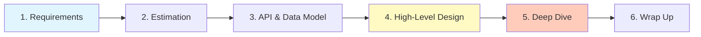

**Ключевые принципы:**
- Думать вслух -- интервьюер оценивает процесс мышления
- Задавать уточняющие вопросы, а не додумывать
- Рисовать диаграммы -- визуализация помогает обоим
- Обсуждать `trade-offs` -- показывает глубину понимания
- Не бояться ошибок -- процесс важнее результата

**Типичные ошибки:**
- Прыгать в детали без `high-level` дизайна
- Не уточнять требования и масштаб
- Проектировать для 100 пользователей вместо 100M
- Не обсуждать компромиссы
- Молчать -- интервьюер не телепат


> [!mcq]
> - [x] Правильный ответ | Объяснение концепции 2-3 предложения
> - [ ] Неправильный вариант 1 | Почему ошибка в этом подходе
> - [ ] Неправильный вариант 2 | Это смежное, но отличное понятие
> - [ ] Неправильный вариант 3 | Противоположное направление## Q2. (!) Как правильно собирать требования?

Первый и критически важный шаг. Без чётких требований можно спроектировать "не ту" систему. Нужно зафиксировать два типа требований:

**Функциональные требования (FR)** -- что система должна делать:
- Кто пользователи (B2C, B2B, internal)?
- Какие ключевые сценарии (`use cases`)?
- Что обязательно в `MVP`, а что можно отложить?
- Какие данные на вход и выход?

**Нефункциональные требования (NFR)** -- как система должна работать:
- `Latency` -- допустимое время ответа (p50, p99)?
- `Availability` -- 99.9% vs 99.99% (определяет допустимый downtime)?
- `Consistency` -- нужна ли `strong consistency` или допустима `eventual`?
- `Throughput` -- ожидаемый `RPS` (чтение/запись)?
- `Scale` -- сколько пользователей, данных, запросов?

**Пример для `URL Shortener`:**
```
FR: создание коротких ссылок, редирект, custom aliases, аналитика
NFR: latency < 100ms, availability 99.99%, 100M URL/мес, хранение 5 лет
```

Именно NFR определяют архитектурные решения: нужно ли `sharding`, сколько реплик, какой тип БД. Подробнее о выборе хранилищ -- в [стратегиях кэширования](../architecture/caching-strategies-interview.md) и вопросе по SQL/NoSQL ниже.


> [!mcq]
> - [x] Правильный ответ | Объяснение концепции 2-3 предложения
> - [ ] Неправильный вариант 1 | Почему ошибка в этом подходе
> - [ ] Неправильный вариант 2 | Это смежное, но отличное понятие
> - [ ] Неправильный вариант 3 | Противоположное направление## Q3. Как делать `back-of-the-envelope estimation`?

Оценки нужны, чтобы обосновать масштаб системы и принять инфраструктурные решения. Даже грубые числа полезнее их отсутствия.

**Полезные числа для запоминания:**

| Метрика | Значение |
|---------|----------|
| 1 день | ~86,400 сек (~100K для упрощения) |
| 1 месяц | ~2.5M сек |
| `QPS` из DAU | `DAU` x запросов/юзер / 86400 |
| Пиковый `QPS` | средний `QPS` x 2-3 |
| `char` | 1 byte |
| `long` / `timestamp` | 8 bytes |
| `UUID` | 16 bytes |
| Средний `URL` | ~100 bytes |
| Средний `JSON` объект | ~500 bytes - 2 KB |
| 1 TB диск | ~$0.02/GB/мес (S3) |

**Пример оценки для `URL Shortener`:**
```
Writes: 100M URL/мес → 100M / (30 * 86400) ≈ 40 URL/сек
Reads:  10:1 read/write → 400 URL/сек (пиковый ~1000)
Storage: 100M * 500B * 12 мес * 5 лет = 3 TB
Cache:  80/20 правило: 20% URL = 80% трафика → 0.2 * 400 * 86400 * 500B ≈ 3.5 GB/день
```

После оценок проще обосновать: нужен ли `sharding` (3 TB -- одна БД справится), сколько кэша (3.5 GB -- один `Redis`), сколько серверов.


> [!mcq]
> - [x] Правильный ответ | Объяснение концепции 2-3 предложения
> - [ ] Неправильный вариант 1 | Почему ошибка в этом подходе
> - [ ] Неправильный вариант 2 | Это смежное, но отличное понятие
> - [ ] Неправильный вариант 3 | Противоположное направление## Q4. Как проектировать `API` и `data model`?

После требований и оценок нужно зафиксировать контракт (`API`) и структуру данных. Это помогает перейти от абстракции к конкретике.

**Подход к API:**
- `REST` для CRUD-операций (большинство случаев)
- `GraphQL` для клиентов с гибкими запросами (mobile, SPA)
- `gRPC` для inter-service коммуникации (low latency, schema-first)
- `WebSocket` для real-time (чат, нотификации)

**Пример REST API для URL Shortener:**
```
POST /api/v1/urls
  Body: { "longUrl": "...", "customAlias": "...", "expiresIn": 3600 }
  Response: { "shortUrl": "https://short.ly/abc123", "expiresAt": "..." }

GET /{shortUrl}
  Response: 301/302 Redirect

GET /api/v1/urls/{shortUrl}/stats
  Response: { "clicks": 12345, "createdAt": "...", ... }
```

**Подход к Data Model:**
- Определить основные сущности (entities)
- Определить связи между ними (1:1, 1:N, N:M)
- Выбрать тип хранилища под access patterns
- Определить индексы для частых запросов

```sql
-- Пример data model для URL Shortener
CREATE TABLE urls (
    id BIGINT PRIMARY KEY,
    short_code VARCHAR(10) UNIQUE NOT NULL,
    long_url TEXT NOT NULL,
    user_id BIGINT,
    created_at TIMESTAMP DEFAULT NOW(),
    expires_at TIMESTAMP,
    click_count BIGINT DEFAULT 0
);
-- Index для основного access pattern: lookup по short_code
CREATE INDEX idx_short_code ON urls(short_code);
```


> [!mcq]
> - [x] Правильный ответ | Объяснение концепции 2-3 предложения
> - [ ] Неправильный вариант 1 | Почему ошибка в этом подходе
> - [ ] Неправильный вариант 2 | Это смежное, но отличное понятие
> - [ ] Неправильный вариант 3 | Противоположное направление## Q5. (!) Как строить `high-level design`?

Это центральный этап интервью. Нужно нарисовать архитектурную диаграмму с основными компонентами и потоками данных.

**Типичные компоненты:**

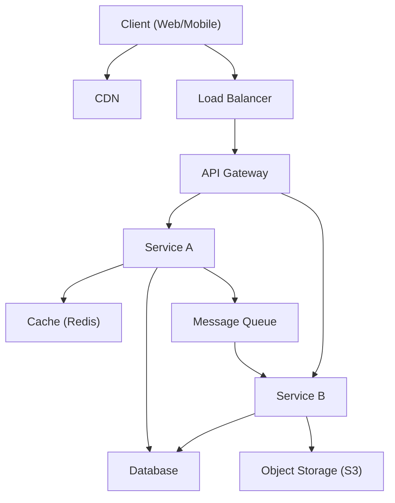

**Что нужно показать:**
1. **Клиент** -- откуда приходят запросы
2. **`Load Balancer`** -- распределение нагрузки (см. [балансировка нагрузки](../architecture/load-balancing-interview.md))
3. **`API Gateway`** -- единая точка входа (auth, rate limiting, routing)
4. **Сервисы** -- бизнес-логика (monolith vs [микросервисы](../architecture/microservices-interview.md))
5. **`Cache`** -- ускорение чтения ([стратегии кэширования](../architecture/caching-strategies-interview.md))
6. **`Database`** -- хранение данных (SQL/NoSQL)
7. **`Message Queue`** -- асинхронная обработка ([Kafka](../messaging/kafka-interview.md), `RabbitMQ`)
8. **`Object Storage`** -- файлы, медиа (S3)
9. **`CDN`** -- доставка статики и edge-контента

**Важно:** на этом этапе не углубляться в детали. Задача -- показать все компоненты и как они взаимодействуют.


> [!mcq]
> - [x] Правильный ответ | Объяснение концепции 2-3 предложения
> - [ ] Неправильный вариант 1 | Почему ошибка в этом подходе
> - [ ] Неправильный вариант 2 | Это смежное, но отличное понятие
> - [ ] Неправильный вариант 3 | Противоположное направление## Q6. Как проводить `deep dive`?

После `high-level design` интервьюер попросит углубиться в 1-2 критичных компонента. Нужно быть готовым к детализации:

**Что обычно спрашивают:**
- Как генерировать уникальные ID? (`Snowflake`, `UUID`, auto-increment)
- Как обеспечить `consistency`? (quorum, 2PC, saga)
- Как масштабировать БД? (sharding, replication)
- Как обработать edge cases? (race conditions, failures)
- Как обеспечить fault tolerance? (retries, circuit breaker, fallback)

**Паттерны для deep dive:**

| Проблема | Решение |
|----------|---------|
| Уникальные ID | `Snowflake`, `ULID`, `UUID v7` |
| Hot spots | `Consistent hashing`, виртуальные ноды |
| Race conditions | Optimistic locking, `CAS`, distributed lock |
| Data consistency | `Saga`, `Outbox pattern`, `CDC` |
| High availability | Multi-region, active-active, failover |
| Data loss prevention | `WAL`, replication, backup |

Подробнее о паттернах согласованности -- в [отдельном файле](../architecture/consistency-patterns-interview.md).

---


> [!mcq]
> - [x] Правильный ответ | Объяснение концепции 2-3 предложения
> - [ ] Неправильный вариант 1 | Почему ошибка в этом подходе
> - [ ] Неправильный вариант 2 | Это смежное, но отличное понятие
> - [ ] Неправильный вариант 3 | Противоположное направление## Q7. (!) Как спроектировать `URL Shortener` (`bit.ly`)?

### Требования

**FR:** создание короткой ссылки, редирект, custom aliases, expiration, аналитика кликов.

**NFR:** availability 99.99%, latency < 100ms, 100M URL/мес, хранение 5 лет.

### Оценка масштаба

```
Write: 100M/мес ≈ 40 URL/сек
Read:  10:1 ratio → 400/сек (пик ~1000/сек)
Storage: 100M × 500B × 60 мес ≈ 3 TB
Cache: 20% hot URLs × daily reads × 500B ≈ 3.5 GB
```

### Архитектура

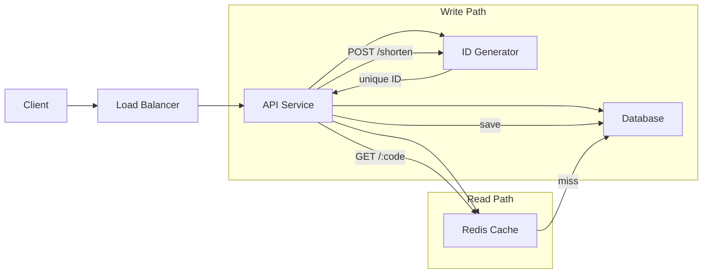

### Генерация короткого `URL`

Три подхода:

| Подход | Плюсы | Минусы |
|--------|-------|--------|
| `MD5/SHA256` + обрезка | Простота | Коллизии, нужна проверка |
| `Base62(auto-increment ID)` | Нет коллизий, короткий | Single point of failure |
| `Snowflake ID` + `Base62` | Distributed, нет коллизий | Сложнее реализация |

**Рекомендация:** `Base62` encoding с распределённым генератором ID типа `Snowflake`:

```java
public class Base62Encoder {
    private static final String CHARS =
        "0123456789ABCDEFGHIJKLMNOPQRSTUVWXYZabcdefghijklmnopqrstuvwxyz";

    public static String encode(long id) {
        StringBuilder sb = new StringBuilder();
        while (id > 0) {
            sb.append(CHARS.charAt((int)(id % 62)));
            id /= 62;
        }
        return sb.reverse().toString(); // 7 символов = 62^7 ≈ 3.5 трлн
    }
}
```

### `Trade-offs`

- **`301` vs `302` redirect:** `301` (permanent) кэшируется браузером -- меньше нагрузки, но нет аналитики; `302` (temporary) -- каждый запрос к серверу, можно считать клики
- **Custom aliases:** нужна проверка уникальности; race conditions решаются через `unique constraint` + retry или `optimistic locking`
- **Expiration:** `TTL` в `Redis` + background job для очистки БД


> [!mcq]
> - [x] Правильный ответ | Объяснение концепции 2-3 предложения
> - [ ] Неправильный вариант 1 | Почему ошибка в этом подходе
> - [ ] Неправильный вариант 2 | Это смежное, но отличное понятие
> - [ ] Неправильный вариант 3 | Противоположное направление## Q8. (!) Как спроектировать `Rate Limiter`?

`Rate Limiter` ограничивает количество запросов от клиента за период времени. Защищает систему от `DDoS`, злоупотреблений и обеспечивает fair usage. Тесно связан с [балансировкой нагрузки](../architecture/load-balancing-interview.md) и безопасностью.

### Требования

**FR:** ограничение запросов по IP/user/API key, конфигурируемые правила (N запросов за M секунд), возврат `429 Too Many Requests`.

**NFR:** low latency (не замедлять нормальные запросы), distributed (работает на кластере), high availability.

### Где размещать?

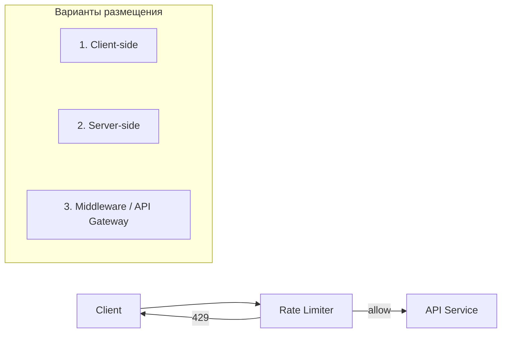

**Рекомендация:** middleware / `API Gateway` -- централизованно, не зависит от клиентов, легко конфигурируется.

### Алгоритмы

**1. `Token Bucket`** -- наиболее популярный (используется в `AWS`, `Stripe`):
- Bucket вмещает N токенов, пополняется с фиксированной скоростью
- Каждый запрос забирает 1 токен; нет токенов -- отказ
- Позволяет короткие всплески (`burst`)

```java
public class TokenBucketRateLimiter {
    private final int maxTokens;
    private final double refillRate; // токенов/сек
    private double tokens;
    private long lastRefillTime;

    public synchronized boolean allowRequest() {
        refill();
        if (tokens >= 1) {
            tokens -= 1;
            return true;
        }
        return false;
    }

    private void refill() {
        long now = System.nanoTime();
        double elapsed = (now - lastRefillTime) / 1_000_000_000.0;
        tokens = Math.min(maxTokens, tokens + elapsed * refillRate);
        lastRefillTime = now;
    }
}
```

**2. `Sliding Window Log`** -- точный, но память O(N):
- Хранить timestamp каждого запроса
- Считать запросы в окне [now - window, now]

**3. `Sliding Window Counter`** -- компромисс точности и памяти:
- Разбить время на sub-windows (counter per sub-window)
- Взвешенная сумма текущего и предыдущего окна

**4. `Fixed Window Counter`** -- простой, но проблема на границах окон:
- Один counter на фиксированное окно (например, минута)
- На границе окон может пропустить 2x лимита

| Алгоритм | Память | Точность | Burst |
|----------|--------|----------|-------|
| `Token Bucket` | O(1) | Средняя | Да |
| `Sliding Window Log` | O(N) | Высокая | Нет |
| `Sliding Window Counter` | O(1) | Средняя | Нет |
| `Fixed Window Counter` | O(1) | Низкая | Проблема на границах |

### Distributed `Rate Limiter`

В распределённой системе нужен общий счётчик. Решения:
- **`Redis`** с `INCR` + `EXPIRE` -- стандартный подход; `Lua`-скрипт для атомарности
- **Race condition:** `MULTI/EXEC` или `Lua` скрипт в `Redis` для атомарного check-and-increment

```lua
-- Redis Lua script для sliding window counter
local key = KEYS[1]
local window = tonumber(ARGV[1])
local limit = tonumber(ARGV[2])
local now = tonumber(ARGV[3])

redis.call('ZREMRANGEBYSCORE', key, 0, now - window)
local count = redis.call('ZCARD', key)
if count < limit then
    redis.call('ZADD', key, now, now .. math.random())
    redis.call('EXPIRE', key, window)
    return 1
end
return 0
```

### `Trade-offs`

- **Hard vs soft limiting:** hard отклоняет сразу; soft логирует и алертит, но пропускает
- **Local vs distributed counter:** local -- быстрее, но неточный в кластере; distributed -- точный, но latency на `Redis`
- **`429` response:** включать `Retry-After` header, чтобы клиент знал когда повторить


> [!mcq]
> - [x] Правильный ответ | Объяснение концепции 2-3 предложения
> - [ ] Неправильный вариант 1 | Почему ошибка в этом подходе
> - [ ] Неправильный вариант 2 | Это смежное, но отличное понятие
> - [ ] Неправильный вариант 3 | Противоположное направление## Q9. (!) Как спроектировать систему чата (`WhatsApp`, `Telegram`)?

### Требования

**FR:** 1-to-1 и групповые чаты, текст + медиа, статусы доставки (sent/delivered/read), история сообщений, online-статус.

**NFR:** latency < 100ms, high availability, no message loss, 1B юзеров, 100M онлайн одновременно.

### Оценка масштаба

```
Messages: 100M DAU × 50 msg/день = 5B сообщений/день
QPS:      5B / 86400 ≈ 58K msg/сек
Storage:  5B × 200B × 365 дней = ~365 TB/год
```

### Архитектура

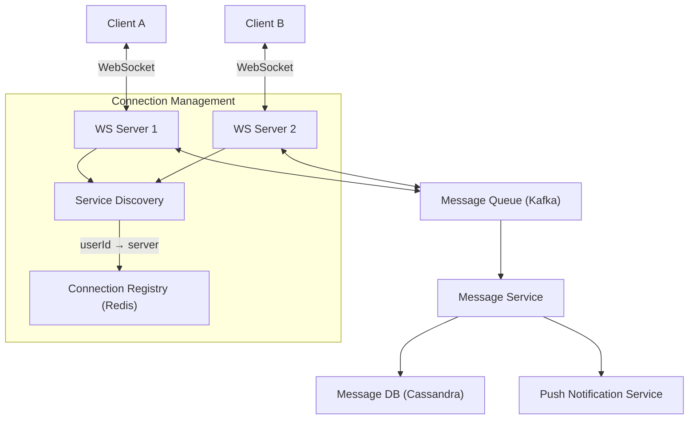

### `Real-time` коммуникация

**`WebSocket`** -- единственный адекватный протокол для real-time чата:
1. Клиент устанавливает `WebSocket` соединение с сервером
2. Сервер хранит mapping: `userId` -> `WebSocket` connection
3. При отправке: sender -> `WS Server` -> (lookup receiver server) -> `MQ` -> receiver `WS Server` -> receiver

**Масштабирование `WebSocket`:**
- Множество `WebSocket` серверов за `Load Balancer`
- `Connection Registry` (`Redis`): `userId` -> `serverId`
- `Message Queue` (`Kafka`) для маршрутизации между серверами
- Один сервер ~ 50-100K соединений (зависит от памяти)

### Схема БД

Для сообщений лучше [Cassandra](../databases/cassandra-interview.md) -- оптимизирована под write-heavy нагрузку, partition по `chatId`:

```sql
-- Cassandra-подобная схема
CREATE TABLE messages (
    chat_id BIGINT,
    message_id BIGINT,       -- Snowflake ID (сортировка по времени)
    sender_id BIGINT,
    content TEXT,
    media_url TEXT,
    status VARCHAR(20),      -- sent, delivered, read
    created_at TIMESTAMP,
    PRIMARY KEY (chat_id, message_id)
) WITH CLUSTERING ORDER BY (message_id DESC);
```

### Статусы доставки

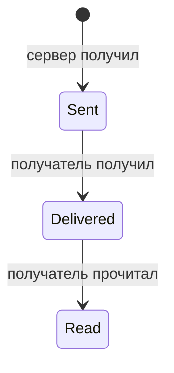

- **Sent:** сервер подтвердил получение (ACK)
- **Delivered:** устройство получателя подтвердило получение
- **Read:** получатель открыл чат

### Групповые чаты

- При отправке сообщения в группу -- `fan-out` к участникам
- Маленькие группы (<100): синхронный fan-out
- Большие группы (>100): асинхронный через `Message Queue`
- Хранение: одна копия сообщения + список получателей

### `Trade-offs`

- **`WebSocket` vs `Long Polling`:** `WebSocket` двусторонний, но сложнее в инфраструктуре; `Long Polling` проще, но больше overhead
- **`Message storage`:** хранить все сообщения навсегда vs TTL + архивация
- **`E2E encryption`:** безопаснее, но сервер не может индексировать для поиска


> [!mcq]
> - [x] Правильный ответ | Объяснение концепции 2-3 предложения
> - [ ] Неправильный вариант 1 | Почему ошибка в этом подходе
> - [ ] Неправильный вариант 2 | Это смежное, но отличное понятие
> - [ ] Неправильный вариант 3 | Противоположное направление## Q10. (!) Как спроектировать `Notification System`?

Система нотификаций отправляет уведомления пользователям через множество каналов: `push`, `SMS`, `email`, `in-app`. Критично для engagement в любом продукте.

### Требования

**FR:** поддержка каналов (push/SMS/email/in-app), шаблоны сообщений, scheduling, user preferences, throttling.

**NFR:** soft real-time (< 5 сек для push), at-least-once delivery, 10M нотификаций/день, scalable.

### Архитектура

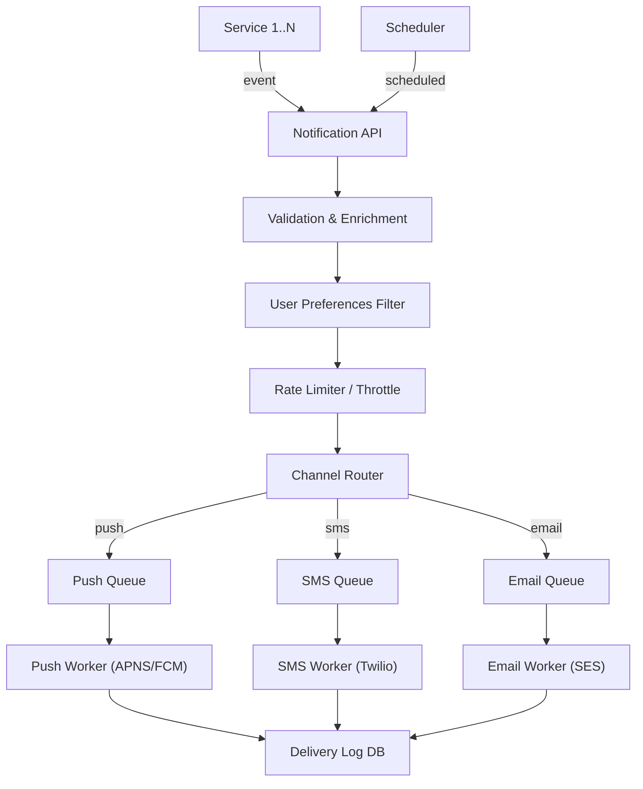

### Ключевые компоненты

**1. Validation & Enrichment:**
- Проверка входных данных
- Обогащение: подставить имя пользователя, детали заказа и т.д.
- Render шаблона с параметрами

**2. User Preferences:**
- Пользователь может отключить каналы/типы уведомлений
- Quiet hours (не отправлять ночью)
- Frequency capping (не более N нотификаций/час)

**3. Channel Router:**
- Определяет каналы доставки для каждого сообщения
- Fallback: если push не доставлен -> SMS

**4. Queue per Channel:**
- Отдельная очередь на каждый канал -- разная скорость обработки
- `DLQ` для failed messages
- Retry с exponential backoff

### `Trade-offs`

- **Push vs Pull:** push через `APNS`/`FCM` vs in-app polling. Push быстрее, но нет гарантии доставки (пользователь отключил нотификации)
- **At-least-once vs exactly-once:** at-least-once проще, но нужна дедупликация (idempotency key)
- **Priority:** critical (OTP, security alerts) vs marketing -- отдельные очереди с разными SLA
- **Template rendering:** server-side (гибкость) vs client-side (меньше трафика)


> [!mcq]
> - [x] Правильный ответ | Объяснение концепции 2-3 предложения
> - [ ] Неправильный вариант 1 | Почему ошибка в этом подходе
> - [ ] Неправильный вариант 2 | Это смежное, но отличное понятие
> - [ ] Неправильный вариант 3 | Противоположное направление## Q11. (!) Как спроектировать `News Feed` (`Twitter`, `Instagram`)?

Лента новостей -- один из самых частых вопросов на system design интервью. Основная сложность -- генерация персонализированного feed для миллионов пользователей.

### Требования

**FR:** публикация постов (текст, фото, видео), подписки (follow/unfollow), персонализированная лента, лайки/комментарии.

**NFR:** latency feed < 200ms, availability 99.99%, eventual consistency OK, 1B юзеров, 100M DAU.

### Оценка масштаба

```
Posts:       100M DAU × 2 поста/день = 200M постов/день
Feed reads:  100M DAU × 10 просмотров/день = 1B reads/день
Feed QPS:    1B / 86400 ≈ 12K/сек (пик ~30K)
```

### Генерация `Feed` -- главный design decision

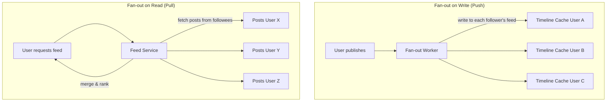

| Подход | Read latency | Write latency | Когда использовать |
|--------|-------------|---------------|-------------------|
| `Fan-out on Write` (Push) | Быстро (готовый feed) | Медленно (N записей) | Обычные пользователи |
| `Fan-out on Read` (Pull) | Медленно (сбор из N источников) | Быстро (одна запись) | Знаменитости (>1M подписчиков) |
| **Hybrid** | Быстро | Зависит от типа юзера | **Production-решение** |

**Hybrid подход (используется в `Twitter`, `Instagram`):**
- `Fan-out on write` для обычных пользователей (99%)
- `Fan-out on read` для знаменитостей (1%, но миллионы подписчиков)
- При запросе feed: готовый timeline + merge с постами знаменитостей

### Timeline Storage

```
Redis:
  Key:   timeline:{userId}
  Value: Sorted Set (score = timestamp, member = postId)
  TTL:   7 дней
```

Хранить только ID постов в timeline -- полные данные поста получать отдельно (cache-aside).

### Архитектура

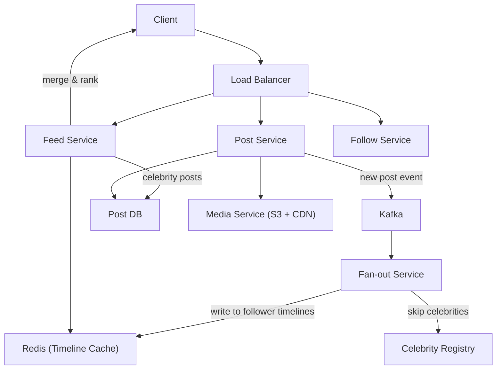

### `Trade-offs`

- **Hotkey problem:** знаменитости -- hot key при fan-out on write. Hybrid решает это
- **Ranking vs chronological:** хронологический проще, но engagement ниже; ML ranking сложнее, но лучше удержание
- **Cache invalidation:** при удалении/редактировании поста нужно обновить все timelines (или lazy invalidation)
- Подробнее об event-driven подходе -- в [event-driven паттернах](../architecture/event-driven-patterns-interview.md)


> [!mcq]
> - [x] Правильный ответ | Объяснение концепции 2-3 предложения
> - [ ] Неправильный вариант 1 | Почему ошибка в этом подходе
> - [ ] Неправильный вариант 2 | Это смежное, но отличное понятие
> - [ ] Неправильный вариант 3 | Противоположное направление## Q12. Как спроектировать `Search Autocomplete`?

`Autocomplete` (typeahead) предлагает варианты завершения по мере ввода поискового запроса. Используется в `Google`, `Amazon`, `YouTube`.

### Требования

**FR:** подсказки при вводе (top-K по популярности), обновление популярности, поддержка multi-language.

**NFR:** latency < 50ms (пользователь вводит быстро), availability 99.99%, 10K QPS.

### Архитектура

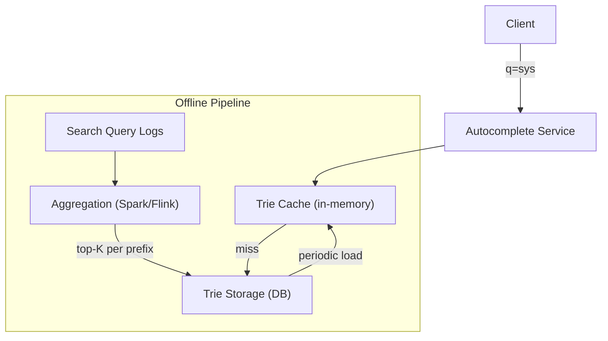

### Структура данных: `Trie`

`Trie` (prefix tree) -- основная структура для autocomplete. Каждый узел хранит символ и top-K завершений:

```java
class TrieNode {
    Map<Character, TrieNode> children = new HashMap<>();
    List<String> topSuggestions = new ArrayList<>(); // pre-computed top-K
}

class AutocompleteTrie {
    private final TrieNode root = new TrieNode();

    public List<String> search(String prefix) {
        TrieNode node = root;
        for (char c : prefix.toCharArray()) {
            node = node.children.get(c);
            if (node == null) return Collections.emptyList();
        }
        return node.topSuggestions; // O(len(prefix)) -- очень быстро
    }
}
```

**Оптимизации:**
- Pre-compute top-K для каждого узла (не обходить поддерево при запросе)
- Сжатие: merge однодочерних узлов (`Radix Trie` / `Patricia Trie`)
- Sharding по первым символам (`a-g` -> shard 1, `h-n` -> shard 2, ...)

### Обновление данных

Данные обновляются **offline** (не в real-time):
1. Собирать search query logs
2. Агрегировать (Spark/Flink): считать частоту запросов за период
3. Перестроить `Trie` с новыми top-K
4. Заменить `Trie` в памяти (blue-green deploy или atomic swap)

**Decay:** экспоненциальное затухание старых запросов, чтобы трендовые запросы поднимались наверх.

### `Trade-offs`

- **In-memory vs external storage:** in-memory быстрее, но ограничено памятью; для больших словарей нужен sharding
- **Real-time vs batch update:** real-time сложнее и дороже; batch с задержкой 15-60 мин обычно достаточно
- **Персонализация:** добавить user-specific suggestions поверх глобальных (recent searches, user context)
- **Фильтрация:** убирать offensive/NSFW подсказки -- отдельный pipeline модерации


> [!mcq]
> - [x] Правильный ответ | Объяснение концепции 2-3 предложения
> - [ ] Неправильный вариант 1 | Почему ошибка в этом подходе
> - [ ] Неправильный вариант 2 | Это смежное, но отличное понятие
> - [ ] Неправильный вариант 3 | Противоположное направление## Q13. Как спроектировать систему хранения файлов (`Dropbox`, `Google Drive`)?

### Требования

**FR:** upload/download файлов, синхронизация между устройствами, sharing (permissions), версионирование.

**NFR:** надёжность (no data loss), доступность, масштабируемость (петабайты данных), eventual consistency OK.

### Оценка масштаба

```
Users:     100M, 10GB на юзера = 1 EB (exabyte)
Uploads:   10M файлов/день
Read:Write = 3:1
```

### Архитектура

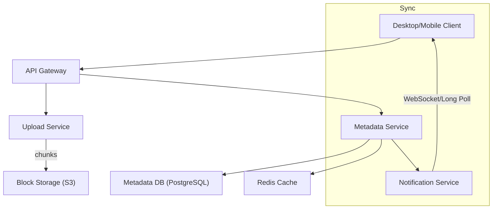

### Хранение файлов: `Chunking`

Файлы разбиваются на блоки (4 MB) -- это ключевой design decision:
- **Дедупликация:** одинаковые блоки хранятся один раз
- **Incremental sync:** при изменении файла пересылаются только изменённые блоки
- **Параллельная загрузка:** блоки загружаются параллельно
- **Resume:** при обрыве продолжить с недозагруженного блока

### Синхронизация

| Подход | Плюсы | Минусы |
|--------|-------|--------|
| `Polling` | Простота | Нагрузка, задержка |
| `Long Polling` | Меньше лишних запросов | Таймауты, не real-time |
| `WebSocket` | Real-time, двусторонняя | Сложнее инфраструктура |

**Conflict resolution:**
- `Last-write-wins` (LWW) -- просто, но может потерять данные
- Версионирование -- сохранять обе версии, пользователь выбирает
- `CRDT` / `OT` -- для collaborative editing (Google Docs)

### Схема БД

```sql
CREATE TABLE files (
    id UUID PRIMARY KEY,
    name VARCHAR(255),
    path TEXT,
    size BIGINT,
    owner_id UUID,
    parent_folder_id UUID,
    is_deleted BOOLEAN DEFAULT FALSE,
    created_at TIMESTAMP,
    modified_at TIMESTAMP
);

CREATE TABLE chunks (
    hash VARCHAR(64) PRIMARY KEY,    -- SHA-256
    size INT,
    storage_location TEXT            -- S3 key
);

CREATE TABLE file_versions (
    id UUID PRIMARY KEY,
    file_id UUID REFERENCES files(id),
    version INT,
    chunk_hashes JSONB,              -- ordered list of chunk hashes
    created_at TIMESTAMP
);
```


> [!mcq]
> - [x] Правильный ответ | Объяснение концепции 2-3 предложения
> - [ ] Неправильный вариант 1 | Почему ошибка в этом подходе
> - [ ] Неправильный вариант 2 | Это смежное, но отличное понятие
> - [ ] Неправильный вариант 3 | Противоположное направление## Q14. Как спроектировать систему рекомендаций (`Netflix`, `YouTube`)?

### Требования

**FR:** персонализированные рекомендации, учёт истории и рейтингов, real-time и batch рекомендации.

**NFR:** latency < 200ms, масштабируемость (миллиарды взаимодействий), offline training, online serving.

### Подходы к рекомендациям

| Подход | Идея | Плюсы | Минусы |
|--------|------|-------|--------|
| `Content-Based` | Похоже на то, что смотрел | Работает для новых юзеров | Filter bubble |
| `Collaborative Filtering` | Что нравится похожим юзерам | Serendipity | Cold start |
| `Hybrid` | Комбинация подходов | Лучшее качество | Сложность |

### Архитектура: Offline + Online Pipeline

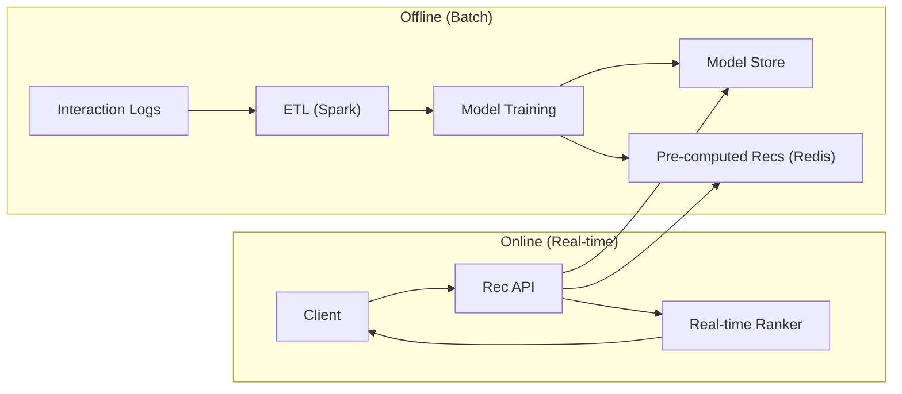

**Offline:** обучение моделей на исторических данных (`Matrix Factorization`, `Deep Learning`), pre-compute рекомендаций для всех юзеров, сохранение в `Redis`/DB.

**Online:** получить pre-computed рекомендации, обогатить real-time контекстом (время суток, устройство), re-rank и отдать.

### Метрики

- `Precision@K`, `Recall@K` -- точность top-K рекомендаций
- `CTR` (Click-Through Rate) -- процент кликов
- `Engagement` -- время просмотра, лайки, retention
- A/B тестирование -- сравнение моделей на реальном трафике

---


> [!mcq]
> - [x] Правильный ответ | Объяснение концепции 2-3 предложения
> - [ ] Неправильный вариант 1 | Почему ошибка в этом подходе
> - [ ] Неправильный вариант 2 | Это смежное, но отличное понятие
> - [ ] Неправильный вариант 3 | Противоположное направление## Q15. (!) Что такое `Consistent Hashing` и зачем он нужен?

`Consistent Hashing` решает проблему перераспределения данных при добавлении/удалении серверов. При обычном `hash(key) % N` добавление сервера пересчитывает **все** ключи. `Consistent Hashing` затрагивает только `K/N` ключей (K -- всего ключей, N -- число серверов).

### Принцип работы

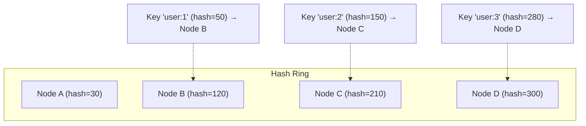

1. Серверы и ключи хешируются на одно кольцо (0..2^32)
2. Ключ назначается первому серверу по часовой стрелке
3. При добавлении/удалении сервера перемещаются только соседние ключи

### Виртуальные ноды

Проблема: при малом числе серверов распределение неравномерное. Решение -- **виртуальные ноды**: каждый физический сервер представлен 100-200 точками на кольце.

```java
public class ConsistentHashRing<T> {
    private final TreeMap<Long, T> ring = new TreeMap<>();
    private final int virtualNodes;

    public ConsistentHashRing(int virtualNodes) {
        this.virtualNodes = virtualNodes;
    }

    public void addNode(T node) {
        for (int i = 0; i < virtualNodes; i++) {
            long hash = hash(node.toString() + "#" + i);
            ring.put(hash, node);
        }
    }

    public T getNode(String key) {
        long hash = hash(key);
        // Первый узел по часовой стрелке
        Map.Entry<Long, T> entry = ring.ceilingEntry(hash);
        return (entry != null) ? entry.getValue() : ring.firstEntry().getValue();
    }

    private long hash(String key) {
        // Используем MD5/murmur hash для равномерного распределения
        return Hashing.murmur3_128().hashString(key, UTF_8).asLong();
    }
}
```

### Применение

- **`Redis Cluster`** -- распределение ключей по шардам
- **`Cassandra`** -- partitioning данных
- **CDN** -- определение ближайшего edge-сервера
- **`Load Balancer`** -- sticky sessions с сохранением при масштабировании

Подробнее о стратегиях кэширования с `consistent hashing` -- в [отдельном файле](../architecture/caching-strategies-interview.md).

### `Trade-offs`

- **Больше виртуальных нод** -- лучше распределение, но больше памяти и медленнее lookup
- **Горячие ключи** -- `consistent hashing` не решает hot spot (решается репликацией или key-aware routing)
- **Ребалансировка** -- при добавлении ноды данные мигрируют автоматически, но нужен background процесс


> [!mcq]
> - [x] Правильный ответ | Объяснение концепции 2-3 предложения
> - [ ] Неправильный вариант 1 | Почему ошибка в этом подходе
> - [ ] Неправильный вариант 2 | Это смежное, но отличное понятие
> - [ ] Неправильный вариант 3 | Противоположное направление## Q16. (!) Как работает `Database Sharding`?

`Sharding` (горизонтальное секционирование) -- разделение данных между несколькими серверами БД для масштабирования. Каждый shard содержит подмножество данных. Подробнее о масштабируемости в [паттернах масштабируемости](../architecture/scalability-patterns-interview.md).

### Стратегии шардирования

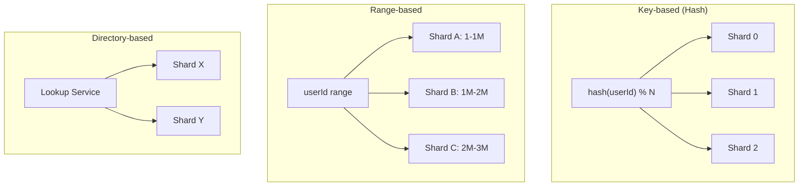

| Стратегия | Плюсы | Минусы |
|-----------|-------|--------|
| **Hash-based** | Равномерное распределение | Resharding при добавлении шарда |
| **Range-based** | Эффективные range queries | Hot spots (новые данные на одном шарде) |
| **Directory-based** | Гибкость | Lookup service = single point of failure |

### Выбор Shard Key

**Хороший shard key:**
- Высокая кардинальность (много уникальных значений)
- Равномерное распределение
- Соответствует основным access patterns

**Примеры:**
- `userId` -- для user-centric систем (профили, заказы)
- `orderId` -- для систем заказов
- `chatId` -- для мессенджеров (сообщения одного чата на одном шарде)

**Плохой shard key:**
- `country` -- неравномерное распределение (US >> Liechtenstein)
- `createdAt` -- все записи идут на один шард

### Проблемы шардирования

**1. Cross-shard queries:**
```sql
-- Простой запрос → один шард
SELECT * FROM orders WHERE user_id = 123;

-- Cross-shard (нужен scatter-gather) → медленно
SELECT * FROM orders WHERE amount > 1000 ORDER BY created_at LIMIT 10;
```

**2. Cross-shard joins** -- невозможны напрямую. Решения:
- Денормализация (дублирование данных)
- Application-level join
- Отдельная аналитическая БД

**3. Resharding** -- при добавлении шарда нужна миграция данных:
- `Consistent hashing` минимизирует миграцию
- Виртуальные шарды (over-provision + move)
- Online migration с double-write

### `Trade-offs`

- **Sharding vs replication:** sharding масштабирует write, replication -- read
- **Complexity:** sharding добавляет огромную операционную сложность (cross-shard queries, distributed transactions, resharding)
- **When to shard:** сначала -- vertical scaling, read replicas, caching. Sharding -- крайняя мера


> [!mcq]
> - [x] Правильный ответ | Объяснение концепции 2-3 предложения
> - [ ] Неправильный вариант 1 | Почему ошибка в этом подходе
> - [ ] Неправильный вариант 2 | Это смежное, но отличное понятие
> - [ ] Неправильный вариант 3 | Противоположное направление## Q17. (!) Как работает `Leader Election`?

`Leader Election` -- выбор одного узла в кластере как лидера для координации. Нужен для: master DB replication, distributed lock manager, task scheduling, partition assignment ([Kafka](../messaging/kafka-interview.md) controller).

### Алгоритмы

**1. `Raft` (наиболее понятный):**

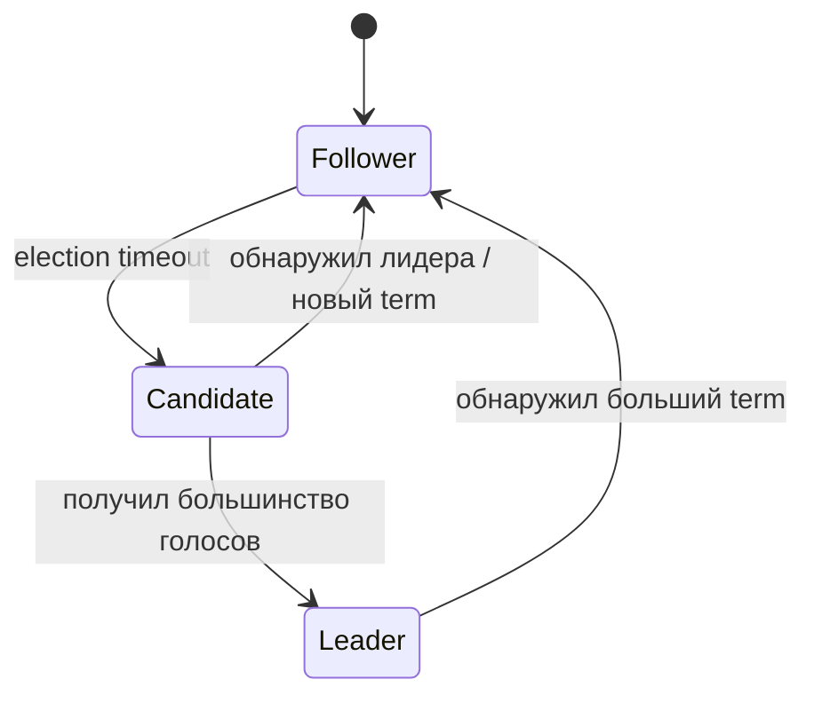

Принцип `Raft`:
1. Все узлы начинают как `Follower`
2. Если `Follower` не получает heartbeat от лидера -- становится `Candidate`
3. `Candidate` запрашивает голоса у остальных (RequestVote RPC)
4. Получив большинство голосов -- становится `Leader`
5. `Leader` периодически отправляет heartbeats

**2. `ZooKeeper` / `etcd` (практический подход):**
- Используется внешний coordination service
- Узлы создают ephemeral node; узел с наименьшим ID -- лидер
- При падении лидера ephemeral node удаляется -- выбирается следующий

```java
// Пример с Apache Curator (ZooKeeper)
LeaderSelector selector = new LeaderSelector(client, "/leader", new LeaderSelectorListener() {
    @Override
    public void takeLeadership(CuratorFramework client) throws Exception {
        log.info("Я теперь лидер!");
        // Выполнять работу лидера
        // Метод блокируется пока узел является лидером
        Thread.sleep(Long.MAX_VALUE);
    }
});
selector.autoRequeue(); // при потере лидерства -- заново участвовать
selector.start();
```

**3. `Bully Algorithm`:**
- Узел с наибольшим ID выигрывает
- Простой, но не fault-tolerant (зависит от знания всех ID)

### Применение

| Система | Использование Leader Election |
|---------|-------------------------------|
| `Kafka` | Controller broker (управление партициями) |
| `PostgreSQL` | Primary-standby replication |
| `Elasticsearch` | Master node |
| `Kubernetes` | Только один controller-manager активен |
| `Redis Sentinel` | Выбор нового master при failover |

### `Trade-offs`

- **External service (`ZooKeeper`/`etcd`)** vs **embedded (`Raft`):** external проще в использовании, но добавляет зависимость; embedded -- полный контроль, но сложнее реализация
- **Split-brain:** при network partition может быть два лидера. Решение -- fencing tokens, epoch numbers
- **Leader bottleneck:** лидер = single point of throughput. Решение -- partition leadership (как в Kafka -- разные лидеры для разных партиций)

Подробнее о distributed coordination -- в [распределённых системах](../architecture/distributed-systems-interview.md).


> [!mcq]
> - [x] Правильный ответ | Объяснение концепции 2-3 предложения
> - [ ] Неправильный вариант 1 | Почему ошибка в этом подходе
> - [ ] Неправильный вариант 2 | Это смежное, но отличное понятие
> - [ ] Неправильный вариант 3 | Противоположное направление## Q18. Как спроектировать `Distributed Cache`?

`Distributed Cache` ускоряет чтение данных, снижает нагрузку на БД и обеспечивает low latency. Подробнее о стратегиях -- в [стратегиях кэширования](../architecture/caching-strategies-interview.md) и [Redis](../databases/redis-interview.md).

### Архитектура

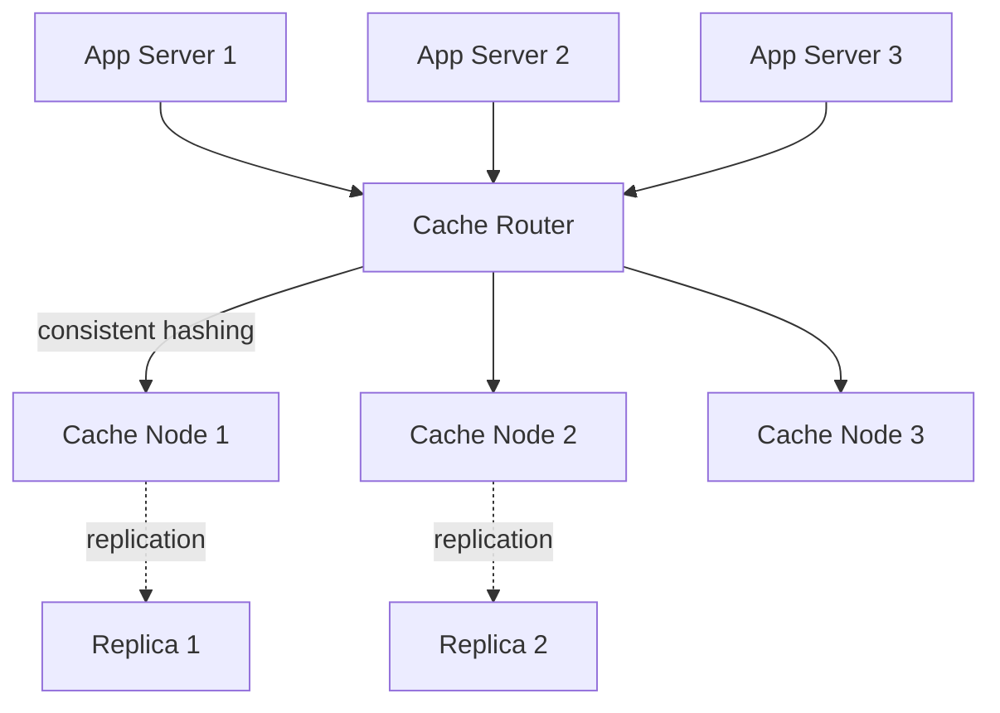

### Стратегии кэширования

| Стратегия | Описание | Когда использовать |
|-----------|----------|-------------------|
| `Cache-aside` | App читает cache -> miss -> читает DB -> пишет в cache | Read-heavy, допустима stale data |
| `Write-through` | App пишет в cache + DB одновременно | Consistency важна |
| `Write-behind` | App пишет в cache, async в DB | Write-heavy, допустима потеря |
| `Read-through` | Cache сам ходит в DB при miss | Упрощает app code |

### Проблемы и решения

**1. Cache stampede (thundering herd):**
Множество запросов одновременно обращаются к одному expired ключу, все идут в БД.

```java
// Решение: distributed lock + singleflight
public String getWithLock(String key) {
    String value = cache.get(key);
    if (value != null) return value;

    String lockKey = "lock:" + key;
    if (cache.setnx(lockKey, "1", Duration.ofSeconds(5))) {
        try {
            value = db.query(key);
            cache.set(key, value, Duration.ofMinutes(10));
        } finally {
            cache.del(lockKey);
        }
    } else {
        Thread.sleep(50); // подождать, пока другой поток заполнит
        return cache.get(key); // retry
    }
    return value;
}
```

**2. Hot key:**
- Один ключ получает непропорционально много запросов
- Решение: local cache (L1) + distributed cache (L2), key replication

**3. Cache invalidation:**
- Один из "двух сложных проблем" в CS
- `TTL` -- простой, но stale data в пределах TTL
- Event-driven invalidation -- точный, но сложнее

### `Trade-offs`

- **Consistency vs latency:** strong consistency требует синхронной инвалидации (медленнее)
- **Memory vs hit rate:** больше памяти -- выше hit rate, но дороже
- **Eviction policy:** `LRU` (самый старый неиспользованный), `LFU` (самый редко используемый), `TTL`


> [!mcq]
> - [x] Правильный ответ | Объяснение концепции 2-3 предложения
> - [ ] Неправильный вариант 1 | Почему ошибка в этом подходе
> - [ ] Неправильный вариант 2 | Это смежное, но отличное понятие
> - [ ] Неправильный вариант 3 | Противоположное направление## Q19. Как работает `CDN`?

`CDN` (Content Delivery Network) -- географически распределённая сеть серверов для доставки контента с минимальной latency. Edge-серверы кэшируют контент близко к пользователям.

### Архитектура

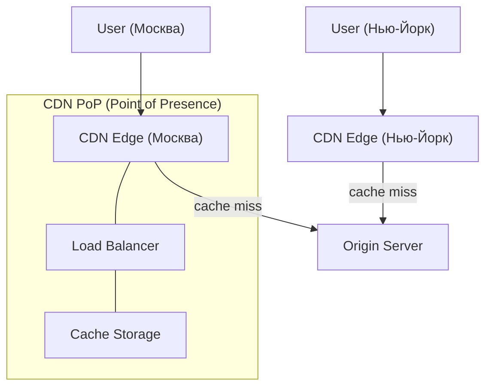

### Push vs Pull CDN

| Подход | Описание | Когда использовать |
|--------|----------|-------------------|
| **Push** | Origin загружает контент на CDN заранее | Статика, которая редко меняется (CSS, JS, images) |
| **Pull** | CDN запрашивает у origin при первом cache miss | Динамический контент, большой объём |

### Ключевые аспекты

**DNS-based routing:**
- `DNS` возвращает IP ближайшего edge-сервера (GeoDNS, Anycast)
- Пользователь автоматически попадает на ближайший PoP

**Cache key:**
- URL + query params + headers (Vary)
- Кастомный cache key для персонализации

**Invalidation:**
- `TTL` -- просто, но stale data до истечения
- Purge API -- немедленное удаление
- Versioned URLs (`style.v2.css`) -- самый надёжный

### `Trade-offs`

- **Cost vs latency:** CDN стоит денег, но снижает latency с ~200ms до ~20ms
- **Cache hit ratio:** ключевая метрика; низкий hit ratio = CDN бесполезен
- **Dynamic content:** кэширование сложнее, нужны edge compute (CloudFlare Workers, Lambda@Edge)

---


> [!mcq]
> - [x] Правильный ответ | Объяснение концепции 2-3 предложения
> - [ ] Неправильный вариант 1 | Почему ошибка в этом подходе
> - [ ] Неправильный вариант 2 | Это смежное, но отличное понятие
> - [ ] Неправильный вариант 3 | Противоположное направление## Q20. Как выбирать хранилище: `SQL` vs `NoSQL` vs `Search`?

Выбор хранилища -- один из ключевых design decisions. Часто в зрелой системе используется полиглотное хранение.

| Тип | Примеры | Когда использовать |
|-----|---------|-------------------|
| **SQL (RDBMS)** | `PostgreSQL`, `MySQL` | ACID, сложные связи, joins, транзакции |
| **Document** | `MongoDB`, `DynamoDB` | Гибкая схема, nested data, high throughput |
| **Wide-column** | `Cassandra`, `HBase` | Write-heavy, time-series, massive scale |
| **Key-Value** | `Redis`, `DynamoDB` | Cache, sessions, low latency lookups |
| **Graph** | `Neo4j`, `Amazon Neptune` | Связи между сущностями (social graph, fraud) |
| **Search** | `Elasticsearch`, `OpenSearch` | Full-text search, analytics, logs |

**Правила выбора:**
1. Начинать с `SQL` (`PostgreSQL`) -- покрывает 80% случаев
2. Добавлять `NoSQL` под конкретные access patterns
3. `Search engine` -- для полнотекстового поиска, не как source of truth
4. `Redis` -- для кэша, сессий, rate limiting, pub/sub

Подробнее о [Redis](../databases/redis-interview.md), [Cassandra](../databases/cassandra-interview.md), [Elasticsearch](../databases/elasticsearch-interview.md), [MongoDB](../databases/mongodb-interview.md) и [SQL](../databases/sql-interview.md) -- в отдельных файлах.


> [!mcq]
> - [x] Правильный ответ | Объяснение концепции 2-3 предложения
> - [ ] Неправильный вариант 1 | Почему ошибка в этом подходе
> - [ ] Неправильный вариант 2 | Это смежное, но отличное понятие
> - [ ] Неправильный вариант 3 | Противоположное направление## Q21. (!) Когда использовать очереди и `event-driven` подход?

Очереди и события уместны, когда нужно развязать компоненты по времени и нагрузке. Подробнее в [event-driven паттернах](../architecture/event-driven-patterns-interview.md) и [Kafka](../messaging/kafka-interview.md).

### Когда добавлять очередь

| Сценарий | Пример |
|----------|--------|
| Асинхронная обработка | Отправка email после регистрации |
| Буферизация пиков | Обработка заказов в Black Friday |
| Fan-out | Нотификации подписчикам |
| Retry / resilience | Повтор failed операций |
| Decoupling | Order Service не зависит от Inventory Service |

### Гарантии доставки

| Гарантия | Описание | Сложность |
|----------|----------|-----------|
| At-most-once | Может потеряться, но не дублируется | Простая |
| At-least-once | Доставлена, но может быть дубль | Средняя |
| Exactly-once | Ровно один раз (идемпотентность) | Сложная |

**На интервью важно назвать:**
- At-least-once + идемпотентность -- стандартный production подход
- `DLQ` (Dead Letter Queue) для failed messages
- Мониторинг consumer lag
- Schema registry для эволюции сообщений

### `Trade-offs`

- **Sync vs async:** sync проще для отладки, async масштабируемее
- **Eventual consistency:** очередь = задержка; не подходит для критичных данных (баланс)
- **Операционная сложность:** Kafka кластер требует мониторинга, capacity planning


> [!mcq]
> - [x] Правильный ответ | Объяснение концепции 2-3 предложения
> - [ ] Неправильный вариант 1 | Почему ошибка в этом подходе
> - [ ] Неправильный вариант 2 | Это смежное, но отличное понятие
> - [ ] Неправильный вариант 3 | Противоположное направление## Q22. Как обсуждать консистентность и `CAP` `trade-offs`?

Нужно явно обозначить, где нужна `strong consistency`, а где допустима `eventual consistency`. Подробнее -- в [CAP-теореме](../architecture/cap-theorem-interview.md) и [паттернах согласованности](../architecture/consistency-patterns-interview.md).

### Уровни консистентности

| Уровень | Описание | Пример |
|---------|----------|--------|
| **Strong** | Все читают последнюю запись | Платежи, балансы |
| **Eventual** | Со временем все узлы синхронизируются | Лента, рекомендации |
| **Causal** | Причинно-связанные операции упорядочены | Комментарии (ответ после вопроса) |
| **Read-your-writes** | Автор видит свои изменения | Профиль пользователя |

### Механизмы обеспечения

- **Quorum:** `W + R > N` -- write quorum + read quorum > total nodes
- **`Saga` / `Outbox` pattern** -- для distributed transactions
- **`Idempotency key`** -- дедупликация повторных запросов
- **`CDC` (Change Data Capture)** -- синхронизация между хранилищами

### `Trade-offs`

- `CAP`: при network partition выбирать `CP` (consistency) или `AP` (availability)
- `Strong consistency` = выше latency (нужно дождаться подтверждения от реплик)
- `Eventual consistency` = ниже latency, но stale reads

---


> [!mcq]
> - [x] Правильный ответ | Объяснение концепции 2-3 предложения
> - [ ] Неправильный вариант 1 | Почему ошибка в этом подходе
> - [ ] Неправильный вариант 2 | Это смежное, но отличное понятие
> - [ ] Неправильный вариант 3 | Противоположное направление## Q23. Как спроектировать `Observability` для системы?

Observability проектируют с самого начала, а не добавляют потом. Три столпа: metrics, logs, traces. Подробнее в [Observability](../monitoring/observability-interview.md) и [метриках и трейсинге](../monitoring/metrics-tracing-interview.md).

### Три столпа

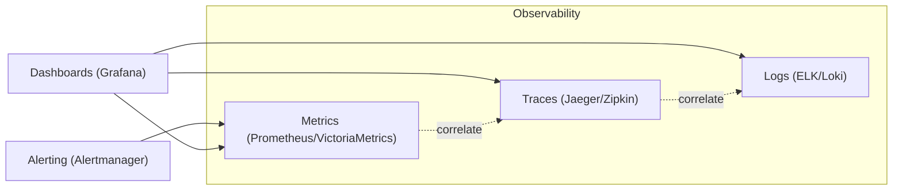

**Metrics (RED/USE):**
- **RED:** Rate, Errors, Duration -- для сервисов
- **USE:** Utilization, Saturation, Errors -- для ресурсов (CPU, memory, disk)

**Logs:**
- Структурированные (`JSON`)
- `correlationId` для связи между сервисами
- Уровни: ERROR, WARN, INFO, DEBUG

**Traces:**
- `traceId` / `spanId` для распределённого трейсинга
- Показывает цепочку вызовов и latency каждого шага

### SLO/SLI

- **SLI** (Service Level Indicator) -- конкретная метрика (p99 latency, error rate)
- **SLO** (Service Level Objective) -- целевое значение (p99 < 200ms, availability 99.9%)
- **SLA** (Service Level Agreement) -- контракт с клиентом (downtime = штрафы)

Подробнее о стратегиях логирования -- в [отдельном файле](../monitoring/logging-strategies-interview.md).


> [!mcq]
> - [x] Правильный ответ | Объяснение концепции 2-3 предложения
> - [ ] Неправильный вариант 1 | Почему ошибка в этом подходе
> - [ ] Неправильный вариант 2 | Это смежное, но отличное понятие
> - [ ] Неправильный вариант 3 | Противоположное направление## Q24. Какие аспекты безопасности покрывать в дизайне?

Безопасность -- обязательная часть system design, даже если интервьюер не спрашивает. Подробнее в [безопасности приложений](../security/application-security-interview.md) и [паттернах аутентификации](../security/authentication-authorization-patterns-interview.md).

**Базовый минимум:**
- **Authentication:** OAuth 2.0, JWT, MFA
- **Authorization:** RBAC/ABAC, principle of least privilege
- **Encryption:** TLS in transit, AES-256 at rest
- **Rate limiting:** защита от DDoS и brute force
- **Input validation:** защита от injection
- **Secrets management:** Vault, не хардкодить

**Для внешних API:**
- WAF (Web Application Firewall)
- Bot protection
- API key rotation

**Данные:**
- PII masking
- Data retention policy
- Compliance (GDPR, PCI DSS)
- Audit logging


> [!mcq]
> - [x] Правильный ответ | Объяснение концепции 2-3 предложения
> - [ ] Неправильный вариант 1 | Почему ошибка в этом подходе
> - [ ] Неправильный вариант 2 | Это смежное, но отличное понятие
> - [ ] Неправильный вариант 3 | Противоположное направление## Q25. (!) Как завершать решение и презентовать `trade-offs`?

Финал интервью -- возможность показать senior-level мышление. Нужно:

**1. Резюмировать решение:**
- Требования -> архитектура -> ключевые решения
- Показать, что не потеряли контекст после deep dive

**2. Назвать trade-offs:**
- Что выбрали и почему
- Что потеряли из-за этого выбора
- При каких условиях решение изменится

**3. Обсудить bottlenecks и эволюцию:**
- Что станет узким местом при росте x10?
- Какие улучшения будут следующими шагами?
- Мониторинг: как узнаем о проблеме до того, как пострадают пользователи?

**4. Показать зрелость:**
- "Это решение работает до X QPS / Y TB. При превышении потребуется..."
- "В первой итерации я бы выбрал monolith, а sharding добавил бы когда..."
- "Главный риск -- ..., и мы его митигируем через..."

Такой финал обычно даёт сильный сигнал senior-уровня и умения коммуницировать технические решения.


> [!mcq]
> - [x] Правильный ответ | Объяснение концепции 2-3 предложения
> - [ ] Неправильный вариант 1 | Почему ошибка в этом подходе
> - [ ] Неправильный вариант 2 | Это смежное, но отличное понятие
> - [ ] Неправильный вариант 3 | Противоположное направление## Q26. (!) Пошаговый дизайн `URL Shortener` — разбор интервью от A до Z

**Шаг 1 — Требования (5 мин)**

Уточняющие вопросы на интервью:
- Ожидаемая нагрузка? (100M ссылок/день → ~1200 write QPS, ~12K read QPS — 10:1 read:write)
- Срок хранения ссылок? (10 лет)
- Длина short URL? (7 символов → 62^7 ≈ 3.5 трлн уникальных)
- Нужна ли аналитика (клики, география)?

**Estimation:**
```
Запись: 1200 QPS × 86400 × 365 × 10 = ~370 млрд записей
Размер: 500 байт/запись × 370 млрд = ~185 TB
Чтение: 12K QPS (кэш hit rate 80% → 2400 QPS к БД)
```

**Шаг 2 — API:**

```
POST /api/shorten
  Body: { "longUrl": "https://...", "ttl": 3600 }
  Response: { "shortUrl": "https://shr.t/xYz1234" }

GET /:shortCode  → 301/302 Redirect
DELETE /:shortCode (аутентификация)
```

**Шаг 3 — Генерация short code:**

| Подход | Плюсы | Минусы |
|--------|-------|--------|
| MD5/SHA256 truncate | Детерминированный | Коллизии, не sequential |
| Auto-increment ID → Base62 | Простой, уникальный | ID предсказуем, hotspot |
| Distributed counter (Snowflake) | Уникальный, масштабируемый | Сложность |
| Pre-generated pool (Range) | Быстро | Нужен координатор |

**Рекомендуемый подход:** distributed counter + Base62 кодирование.

**Шаг 4 — High-Level Design:**

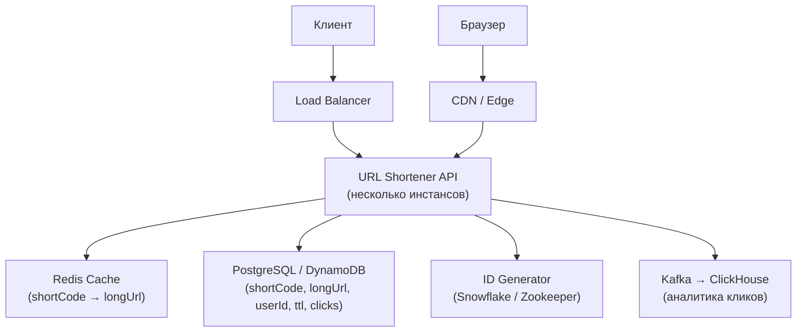

**Шаг 5 — Deep Dive:**

**Redirect 301 vs 302:**
- `301 Permanent` — браузер кэширует, не обращается к серверу повторно → аналитика теряется
- `302 Temporary` — каждый клик проходит через сервер → можно считать клики

**Кэширование:**
```
Cache-Aside: при GET /xYz1234
  1. Проверить Redis (TTL = 1 час)
  2. Cache hit → redirect
  3. Cache miss → DB → Redis → redirect
```

**Удаление по TTL:**
- `Redis TTL` для быстрого expiry
- `PostgreSQL TTL` поле + фоновый job (pg_cron) для полного удаления

**Шаг 6 — Trade-offs и эволюция:**
- До 10M пользователей: один PostgreSQL + Redis достаточно
- При 10B+ ссылок: шардирование по `shortCode[0]` (16 шардов) или NoSQL (DynamoDB)
- Multi-region: глобальная репликация с geo-routing через Cloudflare Workers


> [!mcq]
> - [x] Правильный ответ | Объяснение концепции 2-3 предложения
> - [ ] Неправильный вариант 1 | Почему ошибка в этом подходе
> - [ ] Неправильный вариант 2 | Это смежное, но отличное понятие
> - [ ] Неправильный вариант 3 | Противоположное направление## Q27. (!) Пошаговый дизайн `Twitter Feed` (News Feed) — разбор интервью

**Шаг 1 — Требования:**
- 300M активных пользователей, 500M твитов/день
- Пользователь подписан в среднем на 200 аккаунтов
- Feed показывает последние N твитов от подписок
- Латентность feed: < 100 мс (p99)

**Estimation:**
```
Запись: 500M / 86400 ≈ 5800 tweets/sec
Чтение feed: 300M × 5 pageviews/day = 1500M/day ≈ 17K read QPS
```

**Шаг 2 — Ключевые архитектурные решения:**

**Fan-out on Write (Push модель):**
```
При публикации твита → разослать в feeds всех фолловеров
+ Очень быстрое чтение (pre-computed feed)
- Огромная запись для celebrity (10M фолловеров → 10M записей)
```

**Fan-out on Read (Pull модель):**
```
При запросе feed → загрузить твиты всех фолловеров
+ Нет проблемы celebrity
- Медленное чтение, нагрузка при каждом открытии
```

**Гибридный подход (Twitter использует):**
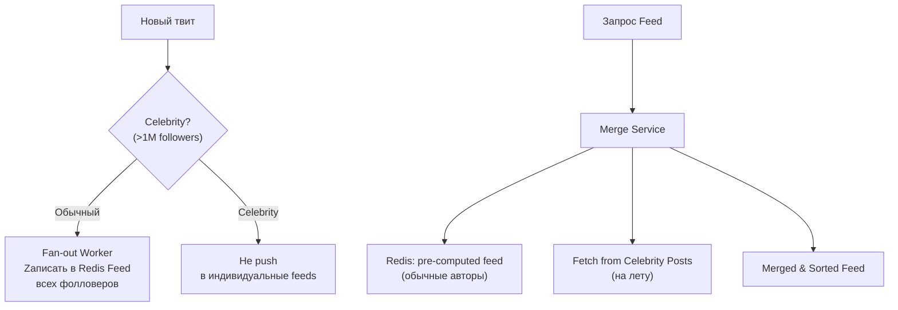

**Шаг 3 — Data Model:**

```sql
-- Tweets
tweet(id, user_id, content, media_ids[], created_at, likes_count, retweets_count)

-- Follows
follow(follower_id, followee_id, created_at)

-- Feed (Redis — список tweet_id для каждого пользователя)
"feed:{user_id}" → ZSET score=timestamp, member=tweet_id
```

**Redis Feed структура:**

```bash
# При fan-out: добавить tweet_id в feed каждого фолловера
ZADD feed:user:456 1713000000 "tweet:123"
ZREMRANGEBYRANK feed:user:456 0 -1001  # хранить только 1000 последних

# При чтении: получить топ-20 твитов
ZREVRANGE feed:user:456 0 19
```

**Шаг 4 — Trade-offs:**
- Celeb tweets (>1M followers): pull при чтении, не fan-out
- Home timeline consistency: eventual consistency приемлема
- Pagination: курсор на `tweet_id`, не `offset` (стабильный при добавлении новых)


> [!mcq]
> - [x] Правильный ответ | Объяснение концепции 2-3 предложения
> - [ ] Неправильный вариант 1 | Почему ошибка в этом подходе
> - [ ] Неправильный вариант 2 | Это смежное, но отличное понятие
> - [ ] Неправильный вариант 3 | Противоположное направление## Q28. (!) Пошаговый дизайн `WhatsApp` (чат-мессенджер) — разбор интервью

**Шаг 1 — Требования:**
- 50 млн DAU, 100 млрд сообщений/день
- Доставка 1-to-1 и групповых чатов (до 1000 участников)
- Гарантия доставки (at-least-once), сохранение порядка
- Online/offline статус, push-уведомления

**Estimation:**
```
100B msg/day ÷ 86400 ≈ 1.16M msg/sec (peak 2-3M)
Размер: 100B × 1 KB ≈ 100 TB/day
```

**Шаг 2 — Ключевые компоненты:**

```mermaid
graph TD
    Phone["Мобильный клиент"] <-->|"WebSocket"| GW["WebSocket Gateway\n(stateful)"]
    GW --> MQ["Kafka / Queue"]
    MQ --> MS["Message Service"]
    MS --> DB["Cassandra\n(messages by chat_id)"]
    MS --> Cache["Redis\n(online status, session)"]
    MS --> Push["Push Service\n(FCM / APNs)"]
    GW <-->|"WebSocket"| GW2["WebSocket Gateway\n(другой инстанс)"]
```

**Шаг 3 — Доставка сообщений:**

**Клиент онлайн (WebSocket):**
```
Sender → Gateway A → Kafka → Message Service
Message Service → найти Gateway для получателя (Redis: user→gateway)
Message Service → Gateway B → доставить по WebSocket
```

**Клиент оффлайн:**
```
Message Service → сохранить в Cassandra
Message Service → Push Notification (FCM/APNs)
При reconnect клиент запрашивает missed messages
```

**Шаг 4 — Data Model (Cassandra):**

```sql
-- Сообщения: партиционированы по chat_id, ordered by message_id
CREATE TABLE messages (
    chat_id UUID,
    message_id TIMEUUID,  -- встроенный timestamp + уникальность
    sender_id UUID,
    content TEXT,
    media_url TEXT,
    PRIMARY KEY (chat_id, message_id)
) WITH CLUSTERING ORDER BY (message_id DESC);

-- Запрос последних 50 сообщений
SELECT * FROM messages WHERE chat_id = ? LIMIT 50;
```

**Шаг 5 — Гарантии доставки:**

```
Клиент присваивает клиентский message_id (idempotency)
ACK от сервера → галочки (delivered, read)
Sequence number на чат — порядок гарантирован
```

**Trade-offs:**
- WebSocket vs HTTP long-polling: WebSocket предпочтительнее для bidirectional
- Cassandra для messages: write-heavy, TTL для очистки, высокий throughput
- Групповые чаты > 1000 участников: fan-out асинхронный через Kafka


> [!mcq]
> - [x] Правильный ответ | Объяснение концепции 2-3 предложения
> - [ ] Неправильный вариант 1 | Почему ошибка в этом подходе
> - [ ] Неправильный вариант 2 | Это смежное, но отличное понятие
> - [ ] Неправильный вариант 3 | Противоположное направление## Q29. (!) Пошаговый дизайн `Rate Limiter` — разбор интервью

**Шаг 1 — Требования:**
- Ограничение: 100 req/sec на пользователя
- Distributed (несколько инстансов API)
- Низкая latency (< 1 мс на проверку)
- Graceful degradation (не блокировать при недоступности rate limiter)

**Шаг 2 — Алгоритмы:**

| Алгоритм | Точность | Память | Проблемы |
|----------|---------|--------|----------|
| Fixed Window Counter | Средняя | O(1) | Burst на границе окна |
| Sliding Window Log | Высокая | O(N запросов) | Много памяти |
| Sliding Window Counter | Высокая | O(1) | Небольшая погрешность |
| Token Bucket | Высокая | O(1) | Burst разрешён (иногда хорошо) |
| Leaking Bucket | Сглаживает burst | O(queue) | Задержки при burst |

**Рекомендуемый: Sliding Window Counter + Redis:**

```
Текущий window count = prev_window_count × overlap_ratio + current_window_count
```

**Шаг 3 — Реализация с Redis:**

```lua
-- Lua-скрипт для атомарной проверки и инкремента
local key = KEYS[1]         -- "rate:user:123:1713000"  (current second)
local limit = tonumber(ARGV[1])
local window = tonumber(ARGV[2])  -- seconds

local current = redis.call("INCR", key)
if current == 1 then
    redis.call("EXPIRE", key, window)
end

if current > limit then
    return 0  -- rejected
end
return 1  -- allowed
```

```java
// Spring + Lettuce
@Component
public class RateLimiter {
    private final RedisTemplate<String, String> redis;
    private final DefaultRedisScript<Long> script;

    public boolean isAllowed(String userId) {
        String key = "rate:" + userId + ":" + (System.currentTimeMillis() / 1000);
        Long result = redis.execute(script, List.of(key), "100", "1");
        return result != null && result == 1;
    }
}
```

**Шаг 4 — Distributed Rate Limiting:**

```mermaid
graph LR
    Client["Клиент"] --> API1["API Instance 1"]
    Client --> API2["API Instance 2"]
    API1 -->|"INCR / check"| Redis["Redis Cluster\n(shared counter)"]
    API2 -->|"INCR / check"| Redis
```

**Sharding:** один Redis — SPOF. Решение: `Redis Cluster` с key sharding по `user_id`.

**Шаг 5 — Headers и Response:**

```http
HTTP/1.1 429 Too Many Requests
X-RateLimit-Limit: 100
X-RateLimit-Remaining: 0
X-RateLimit-Reset: 1713000060
Retry-After: 1

{"error": "rate_limit_exceeded", "message": "100 req/sec per user"}
```

**Trade-offs:**
- Local в памяти (без Redis) → быстро, но не distributed
- Redis синхронно → latency ~1 мс приемлема
- Graceful degradation: если Redis недоступен → allow all (fail-open) или block all (fail-closed)


> [!mcq]
> - [x] Правильный ответ | Объяснение концепции 2-3 предложения
> - [ ] Неправильный вариант 1 | Почему ошибка в этом подходе
> - [ ] Неправильный вариант 2 | Это смежное, но отличное понятие
> - [ ] Неправильный вариант 3 | Противоположное направление## Q30. Как проектировать систему с требованием глобальной согласованности?

**Сценарии, требующие строгой согласованности:**
- Финансовые транзакции (баланс счёта)
- Инвентаризация товара (количество на складе)
- Уникальность username при регистрации

**Паттерны решения:**

**1. Single Region с Read Replicas:**
```
Write → Primary Region (PostgreSQL + Synchronous Replica)
Read → Local Replica (с acceptable lag < 50 ms)
Для критичных reads → read from primary
```

**2. Multi-Region Active-Passive:**
```
Active Region (все writes) → Passive Region (failover)
Replication lag: 50-500 ms
RTO: минуты (автоматический failover)
RPO: секунды (зависит от lag)
```

**3. Multi-Region Active-Active (сложно):**
```
Conflict resolution: Last-Write-Wins (LWW), CRDT, или application-level merge
Примеры: DynamoDB Global Tables, CockroachDB Multi-Region
```

**4. Saga Pattern для распределённых транзакций:**

```mermaid
sequenceDiagram
    participant OS as Order Service
    participant IS as Inventory Service
    participant PS as Payment Service

    OS->>IS: Reserve Stock
    IS-->>OS: Stock Reserved
    OS->>PS: Process Payment
    PS-->>OS: Payment OK
    OS->>IS: Confirm Stock Deduction
    Note over OS,PS: Если Payment Failed:
    OS->>IS: Compensate (Release Stock)
```

**Выбор стратегии на интервью:**

```
"Если бизнес требует строгой согласованности в реальном времени —
Single Region Primary + Synchronous Standby.
Если допустима eventual consistency — Multi-Region с async replication.
Для глобального масштаба с ACID — Google Spanner / CockroachDB."
```


> [!mcq]
> - [x] Правильный ответ | Объяснение концепции 2-3 предложения
> - [ ] Неправильный вариант 1 | Почему ошибка в этом подходе
> - [ ] Неправильный вариант 2 | Это смежное, но отличное понятие
> - [ ] Неправильный вариант 3 | Противоположное направление## Q31. Как масштабировать систему от 0 до 10M пользователей?

Классический вопрос на интервью о поэтапном масштабировании. Показывает умение применять принципы only when needed (не over-engineer с первого дня).

**Этап 1 — MVP (до 1K пользователей):**

```
[Client] → [Single VM: Nginx + Spring Boot + PostgreSQL]
```

- Всё на одном сервере
- PostgreSQL с индексами
- Nginx как reverse proxy

**Этап 2 — 10K пользователей:**

```
[Client] → [Load Balancer] → [2-3 App Servers] → [PostgreSQL Primary + Read Replica]
                                                ↓
                                             [Redis Cache]
```

- Разделить app и DB на разные VM
- Redis для кэша сессий и hot data
- Read replica для SELECT-запросов

**Этап 3 — 100K пользователей:**

```
[CDN] → [API Gateway] → [Microservices] → [PostgreSQL per service]
                                        → [Redis Cluster]
                                        → [Kafka] → [Async Workers]
```

- CDN для статики
- Декомпозиция монолита на сервисы
- Kafka для async processing
- Независимые DB per service

**Этап 4 — 1M пользователей:**

```
+ Database Sharding (by user_id)
+ Read Replicas × 3-5 per shard
+ Elasticsearch для поиска
+ ClickHouse для аналитики
+ Multi-AZ deployment
```

**Этап 5 — 10M пользователей:**

```
+ Multi-Region deployment
+ Global Load Balancing (Anycast / GeoDNS)
+ NewSQL или DynamoDB Global Tables
+ CDN + Edge Computing (Cloudflare Workers)
+ Auto-scaling groups
```

**Ключевые принципы масштабирования:**

| Принцип | Техника |
|---------|---------|
| Stateless services | Вынести состояние в Redis/DB |
| Read scaling | Read Replicas + Cache |
| Write scaling | Sharding + Queue (async) |
| Availability | Multi-AZ + Auto-scaling |
| Latency | CDN + Edge + Cache |

**На интервью:** не прыгайте сразу к шардированию и Kubernetes. Покажите, что начали бы просто, и называйте конкретные триггеры для каждого следующего шага ("когда мы достигнем X QPS, нам понадобится Y").

---


> [!mcq]
> - [x] Правильный ответ | Объяснение концепции 2-3 предложения
> - [ ] Неправильный вариант 1 | Почему ошибка в этом подходе
> - [ ] Неправильный вариант 2 | Это смежное, но отличное понятие
> - [ ] Неправильный вариант 3 | Противоположное направление## Q32. (!) Как спроектировать `Distributed Lock` (`ZooKeeper`, `Redis Redlock`)?

`Distributed Lock` нужен, когда несколько инстансов приложения должны эксклюзивно выполнить одну операцию (списание баланса, отправка письма ровно один раз, cron-job на одном узле).

### Требования к распределённому локу

- **Mutual exclusion** — только один процесс держит лок в любой момент времени
- **Deadlock-free** — лок всегда освобождается (TTL при падении держателя)
- **Fault-tolerant** — работает даже при недоступности части нод

### Подход 1 — `Redis Redlock`

`Redlock` — алгоритм от Redis Labs для распределённого лока с кворумом:

```
N = 5 нод Redis (нечётное число)
1. Запросить лок на всех N нодах одновременно
2. Лок считается полученным, если N/2+1 (кворум) ответили OK
3. Убедиться, что суммарное время < TTL (validity time)
4. Использовать лок
5. Освободить лок на всех нодах (даже тех, где не получили)
```

```java
// Пример с Redisson (рекомендуемая Java-библиотека для Redis-лока)
RLock lock = redissonClient.getLock("my-distributed-lock");
boolean acquired = false;
try {
    // Ждать 3 сек на получение лока, авто-освобождение через 30 сек
    acquired = lock.tryLock(3, 30, TimeUnit.SECONDS);
    if (acquired) {
        // Критическая секция
        processPayment();
    }
} finally {
    if (acquired && lock.isHeldByCurrentThread()) {
        lock.unlock();
    }
}
```

**Защита от zombie lock (истёкший TTL, но процесс ещё жив):**
```
Fencing Token — монотонно возрастающий номер, выдаваемый вместе с локом.
Storage проверяет: если token < последнего принятого → запрос отклонить.
```

### Подход 2 — `ZooKeeper` (надёжнее для критических сценариев)

```java
// Apache Curator — стандартная библиотека для ZooKeeper
InterProcessMutex lock = new InterProcessMutex(client, "/locks/payment");
try {
    if (lock.acquire(10, TimeUnit.SECONDS)) {
        try {
            processPayment(); // Критическая секция
        } finally {
            lock.release();
        }
    }
} catch (Exception e) {
    log.error("Не удалось получить лок", e);
}
```

`ZooKeeper` использует ephemeral sequential znode: упавший узел автоматически теряет лок (ephemeral node удаляется).

### Сравнение подходов

| Характеристика | Redis Redlock | ZooKeeper |
|----------------|---------------|-----------|
| Latency | Низкая (~1-2 мс) | Выше (~5-10 мс) |
| Надёжность | Средняя (clock drift) | Высокая (sequential consistency) |
| Операционная сложность | Просто | Сложнее (отдельный кластер) |
| Подходит для | Кэш, rate limiting, short locks | Финансы, критические секции |

### `Trade-offs`

- **Redlock vs Single Redis**: одна нода Redis проще, но при failover возможно два держателя лока (не безопасно для финансов)
- **ZooKeeper** гарантирует строгую упорядоченность, но требует выделенного кластера
- **Идемпотентность** всегда нужна как второй рубеж защиты — даже если два процесса получили лок, операция не должна выполниться дважды


> [!mcq]
> - [x] Правильный ответ | Объяснение концепции 2-3 предложения
> - [ ] Неправильный вариант 1 | Почему ошибка в этом подходе
> - [ ] Неправильный вариант 2 | Это смежное, но отличное понятие
> - [ ] Неправильный вариант 3 | Противоположное направление## Q33. (!) Как реализовать `Saga`-паттерн для распределённых транзакций?

Когда операция span несколько микросервисов, ACID-транзакцию нельзя применить напрямую. `Saga` — паттерн, разбивающий распределённую транзакцию на цепочку локальных транзакций с компенсирующими операциями.

### Два варианта Saga

**1. Choreography (хореография) — события без центрального координатора:**

```mermaid
sequenceDiagram
    participant OS as Order Service
    participant IS as Inventory Service
    participant PS as Payment Service

    OS->>Kafka: OrderCreated
    IS->>Kafka: StockReserved (или StockFailed)
    PS->>Kafka: PaymentProcessed (или PaymentFailed)
    OS->>Kafka: OrderConfirmed

    Note over IS,PS: При ошибке Payment:
    PS->>Kafka: PaymentFailed
    IS->>Kafka: StockReleased (компенсация)
    OS->>Kafka: OrderCancelled (компенсация)
```

**2. Orchestration (оркестрация) — центральный координатор (Saga Orchestrator):**

```mermaid
graph TD
    Orch["Saga Orchestrator"] -->|"1. Reserve Stock"| IS["Inventory Service"]
    IS -->|"StockReserved"| Orch
    Orch -->|"2. Process Payment"| PS["Payment Service"]
    PS -->|"PaymentFailed"| Orch
    Orch -->|"Compensate: Release Stock"| IS
```

### Сравнение подходов

| Критерий | Choreography | Orchestration |
|----------|-------------|---------------|
| Сложность | Просто для 2-3 шагов | Лучше при 4+ шагах |
| Coupling | Сервисы знают о событиях друг друга | Только оркестратор знает flow |
| Отладка | Сложно трассировать | Проще (один log в оркестраторе) |
| SPOF | Нет | Оркестратор (нужна HA) |

### Практическая реализация (Spring + Kafka)

```java
// Каждый шаг Saga идемпотентен и сохраняет состояние
@Transactional
public void handlePaymentResult(PaymentResultEvent event) {
    SagaState saga = sagaRepository.findById(event.sagaId()).orElseThrow();

    if (event.success()) {
        saga.setState(PAYMENT_COMPLETED);
        eventPublisher.publish(new OrderConfirmedEvent(saga.orderId()));
    } else {
        saga.setState(COMPENSATING);
        // Запустить компенсацию в обратном порядке
        eventPublisher.publish(new ReleaseStockEvent(saga.orderId()));
    }
    sagaRepository.save(saga);
}
```

### Ключевые принципы

- **Компенсирующие транзакции** должны быть идемпотентны
- Хранить состояние Saga в БД (пережить рестарт)
- **Outbox Pattern** + Kafka гарантирует at-least-once публикацию событий
- Устанавливать timeout на каждый шаг (иначе Saga зависнет)

### `Trade-offs`

- Saga не обеспечивает изоляцию (I в ACID) — возможны dirty reads в процессе выполнения
- Компенсирующие операции сложнее write-операций (что если компенсация тоже не удалась?)
- Choreography хороша до 3-4 сервисов; при росте — переходить на Orchestration
- Подробнее в [event-driven паттернах](../architecture/event-driven-patterns-interview.md)


> [!mcq]
> - [x] Правильный ответ | Объяснение концепции 2-3 предложения
> - [ ] Неправильный вариант 1 | Почему ошибка в этом подходе
> - [ ] Неправильный вариант 2 | Это смежное, но отличное понятие
> - [ ] Неправильный вариант 3 | Противоположное направление## Q34. Как спроектировать `Search Engine` на базе `Elasticsearch`?

Elasticsearch-based поиск применяется везде: e-commerce (поиск товаров), геосервисы (поиск мест), логи (Kibana). Типовая задача на интервью — спроектировать поиск для продукта с миллионами документов.

### Требования (пример: поиск товаров в e-commerce)

**FR:** полнотекстовый поиск, фильтры (цена, категория, бренд), сортировка, facets, autocomplete.

**NFR:** latency < 100ms (p99), 5K QPS, индекс 50M товаров, обновление в реальном времени.

### Архитектура

```mermaid
graph TB
    Client["Клиент"] --> API["Search API"]
    API --> ES["Elasticsearch Cluster\n(3 master + 6 data nodes)"]

    subgraph "Индексирование (синхронизация)"
        DB["PostgreSQL (source of truth)"] -->|"CDC / Debezium"| Kafka["Kafka"]
        Kafka --> Indexer["Indexer Service"]
        Indexer --> ES
    end

    ES -->|"search results"| API
    API --> Cache["Redis\n(popular queries)"]
```

### Mapping и оптимизация индекса

```json
{
  "mappings": {
    "properties": {
      "name": {
        "type": "text",
        "analyzer": "russian",
        "fields": {
          "keyword": { "type": "keyword" }
        }
      },
      "price": { "type": "scaled_float", "scaling_factor": 100 },
      "category_id": { "type": "keyword" },
      "brand": { "type": "keyword" },
      "in_stock": { "type": "boolean" },
      "description": { "type": "text", "analyzer": "russian" }
    }
  }
}
```

### Поиск с фильтрами и ранжированием

```json
{
  "query": {
    "bool": {
      "must": [
        { "multi_match": { "query": "кроссовки", "fields": ["name^3", "description"] } }
      ],
      "filter": [
        { "term": { "in_stock": true } },
        { "range": { "price": { "gte": 1000, "lte": 10000 } } },
        { "terms": { "category_id": ["shoes", "sport"] } }
      ]
    }
  },
  "aggs": {
    "brands": { "terms": { "field": "brand", "size": 20 } },
    "price_ranges": { "histogram": { "field": "price", "interval": 1000 } }
  },
  "sort": [{ "_score": "desc" }, { "popularity": "desc" }]
}
```

### Ключевые решения

| Проблема | Решение |
|----------|---------|
| Синхронизация с основной БД | CDC (Debezium) → Kafka → Elasticsearch |
| Partial update (цена изменилась) | ES `_update` API / Kafka partial event |
| Поиск по-русски | Russian analyzer (snowball, morphology) |
| Autocomplete | `search_as_you_type` mapping или `edge_ngram` |
| Near-real-time обновления | `refresh_interval: 1s` (default), можно до 5s |

### `Trade-offs`

- **ES не source of truth** — данные могут отстать на 1-5 сек (eventual consistency)
- **Near-real-time (NRT)** — индекс обновляется раз в секунду по умолчанию
- **Sharding заранее** — количество primary shards фиксируется при создании индекса; план на рост нужен сразу
- При пиковых нагрузках кэшировать популярные запросы в Redis (TTL 1-5 мин)


> [!mcq]
> - [x] Правильный ответ | Объяснение концепции 2-3 предложения
> - [ ] Неправильный вариант 1 | Почему ошибка в этом подходе
> - [ ] Неправильный вариант 2 | Это смежное, но отличное понятие
> - [ ] Неправильный вариант 3 | Противоположное направление## Q35. (!) `CQRS` и `Event Sourcing` в системном дизайне

**CQRS** (Command Query Responsibility Segregation) — разделение модели записи (`Command`) и чтения (`Query`). **Event Sourcing** — хранение не текущего состояния, а истории событий, из которых оно восстанавливается.

### CQRS без Event Sourcing (базовый вариант)

```mermaid
graph LR
    Client --> CmdSide["Command Side\n(Write Model)"]
    Client --> QrySide["Query Side\n(Read Model)"]

    CmdSide --> WriteDB["PostgreSQL\n(source of truth)"]
    WriteDB -->|"CDC / events"| Proj["Projector"]
    Proj --> ReadDB["Read DB\n(Redis / ES / denormalized)"]
    QrySide --> ReadDB
```

Команды (`CreateOrder`, `PayOrder`) изменяют состояние и публикуют события. Проекторы строят read-модели, оптимизированные под конкретные запросы.

### Event Sourcing

```java
// Агрегат хранит список событий, а не состояние
public class OrderAggregate {
    private List<DomainEvent> uncommittedEvents = new ArrayList<>();
    private OrderStatus status;
    private Money total;

    public void create(CreateOrderCommand cmd) {
        // Генерировать событие, не менять состояние напрямую
        apply(new OrderCreatedEvent(cmd.orderId(), cmd.items(), cmd.userId()));
    }

    private void apply(OrderCreatedEvent event) {
        this.status = OrderStatus.CREATED;
        this.total = event.calculateTotal();
        uncommittedEvents.add(event);
    }

    // Восстановление из истории событий
    public static OrderAggregate reconstitute(List<DomainEvent> history) {
        OrderAggregate aggregate = new OrderAggregate();
        history.forEach(aggregate::apply);
        aggregate.uncommittedEvents.clear();
        return aggregate;
    }
}
```

### Event Store

```sql
CREATE TABLE event_store (
    id          BIGSERIAL PRIMARY KEY,
    aggregate_id UUID NOT NULL,
    aggregate_type VARCHAR(100) NOT NULL,
    event_type  VARCHAR(200) NOT NULL,
    event_data  JSONB NOT NULL,
    metadata    JSONB,
    version     INT NOT NULL,  -- оптимистичная блокировка
    occurred_at TIMESTAMPTZ DEFAULT NOW(),
    UNIQUE (aggregate_id, version)
);
```

### Когда применять CQRS и Event Sourcing

| Сценарий | CQRS | Event Sourcing |
|----------|------|----------------|
| Разные нагрузки чтения/записи | ✓ | Не обязательно |
| Нужна история изменений (аудит) | Частично | ✓ |
| Temporal queries (состояние на момент T) | - | ✓ |
| Сложный domain с бизнес-правилами | ✓ | ✓ |
| Простой CRUD | Излишен | Излишен |

### `Trade-offs`

- **Eventual consistency**: read-модели обновляются асинхронно → stale reads
- **Complexity**: event versioning (schema migration), snapshot для длинных агрегатов
- **Snapshot-оптимизация**: при 1000+ событий на агрегат — периодически снимать снапшот состояния
- Подробнее в [отдельном файле про CQRS и Event Sourcing](../architecture/cqrs-event-sourcing-interview.md)


> [!mcq]
> - [x] Правильный ответ | Объяснение концепции 2-3 предложения
> - [ ] Неправильный вариант 1 | Почему ошибка в этом подходе
> - [ ] Неправильный вариант 2 | Это смежное, но отличное понятие
> - [ ] Неправильный вариант 3 | Противоположное направление## Q36. Что такое `Service Mesh` (`Istio`) и когда он нужен?

`Service Mesh` — инфраструктурный слой для управления межсервисным взаимодействием. Вместо того чтобы встраивать логику retries, circuit breaker, трейсинга в каждый сервис — всё это делает sidecar-прокси (Envoy).

### Архитектура Service Mesh

```mermaid
graph TB
    subgraph "Pod A"
        SA["Service A"] <--> PA["Envoy Proxy\n(sidecar)"]
    end
    subgraph "Pod B"
        SB["Service B"] <--> PB["Envoy Proxy\n(sidecar)"]
    end

    PA <-->|"mTLS"| PB

    CP["Control Plane\n(Istiod)"] -->|"config"| PA
    CP -->|"config"| PB

    PA -->|"telemetry"| OBS["Observability\n(Jaeger, Prometheus)"]
    PB --> OBS
```

### Что даёт Service Mesh

| Возможность | Без Service Mesh | С Service Mesh (Istio) |
|-------------|-----------------|------------------------|
| mTLS между сервисами | Вручную в каждом | Автоматически |
| Retries / timeout | В коде каждого сервиса | Конфиг Istio VirtualService |
| Circuit Breaker | Resilience4j в коде | Envoy DestinationRule |
| Distributed Tracing | Instrumentation в коде | Автоматически через sidecar |
| Traffic splitting (Canary) | Сложно (LB) | `weight: 20` в VirtualService |
| Observability | Ручная инструментация | Автоматические метрики |

### Пример конфигурации Istio

```yaml
# Canary-деплой: 90% → v1, 10% → v2
apiVersion: networking.istio.io/v1alpha3
kind: VirtualService
metadata:
  name: order-service
spec:
  http:
  - route:
    - destination:
        host: order-service
        subset: v1
      weight: 90
    - destination:
        host: order-service
        subset: v2
      weight: 10
---
# Circuit Breaker через DestinationRule
apiVersion: networking.istio.io/v1alpha3
kind: DestinationRule
spec:
  trafficPolicy:
    outlierDetection:
      consecutive5xxErrors: 5
      interval: 10s
      baseEjectionTime: 30s
```

### Когда использовать Service Mesh

**Нужен Service Mesh, если:**
- 10+ микросервисов с интенсивным межсервисным трафиком
- Нужен zero-trust security (mTLS по умолчанию)
- Требуется advanced traffic management (canary, A/B, fault injection)
- Нужен distributed tracing без изменения кода

**Не нужен, если:**
- Монолит или 2-3 сервиса
- Уже есть application-level библиотеки (Resilience4j, Spring Cloud)
- Команда не готова к операционной сложности Istio

### `Trade-offs`

- **Latency overhead**: sidecar добавляет ~1-2 мс на каждый вызов
- **Операционная сложность**: Istio требует экспертизы; неправильная конфигурация может заблокировать весь трафик
- **Ресурсы**: каждый pod + Envoy sidecar → +50-100 MB RAM per pod


> [!mcq]
> - [x] Правильный ответ | Объяснение концепции 2-3 предложения
> - [ ] Неправильный вариант 1 | Почему ошибка в этом подходе
> - [ ] Неправильный вариант 2 | Это смежное, но отличное понятие
> - [ ] Неправильный вариант 3 | Противоположное направление## Q37. (!) Как спроектировать `Payment System`?

Платёжная система — один из наиболее требовательных к надёжности и согласованности системных дизайнов. Любая ошибка = потеря денег или двойное списание.

### Требования

**FR:** переводы между счетами, пополнение/вывод, история транзакций, поддержка внешних платёжных провайдеров (Stripe, банки).

**NFR:** строгая согласованность (ACID), idempotency, availability 99.99%, latency p99 < 500ms, PCI DSS compliance.

### Архитектура

```mermaid
graph TB
    Client["Клиент"] --> API["Payment API\n(идемпотентные ключи)"]
    API --> PS["Payment Service"]
    PS --> Ledger["Ledger Service\n(двойная запись)"]
    PS --> Ext["External Provider\n(Stripe / Acquiring Bank)"]
    Ledger --> DB["PostgreSQL\n(serializable isolation)"]
    PS --> MQ["Kafka\n(async events)"]
    MQ --> Notify["Notification Service"]
    MQ --> Risk["Risk / Fraud Service"]
    MQ --> Reconcile["Reconciliation Service"]
```

### Двойная бухгалтерская запись (Double-Entry Ledger)

```sql
-- Каждая транзакция создаёт две записи: дебет и кредит
CREATE TABLE ledger_entries (
    id              BIGSERIAL PRIMARY KEY,
    transaction_id  UUID NOT NULL,
    account_id      UUID NOT NULL,
    amount          NUMERIC(20, 4) NOT NULL,  -- отрицательный = дебет
    currency        CHAR(3) NOT NULL,
    entry_type      VARCHAR(10) CHECK (entry_type IN ('DEBIT', 'CREDIT')),
    created_at      TIMESTAMPTZ DEFAULT NOW()
);

-- Перевод: списание с A, зачисление на B
-- Сумма всех записей в транзакции всегда = 0 (инвариант)
INSERT INTO ledger_entries VALUES
    (gen_random_uuid(), tx_id, account_a, -100.00, 'USD', 'DEBIT'),
    (gen_random_uuid(), tx_id, account_b, +100.00, 'USD', 'CREDIT');

-- Баланс счёта: сумма всех записей
SELECT account_id, SUM(amount) AS balance FROM ledger_entries
GROUP BY account_id;
```

### Idempotency для платежей

```java
@PostMapping("/payments")
public ResponseEntity<PaymentResponse> createPayment(
        @RequestHeader("Idempotency-Key") String idempotencyKey,
        @RequestBody PaymentRequest request) {

    // Проверить, не было ли уже такого запроса
    Optional<PaymentResponse> existing = idempotencyStore.get(idempotencyKey);
    if (existing.isPresent()) {
        return ResponseEntity.ok(existing.get()); // Вернуть тот же ответ
    }

    PaymentResponse response = paymentService.process(request);

    // Сохранить результат (TTL 24 часа)
    idempotencyStore.put(idempotencyKey, response, Duration.ofHours(24));
    return ResponseEntity.ok(response);
}
```

### Двухфазное взаимодействие с внешним провайдером

```
1. POST /charges к Stripe → получить charge_id (pending)
2. Сохранить charge_id в локальной БД
3. Polling или webhook от Stripe → финализировать статус
4. При таймауте: проверить статус через GET /charges/{id}
   (не повторять POST — это создаст новый платёж!)
```

### Reconciliation (сверка)

Ежедневный или почасовой job сравнивает внутренние записи с выпиской от провайдера. Любые расхождения попадают в очередь ручной проверки.

### `Trade-offs`

- **Serializable isolation** для операций с балансом (дорого, но необходимо)
- **Saga для сложных флоу** (reserve → capture → settle) с компенсациями
- **Idempotency на каждом уровне** — API, очередь, внешний провайдер
- **Никогда не хранить CVV** — соответствие PCI DSS требует tokenization


> [!mcq]
> - [x] Правильный ответ | Объяснение концепции 2-3 предложения
> - [ ] Неправильный вариант 1 | Почему ошибка в этом подходе
> - [ ] Неправильный вариант 2 | Это смежное, но отличное понятие
> - [ ] Неправильный вариант 3 | Противоположное направление## Q38. (!) Что такое `Idempotency` и как её обеспечить в распределённых системах?

**Idempotency** — свойство операции, при котором многократное выполнение с одним и тем же входом даёт тот же результат, что и однократное. Критически важна для at-least-once гарантий в distributed systems.

### Зачем нужна Idempotency

```
Клиент отправил POST /payments → сеть зависла → клиент не знает, прошёл ли запрос.
Если повторить запрос:
  - Без idempotency: два платежа
  - С idempotency: один платёж (второй возвращает тот же результат)
```

### Уровни Idempotency

| Уровень | Как обеспечить |
|---------|----------------|
| HTTP API | `Idempotency-Key` header + хранилище (Redis/DB) |
| Message Consumer (Kafka) | Проверять `message_id` в processed_messages таблице |
| Database | `INSERT ... ON CONFLICT DO NOTHING` / `upsert` |
| External API | Использовать idempotency key провайдера (Stripe, AWS) |

### Реализация через Idempotency Key

```java
@Service
public class IdempotencyService {
    private final StringRedisTemplate redis;

    public <T> T execute(String key, Duration ttl, Supplier<T> operation) {
        String cacheKey = "idempotent:" + key;

        // Проверить, выполнялась ли уже эта операция
        String existing = redis.opsForValue().get(cacheKey);
        if (existing != null) {
            return deserialize(existing); // Вернуть прежний результат
        }

        // Атомарно занять слот (SETNX)
        Boolean locked = redis.opsForValue().setIfAbsent(
            cacheKey + ":lock", "1", Duration.ofSeconds(30));

        if (Boolean.FALSE.equals(locked)) {
            // Другой инстанс выполняет эту операцию — подождать
            return waitAndGet(cacheKey);
        }

        try {
            T result = operation.get(); // Выполнить операцию
            redis.opsForValue().set(cacheKey, serialize(result), ttl);
            return result;
        } finally {
            redis.delete(cacheKey + ":lock");
        }
    }
}
```

### Idempotency в Kafka Consumer

```java
@KafkaListener(topics = "payment-events")
@Transactional
public void handlePayment(PaymentEvent event) {
    // Идемпотентная обработка: пропустить уже обработанные события
    if (processedEvents.existsByEventId(event.eventId())) {
        log.info("Event {} already processed, skipping", event.eventId());
        return;
    }

    // Обработка и сохранение event_id в одной транзакции
    paymentService.process(event);
    processedEvents.save(new ProcessedEvent(event.eventId(), Instant.now()));
}
```

### Natural idempotency в БД

```sql
-- Вместо INSERT + SELECT: атомарный upsert
INSERT INTO orders (id, user_id, status, total)
VALUES (:id, :userId, 'CREATED', :total)
ON CONFLICT (id) DO NOTHING;

-- Или обновить только если состояние позволяет
UPDATE accounts
SET balance = balance - :amount, version = version + 1
WHERE id = :id AND version = :expectedVersion AND balance >= :amount;
-- rows_affected = 0 → оптимистичная блокировка сработала
```

### `Trade-offs`

- Хранилище idempotency keys требует TTL-политики (не хранить вечно)
- Redis для ключей быстро, но теряется при failover; DB надёжнее
- Выбор ключа критичен: `orderId` хорошо, `userId` — плохо (у пользователя много операций)


> [!mcq]
> - [x] Правильный ответ | Объяснение концепции 2-3 предложения
> - [ ] Неправильный вариант 1 | Почему ошибка в этом подходе
> - [ ] Неправильный вариант 2 | Это смежное, но отличное понятие
> - [ ] Неправильный вариант 3 | Противоположное направление## Q39. Как проектировать `Geo-distributed` системы (`Multi-Region`)?

Geo-distributed архитектура нужна для снижения latency для глобальных пользователей, повышения availability и соответствия требованиям data residency (GDPR).

### Паттерны Multi-Region

```mermaid
graph TB
    subgraph "Active-Passive"
        PrimReg["Primary Region (EU)"] -->|"async replication"| SecReg["Secondary Region (US)"]
        Note1["Reads/Writes → Primary\nFailover → Secondary"]
    end

    subgraph "Active-Active"
        RegEU["Region EU"] <-->|"bidirectional sync"| RegUS["Region US"]
        RegUS <-->|"bidirectional sync"| RegAP["Region AP"]
        Note2["Reads/Writes → nearest region\nConflict resolution needed"]
    end
```

### Routing и DNS

```
GeoDNS / Anycast:
  EU пользователи → eu.api.example.com → EU region
  US пользователи → us.api.example.com → US region

Cloudflare / AWS Route 53:
  Latency-based routing → ближайший здоровый регион
  Failover routing → при недоступности → следующий регион
```

### Разделение данных: что где хранить

| Тип данных | Стратегия |
|------------|-----------|
| Пользовательские данные (GDPR) | Region-pinned (EU данные только в EU) |
| Публичный контент (статика, каталог) | Реплицировать во все регионы |
| Сессии | Глобальный Redis (или local с sticky routing) |
| Транзакции | Single-region primary с async replica |

### Conflict Resolution в Active-Active

```
Last-Write-Wins (LWW): побеждает запись с наибольшим timestamp
  + Просто
  - Потеря данных при concurrent writes

CRDT (Conflict-free Replicated Data Type): структуры данных без конфликтов
  + Корректно для счётчиков, множеств
  - Ограниченный set операций

Application-level merge: бизнес-логика разрешает конфликты
  + Гибко
  - Сложно реализовать
```

### Обработка Network Partition между регионами

```
WAN latency: 50-150 мс между регионами
При partition: выбор по CAP теореме
  CP: блокировать запись до синхронизации с другим регионом
  AP: принимать запись, разрешать конфликт при восстановлении
```

### `Trade-offs`

- **Active-Passive**: просто, нет конфликтов, но RTO > 1 мин при failover
- **Active-Active**: низкая latency везде, но сложное разрешение конфликтов
- **Кросс-региональные транзакции** крайне дорогие по latency — избегать или изолировать в критических сценариях
- **Data residency**: GDPR требует хранить EU данные только в EU — учитывать при репликации


> [!mcq]
> - [x] Правильный ответ | Объяснение концепции 2-3 предложения
> - [ ] Неправильный вариант 1 | Почему ошибка в этом подходе
> - [ ] Неправильный вариант 2 | Это смежное, но отличное понятие
> - [ ] Неправильный вариант 3 | Противоположное направление## Q40. `WebSocket` vs `SSE` vs `Long Polling` — как выбрать транспорт для `real-time`?

Выбор транспорта для real-time функциональности — часть high-level design для чатов, нотификаций, live-таблиц, стриминга данных.

### Сравнение подходов

| Характеристика | WebSocket | SSE | Long Polling |
|----------------|-----------|-----|-------------|
| Направление | Bidirectional | Unidirectional (server→client) | Unidirectional |
| Протокол | ws:// / wss:// | HTTP/1.1 или HTTP/2 | HTTP |
| Поддержка браузерами | Отличная | Отличная (кроме IE) | Универсальная |
| Автоматический reconnect | Нет (нужна логика) | Встроенный | Нет |
| Нагрузка на сервер | Долгосрочные соединения | Долгосрочные соединения | Короткие, частые |
| Firewall-совместимость | Иногда проблемы | Нет проблем (HTTP) | Нет проблем |
| Масштабирование | Stateful (сложнее) | Stateful | Stateless (проще) |

### Когда что выбирать

**WebSocket** — для bidirectional real-time (чат, онлайн-игры, совместное редактирование):
```
Пример: чат-мессенджер, торговый терминал, онлайн-IDE
Особенность: gateway stateful → нужен Redis Pub/Sub для fan-out
```

**SSE (Server-Sent Events)** — для server-push нотификаций (unidirectional):
```
Пример: live-уведомления, progress bar, live-лента новостей
Преимущество: работает через HTTP/2 multiplexing, встроенный reconnect
```

**Long Polling** — когда WebSocket/SSE недоступны (корпоративные firewall):
```
Пример: legacy-системы, интеграции с ограниченной сетевой инфраструктурой
Недостаток: overhead на каждый request (headers, TCP handshake)
```

### Масштабирование WebSocket

```mermaid
graph LR
    Client1["Client 1"] <-->|WS| GW1["Gateway 1"]
    Client2["Client 2"] <-->|WS| GW2["Gateway 2"]

    GW1 <-->|"Pub/Sub"| Redis["Redis Cluster"]
    GW2 <-->|"Pub/Sub"| Redis

    Svc["Backend Service"] -->|"PUBLISH channel"| Redis
```

```java
// При отправке сообщения другому пользователю:
// 1. Найти, к какому gateway подключён получатель
// 2. Опубликовать через Redis Pub/Sub → нужный gateway доставит

redisTemplate.convertAndSend("ws:user:" + recipientId, message);
```

### Fallback-стратегия (Socket.IO подход)

```
1. Попытаться WebSocket
2. Если недоступен → SSE
3. Если недоступен → Long Polling
```

### `Trade-offs`

- **WebSocket** = stateful сервер → горизонтальное масштабирование требует sticky sessions или Redis Pub/Sub
- **SSE** проще в реализации и через HTTP/2 более эффективен, чем кажется; отличный выбор для большинства push-нотификаций
- **HTTP/2 + SSE** часто достаточно вместо WebSocket, если нет необходимости в client-to-server streaming


> [!mcq]
> - [x] Правильный ответ | Объяснение концепции 2-3 предложения
> - [ ] Неправильный вариант 1 | Почему ошибка в этом подходе
> - [ ] Неправильный вариант 2 | Это смежное, но отличное понятие
> - [ ] Неправильный вариант 3 | Противоположное направление## Q41. `Backpressure` на уровне системы — что это и как реализовать?

**Backpressure** — механизм, при котором downstream-компонент сигнализирует upstream о своей перегруженности, заставляя его замедлиться. Без backpressure быстрый producer уничтожит медленный consumer.

### Проблема без Backpressure

```
Producer (10K msg/sec) → Queue → Consumer (1K msg/sec)
Через 100 сек: очередь = 900K сообщений → OOM → крах системы
```

### Стратегии Backpressure

**1. Буферизация (Buffering)** — принимать и копить до лимита:
```
Queue(maxSize=10000) → при достижении лимита:
  - Блокировать producer (back-pressure signal)
  - Отбрасывать (drop oldest / drop newest)
  - Вернуть ошибку (отказ от новых запросов)
```

**2. Rate Limiting на входе** — ограничить скорость поступления:
```
API Gateway: 1000 req/sec → при превышении → 429 Too Many Requests
Kafka producer: задержать если consumer lag > threshold
```

**3. Reactive Streams (Project Reactor / RxJava)**:

```java
// Flux с backpressure: consumer запрашивает столько, сколько может обработать
Flux.fromIterable(largeDataset)
    .onBackpressureBuffer(1000,                      // буфер 1000 элементов
        dropped -> log.warn("Dropped: {}", dropped), // callback при переполнении
        BufferOverflowStrategy.DROP_OLDEST)
    .publishOn(Schedulers.boundedElastic())
    .flatMap(item -> processItem(item), 16)           // concurrency = 16
    .subscribe(
        result -> log.info("Processed: {}", result),
        error -> log.error("Error", error)
    );
```

**4. Kafka Consumer Backpressure**:

```java
@KafkaListener(topics = "events", containerFactory = "manualAckFactory")
public void consume(ConsumerRecord<String, Event> record, Acknowledgment ack) {
    try {
        processEvent(record.value()); // медленная обработка
        ack.acknowledge();
    } catch (Exception e) {
        // Не подтверждать → Kafka вернёт это сообщение снова
        // Consumer lag растёт → сигнал upstream о перегрузке
    }
}
```

### Системные паттерны Backpressure

```mermaid
graph LR
    Prod["Producer\n10K msg/sec"] --> Queue["Queue\n(bounded)"]
    Queue -->|"full → block/drop"| Prod
    Queue --> Cons["Consumer\n1K msg/sec"]
    Queue -->|"lag metrics"| Alert["Alerting / Auto-scaling"]
    Alert -->|"scale up consumers"| Cons
```

**Circuit Breaker как backpressure**:
```
Downstream медленный → timeouts → Circuit Breaker открывается
→ Запросы отклоняются немедленно → upstream разгружается
→ После recovery: Half-Open → постепенное восстановление
```

### Метрики для мониторинга Backpressure

| Метрика | Что значит |
|---------|------------|
| Consumer Lag (Kafka) | Насколько consumer отстаёт от producer |
| Queue Depth | Глубина очереди (при росте — нужен масштаб) |
| Rejected Requests Rate | Доля отброшенных запросов |
| Processing Time p99 | Деградация производительности consumer |

### `Trade-offs`

- **Drop** — быстро, но теряем данные (подходит для метрик, не для платежей)
- **Block** — гарантирует обработку всего, но может каскадно заблокировать upstream
- **Auto-scaling consumer** — лучший вариант при эластичной инфраструктуре (Kubernetes HPA по consumer lag)
- Backpressure должен быть сквозным — от API до БД; "узкое место" в середине даст burst выше по стеку

---

## See also

- [Распределённые системы](../architecture/distributed-systems-interview.md) — CAP, консенсус, репликация, отказоустойчивость
- [Паттерны масштабируемости](../architecture/scalability-patterns-interview.md) — шардирование, горизонтальное масштабирование, CQRS
- [CAP-теорема](../architecture/cap-theorem-interview.md) — trade-offs между consistency, availability и partition tolerance
- [Паттерны согласованности](../architecture/consistency-patterns-interview.md) — eventual consistency, strong consistency, read-your-writes
- [Микросервисы](../architecture/microservices-interview.md) — декомпозиция, межсервисное взаимодействие, data ownership
- [Стратегии кэширования](../architecture/caching-strategies-interview.md) — cache-aside, write-through, CDN, Redis в system design
- [Apache Kafka](../messaging/kafka-interview.md) — применение Kafka как event backbone при проектировании систем
- [Event-driven паттерны](../architecture/event-driven-patterns-interview.md) — Outbox, Saga, event sourcing в контексте system design
- [Redis](../databases/redis-interview.md) — кэширование, очереди и rate limiting
- [Балансировка нагрузки](../architecture/load-balancing-interview.md) — алгоритмы и паттерны


> [!mcq]
> - [x] Правильный ответ | Объяснение концепции 2-3 предложения
> - [ ] Неправильный вариант 1 | Почему ошибка в этом подходе
> - [ ] Неправильный вариант 2 | Это смежное, но отличное понятие
> - [ ] Неправильный вариант 3 | Противоположное направление- [Design Chat System](design-chat-system-interview.md)
- [Design Feed System](design-feed-system-interview.md)
- [Design Payment System](design-payment-system-interview.md)
- [Design Rate Limiter](design-rate-limiter-interview.md)
- [Design Search System](design-search-interview.md)
- [Design URL Shortener](design-url-shortener-interview.md)
