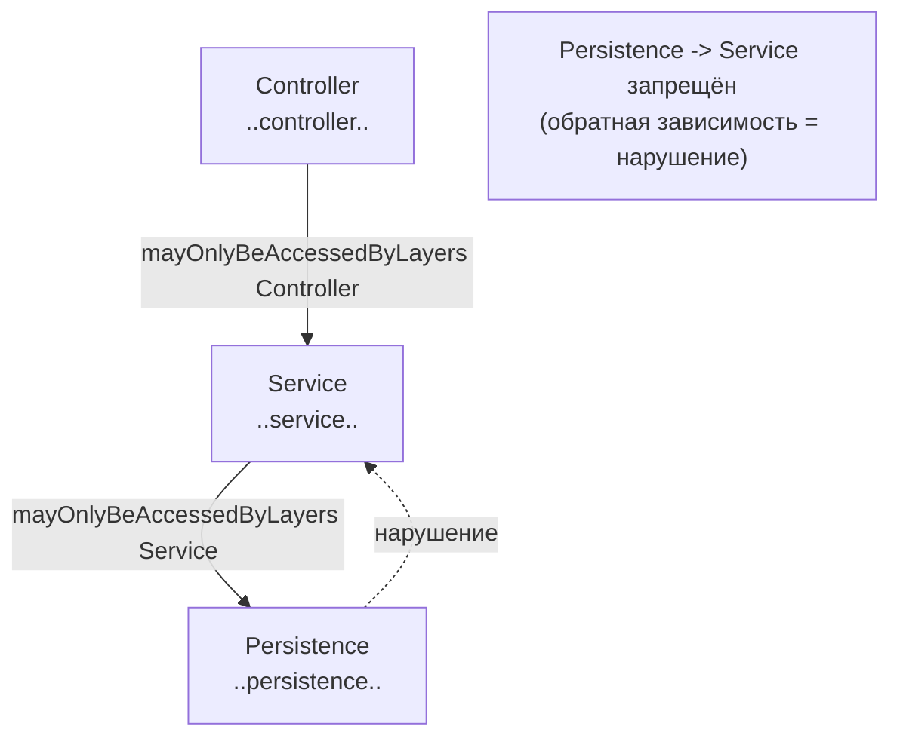
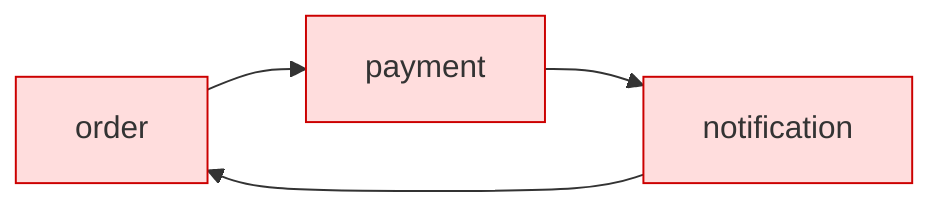
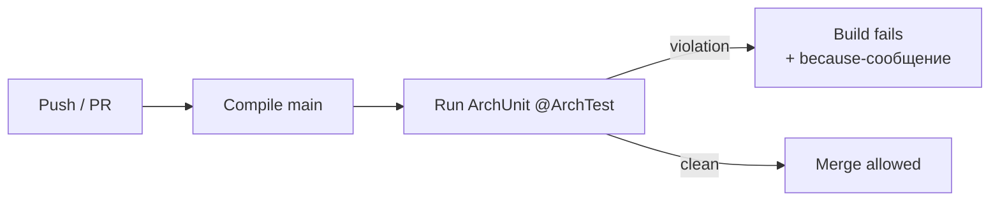
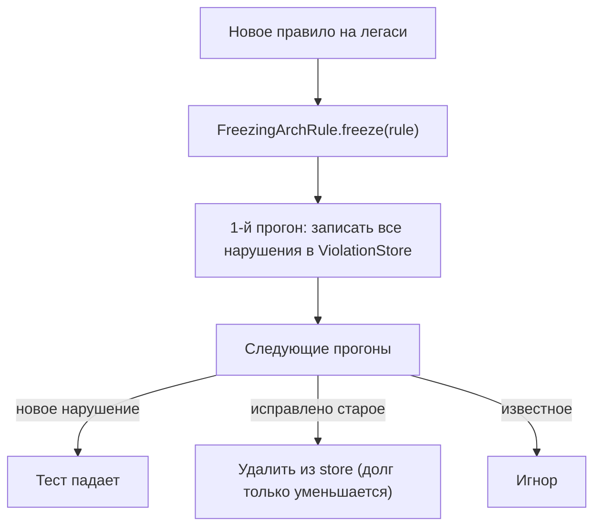

# Вопросы на собеседовании: `ArchUnit`

`ArchUnit` — библиотека от `TNG Technology Consulting` для проверки архитектурных правил Java-проекта обычными юнит-тестами. Она импортирует байт-код в графовую модель (`JavaClass`, `JavaMethod`, зависимости) и позволяет писать декларативные правила: «слой A не зависит от слоя B», «нет циклов между пакетами», «классы с суффиксом `Controller` лежат в `..controller..`». На собеседовании тему спрашивают, чтобы проверить понимание fitness functions, направления зависимостей и того, как защитить архитектуру от деградации в CI.

Дата последнего обновления: 2026-06-25

## Полезные ссылки

### Официальная документация

- [ArchUnit User Guide](https://www.archunit.org/userguide/html/000_Index.html) — официальный гайд: core API, Library API, JUnit-расширение, freezing
- [TNG/ArchUnit (GitHub)](https://github.com/TNG/ArchUnit) — исходники, issues, релизы
- [Baeldung: ArchUnit](https://www.baeldung.com/java-archunit-intro) — туториал
- [Baeldung: DDD with jMolecules](https://www.baeldung.com/java-jmolecules-domain-driven-design) — jMolecules + ArchUnit-интеграция
- [xmolecules/jmolecules-integrations (archunit)](https://github.com/xmolecules/jmolecules-integrations/tree/main/jmolecules-archunit) — готовые правила для DDD-аннотаций

## Содержание

- [Полезные ссылки](#полезные-ссылки)
- [See also](#see-also)

**Основы и модель импорта**
- [Q1. (!) Что такое ArchUnit и зачем нужны юнит-тесты на архитектуру](#q1--что-такое-archunit-и-зачем-нужны-юнит-тесты-на-архитектуру)
- [Q2. Как ArchUnit импортирует классы: ClassFileImporter и ImportOptions](#q2-как-archunit-импортирует-классы-classfileimporter-и-importoptions)
- [Q3. (!) Как устроено базовое правило: classes().that().should()](#q3--как-устроено-базовое-правило-classesthatshould)

**Library API: слои и циклы**
- [Q4. (!) Как описать слоистую архитектуру через layeredArchitecture()](#q4--как-описать-слоистую-архитектуру-через-layeredarchitecture)
- [Q5. Чем onionArchitecture() отличается от layeredArchitecture()](#q5-чем-onionarchitecture-отличается-от-layeredarchitecture)
- [Q6. (!) Как обнаружить циклические зависимости через slices().beFreeOfCycles()](#q6--как-обнаружить-циклические-зависимости-через-slicesbefreeofcycles)

**Naming, типовые правила, кастомные условия**
- [Q7. Как проверять naming conventions](#q7-как-проверять-naming-conventions)
- [Q8. Какие типовые правила пишут чаще всего](#q8-какие-типовые-правила-пишут-чаще-всего)
- [Q9. (!) Как написать кастомное правило через ArchCondition](#q9--как-написать-кастомное-правило-через-archcondition)

**JUnit 5, производительность, CI**
- [Q10. Как интегрировать ArchUnit с JUnit 5: @AnalyzeClasses и @ArchTest](#q10-как-интегрировать-archunit-с-junit-5-analyzeclasses-и-archtest)
- [Q11. Как исключить тестовые классы: ImportOption.DoNotIncludeTests](#q11-как-исключить-тестовые-классы-importoptiondonotincludetests)
- [Q12. Как работает кэширование импорта и производительность](#q12-как-работает-кэширование-импорта-и-производительность)
- [Q13. Как встроить ArchUnit в CI и где он окупается](#q13-как-встроить-archunit-в-ci-и-где-он-окупается)

**Легаси, экосистема, практика**
- [Q14. (!) Как внедрить правило в легаси: FreezingArchRule](#q14--как-внедрить-правило-в-легаси-freezingarchrule)
- [Q15. Что даёт jMolecules и как этот проект использует ArchUnit](#q15-что-даёт-jmolecules-и-как-этот-проект-использует-archunit)

## Q1. (!) Что такое ArchUnit и зачем нужны юнит-тесты на архитектуру

`ArchUnit` — это Java-библиотека, которая позволяет проверять архитектурные ограничения проекта обычными тестами (`JUnit`, `TestNG`). Идея: архитектура — это набор правил («домен не зависит от инфраструктуры», «контроллеры не лезут в репозитории напрямую»), и эти правила можно выразить как код и прогонять в CI вместе с остальными тестами.

Такие тесты — это **fitness functions** из словаря Evolutionary Architecture: автоматическая, исполняемая проверка нефункционального свойства системы (в данном случае — структурной целостности).

Зачем это нужно:

- Архитектурные диаграммы в Confluence устаревают, а нарушения границ накапливаются молча. ArchUnit делает правило исполняемым — нарушение ломает сборку.
- Ревью не ловит каждое «протекание» зависимости; тест ловит всегда.
- Правило живёт в репозитории рядом с кодом и эволюционирует вместе с ним.

Под капотом ArchUnit разбирает байт-код (не исходники) через свой импортёр и строит графовую модель: `JavaClass`, `JavaMethod`, `JavaField`, рёбра зависимостей (`extends`, `implements`, вызовы, обращения к полям, импорты). Поверх модели — fluent-DSL для правил.

```java
@Test
void domainShouldNotDependOnSpring() {
    JavaClasses classes = new ClassFileImporter()
            .importPackages("com.myapp.domain");

    ArchRule rule = noClasses()
            .that().resideInAPackage("..domain..")
            .should().dependOnClassesThat()
            .resideInAPackage("org.springframework..")
            .because("домен должен быть свободен от фреймворка");

    rule.check(classes);
}
```

**Итог:** ArchUnit превращает архитектурные договорённости в тесты, которые падают при нарушении. Это дешёвая страховка от энтропии в больших долгоживущих проектах.

## Q2. Как ArchUnit импортирует классы: ClassFileImporter и ImportOptions

`ClassFileImporter` — точка входа для загрузки классов в модель. Он читает скомпилированный байт-код (`.class`-файлы), а не `.java`-исходники, поэтому проект должен быть собран до запуска.

Способы импорта:

- `importPackages("com.myapp", "com.other")` — пакеты из classpath;
- `importPackagesOf(SomeClass.class)` — пакет указанного класса;
- `importClasspath()` — весь classpath;
- `importJar(...)` / импорт по `URL` / `Path` — локации как JAR-файлы или каталоги.

Результат — объект `JavaClasses` (коллекция `JavaClass`), к которому применяют правила через `rule.check(classes)`.

`ImportOptions` фильтруют, какие классы попадут в модель. Самые частые предопределённые опции:

| Опция | Что делает |
|-------|------------|
| `ImportOption.Predefined.DO_NOT_INCLUDE_TESTS` | исключает тестовые классы (каталоги `target/test-classes`, `build/classes/test`) |
| `ImportOption.Predefined.DO_NOT_INCLUDE_JARS` | исключает классы из JAR-зависимостей |
| `ImportOption.Predefined.DO_NOT_INCLUDE_ARCHIVES` | исключает JAR и другие архивы |

```java
JavaClasses prodClasses = new ClassFileImporter()
        .withImportOption(ImportOption.Predefined.DO_NOT_INCLUDE_TESTS)
        .importPackages("com.myapp");
```

Можно написать **свою** опцию, реализовав интерфейс `ImportOption` с методом `boolean includes(Location location)` — например, исключать сгенерированные классы.

**Подвох:** так как импортируется байт-код, нельзя «сходить» в исходники за комментариями или форматированием. Зато видны реальные зависимости после компиляции, включая те, что не очевидны в исходнике (синтетические классы, мосты).

## Q3. (!) Как устроено базовое правило: classes().that().should()

Ядро DSL — статические фабрики из `ArchRuleDefinition`: `classes()`, `noClasses()`, `methods()`, `fields()`, `constructors()`. Дальше идёт fluent-цепочка из трёх логических частей.

- **Селектор** — `that()` отбирает подмножество классов: `resideInAPackage("..service..")`, `haveSimpleNameEndingWith("Controller")`, `areAnnotatedWith(Service.class)`.
- **Предикат** — `should()` задаёт ожидание: `dependOnClassesThat()`, `beAnnotatedWith(...)`, `onlyBeAccessed()`, `notBePublic()`.
- **Применение** — `check(classes)` или (в JUnit-расширении) автоматическое исполнение.

Разница `classes()` и `noClasses()` ключевая:

- `classes().that(A).should(B)` — **все** классы из множества A обязаны удовлетворять B.
- `noClasses().that(A).should(B)` — **ни один** класс из A не должен удовлетворять B.

```java
// Все @Service-классы должны лежать в ..service..
ArchRule r1 = classes()
        .that().areAnnotatedWith(Service.class)
        .should().resideInAPackage("..service..");

// Ни один класс из ..persistence.. не должен зависеть от ..api..
ArchRule r2 = noClasses()
        .that().resideInAPackage("..persistence..")
        .should().dependOnClassesThat().resideInAPackage("..api..");
```

Полезные модификаторы:

- `.because("причина")` — попадёт в текст ошибки, объясняя _зачем_ правило.
- `.allowEmptyShould(true)` — не падать, если селектор `that()` не нашёл ни одного класса (по умолчанию в новых версиях пустой результат считается ошибкой конфигурации).
- `..` в паттерне пакета — «любое число пакетов»; `*` — один сегмент.

**Итог:** правило читается как английское предложение «no classes that reside in X should depend on Y». Эта читаемость — главное преимущество core API перед ручным разбором графа.

## Q4. (!) Как описать слоистую архитектуру через layeredArchitecture()

`layeredArchitecture()` из Library API (`Architectures`) — декоратор, который позволяет описать слои и разрешённые направления доступа в несколько строк вместо десятка отдельных `noClasses()`-правил.

Шаги:

1. `layer("Имя").definedBy("..пакет..")` — объявить слой и привязать к пакетам.
2. `whereLayer("Имя").mayOnlyBeAccessedByLayers(...)` или `mayNotBeAccessedByAnyLayer()` — задать, кто имеет право обращаться к слою.

```java
ArchRule layers = layeredArchitecture()
        .consideringAllDependencies()
        .layer("Controller").definedBy("..controller..")
        .layer("Service").definedBy("..service..")
        .layer("Persistence").definedBy("..persistence..")

        .whereLayer("Controller").mayNotBeAccessedByAnyLayer()
        .whereLayer("Service").mayOnlyBeAccessedByLayers("Controller")
        .whereLayer("Persistence").mayOnlyBeAccessedByLayers("Service");
```

Здесь зафиксировано направление зависимостей: `Controller` → `Service` → `Persistence`, и обратные обращения запрещены. `mayNotBeAccessedByAnyLayer()` означает «это верхний слой, в него никто не входит».



Нюансы:

- `consideringAllDependencies()` против `consideringOnlyDependenciesInLayers()` — учитывать ли зависимости на классы вне объявленных слоёв. Важно при наличии «свободных» пакетов вроде `..dto..` или `..util..`.
- `mayOnlyAccessLayers(...)` — обратная формулировка: «этот слой может обращаться только к перечисленным», полезна, когда удобнее описывать исходящие зависимости.
- `optionalLayer(...)` — слой может быть пустым без ошибки.

**Вывод:** `layeredArchitecture()` — самый частый способ закрепить классическую N-слойку. Он компактнее набора `noClasses()`, но менее гибок для нестандартных границ.

## Q5. Чем onionArchitecture() отличается от layeredArchitecture()

`onionArchitecture()` (он же гексагональная / clean) — специализированный декоратор для архитектуры с доменным ядром в центре и адаптерами по краям. В отличие от линейной слойки, здесь зависимости направлены **внутрь**: всё знает о домене, домен не знает ни о чём.

Метод принимает заранее именованные роли:

```java
ArchRule onion = onionArchitecture()
        .domainModels("..domain.model..")
        .domainServices("..domain.service..")
        .applicationServices("..application..")
        .adapter("rest", "..adapter.rest..")
        .adapter("persistence", "..adapter.persistence..");
```

Сравнение двух декораторов:

| Критерий | `layeredArchitecture()` | `onionArchitecture()` |
|----------|-------------------------|------------------------|
| Модель | линейные слои, доступ задаёшь вручную | фиксированные роли (domain / application / adapters) |
| Направление зависимостей | как опишешь через `whereLayer` | жёстко внутрь, к домену |
| Гибкость | высокая | ниже, но правила уже встроены |
| Когда применять | классическая N-слойка | DDD / hexagonal / clean architecture |

Что `onionArchitecture()` проверяет автоматически:

- `domainModels` и `domainServices` не зависят ни от application, ни от адаптеров;
- application-сервисы могут пользоваться доменом, но не адаптерами;
- адаптеры (`adapter("name", ...)`) изолированы друг от друга — один адаптер не должен зависеть от другого напрямую.

**Подвох:** если у вас «адаптер» лезет в другой адаптер (например, REST-контроллер напрямую дёргает persistence-класс), правило это поймает — именно это нарушение и есть типичная причина «утечки» гексагональной архитектуры.

## Q6. (!) Как обнаружить циклические зависимости через slices().beFreeOfCycles()

Циклы между пакетами/модулями — одна из главных архитектурных болезней: они мешают выделять модули, ломают порядок сборки и затрудняют понимание кода. ArchUnit ищет их через **slices** (срезы) из `SlicesRuleDefinition`.

Slice — это группа классов, выделенная по паттерну пакета. Капчер-группа `(*)` в паттерне определяет, по какому сегменту резать.

```java
ArchRule noCycles = slices()
        .matching("com.myapp.(*)..")   // срез = первый пакет под com.myapp
        .should().beFreeOfCycles();
```

- `matching("com.myapp.(*)..")` — каждый прямой подпакет `com.myapp` становится отдельным срезом; `..` после группы захватывает всё внутри.
- `(**)` — рекурсивная группа, если нужно резать по вложенному уровню.
- `.namingSlices("$2 of $1")` — задаёт человекочитаемые имена срезам в отчёте об ошибке.



На диаграмме `order → payment → notification → order` — цикл, который `beFreeOfCycles()` пометит как нарушение и перечислит все рёбра, образующие петлю.

Нюансы:

- Поиск циклов дороже простых правил: ArchUnit обходит граф зависимостей. На больших проектах ограничивайте срез разумным паттерном, а не всем classpath.
- Цикл может быть «длинным» (через 4-5 пакетов) — ArchUnit найдёт и его, отчёт покажет полную цепочку.

**Итог:** `slices().matching(...).should().beFreeOfCycles()` — стандартный способ держать модули ацикличными. Это часто первое правило, которое добавляют при разбиении монолита на модули.

## Q7. Как проверять naming conventions

Соглашения об именовании легко описываются связкой «селектор по имени → ожидание по пакету/аннотации». Базовые предикаты: `haveSimpleNameEndingWith`, `haveSimpleNameStartingWith`, `haveSimpleNameContaining`, `haveNameMatching` (регулярка по полному имени).

```java
// Классы-контроллеры лежат в ..controller..
ArchRule controllerNaming = classes()
        .that().haveSimpleNameEndingWith("Controller")
        .should().resideInAPackage("..controller..");

// И наоборот: всё в ..controller.. оканчивается на Controller
ArchRule controllerPackage = classes()
        .that().resideInAPackage("..controller..")
        .should().haveSimpleNameEndingWith("Controller");
```

Двусторонняя проверка ловит обе ошибки: и «`UserController` оказался не в том пакете», и «в `controller` затесался класс без суффикса».

Можно комбинировать имя и аннотацию:

```java
ArchRule serviceConvention = classes()
        .that().areAnnotatedWith(Service.class)
        .should().haveSimpleNameEndingWith("Service")
        .orShould().haveSimpleNameEndingWith("ServiceImpl");
```

Операторы `.and()`, `.or()`, `.andShould()`, `.orShould()` собирают сложные условия. `.haveNameMatching("..*Repository")` пригодится, когда нужен полный regex по полному имени класса.

**Подвох:** имена интерфейсов и реализаций (`UserService` / `UserServiceImpl`) часто требуют `orShould`, иначе правило ложно упадёт на одном из вариантов.

## Q8. Какие типовые правила пишут чаще всего

Есть набор «канонических» правил, которые встречаются почти в каждом проекте. Часть из них предопределена в `GeneralCodingRules`.

- **Нет field injection** — `GeneralCodingRules.NO_CLASSES_SHOULD_USE_FIELD_INJECTION` (поля с `@Autowired`/`@Inject`/`@Resource`); поощряет конструкторную инъекцию.
- **Нет стандартного логирования JDK** — `NO_CLASSES_SHOULD_USE_JAVA_UTIL_LOGGING` (используйте SLF4J).
- **Нет `System.out`/`System.err`** — `NO_CLASSES_SHOULD_ACCESS_STANDARD_STREAMS`.
- **Нет проброса стектрейса в stdout** — `NO_CLASSES_SHOULD_THROW_GENERIC_EXCEPTIONS`.
- **Контроллеры не зовут репозитории напрямую** — между ними должен быть сервисный слой.

```java
@ArchTest
static final ArchRule noFieldInjection =
        NO_CLASSES_SHOULD_USE_FIELD_INJECTION;

@ArchTest
static final ArchRule controllersDontTouchRepos = noClasses()
        .that().resideInAPackage("..controller..")
        .should().dependOnClassesThat().resideInAPackage("..repository..")
        .because("контроллер обязан ходить в репозиторий через сервис");
```

Ещё частые правила:

- репозитории аннотированы `@Repository` и оканчиваются на `Repository`;
- DTO не зависят от сущностей persistence;
- `@Test`-методы в JUnit 5 не публичные (артефакт миграции с JUnit 4);
- утилитные классы `final` с приватным конструктором.

**Вывод:** начните с `GeneralCodingRules` (бесплатно) плюс 3-4 правила про границы слоёв — это закрывает 80% типовых деградаций без написания кастомных условий.

## Q9. (!) Как написать кастомное правило через ArchCondition

Когда встроенных предикатов не хватает, пишут своё условие — наследник `ArchCondition<T>` с методом `check(T item, ConditionEvents events)`. Внутри проверяете объект (`JavaClass`, `JavaMethod`, `JavaField`) и добавляете `SimpleConditionEvent` с вердиктом «удовлетворяет / нарушает».

```java
ArchCondition<JavaClass> notUseFieldInjection =
        new ArchCondition<>("not use field injection") {
            @Override
            public void check(JavaClass clazz, ConditionEvents events) {
                clazz.getFields().forEach(field -> {
                    boolean injected = field.isAnnotatedWith("org.springframework.beans.factory.annotation.Autowired");
                    if (injected) {
                        String msg = field.getFullName() + " использует field injection";
                        events.add(SimpleConditionEvent.violated(field, msg));
                    }
                });
            }
        };

ArchRule rule = classes()
        .that().resideInAPackage("..service..")
        .should(notUseFieldInjection);
```

Ключевые приёмы:

- `SimpleConditionEvent.violated(item, message)` — зафиксировать нарушение; сообщение попадёт в отчёт.
- `SimpleConditionEvent.satisfied(item, message)` — реже, для условий, где нужно явно показать выполнение.
- Условия комбинируются: `condA.and(condB)`, `condA.or(condB)`.
- Симметрично можно описать кастомный **предикат** для `that()` через `DescribedPredicate<JavaClass>`.

Когда это оправдано:

- проверка специфична для домена (например, «команды реализуют интерфейс `Command` и лежат в `..command..`»);
- нужна логика, которой нет в DSL (анализ сигнатур методов, конкретных аннотаций с атрибутами).

**Подвох:** не плодите кастомные условия там, где хватает `classes().that().should()`. Кастом — это код, который тоже надо поддерживать; начинайте с готового DSL и опускайтесь до `ArchCondition` только при реальной необходимости.

## Q10. Как интегрировать ArchUnit с JUnit 5: @AnalyzeClasses и @ArchTest

Для JUnit 5 есть отдельный артефакт `archunit-junit5`, который убирает бойлерплейт ручного импорта. Вместо `new ClassFileImporter()` в каждом тесте используется аннотация на классе.

```java
@AnalyzeClasses(
        packages = "com.myapp",
        importOptions = {ImportOption.DoNotIncludeTests.class}
)
class ArchitectureTest {

    @ArchTest
    static final ArchRule services_do_not_depend_on_controllers =
            noClasses()
                .that().resideInAPackage("..service..")
                .should().dependOnClassesThat().resideInAPackage("..controller..");

    @ArchTest
    static final ArchRule no_field_injection =
            NO_CLASSES_SHOULD_USE_FIELD_INJECTION;
}
```

Как это работает:

- `@AnalyzeClasses(packages = ...)` — указывает, какие пакеты импортировать один раз для всего класса.
- `importOptions = {...}` — те же `ImportOption`, что и в core API (часто `DoNotIncludeTests`).
- `@ArchTest` помечает поля типа `ArchRule` (или методы `void m(JavaClasses classes)`) — расширение само вызовет `check()` для каждого.

Правила можно вынести в отдельный класс-«библиотеку» и подключать через `@ArchTest static final ArchRules myRules = ArchRules.in(MyRulesLibrary.class)`, переиспользуя один набор в нескольких модулях.

**Итог:** JUnit 5-расширение делает архитектурные правила обычными тест-полями — импорт происходит автоматически и кэшируется, а каждый `@ArchTest` отображается как отдельный тест в отчёте.

## Q11. Как исключить тестовые классы: ImportOption.DoNotIncludeTests

По умолчанию импортёр тянет всё, что попадает под пакет, включая скомпилированные тестовые классы. Это почти всегда нежелательно: архитектурные правила пишут про **production**-код, а тесты живут по своим правилам (например, field injection в тестах допустим).

`ImportOption.DoNotIncludeTests` исключает классы из «тестовых» каталогов сборки: `target/test-classes` (Maven), `build/classes/java/test`, `build/classes/<lang>/test` (Gradle).

```java
@AnalyzeClasses(
        packages = "com.myapp",
        importOptions = {ImportOption.DoNotIncludeTests.class}
)
class ArchitectureTest { /* ... */ }
```

Важные оговорки:

- Фильтр работает по **расположению** скомпилированных классов, а не по имени или суффиксу `Test`. Если тестовый класс случайно собрался в `main`-каталог, он не отфильтруется.
- Для Kotlin синтетические/inline-классы могут попадать в импорт — иногда нужна дополнительная кастомная `ImportOption`.
- В core API ту же опцию подключают через `.withImportOption(ImportOption.Predefined.DO_NOT_INCLUDE_TESTS)`.

Именно так настроен ArchUnit в этом проекте — см. `LayeredArchitectureTest` ниже (Q15).

**Вывод:** `DoNotIncludeTests` — почти обязательная опция для архитектурных тестов; без неё правила будут падать на коде самих тестов.

## Q12. Как работает кэширование импорта и производительность

Импорт байт-кода — самая дорогая операция в ArchUnit: для большого проекта это разбор тысяч `.class`-файлов и построение графа. Поэтому JUnit-расширение кэширует результат импорта по **локации** (комбинации URL-источников).

Режимы задаются параметром `cacheMode` в `@AnalyzeClasses`:

| Режим | Поведение |
|-------|-----------|
| `CacheMode.FOREVER` (по умолчанию) | импортированные классы кэшируются между разными тест-классами через `SoftReference`; если та же комбинация локаций уже импортирована — переиспользуется |
| `CacheMode.PER_CLASS` | классы кэшируются только в пределах одного тест-класса и не переиспользуются другими |

```java
@AnalyzeClasses(packages = "com.myapp.special", cacheMode = CacheMode.PER_CLASS)
class IsolatedArchTest { /* ... */ }
```

Trade-offs:

- `FOREVER` экономит время, если несколько тест-классов импортируют один и тот же набор пакетов. Минус — `SoftReference` освобождаются GC в последний момент, что может дать заметную паузу при нехватке heap.
- `PER_CLASS` уместен, когда набор локаций уникален и переиспользование невозможно — нет смысла держать классы в памяти.

Советы по производительности:

- Сужайте `packages` до реально проверяемых — не импортируйте весь classpath.
- Дорогие правила (поиск циклов через `slices`) ставьте на узкие срезы.
- Один `@AnalyzeClasses` с несколькими `@ArchTest` дешевле, чем много классов с собственным импортом.

**Итог:** по умолчанию ArchUnit уже кэширует импорт между классами; вмешиваться в `cacheMode` нужно редко — обычно при специфичных наборах локаций или проблемах с памятью.

## Q13. Как встроить ArchUnit в CI и где он окупается

ArchUnit-тесты — это обычные JUnit/TestNG-тесты, поэтому отдельной CI-инфраструктуры не нужно: они запускаются той же командой, что и весь тест-сьют.

```bash
# Maven
mvn test

# Gradle — отдельный таск под архитектурные тесты
./gradlew test --tests "*ArchitectureTest"
```

Практики интеграции:

- **Запускать на каждом PR.** Нарушение границ должно ломать сборку до мержа, а не обнаруживаться через месяц.
- **Держать архитектурные тесты в отдельном пакете/теге** (`@Tag("architecture")`), чтобы при необходимости гонять их отдельно — они быстрее интеграционных, но требуют сборки production-классов.
- **Сообщение `.because(...)`** в каждом правиле — чтобы упавший CI сразу объяснял разработчику, _какую_ договорённость он нарушил.



Где окупается:

- большие команды и долгоживущие монолиты, где границы легко размываются;
- разбиение монолита на модули — правило `beFreeOfCycles()` страхует от новых циклов;
- enforce-политик уровня компании (нет `java.util.logging`, нет field injection) на множестве сервисов через переиспользуемую библиотеку правил.

**Вывод:** ArchUnit окупается там, где архитектура важна и команда большая. Для маленького стабильного проекта 3-4 правила в CI — разумный минимум; раздувать сотнями правил не нужно.

## Q14. (!) Как внедрить правило в легаси: FreezingArchRule

Главная боль внедрения ArchUnit в зрелый проект: новое правило сразу даёт сотни/тысячи нарушений, и «починить всё разом» нереально. Падающий тест либо отключают, либо игнорируют — оба исхода плохие.

`FreezingArchRule` решает это: он оборачивает обычное правило и при первом запуске **замораживает** текущие нарушения в хранилище. Дальше тест падает только на **новых** нарушениях, а известные игнорирует.

```java
@ArchTest
static final ArchRule frozen =
        FreezingArchRule.freeze(
            noClasses()
                .that().resideInAPackage("..service..")
                .should().dependOnClassesThat().resideInAPackage("..controller..")
        );
```

Как работает хранилище нарушений (`ViolationStore`):

- по умолчанию — простой текстовый файл; путь задаётся свойством `freeze.store.default.path` (обычно коммитится в репозиторий);
- при первом прогоне записываются все текущие нарушения;
- последующие прогоны сверяются с файлом: новые → тест падает, известные → молчит;
- если нарушение **исправили**, FreezingArchRule автоматически удалит его из хранилища — «храповик» (ratchet): количество известного долга только уменьшается, регресс невозможен.



Нюансы:

- по умолчанию игнорируются номера строк — нарушение, сдвинутое на другую строку, не считается новым;
- хранилище нужно версионировать в Git, иначе CI «заморозит» новое состояние на чистой машине.

**Итог:** FreezingArchRule — стандартный способ внедрить строгое правило в легаси без «большого взрыва». Существующий долг фиксируется, новые нарушения блокируются, долг постепенно тает.

## Q15. Что даёт jMolecules и как этот проект использует ArchUnit

**jMolecules** — библиотека от `xmolecules` для выражения архитектурных абстракций аннотациями и интерфейсами: `@AggregateRoot`, `@Entity`, `@ValueObject`, `@Repository`, аннотации слоёв/гексагона/onion. Сам по себе jMolecules — это «словарь намерений», не enforcement.

Связка с ArchUnit идёт через модуль `jmolecules-archunit`: он даёт **готовые** правила, проверяющие целостность DDD-концептов, выраженных аннотациями jMolecules.

```java
@ArchTest
static final ArchRule onion = JMoleculesArchitectureRules.ensureOnionSimple();

@ArchTest
static final ArchRule ddd = JMoleculesDddRules.all();
```

Что даёт связка:

- не нужно вручную описывать пакеты — роли берутся из аннотаций;
- правила DDD (агрегаты ссылаются на другие агрегаты только по идентификатору, сущности не торчат наружу) проверяются «из коробки»;
- архитектурный стиль (onion/hexagonal/layered) валидируется по аннотациям, а не по соглашению об именах пакетов.

**Как ArchUnit используется в этом проекте** (`cheat-sheet`). Модуль `quiz-app` содержит `LayeredArchitectureTest` с JUnit 5-расширением:

```java
@AnalyzeClasses(
        packages = "com.cheatsheet.quiz",
        importOptions = {ImportOption.DoNotIncludeTests.class}
)
class LayeredArchitectureTest {

    @ArchTest
    static final ArchRule domainIsIndependent = noClasses()
            .that().resideInAPackage("..domain..")
            .should().dependOnClassesThat()
            .resideInAnyPackage("..api..", "..service..", "..persistence..", "..config..")
            .because("доменный слой должен оставаться независимым от инфраструктуры и транспорта");
    // + serviceDoesNotDependOnApi, persistenceDoesNotDependOnApi
}
```

Правила фиксируют границы: `domain` не зависит от `api`/`service`/`persistence`/`config`; `service` не лезет в контроллеры/security/exception; `persistence` не знает об API. Это ровно те guardrails, что описаны в `CLAUDE.md` проекта.

**Вывод:** jMolecules + ArchUnit — мощная связка для DDD-проектов (намерение + проверка). В этом проекте используется чистый ArchUnit без jMolecules: три простых `noClasses()`-правила на JUnit 5 закрывают разделение слоёв.

---

## See also

- [Юнит-тестирование](unit-testing-interview.md) — база юнит-тестов, на которых строятся архитектурные правила ArchUnit
- [Интеграционное тестирование](integration-testing-interview.md) — уровень тестов выше архитектурного: проверка взаимодействия компонентов
- [JUnit](junit-interview.md) — фреймворк, через который запускаются `@ArchTest`-правила (`archunit-junit5`)
- [Clean Architecture](../architecture/clean-architecture-interview.md) — правила зависимостей, которые ArchUnit и enforce-ит (`layeredArchitecture`)
- [Гексагональная архитектура](../architecture/hexagonal-architecture-interview.md) — стиль, проверяемый через `onionArchitecture()` и порты/адаптеры
- [Spring Modulith](../frameworks/spring/spring-modulith-interview.md) — модульные границы в Spring, родственная ArchUnit задача (модули и циклы)
