# Вопросы на собеседовании: `Chaos Engineering`

Краткие ответы по дисциплине хаос-инжиниринга: как превратить непредсказуемые сбои в управляемые эксперименты, какие инструменты выбрать (`Chaos Monkey`, `Gremlin`, `Litmus`, `Chaos Mesh`), как организовать `GameDay` и встроить эксперименты в CI/CD без ущерба для пользователей.

Дата последнего обновления: 2026-04-17

**Chaos Engineering** — это дисциплина проведения экспериментов на распределённой системе с целью повысить уверенность в её способности выдерживать турбулентные условия в продакшене. Родилась в Netflix в 2011 году (`Chaos Monkey`), сейчас формализована в `principlesofchaos.org` и поддерживается экосистемой инструментов для VM, контейнеров и Kubernetes.

## Полезные ссылки

### Официальная документация

- [Principles of Chaos Engineering](https://principlesofchaos.org/) — канонический манифест дисциплины
- [Introduction to Chaos Monkey for Spring Boot — Baeldung](https://www.baeldung.com/spring-boot-chaos-monkey) — практический старт с `chaos-monkey-spring-boot`
- [Chaos Monkey Spring Boot — GitHub](https://github.com/codecentric/chaos-monkey-spring-boot) — исходники и документация
- [Chaos Mesh Docs](https://chaos-mesh.org/docs/) — платформа хаоса для Kubernetes
- [Litmus Chaos Docs](https://docs.litmuschaos.io/) — CNCF-incubating проект для Kubernetes
- [Gremlin Docs](https://www.gremlin.com/docs/) — коммерческая SaaS-платформа
- [Netflix Tech Blog — Chaos Engineering](https://netflixtechblog.com/tagged/chaos-engineering) — первоисточники практики
- [Chaos Engineering (O'Reilly, Rosenthal & Jones)](https://www.oreilly.com/library/view/chaos-engineering/9781492043850/) — книга от авторов практики в Netflix

## Содержание

- [Полезные ссылки](#полезные-ссылки)
- [See also](#see-also)

**Основы и принципы**
- [Q1. (!) Что такое Chaos Engineering и зачем он нужен?](#q1--что-такое-chaos-engineering-и-зачем-он-нужен)
- [Q2. (!) Какие 5 принципов Chaos Engineering?](#q2--какие-5-принципов-chaos-engineering)
- [Q3. (!) Что такое Steady State Hypothesis?](#q3--что-такое-steady-state-hypothesis)
- [Q4. (!) Что такое Blast Radius и как его контролировать?](#q4--что-такое-blast-radius-и-как-его-контролировать)
- [Q5. Chaos Engineering vs Testing vs Fault Injection?](#q5-chaos-engineering-vs-testing-vs-fault-injection)
- [Q6. Запускать эксперименты в проде или на staging?](#q6-запускать-эксперименты-в-проде-или-на-staging)

**История и Netflix Simian Army**
- [Q7. (!) Что такое Netflix Simian Army и какие инструменты в него входят?](#q7--что-такое-netflix-simian-army-и-какие-инструменты-в-него-входят)
- [Q8. Как появился Chaos Monkey и какую задачу он решает?](#q8-как-появился-chaos-monkey-и-какую-задачу-он-решает)
- [Q9. Что такое Chaos Kong и Chaos Gorilla?](#q9-что-такое-chaos-kong-и-chaos-gorilla)

**Виды экспериментов**
- [Q10. (!) Какие типы хаос-экспериментов существуют?](#q10--какие-типы-хаос-экспериментов-существуют)
- [Q11. Как устроен эксперимент с network latency?](#q11-как-устроен-эксперимент-с-network-latency)
- [Q12. Что такое DNS chaos и как его тестировать?](#q12-что-такое-dns-chaos-и-как-его-тестировать)
- [Q13. Как тестировать disk fill и IO chaos?](#q13-как-тестировать-disk-fill-и-io-chaos)
- [Q14. Как проводить CPU/memory stress-эксперименты?](#q14-как-проводить-cpumemory-stress-эксперименты)
- [Q15. Что такое dependency failure и как её инжектировать?](#q15-что-такое-dependency-failure-и-как-её-инжектировать)

**Chaos Monkey для Spring Boot**
- [Q16. (!) Как подключить Chaos Monkey к Spring Boot приложению?](#q16--как-подключить-chaos-monkey-к-spring-boot-приложению)
- [Q17. (!) Что такое Assaults и Watchers в Chaos Monkey?](#q17--что-такое-assaults-и-watchers-в-chaos-monkey)
- [Q18. Как настроить Latency Assault и Exception Assault?](#q18-как-настроить-latency-assault-и-exception-assault)
- [Q19. Как управлять Chaos Monkey через Actuator в runtime?](#q19-как-управлять-chaos-monkey-через-actuator-в-runtime)
- [Q20. Когда использовать @ChaosMonkeyAnnotation?](#q20-когда-использовать-chaosmonkeyannotation)

**Kubernetes-инструменты: Litmus и Chaos Mesh**
- [Q21. (!) Что такое Chaos Mesh и какие fault types он поддерживает?](#q21--что-такое-chaos-mesh-и-какие-fault-types-он-поддерживает)
- [Q22. (!) Как написать PodChaos эксперимент на Chaos Mesh?](#q22--как-написать-podchaos-эксперимент-на-chaos-mesh)
- [Q23. Как сделать NetworkChaos для симуляции задержек?](#q23-как-сделать-networkchaos-для-симуляции-задержек)
- [Q24. Что такое Litmus и чем он отличается от Chaos Mesh?](#q24-что-такое-litmus-и-чем-он-отличается-от-chaos-mesh)
- [Q25. Как устроен ChaosEngine и ChaosExperiment в Litmus?](#q25-как-устроен-chaosengine-и-chaosexperiment-в-litmus)

**Другие инструменты**
- [Q26. Что такое Gremlin и какие у него категории атак?](#q26-что-такое-gremlin-и-какие-у-него-категории-атак)
- [Q27. Что такое Pumba и когда его использовать?](#q27-что-такое-pumba-и-когда-его-использовать)
- [Q28. (!) Что такое Toxiproxy и чем он полезен в интеграционных тестах?](#q28--что-такое-toxiproxy-и-чем-он-полезен-в-интеграционных-тестах)
- [Q29. Сравнение инструментов: что когда выбирать?](#q29-сравнение-инструментов-что-когда-выбирать)

**GameDay и процесс**
- [Q30. (!) Что такое GameDay и как его проводить?](#q30--что-такое-gameday-и-как-его-проводить)
- [Q31. Что должно быть в runbook для chaos-эксперимента?](#q31-что-должно-быть-в-runbook-для-chaos-эксперимента)
- [Q32. Как устроен post-mortem после эксперимента?](#q32-как-устроен-post-mortem-после-эксперимента)
- [Q33. (!) Что такое abort condition и когда останавливать эксперимент?](#q33--что-такое-abort-condition-и-когда-останавливать-эксперимент)

**Observability и SRE**
- [Q34. (!) Какие требования к observability для Chaos Engineering?](#q34--какие-требования-к-observability-для-chaos-engineering)
- [Q35. Как Chaos Engineering связан с error budget и SLO?](#q35-как-chaos-engineering-связан-с-error-budget-и-slo)
- [Q36. Как встроить Chaos Engineering в CI/CD pipeline?](#q36-как-встроить-chaos-engineering-в-cicd-pipeline)

**Maturity и организация**
- [Q37. (!) Что такое Chaos Maturity Model (CMM)?](#q37--что-такое-chaos-maturity-model-cmm)
- [Q38. Какие роли участвуют в Chaos Engineering?](#q38-какие-роли-участвуют-в-chaos-engineering)
- [Q39. Как убедить бизнес и руководство внедрять Chaos Engineering?](#q39-как-убедить-бизнес-и-руководство-внедрять-chaos-engineering)

**Антипаттерны и практики**
- [Q40. (!) Какие антипаттерны в Chaos Engineering?](#q40--какие-антипаттерны-в-chaos-engineering)
- [Q41. Что значит "не делать chaos ради chaos"?](#q41-что-значит-не-делать-chaos-ради-chaos)
- [Q42. Какие prerequisites должны быть перед первым экспериментом?](#q42-какие-prerequisites-должны-быть-перед-первым-экспериментом)
- [Q43. Как комбинировать Chaos Engineering с resilience-паттернами?](#q43-как-комбинировать-chaos-engineering-с-resilience-паттернами)
- [Q44. (!) Best practices и чек-лист перед экспериментом](#q44--best-practices-и-чек-лист-перед-экспериментом)

---

## Q1. (!) Что такое `Chaos Engineering` и зачем он нужен?

**Chaos Engineering** — это дисциплина экспериментов на распределённой системе для повышения уверенности в её способности переносить турбулентные условия в проде. Формулировка принадлежит Netflix (2011, Greg Orzell) и формализована в [principlesofchaos.org](https://principlesofchaos.org/).

### Проблема, которую решает

В распределённых системах отказы **неизбежны**: падают инстансы, теряются пакеты, тормозит сеть, ломаются зависимости. Обычное тестирование проверяет известные сценарии; хаос проверяет **unknown unknowns** — эффекты, которые проявляются только при реальном взаимодействии сервисов под нагрузкой.

### Отличие от обычного тестирования

| Тестирование | Chaos Engineering |
|--------------|-------------------|
| Проверяем известные требования | Ищем неизвестные слабые места |
| Функциональные сценарии | Отказы инфраструктуры и зависимостей |
| Пишем один раз | Повторяем регулярно (continuous) |
| CI / staging | Часто в проде с ограниченным blast radius |

### Зачем это бизнесу

- Снижение MTTR и частоты инцидентов
- Валидация resilience-паттернов ([circuit breaker, retry, bulkhead](../architecture/resilience-patterns-interview.md))
- Тренировка команды реагирования на инциденты
- Проверка runbooks и алертинга

На собеседовании: важно противопоставлять "testing" (ищем баги) и "chaos engineering" (строим уверенность в поведении системы при сбоях).

## Q2. (!) Какие 5 принципов `Chaos Engineering`?

Канонический список с [principlesofchaos.org](https://principlesofchaos.org/):

1. **Build a Hypothesis around Steady State Behavior** — формулируем гипотезу о нормальном поведении через измеримые метрики (throughput, error rate, latency p99), а не через внутренние детали реализации.
2. **Vary Real-world Events** — инжектируем реальные события: crash инстансов, сеть, DNS, всплески трафика. Приоритизируем по частоте и потенциальному импакту.
3. **Run Experiments in Production** — только прод даёт настоящие условия: трафик, конфигурации, данные. Staging не воспроизводит все особенности.
4. **Automate Experiments to Run Continuously** — одноразовый ручной эксперимент даёт одноразовую уверенность. Автоматизация встраивает chaos в CI/CD.
5. **Minimize Blast Radius** — эксперимент должен затрагивать минимальную часть пользователей; есть kill switch для немедленной остановки.

### Мнемоника

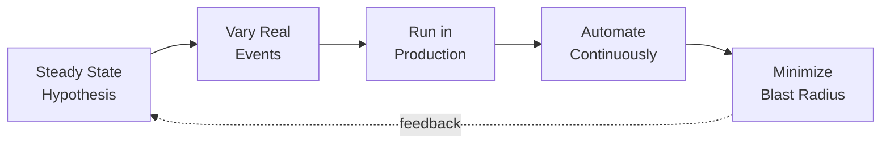

На собеседовании часто спрашивают именно эти 5 пунктов — стоит знать их наизусть.

## Q3. (!) Что такое `Steady State Hypothesis`?

**Steady State** — измеримое поведение системы в нормальных условиях, выраженное через бизнес- и технические метрики. **Hypothesis** — гипотеза, что эта устойчивость сохранится при инжектировании отказа.

### Пример формулировки

> При отключении одного из трёх инстансов `order-service` за 5 минут:
> - p95 latency остаётся < 300 ms (было 180 ms)
> - error rate не превышает 0.5%
> - throughput не падает больше чем на 5%

### Метрики для steady state

| Уровень | Примеры метрик |
|---------|----------------|
| Бизнес | Checkouts/min, signups/hour, revenue/sec |
| SLI | Request success rate, p99 latency |
| Infra | CPU, memory, network RTT |

### Ключевая идея

Мы пытаемся **опровергнуть** гипотезу: если steady state не сохранился — нашли слабое место. Если сохранился — повышаем уверенность. Чем труднее нарушить steady state, тем резилентнее система.

### Антипаттерн

Гипотеза "приложение не упадёт" — слишком расплывчата. Нужны числа и временные окна. Без steady state нельзя отличить успешный эксперимент от неудачного.

## Q4. (!) Что такое `Blast Radius` и как его контролировать?

**Blast Radius** — область воздействия эксперимента: сколько пользователей, запросов, инстансов, регионов он затронет. Минимизация blast radius — главный контракт безопасности хаос-инжиниринга.

### Стратегии минимизации

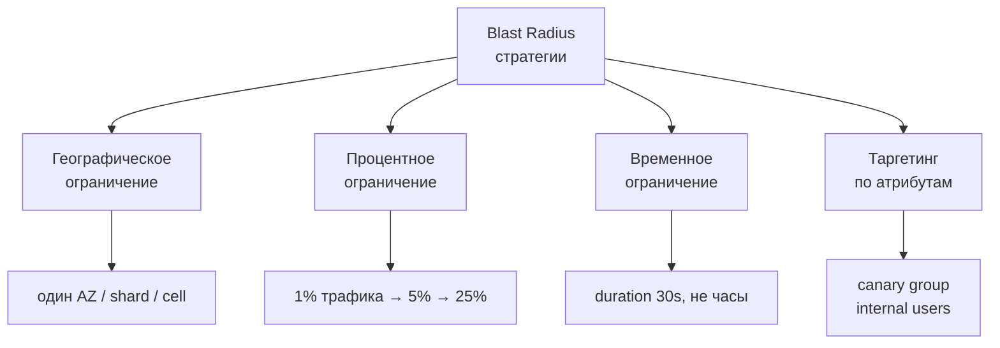

### Практические приёмы

- **Start small**: сначала 1 pod, потом namespace, потом кластер
- **Kill switch**: возможность немедленной остановки (`chaosctl stop`, удаление CR)
- **Time box**: эксперимент длится минуты, не часы
- **Feature flag**: завернуть chaos-инъекцию в флаг для включения/выключения
- **Canary**: направлять хаос на отдельную группу пользователей ([canary deployment](../cicd/deployment-strategies-interview.md))

### Пример в Chaos Mesh

```yaml
mode: fixed-percent
value: "10"   # только 10% pods с селектором
duration: "60s"
```

Пренебрежение blast radius — главная причина, почему хаос-эксперименты рушат прод и вызывают недоверие к практике.

## Q5. `Chaos Engineering` vs `Testing` vs `Fault Injection`?

| Характеристика | Testing | Fault Injection | Chaos Engineering |
|----------------|---------|-----------------|-------------------|
| Цель | Проверить известное поведение | Проверить обработку известного сбоя | Найти неизвестные слабости |
| Среда | Dev/CI | Test/Staging | Staging + Production |
| Гипотеза | "Фича работает" | "Ошибка обрабатывается" | "Steady state сохраняется" |
| Масштаб | Unit, integration | Компонент | Вся система |
| Время | Детерминированное | Контролируемое | Продолжительное, continuous |

**Fault Injection** — подмножество техник, используемых в Chaos Engineering, но без формализма принципов (гипотеза, steady state, blast radius).

`Chaos Engineering` — это **процесс и дисциплина**, fault injection — **инструмент**. Можно использовать fault injection в unit-тестах ([unit-тесты](unit-testing-interview.md)) без всякого хаоса.

## Q6. Запускать эксперименты в проде или на staging?

Канон `principlesofchaos.org` требует продакшена, но на практике зрелость растёт постепенно.

### Уровни сред

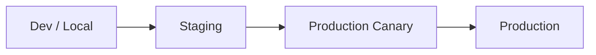

### Когда staging достаточен

- Первые эксперименты (команда ещё не доверяет процессу)
- Эксперименты с высоким риском (Chaos Kong на регион)
- Валидация новых типов атак перед выкаткой в прод

### Почему прод важен

- Реальный трафик (шум выявляет race conditions)
- Реальные конфигурации (секреты, лимиты, пулы)
- Реальные зависимости и их реакция
- Реальные пользователи и их поведение

### Компромисс: shadow traffic

Часть трафика зеркалится на эксперимент без воздействия на реальные ответы — близко к проду, но без риска.

Неверно: "у нас staging как прод". Почти никогда не так. Верно: "начинаем со staging, постепенно переходим в прод с малым blast radius".

## Q7. (!) Что такое Netflix `Simian Army` и какие инструменты в него входят?

**Simian Army** — набор инструментов, созданный Netflix в 2011-2012 для симуляции отказов разных уровней. Chaos Monkey был первым; остальные "обезьяны" добавляли новые измерения хаоса.

### Основные инструменты

| Инструмент | Что делает |
|------------|------------|
| `Chaos Monkey` | Случайно убивает один EC2-инстанс в бизнес-часы |
| `Chaos Gorilla` | Отключает целую `Availability Zone` |
| `Chaos Kong` | Симулирует падение целого AWS-региона |
| `Latency Monkey` | Вносит искусственные задержки в REST-вызовы |
| `Doctor Monkey` | Выявляет нездоровые инстансы (CPU, memory) и выводит из сервиса |
| `Janitor Monkey` | Находит и убивает неиспользуемые ресурсы |
| `Conformity Monkey` | Проверяет нарушения правил конфигурации |
| `Security Monkey` | Ищет уязвимости в конфигурации безопасности |
| `10-18 Monkey` | Проверяет локализацию (i18n/l10n) |

### Статус

Часть Simian Army заморожена/устарела. Netflix перешёл к внутренней платформе **ChAP** (Chaos Automation Platform). Публичные активные проекты: [Chaos Monkey 2.0](https://github.com/Netflix/chaosmonkey) (интеграция со Spinnaker).

На собеседовании важно: Simian Army — это **исторический контекст** и источник терминологии. Сегодня для похожих задач используют Gremlin, Chaos Mesh, Litmus.

## Q8. Как появился `Chaos Monkey` и какую задачу он решает?

В 2010-2011 Netflix мигрировал на AWS. Команда быстро поняла: инстансы в облаке пропадают **без предупреждения**, и код, не готовый к этому, ломается в проде. Вместо того чтобы "надеяться на лучшее", инженеры решили: пусть инстансы падают **каждый день** — так код придётся писать резистентным изначально.

### Механика

- Работает в бизнес-часы (чтобы команда могла реагировать)
- Случайно выбирает один инстанс в AWS Auto Scaling Group
- Терминирует его
- Следит за восстановлением (replica в ASG создаст замену)

### Чему учит

1. Все инстансы должны быть **stateless** (или корректно восстанавливать state).
2. Пулы соединений должны переоткрываться при потере.
3. Балансировщик должен быстро исключать мёртвый инстанс.
4. Клиенты должны делать retry с jitter.

### Эволюция

- **Chaos Monkey 1.0** (2012, открыт по Apache 2.0): attack на AWS ASG.
- **Chaos Monkey 2.0** (2016): переработан на Go, интеграция со Spinnaker.
- **Chaos Monkey for Spring Boot** (codecentric): не связан с Netflix, приложение-уровневый хаос в Java (Q16).

На интервью: "в чём суть Chaos Monkey" — в **тренировке кода быть готовым к падению инстансов**, а не просто в "убийстве серверов".

## Q9. Что такое `Chaos Kong` и `Chaos Gorilla`?

Это тяжёлая артиллерия Netflix Simian Army, действующая на уровнях **AZ** и **region**.

### Chaos Gorilla

- Выключает целую `Availability Zone` (AZ) в AWS
- Проверяет: умеет ли сервис переносить потерю AZ (multi-AZ deployment, cross-AZ routing)
- Типичная проблема: `master` базы в упавшей AZ, нет автоматического failover

### Chaos Kong

- Выключает целый `Region` (например, `us-east-1`)
- Проверяет: работает ли глобальный failover, DNS-routing, cross-region replication
- Запускается редко (ежеквартально у Netflix) — большой blast radius и сложная подготовка

### Эскалация

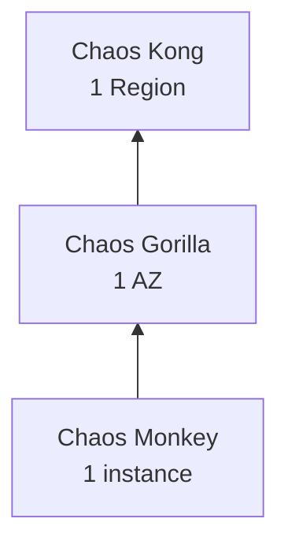

Каждый уровень требует своего уровня зрелости архитектуры: Chaos Monkey — резилентные сервисы; Gorilla — multi-AZ; Kong — multi-region active-active. Смотри также [распределённые системы](../architecture/distributed-systems-interview.md).

## Q10. (!) Какие типы хаос-экспериментов существуют?

Эксперименты классифицируют по слою инфраструктуры, на который действует инъекция.

### Таксономия

| Категория | Примеры |
|-----------|---------|
| **Infrastructure / State** | kill pod/VM, restart, disk full, clock skew |
| **Network** | latency, packet loss, partition, DNS failure, bandwidth limit |
| **Resource / Stress** | CPU stress, memory stress, IO stress |
| **Application** | exception injection, slow responses, invalid payload |
| **Dependency** | DB slow down, cache miss, 3rd-party API down |
| **Data** | corruption, schema mismatch, eventual consistency lag |
| **Security** | certificate expiry, IAM role revocation |
| **Regional** | AZ down, region down, cross-region partition |

### Матрица выбора

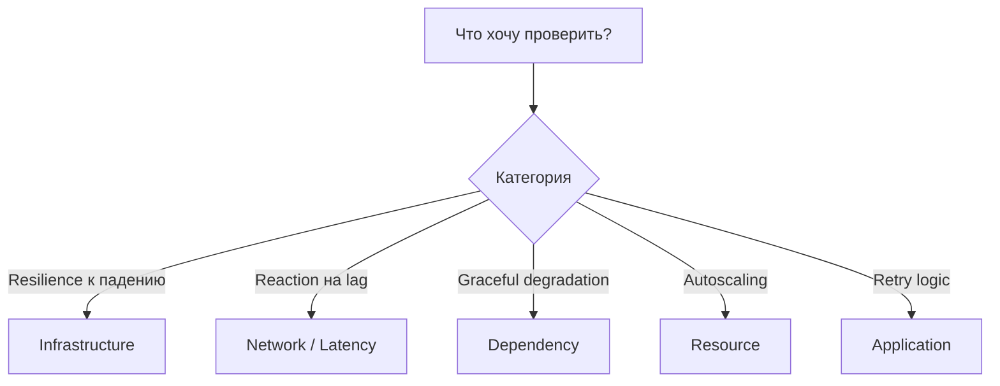

Хороший план экспериментов содержит смесь из нескольких категорий, покрывая разные сценарии отказов.

## Q11. Как устроен эксперимент с `network latency`?

Цель — проверить, как сервис реагирует на медленные ответы зависимостей (DB, внешние API, соседние сервисы). Это один из самых полезных экспериментов: **таймауты и retry** — главный источник каскадных отказов.

### Инструменты

- `tc` (Linux traffic control, `tc qdisc add dev eth0 root netem delay 200ms`)
- `Toxiproxy` (см. Q28)
- `Pumba` (для Docker, Q27)
- `Chaos Mesh NetworkChaos` (K8s, см. Q23)
- `Gremlin Latency` attack

### Что измеряем

- p95/p99 latency downstream-сервиса до и после инъекции
- Срабатывание таймаутов (должны быть короче, чем latency инъекции)
- Активация [circuit breaker](../architecture/resilience-patterns-interview.md)
- Успешный fallback в кэш или default value

### Типичные находки

- Таймаут больше, чем `SLA` → запросы ждут долго и копятся
- Нет circuit breaker → каскадный отказ
- Retry без jitter → retry storm
- Нет fallback → полный blackout фичи

Эксперименты с latency часто выявляют проблемы, которые не видны при падении сервиса: деградация хуже, чем полная недоступность, потому что ломает тайминги.

## Q12. Что такое `DNS chaos` и как его тестировать?

**DNS chaos** инжектирует сбои в резолвинге доменных имён: замедление, failure, неправильные ответы. Это важный класс экспериментов, потому что DNS — часто **единая точка отказа**, а приложения плохо его кэшируют.

### Сценарии

- DNS resolver недоступен → как ведёт себя `nslookup`-вызов в коде
- TTL истёк и свежий запрос падает
- Возвращается NXDOMAIN или wrong IP
- Latency в ответах DNS

### Инструменты

```yaml
# Chaos Mesh DNSChaos
apiVersion: chaos-mesh.org/v1alpha1
kind: DNSChaos
metadata:
  name: dns-chaos-example
spec:
  action: error
  mode: all
  patterns:
    - "payment-service.*"
  selector:
    namespaces:
      - production
```

### Что проверяем

- Наличие DNS-кэша в приложении (например, JVM `networkaddress.cache.ttl`)
- Таймауты на DNS-резолвинг
- Graceful degradation при недоступности некритичных зависимостей
- Алерты на рост DNS-ошибок

В JVM частый баг: `networkaddress.cache.ttl=-1` (кэш навсегда) приводит к тому, что после failover зависимости приложение всё ещё стучится в старый IP.

## Q13. Как тестировать `disk fill` и IO chaos?

Цель — проверить поведение при **исчерпании диска** и **медленных IO-операциях**: логи, временные файлы, БД, swap.

### Типы IO-экспериментов

| Тип | Эффект |
|-----|--------|
| Disk fill | Заполнить диск до порога (95%, 100%) |
| IO latency | Задержка чтения/записи |
| IO error | Возврат `EIO` на операциях |
| Read-only | Монтируем raffle-файловую систему как RO |

### Chaos Mesh пример

```yaml
apiVersion: chaos-mesh.org/v1alpha1
kind: IOChaos
metadata:
  name: io-latency
spec:
  action: latency
  mode: one
  selector:
    labelSelectors:
      app: orders
  volumePath: /var/lib/orders
  path: /var/lib/orders/**/*
  delay: "100ms"
  percent: 50
  duration: "60s"
```

### Что проверяем

- Лог-ротация работает (иначе `/var/log` переполнится первым)
- БД умеет gracefully отключать writes при полном диске
- Метрики и алерты срабатывают заранее (порог 80%, не 99%)
- Приложение не падает при невозможности записать лог

Типичная находка: при `disk full` сервис падает с `OutOfDiskSpaceException`, потому что не может логировать стек-трейс самой ошибки.

## Q14. Как проводить CPU/memory stress-эксперименты?

**Stress-эксперименты** нагружают ресурсы узла, чтобы проверить:
1. Реакцию `autoscaling` (HPA в K8s, ASG в AWS)
2. Корректность `resource limits` и `requests`
3. Поведение `OOM killer` и graceful degradation
4. Работу `backpressure` в reactive-системах

### Chaos Mesh StressChaos

```yaml
apiVersion: chaos-mesh.org/v1alpha1
kind: StressChaos
metadata:
  name: memory-stress
spec:
  mode: one
  selector:
    labelSelectors:
      app: api
  stressors:
    memory:
      workers: 4
      size: "1GB"
    cpu:
      workers: 2
      load: 80
  duration: "120s"
```

### Что смотрим

- HPA добавляет реплики или нет?
- Если нет, срабатывает ли `PodDisruptionBudget`?
- JVM `GC` начинает молотить — приложение замирает?
- Соседние pod-ы на том же ноде не затронуты (`resource limits`)?
- `readinessProbe` снимает трафик с перегруженного pod-а?

### Типичные находки

- Нет limits → один pod съедает ресурсы ноды, сыпятся все соседи (noisy neighbour)
- `HPA` по CPU, а bottleneck — memory → не масштабирует
- GC pause > readiness timeout → pod помечается как unhealthy и рестартится циклически

## Q15. Что такое `dependency failure` и как её инжектировать?

**Dependency failure** — отказ внешней зависимости (DB, cache, message broker, 3rd-party API). Самый бизнес-релевантный класс экспериментов, потому что микросервисы живут в паутине зависимостей.

### Способы инжектировать

1. **На клиенте**: `Toxiproxy` между приложением и зависимостью
2. **На сервере**: остановить real dependency (kill pod Redis)
3. **На уровне сети**: `iptables DROP` к порту зависимости
4. **Mock на границе**: WireMock, возвращающий 500

### Пример с Toxiproxy в Spring Boot тесте

```java
@Test
void whenRedisDown_fallbackToDatabase() {
    // Toxiproxy перекрывает трафик к Redis
    redisProxy.toxics().timeout("down", ToxicDirection.DOWNSTREAM, 0);

    UserDto user = userService.findById(42L);

    assertThat(user).isNotNull();
    // метрика fallback должна был инкремент
    assertThat(fallbackCounter.count()).isEqualTo(1.0);
}
```

### Что проверяем

- Graceful degradation: если кэш упал — читаем из БД
- Circuit breaker срабатывает за разумное время
- Bulkhead не даёт одной зависимости утянуть весь пул потоков
- Клиент использует retry с jitter и exponential backoff

Смотри [resilience-паттерны](../architecture/resilience-patterns-interview.md) для подробностей по circuit breaker, bulkhead, timeout.

## Q16. (!) Как подключить `Chaos Monkey` к Spring Boot приложению?

`Chaos Monkey for Spring Boot` (`codecentric/chaos-monkey-spring-boot`) — библиотека application-level хаоса в Java: инжектирует задержки, исключения, убивает приложение.

### Подключение

```xml
<dependency>
    <groupId>de.codecentric</groupId>
    <artifactId>chaos-monkey-spring-boot</artifactId>
    <version>3.0.2</version>
</dependency>
```

### Активация профилем

```bash
java -jar app.jar --spring.profiles.active=chaos-monkey
```

### Базовый `application.yml`

```yaml
chaos:
  monkey:
    enabled: true
    watcher:
      controller: false
      restController: true
      service: true
      repository: false
      component: false
    assaults:
      level: 5            # каждый 5-й вызов
      latencyActive: true
      latencyRangeStart: 2000
      latencyRangeEnd: 5000
      exceptionsActive: false
      killApplicationActive: false

management:
  endpoint:
    chaosmonkey:
      enabled: true
  endpoints:
    web:
      exposure:
        include: health,info,chaosmonkey
```

### Отличие от Netflix Chaos Monkey

| Netflix Chaos Monkey | Codecentric CM for Spring Boot |
|-----------------------|---------------------------------|
| Infrastructure-level (EC2 kill) | Application-level (методы, latency) |
| Интеграция со Spinnaker/AWS | Интеграция со Spring Boot |
| Go | Java |

Для integration/load-тестов Spring Boot-приложения — идеально, потому что хаос инжектируется внутрь JVM без внешних инструментов.

## Q17. (!) Что такое `Assaults` и `Watchers` в Chaos Monkey?

**Watchers** определяют **где** срабатывает хаос — какие типы Spring-бинов будут атакованы. **Assaults** определяют **что** произойдёт — какой тип атаки применится.

### Watchers

| Watcher | Бины, которые он отлавливает |
|---------|-------------------------------|
| `@Controller` | контроллеры MVC |
| `@RestController` | REST-контроллеры |
| `@Service` | сервисный слой |
| `@Repository` | репозитории / DAO |
| `@Component` | общие компоненты |
| Custom `@ChaosMonkeyAnnotation` | любые методы, помеченные аннотацией |
| Actuator Watcher | endpoints, включая custom |

### Assaults

| Assault | Эффект |
|---------|--------|
| `Latency Assault` | Добавляет задержку (min-max ms) перед возвратом |
| `Exception Assault` | Выбрасывает RuntimeException (настраиваемый) |
| `Kill Application Assault` | Вызывает `System.exit(1)` — убивает процесс |
| `Memory Assault` | Заполняет heap до percentage |
| `CPU Assault` | Нагружает CPU до percentage |

### Концепция "level"

`assaults.level: 5` означает "атакуй каждый 5-й вызов метода, подпадающего под watcher". Можно задать `deterministic: true` (каждый N-й) или случайный выбор.

```mermaid
graph LR
    A[HTTP Request] --> B[RestController<br/>@watcher]
    B --> C{Chaos<br/>Monkey<br/>level=5?}
    C -->|каждый 5-й| D[Assault<br/>latency/exception]
    C -->|остальные| E[Обычная<br/>обработка]
    D --> F[Response]
    E --> F
```

## Q18. Как настроить `Latency Assault` и `Exception Assault`?

### Latency Assault

Вносит случайную задержку в диапазоне `[latencyRangeStart, latencyRangeEnd]` ms перед выполнением метода.

```yaml
chaos:
  monkey:
    assaults:
      level: 3
      latencyActive: true
      latencyRangeStart: 1000
      latencyRangeEnd: 3000
    watcher:
      restController: true
```

Эффект: каждый 3-й HTTP запрос "тормозит" на 1-3 секунды. Полезно для тестирования таймаутов на upstream-клиентах.

### Exception Assault

Выбрасывает исключение вместо выполнения метода.

```yaml
chaos:
  monkey:
    assaults:
      level: 10
      exceptionsActive: true
      exception:
        type: "java.lang.RuntimeException"
        arguments:
          - className: "java.lang.String"
            value: "Chaos Monkey - RuntimeException"
```

Эффект: каждый 10-й вызов service-слоя кидает RuntimeException. Проверяет обработку ошибок, error handlers, алерты.

### Комбинация

Можно активировать несколько assaults одновременно — выбор случайный из активных.

### Watcher для конкретных бинов

С версии 2.4+ можно ограничить watchers списком бинов:

```yaml
chaos:
  monkey:
    watcher:
      beans:
        - "com.example.OrderService#placeOrder"
```

Это критично для точечных экспериментов и управления blast radius внутри приложения.

## Q19. Как управлять `Chaos Monkey` через Actuator в runtime?

Chaos Monkey предоставляет Spring Boot Actuator endpoint `/actuator/chaosmonkey` для управления без рестарта приложения.

### Ключевые endpoints

```bash
# статус
GET /actuator/chaosmonkey/status

# включить
POST /actuator/chaosmonkey/enable

# выключить
POST /actuator/chaosmonkey/disable

# текущая конфигурация
GET /actuator/chaosmonkey

# обновить assaults
POST /actuator/chaosmonkey/assaults
Content-Type: application/json
{
  "level": 5,
  "latencyActive": true,
  "latencyRangeStart": 500,
  "latencyRangeEnd": 1500,
  "exceptionsActive": false
}
```

### Почему это важно

- Эксперимент в **runtime**: включили, понаблюдали, выключили
- Kill switch для немедленной остановки при выходе за abort condition
- Интеграция с внешним оркестратором (CI, GameDay tooling)

### Безопасность

⚠️ Actuator endpoint должен быть защищён: в проде — Basic Auth или mTLS. Публично открытый `/chaosmonkey/enable` — это готовый DoS.

```yaml
management:
  endpoints:
    web:
      exposure:
        include: health,chaosmonkey
  security:
    enabled: true
```

## Q20. Когда использовать `@ChaosMonkeyAnnotation`?

Стандартные watchers работают по стереотипам Spring (`@Service`, `@Repository`). Если нужен **точечный контроль** над конкретными методами, используем `@ChaosMonkeyAnnotation`.

### Создание кастомной аннотации

```java
@Target({ElementType.METHOD, ElementType.TYPE})
@Retention(RetentionPolicy.RUNTIME)
@ChaosMonkeyAnnotation
public @interface FaultyPayment {
}
```

### Использование

```java
@Service
public class PaymentService {

    @FaultyPayment
    public PaymentResult charge(Order order) {
        // ...
    }
}
```

### Активация watcher

```yaml
chaos:
  monkey:
    watcher:
      customAnnotations:
        - "com.example.chaos.FaultyPayment"
```

### Когда это критично

- Атаковать только один метод из большого сервиса
- Смешивать уровни атаки (разные level для разных методов — через несколько кастомных аннотаций)
- Документировать явно: "этот метод участвует в хаос-экспериментах"
- Точно контролировать blast radius

Антипаттерн: включать watcher на весь `@Service` слой в большом монолите — атака расползается непредсказуемо.

## Q21. (!) Что такое `Chaos Mesh` и какие fault types он поддерживает?

**Chaos Mesh** — open-source платформа хаос-инжиниринга для Kubernetes, созданная PingCAP. CNCF Incubating проект. Описывает эксперименты как Custom Resources (CR), что позволяет хранить их в Git и применять через `kubectl apply`.

### Fault types

| Тип | Описание |
|-----|----------|
| `PodChaos` | pod-failure, pod-kill, container-kill |
| `NetworkChaos` | delay, loss, duplicate, corrupt, partition, bandwidth |
| `IOChaos` | latency, fault, attrOverride, mistake (на filesystem) |
| `StressChaos` | CPU и memory stressors |
| `TimeChaos` | искажение системного времени |
| `DNSChaos` | error, random на DNS-запросах |
| `HTTPChaos` | abort, delay, replace на HTTP-трафике |
| `JVMChaos` | exception, latency, GC, return на уровне JVM |
| `KernelChaos` | fault injection в системные вызовы |
| `AWSChaos` / `GCPChaos` | операции на облачных ресурсах |

### Архитектура

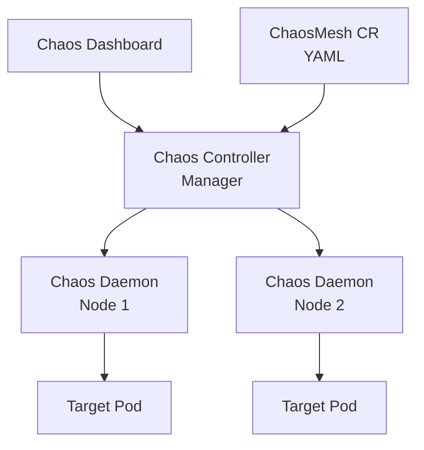

### Преимущества

- Rich UI dashboard для визуализации
- Workflow (цепочки экспериментов)
- Schedule (periodic chaos)
- RBAC и multi-tenancy

## Q22. (!) Как написать `PodChaos` эксперимент на Chaos Mesh?

`PodChaos` — самый распространённый тип: убить или вывести из строя pod.

### pod-failure (pod временно недоступен)

```yaml
apiVersion: chaos-mesh.org/v1alpha1
kind: PodChaos
metadata:
  name: pod-failure-example
  namespace: chaos-testing
spec:
  action: pod-failure
  mode: one
  duration: '30s'
  selector:
    namespaces:
      - production
    labelSelectors:
      'app.kubernetes.io/component': 'api'
```

### pod-kill (pod уничтожается один раз)

```yaml
apiVersion: chaos-mesh.org/v1alpha1
kind: PodChaos
metadata:
  name: pod-kill-example
spec:
  action: pod-kill
  mode: one
  selector:
    namespaces:
      - production
    labelSelectors:
      app: orders
```

### container-kill (убиваем один контейнер внутри pod)

```yaml
apiVersion: chaos-mesh.org/v1alpha1
kind: PodChaos
metadata:
  name: container-kill-example
spec:
  action: container-kill
  mode: one
  containerNames: ['sidecar']
  selector:
    labelSelectors:
      app: orders
```

### Параметр `mode`

| Значение | Эффект |
|----------|--------|
| `one` | один случайный pod |
| `all` | все pod-ы, подпадающие под selector |
| `fixed` | фиксированное число (указать `value`) |
| `fixed-percent` | процент (контроль blast radius) |
| `random-max-percent` | случайно от 0 до N% |

### Запуск

```bash
kubectl apply -f pod-chaos.yaml
kubectl describe podchaos pod-failure-example
kubectl delete podchaos pod-failure-example   # kill switch
```

Смотри [Kubernetes-вопросы](../devops/kubernetes-interview.md) про pod lifecycle и readiness probes.

## Q23. Как сделать `NetworkChaos` для симуляции задержек?

`NetworkChaos` инжектирует сетевые эффекты через `tc` (Linux traffic control) на уровне pod-а.

### Delay (задержка)

```yaml
apiVersion: chaos-mesh.org/v1alpha1
kind: NetworkChaos
metadata:
  name: network-delay
spec:
  action: delay
  mode: one
  selector:
    labelSelectors:
      app: orders
  delay:
    latency: "200ms"
    correlation: "25"
    jitter: "50ms"
  direction: to
  target:
    selector:
      labelSelectors:
        app: payments
    mode: one
  duration: "60s"
```

Сеть `orders → payments` получит +200ms ± 50ms задержки на 60 секунд.

### Partition (сетевая изоляция)

```yaml
apiVersion: chaos-mesh.org/v1alpha1
kind: NetworkChaos
metadata:
  name: network-partition
spec:
  action: partition
  mode: all
  selector:
    labelSelectors:
      app: orders
  direction: both
  target:
    selector:
      labelSelectors:
        app: payments
    mode: all
  duration: "30s"
```

Тест на split-brain: `orders` и `payments` не видят друг друга.

### Другие actions

- `loss` — packet loss (процент)
- `duplicate` — дублирование пакетов
- `corrupt` — коррупция пакетов
- `bandwidth` — ограничение полосы

### Где это важно

- Проверить таймауты и retry-стратегию
- Тестировать [eventual consistency](../architecture/consistency-patterns-interview.md) при partition
- Валидировать health checks и readiness probes под latency
- Отладить race conditions в распределённых алгоритмах

## Q24. Что такое `Litmus` и чем он отличается от Chaos Mesh?

**Litmus** — open-source платформа хаос-инжиниринга для Kubernetes, CNCF Incubating, основанная MayaData. Фокус на **experiment hub**: каталог готовых экспериментов, которые можно собирать в workflows.

### Сравнение

| Характеристика | Chaos Mesh | Litmus |
|----------------|-----------|--------|
| Архитектура | Controller + Daemon per node | ChaosOperator + Hub |
| CR | `PodChaos`, `NetworkChaos`, ... | `ChaosEngine`, `ChaosExperiment`, `ChaosResult` |
| Каталог | Built-in types | ChaosHub (публичный + приватный) |
| Dashboard | Chaos Dashboard | ChaosCenter |
| Workflows | Chaos Workflow | Argo Workflows integration |
| Эксперименты | Fault-first | Experiment-first (reusable) |

### Философия Litmus

Эксперимент = переиспользуемая сущность в Hub. Команда не пишет YAML с нуля, а берёт "pod-delete", "node-drain", "pod-network-latency" из каталога и применяет к своим workloads.

### Когда выбирать что

- **Chaos Mesh**: больше fault types из коробки, удобнее для TiDB-like инфраструктуры, развитая визуализация
- **Litmus**: нужен каталог переиспользуемых экспериментов, интеграция с Argo, фокус на cloud-native end-to-end

Оба — CNCF Incubating, активно развиваются, оба подходят для прод-уровня хаоса в Kubernetes.

## Q25. Как устроен `ChaosEngine` и `ChaosExperiment` в Litmus?

Litmus использует три ключевых CR:

### ChaosExperiment

Определение эксперимента (переиспользуемый шаблон): что делать, какие env-переменные принимает.

```yaml
apiVersion: litmuschaos.io/v1alpha1
kind: ChaosExperiment
metadata:
  name: pod-delete
spec:
  definition:
    scope: Namespaced
    permissions:
      - apiGroups: ["", "apps", "batch"]
        resources: ["pods", "deployments", "jobs"]
        verbs: ["create", "delete", "get", "list"]
    image: "litmuschaos/go-runner:latest"
    args:
      - -c
      - ./experiments -name pod-delete
    env:
      - name: TOTAL_CHAOS_DURATION
        value: '15'
      - name: CHAOS_INTERVAL
        value: '5'
```

### ChaosEngine

Применение эксперимента к конкретному workload.

```yaml
apiVersion: litmuschaos.io/v1alpha1
kind: ChaosEngine
metadata:
  name: orders-pod-delete
  namespace: production
spec:
  appinfo:
    appns: production
    applabel: 'app=orders'
    appkind: deployment
  chaosServiceAccount: litmus-admin
  experiments:
    - name: pod-delete
      spec:
        components:
          env:
            - name: TOTAL_CHAOS_DURATION
              value: '60'
            - name: PODS_AFFECTED_PERC
              value: '33'
```

### ChaosResult

Результат выполнения (создаётся автоматически) — pass/fail + метрики, используется в Prometheus.

### Workflow

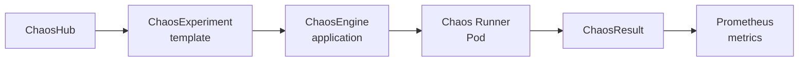

## Q26. Что такое `Gremlin` и какие у него категории атак?

**Gremlin** — коммерческая SaaS-платформа хаос-инжиниринга (failure-as-a-service). Поддерживает hosts, containers, Kubernetes-ресурсы через агент. Основная ценность — **"halt button"**: любая атака мгновенно откатывается.

### Категории атак

| Категория | Атаки |
|-----------|-------|
| **Resource** | CPU, Memory, IO, Disk |
| **State** | Shutdown, Reboot, Process Killer, Time Travel |
| **Network** | Blackhole, Latency, Packet Loss, DNS |
| **Custom** | Через Gremlin API |

### Пример атаки (через UI/API)

```json
{
  "type": "latency",
  "args": ["-d", "60", "-m", "200", "-p", "443"],
  "targets": {
    "hosts": {
      "ids": ["host-123"]
    }
  }
}
```

### Сильные стороны

- **Production-safe**: halt button, автоматический cleanup
- **Scenarios**: серии атак (escalating chaos)
- **RBAC**: для больших организаций
- **Status Checks**: автоматическая остановка при нарушении SLO
- **ALFI (Application Level Fault Injection)**: инъекции в код на уровне JVM/.NET

### Когда Gremlin

- Нужна enterprise-поддержка и compliance (SOC2, HIPAA)
- Команда не хочет разворачивать и поддерживать open-source (Chaos Mesh, Litmus)
- Нужны scenarios и интеграция с PagerDuty, Datadog, Slack из коробки

Минус — коммерческая лицензия; для startup бюджета опен-сорс дешевле.

## Q27. Что такое `Pumba` и когда его использовать?

**Pumba** — CLI-инструмент для хаоса на уровне Docker и containerd. Работает без Kubernetes — идеален для docker-compose окружений, локальной разработки, интеграционных тестов.

### Возможности

- Kill, stop, pause, remove контейнеры
- Network delay, loss, corrupt (через `tc netem`)
- Bandwidth limit
- Stress на CPU/memory через `stress-ng`

### Примеры команд

```bash
# убить случайный контейнер каждые 10 секунд
pumba --interval 10s kill --signal SIGKILL "re2:myapp.*"

# добавить 500ms задержки на eth0 контейнера orders на 1 минуту
pumba netem --duration 1m --tc-image gaiadocker/iproute2 \
  delay --time 500 orders

# packet loss 20%
pumba netem --duration 30s loss --percent 20 orders

# pause контейнер на 10 секунд
pumba pause --duration 10s orders
```

### Когда выбирать Pumba

- Docker-compose/Docker Swarm окружение (нет K8s)
- Локальные integration-тесты
- Легковесный CI-пайплайн с docker-контейнерами
- Быстрое тестирование без деплоя целой платформы

Pumba — это "kubectl для контейнерного хаоса", простой и без зависимостей.

## Q28. (!) Что такое `Toxiproxy` и чем он полезен в интеграционных тестах?

**Toxiproxy** (Shopify) — TCP-прокси, который стоит между клиентом и сервером и позволяет программно инжектировать "toxics": latency, bandwidth limit, timeout, slice, reset peer. Основное применение — **integration-тесты** с реалистичной сетевой нестабильностью.

### Архитектура

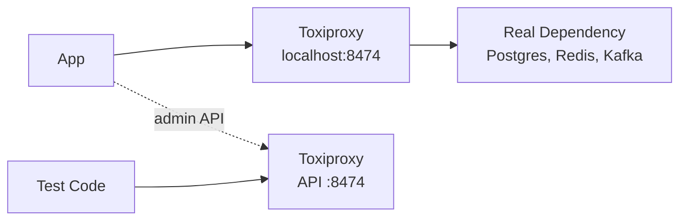

### Пример с Testcontainers + Java client

```java
@Container
static ToxiproxyContainer toxiproxy = new ToxiproxyContainer()
    .withNetwork(NETWORK);

@Container
static PostgreSQLContainer<?> postgres = new PostgreSQLContainer<>("postgres:16")
    .withNetwork(NETWORK)
    .withNetworkAliases("postgres");

@BeforeAll
static void setup() throws IOException {
    ToxiproxyClient client = new ToxiproxyClient(
        toxiproxy.getHost(), toxiproxy.getControlPort());
    Proxy proxy = client.createProxy("postgres", "0.0.0.0:8666", "postgres:5432");

    // inject 2 секунды latency
    proxy.toxics().latency("slow_pg", ToxicDirection.DOWNSTREAM, 2000);
}

@Test
void whenDbSlow_circuitBreakerOpens() {
    assertThrows(CallNotPermittedException.class, () -> orderService.list());
}
```

### Поддерживаемые toxics

- `latency` — добавить задержку (с jitter)
- `bandwidth` — ограничить полосу
- `slow_close` — медленное закрытие соединения
- `timeout` — keep-alive без ответа (таймауты пула соединений)
- `slicer` — разбить data на маленькие чанки
- `limit_data` / `reset_peer` — разрыв соединения

### Когда использовать

- Integration-тесты клиентов БД, кешей, очередей
- Проверка circuit breaker, timeout, retry в realistic сценариях
- CI-пайплайны (можно крутить тесты с chaos без Kubernetes)

Toxiproxy — мост между "обычными тестами" и настоящим chaos engineering: запускается локально, пишется детерминированно, ловит те же баги, что и прод-хаос.

## Q29. Сравнение инструментов: что когда выбирать?

| Инструмент | Слой | Платформа | Когда выбрать |
|------------|------|-----------|---------------|
| Netflix Chaos Monkey | Infrastructure (EC2) | AWS + Spinnaker | AWS VM-based архитектура |
| Chaos Monkey Spring Boot | Application | Spring Boot | Java-монолит, точечный хаос в коде |
| Gremlin | Infra + App | Hosts, K8s, containers | Enterprise, нужен SaaS |
| Litmus | Infra | Kubernetes | CNCF-экосистема, Argo workflows |
| Chaos Mesh | Infra | Kubernetes | Много fault types, dashboard |
| Pumba | Container | Docker | docker-compose, локальные тесты |
| Toxiproxy | Network | Любая (TCP) | Integration-тесты, client libs |
| AWS FIS | Cloud | AWS | AWS-native без агентов |
| Azure Chaos Studio | Cloud | Azure | Azure-native |

### Дерево принятия решений

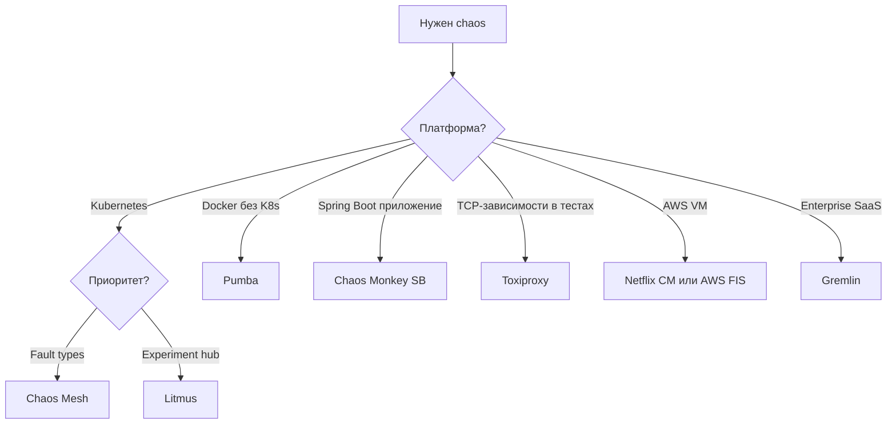

В крупных командах чаще мультистэк: Toxiproxy в unit/integration, Chaos Mesh в staging/prod K8s, Gremlin для compliance-критичных сценариев.

## Q30. (!) Что такое `GameDay` и как его проводить?

**GameDay** — запланированное мероприятие, на котором команда проводит серию хаос-экспериментов в реальном (часто продовом) окружении, наблюдает реакцию системы и своих процессов, документирует находки. Формат придуман Jesse Robbins в Amazon (2003), вдохновлён пожарными учениями.

### Фазы GameDay

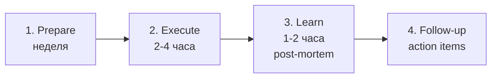

### 1. Подготовка

- Выбрать scope (какие сервисы, какие отказы)
- Сформулировать hypothesis для каждого эксперимента
- Определить steady state метрики и abort conditions
- Подготовить runbook (Q31)
- Нотифицировать smежные команды и on-call
- Убедиться в наличии observability

### 2. Выполнение

- Kick-off: все участники на митинге или в чате
- Запускаем эксперимент (оркестратор оглашает шаги)
- Наблюдатели фиксируют поведение
- Incident responders действуют как на настоящем инциденте
- Все события в timeline

### 3. Post-mortem

- Что сработало / что сломалось
- Было ли alerts и через какое время
- Runbook был корректен?
- Action items с owner и deadline

### 4. Follow-up

Через 1-2 недели — check, что action items закрыты. Иначе GameDay превращается в "покатушки без последствий".

### Роли

| Роль | Обязанность |
|------|-------------|
| Orchestrator | Ведёт эксперимент, тайминги |
| Incident Responders | Действуют как на реальном инциденте |
| Observers | Фиксируют метрики, логи, timeline |
| Scribe | Ведёт протокол |
| Safety Officer | Следит за abort conditions, имеет право остановить |

GameDay — это тренировка не только системы, но и **команды**: runbooks, коммуникация, алерты, процесс принятия решений.

## Q31. Что должно быть в `runbook` для chaos-эксперимента?

**Runbook** — документ эксперимента, который служит и планом, и артефактом для post-mortem.

### Структура

```markdown
# Chaos Experiment: Pod Kill Payment Service

## Metadata
- Date: 2026-04-20
- Owner: @sre-alice
- Severity: medium
- Environment: production

## Hypothesis
При убийстве одного из 5 pod `payment-service`:
- p95 latency /api/pay остаётся < 500 ms
- error rate < 1%
- recovery time < 30 s

## Steady State Metrics
- p95 latency: Grafana dashboard X
- error rate: Prometheus query Y
- throughput: Kibana panel Z

## Blast Radius
- 1 pod из 5 (20%)
- Duration: 60 s
- Only production-us-east cluster

## Abort Conditions
- error rate > 5% в течение 30 s
- p99 latency > 2 s в течение 60 s
- ручное решение Safety Officer

## Procedure
1. Confirm all stakeholders on-call
2. Check baseline metrics (screenshot Grafana)
3. kubectl apply -f pod-kill.yaml
4. Monitor 60 s
5. Wait for recovery (ASG replaces pod)
6. kubectl delete podchaos pod-kill-payment

## Rollback
- kubectl delete podchaos ... (immediate)
- kubectl rollout restart deployment payment-service

## Observability Links
- Dashboard: ...
- Alerts channel: ...
- Tracing: ...
```

Runbook обязателен: без него эксперимент превращается в импровизацию, post-mortem — в догадки.

## Q32. Как устроен post-mortem после эксперимента?

Структура post-mortem после chaos-эксперимента похожа на incident post-mortem, но с фокусом на **обучение**, а не на "вину".

### Шаблон

1. **Summary**: что запускали, к какой гипотезе
2. **Timeline**: события с метками времени
3. **Hypothesis outcome**: подтверждена / опровергнута
4. **What went well**: что сработало (alert, failover, runbook)
5. **What went wrong**: находки (MTTR выше ожидаемого, алерт не сработал, деградация фичи)
6. **Action Items**: owner + deadline для каждого
7. **Unknown unknowns**: что мы не предвидели

### Принцип blameless

Фокус на **системе и процессах**, а не на людях. "Алерт не сработал потому что metric не экспортировался" — полезно. "Петя забыл настроить алерт" — нет.

### Метрики post-mortem

- **MTTD** (Mean Time To Detect) — как быстро увидели проблему
- **MTTR** (Mean Time To Recover) — как быстро восстановились
- **Customer Impact** — сколько пользователей / запросов затронуто
- **SLO Burn Rate** — на сколько сгорел error budget

Хороший post-mortem становится знанием команды, плохой — бюрократией. Смотри также [blameless culture](../behavioral/behavioral-interview.md) в поведенческих вопросах.

## Q33. (!) Что такое `abort condition` и когда останавливать эксперимент?

**Abort condition** — автоматический или ручной триггер немедленной остановки эксперимента, когда система выходит за допустимые границы деградации. Это **обязательный** элемент любого chaos-эксперимента.

### Типы abort conditions

| Тип | Пример |
|-----|--------|
| Metric-based | error rate > 5% |
| Latency-based | p99 > 2 s в течение 60 s |
| Business-based | checkout/min упал на 10% |
| SLO-based | burn rate > 2x за окно |
| Manual | Safety Officer решает |

### Как реализовать

- **Gremlin Status Checks**: автоматическая остановка при нарушении health-check
- **Chaos Mesh**: удаление CR (`kubectl delete`) мгновенно откатывает большинство fault types
- **Script-based**: cron/watcher на Prometheus, который удаляет эксперимент при нарушении

### Пример Prometheus abort

```yaml
# PrometheusRule
- alert: ChaosAbortCondition
  expr: |
    sum(rate(http_requests_total{status=~"5.."}[1m]))
    / sum(rate(http_requests_total[1m])) > 0.05
  for: 30s
  annotations:
    action: "kubectl delete chaos --all -n chaos-testing"
```

### Философия

Лучше остановить эксперимент **раньше** времени, чем продолжать и получить реальный инцидент. Цель — **учиться**, а не ронять прод. Готовность остановить эксперимент — признак зрелости практики.

## Q34. (!) Какие требования к observability для `Chaos Engineering`?

Без observability chaos engineering **слепой** — нельзя подтвердить или опровергнуть гипотезу, нельзя увидеть abort condition, нельзя написать post-mortem. Observability — **prerequisite**, не "хорошо бы".

### Три столпа

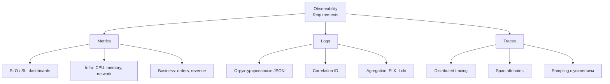

### Обязательный минимум

- **Dashboard** со steady state метриками (p50, p95, p99, error rate, throughput)
- **Alerts** на SLO-burn
- **Logs aggregation** (ELK / Loki) с correlation ID
- **Distributed tracing** ([OpenTelemetry](../monitoring/observability-interview.md)): чтобы видеть, как latency одного сервиса влияет на всю цепочку
- **Event marker** на графиках: "в 14:00 запустили chaos experiment X"

### Типичный провал

"Запустили chaos, приложение вроде не упало" — но без метрик нельзя сказать, что произошло на самом деле. Возможно, `p99` вырос в 10 раз, но никто не смотрел именно на него.

### Chaos Engineering как драйвер observability

Эксперимент, который нельзя проанализировать, — бессмысленный. Поэтому подготовка к первому GameDay часто включает доработку observability. Это полезный побочный эффект практики.

Смотри подробнее [метрики и трейсинг](../monitoring/metrics-tracing-interview.md) и [observability](../monitoring/observability-interview.md).

## Q35. Как `Chaos Engineering` связан с `error budget` и SLO?

**SLO** (Service Level Objective) задаёт цель надёжности (например, 99.9% success rate за 30 дней). **Error budget** = 100% - SLO = допустимый процент ошибок. Chaos Engineering **тратит** error budget намеренно, чтобы получить информацию.

### Математика

- 99.9% SLO → error budget 43.2 минуты downtime в месяц
- Chaos experiment = контролируемое расходование budget
- Трата на эксперимент: например, 5 минут — 12% от месячного бюджета

### Принципы

1. **Нет error budget** → chaos откладывается, сначала стабилизация
2. **Budget есть** → можно проводить эксперименты в этом квартале
3. **Abort condition = SLO burn rate**: если эксперимент выжирает бюджет быстрее, останавливаем
4. **Budget-based prioritization**: чем больше бюджета, тем агрессивнее эксперименты

### Интеграция с SRE

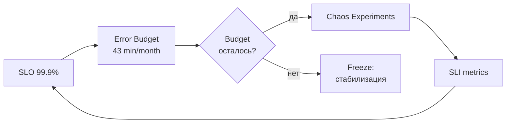

### Пример политики

```yaml
chaos_policy:
  minimum_error_budget: 50%  # не запускаем если <50% осталось
  experiment_budget_consumption: 5%  # один эксперимент < 5% бюджета
  auto_halt_on_slo_burn: 2x  # burn rate > 2x → abort
```

Без SLO/error budget chaos engineering работает "на ощупь"; с ними — превращается в **дисциплину управления надёжностью**.

## Q36. Как встроить `Chaos Engineering` в CI/CD pipeline?

Автоматизация экспериментов — 4-й принцип Chaos Engineering. Ручные GameDays дают разовую уверенность; CI/CD — **непрерывную**.

### Три уровня интеграции

| Уровень | Где | Что |
|---------|-----|-----|
| 1. Smoke chaos | Pre-deploy CI | Toxiproxy в integration tests |
| 2. Staging chaos | Post-deploy staging | Chaos Mesh jobs после smoke |
| 3. Prod chaos | Scheduled in prod | Chaos Mesh Schedule, Gremlin scenarios |

### Пример GitHub Actions

```yaml
jobs:
  chaos-staging:
    needs: deploy-staging
    runs-on: ubuntu-latest
    steps:
      - uses: actions/checkout@v4
      - name: Apply PodChaos
        run: kubectl apply -f chaos/pod-failure.yaml
      - name: Wait and validate
        run: |
          sleep 60
          ./scripts/check-slo.sh
      - name: Cleanup
        if: always()
        run: kubectl delete -f chaos/pod-failure.yaml
```

### Pattern: `ChaosSchedule`

```yaml
apiVersion: chaos-mesh.org/v1alpha1
kind: Schedule
metadata:
  name: daily-pod-kill
spec:
  schedule: "0 10 * * 1-5"
  type: "PodChaos"
  historyLimit: 5
  concurrencyPolicy: "Forbid"
  podChaos:
    action: pod-kill
    mode: one
    selector:
      labelSelectors:
        app: demo
```

### Guardrails в CI

- Blocker: emergency freeze flag (никакого chaos во время инцидентов)
- SLO burn rate check перед стартом
- Maintenance windows (no chaos в black Friday)
- Notifications в Slack перед стартом

### Что даёт CI/CD интеграция

- Регрессия чаос-устойчивости: если вчера выдерживали pod-kill, а сегодня нет — найдём через 24 часа, не через квартал
- Новые deploy проверяются против того же набора экспериментов
- Zero-maintenance chaos (не зависит от доступности людей)

Смотри [дизайн pipeline](../cicd/pipeline-design-interview.md) про этапы CI/CD.

## Q37. (!) Что такое `Chaos Maturity Model` (CMM)?

**Chaos Maturity Model** (Netflix, Rosenthal & Jones, книга "Chaos Engineering") оценивает зрелость практики по двум осям: **sophistication** (глубина экспериментов) и **adoption** (широта внедрения).

### Две оси

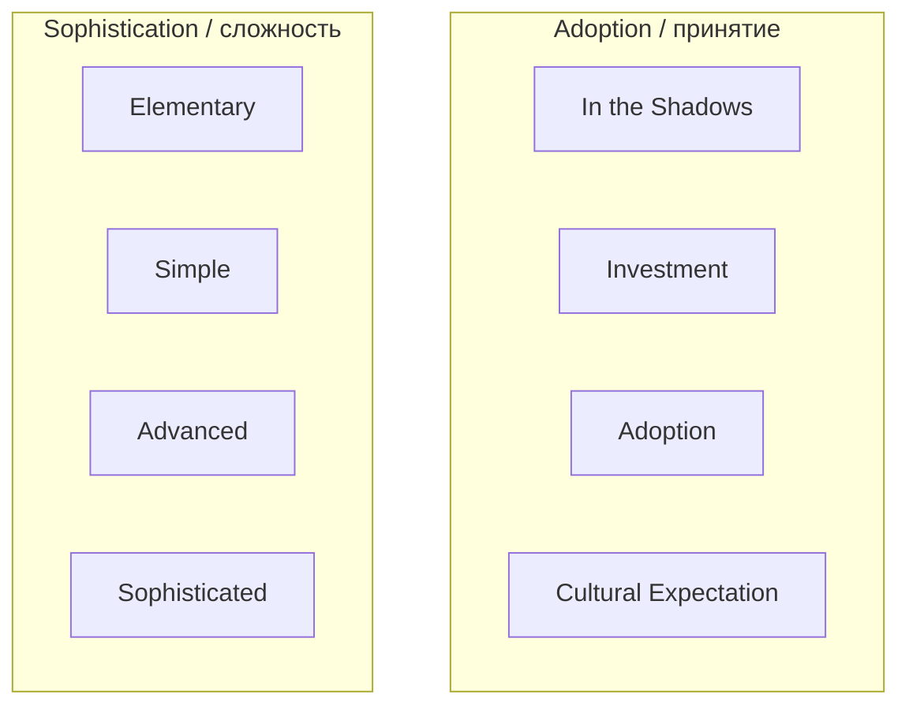

### Уровни sophistication

| Уровень | Что есть |
|---------|----------|
| **Elementary** | Разовые ручные эксперименты на staging, нет hypothesis, нет автоматизации |
| **Simple** | Эксперименты на staging, ручной анализ, базовый runbook |
| **Advanced** | Автоматизация, эксперименты на staging и canary, hypothesis + metrics |
| **Sophisticated** | Автоматизация в проде, интеграция с CD и business metrics, dynamic blast radius |

### Уровни adoption

| Уровень | Что есть |
|---------|----------|
| **In the Shadows** | Один инженер делает у себя, команда не знает |
| **Investment** | Организация выделяет бюджет, есть owner |
| **Adoption** | Большинство команд инженерии участвует |
| **Cultural Expectation** | Все новые сервисы должны проходить chaos, это как unit-тесты |

### Цель

Не все команды должны быть на Sophisticated+Cultural — для стартапа с 3 сервисами это оверкилл. Цель — **осознанное продвижение** по матрице в зависимости от бизнес-потребностей.

### Использование на собеседовании

Если спрашивают "как начать chaos в команде", отвечаем: Elementary на staging → Simple с runbooks и post-mortem → Advanced с автоматизацией в CI → Sophisticated с интеграцией в SLO и прод.

## Q38. Какие роли участвуют в Chaos Engineering?

В зрелой практике chaos распределён между несколькими ролями:

### Роли

| Роль | Обязанности |
|------|-------------|
| **Chaos Engineer / SRE** | Проектирует эксперименты, развивает платформу |
| **Service Owner / Dev Lead** | Отвечает за hypothesis своих сервисов, участвует в GameDay |
| **Incident Responder (on-call)** | Реагирует на abort conditions, тренируется на GameDay |
| **Safety Officer** | Останавливает эксперимент при необходимости |
| **Observability Engineer** | Обеспечивает метрики, логи, трейсинг |
| **Platform Team** | Поддерживает chaos-инфраструктуру (Chaos Mesh operator) |
| **Leadership / Engineering Manager** | Выделяет время и бюджет, защищает error budget |

### Модели организации

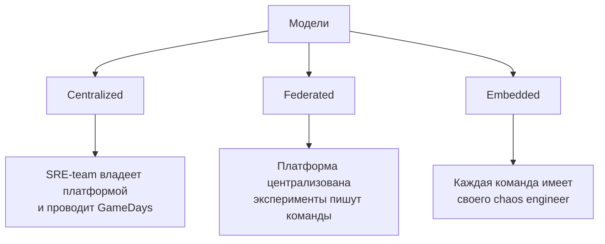

Маленькая компания: один SRE + вовлечённые service owners. Крупная: платформенная команда + "chaos champions" в каждом squad. Смотри также [вопросы по лидерству](../behavioral/behavioral-interview.md).

## Q39. Как убедить бизнес и руководство внедрять Chaos Engineering?

Сопротивление — частая проблема: "вы хотите специально ломать прод?!". Нужны аргументы в деньгах и рисках.

### Аргументы

1. **ROI на инцидентах**: один prevent-ed инцидент масштаба Azure-like стоит $$$ — chaos стоит меньше
2. **MTTR**: тренированная команда реагирует быстрее, каждая минута downtime = стоимость
3. **Compliance**: PCI, SOC2, финрег требуют disaster recovery testing — GameDay закрывает
4. **Confidence for releases**: проверенный на chaos код → меньше страха релизов → выше скорость доставки
5. **Attract talent**: engineering culture с SRE и chaos привлекает сильных инженеров

### Пример сторителлинга

> "В прошлом квартале у нас было 3 инцидента из-за flaky DB. Если мы бы симулировали эти отказы в GameDay, мы бы нашли и починили их до прода. Один прод-инцидент = 4 часа × 30 инженеров = 120 человеко-часов. Chaos-эксперимент = 2 часа × 5 инженеров = 10 человеко-часов. ROI 12x."

### Антипаттерн пресейла

- "Мы хотим ронять прод, потому что это модно" — нет
- "Netflix делает, и мы должны" — нет
- "Повысит resilience" — слишком абстрактно

Нужны конкретные метрики: MTTR, incident frequency, SLO, customer impact.

### Постепенность

Начать со staging → показать hypothesis/finding → накопить кейсы → повысить зрелость. Никогда не стартовать "давайте сразу Chaos Kong на прод".

## Q40. (!) Какие антипаттерны в `Chaos Engineering`?

Список типичных ошибок, которые встречаются на практике:

### 1. "Chaos ради chaos"

Эксперимент без hypothesis и steady state — просто "давайте что-нибудь сломаем". Нельзя сказать, успех или провал.

### 2. Нет abort condition

Запустили и смотрим "что будет". Если всё плохо — уже поздно. Abort должен быть автоматическим.

### 3. Chaos без observability

Невозможно проанализировать эксперимент без dashboards, alerts, tracing. Сначала — observability, потом — chaos.

### 4. Blast radius не контролируется

Pod-kill на `mode: all` в проде = самоDDoS. Всегда начинаем с `one` или `fixed-percent: 10`.

### 5. Chaos во время инцидента

В момент реального incident'а категорически нельзя запускать эксперименты. Нужен "chaos freeze" механизм.

### 6. Игнорирование post-mortem

Провели эксперимент, нашли проблему — и не зафиксировали owner/deadline. Через квартал повторили тот же эксперимент с тем же failure.

### 7. Эксперименты "по настроению"

Нет расписания, приоритизации, планов. Chaos случается когда у команды есть время → никогда.

### 8. Chaos вместо тестов

Chaos не заменяет [unit](unit-testing-interview.md) и [integration-тесты](integration-testing-interview.md). Это **дополнение** для distributed-специфики.

### 9. Полагаться только на Chaos Monkey

Только pod-kill → не проверяются network, disk, DNS, dependency failures. Нужен **портфель** экспериментов.

### 10. Одноразовый GameDay

Провели раз, поставили галочку. Chaos Engineering — **континуальная** практика, одноразовые упражнения дают одноразовую уверенность.

## Q41. Что значит "не делать chaos ради chaos"?

Это базовый антипаттерн: команда узнала про chaos, подключила Chaos Monkey, запускает "что-нибудь" — и не получает пользы. Реальный chaos — **дисциплина с научным методом**.

### Что отличает дисциплинированный chaos

1. **Гипотеза**: "При X произойдёт Y, и steady state Z сохранится"
2. **Измеримость**: метрики, по которым можно подтвердить/опровергнуть гипотезу
3. **Blast radius**: явно ограниченный, продуманный
4. **Abort condition**: тригер остановки
5. **Outcome**: action items, post-mortem, улучшения

### Формула "хорошего" эксперимента

```
Problem → Hypothesis → Experiment → Result → Learning → Action
```

Если любой из этапов отсутствует — это "chaos ради chaos". Лучше **не делать эксперимент**, чем делать без методологии.

### Примеры

❌ "Давайте запустим pod-kill на проде и посмотрим" — нет hypothesis
✅ "Мы думаем, что при убийстве 1 из 5 pod payment-service p95 latency не превысит 500 ms. Проверим это в четверг в 14:00."

## Q42. Какие prerequisites должны быть перед первым экспериментом?

Чтобы первый эксперимент был **продуктивен**, а не **разрушителен**, нужна подготовка инфраструктуры и процессов.

### Чек-лист prerequisites

| Категория | Что нужно |
|-----------|-----------|
| **Observability** | Dashboards, alerts на SLO, log aggregation, tracing |
| **SLO / error budget** | Определены, согласованы, отслеживаются |
| **Runbooks** | На типичные инциденты, проверены |
| **On-call** | Есть rotation, paging работает |
| **Resilience-паттерны** | Circuit breaker, retry, timeout в коде |
| **Deployment** | Быстрый rollback (< 5 мин) |
| **Автоскейлинг / self-healing** | K8s deployments, HPA, ASG |
| **Communication** | Slack-канал для incidents, war-room формат |

### Признаки незрелости (chaos рано)

- Деплой вручную и занимает часы
- Метрики смотрят только после алерта от пользователей
- Нет staging, есть только prod
- Единая БД без replica / failover
- Нет tests → chaos найдёт baseline bugs, а не distributed-specific

### Что делать, если prerequisites не готовы

Chaos Engineering **помогает подсветить** пробелы, но **не решает их**. Сначала 2-3 квартала на observability и resilience, потом chaos.

## Q43. Как комбинировать Chaos Engineering с resilience-паттернами?

Chaos — это **валидация** resilience-паттернов. Паттерн без chaos = надежда; chaos без паттерна = падение.

### Маппинг

| Паттерн | Эксперимент, который его валидирует |
|---------|-------------------------------------|
| [Circuit Breaker](../architecture/resilience-patterns-interview.md) | Latency injection в dependency |
| Retry с backoff | 5xx на 50% запросов к зависимости |
| Timeout | Slow downstream (Toxiproxy latency 10s) |
| Bulkhead | Thread pool saturation в одной зависимости |
| Rate limiting | Traffic burst через `tc` или loadgen |
| Failover / replication | Kill master DB |
| Graceful degradation | Full dependency outage (partition) |
| Idempotency | Duplicate requests (network duplicate) |

### Процесс

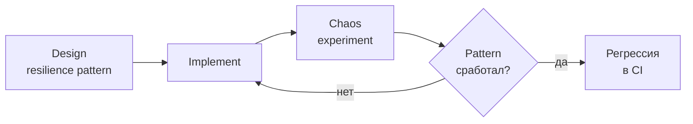

### Антипример

"У нас есть circuit breaker" → "мы не проверяли, как он переходит в half-open в продакшене". Теоретический паттерн без chaos — это паттерн, в который нельзя верить.

Смотри [паттерны надёжности](../architecture/resilience-patterns-interview.md) и [микросервисные паттерны](../architecture/microservices-interview.md) для полного обзора.

## Q44. (!) Best practices и чек-лист перед экспериментом

Сводный чек-лист успешного хаос-эксперимента:

### Pre-flight чек-лист

```markdown
## Подготовка
- [ ] Hypothesis сформулирована в формате "при X → Y, steady state Z"
- [ ] Steady state metrics выбраны и мониторятся
- [ ] Blast radius явно ограничен (процент / регион / время)
- [ ] Abort condition автоматизировано
- [ ] Kill switch проверен (dry run cleanup)
- [ ] Runbook написан и review-ed
- [ ] On-call команда предупреждена
- [ ] Нет incident freeze (прод стабилен последние 24ч)
- [ ] Error budget в наличии

## Observability
- [ ] Dashboard с SLI открыт
- [ ] Alerts проверены (working as intended)
- [ ] Trace ID/correlation ID работает
- [ ] Event marker будет поставлен (annotation на графике)

## Выполнение
- [ ] Baseline метрики зафиксированы (скриншот)
- [ ] Start experiment + мониторинг 5-10 мин
- [ ] Stop experiment + наблюдение восстановления
- [ ] Post-incident screenshot метрик

## Post
- [ ] Post-mortem написан в течение 48 часов
- [ ] Action items созданы с owner + due date
- [ ] Learnings в wiki / runbooks
- [ ] Follow-up через 1-2 недели на action items
```

### Принципы выбора экспериментов

1. **Start small**: simple pod-kill до Chaos Kong
2. **Learn from incidents**: постмортемы → chaos-сценарии
3. **Prioritize by risk**: самые критичные зависимости первыми
4. **Diversify portfolio**: infrastructure + network + dependency + data
5. **Automate what works**: успешные ручные эксперименты → CI jobs

### Культурные практики

- Blameless post-mortems (смотри [культура](../behavioral/behavioral-interview.md))
- Chaos Champion в каждой команде
- Ежемесячные GameDays
- Learning-oriented, а не audit-oriented

### Что отличает senior-уровень

На собеседовании senior показывает, что chaos — не инструмент, а **способ мышления**: мы не верим, что система работает — мы **доказываем** это экспериментами. Тесты показывают, что код делает то, что мы хотим; chaos показывает, что система **держится**, когда этого не происходит.

---

## See also

- [Стратегии тестирования](test-strategies-interview.md) — куда chaos вписывается в общий ландшафт тестирования
- [Автоматизация тестов](test-automation-interview.md) — интеграция chaos в CI/CD
- [Integration Testing](integration-testing-interview.md) — Toxiproxy и fault injection в интеграционных тестах
- [Unit Testing](unit-testing-interview.md) — разница между unit-уровнем моков и chaos
- [Resilience Patterns](../architecture/resilience-patterns-interview.md) — circuit breaker, retry, bulkhead, которые валидирует chaos
- [Distributed Systems](../architecture/distributed-systems-interview.md) — теоретическая база проблем, которые chaos воспроизводит
- [Микросервисы](../architecture/microservices-interview.md) — основной контекст применения chaos
- [Observability](../monitoring/observability-interview.md) — обязательный prerequisite для chaos
- [Метрики и трейсинг](../monitoring/metrics-tracing-interview.md) — без них невозможно анализировать эксперименты
- [Kubernetes](../devops/kubernetes-interview.md) — платформа для Chaos Mesh и Litmus
- [Стратегии деплоя](../cicd/deployment-strategies-interview.md) — canary/blue-green как способ ограничить blast radius
- [Pipeline Design](../cicd/pipeline-design-interview.md) — встраивание chaos в CI/CD

- [[contract-testing-interview|Contract Testing]]
- [[integration-testing-interview|Integration Testing]]
- [[load-testing-interview|Load Testing]]
- [[mockito-interview|Mockito]]
- [[mutation-testing-interview|Mutation Testing]]
- [[property-based-testing-interview|Property-based Testing]]
