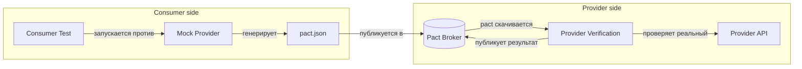
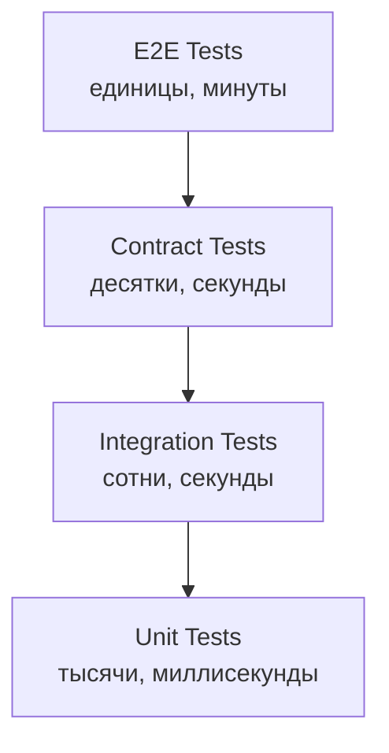
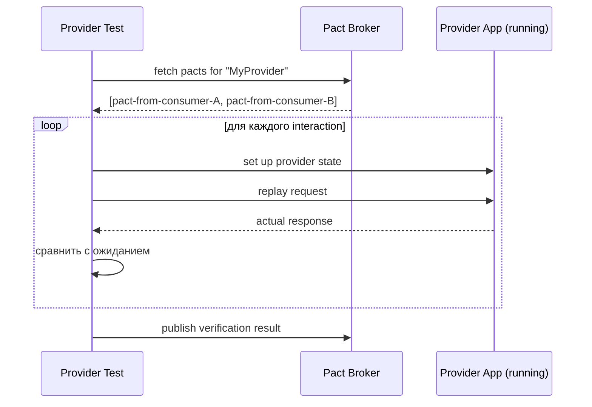
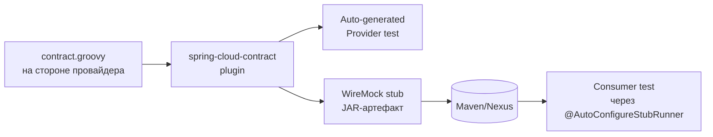
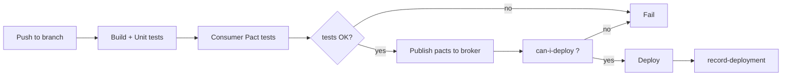

# Вопросы на собеседовании: `Contract Testing`

Контрактное тестирование (`Contract Testing`) проверяет соответствие API-контрактов между сервисами без поднятия полного стенда: consumer фиксирует ожидания, provider верифицирует, что выдаёт именно то, что consumer использует. Этот файл покрывает `Consumer-Driven Contract Testing` (`CDCT`), `Pact JVM`, `Pact Broker`, provider verification и provider states, `Spring Cloud Contract`, `can-i-deploy` и интеграцию в `CI/CD`, а также trade-off'ы по сравнению с интеграционными и `E2E`-тестами.

**Контрактное тестирование** — промежуточный слой между `unit` и `E2E`: оно даёт уверенность, что два сервиса совместимы между собой, но не требует развёртывания их обоих в одном окружении. На собеседовании умение объяснить разницу между CDC и producer-driven подходом, работу `Pact Broker` и `can-i-deploy` — показатель зрелости в микросервисной архитектуре.

## Полезные ссылки

### Официальная документация

- [Pact Docs](https://docs.pact.io/) — основная документация Pact
- [Pact JVM — Consumer JUnit 5](https://docs.pact.io/implementation_guides/jvm/consumer/junit5) — руководство по consumer-тестам на JUnit 5
- [Pact JVM — Provider JUnit 5](https://docs.pact.io/implementation_guides/jvm/provider/junit5) — руководство по provider-верификации
- [Pact Broker](https://docs.pact.io/pact_broker) — центральное хранилище контрактов
- [can-i-deploy](https://docs.pact.io/pact_broker/can_i_deploy) — проверка совместимости перед деплоем
- [Pact Terminology](https://docs.pact.io/getting_started/terminology) — терминология Pact
- [Pact vs other tools](https://docs.pact.io/getting_started/comparisons) — сравнение с другими инструментами
- [Spring Cloud Contract Reference](https://docs.spring.io/spring-cloud-contract/reference/) — официальная документация
- [Baeldung: Consumer Driven Contracts with Pact](https://www.baeldung.com/pact-junit-consumer-driven-contracts) — гайд по Pact + JUnit
- [Baeldung: An Intro to Spring Cloud Contract](https://www.baeldung.com/spring-cloud-contract) — гайд по Spring Cloud Contract
- [Martin Fowler: Consumer-Driven Contracts](https://martinfowler.com/articles/consumerDrivenContracts.html) — классическая статья

## Содержание

- [Полезные ссылки](#полезные-ссылки)
- [See also](#see-also)

**Основы контрактного тестирования**
- [Q1. (!) Что такое контрактное тестирование и какую проблему оно решает?](#q1--что-такое-контрактное-тестирование-и-какую-проблему-оно-решает)
- [Q2. (!) Что такое Consumer-Driven Contract Testing (CDCT)?](#q2--что-такое-consumer-driven-contract-testing-cdct)
- [Q3. В чём разница между consumer-driven и provider-driven (schema-first) подходами?](#q3-в-чём-разница-между-consumer-driven-и-provider-driven-schema-first-подходами)
- [Q4. Где контрактное тестирование находится в тестовой пирамиде?](#q4-где-контрактное-тестирование-находится-в-тестовой-пирамиде)
- [Q5. Какие инструменты контрактного тестирования существуют?](#q5-какие-инструменты-контрактного-тестирования-существуют)

**Основы Pact**
- [Q6. (!) Что такое Pact и как он работает?](#q6--что-такое-pact-и-как-он-работает)
- [Q7. Что такое pact-файл и как он устроен?](#q7-что-такое-pact-файл-и-как-он-устроен)
- [Q8. Что такое interaction в Pact?](#q8-что-такое-interaction-в-pact)
- [Q9. (!) Какие matchers поддерживает Pact и зачем они нужны?](#q9--какие-matchers-поддерживает-pact-и-зачем-они-нужны)

**Consumer-тесты на Pact JVM**
- [Q10. (!) Как написать consumer-тест на Pact JVM + JUnit 5?](#q10--как-написать-consumer-тест-на-pact-jvm--junit-5)
- [Q11. Что делает `PactConsumerTestExt` и `@PactTestFor`?](#q11-что-делает-pactconsumertestext-и-pacttestfor)
- [Q12. Как собрать тело запроса/ответа через `PactDslJsonBody`?](#q12-как-собрать-тело-запросаответа-через-pactdsljsonbody)
- [Q13. Куда Pact сохраняет сгенерированные контракты?](#q13-куда-pact-сохраняет-сгенерированные-контракты)

**Provider verification**
- [Q14. (!) Что такое provider verification и как она работает?](#q14--что-такое-provider-verification-и-как-она-работает)
- [Q15. (!) Как написать provider-тест на Pact JVM + JUnit 5?](#q15--как-написать-provider-тест-на-pact-jvm--junit-5)
- [Q16. Как подключить провайдера к `Pact Broker`?](#q16-как-подключить-провайдера-к-pact-broker)
- [Q17. Зачем публиковать результаты верификации обратно в брокер?](#q17-зачем-публиковать-результаты-верификации-обратно-в-брокер)

**Provider states**
- [Q18. (!) Что такое provider states и зачем они нужны?](#q18--что-такое-provider-states-и-зачем-они-нужны)
- [Q19. Как реализовать `@State` в Pact JVM?](#q19-как-реализовать-state-в-pact-jvm)
- [Q20. Какие есть антипаттерны в использовании provider states?](#q20-какие-есть-антипаттерны-в-использовании-provider-states)

**Pact Broker**
- [Q21. (!) Что такое Pact Broker и зачем он нужен?](#q21--что-такое-pact-broker-и-зачем-он-нужен)
- [Q22. Как работает Pact Matrix?](#q22-как-работает-pact-matrix)
- [Q23. (!) Как работает `can-i-deploy` и зачем он нужен?](#q23--как-работает-can-i-deploy-и-зачем-он-нужен)
- [Q24. Что такое теги и environments в Pact Broker?](#q24-что-такое-теги-и-environments-в-pact-broker)
- [Q25. Что такое `record-deployment` и WIP (work-in-progress) pacts?](#q25-что-такое-record-deployment-и-wip-work-in-progress-pacts)

**Интеграция с Spring Boot**
- [Q26. Как интегрировать Pact JVM со Spring Boot?](#q26-как-интегрировать-pact-jvm-со-spring-boot)
- [Q27. Как тестировать асинхронный обмен через Pact (Kafka, RabbitMQ)?](#q27-как-тестировать-асинхронный-обмен-через-pact-kafka-rabbitmq)

**Spring Cloud Contract**
- [Q28. (!) Что такое Spring Cloud Contract и чем он отличается от Pact?](#q28--что-такое-spring-cloud-contract-и-чем-он-отличается-от-pact)
- [Q29. (!) Как описать контракт на Groovy DSL в Spring Cloud Contract?](#q29--как-описать-контракт-на-groovy-dsl-в-spring-cloud-contract)
- [Q30. Как устроен producer side в Spring Cloud Contract?](#q30-как-устроен-producer-side-в-spring-cloud-contract)
- [Q31. Как consumer использует stubs через `@AutoConfigureStubRunner`?](#q31-как-consumer-использует-stubs-через-autoconfigurestubrunner)
- [Q32. Можно ли интегрировать Spring Cloud Contract с Pact Broker?](#q32-можно-ли-интегрировать-spring-cloud-contract-с-pact-broker)

**CI/CD и процесс**
- [Q33. (!) Как выглядит CI/CD pipeline с контрактным тестированием?](#q33--как-выглядит-cicd-pipeline-с-контрактным-тестированием)
- [Q34. Как обрабатывать breaking changes в контрактах?](#q34-как-обрабатывать-breaking-changes-в-контрактах)
- [Q35. Что такое bi-directional contract testing?](#q35-что-такое-bi-directional-contract-testing)

**Trade-off'ы и подводные камни**
- [Q36. (!) Когда контрактное тестирование не нужно?](#q36--когда-контрактное-тестирование-не-нужно)
- [Q37. (!) Чем контрактное тестирование отличается от integration и E2E-тестов?](#q37--чем-контрактное-тестирование-отличается-от-integration-и-e2e-тестов)
- [Q38. Может ли контрактное тестирование заменить OpenAPI/Schema validation?](#q38-может-ли-контрактное-тестирование-заменить-openapischema-validation)
- [Q39. Какие типичные ошибки в использовании Pact встречаются на практике?](#q39-какие-типичные-ошибки-в-использовании-pact-встречаются-на-практике)
- [Q40. Как внедрить контрактное тестирование в команду с нуля?](#q40-как-внедрить-контрактное-тестирование-в-команду-с-нуля)
- [Q41. (!) Какие best practices для контрактного тестирования?](#q41--какие-best-practices-для-контрактного-тестирования)
- [Q42. Как тестировать версионирование API через контракты?](#q42-как-тестировать-версионирование-api-через-контракты)

---

## Q1. (!) Что такое контрактное тестирование и какую проблему оно решает?

**Контрактное тестирование** (`Contract Testing`) — это техника тестирования интеграций между сервисами, при которой проверяется соблюдение контракта (формата запроса/ответа, HTTP-статусов, обязательных полей) между consumer'ом и provider'ом. Идея: вместо поднятия всей системы и прогона `E2E`-тестов, мы проверяем каждую пару `consumer ↔ provider` в изоляции.

### Проблема, которую решает

В микросервисной архитектуре типичная проблема — **integration hell**:
- Сервис A вызывает сервис B. Команда B случайно переименовала поле `userId → user_id`.
- `Unit`-тесты B проходят, `unit`-тесты A проходят (они мокают B).
- В интеграционном окружении всё падает; баг долетает до прода.
- `E2E`-тесты дорогие, медленные, flaky, и часто не успевают закрыть все сценарии.

Контрактный тест говорит: «вот ожидания consumer'а, вот ответы provider'а — они совместимы». Если B удалит поле `userId`, контрактный тест провайдера упадёт на CI ещё до деплоя.

### Ключевые преимущества

| Преимущество | Объяснение |
|--------------|-----------|
| Быстрые тесты | Каждая сторона тестируется в изоляции, без реальной сети |
| Раннее обнаружение | Breaking change ловится на CI, а не в проде |
| Независимый деплой | Команды могут деплоиться независимо, если контракт совместим |
| Документация | Контракт = живая документация API |
| Уверенность в рефакторинге | Можно менять внутренности сервиса, пока контракт соблюдён |

**На собеседовании** важно подчеркнуть: контрактное тестирование — это не про проверку бизнес-логики, а про проверку **совместимости формата** и предположений, которые делают consumer'ы о provider'е.

## Q2. (!) Что такое Consumer-Driven Contract Testing (CDCT)?

**Consumer-Driven Contract Testing** (`CDCT`) — подход, при котором **consumer** определяет свои ожидания к provider'у, а provider обязан соответствовать этим ожиданиям. Автор идеи — Ian Robinson, подход популяризировал Martin Fowler.

### Как это работает



1. Consumer пишет тест, используя mock provider'а от Pact.
2. Mock ловит запросы, возвращает ожидаемые ответы и записывает их в **pact-файл** (JSON).
3. Pact-файл публикуется в `Pact Broker`.
4. Provider скачивает pact-файл и **верифицирует**: повторяет записанные запросы против реального API и сверяет ответы.
5. Результат верификации возвращается в брокер.

### Ключевой принцип

Contract задаёт **только то, что consumer реально использует**. Если provider возвращает 20 полей, а consumer читает только 3 — в контракте окажутся только эти 3. Это позволяет provider'у безопасно добавлять новые поля без ломания consumer'ов.

### Чем CDCT отличается от обычных API-тестов

- Провайдер не угадывает, какие поля нужны консьюмерам — консьюмеры сами заявляют.
- Если поле никто не использует, его можно удалить без риска сломать кого-то.
- Формат согласован через взаимную верификацию, а не через одностороннюю документацию.

## Q3. В чём разница между consumer-driven и provider-driven (schema-first) подходами?

| Аспект | Consumer-Driven (Pact) | Provider-Driven / Schema-First (OpenAPI, Spring Cloud Contract по умолчанию) |
|--------|------------------------|----------------------------------------------------------------------------|
| Кто задаёт контракт | Consumer | Provider |
| Что фиксируется | Только реально используемые поля | Вся схема API |
| Цель | Безопасность consumer'ов | Стабильность и документация всего API |
| Добавление новых полей | Не ломает consumer'ов автоматически | Может потребовать обновления схемы |
| Источник истины | Pact-файлы от каждого consumer'а | Единый schema/spec-файл (OpenAPI, `.groovy`) |
| Инструменты | `Pact` | `Spring Cloud Contract`, `OpenAPI + Schemathesis`, `Dredd` |

**В реальности** оба подхода дополняют друг друга:
- **Schema-first** хорош, когда API публичный или много consumer'ов неизвестно заранее.
- **Consumer-driven** хорош внутри одной организации, где известно, кто конкретно использует API, и важно минимизировать breaking changes для действующих клиентов.

`Spring Cloud Contract` формально поддерживает оба подхода, но чаще используется как producer-driven.

## Q4. Где контрактное тестирование находится в тестовой пирамиде?

Контрактные тесты расположены **между unit и integration** слоями (иногда их ставят рядом с integration):



**Характеристики:**
- Быстрее `integration`-тестов (нет реальной сети и реальных зависимостей на consumer side).
- Медленнее `unit`-тестов (всё же поднимается mock-сервер, пишется файл).
- По количеству: десятки-сотни contract-тестов покрывают большинство интеграций.

**Цель** — резко сократить количество дорогих `E2E`-тестов, перенеся проверку интеграций на contract-уровень. Подробнее про пирамиду — в [[test-strategies-interview|стратегиях тестирования]].

## Q5. Какие инструменты контрактного тестирования существуют?

| Инструмент | Подход | Язык | Особенности |
|------------|--------|------|-------------|
| `Pact` | Consumer-driven | Многоязычный (`JVM`, `JS`, `Go`, `Python`, `.NET`, `Ruby`, `Rust`) | Pact Broker, провайдер может быть на любом языке |
| `Spring Cloud Contract` | Producer-driven (по умолчанию) | `JVM`, частично `.NET` | Groovy/YAML DSL, генерирует `WireMock`-стабы |
| `Schemathesis` | Schema-first | Python, любой HTTP API | Property-based тестирование по OpenAPI |
| `Dredd` | Schema-first | Node.js | Проверка API по OpenAPI/API Blueprint |
| `Hoverfly` | Service virtualization | Multi-lang | Запись/воспроизведение трафика |
| `PactFlow` | Managed Pact Broker | SaaS | Enterprise-версия Pact Broker с bi-directional testing |

**Pact** — де-факто стандарт для consumer-driven. **Spring Cloud Contract** — первый выбор для чисто-Spring-экосистемы, особенно когда producer хочет контролировать контракт.

## Q6. (!) Что такое Pact и как он работает?

**Pact** — это фреймворк для `Consumer-Driven Contract Testing`, изначально созданный в `realestate.com.au`, сейчас поддерживается `Pact Foundation`. Pact делает две вещи:

1. **На стороне consumer'а**: подставляет mock-сервер, ловит запросы, записывает ответы в JSON-файл (pact-файл).
2. **На стороне provider'а**: берёт pact-файл, повторяет запросы против реального API, сверяет ответы.

### Минимальный поток работы

```
Consumer test ──(мок Pact отвечает)──► генерирует pact.json
                                            │
                                            ▼
                                   публикация в Pact Broker
                                            │
                                            ▼
Provider test ──(pact скачивается)──► replay requests → real API
                                            │
                                            ▼
                                     verification result → Broker
```

### Pact JVM

`Pact JVM` — реализация для JVM-языков (`Java`, `Kotlin`, `Scala`, `Groovy`). Поддерживает:
- Интеграцию с `JUnit 4/5`, `ScalaTest`, `Spock`.
- HTTP- и message-контракты (Kafka, RabbitMQ через абстракцию).
- `Gradle`/`Maven` плагины для публикации pact-файлов в брокер.

```groovy
// build.gradle
testImplementation 'au.com.dius.pact.consumer:junit5:4.6.11'
testImplementation 'au.com.dius.pact.provider:junit5:4.6.11'
```

### Ключевое преимущество

Contract написан **в коде теста consumer'а**, не отдельным DSL-файлом. Это снижает порог входа и приучает команду разрабатывать контракт по месту использования API.

## Q7. Что такое pact-файл и как он устроен?

**Pact-файл** — это JSON-документ, который содержит:
- `consumer.name` — имя сервиса-потребителя.
- `provider.name` — имя сервиса-провайдера.
- `interactions` — массив взаимодействий (request + response + provider state).
- `metadata` — версия спецификации Pact (`v2`, `v3`, `v4`).

### Пример pact-файла

```json
{
  "consumer": { "name": "OrderService" },
  "provider": { "name": "UserService" },
  "interactions": [
    {
      "description": "a request for user 42",
      "providerStates": [ { "name": "user 42 exists" } ],
      "request": {
        "method": "GET",
        "path": "/users/42",
        "headers": { "Accept": "application/json" }
      },
      "response": {
        "status": 200,
        "headers": { "Content-Type": "application/json" },
        "body": { "id": 42, "name": "John" },
        "matchingRules": {
          "$.body.name": { "match": "type" }
        }
      }
    }
  ],
  "metadata": { "pactSpecification": { "version": "3.0.0" } }
}
```

### Версии спецификации

- **v2** — базовая, HTTP only.
- **v3** — провайдер состояний с параметрами, message pacts.
- **v4** — одновременно HTTP и message в одном файле, plugins.

Pact-файл — **источник истины** о контракте. Его не нужно править руками; он генерируется из consumer-тестов.

## Q8. Что такое interaction в Pact?

**`Interaction`** — одна пара `запрос + ответ` в контексте определённого provider state. Это атомарная единица контракта.

### Анатомия interaction

```
interaction = {
  description:    "человекочитаемое описание",
  providerStates: [ "условия, при которых interaction воспроизводим" ],
  request:        { method, path, query, headers, body },
  response:       { status, headers, body, matchingRules }
}
```

### Пример на Pact JVM DSL

```java
builder
    .given("user 42 exists")                    // provider state
    .uponReceiving("a request for user 42")     // description
    .path("/users/42")                          // request
    .method("GET")
    .willRespondWith()                          // response
    .status(200)
    .body("{\"id\":42,\"name\":\"John\"}")
    .toPact();
```

**На собеседовании:** interaction — это не тест полной user journey; это одна HTTP-транзакция. Сложные сценарии разбиваются на несколько interactions.

## Q9. (!) Какие matchers поддерживает Pact и зачем они нужны?

**Matchers** позволяют Pact не требовать точного совпадения значений, а сравнивать по **типу, формату или regex**. Без matchers любая случайная разница (ID, timestamp) сломает верификацию.

### Типы matcher'ов в Pact JVM

| Matcher | Описание | Пример |
|---------|----------|--------|
| `stringType(v)` | Совпадение по типу (строка любая) | `.stringType("name", "John")` |
| `integerType(v)` | Целое число любого значения | `.integerType("id", 42)` |
| `numberType(v)` | Число (int/double) | `.numberType("price", 9.99)` |
| `booleanType(v)` | Булево | `.booleanType("active", true)` |
| `stringMatcher(regex, v)` | По regex | `.stringMatcher("email", "^.+@.+$", "a@b.c")` |
| `date("yyyy-MM-dd")` | Дата | `.date("createdDate", "yyyy-MM-dd")` |
| `uuid("field")` | UUID-формат | `.uuid("traceId")` |
| `eachLike(v)` | Массив объектов того же типа | `.eachLike(new PactDslJsonBody()...)` |
| `minArrayLike(min, v)` | Массив минимальной длины | `.minArrayLike("items", 1, itemBody)` |

### Пример: type vs value

```java
new PactDslJsonBody()
    .integerType("id", 42)              // любой integer (не обязательно 42)
    .stringValue("status", "ACTIVE")    // точно "ACTIVE"
    .stringType("name", "John")         // любая строка
    .eachLike("tags", PactDslJsonRootValue.stringType("tag1"))
```

### Зачем это важно

- **Устойчивость к изменениям данных**: тест не падает из-за нового UUID.
- **Контракт — про форму, а не про конкретные значения**: консьюмер заявляет, что ожидает integer, а не «именно 42».
- **Провайдер свободнее**: может возвращать разные значения одного типа.

**Типичная ошибка новичков** — использовать `stringValue` для полей, значение которых меняется (timestamp, ID). Pact-файл становится хрупким. Правильный подход — type matchers + regex для форматов.

## Q10. (!) Как написать consumer-тест на Pact JVM + JUnit 5?

Consumer-тест описывает ожидания от provider'а и запускает реальный HTTP-клиент против **mock-сервера Pact**.

### Полный пример

```java
@ExtendWith(PactConsumerTestExt.class)
@PactTestFor(providerName = "UserService", port = "8081")
class OrderServiceConsumerPactTest {

    @Pact(consumer = "OrderService")
    RequestResponsePact getUserPact(PactDslWithProvider builder) {
        return builder
            .given("user 42 exists")
            .uponReceiving("a request for user 42")
                .path("/users/42")
                .method("GET")
            .willRespondWith()
                .status(200)
                .headers(Map.of("Content-Type", "application/json"))
                .body(new PactDslJsonBody()
                    .integerType("id", 42)
                    .stringType("name", "John Doe")
                    .stringMatcher("email", "^.+@.+$", "john@example.com"))
            .toPact();
    }

    @Test
    @PactTestFor(pactMethod = "getUserPact")
    void testGetUser(MockServer mockServer) {
        UserClient client = new UserClient(mockServer.getUrl());
        User user = client.getUser(42L);

        assertThat(user.getId()).isEqualTo(42L);
        assertThat(user.getName()).isNotBlank();
    }
}
```

### Что здесь происходит

1. `@ExtendWith(PactConsumerTestExt.class)` — подключает JUnit 5 расширение Pact.
2. `@PactTestFor(providerName = "UserService")` — указывает имя провайдера (должно совпадать с именем в provider-тесте).
3. `@Pact` — метод-фабрика, возвращающий `RequestResponsePact` с описанием взаимодействий.
4. В тестовом методе инжектится `MockServer` с URL, по которому Pact поднимает mock.
5. Pact проверяет, что реальный `UserClient` делает именно те запросы, что описаны в pact'е.
6. По завершении теста Pact **записывает pact-файл** в `target/pacts` (или `build/pacts`).

### Важно

- Если клиент сделает запрос, **не описанный** в pact'е, тест упадёт.
- Если какой-то описанный interaction **не был вызван**, тест тоже упадёт (по умолчанию).
- Pact-файл **перезаписывается** на каждый прогон — не нужно коммитить его в Git.

## Q11. Что делает `PactConsumerTestExt` и `@PactTestFor`?

`PactConsumerTestExt` — JUnit 5 extension, заменяющий старый `PactRunner` из JUnit 4. Он:
- Сканирует методы с `@Pact` и строит `RequestResponsePact`.
- Поднимает HTTP mock-сервер на свободном (или явно указанном) порту.
- Инжектит `MockServer` в тестовый метод.
- Проверяет, что все описанные interactions были вызваны.
- Записывает pact-файл после теста.

`@PactTestFor` — аннотация, связывающая тест с конкретным pact-методом и/или провайдером.

### Варианты применения

```java
// На классе — применяется ко всем тестам
@PactTestFor(providerName = "UserService", port = "8081")
class UserConsumerTest { ... }

// На методе — переопределяет класс
@Test
@PactTestFor(pactMethod = "getUserPact", pactVersion = PactSpecVersion.V3)
void testGetUser(MockServer mockServer) { ... }
```

### Параметры

- `providerName` — имя провайдера (обязательно).
- `pactMethod` — имя метода с `@Pact` (если их несколько).
- `port` — фиксированный порт mock-сервера (по умолчанию random).
- `hostInterface` — интерфейс (по умолчанию `localhost`).
- `pactVersion` — `V2`, `V3`, `V4`.

Если порт не указан, берётся случайный — это важно для параллельного запуска тестов.

## Q12. Как собрать тело запроса/ответа через `PactDslJsonBody`?

`PactDslJsonBody` — fluent-билдер для описания JSON-тел с matcher'ами.

### Простой объект

```java
new PactDslJsonBody()
    .integerType("id", 1)
    .stringType("name", "John")
    .booleanType("active", true)
    .numberType("score", 4.5)
```

### Вложенные объекты

```java
new PactDslJsonBody()
    .integerType("id", 1)
    .object("address")
        .stringType("street", "Main St")
        .stringType("city", "London")
    .closeObject()
```

### Массивы

```java
new PactDslJsonBody()
    .stringType("orderId", "ORD-123")
    .array("items")
        .object()
            .stringType("sku", "ABC")
            .integerType("qty", 1)
        .closeObject()
    .closeArray()

// или eachLike — массив однотипных элементов
new PactDslJsonBody()
    .eachLike("items", 1,
        new PactDslJsonBody()
            .stringType("sku", "ABC")
            .integerType("qty", 1))
```

### Regex

```java
new PactDslJsonBody()
    .stringMatcher("email", "^[\\w.]+@[\\w.]+$", "test@example.com")
    .datetime("createdAt", "yyyy-MM-dd'T'HH:mm:ssZ")
    .uuid("traceId")
```

Для более сложных случаев (nested arrays, union types) в Pact JVM 4.x есть `LambdaDsl` с более лаконичным синтаксисом.

## Q13. Куда Pact сохраняет сгенерированные контракты?

По умолчанию pact-файлы записываются в:
- **Maven**: `target/pacts`
- **Gradle**: `build/pacts`

Имя файла: `<consumer>-<provider>.json`.

### Переопределение директории

```java
// Через system property
-Dpact.rootDir=custom-pacts
```

```groovy
// В Gradle
test {
    systemProperty 'pact.rootDir', "$buildDir/contract-tests"
}
```

### Публикация в брокер

Pact-файлы публикуются в `Pact Broker` через CLI или Gradle-плагин:

```groovy
// build.gradle
plugins {
    id 'au.com.dius.pact' version '4.6.11'
}

pact {
    publish {
        pactBrokerUrl = 'https://broker.example.com'
        pactBrokerToken = System.getenv('PACT_BROKER_TOKEN')
        consumerVersion = project.version
        tags = [System.getenv('GIT_BRANCH'), 'latest']
    }
}
```

Затем: `./gradlew pactPublish`.

**Best practice:** не коммитить pact-файлы в Git — только публиковать в брокер. Брокер становится центральным источником истины.

## Q14. (!) Что такое provider verification и как она работает?

**Provider verification** — процесс, когда provider проигрывает pact-файл против своего реального API и проверяет, что ответы соответствуют ожиданиям consumer'а.

### Поток



### Что именно проверяется

- **Статус-код** совпадает.
- **Заголовки**, упомянутые в контракте, присутствуют (лишние игнорируются).
- **Тело ответа** соответствует matching rules (типы, regex, обязательные поля).

Лишние поля в реальном ответе **не ломают** верификацию (если только consumer не требовал точного совпадения через `body-minType` / `strict`).

### Где запускается

- Локально в dev-сборке.
- В CI pipeline provider'а, с публикацией результата в брокер.
- Обязательно до деплоя в прод — через `can-i-deploy`.

## Q15. (!) Как написать provider-тест на Pact JVM + JUnit 5?

Provider-тест загружает pact-файл (из папки или брокера), поднимает приложение и проигрывает все interactions.

### Пример с `@PactFolder`

```java
@Provider("UserService")
@PactFolder("pacts")
class UserServiceProviderPactTest {

    @LocalServerPort
    int port;

    @BeforeEach
    void setUp(PactVerificationContext context) {
        context.setTarget(new HttpTestTarget("localhost", port, "/"));
    }

    @TestTemplate
    @ExtendWith(PactVerificationInvocationContextProvider.class)
    void verifyPact(PactVerificationContext context) {
        context.verifyInteraction();
    }

    @State("user 42 exists")
    void userExists() {
        userRepository.save(new User(42L, "John Doe", "john@example.com"));
    }
}
```

### Пример с `@PactBroker`

```java
@Provider("UserService")
@PactBroker(
    host = "broker.example.com",
    scheme = "https",
    authentication = @PactBrokerAuth(token = "${PACT_BROKER_TOKEN}"),
    consumerVersionSelectors = {
        @VersionSelector(tag = "main"),
        @VersionSelector(tag = "production", latest = "true")
    }
)
class UserServiceProviderPactTest { ... }
```

### Что здесь происходит

1. `@Provider("UserService")` — имя должно совпадать с `providerName` в consumer-тесте.
2. `@PactFolder` или `@PactBroker` — откуда брать pact-файлы.
3. `@BeforeEach` получает `PactVerificationContext` и задаёт **target** (где запущен сервис).
4. `@TestTemplate + PactVerificationInvocationContextProvider` — JUnit 5 генерирует **по тесту на каждый interaction**.
5. `context.verifyInteraction()` — выполняет HTTP-запрос и сверяет ответ.
6. `@State("user 42 exists")` — метод подготовки данных для конкретного provider state.

### Интеграция со Spring Boot

```java
@SpringBootTest(webEnvironment = WebEnvironment.RANDOM_PORT)
@Provider("UserService")
@PactBroker
class UserServicePactTest {
    @LocalServerPort int port;
    @Autowired UserRepository userRepository;

    @BeforeEach
    void setUp(PactVerificationContext context) {
        context.setTarget(new HttpTestTarget("localhost", port));
    }

    @State("user 42 exists")
    void userExists() {
        userRepository.save(new User(42L, ...));
    }

    @State(value = "user 42 exists", action = StateChangeAction.TEARDOWN)
    void userExistsTearDown() {
        userRepository.deleteById(42L);
    }
    ...
}
```

## Q16. Как подключить провайдера к `Pact Broker`?

Брокер передаётся через аннотацию `@PactBroker` или system properties.

### Через аннотацию

```java
@Provider("UserService")
@PactBroker(
    host = "broker.example.com",
    scheme = "https",
    port = "443",
    authentication = @PactBrokerAuth(token = "${PACT_BROKER_TOKEN}")
)
class UserServicePactTest { ... }
```

### Через system properties (предпочтительно для CI)

```bash
-Dpactbroker.url=https://broker.example.com
-Dpactbroker.auth.token=$PACT_BROKER_TOKEN
-Dpact.provider.version=$GIT_SHA
-Dpact.provider.tag=$GIT_BRANCH
-Dpact.verifier.publishResults=true
```

### Consumer Version Selectors

Контролируют, **какие** pact'ы скачивать. Без селекторов — все. С ними — только актуальные.

```java
@PactBroker(
    consumerVersionSelectors = {
        @VersionSelector(mainBranch = "true"),         // последний main
        @VersionSelector(deployedOrReleased = "true"), // всё, что в prod/stage
        @VersionSelector(tag = "feature-xyz")          // конкретная фича
    }
)
```

### Публикация результата верификации

```bash
-Dpact.verifier.publishResults=true
-Dpact.provider.version=$GIT_SHA                   # обязательно!
-Dpact.provider.tag=$ENVIRONMENT
```

Без уникальной версии провайдера результат некуда записать — брокер не поймёт, к какой версии он относится.

## Q17. Зачем публиковать результаты верификации обратно в брокер?

Результаты верификации — ключевой вход для **`can-i-deploy`** и `Pact Matrix`. Без них брокер не знает, какие пары версий совместимы.

### Что даёт публикация результатов

1. **`can-i-deploy` работает** — CI/CD может проверить, что версия провайдера совместима со всеми версиями консьюмеров в целевом окружении.
2. **Matrix видна в UI брокера** — команды видят, где сломано.
3. **Webhook-и на breaking change** — автоматические уведомления consumer'ам, когда их pact не прошёл верификацию против последней версии provider'а.
4. **Badge'ы для README** — «Pact verified» на main-ветке.

### Типичная ошибка

Забыть передать `pact.provider.version`. Pact просто не опубликует результат (без warning в некоторых версиях). В CI всегда указываем `GIT_SHA` или `CI_BUILD_NUMBER`.

## Q18. (!) Что такое provider states и зачем они нужны?

**Provider state** — описание предусловия, при котором конкретное interaction имеет смысл. Примеры: «user 42 exists», «cart has 3 items», «no orders yet».

### Зачем нужны

Один и тот же запрос `GET /users/42` может вернуть:
- `200 OK` если пользователь есть.
- `404 Not Found` если его нет.

Оба сценария — валидный контракт. Они различаются провайдер-состоянием:

```java
// Consumer-side
builder
    .given("user 42 exists")
    .uponReceiving("a request for user 42")
    .path("/users/42").method("GET")
    .willRespondWith().status(200).body(...)
    .toPact();

builder
    .given("user 42 does not exist")
    .uponReceiving("a request for missing user")
    .path("/users/42").method("GET")
    .willRespondWith().status(404)
    .toPact();
```

### Как провайдер отрабатывает

Провайдер реализует методы, помеченные `@State`, которые **перед каждым interaction** приводят систему в нужное состояние:

```java
@State("user 42 exists")
void setupUser42() {
    userRepository.save(new User(42L, "John", "john@example.com"));
}

@State("user 42 does not exist")
void removeUser42() {
    userRepository.deleteById(42L);
}
```

### Provider state с параметрами (Pact v3+)

```java
// Consumer
builder.given("user exists", Map.of("userId", 42, "name", "John"))
       .uponReceiving(...)...

// Provider
@State("user exists")
void userExists(Map<String, Object> params) {
    long userId = ((Number) params.get("userId")).longValue();
    String name = (String) params.get("name");
    userRepository.save(new User(userId, name, "..."));
}
```

Параметризованные states — мощный инструмент: один state-метод обрабатывает много interactions.

## Q19. Как реализовать `@State` в Pact JVM?

Аннотация `@State` объявляется на методе в provider-тесте и выполняется **до** каждого interaction с таким state'ом.

### Полный пример

```java
@SpringBootTest
@Provider("UserService")
@PactBroker
class UserServicePactTest {

    @Autowired UserRepository userRepository;

    @BeforeEach
    void setUp(PactVerificationContext context) { ... }

    // Сетап
    @State("user 42 exists")
    void user42Exists() {
        userRepository.save(new User(42L, "John", "john@example.com"));
    }

    // Очистка — выполняется после interaction
    @State(value = "user 42 exists", action = StateChangeAction.TEARDOWN)
    void user42ExistsTearDown() {
        userRepository.deleteById(42L);
    }

    // Несколько states в одном методе
    @State({ "cart is empty", "user has no orders" })
    void emptyCart() {
        cartRepository.deleteAll();
        orderRepository.deleteAll();
    }

    // С параметрами
    @State("user exists")
    void userExists(Map<String, Object> params) {
        long id = ((Number) params.get("userId")).longValue();
        userRepository.save(new User(id, (String) params.get("name"), "..."));
    }

    @TestTemplate
    @ExtendWith(PactVerificationInvocationContextProvider.class)
    void verify(PactVerificationContext context) {
        context.verifyInteraction();
    }
}
```

### Порядок выполнения

1. Setup-`@State` метод.
2. HTTP-запрос → реальный контроллер.
3. Сравнение ответа с pact'ом.
4. Teardown-`@State` метод (если определён).
5. Следующий interaction.

## Q20. Какие есть антипаттерны в использовании provider states?

| Антипаттерн | Почему плохо | Как правильно |
|-------------|--------------|---------------|
| Сложные бизнес-сценарии в state | State должен быть «установить данные», а не «выполнить use case» | Дроби на атомарные states |
| Один state зависит от другого | Порядок запуска interactions не гарантирован | Каждый state — самодостаточен |
| Общий state «the usual test data» | Непонятно, что именно нужно | Явное описание: «user with id 42 and 3 orders» |
| Моки вместо реальных данных в state | Теряется смысл провайдер-верификации | Реальная БД (Testcontainers) |
| State модифицирует глобальное состояние без cleanup | Тесты влияют друг на друга | `StateChangeAction.TEARDOWN` или транзакционный rollback |
| State с именем «users have been created» (пассивный залог) | Непонятно, что и сколько | «3 users exist with ids 1, 2, 3» |

**Rule of thumb:** state — это SQL INSERT или мок внешнего сервиса, а не бизнес-операция.

## Q21. (!) Что такое Pact Broker и зачем он нужен?

**Pact Broker** — центральное хранилище pact-файлов и результатов верификации. Это не просто файловый репозиторий, а сервис, который:

- **Хранит pact'ы** с версиями, тегами и метаданными.
- **Ведёт Pact Matrix** — таблицу совместимости consumer × provider.
- **Предоставляет API для `can-i-deploy`** — принимает решение о безопасности деплоя.
- **Отправляет webhook'и** на события (новый pact, сломанная верификация).
- **Показывает UI** — граф зависимостей, история, badge'ы.

### Без брокера vs с брокером

| Аспект | Без брокера | С Pact Broker |
|--------|-------------|---------------|
| Где хранить pact'ы | В Git (хрупко), в shared FS | В брокере |
| Как провайдер узнаёт о новых pact'ах | Manual | Webhook → CI |
| Как проверить совместимость | Manual | `can-i-deploy` |
| История | `git log` | UI, API |
| Matrix | Нет | Автоматически |

### Варианты деплоя

- **OSS Pact Broker** (Ruby + PostgreSQL) — self-hosted через Docker.
- **PactFlow** — managed SaaS от Pact Foundation (бывший `pactflow.io`), с bi-directional testing.

```yaml
# docker-compose.yml для self-hosted
services:
  pact-broker:
    image: pactfoundation/pact-broker:latest
    ports: ["9292:9292"]
    environment:
      PACT_BROKER_DATABASE_URL: postgres://postgres:pass@db/pactbroker
```

### На собеседовании

Часто спрашивают: «в чём ценность брокера?». Ответ: **интеграция CDCT в CI/CD**. Без брокера контрактное тестирование превращается в ручной процесс обмена JSON'ами.

## Q22. Как работает Pact Matrix?

**Pact Matrix** — двумерная таблица:
- По строкам: версии consumer'а и его pact'ы.
- По столбцам: версии provider'а и результаты верификации.

Ячейка матрицы = «pact версии X от consumer'а был верифицирован версией Y provider'а → success/failure».

```
             Provider v1.0  Provider v1.1  Provider v2.0
Consumer v1    ✅             ✅             ❌ (breaking)
Consumer v2    ❌             ✅             ✅
Consumer v3    —              —             ✅
```

### Зачем матрица нужна

1. **`can-i-deploy`** спрашивает матрицу: «Consumer v2 хочет в production, где Provider v1.1 — совместимы?» Смотрим ячейку → ✅ → деплой разрешён.
2. **Анализ breaking changes**: видно, на каком консьюмере перестал работать provider v2.0.
3. **Планирование миграций**: видно, какие консьюмеры ещё не готовы к новой версии.

### Environments и tags

Брокер умеет помечать версии, которые **развёрнуты** в конкретном окружении. Тогда матрица знает: «в production сейчас Consumer v2 и Provider v1.1 — они совместимы».

## Q23. (!) Как работает `can-i-deploy` и зачем он нужен?

**`can-i-deploy`** — CLI-команда `pact-broker-client`, которая отвечает на вопрос: «безопасно ли задеплоить эту версию сервиса в это окружение?».

### Как это работает

1. Брокер смотрит матрицу.
2. Находит все версии зависимых сервисов, **сейчас развёрнутых** в целевом окружении.
3. Проверяет: есть ли успешная верификация между `моей версией` и **всеми** развёрнутыми версиями?
4. Если да — exit 0 (safe). Если нет — exit 1 + отчёт.

### Пример использования

```bash
# Перед деплоем провайдера v2.3.1 в production
pact-broker can-i-deploy \
    --pacticipant UserService \
    --version 2.3.1 \
    --to-environment production \
    --broker-base-url https://broker.example.com \
    --broker-token $PACT_BROKER_TOKEN
```

Вывод:
```
Computer says yes \o/

CONSUMER         | C.VERSION | PROVIDER    | P.VERSION | SUCCESS?
OrderService     | 1.5.0     | UserService | 2.3.1     | true
PaymentService   | 1.2.3     | UserService | 2.3.1     | true
```

или:
```
Computer says no ¯\_(ツ)_/¯

CONSUMER         | C.VERSION | PROVIDER    | P.VERSION | SUCCESS?
OrderService     | 1.5.0     | UserService | 2.3.1     | false
```

### После успешного деплоя

```bash
pact-broker record-deployment \
    --pacticipant UserService \
    --version 2.3.1 \
    --environment production
```

Брокер обновляет матрицу «какая версия где развёрнута». Теперь консьюмеры могут спросить, совместимы ли они с prod.

### Без can-i-deploy нет CDCT

Это **ключевой** элемент CDCT-процесса. Без него контрактные тесты — просто «ещё один вид unit-тестов», они не предотвращают падения в проде.

## Q24. Что такое теги и environments в Pact Broker?

Теги и environments — два механизма маркировки версий.

### Tags (устаревший подход)

Версия помечается строкой-тегом: `main`, `production`, `feature-xyz`.

```bash
# Консьюмер помечает свою версию
pact-broker publish pacts/ --tag main --consumer-app-version $GIT_SHA

# can-i-deploy с тегом
pact-broker can-i-deploy --pacticipant MyApp --version X --to production
```

### Environments (современный подход, с Pact Broker 2.80+)

Environments — first-class citizens с явными операциями `record-deployment` / `record-release`.

```bash
# Регистрация environment (однократно)
pact-broker create-environment --name production --production

# После деплоя
pact-broker record-deployment --pacticipant MyApp --version X --environment production

# Перед деплоем
pact-broker can-i-deploy --pacticipant MyApp --version X --to-environment production
```

### В чём разница

| Аспект | Tags | Environments |
|--------|------|--------------|
| Семантика | Просто метка | Явное понятие «развёрнуто» |
| Учёт undeploy | Нет | Да (через `record-undeployment`) |
| History | Нет | Да (полная история релизов) |
| Рекомендация | Legacy | Новый код |

### Consumer Version Selectors

Selectors — способ провайдеру сказать «верифицируй эти консьюмер-версии». Вместо старого массива `tags`:

```java
@PactBroker(consumerVersionSelectors = {
    @VersionSelector(mainBranch = "true"),
    @VersionSelector(deployedOrReleased = "true")
})
```

## Q25. Что такое `record-deployment` и WIP (work-in-progress) pacts?

### record-deployment

CLI-команда, уведомляющая брокер, что версия X развёрнута в environment Y. Обязательна после успешного деплоя — иначе матрица отстаёт от реальности и `can-i-deploy` может врать.

```bash
pact-broker record-deployment \
    --pacticipant UserService \
    --version $GIT_SHA \
    --environment production
```

Для короткоживущих релизов (canary, test) есть `record-release` + `record-undeployment`.

### WIP pacts (Work-In-Progress)

WIP pacts — pact'ы от **новых** consumer-веток, которые ещё не были верифицированы провайдером. Они **не ломают** provider CI, но провайдер видит, что consumer работает над новым контрактом.

```java
@PactBroker(
    consumerVersionSelectors = {
        @VersionSelector(mainBranch = "true"),
        @VersionSelector(deployedOrReleased = "true")
    },
    includeWipPactsSince = "2024-01-01"
)
```

Без WIP consumer попадает в тупик: хочет добавить новый endpoint, но не может закоммитить pact, пока провайдер не реализует — а провайдер не реализует, пока не увидит pact. WIP решает эту circular dependency.

### Pending pacts

`enablePendingPacts=true` — провайдер не падает, если неверифицированный pact не прошёл. Этот механизм позволяет провайдеру выкатывать свой код, не блокируясь новыми pact'ами.

## Q26. Как интегрировать Pact JVM со Spring Boot?

### Consumer side

Consumer-тесты **не требуют Spring** — они проверяют HTTP-клиент против mock-сервера. Если клиент — `WebClient` или `RestTemplate`, достаточно поднять его руками:

```java
@ExtendWith(PactConsumerTestExt.class)
@PactTestFor(providerName = "UserService")
class UserClientPactTest {

    @Test
    @PactTestFor(pactMethod = "getUserPact")
    void testGetUser(MockServer mockServer) {
        UserClient client = new UserClient(
            WebClient.builder().baseUrl(mockServer.getUrl()).build()
        );
        User user = client.getUser(42L).block();
        assertThat(user.getId()).isEqualTo(42L);
    }
}
```

### Provider side — со `@SpringBootTest`

```java
@SpringBootTest(
    webEnvironment = WebEnvironment.RANDOM_PORT,
    properties = {
        "spring.datasource.url=jdbc:tc:postgresql:16:///test"
    }
)
@Provider("UserService")
@PactBroker
class UserServicePactTest {

    @LocalServerPort int port;
    @Autowired UserRepository userRepository;

    @BeforeEach
    void setUp(PactVerificationContext context) {
        context.setTarget(new HttpTestTarget("localhost", port));
    }

    @State("user 42 exists")
    @Transactional
    void user42Exists() {
        userRepository.save(new User(42L, "John", "john@example.com"));
    }

    @TestTemplate
    @ExtendWith(PactVerificationInvocationContextProvider.class)
    void verify(PactVerificationContext context) {
        context.verifyInteraction();
    }
}
```

### Подводные камни

- **Security**: если эндпоинты защищены Spring Security, надо либо отключить security в test profile, либо в pact'е отдавать заголовок `Authorization`. Подробнее про тестирование security — в [[integration-testing-interview|интеграционном тестировании]].
- **Transactional tests**: `@Transactional` на `@State`-методе откатит данные до HTTP-запроса. Нужно `@Transactional(propagation = NOT_SUPPORTED)` или явный cleanup в `TEARDOWN`.
- **Реальная БД**: используйте `Testcontainers` ([[testcontainers-interview|подробнее]]), а не H2 — иначе тест будет проверять не тот код, что в проде.

## Q27. Как тестировать асинхронный обмен через Pact (Kafka, RabbitMQ)?

Pact поддерживает **message pacts** — контракты для асинхронных сообщений. Ключевая идея: Pact не тестирует саму Kafka/Rabbit, а проверяет **формат сообщения**, которое producer шлёт в топик, и что consumer его может разобрать.

### Consumer-side (тот, кто читает сообщение)

```java
@ExtendWith(PactConsumerTestExt.class)
@PactTestFor(providerName = "OrderService", providerType = ProviderType.ASYNCH)
class OrderEventConsumerPactTest {

    @Pact(consumer = "NotificationService")
    MessagePact orderCreatedPact(MessagePactBuilder builder) {
        return builder
            .given("order is created")
            .expectsToReceive("an order created event")
            .withContent(new PactDslJsonBody()
                .stringType("orderId", "ORD-1")
                .stringType("status", "CREATED")
                .numberType("amount", 100))
            .toPact();
    }

    @Test
    @PactTestFor(pactMethod = "orderCreatedPact")
    void testConsumeOrderCreated(List<Message> messages) {
        // Pact даёт нам сериализованное сообщение
        byte[] payload = messages.get(0).contentsAsBytes();
        OrderEvent event = objectMapper.readValue(payload, OrderEvent.class);
        notificationHandler.handle(event);     // реальный код консьюмера

        verify(emailService).send(any());
    }
}
```

### Provider-side (тот, кто публикует)

Провайдер должен быть готов **выдать** такое сообщение по запросу:

```java
@Provider("OrderService")
@PactBroker
class OrderEventProducerPactTest {

    @TestTemplate
    @ExtendWith(PactVerificationInvocationContextProvider.class)
    void verify(PactVerificationContext context) {
        context.verifyInteraction();
    }

    @BeforeEach
    void before(PactVerificationContext context) {
        context.setTarget(new MessageTestTarget());
    }

    @PactVerifyProvider("an order created event")
    String orderCreated() {
        OrderEvent event = orderEventProducer.buildCreatedEvent(new Order(1L, "CREATED", BigDecimal.valueOf(100)));
        return objectMapper.writeValueAsString(event);
    }
}
```

### Что проверяется, что нет

- **Проверяется**: формат JSON, типы полей, обязательность.
- **Не проверяется**: что сообщение реально попало в Kafka, что consumer его реально прочитал, headers топика, retries.
- Для проверки реальной доставки нужны `Testcontainers` + Kafka ([[testcontainers-interview|подробнее]]).

## Q28. (!) Что такое Spring Cloud Contract и чем он отличается от Pact?

**Spring Cloud Contract** (`SCC`) — Spring-ориентированный фреймворк контрактного тестирования. По умолчанию работает **producer-driven**: провайдер описывает контракт, из него генерируются тесты для провайдера и stubs для консьюмера.

### Как SCC работает



1. Провайдер пишет `.groovy` или `.yml` контракт.
2. `spring-cloud-contract-maven-plugin` (или Gradle):
   - Генерирует JUnit-тесты для провайдера (которые автоматически проверяют, что контроллер соответствует контракту).
   - Пакует контракты в `stubs.jar` (`WireMock`-мапинги).
3. Провайдер публикует `stubs.jar` в Maven repository.
4. Консьюмер подтягивает stubs и тестирует свой клиент против `WireMock`.

### Pact vs Spring Cloud Contract

| Аспект | Pact | Spring Cloud Contract |
|--------|------|----------------------|
| Подход | Consumer-driven | Producer-driven (может и CDC) |
| Язык контракта | Код теста + JSON | Groovy/YAML DSL |
| Хранилище | Pact Broker | Maven/Git (или Pact Broker) |
| Язык-агностичность | Да (JVM, JS, Go, Python, .NET) | JVM (в основном) |
| Mock на стороне consumer'а | Встроенный mock | `WireMock` |
| Async messaging | Через message pacts | Через `@AutoConfigureMessageVerifier` (Camel, Kafka) |
| Установка | `pact-jvm` зависимости | `spring-cloud-starter-contract-*` |
| CI интеграция | `can-i-deploy` | `Stub Runner` + Maven-версионирование |

### Когда что выбирать

- **Pact** — когда нужна language-agnosticism (есть .NET/Python клиенты), строгий consumer-driven подход, богатая CI-интеграция через брокер.
- **Spring Cloud Contract** — когда весь стек JVM/Spring, хочется декларативных Groovy-контрактов, важна producer-driven модель.

## Q29. (!) Как описать контракт на Groovy DSL в Spring Cloud Contract?

Контракт описывается в файле `src/test/resources/contracts/<producer>/shouldDoX.groovy`.

### HTTP-контракт

```groovy
import org.springframework.cloud.contract.spec.Contract

Contract.make {
    description "should return user by id"
    request {
        method GET()
        url "/users/42"
        headers {
            accept(applicationJson())
        }
    }
    response {
        status OK()
        headers {
            contentType(applicationJson())
        }
        body([
            id: 42,
            name: $(regex("[A-Za-z ]+")),
            email: $(regex(email()))
        ])
    }
}
```

### POST с телом и regex

```groovy
Contract.make {
    request {
        method POST()
        url "/orders"
        headers { contentType(applicationJson()) }
        body([
            userId: 42,
            amount: $(regex(number()))
        ])
    }
    response {
        status CREATED()
        headers {
            contentType(applicationJson())
            header "Location", $(regex("/orders/[0-9]+"))
        }
        body([
            orderId: $(regex("ORD-[0-9]+")),
            status: "CREATED"
        ])
    }
}
```

### YAML-вариант

```yaml
description: should return user by id
request:
  method: GET
  url: /users/42
  headers:
    Accept: application/json
response:
  status: 200
  headers:
    Content-Type: application/json
  body:
    id: 42
    name: John Doe
  matchers:
    body:
      - path: $.name
        type: by_regex
        value: "[A-Za-z ]+"
```

### Messaging-контракт (Kafka)

```groovy
Contract.make {
    label "orderCreated"
    input { triggeredBy("createOrder()") }
    outputMessage {
        sentTo "orders.created"
        body([orderId: $(regex("ORD-[0-9]+")), status: "CREATED"])
    }
}
```

## Q30. Как устроен producer side в Spring Cloud Contract?

### 1. Maven-плагин

```xml
<plugin>
    <groupId>org.springframework.cloud</groupId>
    <artifactId>spring-cloud-contract-maven-plugin</artifactId>
    <extensions>true</extensions>
    <configuration>
        <baseClassForTests>
            com.example.BaseContractTest
        </baseClassForTests>
        <testFramework>JUNIT5</testFramework>
    </configuration>
</plugin>
```

### 2. Base test class

```java
@SpringBootTest(webEnvironment = WebEnvironment.MOCK)
@AutoConfigureMockMvc
public abstract class BaseContractTest {

    @Autowired MockMvc mockMvc;
    @MockBean UserService userService;

    @BeforeEach
    void setUp() {
        RestAssuredMockMvc.mockMvc(mockMvc);
        when(userService.findById(42L))
            .thenReturn(new User(42L, "John Doe", "john@example.com"));
    }
}
```

### 3. Контракты в `src/test/resources/contracts/`

```
src/test/resources/contracts/
├── users/
│   ├── shouldReturnUserById.groovy
│   └── shouldReturn404ForMissingUser.groovy
└── orders/
    └── shouldCreateOrder.groovy
```

### 4. Что происходит при build

- Плагин генерирует `org.springframework.cloud.contract.verifier.tests.*` — JUnit-классы, наследующие `BaseContractTest`.
- Сгенерированные тесты бьют по контроллеру через `MockMvc` и проверяют, что ответ соответствует контракту.
- Если тесты проходят — плагин пакует контракты в `stubs.jar`:
  ```
  my-service-stubs.jar
    META-INF/
      groovy/users/shouldReturnUserById.groovy
    mappings/users/shouldReturnUserById.json  (WireMock-маппинг)
  ```
- `stubs.jar` публикуется в Maven рядом с обычным `.jar` через classifier `stubs`.

### Publishing

```bash
./mvnw clean install                    # локально
./mvnw deploy -DskipTests=false         # в Nexus
```

## Q31. Как consumer использует stubs через `@AutoConfigureStubRunner`?

Consumer подтягивает `stubs.jar` и поднимает локальный `WireMock`-сервер, имитирующий провайдера.

### Зависимость

```groovy
testImplementation 'org.springframework.cloud:spring-cloud-starter-contract-stub-runner'
```

### Consumer-тест

```java
@SpringBootTest(webEnvironment = WebEnvironment.NONE)
@AutoConfigureStubRunner(
    ids = "com.example:user-service:+:stubs:8081",
    stubsMode = StubRunnerProperties.StubsMode.LOCAL
)
class UserClientIntegrationTest {

    @Autowired UserClient userClient;

    @Test
    void shouldGetUser() {
        User user = userClient.getUser(42L);
        assertThat(user.getId()).isEqualTo(42L);
        assertThat(user.getName()).isEqualTo("John Doe");
    }
}
```

### Режимы `stubsMode`

| Режим | Источник stubs |
|-------|----------------|
| `CLASSPATH` | На classpath (если consumer и provider в одном репо) |
| `LOCAL` | Локальный Maven (`~/.m2`) |
| `REMOTE` | Maven/Nexus/Artifactory |

### Идентификатор stub'а

Формат: `groupId:artifactId:version:classifier:port`

- `com.example:user-service:+:stubs:8081` — последняя версия, порт 8081.
- `com.example:user-service:1.2.3:stubs:8081` — конкретная версия.
- `com.example:user-service:+:stubs` — случайный порт (внедряется через `StubFinder`).

### Проверка

Consumer делает реальный HTTP-запрос, который попадает в WireMock, работающий по правилам из stubs.jar — возвращает именно то, что описано в контракте.

## Q32. Можно ли интегрировать Spring Cloud Contract с Pact Broker?

Да, SCC поддерживает Pact Broker как бэкенд. Но семантика остаётся producer-driven — SCC загружает/скачивает контракты, но сам процесс договорённости не меняется.

### Producer → Pact Broker

```groovy
contracts {
    publish {
        contractRepository {
            repositoryUrl = 'pact://https://broker.example.com'
            username = 'admin'
            password = System.getenv('PACT_BROKER_TOKEN')
        }
    }
}
```

### Consumer ← Pact Broker

```java
@AutoConfigureStubRunner(
    ids = "com.example:user-service:+:stubs",
    stubsMode = StubRunnerProperties.StubsMode.REMOTE,
    repositoryRoot = "pact://https://broker.example.com"
)
```

### На практике

Редко — команды обычно выбирают что-то одно. Если выбран Pact Broker, чаще используется нативный Pact. Если SCC — чаще Maven/Artifactory.

**Bi-directional contract testing** (в PactFlow) — более современный вариант: провайдер публикует OpenAPI, консьюмер — pact, PactFlow сравнивает их. Это гибрид, закрывающий слабые места обоих подходов.

## Q33. (!) Как выглядит CI/CD pipeline с контрактным тестированием?

### Consumer pipeline



```yaml
# .gitlab-ci.yml (consumer)
test:
  script:
    - ./gradlew test
    - ./gradlew pactPublish
      -Ppact.publish.consumer.version=$CI_COMMIT_SHA
      -Ppact.publish.consumer.tags=$CI_COMMIT_BRANCH

can-i-deploy:
  stage: pre-deploy
  script:
    - pact-broker can-i-deploy
        --pacticipant OrderService
        --version $CI_COMMIT_SHA
        --to-environment production

deploy:
  script: ./deploy.sh
  after_script:
    - pact-broker record-deployment
        --pacticipant OrderService
        --version $CI_COMMIT_SHA
        --environment production
```

### Provider pipeline

```yaml
test:
  script:
    - ./gradlew test
    # Provider-тест забирает pacts из брокера, проверяет и публикует результат
    - ./gradlew pactVerify
      -Dpact.provider.version=$CI_COMMIT_SHA
      -Dpact.provider.tag=$CI_COMMIT_BRANCH
      -Dpact.verifier.publishResults=true

can-i-deploy:
  script:
    - pact-broker can-i-deploy
        --pacticipant UserService
        --version $CI_COMMIT_SHA
        --to-environment production
```

### Webhook на provider pipeline

Брокер умеет триггерить provider-билд, когда публикуется новый pact:

```json
{
  "events": [{"name": "contract_content_changed"}],
  "request": {
    "method": "POST",
    "url": "https://ci.example.com/gitlab/api/v4/projects/42/trigger/pipeline",
    "body": {"token": "...", "ref": "main"}
  }
}
```

Это замыкает feedback loop: consumer добавил поле → webhook → provider пересобрался → верификация прошла или упала → consumer знает о готовности.

## Q34. Как обрабатывать breaking changes в контрактах?

**Breaking change** — изменение, ломающее существующих консьюмеров (удалённое поле, изменённый тип, новое обязательное поле в запросе).

### Стратегии

| Стратегия | Когда применять | Pact / SCC |
|-----------|-----------------|------------|
| Expand/Contract (tolerant reader) | Почти всегда | Pact матчеры по типу, не по значению |
| Версионирование endpoint'ов | Явное API-v1/v2 | Разные pact'ы для разных версий |
| Deprecation period | Удаление поля | WIP pacts, мониторинг использования |
| Параллельная выкатка | Runtime-миграция | Feature flags, A/B |

### Пример: добавление нового обязательного поля в запрос

Плохо: провайдер делает поле обязательным → все старые консьюмеры ломаются.

Правильно:
1. Провайдер добавляет поле как **опциональное**, дефолт на сервере.
2. Все консьюмеры поочерёдно обновляют свои pact'ы с новым полем.
3. Все верификации прошли в брокере.
4. Провайдер делает поле обязательным.

### Expand/Contract pattern

```java
// Consumer 1 — старый, без поля
new PactDslJsonBody()
    .stringType("name", "John")
// → не требует поле email

// Consumer 2 — новый
new PactDslJsonBody()
    .stringType("name", "John")
    .stringType("email", "john@example.com")
// → требует email, но provider уже умеет его возвращать
```

Провайдер продолжает отдавать оба варианта — никто не сломан.

### Что показывает Pact Matrix

Если Consumer v1 больше не верифицируется с Provider v2.0 — матрица подсветит, и `can-i-deploy --to production` скажет «нет, старый consumer не совместим». Провайдер знает, кого нужно обновить.

## Q35. Что такое bi-directional contract testing?

**Bi-directional contract testing** (`BDCT`) — подход, при котором провайдер и консьюмер независимо публикуют свои артефакты, а сервис сравнивает их на совместимость:

- Провайдер публикует `OpenAPI`-спецификацию.
- Консьюмер публикует Pact-файл.
- `PactFlow` сравнивает: «покрывает ли OpenAPI все ожидания из Pact'а?».

### Преимущества

- Провайдер **не обязан** запускать пакт-верификацию (может быть legacy-сервис без тестов).
- Консьюмер **не обязан** договариваться с командой провайдера.
- Работает с внешними API (OpenAPI от третьей стороны).

### Недостатки

- OpenAPI может расходиться с реальностью («документация соврала»).
- Нет гарантии, что провайдер реально возвращает то, что заявляет в OpenAPI.
- Для защиты нужны **contract-aligned tests** — интеграционные тесты на стороне провайдера, проверяющие соответствие OpenAPI реальному поведению.

### Когда выбирать

- Провайдер — legacy или внешний (нельзя повлиять на его CI).
- Важна скорость onboarding'а новых консьюмеров.
- Уже есть OpenAPI ([[openapi-swagger-interview|подробнее]]).

## Q36. (!) Когда контрактное тестирование не нужно?

Контрактное тестирование — **не silver bullet**. Случаи, когда его добавление не окупится:

| Ситуация | Почему не нужно |
|----------|----------------|
| Монолит | Нет сетевых границ, unit + integration достаточно |
| Один consumer у API | Интеграционный тест покроет ту же ценность проще |
| Команды сидят в одном репозитории | Breaking change ловится компилятором/build'ом |
| Публичный API с тысячами неизвестных consumer'ов | CDC не работает без списка consumer'ов; лучше OpenAPI + schema evolution |
| Очень стабильный API (не меняется годами) | Овехед внедрения не окупится |
| Частые UI-изменения | BFF + E2E часто дешевле |
| Синхронизированные релизы провайдера и консьюмеров | Breaking change не страшен, если всё катится атомарно |

### Стоимость внедрения

- Pact Broker нужно хостить и поддерживать.
- Команда должна понимать terminology (provider state, matrix, can-i-deploy).
- CI pipelines усложняются.
- WIP pacts, pending pacts, environments — всё это требует обучения.

**Rule of thumb:** контрактное тестирование окупается, когда есть 3+ независимых команд, деплоящих независимо, и боль от регрессий в интеграциях. Если этого нет — возможно, хватит OpenAPI + интеграционных тестов на `WireMock` ([[integration-testing-interview|подробнее]]).

## Q37. (!) Чем контрактное тестирование отличается от integration и E2E-тестов?

| Аспект | Contract Test | Integration Test | E2E Test |
|--------|---------------|------------------|----------|
| Что проверяет | Формат API между двумя сервисами | Связку сервиса с его инфраструктурой | User journey через всю систему |
| Сколько сервисов поднимается | 0 (на consumer) / 1 (на provider) | 1 (свой) + mock внешних | Все |
| Скорость | 100ms-1s | 5-30s | минуты |
| Где запускается | CI каждой команды | CI каждой команды | Общий staging |
| Стабильность | Высокая | Средняя | Низкая (flaky) |
| Кто владеет | Команда сервиса | Команда сервиса | Часто общая QA-команда |
| Что ловит | Breaking changes в API | Баги БД/сети/конфигов | Бизнес-сценарии, UI |
| Что НЕ ловит | Баги инфраструктуры, UX | Межсервисные контракты | Всё, что быстро |

### Пример: что ловит contract test, а integration — нет

- Consumer ожидает поле `user.email`. Provider случайно переименовал в `user.emailAddress`.
- **Contract test**: падает на CI провайдера.
- **Integration test** (с WireMock): не падает — мок возвращает то, что его попросили.
- **E2E test**: падает через неделю, когда деплой достигает staging.

### Взаимодополняемость

Идеальный стек:
- **Unit** — покрытие логики (90% кода).
- **Integration с Testcontainers** — проверка связок с реальной БД/Kafka ([[testcontainers-interview|подробнее]]).
- **Contract** — безопасность контрактов между сервисами.
- **E2E** — только критические user journey (login, checkout).

Переизбыток любого слоя — дорого. Подробнее про распределение — в [[test-strategies-interview|стратегиях тестирования]].

## Q38. Может ли контрактное тестирование заменить OpenAPI/Schema validation?

Короткий ответ: **нет, они дополняют друг друга**.

| Аспект | OpenAPI | Pact |
|--------|---------|------|
| Источник | Дизайн API (до кода) | Реальное использование (из кода consumer'а) |
| Что покрывает | Всю схему API | Только используемые endpoints |
| Документация | Отличная | Частичная |
| Проверка совместимости | Нет (без доп. инструментов) | `can-i-deploy` |
| Генерация клиентов | Да (openapi-generator) | Нет |
| Работа с неизвестными consumer'ами | Да | Нет |

### Как комбинировать

- **OpenAPI как источник истины** для дизайна и документации.
- **Pact для безопасности интеграций** внутри организации.
- Оба синхронизируются: контракт Pact должен быть подмножеством OpenAPI ([[openapi-swagger-interview|подробнее про OpenAPI]]).
- PactFlow bi-directional проверяет, что Pact ⊆ OpenAPI автоматически.

### Типичные антипаттерны

- Считать, что OpenAPI == тест. OpenAPI не исполняется сам по себе — нужны инструменты (`Schemathesis`, `Dredd`, `Prism`) или contract tests.
- Считать, что Pact заменяет документацию. Pact покрывает только «горячие» пути, отличные поля остаются недокументированы.

## Q39. Какие типичные ошибки в использовании Pact встречаются на практике?

### 1. Использование `stringValue` вместо `stringType`

```java
// ❌ Плохо — падает на каждом новом timestamp
.stringValue("createdAt", "2024-01-15T10:30:00Z")

// ✅ Хорошо
.datetime("createdAt", "yyyy-MM-dd'T'HH:mm:ssZ")
```

### 2. Коммит pact-файлов в Git

Pact-файлы — **генерированный артефакт**. Коммитить их = создавать merge-конфликты. Публикуйте в брокер.

### 3. Отсутствие провайдер-версий

```bash
# ❌ Без версии результат не публикуется
pactVerify -Dpact.verifier.publishResults=true

# ✅
pactVerify -Dpact.verifier.publishResults=true \
           -Dpact.provider.version=$GIT_SHA
```

### 4. Игнор `can-i-deploy`

Без `can-i-deploy` перед деплоем — весь смысл брокера теряется. Это не опциональный шаг.

### 5. Неатомарные provider states

```java
// ❌ Слишком общий, плохо изолирован
@State("the system has data")
void seedSystem() { /* много инсертов */ }

// ✅ Атомарный
@State("user 42 exists with status ACTIVE")
void user42Active() { userRepo.save(new User(42L, "ACTIVE", ...)); }
```

### 6. Тест на провайдере прогоняет only-latest pact

Вместо этого нужны Consumer Version Selectors, включающие `mainBranch = true` и `deployedOrReleased = true` — иначе можно сломать совместимость с prod-версией консьюмера.

### 7. Забыли cleanup после state

Одно тестирование загрязняет другое. Используйте `StateChangeAction.TEARDOWN` или `@Transactional` с правильной propagation.

### 8. Моки вместо реальных зависимостей в provider-тесте

Если в `@State` замокать сервис, мы проверим не код, который пойдёт в прод. Провайдер-верификация должна проходить через реальные слои (с `Testcontainers`).

### 9. Чрезмерно детальный контракт

Включение **всех** полей ответа провайдера в pact — делает контракт хрупким. Фиксируйте только то, что консьюмер реально читает.

## Q40. Как внедрить контрактное тестирование в команду с нуля?

### Этап 1: Pilot (1-2 недели)

- Выберите **одну** пару consumer-provider (не самую критичную, но важную).
- Поднимите `Pact Broker` через Docker Compose — не переживайте про HA.
- Напишите 1-2 consumer-теста + provider verification.
- Настройте публикацию pact'ов в брокер.

### Этап 2: Broker stabilization (1-2 недели)

- Автоматизируйте публикацию в CI.
- Добавьте `can-i-deploy` в deploy pipeline (сначала без блокировки — warn-only).
- Настройте webhook на triggering provider CI.

### Этап 3: Rollout (1-2 месяца)

- Постепенно добавляйте остальные пары.
- Научите команды provider states и matchers.
- Добавьте lint: запрет `stringValue` для динамических полей.
- Включите `can-i-deploy` как блокирующий шаг.

### Этап 4: Maturity

- Webhook-и, WIP-pacts, environments.
- Мониторинг health-а брокера (количество failing pacts, stale pacts).
- Consumer Version Selectors с `deployedOrReleased`.
- Метрики: процент интеграций, покрытых CDC.

### Частые грабли при внедрении

- Команда провайдера не видит пользы: «нам это навязывают». Решение — показать, что `can-i-deploy` сокращает число regression-инцидентов.
- Pact файлы ошибочно руками правят. Решение — code review + lint.
- Брокер падает → вся CI стоит. Решение — HA-deployment брокера или fallback (skip if unreachable).

## Q41. (!) Какие best practices для контрактного тестирования?

1. **Pact описывает контракт, а не тест**. Не используйте pact-тесты как полноценную функциональную проверку — это дешёвая проверка формата. Бизнес-логику тестируйте обычными тестами.
2. **Matchers по типу, не по значению**. Никогда не фиксируйте случайные значения (ID, timestamp, UUID) exactly.
3. **Используйте Pact Broker, не Git**. Pact-файлы — генерируемый артефакт.
4. **`can-i-deploy` — обязательный шаг** деплой-пайплайна. Без него CDCT не работает.
5. **Публикуйте результаты верификации**. Без этого матрица пустая.
6. **Provider states — атомарные**. Один state = одна детерминированная подготовка.
7. **Реальная БД в provider-тестах**. Моки там обесценивают весь смысл верификации.
8. **Consumer Version Selectors с `deployedOrReleased`** — обязательны. Иначе провайдер ломает prod-консьюмеров.
9. **Environments вместо tags** — для новых проектов.
10. **WIP pacts и pending pacts** — обязательны для non-blocking разработки.
11. **Webhooks от брокера в provider CI** — закрывают feedback loop.
12. **Версионируйте по git SHA**, не по semantic version. SHA уникален и точен.
13. **Мониторьте stale pacts** — pact'ы от удалённых консьюмеров нужно чистить.
14. **Документируйте процесс в README каждого сервиса**. Команды должны знать, как запустить локально.
15. **Каждая команда владеет своим pact'ом**. Не консолидируйте в одну «pact-команду» — это убивает ownership.

## Q42. Как тестировать версионирование API через контракты?

### URL-versioning

```java
// Consumer v1
builder.given("user 42 exists")
    .uponReceiving("GET /v1/users/42")
    .path("/v1/users/42")
    ...

// Consumer v2
builder.given("user 42 exists")
    .uponReceiving("GET /v2/users/42")
    .path("/v2/users/42")
    ...
```

Контракты для разных версий живут **параллельно**. Pact Broker хранит и верифицирует оба — пока обе версии API живы.

### Header-versioning

```java
builder
    .uponReceiving("GET /users/42 v2")
    .path("/users/42")
    .headers(Map.of("Accept", "application/vnd.example.v2+json"))
    ...
```

Matcher для заголовка гарантирует, что провайдер отличает версии.

### Deprecation через pact

1. Добавьте WIP pact для новой версии API.
2. Провайдер реализует обе версии.
3. Консьюмер переключается на v2, публикует новый pact.
4. Провайдер видит, что никто не использует v1.
5. Удаляет v1 — верификация проходит.
6. Старый pact помечается как deprecated в брокере.

### Интеграция с semver

- Breaking change в API → major-bump провайдера (`2.0.0`).
- Non-breaking (добавили поле) → minor (`1.1.0`).
- Pact Matrix покажет, какие major-версии консьюмеров всё ещё в prod.

Подробнее о паттернах версионирования API — в [[http-rest-interview|REST-интервью]] и [[openapi-swagger-interview|OpenAPI-интервью]].

---

## See also

- [[integration-testing-interview|Integration Testing]] — интеграционные тесты против реальной инфраструктуры, дополняют контрактные
- [[test-strategies-interview|Стратегии тестирования]] — место Contract Testing в тестовой пирамиде и test trophy
- [[testcontainers-interview|Testcontainers]] — реальные контейнеры для provider-верификации с настоящей БД
- [[unit-testing-interview|Unit Testing]] — базовый слой пирамиды, дополняется контрактными тестами
- [[test-automation-interview|Test Automation]] — CI/CD интеграция контрактных тестов
- [[mockito-interview|Mockito]] — мокирование на consumer-side внутри тестов бизнес-логики
- [[http-rest-interview|REST API]] — HTTP-контракты, версионирование API, сжатие breaking changes
- [[openapi-swagger-interview|OpenAPI / Swagger]] — schema-first подход, альтернатива и дополнение к Pact
- [[microservices-interview|Микросервисы]] — контекст, в котором контрактное тестирование критично
- [[spring-boot-interview|Spring Boot]] — интеграция `@SpringBootTest` c Pact JVM и Spring Cloud Contract

- [[chaos-engineering-interview|Chaos Engineering]]
- [[integration-testing-interview|Integration Testing]]
- [[load-testing-interview|Load Testing]]
- [[mockito-interview|Mockito]]
- [[mutation-testing-interview|Mutation Testing]]
- [[property-based-testing-interview|Property-based Testing]]
- [[contract-testing|Шпаргалка: Контрактное тестирование (Contract Testi]] — теория
