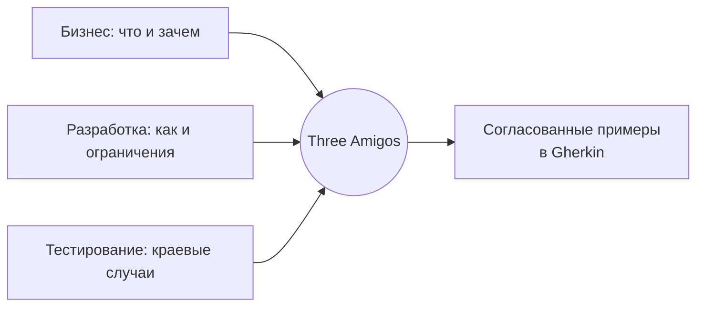

# Вопросы на собеседовании: `Cucumber и BDD`

`Cucumber` — это инструмент для Behavior-Driven Development (BDD): он позволяет описывать поведение системы на человекочитаемом языке `Gherkin` и автоматически превращать эти описания в исполняемые тесты. На собеседовании по тестированию проверяют не столько синтаксис `Given-When-Then`, сколько понимание, когда BDD оправдан, как избежать хрупких сценариев и как связать `.feature`-файлы с `Spring`-приложением.

Дата последнего обновления: 2026-06-25

## Полезные ссылки

### Официальная документация

- [Cucumber Docs: Gherkin Reference](https://cucumber.io/docs/gherkin/reference/) — справочник по синтаксису Gherkin
- [Cucumber Docs: Step Definitions](https://cucumber.io/docs/cucumber/step-definitions/) — определения шагов и Cucumber Expressions
- [Cucumber Expressions (GitHub)](https://github.com/cucumber/cucumber-expressions) — человекочитаемая альтернатива regex
- [Baeldung: Cucumber и BDD](https://www.baeldung.com/cucumber-spring-integration) — туториал

## Содержание

- [Полезные ссылки](#полезные-ссылки)
- [See also](#see-also)

**BDD-философия и основы**
- [Q1. (!) Что такое BDD и чем он отличается от TDD?](#q1--что-такое-bdd-и-чем-он-отличается-от-tdd)
- [Q2. Что такое ubiquitous language и Three Amigos?](#q2-что-такое-ubiquitous-language-и-three-amigos)
- [Q3. Что такое executable specifications и living documentation?](#q3-что-такое-executable-specifications-и-living-documentation)

**Gherkin и структура feature-файлов**
- [Q4. (!) Из чего состоит Gherkin-сценарий: Feature, Scenario, Given-When-Then?](#q4--из-чего-состоит-gherkin-сценарий-feature-scenario-given-when-then)
- [Q5. Что такое Background и когда его применять?](#q5-что-такое-background-и-когда-его-применять)
- [Q6. Декларативный или императивный стиль сценариев?](#q6-декларативный-или-императивный-стиль-сценариев)

**Step definitions и параметризация**
- [Q7. (!) Как связаны Gherkin-шаги и step definitions?](#q7--как-связаны-gherkin-шаги-и-step-definitions)
- [Q8. Cucumber Expressions против регулярных выражений?](#q8-cucumber-expressions-против-регулярных-выражений)
- [Q9. Что такое Scenario Outline и Examples?](#q9-что-такое-scenario-outline-и-examples)
- [Q10. Что такое DataTable и как его трансформировать?](#q10-что-такое-datatable-и-как-его-трансформировать)

**Hooks, теги и организация**
- [Q11. Какие бывают hooks и в каком порядке они выполняются?](#q11-какие-бывают-hooks-и-в-каком-порядке-они-выполняются)
- [Q12. Что такое теги и как фильтровать сценарии?](#q12-что-такое-теги-и-как-фильтровать-сценарии)

**Интеграция и эксплуатация**
- [Q13. (!) Как запустить Cucumber на JUnit 5?](#q13--как-запустить-cucumber-на-junit-5)
- [Q14. Как интегрировать Cucumber со Spring и шарить состояние между шагами?](#q14-как-интегрировать-cucumber-со-spring-и-шарить-состояние-между-шагами)
- [Q15. Когда BDD оправдан, а когда это overhead? Главные антипаттерны?](#q15-когда-bdd-оправдан-а-когда-это-overhead-главные-антипаттерны)

## Q1. (!) Что такое BDD и чем он отличается от TDD?

`BDD` (Behavior-Driven Development) — это практика разработки, где требования формулируются как примеры поведения системы на языке, понятном и бизнесу, и разработчикам, и тестировщикам. Эти примеры одновременно служат спецификацией и автоматическими тестами.

Ключевое отличие от `TDD`:

| Аспект | TDD | BDD |
|--------|-----|-----|
| Фокус | внутренняя реализация, единицы кода | внешнее поведение, бизнес-ценность |
| Язык теста | код (`assertTrue`, `verify`) | естественный язык (`Given-When-Then`) |
| Аудитория | разработчик | вся команда, включая non-tech |
| Гранулярность | метод/класс | фича/сценарий |
| Артефакт | unit-тесты | живая документация + acceptance-тесты |

BDD вырос из TDD и не заменяет его: на практике их сочетают — BDD описывает acceptance-критерии фичи, а unit-тесты (TDD) покрывают детали реализации.

**Подвох:** BDD — это в первую очередь про коммуникацию и общий язык, а не про конкретный инструмент. `Cucumber` — лишь один из инструментов; можно делать BDD без него (через разговоры и примеры) и можно использовать `Cucumber`, не делая настоящего BDD (если `.feature`-файлы пишет один автотестер в изоляции).

**Итог:** TDD отвечает на вопрос «правильно ли мы строим систему», BDD — «строим ли мы правильную систему».

## Q2. Что такое ubiquitous language и Three Amigos?

`Ubiquitous language` (единый язык) — это согласованный словарь предметной области, которым пользуются все участники: бизнес, разработка, тестирование. Один и тот же термин («заказ», «отгрузка», «бонус») означает одно и то же в требованиях, в коде и в тестах. В BDD этот язык напрямую попадает в `.feature`-файлы.

`Three Amigos` — это встреча трёх ролей перед разработкой фичи:

- **Бизнес** (product owner / аналитик) — что нужно и зачем.
- **Разработка** — как это технически реализуемо и какие есть ограничения.
- **Тестирование** — какие краевые случаи, что может пойти не так.



Цель встречи (обычно 30–60 минут на фичу) — выработать общее понимание и набросать конкретные примеры до начала кодирования. Именно эти примеры потом становятся сценариями.

**Подвох:** если команда пропускает разговор и пишет Gherkin постфактум в одиночку, она получает весь overhead BDD и ни одной из его выгод. Самая большая ценность BDD — не файлы, а разговор, который к ним приводит.

## Q3. Что такое executable specifications и living documentation?

`Executable specifications` (исполняемые спецификации) — это требования, записанные так, что их можно сразу запускать как тесты. В `Cucumber` `.feature`-файл одновременно и документ для бизнеса, и тест-сьют.

`Living documentation` (живая документация) — следствие: поскольку сценарии запускаются на каждой сборке, документация не может устареть. Если поведение изменилось, а сценарий не обновили — тест падает. Это решает классическую проблему «документация всегда врёт».

Как это работает на практике:

- Сценарии пишутся на `Gherkin` и хранятся в репозитории рядом с кодом.
- На CI они выполняются как тесты; падение = расхождение документации и реальности.
- Отчёты (`html`, `json`) показывают, какие фичи покрыты и проходят.

Подключить HTML-отчёт можно через plugin в runner-е:

```java
@Suite
@IncludeEngines("cucumber")
@SelectClasspathResource("features")
@ConfigurationParameter(
    key = PLUGIN_PROPERTY_NAME,
    value = "html:target/cucumber-report.html, json:target/cucumber.json")
public class RunCucumberTest {
}
```

**Подвох:** живой документация остаётся только при дисциплине. Если сценарии написаны императивно (через клики по UI) и часто падают по техническим причинам, команда начинает их игнорировать или отключать — и документация снова «умирает».

## Q4. (!) Из чего состоит Gherkin-сценарий: Feature, Scenario, Given-When-Then?

`Gherkin` — это структурированный текстовый язык с набором ключевых слов. Базовая иерархия: один файл = одна `Feature`, внутри которой несколько `Scenario`, каждый из шагов.

```gherkin
Feature: Перевод денег между счетами
  Как клиент банка
  Я хочу переводить деньги между своими счетами

  Scenario: Успешный перевод при достаточном балансе
    Given на счёте "A" лежит 1000 рублей
    And на счёте "B" лежит 0 рублей
    When я перевожу 300 рублей со счёта "A" на счёт "B"
    Then на счёте "A" останется 700 рублей
    But на счёте "B" окажется 300 рублей
```

Назначение ключевых слов:

- **`Feature`** — заголовок фичи и свободное описание (зачем она нужна).
- **`Scenario`** — конкретный пример поведения.
- **`Given`** — предусловие, исходное состояние мира.
- **`When`** — действие, событие-триггер.
- **`Then`** — ожидаемый результат, проверка.
- **`And` / `But`** — продолжение предыдущего шага того же типа; на семантику не влияют, только на читаемость. Для `Cucumber` `And` после `Given` — это тоже `Given`.

**Подвох на собеседовании:** `And` и `But` не имеют собственной логики — они подхватывают тип предыдущего ключевого слова. Не нужно искать step definition «для `And`»; шаг матчится по тексту, а не по ключевому слову.

**Итог:** структура `Given-When-Then` повторяет паттерн `arrange-act-assert` из unit-тестов, но на языке предметной области.

## Q5. Что такое Background и когда его применять?

`Background` — это блок шагов, который выполняется перед **каждым** сценарием в feature-файле. Он вытаскивает общие предусловия из всех сценариев в одно место, чтобы не дублировать одинаковые `Given`.

```gherkin
Feature: Корзина покупок

  Background:
    Given пользователь авторизован
    And каталог содержит товар "Книга" по цене 500

  Scenario: Добавление товара в корзину
    When пользователь добавляет "Книга" в корзину
    Then в корзине 1 товар

  Scenario: Очистка корзины
    Given в корзине есть "Книга"
    When пользователь очищает корзину
    Then корзина пуста
```

Когда применять:

- Когда несколько сценариев в файле требуют одинаковой подготовки.
- Когда предусловие важно для понимания сценария (в отличие от `@Before`-hook, `Background` виден в `.feature`).

**Подвох:** не превращайте `Background` в свалку технического сетапа. Если шаги не помогают читателю понять сценарий, их лучше спрятать в hook (`@Before`). И не злоупотребляйте: длинный `Background` усложняет чтение, потому что выполняется молча перед каждым сценарием.

## Q6. Декларативный или императивный стиль сценариев?

Это один из самых частых вопросов о качестве Gherkin.

| | Императивный | Декларативный |
|--|--------------|---------------|
| Описывает | КАК (шаги UI) | ЧТО (бизнес-намерение) |
| Пример шага | `When я кликаю кнопку "Войти"` | `When клиент входит в систему` |
| Хрупкость | высокая (ломается при смене UI) | низкая |
| Читаемость для бизнеса | низкая | высокая |

Императивный пример (плохо):

```gherkin
  When я ввожу "user" в поле "login"
  And я ввожу "pass" в поле "password"
  And я нажимаю кнопку "Submit"
  Then я вижу элемент с id "welcome"
```

Декларативный пример (хорошо):

```gherkin
  When клиент входит как зарегистрированный пользователь
  Then он попадает на главную страницу
```

Декларативный стиль предпочтителен: сценарий говорит на языке бизнеса, не привязан к деталям интерфейса и не ломается при перерисовке формы. Детали «как именно ввести логин» прячутся в step definitions и page object.

**Подвох:** команды скатываются в императивный стиль под дедлайн или когда непонятно, как обобщить несколько шагов в один декларативный. Это главный источник хрупких и нечитаемых `.feature`-файлов.

**Вывод:** Gherkin должен читаться как требование, а не как инструкция для робота.

## Q7. (!) Как связаны Gherkin-шаги и step definitions?

Текст шага в `.feature` сам по себе ничего не делает — он лишь матчится с методом-обработчиком, который называется **step definition**. Связь идёт по строковому шаблону, а не по имени метода.

```java
public class TransferSteps {

    private Account a;
    private Account b;

    @Given("на счёте {string} лежит {int} рублей")
    public void accountHasBalance(String name, int amount) {
        // создаём счёт с балансом
    }

    @When("я перевожу {int} рублей со счёта {string} на счёт {string}")
    public void transfer(int amount, String from, String to) {
        // выполняем перевод
    }

    @Then("на счёте {string} останется {int} рублей")
    public void accountBalanceIs(String name, int expected) {
        assertEquals(expected, balanceOf(name));
    }
}
```

Ключевые моменты:

- Аннотации `@Given`/`@When`/`@Then` импортируются из `io.cucumber.java.<lang>` (например `io.cucumber.java.en` или локализованный пакет).
- Тип ключевого слова в коде не строг: `Cucumber` сматчит шаг `Given ...` и с `@When`-методом, если совпадёт текст. Аннотации различаются для читаемости, а не для логики.
- Параметр `glue` в runner-е указывает пакет, где `Cucumber` ищет step definitions.
- Один step definition можно переиспользовать в десятках сценариев — в этом и сила: пишем шаг один раз.

**Подвох:** дублирование step definitions с почти одинаковым текстом ломает матчинг (`AmbiguousStepDefinitionsException`) либо плодит копипасту. Шаги нужно проектировать на переиспользование.

## Q8. Cucumber Expressions против регулярных выражений?

Шаблон в step definition можно писать двумя способами: как регулярное выражение или как `Cucumber Expression`. Это альтернатива с более простым синтаксисом.

| | Cucumber Expressions | Регулярные выражения |
|--|----------------------|----------------------|
| Синтаксис | `{int}`, `{string}`, `{word}` | `(\d+)`, `"([^"]*)"` |
| Читаемость | высокая, тип виден явно | ниже, нужно знать regex |
| Мощность | базовые типы и кастомные `{type}` | максимальная гибкость |
| Когда выбрать | большинство шагов | сложный матчинг текста |

Встроенные parameter types: `{int}`, `{long}`, `{float}`, `{double}`, `{word}`, `{string}` (текст в кавычках), `{}` (anonymous).

Свой parameter type регистрируется через `@ParameterType` — это позволяет матчить шаг прямо в доменный объект:

```java
@ParameterType("active|inactive|deleted")
public Status status(String value) {
    return Status.valueOf(value.toUpperCase());
}

@When("счёт переходит в статус {status}")
public void accountBecomes(Status status) {
    account.setStatus(status);
}
```

Regex никуда не делся и даже улучшен: захват `(\d+)` автоматически преобразуется в `int` благодаря встроенному типу `{int}`.

**Подвох:** в одном проекте лучше держать единый стиль. Cucumber Expressions проще читаются и подсказывают snippet-ы для незаданных шагов; regex берут только там, где нужен по-настоящему сложный матчинг.

## Q9. Что такое Scenario Outline и Examples?

`Scenario Outline` — это шаблон сценария, параметризованный таблицей `Examples`. Он избавляет от копипасты, когда одно и то же поведение надо проверить на нескольких наборах данных. Это data-driven вариант сценария.

```gherkin
  Scenario Outline: Валидация суммы перевода
    Given на счёте "A" лежит 1000 рублей
    When я перевожу <amount> рублей
    Then результат перевода — "<result>"

    Examples:
      | amount | result    |
      | 500    | успех     |
      | 1000   | успех     |
      | 1500   | ошибка    |
      | -100   | ошибка    |
```

Как работает:

- Плейсхолдеры `<amount>`, `<result>` в шагах подставляются из колонок таблицы.
- Cucumber запускает сценарий по одному разу на каждую строку `Examples` (кроме заголовка).
- В отчёте каждая строка — отдельный результат.

**Подвох:** `Scenario Outline` без `Examples` не имеет смысла и приведёт к ошибке. Не путайте `Examples` (параметризация всего сценария, строки → запуски) с `DataTable` (таблица данных внутри одного шага, см. следующий вопрос) — это разные конструкции.

**Вывод:** `Scenario Outline` — это `@ParameterizedTest` мира Gherkin.

## Q10. Что такое DataTable и как его трансформировать?

`DataTable` — это таблица, прикреплённая к **одному шагу**. В отличие от `Examples`, она не размножает сценарий, а передаёт структурированные данные в один step definition.

```gherkin
  Scenario: Импорт нескольких товаров
    When я загружаю товары:
      | название | цена | категория |
      | Книга    | 500  | Печать    |
      | Ручка    | 50   | Канцелярия|
    Then в каталоге 2 товара
```

Cucumber передаёт таблицу в метод как объект `DataTable`, который можно трансформировать тремя способами:

- **List of lists** — `List<List<String>>`, сырые ячейки.
- **List of maps** — `List<Map<String, String>>`, где ключ — заголовок колонки (удобнее всего для таблиц с шапкой).
- **Table transformer** — собственный `@DataTableType`, который маппит строку прямо в доменный объект.

```java
@When("я загружаю товары:")
public void importProducts(DataTable table) {
    List<Map<String, String>> rows = table.asMaps();
    for (Map<String, String> row : rows) {
        catalog.add(new Product(
            row.get("название"),
            Integer.parseInt(row.get("цена")),
            row.get("категория")));
    }
}
```

С `@DataTableType` можно сразу получить `List<Product>` без ручного парсинга.

**Подвох:** не используйте `DataTable` там, где нужен `Scenario Outline`. `DataTable` = данные для одного действия; `Examples` = повторение всего сценария. Путаница между ними — частая ошибка на собеседовании.

## Q11. Какие бывают hooks и в каком порядке они выполняются?

`Hooks` — это методы жизненного цикла, которые выполняются вокруг сценариев и шагов. Они не видны в `.feature` и предназначены для технического сетапа/тиардауна (открыть браузер, очистить БД, сделать скриншот).

Типы и порядок выполнения:

```mermaid
flowchart TD
    B1[@Before] --> BS[@BeforeStep]
    BS --> S[Шаг сценария]
    S --> AS[@AfterStep]
    AS --> BS2{Ещё шаги?}
    BS2 -->|да| BS
    BS2 -->|нет| A1[@After]
```

- `@Before` — перед каждым сценарием.
- `@BeforeStep` — перед каждым шагом.
- `@AfterStep` — после каждого шага.
- `@After` — после каждого сценария (выполняется даже при падении — годится для cleanup и скриншотов на ошибке).

Управление порядком и фильтрация:

- Параметр `order` задаёт очередь среди нескольких hook-ов одного типа: `@Before(order = 2)`.
- Hook можно привязать к тегу: `@Before(order = 2, value = "@Screenshots")` сработает только для сценариев с этим тегом.

```java
@After(order = 1)
public void screenshotOnFailure(Scenario scenario) {
    if (scenario.isFailed()) {
        byte[] png = driver.getScreenshotAs(OutputType.BYTES);
        scenario.attach(png, "image/png", scenario.getName());
    }
}
```

**Подвох:** если `@BeforeStep` падает, сам шаг не выполнится, но его `@AfterStep` всё равно отработает, а последующие шаги — нет; финальный `@After` гарантированно выполнится. Это важно знать для корректного cleanup.

## Q12. Что такое теги и как фильтровать сценарии?

`Tags` (теги) — это метки вида `@smoke`, `@regression`, `@slow`, которые ставятся над `Feature`, `Scenario` или `Examples`. Они позволяют группировать сценарии и выборочно запускать нужное подмножество.

```gherkin
@payment
Feature: Платежи

  @smoke
  Scenario: Успешная оплата картой
    ...

  @slow @regression
  Scenario: Оплата с 3-D Secure
    ...
```

Теги наследуются: тег на `Feature` применяется ко всем её сценариям.

Фильтрация при запуске через tag expressions:

```bash
# только smoke
mvn test -Dcucumber.filter.tags="@smoke"

# регрессия, но без медленных
mvn test -Dcucumber.filter.tags="@regression and not @slow"

# smoke или payment
mvn test -Dcucumber.filter.tags="@smoke or @payment"
```

Tag expressions поддерживают `and`, `or`, `not` и скобки. В JUnit 5 фильтр можно задать через `@ConfigurationParameter` с ключом `cucumber.filter.tags`.

**Подвох:** теги — мощный инструмент, но без дисциплины превращаются в хаос. Полезно зафиксировать соглашение (какие теги существуют и что означают) и хранить «дорогие» сценарии за `@slow`/`@nightly`, чтобы не тормозить основной pipeline.

## Q13. (!) Как запустить Cucumber на JUnit 5?

Современный способ — `cucumber-junit-platform-engine`: Cucumber становится `TestEngine` платформы JUnit 5 и запускается её раннером.

Зависимости (Maven):

```xml
<dependency>
    <groupId>io.cucumber</groupId>
    <artifactId>cucumber-java</artifactId>
    <version>7.17.0</version>
    <scope>test</scope>
</dependency>
<dependency>
    <groupId>io.cucumber</groupId>
    <artifactId>cucumber-junit-platform-engine</artifactId>
    <version>7.17.0</version>
    <scope>test</scope>
</dependency>
<dependency>
    <groupId>org.junit.platform</groupId>
    <artifactId>junit-platform-suite</artifactId>
    <scope>test</scope>
</dependency>
```

Runner через `@Suite` (из `junit-platform-suite`):

```java
import org.junit.platform.suite.api.*;
import static io.cucumber.junit.platform.engine.Constants.*;

@Suite
@IncludeEngines("cucumber")
@SelectClasspathResource("features")
@ConfigurationParameter(
    key = GLUE_PROPERTY_NAME,
    value = "com.example.steps")
@ConfigurationParameter(
    key = PLUGIN_PROPERTY_NAME,
    value = "pretty, html:target/cucumber.html")
public class RunCucumberTest {
}
```

Альтернативно сценарии конфигурируются через файл `junit-platform.properties` без класса-раннера вовсе.

**Подвох:** старая аннотация `@RunWith(Cucumber.class)` — это JUnit 4 и `cucumber-junit`. Не смешивайте её с `cucumber-junit-platform-engine`; на собеседовании ценится понимание, что для JUnit 5 нужен именно platform-engine и `@Suite`.

## Q14. Как интегрировать Cucumber со Spring и шарить состояние между шагами?

Чтобы в step definitions работала Spring DI (доступ к бинам, `@Autowired`, тестовый контекст), нужен мост между Cucumber и Spring TestContext.

Шаги интеграции:

- Подключить `cucumber-spring`.
- Создать конфигурационный класс с `@CucumberContextConfiguration` и обычными Spring-аннотациями (`@SpringBootTest`).
- Step definitions могут инжектить бины напрямую.

```java
@CucumberContextConfiguration
@SpringBootTest
public class CucumberSpringConfiguration {
}
```

```java
public class AccountSteps {

    @Autowired
    private AccountService accountService;   // настоящий Spring-бин

    @When("я перевожу {int} рублей")
    public void transfer(int amount) {
        accountService.transfer(amount);
    }
}
```

Проблема разделяемого состояния: каждый step definition — отдельный класс, но шагам одного сценария нужно общее состояние (например, текущий счёт). Решения:

- **Spring scenario scope** — бин с `@ScenarioScope` создаётся заново на каждый сценарий, и Spring инжектит один и тот же экземпляр во все step-классы, гарантируя, что состояние не утечёт между сценариями.
- **DI-контейнер вроде PicoContainer** — без Spring; объекты шарятся через конструктор-инъекцию в пределах сценария.

```java
@Component
@ScenarioScope
public class TestContext {
    private Account currentAccount;
    // getters / setters
}
```

**Подвох:** нельзя хранить состояние сценария в `static`-полях или обычных синглтон-бинах — оно протечёт в соседние сценарии и сделает тесты flaky. Изоляция на уровне сценария обязательна.

## Q15. Когда BDD оправдан, а когда это overhead? Главные антипаттерны?

BDD и Cucumber — не бесплатны: появляется лишний слой (`.feature` → step definitions → код), который нужно поддерживать. Зрелый ответ — понимать, где выгода окупает цену.

Когда BDD оправдан:

- Есть **non-tech стейкхолдеры**, которым важна читаемая спецификация (бизнес, аналитики, заказчик).
- Сложная **доменная логика** с множеством бизнес-правил и краевых случаев.
- Нужна **живая документация** acceptance-критериев.
- Команда реально проводит разговоры Three Amigos.

Когда это overhead:

- Чисто техническая логика без бизнес-аудитории — обычные `JUnit`-тесты короче и понятнее разработчику.
- `.feature` пишет один автотестер в одиночку — тогда `Gherkin` лишь усложняет то, что проще выразить кодом.
- Маленькая команда, где все и так разработчики.

| Аспект | Чистый JUnit | Cucumber/BDD |
|--------|--------------|--------------|
| Читаемость для бизнеса | низкая | высокая |
| Накладные расходы | минимум | слой Gherkin + glue |
| Скорость написания | быстро | медленнее |
| Лучшая ниша | unit, технические тесты | acceptance, бизнес-правила |

Главные антипаттерны:

- **Императивные сценарии** — клики и поля ввода вместо бизнес-намерения (см. Q6); хрупкие и нечитаемые.
- **Связанные сценарии** — один сценарий зависит от состояния, оставленного другим; ломается порядок и параллельный запуск. Каждый сценарий обязан быть независимым.
- **Gherkin в изоляции** — файлы пишутся без разговора, теряется главная ценность BDD.
- **Технический мусор в шагах** — детали реализации (SQL, селекторы) просачиваются в `.feature`.
- **Дублирование step definitions** — копипаста вместо переиспользуемых параметризованных шагов.

**Вывод:** BDD стоит своих денег ровно тогда, когда есть кому читать спецификации на естественном языке и когда они рождаются из живого разговора, а не пишутся постфактум.

---

## See also

- [Стратегии тестирования](test-strategies-interview.md) — пирамида тестов и место acceptance/BDD-тестов в ней
- [Интеграционное тестирование](integration-testing-interview.md) — где Cucumber-сценарии пересекаются с интеграционными тестами
- [JUnit](junit-interview.md) — платформа JUnit 5, на которой запускается cucumber-junit-platform-engine
- [REST Assured](rest-assured-interview.md) — проверка API внутри step definitions для REST-сценариев
- [Автоматизация тестирования](test-automation-interview.md) — место BDD в общей стратегии автоматизации
- [Selenium](selenium-interview.md) — page object и UI-драйвер для шагов Cucumber, работающих через браузер
