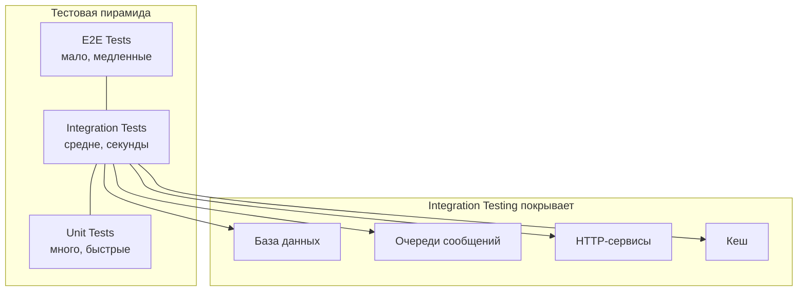
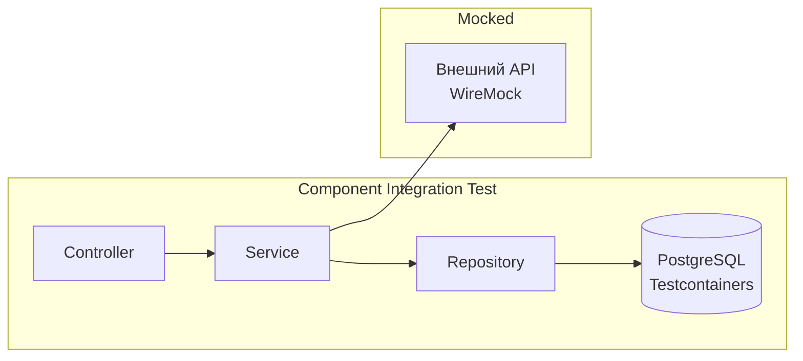
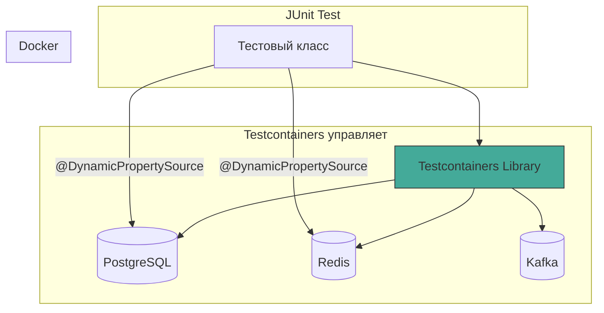
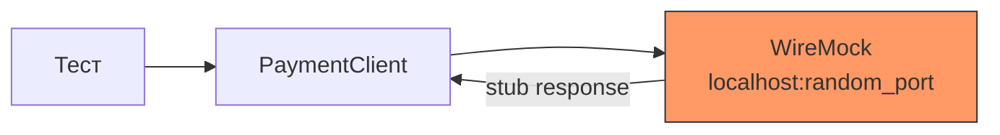
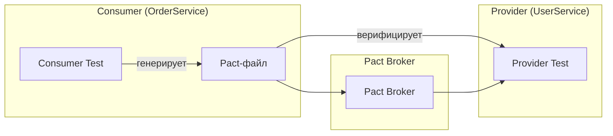
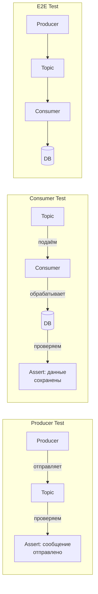
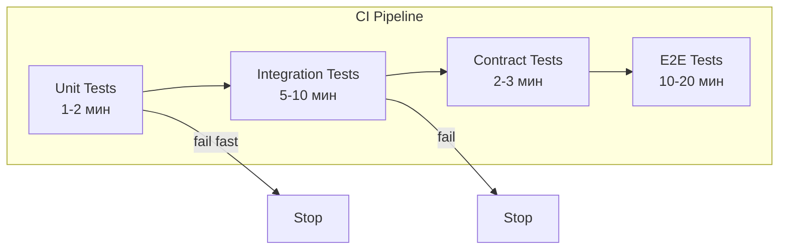

# Вопросы на собеседовании: `Integration Testing`

Интеграционное тестирование проверяет взаимодействие компонентов приложения с реальной инфраструктурой (`DB`, очереди, внешние `API`). Этот файл покрывает `Spring Boot Testing`, `Testcontainers`, `MockMvc`, `WebTestClient`, `WireMock`, контрактное тестирование и организацию тестов в `CI/CD`.

**Интеграционное тестирование** занимает среднюю часть тестовой пирамиды: проверяет реальные связки между модулями и инфраструктурой, но при этом не требует полного развёртывания всей системы.

## Полезные ссылки

### Официальная документация

- [Spring Boot Testing](https://docs.spring.io/spring-boot/docs/current/reference/html/features.html#features.testing) — официальная документация по тестированию
- [Testcontainers](https://www.testcontainers.org/) — документация Testcontainers
- [WireMock](https://wiremock.org/docs/) — мокирование HTTP-сервисов
- [Testing Pyramid](https://martinfowler.com/articles/practical-test-pyramid.html) — практическая тестовая пирамида
- [Contract Testing — Pact](https://docs.pact.io/) — контрактное тестирование
- [Baeldung: Integration Testing in Spring](https://www.baeldung.com/integration-testing-in-spring) — подробный гайд
- [Baeldung: Spring Boot Testcontainers](https://www.baeldung.com/spring-boot-testcontainers-integration-test) — Testcontainers + Spring Boot
- [Baeldung: Built-in Testcontainers Support](https://www.baeldung.com/spring-boot-built-in-testcontainers) — Spring Boot 3.1+ поддержка

## Содержание

- [Полезные ссылки](#полезные-ссылки)
- [See also](#see-also)

**Основы интеграционного тестирования**
- [Q1. (!) Что такое интеграционное тестирование и чем оно отличается от unit-тестирования?](#q1--что-такое-интеграционное-тестирование-и-чем-оно-отличается-от-unit-тестирования)
- [Q2. Какие типы интеграционного тестирования существуют?](#q2-какие-типы-интеграционного-тестирования-существуют)
- [Q3. (!) Как работает `@SpringBootTest` и когда его использовать?](#q3--как-работает-springboottest-и-когда-его-использовать)
- [Q4. (!) Что такое Test Slices и какие бывают?](#q4--что-такое-test-slices-и-какие-бывают)

**`MockMvc` и `WebTestClient`**
- [Q5. (!) Как тестировать REST-контроллеры через `MockMvc`?](#q5--как-тестировать-rest-контроллеры-через-mockmvc)
- [Q6. В чём разница между `MockMvc` с `@WebMvcTest` и `@SpringBootTest`?](#q6-в-чём-разница-между-mockmvc-с-webmvctest-и-springboottest)
- [Q7. Как использовать `WebTestClient` для реактивных и блокирующих приложений?](#q7-как-использовать-webtestclient-для-реактивных-и-блокирующих-приложений)
- [Q8. Как тестировать REST API через `TestRestTemplate`?](#q8-как-тестировать-rest-api-через-testresttemplate)

**`Testcontainers`**
- [Q9. (!) Что такое `Testcontainers` и зачем он нужен?](#q9--что-такое-testcontainers-и-зачем-он-нужен)
- [Q10. Как подключить `Testcontainers` через `@DynamicPropertySource`?](#q10-как-подключить-testcontainers-через-dynamicpropertysource)
- [Q11. (!) Что такое `@ServiceConnection` в Spring Boot 3.1+?](#q11--что-такое-serviceconnection-в-spring-boot-31)
- [Q12. Как переиспользовать контейнеры между тестовыми классами?](#q12-как-переиспользовать-контейнеры-между-тестовыми-классами)
- [Q13. Как тестировать с несколькими контейнерами одновременно?](#q13-как-тестировать-с-несколькими-контейнерами-одновременно)

**Тестирование с базами данных**
- [Q14. (!) Как тестировать с реальной базой данных?](#q14--как-тестировать-с-реальной-базой-данных)
- [Q15. Как тестировать транзакции в интеграционных тестах?](#q15-как-тестировать-транзакции-в-интеграционных-тестах)
- [Q16. Как управлять тестовыми данными через `@Sql` и Flyway?](#q16-как-управлять-тестовыми-данными-через-sql-и-flyway)
- [Q17. В чём опасность `@Transactional` на интеграционных тестах?](#q17-в-чём-опасность-transactional-на-интеграционных-тестах)

**Мокирование внешних сервисов**
- [Q18. (!) Как использовать `WireMock` для мокирования HTTP-сервисов?](#q18--как-использовать-wiremock-для-мокирования-http-сервисов)
- [Q19. В чём разница между `@MockBean` и `@SpyBean`?](#q19-в-чём-разница-между-mockbean-и-spybean)
- [Q20. Как тестировать с `WireMock`: сценарии ошибок и задержки?](#q20-как-тестировать-с-wiremock-сценарии-ошибок-и-задержки)

**Contract Testing и микросервисы**
- [Q21. (!) Что такое контрактное тестирование?](#q21--что-такое-контрактное-тестирование)
- [Q22. Как работает Consumer-Driven Contract Testing с Pact?](#q22-как-работает-consumer-driven-contract-testing-с-pact)
- [Q23. Как использовать Spring Cloud Contract?](#q23-как-использовать-spring-cloud-contract)
- [Q24. Как тестировать микросервисы в изоляции?](#q24-как-тестировать-микросервисы-в-изоляции)

**Kafka, асинхронность и messaging**
- [Q25. (!) Как тестировать Kafka с Testcontainers?](#q25--как-тестировать-kafka-с-testcontainers)
- [Q26. Как тестировать асинхронные операции?](#q26-как-тестировать-асинхронные-операции)
- [Q27. Как тестировать message-driven архитектуру?](#q27-как-тестировать-message-driven-архитектуру)

**Организация и CI/CD**
- [Q28. Как организовать интеграционные тесты в CI/CD?](#q28-как-организовать-интеграционные-тесты-в-cicd)
- [Q29. Как ускорить интеграционные тесты?](#q29-как-ускорить-интеграционные-тесты)
- [Q30. Как организовать параллельное выполнение тестов?](#q30-как-организовать-параллельное-выполнение-тестов)

**Стабильность и Best Practices**
- [Q31. (!) Как бороться с flaky-тестами?](#q31--как-бороться-с-flaky-тестами)
- [Q32. Что такое Test Fixtures и как их организовать?](#q32-что-такое-test-fixtures-и-как-их-организовать)
- [Q33. Как тестировать кеширование?](#q33-как-тестировать-кеширование)
- [Q34. Что такое Smoke Testing после деплоя?](#q34-что-такое-smoke-testing-после-деплоя)
- [Q35. (!) Какие best practices для интеграционного тестирования?](#q35--какие-best-practices-для-интеграционного-тестирования)

**Продвинутые техники**
- [Q36. (!) Как использовать `@DataJpaTest` для тестирования репозиториев?](#q36--как-использовать-datajpatest-для-тестирования-репозиториев)
- [Q37. Как тестировать JSON-сериализацию с `@JsonTest`?](#q37-как-тестировать-json-сериализацию-с-jsontest)
- [Q38. (!) Как использовать `RestAssured` для интеграционных API-тестов?](#q38--как-использовать-restassured-для-интеграционных-api-тестов)
- [Q39. Как тестировать Spring Security в интеграционных тестах?](#q39-как-тестировать-spring-security-в-интеграционных-тестах)
- [Q40. Как использовать `@RestClientTest` для тестирования HTTP-клиентов?](#q40-как-использовать-restclienttest-для-тестирования-http-клиентов)

---

## Q1. (!) Что такое интеграционное тестирование и чем оно отличается от `unit`-тестирования?

**Интеграционное тестирование** (`integration testing`) -- это уровень тестирования, при котором несколько компонентов объединяются и проверяется корректность их взаимодействия с реальными зависимостями (БД, очереди, HTTP-сервисы).

### Отличия от `unit testing`

| Аспект | `Unit Testing` | `Integration Testing` |
|--------|---------------|----------------------|
| Scope | Один класс/метод | Группа компонентов + инфраструктура |
| Зависимости | `Mock`/`stub` | Реальные (`DB`, `Kafka`, `Redis`) |
| Скорость | Миллисекунды | Секунды-минуты |
| Изоляция | Полная | Частичная |
| Настройка | Минимальная | `Docker`, конфигурация, данные |
| Стабильность | Высокая | Может быть flaky |
| Цель | Логика, алгоритмы | Интеграция, контракты, SQL |



### Пример: `unit` vs `integration`

```java
// Unit-тест — тестируем только бизнес-логику
@Test
void shouldCalculateDiscount() {
    DiscountService service = new DiscountService();

    BigDecimal discount = service.calculateDiscount(
        BigDecimal.valueOf(100), UserType.PREMIUM);

    assertEquals(BigDecimal.valueOf(15.00), discount);
}

// Integration-тест — тестируем взаимодействие с БД
@SpringBootTest
@Testcontainers
class OrderIntegrationTest {

    @Container
    static PostgreSQLContainer<?> postgres =
        new PostgreSQLContainer<>("postgres:16");

    @DynamicPropertySource
    static void props(DynamicPropertyRegistry r) {
        r.add("spring.datasource.url", postgres::getJdbcUrl);
    }

    @Autowired
    private OrderService orderService;

    @Test
    void shouldSaveOrderWithDiscount() {
        Order order = orderService.createOrder(userId, productId, 1);

        assertNotNull(order.getId());
        assertEquals(BigDecimal.valueOf(850), order.getTotalPrice());
        assertEquals(OrderStatus.CONFIRMED, order.getStatus());
    }
}
```

Интеграционные тесты нужны когда: (1) проверяется взаимодействие с БД (SQL-запросы, маппинг); (2) тестируется HTTP-клиент к внешнему сервису; (3) проверяется корректность конфигурации `Spring`; (4) тестируется транзакционная логика.

## Q2. Какие типы интеграционного тестирования существуют?

### 1. Big Bang

Все компоненты интегрируются одновременно. Просто в реализации, но трудно локализовать ошибки.

### 2. Top-Down

Начинаем с верхних слоёв (`API`/`UI`) и спускаемся вниз, используя `stub` для нижних уровней. Раннее тестирование пользовательских сценариев.

### 3. Bottom-Up

Начинаем с нижних слоёв (`Repository`, `Service`) и поднимаемся. Нижние уровни проверены первыми, не нужны stub.

### 4. Sandwich / Hybrid

Комбинация `top-down` и `bottom-up`. Параллельное тестирование разных уровней.

### 5. Component Integration (рекомендуемый для Spring)

Тестирование группы связанных компонентов как единого блока. В `Spring Boot` это реализуется через `@SpringBootTest` или test slices (`@WebMvcTest`, `@DataJpaTest`).



На собеседовании обычно спрашивают не о классификации, а о практическом подходе: какие слои тестируете вместе, какие мокируете, и почему.

## Q3. (!) Как работает `@SpringBootTest` и когда его использовать?

`@SpringBootTest` поднимает **полный** `ApplicationContext` приложения (или его подмножество). Это самый тяжёлый, но и самый полный вариант интеграционного теста.

### Режимы `webEnvironment`

| Режим | Что делает | Когда использовать |
|-------|-----------|-------------------|
| `MOCK` (default) | `MockServletContext`, нет HTTP-сервера | Тесты через `MockMvc` |
| `RANDOM_PORT` | Запуск реального HTTP-сервера | Тесты через `TestRestTemplate`/`WebTestClient` |
| `DEFINED_PORT` | HTTP на порту из `application.yml` | Редко, конфликт портов |
| `NONE` | Без web-окружения | Тесты сервисного слоя |

```java
// Полный контекст с реальным сервером
@SpringBootTest(webEnvironment = SpringBootTest.WebEnvironment.RANDOM_PORT)
@Testcontainers
class FullIntegrationTest {

    @Container
    static PostgreSQLContainer<?> postgres =
        new PostgreSQLContainer<>("postgres:16");

    @DynamicPropertySource
    static void props(DynamicPropertyRegistry registry) {
        registry.add("spring.datasource.url", postgres::getJdbcUrl);
        registry.add("spring.datasource.username", postgres::getUsername);
        registry.add("spring.datasource.password", postgres::getPassword);
    }

    @Autowired
    private TestRestTemplate restTemplate;

    @Test
    void shouldCreateUser() {
        var request = new UserRequest("john@example.com", "secret");

        ResponseEntity<UserResponse> response = restTemplate
            .postForEntity("/api/users", request, UserResponse.class);

        assertEquals(HttpStatus.CREATED, response.getStatusCode());
        assertNotNull(response.getBody().getId());
    }
}
```

### Когда НЕ использовать `@SpringBootTest`

- Для тестирования **только** контроллера -- используйте `@WebMvcTest`
- Для тестирования **только** репозитория -- используйте `@DataJpaTest`
- Для тестирования бизнес-логики без Spring -- обычный `unit`-тест

`@SpringBootTest` поднимает все бины, что медленно. Подробнее о test slices -- в [вопросах по unit-тестированию](unit-testing-interview.md).

## Q4. (!) Что такое `Test Slices` и какие бывают?

**Test Slices** -- аннотации Spring Boot, которые поднимают **только нужный срез** `ApplicationContext`, а не всё приложение. Это значительно ускоряет тесты.

### Основные test slices

| Аннотация | Что поднимает | Для чего |
|-----------|--------------|---------|
| `@WebMvcTest` | Контроллеры, `MockMvc`, фильтры | REST-контроллеры |
| `@DataJpaTest` | `JPA`, `EntityManager`, `Repositories` | Репозитории, SQL |
| `@DataJdbcTest` | `JDBC`, `JdbcTemplate` | JDBC-репозитории |
| `@JdbcTest` | `DataSource`, `JdbcTemplate` | Чистый JDBC |
| `@DataMongoTest` | MongoDB repositories | MongoDB |
| `@DataRedisTest` | Redis repositories | Redis |
| `@JsonTest` | `ObjectMapper`, `JacksonTester` | JSON сериализация |
| `@RestClientTest` | `RestTemplateBuilder`, `MockRestServiceServer` | REST-клиенты |
| `@WebFluxTest` | `WebFlux` контроллеры, `WebTestClient` | Reactive endpoints |

```java
// @DataJpaTest — только JPA-слой, embedded H2 по умолчанию
@DataJpaTest
@AutoConfigureTestDatabase(replace = AutoConfigureTestDatabase.Replace.NONE)
@Testcontainers
class UserRepositoryTest {

    @Container
    static PostgreSQLContainer<?> postgres =
        new PostgreSQLContainer<>("postgres:16");

    @DynamicPropertySource
    static void props(DynamicPropertyRegistry r) {
        r.add("spring.datasource.url", postgres::getJdbcUrl);
        r.add("spring.datasource.username", postgres::getUsername);
        r.add("spring.datasource.password", postgres::getPassword);
    }

    @Autowired
    private UserRepository userRepository;

    @Autowired
    private TestEntityManager entityManager;

    @Test
    void shouldFindByEmail() {
        entityManager.persistAndFlush(
            new User("john@example.com", "password"));

        Optional<User> found = userRepository.findByEmail("john@example.com");

        assertTrue(found.isPresent());
        assertEquals("john@example.com", found.get().getEmail());
    }
}
```

Ключевое: `@DataJpaTest` по умолчанию заменяет `DataSource` на `H2`. Чтобы использовать реальную БД через `Testcontainers`, нужно `@AutoConfigureTestDatabase(replace = NONE)`.

## Q5. (!) Как тестировать REST-контроллеры через `MockMvc`?

`MockMvc` выполняет HTTP-запросы **без реального сервера** -- запросы идут через `DispatcherServlet` в памяти. Это быстрее, чем поднимать HTTP.

```java
@WebMvcTest(UserController.class)
class UserControllerTest {

    @Autowired
    private MockMvc mockMvc;

    @MockBean
    private UserService userService;

    @Test
    void shouldReturnUser() throws Exception {
        when(userService.findById(1L))
            .thenReturn(new UserDto(1L, "John", "john@example.com"));

        mockMvc.perform(get("/api/users/1")
                .accept(MediaType.APPLICATION_JSON))
            .andExpect(status().isOk())
            .andExpect(jsonPath("$.name").value("John"))
            .andExpect(jsonPath("$.email").value("john@example.com"));
    }

    @Test
    void shouldReturn404WhenUserNotFound() throws Exception {
        when(userService.findById(99L))
            .thenThrow(new UserNotFoundException(99L));

        mockMvc.perform(get("/api/users/99"))
            .andExpect(status().isNotFound())
            .andExpect(jsonPath("$.message").value("User not found: 99"));
    }

    @Test
    void shouldValidateInput() throws Exception {
        String invalidJson = """
            {"name": "", "email": "not-an-email"}
            """;

        mockMvc.perform(post("/api/users")
                .contentType(MediaType.APPLICATION_JSON)
                .content(invalidJson))
            .andExpect(status().isBadRequest())
            .andExpect(jsonPath("$.errors").isArray());
    }
}
```

`@WebMvcTest` поднимает только web-слой: контроллеры, `@ControllerAdvice`, фильтры, конвертеры. Все зависимости контроллера нужно мокировать через `@MockBean`.

## Q6. В чём разница между `MockMvc` с `@WebMvcTest` и `@SpringBootTest`?

| Аспект | `@WebMvcTest` + `MockMvc` | `@SpringBootTest` + `MockMvc` |
|--------|--------------------------|-------------------------------|
| Контекст | Только web-слой | Полный `ApplicationContext` |
| Сервисы | `@MockBean` (моки) | Реальные бины |
| БД | Нет | Реальная (Testcontainers) |
| Скорость | Быстро (< 1 сек) | Медленно (5-15 сек) |
| Цель | Тест контроллера в изоляции | Полный сквозной тест через HTTP |

```java
// @SpringBootTest + MockMvc — полный сквозной тест
@SpringBootTest
@AutoConfigureMockMvc
@Testcontainers
class UserApiIntegrationTest {

    @Container
    static PostgreSQLContainer<?> postgres =
        new PostgreSQLContainer<>("postgres:16");

    @DynamicPropertySource
    static void props(DynamicPropertyRegistry r) {
        r.add("spring.datasource.url", postgres::getJdbcUrl);
        r.add("spring.datasource.username", postgres::getUsername);
        r.add("spring.datasource.password", postgres::getPassword);
    }

    @Autowired
    private MockMvc mockMvc;

    @Test
    void shouldCreateAndRetrieveUser() throws Exception {
        // Create
        String json = """
            {"name": "John", "email": "john@example.com"}
            """;

        String location = mockMvc.perform(post("/api/users")
                .contentType(MediaType.APPLICATION_JSON)
                .content(json))
            .andExpect(status().isCreated())
            .andReturn().getResponse().getHeader("Location");

        // Retrieve — реальный сервис + реальная БД
        mockMvc.perform(get(location))
            .andExpect(status().isOk())
            .andExpect(jsonPath("$.name").value("John"));
    }
}
```

На собеседовании важно: `@WebMvcTest` -- для юнит-тестов контроллера (моки сервисов). `@SpringBootTest` + `@AutoConfigureMockMvc` -- для интеграционных тестов, где нужна реальная БД и реальные сервисы.

## Q7. Как использовать `WebTestClient` для реактивных и блокирующих приложений?

`WebTestClient` -- клиент из `Spring WebFlux` для тестирования HTTP-эндпоинтов. Работает с реактивными и с обычными `Spring MVC` приложениями (начиная с Spring Boot 2.4+).

```java
// С реальным сервером (RANDOM_PORT)
@SpringBootTest(webEnvironment = SpringBootTest.WebEnvironment.RANDOM_PORT)
@Testcontainers
class UserApiWebTestClientTest {

    @Container
    static PostgreSQLContainer<?> postgres =
        new PostgreSQLContainer<>("postgres:16");

    @DynamicPropertySource
    static void props(DynamicPropertyRegistry r) {
        r.add("spring.datasource.url", postgres::getJdbcUrl);
    }

    @Autowired
    private WebTestClient webTestClient;

    @Test
    void shouldCreateUser() {
        webTestClient.post().uri("/api/users")
            .contentType(MediaType.APPLICATION_JSON)
            .bodyValue(new UserRequest("John", "john@example.com"))
            .exchange()
            .expectStatus().isCreated()
            .expectBody()
            .jsonPath("$.id").isNotEmpty()
            .jsonPath("$.name").isEqualTo("John");
    }

    @Test
    void shouldReturnUserList() {
        webTestClient.get().uri("/api/users")
            .exchange()
            .expectStatus().isOk()
            .expectBodyList(UserResponse.class)
            .hasSize(3)
            .value(users -> {
                assertTrue(users.stream()
                    .anyMatch(u -> u.getEmail().equals("john@example.com")));
            });
    }
}
```

Преимущество `WebTestClient` перед `TestRestTemplate`: fluent API, поддержка реактивных типов (`Mono`, `Flux`), лучшая поддержка streaming. Подробнее о реактивном тестировании -- в [вопросах по Spring WebFlux](../frameworks/spring/spring-webflux-interview.md).

## Q8. Как тестировать REST API через `TestRestTemplate`?

`TestRestTemplate` -- обёртка над `RestTemplate` для тестов с реальным HTTP-сервером (требует `RANDOM_PORT` или `DEFINED_PORT`).

```java
@SpringBootTest(webEnvironment = SpringBootTest.WebEnvironment.RANDOM_PORT)
class UserApiTemplateTest {

    @Autowired
    private TestRestTemplate restTemplate;

    @Test
    void shouldCreateUser() {
        UserRequest request = new UserRequest("john@example.com", "secret");

        ResponseEntity<UserResponse> response = restTemplate
            .postForEntity("/api/users", request, UserResponse.class);

        assertEquals(HttpStatus.CREATED, response.getStatusCode());
        assertNotNull(response.getBody().getId());
    }

    @Test
    void shouldHandleAuthentication() {
        // TestRestTemplate с Basic Auth
        ResponseEntity<UserResponse> response = restTemplate
            .withBasicAuth("admin", "password")
            .getForEntity("/api/admin/users/1", UserResponse.class);

        assertEquals(HttpStatus.OK, response.getStatusCode());
    }

    @Test
    void shouldHandleErrors() {
        ResponseEntity<ErrorResponse> response = restTemplate
            .getForEntity("/api/users/999", ErrorResponse.class);

        assertEquals(HttpStatus.NOT_FOUND, response.getStatusCode());
    }
}
```

`TestRestTemplate` не бросает исключения при 4xx/5xx (в отличие от обычного `RestTemplate`), что удобно для проверки ошибочных сценариев.

## Q9. (!) Что такое `Testcontainers` и зачем он нужен?

`Testcontainers` -- Java-библиотека для запуска `Docker`-контейнеров в `JUnit`-тестах. Позволяет тестировать с реальными базами данных, очередями и другими сервисами вместо in-memory заменителей.



### Преимущества перед `H2` / embedded

| Аспект | `H2` (embedded) | `Testcontainers` |
|--------|-----------------|-------------------|
| SQL-совместимость | Отличается от production | Идентична production |
| Специфичные фичи | Не поддерживает (`JSONB`, `ARRAY`) | Полная поддержка |
| Настройка | Зависимость в `pom.xml` | Нужен `Docker` |
| Скорость | Быстро | Старт контейнера 2-5 сек |
| Надёжность результата | Может пропустить баг | Ловит реальные проблемы |

```java
@SpringBootTest
@Testcontainers
class ProductRepositoryTest {

    @Container
    static PostgreSQLContainer<?> postgres =
        new PostgreSQLContainer<>("postgres:16-alpine")
            .withDatabaseName("testdb")
            .withUsername("test")
            .withPassword("test");

    @DynamicPropertySource
    static void props(DynamicPropertyRegistry registry) {
        registry.add("spring.datasource.url", postgres::getJdbcUrl);
        registry.add("spring.datasource.username", postgres::getUsername);
        registry.add("spring.datasource.password", postgres::getPassword);
    }

    @Autowired
    private ProductRepository productRepository;

    @Test
    void shouldUsePostgresJsonb() {
        // Тестируем PostgreSQL-специфичный JSONB
        Product product = new Product("Laptop", Map.of(
            "cpu", "Intel i7",
            "ram", "16GB"
        ));
        productRepository.save(product);

        List<Product> found = productRepository
            .findByAttributesContaining("cpu", "Intel");
        assertEquals(1, found.size());
    }
}
```

## Q10. Как подключить `Testcontainers` через `@DynamicPropertySource`?

`@DynamicPropertySource` позволяет динамически задать `Spring`-свойства **после** старта контейнера (порт и хост неизвестны заранее).

```java
@SpringBootTest
@Testcontainers
class MultiContainerTest {

    @Container
    static PostgreSQLContainer<?> postgres =
        new PostgreSQLContainer<>("postgres:16");

    @Container
    static GenericContainer<?> redis =
        new GenericContainer<>("redis:7-alpine")
            .withExposedPorts(6379);

    @DynamicPropertySource
    static void configureProperties(DynamicPropertyRegistry registry) {
        // PostgreSQL
        registry.add("spring.datasource.url", postgres::getJdbcUrl);
        registry.add("spring.datasource.username", postgres::getUsername);
        registry.add("spring.datasource.password", postgres::getPassword);

        // Redis
        registry.add("spring.data.redis.host", redis::getHost);
        registry.add("spring.data.redis.port", redis::getFirstMappedPort);
    }

    @Autowired
    private UserRepository userRepository;

    @Autowired
    private StringRedisTemplate redisTemplate;

    @Test
    void shouldWorkWithBothServices() {
        // PostgreSQL
        User user = userRepository.save(new User("john@example.com"));
        assertNotNull(user.getId());

        // Redis
        redisTemplate.opsForValue().set("user:" + user.getId(), "cached");
        assertEquals("cached",
            redisTemplate.opsForValue().get("user:" + user.getId()));
    }
}
```

Правила: метод с `@DynamicPropertySource` должен быть `static`; контейнер должен быть запущен **до** вызова метода (аннотация `@Container` + `static` поле гарантирует это).

## Q11. (!) Что такое `@ServiceConnection` в Spring Boot 3.1+?

Начиная с Spring Boot 3.1, появилась аннотация `@ServiceConnection`, которая **автоматически** конфигурирует свойства подключения к контейнеру без ручного `@DynamicPropertySource`.

```java
// До Spring Boot 3.1 — ручная конфигурация
@Container
static PostgreSQLContainer<?> postgres =
    new PostgreSQLContainer<>("postgres:16");

@DynamicPropertySource
static void props(DynamicPropertyRegistry r) {
    r.add("spring.datasource.url", postgres::getJdbcUrl);
    r.add("spring.datasource.username", postgres::getUsername);
    r.add("spring.datasource.password", postgres::getPassword);
}

// Spring Boot 3.1+ — автоматическая конфигурация
@Container
@ServiceConnection
static PostgreSQLContainer<?> postgres =
    new PostgreSQLContainer<>("postgres:16");
// Всё! Spring Boot сам настроит DataSource
```

### Поддерживаемые контейнеры

`@ServiceConnection` работает через `ConnectionDetails` SPI и поддерживает: `PostgreSQL`, `MySQL`, `MariaDB`, `MongoDB`, `Redis`, `Kafka`, `RabbitMQ`, `Elasticsearch`, `Cassandra` и другие.

```java
@SpringBootTest
@Testcontainers
class ModernTestcontainersTest {

    @Container
    @ServiceConnection
    static PostgreSQLContainer<?> postgres =
        new PostgreSQLContainer<>("postgres:16");

    @Container
    @ServiceConnection
    static GenericContainer<?> redis =
        new GenericContainer<>("redis:7-alpine")
            .withExposedPorts(6379);

    @Autowired
    private UserRepository userRepository;

    @Test
    void shouldAutoConfigureConnections() {
        // Никакого @DynamicPropertySource!
        User user = userRepository.save(new User("john@example.com"));
        assertNotNull(user.getId());
    }
}
```

### Testcontainers для DevServices (Spring Boot 3.1+)

`@TestConfiguration` с `@ServiceConnection` позволяет определить контейнеры в отдельном классе и использовать их при локальном запуске приложения:

```java
@TestConfiguration(proxyBeanMethods = false)
public class TestcontainersConfig {

    @Bean
    @ServiceConnection
    PostgreSQLContainer<?> postgresContainer() {
        return new PostgreSQLContainer<>("postgres:16");
    }

    @Bean
    @ServiceConnection
    GenericContainer<?> redisContainer() {
        return new GenericContainer<>("redis:7-alpine")
            .withExposedPorts(6379);
    }
}

// Использование: ./gradlew bootTestRun
// или в тестах:
@SpringBootTest
@Import(TestcontainersConfig.class)
class MyTest { ... }
```

## Q12. Как переиспользовать контейнеры между тестовыми классами?

По умолчанию каждый тестовый класс с `@Container` запускает **новый** контейнер. Это медленно. Решения:

### 1. Singleton-паттерн (абстрактный базовый класс)

```java
// Базовый класс — контейнер запускается один раз на все тесты
public abstract class AbstractIntegrationTest {

    static final PostgreSQLContainer<?> POSTGRES;

    static {
        POSTGRES = new PostgreSQLContainer<>("postgres:16")
            .withDatabaseName("testdb");
        POSTGRES.start(); // Запуск один раз
    }

    @DynamicPropertySource
    static void props(DynamicPropertyRegistry r) {
        r.add("spring.datasource.url", POSTGRES::getJdbcUrl);
        r.add("spring.datasource.username", POSTGRES::getUsername);
        r.add("spring.datasource.password", POSTGRES::getPassword);
    }
}

// Тесты наследуют базовый класс
@SpringBootTest
class UserServiceTest extends AbstractIntegrationTest {

    @Autowired
    private UserService userService;

    @Test
    void shouldCreateUser() {
        User user = userService.create("john@example.com");
        assertNotNull(user.getId());
    }
}
```

### 2. Reusable Containers (Testcontainers 1.19+)

```java
// В ~/.testcontainers.properties:
// testcontainers.reuse.enable=true

@Container
static PostgreSQLContainer<?> postgres =
    new PostgreSQLContainer<>("postgres:16")
        .withReuse(true); // Контейнер НЕ удаляется после тестов
```

`withReuse(true)` -- контейнер остаётся после завершения тестов и переиспользуется при следующем запуске. Полезно для локальной разработки, но **не рекомендуется** для CI (риск грязного состояния).

## Q13. Как тестировать с несколькими контейнерами одновременно?

```java
@SpringBootTest
@Testcontainers
class MultiServiceIntegrationTest {

    @Container
    @ServiceConnection
    static PostgreSQLContainer<?> postgres =
        new PostgreSQLContainer<>("postgres:16");

    @Container
    @ServiceConnection
    static KafkaContainer kafka =
        new KafkaContainer(DockerImageName.parse("confluentinc/cp-kafka:7.5.0"));

    @Container
    static GenericContainer<?> redis =
        new GenericContainer<>("redis:7-alpine")
            .withExposedPorts(6379);

    @DynamicPropertySource
    static void redisProps(DynamicPropertyRegistry r) {
        r.add("spring.data.redis.host", redis::getHost);
        r.add("spring.data.redis.port", redis::getFirstMappedPort);
    }

    @Autowired
    private OrderService orderService;

    @Test
    void shouldProcessOrderWithAllServices() {
        // Использует PostgreSQL для хранения,
        // Kafka для событий, Redis для кеша
        Order order = orderService.createOrder(userId, productId, 1);

        assertNotNull(order.getId());
        assertEquals(OrderStatus.PROCESSING, order.getStatus());
    }
}
```

При нескольких контейнерах используйте `@ServiceConnection` где возможно, а `@DynamicPropertySource` -- для контейнеров без автоматической поддержки.

## Q14. (!) Как тестировать с реальной базой данных?

### Стратегия выбора

| Подход | Когда использовать |
|--------|-------------------|
| `H2` in-memory | Быстрые тесты, простой SQL без DB-специфики |
| `Testcontainers` | Интеграционные тесты, DB-специфичные фичи |
| `@DataJpaTest` + `H2` | Unit-тесты репозитория |
| `@DataJpaTest` + `Testcontainers` | Интеграционные тесты репозитория |
| `@SpringBootTest` + `Testcontainers` | Полный сквозной тест |

### Пример с `@DataJpaTest` и `Testcontainers`

```java
@DataJpaTest
@AutoConfigureTestDatabase(replace = AutoConfigureTestDatabase.Replace.NONE)
@Testcontainers
class OrderRepositoryTest {

    @Container
    @ServiceConnection
    static PostgreSQLContainer<?> postgres =
        new PostgreSQLContainer<>("postgres:16");

    @Autowired
    private TestEntityManager entityManager;

    @Autowired
    private OrderRepository orderRepository;

    @Test
    void shouldFindOrdersByStatus() {
        // Arrange
        Order order1 = new Order(userId, BigDecimal.valueOf(100), OrderStatus.PAID);
        Order order2 = new Order(userId, BigDecimal.valueOf(200), OrderStatus.PENDING);
        entityManager.persistAndFlush(order1);
        entityManager.persistAndFlush(order2);

        // Act
        List<Order> paidOrders = orderRepository
            .findByStatus(OrderStatus.PAID);

        // Assert
        assertEquals(1, paidOrders.size());
        assertEquals(BigDecimal.valueOf(100), paidOrders.get(0).getTotal());
    }

    @Test
    void shouldUseNativeQuery() {
        // PostgreSQL-специфичный запрос
        entityManager.persistAndFlush(new Order(userId,
            BigDecimal.valueOf(100), OrderStatus.PAID));

        BigDecimal total = orderRepository.calculateTotalRevenue();

        assertEquals(BigDecimal.valueOf(100), total);
    }
}
```

Подробнее о работе с `JPA` и `Hibernate` -- в [вопросах по Hibernate](../databases/hibernate-interview.md) и [Spring Data JPA](../frameworks/spring/spring-data-jpa-interview.md).

## Q15. Как тестировать транзакции в интеграционных тестах?

```java
@SpringBootTest
@Testcontainers
class TransactionIntegrationTest {

    @Container
    @ServiceConnection
    static PostgreSQLContainer<?> postgres =
        new PostgreSQLContainer<>("postgres:16");

    @Autowired
    private OrderService orderService;

    @Autowired
    private OrderRepository orderRepository;

    @Autowired
    private UserRepository userRepository;

    @Test
    void shouldRollbackOnFailure() {
        // Arrange
        User user = userRepository.save(new User("john@example.com"));

        // Act — orderService.createWithPayment() помечен @Transactional
        assertThrows(PaymentException.class, () -> {
            orderService.createWithPayment(user.getId(),
                productId, invalidCard);
        });

        // Assert — заказ НЕ должен быть сохранён (rollback)
        assertEquals(0, orderRepository.countByUserId(user.getId()));
    }

    @Test
    void shouldCommitOnSuccess() {
        User user = userRepository.save(new User("jane@example.com"));

        Order order = orderService.createWithPayment(
            user.getId(), productId, validCard);

        // Данные сохранены (commit)
        assertTrue(orderRepository.findById(order.getId()).isPresent());
    }
}
```

Ключевое: если тестовый метод **сам** помечен `@Transactional`, Spring делает rollback после теста -- это удобно для изоляции, но скрывает баги (см. Q17).

## Q16. Как управлять тестовыми данными через `@Sql` и `Flyway`?

### `@Sql` -- декларативная загрузка данных

```java
@SpringBootTest
@Testcontainers
class DataDrivenTest {

    @Container
    @ServiceConnection
    static PostgreSQLContainer<?> postgres =
        new PostgreSQLContainer<>("postgres:16");

    @Test
    @Sql(scripts = "/test-data/users.sql",
         executionPhase = Sql.ExecutionPhase.BEFORE_TEST_METHOD)
    @Sql(scripts = "/test-data/cleanup.sql",
         executionPhase = Sql.ExecutionPhase.AFTER_TEST_METHOD)
    void shouldFindPremiumUsers() {
        List<User> premium = userRepository
            .findByType(UserType.PREMIUM);
        assertEquals(3, premium.size());
    }
}
```

### `Flyway` в тестах

```java
@SpringBootTest
@Testcontainers
@TestPropertySource(properties = {
    "spring.flyway.locations=classpath:db/migration,classpath:db/testdata"
})
class FlywayIntegrationTest {

    @Container
    @ServiceConnection
    static PostgreSQLContainer<?> postgres =
        new PostgreSQLContainer<>("postgres:16");

    @Test
    void shouldApplyMigrations() {
        // Flyway применяет миграции автоматически при старте
        Integer count = jdbcTemplate.queryForObject(
            "SELECT COUNT(*) FROM users", Integer.class);
        assertNotNull(count);
    }
}
```

Рекомендация: `Flyway` для схемы, `@Sql` для тестовых данных. Не мешайте тестовые данные в production-миграции.

## Q17. В чём опасность `@Transactional` на интеграционных тестах?

`@Transactional` на тесте делает rollback после каждого теста, что обеспечивает изоляцию. Но это **скрывает реальное поведение**:

1. **Lazy loading** -- в тесте всё работает (одна транзакция), а в production -- `LazyInitializationException`
2. **Flush** -- данные могут не достигнуть БД (нет `flush` до rollback), и SQL-ошибки не проявятся
3. **Транзакционные границы** -- `@Transactional(propagation = REQUIRES_NEW)` внутри сервиса не тестируется корректно

```java
// ПЛОХО — тест скрывает LazyInitializationException
@Test
@Transactional // rollback после теста
void shouldGetUserOrders() {
    User user = userRepository.findById(1L).get();
    // Работает в тесте (одна транзакция), падает в production
    List<Order> orders = user.getOrders();
    assertFalse(orders.isEmpty());
}

// ХОРОШО — тест без @Transactional, ручная очистка
@Test
void shouldGetUserOrders() {
    User user = userService.getUserWithOrders(1L);
    assertFalse(user.getOrders().isEmpty());
}

@AfterEach
void cleanup() {
    orderRepository.deleteAll();
    userRepository.deleteAll();
}
```

На собеседовании этот вопрос показывает глубокое понимание. Рекомендация: для интеграционных тестов **не** ставить `@Transactional` на тестовый метод; вместо этого -- очистка данных в `@AfterEach` или использование `Testcontainers` с чистым контейнером.

## Q18. (!) Как использовать `WireMock` для мокирования HTTP-сервисов?

`WireMock` -- инструмент для мокирования HTTP API. Spring Boot Cloud Contract включает `@AutoConfigureWireMock` для автоматической настройки.

```java
@SpringBootTest
@AutoConfigureWireMock(port = 0) // Рандомный порт
@TestPropertySource(properties = {
    "payment.service.url=http://localhost:${wiremock.server.port}"
})
class PaymentClientTest {

    @Autowired
    private PaymentClient paymentClient;

    @Test
    void shouldProcessPayment() {
        stubFor(post(urlEqualTo("/api/charge"))
            .withRequestBody(matchingJsonPath("$.amount",
                equalTo("100.00")))
            .willReturn(aResponse()
                .withStatus(200)
                .withHeader("Content-Type", "application/json")
                .withBody("""
                    {
                        "transactionId": "txn_123",
                        "status": "SUCCESS"
                    }
                    """)));

        PaymentResult result = paymentClient.charge(
            BigDecimal.valueOf(100), "4111111111111111");

        assertEquals("txn_123", result.getTransactionId());
        assertEquals(PaymentStatus.SUCCESS, result.getStatus());

        // Проверяем, что запрос был отправлен
        verify(postRequestedFor(urlEqualTo("/api/charge"))
            .withHeader("Content-Type",
                equalTo("application/json")));
    }
}
```



## Q19. В чём разница между `@MockBean` и `@SpyBean`?

| Аспект | `@MockBean` | `@SpyBean` |
|--------|------------|-----------|
| Поведение | Полная замена бина | Оборачивает реальный бин |
| По умолчанию | Возвращает `null`/`0`/`false` | Вызывает реальный метод |
| Когда использовать | Нужна полная изоляция от зависимости | Нужно перехватить часть вызовов |

```java
@SpringBootTest
class NotificationTest {

    // Полная замена — emailService не отправляет реальные письма
    @MockBean
    private EmailService emailService;

    // Частичный мок — реальная логика + перехват
    @SpyBean
    private AuditService auditService;

    @Autowired
    private UserService userService;

    @Test
    void shouldCreateUserAndNotify() {
        when(emailService.send(any()))
            .thenReturn(true);

        userService.createUser("john@example.com");

        verify(emailService).send(argThat(
            email -> email.getTo().equals("john@example.com")));
        // auditService вызван реально, но можно проверить
        verify(auditService).log(eq("USER_CREATED"), any());
    }
}
```

Важно: `@MockBean` и `@SpyBean` **инвалидируют** `ApplicationContext` кеш Spring. Если разные тесты мокируют разные бины, Spring перезапускает контекст для каждого, что замедляет тесты. Решение: группировать тесты с одинаковым набором моков или использовать `@MockitoBean` (Spring Boot 3.4+).

## Q20. Как тестировать с `WireMock`: сценарии ошибок и задержки?

```java
@SpringBootTest
@AutoConfigureWireMock(port = 0)
class PaymentErrorScenariosTest {

    @Autowired
    private PaymentClient paymentClient;

    @Test
    void shouldHandleTimeout() {
        stubFor(post(urlEqualTo("/api/charge"))
            .willReturn(aResponse()
                .withFixedDelay(5000) // 5 секунд задержка
                .withStatus(200)));

        assertThrows(PaymentTimeoutException.class, () ->
            paymentClient.charge(BigDecimal.TEN, card));
    }

    @Test
    void shouldHandleServerError() {
        stubFor(post(urlEqualTo("/api/charge"))
            .willReturn(aResponse()
                .withStatus(500)
                .withBody("Internal Server Error")));

        assertThrows(PaymentServiceException.class, () ->
            paymentClient.charge(BigDecimal.TEN, card));
    }

    @Test
    void shouldRetryOnTransientError() {
        // Первый вызов — 503, второй — 200
        stubFor(post(urlEqualTo("/api/charge"))
            .inScenario("Retry")
            .whenScenarioStateIs(STARTED)
            .willReturn(aResponse().withStatus(503))
            .willSetStateTo("RECOVERED"));

        stubFor(post(urlEqualTo("/api/charge"))
            .inScenario("Retry")
            .whenScenarioStateIs("RECOVERED")
            .willReturn(aResponse()
                .withStatus(200)
                .withBody("""
                    {"transactionId": "txn_456", "status": "SUCCESS"}
                    """)));

        PaymentResult result = paymentClient.charge(
            BigDecimal.TEN, card);

        assertEquals(PaymentStatus.SUCCESS, result.getStatus());
        verify(2, postRequestedFor(urlEqualTo("/api/charge")));
    }
}
```

WireMock Scenarios позволяют моделировать stateful-поведение: первый запрос отвечает одним образом, второй -- другим. Полезно для тестирования retry-логики и circuit breaker.

## Q21. (!) Что такое контрактное тестирование?

**Контрактное тестирование** (`Contract Testing`) -- подход, при котором проверяется соблюдение контрактов (интерфейсов) между сервисами. Consumer определяет ожидания, Provider верифицирует соответствие.



### Зачем нужно

- **Раннее обнаружение** breaking changes до деплоя
- **Независимость** команд: не нужен общий staging для проверки интеграции
- **Документация**: контракт -- актуальная спецификация API
- **Скорость**: быстрее E2E-тестов

### Два основных инструмента

1. **Pact** -- language-agnostic, consumer-driven, JSON-based
2. **Spring Cloud Contract** -- Spring-экосистема, Groovy/YAML DSL, генерация тестов

Подробнее о микросервисной архитектуре -- в [вопросах по микросервисам](../architecture/microservices-interview.md).

## Q22. Как работает Consumer-Driven Contract Testing с `Pact`?

### Consumer side

```java
@ExtendWith(PactConsumerTestExt.class)
@PactTestFor(providerName = "UserService", port = "8081")
class OrderServiceConsumerTest {

    @Pact(consumer = "OrderService")
    public RequestResponsePact getUserPact(PactDslWithProvider builder) {
        return builder
            .given("User with ID 123 exists")
            .uponReceiving("A request for user details")
            .path("/api/users/123")
            .method("GET")
            .willRespondWith()
            .status(200)
            .body(new PactDslJsonBody()
                .numberType("id", 123)
                .stringType("name", "John Doe")
                .stringType("email", "john@example.com"))
            .toPact();
    }

    @Test
    @PactTestFor(pactMethod = "getUserPact")
    void shouldGetUserDetails(MockServer mockServer) {
        UserClient client = new UserClient(mockServer.getUrl());

        User user = client.getUser(123L);

        assertEquals(123L, user.getId());
        assertEquals("John Doe", user.getName());
    }
}
```

### Provider side

```java
@SpringBootTest(webEnvironment = SpringBootTest.WebEnvironment.RANDOM_PORT)
@Provider("UserService")
@PactFolder("pacts")
class UserServiceProviderTest {

    @Autowired
    private UserRepository userRepository;

    @State("User with ID 123 exists")
    public void userExists() {
        userRepository.save(new User(123L, "John Doe", "john@example.com"));
    }

    @TestTemplate
    @ExtendWith(PactVerificationInvocationContextProvider.class)
    void pactVerificationTestTemplate(PactVerificationContext context) {
        context.verifyInteraction();
    }
}
```

Consumer генерирует Pact-файл (JSON); Provider верифицирует, что его API соответствует контракту. Файлы хранятся в Pact Broker или в репозитории.

## Q23. Как использовать `Spring Cloud Contract`?

### 1. Определение контракта (Groovy DSL)

```groovy
// src/test/resources/contracts/shouldReturnUser.groovy
Contract.make {
    request {
        method 'GET'
        url '/api/users/123'
    }
    response {
        status 200
        body(
            id: 123,
            name: "John Doe",
            email: "john@example.com"
        )
        headers {
            contentType(applicationJson())
        }
    }
}
```

### 2. Автоматически сгенерированный тест (Provider)

Spring Cloud Contract автоматически генерирует тестовый класс из контракта.

### 3. Stub на стороне Consumer

```java
@SpringBootTest
@AutoConfigureStubRunner(
    ids = "com.example:user-service:+:stubs:8082",
    stubsMode = StubRunnerProperties.StubsMode.LOCAL)
class OrderServiceContractTest {

    @Autowired
    private UserClient userClient;

    @Test
    void shouldGetUserFromStub() {
        User user = userClient.getUser(123L);

        assertEquals(123L, user.getId());
        assertEquals("John Doe", user.getName());
    }
}
```

Spring Cloud Contract генерирует WireMock-стабы из контрактов и публикует их как Maven-артефакт. Consumer скачивает стабы и тестирует свой клиент. Подробнее о Spring Cloud -- в [вопросах по Spring Cloud](../frameworks/spring/spring-cloud-interview.md).

## Q24. Как тестировать микросервисы в изоляции?

### Component Testing -- тестирование одного сервиса

```java
@SpringBootTest(
    webEnvironment = SpringBootTest.WebEnvironment.RANDOM_PORT,
    properties = {
        "eureka.client.enabled=false",
        "spring.cloud.config.enabled=false"
    })
@Testcontainers
class UserServiceComponentTest {

    @Container
    @ServiceConnection
    static PostgreSQLContainer<?> postgres =
        new PostgreSQLContainer<>("postgres:16");

    @MockBean
    private EmailService emailService; // Мок внешнего сервиса

    @Autowired
    private TestRestTemplate restTemplate;

    @Test
    void shouldCreateUser() {
        when(emailService.sendWelcomeEmail(anyString()))
            .thenReturn(true);

        var request = new UserRequest("john@example.com", "secret");
        ResponseEntity<UserResponse> response = restTemplate
            .postForEntity("/api/users", request, UserResponse.class);

        assertEquals(HttpStatus.CREATED, response.getStatusCode());
        verify(emailService).sendWelcomeEmail("john@example.com");
    }
}
```

Стратегия для микросервисов:
1. **Unit-тесты** -- бизнес-логика без Spring
2. **Component tests** -- один сервис + его БД, моки для других сервисов
3. **Contract tests** -- проверка API-контрактов между сервисами
4. **E2E** -- минимальное количество, критичные пути

## Q25. (!) Как тестировать `Kafka` с `Testcontainers`?

```java
@SpringBootTest
@Testcontainers
class KafkaIntegrationTest {

    @Container
    @ServiceConnection
    static KafkaContainer kafka =
        new KafkaContainer(
            DockerImageName.parse("confluentinc/cp-kafka:7.5.0"));

    @Autowired
    private KafkaTemplate<String, OrderEvent> kafkaTemplate;

    @Autowired
    private OrderEventConsumer consumer;

    @Test
    void shouldProduceAndConsumeEvent() {
        // Отправляем событие
        OrderEvent event = new OrderEvent(1L, "CREATED",
            BigDecimal.valueOf(100));
        kafkaTemplate.send("order-events", event);

        // Ждём обработки консьюмером
        await().atMost(Duration.ofSeconds(10))
            .untilAsserted(() -> {
                verify(consumer).handleOrderEvent(argThat(
                    e -> e.getOrderId().equals(1L)));
            });
    }

    @Test
    void shouldHandleDeserializationError() {
        // Отправляем невалидные данные
        kafkaTemplate.send("order-events",
            "invalid-key", null);

        // Проверяем, что ошибка обработана (DLQ)
        await().atMost(Duration.ofSeconds(10))
            .untilAsserted(() -> {
                List<String> dlqMessages = consumeFromDlq();
                assertFalse(dlqMessages.isEmpty());
            });
    }
}
```

Альтернатива без Docker -- `@EmbeddedKafka` из `spring-kafka-test`:

```java
@SpringBootTest
@EmbeddedKafka(
    partitions = 1,
    topics = {"order-events"},
    brokerProperties = {"listeners=PLAINTEXT://localhost:9092"})
class EmbeddedKafkaTest {

    @Autowired
    private KafkaTemplate<String, String> kafkaTemplate;

    @Test
    void shouldSendMessage() {
        kafkaTemplate.send("order-events", "test-message");
        // ...
    }
}
```

`EmbeddedKafka` быстрее (не нужен Docker), но менее realistic. `Testcontainers Kafka` ближе к production. Подробнее -- в [вопросах по Kafka](../messaging/kafka-interview.md).

## Q26. Как тестировать асинхронные операции?

### `Awaitility` -- стандарт для ожидания асинхронных результатов

```java
@SpringBootTest
@Testcontainers
class AsyncIntegrationTest {

    @Autowired
    private OrderService orderService;

    @Autowired
    private NotificationRepository notificationRepository;

    @Test
    void shouldSendNotificationAsync() {
        // Act — создание заказа запускает асинхронную отправку
        Order order = orderService.createOrder(userId, productId, 1);

        // Assert — ждём, пока async-обработчик создаст уведомление
        await()
            .atMost(Duration.ofSeconds(10))
            .pollInterval(Duration.ofMillis(500))
            .untilAsserted(() -> {
                List<Notification> notifications =
                    notificationRepository.findByOrderId(order.getId());
                assertEquals(1, notifications.size());
                assertEquals("ORDER_CREATED",
                    notifications.get(0).getType());
            });
    }

    @Test
    void shouldCompleteCompletableFuture() {
        CompletableFuture<PaymentResult> future =
            paymentService.processAsync(orderId, card);

        PaymentResult result = assertTimeout(
            Duration.ofSeconds(5),
            () -> future.get());

        assertEquals(PaymentStatus.SUCCESS, result.getStatus());
    }
}
```

Правило: **никогда** не используйте `Thread.sleep()` в тестах. Используйте `Awaitility`, `CompletableFuture.get(timeout)` или `CountDownLatch`.

## Q27. Как тестировать `message-driven` архитектуру?

### Стратегия тестирования



1. **Тест продюсера**: отправляем сообщение, проверяем, что оно попало в топик
2. **Тест консьюмера**: кладём сообщение в топик, проверяем обработку (данные в БД, вызов сервиса)
3. **E2E**: полная цепочка через реальный брокер
4. **Тест идемпотентности**: отправляем одно сообщение дважды, проверяем, что обработано один раз
5. **Тест DLQ**: отправляем невалидное сообщение, проверяем, что попало в dead letter queue

## Q28. Как организовать интеграционные тесты в `CI/CD`?

### Разделение тестов по стадиям



### Gradle конфигурация

```groovy
// build.gradle
tasks.register('integrationTest', Test) {
    description = 'Runs integration tests'
    group = 'verification'

    testClassesDirs = sourceSets.integrationTest.output.classesDirs
    classpath = sourceSets.integrationTest.runtimeClasspath

    useJUnitPlatform {
        includeTags 'integration'
    }

    shouldRunAfter test
}

check.dependsOn integrationTest
```

### GitHub Actions

```yaml
name: Integration Tests
on: [push, pull_request]

jobs:
  integration-tests:
    runs-on: ubuntu-latest
    steps:
      - uses: actions/checkout@v4
      - uses: actions/setup-java@v4
        with:
          java-version: '21'
          distribution: 'temurin'

      - name: Run integration tests
        run: ./gradlew integrationTest
        # Testcontainers использует Docker, который
        # доступен в GitHub Actions из коробки
```

`Testcontainers` делает CI-настройку проще: не нужно поднимать `services` в pipeline -- контейнеры запускаются автоматически из кода тестов.

## Q29. Как ускорить интеграционные тесты?

### 1. Переиспользование `ApplicationContext`

Spring кеширует `ApplicationContext` между тестами с одинаковой конфигурацией. `@MockBean` **ломает** кеш -- минимизируйте его использование.

### 2. Singleton-контейнеры

```java
// Один контейнер на все тесты (см. Q12)
public abstract class AbstractIntegrationTest {
    static final PostgreSQLContainer<?> POSTGRES;
    static {
        POSTGRES = new PostgreSQLContainer<>("postgres:16");
        POSTGRES.start();
    }
}
```

### 3. Parallel execution

```properties
# junit-platform.properties
junit.jupiter.execution.parallel.enabled=true
junit.jupiter.execution.parallel.mode.default=concurrent
junit.jupiter.execution.parallel.mode.classes.default=concurrent
```

### 4. Test slices вместо `@SpringBootTest`

Используйте `@WebMvcTest`, `@DataJpaTest` где возможно -- они поднимают меньше бинов.

### 5. Lazy initialization в тестовом профиле

```yaml
# application-test.yml
spring:
  main:
    lazy-initialization: true
```

### Метрики

| Техника | Экономия |
|---------|---------|
| Singleton-контейнеры | 30-50% времени |
| Кеш `ApplicationContext` | 40-60% |
| Test slices | 50-70% для отдельных тестов |
| Parallel execution | 30-50% (зависит от CPU) |

## Q30. Как организовать параллельное выполнение тестов?

### JUnit 5 параллельность

```properties
# src/test/resources/junit-platform.properties
junit.jupiter.execution.parallel.enabled=true
junit.jupiter.execution.parallel.mode.default=same_thread
junit.jupiter.execution.parallel.mode.classes.default=concurrent
junit.jupiter.execution.parallel.config.strategy=fixed
junit.jupiter.execution.parallel.config.fixed.parallelism=4
```

### Изоляция данных при параллельности

```java
@SpringBootTest
@Testcontainers
class ParallelSafeTest {

    @Container
    @ServiceConnection
    static PostgreSQLContainer<?> postgres =
        new PostgreSQLContainer<>("postgres:16");

    @Test
    void shouldIsolateData() {
        // Уникальные данные для каждого теста
        String uniqueEmail = "user-" + UUID.randomUUID() + "@test.com";
        User user = userRepository.save(new User(uniqueEmail));

        User found = userRepository.findByEmail(uniqueEmail).orElseThrow();
        assertEquals(uniqueEmail, found.getEmail());
    }
}
```

Главное правило: тесты при параллельном выполнении не должны зависеть от общего состояния. Каждый тест создаёт свои данные с уникальными идентификаторами.

## Q31. (!) Как бороться с flaky-тестами?

**Flaky test** -- тест, который то проходит, то падает без изменений в коде. Основные причины и решения:

| Причина | Решение |
|---------|---------|
| Зависимость от порядка выполнения | Изоляция данных, очистка в `@AfterEach` |
| Таймауты (сеть, Docker) | Увеличить timeout, использовать `Awaitility` |
| Зависимость от времени | Инжектить `Clock`, мокировать время |
| Порт уже занят | `RANDOM_PORT`, динамические порты |
| Shared state | Уникальные данные (UUID), отдельные схемы |
| Race conditions | `Awaitility` вместо `Thread.sleep`, `@ResourceLock` |

```java
@SpringBootTest
class StableTest {

    // Инжектируем Clock для контроля времени
    @Autowired
    private Clock clock;

    @MockBean
    private Clock testClock;

    @BeforeEach
    void setUp() {
        // Фиксированное время — тест детерминирован
        when(testClock.instant())
            .thenReturn(Instant.parse("2026-01-15T10:00:00Z"));
        when(testClock.getZone())
            .thenReturn(ZoneId.of("UTC"));
    }

    @Test
    void shouldNotDependOnCurrentTime() {
        Subscription sub = subscriptionService.create(userId);

        // Всегда одинаковый результат
        assertEquals(LocalDate.of(2026, 2, 15),
            sub.getExpiresAt());
    }
}
```

Мониторинг flaky-тестов: отслеживайте % прохождения каждого теста в CI. Если тест проходит < 99% запусков, он flaky и требует исправления.

**Test Fixtures** -- подготовка окружения и данных для тестов. Правильная организация фикстур критична для поддержки тестов.

### Паттерны

```java
// 1. Builder — гибкое создание тестовых объектов
public class TestUserBuilder {
    private String email = "default@test.com";
    private String name = "Test User";
    private UserType type = UserType.REGULAR;

    public TestUserBuilder withEmail(String email) {
        this.email = email;
        return this;
    }

    public TestUserBuilder premium() {
        this.type = UserType.PREMIUM;
        return this;
    }

    public User build() {
        return new User(email, name, type);
    }
}

// 2. Object Mother — фабрика типовых объектов
public class TestData {
    public static User premiumUser() {
        return new TestUserBuilder()
            .withEmail("premium@test.com")
            .premium()
            .build();
    }

    public static Order paidOrder(User user) {
        return new Order(user, BigDecimal.valueOf(100),
            OrderStatus.PAID);
    }
}

// Использование
@Test
void shouldApplyPremiumDiscount() {
    User user = TestData.premiumUser();
    Order order = orderService.create(user.getId(), productId);
    assertEquals(BigDecimal.valueOf(85), order.getTotal());
}
```

### Организация

- `@BeforeAll` -- дорогая инициализация (один раз на класс): запуск контейнеров
- `@BeforeEach` -- данные для изоляции: seed, очистка
- Базовые классы (`AbstractIntegrationTest`) -- общие контейнеры и конфигурация
- `@Sql` -- декларативная загрузка SQL-данных

## Q33. Как тестировать кеширование?

```java
@SpringBootTest
@Testcontainers
class CacheIntegrationTest {

    @Container
    @ServiceConnection
    static GenericContainer<?> redis =
        new GenericContainer<>("redis:7-alpine")
            .withExposedPorts(6379);

    @Autowired
    private ProductService productService;

    @SpyBean
    private ProductRepository productRepository;

    @Test
    void shouldCacheProductLookup() {
        Long productId = 1L;

        // Первый вызов — идёт в БД
        Product first = productService.findById(productId);
        verify(productRepository, times(1)).findById(productId);

        // Второй вызов — из кеша, БД не вызывается
        Product second = productService.findById(productId);
        verify(productRepository, times(1)).findById(productId); // всё ещё 1

        assertEquals(first.getName(), second.getName());
    }

    @Test
    void shouldEvictCacheOnUpdate() {
        Long productId = 1L;

        // Загружаем в кеш
        productService.findById(productId);

        // Обновление инвалидирует кеш
        productService.updatePrice(productId, BigDecimal.valueOf(200));

        // Следующий вызов снова идёт в БД
        productService.findById(productId);
        verify(productRepository, times(2)).findById(productId);
    }
}
```

Тестируйте: (1) попадание в кеш; (2) промах; (3) `eviction` при обновлении; (4) `TTL` (через мок `Clock`). Не тестируйте саму библиотеку кеширования -- тестируйте логику приложения.

## Q34. Что такое `Smoke Testing` после деплоя?

**Smoke test** -- минимальный набор проверок после деплоя: приложение запустилось, БД доступна, ключевые эндпоинты отвечают.

```java
@SpringBootTest(webEnvironment = SpringBootTest.WebEnvironment.RANDOM_PORT)
@Tag("smoke")
class SmokeTest {

    @Autowired
    private TestRestTemplate restTemplate;

    @Test
    void applicationStarts() {
        // Если контекст поднялся — приложение работает
    }

    @Test
    void healthEndpointIsUp() {
        ResponseEntity<String> response = restTemplate
            .getForEntity("/actuator/health", String.class);

        assertEquals(HttpStatus.OK, response.getStatusCode());
        assertTrue(response.getBody().contains("\"status\":\"UP\""));
    }

    @Test
    void mainPageResponds() {
        ResponseEntity<String> response = restTemplate
            .getForEntity("/", String.class);

        assertEquals(HttpStatus.OK, response.getStatusCode());
    }
}
```

Smoke-тесты: быстрые (секунды), запускаются в pipeline после каждого деплоя. При падении -- rollback или алерт. Не заменяют полные интеграционные тесты. Подробнее о стратегиях деплоя -- в [вопросах по стратегиям деплоя](../cicd/deployment-strategies-interview.md).

## Q35. (!) Какие best practices для интеграционного тестирования?

### 1. Используйте `Testcontainers` вместо `H2`

Реальная БД ловит реальные баги. `H2` отличается от `PostgreSQL` в поведении SQL, `JSONB`, оконных функций.

### 2. Не ставьте `@Transactional` на интеграционные тесты

Скрывает `LazyInitializationException` и не тестирует транзакционные границы (см. Q17).

### 3. Изолируйте тесты

Каждый тест должен работать независимо. Очищайте данные в `@AfterEach` или используйте уникальные данные.

### 4. Минимизируйте `@MockBean`

Каждый уникальный набор `@MockBean` создаёт новый `ApplicationContext` и замедляет тесты.

### 5. Используйте test slices

`@WebMvcTest`, `@DataJpaTest` быстрее `@SpringBootTest`. Используйте полный контекст только когда нужен.

### 6. Организуйте тесты по уровням

```
src/test/java/          — unit-тесты
src/integrationTest/    — интеграционные тесты
```

### 7. Не дублируйте unit-покрытие

Интеграционные тесты проверяют **взаимодействие**, а не бизнес-логику. Логику тестируйте unit-тестами.

### 8. Мониторьте flaky-тесты

Нестабильные тесты подрывают доверие к CI. Чините или удаляйте.

### 9. Быстрая обратная связь

Разделяйте тесты по скорости: fast (unit) запускаются на каждый коммит, slow (integration) -- на PR.

### 10. Читаемость: `Given-When-Then`

```java
@Test
void shouldRejectOrderForBlockedUser() {
    // Given
    User blockedUser = userRepository.save(
        TestData.blockedUser());

    // When / Then
    assertThrows(UserBlockedException.class, () ->
        orderService.createOrder(blockedUser.getId(), productId));
}
```

Подробнее о стратегиях тестирования -- в [вопросах по стратегиям тестирования](test-strategies-interview.md).

## Q36. (!) Как использовать `@DataJpaTest` для тестирования репозиториев?

`@DataJpaTest` — это test slice, который поднимает только слой JPA: `EntityManager`, репозитории и Flyway/Liquibase миграции. Остальные компоненты Spring Boot не загружаются.

```java
@DataJpaTest
@AutoConfigureTestDatabase(replace = AutoConfigureTestDatabase.Replace.NONE) // отключаем H2, используем реальную БД
@Testcontainers
class UserRepositoryTest {

    @Container
    static PostgreSQLContainer<?> postgres = new PostgreSQLContainer<>("postgres:16-alpine");

    @DynamicPropertySource
    static void configureProperties(DynamicPropertyRegistry registry) {
        registry.add("spring.datasource.url", postgres::getJdbcUrl);
        registry.add("spring.datasource.username", postgres::getUsername);
        registry.add("spring.datasource.password", postgres::getPassword);
    }

    @Autowired
    private UserRepository userRepository;

    @Autowired
    private TestEntityManager entityManager;  // обёртка над EntityManager для тестов

    @Test
    void shouldFindUserByEmail() {
        // Given
        User user = new User("alice@example.com", "Alice");
        entityManager.persistAndFlush(user);   // сохраняем и сбрасываем кеш
        entityManager.clear();                 // очищаем first-level cache

        // When
        Optional<User> found = userRepository.findByEmail("alice@example.com");

        // Then
        assertThat(found).isPresent()
            .get()
            .extracting(User::getName)
            .isEqualTo("Alice");
    }

    @Test
    void shouldReturnEmptyWhenUserNotFound() {
        Optional<User> found = userRepository.findByEmail("nonexistent@example.com");
        assertThat(found).isEmpty();
    }

    @Test
    void shouldFindAllActiveUsers() {
        // Given
        entityManager.persist(new User("alice@example.com", "Alice", true));
        entityManager.persist(new User("bob@example.com", "Bob", false));
        entityManager.flush();

        // When
        List<User> activeUsers = userRepository.findAllByActiveTrue();

        // Then
        assertThat(activeUsers).hasSize(1)
            .extracting(User::getEmail)
            .containsExactly("alice@example.com");
    }
}
```

### Отличие `@DataJpaTest` от других слайсов

| Слайс | Загружает | Не загружает |
|-------|-----------|-------------|
| `@DataJpaTest` | JPA, репозитории, EntityManager, Flyway | Контроллеры, сервисы, `@Service` бины |
| `@WebMvcTest` | MVC контроллеры, `@ControllerAdvice`, Security | Сервисы, репозитории, БД |
| `@JsonTest` | Jackson ObjectMapper, `@JsonComponent` | Контроллеры, сервисы, репозитории |
| `@SpringBootTest` | Весь контекст | — |

По умолчанию `@DataJpaTest` использует H2 in-memory БД. Чтобы использовать реальную БД через Testcontainers, добавьте `@AutoConfigureTestDatabase(replace = NONE)`.

## Q37. Как тестировать JSON-сериализацию с `@JsonTest`?

`@JsonTest` загружает только конфигурацию Jackson (или Gson/JSONB) — без MVC-слоя и БД. Это быстрый способ проверить `@JsonComponent`, кастомные сериализаторы и формат DTO.

```java
@JsonTest
class OrderDtoJsonTest {

    @Autowired
    private JacksonTester<OrderDto> json;

    @Test
    void shouldSerializeOrderDto() throws Exception {
        OrderDto order = new OrderDto(
            1L,
            "Alice",
            BigDecimal.valueOf(99.99),
            OrderStatus.PENDING,
            LocalDateTime.of(2026, 4, 13, 12, 0)
        );

        // Сериализация в JSON
        JsonContent<OrderDto> result = json.write(order);

        assertThat(result).hasJsonPathNumberValue("$.id", 1L);
        assertThat(result).hasJsonPathStringValue("$.customerName", "Alice");
        assertThat(result).hasJsonPathNumberValue("$.amount", 99.99);
        assertThat(result).hasJsonPathStringValue("$.status", "PENDING");
        // Проверяем формат даты
        assertThat(result).hasJsonPathStringValue("$.createdAt", "2026-04-13T12:00:00");
        // Убеждаемся, что поле отсутствует (игнорируется)
        assertThat(result).doesNotHaveJsonPathValue("$.internalField");
    }

    @Test
    void shouldDeserializeOrderDto() throws Exception {
        String json = """
            {
              "id": 1,
              "customerName": "Alice",
              "amount": 99.99,
              "status": "PENDING"
            }
            """;

        // Десериализация из JSON
        ObjectContent<OrderDto> result = this.json.parse(json);

        assertThat(result).usingRecursiveComparison()
            .ignoringFields("createdAt")
            .isEqualTo(new OrderDto(1L, "Alice", BigDecimal.valueOf(99.99), OrderStatus.PENDING, null));
    }

    @Test
    void shouldHandleNullFields() throws Exception {
        OrderDto order = new OrderDto(1L, null, null, OrderStatus.PENDING, null);
        JsonContent<OrderDto> result = json.write(order);

        // По умолчанию null-поля включаются
        assertThat(result).hasJsonPathValue("$.customerName");
        // или исключаются при @JsonInclude(NON_NULL)
    }
}
```

## Q38. (!) Как использовать `RestAssured` для интеграционных API-тестов?

`REST Assured` — библиотека для тестирования REST API с удобным DSL в стиле `given-when-then`. В отличие от `MockMvc`, тестирует реальный HTTP-стек.

```java
@SpringBootTest(webEnvironment = SpringBootTest.WebEnvironment.RANDOM_PORT)
@Testcontainers
class OrderApiRestAssuredTest {

    @LocalServerPort
    private int port;

    @Container
    static PostgreSQLContainer<?> postgres = new PostgreSQLContainer<>("postgres:16-alpine");

    @DynamicPropertySource
    static void configureProperties(DynamicPropertyRegistry registry) {
        registry.add("spring.datasource.url", postgres::getJdbcUrl);
        registry.add("spring.datasource.username", postgres::getUsername);
        registry.add("spring.datasource.password", postgres::getPassword);
    }

    @BeforeEach
    void setUp() {
        RestAssured.port = port;
        RestAssured.basePath = "/api/v1";
    }

    @Test
    void shouldCreateOrder() {
        String requestBody = """
            {
              "customerId": 1,
              "items": [{"productId": 42, "quantity": 2}]
            }
            """;

        given()
            .contentType(ContentType.JSON)
            .body(requestBody)
        .when()
            .post("/orders")
        .then()
            .statusCode(201)
            .header("Location", containsString("/api/v1/orders/"))
            .body("status", equalTo("PENDING"))
            .body("customerId", equalTo(1))
            .body("id", notNullValue());
    }

    @Test
    void shouldReturn404ForUnknownOrder() {
        given()
            .pathParam("id", 99999)
        .when()
            .get("/orders/{id}")
        .then()
            .statusCode(404)
            .body("error", equalTo("Order not found"))
            .body("timestamp", notNullValue());
    }

    @Test
    void shouldReturnOrdersList() {
        given()
            .queryParam("status", "PENDING")
            .queryParam("page", 0)
            .queryParam("size", 10)
        .when()
            .get("/orders")
        .then()
            .statusCode(200)
            .body("content", hasSize(greaterThanOrEqualTo(0)))
            .body("page.size", equalTo(10));
    }
}
```

### `RestAssured` vs `MockMvc`

| Критерий | `RestAssured` | `MockMvc` |
|----------|---------------|-----------|
| Реальный HTTP | Да (`RANDOM_PORT`) | Нет (in-process) |
| Скорость | Медленнее | Быстрее |
| Настройка | Проще для API-тестов | Требует `MockMvcRequestBuilders` |
| Middleware | Тестирует реальные фильтры/сервлеты | Мокирует HTTP-слой |
| Подходит для | E2E API-тестов | Слайс-тестов контроллеров |

## Q39. Как тестировать `Spring Security` в интеграционных тестах?

```java
@WebMvcTest(OrderController.class)
class OrderControllerSecurityTest {

    @Autowired
    private MockMvc mockMvc;

    @MockBean
    private OrderService orderService;

    @Test
    void shouldReturn401WhenNotAuthenticated() throws Exception {
        mockMvc.perform(get("/api/v1/orders"))
            .andExpect(status().isUnauthorized());
    }

    @Test
    @WithMockUser(username = "alice", roles = {"USER"})
    void shouldReturn200ForAuthenticatedUser() throws Exception {
        when(orderService.findAll()).thenReturn(List.of());

        mockMvc.perform(get("/api/v1/orders"))
            .andExpect(status().isOk());
    }

    @Test
    @WithMockUser(username = "alice", roles = {"USER"})
    void shouldReturn403WhenUserLacksAdminRole() throws Exception {
        mockMvc.perform(delete("/api/v1/orders/1"))
            .andExpect(status().isForbidden());
    }

    @Test
    @WithMockUser(username = "admin", roles = {"ADMIN"})
    void shouldAllowAdminToDeleteOrder() throws Exception {
        mockMvc.perform(delete("/api/v1/orders/1"))
            .andExpect(status().isNoContent());
        verify(orderService).delete(1L);
    }
}

// Кастомный SecurityContext для JWT-аутентификации
@Retention(RetentionPolicy.RUNTIME)
@WithSecurityContext(factory = WithMockJwtTokenFactory.class)
public @interface WithMockJwtToken {
    String subject() default "user";
    String[] scopes() default {"read"};
}

class WithMockJwtTokenFactory implements WithSecurityContextFactory<WithMockJwtToken> {
    @Override
    public SecurityContext createSecurityContext(WithMockJwtToken annotation) {
        Jwt jwt = Jwt.withTokenValue("mock-token")
            .header("alg", "none")
            .claim("sub", annotation.subject())
            .claim("scope", String.join(" ", annotation.scopes()))
            .build();
        JwtAuthenticationToken auth = new JwtAuthenticationToken(jwt);
        SecurityContext ctx = SecurityContextHolder.createEmptyContext();
        ctx.setAuthentication(auth);
        return ctx;
    }
}

// Использование кастомной аннотации
@Test
@WithMockJwtToken(subject = "user-123", scopes = {"orders:read"})
void shouldAllowJwtUserToReadOrders() throws Exception {
    mockMvc.perform(get("/api/v1/orders"))
        .andExpect(status().isOk());
}
```

## Q40. Как использовать `@RestClientTest` для тестирования HTTP-клиентов?

`@RestClientTest` — test slice для тестирования компонентов, использующих `RestTemplate` или `RestClient`. Загружает только конфигурацию HTTP-клиентов и `MockRestServiceServer`.

```java
// Тестируемый HTTP-клиент
@Component
public class PaymentGatewayClient {

    private final RestTemplate restTemplate;
    private final String baseUrl;

    public PaymentGatewayClient(RestTemplateBuilder builder,
                                 @Value("${payment.gateway.url}") String baseUrl) {
        this.restTemplate = builder.build();
        this.baseUrl = baseUrl;
    }

    public PaymentResult charge(ChargeRequest request) {
        return restTemplate.postForObject(
            baseUrl + "/charge", request, PaymentResult.class);
    }
}

// Тест с @RestClientTest
@RestClientTest(PaymentGatewayClient.class)
class PaymentGatewayClientTest {

    @Autowired
    private PaymentGatewayClient client;

    @Autowired
    private MockRestServiceServer mockServer;  // автоматически создаётся

    @Value("${payment.gateway.url}")
    private String gatewayUrl;

    @Test
    void shouldChargeSuccessfully() throws Exception {
        mockServer.expect(requestTo(gatewayUrl + "/charge"))
            .andExpect(method(HttpMethod.POST))
            .andExpect(content().contentType(MediaType.APPLICATION_JSON))
            .andRespond(withSuccess("""
                {"transactionId": "txn-123", "status": "SUCCESS"}
                """, MediaType.APPLICATION_JSON));

        PaymentResult result = client.charge(new ChargeRequest("card-456", 99.99));

        assertThat(result.getTransactionId()).isEqualTo("txn-123");
        assertThat(result.getStatus()).isEqualTo("SUCCESS");
        mockServer.verify();  // убеждаемся, что все ожидания выполнены
    }

    @Test
    void shouldHandlePaymentGatewayError() {
        mockServer.expect(requestTo(gatewayUrl + "/charge"))
            .andRespond(withServerError());

        assertThatThrownBy(() -> client.charge(new ChargeRequest("card-456", 99.99)))
            .isInstanceOf(RestClientException.class);
    }
}
```

`@RestClientTest` — аналог `@WebMvcTest` для исходящих HTTP-вызовов. Он изолирует клиент от реальных внешних сервисов и позволяет проверить маппинг запросов/ответов без поднятия полного контекста.

---

## See also

- [Chaos Engineering](chaos-engineering-interview.md)
- [Contract Testing](contract-testing-interview.md)
- [Load Testing](load-testing-interview.md)
- [Mockito](mockito-interview.md)
- [Mutation Testing](mutation-testing-interview.md)
- [Property-based Testing](property-based-testing-interview.md)
- [Unit Testing](unit-testing-interview.md) — изолированные тесты без внешних зависимостей
- [Стратегии тестирования](test-strategies-interview.md) — пирамида тестов, выбор уровня
- [Test Automation](test-automation-interview.md) — автоматизация и запуск в pipeline
- [Testcontainers](testcontainers-interview.md) — подробная шпаргалка по Docker-контейнерам для тестов
- [Spring Data JPA](../frameworks/spring/spring-data-jpa-interview.md) — тестирование слоя репозиториев с `@DataJpaTest`
- [Spring Boot](../frameworks/spring/spring-boot-interview.md) — конфигурация, профили, auto-configuration
- [Docker](../devops/docker-interview.md) — контейнеризация, на которой построен Testcontainers
- [Kafka](../messaging/kafka-interview.md) — тестирование event-driven архитектуры
