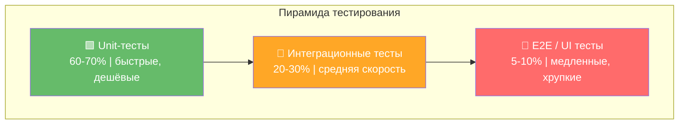
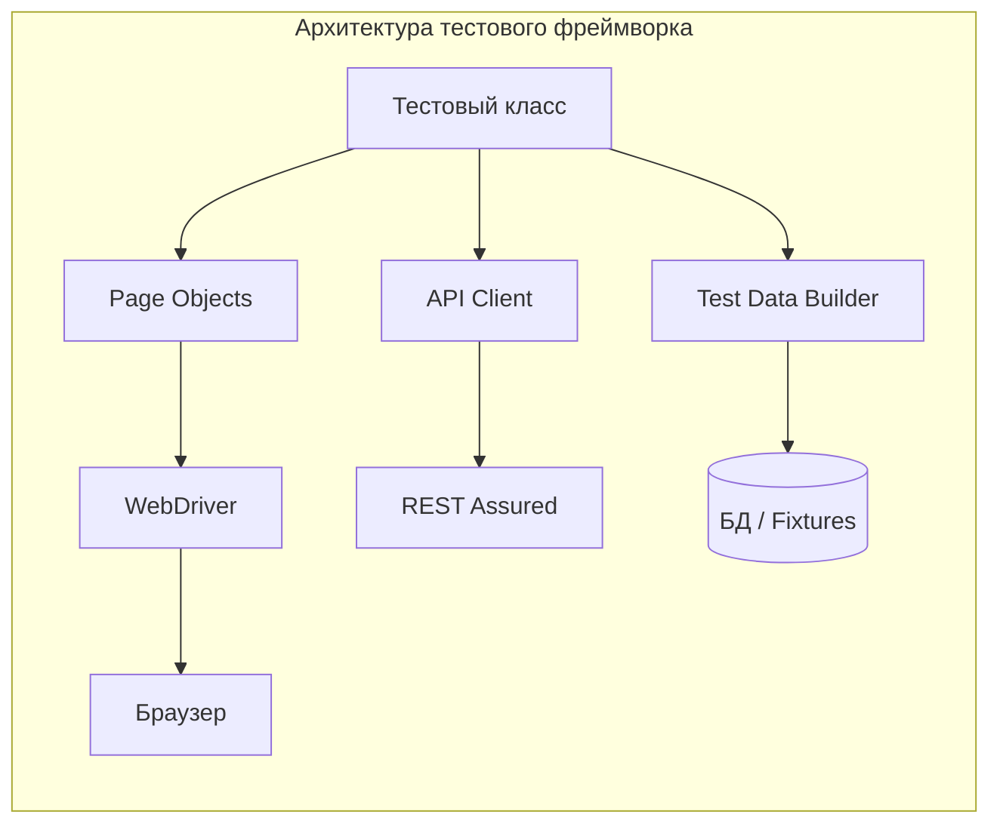
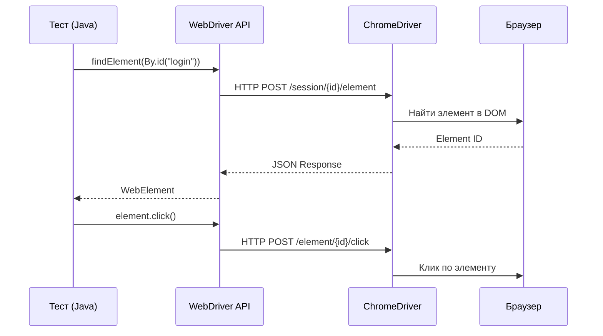
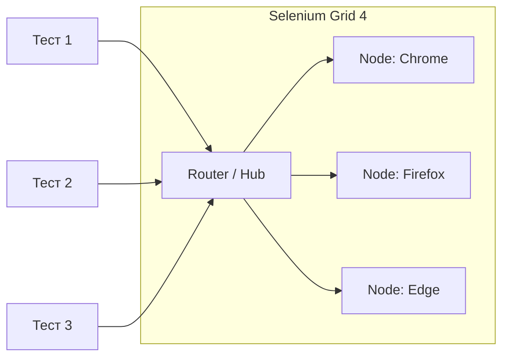
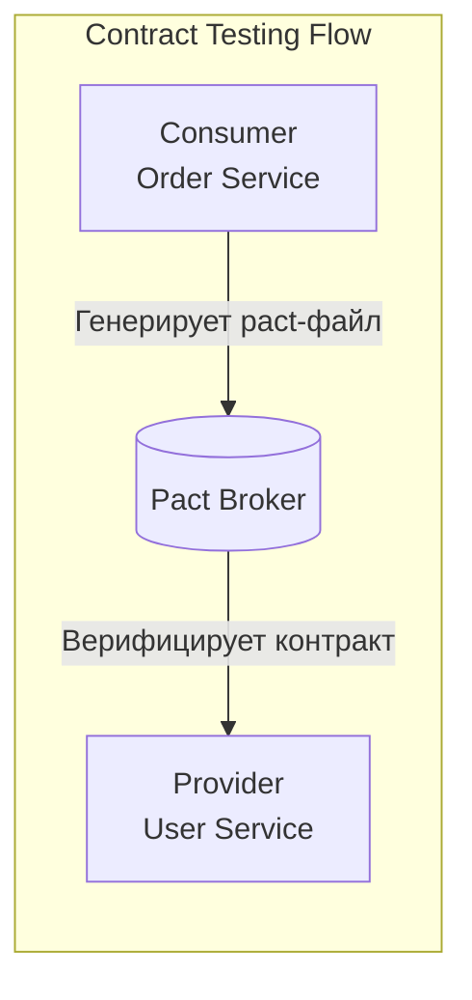
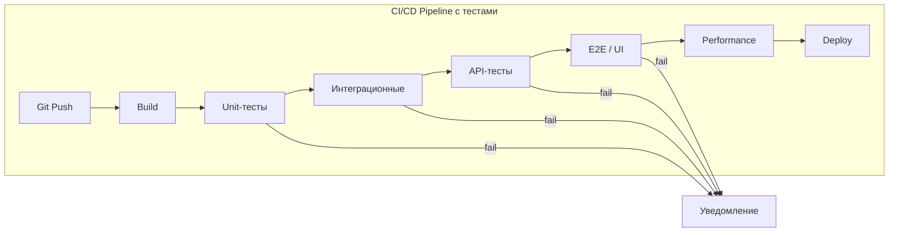
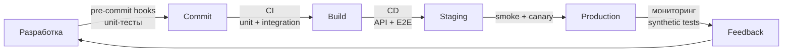
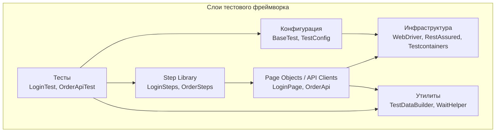
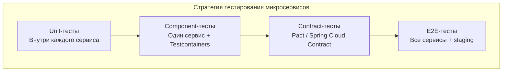

# Вопросы на собеседовании: `Test Automation`

Комплексные ответы по автоматизации тестирования: как строить устойчивый набор автотестов, выбирать инструменты, интегрировать тесты в `CI/CD` и контролировать стоимость поддержки.

**Автоматизация тестирования** -- ключевая дисциплина современной разработки. Этот документ покрывает инструменты (`Selenium`, `REST Assured`, `Testcontainers`, `Playwright`), паттерны (`Page Object`, `BDD`, `Data-Driven`), интеграцию с `CI/CD` и стратегию управления тестовым набором.

## Роль документа в связке testing

- Этот файл отвечает за **automation-уровень**: инструменты, framework, flaky management, CI/CD orchestration.
- За принципы unit-тестов и качество локальных проверок отвечает [Unit Testing](unit-testing-interview.md).
- За проверку реальных интеграций и окружений отвечает [Integration Testing](integration-testing-interview.md).
- За стратегию "что и почему автоматизируем" отвечает [Стратегии тестирования](test-strategies-interview.md).

## Полезные ссылки

### Официальная документация

- [Selenium WebDriver](https://www.selenium.dev/documentation/webdriver/) -- официальная документация Selenium
- [REST Assured](https://rest-assured.io/) -- фреймворк для API-тестирования
- [Testcontainers](https://testcontainers.com/) -- интеграционные тесты с Docker-контейнерами
- [Cucumber](https://cucumber.io/docs/) -- BDD-фреймворк
- [Playwright for Java](https://playwright.dev/java/) -- современный фреймворк для UI-тестирования
- [A Guide to REST-assured (Baeldung)](https://www.baeldung.com/rest-assured-tutorial) -- подробный гайд по REST Assured
- [Selenium with JUnit/TestNG (Baeldung)](https://www.baeldung.com/java-selenium-with-junit-and-testng) -- интеграция Selenium с тестовыми фреймворками
- [Page Object Pattern (Baeldung)](https://www.baeldung.com/selenium-webdriver-page-object) -- паттерн Page Object
- [Testcontainers + Spring Boot (Baeldung)](https://www.baeldung.com/spring-boot-testcontainers-integration-test) -- Testcontainers в Spring Boot

## Содержание

- [Полезные ссылки](#полезные-ссылки)
- [See also](#see-also)

**Основы и стратегия автоматизации**
- [Q1. (!) Что такое автоматизация тестирования и зачем она нужна?](#q1--что-такое-автоматизация-тестирования-и-зачем-она-нужна)
- [Q2. (!) Что такое пирамида тестирования?](#q2--что-такое-пирамида-тестирования)
- [Q3. Какие инструменты используются для автоматизации тестирования в Java?](#q3-какие-инструменты-используются-для-автоматизации-тестирования-в-java)
- [Q4. Как выбрать тесты для автоматизации?](#q4-как-выбрать-тесты-для-автоматизации)
- [Q5. Как измерить ROI автоматизации тестирования?](#q5-как-измерить-roi-автоматизации-тестирования)
- [Q6. (!) Какие паттерны используются в автоматизации тестирования?](#q6--какие-паттерны-используются-в-автоматизации-тестирования)

**Selenium и UI-автоматизация**
- [Q7. (!) Как работает Selenium WebDriver?](#q7--как-работает-selenium-webdriver)
- [Q8. Какие стратегии поиска элементов есть в Selenium?](#q8-какие-стратегии-поиска-элементов-есть-в-selenium)
- [Q9. (!) Что такое Page Object Model?](#q9--что-такое-page-object-model)
- [Q10. Чем отличаются implicit, explicit и fluent waits в Selenium?](#q10-чем-отличаются-implicit-explicit-и-fluent-waits-в-selenium)
- [Q11. Что такое Selenium Grid и как он работает?](#q11-что-такое-selenium-grid-и-как-он-работает)
- [Q12. Чем Playwright отличается от Selenium?](#q12-чем-playwright-отличается-от-selenium)
- [Q13. Как работать с JavaScript-алертами и iframe в Selenium?](#q13-как-работать-с-javascript-алертами-и-iframe-в-selenium)

**API-тестирование**
- [Q14. (!) Как автоматизировать API-тестирование с REST Assured?](#q14--как-автоматизировать-api-тестирование-с-rest-assured)
- [Q15. Как валидировать JSON Schema в API-тестах?](#q15-как-валидировать-json-schema-в-api-тестах)
- [Q16. Что такое Contract Testing и зачем он нужен?](#q16-что-такое-contract-testing-и-зачем-он-нужен)
- [Q17. Как тестировать аутентификацию и авторизацию в API?](#q17-как-тестировать-аутентификацию-и-авторизацию-в-api)

**Testcontainers и тестовая инфраструктура**
- [Q18. (!) Что такое Testcontainers и как их использовать?](#q18--что-такое-testcontainers-и-как-их-использовать)
- [Q19. Как организовать тестовые данные?](#q19-как-организовать-тестовые-данные)
- [Q20. Что такое WireMock и когда его использовать?](#q20-что-такое-wiremock-и-когда-его-использовать)

**Data-Driven, BDD и параметризация**
- [Q21. Что такое Data-Driven Testing?](#q21-что-такое-data-driven-testing)
- [Q22. (!) Что такое BDD и как работает Cucumber?](#q22--что-такое-bdd-и-как-работает-cucumber)
- [Q23. Что такое Keyword-Driven Testing?](#q23-что-такое-keyword-driven-testing)

**CI/CD и Continuous Testing**
- [Q24. (!) Как интегрировать автотесты в CI/CD?](#q24--как-интегрировать-автотесты-в-cicd)
- [Q25. (!) Что такое Continuous Testing?](#q25--что-такое-continuous-testing)
- [Q26. Как организовать параллельное выполнение тестов?](#q26-как-организовать-параллельное-выполнение-тестов)
- [Q27. Что такое Test Orchestration?](#q27-что-такое-test-orchestration)

**Flaky-тесты и стабильность**
- [Q28. (!) Что такое flaky-тесты и как с ними бороться?](#q28--что-такое-flaky-тесты-и-как-с-ними-бороться)
- [Q29. Как диагностировать причины нестабильности тестов?](#q29-как-диагностировать-причины-нестабильности-тестов)

**Специализированное тестирование**
- [Q30. Как автоматизировать Performance Testing?](#q30-как-автоматизировать-performance-testing)
- [Q31. Что такое Visual Regression Testing?](#q31-что-такое-visual-regression-testing)
- [Q32. Как автоматизировать Accessibility Testing?](#q32-как-автоматизировать-accessibility-testing)
- [Q33. Как автоматизировать Security Testing?](#q33-как-автоматизировать-security-testing)
- [Q34. Как автоматизировать тестирование мобильных приложений?](#q34-как-автоматизировать-тестирование-мобильных-приложений)

**Reporting, метрики и управление**
- [Q35. (!) Что такое Test Reporting и какие метрики отслеживать?](#q35--что-такое-test-reporting-и-какие-метрики-отслеживать)
- [Q36. Что такое Test Environment Management?](#q36-что-такое-test-environment-management)
- [Q37. Как автоматизировать Smoke Testing?](#q37-как-автоматизировать-smoke-testing)
- [Q38. Как автоматизировать Regression Testing?](#q38-как-автоматизировать-regression-testing)

**Mutation Testing и качество тестов**
- [Q39. (!) Что такое Mutation Testing?](#q39--что-такое-mutation-testing)
- [Q40. Как оценить качество тестового покрытия?](#q40-как-оценить-качество-тестового-покрытия)

**Архитектура тестового фреймворка**
- [Q41. Как спроектировать архитектуру тестового фреймворка?](#q41-как-спроектировать-архитектуру-тестового-фреймворка)
- [Q42. (!) Что такое Test Maintenance Strategy?](#q42--что-такое-test-maintenance-strategy)
- [Q43. Как организовать тестирование микросервисов?](#q43-как-организовать-тестирование-микросервисов)
- [Q44. Что такое Test Doubles и какие виды бывают?](#q44-что-такое-test-doubles-и-какие-виды-бывают)
- [Q45. Best practices для автоматизации тестирования?](#q45-best-practices-для-автоматизации-тестирования)

**Дополнительные темы**
- [Q46. (!) Как реализовать Page Object Model с Playwright для Java?](#q46--как-реализовать-page-object-model-с-playwright-для-java)
- [Q47. Как писать Gherkin-сценарии и шаговые определения в Cucumber?](#q47-как-писать-gherkin-сценарии-и-шаговые-определения-в-cucumber)
- [Q48. Как организовать TestNG Suite для параллельного запуска?](#q48-как-организовать-testng-suite-для-параллельного-запуска)
- [Q49. (!) Как применять паттерн Screenplay в автоматизации?](#q49--как-применять-паттерн-screenplay-в-автоматизации)
- [Q50. Как тестировать GraphQL API?](#q50-как-тестировать-graphql-api)

---

## Q1. (!) Что такое автоматизация тестирования и зачем она нужна?

**Автоматизация тестирования** -- это когда тестовые сценарии прогоняет программа, а не человек: она сама выполняет шаги, сравнивает результат с ожидаемым и формирует отчёт. Цель не в том, чтобы «уволить тестировщиков», а в том, чтобы перевести рутинную регрессию в режим «запустил и забыл» и высвободить людей для исследовательского тестирования, где нужна голова.

**Зачем она нужна.** Главная ценность -- быстрая и повторяемая обратная связь. Один и тот же сценарий человек проходит за минуты и каждый раз чуть по-разному; машина -- за секунды и строго одинаково. Это меняет экономику: ручной прогон при каждом релизе дорожает линейно с числом проверок, а автотест после написания почти ничего не стоит запустить ещё раз.

| Аспект | Ручное тестирование | Автоматизированное |
|--------|--------------------|--------------------|
| Скорость | 5-10 мин/тест | 5-30 сек/тест |
| Повторяемость | Субъективна | 100% детерминирована |
| Масштабируемость | Линейная (+ люди) | Экспоненциальная (+ железо) |
| Стоимость в долгосрочной перспективе | Растёт | Снижается |
| Обратная связь | Часы/дни | Минуты |

**Когда автоматизировать** -- если выигрыш от повторных прогонов перекроет цену написания и поддержки:
- сценарий выполняется регулярно (регрессия);
- он стабилен и редко меняется -- иначе тест придётся переписывать чаще, чем запускать;
- он критичен для бизнеса (оплата, авторизация) -- цена пропущенного бага высока;
- он требует большого объёма данных (`Data-Driven`);
- его нужно гонять на нескольких окружениях или браузерах.

**Когда НЕ автоматизировать** -- если человек делает это дешевле или машина в принципе не справляется:
- exploratory testing (исследовательское) -- ценность в импровизации, её не запрограммировать;
- одноразовые проверки -- автотест не успеет окупиться;
- UX и юзабилити -- «удобно ли это» машина не оценит;
- функциональность, которая меняется каждый спринт -- поддержка съест всю выгоду.

## Q2. (!) Что такое пирамида тестирования?

**Пирамида тестирования** (Test Pyramid, ввёл Майк Кон) -- модель, которая подсказывает, как распределять тесты по уровням: широкое основание из быстрых дешёвых unit-тестов и узкая верхушка из медленных дорогих E2E. Логика простая: чем выше уровень, тем дороже написать и поддержать тест и тем он медленнее, поэтому таких тестов держат мало -- ровно столько, сколько нужно для проверки сквозных сценариев, а остальное закрывают уровнями ниже.

**Почему именно так.** Низкий уровень даёт точную локализацию (упал unit -- сразу видно, какой метод сломан) и мгновенный прогон, поэтому им покрывают логику массово. Высокий уровень проверяет систему целиком, но падает по куче причин и долго гоняется -- значит, его берут точечно, для критичных пользовательских путей.



| Уровень | Количество | Скорость | Стоимость поддержки | Примеры |
|---------|-----------|----------|--------------------| --------|
| `Unit` | 60-70% | мс | Низкая | `JUnit 5`, `Mockito` |
| `Integration` | 20-30% | секунды | Средняя | `Testcontainers`, `@SpringBootTest` |
| `E2E / UI` | 5-10% | минуты | Высокая | `Selenium`, `Playwright` |

**Антипаттерн -- «перевёрнутая пирамида» (Ice Cream Cone):** много E2E-тестов и мало unit. Команда тестирует «как пользователь», но за это расплачивается медленным CI, постоянными flaky-падениями и дорогой поддержкой -- падающий E2E не говорит, что именно сломалось, и разбор каждого занимает время. По сути это обратная сторона той же логики: чем выше центр тяжести набора, тем дороже и нестабильнее он в эксплуатации.

Подробнее о каждом уровне -- в [вопросах по Unit Testing](unit-testing-interview.md) и [вопросах по Integration Testing](integration-testing-interview.md).

## Q3. Какие инструменты используются для автоматизации тестирования в Java?

В Java-экосистеме под каждый уровень тестирования и каждую задачу есть устоявшийся инструмент. Знать их полезно не как список, а как карту: что чем закрывается.

| Категория | Инструмент | Назначение |
|-----------|-----------|------------|
| Unit-тесты | `JUnit 5`, `TestNG` | Фреймворк для запуска тестов |
| Моки | `Mockito`, `WireMock` | Подмена зависимостей |
| API-тесты | `REST Assured`, `WebClient` | Тестирование REST API |
| UI-тесты | `Selenium`, `Playwright` | Браузерная автоматизация |
| BDD | `Cucumber`, `JBehave` | Behaviour-Driven Development |
| Контейнеры | `Testcontainers` | Docker-контейнеры для тестов |
| Нагрузка | `JMeter`, `Gatling` | Performance testing |
| Contract | `Pact`, `Spring Cloud Contract` | Контрактное тестирование |
| Mutation | `PIT (pitest)` | Мутационное тестирование |
| Покрытие | `JaCoCo` | Code coverage |

```java
// build.gradle -- типичные зависимости для автоматизации
dependencies {
    // Unit и интеграционные тесты
    testImplementation 'org.springframework.boot:spring-boot-starter-test'
    testImplementation 'org.testcontainers:junit-jupiter'
    testImplementation 'org.testcontainers:postgresql'

    // API-тестирование
    testImplementation 'io.rest-assured:rest-assured'
    testImplementation 'io.rest-assured:json-schema-validator'

    // UI-тестирование
    testImplementation 'org.seleniumhq.selenium:selenium-java'
    testImplementation 'io.github.bonigarcia:webdrivermanager'

    // BDD
    testImplementation 'io.cucumber:cucumber-java'
    testImplementation 'io.cucumber:cucumber-spring'

    // Мутационное тестирование
    pitest 'org.pitest:pitest-junit5-plugin'
}
```

## Q4. Как выбрать тесты для автоматизации?

Автоматизировать всё подряд -- ловушка: поддержка съест больше, чем сэкономит прогон. Выбор делают по нескольким критериям с весами -- так субъективное «давайте автоматизируем вот это» превращается в воспроизводимое решение.

| Критерий | Вес | Высокий приоритет | Низкий приоритет |
|----------|-----|-------------------|------------------|
| Частота выполнения | 30% | Каждый коммит | Раз в квартал |
| Бизнес-критичность | 25% | Оплата, авторизация | Настройки UI |
| Стабильность требований | 20% | Ядро системы | Экспериментальные фичи |
| Техническая сложность | 15% | Автоматизируемо | Нужен человек (UX) |
| Время ручного теста | 10% | > 10 мин | < 1 мин |

Самый большой вес у частоты не случайно: тест, который гоняется на каждый коммит, окупается быстрее всего, а нестабильные требования (низкая стабильность) -- наоборот, главный аргумент подождать, потому что автотест придётся переписывать вместе с фичей.

**Эмпирическое правило:** начинать с `happy path` критичных сценариев (максимум пользы при минимуме хрупкости), а граничные случаи добавлять потом, когда каркас уже стабилен. Подробнее о стратегии выбора -- в [Стратегии тестирования](test-strategies-interview.md).

## Q5. Как измерить ROI автоматизации тестирования?

Автоматизация -- это инвестиция: вы платите вперёд за написание теста, а отдачу получаете с каждого последующего прогона. ROI отвечает на вопрос «когда вложение окупится и стоит ли оно того» -- это главный аргумент в разговоре с менеджментом, который мыслит деньгами, а не покрытием.

**Формула ROI:**

```
ROI = (Экономия - Затраты) / Затраты × 100%

Экономия = (Время_ручного_теста × Кол-во_запусков × Стоимость_часа) - Стоимость_поддержки_автотеста
Затраты = Время_разработки_теста × Стоимость_часа + Инструменты
```

**Точка окупаемости** (breakeven) обычно наступает после 5-15 прогонов: именно поэтому редко имеет смысл автоматизировать сценарий, который выполнят пару раз. Чтобы отслеживать отдачу в динамике, смотрят на четыре метрики:

- **Test Automation Rate** -- доля автоматизированных тестов от всего набора; показывает, насколько вы ушли от ручной регрессии.
- **Defect Detection Rate** -- доля дефектов, пойманных автотестами; отвечает на вопрос, реально ли тесты ловят баги, а не просто «зеленеют».
- **Execution Time Savings** -- насколько сократилось время регрессии; прямой денежный выигрыш.
- **Cost per Defect** -- сколько стоит найти один баг; помогает сравнить эффективность автоматизации с ручным поиском.

## Q6. (!) Какие паттерны используются в автоматизации тестирования?

Паттерны автоматизации решают одну общую проблему -- хрупкость и дублирование. Без них тест напрямую дёргает локаторы и данные, и при любом изменении UI или схемы приходится править десятки тестов. Паттерны вводят слой абстракции: тест говорит «что сделать», а как именно -- скрыто в отдельном объекте.

| Паттерн | Описание | Когда использовать |
|---------|---------|-------------------|
| `Page Object Model` | Инкапсуляция UI-страницы в объект | UI-тесты |
| `Page Factory` | Инициализация элементов через аннотации | `Selenium` с `@FindBy` |
| `Screenplay` | Actor-centric модель | Сложные user journey |
| `Builder` | Создание тестовых данных | Любые тесты |
| `Data-Driven` | Параметризация тестов данными | Много входных комбинаций |
| `Keyword-Driven` | Действия как ключевые слова | BDD, нетехнические стейкхолдеры |
| `Component Object` | Переиспользуемые UI-компоненты | Header, footer, навигация |



## Q7. (!) Как работает Selenium WebDriver?

`Selenium WebDriver` управляет реальным браузером так, будто это делает человек: открывает страницы, ищет элементы, кликает, вводит текст. Ключевая идея -- он не лезет в браузер напрямую, а общается с ним через **нативный драйвер** (`ChromeDriver`, `GeckoDriver`) по стандартному протоколу `W3C WebDriver`.

**Почему через драйвер, а не напрямую.** Каждый браузер устроен по-своему, но протокол `W3C WebDriver` един для всех. Ваш Java-код шлёт драйверу обычные HTTP-команды («найди элемент по id», «кликни»), драйвер переводит их в команды конкретного браузера и возвращает результат в JSON. Благодаря этому один и тот же тест работает в Chrome, Firefox и Edge -- меняется только драйвер. Платой за такую развязку становится сетевой round-trip на каждое действие, отсюда и относительная медлительность Selenium.



```java
// Базовый пример Selenium-теста с JUnit 5
class LoginSeleniumTest {

    private WebDriver driver;

    @BeforeEach
    void setUp() {
        WebDriverManager.chromedriver().setup();
        ChromeOptions options = new ChromeOptions();
        options.addArguments("--headless", "--no-sandbox", "--disable-dev-shm-usage");
        driver = new ChromeDriver(options);
        driver.manage().timeouts().implicitlyWait(Duration.ofSeconds(10));
    }

    @AfterEach
    void tearDown() {
        if (driver != null) driver.quit();
    }

    @Test
    void shouldLoginSuccessfully() {
        driver.get("http://localhost:8080/login");

        driver.findElement(By.id("email")).sendKeys("user@example.com");
        driver.findElement(By.id("password")).sendKeys("secret");
        driver.findElement(By.cssSelector("button[type='submit']")).click();

        WebDriverWait wait = new WebDriverWait(driver, Duration.ofSeconds(5));
        wait.until(ExpectedConditions.urlContains("/dashboard"));

        String welcome = driver.findElement(By.className("welcome")).getText();
        assertEquals("Welcome, User!", welcome);
    }
}
```

## Q8. Какие стратегии поиска элементов есть в Selenium?

Тест общается со страницей через локаторы -- способы указать, какой именно элемент нужен. От выбора локатора напрямую зависит, переживёт ли тест редизайн: завязка на структуру вёрстки ломается при любом изменении DOM, а завязка на стабильный идентификатор -- нет.

| Локатор | Пример | Надёжность | Скорость |
|---------|--------|-----------|----------|
| `By.id()` | `By.id("login-btn")` | Высокая | Быстрая |
| `By.name()` | `By.name("email")` | Высокая | Быстрая |
| `By.cssSelector()` | `By.cssSelector(".btn-primary")` | Высокая | Быстрая |
| `By.xpath()` | `By.xpath("//div[@class='msg']")` | Средняя | Средняя |
| `By.linkText()` | `By.linkText("Sign Up")` | Низкая | Быстрая |
| `By.className()` | `By.className("error")` | Средняя | Быстрая |

**Рекомендации по локаторам** (от самого устойчивого к самому хрупкому):
1. Предпочитать `id` и `data-testid` -- это явные «якоря для тестов», их редактор вёрстки не трогает при рефакторинге.
2. Избегать XPath с абсолютными путями (`/html/body/div[2]/...`) -- они ломаются от вставки одного лишнего `<div>`.
3. Где можно, использовать CSS-селекторы вместо XPath -- они быстрее и читабельнее.
4. Если стабильных идентификаторов нет, договориться с фронтендом добавить `data-testid` специально для тестов -- это дешевле, чем чинить локаторы после каждого релиза.

```java
// Приоритет локаторов (от лучшего к худшему)
WebElement byId       = driver.findElement(By.id("submit-btn"));           // 1. id
WebElement byTestId   = driver.findElement(By.cssSelector("[data-testid='submit']")); // 2. data-testid
WebElement byCss      = driver.findElement(By.cssSelector("form .btn-primary"));      // 3. CSS
WebElement byXpath    = driver.findElement(By.xpath("//button[text()='Submit']"));     // 4. XPath (крайний случай)
```

## Q9. (!) Что такое Page Object Model?

`Page Object Model` (`POM`) -- паттерн, где каждая страница (или её логическая часть) -- это отдельный класс. Локаторы и низкоуровневые действия спрятаны внутри, а тест дёргает осмысленные методы вроде `loginAs(email, password)`, а не `findElement(...).click()`.

**В чём смысл.** Локатор кнопки логина живёт ровно в одном месте. Поменяли вёрстку -- правите один Page Object, и все тесты, что им пользуются, продолжают работать без изменений. Это разделение ответственности: тест описывает *что* проверяем, Page Object знает *как* это сделать на конкретной странице.

**Плюсы:** меньше дублирования, дешевле поддержка (UI поменялся -- правим один класс, а не десятки тестов), тест читается как сценарий.

```java
// BasePage -- общие методы для всех страниц
public abstract class BasePage {
    protected final WebDriver driver;
    protected final WebDriverWait wait;

    protected BasePage(WebDriver driver) {
        this.driver = driver;
        this.wait = new WebDriverWait(driver, Duration.ofSeconds(10));
    }

    protected void click(By locator) {
        wait.until(ExpectedConditions.elementToBeClickable(locator)).click();
    }

    protected void type(By locator, String text) {
        WebElement el = wait.until(ExpectedConditions.visibilityOfElementLocated(locator));
        el.clear();
        el.sendKeys(text);
    }

    protected String getText(By locator) {
        return wait.until(ExpectedConditions.visibilityOfElementLocated(locator)).getText();
    }
}

// LoginPage -- Page Object для страницы логина
public class LoginPage extends BasePage {
    private static final By EMAIL    = By.id("email");
    private static final By PASSWORD = By.id("password");
    private static final By SUBMIT   = By.id("login-button");
    private static final By ERROR    = By.className("error-message");

    public LoginPage(WebDriver driver) {
        super(driver);
    }

    public DashboardPage loginAs(String email, String password) {
        type(EMAIL, email);
        type(PASSWORD, password);
        click(SUBMIT);
        return new DashboardPage(driver);
    }

    public String getError() {
        return getText(ERROR);
    }
}

// Тест -- чистый и читаемый
@Test
void shouldLoginSuccessfully() {
    LoginPage loginPage = new LoginPage(driver);
    DashboardPage dashboard = loginPage.loginAs("user@example.com", "secret");
    assertTrue(dashboard.isWelcomeDisplayed());
}
```

Альтернатива -- `PageFactory` с аннотацией `@FindBy`, но её считают устаревшей: она не дружит с `WebDriverWait` из коробки и провоцирует `StaleElementReferenceException` на динамических страницах.

## Q10. Чем отличаются implicit, explicit и fluent waits в Selenium?

Главная причина flaky UI-тестов -- тест проверяет элемент раньше, чем браузер успел его отрисовать. Ожидания (waits) решают эту проблему: вместо «проверить прямо сейчас» тест говорит «дождись нужного состояния, потом проверяй». Есть три механизма, и они различаются по охвату и гибкости.

| Тип | Scope | Поведение | Когда использовать |
|-----|-------|----------|-------------------|
| `Implicit Wait` | Глобальный | Ждёт появления элемента в DOM | Простые случаи |
| `Explicit Wait` | Точечный | Ждёт конкретного условия | Динамический контент |
| `Fluent Wait` | Точечный | Как explicit + настраиваемый polling | Сложные кейсы |

```java
// Implicit wait -- устанавливается один раз
driver.manage().timeouts().implicitlyWait(Duration.ofSeconds(10));

// Explicit wait -- для конкретного условия
WebDriverWait wait = new WebDriverWait(driver, Duration.ofSeconds(10));
WebElement button = wait.until(ExpectedConditions.elementToBeClickable(By.id("submit")));

// Fluent wait -- полная настройка
Wait<WebDriver> fluentWait = new FluentWait<>(driver)
    .withTimeout(Duration.ofSeconds(30))
    .pollingEvery(Duration.ofMillis(500))
    .ignoring(NoSuchElementException.class)
    .ignoring(StaleElementReferenceException.class);

WebElement element = fluentWait.until(d -> d.findElement(By.id("dynamic-content")));
```

**Подводный камень:** не смешивайте `implicit` и `explicit` waits в одном тесте. Их таймауты складываются непредсказуемо (внутренний цикл implicit накладывается на explicit), и ожидание может растянуться на минуты или, наоборот, отработать не так, как вы рассчитывали. Выберите один подход -- на практике это `explicit`/`fluent`.

## Q11. Что такое Selenium Grid и как он работает?

`Selenium Grid` -- способ распараллелить UI-тесты по нескольким машинам и браузерам. Без него прогон сотен медленных E2E-тестов на одной машине занимает часы; Grid распределяет их по узлам и даёт заодно покрытие разных браузеров. Архитектура состоит из двух ролей: **Hub** (центральный узел -- принимает запросы и раздаёт их) и **Nodes** (исполнители -- на них реально запускаются браузеры).



```java
// Подключение к Selenium Grid
ChromeOptions options = new ChromeOptions();
options.addArguments("--headless");

WebDriver driver = new RemoteWebDriver(
    new URL("http://selenium-hub:4444/wd/hub"), options);
```

```yaml
# docker-compose.yml для Selenium Grid
services:
  selenium-hub:
    image: selenium/hub:4.18
    ports: ["4444:4444"]

  chrome-node:
    image: selenium/node-chrome:4.18
    depends_on: [selenium-hub]
    environment:
      - SE_EVENT_BUS_HOST=selenium-hub
      - SE_EVENT_BUS_PUBLISH_PORT=4442
      - SE_EVENT_BUS_SUBSCRIBE_PORT=4443
      - SE_NODE_MAX_SESSIONS=4
```

## Q12. Чем Playwright отличается от Selenium?

Оба автоматизируют браузер, но `Playwright` -- более новый инструмент, выросший на опыте чужих болей. Главная разница в архитектуре: Selenium общается с браузером по HTTP через драйвер (round-trip на каждое действие), а Playwright -- по постоянному WebSocket напрямую через протокол браузера (`CDP` и аналоги). Отсюда и его ключевые преимущества: скорость и встроенное авто-ожидание, которое снимает главную причину flaky-тестов.

| Аспект | `Selenium` | `Playwright` |
|--------|-----------|-------------|
| Протокол | `W3C WebDriver` (HTTP) | `CDP` / нативный (WebSocket) |
| Auto-wait | Нет (нужны explicit waits) | Встроенный |
| Параллелизм | Через Grid | Встроенный (browser contexts) |
| Скриншоты/видео | Ручная настройка | Из коробки |
| Network Interception | Ограничено | Полная поддержка |
| Браузеры | Chrome, Firefox, Edge, Safari | Chromium, Firefox, WebKit |

```java
// Playwright -- лаконичнее и стабильнее
try (Playwright pw = Playwright.create()) {
    Browser browser = pw.chromium().launch(new BrowserType.LaunchOptions().setHeadless(true));
    Page page = browser.newPage();

    page.navigate("http://localhost:8080/login");
    page.fill("#email", "user@example.com");
    page.fill("#password", "secret");
    page.click("button[type='submit']");

    // Auto-wait: Playwright ждёт сам
    assertThat(page.locator(".welcome")).hasText("Welcome, User!");
}
```

## Q13. Как работать с JavaScript-алертами и iframe в Selenium?

Алерты, iframe и новые окна -- это контексты вне обычного DOM текущей страницы, поэтому `findElement` их «не видит». С ними работают через явное переключение контекста (`switchTo()`): сначала переходим в нужный контекст, делаем действие, затем обязательно возвращаемся обратно -- иначе следующие шаги теста будут искать элементы не там.

- **Алерт** -- браузерное модальное окно поверх страницы; перехватывается через `switchTo().alert()`.
- **iframe** -- вложенный документ со своим DOM; пока не переключились внутрь, его элементы недоступны.
- **Новое окно/вкладка** -- отдельный контекст; идентифицируется по window handle.

```java
// Работа с алертами
driver.findElement(By.id("alert-trigger")).click();
Alert alert = driver.switchTo().alert();
String text = alert.getText();    // Прочитать текст
alert.accept();                    // Нажать OK
// alert.dismiss();                // Нажать Cancel
// alert.sendKeys("input");       // Ввести текст (prompt)

// Работа с iframe
driver.switchTo().frame("frame-name");           // По имени
driver.switchTo().frame(0);                       // По индексу
driver.switchTo().frame(driver.findElement(By.id("my-iframe"))); // По элементу
// Действия внутри iframe...
driver.switchTo().defaultContent();               // Вернуться в основной документ

// Работа с несколькими окнами/вкладками
String mainWindow = driver.getWindowHandle();
driver.findElement(By.linkText("Open new tab")).click();
for (String handle : driver.getWindowHandles()) {
    if (!handle.equals(mainWindow)) {
        driver.switchTo().window(handle);
        break;
    }
}
```

## Q14. (!) Как автоматизировать API-тестирование с REST Assured?

`REST Assured` -- Java-библиотека для тестирования REST API. Её сила -- читаемый fluent-синтаксис в стиле `Given-When-Then`: `given` описывает запрос (заголовки, тело), `when` -- действие (HTTP-метод и путь), `then` -- проверки ответа (статус, поля JSON). Тест читается почти как обычная спецификация, без ручной возни с `HttpClient` и парсингом JSON.

**Зачем API-тесты вообще.** Они находятся посередине пирамиды: дешевле и стабильнее E2E (нет браузера), но проверяют реальный сетевой контракт, а не изолированный метод. Если бизнес-логика живёт за HTTP, API-тесты дают максимум уверенности на единицу затрат.

```java
@SpringBootTest(webEnvironment = WebEnvironment.RANDOM_PORT)
class UserApiTest {

    @LocalServerPort
    int port;

    @BeforeEach
    void setUp() {
        RestAssured.port = port;
        RestAssured.basePath = "/api";
    }

    @Test
    void shouldCreateUser() {
        given()
            .contentType(ContentType.JSON)
            .body("""
                {"email": "john@example.com", "name": "John Doe"}
            """)
        .when()
            .post("/users")
        .then()
            .statusCode(201)
            .body("id", notNullValue())
            .body("email", equalTo("john@example.com"));
    }

    @Test
    void shouldReturnValidationError() {
        given()
            .contentType(ContentType.JSON)
            .body("""
                {"email": "invalid", "name": ""}
            """)
        .when()
            .post("/users")
        .then()
            .statusCode(400)
            .body("errors.size()", greaterThan(0));
    }

    @Test
    void shouldAuthenticateAndAccessProtected() {
        // Получаем токен
        String token = given()
            .contentType(ContentType.JSON)
            .body("""
                {"username": "admin", "password": "admin123"}
            """)
        .when()
            .post("/auth/login")
        .then()
            .statusCode(200)
            .extract().path("token");

        // Используем токен
        given()
            .header("Authorization", "Bearer " + token)
        .when()
            .get("/users")
        .then()
            .statusCode(200)
            .body("size()", greaterThan(0));
    }
}
```

Также можно использовать `RestAssuredMockMvc` для тестирования контроллеров без запуска сервера -- подробнее на [Baeldung](https://www.baeldung.com/spring-mock-mvc-rest-assured).

## Q15. Как валидировать JSON Schema в API-тестах?

Проверять каждое поле ответа по отдельности (`body("id", ...).body("email", ...)`) утомительно и неполно: легко забыть поле или пропустить, что сервис вернул лишнее. `JSON Schema Validation` проверяет структуру ответа целиком против одного объявленного контракта -- какие поля обязательны, каких типов, в каком формате. Это превращает «проверю пару полей» в «гарантирую, что весь ответ соответствует схеме».

```java
// Файл: src/test/resources/schemas/user-schema.json
/*
{
  "$schema": "http://json-schema.org/draft-07/schema#",
  "type": "object",
  "required": ["id", "email", "name"],
  "properties": {
    "id":    { "type": "integer" },
    "email": { "type": "string", "format": "email" },
    "name":  { "type": "string", "minLength": 1 }
  }
}
*/

@Test
void shouldMatchUserSchema() {
    given()
        .header("Authorization", "Bearer " + token)
    .when()
        .get("/api/users/1")
    .then()
        .statusCode(200)
        .body(matchesJsonSchemaInClasspath("schemas/user-schema.json"));
}
```

Это особенно важно в [микросервисной архитектуре](../architecture/microservices-interview.md), где API-контракты являются границами между сервисами.

## Q16. Что такое Contract Testing и зачем он нужен?

`Contract Testing` проверяет, что два сервиса -- **consumer** (кто зовёт API) и **provider** (кто его предоставляет) -- по-прежнему понимают друг друга. Проблема, которую он решает: provider молча меняет ответ (переименовал поле, поменял тип), consumer об этом не знает, и всё ломается уже в проде. Полноценный E2E поймал бы это, но он медленный и требует поднимать оба сервиса сразу.

**Как это обходится.** Consumer записывает свои ожидания в pact-файл («когда я запрошу `/users/123`, жду такой-то ответ»), а provider потом отдельно проверяет, что реально умеет так отвечать. Сервисы тестируются независимо, но контракт между ними гарантированно соблюдён. Основные инструменты -- `Pact` и `Spring Cloud Contract`.



```java
// Consumer-тест (Order Service) -- определяет ожидания
@ExtendWith(PactConsumerTestExt.class)
@PactTestFor(providerName = "UserService", port = "8081")
class OrderServiceContractTest {

    @Pact(consumer = "OrderService")
    RequestResponsePact getUserPact(PactDslWithProvider builder) {
        return builder
            .given("User 123 exists")
            .uponReceiving("get user by id")
                .path("/api/users/123").method("GET")
            .willRespondWith()
                .status(200)
                .body(new PactDslJsonBody()
                    .integerType("id", 123)
                    .stringType("name", "John"))
            .toPact();
    }

    @Test
    @PactTestFor(pactMethod = "getUserPact")
    void shouldGetUser(MockServer mockServer) {
        UserClient client = new UserClient(mockServer.getUrl());
        User user = client.getUser(123L);
        assertEquals("John", user.getName());
    }
}
```

## Q17. Как тестировать аутентификацию и авторизацию в API?

Безопасность проверяется не только «успешным входом», а в первую очередь **негативными сценариями** -- тем, что система правильно *отказывает*. Важно различать два ответа: `401 Unauthorized` -- «я не знаю, кто ты» (нет токена или он невалиден), `403 Forbidden` -- «я знаю, кто ты, но тебе сюда нельзя» (прав не хватает). Хороший набор покрывает три типичные дыры: запрос без токена, доступ к чужому ресурсу с валидным токеном и работу с просроченным токеном.

```java
class SecurityApiTest extends BaseApiTest {

    @Test
    void shouldReturn401WithoutToken() {
        given()
        .when()
            .get("/api/users")
        .then()
            .statusCode(401);
    }

    @Test
    void shouldReturn403ForForbiddenResource() {
        String userToken = getToken("user", "pass");

        given()
            .header("Authorization", "Bearer " + userToken)
        .when()
            .delete("/api/admin/users/1")
        .then()
            .statusCode(403);
    }

    @Test
    void shouldReturn401WithExpiredToken() {
        String expiredToken = generateExpiredJwt("user@example.com");

        given()
            .header("Authorization", "Bearer " + expiredToken)
        .when()
            .get("/api/users")
        .then()
            .statusCode(401);
    }
}
```

Подробнее об OAuth2/JWT -- в [Паттерны аутентификации и авторизации](../security/authentication-authorization-patterns-interview.md).

## Q18. (!) Что такое Testcontainers и как их использовать?

`Testcontainers` поднимает настоящие зависимости (PostgreSQL, Kafka, Redis) в Docker-контейнерах прямо из теста и гасит их по завершении. Проблема, которую он закрывает: раньше интеграционные тесты гоняли на встроенной H2 или ручном локальном Postgres. H2 ведёт себя не как боевая БД (другой SQL-диалект, нет нужных типов), а ручная установка порождает «works on my machine» -- у разработчика тест зелёный, в CI красный.

**Почему это лучше.** Тест работает с тем же образом БД, что и прод, поэтому ловит диалектные баги, миграции и индексы по-настоящему. Контейнер создаётся под тест и уничтожается после -- никакого общего грязного состояния между запусками. Платой служит требование запущенного Docker-демона и несколько секунд на старт контейнера.

```java
@SpringBootTest
@Testcontainers
class UserRepositoryIntegrationTest {

    @Container
    static PostgreSQLContainer<?> postgres = new PostgreSQLContainer<>("postgres:16")
        .withDatabaseName("testdb")
        .withUsername("test")
        .withPassword("test");

    @DynamicPropertySource
    static void configureProperties(DynamicPropertyRegistry registry) {
        registry.add("spring.datasource.url", postgres::getJdbcUrl);
        registry.add("spring.datasource.username", postgres::getUsername);
        registry.add("spring.datasource.password", postgres::getPassword);
    }

    @Autowired
    private UserRepository userRepository;

    @Test
    void shouldSaveAndFindUser() {
        User user = new User("john@example.com", "John Doe");
        userRepository.save(user);

        Optional<User> found = userRepository.findByEmail("john@example.com");
        assertTrue(found.isPresent());
        assertEquals("John Doe", found.get().getName());
    }
}
```

**Spring Boot 3.1+** упрощает подключение через `@ServiceConnection`: аннотация сама прописывает Spring, куда ходить за БД, поэтому ручной `@DynamicPropertySource` с пробросом url/username/password больше не нужен.

```java
@Container
@ServiceConnection
static PostgreSQLContainer<?> postgres = new PostgreSQLContainer<>("postgres:16");
// @DynamicPropertySource больше не нужен!
```

Подробнее об интеграционном тестировании -- в [Integration Testing](integration-testing-interview.md).

## Q19. Как организовать тестовые данные?

Откуда тест берёт данные -- вопрос его читаемости и устойчивости. Хардкод объектов прямо в тесте раздувает его и прячет смысл за шумом; общая «золотая» БД на все тесты создаёт скрытые зависимости между ними. Поэтому выбирают стратегию под тип теста.

| Стратегия | Описание | Когда использовать |
|-----------|---------|-------------------|
| `Builder` | Программное создание объектов | Unit-тесты, фикстуры |
| `@Sql` | SQL-скрипты перед тестом | Интеграционные тесты с БД |
| `Faker` | Генерация случайных данных | Нагрузочные тесты, fuzzing |
| `Fixtures` (JSON/YAML) | Фиксированные наборы | Стабильные сценарии |

```java
// Test Data Builder -- чистый и гибкий
public class TestUserBuilder {
    private String email = "user@example.com";
    private String name = "John Doe";
    private Role role = Role.USER;

    public static TestUserBuilder aUser() { return new TestUserBuilder(); }

    public TestUserBuilder withEmail(String email) { this.email = email; return this; }
    public TestUserBuilder admin() { this.role = Role.ADMIN; return this; }

    public User build() { return new User(email, name, role); }
}

// Использование в тесте
@Test
void shouldAllowAdminAccess() {
    User admin = TestUserBuilder.aUser().admin().withEmail("admin@example.com").build();
    userRepository.save(admin);
    // ...
}
```

```java
// @Sql -- загрузка данных из файла
@SpringBootTest
@Sql(scripts = "/test-data/users.sql", executionPhase = BEFORE_TEST_METHOD)
@Sql(scripts = "/test-data/cleanup.sql", executionPhase = AFTER_TEST_METHOD)
class UserServiceIntegrationTest {
    // тестовые данные загружены из SQL-файлов
}
```

## Q20. Что такое WireMock и когда его использовать?

`WireMock` -- это HTTP-сервер-заглушка: он поднимается на локальном порту и отвечает на запросы так, как вы запрограммировали. Нужен, когда тест зависит от внешнего API (платёжный шлюз, SMS-сервис, сторонний REST), который дёргать в тестах нельзя -- он платный, нестабильный или просто недоступен в CI.

**Чем отличается от Mockito.** Mockito подменяет Java-объект внутри JVM, а WireMock подменяет настоящий сетевой endpoint. Это даёт честную проверку всего HTTP-слоя вашего клиента -- сериализацию, заголовки, обработку таймаутов и кодов ошибок. Главная польза -- именно моделирование «плохой погоды»: таймаут, `500`, битый JSON. Такие сценарии в реальном внешнем API воспроизвести почти невозможно, а в WireMock это пара строк.

```java
@SpringBootTest
@WireMockTest(httpPort = 8089)
class PaymentServiceTest {

    @Autowired
    private PaymentService paymentService;

    @Test
    void shouldProcessPaymentSuccessfully() {
        // Настраиваем заглушку внешнего API
        stubFor(post(urlPathEqualTo("/api/payments"))
            .withRequestBody(matchingJsonPath("$.amount"))
            .willReturn(aResponse()
                .withStatus(200)
                .withHeader("Content-Type", "application/json")
                .withBody("""
                    {"transactionId": "TX-123", "status": "SUCCESS"}
                """)));

        PaymentResult result = paymentService.processPayment(new BigDecimal("99.99"), "USD");

        assertEquals("TX-123", result.getTransactionId());
        assertEquals("SUCCESS", result.getStatus());
    }

    @Test
    void shouldHandlePaymentGatewayTimeout() {
        stubFor(post(urlPathEqualTo("/api/payments"))
            .willReturn(aResponse()
                .withFixedDelay(5000)  // имитация таймаута
                .withStatus(200)));

        assertThrows(PaymentTimeoutException.class,
            () -> paymentService.processPayment(new BigDecimal("99.99"), "USD"));
    }
}
```

## Q21. Что такое Data-Driven Testing?

`Data-Driven Testing` -- подход, где логика теста написана один раз, а прогоняется на множестве наборов данных. Вместо того чтобы копировать один и тот же метод под каждый входной случай (валидный email, невалидный, пустой), вы описываете проверку однажды и подаёте в неё таблицу входов и ожиданий. Меньше дублирования, и добавить новый случай -- это добавить строку, а не метод.

В `JUnit 5` это `@ParameterizedTest`, а данные берутся из трёх источников в порядке роста сложности: `@CsvSource` (инлайн в коде), `@CsvFileSource` (внешний CSV) и `@MethodSource` (метод, возвращающий объекты любой сложности).

```java
@ParameterizedTest(name = "email={0}, valid={1}")
@CsvSource({
    "john@example.com,   true",
    "jane@test.org,      true",
    "invalid-email,      false",
    "'',                 false",
    "@no-local-part.com, false"
})
void shouldValidateEmail(String email, boolean expected) {
    assertEquals(expected, emailValidator.isValid(email));
}

// Данные из CSV-файла
@ParameterizedTest
@CsvFileSource(resources = "/test-data/login-scenarios.csv", numLinesToSkip = 1)
void shouldHandleLoginScenarios(String email, String password, int expectedStatus) {
    given()
        .contentType(ContentType.JSON)
        .body("""
            {"email": "%s", "password": "%s"}
        """.formatted(email, password))
    .when()
        .post("/api/auth/login")
    .then()
        .statusCode(expectedStatus);
}

// Данные через @MethodSource
@ParameterizedTest
@MethodSource("orderTestCases")
void shouldCalculateOrderTotal(List<Item> items, BigDecimal expectedTotal) {
    Order order = new Order(items);
    assertEquals(expectedTotal, order.calculateTotal());
}

static Stream<Arguments> orderTestCases() {
    return Stream.of(
        Arguments.of(List.of(new Item("A", 10.0)), new BigDecimal("10.00")),
        Arguments.of(List.of(new Item("A", 10.0), new Item("B", 20.0)), new BigDecimal("30.00")),
        Arguments.of(List.of(), BigDecimal.ZERO)
    );
}
```

## Q22. (!) Что такое BDD и как работает Cucumber?

`BDD` (Behaviour-Driven Development) -- подход, где поведение системы описывают на почти естественном языке в формате `Gherkin` (Given-When-Then), и это описание одновременно служит и спецификацией, и исполняемым тестом. Цель -- общий язык: аналитик, тестировщик и разработчик читают один и тот же сценарий и одинаково его понимают, а не пересказывают требования друг другу.

**Как это работает в `Cucumber`.** Сценарий в `.feature`-файле -- это только текст; сам по себе он ничего не делает. Каждую строку (`Given пользователь на странице логина`) связывают со step definition -- Java-методом, помеченным аннотацией с тем же текстом. Cucumber читает сценарий, сопоставляет строки с методами и вызывает их по очереди. Так бизнес-описание превращается в реальный код, который кликает по UI или зовёт API.

```gherkin
# src/test/resources/features/login.feature
Feature: Авторизация пользователя

  Scenario: Успешный вход
    Given пользователь находится на странице логина
    When он вводит email "user@example.com" и пароль "secret"
    And нажимает кнопку "Войти"
    Then он видит приветствие "Welcome, User!"

  Scenario: Неверный пароль
    Given пользователь находится на странице логина
    When он вводит email "user@example.com" и пароль "wrong"
    And нажимает кнопку "Войти"
    Then он видит сообщение об ошибке "Invalid credentials"
```

```java
// Step definitions
public class LoginSteps {

    private LoginPage loginPage;
    private DashboardPage dashboardPage;

    @Given("пользователь находится на странице логина")
    public void userOnLoginPage() {
        loginPage = new LoginPage(driver);
    }

    @When("он вводит email {string} и пароль {string}")
    public void enterCredentials(String email, String password) {
        loginPage.enterEmail(email);
        loginPage.enterPassword(password);
    }

    @When("нажимает кнопку {string}")
    public void clickButton(String buttonText) {
        dashboardPage = loginPage.clickLogin();
    }

    @Then("он видит приветствие {string}")
    public void verifyWelcome(String expected) {
        assertEquals(expected, dashboardPage.getWelcome());
    }
}
```

## Q23. Что такое Keyword-Driven Testing?

`Keyword-Driven Testing` -- подход, где тест собирается из ключевых слов-действий (`OPEN`, `TYPE`, `CLICK`, `VERIFY_TEXT`), а конкретные цели, данные и ожидания вынесены в таблицу. Идея в разделении труда: инженер один раз реализует ключевые слова в коде, а сами тесты после этого может составлять и редактировать нетехнический специалист, просто заполняя таблицу -- без программирования.

**Чем отличается от BDD.** Оба выносят сценарий из кода, но BDD говорит на языке *поведения* («пользователь видит ошибку»), а keyword-driven -- на языке *действий* («кликни сюда, введи туда»), то есть он формальнее и ближе к UI. На практике в Java-мире его место чаще занимает `Cucumber`: формат BDD читабельнее, поэтому keyword-driven встречается в основном в связке с `Robot Framework`.

| Keyword | Target | Data | Expected |
|---------|--------|------|----------|
| OPEN | /login | | |
| TYPE | #email | user@example.com | |
| TYPE | #password | secret | |
| CLICK | #submit | | |
| VERIFY_TEXT | .welcome | | Welcome! |

Такую таблицу исполняет либо готовый фреймворк (`Robot Framework`), либо собственный парсер, который читает строки и вызывает соответствующие действия.

## Q24. (!) Как интегрировать автотесты в CI/CD?

Тесты в пайплайне выстраивают по принципу пирамиды и **fail-fast**: сначала быстрые и дешёвые (unit), потом всё более медленные и дорогие (integration -> API -> E2E -> performance). Смысл порядка -- ловить ошибку как можно раньше и дешевле: если ломается unit-тест, пайплайн падает за секунды и не тратит десятки минут на запуск E2E. Каждый этап выступает gate'ом -- следующий не стартует, пока не пройден предыдущий, а падение шлёт уведомление команде.



### `GitHub Actions` Pipeline

```yaml
# .github/workflows/tests.yml
name: Test Pipeline

on:
  push:
    branches: [main, develop]
  pull_request:
    branches: [main]

jobs:
  unit-tests:
    runs-on: ubuntu-latest
    steps:
      - uses: actions/checkout@v4
      - uses: actions/setup-java@v4
        with: { java-version: '21', distribution: 'temurin', cache: 'gradle' }
      - run: ./gradlew test
      - uses: dorny/test-reporter@v1
        if: always()
        with: { name: 'Unit Tests', path: '**/build/test-results/test/*.xml', reporter: java-junit }

  integration-tests:
    runs-on: ubuntu-latest
    needs: unit-tests
    services:
      postgres:
        image: postgres:16
        env: { POSTGRES_DB: testdb, POSTGRES_USER: test, POSTGRES_PASSWORD: test }
        ports: ['5432:5432']
        options: --health-cmd pg_isready --health-interval 10s --health-timeout 5s --health-retries 5
    steps:
      - uses: actions/checkout@v4
      - uses: actions/setup-java@v4
        with: { java-version: '21', distribution: 'temurin', cache: 'gradle' }
      - run: ./gradlew integrationTest
        env:
          SPRING_DATASOURCE_URL: jdbc:postgresql://localhost:5432/testdb

  e2e-tests:
    runs-on: ubuntu-latest
    needs: integration-tests
    steps:
      - uses: actions/checkout@v4
      - uses: actions/setup-java@v4
        with: { java-version: '21', distribution: 'temurin', cache: 'gradle' }
      - run: ./gradlew bootRun &
      - run: timeout 60 bash -c 'until curl -sf http://localhost:8080/actuator/health; do sleep 2; done'
      - run: ./gradlew e2eTest
```

### `Jenkinsfile`

```groovy
pipeline {
    agent any
    stages {
        stage('Unit Tests')       { steps { sh './gradlew test' } }
        stage('Integration Tests') { steps { sh './gradlew integrationTest' } }
        stage('API Tests')         { steps { sh './gradlew apiTest' } }
        stage('E2E Tests')         { steps { sh './gradlew e2eTest' } }
    }
    post {
        always { junit '**/build/test-results/**/*.xml' }
        failure {
            slackSend channel: '#ci', color: 'danger',
                message: "Tests failed: ${env.JOB_NAME} #${env.BUILD_NUMBER}"
        }
    }
}
```

Подробнее о проектировании пайплайнов -- в [Проектирование пайплайнов](../cicd/pipeline-design-interview.md).

## Q25. (!) Что такое Continuous Testing?

`Continuous Testing` -- практика, при которой тесты прогоняются автоматически на каждом этапе delivery pipeline, от коммита до прода, давая непрерывную обратную связь о качестве. Это шире, чем «тесты в CI»: проверка не заканчивается на сборке, а сопровождает изменение на всём пути, включая synthetic-мониторинг уже в продакшене.

**Зачем так.** Чем позже найден дефект, тем дороже его починка. Continuous Testing встраивает контроль качества в каждый шаг, поэтому баг ловится близко к моменту, когда его внесли, а не на демо за день до релиза. На каждом этапе свой набор тестов и свой gate -- критерий, без выполнения которого изменение дальше не идёт.



**Уровни Continuous Testing:**

| Этап | Что запускается | Время | Gate (критерий прохода) |
|------|----------------|-------|------------------------|
| Pre-commit | Линтеры, быстрые unit-тесты | < 30 сек | 100% pass |
| CI (commit) | Все unit-тесты | < 5 мин | 100% pass, coverage > 80% |
| CI (merge) | Интеграционные, API-тесты | < 15 мин | 100% pass |
| CD (staging) | E2E, smoke | < 30 мин | 95%+ pass |
| Production | Synthetic monitoring | Постоянно | SLA метрики |

## Q26. Как организовать параллельное выполнение тестов?

Параллельный запуск -- главный рычаг ускорения регрессии: что гналось 40 минут в один поток, на 4 ядрах укладывается в 10. Но за скорость придётся заплатить дисциплиной -- тесты должны быть изолированы. Если два теста одновременно пишут в одну запись БД или общий синглтон, они начинают мешать друг другу, и вы получаете flaky-падения, которых не было в последовательном прогоне.

```java
// JUnit 5 -- параллельное выполнение (junit-platform.properties)
// junit.jupiter.execution.parallel.enabled = true
// junit.jupiter.execution.parallel.mode.default = concurrent
// junit.jupiter.execution.parallel.config.fixed.parallelism = 4

// Gradle -- параллельный запуск
// test {
//     maxParallelForks = Runtime.runtime.availableProcessors().intdiv(2) ?: 1
//     forkEvery = 100  // новый JVM-процесс каждые 100 тестов
// }
```

**Условия безопасной параллельности:**
- тесты не зависят друг от друга -- нет общего состояния, которое один меняет, а другой читает;
- у каждого теста свои тестовые данные (свой пользователь, свой заказ);
- нет гонок при записи в общие ресурсы (БД, файлы, статические поля);
- `@Isolated` -- для тестов, которые принципиально нельзя гнать параллельно (например, меняют глобальный конфиг); они выполняются в одиночку.

## Q27. Что такое Test Orchestration?

`Test Orchestration` -- это «дирижирование» прогоном: управление тем, в каком порядке, с каким приоритетом и на каких окружениях запускаются тесты. Когда тестов тысячи, недостаточно просто «запустить всё» -- нужно решить, что важнее гнать первым, как разложить нагрузку по машинам и что делать с упавшими.

**Ключевые механизмы:**
- **Приоритизация** -- критичные тесты идут первыми, чтобы важная поломка всплыла раньше всего.
- **Sharding** -- тест-сьют делится на группы, которые гонятся параллельно на разных раннерах (это ускорение прогона).
- **Retry Policy** -- автоматический перезапуск упавших тестов, чтобы единичный flaky не валил весь пайплайн.
- **Environment Routing** -- направление определённых тестов на нужное окружение (например, нагрузочные -- только на выделенный стенд).

```yaml
# Пример: sharding тестов в GitHub Actions
jobs:
  test:
    strategy:
      matrix:
        shard: [1, 2, 3, 4]
    steps:
      - run: ./gradlew test --tests "*" -Dshard.index=${{ matrix.shard }} -Dshard.total=4
```

## Q28. (!) Что такое flaky-тесты и как с ними бороться?

`Flaky test` -- тест, который на одном и том же коде то проходит, то падает, без всяких изменений. Опасность не в самом падении, а в подрыве доверия: когда красный билд может быть и реальным багом, и «ну он опять моргнул», команда перестаёт верить тестам и начинает перезапускать пайплайн вслепую -- а это путь к пропущенным дефектам.

**Почему они возникают.** Почти всегда корень -- недетерминированность: тест полагается на что-то, что не гарантировано одинаковым от запуска к запуску (время отклика, порядок выполнения, общее состояние, внешний сервис).

| Причина | Пример | Решение |
|---------|--------|---------|
| Timing / Race conditions | Не дождались загрузки элемента | `Explicit waits`, не `Thread.sleep()` |
| Зависимость от порядка | Тест B зависит от данных теста A | Изоляция тестовых данных |
| Shared state | Общий синглтон/кэш | `@DirtiesContext`, отдельные контексты |
| Внешние зависимости | Нестабильный внешний API | `WireMock`, `Testcontainers` |
| Время / даты | `LocalDate.now()` в тесте | Инжекция `Clock` |
| Случайные порты | Порт уже занят | `@SpringBootTest(webEnvironment = RANDOM_PORT)` |

**Как бороться.** Главное -- убрать недетерминированность в корне, а не маскировать её. Чаще всего виноват `Thread.sleep()`: он либо ждёт слишком мало (тест падает), либо слишком много (тест тормозит). Замена -- ожидание *условия*, а не времени: explicit wait для UI и `Awaitility` для асинхронных операций ждут ровно до момента готовности.

```java
// 1. ПЛОХО: Thread.sleep() -- самый частый источник flaky
Thread.sleep(3000); // Магическое число, нет гарантий

// 2. ХОРОШО: Explicit wait с условием
WebDriverWait wait = new WebDriverWait(driver, Duration.ofSeconds(10));
wait.until(ExpectedConditions.visibilityOfElementLocated(By.id("result")));

// 3. ХОРОШО: Awaitility для асинхронных операций
await()
    .atMost(Duration.ofSeconds(10))
    .pollInterval(Duration.ofMillis(500))
    .until(() -> orderRepository.findById(orderId).get().getStatus() == COMPLETED);

// 4. Retry аннотация (JUnit 5 Pioneer)
@RetryingTest(3) // Перезапуск до 3 раз -- ТОЛЬКО как временная мера!
void flakyCandidateTest() {
    // ...
}
```

Важная оговорка про `@RetryingTest`: повтор -- это лечение симптома, а не причины. Он годится как временная мера, чтобы flaky-тест не блокировал команду, но оставлять его насовсем -- значит прятать реальную проблему. Альтернатива -- **quarantine-подход:** вынести flaky-тесты в отдельный suite, который не валит пайплайн, но за которым следят и чинят, а не забывают.

## Q29. Как диагностировать причины нестабильности тестов?

Бороться с flaky вслепую бесполезно -- сначала надо локализовать причину. Удобно идти от внешних симптомов к корню по чек-листу, отсекая гипотезы:

1. **Прочитать логи** -- ищем характерные сигнатуры: `timeout`, `connection refused`, `stale element`; они сразу указывают на класс проблемы.
2. **Запустить тест изолированно** -- если в одиночку он зелёный, а в наборе падает, проблема в зависимости от других тестов (общее состояние).
3. **Прогнать много раз подряд** -- так измеряют частоту падений и понимают, поправило ли исправление ситуацию.
4. **Проверить shared state** -- статические поля, кэши, общие записи в БД, которые один тест оставляет другому.
5. **Проверить timing** -- заменить `sleep()` на explicit waits; гонки -- самая частая причина.
6. **Сравнить окружения** -- CI против локали; на раннере меньше ресурсов, другой DNS и сеть, и тест, зелёный на ноутбуке, моргает в CI.

```bash
# Запуск теста N раз для выявления flakiness
for i in $(seq 1 20); do
    ./gradlew test --tests "com.example.SuspiciousTest" 2>&1 | tail -1
done | sort | uniq -c
```

## Q30. Как автоматизировать Performance Testing?

Нагрузочный тест отвечает на другой вопрос, чем функциональный: не «работает ли фича», а «выдержит ли система ожидаемый трафик и в какой момент деградирует». Поэтому проверяется не корректность ответа, а его *время* и доля успешных запросов под нарастающей нагрузкой. Результат сравнивают с целевыми порогами (SLA) -- например, P95 < 1 с и успешность > 99%, -- и тест краснеет, если порог пробит.

Основные инструменты: `JMeter`, `Gatling`, `k6`. В Java-проектах удобен `Gatling` -- он интегрируется через Gradle/Maven и позволяет описывать профиль нагрузки (плавный разгон, плато) и assertions прямо в коде.

```java
// Gatling-сценарий (Scala DSL, используется в Java-проектах)
public class LoadSimulation extends Simulation {

    HttpProtocolBuilder httpProtocol = http
        .baseUrl("http://localhost:8080")
        .acceptHeader("application/json");

    ScenarioBuilder scenario = scenario("Load Test")
        .exec(http("Get Users").get("/api/users"))
        .pause(1)
        .exec(http("Create User").post("/api/users")
            .header("Content-Type", "application/json")
            .body(StringBody("""
                {"email": "test@example.com", "name": "Test"}
            """)));

    { setUp(
        scenario.injectOpen(
            rampUsersPerSec(1).to(50).during(Duration.ofMinutes(2)),
            constantUsersPerSec(50).during(Duration.ofMinutes(5))
        )
    ).protocols(httpProtocol)
     .assertions(
         global().responseTime().percentile3().lt(1000),  // P95 < 1s
         global().successfulRequests().percent().gt(99.0)  // > 99% success
     ); }
}
```

## Q31. Что такое Visual Regression Testing?

`Visual Regression Testing` ловит то, что функциональные тесты пропускают: визуальные поломки. Кнопка по-прежнему кликается, API отвечает `200`, все assert'ы зелёные -- но текст наехал на картинку, пропал отступ или цвет уехал. Метод простой: при первом прогоне сохраняется эталонный скриншот, при последующих новый снимок попиксельно сравнивается с ним, и тест падает при расхождении.

**Подводный камень -- ложные срабатывания:** субпиксельный рендеринг, анимации и динамические данные дают мелкий «шум», поэтому задают допустимый порог отклонения (`maxDiffPixelRatio`), чтобы тест не краснел из-за одного-двух пикселей.

**Инструменты:** `Percy`, `Applitools Eyes`, `BackstopJS`, `Playwright` (встроенный).

```java
// Playwright -- встроенное визуальное сравнение
@Test
void shouldMatchLoginPageSnapshot() {
    page.navigate("http://localhost:8080/login");

    // Сравнивает скриншот с эталоном (при первом запуске создаёт эталон)
    assertThat(page).hasScreenshot("login-page.png", new PageAssertions.HasScreenshotOptions()
        .setMaxDiffPixelRatio(0.01));  // допустимое отклонение 1%
}
```

## Q32. Как автоматизировать Accessibility Testing?

Тестирование доступности (`a11y`) проверяет, что приложением могут пользоваться люди со скринридерами и клавиатурной навигацией -- есть ли alt-тексты у картинок, хватает ли контраста, правильно ли расставлены ARIA-роли. Это и требование стандарта `WCAG`, и часто юридическое обязательство. Автоматизация (через `axe-core`) ловит большую часть нарушений -- отсутствующие атрибуты, недостаточный контраст, -- но не всё: «удобно ли это незрячему на практике» по-прежнему проверяет человек. Поэтому авто-проверка снимает рутину, но не отменяет ручной аудит.

```java
// axe-core через Selenium
@Test
void shouldHaveNoAccessibilityViolations() {
    driver.get("http://localhost:8080/login");

    AxeBuilder axeBuilder = new AxeBuilder()
        .withTags(List.of("wcag2a", "wcag2aa"));  // Уровни WCAG

    Results results = axeBuilder.analyze(driver);

    assertTrue(results.getViolations().isEmpty(),
        "Accessibility violations found: " +
        results.getViolations().stream()
            .map(v -> v.getId() + ": " + v.getDescription())
            .collect(Collectors.joining("\n")));
}
```

## Q33. Как автоматизировать Security Testing?

Автоматическое тестирование безопасности встраивают прямо в пайплайн (shift-left), чтобы ловить уязвимости до прода, а не после взлома. Универсального инструмента нет -- разные классы проблем требуют разного подхода, поэтому в зрелом проекте сочетают несколько типов сканеров, перекрывающих друг друга.

| Тип | Инструмент | Что проверяет |
|-----|-----------|--------------|
| `SAST` | `SonarQube`, `SpotBugs` | Уязвимости в коде |
| `DAST` | `OWASP ZAP`, `Burp Suite` | Уязвимости в работающем приложении |
| `SCA` | `OWASP Dependency-Check` | Уязвимости в зависимостях |
| `Secret Scanning` | `Gitleaks`, `TruffleHog` | Секреты в коде |

```groovy
// build.gradle -- OWASP Dependency Check
plugins {
    id 'org.owasp.dependencycheck' version '9.0.0'
}

dependencyCheck {
    failBuildOnCVSS = 7  // Fail build на критических уязвимостях
    suppressionFile = 'owasp-suppressions.xml'
}
```

Подробнее о безопасности -- в [Application Security](../security/application-security-interview.md) и [OWASP Top 10](../security/owasp-top10-interview.md).

## Q34. Как автоматизировать тестирование мобильных приложений?

Мобильные тесты концептуально те же UI-тесты (найти элемент -- сделать действие -- проверить), но запускаются на эмуляторе или реальном устройстве и работают с нативными контролами вместо DOM. Главная развилка -- кроссплатформенность против скорости:

- `Appium` -- кроссплатформенный, говорит с устройством по протоколу WebDriver, поэтому код теста почти как в Selenium. Один подход на Android и iOS, но работает медленнее.
- `Espresso` (Android) и `XCUITest` (iOS) -- нативные фреймворки: быстрее и стабильнее, потому что встроены в платформу, но тесты придётся писать под каждую ОС отдельно.

**Эмпирическое правило:** `Appium` -- когда важно переиспользовать тесты между платформами; нативные фреймворки -- когда нужна максимальная скорость и стабильность под одну ОС.

```java
// Appium -- кроссплатформенный тест
public class MobileLoginTest {

    private AndroidDriver driver;

    @BeforeEach
    void setUp() throws MalformedURLException {
        UiAutomator2Options options = new UiAutomator2Options()
            .setDeviceName("emulator-5554")
            .setApp("/path/to/app.apk");

        driver = new AndroidDriver(new URL("http://127.0.0.1:4723"), options);
    }

    @Test
    void shouldLoginOnMobile() {
        WebDriverWait wait = new WebDriverWait(driver, Duration.ofSeconds(10));

        driver.findElement(AppiumBy.id("email_input")).sendKeys("user@example.com");
        driver.findElement(AppiumBy.id("password_input")).sendKeys("secret");
        driver.findElement(AppiumBy.id("login_button")).click();

        WebElement welcome = wait.until(
            ExpectedConditions.presenceOfElementLocated(AppiumBy.id("welcome")));
        assertEquals("Welcome!", welcome.getText());
    }
}
```

## Q35. (!) Что такое Test Reporting и какие метрики отслеживать?

Отчётность превращает «1247 тестов прошло» в осмысленную картину здоровья набора: что упало, почему, как меняется во времени. Без неё красный билд -- чёрный ящик, и команда тратит время на ручной разбор. Хороший отчёт показывает шаги, скриншоты и логи падения, а метрики поверх него отвечают на вопрос «можно ли вообще доверять этим тестам».

**Ключевые метрики автоматизации:**

| Метрика | Формула | Целевое значение |
|---------|--------|-----------------|
| Pass Rate | passed / total × 100% | > 98% |
| Flaky Rate | flaky / total × 100% | < 2% |
| Execution Time | Общее время прогона | Снижение или стабильность |
| Defect Detection | Баги найденные автотестами / всего | > 50% |
| Test Coverage | Покрытые строки / всего | > 80% (unit) |
| MTTR (Mean Time to Repair) | Среднее время починки теста | < 1 день |

Из этих метрик ключевая для доверия -- **Flaky Rate:** даже при отличном Pass Rate высокий процент моргающих тестов обесценивает весь набор. **MTTR** показывает дисциплину команды -- быстро ли чинят красное.

**Инструменты отчётности** (от детального к агрегированному):
- `Allure Report` -- подробные отчёты по конкретному прогону: шаги, скриншоты, вложения; нужен, чтобы разобрать падение.
- `JUnit XML` + `dorny/test-reporter` -- встраивает результаты прямо в PR на GitHub.
- `Grafana` + `Prometheus` -- дашборды трендов: как pass rate, время прогона и flaky rate меняются от релиза к релизу.

```java
// Allure-аннотации для отчётов
@Test
@Epic("Авторизация")
@Feature("Логин")
@Story("Успешный вход")
@Severity(SeverityLevel.CRITICAL)
void shouldLoginSuccessfully() {
    Allure.step("Открыть страницу логина", () -> loginPage.open());
    Allure.step("Ввести credentials", () -> loginPage.loginAs("user@example.com", "secret"));
    Allure.step("Проверить dashboard", () -> assertTrue(dashboardPage.isDisplayed()));
}
```

## Q36. Что такое Test Environment Management?

Test Environment Management -- это про то, как поддерживать стабильные и воспроизводимые окружения для каждого типа тестов. Проблема, которую оно решает: «плавающее» окружение -- частая причина flaky и ложных падений. Тест упал не потому, что код сломан, а потому что в общей staging-БД кто-то поменял данные или сервис был недоступен. Поэтому окружения подбирают под уровень теста: дешёвые и эфемерные внизу пирамиды, приближенные к проду -- наверху.

| Окружение | Назначение | Данные | Управление |
|-----------|-----------|--------|-----------|
| Local | Разработка | In-memory / H2 | Docker Compose |
| CI | Автотесты | `Testcontainers` | Ephemeral |
| Staging | Pre-production | Копия prod (обезличенная) | `Kubernetes` / `ArgoCD` |
| Production | Synthetic tests | Реальные | Мониторинг |

```yaml
# docker-compose.test.yml -- тестовое окружение
services:
  app:
    build: .
    environment:
      SPRING_PROFILES_ACTIVE: test
      SPRING_DATASOURCE_URL: jdbc:postgresql://db:5432/testdb
    depends_on:
      db: { condition: service_healthy }
    ports: ['8080:8080']

  db:
    image: postgres:16
    environment: { POSTGRES_DB: testdb, POSTGRES_USER: test, POSTGRES_PASSWORD: test }
    healthcheck:
      test: pg_isready -U test
      interval: 5s
      retries: 5
```

Подробнее о контейнеризации -- в [Docker](../devops/docker-interview.md) и [Kubernetes](../devops/kubernetes-interview.md).

## Q37. Как автоматизировать Smoke Testing?

`Smoke Test` отвечает на один вопрос: «приложение вообще живо после деплоя?» Это не подробная проверка фич, а быстрый чек самых базовых функций -- поднялся ли сервис, отвечает ли health-check, грузится ли главная страница, жив ли API. Цель -- за 1-3 минуты отсечь катастрофу (упавший конфиг, недоступная БД), не дожидаясь долгого полного прогона. Если дым пошёл, регрессию запускать смысла нет -- сначала чинят базовую работоспособность.

**Аналогия:** как проверить, что машина заводится, перед тем как тестировать кондиционер и стеклоподъёмники.

```java
@Tag("smoke")
@SpringBootTest(webEnvironment = WebEnvironment.RANDOM_PORT)
class SmokeTest {

    @LocalServerPort
    int port;

    @Test
    void healthCheckShouldReturnUp() {
        given().port(port)
        .when().get("/actuator/health")
        .then().statusCode(200).body("status", equalTo("UP"));
    }

    @Test
    void mainPageShouldLoad() {
        given().port(port)
        .when().get("/")
        .then().statusCode(200);
    }

    @Test
    void apiShouldRespond() {
        given().port(port)
        .when().get("/api/version")
        .then().statusCode(200).body("version", notNullValue());
    }
}
```

```bash
# Запуск только smoke-тестов
./gradlew test -PincludeTags=smoke
```

## Q38. Как автоматизировать Regression Testing?

`Regression Testing` -- повторный прогон существующих тестов, чтобы убедиться, что новое изменение не сломало то, что раньше работало. Это страховка от регрессий: добавили фичу A и нечаянно задели фичу B. Проблема в том, что со временем набор разрастается до тысяч тестов и гонять его целиком на каждый коммит становится слишком долго. Поэтому регрессию оптимизируют -- запускают не всё подряд, а с умом:

- **Risk-based** -- приоритизировать тесты по зоне риска: то, что менялось и критично, проверяем в первую очередь.
- **Impact Analysis** -- запускать только тесты, которые затрагивают изменённые файлы; экономит время на нерелевантном.
- **Tiered Execution** -- быстрые тесты на каждый коммит, тяжёлый полный прогон -- ночью (nightly), когда никто не ждёт фидбэк.

```groovy
// Gradle task для regression-тестов
tasks.register('regressionTest', Test) {
    useJUnitPlatform { includeTags 'regression' }
    maxParallelForks = 4
    failFast = false  // прогнать все, даже при падении
    reports.html.required = true
}
```

## Q39. (!) Что такое Mutation Testing?

`Mutation Testing` отвечает на вопрос, который покрытие обойти не может: «а ваши тесты вообще что-нибудь проверяют?» Высокий coverage показывает лишь, что строка *выполнилась*, а не что её поведение *проверено* -- тест мог пройти строку и не сделать ни одного значимого assert. Мутационное тестирование ломает это притворство: инструмент намеренно вносит в код мелкие баги (мутации) и смотрит, заметят ли их тесты.

**Логика проста.** Сломали код -- если хоть один тест после этого упал, он «убил мутанта», значит, реально проверяет эту логику. **Если все тесты остались зелёными -- мутант «выжил», и это сигнал: тестов либо нет, либо они ничего не утверждают про этот участок.** Типичные мутации:
- замена `>` на `>=` (off-by-one в граничных условиях);
- замена `true` на `false`;
- удаление вызова метода;
- замена `+` на `-`;
- замена возвращаемого значения на `null`.

```groovy
// build.gradle -- PIT (pitest)
plugins {
    id 'info.solidsoft.pitest' version '1.15.0'
}

pitest {
    targetClasses = ['com.example.service.*']
    targetTests = ['com.example.service.*Test']
    mutators = ['DEFAULTS']       // Стандартный набор мутаций
    timestampedReports = false
    outputFormats = ['HTML', 'XML']
    mutationThreshold = 80        // Минимум 80% мутантов убиты
}
```

```bash
./gradlew pitest
# Отчёт: build/reports/pitest/index.html
```

**Mutation Score** = убитые мутанты / всего мутантов. Хороший показатель: > 80%.

## Q40. Как оценить качество тестового покрытия?

Ключевая мысль: `Code Coverage` -- метрика *необходимая, но недостаточная*. 100% покрытия легко набить тестами без единого осмысленного assert -- код выполнился, но ничего не проверено. Поэтому смотрят не на одно число, а на разные виды покрытия, и подкрепляют их мутационным тестированием.

**Почему виды покрытия различаются.** Line coverage считает строки и легко обманывается: одна строка `if (a && b)` засчитывается выполненной, даже если вы не проверили ветку, где `b == false`. Branch coverage честнее -- требует пройти оба исхода ветвления. А mutation coverage идёт ещё дальше: проверяет, что тесты не просто *прошли* код, но и *поймали бы* в нём ошибку.

| Тип покрытия | Что измеряет | Инструмент |
|-------------|-------------|-----------|
| Line Coverage | % выполненных строк | `JaCoCo` |
| Branch Coverage | % покрытых ветвлений (if/else) | `JaCoCo` |
| Mutation Coverage | % обнаруженных мутаций | `PIT` |
| Path Coverage | % пройденных путей | Теоретическая метрика |

```groovy
// build.gradle -- JaCoCo с порогами
jacocoTestCoverageVerification {
    violationRules {
        rule {
            limit {
                counter = 'LINE'
                value = 'COVEREDRATIO'
                minimum = 0.80  // 80% line coverage
            }
        }
        rule {
            limit {
                counter = 'BRANCH'
                value = 'COVEREDRATIO'
                minimum = 0.70  // 70% branch coverage
            }
        }
    }
}

check.dependsOn jacocoTestCoverageVerification
```

**Правило**: стремиться к 80%+ покрытию для бизнес-логики, но не гнаться за 100% -- это приводит к бесполезным тестам ради метрики.

## Q41. Как спроектировать архитектуру тестового фреймворка?

Тестовый код -- такой же продукт, как и боевой, и без архитектуры он быстро превращается в копипасту, которую больно поддерживать. Решение -- слои с чёткой ответственностью: тест описывает сценарий, шаги собирают его из действий, Page Object'ы и API-клиенты знают «как», а инфраструктура (WebDriver, RestAssured, Testcontainers) спрятана в самом низу. Зависимости идут только сверху вниз: при смене инструмента правится один слой, а тесты остаются нетронутыми.



**Принципы хорошего фреймворка:**
1. **DRY** -- общие действия в базовых классах и утилитах
2. **Separation of Concerns** -- тесты не знают о деталях реализации
3. **Configuration over Code** -- окружение, таймауты, URL в конфигах
4. **Self-documenting** -- тест читается как спецификация
5. **Fast Feedback** -- быстрые тесты запускаются первыми

## Q42. (!) Что такое Test Maintenance Strategy?

Тест пишут один раз, а поддерживают годами -- и суммарная стоимость поддержки обычно превышает стоимость написания. Стратегия maintenance -- это осознанное управление тестовым набором, чтобы он не превратился в обузу, которую все боятся трогать. Без неё набор деградирует: тесты накапливаются, дублируются, ломаются от каждого рефакторинга, и в какой-то момент команда начинает отключать «мешающие» проверки.

**Признаки, что пора вмешаться:**
- тесты ломаются при рефакторинге, хотя поведение не менялось (хрупкие тесты -- завязка на детали реализации);
- время прогона растёт из-за дублирования;
- никто в команде не может объяснить, что именно проверяет тест;
- flaky rate > 5%.

**Практики поддержки:**
- **Ревью тестов наравне с боевым кодом** -- тестовый код тоже проходит код-ревью, иначе качество поплывёт.
- **Удаление устаревших тестов** -- мёртвый или дублирующий тест хуже его отсутствия: он замедляет прогон и создаёт ложное чувство покрытия.
- **Мониторинг test health** -- дашборд с pass rate, временем прогона и flaky rate, чтобы видеть деградацию заранее.
- **Ownership** -- у каждого теста есть команда-владелец, иначе чинить красное некому.

## Q43. Как организовать тестирование микросервисов?

В микросервисах E2E-тесты особенно дороги и хрупки: чтобы прогнать один сценарий, нужно поднять десяток сервисов, и падение может случиться по любой из множества причин. Поэтому пирамиду адаптируют -- основную проверку смещают вниз, а сквозной слой делают тонким. Ключевую роль играет contract testing: он заменяет львиную долю интеграционных E2E, проверяя совместимость пары сервисов без поднятия всей системы.



| Уровень | Что тестирует | Инструменты | Кто владеет |
|---------|-------------|------------|-------------|
| Unit | Бизнес-логика изолированно | `JUnit`, `Mockito` | Команда сервиса |
| Component | Один сервис целиком | `Testcontainers`, `WireMock` | Команда сервиса |
| Contract | API-совместимость | `Pact`, `Spring Cloud Contract` | Обе команды |
| E2E | End-to-end сценарии | `REST Assured`, `Selenium` | QA-команда |

## Q44. Что такое Test Doubles и какие виды бывают?

`Test Double` (термин ввёл Джерард Месарош, по аналогии с дублёром в кино) -- зонтичное название для любого объекта, который подставляют вместо настоящей зависимости в тесте. Это нужно, чтобы изолировать проверяемый код: убрать медленную БД, недоступный внешний сервис или непредсказуемое поведение и сделать тест быстрым и детерминированным.

Часто все дубли называют «моками», но это пять разных вещей. Главное различие -- что именно они умеют и проверяют:

| Вид | Описание | Пример |
|-----|---------|--------|
| `Dummy` | Передаётся, но не используется | `new DummyLogger()` |
| `Stub` | Возвращает заранее заданные значения | `when(repo.findById(1)).thenReturn(user)` |
| `Spy` | Обёртка над реальным объектом + запись вызовов | `@Spy UserService service` |
| `Mock` | Программируемый объект с проверкой вызовов | `verify(repo).save(any())` |
| `Fake` | Рабочая, но упрощённая реализация | In-memory repository |

**Ключевое различие -- Stub против Mock.** Stub отвечает на вопрос «что вернёт зависимость» (проверяем *состояние*: с такими данными метод вернул то-то). Mock отвечает на вопрос «как мы с зависимостью взаимодействовали» (проверяем *поведение*: метод был вызван, нужное число раз, с нужными аргументами). Fake же -- не заглушка, а полноценная, но облегчённая реализация (in-memory вместо настоящей БД), которую можно использовать и в нескольких тестах сразу.

```java
// Stub -- возвращает заданное значение
when(userRepository.findByEmail("john@example.com"))
    .thenReturn(Optional.of(new User("john@example.com", "John")));

// Mock -- проверяем, что метод был вызван
userService.deleteUser(1L);
verify(userRepository).deleteById(1L);

// Spy -- частичный мок
@Spy
UserService userService;
// Реальные методы работают, но можно переопределить отдельные
doReturn(cachedUser).when(userService).loadFromCache(1L);

// Fake -- упрощённая реализация
class InMemoryUserRepository implements UserRepository {
    private final Map<Long, User> store = new ConcurrentHashMap<>();

    @Override
    public Optional<User> findById(Long id) { return Optional.ofNullable(store.get(id)); }

    @Override
    public User save(User user) { store.put(user.getId(), user); return user; }
}
```

Подробнее о моках и стабах -- в [Unit Testing](unit-testing-interview.md).

## Q45. Best practices для автоматизации тестирования?

Эти правила объединяет одна цель -- сделать тесты быстрыми, надёжными и дешёвыми в поддержке. Тест, которому не доверяют (flaky) или который долго гоняется, рано или поздно перестают запускать, и его ценность падает до нуля.

1. **Следуйте пирамиде тестирования** -- больше unit, меньше E2E
2. **Тесты должны быть изолированы** -- каждый тест независим
3. **Тесты должны быть быстрыми** -- медленные тесты не запускают
4. **Имена тестов -- это документация** -- `shouldReturn404WhenUserNotFound()`, не `test1()`
5. **AAA / Given-When-Then** -- чёткая структура каждого теста
6. **Не тестируйте фреймворк** -- не проверяйте, что `Spring` работает
7. **Один assert на тест** (в идеале) -- один тест проверяет одно поведение
8. **CI/CD gate** -- тесты блокируют деплой при падении
9. **Flaky tolerance = 0** -- flaky-тест чинится или удаляется
10. **Test data as code** -- тестовые данные версионируются вместе с кодом
11. **Мониторьте тестовый health** -- pass rate, execution time, coverage тренды

## Q46. (!) Как реализовать Page Object Model с Playwright для Java?

`Playwright` даёт в Java синхронный API, поэтому Page Object Model строится так же, как в Selenium, но получается надёжнее: за счёт встроенного авто-ожидания из Page Object'ов исчезают ручные `WebDriverWait`. Есть и вторая рекомендация Playwright -- искать элементы не по CSS, а по роли и тексту (`getByRole`, `getByLabel`, `getByTestId`). Такие локаторы устойчивее к редизайну и заодно проверяют доступность: если тест находит кнопку по её доступному имени, значит, и скринридер её найдёт.

```java
// Страница: LoginPage.java
public class LoginPage {

    private final Page page;

    // Локаторы — рекомендуется использовать роли и текст вместо CSS
    private final Locator emailInput;
    private final Locator passwordInput;
    private final Locator submitButton;
    private final Locator errorMessage;

    public LoginPage(Page page) {
        this.page = page;
        this.emailInput = page.getByLabel("Email");
        this.passwordInput = page.getByLabel("Password");
        this.submitButton = page.getByRole(AriaRole.BUTTON, new Page.GetByRoleOptions().setName("Sign in"));
        this.errorMessage = page.getByRole(AriaRole.ALERT);
    }

    public LoginPage navigate() {
        page.navigate("https://app.example.com/login");
        return this;
    }

    public DashboardPage loginAs(String email, String password) {
        emailInput.fill(email);
        passwordInput.fill(password);
        submitButton.click();
        return new DashboardPage(page);
    }

    public LoginPage loginWithInvalidCredentials(String email, String password) {
        emailInput.fill(email);
        passwordInput.fill(password);
        submitButton.click();
        return this;
    }

    public String getErrorMessage() {
        return errorMessage.textContent();
    }
}

// Страница: DashboardPage.java
public class DashboardPage {
    private final Page page;
    private final Locator welcomeMessage;

    public DashboardPage(Page page) {
        this.page = page;
        this.welcomeMessage = page.getByTestId("welcome-message");
    }

    public String getWelcomeText() {
        welcomeMessage.waitFor();  // авто-ожидание
        return welcomeMessage.textContent();
    }
}

// Тест с Playwright + JUnit 5
@ExtendWith(PlaywrightExtension.class)  // кастомный extension
class LoginFlowTest {

    @Test
    void shouldLoginSuccessfully(Page page) {
        DashboardPage dashboard = new LoginPage(page)
            .navigate()
            .loginAs("alice@example.com", "secret123");

        assertThat(dashboard.getWelcomeText()).contains("Welcome, Alice");
    }

    @Test
    void shouldShowErrorOnInvalidCredentials(Page page) {
        String error = new LoginPage(page)
            .navigate()
            .loginWithInvalidCredentials("wrong@example.com", "bad-password")
            .getErrorMessage();

        assertThat(error).isEqualTo("Invalid email or password");
    }
}

// PlaywrightExtension.java
public class PlaywrightExtension implements BeforeAllCallback, AfterAllCallback,
                                            BeforeEachCallback, AfterEachCallback,
                                            ParameterResolver {
    private static Playwright playwright;
    private static Browser browser;
    private Page page;

    @Override
    public void beforeAll(ExtensionContext ctx) {
        playwright = Playwright.create();
        browser = playwright.chromium().launch(
            new BrowserType.LaunchOptions().setHeadless(true));
    }

    @Override
    public void beforeEach(ExtensionContext ctx) {
        page = browser.newPage();
    }

    @Override
    public void afterEach(ExtensionContext ctx) {
        page.close();
    }

    @Override
    public void afterAll(ExtensionContext ctx) {
        browser.close();
        playwright.close();
    }

    @Override
    public boolean supportsParameter(ParameterContext param, ExtensionContext ctx) {
        return param.getParameter().getType().equals(Page.class);
    }

    @Override
    public Object resolveParameter(ParameterContext param, ExtensionContext ctx) {
        return page;
    }
}
```

### Playwright vs Selenium

| Критерий | Playwright | Selenium |
|----------|-----------|---------|
| Авто-ожидание | Встроено | `WebDriverWait` вручную |
| Браузерные контексты | Изолированные (инкогнито) | Один сеанс |
| Скорость | Быстрее | Медленнее |
| API | Синхронный (Java) | Синхронный |
| Скриншоты/видео | Встроено | Через AShot |
| Сетевые перехваты | `page.route()` | Дополнительные библиотеки |

## Q47. Как писать Gherkin-сценарии и шаговые определения в Cucumber?

Сценарий на Gherkin строится по структуре Given-When-Then: **Given** -- предусловие (что уже есть), **When** -- действие пользователя, **Then** -- ожидаемый результат. Несколько полезных приёмов делают `.feature`-файл выразительнее:

- **Background** -- общий блок Given для всех сценариев фичи, чтобы не повторять «пользователь авторизован» в каждом.
- **Scenario Outline** + **Examples** -- параметризация: один сценарий прогоняется на таблице входов (это BDD-аналог data-driven-тестов).

Текст сценария связывается с кодом через step definitions -- методы с аннотациями `@Given`/`@When`/`@Then`, где `{string}` и `{double}` захватывают значения из строки сценария и передают их в метод.

```gherkin
# src/test/resources/features/order.feature
Feature: Управление заказами
  Как зарегистрированный пользователь
  Я хочу создавать и отслеживать заказы
  Чтобы получать товары

  Background:
    Given пользователь "alice@example.com" авторизован

  Scenario: Успешное создание заказа
    Given товар "Spring Boot in Action" стоит 29.99 и есть в наличии
    When пользователь добавляет товар в корзину и оформляет заказ
    Then заказ создан со статусом "PENDING"
    And пользователь получает email-подтверждение

  Scenario Outline: Отклонение заказа с некорректной суммой
    Given пользователь пытается заказать товар на <amount> USD
    When заказ отправляется на обработку
    Then заказ отклонён с ошибкой "<error>"

    Examples:
      | amount  | error                        |
      | -10     | Сумма должна быть положительной |
      | 0       | Сумма не может быть нулём    |
      | 1000000 | Превышен лимит заказа        |
```

```java
// Шаговые определения
@CucumberContextConfiguration
@SpringBootTest(webEnvironment = SpringBootTest.WebEnvironment.RANDOM_PORT)
class OrderStepDefinitions {

    @Autowired
    private TestRestTemplate restTemplate;

    @Autowired
    private UserRepository userRepository;

    private ResponseEntity<OrderDto> lastResponse;
    private String authToken;

    @Given("пользователь {string} авторизован")
    public void userIsAuthenticated(String email) {
        // Получаем JWT-токен для тестового пользователя
        this.authToken = getAuthToken(email);
    }

    @Given("товар {string} стоит {double} и есть в наличии")
    public void productIsAvailable(String name, double price) {
        // Данные уже в тестовой БД через @Sql или Flyway seed
    }

    @When("пользователь добавляет товар в корзину и оформляет заказ")
    public void userPlacesOrder() {
        HttpHeaders headers = new HttpHeaders();
        headers.setBearerAuth(authToken);
        headers.setContentType(MediaType.APPLICATION_JSON);

        CreateOrderRequest request = new CreateOrderRequest("Spring Boot in Action", 1);
        lastResponse = restTemplate.exchange(
            "/api/v1/orders",
            HttpMethod.POST,
            new HttpEntity<>(request, headers),
            OrderDto.class
        );
    }

    @Then("заказ создан со статусом {string}")
    public void orderHasStatus(String expectedStatus) {
        assertThat(lastResponse.getStatusCode()).isEqualTo(HttpStatus.CREATED);
        assertThat(lastResponse.getBody().getStatus()).isEqualTo(expectedStatus);
    }

    @Then("пользователь получает email-подтверждение")
    public void userReceivesConfirmationEmail() {
        // Проверяем через WireMock или захват письма через GreenMail
    }
}

// Запуск Cucumber с JUnit 5
@Suite
@IncludeEngines("cucumber")
@SelectClasspathResource("features")
@ConfigurationParameter(key = GLUE_PROPERTY_NAME, value = "com.example.steps")
@ConfigurationParameter(key = PLUGIN_PROPERTY_NAME, value = "pretty, html:target/cucumber-report.html")
class CucumberTestSuite { }
```

## Q48. Как организовать TestNG Suite для параллельного запуска?

В TestNG конфигурация запуска вынесена в XML-файл `testng.xml` -- это удобно тем, что менять стратегию параллелизма можно без перекомпиляции кода. Ключевые ручки:

- **`parallel`** задаёт уровень распараллеливания: `methods` (методы внутри класса), `classes` (классы между собой) или `tests` (блоки `<test>`); `thread-count` -- размер пула потоков.
- **`groups`** позволяют тегировать тесты (`smoke`, `functional`) и запускать только нужный срез -- например, smoke на каждый коммит, полную регрессию ночью.
- **`DataProvider`** с `parallel = true` распараллеливает прогон одного теста по набору данных.
- **`RetryAnalyzer`** -- механизм автоперезапуска упавших тестов (та же временная мера для flaky, что и `@RetryingTest` в JUnit).

```xml
<!-- testng.xml — конфигурация параллельного запуска -->
<!DOCTYPE suite SYSTEM "https://testng.org/testng-1.0.dtd">
<suite name="OrderTests" parallel="classes" thread-count="4" verbose="2">

    <listeners>
        <listener class-name="com.example.TestReportListener"/>
        <listener class-name="com.example.RetryAnalyzer"/>
    </listeners>

    <groups>
        <define name="smoke">
            <include name="smoke"/>
        </define>
        <define name="regression">
            <include name="smoke"/>
            <include name="functional"/>
        </define>
    </groups>

    <test name="API Tests" parallel="methods" thread-count="8">
        <groups>
            <run><include name="smoke"/></run>
        </groups>
        <classes>
            <class name="com.example.tests.OrderApiTest"/>
            <class name="com.example.tests.PaymentApiTest"/>
        </classes>
    </test>

    <test name="UI Tests" parallel="classes" thread-count="2">
        <classes>
            <class name="com.example.tests.LoginPageTest"/>
            <class name="com.example.tests.CheckoutPageTest"/>
        </classes>
    </test>
</suite>
```

```java
// Тест с TestNG группами и DataProvider
public class OrderApiTest extends BaseApiTest {

    @DataProvider(name = "orderStatuses", parallel = true)
    public Object[][] orderStatuses() {
        return new Object[][] {
            {"PENDING", 200},
            {"PROCESSING", 200},
            {"CANCELLED", 200},
            {"UNKNOWN", 404}
        };
    }

    @Test(groups = {"smoke"}, priority = 1)
    public void shouldCreateOrderSuccessfully() {
        // ...
    }

    @Test(groups = {"functional"}, dataProvider = "orderStatuses",
          retryAnalyzer = RetryAnalyzer.class)
    public void shouldReturnOrderByStatus(String status, int expectedCode) {
        given()
            .queryParam("status", status)
        .when()
            .get("/api/v1/orders")
        .then()
            .statusCode(expectedCode);
    }
}

// RetryAnalyzer для нестабильных тестов
public class RetryAnalyzer implements IRetryAnalyzer {
    private int retryCount = 0;
    private static final int MAX_RETRIES = 2;

    @Override
    public boolean retry(ITestResult result) {
        if (retryCount < MAX_RETRIES) {
            retryCount++;
            return true;
        }
        return false;
    }
}
```

## Q49. (!) Как применять паттерн Screenplay в автоматизации?

**Screenplay Pattern** -- объектно-ориентированная альтернатива Page Object Model. Он возникает там, где POM упирается в потолок: на больших проектах Page Object'ы разрастаются и нарушают single responsibility -- один класс знает и про локаторы, и про бизнес-действия, и про ожидания. Screenplay меняет точку зрения: в центре не *страница*, а *актор* -- пользователь, который чего-то добивается. Это естественнее ложится на язык сценариев и лучше масштабируется на многоканальные тесты (UI + API в одном потоке).

Модель состоит из четырёх понятий:
- **Actor** (актор) -- кто действует, например «Алиса».
- **Abilities** (способности) -- чем актор умеет пользоваться: браузером, API, базой.
- **Tasks** (задачи) -- что он делает: залогиниться, оформить заказ; задачи композируются из других задач.
- **Questions** (вопросы) -- что проверяем: какой статус у заказа, какая сумма в корзине.

```
Actor "Alice"
  ├── Abilities: BrowseTheWeb, CallAnApi, InteractWithDatabase
  ├── Tasks (что сделать): PlaceOrder, Login, AddItemToCart
  └── Questions (что проверить): TheOrderStatus, TheCartTotal
```

```java
// Abilities
public class CallAnApi implements Ability {
    private final RequestSpecification spec;

    public static CallAnApi at(String baseUrl) {
        RequestSpecification spec = RestAssured.given().baseUri(baseUrl);
        return new CallAnApi(spec);
    }

    public static CallAnApi as(Actor actor) {
        return actor.abilityTo(CallAnApi.class);
    }

    public <T> T get(String path, Class<T> responseType) {
        return spec.get(path).as(responseType);
    }
}

// Tasks
public class PlaceOrder implements Task {
    private final CreateOrderRequest request;

    public static PlaceOrder with(CreateOrderRequest request) {
        return new PlaceOrder(request);
    }

    @Override
    public <T extends Actor> void performAs(T actor) {
        CallAnApi api = CallAnApi.as(actor);
        OrderDto order = api.post("/orders", request, OrderDto.class);
        actor.remember("lastOrder", order);
    }
}

// Questions
public class TheOrderStatus implements Question<String> {
    public static TheOrderStatus forLastOrder() {
        return new TheOrderStatus();
    }

    @Override
    public String answeredBy(Actor actor) {
        OrderDto order = actor.recall("lastOrder");
        return order.getStatus();
    }
}

// Тест с паттерном Screenplay
@Test
void aliceShouldPlaceOrderSuccessfully() {
    Actor alice = Actor.named("Alice")
        .whoCan(CallAnApi.at("http://localhost:8080"))
        .whoCan(BrowseTheWeb.with(page));

    alice.attemptsTo(
        Login.withCredentials("alice@example.com", "secret"),
        PlaceOrder.with(new CreateOrderRequest("Book", 1))
    );

    assertThat(alice.asksAbout(TheOrderStatus.forLastOrder()))
        .isEqualTo("PENDING");
}
```

### Screenplay vs Page Object

| Критерий | Page Object | Screenplay |
|----------|------------|----------|
| Фокус | Страница/компонент | Действие актора |
| Переиспользование | Через наследование Page | Через Задачи и Способности |
| Читаемость | Хорошая | Отличная (близко к Gherkin) |
| Сложность | Низкая | Выше (нужно освоить концепцию) |
| Рекомендуется | Простые UI-проекты | Сложные, многоканальные тесты |

## Q50. Как тестировать GraphQL API?

У GraphQL две особенности, которые меняют подход к тестам по сравнению с REST. Во-первых, всё идёт через один endpoint `/graphql` POST-запросами, а тип операции (query или mutation) определяется телом. Во-вторых, **GraphQL почти всегда возвращает HTTP `200`, даже при ошибке** -- провал лежит не в статус-коде, а в поле `errors` ответа. Поэтому проверять `statusCode(200)` недостаточно: нужно отдельно убеждаться, что `errors` пуст (для успешного кейса) или содержит ожидаемую ошибку (для негативного).

В Spring для этого есть `GraphQlTester` -- он умеет навигировать по ответу через `path(...)` и удобно проверять и данные, и ошибки. Альтернатива -- слать сырой JSON через REST Assured, когда тестируете GraphQL «снаружи», как обычный HTTP-сервис.

```java
@SpringBootTest(webEnvironment = SpringBootTest.WebEnvironment.RANDOM_PORT)
class GraphQLOrderApiTest {

    @Autowired
    private GraphQlTester graphQlTester;  // Spring GraphQL Test

    @MockBean
    private OrderService orderService;

    @Test
    void shouldQueryOrder() {
        when(orderService.findById(1L))
            .thenReturn(new Order(1L, "Alice", BigDecimal.valueOf(99.99), "PENDING"));

        graphQlTester.documentName("getOrder")  // из src/test/resources/graphql/getOrder.graphql
            .variable("id", 1)
            .execute()
            .path("order.id").entity(Long.class).isEqualTo(1L)
            .path("order.customerName").entity(String.class).isEqualTo("Alice")
            .path("order.status").entity(String.class).isEqualTo("PENDING");
    }

    @Test
    void shouldCreateOrderMutation() {
        Order created = new Order(42L, "Bob", BigDecimal.TEN, "PENDING");
        when(orderService.create(any())).thenReturn(created);

        graphQlTester.document("""
            mutation {
              createOrder(input: {customerId: 1, amount: 10.00}) {
                id
                status
              }
            }
            """)
            .execute()
            .path("createOrder.id").entity(Long.class).isEqualTo(42L)
            .path("createOrder.status").entity(String.class).isEqualTo("PENDING");
    }

    @Test
    void shouldHandleValidationError() {
        graphQlTester.document("""
            mutation {
              createOrder(input: {customerId: -1, amount: -100}) {
                id
              }
            }
            """)
            .execute()
            .errors()
            .satisfy(errors -> {
                assertThat(errors).hasSize(1);
                assertThat(errors.get(0).getErrorType()).isEqualTo(ErrorType.BAD_REQUEST);
            });
    }
}

// Для REST Assured с GraphQL
@Test
void shouldQueryGraphQLWithRestAssured() {
    String query = """
        {
          "query": "{ order(id: 1) { id status customerName } }"
        }
        """;

    given()
        .contentType(ContentType.JSON)
        .body(query)
    .when()
        .post("/graphql")
    .then()
        .statusCode(200)
        .body("data.order.id", equalTo(1))
        .body("data.order.status", equalTo("PENDING"))
        .body("errors", nullValue());  // GraphQL всегда возвращает 200, ошибки в поле errors
}
12. **Автоматизируйте правильные тесты** -- не всё нужно автоматизировать
```

## See also

- [Unit Testing](unit-testing-interview.md) — модульное тестирование, моки и стабы
- [Integration Testing](integration-testing-interview.md) — интеграционное тестирование Spring Boot
- [Стратегии тестирования](test-strategies-interview.md) — стратегии тестирования, пирамида, TDD/BDD
- [Testcontainers](testcontainers-interview.md) — Docker-контейнеры для интеграционных тестов
- [Kubernetes](../devops/kubernetes-interview.md) — запуск автотестов в Kubernetes pods и CI/CD
- [Проектирование пайплайнов](../cicd/pipeline-design-interview.md) — CI/CD пайплайны
- [Стратегии деплоя](../cicd/deployment-strategies-interview.md) — деплой и тестирование в CI/CD
- [Docker](../devops/docker-interview.md) — контейнеризация для тестовых окружений
- [Code Review](../code-quality/code-review-interview.md) — код-ревью и качество кода

- [Contract Testing](contract-testing-interview.md)
- [Integration Testing](integration-testing-interview.md)
- [Load Testing](load-testing-interview.md)
- [Mockito](mockito-interview.md)
- [Mutation Testing](mutation-testing-interview.md)
