# Вопросы на собеседовании: Стратегии тестирования

Краткие ответы по стратегиям тестирования: как выбрать уровни тестов, распределить усилия команды, контролировать качество через метрики и риски, а также применять современные подходы `TDD`, `BDD`, `Property-Based Testing` и `Mutation Testing`.

**Стратегии тестирования** определяют, какие виды тестов использовать, как распределять усилия и какие метрики отслеживать. Этот файл фокусируется на управленческих и архитектурных решениях, а не на деталях конкретных фреймворков.

## Полезные ссылки

### Официальная документация

- [Test Pyramid in Spring Boot Microservice — Baeldung](https://www.baeldung.com/spring-test-pyramid-practical-example) — практический пример тестовой пирамиды
- [TDD a List Implementation in Java — Baeldung](https://www.baeldung.com/java-test-driven-list) — пошаговый TDD пример
- [Cucumber Spring Integration — Baeldung](https://www.baeldung.com/cucumber-spring-integration) — BDD с Cucumber и Spring
- [Property-Based Testing with jqwik — Baeldung](https://www.baeldung.com/java-jqwik-property-based-testing) — property-based тесты в Java
- [Mutation Testing with PITest — Baeldung](https://www.baeldung.com/java-mutation-testing-with-pitest) — мутационное тестирование
- [Google Testing Blog](https://testing.googleblog.com/) — блог Google о тестировании
- Agile Testing (Lisa Crispin, Janet Gregory), Working Effectively with Legacy Code (Michael Feathers)

## Содержание

- [Полезные ссылки](#полезные-ссылки)
- [See also](#see-also)

**Основы стратегий тестирования**
- [Q1. (!) Что такое стратегия тестирования и зачем она нужна?](#q1--что-такое-стратегия-тестирования-и-зачем-она-нужна)
- [Q2. (!) Что такое `Testing Pyramid` и как её применять?](#q2--что-такое-testing-pyramid-и-как-её-применять)
- [Q3. Какие существуют `Testing Quadrants`?](#q3-какие-существуют-testing-quadrants)
- [Q4. (!) В чём разница между `Test Pyramid` и `Test Trophy`?](#q4--в-чём-разница-между-test-pyramid-и-test-trophy)
- [Q5. Что такое `Test Strategy Document` и что в него входит?](#q5-что-такое-test-strategy-document-и-что-в-него-входит)

**TDD, BDD и Test-First подходы**
- [Q6. (!) Что такое `TDD` и как работает цикл `Red-Green-Refactor`?](#q6--что-такое-tdd-и-как-работает-цикл-red-green-refactor)
- [Q7. (!) Что такое `BDD` и как его реализовать с `Cucumber`?](#q7--что-такое-bdd-и-как-его-реализовать-с-cucumber)
- [Q8. Что такое `ATDD` и чем он отличается от `TDD` и `BDD`?](#q8-что-такое-atdd-и-чем-он-отличается-от-tdd-и-bdd)
- [Q9. Как реализовать `Test-First` подход на практике?](#q9-как-реализовать-test-first-подход-на-практике)
- [Q10. (!) Что такое `Property-Based Testing`?](#q10--что-такое-property-based-testing)

**Shift-Left, Shift-Right и Risk-Based Testing**
- [Q11. (!) Что такое `Shift-Left Testing`?](#q11--что-такое-shift-left-testing)
- [Q12. Что такое `Shift-Right Testing`?](#q12-что-такое-shift-right-testing)
- [Q13. (!) Как реализовать `Risk-Based Testing`?](#q13--как-реализовать-risk-based-testing)
- [Q14. Что такое `Testing in Production` и какие есть подходы?](#q14-что-такое-testing-in-production-и-какие-есть-подходы)

**Mutation Testing и качество тестов**
- [Q15. (!) Что такое `Mutation Testing` и как работает `PITest`?](#q15--что-такое-mutation-testing-и-как-работает-pitest)
- [Q16. Что такое `Exploratory Testing` и как совмещать с автоматизацией?](#q16-что-такое-exploratory-testing-и-как-совмещать-с-автоматизацией)
- [Q17. Что такое `Flaky Tests` и как с ними бороться?](#q17-что-такое-flaky-tests-и-как-с-ними-бороться)

**Тестирование специфических систем**
- [Q18. Какие стратегии тестирования микросервисов?](#q18-какие-стратегии-тестирования-микросервисов)
- [Q19. (!) Как тестировать legacy код?](#q19--как-тестировать-legacy-код)
- [Q20. Как тестировать `Distributed Systems`?](#q20-как-тестировать-distributed-systems)
- [Q21. Как тестировать `Event-Driven Architecture`?](#q21-как-тестировать-event-driven-architecture)
- [Q22. Что такое `Consumer-Driven Contract Testing`?](#q22-что-такое-consumer-driven-contract-testing)
- [Q23. Что такое `Chaos Engineering`?](#q23-что-такое-chaos-engineering)

**Метрики, организация и Agile**
- [Q24. (!) Какие метрики качества тестирования существуют?](#q24--какие-метрики-качества-тестирования-существуют)
- [Q25. Как организовать тестирование в `Agile`/`Scrum`?](#q25-как-организовать-тестирование-в-agilescrum)
- [Q26. Что такое `Three Amigos` и `Definition of Done`?](#q26-что-такое-three-amigos-и-definition-of-done)
- [Q27. Как балансировать скорость и качество тестирования?](#q27-как-балансировать-скорость-и-качество-тестирования)
- [Q28. Что такое `Test Observability`?](#q28-что-такое-test-observability)
- [Q29. Как организовать `Test Review`?](#q29-как-организовать-test-review)

**Test Data, окружения и инфраструктура тестирования**
- [Q30. Что такое `Test Doubles Strategy`?](#q30-что-такое-test-doubles-strategy)
- [Q31. (!) Что такое `Test Containerization` и `Testcontainers`?](#q31--что-такое-test-containerization-и-testcontainers)
- [Q32. Как организовать `Test Environments Strategy`?](#q32-как-организовать-test-environments-strategy)
- [Q33. Как организовать `Test Data Management`?](#q33-как-организовать-test-data-management)
- [Q34. Как организовать `Test Automation Framework`?](#q34-как-организовать-test-automation-framework)

**Продвинутые стратегии**
- [Q35. Что такое `Contract Testing` и как его реализовать с `Pact`?](#q35-что-такое-contract-testing-и-как-его-реализовать-с-pact)
- [Q36. Что такое `Visual Regression Testing`?](#q36-что-такое-visual-regression-testing)
- [Q37. Что такое `Performance Testing Strategy`?](#q37-что-такое-performance-testing-strategy)
- [Q38. Что такое `Security Testing Strategy`?](#q38-что-такое-security-testing-strategy)
- [Q39. Как организовать тестирование при `Continuous Deployment`?](#q39-как-организовать-тестирование-при-continuous-deployment)
- [Q40. (!) Рекомендации для `Test Strategy`](#q40--рекомендации-для-test-strategy)

**Практические паттерны и углублённые темы**
- [Q41. (!) Как правильно применять Test Doubles: когда Mock, когда Stub, когда Fake?](#q41--как-правильно-применять-test-doubles-когда-mock-когда-stub-когда-fake)
- [Q42. Что такое Contract Testing с Pact: Consumer и Provider стороны?](#q42-что-такое-contract-testing-с-pact-consumer-и-provider-стороны)
- [Q43. Как конкретно выглядит пирамида тестирования: соотношения и числа?](#q43-как-конкретно-выглядит-пирамида-тестирования-соотношения-и-числа)
- [Q44. (!) Как совместить Mutation Testing с CI/CD и quality gates?](#q44--как-совместить-mutation-testing-с-cicd-и-quality-gates)
- [Q45. Что такое Component Testing и как он вписывается в стратегию?](#q45-что-такое-component-testing-и-как-он-вписывается-в-стратегию)

---

## Q1. (!) Что такое стратегия тестирования и зачем она нужна?

**Стратегия тестирования** — это план, отвечающий на вопрос «как мы убеждаемся, что продукт работает», прежде чем писать первый тест. Она фиксирует выбор типов тестов, их приоритеты, распределение ресурсов и критерии, по которым релиз считается готовым.

Зачем она нужна: без стратегии команда тестирует «как привыкла» — обычно слишком много ручного и E2E, слишком мало быстрых проверок. Стратегия делает выбор осознанным и привязывает усилия к рискам бизнеса, а не к привычкам.

### Ключевые компоненты

| Компонент | Описание |
|-----------|----------|
| `Test Scope` | Что тестировать (функциональность, безопасность, производительность) и что нет |
| `Test Types` | `Unit`, `Integration`, `E2E`, `Performance`, `Security` |
| `Resources` | Команда, инструменты, время |
| `Exit Criteria` | Покрытие > 80%, 0 critical багов, все `SLA` соблюдены |
| `Risk Assessment` | Оценка рисков и приоритизация по критичности |

### Связь компонентов стратегии

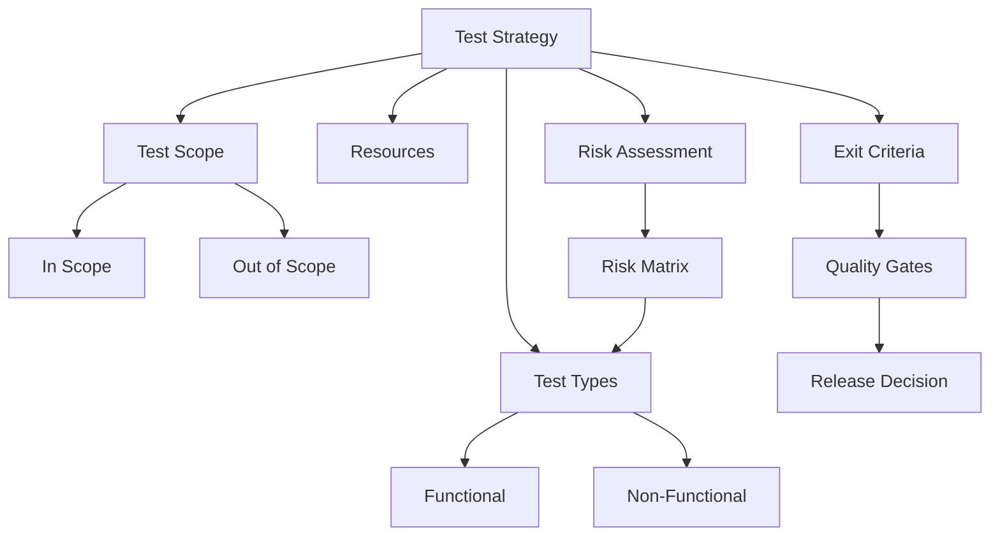

**На собеседовании** важно показать две вещи: стратегия — живой артефакт (пересматривается при смене scope, технологий, команды), и она связывает бизнес-цели с техническим подходом. Слабый ответ — перечислить типы тестов; сильный — объяснить, почему именно такой набор и пропорция для конкретного продукта.

## Q2. (!) Что такое `Testing Pyramid` и как её применять?

`Testing Pyramid` — модель распределения тестов по уровням (Майк Кон, «Succeeding with Agile»): много быстрых и дешёвых тестов внизу, мало медленных и дорогих наверху.

**Зачем такая форма.** Чем выше уровень, тем медленнее тест и тем шире зона, в которой он может «упасть по чужой вине» (хрупкость). Поэтому основную проверку логики выносят вниз, где обратная связь мгновенная и причина падения очевидна, а наверху оставляют лишь несколько тестов, подтверждающих, что система собрана в работающее целое.

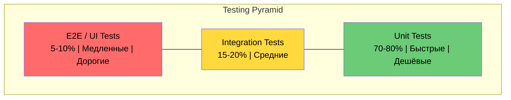

### Характеристики уровней

| Уровень | Доля | Скорость | Стоимость | Обнаруживает |
|---------|------|----------|-----------|-------------|
| `Unit` | 70-80% | мс | Низкая | Логика, алгоритмы, edge cases |
| `Integration` | 15-20% | секунды | Средняя | Взаимодействие компонентов, контракты |
| `E2E` | 5-10% | минуты | Высокая | Полный UX, системная интеграция |

### Применение в `CI/CD`

```yaml
# CI Pipeline с учётом Testing Pyramid
stages:
  - static-analysis   # Линтеры, SonarQube
  - unit-tests         # 70-80% тестов, < 2 мин
  - integration-tests  # 15-20%, Testcontainers
  - e2e-tests          # 5-10%, могут быть нестабильны
  - deploy
```

**Когда пропорции меняются.** В [микросервисах](../architecture/microservices-interview.md) основная сложность лежит во взаимодействии сервисов, а не внутри отдельного компонента, поэтому доля интеграционных и контрактных тестов растёт — пирамида «толстеет» в середине. Пирамида задаёт принцип (быстрых тестов больше дорогих), а не жёсткие проценты.

## Q3. Какие существуют `Testing Quadrants`?

`Testing Quadrants` — модель (Брайан Марик, развита Лизой Криспин и Джанет Грегори), которая раскладывает тесты по двум осям и помогает не забыть ни один вид проверок. Оси: **поддержка команды vs. критика продукта** (помогаем строить или ищем дыры в готовом) и **технология vs. бизнес** (на каком языке формулируется тест).

Пирамида отвечает «сколько каких тестов», квадранты — «какие именно цели мы вообще должны покрыть». Они дополняют друг друга.

```mermaid
quadrantChart
    title Testing Quadrants
    x-axis "Technology Facing" --> "Business Facing"
    y-axis "Supporting the Team" --> "Critiquing the Product"
    quadrant-1 Q3: Exploratory, Usability, UAT
    quadrant-2 Q4: Performance, Security, Load
    quadrant-3 Q2: Acceptance, BDD, Functional
    quadrant-4 Q1: Unit, Integration, API
```

| Квадрант | Фокус | Примеры тестов | Подход |
|----------|-------|----------------|--------|
| **Q1** — Технология, поддержка | Качество кода | `Unit`, `Integration`, `API`, `Contract` | Автоматизация |
| **Q2** — Бизнес, поддержка | Бизнес-логика | `Acceptance`, `BDD`, `Functional` | Автоматизация |
| **Q3** — Бизнес, критика | Пользовательский опыт | `Exploratory`, `Usability`, `UAT`, `A/B` | Ручное |
| **Q4** — Технология, критика | NFR | `Performance`, `Security`, `Load` | Автоматизация + ручное |

**На собеседовании** покажите понимание баланса: зрелая стратегия закрывает все четыре квадранта, но пропорции зависят от продукта. Финтех вложится в Q4 (безопасность, нагрузка), стартап на ранней стадии — в Q2 и Q3 (быстро проверить, что фича вообще нужна и удобна).

## Q4. (!) В чём разница между `Test Pyramid` и `Test Trophy`?

Обе модели задают распределение тестов, но расставляют акценты по-разному. `Test Pyramid` ставит в основу `unit`-тесты, `Test Trophy` (Кент Доддс) — `integration`, исходя из тезиса «пишите тесты так, как пользуются вашим кодом»: больше уверенности даёт проверка реального взаимодействия частей, а не каждого метода в изоляции.

| Аспект | `Test Pyramid` (Майк Кон) | `Test Trophy` (Кент Доддс) |
|--------|---------------------------|----------------------------|
| Фокус | Много `unit`, мало `e2e` | Фокус на `integration` |
| `Unit` тесты | 70-80% | Только для сложной логики |
| `Integration` тесты | 15-20% | Основная масса тестов |
| `E2E` тесты | 5-10% | Минимум, критический путь |
| `Static Analysis` | Отдельно | Основание трофея |
| Лучше для | Библиотеки, утилиты, backend | Веб-приложения, API с БД |

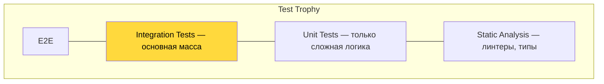

**Как выбрать.** Модель диктуется архитектурой, а не модой. Для библиотеки или утилиты с богатой логикой выигрывает пирамида: ценность — в корректности алгоритмов, их дешевле всего ловить юнит-тестами. Для веб-приложения с БД, где основной риск — на стыках слоёв (контроллер ↔ сервис ↔ репозиторий ↔ SQL), эффективнее `Test Trophy`: `@SpringBootTest` с `Testcontainers` проверяет реальное взаимодействие за один тест (подробнее в [вопросах по интеграционному тестированию](integration-testing-interview.md)).

## Q5. Что такое `Test Strategy Document` и что в него входит?

`Test Strategy Document` — документ, который фиксирует подход к тестированию на уровне проекта или организации, чтобы решения не жили только в головах. Его смысл — единое понимание у команды, QA и стейкхолдеров: что проверяем, чем, по каким критериям выпускаем. Не путать с `Test Plan` — тот описывает конкретный релиз или фичу, а стратегия задаёт общие рамки.

### Структура документа

1. **Objectives** — цели тестирования (предотвращение дефектов, обеспечение качества)
2. **Scope** — что тестируем (in/out of scope)
3. **Test Levels** — unit, integration, system, acceptance
4. **Test Types** — functional, performance, security
5. **Entry/Exit Criteria** — когда начинаем и когда заканчиваем
6. **Risk Assessment** — оценка рисков и приоритизация
7. **Tools & Infrastructure** — фреймворки, CI/CD, окружения
8. **Roles & Responsibilities** — кто за что отвечает
9. **Metrics & Reporting** — какие метрики собираем
10. **Defect Management** — процесс работы с дефектами

**На собеседовании** полезно упомянуть, что документ живой: обновляется на ретроспективах и при смене контекста. Мёртвый Test Strategy Document, который никто не читает после первого спринта, хуже его отсутствия — он создаёт ложную уверенность, что процесс под контролем.

## Q6. (!) Что такое `TDD` и как работает цикл `Red-Green-Refactor`?

`TDD` (`Test-Driven Development`) — практика, при которой тест пишется **до** кода и управляет его дизайном. Это не «тестирование», а способ проектирования: тест формулирует, что метод должен делать, ещё до того как появилась реализация. Цикл повторяется маленькими шагами.

- **Red** — пишем падающий тест на ещё не существующее поведение. Он должен упасть — это доказывает, что тест вообще что-то проверяет.
- **Green** — пишем минимальный код, чтобы тест прошёл. На этом шаге «красиво» не нужно, нужно «зелёно».
- **Refactor** — улучшаем дизайн, не меняя поведения. Зелёные тесты — страховка: если рефакторинг что-то сломал, они тут же покраснеют.

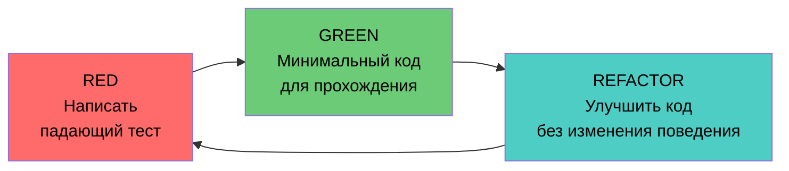

### Пример цикла `TDD` в Java

```java
// === STEP 1: RED — пишем падающий тест ===
@Test
void shouldCalculateDiscountForPremiumCustomer() {
    PriceCalculator calculator = new PriceCalculator();
    Money price = Money.of(100, "USD");

    Money discounted = calculator.applyDiscount(price, CustomerType.PREMIUM);

    assertEquals(Money.of(80, "USD"), discounted); // 20% скидка
}

// === STEP 2: GREEN — минимальная реализация ===
public class PriceCalculator {
    public Money applyDiscount(Money price, CustomerType type) {
        if (type == CustomerType.PREMIUM) {
            return price.multiply(0.8);
        }
        return price;
    }
}

// === STEP 3: REFACTOR — улучшаем дизайн ===
public class PriceCalculator {
    private static final Map<CustomerType, BigDecimal> DISCOUNT_RATES = Map.of(
        CustomerType.PREMIUM, new BigDecimal("0.80"),
        CustomerType.VIP, new BigDecimal("0.70"),
        CustomerType.REGULAR, BigDecimal.ONE
    );

    public Money applyDiscount(Money price, CustomerType type) {
        BigDecimal rate = DISCOUNT_RATES.getOrDefault(type, BigDecimal.ONE);
        return price.multiply(rate);
    }
}
```

### Три правила `TDD` (Роберт Мартин)

1. Не писать production-код без падающего теста.
2. Писать ровно столько теста, чтобы он упал (даже не скомпилироваться — уже падение).
3. Писать ровно столько кода, чтобы текущий тест прошёл.

**Что даёт TDD на практике.** Тесты появляются автоматически и покрывают именно поведение, а не «постфактум для метрики». Код выходит тестируемым по построению (мелкие методы, явные зависимости). А необходимость сначала написать тест заставляет продумать API класса со стороны его пользователя.

**Подводный камень:** TDD плохо ложится на задачи, где дизайн ещё не ясен (исследовательский код, прототипы). Там сначала «набрасывают» решение, и только закрепив форму, покрывают тестами. Подробнее о написании юнит-тестов — в [вопросах по unit-тестированию](unit-testing-interview.md).

## Q7. (!) Что такое `BDD` и как его реализовать с `Cucumber`?

`BDD` (`Behavior-Driven Development`) — развитие `TDD` в сторону бизнеса: поведение системы описывается на полуестественном языке (`Gherkin`) в формате исполняемых спецификаций (executable specifications). Один и тот же текст служит и требованием, которое читает аналитик, и тестом, который запускает CI.

**Зачем это нужно.** BDD закрывает разрыв между «что хотел бизнес» и «что написал разработчик». Сценарий `Given / When / Then` обсуждается всей командой до кода, поэтому недопонимание ловится на словах, а не на проде. Это меняет фокус с «как мы это тестируем» на «как система должна себя вести».

### Пример `Gherkin`-сценария

```gherkin
Feature: Корзина покупок
  Как покупатель
  Я хочу управлять корзиной
  Чтобы оформить заказ

  Scenario: Добавление товара в корзину
    Given пустая корзина
    When я добавляю товар "Книга" по цене 500 руб
    Then в корзине 1 товар
    And итого 500 руб

  Scenario Outline: Скидка по количеству
    Given корзина с <количество> товарами по <цена> руб
    When применяется скидка
    Then итого <итого> руб

    Examples:
      | количество | цена | итого |
      | 3          | 100  | 270   |
      | 5          | 100  | 450   |
      | 10         | 100  | 800   |
```

### Реализация step definitions с `Cucumber` + `Spring Boot`

```java
@CucumberContextConfiguration
@SpringBootTest
public class ShoppingCartSteps {

    @Autowired
    private ShoppingCartService cartService;

    private ShoppingCart cart;

    @Given("пустая корзина")
    public void emptyCart() {
        cart = cartService.createCart();
    }

    @When("я добавляю товар {string} по цене {int} руб")
    public void addItem(String name, int price) {
        cart = cartService.addItem(cart.getId(), name, BigDecimal.valueOf(price));
    }

    @Then("в корзине {int} товар(ов)")
    public void cartContainsItems(int count) {
        assertEquals(count, cart.getItems().size());
    }

    @Then("итого {int} руб")
    public void totalEquals(int expectedTotal) {
        assertEquals(BigDecimal.valueOf(expectedTotal), cart.getTotal());
    }
}
```

### Сравнение `TDD` vs `BDD`

| Аспект | `TDD` | `BDD` |
|--------|-------|-------|
| Язык | Код (Java) | `Gherkin` (Given/When/Then) |
| Аудитория | Разработчики | Вся команда + бизнес |
| Уровень | `Unit` / `Integration` | `Feature` / `Acceptance` |
| Инструменты | `JUnit`, `Mockito` | `Cucumber`, `JBehave` |
| Фокус | Качество кода | Спецификация поведения |

## Q8. Что такое `ATDD` и чем он отличается от `TDD` и `BDD`?

`ATDD` (`Acceptance Test-Driven Development`) — практика, при которой приёмочные тесты (acceptance tests) формулируются совместно с бизнесом **до** начала разработки и становятся определением «готово» для фичи.

**Чем отличается от TDD и BDD.** Все три — «тест раньше кода», но на разных уровнях и для разных людей. TDD — про дизайн классов и адресован разработчику. BDD — про то, как описать поведение понятным языком. ATDD — про согласование критериев приёмки со всеми стейкхолдерами до спринта, чтобы команда не сделала «не то». На практике их часто комбинируют: ATDD задаёт цель спринта, BDD описывает сценарии, TDD ведёт внутреннюю реализацию.

### Процесс `ATDD`

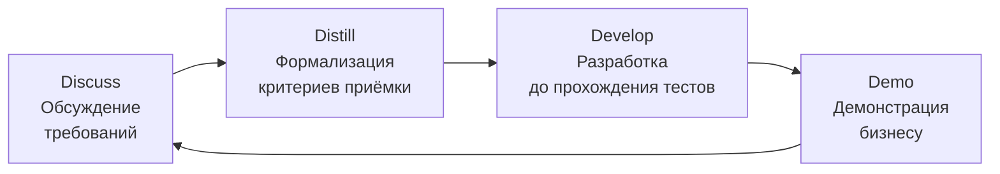

| Аспект | `TDD` | `BDD` | `ATDD` |
|--------|-------|-------|--------|
| Фокус | Код | Поведение | Приёмка |
| Участники | Разработчик | Dev + QA + BA | Все стейкхолдеры |
| Уровень | `Unit` | `Feature` | `System` |
| Когда пишут тесты | Перед кодом | Перед кодом | Перед спринтом |
| Инструменты | `JUnit` | `Cucumber` | `FitNesse`, `Concordion` |

## Q9. Как реализовать `Test-First` подход на практике?

`Test-First` — дисциплина писать тест до реализации. На практике она держится не на силе воли, а на нескольких рабочих привычках.

1. **Начинать с критериев приёмки** — сначала чётко сформулировать, что значит «работает», иначе непонятно, какой тест писать.
2. **Писать один тест за раз** — не проектировать весь набор сразу; следующий тест подскажет следующий шаг реализации.
3. **Минимальная реализация** — ровно столько кода, чтобы текущий тест прошёл, без работы «на будущее».
4. **Рефакторить после зелёного** — чистить дизайн под защитой уже работающих тестов.
5. **Закреплять quality gates** — CI не пропускает код без тестов, иначе дисциплина размывается под давлением сроков.

Ниже — как это выглядит на валидаторе email: каждый новый тест добавляет один кейс, а реализация дорастает до него инкрементально.

```java
// Практический пример: TDD для валидатора email
// 1. Начинаем с простейшего случая
@Test
void shouldRejectNull() {
    assertFalse(new EmailValidator().isValid(null));
}

// 2. Добавляем следующий кейс
@Test
void shouldAcceptValidEmail() {
    assertTrue(new EmailValidator().isValid("user@example.com"));
}

// 3. Граничные случаи
@Test
void shouldRejectEmailWithoutAt() {
    assertFalse(new EmailValidator().isValid("userexample.com"));
}

// Реализация растёт инкрементально
public class EmailValidator {
    private static final Pattern EMAIL = Pattern.compile(
        "^[\\w.+-]+@[\\w.-]+\\.[a-zA-Z]{2,}$"
    );

    public boolean isValid(String email) {
        return email != null && EMAIL.matcher(email).matches();
    }
}
```

## Q10. (!) Что такое `Property-Based Testing`?

`Property-Based Testing` — подход, при котором вместо конкретных примеров («на входе [3,1,2] ждём [1,2,3]») описываются **свойства** (invariants), верные для любых входных данных. Фреймворк сам генерирует сотни случайных входов и проверяет, что свойство держится.

**В чём сила.** Пример-тесты проверяют только те случаи, которые придумал автор, — а баги обычно прячутся именно в незадуманных. PBT перебирает пространство входов за вас и при падении выполняет **shrinking**: ужимает упавший вход до минимального воспроизводящего примера (например, не список из 200 элементов, а `[0, 0]`), что резко упрощает отладку. Для сортировки достаточно трёх свойств: размер не меняется, результат упорядочен, элементы те же — и они покрывают бесконечно много входов.

### Пример с `jqwik` (Java)

```java
import net.jqwik.api.*;

class SortPropertyTest {

    @Property
    void sortedListShouldHaveSameSize(@ForAll List<Integer> list) {
        List<Integer> sorted = new ArrayList<>(list);
        Collections.sort(sorted);
        assertThat(sorted).hasSameSizeAs(list);
    }

    @Property
    void sortedListShouldBeOrdered(@ForAll List<Integer> list) {
        List<Integer> sorted = new ArrayList<>(list);
        Collections.sort(sorted);
        for (int i = 0; i < sorted.size() - 1; i++) {
            assertThat(sorted.get(i)).isLessThanOrEqualTo(sorted.get(i + 1));
        }
    }

    @Property
    void sortedListShouldContainSameElements(@ForAll List<Integer> list) {
        List<Integer> sorted = new ArrayList<>(list);
        Collections.sort(sorted);
        assertThat(sorted).containsExactlyInAnyOrderElementsOf(list);
    }
}
```

### Когда использовать

| Подходит | Не подходит |
|----------|-------------|
| Алгоритмы (сортировка, поиск) | UI тесты |
| Сериализация/десериализация | Тесты интеграции с внешними системами |
| Математические вычисления | Бизнес-логика с фиксированными правилами |
| Парсеры, валидаторы | E2E сценарии |

**Главная сложность** — придумать свойства. Удобный приём: искать инварианты («round-trip»: `parse(serialize(x)) == x`), сравнивать с эталонной (пусть медленной) реализацией или проверять отношения вместо точных значений. `jqwik` интегрируется с `JUnit 5` и запоминает упавшие кейсы в файле `.jqwik-database`, поэтому при следующем запуске сразу прогоняет именно проблемный вход — обратная связь остаётся быстрой.

## Q11. (!) Что такое `Shift-Left Testing`?

`Shift-Left Testing` — подход, при котором проверки качества сдвигаются «влево» по временной шкале проекта, то есть ближе к началу разработки, а не в конец перед релизом. «Влево» — потому что на типичной диаграмме фаз время идёт слева направо.

**Зачем сдвигать.** Стоимость исправления дефекта растёт по мере его «старения»: ошибка в требованиях, найденная на дизайне, — это правка пары строк, а та же ошибка, найденная в production, — инцидент, откат и потеря доверия. Shift-Left не добавляет тестирование, а перераспределяет его: ловить дефекты там, где они дешевле всего.

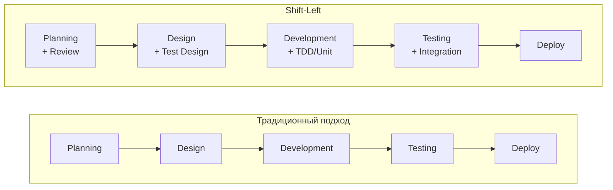

### Практики `Shift-Left`

1. **Static Analysis** — линтеры, `SonarQube`, `SpotBugs` уже на этапе коммита
2. **TDD** — тесты до кода (см. [unit-тестирование](unit-testing-interview.md))
3. **Code Review с чек-листом тестируемости** — DI, SRP, минимум статики
4. **Pair Programming** — разработчик + тестировщик
5. **Continuous Testing в CI** — тесты на каждый коммит

### Принцип: предотвращение важнее обнаружения

Идея Shift-Left глубже, чем «тестировать раньше»: лучшая ошибка — та, которой не случилось. Ревью требований, статический анализ и TDD не столько ловят дефекты, сколько мешают им появиться. Эмпирическое правило: баг, найденный на этапе дизайна, обходится в 10–100 раз дешевле того же бага в production.

## Q12. Что такое `Shift-Right Testing`?

`Shift-Right Testing` — проверка качества уже после деплоя, на реальном трафике: мониторинг, `A/B`-тесты, `canary deployments`, `synthetic monitoring`.

**Зачем, если есть Shift-Left.** Часть проблем в принципе невозможно воспроизвести до прода: реальная нагрузка, неожиданные данные пользователей, поведение под пиками, редкие комбинации браузеров. Shift-Right признаёт это и переносит часть проверок туда, где есть настоящие условия — но делает это безопасно, маленькими порциями трафика и с возможностью мгновенного отката.

### Подходы `Shift-Right`

| Подход | Описание | Инструменты |
|--------|----------|-------------|
| `Canary Deployment` | Постепенный выкат на часть пользователей | `Kubernetes`, `Istio` |
| `A/B Testing` | Сравнение двух вариантов | `LaunchDarkly`, `Unleash` |
| `Synthetic Monitoring` | Автоматические проверки в production | `Datadog`, `New Relic` |
| `Chaos Engineering` | Инъекция сбоев для проверки отказоустойчивости | `Chaos Monkey`, `Litmus` |
| `Feature Flags` | Контроль доступа к фичам | `Unleash`, `Flagsmith` |

**Ключевая оговорка:** Shift-Right не заменяет проверки до релиза, а **дополняет** их. Выкатывать заведомо сырой код в надежде «поймать на проде» — антипаттерн. Подход работает только в связке с [observability](../monitoring/observability-interview.md): без метрик, логов и трейсов вы не увидите, что канарейка деградировала, и тестирование в production превращается в тестирование на пользователях вслепую.

## Q13. (!) Как реализовать `Risk-Based Testing`?

`Risk-Based Testing` (`RBT`) — приоритизация тестов по уровню риска, где **риск = вероятность дефекта × его влияние (impact)**. Тестировать всё одинаково тщательно невозможно при ограниченных сроках, поэтому усилия концентрируют там, где цена ошибки выше.

**Логика подхода.** Сначала оцениваешь по каждому участку две вещи: насколько вероятно, что здесь скрыт баг (сложный код, частые правки, новая команда), и насколько больно будет, если он выстрелит (потеря денег, утечка данных, простой). Произведение даёт приоритет: оплата заказа важнее, чем оформление подписи в профиле, даже если кода в подписи больше.

### Матрица рисков

```text
Impact ↑
  5 │ M  H  H  C  C
  4 │ M  M  H  H  C
  3 │ L  M  M  H  H
  2 │ L  L  M  M  H
  1 │ L  L  L  M  M
    └─────────────────→ Likelihood
      1  2  3  4  5

L = Low, M = Medium, H = High, C = Critical
```

### Распределение усилий по приоритету

| Приоритет | Покрытие | Подход |
|-----------|----------|--------|
| `Critical` | 95%+ | Полное тестирование, автоматизация, мониторинг |
| `High` | 85%+ | Автоматизация, ручное тестирование |
| `Medium` | 70%+ | Автоматизация основных сценариев |
| `Low` | 50%+ | Smoke-тесты, sampling |

### Факторы для оценки

- **Вероятность (likelihood)**: сложность кода, опыт команды, история дефектов на этом участке, число внешних зависимостей.
- **Влияние (impact)**: финансовые потери, ущерб для UX и репутации, нарушение требований (`GDPR`, `PCI DSS`).

**Важно:** риск не статичен. Карту рисков пересматривают при каждом изменении scope или стека — иначе вы тщательно тестируете участок, который давно стабилизировался, и пропускаете новый «горячий».

## Q14. Что такое `Testing in Production` и какие есть подходы?

`Testing in Production` (`TiP`) — это конкретные техники реализации Shift-Right: контролируемая проверка ПО на реальных пользователях и данных. Все они объединены одной идеей — ограничить «радиус поражения» и иметь путь отступления.

1. **Canary Deployment** — новая версия получает 1–5% трафика; если её метрики хуже, выкат останавливают, не задев большинство пользователей.
2. **Blue-Green Deployment** — два идентичных окружения; трафик переключают целиком, а откат — это мгновенное переключение обратно.
3. **A/B Testing** — два варианта работают параллельно, выбор делается по бизнес-метрикам (конверсия), а не по «нравится/не нравится».
4. **Synthetic Monitoring** — искусственные запросы по критическим путям проверяют, что система жива, ещё до того как сломается реальный пользователь.
5. **Dark Launching** — код выполняется на реальном трафике, но результат не показывается; так проверяют нагрузку и корректность нового пути без риска для UX.

```java
// Пример Canary: проверка метрик нового релиза
@Service
public class CanaryHealthCheck {

    private final MetricsService metrics;

    public boolean isCanaryHealthy(String version, Duration window) {
        double errorRate = metrics.getErrorRate(version, window);
        double p99Latency = metrics.getP99Latency(version, window);

        return errorRate < 0.01       // < 1% ошибок
            && p99Latency < 500.0;    // < 500ms p99
    }
}
```

Связано с [стратегиями деплоя](../cicd/deployment-strategies-interview.md) — без безопасного деплоя `TiP` опасен.

## Q15. (!) Что такое `Mutation Testing` и как работает `PITest`?

`Mutation Testing` — метод проверки **качества самих тестов**: «кто тестирует тестировщиков». Инструмент намеренно вносит в production-код мелкие поломки (мутации) — меняет `>` на `>=`, `+` на `-`, `true` на `false` — и прогоняет тесты. Если после поломки хоть один тест покраснел, мутант **убит** (тесты заметили); если все тесты остались зелёными, мутант **выжил** — значит, эту строку никто реально не проверяет.

**Зачем это нужно.** Покрытие строк (`line coverage`) показывает только, что строка выполнилась, а не что её поведение проверено. Можно вызвать метод без единого осмысленного `assert` и получить 100% покрытия. Mutation Testing ловит именно такие «пустые» тесты: выживший мутант — это прямое доказательство пробела в проверках.

### Типы мутаций

| Мутация | Оригинал | Мутант |
|---------|----------|--------|
| Conditionals | `a > b` | `a >= b` |
| Math | `a + b` | `a - b` |
| Return values | `return true` | `return false` |
| Void calls | `list.clear()` | удалено |
| Negation | `a == b` | `a != b` |

### Настройка `PITest` в Gradle

```groovy
plugins {
    id 'info.solidsoft.pitest' version '1.15.0'
}

pitest {
    targetClasses = ['com.example.service.*']
    targetTests = ['com.example.service.*Test']
    mutators = ['DEFAULTS']        // стандартный набор мутаций
    outputFormats = ['HTML']
    timestampedReports = false
    threads = 4
    mutationThreshold = 80         // минимальный mutation score
}
```

### Метрика: `Mutation Score`

```
Mutation Score = Killed Mutants / Total Mutants * 100%
```

- **> 80%** — хороший показатель: большинство поломок ловится.
- **< 60%** — тесты поверхностные: много строк выполняется, но почти не проверяется assertions.

**Цена и где применять.** Mutation Testing дорог: на каждую мутацию прогоняется весь набор тестов, поэтому полный прогон большого модуля идёт десятки минут. Его не гоняют на каждый коммит, а нацеливают на критичную бизнес-логику и запускают инкрементально (только изменённые классы) либо по ночам — см. Q44. Главный вывод для собеседования: 100% `line coverage` ничего не гарантирует, а `mutation score` показывает реальную строгость тестов.

## Q16. Что такое `Exploratory Testing` и как совмещать с автоматизацией?

`Exploratory Testing` — ручное исследование приложения, где тестировщик одновременно проектирует, выполняет и оценивает тесты, опираясь на то, что увидел минуту назад. Заранее написанного скрипта нет: следующий шаг диктует поведение системы.

**Где его сила.** Автоматизация хороша в том, что уже известно: она быстро повторяет заданные проверки. Но она не задаёт вопрос «а что если…» и не замечает странностей, которые не были запрограммированы. Exploratory покрывает именно эту слепую зону — находит то, о чём никто не догадался написать тест. Поэтому он не конкурент автоматизации, а её дополнение.

### Совмещение с автоматизацией

| Автоматизация | Exploratory |
|---------------|-------------|
| Регрессионные сценарии | Новые области, креативные сценарии |
| Повторяемые проверки | Edge cases, "а что если..." |
| `CI/CD` pipeline | Спринтовые сессии (time-boxed) |

### Практика: `Session-Based Test Management`

1. Выделить **time-box** (60-90 мин)
2. Определить **charter** (область исследования)
3. Документировать **findings** (баги, вопросы, идеи)
4. **Автоматизировать** найденные баги как регрессионные тесты

**На собеседовании** важно подчеркнуть: exploratory testing — это не «случайное кликание», а структурированная деятельность. У каждой сессии есть charter (что исследуем), time-box (когда останавливаемся) и фиксация находок — иначе результат невозможно воспроизвести и передать команде.

## Q17. Что такое `Flaky Tests` и как с ними бороться?

`Flaky Tests` — тесты, которые на одном и том же коде то проходят, то падают без всякой причины во входных данных. Главный вред не в самих падениях, а в том, что они разрушают доверие: когда «красное» бывает ложным, команда начинает перезапускать сборку «на удачу» и в итоге пропускает настоящие баги, замаскированные под флаки.

**Почему так происходит.** Флакинесс почти всегда означает скрытую зависимость от чего-то недетерминированного — времени, порядка выполнения, сети, гонок потоков, общего состояния. Тест не «случайно ломается», он зависит от условия, которое мы не контролируем. Лечение — найти и устранить эту зависимость, а не добавить retry.

### Причины

| Причина | Пример | Решение |
|---------|--------|---------|
| Зависимость от времени | `Thread.sleep()`, таймзоны | `Awaitility`, `Clock` injection |
| Порядок выполнения | Shared state между тестами | `@DirtiesContext`, изоляция |
| Внешние зависимости | Сеть, API, файлы | `WireMock`, `Testcontainers` |
| Race conditions | Многопоточность | `CountDownLatch`, `CompletableFuture` |
| Ресурсы | Порты, память | Рандомные порты, cleanup |

### Стратегия борьбы

```java
// Вместо Thread.sleep — Awaitility
import static org.awaitility.Awaitility.*;

@Test
void shouldProcessAsyncEvent() {
    eventPublisher.publish(new OrderCreated(orderId));

    await()
        .atMost(Duration.ofSeconds(5))
        .pollInterval(Duration.ofMillis(100))
        .untilAsserted(() -> {
            Order order = orderRepository.findById(orderId);
            assertThat(order.getStatus()).isEqualTo(Status.PROCESSED);
        });
}
```

1. **Мониторинг**: измерять flaky rate (цель < 1%) — без цифры проблему не видно и она тихо разрастается.
2. **Карантин**: помечать `@Tag("flaky")` и выносить из блокирующего pipeline, чтобы ложные падения не останавливали поставку.
3. **Починить или удалить**: карантин — временная мера. Если тест нельзя стабилизировать за пару спринтов, его удаляют: флакающий тест не защищает от багов, а только создаёт шум.

## Q18. Какие стратегии тестирования микросервисов?

Тестирование [микросервисов](../architecture/microservices-interview.md) добавляет уровни, которых нет в монолите, потому что главный риск смещается внутрь сети — в контракты между сервисами и их взаимодействие, а не в логику отдельного класса. Поэтому к привычным unit/integration/E2E добавляют **component** (сервис целиком в изоляции) и **contract** (совместимость API между парами сервисов).

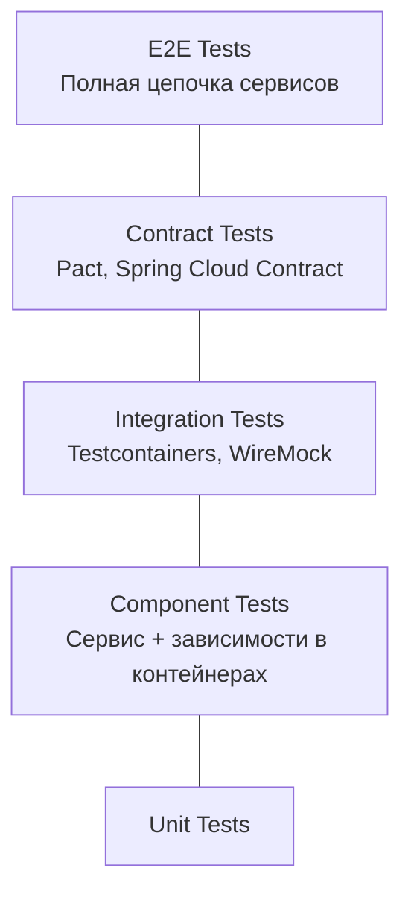

### Ключевые подходы

1. **Consumer-Driven Contract Testing** (`Pact`) — потребитель фиксирует, что именно он ждёт от API, а провайдер проверяет, что не сломал этих ожиданий. Заменяет дорогие сквозные E2E на быстрые независимые проверки.
2. **Service Virtualization** (`WireMock`) — внешние сервисы заменяются управляемой заглушкой, чтобы тестировать поведение при их таймаутах и ошибках, не имея доступа к реальным.
3. **Component Testing** — сервис со своей БД/кешем в контейнерах, внешние сервисы замоканы; проверяет сервис как единое целое, но без зависимости от остального ландшафта.
4. **Chaos Engineering** — намеренная инъекция сбоев, чтобы убедиться, что отказ одного сервиса не роняет всю цепочку.

```java
// WireMock: виртуализация внешнего сервиса
@SpringBootTest
@AutoConfigureWireMock(port = 0)
class OrderServiceTest {

    @Test
    void shouldHandlePaymentTimeout() {
        stubFor(post("/api/payments")
            .willReturn(aResponse()
                .withFixedDelay(10_000)
                .withStatus(504)));

        assertThrows(PaymentTimeoutException.class,
            () -> orderService.placeOrder(request));
    }
}
```

## Q19. (!) Как тестировать legacy код?

Главная трудность legacy-кода — порочный круг: чтобы безопасно его менять, нужны тесты, но код не покрыт тестами именно потому, что не был спроектирован тестируемым (жёсткие зависимости, статика, длинные методы). Майкл Фезерс в «Working Effectively with Legacy Code» даёт само определение: legacy — это любой код без тестов. Выход из круга — сначала зафиксировать текущее поведение, затем аккуратно разорвать зависимости, и только потом рефакторить.

### Пошаговый подход

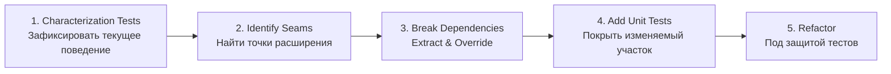

### Техники

| Техника | Описание |
|---------|----------|
| `Characterization Test` | Тест, фиксирующий текущее поведение (даже если оно "неправильное") |
| `Sprout Method` | Новая логика — в новый тестируемый метод |
| `Sprout Class` | Новая логика — в новый тестируемый класс |
| `Wrap Method` | Обернуть legacy-метод в wrapper для тестируемости |
| `Extract & Override` | Выделить зависимость в protected метод, переопределить в тесте |

```java
// Characterization test: фиксируем текущее поведение
@Test
void characterizeDiscountCalculation() {
    LegacyPriceService service = new LegacyPriceService();

    // Документируем что СЕЙЧАС возвращает метод
    BigDecimal result = service.calculateDiscount(100, "GOLD");
    assertEquals(new BigDecimal("15.00"), result);
    // Теперь если кто-то изменит логику — тест упадёт
}

// Sprout Method: новая логика в отдельный тестируемый метод
public class LegacyOrderProcessor {
    // Legacy метод — не трогаем
    public void processOrder(Order order) { /* ... */ }

    // Новый метод — можно тестировать
    public ValidationResult validateOrder(Order order) {
        if (order.getItems().isEmpty()) return ValidationResult.error("No items");
        if (order.getTotal().compareTo(BigDecimal.ZERO) <= 0)
            return ValidationResult.error("Invalid total");
        return ValidationResult.ok();
    }
}
```

**Эмпирическое правило** работы с legacy: не пытаться покрыть всё сразу — это нереально и не окупается. Тесты добавляют только вокруг участка, который сейчас правят (правило бойскаута: оставь код чуть чище, чем нашёл). Так покрытие растёт там, где идёт работа, а не там, где код мёртв и стабилен.

## Q20. Как тестировать `Distributed Systems`?

Тестирование [распределённых систем](../architecture/distributed-systems-interview.md) сложнее не из-за объёма, а из-за природы: сеть ненадёжна, операции асинхронны, согласованность данных — отложенная (`eventual consistency`). Баги живут не внутри сервисов, а на стыках и во времени — поэтому ключ к стратегии не «больше тестов», а целенаправленная проверка сценариев сбоя, которые в монолите просто не возникают.

### Стратегия по уровням

| Уровень | Что тестируем | Инструменты |
|---------|---------------|-------------|
| Unit | Логика отдельных компонентов | `JUnit`, `Mockito` |
| Component | Сервис + зависимости | `Testcontainers` |
| Contract | Интерфейсы между сервисами | `Pact`, `Spring Cloud Contract` |
| Integration | Реальное взаимодействие | `Docker Compose` |
| Chaos | Отказоустойчивость | `Chaos Monkey`, `Toxiproxy` |
| E2E | Полная цепочка | Staging environment |

### Граничные случаи, которые легко забыть

Именно эти сценарии отличают тестирование распределённой системы от монолита — каждый из них надо проверять явно:

- **Таймауты**: что делает вызывающий, когда ответ не пришёл вовремя — падает, ретраит, отдаёт fallback?
- **Повторные вызовы (retry)**: идемпотентна ли операция? Повторный «создать заказ» не должен породить два заказа.
- **Частичные сбои (partial failures)**: сервис A ответил, B — нет; в каком состоянии остаются данные и как система из него выходит.
- **Отложенная согласованность**: чтение сразу после записи может вернуть старые данные — тест должен это допускать, а не считать багом.
- **Разрыв сети (network partition)**: часть кластера недоступна; продолжает ли система работать в деградированном режиме.

## Q21. Как тестировать `Event-Driven Architecture`?

В [event-driven архитектуре](../architecture/event-driven-patterns-interview.md) связь между сервисами не прямая, а через события, поэтому проверять надо всю цепочку: продюсер → топик → консьюмер. Сложность в том, что обработка асинхронна — нельзя просто проверить ответ сразу после вызова, нужно дождаться, пока консьюмер обработает событие.

Удобно разделить проверки на два уровня: unit подтверждает, что продюсер формирует правильное событие, а integration (с реальным брокером в Testcontainers) — что событие действительно доходит до консьюмера и приводит к нужному изменению состояния.

### Уровни тестирования

```java
// 1. Unit: проверяем формирование события
@Test
void shouldPublishOrderCreatedEvent() {
    OrderService service = new OrderService(eventPublisher);
    service.createOrder(request);

    verify(eventPublisher).publish(argThat(event ->
        event.getType().equals("ORDER_CREATED")
        && event.getOrderId().equals(orderId)));
}

// 2. Integration: Testcontainers + Kafka
@SpringBootTest
@Testcontainers
class KafkaIntegrationTest {

    @Container
    static KafkaContainer kafka = new KafkaContainer(
        DockerImageName.parse("confluentinc/cp-kafka:7.5.0"));

    @Test
    void shouldProcessEventEndToEnd() {
        kafkaTemplate.send("orders", orderEvent);

        await().atMost(Duration.ofSeconds(10))
            .untilAsserted(() -> {
                Order saved = orderRepo.findById(orderId);
                assertThat(saved.getStatus()).isEqualTo(CONFIRMED);
            });
    }
}
```

### Contract Testing для событий

В EDA контракт — это **схема события**, а не сигнатура метода. Если продюсер поменяет формат, консьюмеры узнают об этом не на компиляции, а в рантайме, когда не смогут разобрать сообщение. Поэтому схемы (`Avro`, `JSON Schema`) регистрируют в `Schema Registry` и проверяют на совместимость: реестр не даёт выкатить ломающее изменение формата. Подробнее о Kafka — в [вопросах по Kafka](../messaging/kafka-interview.md).

## Q22. Что такое `Consumer-Driven Contract Testing`?

`Consumer-Driven Contract Testing` — подход, где направление задаёт **потребитель**: он описывает, какие запросы шлёт и какие ответы ждёт, а **провайдер** обязан этим ожиданиям соответствовать. Контракт идёт «снизу вверх» — от того, кто использует API, к тому, кто его реализует.

**Какую проблему решает.** Без контрактов единственный способ убедиться, что сервисы совместимы, — гонять их вместе в E2E: медленно, хрупко, дорого поднимать всё окружение. Контрактные тесты разрывают эту связку: consumer и provider тестируются по отдельности и быстро, а артефакт-контракт (через Pact Broker) гарантирует, что они «договорились». Бонус: provider видит, какие именно поля реально нужны потребителям, и понимает, что можно менять безопасно.

### Пример с `Pact`

```java
// Consumer side: определяем ожидания
@ExtendWith(PactConsumerTestExt.class)
@PactTestFor(providerName = "UserService")
class OrderServiceContractTest {

    @Pact(consumer = "OrderService")
    public V4Pact userExists(PactDslWithProvider builder) {
        return builder
            .given("User 123 exists")
            .uponReceiving("get user by id")
                .path("/api/users/123")
                .method("GET")
            .willRespondWith()
                .status(200)
                .body(newJsonBody(body -> {
                    body.numberType("id", 123);
                    body.stringType("name", "John");
                    body.stringType("email", "john@example.com");
                }).build())
            .toPact(V4Pact.class);
    }

    @Test
    @PactTestFor(pactMethod = "userExists")
    void shouldFetchUser(MockServer mockServer) {
        UserClient client = new UserClient(mockServer.getUrl());
        User user = client.getUser(123L);

        assertThat(user.getName()).isEqualTo("John");
    }
}
```

### Workflow

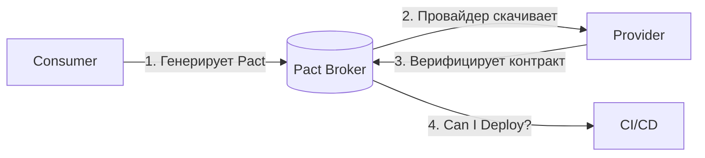

## Q23. Что такое `Chaos Engineering`?

`Chaos Engineering` — практика намеренно ломать систему в управляемых условиях, чтобы узнать, как она ведёт себя при сбоях, **до** того как сбой случится сам. Это эксперимент, а не вандализм: сначала формулируют гипотезу о устойчивости, затем проверяют её на реальной системе.

**Зачем, если есть обычные тесты.** Отказоустойчивость заявляют в дизайне («у нас circuit breaker, ретраи, реплики»), но проверяют редко — и узнают, что она не работает, во время настоящего инцидента. Chaos Engineering превращает это предположение в проверяемый факт. Ключевые принципы: **выдвинуть гипотезу** («при падении одной реплики latency не вырастет»), **минимизировать радиус поражения** (начинать с малого, в идеале на части трафика), **наблюдать** за метриками и **автоматизировать** удачные эксперименты, чтобы регресс ловился постоянно.

### Типы экспериментов

| Тип | Пример | Инструмент |
|-----|--------|-----------|
| Сбой сервиса | Kill pod/container | `Chaos Monkey`, `Litmus` |
| Сетевые проблемы | Задержка, потеря пакетов | `Toxiproxy`, `tc` |
| Нагрузка на ресурсы | CPU/memory stress | `stress-ng` |
| Зависимости | Недоступность БД/кэша | `Testcontainers` stop |

```java
// Тест отказоустойчивости с circuit breaker
@SpringBootTest
@AutoConfigureWireMock(port = 0)
class CircuitBreakerChaosTest {

    @Test
    void shouldOpenCircuitBreakerOnServiceFailure() {
        // Симулируем 5 последовательных ошибок
        stubFor(get("/api/users/1")
            .willReturn(serverError()));

        // Circuit breaker должен открыться
        for (int i = 0; i < 5; i++) {
            assertThrows(ServiceException.class,
                () -> userClient.getUser(1L));
        }

        // Следующий вызов должен вернуть fallback без обращения к сервису
        User fallback = userClient.getUser(1L);
        assertThat(fallback.getName()).isEqualTo("Unknown");
    }
}
```

## Q24. (!) Какие метрики качества тестирования существуют?

Метрики делятся на три группы, отвечающие на разные вопросы: **покрытие** — сколько кода затронуто тестами, **качество** — насколько хорошо мы ловим дефекты, **процесс** — здоров ли сам тестовый набор и pipeline. Ни одна метрика не описывает качество целиком, поэтому смотрят на их сочетание.

### Метрики покрытия

| Метрика | Описание | Целевое значение |
|---------|----------|------------------|
| `Line Coverage` | % покрытых строк | > 80% |
| `Branch Coverage` | % покрытых ветвлений | > 70% |
| `Mutation Score` | % убитых мутантов | > 80% |

### Метрики качества

| Метрика | Формула | Описание |
|---------|---------|----------|
| `Defect Density` | Дефекты / KLOC | Плотность дефектов на 1000 строк |
| `Defect Leakage` | Дефекты в prod / Все дефекты | % дефектов, дошедших до production |
| `MTTD` | Среднее время обнаружения | От внедрения до обнаружения |
| `MTTR` | Среднее время исправления | От обнаружения до fix |
| `Test Effectiveness` | Дефекты от тестов / Все дефекты | Эффективность тестового набора |

### Метрики процесса

| Метрика | Целевое значение | Действия при отклонении |
|---------|------------------|------------------------|
| `Flaky Rate` | < 1% | Карантин + исправление |
| `Test Execution Time` | < 10 мин (unit) | Параллелизация, оптимизация |
| `Automation Rate` | > 70% | Автоматизация регрессии |
| `Build Success Rate` | > 95% | Анализ причин падений |

**На собеседовании** важно подчеркнуть: метрики — инструмент, а не цель (закон Гудхарта: как только метрика становится целью, её начинают накручивать). Классический пример — 100% `line coverage` без единого осмысленного assert. Поэтому `line coverage` дополняют `mutation score`, который показывает реальную строгость тестов, а не факт выполнения строк.

## Q25. Как организовать тестирование в `Agile`/`Scrum`?

Главная идея: в Agile тестирование — не отдельная фаза в конце, а сквозная активность всего спринта. В водопаде QA получал готовый продукт и тестировал «потом»; в Scrum тестирование вплетено в каждый шаг — от планирования (где определяют критерии приёмки) до ретроспективы (где разбирают качество). Это и есть практическая реализация Shift-Left на уровне процесса.

### Тестирование в Scrum-цикле

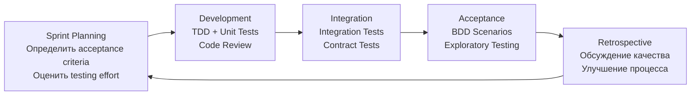

### Принципы

1. Тестирование — часть `Definition of Done`, не отдельная фаза
2. QA участвует в планировании (определяет acceptance criteria)
3. Регрессия автоматизирована и запускается в CI
4. Exploratory testing — time-boxed сессии каждый спринт
5. Ретроспектива: обсуждение покрытия, flakiness, дефектов

Подробнее о тестировании в CI/CD — в [вопросах по автоматизации тестирования](test-automation-interview.md).

## Q26. Что такое `Three Amigos` и `Definition of Done`?

### Three Amigos

Короткая встреча трёх ролей **до** начала работы над user story. Смысл — собрать три разных взгляда на задачу, пока её ещё дёшево уточнить: бизнес знает «зачем», разработчик — «как реализуемо», тестировщик — «где сломается». Так требование рождается уже согласованным, а не уточняется правками после демо.

| Роль | Фокус |
|------|-------|
| **Business Analyst** | Бизнес-ценность, acceptance criteria |
| **Developer** | Техническая реализация, ограничения |
| **Tester** | Тестовые сценарии, edge cases, риски |

Результат встречи: общее понимание задачи, готовые критерии приёмки и заранее известные зоны риска.

### Definition of Done (DoD) — чек-лист

`Definition of Done` — единый, заранее согласованный список условий, при которых задача считается завершённой. Он переводит расплывчатое «вроде готово» в проверяемый чек-лист, общий для всей команды, и не даёт «сэкономить» на тестах под давлением дедлайна — пока пункты не закрыты, задача не done.

- [ ] Код написан и прошёл code review
- [ ] Unit-тесты написаны и проходят (coverage > 80%)
- [ ] Integration-тесты написаны и проходят
- [ ] Acceptance criteria выполнены
- [ ] Нет известных critical/high дефектов
- [ ] Документация обновлена
- [ ] Feature задеплоена на staging

## Q27. Как балансировать скорость и качество тестирования?

Скорость и качество — это компромисс, а не выбор «или-или». Чем больше и медленнее тестовый набор, тем надёжнее, но тем дольше обратная связь — и разработчики начинают пропускать прогон или мёрджить «не дожидаясь». Цель — не максимум тестов, а максимум уверенности на единицу времени. Достигается это не урезанием проверок, а умным их распределением и оптимизацией.

### Стратегии оптимизации

| Стратегия | Эффект |
|-----------|--------|
| **Параллелизация** | `JUnit 5 parallel`, `Gradle --parallel` |
| **Инкрементальное тестирование** | Запуск только тестов для изменённого кода |
| **Test Impact Analysis** | Определение затронутых тестов по diff |
| **Tiered Test Execution** | Unit на каждый коммит, E2E по расписанию |
| **Оптимизация медленных тестов** | Профилирование, замена `@SpringBootTest` на `@WebMvcTest` |

```java
// JUnit 5: параллельный запуск
// junit-platform.properties
junit.jupiter.execution.parallel.enabled = true
junit.jupiter.execution.parallel.mode.default = concurrent
junit.jupiter.execution.parallel.config.fixed.parallelism = 4
```

**Главный приём** — многоуровневый запуск (tiered execution): быстрые unit-тесты гоняются на каждый коммит и дают мгновенный сигнал, а медленные E2E — по расписанию или перед релизом. Решения о балансе принимают на основе данных (время прогона, покрытие, flaky rate), а не ощущений, и пересматривают на ретроспективах.

## Q28. Что такое `Test Observability`?

`Test Observability` — это применение принципов наблюдаемости к самому тестовому набору: видеть не только «зелёный/красный» последнего прогона, но и тренды, флакинесс, скорость и слабые места во времени. Без этого тесты — чёрный ящик: команда замечает деградацию покрытия или рост нестабильности слишком поздно, по жалобам, а не по дашборду.

### Компоненты

1. **Дашборды** — покрытие, flaky rate, время выполнения, pass/fail по модулям
2. **Тренды** — как метрики меняются от спринта к спринту
3. **Алерты** — оповещение при росте flakiness или падении покрытия
4. **Трассируемость** — от теста к требованию и обратно

### Инструменты

| Инструмент | Назначение |
|------------|-----------|
| `Grafana` | Визуализация метрик тестирования |
| `Allure Report` | Детальные отчёты по тестам |
| `SonarQube` | Покрытие, дублирование, code smells |
| `Datadog CI Visibility` | Тренды CI/CD pipeline |

Связано с [observability](../monitoring/observability-interview.md) — те же принципы (метрики, логи, трейсы) применяются к тестовой инфраструктуре.

## Q29. Как организовать `Test Review`?

Ревью тестов так же важно, как ревью production-кода, но его часто пропускают — «это же тест, главное, что зелёный». А зря: плохой тест опаснее отсутствующего. Он создаёт ложное чувство защиты, ломается при безобидном рефакторинге (хрупкость) или проходит всегда, ничего реально не проверяя. Поэтому тесты ревьюят по своему чек-листу. Подробнее о ревью — в [вопросах по code review](../code-quality/code-review-interview.md).

### Чек-лист ревью тестов

1. **Корректность**: тест проверяет то, что заявлено в названии?
2. **Assertions**: осмысленные, не `assertTrue(true)`?
3. **Изоляция**: тест не зависит от порядка выполнения?
4. **Читаемость**: Given-When-Then структура, осмысленные имена?
5. **Хрупкость**: нет зависимостей от времени, порядка, конкретных данных?
6. **Покрытие**: edge cases, error paths, boundary conditions?
7. **Naming**: `shouldReturnEmptyListWhenNoUsersFound` > `test1`?

```java
// BAD: что именно тестируем?
@Test
void test1() {
    var result = service.process(input);
    assertNotNull(result);
}

// GOOD: чёткое название, структура, assertions
@Test
void shouldReturnDiscountedPriceForPremiumCustomer() {
    // Given
    var customer = TestData.premiumCustomer();
    var order = TestData.orderWithTotal(Money.of(1000));

    // When
    var price = pricingService.calculateFinalPrice(order, customer);

    // Then
    assertThat(price).isEqualTo(Money.of(800)); // 20% скидка
}
```

## Q30. Что такое `Test Doubles Strategy`?

`Test Doubles` — общий термин для всех объектов-заменителей реальных зависимостей в тесте (по аналогии с дублёром-каскадёром). Стратегия здесь — не «всё подряд замокать», а осознанно выбрать тип под цель теста: одни нужны, чтобы подсунуть данные, другие — чтобы проверить факт вызова. Неправильный выбор делает тесты либо бессмысленными, либо хрупкими.

| Тип | Когда использовать | Пример |
|-----|-------------------|--------|
| `Dummy` | Заполнитель, не используется | `new Object()` в конструкторе |
| `Stub` | Возврат данных | `when(repo.findById(1)).thenReturn(user)` |
| `Mock` | Проверка взаимодействий | `verify(emailService).send(any())` |
| `Spy` | Частичный мок реального объекта | `spy(realService)` |
| `Fake` | Упрощённая реализация | `InMemoryRepository` вместо БД |

### Принципы

- **Не переусложнять**: если тест проверяет результат, хватит `stub` — `mock` с верификацией здесь лишний.
- **Избегать чрезмерного мокирования (over-mocking)**: если в тесте моков больше, чем реального кода, это обычно сигнал о плохом дизайне — у класса слишком много зависимостей.
- **Изоляция**: каждый тест создаёт свои doubles; переиспользование между тестами связывает их через скрытое состояние и порождает флакинесс.
- **Для репозиториев предпочитать fake**: `InMemoryRepository` читается лучше и ломается реже, чем длинная цепочка `when().thenReturn()` под каждый сценарий.

Подробнее о моках и стабах — в [вопросах по unit-тестированию](unit-testing-interview.md).

## Q31. (!) Что такое `Test Containerization` и `Testcontainers`?

`Testcontainers` — библиотека, которая поднимает реальные зависимости (БД, брокеры, кэши) в Docker-контейнерах прямо из теста и сама гасит их после. Контейнер живёт ровно столько, сколько тестовый класс.

**Зачем это, если есть H2 и embedded-моки.** Заглушки врут: H2 — не PostgreSQL, и тест зелёный на H2 легко падает на проде из-за разницы в SQL-диалекте, типах или индексах. Testcontainers решает проблему «у меня работает» — тест гоняется против той же версии БД, что и в production, одинаково локально и в CI. Это превращает интеграционные тесты из приблизительных в достоверные.

```java
@SpringBootTest
@Testcontainers
class OrderRepositoryIT {

    @Container
    static PostgreSQLContainer<?> postgres =
        new PostgreSQLContainer<>("postgres:16-alpine")
            .withDatabaseName("testdb")
            .withUsername("test")
            .withPassword("test");

    @DynamicPropertySource
    static void configureProperties(DynamicPropertyRegistry registry) {
        registry.add("spring.datasource.url", postgres::getJdbcUrl);
        registry.add("spring.datasource.username", postgres::getUsername);
        registry.add("spring.datasource.password", postgres::getPassword);
    }

    @Autowired
    private OrderRepository orderRepository;

    @Test
    void shouldSaveAndRetrieveOrder() {
        Order order = new Order("item-1", BigDecimal.TEN);
        orderRepository.save(order);

        Optional<Order> found = orderRepository.findById(order.getId());
        assertThat(found).isPresent();
        assertThat(found.get().getTotal()).isEqualByComparingTo(BigDecimal.TEN);
    }
}
```

### Преимущества

- **Воспроизводимость**: одинаковое окружение локально и в CI — «работает у меня» перестаёт быть отговоркой.
- **Изоляция**: для каждого тестового класса — свежий контейнер, без утечки состояния между прогонами.
- **Реальные зависимости**: PostgreSQL вместо H2, Kafka вместо embedded — ловятся баги, которые заглушки физически не способны воспроизвести.

**Плата за это** — скорость: поднять контейнер дороже, чем дёрнуть мок, поэтому Testcontainers держат на уровне integration/component, а не unit. Подробнее — в [вопросах по интеграционному тестированию](integration-testing-interview.md).

## Q32. Как организовать `Test Environments Strategy`?

Стратегия окружений отвечает на вопрос «где гонять каждый вид тестов». Идея — лестница окружений от дешёвого и быстрого (local) к близкому к боевому (staging) и самому prod: чем выше ступень, тем реалистичнее условия и тем дороже прогон. Тесты распределяют так, чтобы дешёвые проверки отсеяли большинство проблем рано, а на дорогих окружениях оставались только те, что требуют реалистичности.

### Уровни окружений

| Окружение | Назначение | Данные | Доступ |
|-----------|-----------|--------|--------|
| `Local` | Разработка | Фикстуры, `Testcontainers` | Разработчик |
| `CI` | Автоматические тесты | Сгенерированные | Pipeline |
| `Staging` | Pre-production проверка | Анонимизированные production | Команда |
| `Production` | Canary, monitoring | Реальные | Контролируемый |

### Принципы

1. **Staging ≈ Production** по конфигурации, но с анонимизированными данными — иначе тест на staging ничего не говорит о поведении в бою.
2. **Infrastructure as Code** — окружения поднимаются автоматически и одинаково; ручная настройка плодит «снежинки» с уникальными расхождениями.
3. **Изоляция** — параллельные тесты не делят состояние, иначе появляется флакинесс из-за гонок за данные.
4. **Seed-данные** — известный стартовый набор загружается автоматически, чтобы тесты были детерминированы.
5. **Feature Flags** — доступ к фичам контролируется на каждом окружении, что позволяет включать незавершённое только там, где это безопасно.

## Q33. Как организовать `Test Data Management`?

Тестовые данные — частая причина хрупких и непонятных тестов. Если данные «спрятаны» в общем дампе или зависят от состояния БД, тест ломается от чужих изменений, а при падении невозможно понять, какой именно вход его вызвал. Хорошая стратегия делает данные **явными, локальными для теста и воспроизводимыми**: каждый тест сам создаёт ровно то, что ему нужно.

### Подходы

| Подход | Описание | Когда использовать |
|--------|----------|-------------------|
| **Builders** | `TestDataBuilder` pattern | Unit, integration тесты |
| **Fixtures** | JSON/SQL файлы с данными | Integration тесты |
| **Factories** | `ObjectMother` pattern | Повторяемые наборы данных |
| **Anonymization** | Маскирование PII | Staging с production-данными |
| **Generation** | `Faker`, `jqwik` | Property-based тесты |

```java
// Test Data Builder pattern
public class TestOrderBuilder {
    private String product = "Default Product";
    private BigDecimal price = BigDecimal.TEN;
    private OrderStatus status = OrderStatus.NEW;

    public static TestOrderBuilder anOrder() { return new TestOrderBuilder(); }

    public TestOrderBuilder withProduct(String product) {
        this.product = product; return this;
    }

    public TestOrderBuilder withPrice(BigDecimal price) {
        this.price = price; return this;
    }

    public TestOrderBuilder completed() {
        this.status = OrderStatus.COMPLETED; return this;
    }

    public Order build() {
        return new Order(product, price, status);
    }
}

// Использование
Order order = anOrder().withProduct("Book").withPrice(new BigDecimal("29.99")).completed().build();
```

**Почему предпочтителен Builder.** В примере выше тест задаёт только значимые для него поля (`product`, `price`, `completed`), а всё остальное берётся из разумных дефолтов. Это держит фокус на сути теста и не ломает его при добавлении новых полей в `Order`.

### Приватность и требования регуляторов

Использовать production-данные в тестах заманчиво (они реалистичны), но рискованно: это персональные данные живых людей. Перед использованием их **анонимизируют** — маскируют PII (имена, email, телефоны), сохраняя структуру и форму, — чтобы соответствовать `GDPR`/`HIPAA`. Тестовые окружения регулярно чистят, чтобы такие данные не оседали там бесконтрольно.

## Q34. Как организовать `Test Automation Framework`?

Фреймворк автоматизации — это не «ещё один инструмент», а слоистая архитектура, цель которой — чтобы тесты выражали *что* проверяется, не зная *как* это технически делается. Когда детали (селекторы UI, эндпоинты API, драйверы) спрятаны в нижних слоях, смена URL или верстки правится в одном месте, а не в сотне тестов. Без такой структуры автотесты быстро превращаются в неподдерживаемый набор копипасты.

### Архитектура фреймворка

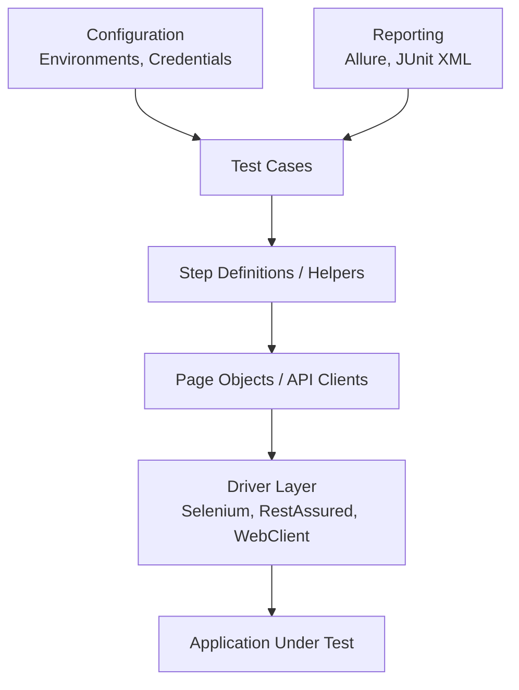

### Принципы

1. **Слоистая архитектура** — тесты не знают деталей UI/API; вся «техника» спрятана ниже.
2. **Page Object / API Client** — элементы UI или вызовы API инкапсулированы в один объект, поэтому изменение интерфейса локализуется.
3. **Управление через конфиг** — окружения, данные, credentials вынесены из кода тестов, что позволяет гонять один набор на разных стендах.
4. **Отчёты** — `Allure`, `JUnit XML` для интеграции с CI: упавший тест должен быть понятен без запуска локально.
5. **Минимализм** — не строить «фреймворк ради фреймворка»; абстракцию вводят, когда дублирование стало реальной болью, а не заранее.

## Q35. Что такое `Contract Testing` и как его реализовать с `Pact`?

`Contract Testing` проверяет совместимость двух сервисов, **не запуская их вместе**. Вместо дорогого E2E фиксируется контракт (формат запросов и ответов), и каждая сторона проверяется по нему отдельно. Если consumer и provider оба соответствуют одному контракту, в интеграции они совместимы.

В Pact-подходе у контракта две стороны: consumer задаёт ожидания и генерирует контракт (см. Q22 и Q42), а provider их верифицирует — ниже как раз провайдерская часть.

### Верификация на стороне провайдера

```java
// Provider side: верификация контрактов
@Provider("UserService")
@PactBroker(url = "https://pact-broker.example.com")
@SpringBootTest(webEnvironment = RANDOM_PORT)
class UserServiceProviderTest {

    @TestTemplate
    @ExtendWith(PactVerificationInvocationContextProvider.class)
    void verifyPact(PactVerificationContext context) {
        context.verifyInteraction();
    }

    @State("User 123 exists")
    void userExists() {
        userRepository.save(new User(123L, "John", "john@example.com"));
    }
}
```

### Альтернатива: `Spring Cloud Contract`

```groovy
// Groovy DSL контракт
Contract.make {
    request {
        method GET()
        url "/api/users/123"
    }
    response {
        status OK()
        body([id: 123, name: "John", email: "john@example.com"])
        headers { contentType(applicationJson()) }
    }
}
```

## Q36. Что такое `Visual Regression Testing`?

`Visual Regression Testing` — автоматическое сравнение скриншотов UI «до» и «после», чтобы поймать непреднамеренные визуальные изменения. Функциональные тесты проверяют, что кнопка нажимается, но не заметят, что она съехала, побелела или налезла на текст. Эту слепую зону закрывает визуальный регресс: эталонный снимок сравнивается с текущим, и расхождение пикселей выносится на ревью человеку.

### Инструменты

| Инструмент | Описание |
|------------|----------|
| `Percy` | Cloud-based, интеграция с CI |
| `Playwright` | Встроенное сравнение скриншотов |
| `BackstopJS` | Open-source, конфигурируемый |
| `Chromatic` | Для Storybook компонентов |

### Сценарии применения

Визуальный регресс особенно окупается там, где визуальная поломка вероятна, а функциональный тест её не увидит:

- Изменения в CSS или общей дизайн-системе — одна правка стиля может затронуть десятки экранов.
- Обновление зависимостей (React, Bootstrap), способных незаметно сдвинуть верстку.
- Cross-browser проверки: один и тот же UI рендерится по-разному в разных движках.
- Адаптивная верстка: проверка, что layout не ломается на разных размерах экрана.

**Подводный камень** — ложные срабатывания: антиалиасинг шрифтов, анимации и динамические данные дают «розовый шум». Поэтому такие тесты держат стабильными (фиксируют данные, отключают анимации) и оставляют человеку финальное решение «баг или намеренное изменение».

## Q37. Что такое `Performance Testing Strategy`?

Стратегия нагрузочного тестирования отвечает на вопрос «выдержит ли система ожидаемую и пиковую нагрузку и где её предел». Это разные вопросы, поэтому существуют разные виды тестов: один проверяет поведение при штатной нагрузке, другой ищет точку отказа, третий — стабильность на длинной дистанции. Ключ к осмысленной стратегии — заранее заданный **baseline** (эталон), относительно которого ловят деградацию: «p99 вырос с 200 до 400 мс» гораздо полезнее, чем абсолютная цифра.

### Типы нагрузочного тестирования

| Тип | Цель | Инструменты |
|-----|------|-------------|
| `Load Testing` | Поведение при ожидаемой нагрузке | `Gatling`, `JMeter`, `k6` |
| `Stress Testing` | Предел системы | `Gatling`, `Locust` |
| `Spike Testing` | Резкий рост нагрузки | `k6` |
| `Soak Testing` | Стабильность при длительной нагрузке | `JMeter` |
| `Capacity Planning` | Определение необходимых ресурсов | `Gatling` + мониторинг |

### Метрики

- **Throughput** — пропускная способность, запросов в секунду (RPS).
- **Latency** — время отклика по перцентилям p50, p95, p99. Среднее обманчиво: важно, что чувствуют «худшие» 1% пользователей (p99), поэтому смотрят хвосты, а не среднее.
- **Error Rate** — доля ошибок под нагрузкой; система может «держать» RPS ценой роста ошибок.
- **Resource Utilization** — CPU, память, disk I/O; показывает, упрётесь ли вы в ресурс раньше, чем в логику.

Производительность гоняют в CI/CD на staging и сравнивают с baseline, чтобы регресс выявлялся автоматически, а не по жалобам в проде. Подробнее — в [вопросах по профилированию](../performance/application-profiling-interview.md).

## Q38. Что такое `Security Testing Strategy`?

Стратегия security-тестирования встраивает проверки безопасности в pipeline, а не оставляет их на разовый аудит перед релизом (этот сдвиг в сторону разработки называют DevSecOps). Логика — многослойная защита: разные инструменты ловят разные классы уязвимостей. SAST смотрит исходники, DAST бьёт по работающему приложению снаружи, dependency scanning ищет дыры в чужих библиотеках. Ни один слой не покрывает всё, поэтому их комбинируют.

### Уровни безопасности

| Уровень | Подход | Инструменты |
|---------|--------|-------------|
| `Static Analysis` (SAST) | Анализ исходного кода | `SonarQube`, `SpotBugs`, `Checkmarx` |
| `Dynamic Analysis` (DAST) | Тестирование работающего приложения | `OWASP ZAP`, `Burp Suite` |
| `Dependency Scanning` | Уязвимости в зависимостях | `OWASP Dependency-Check`, `Snyk` |
| `Penetration Testing` | Имитация атак | Ручное, `Metasploit` |
| `Secret Scanning` | Утечки секретов в коде | `Gitleaks`, `TruffleHog` |

### Интеграция в CI/CD

```yaml
# Security gates в pipeline
security:
  - stage: sast
    script: sonar-scanner
    allow_failure: false
  - stage: dependency-check
    script: owasp-dependency-check --project app
    allow_failure: false
  - stage: dast
    script: zap-baseline.py -t http://staging:8080
    allow_failure: true  # может быть flaky
```

Подробнее — в [вопросах по безопасности приложений](../security/application-security-interview.md) и [OWASP Top 10](../security/owasp-top10-interview.md).

## Q39. Как организовать тестирование при `Continuous Deployment`?

При `Continuous Deployment` каждый прошедший pipeline коммит автоматически едет в production — нет ручного гейта, где человек «посмотрит и одобрит». Значит, единственная защита от плохого релиза — сами тесты и quality gates. Поэтому стратегия строится на двух столпах: **многоступенчатый pipeline**, где каждый gate блокирует деплой при провале, и **автоматический откат** по метрикам, если что-то всё же просочилось в прод.

### Pipeline

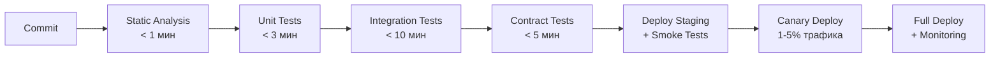

### Quality Gates

| Gate | Критерий | Блокирует deploy? |
|------|----------|-------------------|
| Static Analysis | 0 critical issues | Да |
| Unit Tests | 100% pass, coverage > 80% | Да |
| Integration Tests | 100% pass | Да |
| Contract Tests | 100% pass | Да |
| Smoke Tests | Критический путь | Да |
| Canary Metrics | Error rate < 1%, p99 < SLA | Да |

**Ключевой момент:** автоматический rollback при нарушении quality gates. В CD человек не успевает среагировать вручную, поэтому откат — это не «кнопка на крайний случай», а штатная автоматизированная реакция на просадку метрик канарейки. Подробнее — в [вопросах по CI/CD pipeline](../cicd/pipeline-design-interview.md).

## Q40. (!) Рекомендации для `Test Strategy`

Сводка проверенных практик. Объединяет их одна мысль: тестирование служит доставке ценности, а не наоборот. Метрики, покрытие, фреймворки — средства, и каждое из правил ниже отвечает на вопрос «как получить больше уверенности меньшими усилиями».

1. **Определить цели и scope** — что тестируем и зачем; без этого набор тестов растёт хаотично.
2. **Приоритизация по риску** — критичное первым (см. `Risk-Based Testing`)
3. **Баланс автоматизации** — не всё нужно автоматизировать
4. **Непрерывное тестирование** — тесты в `CI/CD` на каждый коммит
5. **Метрики и мониторинг** — `coverage`, `mutation score`, `flaky rate`
6. **Обучение команды** — ревью тестов, pair testing, workshops
7. **Ретро и адаптация** — стратегия эволюционирует с проектом
8. **Документирование подхода** — `Test Strategy Document` актуален
9. **Shift-Left + Shift-Right** — тестирование и рано, и в production
10. **Фокус на value** — покрытие ради покрытия бесполезно; `mutation testing` показывает реальное качество

### Антипаттерны

Каждый из них — это нарушение какого-то из принципов выше; полезно уметь назвать и сам антипаттерн, и противоядие:

| Антипаттерн | В чём проблема | Решение |
|-------------|----------------|---------|
| Ice Cream Cone | Много E2E, мало unit — медленная и хрупкая обратная связь | Следовать `Test Pyramid` |
| Культ 100% покрытия | Покрытие есть, проверок нет | `Mutation Testing` как метрика реального качества |
| Test-Last | Тесты дописывают после дедлайна, а значит — никогда | `TDD`, тесты в `DoD` |
| Терпимость к флакам | Нестабильные тесты игнорируют, доверие к набору падает | Карантин + починить/удалить |
| Copy-Paste тесты | Дублирование делает тесты хрупкими к изменениям | Test Builders, общие helpers |

## Q41. (!) Как правильно применять Test Doubles: когда Mock, когда Stub, когда Fake?

Test Doubles — объекты-заменители реальных зависимостей. Их пять типов, и они различаются не «силой», а назначением. Главный водораздел — **проверяете ли вы факт вызова**: если тест интересует только результат, нужен `Stub`; если важно, что произошёл побочный эффект (отправили email, записали в аудит), — `Mock`. Неправильный выбор не «не работает», а делает тест либо бессмысленным, либо хрупким.

### Классификация по Джерарду Месарошу

| Тип | Назначение | Проверяет вызовы? | Когда использовать |
|-----|-----------|------------------|-------------------|
| **Dummy** | Заполнить параметр, не использовать | Нет | Когда зависимость нужна в сигнатуре, но не используется в тесте |
| **Stub** | Возвращать заданные данные | Нет | Изолировать тест от данных внешней системы |
| **Spy** | Обёртка над реальным объектом + запись вызовов | Опционально | Когда нужна реальная логика + верификация |
| **Mock** | Программируемый объект с верификацией вызовов | Да | Проверить побочный эффект (отправка email, аудит) |
| **Fake** | Рабочая упрощённая реализация | Нет | Когда логика сложна для стаба, но реальная система недоступна |

```java
// Stub — возвращает данные, вызовы не проверяются
when(userRepository.findById(1L)).thenReturn(Optional.of(testUser));
// Используем когда: тест проверяет РЕЗУЛЬТАТ обработки данных

// Mock — проверяем, что определённый вызов произошёл
orderService.placeOrder(order);
verify(emailService).sendConfirmation(order.getCustomerEmail());
// Используем когда: тест проверяет ПОВЕДЕНИЕ (side effect)

// Spy — реальный объект, но можно переопределить методы
@Spy
UserService userService = new UserService(realRepo);
doReturn(cachedUser).when(userService).loadFromCache(1L);
// Используем когда: нужна реальная логика кроме одного дорогого метода

// Fake — упрощённая, но рабочая реализация
class InMemoryOrderRepository implements OrderRepository {
    private final Map<Long, Order> store = new HashMap<>();

    @Override
    public Order save(Order order) {
        order.setId(store.size() + 1L);
        store.put(order.getId(), order);
        return order;
    }

    @Override
    public Optional<Order> findById(Long id) {
        return Optional.ofNullable(store.get(id));
    }
}
// Используем когда: несколько тестов нужны реальная логика хранения
// (CRUD, поиск), но реальная БД слишком медленна или сложна
```

### Практическое правило

> **Тестируете результат?** → `Stub`.
> **Тестируете, что что-то было вызвано?** → `Mock`.
> **Нужна реальная логика, но быстрая?** → `Fake` или `Spy`.

**Главный подводный камень** — злоупотребление `Mock` и `verify` на каждом вызове. Такой тест проверяет не *что* делает код, а *как именно* он это делает (через какие методы), и потому ломается при любом безобидном рефакторинге, хотя поведение не изменилось. Это перекос в сторону тестирования взаимодействий вместо результата — хрупкость, замаскированная под строгость.

## Q42. Что такое Contract Testing с Pact: Consumer и Provider стороны?

**Contract Testing** (контрактное тестирование) — подход, при котором пара сервисов (consumer + provider) договаривается о контракте взаимодействия, после чего каждая сторона проверяет его у себя независимо, не поднимая партнёра. Это снимает основную боль интеграции микросервисов: E2E-тесты, где надо поднять всё окружение, медленны, хрупки и плохо масштабируются с ростом числа сервисов.

В Pact контракт **consumer-driven** — его форму диктует потребитель, фиксируя ровно то, что реально использует. Ниже обе стороны: consumer генерирует контракт из своих ожиданий, provider скачивает его и верифицирует свой реальный API.

### Consumer-Driven Contract Testing с Pact

```java
// ============ CONSUMER (сервис, который вызывает API) ============

@ExtendWith(PactConsumerTestExt.class)
@PactTestFor(providerName = "order-service")
class OrderClientPactTest {

    @Pact(consumer = "notification-service")
    public RequestResponsePact createOrderPact(PactDslWithProvider builder) {
        return builder
            .given("order 1 exists")
            .uponReceiving("a request to get order 1")
                .path("/api/v1/orders/1")
                .method("GET")
                .headers(Map.of("Accept", "application/json"))
            .willRespondWith()
                .status(200)
                .headers(Map.of("Content-Type", "application/json"))
                .body(new PactDslJsonBody()
                    .integerType("id", 1)
                    .stringType("status", "PENDING")
                    .decimalType("amount", 99.99)
                )
            .toPact();
    }

    @Test
    @PactTestFor(pactMethod = "createOrderPact")
    void shouldGetOrder(MockServer mockServer) {
        // Pact запускает mock-сервер с заданным контрактом
        OrderClient client = new OrderClient(mockServer.getUrl());
        Order order = client.getOrder(1L);

        assertThat(order.getStatus()).isEqualTo("PENDING");
        // Файл с контрактом сохраняется в target/pacts/
    }
}

// ============ PROVIDER (сервис, который предоставляет API) ============

@SpringBootTest(webEnvironment = SpringBootTest.WebEnvironment.RANDOM_PORT)
@Provider("order-service")
@PactFolder("pacts")  // читаем контракты из файлов (или из Pact Broker)
class OrderServicePactVerificationTest {

    @LocalServerPort
    private int port;

    @MockBean
    private OrderRepository orderRepository;

    @BeforeEach
    void setUp(PactVerificationContext context) {
        context.setTarget(new HttpTestTarget("localhost", port));
    }

    @TestTemplate
    @ExtendWith(PactVerificationInvocationContextProvider.class)
    void verifyPact(PactVerificationContext context) {
        context.verifyInteraction();
    }

    @State("order 1 exists")
    void orderExists() {
        when(orderRepository.findById(1L))
            .thenReturn(Optional.of(new Order(1L, "PENDING", BigDecimal.valueOf(99.99))));
    }
}
```

### Схема работы Pact

```
Consumer-тест → генерирует контракт (JSON) → Pact Broker
Provider-тест → читает контракт из Broker → верифицирует свой API
```

**Pact Broker** — централизованное хранилище контрактов с версионированием и webhooks. Его ключевая функция — матрица совместимости и запрос `can-i-deploy`: перед деплоем сервис спрашивает брокера, совместима ли его версия со всеми, кто с ним общается в этом окружении. Так контрактные тесты превращаются из локальной проверки в реальный gate деплоя.

## Q43. Как конкретно выглядит пирамида тестирования: соотношения и числа?

Пирамида задаёт принцип («быстрых тестов больше дорогих»), а не закон. Конкретные числа всегда зависят от проекта, но интервьюеры часто хотят услышать порядки величин — ниже общепринятые ориентиры. Важно проговорить, что проценты — это следствие, а не цель: вы не «добиваете до 80% unit», а получаете такую пропорцию естественно, когда каждый тест пишется на правильном уровне.

### Типичные соотношения для Java-монолита

```
            ┌──────────┐
            │  E2E/UI  │  ~5%   (5-15 тестов)
            │  ~ 5%    │  Медленные, хрупкие, дорогие
           ┌┴──────────┴┐
           │Integration │  ~15%  (50-150 тестов)
           │   ~ 15%    │  @SpringBootTest, Testcontainers, API-тесты
          ┌┴────────────┴┐
          │     Unit     │  ~80%  (500-2000+ тестов)
          │    ~ 80%     │  Мгновенные, изолированные
          └──────────────┘
```

### Типичные времена выполнения

| Уровень | Время одного теста | Всего на сборку |
|---------|-------------------|-----------------|
| Unit | < 10 мс | < 30 сек |
| Integration (слайсы) | 1-5 сек | < 5 мин |
| Integration (полный контекст) | 5-30 сек | < 10 мин |
| E2E | 10-120 сек | < 30 мин |

### Когда нарушать пирамиду?

```
Ice Cream Cone (антипаттерн):        Honeycomb (для микросервисов):
    ┌────────────────┐                    ┌──────────┐
    │      E2E       │ много              │   E2E    │ мало
    ├────────────────┤                ┌───┴──────────┴───┐
    │  Integration   │ мало           │  Contract Tests   │ много
    ├────────────────┤          ┌─────┴──────────────────┴─────┐
    │     Unit       │ мало     │       Unit + Component        │ много
    └────────────────┘          └──────────────────────────────┘
```

**Когда форму меняют.** Ice Cream Cone (перевёрнутая пирамида — много E2E, мало unit) — это антипаттерн, к которому скатываются, когда боятся писать unit-тесты и проверяют всё «как пользователь». Honeycomb (Spotify) — наоборот, осознанный выбор для микросервисов: там основной риск во взаимодействии, поэтому акцент смещают на **Component Tests** (сервис в изоляции с реальными зависимостями через Testcontainers), а не на массу unit-тестов с моками, которые проверяют выдуманное взаимодействие.

### Метрика: тест-бюджет

| Метрика | Цель |
|---------|------|
| Время unit-прогона | < 30 сек (на каждый коммит) |
| Время integration-прогона | < 10 мин (на каждый PR) |
| Покрытие строк кода | > 80% (но не самоцель) |
| Mutation score | > 60% (реальное качество тестов) |

## Q44. (!) Как совместить Mutation Testing с CI/CD и quality gates?

Mutation Testing даёт лучшую оценку качества тестов, но платой служит время: PITest прогоняет весь набор тестов на каждую мутацию, поэтому полный анализ модуля идёт 10–30 минут. Гонять это на каждый коммит нельзя — pipeline встанет. Поэтому стратегия интеграции сводится к трём приёмам: **сузить scope** (только бизнес-логика, не DTO/конфиг), **запускать инкрементально** (через историю — только изменённые классы) и **вынести из горячего пути** (ночью или по изменению core-модулей).

```xml
<!-- pom.xml: конфигурация PITest -->
<plugin>
    <groupId>org.pitest</groupId>
    <artifactId>pitest-maven</artifactId>
    <version>1.15.3</version>
    <dependencies>
        <dependency>
            <groupId>org.pitest</groupId>
            <artifactId>pitest-junit5-plugin</artifactId>
            <version>1.2.1</version>
        </dependency>
    </dependencies>
    <configuration>
        <!-- Тестируем только изменённые классы (incremental analysis) -->
        <withHistory>true</withHistory>
        <historyInputFile>target/pit-history/history.bin</historyInputFile>
        <historyOutputFile>target/pit-history/history.bin</historyOutputFile>

        <!-- Минимальный порог: 70% мутантов должны быть убиты -->
        <mutationThreshold>70</mutationThreshold>
        <coverageThreshold>80</coverageThreshold>

        <!-- Тестируем только бизнес-логику, не DTO/конфигурацию -->
        <targetClasses>
            <param>com.example.service.*</param>
            <param>com.example.domain.*</param>
        </targetClasses>
        <excludedClasses>
            <param>com.example.config.*</param>
            <param>*Dto</param>
            <param>*Entity</param>
        </excludedClasses>

        <!-- Только сильные мутаторы -->
        <mutators>
            <mutator>STRONGER</mutator>
        </mutators>

        <!-- Параллельный запуск -->
        <threads>4</threads>

        <!-- Отчёт для CI -->
        <outputFormats>
            <outputFormat>HTML</outputFormat>
            <outputFormat>XML</outputFormat>
        </outputFormats>
    </configuration>
</plugin>
```

### Стратегия интеграции в CI/CD

```yaml
# Пример GitHub Actions / GitLab CI
stages:
  - unit-test      # каждый коммит, < 1 мин
  - integration    # каждый PR, < 10 мин
  - mutation       # ночной прогон или при изменении core-модулей
  - deploy         # только если все gates пройдены

mutation-test:
  stage: mutation
  rules:
    - if: '$CI_PIPELINE_SOURCE == "schedule"'  # ночной
    - changes:
        - "src/main/java/com/example/service/**"  # при изменении сервисов
  script:
    - mvn pitest:mutationCoverage
  artifacts:
    paths:
      - target/pit-reports/
  allow_failure: false  # блокирует деплой при падении threshold
```

### Quality Gates для Mutation Testing

| Уровень | Mutation Score | Действие |
|---------|---------------|---------|
| Критичная бизнес-логика | > 80% | Блокировать PR |
| Обычные сервисы | > 60% | Предупреждение |
| Инфраструктурный код | Не применяется | Исключить из PITest |

**Главный практический приём** — инкрементальный режим (`withHistory`): PITest хранит результаты прошлого прогона и мутирует только изменённые классы. Это сокращает анализ небольшого PR с ~30 минут до 2–3 минут и делает реальным включение mutation-гейта в обычный pipeline, а не только в ночной прогон.

## Q45. Что такое Component Testing и как он вписывается в стратегию?

**Component Testing** — тестирование одного сервиса целиком: он работает с реальными зависимостями (БД, очереди через Testcontainers) и реальным HTTP, но **изолирован** от других сервисов — их заменяют заглушками (WireMock).

**Где его место.** Это золотая середина между двумя крайностями. Unit-тесты с моками быстры, но проверяют выдуманное взаимодействие и пропускают реальные SQL, сериализацию, конфигурацию Spring. E2E проверяют всё по-настоящему, но медленны, хрупки и требуют поднять весь ландшафт. Component Test берёт лучшее: реальную работу сервиса при стабильности и скорости одиночного теста. Именно поэтому в модели Honeycomb для микросервисов он — основной уровень.

### Место в иерархии тестов

```
┌──────────────────────────────────────────────────────┐
│                      E2E Tests                       │
│    Реальные сервисы + реальная инфраструктура        │
├──────────────────────────────────────────────────────┤
│                  Component Tests                     │
│    Один сервис + Testcontainers + WireMock           │
├──────────────────────────────────────────────────────┤
│                 Integration Tests                    │
│    Отдельные слои: @DataJpaTest, @WebMvcTest         │
├──────────────────────────────────────────────────────┤
│                    Unit Tests                        │
│    Классы/методы + Mockito                           │
└──────────────────────────────────────────────────────┘
```

### Реализация с Spring Boot

```java
// Полноценный компонентный тест: реальный HTTP, реальная БД, WireMock для внешних API
@SpringBootTest(webEnvironment = RANDOM_PORT)
@Testcontainers
@AutoConfigureWireMock(port = 0)  // случайный порт для WireMock
class OrderComponentTest {

    @Container
    static PostgreSQLContainer<?> postgres = new PostgreSQLContainer<>("postgres:16-alpine");

    @Container
    static KafkaContainer kafka = new KafkaContainer(DockerImageName.parse("confluentinc/cp-kafka:7.4.0"));

    @DynamicPropertySource
    static void configureProperties(DynamicPropertyRegistry registry) {
        registry.add("spring.datasource.url", postgres::getJdbcUrl);
        registry.add("spring.datasource.username", postgres::getUsername);
        registry.add("spring.datasource.password", postgres::getPassword);
        registry.add("spring.kafka.bootstrap-servers", kafka::getBootstrapServers);
    }

    @Autowired
    private RestAssuredMockMvc mockMvc;

    @BeforeEach
    void setUp() {
        // WireMock стаб для внешнего Payment Service
        stubFor(post("/payments/charge")
            .willReturn(aResponse()
                .withStatus(200)
                .withHeader("Content-Type", "application/json")
                .withBody("{\"transactionId\": \"txn-ok\", \"status\": \"SUCCESS\"}")));
    }

    @Test
    void shouldCompleteOrderFlow() {
        // Создаём заказ через реальный HTTP
        String orderId = given()
            .contentType(ContentType.JSON)
            .body("{\"customerId\": 1, \"amount\": 99.99}")
        .when()
            .post("/api/v1/orders")
        .then()
            .statusCode(201)
            .extract().jsonPath().getString("id");

        // Проверяем, что платёж был запрошен
        verify(postRequestedFor(urlEqualTo("/payments/charge")));

        // Проверяем финальный статус через реальную БД
        given()
            .pathParam("id", orderId)
        .when()
            .get("/api/v1/orders/{id}")
        .then()
            .statusCode(200)
            .body("status", equalTo("CONFIRMED"));
    }
}
```

### Преимущества Component Tests

| Vs Unit Tests | Vs E2E Tests |
|---------------|-------------|
| Ловят проблемы интеграции слоёв | В 10-100× быстрее |
| Тестируют реальные SQL-запросы | Нет зависимости от других сервисов |
| Проверяют сериализацию/десериализацию | Стабильные и повторяемые |
| Тестируют Spring-конфигурацию | Легко запустить локально |

Таким образом, Component Tests — ключевой уровень модели **Test Honeycomb** (Spotify): для микросервисов один такой тест даёт больше уверенности, чем десяток unit-тестов с моками, потому что проверяет реальные стыки слоёв, а не их имитацию.

---

## See also

- [Unit Testing](unit-testing-interview.md) — модульное тестирование, JUnit, Mockito
- [Integration Testing](integration-testing-interview.md) — интеграционное тестирование, Testcontainers
- [Test Automation](test-automation-interview.md) — автоматизация тестирования, CI/CD pipeline
- [Testcontainers](testcontainers-interview.md) — реальная инфраструктура в тестах вместо заглушек
- [Design Patterns](../design-patterns/design-patterns-interview.md) — паттерны, применяемые в тестовом коде (Builder, Factory)
- [Behavioral](../behavioral/behavioral-interview.md) — как рассказывать о тестовой стратегии на собеседовании
- [Code Review](../code-quality/code-review-interview.md) — ревью кода и тестов
- [CI/CD Pipeline](../cicd/pipeline-design-interview.md) — проектирование pipeline с тестами
- [Микросервисы](../architecture/microservices-interview.md) — тестирование микросервисной архитектуры
