# Вопросы на собеседовании: Стратегии тестирования

Краткие ответы по стратегиям тестирования: как выбрать уровни тестов, распределить усилия команды, контролировать качество через метрики и риски, а также применять современные подходы `TDD`, `BDD`, `Property-Based Testing` и `Mutation Testing`.

**Стратегии тестирования** определяют, какие виды тестов использовать, как распределять усилия и какие метрики отслеживать. Этот файл фокусируется на управленческих и архитектурных решениях, а не на деталях конкретных фреймворков.

## Полезные ссылки

### Официальная документация

- [Test Pyramid in Spring Boot Microservice — Baeldung](https://www.baeldung.com/spring-test-pyramid-practical-example) — практический пример тестовой пирамиды
- [TDD a List Implementation in Java — Baeldung](https://www.baeldung.com/java-test-driven-list) — пошаговый TDD пример
- [Cucumber Spring Integration — Baeldung](https://www.baeldung.com/cucumber-spring-integration) — BDD с Cucumber и Spring
- [Property-Based Testing with jqwik — Baeldung](https://www.baeldung.com/java-jqwik-property-based-testing) — property-based тесты в Java
- [Mutation Testing with PITest — Baeldung](https://www.baeldung.com/java-mutation-testing-with-pitest) — мутационное тестирование
- [Google Testing Blog](https://testing.googleblog.com/) — блог Google о тестировании
- Agile Testing (Lisa Crispin, Janet Gregory), Working Effectively with Legacy Code (Michael Feathers)

## Содержание

- [Полезные ссылки](#полезные-ссылки)
- [See also](#see-also)

**Основы стратегий тестирования**
- [Q1. (!) Что такое стратегия тестирования и зачем она нужна?](#q1--что-такое-стратегия-тестирования-и-зачем-она-нужна)
- [Q2. (!) Что такое Testing Pyramid и как её применять?](#q2--что-такое-testing-pyramid-и-как-её-применять)
- [Q3. Какие существуют Testing Quadrants?](#q3-какие-существуют-testing-quadrants)
- [Q4. (!) В чём разница между Test Pyramid и Test Trophy?](#q4--в-чём-разница-между-test-pyramid-и-test-trophy)
- [Q5. Что такое Test Strategy Document и что в него входит?](#q5-что-такое-test-strategy-document-и-что-в-него-входит)

**TDD, BDD и Test-First подходы**
- [Q6. (!) Что такое TDD и как работает цикл Red-Green-Refactor?](#q6--что-такое-tdd-и-как-работает-цикл-red-green-refactor)
- [Q7. (!) Что такое BDD и как его реализовать с Cucumber?](#q7--что-такое-bdd-и-как-его-реализовать-с-cucumber)
- [Q8. Что такое ATDD и чем он отличается от TDD и BDD?](#q8-что-такое-atdd-и-чем-он-отличается-от-tdd-и-bdd)
- [Q9. Как реализовать Test-First подход на практике?](#q9-как-реализовать-test-first-подход-на-практике)
- [Q10. (!) Что такое Property-Based Testing?](#q10--что-такое-property-based-testing)

**Shift-Left, Shift-Right и Risk-Based Testing**
- [Q11. (!) Что такое Shift-Left Testing?](#q11--что-такое-shift-left-testing)
- [Q12. Что такое Shift-Right Testing?](#q12-что-такое-shift-right-testing)
- [Q13. (!) Как реализовать Risk-Based Testing?](#q13--как-реализовать-risk-based-testing)
- [Q14. Что такое Testing in Production и какие есть подходы?](#q14-что-такое-testing-in-production-и-какие-есть-подходы)

**Mutation Testing и качество тестов**
- [Q15. (!) Что такое Mutation Testing и как работает PITest?](#q15--что-такое-mutation-testing-и-как-работает-pitest)
- [Q16. Что такое Exploratory Testing и как совмещать с автоматизацией?](#q16-что-такое-exploratory-testing-и-как-совмещать-с-автоматизацией)
- [Q17. Что такое Flaky Tests и как с ними бороться?](#q17-что-такое-flaky-tests-и-как-с-ними-бороться)

**Тестирование специфических систем**
- [Q18. Какие стратегии тестирования микросервисов?](#q18-какие-стратегии-тестирования-микросервисов)
- [Q19. (!) Как тестировать legacy код?](#q19--как-тестировать-legacy-код)
- [Q20. Как тестировать Distributed Systems?](#q20-как-тестировать-distributed-systems)
- [Q21. Как тестировать Event-Driven Architecture?](#q21-как-тестировать-event-driven-architecture)
- [Q22. Что такое Consumer-Driven Contract Testing?](#q22-что-такое-consumer-driven-contract-testing)
- [Q23. Что такое Chaos Engineering?](#q23-что-такое-chaos-engineering)

**Метрики, организация и Agile**
- [Q24. (!) Какие метрики качества тестирования существуют?](#q24--какие-метрики-качества-тестирования-существуют)
- [Q25. Как организовать тестирование в Agile/Scrum?](#q25-как-организовать-тестирование-в-agilescrum)
- [Q26. Что такое Three Amigos и Definition of Done?](#q26-что-такое-three-amigos-и-definition-of-done)
- [Q27. Как балансировать скорость и качество тестирования?](#q27-как-балансировать-скорость-и-качество-тестирования)
- [Q28. Что такое Test Observability?](#q28-что-такое-test-observability)
- [Q29. Как организовать Test Review?](#q29-как-организовать-test-review)

**Test Data, окружения и инфраструктура тестирования**
- [Q30. Что такое Test Doubles Strategy?](#q30-что-такое-test-doubles-strategy)
- [Q31. (!) Что такое Test Containerization и Testcontainers?](#q31--что-такое-test-containerization-и-testcontainers)
- [Q32. Как организовать Test Environments Strategy?](#q32-как-организовать-test-environments-strategy)
- [Q33. Как организовать Test Data Management?](#q33-как-организовать-test-data-management)
- [Q34. Как организовать Test Automation Framework?](#q34-как-организовать-test-automation-framework)

**Продвинутые стратегии**
- [Q35. Что такое Contract Testing и как его реализовать с Pact?](#q35-что-такое-contract-testing-и-как-его-реализовать-с-pact)
- [Q36. Что такое Visual Regression Testing?](#q36-что-такое-visual-regression-testing)
- [Q37. Что такое Performance Testing Strategy?](#q37-что-такое-performance-testing-strategy)
- [Q38. Что такое Security Testing Strategy?](#q38-что-такое-security-testing-strategy)
- [Q39. Как организовать тестирование при Continuous Deployment?](#q39-как-организовать-тестирование-при-continuous-deployment)
- [Q40. (!) Best practices для Test Strategy?](#q40--best-practices-для-test-strategy)

**Практические паттерны и углублённые темы**
- [Q41. (!) Как правильно применять Test Doubles: когда Mock, когда Stub, когда Fake?](#q41--как-правильно-применять-test-doubles-когда-mock-когда-stub-когда-fake)
- [Q42. Что такое Contract Testing с Pact: Consumer и Provider стороны?](#q42-что-такое-contract-testing-с-pact-consumer-и-provider-стороны)
- [Q43. Как конкретно выглядит пирамида тестирования: соотношения и числа?](#q43-как-конкретно-выглядит-пирамида-тестирования-соотношения-и-числа)
- [Q44. (!) Как совместить Mutation Testing с CI/CD и quality gates?](#q44--как-совместить-mutation-testing-с-cicd-и-quality-gates)
- [Q45. Что такое Component Testing и как он вписывается в стратегию?](#q45-что-такое-component-testing-и-как-он-вписывается-в-стратегию)

---

## Q1. (!) Что такое стратегия тестирования и зачем она нужна?

**Стратегия тестирования** — это план, определяющий подход к тестированию ПО: выбор типов тестов, их приоритизацию, распределение ресурсов и критерии завершения.

### Ключевые компоненты

| Компонент | Описание |
|-----------|----------|
| `Test Scope` | Что тестировать (функциональность, безопасность, производительность) и что нет |
| `Test Types` | `Unit`, `Integration`, `E2E`, `Performance`, `Security` |
| `Resources` | Команда, инструменты, время |
| `Exit Criteria` | Покрытие > 80%, 0 critical багов, все `SLA` соблюдены |
| `Risk Assessment` | Оценка рисков и приоритизация по критичности |

### Связь компонентов стратегии

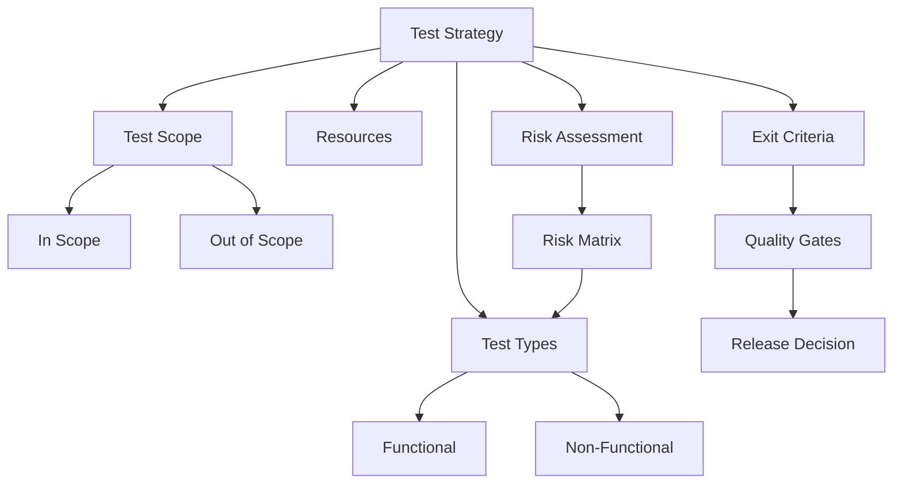

На собеседовании важно показать, что стратегия тестирования — не статичный документ, а живой артефакт, который пересматривается при изменениях в проекте, и что она увязывает бизнес-цели с техническим подходом к тестированию.


> [!mcq]
> - [ ] Стратегия — это список багов и их severity для текущего релиза | Это test report, фиксирующий результат, а не план тестирования. ❌ ПОСЛЕДСТВИЕ: команда не знает scope/exit criteria, releases уходят с непокрытыми risk-areas.
> - [x] Стратегия — это план scope/types/criteria/risks с привязкой к бизнес-целям | Артефакт описывает что и зачем тестируем, какие quality gates применяем. ✓ ПРИМЕНЯТЬ: ISTQB Test Strategy в банках, Spotify Quality Strategy. 📋 ПРАВИЛО: «стратегия отвечает на ЗАЧЕМ, план — на КОГДА». 🔗 См. Q5, Q40.
> - [ ] Стратегия — это набор тест-кейсов с шагами и ожидаемыми результатами | Это test cases/test plan, а не стратегия уровня проекта. ❌ ПОСЛЕДСТВИЕ: документ устаревает за спринт, никто не обновляет 500 step-by-step кейсов.
> - [ ] Стратегия — это конфигурация JUnit и Mockito в pom.xml | Это инструментальный setup, а не стратегия. ❌ ПОСЛЕДСТВИЕ: команда настроила Surefire, но 80% багов уходят в prod из-за отсутствия NFR-тестов.

## Q2. (!) Что такое `Testing Pyramid` и как её применять?

`Testing Pyramid` — концептуальная модель (Майк Кон, "Succeeding with Agile"), описывающая оптимальное распределение тестов по уровням: много быстрых дешёвых тестов внизу, мало медленных дорогих наверху.

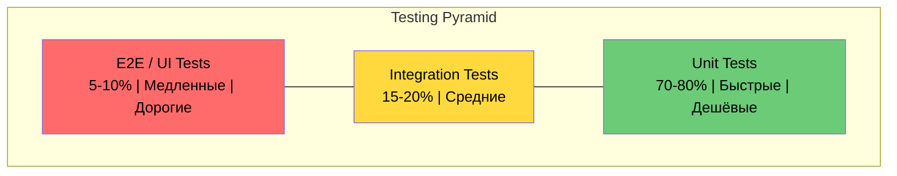

### Характеристики уровней

| Уровень | Доля | Скорость | Стоимость | Обнаруживает |
|---------|------|----------|-----------|-------------|
| `Unit` | 70-80% | мс | Низкая | Логика, алгоритмы, edge cases |
| `Integration` | 15-20% | секунды | Средняя | Взаимодействие компонентов, контракты |
| `E2E` | 5-10% | минуты | Высокая | Полный UX, системная интеграция |

### Применение в `CI/CD`

```yaml
# CI Pipeline с учётом Testing Pyramid
stages:
  - static-analysis   # Линтеры, SonarQube
  - unit-tests         # 70-80% тестов, < 2 мин
  - integration-tests  # 15-20%, Testcontainers
  - e2e-tests          # 5-10%, могут быть нестабильны
  - deploy
```

В контексте [микросервисов](../architecture/microservices-interview.md) пропорции могут отличаться: больше интеграционных тестов, так как сложность часто лежит во взаимодействии сервисов, а не внутри отдельного компонента.


> [!mcq]
> - [ ] 100% E2E тестов через Selenium, без unit и integration | Inverted pyramid: медленно, флакает, дорогая поддержка UI-тестов. ❌ ПОСЛЕДСТВИЕ: 100% E2E без unit → CI 60min, devs bypass tests, regressions slip.
> - [ ] 50% unit + 50% E2E без integration слоя | Hourglass anti-pattern: пропускаются баги интеграции БД/HTTP/Kafka. ❌ ПОСЛЕДСТВИЕ: ice-cream cone shape — flaky tests, teams игнорируют test failures.
> - [x] 70-80% unit + 15-20% integration + 5-10% E2E | Много дешёвых быстрых тестов внизу, мало дорогих сверху — Mike Cohn's pyramid. ✓ ПРИМЕНЯТЬ: Google Testing Blog 70/20/10, Spotify pipeline, Spring Boot Slice tests. 📋 ПРАВИЛО: «много мелких внизу, единицы сверху». 🔗 См. Q4, Q43.
> - [ ] 100% integration через Testcontainers, без unit | Тесты медленные (5-30s каждый), сложно изолировать regression. ❌ ПОСЛЕДСТВИЕ: CI растёт до 40min, разработчики не запускают тесты локально.

## Q3. Какие существуют `Testing Quadrants`?

`Testing Quadrants` — модель Бриан Маринга и Лизы Криспин, разделяющая тесты по двум измерениям: **поддержка команды vs. критика продукта** и **технология vs. бизнес**.

```mermaid
quadrantChart
    title Testing Quadrants
    x-axis "Technology Facing" --> "Business Facing"
    y-axis "Supporting the Team" --> "Critiquing the Product"
    quadrant-1 Q3: Exploratory, Usability, UAT
    quadrant-2 Q4: Performance, Security, Load
    quadrant-3 Q2: Acceptance, BDD, Functional
    quadrant-4 Q1: Unit, Integration, API
```

| Квадрант | Фокус | Примеры тестов | Подход |
|----------|-------|----------------|--------|
| **Q1** — Технология, поддержка | Качество кода | `Unit`, `Integration`, `API`, `Contract` | Автоматизация |
| **Q2** — Бизнес, поддержка | Бизнес-логика | `Acceptance`, `BDD`, `Functional` | Автоматизация |
| **Q3** — Бизнес, критика | Пользовательский опыт | `Exploratory`, `Usability`, `UAT`, `A/B` | Ручное |
| **Q4** — Технология, критика | NFR | `Performance`, `Security`, `Load` | Автоматизация + ручное |

На собеседовании покажите понимание баланса: идеальная стратегия покрывает все четыре квадранта, но пропорции зависят от зрелости продукта и контекста.


> [!mcq]
> - [ ] Quadrants — это деление по тестовым уровням unit/integration/system/UAT | Это test levels, а не quadrants Crispin/Marick. ❌ ПОСЛЕДСТВИЕ: команда смешивает понятия, в strategy doc нет NFR-покрытия.
> - [ ] Quadrants — это severity levels: blocker/critical/major/minor | Это defect severity classification, не модель тестирования. ❌ ПОСЛЕДСТВИЕ: NFR (security/performance) выпадает из плана, обнаруживается на UAT.
> - [ ] Quadrants — это agile метрики velocity/burndown/throughput/cycle time | Это agile metrics, не модель распределения тестов. ❌ ПОСЛЕДСТВИЕ: команда фокусируется на метриках процесса, не на покрытии бизнес-критики.
> - [x] Quadrants — модель Crispin/Marick по двум осям: tech↔business и support↔critique | Q1 unit, Q2 BDD/acceptance, Q3 exploratory/UAT, Q4 perf/security. ✓ ПРИМЕНЯТЬ: Lisa Crispin Agile Testing book, ThoughtWorks тесты по quadrants. 📋 ПРАВИЛО: «4 квадранта = 4 угла качества». 🔗 См. Q1, Q40.

## Q4. (!) В чём разница между `Test Pyramid` и `Test Trophy`?

| Аспект | `Test Pyramid` (Майк Кон) | `Test Trophy` (Кент Доддс) |
|--------|---------------------------|----------------------------|
| Фокус | Много `unit`, мало `e2e` | Фокус на `integration` |
| `Unit` тесты | 70-80% | Только для сложной логики |
| `Integration` тесты | 15-20% | Основная масса тестов |
| `E2E` тесты | 5-10% | Минимум, критический путь |
| `Static Analysis` | Отдельно | Основание трофея |
| Лучше для | Библиотеки, утилиты, backend | Веб-приложения, API с БД |

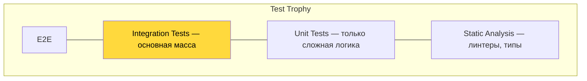

**Ключевой инсайт**: выбор модели зависит от архитектуры. Для Spring Boot приложения с БД `Test Trophy` часто эффективнее, так как `@SpringBootTest` с `Testcontainers` тестирует реальное взаимодействие (подробнее в [вопросах по интеграционному тестированию](integration-testing-interview.md)).


> [!mcq]
> - [ ] Trophy и Pyramid идентичны, отличается только название | Trophy явно делает ставку на integration + static analysis как основание. ❌ ПОСЛЕДСТВИЕ: команда применяет Trophy к backend-библиотеке → unit-coverage падает, regression растёт.
> - [x] Trophy: основание static analysis, основная масса integration; Pyramid: основа unit | Kent C. Dodds: web/API сложность в интеграции, не в unit-логике. ✓ ПРИМЕНЯТЬ: React+RTL Testing Library, Next.js apps; Pyramid — для backend-библиотек. 📋 ПРАВИЛО: «Trophy для UI/API, Pyramid для logic». 🔗 См. Q2, Q43.
> - [ ] Trophy фокусируется на 100% E2E через Cypress | Это ice-cream cone, не Trophy; Trophy явно минимизирует E2E. ❌ ПОСЛЕДСТВИЕ: команда тратит 80% бюджета на E2E, CI 45min, releases блокируются flaky tests.
> - [ ] Trophy убирает unit-тесты полностью, остаётся только E2E | Trophy сохраняет unit для сложной логики, просто меньшая доля. ❌ ПОСЛЕДСТВИЕ: pure-function bugs (date parsing, money math) не покрыты, escape в prod.

## Q5. Что такое `Test Strategy Document` и что в него входит?

`Test Strategy Document` — формализованный документ, описывающий подход к тестированию на уровне проекта или организации.

### Структура документа

1. **Objectives** — цели тестирования (предотвращение дефектов, обеспечение качества)
2. **Scope** — что тестируем (in/out of scope)
3. **Test Levels** — unit, integration, system, acceptance
4. **Test Types** — functional, performance, security
5. **Entry/Exit Criteria** — когда начинаем и когда заканчиваем
6. **Risk Assessment** — оценка рисков и приоритизация
7. **Tools & Infrastructure** — фреймворки, CI/CD, окружения
8. **Roles & Responsibilities** — кто за что отвечает
9. **Metrics & Reporting** — какие метрики собираем
10. **Defect Management** — процесс работы с дефектами

На собеседовании полезно упомянуть, что документ живой: обновляется на ретроспективах и при изменении контекста проекта.


> [!mcq]
> - [x] Содержит scope, levels, types, entry/exit criteria, risks, tools, roles | 10 секций ISTQB описывают что/как/кем/когда тестируется. ✓ ПРИМЕНЯТЬ: ISTQB Test Strategy шаблон, IEEE 829 в энтерпрайзе, Spotify Quality Doc. 📋 ПРАВИЛО: «10 разделов = живой документ, обновляется на ретро». 🔗 См. Q1, Q40.
> - [ ] Содержит только список инструментов: JUnit, Mockito, Selenium | Это tooling section, лишь часть документа. ❌ ПОСЛЕДСТВИЕ: команда не знает entry/exit criteria, релиз идёт без quality gates.
> - [ ] Содержит подробный список багов и их severity | Это defect log, отдельный артефакт. ❌ ПОСЛЕДСТВИЕ: документ устаревает каждый день, никто не использует для планирования.
> - [ ] Содержит исходный код тестов с их реализацией | Это test code, не стратегия. ❌ ПОСЛЕДСТВИЕ: документ растёт до 10K строк, ревьюеры не могут найти exit criteria.

## Q6. (!) Что такое `TDD` и как работает цикл `Red-Green-Refactor`?

`TDD` (`Test-Driven Development`) — практика разработки, при которой тесты пишутся **до** кода. Цикл состоит из трёх шагов.

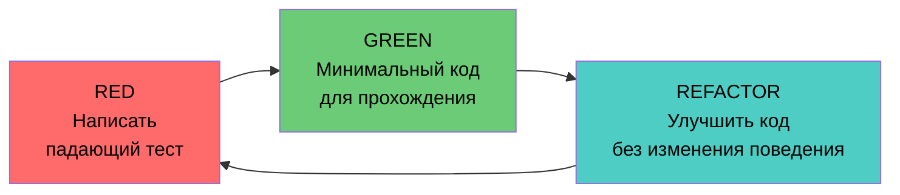

### Пример цикла `TDD` в Java

```java
// === STEP 1: RED — пишем падающий тест ===
@Test
void shouldCalculateDiscountForPremiumCustomer() {
    PriceCalculator calculator = new PriceCalculator();
    Money price = Money.of(100, "USD");

    Money discounted = calculator.applyDiscount(price, CustomerType.PREMIUM);

    assertEquals(Money.of(80, "USD"), discounted); // 20% скидка
}

// === STEP 2: GREEN — минимальная реализация ===
public class PriceCalculator {
    public Money applyDiscount(Money price, CustomerType type) {
        if (type == CustomerType.PREMIUM) {
            return price.multiply(0.8);
        }
        return price;
    }
}

// === STEP 3: REFACTOR — улучшаем дизайн ===
public class PriceCalculator {
    private static final Map<CustomerType, BigDecimal> DISCOUNT_RATES = Map.of(
        CustomerType.PREMIUM, new BigDecimal("0.80"),
        CustomerType.VIP, new BigDecimal("0.70"),
        CustomerType.REGULAR, BigDecimal.ONE
    );

    public Money applyDiscount(Money price, CustomerType type) {
        BigDecimal rate = DISCOUNT_RATES.getOrDefault(type, BigDecimal.ONE);
        return price.multiply(rate);
    }
}
```

### Правила `TDD`

1. Не писать production-код без падающего теста
2. Писать ровно столько теста, чтобы он упал (одна `assertion`)
3. Писать ровно столько кода, чтобы тест прошёл

Подробнее о написании юнит-тестов — в [вопросах по unit-тестированию](unit-testing-interview.md).


> [!mcq]
> - [ ] Сначала пишем код, потом юнит-тесты для покрытия 80% | Это test-after, не TDD; тесты валидируют существующий код, не управляют дизайном. ❌ ПОСЛЕДСТВИЕ: тесты подгоняются под код, hidden coupling, refactor ломает их.
> - [ ] Цикл: Write → Test → Deploy без refactor шага | Без refactor код деградирует, тесты становятся хрупкими. ❌ ПОСЛЕДСТВИЕ: TDD без refactor step → test code быстро rotting, дебаггинг сложнее prod.
> - [x] Red (failing test) → Green (минимум кода) → Refactor (чистка) | Kent Beck TDD цикл: тест управляет дизайном, рефакторинг безопасен под зелёным. ✓ ПРИМЕНЯТЬ: JUnit 5 + IDE TDD plugin, Pivotal Labs pair-programming. 📋 ПРАВИЛО: «Red-Green-Refactor — цикл за 5 минут». 🔗 См. Q9, Q40.
> - [ ] Цикл: Design → Implement → Test only at integration | Это V-model/waterfall, не TDD. ❌ ПОСЛЕДСТВИЕ: дефекты находятся за неделю до релиза, бюджет переполнен на bug-fixing.

## Q7. (!) Что такое `BDD` и как его реализовать с `Cucumber`?

`BDD` (`Behavior-Driven Development`) — подход, при котором поведение системы описывается в формате **executable specifications** на естественном языке (`Gherkin`).

### Пример `Gherkin`-сценария

```gherkin
Feature: Корзина покупок
  Как покупатель
  Я хочу управлять корзиной
  Чтобы оформить заказ

  Scenario: Добавление товара в корзину
    Given пустая корзина
    When я добавляю товар "Книга" по цене 500 руб
    Then в корзине 1 товар
    And итого 500 руб

  Scenario Outline: Скидка по количеству
    Given корзина с <количество> товарами по <цена> руб
    When применяется скидка
    Then итого <итого> руб

    Examples:
      | количество | цена | итого |
      | 3          | 100  | 270   |
      | 5          | 100  | 450   |
      | 10         | 100  | 800   |
```

### Реализация step definitions с `Cucumber` + `Spring Boot`

```java
@CucumberContextConfiguration
@SpringBootTest
public class ShoppingCartSteps {

    @Autowired
    private ShoppingCartService cartService;

    private ShoppingCart cart;

    @Given("пустая корзина")
    public void emptyCart() {
        cart = cartService.createCart();
    }

    @When("я добавляю товар {string} по цене {int} руб")
    public void addItem(String name, int price) {
        cart = cartService.addItem(cart.getId(), name, BigDecimal.valueOf(price));
    }

    @Then("в корзине {int} товар(ов)")
    public void cartContainsItems(int count) {
        assertEquals(count, cart.getItems().size());
    }

    @Then("итого {int} руб")
    public void totalEquals(int expectedTotal) {
        assertEquals(BigDecimal.valueOf(expectedTotal), cart.getTotal());
    }
}
```

### Сравнение `TDD` vs `BDD`

| Аспект | `TDD` | `BDD` |
|--------|-------|-------|
| Язык | Код (Java) | `Gherkin` (Given/When/Then) |
| Аудитория | Разработчики | Вся команда + бизнес |
| Уровень | `Unit` / `Integration` | `Feature` / `Acceptance` |
| Инструменты | `JUnit`, `Mockito` | `Cucumber`, `JBehave` |
| Фокус | Качество кода | Спецификация поведения |


> [!mcq]
> - [ ] BDD — это TDD, переименованный для маркетинга | BDD добавляет общий язык Given-When-Then для бизнеса и команды. ❌ ПОСЛЕДСТВИЕ: команда называет unit-тесты "BDD", PO не понимает scenarios, ценность теряется.
> - [ ] BDD — это только Gherkin-файлы без step-definitions | Без glue-кода Cucumber не выполняет сценарии. ❌ ПОСЛЕДСТВИЕ: 200 .feature файлов в репо, 0 автоматизированных проверок, документация живёт отдельно от кода.
> - [ ] BDD требует только QA, разработчики не участвуют | BDD — это сотрудничество Three Amigos: PO + Dev + QA. ❌ ПОСЛЕДСТВИЕ: scenarios описаны без знания технических ограничений, сценарии не покрывают реальные кейсы.
> - [x] BDD: Given-When-Then сценарии связывают бизнес-язык с кодом через step-defs | Cucumber парсит .feature → запускает Java step methods. ✓ ПРИМЕНЯТЬ: Cucumber JVM в банках для acceptance tests, Spring Cucumber Integration. 📋 ПРАВИЛО: «Given-When-Then = язык трёх друзей». 🔗 См. Q8, Q26.

## Q8. Что такое `ATDD` и чем он отличается от `TDD` и `BDD`?

`ATDD` (`Acceptance Test-Driven Development`) — практика, при которой **acceptance tests** пишутся совместно с бизнесом **до** начала разработки.

### Процесс `ATDD`

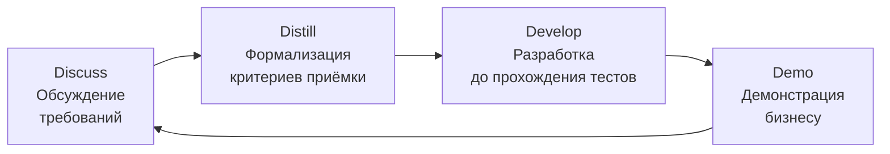

| Аспект | `TDD` | `BDD` | `ATDD` |
|--------|-------|-------|--------|
| Фокус | Код | Поведение | Приёмка |
| Участники | Разработчик | Dev + QA + BA | Все стейкхолдеры |
| Уровень | `Unit` | `Feature` | `System` |
| Когда пишут тесты | Перед кодом | Перед кодом | Перед спринтом |
| Инструменты | `JUnit` | `Cucumber` | `FitNesse`, `Concordion` |


> [!mcq]
> - [ ] ATDD — синоним TDD, но на уровне unit-тестов | ATDD работает на уровне приёмочных тестов с участием бизнеса, не unit. ❌ ПОСЛЕДСТВИЕ: команда называет любые тесты "ATDD", PO не подключается, acceptance gap.
> - [x] ATDD — приёмочные тесты пишутся ДО кода вместе с заказчиком | Acceptance criteria формализуются в исполняемые тесты до разработки. ✓ ПРИМЕНЯТЬ: FitNesse, Concordion, Robot Framework в страховых; Spring Boot + Cucumber acceptance suite. 📋 ПРАВИЛО: «AC написаны → тест зелёный → done». 🔗 См. Q7, Q26.
> - [ ] ATDD исключает разработчиков из обсуждения требований | ATDD основан на Three Amigos, разработчики обязательны. ❌ ПОСЛЕДСТВИЕ: технические риски игнорируются, сценарии нереализуемы за оценочный спринт.
> - [ ] ATDD заменяет unit-тесты, делая их ненужными | ATDD дополняет unit-тесты: разные уровни pyramid. ❌ ПОСЛЕДСТВИЕ: unit-coverage падает до 30%, mutation score = 20%, баги внутри сервисов уходят в prod.

## Q9. Как реализовать `Test-First` подход на практике?

`Test-First` — дисциплина написания теста до реализации. Для успешного внедрения:

1. **Начинать с acceptance criteria** — определить, что значит "работает"
2. **Писать один тест за раз** — не проектировать все тесты сразу
3. **Минимальная реализация** — ровно столько кода, чтобы тест прошёл
4. **Рефакторить после зелёного** — улучшать дизайн под защитой тестов
5. **Закреплять quality gates** — CI не пропускает код без тестов

```java
// Практический пример: TDD для валидатора email
// 1. Начинаем с простейшего случая
@Test
void shouldRejectNull() {
    assertFalse(new EmailValidator().isValid(null));
}

// 2. Добавляем следующий кейс
@Test
void shouldAcceptValidEmail() {
    assertTrue(new EmailValidator().isValid("user@example.com"));
}

// 3. Граничные случаи
@Test
void shouldRejectEmailWithoutAt() {
    assertFalse(new EmailValidator().isValid("userexample.com"));
}

// Реализация растёт инкрементально
public class EmailValidator {
    private static final Pattern EMAIL = Pattern.compile(
        "^[\\w.+-]+@[\\w.-]+\\.[a-zA-Z]{2,}$"
    );

    public boolean isValid(String email) {
        return email != null && EMAIL.matcher(email).matches();
    }
}
```


> [!mcq]
> - [ ] Property-Based — это синоним unit-тестов с конкретными значениями | Example-based использует фиксированные данные, property-based генерирует. ❌ ПОСЛЕДСТВИЕ: команда называет JUnit-тесты "property", не использует jqwik/QuickCheck, edge-cases пропускаются.
> - [ ] Property-Based проверяет UI-свойства через Selenium | Property-based — про инварианты функций, не про CSS-properties. ❌ ПОСЛЕДСТВИЕ: команда тестирует визуальные свойства, упускает математические инварианты в backend.
> - [x] Генерация случайных входов + проверка инвариантов (commutativity, idempotence) | jqwik/QuickCheck автоматически генерируют 1000+ значений и shrink при падении. ✓ ПРИМЕНЯТЬ: jqwik для финансовых формул, ScalaCheck в банках, QuickCheck оригинал в Haskell. 📋 ПРАВИЛО: «свойство держится для всех X, не для одного». 🔗 См. Q15, Q44.
> - [ ] Property-Based требует 100% coverage и заменяет unit-тесты | Это дополнение, не замена; обе техники сосуществуют. ❌ ПОСЛЕДСТВИЕ: команда отказывается от example-tests, regression на конкретных production-кейсах не отлавливается.

## Q10. (!) Что такое `Property-Based Testing`?

`Property-Based Testing` — подход, при котором вместо конкретных примеров описываются **свойства** (invariants), которые должны выполняться для любых входных данных. Фреймворк генерирует сотни случайных тестовых данных и проверяет свойства.

### Пример с `jqwik` (Java)

```java
import net.jqwik.api.*;

class SortPropertyTest {

    @Property
    void sortedListShouldHaveSameSize(@ForAll List<Integer> list) {
        List<Integer> sorted = new ArrayList<>(list);
        Collections.sort(sorted);
        assertThat(sorted).hasSameSizeAs(list);
    }

    @Property
    void sortedListShouldBeOrdered(@ForAll List<Integer> list) {
        List<Integer> sorted = new ArrayList<>(list);
        Collections.sort(sorted);
        for (int i = 0; i < sorted.size() - 1; i++) {
            assertThat(sorted.get(i)).isLessThanOrEqualTo(sorted.get(i + 1));
        }
    }

    @Property
    void sortedListShouldContainSameElements(@ForAll List<Integer> list) {
        List<Integer> sorted = new ArrayList<>(list);
        Collections.sort(sorted);
        assertThat(sorted).containsExactlyInAnyOrderElementsOf(list);
    }
}
```

### Когда использовать

| Подходит | Не подходит |
|----------|-------------|
| Алгоритмы (сортировка, поиск) | UI тесты |
| Сериализация/десериализация | Тесты интеграции с внешними системами |
| Математические вычисления | Бизнес-логика с фиксированными правилами |
| Парсеры, валидаторы | E2E сценарии |

`jqwik` интегрируется с `JUnit 5` и по умолчанию запоминает ранее упавшие кейсы в файле `.jqwik-database`, что обеспечивает быструю обратную связь при повторном запуске.


> [!mcq]
> - [ ] Property-Based = @ParameterizedTest с заданными разработчиком конкретными значениями | @ParameterizedTest задаёт фиксированные примеры; property-based ГЕНЕРИРУЕТ их автоматически. ❌ ПОСЛЕДСТВИЕ: написано 10 примеров, пропущены тысячи edge-cases, которые jqwik находит за секунды.
> - [ ] Property-Based заменяет unit-тесты — после внедрения @Property удаляем @Test | Дополнение, не замена; example-тесты нужны для regression на конкретных production-значениях. ❌ ПОСЛЕДСТВИЕ: удалили @Test с X=null, regression на null-pointer не поймается даже при mutation score 90%.
> - [x] Генерация случайных входов + проверка инвариантов через jqwik/@Property с автоматическим shrinking | jqwik создаёт 1000+ значений и сужает до минимального failing case. ✓ ПРИМЕНЯТЬ: валидаторы email/phone, алгоритмы сортировки, математические формулы. 📋 ПРАВИЛО: «инвариант для ЛЮБОГО X, не для одного». 🔗 См. Q9, Q44.
> - [ ] Property-Based = проверка CSS-свойств UI-элементов через Selenium | property = математический инвариант функции, не HTML-атрибут. ❌ ПОСЛЕДСТВИЕ: команда тестирует layout, backend edge-cases в финансовых вычислениях остаются без покрытия.

## Q11. (!) Что такое `Shift-Left Testing`?

`Shift-Left Testing` — подход, при котором тестирование начинается как можно **раньше** в жизненном цикле разработки.

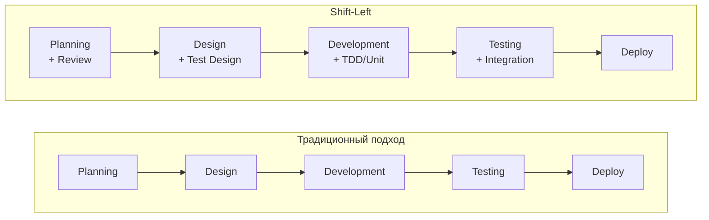

### Практики `Shift-Left`

1. **Static Analysis** — линтеры, `SonarQube`, `SpotBugs` уже на этапе коммита
2. **TDD** — тесты до кода (см. [unit-тестирование](unit-testing-interview.md))
3. **Code Review с чек-листом тестируемости** — DI, SRP, минимум статики
4. **Pair Programming** — разработчик + тестировщик
5. **Continuous Testing в CI** — тесты на каждый коммит

### Принцип: `Prevention over Detection`

Стоимость исправления бага растёт экспоненциально с этапом обнаружения. Баг, найденный на этапе дизайна, стоит в 10-100 раз дешевле, чем найденный в production.


> [!mcq]
> - [ ] Shift-Left = тестирование переносится на этап production (мониторинг заменяет тесты) | Это Shift-Right подход; Shift-Left означает перенос ВЛЕВО по timeline — раньше, не позже. ❌ ПОСЛЕДСТВИЕ: разработчики пишут код без тестов, рассчитывая на мониторинг, баги доходят до 100% пользователей.
> - [ ] Shift-Left = запускать тесты ночью, а не в рабочее время | Нет связи с временем суток; Shift-Left = сдвиг активности тестирования к началу SDLC. ❌ ПОСЛЕДСТВИЕ: баги в дизайне не обнаруживаются, стоимость исправления растёт в 10-100x.
> - [ ] Shift-Left = нанять больше тестировщиков перед последним спринтом | Shift-Left — изменение процесса, не найм; цель — не тестировать больше, а тестировать раньше. ❌ ПОСЛЕДСТВИЕ: late-phase testing обнаруживает архитектурные дефекты, исправление которых требует rework 30% кода.
> - [x] Тестирование начинается на этапе требований: static analysis + TDD + testability review | SonarQube на каждом коммите, Code Review с чек-листом DI/SRP, QA участвует в planning. ✓ ПРИМЕНЯТЬ: Prevention over Detection — баг дизайна в 100x дешевле исправить сейчас. 📋 ПРАВИЛО: «тест на старте — не в конце». 🔗 См. Q12, Q24.

## Q12. Что такое `Shift-Right Testing`?

`Shift-Right Testing` — тестирование в production и post-deployment: мониторинг, `A/B`-тесты, `canary deployments`, `synthetic monitoring`.

### Подходы `Shift-Right`

| Подход | Описание | Инструменты |
|--------|----------|-------------|
| `Canary Deployment` | Постепенный выкат на часть пользователей | `Kubernetes`, `Istio` |
| `A/B Testing` | Сравнение двух вариантов | `LaunchDarkly`, `Unleash` |
| `Synthetic Monitoring` | Автоматические проверки в production | `Datadog`, `New Relic` |
| `Chaos Engineering` | Инъекция сбоев для проверки отказоустойчивости | `Chaos Monkey`, `Litmus` |
| `Feature Flags` | Контроль доступа к фичам | `Unleash`, `Flagsmith` |

`Shift-Right` не заменяет pre-production тестирование, а **дополняет** его. Связано с [observability](../monitoring/observability-interview.md) — без метрик, логов и трейсов тестирование в production невозможно.


> [!mcq]
> - [ ] Shift-Right = полностью заменяет pre-prod тестирование, тесты нужны только в проде | Shift-Right дополняет, а не заменяет. ❌ ПОСЛЕДСТВИЕ: без unit/integration тестов Production canary ловит баги только когда 1-5% пользователей уже пострадали.
> - [x] Canary/A/B/synthetic monitoring как дополнение к pre-production тестированию | Shift-Right = observability-driven QA в production для обнаружения реальных проблем. ✓ ПРИМЕНЯТЬ: canary 1-5% + метрики error rate < 1% + synthetic monitoring критических путей. 📋 ПРАВИЛО: «тест в проде — дополнение, не замена». 🔗 См. Q11, Q39.
> - [ ] Shift-Right = запуск regression suite вручную после каждого деплоя | Ручной прогон regression после деплоя — часть release process, не Shift-Right подход. ❌ ПОСЛЕДСТВИЕ: нет автоматического мониторинга, баги в production не обнаруживаются часами.
> - [ ] Shift-Right = написание тестов после деплоя в production | Тесты после деплоя в prod означают тестирование реальных пользователей без safety net. ❌ ПОСЛЕДСТВИЕ: отсутствие rollback criteria → SLA нарушается, инцидент с P1 severity.

## Q13. (!) Как реализовать `Risk-Based Testing`?

`Risk-Based Testing` (`RBT`) — приоритизация тестов на основе оценки рисков: **вероятность бага x impact**.

### Матрица рисков

```text
Impact ↑
  5 │ M  H  H  C  C
  4 │ M  M  H  H  C
  3 │ L  M  M  H  H
  2 │ L  L  M  M  H
  1 │ L  L  L  M  M
    └─────────────────→ Likelihood
      1  2  3  4  5

L = Low, M = Medium, H = High, C = Critical
```

### Распределение усилий по приоритету

| Приоритет | Покрытие | Подход |
|-----------|----------|--------|
| `Critical` | 95%+ | Полное тестирование, автоматизация, мониторинг |
| `High` | 85%+ | Автоматизация, ручное тестирование |
| `Medium` | 70%+ | Автоматизация основных сценариев |
| `Low` | 50%+ | Smoke-тесты, sampling |

### Факторы для оценки

- **Likelihood**: сложность кода, опыт команды, история дефектов, внешние зависимости
- **Impact**: финансовые потери, UX, репутация, compliance (`GDPR`, `PCI DSS`)

Пересмотр рисков производится при каждом изменении scope или технологий проекта.


> [!mcq]
> - [ ] Тестировать всё одинаково независимо от бизнес-важности модуля | Равномерное распределение усилий игнорирует риски. ❌ ПОСЛЕДСТВИЕ: платёжный модуль (critical) получает столько же покрытия, что и страница "О нас" (low) — баги в платежах уходят в prod.
> - [ ] Приоритет только новому коду, legacy — не трогать | Legacy-код часто несёт накопленные технические долги и критические баги. ❌ ПОСЛЕДСТВИЕ: legacy payment processor без покрытия ломается при росте нагрузки — outage.
> - [ ] Приоритет по сложности кода, а не по бизнес-impact | Сложный код ≠ критичный код; сложный Logger тестируется 100%, простой Payment — нет. ❌ ПОСЛЕДСТВИЕ: баги в payment (простой код) уходят в prod, сложный Logger работает идеально.
> - [x] Приоритизация по матрице likelihood × impact: critical → 95%+, low → 50% | Risk Matrix: вероятность бага × бизнес-потери. Critical: полное покрытие + мониторинг + автоматизация. ✓ ПРИМЕНЯТЬ: ISTQB RBT, финтех-compliance-модули тестируются с 95%+ mutation score. 📋 ПРАВИЛО: «риск × impact → приоритет тестирования». 🔗 См. Q13, Q24.

## Q14. Что такое `Testing in Production` и какие есть подходы?

`Testing in Production` (`TiP`) — проверка ПО на реальных пользователях и данных. Основные подходы:

1. **Canary Deployment** — выкат на 1-5% трафика, мониторинг метрик
2. **Blue-Green Deployment** — два идентичных окружения, переключение трафика
3. **A/B Testing** — сравнение вариантов по бизнес-метрикам
4. **Synthetic Monitoring** — искусственные запросы по критическим путям
5. **Dark Launching** — фича работает, но результат не показывается пользователю

```java
// Пример Canary: проверка метрик нового релиза
@Service
public class CanaryHealthCheck {

    private final MetricsService metrics;

    public boolean isCanaryHealthy(String version, Duration window) {
        double errorRate = metrics.getErrorRate(version, window);
        double p99Latency = metrics.getP99Latency(version, window);

        return errorRate < 0.01       // < 1% ошибок
            && p99Latency < 500.0;    // < 500ms p99
    }
}
```

Связано с [стратегиями деплоя](../cicd/deployment-strategies-interview.md) — без безопасного деплоя `TiP` опасен.


> [!mcq]
> - [ ] TiP = пустить пользователей искать баги вместо тестировщиков | Это beta testing, не TiP с safety net. ❌ ПОСЛЕДСТВИЕ: без метрик и rollback критерий 100% пользователей видят баг часами — репутационный ущерб.
> - [ ] TiP = деплой сразу на 100% пользователей без поэтапного выката | Без canary blast radius = 100% при любом баге. ❌ ПОСЛЕДСТВИЕ: критичный баг в payment-flow бьёт по всем пользователям одновременно, rollback занимает 30 мин.
> - [x] Canary/Blue-Green/Synthetic Monitoring + metrics + автоматический rollback | Dark Launching, canary на 1-5% трафика, rollback при error rate > 1% или p99 > SLA. ✓ ПРИМЕНЯТЬ: Netflix Chaos Monkey, Spotify canary + Datadog alerts. 📋 ПРАВИЛО: «проверять в проде = observability + safety net». 🔗 См. Q12, Q39.
> - [ ] TiP = запускать UI тесты Selenium на production-данных ежедневно | Selenium на prod без изоляции портит данные и создаёт нагрузку. ❌ ПОСЛЕДСТВИЕ: тест создаёт фиктивные заказы в prod БД, загрязняет аналитику, нарушает GDPR.

## Q15. (!) Что такое `Mutation Testing` и как работает `PITest`?

`Mutation Testing` — метод оценки **качества тестов**: код автоматически изменяется (мутации), и проверяется, что тесты обнаруживают изменение. Если тест не падает при мутации — тест недостаточно строгий.

### Типы мутаций

| Мутация | Оригинал | Мутант |
|---------|----------|--------|
| Conditionals | `a > b` | `a >= b` |
| Math | `a + b` | `a - b` |
| Return values | `return true` | `return false` |
| Void calls | `list.clear()` | удалено |
| Negation | `a == b` | `a != b` |

### Настройка `PITest` в Gradle

```groovy
plugins {
    id 'info.solidsoft.pitest' version '1.15.0'
}

pitest {
    targetClasses = ['com.example.service.*']
    targetTests = ['com.example.service.*Test']
    mutators = ['DEFAULTS']        // стандартный набор мутаций
    outputFormats = ['HTML']
    timestampedReports = false
    threads = 4
    mutationThreshold = 80         // минимальный mutation score
}
```

### Метрика: `Mutation Score`

```
Mutation Score = Killed Mutants / Total Mutants * 100%
```

- **> 80%** — хороший показатель
- **< 60%** — тесты поверхностные, много "мёртвого" покрытия

`Mutation Testing` дополняет `line coverage`: 100% покрытие строк **не гарантирует** качества тестов, а `mutation score` показывает реальную эффективность assertions.


> [!mcq]
> - [ ] Mutation Testing = тестирование SQL-миграций (ALTER TABLE, column mutations) | Это schema migration testing; mutation testing — про качество тестов через инъекцию изменений в код. ❌ ПОСЛЕДСТВИЕ: пишем тесты для миграций, но не знаем насколько сами тесты эффективны.
> - [ ] Mutation Score = line coverage; 100% coverage → mutation score 100% | Line coverage не проверяет assertions — код можно покрыть без проверки результата. ❌ ПОСЛЕДСТВИЕ: 100% coverage, но assertNotNull(result) не проверяет значение → живые мутанты, скрытые баги.
> - [ ] 100% line coverage делает mutation testing избыточным | Coverage = code reached; mutation score = assertions quality. ❌ ПОСЛЕДСТВИЕ: a > b → a >= b — тест не падает при 100% coverage, мутант выжил, баг в production.
> - [x] PITest автоматически инжектирует мутации (a>b→a>=b, return true→false) и проверяет, что тесты падают | Mutation Score = killed/total × 100%; > 80% — хорошо, < 60% — тесты поверхностные. ✓ ПРИМЕНЯТЬ: финансовая логика (скидки/расчёты), валидаторы. 📋 ПРАВИЛО: «тест качества тестов = мутанты убиты». 🔗 См. Q15, Q44.

## Q16. Что такое `Exploratory Testing` и как совмещать с автоматизацией?

`Exploratory Testing` — ручное исследование приложения без заранее написанных сценариев; тестировщик одновременно проектирует, выполняет и оценивает тесты.

### Совмещение с автоматизацией

| Автоматизация | Exploratory |
|---------------|-------------|
| Регрессионные сценарии | Новые области, креативные сценарии |
| Повторяемые проверки | Edge cases, "а что если..." |
| `CI/CD` pipeline | Спринтовые сессии (time-boxed) |

### Практика: `Session-Based Test Management`

1. Выделить **time-box** (60-90 мин)
2. Определить **charter** (область исследования)
3. Документировать **findings** (баги, вопросы, идеи)
4. **Автоматизировать** найденные баги как регрессионные тесты

На собеседовании важно подчеркнуть: `exploratory testing` не означает "случайное кликание", это **структурированная** деятельность с чёткими целями.


> [!mcq]
> - [ ] Exploratory Testing = случайное кликание по приложению без плана | Exploratory — структурированная деятельность с charter и time-box, не хаотичное clicking. ❌ ПОСЛЕДСТВИЕ: без charter тестировщик кликает 2 часа без фокуса, критические пути не исследованы.
> - [ ] Exploratory Testing заменяет автоматизацию — автоматизация лишняя | Exploratory и автоматизация дополняют друг друга; exploratory находит новое, автоматизация защищает регрессию. ❌ ПОСЛЕДСТВИЕ: каждый спринт ручные тестировщики перепроверяют 200 regression-кейсов вместо исследования новых областей.
> - [x] Структурированные time-boxed сессии с charter для нахождения edge-cases в новых областях | Session-Based Test Management: time-box 60-90 мин + charter + findings doc + автоматизация найденных багов. ✓ ПРИМЕНЯТЬ: новые фичи, usability review, security-сессии. 📋 ПРАВИЛО: «exploratory = исследование нового, automation = защита известного». 🔗 См. Q17, Q40.
> - [ ] Exploratory Testing = то же что и ad-hoc testing | Ad-hoc — без документации и целей; exploratory — с charter, логированием и follow-up. ❌ ПОСЛЕДСТВИЕ: без документации findings теряются, баги повторяются в следующем релизе.

## Q17. Что такое `Flaky Tests` и как с ними бороться?

`Flaky Tests` — тесты, которые проходят/падают недетерминированно при тех же входных данных. Подрывают доверие к тестовому набору.

### Причины

| Причина | Пример | Решение |
|---------|--------|---------|
| Зависимость от времени | `Thread.sleep()`, таймзоны | `Awaitility`, `Clock` injection |
| Порядок выполнения | Shared state между тестами | `@DirtiesContext`, изоляция |
| Внешние зависимости | Сеть, API, файлы | `WireMock`, `Testcontainers` |
| Race conditions | Многопоточность | `CountDownLatch`, `CompletableFuture` |
| Ресурсы | Порты, память | Рандомные порты, cleanup |

### Стратегия борьбы

```java
// Вместо Thread.sleep — Awaitility
import static org.awaitility.Awaitility.*;

@Test
void shouldProcessAsyncEvent() {
    eventPublisher.publish(new OrderCreated(orderId));

    await()
        .atMost(Duration.ofSeconds(5))
        .pollInterval(Duration.ofMillis(100))
        .untilAsserted(() -> {
            Order order = orderRepository.findById(orderId);
            assertThat(order.getStatus()).isEqualTo(Status.PROCESSED);
        });
}
```

1. **Мониторинг**: трекать flaky rate (цель < 1%)
2. **Карантин**: помечать `@Tag("flaky")`, не блокировать pipeline
3. **Fix or Delete**: если тест нельзя стабилизировать за 2 спринта — удалить


> [!mcq]
> - [ ] Удалять flaky-тесты немедленно при первом падении | Flaky тест может скрывать реальную гонку условий или производительностную проблему. ❌ ПОСЛЕДСТВИЕ: удалили flaky тест async-pipeline, через 2 спринта race condition вызвал P1 в production.
> - [ ] Перезапускать flaky-тесты 5-10 раз до зелёного, считать CI успешным | Retry маскирует нестабильность, не исправляет. ❌ ПОСЛЕДСТВИЕ: flaky rate 30% → команда игнорирует красный CI → реальные баги уходят в prod под «известный flaky».
> - [ ] Оставлять flaky тесты в CI без карантина, разбираться потом | Без карантина нестабильные тесты подрывают доверие ко всему CI. ❌ ПОСЛЕДСТВИЕ: команда начинает байпасить CI (--skip-tests), реальные regression не обнаруживаются.
> - [x] Мониторинг flaky rate + карантин @Tag("flaky") + root cause: Thread.sleep → Awaitility | Цель: flaky rate < 1%. Fix or Delete через 2 спринта. ✓ ПРИМЕНЯТЬ: Awaitility вместо sleep, WireMock вместо сети, @DirtiesContext для shared state. 📋 ПРАВИЛО: «flaky тест = нет доверия → нет CI». 🔗 См. Q17, Q27.

## Q18. Какие стратегии тестирования микросервисов?

Тестирование [микросервисов](../architecture/microservices-interview.md) требует дополнительных уровней по сравнению с монолитом.

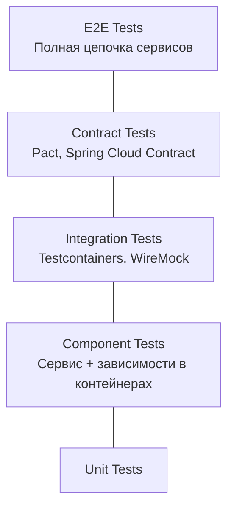

### Ключевые подходы

1. **Consumer-Driven Contract Testing** (`Pact`) — потребитель определяет контракт, провайдер его выполняет
2. **Service Virtualization** (`WireMock`) — мокирование внешних сервисов
3. **Component Testing** — сервис + его БД/кеш в контейнерах, внешние сервисы замоканы
4. **Chaos Engineering** — инъекция сбоев для проверки отказоустойчивости

```java
// WireMock: виртуализация внешнего сервиса
@SpringBootTest
@AutoConfigureWireMock(port = 0)
class OrderServiceTest {

    @Test
    void shouldHandlePaymentTimeout() {
        stubFor(post("/api/payments")
            .willReturn(aResponse()
                .withFixedDelay(10_000)
                .withStatus(504)));

        assertThrows(PaymentTimeoutException.class,
            () -> orderService.placeOrder(request));
    }
}
```


> [!mcq]
> - [ ] Только E2E тесты — они проверяют реальное поведение всей цепочки сервисов | E2E без contract тестов → любой сервис может сломать другой незаметно. ❌ ПОСЛЕДСТВИЕ: CI запускает 50 Selenium тестов 45 мин, каждое изменение схемы ломает половину.
> - [ ] Каждая команда тестирует только свой сервис unit-тестами | Без contract testing интерфейсы между сервисами не верифицированы. ❌ ПОСЛЕДСТВИЕ: OrderService ждёт userId:int, UserService вернул userId:string — баг в production при первом вызове.
> - [ ] Деплоить в prod и тестировать с реальными пользователями | Без safety net (canary/feature flags) баги видят 100% пользователей. ❌ ПОСЛЕДСТВИЕ: баг в Order API обнаружен через 2 часа — 10000 пользователей получили ошибку 500.
> - [x] Consumer-Driven Contract + Component Tests + Testcontainers + pyramid per service | Pact для contract, WireMock для external deps, Testcontainers для own deps, minimal E2E. ✓ ПРИМЕНЯТЬ: Netflix Pact broker, Spotify Test Honeycomb с component tests. 📋 ПРАВИЛО: «contract тест ловит API break за секунды, E2E — за 30 мин». 🔗 См. Q22, Q35.

## Q19. (!) Как тестировать legacy код?

Стратегия тестирования legacy-кода строится по книге Майкла Фезерса "Working Effectively with Legacy Code":

### Пошаговый подход

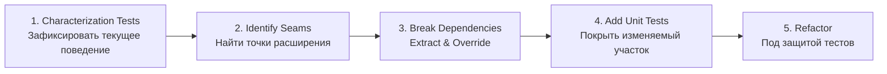

### Техники

| Техника | Описание |
|---------|----------|
| `Characterization Test` | Тест, фиксирующий текущее поведение (даже если оно "неправильное") |
| `Sprout Method` | Новая логика — в новый тестируемый метод |
| `Sprout Class` | Новая логика — в новый тестируемый класс |
| `Wrap Method` | Обернуть legacy-метод в wrapper для тестируемости |
| `Extract & Override` | Выделить зависимость в protected метод, переопределить в тесте |

```java
// Characterization test: фиксируем текущее поведение
@Test
void characterizeDiscountCalculation() {
    LegacyPriceService service = new LegacyPriceService();

    // Документируем что СЕЙЧАС возвращает метод
    BigDecimal result = service.calculateDiscount(100, "GOLD");
    assertEquals(new BigDecimal("15.00"), result);
    // Теперь если кто-то изменит логику — тест упадёт
}

// Sprout Method: новая логика в отдельный тестируемый метод
public class LegacyOrderProcessor {
    // Legacy метод — не трогаем
    public void processOrder(Order order) { /* ... */ }

    // Новый метод — можно тестировать
    public ValidationResult validateOrder(Order order) {
        if (order.getItems().isEmpty()) return ValidationResult.error("No items");
        if (order.getTotal().compareTo(BigDecimal.ZERO) <= 0)
            return ValidationResult.error("Invalid total");
        return ValidationResult.ok();
    }
}
```

Ключевой принцип: **Boy Scout Rule** — оставлять код чище, чем нашёл. Не требовать 100% покрытия сразу, фокус на изменяемых областях.


> [!mcq]
> - [ ] Сначала полностью переписать legacy код, потом добавить тесты | Переписывание без тестов → потеря неявного поведения (edge cases, хаки). ❌ ПОСЛЕДСТВИЕ: переписали без characterization tests, сломали 3 незадокументированных edge-case, production инцидент.
> - [ ] Не трогать legacy — оно работает годами, тесты не нужны | Legacy без тестов — любое изменение = adventure. ❌ ПОСЛЕДСТВИЕ: добавили новую фичу рядом с legacy-методом, сломали расчёт скидок — баг в prod 3 дня.
> - [ ] Добавить 100% coverage legacy-кода за один спринт | Агрессивное покрытие legacy без понимания = тесты ради метрики. ❌ ПОСЛЕДСТВИЕ: написали 200 тестов с assertNotNull без понимания бизнес-логики — mutation score 20%.
> - [x] Characterization tests → identify seams → Sprout Method/Class → unit under protection | Feathers: зафиксировать текущее поведение → найти точки расширения → изолировать → рефакторить. ✓ ПРИМЕНЯТЬ: Boy Scout Rule + Sprout Method для новой логики без изменения старой. 📋 ПРАВИЛО: «сначала characterization — потом изменения». 🔗 См. Q30, Q41.

## Q20. Как тестировать `Distributed Systems`?

Тестирование [распределённых систем](../architecture/distributed-systems-interview.md) осложняется асинхронностью, `eventual consistency` и сетевыми сбоями.

### Стратегия по уровням

| Уровень | Что тестируем | Инструменты |
|---------|---------------|-------------|
| Unit | Логика отдельных компонентов | `JUnit`, `Mockito` |
| Component | Сервис + зависимости | `Testcontainers` |
| Contract | Интерфейсы между сервисами | `Pact`, `Spring Cloud Contract` |
| Integration | Реальное взаимодействие | `Docker Compose` |
| Chaos | Отказоустойчивость | `Chaos Monkey`, `Toxiproxy` |
| E2E | Полная цепочка | Staging environment |

### Фокус на граничных случаях

- **Таймауты**: что происходит при timeout вызова?
- **Retry**: есть ли идемпотентность при повторных вызовах?
- **Partial failures**: сервис A ответил, сервис B — нет
- **Eventual consistency**: данные обновляются с задержкой
- **Network partitions**: часть кластера недоступна


> [!mcq]
> - [ ] Только unit-тесты для распределённых систем — интеграция это дорого | Unit-тесты не проверяют сетевые таймауты, partial failures и async consistency. ❌ ПОСЛЕДСТВИЕ: unit-тесты зелёные, но retry без идемпотентности вызывает двойные заказы в production.
> - [ ] E2E тестов достаточно — они проверяют всю систему | E2E не тестируют отдельные failure modes (timeout, partition). ❌ ПОСЛЕДСТВИЕ: Toxiproxy-сценарий «сеть с 500ms lag» не проверен, SLA 200ms нарушается на production.
> - [ ] Тестировать распределённые системы только в production через canary | Без pre-prod тестирования chaos canary обнаруживает проблемы на реальных пользователях. ❌ ПОСЛЕДСТВИЕ: partial failure в DB при canary deployment → data inconsistency для 1000 пользователей.
> - [x] Component tests + chaos (Toxiproxy) + contract tests + Awaitility для async | Testcontainers для own deps, WireMock для external, Awaitility для eventual consistency. ✓ ПРИМЕНЯТЬ: таймауты, retry-идемпотентность, partial failures через Toxiproxy. 📋 ПРАВИЛО: «distributed bugs = async + timeout + partition». 🔗 См. Q21, Q23.

## Q21. Как тестировать `Event-Driven Architecture`?

Тестирование [event-driven архитектуры](../architecture/event-driven-patterns-interview.md) требует проверки всей цепочки: продюсер -> топик -> консьюмер.

### Уровни тестирования

```java
// 1. Unit: проверяем формирование события
@Test
void shouldPublishOrderCreatedEvent() {
    OrderService service = new OrderService(eventPublisher);
    service.createOrder(request);

    verify(eventPublisher).publish(argThat(event ->
        event.getType().equals("ORDER_CREATED")
        && event.getOrderId().equals(orderId)));
}

// 2. Integration: Testcontainers + Kafka
@SpringBootTest
@Testcontainers
class KafkaIntegrationTest {

    @Container
    static KafkaContainer kafka = new KafkaContainer(
        DockerImageName.parse("confluentinc/cp-kafka:7.5.0"));

    @Test
    void shouldProcessEventEndToEnd() {
        kafkaTemplate.send("orders", orderEvent);

        await().atMost(Duration.ofSeconds(10))
            .untilAsserted(() -> {
                Order saved = orderRepo.findById(orderId);
                assertThat(saved.getStatus()).isEqualTo(CONFIRMED);
            });
    }
}
```

### Contract Testing для событий

Определять схемы событий (`Avro`, `JSON Schema`) и тестировать совместимость через `Schema Registry`. Подробнее о Kafka — в [вопросах по Kafka](../messaging/kafka-interview.md).


> [!mcq]
> - [ ] Тестировать только продюсеры событий — консьюмеры заработают если продюсер правильный | Консьюмер может неправильно десериализовать событие даже при корректном продюсере. ❌ ПОСЛЕДСТВИЕ: продюсер отправил LocalDate как строку "2024-01-15", консьюмер ожидал timestamp — NPE в production.
> - [ ] Использовать @SpringBootTest с мокированным KafkaTemplate для event тестов | Мокированный Kafka не проверяет реальную сериализацию, партиции, consumer group offsets. ❌ ПОСЛЕДСТВИЕ: тест с mock Kafka зелёный, в prod Avro-схема несовместима → consumer lag растёт, обработка остановлена.
> - [x] Unit для формата события + Testcontainers Kafka для интеграции + Schema Registry для контрактов | Unit: verify(publisher).publish(event) для проверки формата. Integration: Testcontainers Kafka + Awaitility для async assertion. ✓ ПРИМЕНЯТЬ: Schema Registry + Avro/Protobuf для contract, backward/forward compatibility. 📋 ПРАВИЛО: «event schema = контракт, нарушение = consumer break». 🔗 См. Q22, Q35.
> - [ ] Деплоить изменения в event schema без тестирования, консьюмеры адаптируются сами | Без schema compatibility check несовместимые изменения останавливают всех консьюмеров. ❌ ПОСЛЕДСТВИЕ: удалили поле orderId из события — 5 консьюмеров получили NullPointerException, инцидент P1.

## Q22. Что такое `Consumer-Driven Contract Testing`?

`Contract Testing` — подход, при котором **потребитель** определяет ожидаемый контракт API, а **провайдер** проверяет его соблюдение.

### Пример с `Pact`

```java
// Consumer side: определяем ожидания
@ExtendWith(PactConsumerTestExt.class)
@PactTestFor(providerName = "UserService")
class OrderServiceContractTest {

    @Pact(consumer = "OrderService")
    public V4Pact userExists(PactDslWithProvider builder) {
        return builder
            .given("User 123 exists")
            .uponReceiving("get user by id")
                .path("/api/users/123")
                .method("GET")
            .willRespondWith()
                .status(200)
                .body(newJsonBody(body -> {
                    body.numberType("id", 123);
                    body.stringType("name", "John");
                    body.stringType("email", "john@example.com");
                }).build())
            .toPact(V4Pact.class);
    }

    @Test
    @PactTestFor(pactMethod = "userExists")
    void shouldFetchUser(MockServer mockServer) {
        UserClient client = new UserClient(mockServer.getUrl());
        User user = client.getUser(123L);

        assertThat(user.getName()).isEqualTo("John");
    }
}
```

### Workflow

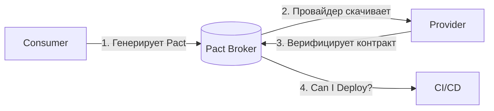


> [!mcq]
> - [ ] Consumer-Driven Contracts заменяют integration testing | ❌ ПОСЛЕДСТВИЕ: CDC и integration tests — комплементарные; CDC проверяет схему контракта между consumer/provider; integration tests — фактическое поведение с реальным взаимодействием
> - [ ] Pact работает только с REST API | ❌ ПОСЛЕДСТВИЕ: Pact поддерживает HTTP/REST, async messaging (Kafka, RabbitMQ, SNS/SQS); v3+ specifications покрывают request-response и message exchange
> - [ ] Provider verification опциональна | ❌ ПОСЛЕДСТВИЕ: без provider verification CDC бесполезен — contract существует но не enforced на сервере; «consumer написал — provider не знает» = ложная безопасность
> - [x] Pact workflow: 1) Consumer описывает expected interactions → 2) Pact JSON загружается в Pact Broker → 3) Provider скачивает + верифицирует contract → 4) `Can I Deploy?` gate в CI/CD блокирует deploy при mismatched contracts | ✓ ПРИМЕНЯТЬ: для микросервисов с многими consumer'ами одного provider'а; альтернатива end-to-end testing для cross-service compatibility 📋 ПРАВИЛО: contract = consumer-defined + provider-verified + broker-shared 🔗 См. Q23

## Q23. Что такое `Chaos Engineering`?

`Chaos Engineering` — практика намеренного внесения сбоев в систему для проверки отказоустойчивости. Принципы: **выдвинуть гипотезу**, **минимизировать blast radius**, **наблюдать**, **автоматизировать**.

### Типы экспериментов

| Тип | Пример | Инструмент |
|-----|--------|-----------|
| Сбой сервиса | Kill pod/container | `Chaos Monkey`, `Litmus` |
| Сетевые проблемы | Задержка, потеря пакетов | `Toxiproxy`, `tc` |
| Нагрузка на ресурсы | CPU/memory stress | `stress-ng` |
| Зависимости | Недоступность БД/кэша | `Testcontainers` stop |

```java
// Тест отказоустойчивости с circuit breaker
@SpringBootTest
@AutoConfigureWireMock(port = 0)
class CircuitBreakerChaosTest {

    @Test
    void shouldOpenCircuitBreakerOnServiceFailure() {
        // Симулируем 5 последовательных ошибок
        stubFor(get("/api/users/1")
            .willReturn(serverError()));

        // Circuit breaker должен открыться
        for (int i = 0; i < 5; i++) {
            assertThrows(ServiceException.class,
                () -> userClient.getUser(1L));
        }

        // Следующий вызов должен вернуть fallback без обращения к сервису
        User fallback = userClient.getUser(1L);
        assertThat(fallback.getName()).isEqualTo("Unknown");
    }
}
```


> [!mcq]
> - [ ] Chaos Engineering = намеренные баги в коде в production | ❌ ПОСЛЕДСТВИЕ: chaos инжектирует infrastructure failures (network/pod kill/CPU), не функциональные баги; для bugs — testing и code review
> - [ ] Цель chaos — поломать прод чтобы увидеть что упадёт | ❌ ПОСЛЕДСТВИЕ: цель — повысить уверенность через controlled experiments; с hypothesis и blast radius; «давайте сломаем» = chaos-ради-chaos антипаттерн
> - [ ] Chaos требует только Chaos Monkey, других инструментов не нужно | ❌ ПОСЛЕДСТВИЕ: разные уровни и платформы требуют разных tools — Chaos Monkey/Lambda, Chaos Mesh/Litmus K8s, Toxiproxy TCP, Pumba Docker
> - [x] Chaos Engineering — practice инжекции failure (kill pod, network latency/loss, CPU/memory stress, dependency unavailability) с hypothesis, минимизированным blast radius, observation, automation; цель — build confidence через unknown unknowns | ✓ ПРИМЕНЯТЬ: для валидации resilience patterns (CB, retry, bulkhead) в realistic conditions; integration tests + chaos в CI 📋 ПРАВИЛО: chaos = controlled experiments с hypothesis, не выкл «давайте ломать» 🔗 См. Q24

## Q24. (!) Какие метрики качества тестирования существуют?

### Coverage Metrics

| Метрика | Описание | Целевое значение |
|---------|----------|------------------|
| `Line Coverage` | % покрытых строк | > 80% |
| `Branch Coverage` | % покрытых ветвлений | > 70% |
| `Mutation Score` | % убитых мутантов | > 80% |

### Quality Metrics

| Метрика | Формула | Описание |
|---------|---------|----------|
| `Defect Density` | Дефекты / KLOC | Плотность дефектов на 1000 строк |
| `Defect Leakage` | Дефекты в prod / Все дефекты | % дефектов, дошедших до production |
| `MTTD` | Среднее время обнаружения | От внедрения до обнаружения |
| `MTTR` | Среднее время исправления | От обнаружения до fix |
| `Test Effectiveness` | Дефекты от тестов / Все дефекты | Эффективность тестового набора |

### Process Metrics

| Метрика | Целевое значение | Действия при отклонении |
|---------|------------------|------------------------|
| `Flaky Rate` | < 1% | Карантин + исправление |
| `Test Execution Time` | < 10 мин (unit) | Параллелизация, оптимизация |
| `Automation Rate` | > 70% | Автоматизация регрессии |
| `Build Success Rate` | > 95% | Анализ причин падений |

На собеседовании важно подчеркнуть: метрики не самоцель. `Line coverage` 100% не означает качество тестов — `mutation score` более показателен.


> [!mcq]
> - [ ] Line coverage 100% означает отличное качество тестов | ❌ ПОСЛЕДСТВИЕ: line coverage не проверяет правильность assertions; mutation score более показателен — проверяет, ловят ли тесты мутации; 100% line + 30% mutation = плохие тесты
> - [ ] Defect Leakage — количество дефектов в коде | ❌ ПОСЛЕДСТВИЕ: Defect Leakage = дефекты в prod / все дефекты; показывает % escaping тестов; «количество дефектов в коде» = просто defect count, не leakage
> - [ ] Flaky rate > 5% — это норма | ❌ ПОСЛЕДСТВИЕ: target <1%; >5% разрушает trust в test suite; команда начинает игнорировать red builds; необходимы quarantine + fix flaky tests как priority
> - [x] Метрики: Coverage (line >80%, branch >70%, mutation >80%); Quality (defect density, defect leakage, MTTD, MTTR, test effectiveness); Process (flaky rate <1%, exec time <10min unit, automation rate >70%, build success >95%); mutation score > line coverage для quality | ✓ ПРИМЕНЯТЬ: dashboards с trends; алерты при отклонениях; ретроспективы с metrics review; метрики — инструмент, не цель 📋 ПРАВИЛО: quality = mutation score + defect leakage + flaky rate, не coverage alone 🔗 См. Q25

## Q25. Как организовать тестирование в `Agile`/`Scrum`?

### Тестирование в Scrum-цикле

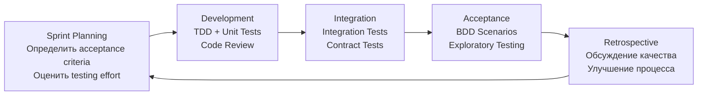

### Принципы

1. Тестирование — часть `Definition of Done`, не отдельная фаза
2. QA участвует в планировании (определяет acceptance criteria)
3. Регрессия автоматизирована и запускается в CI
4. Exploratory testing — time-boxed сессии каждый спринт
5. Ретроспектива: обсуждение покрытия, flakiness, дефектов

Подробнее о тестировании в CI/CD — в [вопросах по автоматизации тестирования](test-automation-interview.md).


> [!mcq]
> - [ ] Тестирование = отдельная фаза в конце спринта | ❌ ПОСЛЕДСТВИЕ: waterfall-pattern в Agile; bug найден в конце спринта = слишком поздно для исправления; тестирование должно быть continuous через спринт
> - [ ] QA подключается только к concrete-фазе на тестирование | ❌ ПОСЛЕДСТВИЕ: QA должен участвовать в planning (acceptance criteria) и refinement (risks/edge cases); late involvement = missed requirements
> - [ ] Регрессия ручная — автоматизация не нужна в Scrum | ❌ ПОСЛЕДСТВИЕ: 2-недельные спринты + manual regression = либо incomplete coverage либо delivery delay; automation обязательна для sustainable pace
> - [x] Принципы: тестирование = часть DoD не отдельная фаза; QA в planning (acceptance criteria); регрессия автоматизирована в CI; exploratory testing time-boxed sessions каждый спринт; ретроспектива обсуждает quality metrics | ✓ ПРИМЕНЯТЬ: shift-left testing; testing-as-code; TDD в development; integration tests в CI; exploratory во второй половине спринта 📋 ПРАВИЛО: testing in Scrum = continuous + automated + retrospected 🔗 См. Q26

## Q26. Что такое `Three Amigos` и `Definition of Done`?

### Three Amigos

Встреча трёх ролей перед началом работы над user story:

| Роль | Фокус |
|------|-------|
| **Business Analyst** | Бизнес-ценность, acceptance criteria |
| **Developer** | Техническая реализация, ограничения |
| **Tester** | Тестовые сценарии, edge cases, риски |

Результат: общее понимание задачи, готовые acceptance criteria, известные risk areas.

### Definition of Done (DoD) — чек-лист

- [ ] Код написан и прошёл code review
- [ ] Unit-тесты написаны и проходят (coverage > 80%)
- [ ] Integration-тесты написаны и проходят
- [ ] Acceptance criteria выполнены
- [ ] Нет известных critical/high дефектов
- [ ] Документация обновлена
- [ ] Feature задеплоена на staging

Без строгого `DoD` тестирование "съедается" давлением дедлайнов.


> [!mcq]
> - [ ] Three Amigos = developer + tester + designer | ❌ ПОСЛЕДСТВИЕ: правильная троица — Business Analyst (бизнес-ценность), Developer (реализация), Tester (сценарии); designer — отдельный role
> - [ ] DoD одинаков для всех команд во всех проектах | ❌ ПОСЛЕДСТВИЕ: DoD — team agreement, отражает context (legacy/greenfield, regulated/startup); универсальный DoD не работает
> - [ ] Three Amigos обсуждает только estimation | ❌ ПОСЛЕДСТВИЕ: estimation — побочный продукт; основная цель — shared understanding, acceptance criteria, risks, edge cases ДО начала работы
> - [x] Three Amigos = Business Analyst + Developer + Tester перед work на user story; обсуждают бизнес-ценность, реализацию, тестовые сценарии; результат — shared understanding + acceptance criteria + risk areas. DoD — чек-лист: код+review+unit tests (cov>80%)+integration+AC+no critical defects+docs+staging deploy | ✓ ПРИМЕНЯТЬ: Three Amigos в refinement; DoD как team agreement, ревизировать на retrospective; без DoD testing «съедается» дедлайнами 📋 ПРАВИЛО: 3 Amigos = shared understanding ДО кода; DoD = чек-лист завершённости 🔗 См. Q27

## Q27. Как балансировать скорость и качество тестирования?

### Стратегии оптимизации

| Стратегия | Эффект |
|-----------|--------|
| **Параллелизация** | `JUnit 5 parallel`, `Gradle --parallel` |
| **Инкрементальное тестирование** | Запуск только тестов для изменённого кода |
| **Test Impact Analysis** | Определение затронутых тестов по diff |
| **Tiered Test Execution** | Unit на каждый коммит, E2E по расписанию |
| **Оптимизация медленных тестов** | Профилирование, замена `@SpringBootTest` на `@WebMvcTest` |

```java
// JUnit 5: параллельный запуск
// junit-platform.properties
junit.jupiter.execution.parallel.enabled = true
junit.jupiter.execution.parallel.mode.default = concurrent
junit.jupiter.execution.parallel.config.fixed.parallelism = 4
```

Метрики для баланса: время выполнения тестов, покрытие, flaky rate. Решения принимаются на ретроспективах на основе данных.


> [!mcq]
> - [ ] Скорость и качество — взаимоисключающие, choose one | ❌ ПОСЛЕДСТВИЕ: false dichotomy; правильные техники (parallelization, test impact analysis, tiered execution) дают обе; «trade-off» = lazy thinking
> - [ ] @SpringBootTest везде для full integration | ❌ ПОСЛЕДСТВИЕ: @SpringBootTest стартует full context (~10s+); @WebMvcTest/@DataJpaTest — slice tests запускаются за секунды; правильный choice = драматический speedup
> - [ ] E2E тесты на каждый коммит для maximum safety | ❌ ПОСЛЕДСТВИЕ: E2E медленные (minutes-hours), flaky; на каждый коммит = unbearable feedback loop; tiered — unit на коммит, E2E nightly или perpush
> - [x] Стратегии: параллелизация (JUnit 5 parallel, Gradle --parallel), инкрементальное тестирование, Test Impact Analysis по diff, Tiered Test Execution (unit per commit, E2E scheduled), оптимизация slow tests (slice tests вместо @SpringBootTest); решения на основе данных | ✓ ПРИМЕНЯТЬ: profile slow tests; junit-platform.properties для parallel; tier по execution time/cost; не вместо качества, а на ту же quality за меньшее время 📋 ПРАВИЛО: speed via right techniques, не cuts в coverage 🔗 См. Q28

## Q28. Что такое `Test Observability`?

`Test Observability` — видимость результатов тестов, трендов и метрик для принятия обоснованных решений.

### Компоненты

1. **Дашборды** — покрытие, flaky rate, время выполнения, pass/fail по модулям
2. **Тренды** — как метрики меняются от спринта к спринту
3. **Алерты** — оповещение при росте flakiness или падении покрытия
4. **Трассируемость** — от теста к требованию и обратно

### Инструменты

| Инструмент | Назначение |
|------------|-----------|
| `Grafana` | Визуализация метрик тестирования |
| `Allure Report` | Детальные отчёты по тестам |
| `SonarQube` | Покрытие, дублирование, code smells |
| `Datadog CI Visibility` | Тренды CI/CD pipeline |

Связано с [observability](../monitoring/observability-interview.md) — те же принципы (метрики, логи, трейсы) применяются к тестовой инфраструктуре.


> [!mcq]
> - [ ] Test Observability — это просто Allure-отчёт раз в неделю | ❌ ПОСЛЕДСТВИЕ: статичный отчёт без трендов = недостаточно; нужны continuous dashboards, alerts на регрессии метрик, исторические сравнения
> - [ ] Достаточно pass/fail status в CI | ❌ ПОСЛЕДСТВИЕ: pass/fail не показывает trends — flaky rate увеличивается, execution time растёт незаметно; нужны metrics с trends по спринтам
> - [ ] Test Observability — это monitoring production | ❌ ПОСЛЕДСТВИЕ: production observability и test observability — разные; test observability про CI/test infra; production — про runtime app behavior
> - [x] Компоненты: Dashboards (coverage, flaky rate, exec time, pass/fail по модулям) + Тренды (по спринтам) + Алерты (рост flakiness, падение coverage) + Трассируемость (test ↔ requirement); инструменты — Grafana, Allure, SonarQube, Datadog CI Visibility | ✓ ПРИМЕНЯТЬ: dashboards с trends; alerts при отклонениях; те же principles что production observability (метрики/логи/трейсы), но для test infrastructure 📋 ПРАВИЛО: test observability = data-driven test improvement 🔗 См. Q29

## Q29. Как организовать `Test Review`?

Код-ревью тестов так же важен, как ревью production-кода. Подробнее о ревью — в [вопросах по code review](../code-quality/code-review-interview.md).

### Чек-лист ревью тестов

1. **Корректность**: тест проверяет то, что заявлено в названии?
2. **Assertions**: осмысленные, не `assertTrue(true)`?
3. **Изоляция**: тест не зависит от порядка выполнения?
4. **Читаемость**: Given-When-Then структура, осмысленные имена?
5. **Хрупкость**: нет зависимостей от времени, порядка, конкретных данных?
6. **Покрытие**: edge cases, error paths, boundary conditions?
7. **Naming**: `shouldReturnEmptyListWhenNoUsersFound` > `test1`?

```java
// BAD: что именно тестируем?
@Test
void test1() {
    var result = service.process(input);
    assertNotNull(result);
}

// GOOD: чёткое название, структура, assertions
@Test
void shouldReturnDiscountedPriceForPremiumCustomer() {
    // Given
    var customer = TestData.premiumCustomer();
    var order = TestData.orderWithTotal(Money.of(1000));

    // When
    var price = pricingService.calculateFinalPrice(order, customer);

    // Then
    assertThat(price).isEqualTo(Money.of(800)); // 20% скидка
}
```


> [!mcq]
> - [ ] Test code review не нужен — тесты приватные | ❌ ПОСЛЕДСТВИЕ: bad tests = false confidence в production code; review тестов critical; «test code is production code» — стандарт зрелых команд
> - [ ] `assertNotNull` достаточен в большинстве случаев | ❌ ПОСЛЕДСТВИЕ: assertNotNull проверяет только что объект существует; не проверяет правильность значения; нужны specific assertions по бизнес-логике
> - [ ] `test1()`, `test2()` — приемлемые имена тестов | ❌ ПОСЛЕДСТВИЕ: при failure не знаешь что упало; правильное имя — `shouldReturnDiscountedPriceForPremiumCustomer` (сценарий описан); test name = mini documentation
> - [x] Чек-лист test review: 1) корректность (test проверяет заявленное), 2) осмысленные assertions, 3) изоляция (без dependency на порядок), 4) Given-When-Then читаемость, 5) хрупкость (нет time/order dependencies), 6) edge cases coverage, 7) описательные имена тестов | ✓ ПРИМЕНЯТЬ: review тестов так же тщательно как production code; «show me the assertion» — главный вопрос; refactor бесполезных assertions 📋 ПРАВИЛО: test code = first-class code, заслуживает review 🔗 См. Q30

## Q30. Что такое `Test Doubles Strategy`?

Выбор типа test double зависит от контекста и цели теста:

| Тип | Когда использовать | Пример |
|-----|-------------------|--------|
| `Dummy` | Заполнитель, не используется | `new Object()` в конструкторе |
| `Stub` | Возврат данных | `when(repo.findById(1)).thenReturn(user)` |
| `Mock` | Проверка взаимодействий | `verify(emailService).send(any())` |
| `Spy` | Частичный мок реального объекта | `spy(realService)` |
| `Fake` | Упрощённая реализация | `InMemoryRepository` вместо БД |

### Принципы

- **Не переусложнять**: если достаточно `stub` — не используйте `mock`
- **Избегать over-mocking**: если мокаете больше, чем тестируете — это сигнал о плохом дизайне
- **Изоляция**: каждый тест создаёт свои doubles, не переиспользовать между тестами
- **Prefer fakes for repositories**: `InMemoryRepository` надёжнее, чем цепочка `when().thenReturn()`

Подробнее о моках и стабах — в [вопросах по unit-тестированию](unit-testing-interview.md).


> [!mcq]
> - [ ] Mock и Stub — синонимы | ❌ ПОСЛЕДСТВИЕ: разные purposes — Stub returns canned data (state verification), Mock verifies interactions (behavior verification); confusing терминологию = плохие тесты
> - [ ] Mock everything для maximum isolation | ❌ ПОСЛЕДСТВИЕ: over-mocking = тесты падают при любом refactor; если мокаете больше чем тестируете = sign of poor design; prefer real objects + slice tests
> - [ ] Spy = создание real object с fake methods на лету | ❌ ПОСЛЕДСТВИЕ: spy — partial mock of REAL object; spy(realService) сохраняет реальные методы кроме переопределённых; mock — без real implementation вообще
> - [x] Test doubles: Dummy (placeholder), Stub (canned data, when().thenReturn()), Mock (interaction verification, verify().send()), Spy (partial mock of real), Fake (упрощённая реализация типа InMemoryRepository); принципы — простейший double, prefer fakes для repositories, изоляция per test | ✓ ПРИМЕНЯТЬ: stub если достаточно; fake для repositories (InMemoryRepository надёжнее цепочки when().thenReturn()); mock только когда verification critical 📋 ПРАВИЛО: choose simplest test double для задачи 🔗 См. Q31

## Q31. (!) Что такое `Test Containerization` и `Testcontainers`?

`Testcontainers` — Java-библиотека для запуска Docker-контейнеров в тестах: БД, брокеры сообщений, кэши — все зависимости поднимаются автоматически.

```java
@SpringBootTest
@Testcontainers
class OrderRepositoryIT {

    @Container
    static PostgreSQLContainer<?> postgres =
        new PostgreSQLContainer<>("postgres:16-alpine")
            .withDatabaseName("testdb")
            .withUsername("test")
            .withPassword("test");

    @DynamicPropertySource
    static void configureProperties(DynamicPropertyRegistry registry) {
        registry.add("spring.datasource.url", postgres::getJdbcUrl);
        registry.add("spring.datasource.username", postgres::getUsername);
        registry.add("spring.datasource.password", postgres::getPassword);
    }

    @Autowired
    private OrderRepository orderRepository;

    @Test
    void shouldSaveAndRetrieveOrder() {
        Order order = new Order("item-1", BigDecimal.TEN);
        orderRepository.save(order);

        Optional<Order> found = orderRepository.findById(order.getId());
        assertThat(found).isPresent();
        assertThat(found.get().getTotal()).isEqualByComparingTo(BigDecimal.TEN);
    }
}
```

### Преимущества

- **Воспроизводимость**: одинаковое окружение локально и в CI
- **Изоляция**: каждый тест класс — чистый контейнер
- **Реальные зависимости**: PostgreSQL вместо H2, Kafka вместо embedded

Подробнее — в [вопросах по интеграционному тестированию](integration-testing-interview.md).


> [!mcq]
> - [ ] H2 в-памяти ничем не хуже Testcontainers с реальным PostgreSQL | ❌ ПОСЛЕДСТВИЕ: H2 другой dialect, разное behavior для constraints/types/json/window functions; «тесты проходят на H2, ломается прод на Postgres» — классическая проблема
> - [ ] Testcontainers требует docker-compose | ❌ ПОСЛЕДСТВИЕ: Testcontainers — Java lib работающая с Docker daemon напрямую через Docker API; docker-compose не нужен; managed containers per test class
> - [ ] @Container в JUnit 5 — это static method | ❌ ПОСЛЕДСТВИЕ: @Container на field; static field = shared between tests, non-static = per test instance; @DynamicPropertySource для Spring config
> - [x] Testcontainers поднимает Docker-контейнеры (PostgreSQL/Redis/Kafka) в тестах; @Testcontainers + @Container; @DynamicPropertySource для Spring config; преимущества — воспроизводимость local/CI, изоляция per test class, реальные зависимости вместо H2/embedded | ✓ ПРИМЕНЯТЬ: integration tests с real databases; reuse containers через `withReuse(true)` для скорости; одинаковый image tag в prod и tests 📋 ПРАВИЛО: real dependencies в тестах = avoid local-vs-prod divergence 🔗 См. Q32

## Q32. Как организовать `Test Environments Strategy`?

### Уровни окружений

| Окружение | Назначение | Данные | Доступ |
|-----------|-----------|--------|--------|
| `Local` | Разработка | Фикстуры, `Testcontainers` | Разработчик |
| `CI` | Автоматические тесты | Сгенерированные | Pipeline |
| `Staging` | Pre-production проверка | Анонимизированные production | Команда |
| `Production` | Canary, monitoring | Реальные | Контролируемый |

### Принципы

1. **Staging = Production** по конфигурации (но с анонимизированными данными)
2. **Infrastructure as Code** — окружения поднимаются автоматически
3. **Изоляция** — тесты не влияют друг на друга
4. **Seed Data** — автоматическая загрузка тестовых данных
5. **Feature Flags** — контроль доступа к фичам на каждом окружении


> [!mcq]
> - [ ] Достаточно одного staging-окружения для всей команды | ❌ ПОСЛЕДСТВИЕ: shared staging = conflict tests разных команд, flaky shared state; правильнее multiple ephemeral environments на feature
> - [ ] Production data копируется в staging без анонимизации | ❌ ПОСЛЕДСТВИЕ: GDPR/PII compliance violation; team members получают доступ к real customer data; anonymization обязательна
> - [ ] Local environment без Docker, manual setup БД и зависимостей | ❌ ПОСЛЕДСТВИЕ: «works on my machine» проблемы; новый dev день setting up dependencies; Testcontainers / docker-compose решают за секунды
> - [x] Уровни: Local (Testcontainers/фикстуры), CI (generated data), Staging = Production по конфигу (с анонимизированными данными), Production (canary/monitoring); принципы — IaC для воспроизводимости, изоляция, seed data автоматически, feature flags для контроля | ✓ ПРИМЕНЯТЬ: ephemeral environments per PR; Terraform/Pulumi для IaC; data anonymization pipeline для prod→staging dumps 📋 ПРАВИЛО: environments = layered, isolated, IaC-managed 🔗 См. Q33

## Q33. Как организовать `Test Data Management`?

### Подходы

| Подход | Описание | Когда использовать |
|--------|----------|-------------------|
| **Builders** | `TestDataBuilder` pattern | Unit, integration тесты |
| **Fixtures** | JSON/SQL файлы с данными | Integration тесты |
| **Factories** | `ObjectMother` pattern | Повторяемые наборы данных |
| **Anonymization** | Маскирование PII | Staging с production-данными |
| **Generation** | `Faker`, `jqwik` | Property-based тесты |

```java
// Test Data Builder pattern
public class TestOrderBuilder {
    private String product = "Default Product";
    private BigDecimal price = BigDecimal.TEN;
    private OrderStatus status = OrderStatus.NEW;

    public static TestOrderBuilder anOrder() { return new TestOrderBuilder(); }

    public TestOrderBuilder withProduct(String product) {
        this.product = product; return this;
    }

    public TestOrderBuilder withPrice(BigDecimal price) {
        this.price = price; return this;
    }

    public TestOrderBuilder completed() {
        this.status = OrderStatus.COMPLETED; return this;
    }

    public Order build() {
        return new Order(product, price, status);
    }
}

// Использование
Order order = anOrder().withProduct("Book").withPrice(new BigDecimal("29.99")).completed().build();
```

### Privacy и Compliance

При использовании production-данных для тестирования: анонимизация `PII` (имена, email, телефоны), соответствие `GDPR`/`HIPAA`, регулярная очистка тестовых окружений.


> [!mcq]
> - [ ] Hardcoded data в тестах — простое и быстрое решение | ❌ ПОСЛЕДСТВИЕ: при изменении model тесты ломаются массово; нет reuse; копипаста создаёт divergent fixtures; правильно — builders/factories
> - [ ] Production data можно использовать без обработки | ❌ ПОСЛЕДСТВИЕ: GDPR/HIPAA violation; нужна анонимизация PII перед использованием; data masking pipeline обязателен
> - [ ] Тестовые данные одни для всех тестов в проекте | ❌ ПОСЛЕДСТВИЕ: shared state создаёт coupling между тестами; flaky tests при параллельном выполнении; изоляция per test обязательна
> - [x] Подходы: TestDataBuilder pattern (для unit/integration), Fixtures (JSON/SQL для integration), Factories/ObjectMother (повторяемые наборы), Anonymization (PII masking для staging), Generation (Faker/jqwik для property-based); compliance GDPR/HIPAA через анонимизацию | ✓ ПРИМЕНЯТЬ: builders с fluent API (`anOrder().withProduct("Book").completed().build()`); factories для commonly used objects; изоляция per test 📋 ПРАВИЛО: test data = isolated, builder-driven, anonymized 🔗 См. Q34

## Q34. Как организовать `Test Automation Framework`?

### Архитектура фреймворка

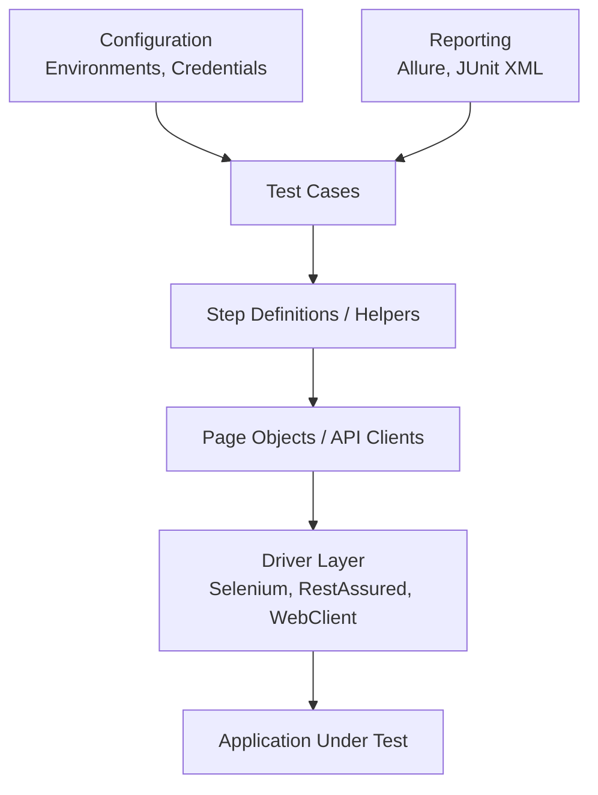

### Принципы

1. **Layered Architecture** — тесты не знают о деталях UI/API
2. **Page Object Pattern** — инкапсуляция UI-элементов
3. **Configuration-driven** — окружения, данные, credentials через конфиг
4. **Отчёты** — `Allure`, `JUnit XML` для CI интеграции
5. **Минимализм** — не создавать "фреймворк ради фреймворка"


> [!mcq]
> - [ ] Test Automation Framework = монолит со всей логикой в тестах | ❌ ПОСЛЕДСТВИЕ: monolithic tests — duplication, fragility; правильный design — layered (test cases → step definitions → page objects → driver layer)
> - [ ] Page Object Pattern только для UI-тестов | ❌ ПОСЛЕДСТВИЕ: аналогично для API — RequestSpec/Client classes инкапсулируют API calls; принцип «изолированный wrapper» применим везде
> - [ ] Build framework from scratch для каждого проекта | ❌ ПОСЛЕДСТВИЕ: «framework ради framework» антипаттерн; используйте established libs (REST-assured, Selenium WebDriver, Playwright); custom — только specific helpers
> - [x] Layered architecture: Test Cases → Step Definitions/Helpers → Page Objects/API Clients → Driver Layer (Selenium/RestAssured/WebClient) → App Under Test; Configuration-driven (envs/creds через config); Reports (Allure/JUnit XML); минимализм — не «framework ради framework» | ✓ ПРИМЕНЯТЬ: 4 слоя; tests не знают деталей API/UI; configuration externalized; Allure для rich reports 📋 ПРАВИЛО: framework = abstraction layers + config-driven 🔗 См. Q35

## Q35. Что такое `Contract Testing` и как его реализовать с `Pact`?

`Contract Testing` проверяет, что два сервиса могут корректно общаться, без необходимости запускать оба одновременно.

### Provider Verification

```java
// Provider side: верификация контрактов
@Provider("UserService")
@PactBroker(url = "https://pact-broker.example.com")
@SpringBootTest(webEnvironment = RANDOM_PORT)
class UserServiceProviderTest {

    @TestTemplate
    @ExtendWith(PactVerificationInvocationContextProvider.class)
    void verifyPact(PactVerificationContext context) {
        context.verifyInteraction();
    }

    @State("User 123 exists")
    void userExists() {
        userRepository.save(new User(123L, "John", "john@example.com"));
    }
}
```

### Альтернатива: `Spring Cloud Contract`

```groovy
// Groovy DSL контракт
Contract.make {
    request {
        method GET()
        url "/api/users/123"
    }
    response {
        status OK()
        body([id: 123, name: "John", email: "john@example.com"])
        headers { contentType(applicationJson()) }
    }
}
```


> [!mcq]
> - [ ] Pact = только consumer-side проверка | ❌ ПОСЛЕДСТВИЕ: Pact обязательно two-sided — consumer описывает contract, provider verifies; без provider verification contract бесполезен
> - [ ] @State в провайдере не нужен | ❌ ПОСЛЕДСТВИЕ: @State methods создают prerequisites для каждого scenario («User 123 exists»); без них provider тест fails при попытке fetch несуществующего user
> - [ ] Spring Cloud Contract и Pact — синонимы | ❌ ПОСЛЕДСТВИЕ: оба для contract testing, но разные approaches — Pact consumer-driven (JSON pact files), SCC provider-driven (Groovy DSL); разный workflow и tooling
> - [x] Pact provider verification: @Provider("UserService") + @PactBroker(url) + @TestTemplate + PactVerificationContext.verifyInteraction() + @State methods для prerequisites. Альтернатива — Spring Cloud Contract с Groovy DSL для definitions; обе работают через Pact Broker | ✓ ПРИМЕНЯТЬ: Pact для consumer-driven; SCC для provider-driven; интеграция с CI gate `Can I Deploy?` 📋 ПРАВИЛО: contract testing = bilateral verification 🔗 См. Q36

## Q36. Что такое `Visual Regression Testing`?

`Visual Regression Testing` — автоматическое сравнение скриншотов UI для обнаружения непреднамеренных визуальных изменений.

### Инструменты

| Инструмент | Описание |
|------------|----------|
| `Percy` | Cloud-based, интеграция с CI |
| `Playwright` | Встроенное сравнение скриншотов |
| `BackstopJS` | Open-source, конфигурируемый |
| `Chromatic` | Для Storybook компонентов |

### Когда использовать

- Изменения в CSS/дизайн-системе
- Обновление зависимостей (React, Bootstrap)
- Cross-browser тестирование
- Responsive layout проверки


> [!mcq]
> - [ ] Visual regression = функциональное e2e тестирование | ❌ ПОСЛЕДСТВИЕ: разные purposes — visual regression сравнивает скриншоты (pixel-level), e2e проверяет user flows; ortogonalные testing layers
> - [ ] Достаточно вручную смотреть на интерфейс перед релизом | ❌ ПОСЛЕДСТВИЕ: manual visual review не масштабируется (1000+ страниц × N браузеров × M размеров экрана); автоматизация обязательна для responsive web
> - [ ] Visual regression замещает unit тесты | ❌ ПОСЛЕДСТВИЕ: orthogonal layers — unit тесты для logic, visual для UI rendering; visual без unit = только UI без internal consistency
> - [x] Visual regression = автосравнение скриншотов для обнаружения unintentional UI changes; инструменты — Percy (cloud + CI), Playwright (built-in), BackstopJS (open-source), Chromatic (Storybook); когда — CSS/design system changes, dep updates, cross-browser, responsive | ✓ ПРИМЕНЯТЬ: Percy/Chromatic для CI integration; baseline screenshots в git; review diffs при изменениях; tolerance thresholds для anti-aliasing 📋 ПРАВИЛО: visual regression = pixel-level UI safety net 🔗 См. Q37

## Q37. Что такое `Performance Testing Strategy`?

### Типы нагрузочного тестирования

| Тип | Цель | Инструменты |
|-----|------|-------------|
| `Load Testing` | Поведение при ожидаемой нагрузке | `Gatling`, `JMeter`, `k6` |
| `Stress Testing` | Предел системы | `Gatling`, `Locust` |
| `Spike Testing` | Резкий рост нагрузки | `k6` |
| `Soak Testing` | Стабильность при длительной нагрузке | `JMeter` |
| `Capacity Planning` | Определение необходимых ресурсов | `Gatling` + мониторинг |

### Метрики

- **Throughput** — RPS (requests per second)
- **Latency** — p50, p95, p99 response time
- **Error Rate** — % ошибок под нагрузкой
- **Resource Utilization** — CPU, memory, disk I/O

Производительность тестируется в CI/CD pipeline на staging окружении. Результаты сравниваются с baseline для обнаружения деградации. Подробнее — в [вопросах по профилированию](../performance/application-profiling-interview.md).


> [!mcq]
> - [ ] Load Testing и Stress Testing — синонимы | ❌ ПОСЛЕДСТВИЕ: load = ожидаемая нагрузка (поведение в normal conditions); stress = предел системы (где ломается); разные цели, разные методики
> - [ ] Performance testing — only avg response time | ❌ ПОСЛЕДСТВИЕ: avg скрывает long tails; нужны percentiles (p50/p95/p99); avg 100ms с p99 5s = плохой UX для 1% пользователей
> - [ ] Performance testing ручной без CI/CD | ❌ ПОСЛЕДСТВИЕ: manual = выполняется редко, регрессии propagate в prod; automation в CI + сравнение с baseline для detection деградации обязательны
> - [x] Типы: Load (ожидаемая нагрузка), Stress (предел), Spike (резкий рост), Soak (длительная стабильность), Capacity Planning (необходимые ресурсы); метрики — Throughput RPS, Latency p50/p95/p99, Error Rate, Resource Util; инструменты — Gatling/JMeter/k6/Locust | ✓ ПРИМЕНЯТЬ: в CI/CD pipeline на staging; baseline comparison для регрессии; SLO-aligned thresholds; запускать по nightly schedule 📋 ПРАВИЛО: perf testing = automated + percentiles + baseline comparison 🔗 См. Q38

## Q38. Что такое `Security Testing Strategy`?

### Уровни безопасности

| Уровень | Подход | Инструменты |
|---------|--------|-------------|
| `Static Analysis` (SAST) | Анализ исходного кода | `SonarQube`, `SpotBugs`, `Checkmarx` |
| `Dynamic Analysis` (DAST) | Тестирование работающего приложения | `OWASP ZAP`, `Burp Suite` |
| `Dependency Scanning` | Уязвимости в зависимостях | `OWASP Dependency-Check`, `Snyk` |
| `Penetration Testing` | Имитация атак | Ручное, `Metasploit` |
| `Secret Scanning` | Утечки секретов в коде | `Gitleaks`, `TruffleHog` |

### Интеграция в CI/CD

```yaml
# Security gates в pipeline
security:
  - stage: sast
    script: sonar-scanner
    allow_failure: false
  - stage: dependency-check
    script: owasp-dependency-check --project app
    allow_failure: false
  - stage: dast
    script: zap-baseline.py -t http://staging:8080
    allow_failure: true  # может быть flaky
```

Подробнее — в [вопросах по безопасности приложений](../security/application-security-interview.md) и [OWASP Top 10](../security/owasp-top10-interview.md).


> [!mcq]
> - [ ] SAST и DAST — синонимы | ❌ ПОСЛЕДСТВИЕ: SAST — Static (анализ source code без запуска); DAST — Dynamic (тестирование running app); разные approaches, разные findings
> - [ ] Penetration testing автоматизируется полностью | ❌ ПОСЛЕДСТВИЕ: pen testing требует human creativity для chained exploits и business logic; automated tools (Metasploit) — supplement, не replacement
> - [ ] Secret scanning — это просто grep по «password» | ❌ ПОСЛЕДСТВИЕ: real tools (Gitleaks, TruffleHog) используют entropy analysis + pattern matching для AWS keys/JWTs/private keys; grep пропускает большинство
> - [x] Уровни: SAST (SonarQube/SpotBugs/Checkmarx — source code), DAST (OWASP ZAP/Burp Suite — running app), Dependency Scanning (OWASP Dependency-Check/Snyk — CVEs in deps), Pen Testing (Metasploit + manual), Secret Scanning (Gitleaks/TruffleHog). CI/CD integration через security gates с allow_failure | ✓ ПРИМЕНЯТЬ: SAST/dep-scan на каждый коммит; DAST на staging; pen testing quarterly; secret scanning в pre-commit hooks 📋 ПРАВИЛО: security layers = SAST + DAST + deps + secrets + pen test 🔗 См. Q39

## Q39. Как организовать тестирование при `Continuous Deployment`?

При `Continuous Deployment` каждый коммит потенциально попадает в production. Это предъявляет повышенные требования к тестированию.

### Pipeline

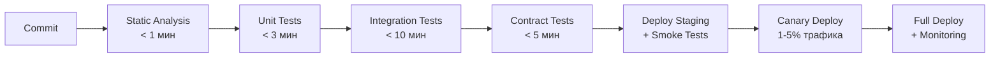

### Quality Gates

| Gate | Критерий | Блокирует deploy? |
|------|----------|-------------------|
| Static Analysis | 0 critical issues | Да |
| Unit Tests | 100% pass, coverage > 80% | Да |
| Integration Tests | 100% pass | Да |
| Contract Tests | 100% pass | Да |
| Smoke Tests | Критический путь | Да |
| Canary Metrics | Error rate < 1%, p99 < SLA | Да |

Ключевое: автоматические rollback при нарушении quality gates. Подробнее — в [вопросах по CI/CD pipeline](../cicd/pipeline-design-interview.md).


> [!mcq]
> - [ ] Continuous Deployment = manual gate перед prod | ❌ ПОСЛЕДСТВИЕ: путаница с Continuous Delivery; CD (deployment) = автоматически в prod при passing pipeline; CD (delivery) = ready to deploy с manual gate
> - [ ] Quality gates можно skip для urgent hotfix | ❌ ПОСЛЕДСТВИЕ: skip gates → возможные новые баги в hotfix; правильный путь — emergency hotfix branch с minimum unit + smoke tests, не отключение всех gates
> - [ ] Canary не нужен — достаточно staging | ❌ ПОСЛЕДСТВИЕ: staging не имеет real traffic; canary с 1-5% production traffic выявляет issues недоступные на staging
> - [x] CD pipeline: Commit → Static Analysis (<1min) → Unit Tests (<3min) → Integration (<10min) → Contract Tests (<5min) → Deploy Staging + Smoke → Canary 1-5% → Full Deploy + Monitoring. Quality gates с auto-rollback при error rate>1% или p99>SLA | ✓ ПРИМЕНЯТЬ: progressive rollouts; auto-rollback с metrics-based detection; feature flags для kill-switch; observability обязательна 📋 ПРАВИЛО: CD = automated quality gates + progressive rollout + auto-rollback 🔗 См. Q40

## Q40. (!) Best practices для `Test Strategy`

1. **Определить цели и scope** — что тестируем и зачем
2. **Приоритизация по риску** — критичное первым (см. `Risk-Based Testing`)
3. **Баланс автоматизации** — не всё нужно автоматизировать
4. **Непрерывное тестирование** — тесты в `CI/CD` на каждый коммит
5. **Метрики и мониторинг** — `coverage`, `mutation score`, `flaky rate`
6. **Обучение команды** — ревью тестов, pair testing, workshops
7. **Ретро и адаптация** — стратегия эволюционирует с проектом
8. **Документирование подхода** — `Test Strategy Document` актуален
9. **Shift-Left + Shift-Right** — тестирование и рано, и в production
10. **Фокус на value** — покрытие ради покрытия бесполезно; `mutation testing` показывает реальное качество

### Антипаттерны

| Антипаттерн | Проблема | Решение |
|-------------|----------|---------|
| Ice Cream Cone | Много E2E, мало unit | Следовать `Test Pyramid` |
| 100% Coverage Fetish | Покрытие без смысла | `Mutation Testing` |
| Test-Last | Тесты после дедлайна | `TDD`, `DoD` |
| Flaky Tolerance | Игнорирование нестабильных тестов | Quarantine + fix/delete |
| Copy-Paste Tests | Дублирование тестового кода | Test Builders, helpers |


> [!mcq]
> - [ ] 100% line coverage гарантирует качество | ❌ ПОСЛЕДСТВИЕ: «100% coverage fetish» антипаттерн; покрытие без assertions = false safety; mutation score показывает реальное качество
> - [ ] Test-Last (тесты после deadline) приемлемо | ❌ ПОСЛЕДСТВИЕ: тесты пишутся в спешке, плохо; правильно — TDD + DoD требуют тесты как part of work
> - [ ] Игнорировать flaky tests если их мало | ❌ ПОСЛЕДСТВИЕ: «flaky tolerance» подрывает trust в test suite; команда начинает игнорировать red builds; quarantine + fix/delete политика обязательна
> - [x] Best practices: цели/scope, риск-приоритизация, баланс automation (не всё), continuous testing в CI/CD, метрики (coverage/mutation/flaky), team education, retrospectives, документирование, Shift-Left + Shift-Right, фокус на value (mutation > coverage). Антипаттерны — Ice Cream Cone, 100% Coverage Fetish, Test-Last, Flaky Tolerance, Copy-Paste Tests | ✓ ПРИМЕНЯТЬ: test pyramid в архитектуре; mutation testing в CI; flaky tracker dashboard; testing как часть DoD 📋 ПРАВИЛО: strategy = value-driven, ne coverage-driven 🔗 См. Q41

## Q41. (!) Как правильно применять Test Doubles: когда Mock, когда Stub, когда Fake?

Test Doubles — объекты-заменители реальных зависимостей. Правильный выбор типа влияет на читаемость и устойчивость тестов.

### Классификация по Месарошу

| Тип | Назначение | Проверяет вызовы? | Когда использовать |
|-----|-----------|------------------|-------------------|
| **Dummy** | Заполнить параметр, не использовать | Нет | Когда зависимость нужна в сигнатуре, но не используется в тесте |
| **Stub** | Возвращать заданные данные | Нет | Изолировать тест от данных внешней системы |
| **Spy** | Обёртка над реальным объектом + запись вызовов | Опционально | Когда нужна реальная логика + верификация |
| **Mock** | Программируемый объект с верификацией вызовов | Да | Проверить побочный эффект (отправка email, аудит) |
| **Fake** | Рабочая упрощённая реализация | Нет | Когда логика сложна для стаба, но реальная система недоступна |

```java
// Stub — возвращает данные, вызовы не проверяются
when(userRepository.findById(1L)).thenReturn(Optional.of(testUser));
// Используем когда: тест проверяет РЕЗУЛЬТАТ обработки данных

// Mock — проверяем, что определённый вызов произошёл
orderService.placeOrder(order);
verify(emailService).sendConfirmation(order.getCustomerEmail());
// Используем когда: тест проверяет ПОВЕДЕНИЕ (side effect)

// Spy — реальный объект, но можно переопределить методы
@Spy
UserService userService = new UserService(realRepo);
doReturn(cachedUser).when(userService).loadFromCache(1L);
// Используем когда: нужна реальная логика кроме одного дорогого метода

// Fake — упрощённая, но рабочая реализация
class InMemoryOrderRepository implements OrderRepository {
    private final Map<Long, Order> store = new HashMap<>();

    @Override
    public Order save(Order order) {
        order.setId(store.size() + 1L);
        store.put(order.getId(), order);
        return order;
    }

    @Override
    public Optional<Order> findById(Long id) {
        return Optional.ofNullable(store.get(id));
    }
}
// Используем когда: несколько тестов нужны реальная логика хранения
// (CRUD, поиск), но реальная БД слишком медленна или сложна
```

### Практическое правило

> **Тестируете результат?** → `Stub`.
> **Тестируете, что что-то было вызвано?** → `Mock`.
> **Нужна реальная логика, но быстрая?** → `Fake` или `Spy`.

Чрезмерное использование `Mock` (особенно `verify` каждого вызова) приводит к хрупким тестам, которые ломаются при рефакторинге даже если поведение не изменилось.


> [!mcq]
> - [ ] Mock — это всегда лучший выбор для test isolation | ❌ ПОСЛЕДСТВИЕ: over-mocking ломает тесты при refactor; mock проверяет interactions — нужен только когда тестируете side effects (email/audit calls); для data — stub
> - [ ] Spy = Mock с дополнительными возможностями | ❌ ПОСЛЕДСТВИЕ: Spy — wrapper around REAL object (реальная логика + опциональная запись); Mock — полностью fake object; разные purposes
> - [ ] Fake — это просто более сложный Stub | ❌ ПОСЛЕДСТВИЕ: Fake = working simplified implementation (InMemoryRepo с CRUD/search); Stub возвращает canned data per call (`when().thenReturn()`); Fake поддерживает sequence of operations
> - [x] Stub (data return, без verification), Mock (interaction verification, side effects), Spy (real object + record), Fake (упрощённая working implementation). Правило — тестируем результат → Stub; что-то вызвано → Mock; нужна real logic быстро → Fake/Spy. Mock everything = fragile tests | ✓ ПРИМЕНЯТЬ: stub для repository reads, mock для notification.send(), fake для in-memory persistence, dummy для unused params 📋 ПРАВИЛО: choose double based on test purpose 🔗 См. Q42

## Q42. Что такое Contract Testing с Pact: Consumer и Provider стороны?

**Contract Testing** (контрактное тестирование) — подход, при котором каждая пара сервисов (consumer + provider) согласует контракт взаимодействия и проверяет его независимо. Это снижает необходимость в дорогостоящих E2E-тестах.

### Consumer-Driven Contract Testing с Pact

```java
// ============ CONSUMER (сервис, который вызывает API) ============

@ExtendWith(PactConsumerTestExt.class)
@PactTestFor(providerName = "order-service")
class OrderClientPactTest {

    @Pact(consumer = "notification-service")
    public RequestResponsePact createOrderPact(PactDslWithProvider builder) {
        return builder
            .given("order 1 exists")
            .uponReceiving("a request to get order 1")
                .path("/api/v1/orders/1")
                .method("GET")
                .headers(Map.of("Accept", "application/json"))
            .willRespondWith()
                .status(200)
                .headers(Map.of("Content-Type", "application/json"))
                .body(new PactDslJsonBody()
                    .integerType("id", 1)
                    .stringType("status", "PENDING")
                    .decimalType("amount", 99.99)
                )
            .toPact();
    }

    @Test
    @PactTestFor(pactMethod = "createOrderPact")
    void shouldGetOrder(MockServer mockServer) {
        // Pact запускает mock-сервер с заданным контрактом
        OrderClient client = new OrderClient(mockServer.getUrl());
        Order order = client.getOrder(1L);

        assertThat(order.getStatus()).isEqualTo("PENDING");
        // Файл с контрактом сохраняется в target/pacts/
    }
}

// ============ PROVIDER (сервис, который предоставляет API) ============

@SpringBootTest(webEnvironment = SpringBootTest.WebEnvironment.RANDOM_PORT)
@Provider("order-service")
@PactFolder("pacts")  // читаем контракты из файлов (или из Pact Broker)
class OrderServicePactVerificationTest {

    @LocalServerPort
    private int port;

    @MockBean
    private OrderRepository orderRepository;

    @BeforeEach
    void setUp(PactVerificationContext context) {
        context.setTarget(new HttpTestTarget("localhost", port));
    }

    @TestTemplate
    @ExtendWith(PactVerificationInvocationContextProvider.class)
    void verifyPact(PactVerificationContext context) {
        context.verifyInteraction();
    }

    @State("order 1 exists")
    void orderExists() {
        when(orderRepository.findById(1L))
            .thenReturn(Optional.of(new Order(1L, "PENDING", BigDecimal.valueOf(99.99))));
    }
}
```

### Схема работы Pact

```
Consumer-тест → генерирует контракт (JSON) → Pact Broker
Provider-тест → читает контракт из Broker → верифицирует свой API
```

Pact Broker — централизованное хранилище контрактов с версионированием, webhooks и матрицей совместимости (`can-i-deploy`).


> [!mcq]
> - [ ] Pact Broker — это только хранилище JSON-файлов | ❌ ПОСЛЕДСТВИЕ: Pact Broker — central system: versioning, webhooks, can-i-deploy matrix, tagging environments; не просто file storage
> - [ ] Consumer пишет тест ПОСЛЕ provider | ❌ ПОСЛЕДСТВИЕ: consumer-driven подход — наоборот; consumer описывает expected contract → provider verifies; «provider first» = ломает paradigm
> - [ ] @PactFolder и @PactBroker — взаимоисключающие в provider тесте | ❌ ПОСЛЕДСТВИЕ: оба валидны; @PactFolder — local files (dev), @PactBroker — централизованный hub (CI); выбор по environment
> - [x] Consumer: @PactConsumerTestExt + @PactTestFor + @Pact методы создают contract + сохраняют JSON в target/pacts. Provider: @SpringBootTest + @Provider + @PactBroker/@PactFolder + @TestTemplate с PactVerificationContext + @State для prerequisites; Pact Broker для versioning + can-i-deploy | ✓ ПРИМЕНЯТЬ: consumer-driven contracts; can-i-deploy gate в CI; tagged environments (dev/staging/prod); webhooks для provider notification 📋 ПРАВИЛО: Pact = consumer describes + provider verifies + broker connects 🔗 См. Q43

## Q43. Как конкретно выглядит пирамида тестирования: соотношения и числа?

Пирамида тестирования задаёт принцип распределения тестов по уровням. Конкретные числа зависят от проекта, но есть общепринятые ориентиры.

### Типичные соотношения для Java-монолита

```
            ┌──────────┐
            │  E2E/UI  │  ~5%   (5-15 тестов)
            │  ~ 5%    │  Медленные, хрупкие, дорогие
           ┌┴──────────┴┐
           │Integration │  ~15%  (50-150 тестов)
           │   ~ 15%    │  @SpringBootTest, Testcontainers, API-тесты
          ┌┴────────────┴┐
          │     Unit     │  ~80%  (500-2000+ тестов)
          │    ~ 80%     │  Мгновенные, изолированные
          └──────────────┘
```

### Типичные времена выполнения

| Уровень | Время одного теста | Всего на сборку |
|---------|-------------------|-----------------|
| Unit | < 10 мс | < 30 сек |
| Integration (слайсы) | 1-5 сек | < 5 мин |
| Integration (полный контекст) | 5-30 сек | < 10 мин |
| E2E | 10-120 сек | < 30 мин |

### Когда нарушать пирамиду?

```
Ice Cream Cone (антипаттерн):        Honeycomb (для микросервисов):
    ┌────────────────┐                    ┌──────────┐
    │      E2E       │ много              │   E2E    │ мало
    ├────────────────┤                ┌───┴──────────┴───┐
    │  Integration   │ мало           │  Contract Tests   │ много
    ├────────────────┤          ┌─────┴──────────────────┴─────┐
    │     Unit       │ мало     │       Unit + Component        │ много
    └────────────────┘          └──────────────────────────────┘
```

Для микросервисов модель **Honeycomb** (Test Honeycomb от Spotify) предлагает акцент на **Component Tests** (сервис в изоляции с реальными зависимостями через Testcontainers) вместо большого количества unit-тестов с моками.

### Метрика: тест-бюджет

| Метрика | Цель |
|---------|------|
| Время unit-прогона | < 30 сек (на каждый коммит) |
| Время integration-прогона | < 10 мин (на каждый PR) |
| Покрытие строк кода | > 80% (но не самоцель) |
| Mutation score | > 60% (реальное качество тестов) |


> [!mcq]
> - [ ] 50/30/20 (unit/integration/E2E) — стандарт | ❌ ПОСЛЕДСТВИЕ: слишком много E2E — медленные и flaky; правильное приблизительное соотношение 80/15/5 (unit/integration/E2E)
> - [ ] Ice Cream Cone (много E2E) — норма для микросервисов | ❌ ПОСЛЕДСТВИЕ: Ice Cream Cone — антипаттерн; для микросервисов — Honeycomb (много component tests + contract tests, мало E2E)
> - [ ] Unit-тесты должны выполняться за 5+ минут | ❌ ПОСЛЕДСТВИЕ: цель — <30s; >5 min на unit делает TDD impractical; нужны slice tests + параллелизация
> - [x] Типичное соотношение Java-монолит: 80% Unit (500-2000+ tests, <30s) + 15% Integration (50-150 tests, <10min) + 5% E2E (5-15 tests, <30min); Honeycomb для микросервисов (фокус на component tests); метрики — unit run <30s, mutation score >60% | ✓ ПРИМЕНЯТЬ: для монолита — pyramid; для микросервисов — honeycomb (component tests с Testcontainers + contract tests); test budget per layer 📋 ПРАВИЛО: тестовая пирамида = many fast + few slow, по сути 🔗 См. Q44

## Q44. (!) Как совместить Mutation Testing с CI/CD и quality gates?

Mutation Testing запускать на каждый коммит дорого (PITest может занимать 10-30 мин). Правильная интеграция требует стратегии.

```xml
<!-- pom.xml: конфигурация PITest -->
<plugin>
    <groupId>org.pitest</groupId>
    <artifactId>pitest-maven</artifactId>
    <version>1.15.3</version>
    <dependencies>
        <dependency>
            <groupId>org.pitest</groupId>
            <artifactId>pitest-junit5-plugin</artifactId>
            <version>1.2.1</version>
        </dependency>
    </dependencies>
    <configuration>
        <!-- Тестируем только изменённые классы (incremental analysis) -->
        <withHistory>true</withHistory>
        <historyInputFile>target/pit-history/history.bin</historyInputFile>
        <historyOutputFile>target/pit-history/history.bin</historyOutputFile>

        <!-- Минимальный порог: 70% мутантов должны быть убиты -->
        <mutationThreshold>70</mutationThreshold>
        <coverageThreshold>80</coverageThreshold>

        <!-- Тестируем только бизнес-логику, не DTO/конфигурацию -->
        <targetClasses>
            <param>com.example.service.*</param>
            <param>com.example.domain.*</param>
        </targetClasses>
        <excludedClasses>
            <param>com.example.config.*</param>
            <param>*Dto</param>
            <param>*Entity</param>
        </excludedClasses>

        <!-- Только сильные мутаторы -->
        <mutators>
            <mutator>STRONGER</mutator>
        </mutators>

        <!-- Параллельный запуск -->
        <threads>4</threads>

        <!-- Отчёт для CI -->
        <outputFormats>
            <outputFormat>HTML</outputFormat>
            <outputFormat>XML</outputFormat>
        </outputFormats>
    </configuration>
</plugin>
```

### Стратегия интеграции в CI/CD

```yaml
# Пример GitHub Actions / GitLab CI
stages:
  - unit-test      # каждый коммит, < 1 мин
  - integration    # каждый PR, < 10 мин
  - mutation       # ночной прогон или при изменении core-модулей
  - deploy         # только если все gates пройдены

mutation-test:
  stage: mutation
  rules:
    - if: '$CI_PIPELINE_SOURCE == "schedule"'  # ночной
    - changes:
        - "src/main/java/com/example/service/**"  # при изменении сервисов
  script:
    - mvn pitest:mutationCoverage
  artifacts:
    paths:
      - target/pit-reports/
  allow_failure: false  # блокирует деплой при падении threshold
```

### Quality Gates для Mutation Testing

| Уровень | Mutation Score | Действие |
|---------|---------------|---------|
| Критичная бизнес-логика | > 80% | Блокировать PR |
| Обычные сервисы | > 60% | Предупреждение |
| Инфраструктурный код | Не применяется | Исключить из PITest |

**Практика**: запускать PITest инкрементально (`withHistory`) — анализировать только изменённые классы. Это сокращает время с 30 мин до 2-3 мин для небольшого PR.


> [!mcq]
> - [ ] PITest запускается на каждый commit, обязательно | ❌ ПОСЛЕДСТВИЕ: full PITest 10-30 min; на каждый commit убьёт feedback loop; правильно — incremental (withHistory) + nightly schedule + при изменении core
> - [ ] Mutation threshold всегда должен быть 100% | ❌ ПОСЛЕДСТВИЕ: 100% — perfectionism; реалистично — 70% (core business logic 80%, обычные 60%); 100% требует тестов для trivial getters
> - [ ] Включать все классы в targetClasses (DTOs, configs, entities) | ❌ ПОСЛЕДСТВИЕ: DTOs/configs не имеют логики → mutation на них meaningless; excludedClasses (Dto, Entity, *Config) обязателен для focus на business logic
> - [x] Mutation testing CI: PITest с withHistory для incremental analysis, mutationThreshold (70% core, 60% обычные), targetClasses на бизнес-логику, excludedClasses (DTOs/configs), STRONGER mutators only, threads=4, schedule nightly + при изменении core modules; allow_failure=false для blocking deploy | ✓ ПРИМЕНЯТЬ: nightly mutation runs; PR-based incremental analysis; quality gates по типу кода; HTML reports для review 📋 ПРАВИЛО: mutation = quality gate но scheduled, не per-commit 🔗 См. Q45

## Q45. Что такое Component Testing и как он вписывается в стратегию?

**Component Testing** — тестирование отдельного сервиса (компонента) в изоляции от других сервисов, но с реальными зависимостями (БД, очереди) через Testcontainers.

### Место в иерархии тестов

```
┌──────────────────────────────────────────────────────┐
│                      E2E Tests                       │
│    Реальные сервисы + реальная инфраструктура        │
├──────────────────────────────────────────────────────┤
│                  Component Tests                     │
│    Один сервис + Testcontainers + WireMock           │
├──────────────────────────────────────────────────────┤
│                 Integration Tests                    │
│    Отдельные слои: @DataJpaTest, @WebMvcTest         │
├──────────────────────────────────────────────────────┤
│                    Unit Tests                        │
│    Классы/методы + Mockito                           │
└──────────────────────────────────────────────────────┘
```

### Реализация с Spring Boot

```java
// Полноценный компонентный тест: реальный HTTP, реальная БД, WireMock для внешних API
@SpringBootTest(webEnvironment = RANDOM_PORT)
@Testcontainers
@AutoConfigureWireMock(port = 0)  // случайный порт для WireMock
class OrderComponentTest {

    @Container
    static PostgreSQLContainer<?> postgres = new PostgreSQLContainer<>("postgres:16-alpine");

    @Container
    static KafkaContainer kafka = new KafkaContainer(DockerImageName.parse("confluentinc/cp-kafka:7.4.0"));

    @DynamicPropertySource
    static void configureProperties(DynamicPropertyRegistry registry) {
        registry.add("spring.datasource.url", postgres::getJdbcUrl);
        registry.add("spring.datasource.username", postgres::getUsername);
        registry.add("spring.datasource.password", postgres::getPassword);
        registry.add("spring.kafka.bootstrap-servers", kafka::getBootstrapServers);
    }

    @Autowired
    private RestAssuredMockMvc mockMvc;

    @BeforeEach
    void setUp() {
        // WireMock стаб для внешнего Payment Service
        stubFor(post("/payments/charge")
            .willReturn(aResponse()
                .withStatus(200)
                .withHeader("Content-Type", "application/json")
                .withBody("""{"transactionId": "txn-ok", "status": "SUCCESS"}""")));
    }

    @Test
    void shouldCompleteOrderFlow() {
        // Создаём заказ через реальный HTTP
        String orderId = given()
            .contentType(ContentType.JSON)
            .body("""{"customerId": 1, "amount": 99.99}""")
        .when()
            .post("/api/v1/orders")
        .then()
            .statusCode(201)
            .extract().jsonPath().getString("id");

        // Проверяем, что платёж был запрошен
        verify(postRequestedFor(urlEqualTo("/payments/charge")));

        // Проверяем финальный статус через реальную БД
        given()
            .pathParam("id", orderId)
        .when()
            .get("/api/v1/orders/{id}")
        .then()
            .statusCode(200)
            .body("status", equalTo("CONFIRMED"));
    }
}
```

### Преимущества Component Tests

| Vs Unit Tests | Vs E2E Tests |
|---------------|-------------|
| Ловят проблемы интеграции слоёв | В 10-100× быстрее |
| Тестируют реальные SQL-запросы | Нет зависимости от других сервисов |
| Проверяют сериализацию/десериализацию | Стабильные и повторяемые |
| Тестируют Spring-конфигурацию | Легко запустить локально |

Component Tests — ключевой уровень в модели **Test Honeycomb** (Spotify). Для микросервисов они часто важнее, чем большое количество unit-тестов с моками.

> [!mcq]
> - [ ] Component Test = Unit Test с моками | ❌ ПОСЛЕДСТВИЕ: Unit Test тестирует class/method изолированно; Component Test тестирует whole service с real БД/queues (через Testcontainers), внешние deps через WireMock; разные scope
> - [ ] Component Test = E2E с реальным staging | ❌ ПОСЛЕДСТВИЕ: E2E включает все services + real infrastructure; Component Test только один service + Testcontainers + mocked external deps; faster, focused, reliable
> - [ ] Component Tests заменяют Unit Tests полностью | ❌ ПОСЛЕДСТВИЕ: orthogonal — Unit для fast feedback на classes/methods, Component для service-level integration; в Honeycomb оба нужны
> - [x] Component Test = тестирование одного сервиса в изоляции с реальными dependencies (БД, queues) через Testcontainers + WireMock для внешних API; @SpringBootTest(RANDOM_PORT) + @Testcontainers + @AutoConfigureWireMock; ловит интеграцию слоёв, SQL-запросы, сериализацию, Spring-конфиг; в 10-100x быстрее E2E | ✓ ПРИМЕНЯТЬ: для микросервисов — primary testing level (Test Honeycomb); unit для logic, component для service, contract для interaction, минимум E2E 📋 ПРАВИЛО: component test = service в изоляции с real deps 🔗 См. See also

---

## See also

- [Unit Testing](unit-testing-interview.md) — модульное тестирование, JUnit, Mockito
- [Integration Testing](integration-testing-interview.md) — интеграционное тестирование, Testcontainers
- [Test Automation](test-automation-interview.md) — автоматизация тестирования, CI/CD pipeline
- [Testcontainers](testcontainers-interview.md) — реальная инфраструктура в тестах вместо заглушек
- [Design Patterns](../design-patterns/design-patterns-interview.md) — паттерны, применяемые в тестовом коде (Builder, Factory)
- [Behavioral](../behavioral/behavioral-interview.md) — как рассказывать о тестовой стратегии на собеседовании
- [Code Review](../code-quality/code-review-interview.md) — ревью кода и тестов
- [CI/CD Pipeline](../cicd/pipeline-design-interview.md) — проектирование pipeline с тестами
- [Микросервисы](../architecture/microservices-interview.md) — тестирование микросервисной архитектуры
