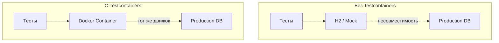
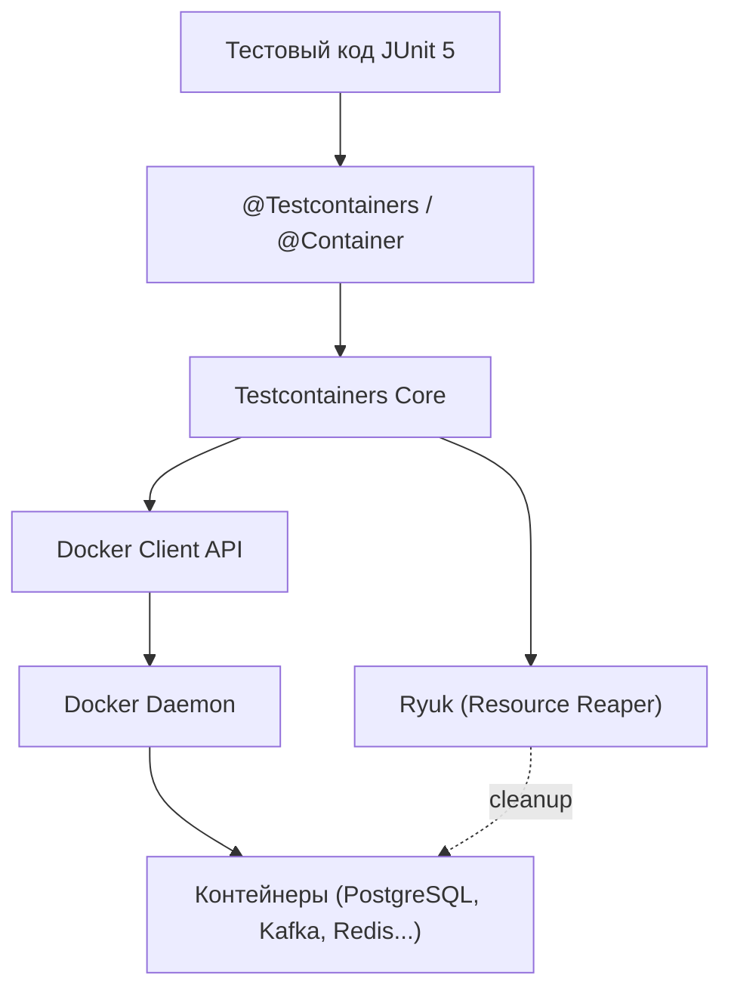
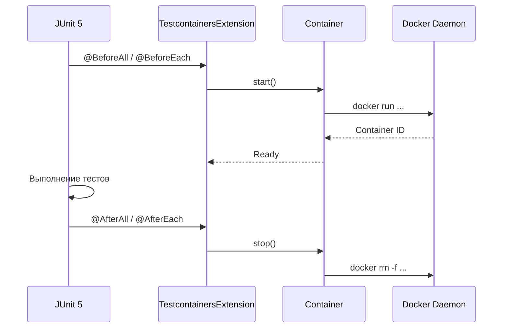
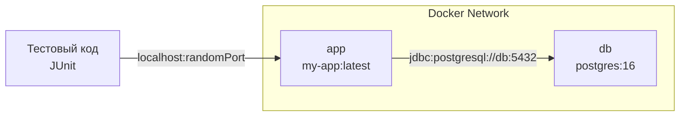

# Вопросы на собеседовании: `Testcontainers`

`Testcontainers` — Java-библиотека, которая позволяет поднимать Docker-контейнеры прямо из тестового кода. Это даёт возможность писать интеграционные тесты против реальных баз данных, брокеров сообщений, кэшей и любых других сервисов вместо in-memory заглушек. Этот файл покрывает архитектуру библиотеки, контейнеры для различных технологий, интеграцию со `Spring Boot 3.x`, паттерны управления жизненным циклом и оптимизацию для `CI/CD`.

**`Testcontainers`** стал де-факто стандартом интеграционного тестирования в Java-экосистеме. Библиотека решает ключевую проблему: тесты на in-memory заменителях (вроде `H2`) часто не ловят реальные баги, а настройка полноценной инфраструктуры для тестов — сложна и ненадёжна.

## Полезные ссылки

### Официальная документация

- [Testcontainers for Java](https://java.testcontainers.org/) — официальная документация
- [Testcontainers Guides](https://testcontainers.com/guides/) — практические гайды
- [Spring Boot: Testcontainers](https://docs.spring.io/spring-boot/reference/testing/testcontainers.html) — встроенная поддержка в Spring Boot
- [Baeldung: Docker Test Containers](https://www.baeldung.com/docker-test-containers) — базовый гайд по Testcontainers
- [Baeldung: Spring Boot + Testcontainers](https://www.baeldung.com/spring-boot-testcontainers-integration-test) — интеграция со Spring Boot
- [Baeldung: Built-in Testcontainers Support](https://www.baeldung.com/spring-boot-built-in-testcontainers) — `@ServiceConnection` в Spring Boot 3.1+
- [Baeldung: Reuse Testcontainers](https://www.baeldung.com/java-reuse-testcontainers) — переиспользование контейнеров
- [Baeldung: Testcontainers JDBC Support](https://www.baeldung.com/testcontainers-jdbc-support) — JDBC-интеграция

## Содержание

- [Полезные ссылки](#полезные-ссылки)
- [See also](#see-also)

**Основы `Testcontainers`**
- [Q1. (!) Что такое `Testcontainers` и какую проблему решает библиотека?](#q1--что-такое-testcontainers-и-какую-проблему-решает-библиотека)
- [Q2. Какие предварительные требования нужны для работы `Testcontainers`?](#q2-какие-предварительные-требования-нужны-для-работы-testcontainers)
- [Q3. (!) Как устроена архитектура `Testcontainers`?](#q3--как-устроена-архитектура-testcontainers)
- [Q4. Что такое `GenericContainer` и когда его использовать?](#q4-что-такое-genericcontainer-и-когда-его-использовать)

**Контейнеры баз данных**
- [Q5. (!) Как использовать `PostgreSQLContainer` в тестах?](#q5--как-использовать-postgresqlcontainer-в-тестах)
- [Q6. Какие контейнеры баз данных поддерживает `Testcontainers`?](#q6-какие-контейнеры-баз-данных-поддерживает-testcontainers)
- [Q7. Как работает JDBC-поддержка `Testcontainers`?](#q7-как-работает-jdbc-поддержка-testcontainers)
- [Q8. (!) В чём преимущество `Testcontainers` перед `H2` и другими in-memory базами?](#q8--в-чём-преимущество-testcontainers-перед-h2-и-другими-in-memory-базами)

**Контейнеры для `Kafka`, `Redis`, `MongoDB`**
- [Q9. Как поднять `Kafka`-контейнер для тестов?](#q9-как-поднять-kafka-контейнер-для-тестов)
- [Q10. Как тестировать приложение с `Redis` через `Testcontainers`?](#q10-как-тестировать-приложение-с-redis-через-testcontainers)
- [Q11. Как использовать `MongoDB`-контейнер?](#q11-как-использовать-mongodb-контейнер)

**Жизненный цикл и аннотации**
- [Q12. (!) Как работают аннотации `@Testcontainers` и `@Container`?](#q12--как-работают-аннотации-testcontainers-и-container)
- [Q13. В чём разница между `static` и instance-полями с `@Container`?](#q13-в-чём-разница-между-static-и-instance-полями-с-container)
- [Q14. Как управлять жизненным циклом контейнера вручную?](#q14-как-управлять-жизненным-циклом-контейнера-вручную)

**Интеграция со `Spring Boot`**
- [Q15. (!) Как подключить `Testcontainers` через `@DynamicPropertySource`?](#q15--как-подключить-testcontainers-через-dynamicpropertysource)
- [Q16. (!) Что такое `@ServiceConnection` в Spring Boot 3.1+ и чем лучше `@DynamicPropertySource`?](#q16--что-такое-serviceconnection-в-spring-boot-31-и-чем-лучше-dynamicpropertysource)
- [Q17. Как использовать `@TestConfiguration` с `Testcontainers` в Spring Boot 3.1+?](#q17-как-использовать-testconfiguration-с-testcontainers-в-spring-boot-31)
- [Q18. Как запустить Spring Boot приложение с `Testcontainers` для локальной разработки?](#q18-как-запустить-spring-boot-приложение-с-testcontainers-для-локальной-разработки)

**Паттерны и оптимизация**
- [Q19. (!) Что такое Singleton Containers паттерн и зачем он нужен?](#q19--что-такое-singleton-containers-паттерн-и-зачем-он-нужен)
- [Q20. Как переиспользовать контейнеры между запусками тестов (`reusable containers`)?](#q20-как-переиспользовать-контейнеры-между-запусками-тестов-reusable-containers)
- [Q21. Как запускать тесты с `Testcontainers` параллельно?](#q21-как-запускать-тесты-с-testcontainers-параллельно)

**`WaitStrategy` и конфигурация**
- [Q22. (!) Что такое `WaitStrategy` и какие стратегии ожидания доступны?](#q22--что-такое-waitstrategy-и-какие-стратегии-ожидания-доступны)
- [Q23. Как настроить сеть между контейнерами?](#q23-как-настроить-сеть-между-контейнерами)
- [Q24. Как использовать модуль `docker-compose`?](#q24-как-использовать-модуль-docker-compose)

**`CI/CD` и production-практики**
- [Q25. (!) Как интегрировать `Testcontainers` в `CI/CD` pipeline?](#q25--как-интегрировать-testcontainers-в-cicd-pipeline)
- [Q26. Какие есть способы ускорить тесты с `Testcontainers`?](#q26-какие-есть-способы-ускорить-тесты-с-testcontainers)
- [Q27. Какие ограничения и подводные камни есть у `Testcontainers`?](#q27-какие-ограничения-и-подводные-камни-есть-у-testcontainers)

**Дополнительные контейнеры и сценарии**
- [Q28. Как использовать `ElasticsearchContainer` в тестах?](#q28-как-использовать-elasticsearchcontainer-в-тестах)
- [Q29. Как тестировать отказоустойчивость с `Toxiproxy`?](#q29-как-тестировать-отказоустойчивость-с-toxiproxy)
- [Q30. (!) Как использовать `LocalStack` для тестирования AWS-сервисов?](#q30--как-использовать-localstack-для-тестирования-aws-сервисов)
- [Q31. Как тестировать с несколькими версиями одного сервиса?](#q31-как-тестировать-с-несколькими-версиями-одного-сервиса)
- [Q32. Как организовать базовый класс для интеграционных тестов с `Testcontainers`?](#q32-как-организовать-базовый-класс-для-интеграционных-тестов-с-testcontainers)

**Продвинутые темы**
- [Q33. Что такое Ryuk и как он управляет cleanup контейнеров?](#q33-что-такое-ryuk-и-как-он-управляет-cleanup-контейнеров)
- [Q34. Как использовать `WireMock` как Testcontainer для моков внешних HTTP API?](#q34-как-использовать-wiremock-как-testcontainer-для-моков-внешних-http-api)
- [Q35. Что такое `Testcontainers Cloud` и когда его использовать?](#q35-что-такое-testcontainers-cloud-и-когда-его-использовать)
- [Q36. Как использовать `DockerComposeContainer` — плюсы и минусы?](#q36-как-использовать-dockercomposecontainer--плюсы-и-минусы)
- [Q37. Как запускать `Testcontainers`-тесты параллельно без конфликтов?](#q37-как-запускать-testcontainers-тесты-параллельно-без-конфликтов)
- [Q38. Как Testcontainers используется в Kotlin-проектах — DSL и особенности?](#q38-как-testcontainers-используется-в-kotlin-проектах--dsl-и-особенности)
- [Q39. Что такое `@ServiceConnection` в Spring Boot 3.1+ и как он работает?](#q39-что-такое-serviceconnection-в-spring-boot-31-и-как-он-работает)
- [Q40. Как `LocalStack` используется для тестирования AWS-сервисов локально?](#q40-как-localstack-используется-для-тестирования-aws-сервисов-локально)

---

## Q1. (!) Что такое `Testcontainers` и какую проблему решает библиотека?

**`Testcontainers`** — это Java-библиотека, предоставляющая легковесные, одноразовые Docker-контейнеры для использования в интеграционных тестах. Она позволяет поднимать реальные экземпляры баз данных, брокеров сообщений, кэшей и любых других сервисов прямо из тестового кода.

**Ключевые проблемы, которые решает:**

| Проблема | Как решает Testcontainers |
|----------|---------------------------|
| In-memory базы (H2) не поддерживают все SQL-диалекты | Тест работает с реальной `PostgreSQL`/`MySQL`/`Oracle` |
| Ручная настройка инфраструктуры для тестов | Контейнер стартует автоматически, конфигурация — в коде |
| «У меня локально работает» | Одинаковое окружение для всех разработчиков и CI |
| Конфликты между параллельными запусками | Каждый тест получает изолированный контейнер |
| Зависимость от shared test-сред | Контейнер одноразовый, состояние не протекает между запусками |



**На собеседовании** важно подчеркнуть: `Testcontainers` не заменяет unit-тесты, а дополняет их на уровне интеграционных тестов, где нужна проверка работы с реальной инфраструктурой.


> [!mcq]
> - [ ] `Testcontainers` заменяет unit-тесты — мокирует БД через in-memory заглушки внутри JVM | Библиотека вообще не использует JVM-моки, она поднимает Docker-контейнеры. ❌ ПОСЛЕДСТВИЕ: непонимание роли инструмента приводит к попытке тестировать SQL-логику через `H2` и пропускать баги диалекта в production.
> - [x] `Testcontainers` поднимает реальные Docker-контейнеры (PostgreSQL, Kafka и др.) для интеграционных тестов, обеспечивая совпадение с production-окружением | Контейнер стартует автоматически из тестового кода, общается с Docker daemon, удаляется после тестов через Ryuk. ✓ ПРИМЕНЯТЬ: Spring Boot 3.x + `@ServiceConnection` для тестов репозиториев против production-движка БД. 📋 ПРАВИЛО: «Тестируй на том же движке, что и в production». 🔗 См. Q8, Q15, Q16.
> - [ ] `Testcontainers` — это shared test environment, который команда поднимает один раз на день для всех CI-job | Это противоположность подходу: контейнер одноразовый, изолированный на тест-класс. ❌ ПОСЛЕДСТВИЕ: shared test-стенд деградирует — данные одного теста ломают другой, flaky-результаты, blame-game между командами.
> - [ ] `Testcontainers` запускает production-сервисы в Kubernetes-кластере и проверяет интеграции через service mesh | Библиотека работает только с Docker daemon, никакого K8s в её ядре нет. ❌ ПОСЛЕДСТВИЕ: попытка использовать на K8s-only runner без Docker socket падает с `Could not find a valid Docker environment` уже на старте.

## Q2. Какие предварительные требования нужны для работы `Testcontainers`?

Для работы `Testcontainers` необходимо:

1. **Docker** — установленный и запущенный Docker-демон (Docker Desktop, Docker Engine, `Colima`, `Rancher Desktop` или `Podman` с совместимостью)
2. **JDK 8+** — библиотека поддерживает Java 8 и выше
3. **Gradle/Maven зависимость** — подключение нужных модулей

```groovy
// build.gradle
dependencies {
    // Основная библиотека
    testImplementation 'org.testcontainers:testcontainers:1.20.4'
    // JUnit 5 интеграция
    testImplementation 'org.testcontainers:junit-jupiter:1.20.4'
    // Модуль для конкретной технологии
    testImplementation 'org.testcontainers:postgresql:1.20.4'
}
```

`Testcontainers` общается с Docker через Docker API (обычно Unix-сокет `/var/run/docker.sock`). При старте библиотека запускает служебный контейнер `ryuk` (Reaper), который гарантирует очистку всех созданных контейнеров даже при аварийном завершении тестов.

**Проверка среды**: если Docker недоступен, тесты упадут с понятным сообщением. Для CI/CD это значит, что runner должен иметь доступ к Docker (Docker-in-Docker или Docker socket mount).


> [!mcq]
> - [ ] Достаточно подключить gradle-зависимость `org.testcontainers:testcontainers` — Docker не нужен, библиотека эмулирует контейнеры в JVM | Ошибка: `Testcontainers` всегда обращается к Docker daemon через `/var/run/docker.sock` или `DOCKER_HOST`. ❌ ПОСЛЕДСТВИЕ: тесты падают на CI без Docker с `IllegalStateException: Could not find a valid Docker environment`, flaky CI на runner'ах без socket.
> - [ ] Нужен только Docker, JDK не важен — Testcontainers работает на любом JRE 6+ | Минимум — JDK 8: библиотека использует `try-with-resources`, lambdas и `Optional`. ❌ ПОСЛЕДСТВИЕ: на legacy-проекте с JDK 6/7 сборка падает с `UnsupportedClassVersionError`, незаметно для разработчика, который тестирует на современной машине.
> - [x] Нужны: запущенный Docker daemon (Desktop, Engine, Colima, Podman), JDK 8+, Gradle/Maven зависимости `testcontainers` + специализированные модули (`postgresql`, `kafka`) | Библиотека общается с Docker через `/var/run/docker.sock`, запускает Ryuk для cleanup при сбоях. ✓ ПРИМЕНЯТЬ: GitLab CI с `docker:dind` сервисом, либо GitHub Actions `ubuntu-latest` с встроенным Docker. 📋 ПРАВИЛО: «Docker daemon + JDK 8+ + модуль конкретной БД». 🔗 См. Q3, Q25, Q33.
> - [ ] Достаточно установить только Docker Desktop, специализированные модули (`org.testcontainers:postgresql`) необязательны, всё работает через `GenericContainer` | Без модуля `postgresql` не будет `getJdbcUrl()`, `withInitScript()`, корректного wait strategy. ❌ ПОСЛЕДСТВИЕ: тест зелёный локально (порт открыт), флакающий в CI — `Connection refused` пока БД ещё инициализирует pg_data.

## Q3. (!) Как устроена архитектура `Testcontainers`?

Архитектура `Testcontainers` состоит из нескольких слоёв:



**Основные компоненты:**

- **`GenericContainer`** — базовый класс для любого Docker-образа
- **Специализированные контейнеры** — `PostgreSQLContainer`, `KafkaContainer`, `MongoDBContainer` и др. — наследники `GenericContainer` с преконфигурированными настройками
- **`Ryuk` (Resource Reaper)** — sidecar-контейнер, который отслеживает все созданные ресурсы (контейнеры, сети, volumes) и удаляет их после завершения тестов, даже если JVM аварийно остановилась
- **Docker Client** — обёртка вокруг `docker-java`, общается с Docker API
- **JUnit 5 Extension** (`@Testcontainers`) — управляет жизненным циклом контейнеров в соответствии с жизненным циклом тестов

**Порт-маппинг**: контейнеры стартуют с рандомными портами на хосте (`getMappedPort()`), что исключает конфликты при параллельном запуске.


> [!mcq]
> - [x] `GenericContainer` + специализированные классы (`PostgreSQLContainer`, `KafkaContainer`) → `Docker Client API` (`docker-java`) → Docker daemon → контейнеры; Ryuk-sidecar отслеживает и удаляет ресурсы | JUnit 5 Extension `@Testcontainers` управляет жизненным циклом, маппинг портов на хост через `getMappedPort()` исключает конфликты параллельных тестов. ✓ ПРИМЕНЯТЬ: микросервисы Netflix/Spotify используют параллельный запуск с разными `getMappedPort()` для изоляции CI-job. 📋 ПРАВИЛО: «GenericContainer → docker-java → Docker → Ryuk cleanup». 🔗 См. Q12, Q33, Q23.
> - [ ] Архитектура Testcontainers — это монолитный JVM-агент, который перехватывает JDBC-вызовы и направляет их в эмулятор БД | Никакого byte-code instrumentation: библиотека общается с реальным Docker daemon через REST API. ❌ ПОСЛЕДСТВИЕ: разработчик ждёт «магии» через JVM-agent и не настраивает Docker daemon на CI runner — получает `Could not find a valid Docker environment` после деплоя pipeline.
> - [ ] Testcontainers устанавливает соединение с Docker через `kubectl` proxy, поэтому требует kubeconfig в `~/.kube/config` | Нет: библиотека напрямую работает с Docker daemon (Unix socket или TCP), Kubernetes ни при чём. ❌ ПОСЛЕДСТВИЕ: команда выделяет kubeconfig для CI, вместо того чтобы дать доступ к Docker socket — pipeline падает на каждом запуске.
> - [ ] Архитектура состоит только из Docker-контейнеров с тестируемыми сервисами; Ryuk и Extension — необязательные плагины, отключаемые по умолчанию | Ryuk запускается автоматически и критичен для cleanup при kill JVM, без него orphan-контейнеры висят на CI. ❌ ПОСЛЕДСТВИЕ: после серии прерванных билдов на runner накапливаются десятки контейнеров и сетей, диск кончается, новые pipelines стартуют с `no space left on device`.

## Q4. Что такое `GenericContainer` и когда его использовать?

`GenericContainer` — базовый класс, позволяющий запустить любой Docker-образ в тесте. Используется, когда нет специализированного модуля для нужного сервиса.

```java
@Testcontainers
class CustomServiceTest {

    @Container
    static GenericContainer<?> redis = new GenericContainer<>("redis:7-alpine")
            .withExposedPorts(6379)
            .waitingFor(Wait.forListeningPort());

    @Test
    void shouldConnectToRedis() {
        String host = redis.getHost();
        int port = redis.getMappedPort(6379);
        // Подключение к Redis по host:port
    }
}
```

**Ключевые методы `GenericContainer`:**

| Метод | Назначение |
|-------|-----------|
| `withExposedPorts(int...)` | Пробросить порты из контейнера |
| `withEnv(key, value)` | Задать переменную окружения |
| `withCommand(String...)` | Переопределить команду запуска |
| `withFileSystemBind(hostPath, containerPath)` | Смонтировать файл/каталог |
| `waitingFor(WaitStrategy)` | Задать стратегию ожидания готовности |
| `withNetwork(Network)` | Подключить к Docker-сети |
| `getHost()` | Получить хост (обычно `localhost`) |
| `getMappedPort(int)` | Получить маппированный порт на хосте |

`GenericContainer` — правильный выбор, когда нужен нестандартный сервис (например, собственный микросервис, `Minio`, `LocalStack` и т.д.).


> [!mcq]
> - [ ] `GenericContainer` нужен только для базовых проверок health/ping, для сложных сервисов всегда используется `DockerComposeContainer` | Это путаница: `GenericContainer` — основной примитив для любого образа, а `DockerComposeContainer` — отдельный модуль для multi-service yml. ❌ ПОСЛЕДСТВИЕ: команда тащит docker-compose файл в проект ради одного Redis, увеличивая сложность тестового стенда без причины.
> - [ ] `GenericContainer` стартует образ, но не умеет ни пробрасывать порты, ни ждать готовности — wait strategy задаётся только в специализированных классах | Все методы `withExposedPorts`, `waitingFor`, `withEnv`, `withNetwork` есть на `GenericContainer`. ❌ ПОСЛЕДСТВИЕ: разработчик дублирует Wait-логику в `@BeforeAll` через `Thread.sleep(5000)`, тесты flaky на медленных CI runner'ах.
> - [x] `GenericContainer` — базовый класс для запуска любого Docker-образа, используется когда нет специализированного модуля (Minio, LocalStack, кастомный микросервис) | Поддерживает `withExposedPorts`, `withEnv`, `waitingFor`, `getMappedPort` — те же методы есть в наследниках типа `PostgreSQLContainer`. ✓ ПРИМЕНЯТЬ: тесты для `redis:7-alpine` (нет `RedisContainer` в core), для собственных микросервисов в integration-сьюте Wolt/Booking. 📋 ПРАВИЛО: «GenericContainer для всего, специализированный — когда есть модуль». 🔗 См. Q3, Q5, Q22.
> - [ ] `GenericContainer` запускает только официальные образы из `library/*` на Docker Hub — кастомные образы из private registry не поддерживаются | Поддерживается любой образ через `DockerImageName.parse(...)`, включая private registry с настройкой credentials. ❌ ПОСЛЕДСТВИЕ: команда переходит на ручные docker-compose тесты «потому что Testcontainers не умеет наш registry», теряя весь жизненный цикл и Ryuk cleanup.

## Q5. (!) Как использовать `PostgreSQLContainer` в тестах?

`PostgreSQLContainer` — специализированный контейнер, который знает всё о `PostgreSQL`: порт по умолчанию, healthcheck, создание БД и пользователя.

```java
@Testcontainers
@SpringBootTest
class UserRepositoryTest {

    @Container
    static PostgreSQLContainer<?> postgres = new PostgreSQLContainer<>("postgres:16-alpine")
            .withDatabaseName("testdb")
            .withUsername("test")
            .withPassword("test")
            .withInitScript("init.sql"); // опционально

    @DynamicPropertySource
    static void configureProperties(DynamicPropertyRegistry registry) {
        registry.add("spring.datasource.url", postgres::getJdbcUrl);
        registry.add("spring.datasource.username", postgres::getUsername);
        registry.add("spring.datasource.password", postgres::getPassword);
    }

    @Autowired
    private UserRepository userRepository;

    @Test
    void shouldSaveAndFindUser() {
        User user = new User("John", "john@example.com");
        userRepository.save(user);

        Optional<User> found = userRepository.findByEmail("john@example.com");
        assertThat(found).isPresent();
    }
}
```

**Преимущества специализированного контейнера:**
- Автоматический healthcheck (ждёт пока БД примет подключения)
- Методы `getJdbcUrl()`, `getUsername()`, `getPassword()` — не нужно собирать URL вручную
- Поддержка `withInitScript()` — выполнить SQL при старте
- Правильные настройки `WaitStrategy` из коробки


> [!mcq]
> - [ ] `new PostgreSQLContainer<>("postgres:latest").start()` — стандартный подход, БД готова сразу после `start()`, JDBC URL фиксированный `jdbc:postgresql://localhost:5432/test` | Тег `latest` — антипаттерн (тесты ломаются при release), порт всегда рандомный — фиксированного URL нет. ❌ ПОСЛЕДСТВИЕ: после релиза `postgres:17` (где удалён `MD5`-auth) ночные билды массово падают, зелёные локально (старый кэш) — несколько часов на root cause.
> - [ ] Достаточно `new PostgreSQLContainer<>().start()` без указания образа — Testcontainers по умолчанию использует `postgres:latest` | По умолчанию используется фиксированный известный тег модуля, но опираться на implicit-default опасно. ❌ ПОСЛЕДСТВИЕ: при апгрейде модуля Testcontainers default-image меняется, тесты, которые работали год, начинают падать без видимых изменений в коде.
> - [ ] Для `PostgreSQLContainer` обязателен `Wait.forListeningPort()` — без него БД не успевает прогреться | `PostgreSQLContainer` уже использует встроенный wait strategy (проверка через `select 1`), переопределение на `forListeningPort` — регрессия. ❌ ПОСЛЕДСТВИЕ: тесты flaky — порт открыт, но БД ещё инициализирует кластер, `Connection refused` на первом insert.
> - [x] `new PostgreSQLContainer<>("postgres:16-alpine").withDatabaseName("testdb").withUsername(..).withPassword(..)` + `getJdbcUrl()` для подключения, опционально `withInitScript("init.sql")` | Контейнер сам поднимает healthcheck и ждёт готовности БД, методы возвращают актуальный JDBC URL с маппированным портом. ✓ ПРИМЕНЯТЬ: Spring `@DataJpaTest` + `@DynamicPropertySource` для тестов JPA-репозиториев, pinning тега обязателен в production-проектах Wolt/Yandex Lavka. 📋 ПРАВИЛО: «Pin tag + getJdbcUrl + initScript». 🔗 См. Q7, Q8, Q15.

## Q6. Какие контейнеры баз данных поддерживает `Testcontainers`?

`Testcontainers` предоставляет специализированные модули для большинства популярных баз данных:

| Модуль | Класс контейнера | Артефакт Gradle |
|--------|------------------|-----------------|
| `PostgreSQL` | `PostgreSQLContainer` | `org.testcontainers:postgresql` |
| `MySQL` | `MySQLContainer` | `org.testcontainers:mysql` |
| `MariaDB` | `MariaDBContainer` | `org.testcontainers:mariadb` |
| `Oracle XE` | `OracleContainer` | `org.testcontainers:oracle-xe` |
| `MS SQL Server` | `MSSQLServerContainer` | `org.testcontainers:mssqlserver` |
| `MongoDB` | `MongoDBContainer` | `org.testcontainers:mongodb` |
| `Cassandra` | `CassandraContainer` | `org.testcontainers:cassandra` |
| `ClickHouse` | `ClickHouseContainer` | `org.testcontainers:clickhouse` |
| `CockroachDB` | `CockroachContainer` | `org.testcontainers:cockroachdb` |
| `Neo4j` | `Neo4jContainer` | `org.testcontainers:neo4j` |

Все эти контейнеры наследуют `JdbcDatabaseContainer` (для реляционных) или `GenericContainer` и предоставляют типобезопасные методы конфигурации.


> [!mcq]
> - [ ] Testcontainers поддерживает только `PostgreSQL` и `MySQL`, для остальных СУБД нужно писать свой `GenericContainer` с нуля | Готовые модули есть для PostgreSQL, MySQL, MariaDB, Oracle XE, MSSQL, MongoDB, Cassandra, ClickHouse, CockroachDB, Neo4j. ❌ ПОСЛЕДСТВИЕ: команда тратит дни на самописный `OracleContainer` с wait-логикой, хотя `org.testcontainers:oracle-xe` решает задачу за `compileOnly` строку.
> - [x] Готовые модули покрывают PostgreSQL, MySQL, MariaDB, Oracle XE, MSSQL, MongoDB, Cassandra, ClickHouse, CockroachDB, Neo4j — все наследуют `JdbcDatabaseContainer` или `GenericContainer` с типобезопасным API | Каждый модуль подключается отдельной зависимостью `org.testcontainers:<engine>` и предоставляет специфичные методы (`getReplicaSetUrl` для Mongo, `getJdbcUrl` для реляционных). ✓ ПРИМЕНЯТЬ: Discord — `CassandraContainer` для тестов миграций ScyllaDB, ClickHouse-команды Yandex — `ClickHouseContainer` для аналитики. 📋 ПРАВИЛО: «Один модуль — одна СУБД, type-safe API». 🔗 См. Q5, Q11, Q28.
> - [ ] Все контейнеры БД наследуют от единого `DatabaseContainer` без специфики — методы вроде `getReplicaSetUrl()` придётся писать самостоятельно | Иерархия разделена: реляционные → `JdbcDatabaseContainer`, NoSQL → отдельные классы со своим API (`MongoDBContainer.getReplicaSetUrl()`). ❌ ПОСЛЕДСТВИЕ: разработчик делает `getJdbcUrl()` на MongoDB и удивляется `NoSuchMethodError`, теряя час на поиск правильного API.
> - [ ] Поддерживаются только embedded-БД через JDBC-драйвер `jdbc:tc:` — Mongo, Cassandra, Neo4j не поддерживаются | JDBC-driver — это _одна из_ опций для реляционных, но для NoSQL есть отдельные классы (`MongoDBContainer`, `CassandraContainer`, `Neo4jContainer`). ❌ ПОСЛЕДСТВИЕ: команда отказывается от Testcontainers для Mongo-проекта и переходит на shared dev-mongo, получая flaky-тесты из-за shared state.

## Q7. Как работает JDBC-поддержка `Testcontainers`?

`Testcontainers` предоставляет специальный JDBC-драйвер, который позволяет стартовать контейнер автоматически просто через строку подключения, без какого-либо Java-кода.

```yaml
# application-test.yml
spring:
  datasource:
    url: jdbc:tc:postgresql:16-alpine:///testdb
    driver-class-name: org.testcontainers.jdbc.ContainerDatabaseDriver
```

**Формат URL**: `jdbc:tc:<engine>:<tag>:///<database>`

- `jdbc:tc:postgresql:16-alpine:///mydb` — PostgreSQL 16
- `jdbc:tc:mysql:8.0:///mydb` — MySQL 8
- `jdbc:tc:mariadb:10.6:///mydb` — MariaDB 10.6

**Дополнительные параметры в URL:**
- `?TC_INITSCRIPT=init.sql` — выполнить скрипт при старте
- `?TC_INITFUNCTION=com.example.Init::setup` — вызвать Java-метод
- `?TC_DAEMON=true` — не останавливать контейнер после закрытия соединения

Это удобно для быстрого старта, но для production-кода лучше использовать явное создание контейнера, чтобы контролировать жизненный цикл и конфигурацию.


> [!mcq]
> - [ ] JDBC-драйвер Testcontainers (`jdbc:tc:postgresql:...`) автоматически создаёт контейнер только при первом обращении и держит его до остановки JVM, в обход Docker daemon | Драйвер всё равно использует Docker daemon (внутри он же делает `docker run`), просто триггер старта — открытие соединения. ❌ ПОСЛЕДСТВИЕ: команда верит в «embedded mode» и не настраивает Docker на CI runner — пайплайн падает с `Could not find Docker environment` на `getConnection()`.
> - [ ] Подключение через `jdbc:tc:postgresql:...` работает только с PostgreSQL, для MySQL/MariaDB нужен отдельный JDBC-вендор | Формат `jdbc:tc:<engine>:<tag>:///` поддерживает PostgreSQL, MySQL, MariaDB, Oracle, MSSQL — все engines с JdbcDatabaseContainer. ❌ ПОСЛЕДСТВИЕ: разработчик пишет ручной `MySQLContainer` boilerplate, дублирующий уже существующую функциональность драйвера.
> - [ ] `jdbc:tc:postgresql:latest:///` — рекомендованный URL: `latest` гарантирует свежий PostgreSQL и кэшируется драйвером | Тег `latest` — антипаттерн: тесты ломаются при release новой major-версии. ❌ ПОСЛЕДСТВИЕ: после выхода `postgres:17` команда находит, что переименован системный каталог и десятки тестов падают на ровном месте.
> - [x] JDBC-драйвер `jdbc:tc:postgresql:16-alpine:///testdb` поднимает контейнер при первом `getConnection()` без Java-кода управления, поддерживая `?TC_INITSCRIPT=init.sql` и `?TC_DAEMON=true` | Удобно для quick-start, но для production-тестов лучше явно создавать `PostgreSQLContainer` для контроля жизненного цикла. ✓ ПРИМЕНЯТЬ: Spring Boot demo-проекты, `application-test.yml` с одной строкой — как в гайдах Spring Initializr. 📋 ПРАВИЛО: «jdbc:tc для прототипов, PostgreSQLContainer для прода». 🔗 См. Q5, Q15, Q18.

## Q8. (!) В чём преимущество `Testcontainers` перед `H2` и другими in-memory базами?

Это один из самых частых вопросов на собеседовании. Ключевые отличия:

| Критерий | `H2` / In-Memory | `Testcontainers` |
|----------|-------------------|-------------------|
| SQL-диалект | Эмуляция (часто неполная) | Реальный движок базы |
| Хранимые процедуры | Не поддерживаются | Полная поддержка |
| Специфичные типы (`JSONB`, `ARRAY`) | Частично или нет | Полная поддержка |
| Расширения (`pg_trgm`, `PostGIS`) | Нет | Да |
| Индексы, планы запросов | Другой оптимизатор | Тот же, что в production |
| Скорость старта | Мгновенно | 2-10 секунд |
| Docker-зависимость | Нет | Да |
| Confidence уровень | Средний | Высокий |

**Реальный пример проблемы с `H2`:**

```sql
-- Работает в PostgreSQL, но НЕ работает в H2
SELECT * FROM users
WHERE metadata @> '{"role": "admin"}'::jsonb;

-- H2 не поддерживает оператор @> для JSONB
```

**Рекомендация**: используйте `H2` только для простых CRUD-тестов, где SQL-диалект не важен. Для всего остального — `Testcontainers`. Подробнее о подходах к тестированию в [Integration Testing](integration-testing-interview.md).


> [!mcq]
> - [x] Testcontainers даёт реальный движок БД с тем же диалектом, типами (`JSONB`, `ARRAY`), расширениями (`pg_trgm`, `PostGIS`), оптимизатором — H2 эмулирует синтаксис, но ломается на специфике | Цена — 2-10 секунд старта против мгновенного H2, но confidence уровень несравнимо выше. ✓ ПРИМЕНЯТЬ: проекты с `JSONB`-полями (Detmir каталог, Wolt orders), Postgres-расширения для геопоиска (`PostGIS` на Yandex Lavka). 📋 ПРАВИЛО: «Тесты должны страдать там же, где production». 🔗 См. Q5, Q7, Q27.
> - [ ] H2 в режиме PostgreSQL-compatibility (`MODE=PostgreSQL`) — полноценная замена Testcontainers, поддерживает JSONB, plpgsql, расширения | H2 эмулирует только синтаксис, не реальные типы и операторы (`@>`, `?|`, `pg_trgm`). ❌ ПОСЛЕДСТВИЕ: тест зелёный на H2, продакшен PostgreSQL падает на `operator @> not implemented` — bug, который ловится только в проде на реальных данных.
> - [ ] Главное преимущество — Testcontainers быстрее H2 на больших датасетах из-за оптимизаций Docker | Скорость: H2 быстрее на старте и на простых CRUD, Testcontainers медленнее, но даёт fidelity. ❌ ПОСЛЕДСТВИЕ: команда выбирает Testcontainers ради «скорости», обнаруживает что unit-тесты замедлились в 10×, и откатывается на H2, теряя реальные плюсы.
> - [ ] Testcontainers и H2 эквивалентны по фиделити — отличие только в способе запуска (Docker vs in-JVM) | Совершенно разные движки: H2 — самодельный SQL-парсер, PostgreSQL — production-grade RDBMS со всеми extensions. ❌ ПОСЛЕДСТВИЕ: разработчик считает их взаимозаменяемыми, мигрирует на H2 ради скорости и теряет покрытие реальных багов диалекта в production.

## Q9. Как поднять `Kafka`-контейнер для тестов?

`Testcontainers` предоставляет модуль для `Apache Kafka` на базе образа `confluentinc/cp-kafka`:

```java
@Testcontainers
@SpringBootTest
class OrderEventProducerTest {

    @Container
    static KafkaContainer kafka = new KafkaContainer(
            DockerImageName.parse("confluentinc/cp-kafka:7.6.0")
    );

    @DynamicPropertySource
    static void kafkaProperties(DynamicPropertyRegistry registry) {
        registry.add("spring.kafka.bootstrap-servers", kafka::getBootstrapServers);
    }

    @Autowired
    private KafkaTemplate<String, String> kafkaTemplate;

    @Autowired
    private KafkaListenerEndpointRegistry registry;

    @Test
    void shouldSendAndReceiveEvent() throws Exception {
        kafkaTemplate.send("orders", "order-123", "{\"status\":\"CREATED\"}");
        // проверка через consumer или awaitility
    }
}
```

**Особенности `KafkaContainer`:**
- Включает встроенный `ZooKeeper` (или `KRaft` в новых версиях)
- `getBootstrapServers()` — возвращает адрес для подключения
- `withKraft()` — использовать `KRaft` вместо `ZooKeeper` (Kafka 3.3+)
- Можно настроить количество брокеров через `KafkaContainer` + `Network`


> [!mcq]
> - [x] `KafkaContainer(DockerImageName.parse("confluentinc/cp-kafka:7.6.0"))` + `getBootstrapServers()` для регистрации в `spring.kafka.bootstrap-servers`, опционально `withKraft()` для версий 3.3+ без ZooKeeper | Контейнер уже включает встроенный ZooKeeper (или KRaft), правильный wait strategy и advertised-listeners. ✓ ПРИМЕНЯТЬ: тесты event-driven архитектуры в Booking.com (Saga-паттерны), Wolt order pipeline через Kafka topics. 📋 ПРАВИЛО: «KafkaContainer + bootstrap-servers + KRaft для 3.3+». 🔗 См. Q15, Q23, Q37.
> - [ ] Достаточно `new GenericContainer<>("kafka:latest").withExposedPorts(9092)` — Kafka работает out of the box | Kafka требует конфигурации `KAFKA_ADVERTISED_LISTENERS`, ZooKeeper или KRaft, без этого producer не подключится. ❌ ПОСЛЕДСТВИЕ: producer ловит `ConcurrentTopicMetadataException`, тесты flaky — Kafka объявляет себя по неправильному hostname (внутреннему Docker), которого нет с хоста.
> - [ ] `KafkaContainer` поднимает только embedded broker без ZooKeeper, для интеграционных тестов нужен отдельный `ZookeeperContainer` | `KafkaContainer` запускает встроенный ZooKeeper в том же контейнере (либо KRaft в новых версиях), отдельный `ZookeeperContainer` не нужен. ❌ ПОСЛЕДСТВИЕ: разработчик пишет boilerplate с двумя контейнерами и общей `Network`, поднимает 2 контейнера вместо 1 — старт тестов замедляется на 30-50%.
> - [ ] Необходимо явно указывать `KAFKA_ADVERTISED_LISTENERS=PLAINTEXT://localhost:9092` через `withEnv()` иначе producer не подключится | `KafkaContainer` сам выставляет правильные advertised listeners на основе маппированного порта, ручная установка ломает логику. ❌ ПОСЛЕДСТВИЕ: ручной listener конфликтует с авто-маппингом порта, producer уходит в `metadata-fetch` retry-loop, тест зависает до timeout 60s.

## Q10. Как тестировать приложение с `Redis` через `Testcontainers`?

Для `Redis` можно использовать `GenericContainer` (специализированного контейнера нет в основной поставке):

```java
@Testcontainers
@SpringBootTest
class CacheServiceTest {

    @Container
    static GenericContainer<?> redis = new GenericContainer<>("redis:7-alpine")
            .withExposedPorts(6379);

    @DynamicPropertySource
    static void redisProperties(DynamicPropertyRegistry registry) {
        registry.add("spring.data.redis.host", redis::getHost);
        registry.add("spring.data.redis.port", () -> redis.getMappedPort(6379));
    }

    @Autowired
    private CacheService cacheService;

    @Test
    void shouldCacheAndRetrieveValue() {
        cacheService.put("key1", "value1");
        assertThat(cacheService.get("key1")).isEqualTo("value1");
    }
}
```

В **Spring Boot 3.1+** с `@ServiceConnection` код ещё проще — см. [Q16](#q16--что-такое-serviceconnection-в-spring-boot-31-и-чем-лучше-dynamicpropertysource).


> [!mcq]
> - [ ] Для Redis нужен только `embedded-redis` Maven-артефакт, Testcontainers не подходит | `embedded-redis` (kstyrc) — это in-process JVM-эмулятор без Lua scripting и кластеризации, ломается на новых командах. ❌ ПОСЛЕДСТВИЕ: тесты не ловят несовместимости — `XADD` или Lua-скрипты, добавленные в Redis 7, валятся в production, в тестах остаётся старый эмулятор.
> - [ ] `new RedisContainer("redis:7-alpine")` — нужно только этот класс, он есть в core-модуле `org.testcontainers:testcontainers` | В core нет `RedisContainer` — только `GenericContainer`; есть отдельный модуль `com.redis.testcontainers:testcontainers-redis` или `RedisContainer` от community. ❌ ПОСЛЕДСТВИЕ: тест не компилируется (`cannot resolve RedisContainer`), команда тратит время на поиск нужного артефакта.
> - [x] `new GenericContainer<>("redis:7-alpine").withExposedPorts(6379)` + `@DynamicPropertySource` для `spring.data.redis.host/port`, либо `@ServiceConnection` в Spring Boot 3.1+ | В core нет специализированного `RedisContainer`, но `GenericContainer` достаточно — реальный Redis с правильным версионированием. ✓ ПРИМЕНЯТЬ: тесты Spring Cache в Detmir-каталоге, distributed lock в Wolt-services через Redisson на реальном Redis 7. 📋 ПРАВИЛО: «GenericContainer redis:7-alpine + ServiceConnection». 🔗 См. Q4, Q15, Q16.
> - [ ] Через `withCommand("redis-server --requirepass test")` обязательно — без auth Redis отказывается принимать соединения | По умолчанию Redis принимает соединения без пароля, requirepass — опциональная настройка. ❌ ПОСЛЕДСТВИЕ: разработчик настраивает auth «на всякий случай», забывает прокинуть пароль в Spring config — `WRONGPASS invalid username-password pair`.

## Q11. Как использовать `MongoDB`-контейнер?

`Testcontainers` предоставляет модуль `mongodb` со специализированным контейнером:

```java
@Testcontainers
@SpringBootTest
class ProductRepositoryTest {

    @Container
    static MongoDBContainer mongo = new MongoDBContainer("mongo:7.0");

    @DynamicPropertySource
    static void mongoProperties(DynamicPropertyRegistry registry) {
        registry.add("spring.data.mongodb.uri", mongo::getReplicaSetUrl);
    }

    @Autowired
    private ProductRepository productRepository;

    @Test
    void shouldSaveDocument() {
        Product product = new Product("Widget", 9.99);
        productRepository.save(product);

        List<Product> products = productRepository.findByName("Widget");
        assertThat(products).hasSize(1);
    }
}
```

**Ключевые особенности `MongoDBContainer`:**
- Запускает `MongoDB` в режиме replica set (нужно для транзакций)
- `getReplicaSetUrl()` — возвращает connection string с replica set
- `getConnectionString()` — базовый connection string
- Поддержка инициализации через JavaScript-скрипты


> [!mcq]
> - [ ] `MongoDBContainer` запускает standalone-mongod, для transactions нужно вручную инициализировать replica set через `runCommand` | `MongoDBContainer` уже стартует в режиме replica set автоматически (требование Mongo для transactions), ручная инициализация не нужна. ❌ ПОСЛЕДСТВИЕ: разработчик пишет custom init-скрипт, дублирующий логику контейнера, и попадает в race condition между двумя rs.initiate().
> - [ ] `MongoDBContainer` поддерживает только версии 4.x и ниже, для Mongo 7+ нужен `GenericContainer` | Поддерживаются все актуальные версии включая 7.x (через `DockerImageName.parse("mongo:7.0")`). ❌ ПОСЛЕДСТВИЕ: команда без причины переходит на `GenericContainer`, теряет встроенную replica-set инициализацию и ломает transactional-тесты.
> - [ ] `getConnectionString()` вернёт уже готовую URI с replica set, отдельный `getReplicaSetUrl()` существует только для совместимости | Это разные методы: `getConnectionString()` — базовый URI без RS-suffix, `getReplicaSetUrl()` — с `?replicaSet=rs0`. ❌ ПОСЛЕДСТВИЕ: тесты Mongo transactions падают с `Transaction numbers are only allowed on a replica set member`, разработчик не понимает почему.
> - [x] `new MongoDBContainer("mongo:7.0")` + `getReplicaSetUrl()` для регистрации `spring.data.mongodb.uri`; контейнер уже стартует в режиме replica set для поддержки transactions | `getConnectionString()` вернёт базовый URL, `getReplicaSetUrl()` — с replica set настройкой для multi-document transactions. ✓ ПРИМЕНЯТЬ: тесты event sourcing с MongoDB transactions в Booking.com, аналитические сервисы с aggregation pipeline. 📋 ПРАВИЛО: «MongoDBContainer + getReplicaSetUrl для transactions». 🔗 См. Q5, Q6, Q23.

## Q12. (!) Как работают аннотации `@Testcontainers` и `@Container`?

Аннотации `@Testcontainers` и `@Container` — это JUnit 5 Extension для автоматического управления жизненным циклом контейнеров.

```java
@Testcontainers  // (1) Активирует расширение
class DatabaseTest {

    @Container // (2) Помечает контейнер для управления
    static PostgreSQLContainer<?> postgres = new PostgreSQLContainer<>("postgres:16-alpine");

    @Test
    void testQuery() {
        assertTrue(postgres.isRunning());
    }
}
```

**Как это работает:**
1. `@Testcontainers` — регистрирует `TestcontainersExtension` для JUnit 5
2. Extension находит все поля, помеченные `@Container`
3. Перед тестами вызывает `container.start()`
4. После тестов вызывает `container.stop()`



**Важно**: без `@Testcontainers` аннотация `@Container` не работает — контейнер не будет ни запущен, ни остановлен автоматически.


> [!mcq]
> - [ ] `@Container` работает без `@Testcontainers` на классе — JUnit сам обнаружит поле и запустит контейнер | Без `@Testcontainers` (TestcontainersExtension) аннотация `@Container` игнорируется, контейнер не стартует и не останавливается. ❌ ПОСЛЕДСТВИЕ: тест падает с `IllegalStateException: container is not running`, разработчик дебажит часами, не замечая отсутствия `@Testcontainers` на классе.
> - [ ] `@Testcontainers` достаточно одного на класс, поля могут быть без `@Container` — Extension найдёт все `Startable` через рефлексию | Extension управляет только полями, помеченными `@Container` — без аннотации старт/стоп не происходят. ❌ ПОСЛЕДСТВИЕ: контейнер инициализирован в declaration, но `start()` не вызван — `getMappedPort()` возвращает -1, тест падает на `IllegalStateException: Mapped port can only be obtained after the container is started`.
> - [x] `@Testcontainers` регистрирует `TestcontainersExtension` для JUnit 5; Extension находит поля с `@Container`, вызывает `start()` до `@BeforeAll`/`@BeforeEach` и `stop()` после `@AfterAll`/`@AfterEach` | Обе аннотации обязательны: без `@Testcontainers` нет Extension, без `@Container` Extension не видит поле. ✓ ПРИМЕНЯТЬ: стандартный паттерн для интеграционных тестов в Spring Boot 3.x проектах с JUnit 5. 📋 ПРАВИЛО: «@Testcontainers на класс + @Container на поле — обязательно вместе». 🔗 См. Q3, Q13, Q14.
> - [ ] Аннотации работают через JVM-агента, нужно подключить `-javaagent:testcontainers-agent.jar` к JVM | Никакого byte-code instrumentation — это стандартный JUnit 5 Extension, регистрируется через SPI. ❌ ПОСЛЕДСТВИЕ: команда добавляет несуществующий agent в Gradle test JVM args, тесты падают на старте с `Could not find or load main class`.

## Q13. В чём разница между `static` и instance-полями с `@Container`?

Модификатор `static` на поле с `@Container` определяет **scope** жизненного цикла контейнера:

| Тип поля | Жизненный цикл | Когда использовать |
|----------|----------------|-------------------|
| `static` | Один контейнер на весь класс (`@BeforeAll` / `@AfterAll`) | Дорогие контейнеры (БД, Kafka) — чтобы не перезапускать |
| Instance | Новый контейнер для каждого теста (`@BeforeEach` / `@AfterEach`) | Нужна полная изоляция между тестами |

```java
@Testcontainers
class LifecycleExample {

    // Стартует ОДИН раз для всех тестов в классе
    @Container
    static PostgreSQLContainer<?> postgres = new PostgreSQLContainer<>("postgres:16-alpine");

    // Стартует ЗАНОВО для каждого теста
    @Container
    GenericContainer<?> redis = new GenericContainer<>("redis:7-alpine")
            .withExposedPorts(6379);
}
```

**Рекомендация**: для баз данных почти всегда используйте `static` — старт контейнера занимает секунды, а изоляцию данных между тестами лучше обеспечить через `@Transactional` rollback или очистку таблиц.


> [!mcq]
> - [ ] `static` поле всегда медленнее instance-поля — JVM статически инициализирует контейнер при загрузке класса даже если тест не запустится | Наоборот: `static` стартует контейнер один раз на класс, instance — для каждого теста (тратит секунды на каждый `@Test`). ❌ ПОСЛЕДСТВИЕ: разработчик ставит instance везде, тесты крупного модуля идут 30 минут вместо 3, CI становится bottleneck релизов.
> - [x] `static @Container` — один контейнер на класс (старт в `@BeforeAll`, стоп в `@AfterAll`); instance-поле — новый контейнер на каждый `@Test` (`@BeforeEach`/`@AfterEach`); для БД почти всегда нужен `static` + `@Transactional` rollback | Старт `PostgreSQLContainer` ~ 3-5 секунд, instance умножает на N тестов — экономия колоссальная. ✓ ПРИМЕНЯТЬ: `static` для PostgreSQL/Kafka, instance — только если нужна полная изоляция файловой системы между тестами. 📋 ПРАВИЛО: «static для дорогих контейнеров + изоляция через @Transactional». 🔗 См. Q12, Q19, Q21.
> - [ ] Instance-поле создаёт shared контейнер на весь тестовый набор Maven/Gradle, аналог Singleton-паттерна | Instance создаёт новый контейнер на каждый `@Test` — это противоположность singleton'у. ❌ ПОСЛЕДСТВИЕ: разработчик путает термины, ставит instance, ожидая разделения между тестами, и тратит часы на ожидание билдов.
> - [ ] Разница только в синтаксисе — JVM не различает `static` и instance в контексте JUnit 5 lifecycle | JUnit 5 различает: `static` поля доступны в `@BeforeAll` (которые статичны по умолчанию), instance — нет; lifecycle разный. ❌ ПОСЛЕДСТВИЕ: при `@TestInstance(PER_CLASS)` ставят `static`, ожидая instance-поведения, и получают `NullPointerException` в `@BeforeAll` — контейнер не успел стартовать.

## Q14. Как управлять жизненным циклом контейнера вручную?

Иногда аннотации не подходят — например, при использовании Singleton-паттерна или в не-JUnit фреймворках. В таких случаях контейнер управляется вручную:

```java
class ManualLifecycleTest {

    static PostgreSQLContainer<?> postgres = new PostgreSQLContainer<>("postgres:16-alpine");

    @BeforeAll
    static void startContainer() {
        postgres.start();
    }

    @AfterAll
    static void stopContainer() {
        postgres.stop();
    }

    @Test
    void testWithManualLifecycle() {
        assertThat(postgres.isRunning()).isTrue();
    }
}
```

**Когда нужен ручной контроль:**
- Singleton-паттерн (контейнер на весь тестовый набор)
- Условный запуск (пропустить, если Docker недоступен)
- Кастомная инициализация (выполнить SQL/скрипт между `start()` и тестами)
- Использование с TestNG или другими фреймворками

**Важно**: если вызвать `start()` вручную и при этом использовать `@Container`, контейнер может быть остановлен дважды. Не смешивайте подходы.


> [!mcq]
> - [ ] Если контейнер объявлен с `@Container`, разрешено дополнительно вызывать `container.start()` в `@BeforeAll` — это даёт двойную страховку | Двойной `start()` приводит к двойному `stop()`, что может убить контейнер посреди теста. ❌ ПОСЛЕДСТВИЕ: тест падает с непредсказуемым `ContainerLaunchException` из-за race condition, отлаживается часами как «flaky test».
> - [ ] `container.close()` рекомендуется вместо `container.stop()` — он надёжнее освобождает ресурсы | `Startable.close()` делегирует на `stop()`, эффект одинаковый; `stop()` — стандартный API. ❌ ПОСЛЕДСТВИЕ: разработчик считает `close` правильным, путается в API при чтении исходников `Testcontainers`, теряет время на дебаге несуществующей разницы.
> - [x] При ручном управлении: `static container = ...` (без `@Container`) + `@BeforeAll start()` + `@AfterAll stop()`; нужно для Singleton-паттерна, условного старта (skip без Docker) или TestNG | Не смешивать с `@Container` — Extension попытается остановить контейнер, который уже остановлен (или ещё используется в singleton). ✓ ПРИМЕНЯТЬ: `AbstractIntegrationTest` базовый класс для микросервисов, где много тест-классов разделяют один Postgres. 📋 ПРАВИЛО: «Ручной lifecycle — без @Container; смешивать запрещено». 🔗 См. Q12, Q19, Q33.
> - [ ] Ручной lifecycle лишает контейнер cleanup через Ryuk — нужно вручную писать shutdown hook | Ryuk регистрируется автоматически при создании контейнера (а не при `@Container`), даже при ручном `start()`/`stop()` cleanup работает. ❌ ПОСЛЕДСТВИЕ: команда пишет лишние shutdown-hooks, дублирующие Ryuk, и получает race condition при выходе JVM — контейнер пытается остановиться дважды.

## Q15. (!) Как подключить `Testcontainers` через `@DynamicPropertySource`?

`@DynamicPropertySource` — аннотация Spring Boot, которая позволяет зарегистрировать свойства приложения динамически, после старта контейнера.

```java
@Testcontainers
@SpringBootTest
class OrderServiceTest {

    @Container
    static PostgreSQLContainer<?> postgres = new PostgreSQLContainer<>("postgres:16-alpine");

    @Container
    static KafkaContainer kafka = new KafkaContainer(
            DockerImageName.parse("confluentinc/cp-kafka:7.6.0"));

    @DynamicPropertySource
    static void registerProperties(DynamicPropertyRegistry registry) {
        // PostgreSQL
        registry.add("spring.datasource.url", postgres::getJdbcUrl);
        registry.add("spring.datasource.username", postgres::getUsername);
        registry.add("spring.datasource.password", postgres::getPassword);
        // Kafka
        registry.add("spring.kafka.bootstrap-servers", kafka::getBootstrapServers);
    }
}
```

**Почему нужен `@DynamicPropertySource`?**
Контейнер стартует с рандомным портом, и JDBC URL становится известен только в runtime. Обычный `@TestPropertySource` с фиксированным значением не подойдёт.

**Механизм**: метод вызывается после старта контейнера, но до инициализации Spring `ApplicationContext`. Это позволяет Spring подхватить правильные значения через `DynamicPropertyRegistry`.


> [!mcq]
> - [ ] `@TestPropertySource(properties = "spring.datasource.url=" + postgres.getJdbcUrl())` — единственно правильный способ передать URL в Spring | `@TestPropertySource` принимает только compile-time константы, `getJdbcUrl()` — runtime значение, не скомпилируется. ❌ ПОСЛЕДСТВИЕ: код не компилируется (`element value must be a constant expression`), либо разработчик хардкодит порт и получает port conflict при параллельных тестах.
> - [ ] Достаточно установить `System.setProperty("spring.datasource.url", postgres.getJdbcUrl())` в `@BeforeAll` | System properties читаются Spring до выполнения `@BeforeAll`, supplier не сработает; кроме того, утекает в другие тесты. ❌ ПОСЛЕДСТВИЕ: первый тест работает, последующие читают System property от первого контейнера, который уже остановлен — `Connection refused`.
> - [ ] `@DynamicPropertySource` принимает значения сразу, не lazy — поэтому метод нужно объявлять после `container.start()` в `@BeforeAll` | Метод принимает `Supplier<Object>`, разрешается lazy при чтении property; явный старт в `@BeforeAll` не требуется (Extension стартует контейнер раньше). ❌ ПОСЛЕДСТВИЕ: разработчик добавляет ручной `start()` в `@BeforeAll`, конфликтует с Extension — двойной запуск, race в логах.
> - [x] `@DynamicPropertySource static void cfg(DynamicPropertyRegistry r) { r.add("spring.datasource.url", postgres::getJdbcUrl); }` — метод вызывается после старта контейнера, но до создания Spring `ApplicationContext`, передавая supplier (lazy) с актуальным URL | Контейнер получает рандомный порт, supplier разрешается в момент чтения property. ✓ ПРИМЕНЯТЬ: стандартный паттерн для Spring Boot 2.x, в 3.1+ часто заменяется на `@ServiceConnection`. 📋 ПРАВИЛО: «DynamicPropertyRegistry + supplier — lazy resolve URL». 🔗 См. Q5, Q16, Q19.

## Q16. (!) Что такое `@ServiceConnection` в Spring Boot 3.1+ и чем лучше `@DynamicPropertySource`?

`@ServiceConnection` — аннотация, появившаяся в Spring Boot 3.1, которая автоматически определяет тип контейнера и регистрирует все необходимые свойства подключения. Заменяет ручное заполнение через `@DynamicPropertySource`.

**До Spring Boot 3.1 (`@DynamicPropertySource`):**

```java
@Container
static PostgreSQLContainer<?> postgres = new PostgreSQLContainer<>("postgres:16-alpine");

@DynamicPropertySource
static void props(DynamicPropertyRegistry registry) {
    registry.add("spring.datasource.url", postgres::getJdbcUrl);
    registry.add("spring.datasource.username", postgres::getUsername);
    registry.add("spring.datasource.password", postgres::getPassword);
    registry.add("spring.datasource.driver-class-name", postgres::getDriverClassName);
}
```

**С Spring Boot 3.1+ (`@ServiceConnection`):**

```java
@Container
@ServiceConnection
static PostgreSQLContainer<?> postgres = new PostgreSQLContainer<>("postgres:16-alpine");

// Всё! Никакого @DynamicPropertySource
```

**Как это работает:**
1. `@ServiceConnection` создаёт `ConnectionDetails` bean
2. Spring Boot определяет тип контейнера (PostgreSQL, Kafka, Redis и т.д.)
3. Автоматически регистрирует все нужные properties

**Поддерживаемые контейнеры** (неполный список):

| Контейнер | Создаёт `ConnectionDetails` для |
|-----------|-------------------------------|
| `PostgreSQLContainer` | `JdbcConnectionDetails` |
| `MySQLContainer` | `JdbcConnectionDetails` |
| `MongoDBContainer` | `MongoConnectionDetails` |
| `KafkaContainer` | `KafkaConnectionDetails` |
| `RedisContainer` / `GenericContainer` (Redis) | `RedisConnectionDetails` |
| `RabbitMQContainer` | `RabbitConnectionDetails` |
| `ElasticsearchContainer` | `ElasticsearchConnectionDetails` |

**Преимущества перед `@DynamicPropertySource`:**
- Меньше boilerplate-кода
- Не нужно помнить имена properties
- Менее подвержено ошибкам (опечатки в ключах)
- Работает через `ConnectionDetails` — type-safe подход


> [!mcq]
> - [x] `@ServiceConnection` (Spring Boot 3.1+) над `@Container` создаёт `ConnectionDetails` bean — Spring сам распознаёт тип контейнера (Postgres → `JdbcConnectionDetails`, Kafka → `KafkaConnectionDetails`) и регистрирует все нужные properties без `@DynamicPropertySource` | Type-safe, без опечаток в ключах, меньше boilerplate. ✓ ПРИМЕНЯТЬ: новые проекты на Spring Boot 3.1+ — Detmir микросервисы переходят с `@DynamicPropertySource` на `@ServiceConnection`. 📋 ПРАВИЛО: «@ServiceConnection — type-safe аналог DynamicPropertySource». 🔗 См. Q15, Q17, Q39.
> - [ ] `@ServiceConnection` работает с любым `GenericContainer`, включая кастомные — Spring находит подходящий `ConnectionDetailsFactory` по сигнатуре constructor'a | Поддержка через SPI: есть готовые factories для PostgreSQL/MySQL/Kafka/Mongo/Redis/Elasticsearch/RabbitMQ; для кастомных контейнеров нужно писать свой `ConnectionDetailsFactory`. ❌ ПОСЛЕДСТВИЕ: разработчик ставит `@ServiceConnection` на кастомный сервис без factory — Spring молча игнорирует, properties не выставляются, тесты падают на `@Autowired`.
> - [ ] `@ServiceConnection` доступна с Spring Boot 2.7 и заменяет устаревший `@DynamicPropertySource` | Доступна только с Spring Boot 3.1; в 2.x её нет. ❌ ПОСЛЕДСТВИЕ: legacy-проект на 2.7 видит compile-error `cannot find symbol ServiceConnection`, разработчик откатывает миграцию или мажорно бампает Spring Boot ради одной аннотации.
> - [ ] Главное преимущество `@ServiceConnection` — она работает быстрее `@DynamicPropertySource` (не использует supplier'ы) | Скорость одинакова — обе работают на стадии bootstrapping контекста; преимущество в boilerplate и type-safety. ❌ ПОСЛЕДСТВИЕ: команда мигрирует ради «производительности», не получает измеримой разницы и сомневается в выборе.

## Q17. Как использовать `@TestConfiguration` с `Testcontainers` в Spring Boot 3.1+?

Spring Boot 3.1+ позволяет выделить конфигурацию контейнеров в отдельный `@TestConfiguration` класс и переиспользовать его:

```java
@TestConfiguration(proxyBeanMethods = false)
class TestcontainersConfig {

    @Bean
    @ServiceConnection
    PostgreSQLContainer<?> postgresContainer() {
        return new PostgreSQLContainer<>("postgres:16-alpine");
    }

    @Bean
    @ServiceConnection
    KafkaContainer kafkaContainer() {
        return new KafkaContainer(DockerImageName.parse("confluentinc/cp-kafka:7.6.0"));
    }
}
```

**Использование в тестах:**

```java
@SpringBootTest
@Import(TestcontainersConfig.class)
class OrderServiceTest {

    @Autowired
    private OrderService orderService;

    @Test
    void shouldCreateOrder() {
        // PostgreSQL и Kafka уже запущены и подключены
    }
}
```

**Использование для локальной разработки** (Spring Boot 3.1+):

```java
public class TestApplication {

    public static void main(String[] args) {
        SpringApplication.from(Application::main)
                .with(TestcontainersConfig.class)
                .run(args);
    }
}
```

Это позволяет запустить приложение с реальными контейнерами вместо установки баз данных локально.


> [!mcq]
> - [ ] `@TestConfiguration` обязан содержать `proxyBeanMethods = true` чтобы контейнеры запускались как singleton | `proxyBeanMethods = false` рекомендуется (быстрее старт), Spring всё равно создаёт bean один раз для каждой `@Bean` метода, как singleton по scope. ❌ ПОСЛЕДСТВИЕ: команда оставляет default `proxyBeanMethods = true`, тесты медленнее на 100-300ms за счёт CGLIB-прокси, на больших сьютах — минуты.
> - [x] `@TestConfiguration(proxyBeanMethods = false)` + `@Bean @ServiceConnection PostgreSQLContainer ...` — выносит конфигурацию контейнеров в переиспользуемый класс, импортируется через `@Import(TestcontainersConfig.class)` | Можно использовать в `bootTestRun` для локальной разработки через `SpringApplication.from(...).with(TestcontainersConfig.class).run(args)`. ✓ ПРИМЕНЯТЬ: общий `TestcontainersConfig` для всех integration-тестов микросервиса, переиспользуется в dev-режиме без локальной установки Postgres. 📋 ПРАВИЛО: «TestConfiguration + Import — DRY для контейнеров». 🔗 См. Q16, Q18, Q19.
> - [ ] `@TestConfiguration` несовместим с `@ServiceConnection` — нужно использовать `@SpringBootApplication` для test-config | Полностью совместимо: `@ServiceConnection` ставится над `@Bean`, всё работает. ❌ ПОСЛЕДСТВИЕ: команда добавляет лишний `@SpringBootApplication` на тестовый класс, ловит `Multiple primary configuration found` и тратит время на разрешение конфликта.
> - [ ] Контейнеры в `@TestConfiguration` нужно явно стартовать через `@PostConstruct` — Spring не делает это автоматически | Spring видит bean типа `Startable` и автоматически вызывает `start()` при создании, `stop()` при destroy. ❌ ПОСЛЕДСТВИЕ: ручной `@PostConstruct start()` дублирует Spring lifecycle, контейнер запускается дважды или не останавливается.

## Q18. Как запустить Spring Boot приложение с `Testcontainers` для локальной разработки?

Начиная со Spring Boot 3.1, `Testcontainers` можно использовать не только в тестах, но и для **локальной разработки** (`dev mode`):

```java
// src/test/java/com/example/TestApplication.java
public class TestApplication {

    public static void main(String[] args) {
        SpringApplication.from(Application::main)
                .with(ContainersConfig.class)
                .run(args);
    }
}

@TestConfiguration(proxyBeanMethods = false)
class ContainersConfig {

    @Bean
    @ServiceConnection
    @RestartScope  // контейнер переживёт DevTools restart
    PostgreSQLContainer<?> postgres() {
        return new PostgreSQLContainer<>("postgres:16-alpine");
    }
}
```

**Запуск**: `./gradlew bootTestRun` (Gradle) или `mvn spring-boot:test-run` (Maven).

**Преимущества:**
- Не нужно устанавливать `PostgreSQL`, `Redis`, `Kafka` локально
- Одинаковая конфигурация у всей команды
- `@RestartScope` — контейнер не перезапускается при `DevTools` restart
- Описание инфраструктуры — в коде, рядом с приложением


> [!mcq]
> - [ ] Локальная разработка с Testcontainers требует production Spring profile, иначе контейнеры не активируются | `bootTestRun` использует test-конфигурацию с `@TestConfiguration`, отдельный production-profile не нужен. ❌ ПОСЛЕДСТВИЕ: разработчик ставит `--spring.profiles.active=prod` локально, случайно подключается к real prod БД и роняет реальные данные.
> - [x] `SpringApplication.from(Application::main).with(ContainersConfig.class).run(args)` в test-classpath + `@TestConfiguration` с `@ServiceConnection` + `@RestartScope` чтобы контейнер пережил DevTools restart; запуск через `bootTestRun` (Gradle) или `mvn spring-boot:test-run` | Не нужно ставить Postgres/Redis/Kafka локально, конфигурация одинакова у всей команды, описана рядом с приложением. ✓ ПРИМЕНЯТЬ: dev-loop разработчиков Spring Boot 3.x — Wolt, Yandex Lavka команды используют для onboarding новых разработчиков. 📋 ПРАВИЛО: «bootTestRun + ServiceConnection + RestartScope». 🔗 См. Q17, Q26, Q39.
> - [ ] Достаточно установить переменную окружения `TESTCONTAINERS_DEV_MODE=true` — `bootRun` сам подхватит контейнеры из test-classpath | Такой переменной нет; для dev-mode нужен явный entry point `TestApplication` с `SpringApplication.from(...).with(...)`. ❌ ПОСЛЕДСТВИЕ: разработчик ставит несуществующую env, запускает `bootRun`, получает `Connection refused: localhost:5432` и не понимает почему.
> - [ ] `@RestartScope` обязательна для production-профиля, иначе контейнеры будут пересоздаваться при каждом запросе | `@RestartScope` нужна только при использовании Spring DevTools (восстановление между restart), к production вообще не относится. ❌ ПОСЛЕДСТВИЕ: команда копирует `@RestartScope` в production-config «по гайду», сталкивается с непредсказуемым поведением scope в проде.

## Q19. (!) Что такое Singleton Containers паттерн и зачем он нужен?

**Singleton Containers** — паттерн, при котором один контейнер разделяется между всеми тестовыми классами через наследование от общего базового класса.

```java
// Базовый класс — контейнер стартует один раз
public abstract class AbstractIntegrationTest {

    static final PostgreSQLContainer<?> POSTGRES;
    static final KafkaContainer KAFKA;

    static {
        POSTGRES = new PostgreSQLContainer<>("postgres:16-alpine");
        KAFKA = new KafkaContainer(DockerImageName.parse("confluentinc/cp-kafka:7.6.0"));

        // Старт всех контейнеров параллельно
        Stream.of(POSTGRES, KAFKA).parallel().forEach(GenericContainer::start);
    }

    @DynamicPropertySource
    static void registerProperties(DynamicPropertyRegistry registry) {
        registry.add("spring.datasource.url", POSTGRES::getJdbcUrl);
        registry.add("spring.datasource.username", POSTGRES::getUsername);
        registry.add("spring.datasource.password", POSTGRES::getPassword);
        registry.add("spring.kafka.bootstrap-servers", KAFKA::getBootstrapServers);
    }
}
```

```java
// Конкретный тест наследует базовый класс
@SpringBootTest
class OrderServiceTest extends AbstractIntegrationTest {

    @Test
    void shouldCreateOrder() {
        // POSTGRES и KAFKA уже запущены
    }
}
```

```mermaid
graph TD
    A["AbstractIntegrationTest<br/>(static initializer)"] -->|start()| B[PostgreSQL Container]
    A -->|start()| C[Kafka Container]
    D[OrderServiceTest] -->|extends| A
    E[UserServiceTest] -->|extends| A
    F[PaymentServiceTest] -->|extends| A
    D -.->|использует| B
    D -.->|использует| C
    E -.->|использует| B
    F -.->|использует| B
    F -.->|использует| C
```

**Критическая ошибка**: НЕ используйте `@Testcontainers` + `@Container` с singleton-паттерном. Extension попытается остановить контейнер после каждого тестового класса, что сломает остальные тесты.

**Когда использовать:**
- Много тестовых классов, все используют одну БД
- Старт контейнеров занимает значительное время
- Изоляция данных обеспечивается через `@Transactional` или `TRUNCATE`


> [!mcq]
> - [x] `AbstractIntegrationTest` базовый класс со `static final` контейнерами и `static {}` инициализатором (`Startables.deepStart(...).join()`); `@DynamicPropertySource` в базовом классе; БЕЗ `@Testcontainers`/`@Container` — иначе Extension убьёт контейнер | Контейнеры стартуют один раз на JVM, переиспользуются всеми наследниками, Ryuk удалит при выходе. ✓ ПРИМЕНЯТЬ: микросервисы с десятками `*IT`-тестов — `AbstractIntegrationTest` экономит 10× времени старта. 📋 ПРАВИЛО: «static initializer + БЕЗ @Container — singleton живёт всю JVM». 🔗 См. Q14, Q21, Q26.
> - [ ] Singleton — это `@Container` + `static` + `@Testcontainers` на каждом тестовом классе; контейнер автоматически переиспользуется между классами через JVM-идентичность | `@Testcontainers` остановит контейнер после `@AfterAll` каждого класса — никакого шаринга нет, паттерн полностью сломан. ❌ ПОСЛЕДСТВИЕ: тесты следующего класса падают на `IllegalStateException: container is not running`, потому что Extension убил контейнер после первого класса.
> - [ ] Singleton автоматически работает при объявлении `@Container static` в базовом классе — наследники получают тот же экземпляр через рефлексию | `@Testcontainers` Extension работает на каждом классе отдельно — каждый раз стартует/останавливает контейнер, никакого реального шаринга нет. ❌ ПОСЛЕДСТВИЕ: разработчик думает, что singleton работает, но реально каждый класс перезапускает контейнер — экономии нет, билд всё ещё медленный.
> - [ ] Для Singleton достаточно установить `testcontainers.singleton.enabled=true` в `~/.testcontainers.properties` | Такой настройки нет — singleton реализуется через паттерн в коде, не флагом. ❌ ПОСЛЕДСТВИЕ: команда ставит несуществующий флаг, считает что включила оптимизацию, билд по-прежнему медленный, root cause ищется неделями.

## Q20. Как переиспользовать контейнеры между запусками тестов (`reusable containers`)?

**Reusable Containers** — механизм, при котором контейнер не останавливается после тестового запуска и переиспользуется при следующем запуске.

**Шаг 1**: включить в `~/.testcontainers.properties`:

```properties
testcontainers.reuse.enable=true
```

**Шаг 2**: пометить контейнер:

```java
static PostgreSQLContainer<?> postgres = new PostgreSQLContainer<>("postgres:16-alpine")
        .withReuse(true);
```

**Как это работает:**
1. При первом запуске контейнер стартует как обычно
2. После завершения тестов контейнер **не останавливается**
3. При следующем запуске `Testcontainers` находит уже работающий контейнер по хешу конфигурации
4. Тесты подключаются к существующему контейнеру мгновенно

**Ограничения:**
- Данные в контейнере сохраняются между запусками — нужна очистка
- Не работает с `@Container` (контейнер будет остановлен Extension'ом)
- Предназначен для **локальной разработки**, а не для CI/CD
- Ryuk отключается для reusable-контейнеров

**Экономия**: старт `PostgreSQL` контейнера ~ 3-5 секунд, при reuse — подключение мгновенно. Для больших тестовых наборов это экономит минуты.


> [!mcq]
> - [ ] `withReuse(true)` достаточно — контейнер автоматически переиспользуется между запусками `./gradlew test` без дополнительных настроек | Для активации нужны ОБА условия: `withReuse(true)` в коде И `testcontainers.reuse.enable=true` в `~/.testcontainers.properties` (или env `TESTCONTAINERS_REUSE_ENABLE=true`). ❌ ПОСЛЕДСТВИЕ: разработчик ставит `withReuse(true)`, ждёт ускорения, но тесты по-прежнему перезапускают контейнер — флаг в файле не выставлен, экономии нет.
> - [x] `withReuse(true)` + `testcontainers.reuse.enable=true` в `~/.testcontainers.properties` (или env `TESTCONTAINERS_REUSE_ENABLE=true`); Testcontainers находит running-контейнер по hash конфигурации, тесты подключаются мгновенно; только для локальной разработки, не CI | Ryuk отключается, данные сохраняются между запусками — нужна стратегия очистки (`TRUNCATE` в `@BeforeEach`). ✓ ПРИМЕНЯТЬ: локальный TDD-цикл разработчика, экономит 3-5 секунд на каждый `./gradlew test` запуск. 📋 ПРАВИЛО: «withReuse + opt-in flag, только локально, чистка вручную». 🔗 См. Q19, Q26, Q33.
> - [ ] Reusable containers — стандартная фича для CI/CD pipeline, ускоряет билды на runner'ах | Для CI не подходит: Ryuk отключается, контейнеры остаются висеть после билда, на следующем билде runner может попасть на runner с другим состоянием. ❌ ПОСЛЕДСТВИЕ: на CI runner накапливаются orphan-контейнеры, диск кончается, после серии билдов появляется `no space left on device`.
> - [ ] Достаточно `withReuse(true)` без отдельного флага в properties — флаг был обязателен только в Testcontainers 1.15.x | Флаг обязателен и сейчас (1.20.x), это явный opt-in для безопасности. ❌ ПОСЛЕДСТВИЕ: разработчик читает устаревший SO-ответ, ставит только `withReuse(true)`, удивляется что тесты не ускорились — root cause ищется через Issues.

## Q21. Как запускать тесты с `Testcontainers` параллельно?

Параллельное выполнение тестов с `Testcontainers` требует учёта нескольких факторов:

**JUnit 5 параллельное выполнение:**

```properties
# junit-platform.properties
junit.jupiter.execution.parallel.enabled=true
junit.jupiter.execution.parallel.mode.classes.default=concurrent
```

**Подходы к параллелизации:**

| Подход | Плюсы | Минусы |
|--------|-------|--------|
| Контейнер на класс (`static @Container`) | Полная изоляция | Много контейнеров, большой расход ресурсов |
| Singleton + изоляция данных | Один контейнер, экономия ресурсов | Нужна стратегия изоляции данных |
| Разные схемы/БД на класс | Баланс ресурсов и изоляции | Сложнее реализовать |

**Singleton + изоляция данных** (рекомендуемый подход):

```java
@SpringBootTest
class ParallelTest extends AbstractIntegrationTest {

    @BeforeEach
    void cleanData() {
        // Каждый тест начинает с чистых таблиц
        jdbcTemplate.execute("TRUNCATE TABLE orders CASCADE");
    }

    @Test
    void testA() { /* ... */ }

    @Test
    void testB() { /* ... */ }
}
```

**Важно**: при параллельном выполнении с одним контейнером нужна изоляция на уровне данных. `@Transactional` rollback не всегда работает с параллельными тестами (транзакции блокируют друг друга).


> [!mcq]
> - [ ] При параллельных тестах с одним `@Container static PostgreSQLContainer` JUnit 5 автоматически запускает по контейнеру на тред — конфликтов нет | Один `static @Container` — это один shared контейнер, второй тред видит то же состояние, port conflict не возникает (порт уже маппирован), но данные пересекаются. ❌ ПОСЛЕДСТВИЕ: тесты находят чужие данные, race condition в `findAll().size()`, флакающие assertions — отлаживается часами как «случайность».
> - [ ] Параллельные тесты несовместимы с Testcontainers — нужно всегда выполнять последовательно | Совместимы при правильной изоляции — Testcontainers даёт случайные порты для каждого контейнера, что исключает port conflict. ❌ ПОСЛЕДСТВИЕ: команда отказывается от параллелизма «потому что нельзя», билды идут 30 минут вместо 10, CI становится bottleneck релизов.
> - [ ] `@Transactional` rollback в `@BeforeEach` — стандартный способ изоляции для параллельных тестов с одним контейнером | При параллельных транзакциях возникают взаимные блокировки на одних и тех же таблицах (deadlock), особенно с `SERIALIZABLE` isolation. ❌ ПОСЛЕДСТВИЕ: половина параллельных тестов падает с `could not serialize access` или `deadlock detected`, билд непредсказуем.
> - [x] Singleton-контейнер + изоляция через `TRUNCATE` в `@BeforeEach` или schema-per-class; включить `junit.jupiter.execution.parallel.enabled=true` + `mode.classes.default=concurrent`; `@Transactional` rollback не работает с параллельными тестами (взаимные блокировки) | Альтернатива — контейнер на класс (`static @Container`), но тяжелее по ресурсам. ✓ ПРИМЕНЯТЬ: микросервисы с большим integration-сьютом — ускорение в 3-4× на 8-core CI runner. 📋 ПРАВИЛО: «Singleton + TRUNCATE, не @Transactional при parallel». 🔗 См. Q19, Q26, Q37.

## Q22. (!) Что такое `WaitStrategy` и какие стратегии ожидания доступны?

`WaitStrategy` определяет, когда контейнер считается готовым к работе. Правильный выбор стратегии — критичен для стабильности тестов.

**Доступные стратегии:**

| Стратегия | Описание | Когда использовать |
|-----------|----------|-------------------|
| `Wait.forListeningPort()` | Ждёт открытия TCP-порта | Простые сервисы (Redis, Memcached) |
| `Wait.forHttp("/health")` | Ждёт HTTP 200 на endpoint | Web-приложения, API |
| `Wait.forLogMessage(regex, times)` | Ждёт строку в логах контейнера | Сервисы без healthcheck |
| `Wait.forHealthcheck()` | Использует Docker `HEALTHCHECK` | Образы с встроенным healthcheck |
| `Wait.forSuccessfulCommand(cmd)` | Выполняет команду в контейнере | Кастомная проверка готовности |

**Примеры использования:**

```java
// HTTP healthcheck
new GenericContainer<>("my-service:latest")
    .withExposedPorts(8080)
    .waitingFor(Wait.forHttp("/actuator/health")
        .forStatusCode(200)
        .withStartupTimeout(Duration.ofSeconds(60)));

// Ожидание строки в логах
new GenericContainer<>("elasticsearch:8.12.0")
    .waitingFor(Wait.forLogMessage(".*started.*", 1));

// Комбинирование стратегий
new GenericContainer<>("complex-service:latest")
    .waitingFor(new WaitAllStrategy()
        .withStrategy(Wait.forListeningPort())
        .withStrategy(Wait.forHttp("/ready").forStatusCode(200)));
```

**Типичная ошибка**: использование `Wait.forListeningPort()` для баз данных. Порт может быть открыт, но БД ещё не готова принимать запросы. Специализированные контейнеры (`PostgreSQLContainer`) уже используют правильную стратегию.


> [!mcq]
> - [ ] `Wait.forListeningPort()` универсально подходит для любого контейнера, включая БД и Kafka | Для БД порт открывается до полной инициализации (load `pg_hba`, recovery, replication setup) — порт ≠ ready. ❌ ПОСЛЕДСТВИЕ: тесты flaky — порт открыт, тест начинает запросы, БД отвечает `Connection refused` или `database "test" does not exist`, race condition.
> - [ ] WaitStrategy задаётся только при старте контейнера — переопределить нельзя через `waitingFor()` | `waitingFor(WaitStrategy)` — стандартный builder-метод, можно вызывать на любом `GenericContainer`. ❌ ПОСЛЕДСТВИЕ: разработчик создаёт subclass для своего WaitStrategy и пишет boilerplate, хотя достаточно одной строки `.waitingFor(...)`.
> - [x] `WaitStrategy` определяет когда контейнер готов: `Wait.forListeningPort()` (TCP), `Wait.forHttp("/health")` (web), `Wait.forLogMessage(regex, times)` (logs), `Wait.forHealthcheck()` (Docker `HEALTHCHECK`), `Wait.forSuccessfulCommand` (custom check); специализированные классы (`PostgreSQLContainer`) уже используют правильный strategy через `select 1` | `WaitAllStrategy` комбинирует несколько проверок для сложных сценариев. ✓ ПРИМЕНЯТЬ: `Wait.forHttp("/actuator/health").forStatusCode(200)` для Spring Boot микросервисов в integration-тестах. 📋 ПРАВИЛО: «Каждой технологии — своя WaitStrategy, БД ≠ open port». 🔗 См. Q4, Q9, Q34.
> - [ ] `Wait.forLogMessage(".*ready.*", 1)` — единственно правильная стратегия, потому что не зависит от сети | Зависит от формата логов конкретной версии образа: при minor-update паттерн логов меняется — strategy ломается. ❌ ПОСЛЕДСТВИЕ: после bump `confluentinc/cp-kafka:7.6.0 → 7.7.0` лог-паттерн изменён, тесты висят 60s до timeout без понятной диагностики.

## Q23. Как настроить сеть между контейнерами?

Когда тестируемое приложение требует взаимодействия нескольких контейнеров друг с другом (не через хост), нужна общая `Network`:

```java
@Testcontainers
class MultiContainerNetworkTest {

    static Network network = Network.newNetwork();

    @Container
    static PostgreSQLContainer<?> postgres = new PostgreSQLContainer<>("postgres:16-alpine")
            .withNetwork(network)
            .withNetworkAliases("db");

    @Container
    static GenericContainer<?> app = new GenericContainer<>("my-app:latest")
            .withNetwork(network)
            .withNetworkAliases("app")
            .withEnv("DB_URL", "jdbc:postgresql://db:5432/test") // обращение по alias
            .dependsOn(postgres);
}
```



**Ключевые моменты:**
- `withNetworkAliases("name")` — DNS-имя контейнера внутри сети
- `dependsOn(container)` — гарантирует порядок старта
- Внутри Docker-сети используются оригинальные порты (5432, не маппированные)
- `Network.SHARED` — предопределённая сеть для простых случаев


> [!mcq]
> - [x] `static Network network = Network.newNetwork()` + `withNetwork(network).withNetworkAliases("db")` на каждом контейнере; внутри сети используются оригинальные порты (5432, не маппированные); `dependsOn(other)` гарантирует порядок старта; alias работает как DNS | `Network.SHARED` — предопределённая сеть для простых случаев. ✓ ПРИМЕНЯТЬ: тесты микросервисной архитектуры (app + db + kafka) в одной сети, аналогично docker-compose в production. 📋 ПРАВИЛО: «Network + alias + dependsOn — внутренние порты». 🔗 См. Q4, Q9, Q24.
> - [ ] Контейнеры в одном тесте автоматически видят друг друга по `localhost:hostPort` — общая сеть Docker создаётся неявно | Каждый контейнер изолирован в своей сети по умолчанию, обращение по `localhost` работает только с хоста, не из другого контейнера. ❌ ПОСЛЕДСТВИЕ: app-контейнер не может подключиться к db-контейнеру — `Connection refused localhost:5432`, потому что в его network нет такого хоста.
> - [ ] Между контейнерами всегда используется маппированный порт через `getMappedPort()`, оригинальный порт недоступен из соседнего контейнера | Внутри Docker network используется ОРИГИНАЛЬНЫЙ порт (5432), маппированный порт — только для доступа с хоста. ❌ ПОСЛЕДСТВИЕ: app передаёт `db:32768` (random mapped port) в контейнер, тот пытается подключиться, не видит сервиса — `Connection refused`.
> - [ ] `withNetworkAliases` обязательно совпадает с именем контейнера — иначе DNS-резолюция не работает | Aliases — отдельное имя в network, может быть любым; имя контейнера и alias — независимые сущности. ❌ ПОСЛЕДСТВИЕ: разработчик запускает два теста с одинаковым alias и получает collision в shared network, контейнеры не запускаются.

## Q24. Как использовать модуль `docker-compose`?

Модуль `docker-compose` позволяет поднимать целый стек из `docker-compose.yml`:

```java
@Testcontainers
class FullStackTest {

    @Container
    static DockerComposeContainer<?> environment =
        new DockerComposeContainer<>(new File("src/test/resources/docker-compose-test.yml"))
            .withExposedService("postgres", 5432,
                Wait.forListeningPort())
            .withExposedService("redis", 6379,
                Wait.forListeningPort())
            .withExposedService("kafka", 9092,
                Wait.forListeningPort());

    @Test
    void shouldStartFullStack() {
        String pgHost = environment.getServiceHost("postgres", 5432);
        int pgPort = environment.getServicePort("postgres", 5432);
        // Подключение к сервисам
    }
}
```

**`docker-compose-test.yml`:**

```yaml
version: '3.8'
services:
  postgres:
    image: postgres:16-alpine
    environment:
      POSTGRES_DB: testdb
      POSTGRES_USER: test
      POSTGRES_PASSWORD: test
  redis:
    image: redis:7-alpine
  kafka:
    image: confluentinc/cp-kafka:7.6.0
    environment:
      KAFKA_ADVERTISED_LISTENERS: PLAINTEXT://kafka:9092
```

**Когда использовать:**
- Есть готовый `docker-compose.yml` в проекте
- Много взаимосвязанных сервисов
- Нужно поднять копию production-окружения

**Ограничения:**
- Медленнее, чем отдельные контейнеры (docker-compose overhead)
- Сложнее получить динамические свойства (порты, хосты)
- Нет type-safe API (строковые имена сервисов)


> [!mcq]
> - [ ] `DockerComposeContainer` всегда быстрее отдельных контейнеров — docker-compose оптимизирует параллельный старт | Наоборот: модуль медленнее (overhead docker-compose binary), нет type-safe API, сложнее получить динамические свойства. ❌ ПОСЛЕДСТВИЕ: команда выбирает compose ради «скорости», тесты идут на 30% дольше, плюс flaky-результаты при concurrent билдах.
> - [ ] `DockerComposeContainer` поддерживает только `docker-compose v1` (Python), для `compose v2` (Go) нужен отдельный модуль | Поддерживается обе версии — модуль автоматически детектирует доступную версию compose. ❌ ПОСЛЕДСТВИЕ: команда тратит время на поиск несуществующего отдельного модуля v2 или мигрирует обратно на v1 без причины.
> - [x] `new DockerComposeContainer<>(new File("docker-compose-test.yml")).withExposedService("postgres", 5432, Wait.forListeningPort())` — поднимает целый стек из yml, доступ через `getServiceHost(name, port)` и `getServicePort(name, port)`; полезно когда уже есть готовый docker-compose файл проекта | Минусы — медленнее отдельных контейнеров, строковые имена сервисов (нет type-safety), сложнее получить динамические properties. ✓ ПРИМЕНЯТЬ: legacy-проекты с готовым docker-compose.yml, где переписывать через отдельные контейнеры дорого. 📋 ПРАВИЛО: «DockerComposeContainer — для legacy yml, иначе отдельные контейнеры». 🔗 См. Q23, Q26, Q36.
> - [ ] Получение порта через `getServicePort()` не работает — порты всегда фиксированы как в yml | Порты маппятся на рандомные хост-порты, `getServicePort()` возвращает актуальный mapped-порт. ❌ ПОСЛЕДСТВИЕ: разработчик хардкодит порт из yml в тестах, при параллельном билде получает port conflict — два билда одновременно слушают один порт.

## Q25. (!) Как интегрировать `Testcontainers` в `CI/CD` pipeline?

Интеграция `Testcontainers` в CI/CD требует, чтобы runner имел доступ к Docker.

**Основные подходы:**

| CI/CD система | Решение |
|---------------|---------|
| GitHub Actions | Docker доступен по умолчанию |
| GitLab CI | `docker:dind` service или socket mount |
| Jenkins | Docker agent или Docker socket mount |
| TeamCity | Docker build agents |

**GitHub Actions пример:**

```yaml
jobs:
  test:
    runs-on: ubuntu-latest
    steps:
      - uses: actions/checkout@v4
      - uses: actions/setup-java@v4
        with:
          java-version: '21'
          distribution: 'temurin'
      - name: Run tests
        run: ./gradlew test
        # Docker доступен в ubuntu-latest из коробки
```

**GitLab CI пример:**

```yaml
test:
  image: eclipse-temurin:21-jdk
  services:
    - docker:dind
  variables:
    DOCKER_HOST: tcp://docker:2375
    TESTCONTAINERS_HOST_OVERRIDE: docker
  script:
    - ./gradlew test
```

**Оптимизация для CI:**
- **Кэш Docker-образов**: используйте registry mirror или pre-pull образов
- **Testcontainers Cloud**: облачный Docker daemon, образы не качаются на runner
- **`TESTCONTAINERS_RYUK_DISABLED=true`**: отключить Ryuk в CI (контейнеры удалятся с runner'ом)
- Singleton-паттерн — чтобы не перезапускать контейнеры для каждого тест-класса

Подробнее о CI/CD pipeline в [Test Automation](test-automation-interview.md).


> [!mcq]
> - [ ] Достаточно установить Java на CI runner — Testcontainers сам поднимет встроенный Docker | Library требует уже работающий Docker daemon (Docker-in-Docker сервис, mounted socket, либо Testcontainers Cloud). ❌ ПОСЛЕДСТВИЕ: pipeline падает на первом тесте с `Could not find a valid Docker environment`, час тратится на правку CI-конфига, а не на код.
> - [ ] `TESTCONTAINERS_RYUK_DISABLED=true` нужно ставить и на CI, и локально — Ryuk создаёт race condition между тестами | Локально Ryuk критичен для cleanup при `Ctrl+C` или kill JVM; на CI runner cleanup и так делается через teardown. ❌ ПОСЛЕДСТВИЕ: разработчик отключает Ryuk локально, после серии прерванных тестов на машине висят сотни orphan-контейнеров, Docker Desktop ест 20GB RAM.
> - [ ] Docker-in-Docker (`docker:dind`) не нужен — достаточно прокинуть `/var/run/docker.sock` через volume в Jenkins agent | Socket-mount работает, но даёт agent root-доступ ко всему Docker daemon хоста — security-issue. ❌ ПОСЛЕДСТВИЕ: malicious код в тесте получает root на CI runner через socket, attacker мог бы запустить любой контейнер с volume хост-FS — major security incident, аудит после Capital One 2019.
> - [x] GitHub Actions — Docker доступен в `ubuntu-latest` из коробки; GitLab CI — `services: [docker:dind]` + `DOCKER_HOST=tcp://docker:2375` + `TESTCONTAINERS_HOST_OVERRIDE=docker`; оптимизации: registry mirror для pre-pull образов, `TESTCONTAINERS_RYUK_DISABLED=true` (cleanup делает runner), Singleton-паттерн для shared контейнера | Testcontainers Cloud — облачный Docker daemon, образы не качаются на runner. ✓ ПРИМЕНЯТЬ: GitLab CI Detmir-микросервисов с `docker:dind` сервисом и pre-cached образами. 📋 ПРАВИЛО: «DinD сервис + Ryuk off + Singleton — на CI». 🔗 См. Q19, Q26, Q35.

## Q26. Какие есть способы ускорить тесты с `Testcontainers`?

Тесты с контейнерами неизбежно медленнее unit-тестов. Вот проверенные способы оптимизации:

**1. Singleton Containers** — один контейнер на весь тестовый набор:

```java
abstract class BaseIT {
    static final PostgreSQLContainer<?> PG;
    static {
        PG = new PostgreSQLContainer<>("postgres:16-alpine");
        PG.start();
    }
}
```

**2. Параллельный старт контейнеров:**

```java
static {
    Startables.deepStart(postgres, kafka, redis).join();
}
```

**3. Лёгкие образы** — использовать `-alpine` варианты:

```java
// Вместо postgres:16 (400+ MB)
new PostgreSQLContainer<>("postgres:16-alpine"); // ~80 MB
```

**4. Reusable Containers** — для локальной разработки:

```java
container.withReuse(true);
```

**5. Разделение тестов по уровням:**

```groovy
// build.gradle
tasks.register('unitTest', Test) {
    useJUnitPlatform { excludeTags 'integration' }
}
tasks.register('integrationTest', Test) {
    useJUnitPlatform { includeTags 'integration' }
}
```

**6. tmpfs для баз данных** — хранить данные в RAM:

```java
new PostgreSQLContainer<>("postgres:16-alpine")
    .withTmpFs(Map.of("/var/lib/postgresql/data", "rw"));
```

| Оптимизация | Экономия |
|-------------|----------|
| Singleton вместо контейнер-на-класс | 60-80% времени старта |
| Alpine-образы | Быстрее pull |
| `tmpfs` | ~20-30% на операциях с диском |
| `Startables.deepStart()` | Параллельный старт вместо последовательного |
| Reusable containers | ~100% времени старта (локально) |


> [!mcq]
> - [ ] Reusable containers ускоряют CI на 100% | ❌ ПОСЛЕДСТВИЕ: reusable работает только локально (`.withReuse(true)` + `~/.testcontainers.properties`); в CI каждый pipeline run = чистая среда, reuse не применим
> - [ ] Singleton vs контейнер-на-класс не влияет на скорость | ❌ ПОСЛЕДСТВИЕ: контейнер-на-класс стартует 2-10s каждый раз; singleton экономит 60-80% времени старта на большой test suite
> - [ ] Параллельный старт через `Startables.deepStart()` опасен | ❌ ПОСЛЕДСТВИЕ: параллельный старт безопасен и быстрее последовательного при множественных контейнерах; runtime автоматически dependency-aware
> - [x] Стратегии: singleton (60-80% ускорение), alpine-образы (быстрее pull), tmpfs (20-30% диска в RAM), `Startables.deepStart()` (параллельно), reusable containers локально (≈100%) | ✓ ПРИМЕНЯТЬ: для unit/integration с БД — singleton + alpine + tmpfs; на dev машинах — reuse через `.testcontainers.properties` 📋 ПРАВИЛО: оптимизация = layered (image + start mode + storage) 🔗 См. Q27

## Q27. Какие ограничения и подводные камни есть у `Testcontainers`?

**Технические ограничения:**

1. **Docker обязателен** — без Docker (или совместимой среды) тесты не запустятся. Это проблема в некоторых корпоративных средах
2. **Время старта** — каждый контейнер добавляет 2-10 секунд. Для большого количества контейнеров это существенно
3. **Потребление ресурсов** — каждый контейнер потребляет RAM и CPU. На CI-runner'ах с ограниченными ресурсами это критично
4. **Нестабильность в CI** — сетевые проблемы при pull образов, таймауты Docker

**Подводные камни:**

| Проблема | Решение |
|----------|---------|
| Порт уже занят | Всегда используйте рандомные порты (`getMappedPort`) |
| Данные протекают между тестами | Очищайте данные в `@BeforeEach` или используйте `@Transactional` |
| `@Container` + Singleton = контейнер остановлен | Не смешивайте паттерны (см. [Q19](#q19)) |
| Образ не найден / pull timeout | Используйте `ImagePullPolicy` или зеркало registry |
| Ryuk удаляет контейнеры преждевременно | Настройте `TESTCONTAINERS_RYUK_DISABLED` или увеличьте timeout |
| Тесты зависят от порядка выполнения | Каждый тест должен быть самодостаточным |

**Когда НЕ использовать `Testcontainers`:**
- Быстрые unit-тесты бизнес-логики — используйте моки
- Простые CRUD без специфики SQL-диалекта — `H2` может быть достаточно
- Среда без Docker (некоторые CI, корпоративные ограничения)
- Smoke-тесты в production — используйте реальную инфраструктуру


> [!mcq]
> - [ ] Testcontainers работает без Docker | ❌ ПОСЛЕДСТВИЕ: Docker (или Podman/colima) — обязательное требование; в средах без Docker нужны fallbacks (testcontainers-cloud, Rancher Desktop)
> - [ ] H2 всегда подходит вместо Postgres-контейнера | ❌ ПОСЛЕДСТВИЕ: H2 другой dialect — pgcrypto/jsonb/window functions/INSERT...RETURNING не работают как в Postgres; тесты на H2 проходят, прод на Postgres ломается
> - [ ] Ryuk можно безопасно отключать `TESTCONTAINERS_RYUK_DISABLED=true` всегда | ❌ ПОСЛЕДСТВИЕ: Ryuk — sidecar для cleanup сирот после крашей JVM; без него контейнеры остаются висеть на CI и кончается память
> - [x] Ограничения: обязателен Docker, 2-10s startup на контейнер, RAM/CPU usage, network flakiness в CI; pitfalls — порт уже занят (used getMappedPort), data leak between tests, @Container + Singleton mismatch, image not found, Ryuk timing. НЕ использовать для — fast unit tests, simple CRUD без диалекта, prod smoke tests | ✓ ПРИМЕНЯТЬ: всегда `getMappedPort()` вместо hardcoded; `@BeforeEach` cleanup для shared singleton 📋 ПРАВИЛО: Testcontainers = real deps но с trade-offs (Docker, time, resources) 🔗 См. Q28

## Q28. Как использовать `ElasticsearchContainer` в тестах?

```java
@SpringBootTest
@Testcontainers
class ProductSearchRepositoryTest {

    @Container
    static ElasticsearchContainer elasticsearch =
        new ElasticsearchContainer(
            DockerImageName.parse("docker.elastic.co/elasticsearch/elasticsearch:8.11.0"))
        // Отключаем security для тестов
        .withEnv("xpack.security.enabled", "false")
        .withEnv("discovery.type", "single-node");

    @DynamicPropertySource
    static void configureProperties(DynamicPropertyRegistry registry) {
        registry.add("spring.elasticsearch.uris",
            () -> "http://localhost:" + elasticsearch.getMappedPort(9200));
    }

    @Autowired
    private ProductSearchRepository searchRepository;

    @Autowired
    private ElasticsearchOperations elasticsearchOperations;

    @BeforeEach
    void setUp() {
        // Создаём индекс перед каждым тестом
        IndexOperations indexOps = elasticsearchOperations.indexOps(ProductDocument.class);
        if (!indexOps.exists()) {
            indexOps.createWithMapping();
        }
    }

    @AfterEach
    void tearDown() {
        // Очищаем данные
        elasticsearchOperations.indexOps(ProductDocument.class).delete();
    }

    @Test
    void shouldIndexAndSearchProducts() {
        // Given
        ProductDocument product = new ProductDocument("1", "Spring Boot in Action", "programming");
        searchRepository.save(product);

        // ElasticSearch асинхронно индексирует — делаем refresh
        elasticsearchOperations.indexOps(ProductDocument.class).refresh();

        // When
        List<ProductDocument> results = searchRepository.findByNameContaining("Spring");

        // Then
        assertThat(results).hasSize(1)
            .extracting(ProductDocument::getName)
            .containsExactly("Spring Boot in Action");
    }

    @Test
    void shouldSearchByCategory() {
        searchRepository.saveAll(List.of(
            new ProductDocument("1", "Spring Boot", "programming"),
            new ProductDocument("2", "Clean Code", "programming"),
            new ProductDocument("3", "Design Thinking", "management")
        ));
        elasticsearchOperations.indexOps(ProductDocument.class).refresh();

        List<ProductDocument> results = searchRepository.findByCategory("programming");

        assertThat(results).hasSize(2);
    }
}
```

### Spring Boot 3.1+ через `@ServiceConnection`

```java
@Container
@ServiceConnection
static ElasticsearchContainer elasticsearch =
    new ElasticsearchContainer("docker.elastic.co/elasticsearch/elasticsearch:8.11.0")
    .withEnv("xpack.security.enabled", "false");
// Автоматически настраивает spring.elasticsearch.uris
```


> [!mcq]
> - [ ] xpack.security должен быть включён в тестах | ❌ ПОСЛЕДСТВИЕ: ES 8+ security включает auth требования; для тестов отключаем `xpack.security.enabled=false` для упрощения; в prod — обязательно on
> - [ ] ES автоматически отражает данные в индексе сразу | ❌ ПОСЛЕДСТВИЕ: ES asynchronous indexing с refresh интервалом 1s; в тестах нужен явный `indexOps.refresh()` для immediate visibility
> - [ ] `discovery.type` опционален в single-node | ❌ ПОСЛЕДСТВИЕ: без `discovery.type=single-node` ES пытается form cluster и зависает; обязателен в single-node setup для тестов
> - [x] `ElasticsearchContainer` с `docker.elastic.co/elasticsearch:8.x` + `xpack.security.enabled=false` + `discovery.type=single-node`; `@DynamicPropertySource` для `spring.elasticsearch.uris`; refresh после save для immediate visibility; @ServiceConnection в Spring Boot 3.1+ автонастройка | ✓ ПРИМЕНЯТЬ: cleanup index в @BeforeEach/@AfterEach; refresh после writes для read consistency 📋 ПРАВИЛО: ES tests = single-node + no security + explicit refresh 🔗 См. Q29

## Q29. Как тестировать отказоустойчивость с `Toxiproxy`?

**Toxiproxy** — прокси, который позволяет симулировать сетевые сбои: задержки, разрывы соединений, bandwidth-ограничения. В Testcontainers есть встроенный модуль.

```java
@SpringBootTest
@Testcontainers
class OrderServiceResilienceTest {

    @Container
    static ToxiproxyContainer toxiproxy = new ToxiproxyContainer("ghcr.io/shopify/toxiproxy:2.5.0")
        .withNetwork(network);

    @Container
    static PostgreSQLContainer<?> postgres = new PostgreSQLContainer<>("postgres:16-alpine")
        .withNetwork(network)
        .withNetworkAliases("postgres");

    static Network network = Network.newNetwork();

    static ToxiproxyContainer.ContainerProxy postgresProxy;

    @DynamicPropertySource
    static void configureProperties(DynamicPropertyRegistry registry) {
        postgresProxy = toxiproxy.getProxy(postgres, 5432);
        registry.add("spring.datasource.url",
            () -> "jdbc:postgresql://" + postgresProxy.getContainerIpAddress()
                  + ":" + postgresProxy.getProxyPort() + "/test");
        registry.add("spring.datasource.username", postgres::getUsername);
        registry.add("spring.datasource.password", postgres::getPassword);
    }

    @Autowired
    private OrderService orderService;

    @Test
    void shouldHandleDatabaseLatency() throws Exception {
        // Добавляем задержку 500мс на каждый пакет
        postgresProxy.toxics()
            .latency("db-latency", ToxicDirection.DOWNSTREAM, 500)
            .setJitter(100);

        // Сервис должен успешно работать с задержкой
        assertThatNoException().isThrownBy(() -> orderService.findAll());

        postgresProxy.toxics().get("db-latency").remove();
    }

    @Test
    void shouldHandleDatabaseConnectionCut() throws Exception {
        // Обрываем соединение
        postgresProxy.toxics()
            .bandwidth("bandwidth-limit", ToxicDirection.DOWNSTREAM, 0);

        // Сервис должен вернуть ошибку или задействовать circuit breaker
        assertThatThrownBy(() -> orderService.findAll())
            .isInstanceOf(DataAccessException.class);

        postgresProxy.toxics().get("bandwidth-limit").remove();
    }

    @Test
    void shouldRetryOnTransientFailure() throws Exception {
        // Слимитируем пропускную способность для первого запроса
        Toxic toxic = postgresProxy.toxics()
            .bandwidth("transient-failure", ToxicDirection.DOWNSTREAM, 0);

        // Через 1 секунду восстанавливаем
        CompletableFuture.runAsync(() -> {
            try {
                Thread.sleep(1000);
                toxic.remove();
            } catch (Exception ignored) {}
        });

        // @Retryable / Resilience4j должен повторить запрос успешно
        List<Order> orders = orderService.findAllWithRetry();
        assertThat(orders).isNotNull();
    }
}
```


> [!mcq]
> - [ ] Toxiproxy = chaos engineering на K8s | ❌ ПОСЛЕДСТВИЕ: Toxiproxy — TCP-proxy для integration-тестов (не K8s); для K8s-chaos — Chaos Mesh, Litmus, Pumba
> - [ ] Toxiproxy подменяет реальную БД на mock | ❌ ПОСЛЕДСТВИЕ: Toxiproxy стоит МЕЖДУ клиентом и реальной БД (Postgres из Testcontainers); инжектирует network effects, не подменяет
> - [ ] Latency единственный возможный toxic | ❌ ПОСЛЕДСТВИЕ: toxics — latency, bandwidth, slow_close, timeout, slicer, reset_peer, limit_data; разные failure modes для разных тестов
> - [x] Toxiproxy: ToxiproxyContainer + Network между app и PostgreSQL; proxy через `toxiproxy.getProxy(postgres, 5432)`; toxics инжектируют latency/bandwidth/disconnect; используется для тестирования retry, circuit breaker, timeouts с realistic failures | ✓ ПРИМЕНЯТЬ: для validation resilience patterns (Resilience4j, @Retryable); inject и remove toxics в тестах; verify graceful degradation 📋 ПРАВИЛО: Toxiproxy = controlled network chaos между client и dep 🔗 См. Q30

## Q30. (!) Как использовать `LocalStack` для тестирования `AWS`-сервисов?

`LocalStack` эмулирует AWS-сервисы (S3, SQS, SNS, DynamoDB и др.) локально. Testcontainers предоставляет модуль `LocalStackContainer`.

```java
@SpringBootTest
@Testcontainers
class S3FileStorageServiceTest {

    @Container
    static LocalStackContainer localStack =
        new LocalStackContainer(DockerImageName.parse("localstack/localstack:3.0"))
            .withServices(Service.S3, Service.SQS);

    static S3Client s3Client;
    static SqsClient sqsClient;

    @DynamicPropertySource
    static void configureProperties(DynamicPropertyRegistry registry) {
        registry.add("aws.region", localStack::getRegion);
        registry.add("aws.accessKey", localStack::getAccessKey);
        registry.add("aws.secretKey", localStack::getSecretKey);
        registry.add("aws.s3.endpoint", () -> localStack.getEndpointOverride(Service.S3).toString());
        registry.add("aws.sqs.endpoint", () -> localStack.getEndpointOverride(Service.SQS).toString());
        registry.add("app.s3.bucket", () -> "test-bucket");
    }

    @BeforeAll
    static void setUp() {
        s3Client = S3Client.builder()
            .endpointOverride(localStack.getEndpointOverride(Service.S3))
            .credentialsProvider(StaticCredentialsProvider.create(
                AwsBasicCredentials.create(localStack.getAccessKey(), localStack.getSecretKey())))
            .region(Region.of(localStack.getRegion()))
            .build();

        // Создаём бакет для тестов
        s3Client.createBucket(b -> b.bucket("test-bucket"));
    }

    @Autowired
    private FileStorageService fileStorageService;

    @Test
    void shouldUploadFileToS3() throws Exception {
        byte[] content = "Test file content".getBytes(StandardCharsets.UTF_8);
        String key = fileStorageService.upload("documents/test.txt", content);

        // Проверяем, что файл реально в S3
        GetObjectResponse response = s3Client.getObject(b ->
            b.bucket("test-bucket").key(key)).response();

        assertThat(response.contentLength()).isEqualTo(content.length);
    }

    @Test
    void shouldPublishEventToSQS() throws Exception {
        sqsClient = SqsClient.builder()
            .endpointOverride(localStack.getEndpointOverride(Service.SQS))
            .credentialsProvider(StaticCredentialsProvider.create(
                AwsBasicCredentials.create(localStack.getAccessKey(), localStack.getSecretKey())))
            .region(Region.of(localStack.getRegion()))
            .build();

        String queueUrl = sqsClient.createQueue(b -> b.queueName("orders")).queueUrl();

        fileStorageService.uploadAndNotify("docs/file.pdf", "content".getBytes());

        // Проверяем сообщение в очереди
        ReceiveMessageResponse messages = sqsClient.receiveMessage(b ->
            b.queueUrl(queueUrl).maxNumberOfMessages(1));

        assertThat(messages.messages()).hasSize(1);
        assertThat(messages.messages().get(0).body()).contains("file.pdf");
    }
}
```


> [!mcq]
> - [ ] LocalStack требует реальный AWS account для тестов | ❌ ПОСЛЕДСТВИЕ: LocalStack — full emulator AWS API локально; не нужны real credentials, S3 bucket в AWS; тесты бесплатные и offline-capable
> - [ ] Достаточно указать `aws.region` — endpoint AWS подхватится сам | ❌ ПОСЛЕДСТВИЕ: обязателен `endpointOverride` через `localStack.getEndpointOverride(Service.S3)`; иначе AWS SDK идёт в real AWS
> - [ ] LocalStack поддерживает только S3 | ❌ ПОСЛЕДСТВИЕ: поддерживает 50+ сервисов — S3, SQS, SNS, DynamoDB, Lambda, Secrets Manager, KMS, IAM, etc; нужно указать `withServices(...)`
> - [x] LocalStack эмулирует AWS API локально; `LocalStackContainer.withServices(Service.S3, Service.SQS)`; `getEndpointOverride()` для AWS SDK clients; `@DynamicPropertySource` для Spring config; создание buckets/queues в @BeforeAll; community version free, pro для advanced features | ✓ ПРИМЕНЯТЬ: для integration с AWS services без real account; CI-friendly (offline); для тестирования IAM permissions — LocalStack Pro 📋 ПРАВИЛО: LocalStack = AWS-like локально, offline, free 🔗 См. Q31

## Q31. Как тестировать с несколькими версиями одного сервиса?

Иногда нужно убедиться, что код работает с разными версиями БД или сервиса (например, при миграции).

```java
// Параметризованный тест с разными версиями PostgreSQL
@ParameterizedTest
@MethodSource("postgresVersions")
void shouldWorkWithAllSupportedPostgresVersions(String version) throws Exception {
    try (PostgreSQLContainer<?> postgres = new PostgreSQLContainer<>(
            DockerImageName.parse("postgres:" + version))) {
        postgres.start();

        // Создаём DataSource для конкретной версии
        HikariConfig config = new HikariConfig();
        config.setJdbcUrl(postgres.getJdbcUrl());
        config.setUsername(postgres.getUsername());
        config.setPassword(postgres.getPassword());

        try (HikariDataSource dataSource = new HikariDataSource(config)) {
            // Запускаем Flyway миграции
            Flyway.configure()
                .dataSource(dataSource)
                .load()
                .migrate();

            // Проверяем совместимость через JDBC напрямую
            try (Connection conn = dataSource.getConnection();
                 PreparedStatement ps = conn.prepareStatement(
                     "SELECT version()")) {
                ResultSet rs = ps.executeQuery();
                rs.next();
                String dbVersion = rs.getString(1);
                assertThat(dbVersion).contains(version.split("\\.")[0]);
            }
        }
    }
}

static Stream<String> postgresVersions() {
    return Stream.of("13-alpine", "14-alpine", "15-alpine", "16-alpine");
}
```


> [!mcq]
> - [ ] Тестирование на одной версии БД достаточно | ❌ ПОСЛЕДСТВИЕ: при upgrade БД (Postgres 13→16) breaking changes могут проявиться (deprecated functions, GUC removals); multi-version тестирование выявляет до миграции
> - [ ] Используем static @Container — Testcontainers сам параметризует | ❌ ПОСЛЕДСТВИЕ: static @Container — одна версия per JVM; для multi-version используем `@ParameterizedTest` + try-with-resources, контейнер per parameter
> - [ ] Tests должны проходить identical на любых версиях | ❌ ПОСЛЕДСТВИЕ: некоторые тесты version-specific (новые features в Postgres 16); separate test classes для legacy vs new behaviour
> - [x] `@ParameterizedTest @MethodSource("postgresVersions")` + `try (PostgreSQLContainer<>("postgres:" + version))` для per-version cleanup; Flyway migrations в каждом + JDBC validation; для миграций между major versions — critical перед production upgrade | ✓ ПРИМЕНЯТЬ: при upgrade БД; для open-source libs поддерживающих multiple БД versions; testing compatibility window 📋 ПРАВИЛО: multi-version test = parametrized + try-with-resources 🔗 См. Q32

## Q32. Как организовать базовый класс для интеграционных тестов с `Testcontainers`?

Базовый класс — ключевой паттерн для устранения дублирования настройки контейнеров.

```java
// Абстрактный базовый класс
@SpringBootTest(webEnvironment = SpringBootTest.WebEnvironment.RANDOM_PORT)
@Testcontainers
public abstract class BaseIntegrationTest {

    // Singleton-контейнеры — запускаются один раз для всей тест-сессии
    @Container
    protected static PostgreSQLContainer<?> postgres =
        new PostgreSQLContainer<>("postgres:16-alpine")
            .withDatabaseName("testdb")
            .withUsername("test")
            .withPassword("test");

    @Container
    protected static KafkaContainer kafka =
        new KafkaContainer(DockerImageName.parse("confluentinc/cp-kafka:7.4.0"));

    @Container
    protected static GenericContainer<?> redis =
        new GenericContainer<>("redis:7-alpine")
            .withExposedPorts(6379);

    // Регистрация свойств один раз
    @DynamicPropertySource
    static void configureProperties(DynamicPropertyRegistry registry) {
        registry.add("spring.datasource.url", postgres::getJdbcUrl);
        registry.add("spring.datasource.username", postgres::getUsername);
        registry.add("spring.datasource.password", postgres::getPassword);

        registry.add("spring.kafka.bootstrap-servers", kafka::getBootstrapServers);

        registry.add("spring.data.redis.host", redis::getHost);
        registry.add("spring.data.redis.port",
            () -> redis.getMappedPort(6379));
    }

    @Autowired
    protected MockMvc mockMvc;

    @Autowired
    protected ObjectMapper objectMapper;

    // Хелпер для выполнения аутентифицированных запросов
    protected MockHttpServletRequestBuilder authenticatedGet(String url) {
        return get(url).header("Authorization", "Bearer " + getTestToken());
    }

    protected MockHttpServletRequestBuilder authenticatedPost(String url, Object body)
            throws JsonProcessingException {
        return post(url)
            .header("Authorization", "Bearer " + getTestToken())
            .contentType(MediaType.APPLICATION_JSON)
            .content(objectMapper.writeValueAsString(body));
    }

    private String getTestToken() {
        // Возвращаем JWT-токен для тестов
        return "test-jwt-token";
    }
}

// Конкретные тесты наследуют базовый класс
class OrderControllerTest extends BaseIntegrationTest {

    @Test
    void shouldCreateOrder() throws Exception {
        CreateOrderRequest request = new CreateOrderRequest(1L, BigDecimal.TEN);

        mockMvc.perform(authenticatedPost("/api/v1/orders", request))
            .andExpect(status().isCreated())
            .andExpect(jsonPath("$.status").value("PENDING"));
    }
}

class ProductControllerTest extends BaseIntegrationTest {

    @Test
    void shouldGetProduct() throws Exception {
        mockMvc.perform(authenticatedGet("/api/v1/products/1"))
            .andExpect(status().isOk());
    }
}
```

Благодаря `static` полям с аннотацией `@Container`, контейнеры запускаются один раз и переиспользуются всеми подклассами — это эквивалент Singleton Container паттерна, но организованный через наследование.

Подробнее — в [Q19: Singleton Containers паттерн](testcontainers-interview.md).

**На собеседовании** стоит показать, что вы понимаете trade-off: `Testcontainers` даёт уверенность в интеграции ценой скорости и инфраструктурных требований. Хороший инженер знает, где провести границу между unit и интеграционными тестами (подробнее в [Стратегии тестирования](test-strategies-interview.md)).

---


> [!mcq]
> - [ ] BaseIntegrationTest должен использовать @BeforeAll для setup БД | ❌ ПОСЛЕДСТВИЕ: @Container static + Testcontainers сам lifecycle-managed; @BeforeAll конфликтует и приводит к double-start
> - [ ] Каждый подкласс должен повторять @Container declarations | ❌ ПОСЛЕДСТВИЕ: дублирование убивает purpose базового класса; static @Container в abstract class наследуется автоматически
> - [ ] @DynamicPropertySource нужен в каждом подклассе отдельно | ❌ ПОСЛЕДСТВИЕ: метод в abstract class — applies для всех subclasses; декларируется один раз, не дублируется
> - [x] Abstract BaseIntegrationTest + @SpringBootTest + @Testcontainers; static @Container для всех shared deps (Postgres/Kafka/Redis); @DynamicPropertySource один раз в base; subclasses наследуют без boilerplate; эффективно — Singleton Container pattern через наследование | ✓ ПРИМЕНЯТЬ: вместо повторения setup в каждом test class; protected static контейнеры для доступа из подклассов 📋 ПРАВИЛО: Base class = singleton containers + shared config 🔗 См. Q33

## Q33. Что такое Ryuk и как он управляет cleanup контейнеров?

**Ryuk** — вспомогательный контейнер, который Testcontainers автоматически запускает перед первым тестом. Его задача — гарантировать очистку всех Docker-ресурсов (контейнеры, сети, volumes), созданных во время тестов, даже если JVM завершится аварийно.

**Как работает:**

```
JVM запускает тест
    ↓
Testcontainers запускает Ryuk-контейнер (ryuk:0.x)
    ↓
Ryuk слушает TCP-соединение от JVM
    ↓
Testcontainers создаёт контейнеры с label "org.testcontainers=true"
    ↓
Тест завершается (нормально или аварийно)
    ↓
Ryuk обнаруживает разрыв TCP-соединения (JVM умерла)
    ↓
Ryuk удаляет все контейнеры с label "org.testcontainers=true"
```

**Зачем нужен:** без Ryuk при `kill -9` JVM (crash, OOM killer) контейнеры останутся висеть — засоряют ресурсы CI-агента и могут конфликтовать со следующими запусками.

**Конфигурация:**

```java
// Отключить Ryuk (например, в Kubernetes где контейнеры и так изолированы)
// В application.properties или системная переменная:
// TESTCONTAINERS_RYUK_DISABLED=true

// Или программно:
System.setProperty("TESTCONTAINERS_RYUK_DISABLED", "true");

// Изменить образ Ryuk (в testcontainers.properties):
// ryuk.container.image=registry.company.com/testcontainers/ryuk:0.7.0
```

**Когда отключать Ryuk:**
- В Kubernetes Pod'ах (инфраструктура CI изолирована)
- В средах без Docker daemon (Testcontainers Cloud)
- При использовании `reusable containers` (`withReuse(true)`) — Ryuk мешает переиспользованию

**Мониторинг:** Ryuk логирует свою работу. При проблемах с cleanup можно смотреть логи контейнера `testcontainers-ryuk-*`.


> [!mcq]
> - [ ] Ryuk — это вирус который удаляет ваши Docker-контейнеры | ❌ ПОСЛЕДСТВИЕ: Ryuk — официальный helper container в Testcontainers; cleans up orphaned containers по labels после JVM crash; essential для CI hygiene
> - [ ] Ryuk удаляет ВСЕ Docker контейнеры на машине | ❌ ПОСЛЕДСТВИЕ: Ryuk удаляет ТОЛЬКО containers с label `org.testcontainers=true`; ваши другие контейнеры (Postgres из docker-compose) безопасны
> - [ ] Отключать Ryuk вообще нельзя | ❌ ПОСЛЕДСТВИЕ: можно через `TESTCONTAINERS_RYUK_DISABLED=true`; полезно в K8s pods (изоляция уже есть), Testcontainers Cloud, reusable containers
> - [x] Ryuk — sidecar container запускается перед первым тестом, слушает TCP от JVM; при разрыве connection (JVM death) удаляет все containers с label `org.testcontainers=true`; защита от orphans при kill -9/OOM; отключать в K8s, Cloud, reusable | ✓ ПРИМЕНЯТЬ: оставить включённым в обычных CI; отключать в managed K8s где cleanup делает k8s сам 📋 ПРАВИЛО: Ryuk = insurance против orphan containers 🔗 См. Q34

## Q34. Как использовать `WireMock` как Testcontainer для моков внешних HTTP API?

**WireMock** в виде Testcontainer позволяет поднять настоящий HTTP-сервер для мока внешних API — в отличие от `MockRestServiceServer`, WireMock работает на реальном сетевом уровне и тестирует HTTP-клиент полностью.

**Подключение:**

```xml
<!-- pom.xml -->
<dependency>
    <groupId>org.wiremock.integrations.testcontainers</groupId>
    <artifactId>wiremock-testcontainers-module</artifactId>
    <version>1.0-alpha-13</version>
    <scope>test</scope>
</dependency>
```

**Использование:**

```java
@Testcontainers
@SpringBootTest
class PaymentGatewayTest {

    @Container
    static WireMockContainer wireMock = new WireMockContainer("wiremock/wiremock:3.3.1")
        .withMappingFromResource("payment-stub.json");  // файл из test/resources

    @DynamicPropertySource
    static void configure(DynamicPropertyRegistry registry) {
        registry.add("payment.gateway.url", wireMock::getBaseUrl);
    }

    @Test
    void shouldProcessPayment() throws Exception {
        wireMock.stubFor(post(urlEqualTo("/charge"))
            .willReturn(aResponse()
                .withStatus(200)
                .withBody("""{"transactionId": "tx-123", "status": "SUCCESS"}""")
                .withHeader("Content-Type", "application/json")));

        PaymentResult result = paymentService.charge(order);

        assertThat(result.getTransactionId()).isEqualTo("tx-123");
        wireMock.verify(postRequestedFor(urlEqualTo("/charge"))
            .withRequestBody(containing("orderId")));
    }
}
```

**Стабы из файлов (test/resources/mappings/):**

```json
// payment-stub.json
{
    "request": { "method": "POST", "url": "/charge" },
    "response": {
        "status": 200,
        "body": "{\"status\": \"SUCCESS\"}",
        "headers": { "Content-Type": "application/json" }
    }
}
```

**Преимущества перед MockMvc/MockRestServiceServer:**
- Тестирует реальный HTTP-клиент (RestTemplate, WebClient, Feign, OkHttp)
- Работает при `@SpringBootTest(webEnvironment = RANDOM_PORT)`
- Тестирует retry-логику, timeout, заголовки, сжатие
- Поддержка сценариев (stateful stubs)


> [!mcq]
> - [ ] WireMock = MockMvc | ❌ ПОСЛЕДСТВИЕ: MockMvc — для тестирования контроллеров без HTTP layer; WireMock — настоящий HTTP server для mock внешних API; разные purposes
> - [ ] WireMock работает только как standalone JAR | ❌ ПОСЛЕДСТВИЕ: WireMockContainer запускает WireMock в Docker — interop с Testcontainers, isolation, version pinning
> - [ ] Стабы из файлов конфликтуют с programmatic stubFor() | ❌ ПОСЛЕДСТВИЕ: можно совмещать — JSON mappings для base behaviour + programmatic stubFor() для test-specific; они работают вместе
> - [x] WireMockContainer запускает real HTTP server для mock внешних API; `withMappingFromResource("stub.json")` или programmatic `wireMock.stubFor(post(...).willReturn(...))`; тестирует full HTTP client (retry/timeout/headers); `wireMock.verify(...)` для assertion request shape | ✓ ПРИМЕНЯТЬ: для testing RestTemplate/WebClient/Feign clients; stateful stubs для scenario testing; @ServiceConnection не работает (custom URLs) 📋 ПРАВИЛО: WireMock = real HTTP mock, не MockMvc 🔗 См. Q35

## Q35. Что такое `Testcontainers Cloud` и когда его использовать?

**Testcontainers Cloud** — managed-сервис от компании Testcontainers, который выполняет контейнеры удалённо, а не на локальной машине или CI-агенте. JVM-тест «видит» контейнер как обычный Testcontainer, но реально он работает в облаке.

**Архитектура:**

```
CI-агент (без Docker!)          Testcontainers Cloud
┌─────────────────────┐         ┌───────────────────────┐
│  JVM-тест           │ ←────→  │  Docker daemon         │
│  Testcontainers API │  TCP    │  PostgreSQL container  │
│  (без docker.sock)  │         │  Kafka container       │
└─────────────────────┘         └───────────────────────┘
```

**Настройка:**

```bash
# Установить Testcontainers Cloud Agent на CI-агент
# Или задать env vars:
TC_CLOUD_TOKEN=your-token
TC_CLOUD_CONCURRENCY=4  # параллельных потоков
```

```java
// Код тестов не меняется! Прозрачная замена
@Container
static PostgreSQLContainer<?> postgres = new PostgreSQLContainer<>("postgres:16");
// Работает и локально (docker), и в TC Cloud (remote)
```

**Когда использовать:**
- CI-агенты без Docker (GitHub Actions с ограничениями, serverless runners)
- Docker-in-Docker вызывает проблемы (Kubernetes CI, GitLab Shared Runners)
- Нужно масштабировать параллельные тесты на много агентов
- Корпоративные ограничения на Docker на рабочих машинах

**Когда НЕ нужен:**
- Локальная разработка с установленным Docker
- CI с полным доступом к Docker daemon
- Проекты с небольшим числом контейнерных тестов (overhead не оправдан)

**Цена:** платный сервис, есть free tier для OSS-проектов.

---


> [!mcq]
> - [ ] Testcontainers Cloud — open-source проект | ❌ ПОСЛЕДСТВИЕ: TC Cloud — commercial managed-сервис от AtomicJar (теперь Docker); paid с free tier для OSS
> - [ ] TC Cloud требует переписывания всех тестов | ❌ ПОСЛЕДСТВИЕ: прозрачная замена — код тестов остаётся unchanged; меняются только env vars (TC_CLOUD_TOKEN) на CI
> - [ ] TC Cloud медленнее локального Docker | ❌ ПОСЛЕДСТВИЕ: при правильной концентрации (TC_CLOUD_CONCURRENCY) часто быстрее — параллелизация на распределённых хостах
> - [x] Testcontainers Cloud — managed remote Docker; код тестов unchanged, прозрачная замена; env `TC_CLOUD_TOKEN=...` + `TC_CLOUD_CONCURRENCY=4`; для CI без Docker (GitHub Actions w/o docker-in-docker), corporate restrictions, large parallel test suites; есть free tier для OSS | ✓ ПРИМЕНЯТЬ: когда CI agent не имеет full Docker access; для horizontal scaling test runs; overhead не оправдан для small projects 📋 ПРАВИЛО: TC Cloud = Docker-as-a-Service для tests 🔗 См. Q36

## Q36. Как использовать `DockerComposeContainer` — плюсы и минусы?

**`DockerComposeContainer`** позволяет запускать несколько сервисов из `docker-compose.yml` вместо описания каждого контейнера вручную.

```yaml
# src/test/resources/docker-compose-test.yml
version: '3.8'
services:
  postgres:
    image: postgres:16
    environment:
      POSTGRES_DB: testdb
      POSTGRES_USER: test
      POSTGRES_PASSWORD: test
  redis:
    image: redis:7-alpine
  kafka:
    image: confluentinc/cp-kafka:7.5.0
    environment:
      KAFKA_BROKER_ID: 1
      KAFKA_ZOOKEEPER_CONNECT: zookeeper:2181
  zookeeper:
    image: confluentinc/cp-zookeeper:7.5.0
```

```java
@Testcontainers
class IntegrationTest {

    @Container
    static DockerComposeContainer<?> compose =
        new DockerComposeContainer<>(
            new File("src/test/resources/docker-compose-test.yml"))
        .withExposedService("postgres", 5432,
            Wait.forListeningPort().withStartupTimeout(Duration.ofSeconds(30)))
        .withExposedService("redis", 6379, Wait.forListeningPort())
        .withLocalCompose(true);  // использовать локальный docker-compose

    @DynamicPropertySource
    static void configure(DynamicPropertyRegistry registry) {
        registry.add("spring.datasource.url", () ->
            "jdbc:postgresql://" + compose.getServiceHost("postgres", 5432) +
            ":" + compose.getServicePort("postgres", 5432) + "/testdb");
    }
}
```

**Плюсы:**
- Переиспользование существующих `docker-compose.yml` из проекта
- Простота описания сложных топологий (несколько зависимых сервисов)
- Знакомый формат для DevOps-команды

**Минусы:**
- Медленнее старта (docker-compose overhead)
- Зависимость от установленного `docker-compose` или Docker Compose V2 (`--with-local-compose`)
- Нет type-safe API для конфигурации — всё через строки
- `waitingFor` менее гибкий, чем у `GenericContainer`
- Сложнее debuggability — что именно не стартануло?
- **Рекомендация:** предпочитать отдельные контейнеры через специализированные классы (`PostgreSQLContainer`, `KafkaContainer`) для лучшего контроля и диагностики


> [!mcq]
> - [ ] DockerComposeContainer должен быть единственным способом для multi-service | ❌ ПОСЛЕДСТВИЕ: для production-grade tests рекомендуется отдельные специализированные контейнеры (PostgreSQLContainer, KafkaContainer) для лучшего контроля и diagnostics
> - [ ] DockerComposeContainer быстрее запускается чем individual containers | ❌ ПОСЛЕДСТВИЕ: медленнее — docker-compose overhead + sequential service startup; faster solution — Startables.deepStart() с individual containers
> - [ ] @ServiceConnection работает с DockerComposeContainer | ❌ ПОСЛЕДСТВИЕ: @ServiceConnection требует knowledge о специфическом container type; для DockerCompose нужен manual @DynamicPropertySource
> - [x] DockerComposeContainer: переиспользовать существующий docker-compose.yml; плюсы — familiar, complex topologies, DevOps-friendly; минусы — медленнее, no type-safe API, weak waitingFor, hard debug. Рекомендация — prefer individual containers через специализированные классы | ✓ ПРИМЕНЯТЬ: для legacy docker-compose configs; reusing prod compose в tests; new tests — individual containers 📋 ПРАВИЛО: DockerCompose = legacy convenience, individual = production-grade 🔗 См. Q37

## Q37. Как запускать `Testcontainers`-тесты параллельно без конфликтов?

**Параллельный запуск** с Testcontainers работает хорошо при правильной архитектуре, но требует внимания к изоляции.

**JUnit 5 параллельный запуск:**

```properties
# src/test/resources/junit-platform.properties
junit.jupiter.execution.parallel.enabled=true
junit.jupiter.execution.parallel.mode.default=concurrent
junit.jupiter.execution.parallel.mode.classes.default=concurrent
junit.jupiter.execution.parallel.config.strategy=dynamic
junit.jupiter.execution.parallel.config.dynamic.factor=2
```

**Стратегия 1: Singleton Container (рекомендуемая):**

```java
// Один контейнер на весь тестовый прогон — никаких конфликтов
abstract class BaseIntegrationTest {
    companion object {
        @JvmField
        @Container  // static — один на все подклассы
        val postgres: PostgreSQLContainer<*> = PostgreSQLContainer("postgres:16")
            .apply { start() }
    }
}

// Тесты параллельны, но работают с одним контейнером
// Изоляция — через транзакции (@Transactional @Rollback)
// или через очистку таблиц в @BeforeEach
```

**Стратегия 2: Отдельный контейнер на каждый тест-класс:**

```java
@Testcontainers
class OrderServiceTest {
    @Container
    // НЕ static — отдельный контейнер на каждый класс
    PostgreSQLContainer<?> postgres = new PostgreSQLContainer<>("postgres:16");
    // При параллельном запуске классов — каждый имеет свой контейнер
    // Дороже по ресурсам, но полная изоляция
}
```

**Проблемы при параллельном запуске:**
- Исчерпание портов — Testcontainers использует random ports, обычно безопасно
- Исчерпание Docker ресурсов (memory, CPU) — ограничивайте `concurrency`
- Конкурентный доступ к shared state в БД — решать через schema-per-test или transactions

```java
// Ограничение параллельности для тяжёлых контейнерных тестов
@ResourceLock("postgres-container")  // JUnit 5 resource lock
class HeavyDatabaseTest { }
```

---


> [!mcq]
> - [ ] Параллельный запуск Testcontainers всегда вызывает конфликты | ❌ ПОСЛЕДСТВИЕ: с правильной архитектурой (singleton + transactions, или per-class containers) параллелизм работает; конфликты — при неправильном sharing
> - [ ] Random ports недостаточно — нужно fixed ports | ❌ ПОСЛЕДСТВИЕ: Testcontainers по умолчанию использует random ports на host'е; `getMappedPort()` возвращает actual port; fixed ports = причина конфликтов
> - [ ] Singleton Container + parallel tests — нет изоляции | ❌ ПОСЛЕДСТВИЕ: изоляция через `@Transactional @Rollback` или `@BeforeEach` cleanup; singleton + isolation strategy — рекомендуемый паттерн
> - [x] Стратегии: 1) Singleton Container + изоляция через transactions/per-test cleanup (recommended); 2) Per-class containers с non-static @Container (full isolation but expensive); JUnit 5 parallel в `junit-platform.properties`; `@ResourceLock` для critical sections | ✓ ПРИМЕНЯТЬ: singleton для большинства; per-class для heavy tests с шиширующими mutations; ограничивать concurrency factor 📋 ПРАВИЛО: parallel = shared container + per-test isolation 🔗 См. Q38

## Q38. Как Testcontainers используется в Kotlin-проектах — DSL и особенности?

**Kotlin-специфика Testcontainers:** официальная поддержка Kotlin идёт через те же Java-API, но существуют расширения и идиомы, делающие код чище.

**`testcontainers-kotlin` — неофициальная Kotlin DSL:**

```kotlin
// Обычный Java-стиль (работает в Kotlin)
@Container
val postgres = PostgreSQLContainer<Nothing>("postgres:16").apply {
    withDatabaseName("testdb")
    withUsername("test")
    withPassword("test")
}

// Companion object для singleton-паттерна
companion object {
    @JvmField
    @Container
    val postgres: PostgreSQLContainer<*> = PostgreSQLContainer("postgres:16")
        .also { it.start() }
}
```

**Kotlin Extension Functions для Testcontainers:**

```kotlin
// Своё расширение для удобного @DynamicPropertySource
fun PostgreSQLContainer<*>.toDataSourceProperties(): Map<String, String> = mapOf(
    "spring.datasource.url" to jdbcUrl,
    "spring.datasource.username" to username,
    "spring.datasource.password" to password,
    "spring.datasource.driver-class-name" to driverClassName
)

@DynamicPropertySource
fun configureProperties(registry: DynamicPropertyRegistry) {
    postgres.toDataSourceProperties().forEach { (key, value) ->
        registry.add(key) { value }
    }
}
```

**Kotlin корутины + Testcontainers:**

```kotlin
@SpringBootTest
@Testcontainers
class CoroutineIntegrationTest {

    @Container
    companion object {
        @JvmField
        val redis: GenericContainer<*> = GenericContainer("redis:7-alpine")
            .withExposedPorts(6379)
    }

    @Test
    fun `should store and retrieve data with coroutines`() = runTest {
        val client = createRedisClient()
        client.set("key", "value")
        assertThat(client.get("key")).isEqualTo("value")
    }
}
```

**Особенности в Kotlin:**
- `Nothing` как generic параметр: `PostgreSQLContainer<Nothing>` вместо `PostgreSQLContainer<?>`
- `@JvmField` обязателен для `@Container` на `companion object`-полях — JUnit 5 Extension читает поля через reflection и видит только Java fields
- `apply { }` и `also { }` — идиоматичная конфигурация контейнеров


> [!mcq]
> - [ ] Kotlin требует отдельной библиотеки `testcontainers-kotlin` для работы | ❌ ПОСЛЕДСТВИЕ: Java API работает в Kotlin напрямую; testcontainers-kotlin — неофициальная DSL для удобства, не обязательна
> - [ ] @JvmField не нужен в companion object | ❌ ПОСЛЕДСТВИЕ: без @JvmField JUnit 5 Extension не видит Kotlin property как Java field; @Container не работает; @JvmField обязателен на companion-полях
> - [ ] PostgreSQLContainer<?> = `PostgreSQLContainer<Nothing>` всегда работает | ❌ ПОСЛЕДСТВИЕ: иногда есть генерик-проблемы — `<*>` для star projection безопаснее; `<Nothing>` — Kotlin convention для unused generic
> - [x] Kotlin Testcontainers: Java API напрямую через `apply { }/also { }`; `@JvmField` обязателен на companion-полях с @Container; `<Nothing>` или `<*>` для generic; extension functions для удобства (toDataSourceProperties); coroutines через runTest интегрируются без проблем | ✓ ПРИМЕНЯТЬ: companion + @JvmField + @Container для singleton; extension functions для DRY; @Container на classes требует обычного val 📋 ПРАВИЛО: Kotlin TC = Java API + @JvmField + idiomatic helpers 🔗 См. Q39

## Q39. Что такое `@ServiceConnection` в Spring Boot 3.1+ и как он работает?

**`@ServiceConnection`** — аннотация Spring Boot 3.1+, которая автоматически конфигурирует Spring-бины (DataSource, RedisConnectionFactory, KafkaProducerFactory и т.д.) на основе запущенного Testcontainers-контейнера. Устраняет необходимость в `@DynamicPropertySource`.

**Без `@ServiceConnection` (Spring Boot < 3.1):**

```java
@Container
static PostgreSQLContainer<?> postgres = new PostgreSQLContainer<>("postgres:16");

@DynamicPropertySource
static void configure(DynamicPropertyRegistry registry) {
    registry.add("spring.datasource.url", postgres::getJdbcUrl);
    registry.add("spring.datasource.username", postgres::getUsername);
    registry.add("spring.datasource.password", postgres::getPassword);
}
```

**С `@ServiceConnection` (Spring Boot 3.1+):**

```java
@Container
@ServiceConnection  // Всё! DataSource настроится автоматически
static PostgreSQLContainer<?> postgres = new PostgreSQLContainer<>("postgres:16");
```

**Поддерживаемые контейнеры из коробки:**

| Контейнер | Что настраивает |
|-----------|----------------|
| `PostgreSQLContainer` | `DataSource` |
| `MySQLContainer` | `DataSource` |
| `RedisContainer` | `RedisConnectionFactory` |
| `KafkaContainer` | `KafkaProducerFactory`, `KafkaConsumerFactory` |
| `MongoDBContainer` | `MongoClient` |
| `ElasticsearchContainer` | `ElasticsearchClient` |
| `RabbitMQContainer` | `ConnectionFactory` |

**`@ServiceConnection` в `@TestConfiguration`:**

```java
@TestConfiguration(proxyBeanMethods = false)
class TestcontainersConfiguration {

    @Bean
    @ServiceConnection
    PostgreSQLContainer<?> postgresContainer() {
        return new PostgreSQLContainer<>(DockerImageName.parse("postgres:16"));
    }

    @Bean
    @ServiceConnection
    RedisContainer redisContainer() {
        return new RedisContainer(DockerImageName.parse("redis:7-alpine"));
    }
}
```

```java
// Импорт в тест или в TestApplication
@SpringBootTest
@Import(TestcontainersConfiguration.class)
class MyIntegrationTest { }
```

**Кастомный `ConnectionDetailsFactory`** — для нестандартных контейнеров можно реализовать свой:

```java
@SpringBootConfiguration
public class MyCustomConnectionFactory
    implements ConnectionDetailsFactory<GenericContainer<?>, MyConnectionDetails> {

    @Override
    public MyConnectionDetails getConnectionDetails(GenericContainer<?> container) {
        return new MyConnectionDetails(container.getHost(), container.getMappedPort(1234));
    }
}
```


> [!mcq]
> - [ ] @ServiceConnection заменяет @Container | ❌ ПОСЛЕДСТВИЕ: @ServiceConnection в дополнение к @Container; первая — lifecycle (start/stop), вторая — auto-configuration; обе нужны
> - [ ] @ServiceConnection работает с любым контейнером out-of-box | ❌ ПОСЛЕДСТВИЕ: только для supported types (Postgres/MySQL/Redis/Kafka/Mongo/Elastic/RabbitMQ); custom containers требуют ConnectionDetails Factory
> - [ ] @DynamicPropertySource устарел с @ServiceConnection | ❌ ПОСЛЕДСТВИЕ: оба валидны; @ServiceConnection упрощает для standard cases; @DynamicPropertySource для custom config или unsupported containers
> - [x] @ServiceConnection (Spring Boot 3.1+): автоматически настраивает Spring beans (DataSource/RedisConnectionFactory/KafkaTemplate) на основе running Testcontainer; работает с PostgreSQLContainer/MySQLContainer/RedisContainer/KafkaContainer/MongoDBContainer/ElasticsearchContainer/RabbitMQContainer; альтернатива @DynamicPropertySource | ✓ ПРИМЕНЯТЬ: для simpler test config — @Container + @ServiceConnection; @TestConfiguration с @Bean @ServiceConnection для shared setup 📋 ПРАВИЛО: @ServiceConnection = auto-config Spring beans из contained services 🔗 См. Q40

## Q40. Как `LocalStack` используется для тестирования AWS-сервисов локально?

**LocalStack** — эмулятор AWS API, работающий как Docker-контейнер. Testcontainers предоставляет `LocalStackContainer` с готовым API для его запуска и конфигурации.

**Подключение:**

```xml
<dependency>
    <groupId>org.testcontainers</groupId>
    <artifactId>localstack</artifactId>
    <scope>test</scope>
</dependency>
```

**Базовое использование:**

```java
@Testcontainers
@SpringBootTest
class S3ServiceTest {

    @Container
    static LocalStackContainer localStack =
        new LocalStackContainer(DockerImageName.parse("localstack/localstack:3.0"))
            .withServices(Service.S3, Service.SQS, Service.DYNAMODB);

    static S3Client s3Client;

    @BeforeAll
    static void setup() {
        s3Client = S3Client.builder()
            .endpointOverride(localStack.getEndpointOverride(Service.S3))
            .credentialsProvider(StaticCredentialsProvider.create(
                AwsBasicCredentials.create(
                    localStack.getAccessKey(),
                    localStack.getSecretKey())))
            .region(Region.of(localStack.getRegion()))
            .build();

        s3Client.createBucket(b -> b.bucket("test-bucket"));
    }

    @Test
    void shouldUploadAndDownloadFile() throws Exception {
        byte[] content = "Hello, LocalStack!".getBytes();
        s3Client.putObject(
            b -> b.bucket("test-bucket").key("test.txt"),
            RequestBody.fromBytes(content));

        ResponseBytes<GetObjectResponse> response = s3Client.getObjectAsBytes(
            b -> b.bucket("test-bucket").key("test.txt"));

        assertThat(response.asByteArray()).isEqualTo(content);
    }
}
```

**Интеграция со Spring Boot через `@ServiceConnection`:**

```java
@Container
@ServiceConnection
static LocalStackContainer localStack =
    new LocalStackContainer(DockerImageName.parse("localstack/localstack:3.0"))
        .withServices(Service.S3, Service.SQS);
// Spring Auto-configuration настроит AmazonS3, AmazonSQS автоматически
```

**SQS-тестирование:**

```java
@Test
void shouldSendAndReceiveMessage() {
    SqsClient sqs = SqsClient.builder()
        .endpointOverride(localStack.getEndpointOverride(Service.SQS))
        .credentialsProvider(StaticCredentialsProvider.create(
            AwsBasicCredentials.create(localStack.getAccessKey(), localStack.getSecretKey())))
        .region(Region.of(localStack.getRegion()))
        .build();

    String queueUrl = sqs.createQueue(b -> b.queueName("test-queue")).queueUrl();
    sqs.sendMessage(b -> b.queueUrl(queueUrl).messageBody("test message"));

    ReceiveMessageResponse response = sqs.receiveMessage(b -> b.queueUrl(queueUrl));
    assertThat(response.messages()).hasSize(1);
    assertThat(response.messages().get(0).body()).isEqualTo("test message");
}
```

**Поддерживаемые сервисы LocalStack:**
- S3, SQS, SNS, DynamoDB, Lambda, CloudWatch, Secrets Manager, IAM, Kinesis, Step Functions

**Ограничения LocalStack Free:**
- Часть сервисов (Lambda с layers, некоторые RDS-функции) — только в Pro
- Производительность ниже реального AWS
- Не 100% совместимость API для сложных сценариев

---

## See also

- [Integration Testing](integration-testing-interview.md) — интеграционное тестирование в Spring Boot: `@SpringBootTest`, test slices
- [Unit Testing](unit-testing-interview.md) — модульные тесты и моки: когда Testcontainers не нужен
- [Стратегии тестирования](test-strategies-interview.md) — пирамида тестов и место Testcontainers в ней
- [Test Automation](test-automation-interview.md) — автоматизация и запуск тестов с контейнерами в CI/CD
- [Spring Data JPA](../frameworks/spring/spring-data-jpa-interview.md) — тестирование репозиториев с `@DataJpaTest` + Testcontainers
- [Spring Boot](../frameworks/spring/spring-boot-interview.md) — конфигурация, auto-configuration, профили
- [Docker](../devops/docker-interview.md) — контейнеризация: образы, сети, volumes, которые использует Testcontainers
- [Kubernetes](../devops/kubernetes-interview.md) — запуск тестов с Testcontainers в Kubernetes CI runner'ах
