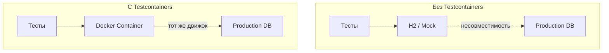
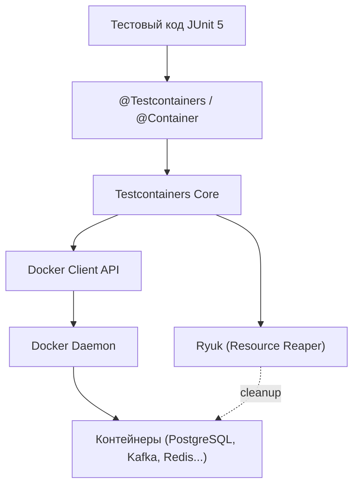
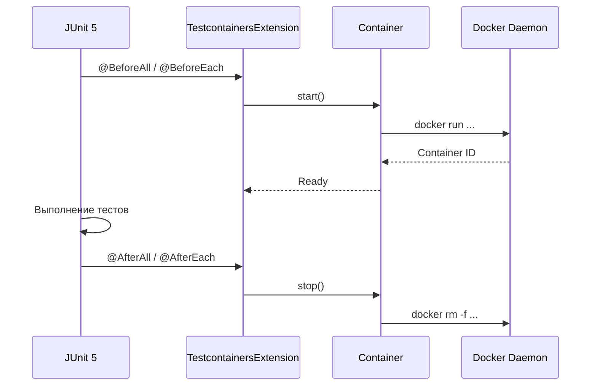
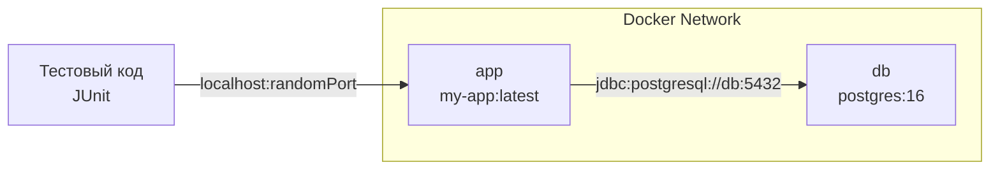

# Вопросы на собеседовании: `Testcontainers`

`Testcontainers` — Java-библиотека, которая позволяет поднимать Docker-контейнеры прямо из тестового кода. Это даёт возможность писать интеграционные тесты против реальных баз данных, брокеров сообщений, кэшей и любых других сервисов вместо in-memory заглушек. Этот файл покрывает архитектуру библиотеки, контейнеры для различных технологий, интеграцию со `Spring Boot 3.x`, паттерны управления жизненным циклом и оптимизацию для `CI/CD`.

**`Testcontainers`** стал де-факто стандартом интеграционного тестирования в Java-экосистеме. Библиотека решает ключевую проблему: тесты на in-memory заменителях (вроде `H2`) часто не ловят реальные баги, а настройка полноценной инфраструктуры для тестов — сложна и ненадёжна.

## Полезные ссылки

### Официальная документация

- [Testcontainers for Java](https://java.testcontainers.org/) — официальная документация
- [Testcontainers Guides](https://testcontainers.com/guides/) — практические гайды
- [Spring Boot: Testcontainers](https://docs.spring.io/spring-boot/reference/testing/testcontainers.html) — встроенная поддержка в Spring Boot
- [Baeldung: Docker Test Containers](https://www.baeldung.com/docker-test-containers) — базовый гайд по Testcontainers
- [Baeldung: Spring Boot + Testcontainers](https://www.baeldung.com/spring-boot-testcontainers-integration-test) — интеграция со Spring Boot
- [Baeldung: Built-in Testcontainers Support](https://www.baeldung.com/spring-boot-built-in-testcontainers) — `@ServiceConnection` в Spring Boot 3.1+
- [Baeldung: Reuse Testcontainers](https://www.baeldung.com/java-reuse-testcontainers) — переиспользование контейнеров
- [Baeldung: Testcontainers JDBC Support](https://www.baeldung.com/testcontainers-jdbc-support) — JDBC-интеграция

## Содержание

- [Полезные ссылки](#полезные-ссылки)
- [See also](#see-also)

**Основы `Testcontainers`**
- [Q1. (!) Что такое `Testcontainers` и какую проблему решает библиотека?](#q1--что-такое-testcontainers-и-какую-проблему-решает-библиотека)
- [Q2. Какие предварительные требования нужны для работы `Testcontainers`?](#q2-какие-предварительные-требования-нужны-для-работы-testcontainers)
- [Q3. (!) Как устроена архитектура `Testcontainers`?](#q3--как-устроена-архитектура-testcontainers)
- [Q4. Что такое `GenericContainer` и когда его использовать?](#q4-что-такое-genericcontainer-и-когда-его-использовать)

**Контейнеры баз данных**
- [Q5. (!) Как использовать `PostgreSQLContainer` в тестах?](#q5--как-использовать-postgresqlcontainer-в-тестах)
- [Q6. Какие контейнеры баз данных поддерживает `Testcontainers`?](#q6-какие-контейнеры-баз-данных-поддерживает-testcontainers)
- [Q7. Как работает JDBC-поддержка `Testcontainers`?](#q7-как-работает-jdbc-поддержка-testcontainers)
- [Q8. (!) В чём преимущество `Testcontainers` перед `H2` и другими in-memory базами?](#q8--в-чём-преимущество-testcontainers-перед-h2-и-другими-in-memory-базами)

**Контейнеры для `Kafka`, `Redis`, `MongoDB`**
- [Q9. Как поднять `Kafka`-контейнер для тестов?](#q9-как-поднять-kafka-контейнер-для-тестов)
- [Q10. Как тестировать приложение с `Redis` через `Testcontainers`?](#q10-как-тестировать-приложение-с-redis-через-testcontainers)
- [Q11. Как использовать `MongoDB`-контейнер?](#q11-как-использовать-mongodb-контейнер)

**Жизненный цикл и аннотации**
- [Q12. (!) Как работают аннотации `@Testcontainers` и `@Container`?](#q12--как-работают-аннотации-testcontainers-и-container)
- [Q13. В чём разница между `static` и instance-полями с `@Container`?](#q13-в-чём-разница-между-static-и-instance-полями-с-container)
- [Q14. Как управлять жизненным циклом контейнера вручную?](#q14-как-управлять-жизненным-циклом-контейнера-вручную)

**Интеграция со `Spring Boot`**
- [Q15. (!) Как подключить `Testcontainers` через `@DynamicPropertySource`?](#q15--как-подключить-testcontainers-через-dynamicpropertysource)
- [Q16. (!) Что такое `@ServiceConnection` в Spring Boot 3.1+ и чем лучше `@DynamicPropertySource`?](#q16--что-такое-serviceconnection-в-spring-boot-31-и-чем-лучше-dynamicpropertysource)
- [Q17. Как использовать `@TestConfiguration` с `Testcontainers` в Spring Boot 3.1+?](#q17-как-использовать-testconfiguration-с-testcontainers-в-spring-boot-31)
- [Q18. Как запустить Spring Boot приложение с `Testcontainers` для локальной разработки?](#q18-как-запустить-spring-boot-приложение-с-testcontainers-для-локальной-разработки)

**Паттерны и оптимизация**
- [Q19. (!) Что такое Singleton Containers паттерн и зачем он нужен?](#q19--что-такое-singleton-containers-паттерн-и-зачем-он-нужен)
- [Q20. Как переиспользовать контейнеры между запусками тестов (`reusable containers`)?](#q20-как-переиспользовать-контейнеры-между-запусками-тестов-reusable-containers)
- [Q21. Как запускать тесты с `Testcontainers` параллельно?](#q21-как-запускать-тесты-с-testcontainers-параллельно)

**`WaitStrategy` и конфигурация**
- [Q22. (!) Что такое `WaitStrategy` и какие стратегии ожидания доступны?](#q22--что-такое-waitstrategy-и-какие-стратегии-ожидания-доступны)
- [Q23. Как настроить сеть между контейнерами?](#q23-как-настроить-сеть-между-контейнерами)
- [Q24. Как использовать модуль `docker-compose`?](#q24-как-использовать-модуль-docker-compose)

**`CI/CD` и production-практики**
- [Q25. (!) Как интегрировать `Testcontainers` в `CI/CD` pipeline?](#q25--как-интегрировать-testcontainers-в-cicd-pipeline)
- [Q26. Какие есть способы ускорить тесты с `Testcontainers`?](#q26-какие-есть-способы-ускорить-тесты-с-testcontainers)
- [Q27. Какие ограничения и подводные камни есть у `Testcontainers`?](#q27-какие-ограничения-и-подводные-камни-есть-у-testcontainers)

**Дополнительные контейнеры и сценарии**
- [Q28. Как использовать `ElasticsearchContainer` в тестах?](#q28-как-использовать-elasticsearchcontainer-в-тестах)
- [Q29. Как тестировать отказоустойчивость с `Toxiproxy`?](#q29-как-тестировать-отказоустойчивость-с-toxiproxy)
- [Q30. (!) Как использовать `LocalStack` для тестирования `AWS`-сервисов?](#q30--как-использовать-localstack-для-тестирования-aws-сервисов)
- [Q31. Как тестировать с несколькими версиями одного сервиса?](#q31-как-тестировать-с-несколькими-версиями-одного-сервиса)
- [Q32. Как организовать базовый класс для интеграционных тестов с `Testcontainers`?](#q32-как-организовать-базовый-класс-для-интеграционных-тестов-с-testcontainers)

**Продвинутые темы**
- [Q33. Что такое Ryuk и как он управляет cleanup контейнеров?](#q33-что-такое-ryuk-и-как-он-управляет-cleanup-контейнеров)
- [Q34. Как использовать `WireMock` как Testcontainer для моков внешних HTTP API?](#q34-как-использовать-wiremock-как-testcontainer-для-моков-внешних-http-api)
- [Q35. Что такое `Testcontainers Cloud` и когда его использовать?](#q35-что-такое-testcontainers-cloud-и-когда-его-использовать)
- [Q36. Как использовать `DockerComposeContainer` — плюсы и минусы?](#q36-как-использовать-dockercomposecontainer--плюсы-и-минусы)
- [Q37. Как запускать `Testcontainers`-тесты параллельно без конфликтов?](#q37-как-запускать-testcontainers-тесты-параллельно-без-конфликтов)
- [Q38. Как Testcontainers используется в Kotlin-проектах — DSL и особенности?](#q38-как-testcontainers-используется-в-kotlin-проектах--dsl-и-особенности)
- [Q39. Что такое `@ServiceConnection` в Spring Boot 3.1+ и как он работает?](#q39-что-такое-serviceconnection-в-spring-boot-31-и-как-он-работает)
- [Q40. Как `LocalStack` используется для тестирования AWS-сервисов локально?](#q40-как-localstack-используется-для-тестирования-aws-сервисов-локально)

---

## Q1. (!) Что такое `Testcontainers` и какую проблему решает библиотека?

**`Testcontainers`** — Java-библиотека, которая поднимает легковесные одноразовые Docker-контейнеры прямо из тестового кода. Тест запускает реальную `PostgreSQL`, `Kafka` или `Redis`, прогоняет код против неё и гасит контейнер по завершении — без ручной установки инфраструктуры.

**Главная проблема, которую она решает:** интеграционные тесты против заглушек (`H2`, моки) дают ложную уверенность — они зелёные, но реальный движок ведёт себя иначе. `Testcontainers` тестирует против того же движка, что стоит в production, и при этом не требует ни заранее поднятой тестовой среды, ни «общей» базы, которую делят все разработчики.

**Что именно решается:**

| Проблема | Как решает Testcontainers |
|----------|---------------------------|
| In-memory базы (H2) не поддерживают все SQL-диалекты | Тест работает с реальной `PostgreSQL`/`MySQL`/`Oracle` |
| Ручная настройка инфраструктуры для тестов | Контейнер стартует автоматически, конфигурация — в коде |
| «У меня локально работает» | Одинаковое окружение для всех разработчиков и CI |
| Конфликты между параллельными запусками | Каждый тест получает изолированный контейнер |
| Зависимость от shared test-сред | Контейнер одноразовый, состояние не протекает между запусками |



**На собеседовании** важно подчеркнуть: `Testcontainers` не заменяет unit-тесты, а дополняет их на уровне интеграции. Unit-тесты проверяют бизнес-логику в изоляции и должны быть быстрыми; `Testcontainers` берёт на себя проверку тех мест, где код реально общается с инфраструктурой (SQL-запросы, сериализация в Kafka, TTL в Redis).

## Q2. Какие предварительные требования нужны для работы `Testcontainers`?

Нужны три вещи:

1. **Docker** — запущенный Docker-демон, доступный по API. Подойдёт Docker Desktop, Docker Engine, `Colima`, `Rancher Desktop` или `Podman` в режиме совместимости. Сам по себе образ `Testcontainers` не нужен — библиотека лишь дёргает Docker от вашего имени.
2. **JDK 8+** — библиотека работает на Java 8 и новее.
3. **Зависимости Gradle/Maven** — основной модуль, интеграция с JUnit и модуль под конкретную технологию.

```groovy
// build.gradle
dependencies {
    // Основная библиотека
    testImplementation 'org.testcontainers:testcontainers:1.20.4'
    // JUnit 5 интеграция
    testImplementation 'org.testcontainers:junit-jupiter:1.20.4'
    // Модуль для конкретной технологии
    testImplementation 'org.testcontainers:postgresql:1.20.4'
}
```

**Как библиотека находит Docker.** `Testcontainers` общается с демоном через Docker API — обычно по Unix-сокету `/var/run/docker.sock`, но адрес можно переопределить переменной `DOCKER_HOST`. При старте библиотека дополнительно поднимает служебный контейнер `ryuk` (Reaper), который гарантирует очистку всех созданных контейнеров даже при аварийном завершении тестов.

**Если Docker недоступен**, тесты падают сразу с понятным сообщением, а не зависают. Практический вывод для CI/CD: runner обязан иметь доступ к Docker — либо через Docker-in-Docker, либо через проброс хостового сокета (socket mount).

## Q3. (!) Как устроена архитектура `Testcontainers`?

`Testcontainers` — это тонкая прослойка между тестовым кодом и Docker-демоном. Тест работает с Java-объектами контейнеров, а библиотека транслирует вызовы в команды Docker API. Слои выстроены сверху вниз:



**Основные компоненты:**

- **`GenericContainer`** — базовый класс для любого Docker-образа
- **Специализированные контейнеры** — `PostgreSQLContainer`, `KafkaContainer`, `MongoDBContainer` и др. — наследники `GenericContainer` с преконфигурированными настройками
- **`Ryuk` (Resource Reaper)** — sidecar-контейнер, который отслеживает все созданные ресурсы (контейнеры, сети, volumes) и удаляет их после завершения тестов, даже если JVM аварийно остановилась
- **Docker Client** — обёртка вокруг `docker-java`, общается с Docker API
- **JUnit 5 Extension** (`@Testcontainers`) — управляет жизненным циклом контейнеров в соответствии с жизненным циклом тестов

**Порт-маппинг — ключевая деталь.** Контейнер слушает свой фиксированный порт внутри (например, 5432 у PostgreSQL), но наружу Docker пробрасывает его на случайный свободный порт хоста. Поэтому в тесте порт нельзя хардкодить — его берут через `getMappedPort(5432)`. Именно случайные порты позволяют гонять несколько контейнеров и параллельных тестов без конфликтов «порт уже занят».

## Q4. Что такое `GenericContainer` и когда его использовать?

`GenericContainer` — базовый класс, который запускает любой Docker-образ в тесте. Это «универсальный» контейнер: он не знает специфики конкретного сервиса, поэтому всё (порты, переменные окружения, проверку готовности) настраиваешь сам. Берут его, когда специализированного модуля под нужный сервис нет.

```java
@Testcontainers
class CustomServiceTest {

    @Container
    static GenericContainer<?> redis = new GenericContainer<>("redis:7-alpine")
            .withExposedPorts(6379)
            .waitingFor(Wait.forListeningPort());

    @Test
    void shouldConnectToRedis() {
        String host = redis.getHost();
        int port = redis.getMappedPort(6379);
        // Подключение к Redis по host:port
    }
}
```

**Ключевые методы `GenericContainer`:**

| Метод | Назначение |
|-------|-----------|
| `withExposedPorts(int...)` | Пробросить порты из контейнера |
| `withEnv(key, value)` | Задать переменную окружения |
| `withCommand(String...)` | Переопределить команду запуска |
| `withFileSystemBind(hostPath, containerPath)` | Смонтировать файл/каталог |
| `waitingFor(WaitStrategy)` | Задать стратегию ожидания готовности |
| `withNetwork(Network)` | Подключить к Docker-сети |
| `getHost()` | Получить хост (обычно `localhost`) |
| `getMappedPort(int)` | Получить маппированный порт на хосте |

**Когда применять:** `GenericContainer` — правильный выбор для нестандартного сервиса (собственный микросервис, `Minio` и т.п.). Обратная сторона универсальности — нет готовых методов вроде `getJdbcUrl()` и нужно явно задавать `waitingFor()`, иначе тест начнёт работать с ещё не прогретым сервисом. Если же специализированный модуль существует (`PostgreSQLContainer`, `KafkaContainer`), используй его — он уже знает правильную стратегию ожидания и удобные методы подключения.

## Q5. (!) Как использовать `PostgreSQLContainer` в тестах?

`PostgreSQLContainer` — специализированный контейнер, который знает всё о `PostgreSQL`: порт по умолчанию, как дождаться готовности, как создать БД и пользователя. Тебе остаётся только указать образ и реквизиты, а URL для подключения он соберёт сам.

```java
@Testcontainers
@SpringBootTest
class UserRepositoryTest {

    @Container
    static PostgreSQLContainer<?> postgres = new PostgreSQLContainer<>("postgres:16-alpine")
            .withDatabaseName("testdb")
            .withUsername("test")
            .withPassword("test")
            .withInitScript("init.sql"); // опционально

    @DynamicPropertySource
    static void configureProperties(DynamicPropertyRegistry registry) {
        registry.add("spring.datasource.url", postgres::getJdbcUrl);
        registry.add("spring.datasource.username", postgres::getUsername);
        registry.add("spring.datasource.password", postgres::getPassword);
    }

    @Autowired
    private UserRepository userRepository;

    @Test
    void shouldSaveAndFindUser() {
        User user = new User("John", "john@example.com");
        userRepository.save(user);

        Optional<User> found = userRepository.findByEmail("john@example.com");
        assertThat(found).isPresent();
    }
}
```

Здесь `@DynamicPropertySource` нужен потому, что JDBC URL контейнера известен только в рантайме (порт-то случайный) — статически прописать его в `application.yml` нельзя. Подробнее об этом механизме — в [Q15](#q15--как-подключить-testcontainers-через-dynamicpropertysource).

**Что даёт специализированный контейнер по сравнению с `GenericContainer`:**
- **Ждёт реальной готовности БД**, а не просто открытия порта — `WaitStrategy` подобрана правильно из коробки. Это снимает флаки-тесты, где соединение приходит раньше, чем PostgreSQL успел принять запросы.
- **Методы `getJdbcUrl()`, `getUsername()`, `getPassword()`** — URL не нужно собирать руками и легко ошибиться.
- **`withInitScript()`** — выполнить SQL (создать схему, насыпать справочные данные) сразу при старте.

**Ловушка слайс-тестов: `@DataJpaTest` подменяет `DataSource`.** Слайс-тест репозиториев по умолчанию заменяет источник данных на embedded-базу — даже если контейнер поднят и свойства зарегистрированы, тест молча уйдёт в in-memory H2. Чтобы `@DataJpaTest` работал с `Testcontainers`, обязательно добавь `@AutoConfigureTestDatabase(replace = Replace.NONE)` — она запрещает Spring подменять настроенный `DataSource` (механика регистрации свойств — в Q15).

## Q6. Какие контейнеры баз данных поддерживает `Testcontainers`?

`Testcontainers` предоставляет специализированные модули для большинства популярных баз данных:

| Модуль | Класс контейнера | Артефакт Gradle |
|--------|------------------|-----------------|
| `PostgreSQL` | `PostgreSQLContainer` | `org.testcontainers:postgresql` |
| `MySQL` | `MySQLContainer` | `org.testcontainers:mysql` |
| `MariaDB` | `MariaDBContainer` | `org.testcontainers:mariadb` |
| `Oracle XE` | `OracleContainer` | `org.testcontainers:oracle-xe` |
| `MS SQL Server` | `MSSQLServerContainer` | `org.testcontainers:mssqlserver` |
| `MongoDB` | `MongoDBContainer` | `org.testcontainers:mongodb` |
| `Cassandra` | `CassandraContainer` | `org.testcontainers:cassandra` |
| `ClickHouse` | `ClickHouseContainer` | `org.testcontainers:clickhouse` |
| `CockroachDB` | `CockroachContainer` | `org.testcontainers:cockroachdb` |
| `Neo4j` | `Neo4jContainer` | `org.testcontainers:neo4j` |

Реляционные БД наследуют `JdbcDatabaseContainer` — у них есть общие методы `getJdbcUrl()`, `withDatabaseName()`, `withInitScript()`. Документные и графовые (`MongoDB`, `Neo4j`, `Cassandra`) наследуют `GenericContainer` и дают свои методы под протокол сервиса. Общий принцип один: вместо ручной возни с портами и URL ты получаешь типобезопасные методы конфигурации под конкретный движок.

## Q7. Как работает JDBC-поддержка `Testcontainers`?

`Testcontainers` даёт специальный JDBC-драйвер: достаточно прописать особую строку подключения — и контейнер поднимется сам, без единой строки Java-кода. Магия в префиксе `tc` и драйвере `ContainerDatabaseDriver`: когда пул соединений впервые запрашивает соединение по такому URL, драйвер перехватывает запрос, стартует контейнер и подменяет URL на реальный.

```yaml
# application-test.yml
spring:
  datasource:
    url: jdbc:tc:postgresql:16-alpine:///testdb
    driver-class-name: org.testcontainers.jdbc.ContainerDatabaseDriver
```

**Формат URL**: `jdbc:tc:<engine>:<tag>:///<database>`

- `jdbc:tc:postgresql:16-alpine:///mydb` — PostgreSQL 16
- `jdbc:tc:mysql:8.0:///mydb` — MySQL 8
- `jdbc:tc:mariadb:10.6:///mydb` — MariaDB 10.6

**Дополнительные параметры в URL:**
- `?TC_INITSCRIPT=init.sql` — выполнить скрипт при старте
- `?TC_INITFUNCTION=com.example.Init::setup` — вызвать Java-метод
- `?TC_DAEMON=true` — не останавливать контейнер после закрытия соединения

**Когда применять.** JDBC-режим хорош для быстрого старта и простых случаев. Но контролировать жизненный цикл (когда стартовать, когда гасить, как переиспользовать) и тонкую конфигурацию через него сложнее — поэтому для серьёзного тестового кода лучше создавать контейнер явно через `PostgreSQLContainer`.

## Q8. (!) В чём преимущество `Testcontainers` перед `H2` и другими in-memory базами?

Это один из самых частых вопросов на собеседовании. Коротко: `H2` — это эмуляция базы, а `Testcontainers` — настоящий движок. Эмуляция мгновенна, но врёт на всём, что выходит за рамки базового SQL; реальный движок медленнее на старте, но ведёт себя ровно как production. Ключевые отличия:

| Критерий | `H2` / In-Memory | `Testcontainers` |
|----------|-------------------|-------------------|
| SQL-диалект | Эмуляция (часто неполная) | Реальный движок базы |
| Хранимые процедуры | Не поддерживаются | Полная поддержка |
| Специфичные типы (`JSONB`, `ARRAY`) | Частично или нет | Полная поддержка |
| Расширения (`pg_trgm`, `PostGIS`) | Нет | Да |
| Индексы, планы запросов | Другой оптимизатор | Тот же, что в production |
| Скорость старта | Мгновенно | 2-10 секунд |
| Docker-зависимость | Нет | Да |
| Confidence уровень | Средний | Высокий |

**Реальный пример проблемы с `H2`:**

```sql
-- Работает в PostgreSQL, но НЕ работает в H2
SELECT * FROM users
WHERE metadata @> '{"role": "admin"}'::jsonb;

-- H2 не поддерживает оператор @> для JSONB
```

Главная опасность `H2` — не в том, что он чего-то не умеет, а в том, что тест на нём зелёный, а в production тот же запрос падает. Получается ложная уверенность: дефект просачивается дальше именно потому, что тесты прошли.

**Рекомендация**: `H2` оправдан только для простых CRUD-тестов, где SQL-диалект не важен и запросы тривиальны. Как только в дело идут специфичные типы, расширения или нетривиальные запросы — переходи на `Testcontainers`. Подробнее о подходах к тестированию в [Integration Testing](integration-testing-interview.md).

## Q9. Как поднять `Kafka`-контейнер для тестов?

`Testcontainers` предоставляет модуль для `Apache Kafka` на базе образа `confluentinc/cp-kafka`:

```java
@Testcontainers
@SpringBootTest
class OrderEventProducerTest {

    @Container
    static KafkaContainer kafka = new KafkaContainer(
            DockerImageName.parse("confluentinc/cp-kafka:7.6.0")
    );

    @DynamicPropertySource
    static void kafkaProperties(DynamicPropertyRegistry registry) {
        registry.add("spring.kafka.bootstrap-servers", kafka::getBootstrapServers);
    }

    @Autowired
    private KafkaTemplate<String, String> kafkaTemplate;

    @Autowired
    private KafkaListenerEndpointRegistry registry;

    @Test
    void shouldSendAndReceiveEvent() throws Exception {
        kafkaTemplate.send("orders", "order-123", "{\"status\":\"CREATED\"}");
        // проверка через consumer или awaitility
    }
}
```

**Особенности `KafkaContainer`:**
- **Поднимает Kafka вместе с координацией** — встроенный `ZooKeeper` или, в новых версиях, `KRaft`. Один контейнер = готовый брокер, отдельно ставить ZooKeeper не нужно.
- **`getBootstrapServers()`** — возвращает `host:port` с уже маппированным портом, который и нужно отдать продюсеру/консьюмеру.
- **`withKraft()`** — режим `KRaft` без ZooKeeper (Kafka 3.3+): меньше движущихся частей и быстрее старт.
- **Несколько брокеров** настраиваются через `KafkaContainer` + общий `Network`, если тесту нужен кластер.

**Подводный камень:** консьюмер подключается асинхронно и может пропустить уже отправленное сообщение. Поэтому проверять получение надо не сразу, а с ожиданием — через `Awaitility` или подписку до отправки, а не голым `assertEquals` сразу после `send()`.

## Q10. Как тестировать приложение с `Redis` через `Testcontainers`?

У `Redis` нет специализированного контейнера в основной поставке, поэтому его поднимают через `GenericContainer`: указываешь образ, пробрасываешь порт 6379 и регистрируешь host/port для Spring. Готовность можно не настраивать вручную — Redis поднимается быстро, а `GenericContainer` по умолчанию ждёт открытия порта.

```java
@Testcontainers
@SpringBootTest
class CacheServiceTest {

    @Container
    static GenericContainer<?> redis = new GenericContainer<>("redis:7-alpine")
            .withExposedPorts(6379);

    @DynamicPropertySource
    static void redisProperties(DynamicPropertyRegistry registry) {
        registry.add("spring.data.redis.host", redis::getHost);
        registry.add("spring.data.redis.port", () -> redis.getMappedPort(6379));
    }

    @Autowired
    private CacheService cacheService;

    @Test
    void shouldCacheAndRetrieveValue() {
        cacheService.put("key1", "value1");
        assertThat(cacheService.get("key1")).isEqualTo("value1");
    }
}
```

В **Spring Boot 3.1+** с `@ServiceConnection` код ещё проще — см. [Q16](#q16--что-такое-serviceconnection-в-spring-boot-31-и-чем-лучше-dynamicpropertysource).

## Q11. Как использовать `MongoDB`-контейнер?

`Testcontainers` предоставляет модуль `mongodb` со специализированным контейнером:

```java
@Testcontainers
@SpringBootTest
class ProductRepositoryTest {

    @Container
    static MongoDBContainer mongo = new MongoDBContainer("mongo:7.0");

    @DynamicPropertySource
    static void mongoProperties(DynamicPropertyRegistry registry) {
        registry.add("spring.data.mongodb.uri", mongo::getReplicaSetUrl);
    }

    @Autowired
    private ProductRepository productRepository;

    @Test
    void shouldSaveDocument() {
        Product product = new Product("Widget", 9.99);
        productRepository.save(product);

        List<Product> products = productRepository.findByName("Widget");
        assertThat(products).hasSize(1);
    }
}
```

**Ключевые особенности `MongoDBContainer`:**
- **Запускает `MongoDB` как replica set из одного узла** — даже если кластера нет. Это важно: транзакции и change streams в Mongo работают только в режиме replica set, и контейнер настраивает его сам, чтобы такие тесты не падали.
- **`getReplicaSetUrl()`** — connection string с указанием replica set; именно его отдают Spring через `spring.data.mongodb.uri`.
- **`getConnectionString()`** — базовый connection string без replica set (для простых случаев).
- **Инициализация через JavaScript-скрипты** — насыпать данные или создать индексы при старте.

## Q12. (!) Как работают аннотации `@Testcontainers` и `@Container`?

`@Testcontainers` и `@Container` работают в паре: первая включает JUnit 5 Extension на классе, вторая помечает поля-контейнеры, которыми этот Extension будет управлять. В сумме они избавляют от ручных вызовов `start()`/`stop()` — контейнер сам поднимается перед тестами и гасится после.

```java
@Testcontainers  // (1) Активирует расширение
class DatabaseTest {

    @Container // (2) Помечает контейнер для управления
    static PostgreSQLContainer<?> postgres = new PostgreSQLContainer<>("postgres:16-alpine");

    @Test
    void testQuery() {
        assertTrue(postgres.isRunning());
    }
}
```

**Как это работает по шагам:**
1. `@Testcontainers` регистрирует `TestcontainersExtension` для JUnit 5.
2. Extension через reflection находит все поля, помеченные `@Container`.
3. Перед тестами вызывает `container.start()` — и момент старта зависит от `static`: для `static`-поля это `@BeforeAll` (один раз на класс), для instance-поля — `@BeforeEach` (перед каждым тестом). Разницу разбираем в [Q13](#q13-в-чём-разница-между-static-и-instance-полями-с-container).
4. После тестов вызывает `container.stop()` — соответственно в `@AfterAll` или `@AfterEach`.



**Важно**: без `@Testcontainers` аннотация `@Container` не работает — контейнер не будет ни запущен, ни остановлен автоматически.

## Q13. В чём разница между `static` и instance-полями с `@Container`?

Один маленький модификатор `static` на поле с `@Container` определяет, как часто пересоздаётся контейнер, — а значит, и сколько секунд тратится впустую:

| Тип поля | Жизненный цикл | Когда использовать |
|----------|----------------|-------------------|
| `static` | Один контейнер на весь класс (`@BeforeAll` / `@AfterAll`) | Дорогие контейнеры (БД, Kafka) — чтобы не перезапускать |
| Instance | Новый контейнер для каждого теста (`@BeforeEach` / `@AfterEach`) | Нужна полная изоляция между тестами |

```java
@Testcontainers
class LifecycleExample {

    // Стартует ОДИН раз для всех тестов в классе
    @Container
    static PostgreSQLContainer<?> postgres = new PostgreSQLContainer<>("postgres:16-alpine");

    // Стартует ЗАНОВО для каждого теста
    @Container
    GenericContainer<?> redis = new GenericContainer<>("redis:7-alpine")
            .withExposedPorts(6379);
}
```

**Рекомендация**: для баз данных почти всегда `static`. Instance-поле кажется «более изолированным», но платить за это секундами старта на каждый тест — расточительно. Изоляцию данных дешевле обеспечить иначе: откатом транзакции через `@Transactional` или очисткой таблиц в `@BeforeEach`. Так контейнер стартует один раз, а состояние всё равно не протекает между тестами.

## Q14. Как управлять жизненным циклом контейнера вручную?

Иногда аннотации не подходят — например, при Singleton-паттерне или в не-JUnit фреймворках. Тогда контейнер поднимают и гасят явно: создаёшь поле, вызываешь `start()` в `@BeforeAll` и `stop()` в `@AfterAll`.

```java
class ManualLifecycleTest {

    static PostgreSQLContainer<?> postgres = new PostgreSQLContainer<>("postgres:16-alpine");

    @BeforeAll
    static void startContainer() {
        postgres.start();
    }

    @AfterAll
    static void stopContainer() {
        postgres.stop();
    }

    @Test
    void testWithManualLifecycle() {
        assertThat(postgres.isRunning()).isTrue();
    }
}
```

**Когда нужен ручной контроль:**
- Singleton-паттерн (контейнер на весь тестовый набор)
- Условный запуск (пропустить, если Docker недоступен)
- Кастомная инициализация (выполнить SQL/скрипт между `start()` и тестами)
- Использование с TestNG или другими фреймворками

**Важно — не смешивайте подходы.** Если вызвать `start()` вручную и при этом оставить `@Container`, контейнером начнут управлять двое: и ваш код, и Extension. Extension попытается остановить его второй раз, что в лучшем случае выльется в ошибку, а в худшем — погасит контейнер, который ещё нужен другим тестам. Выбирайте что-то одно: либо аннотации, либо ручной жизненный цикл.

## Q15. (!) Как подключить `Testcontainers` через `@DynamicPropertySource`?

`@DynamicPropertySource` — аннотация Spring Boot, которая регистрирует свойства приложения динамически, уже после старта контейнера. Она существует ровно для ситуации с `Testcontainers`: значения становятся известны только в рантайме, а нужны Spring ещё до того, как он соберёт `ApplicationContext`.

```java
@Testcontainers
@SpringBootTest
class OrderServiceTest {

    @Container
    static PostgreSQLContainer<?> postgres = new PostgreSQLContainer<>("postgres:16-alpine");

    @Container
    static KafkaContainer kafka = new KafkaContainer(
            DockerImageName.parse("confluentinc/cp-kafka:7.6.0"));

    @DynamicPropertySource
    static void registerProperties(DynamicPropertyRegistry registry) {
        // PostgreSQL
        registry.add("spring.datasource.url", postgres::getJdbcUrl);
        registry.add("spring.datasource.username", postgres::getUsername);
        registry.add("spring.datasource.password", postgres::getPassword);
        // Kafka
        registry.add("spring.kafka.bootstrap-servers", kafka::getBootstrapServers);
    }
}
```

**Почему именно динамические свойства, а не `@TestPropertySource`?**
Контейнер стартует на случайном порту, поэтому JDBC URL известен только в рантайме. Прописать его статически — в `application.yml` или `@TestPropertySource` — нельзя: на момент компиляции порт ещё не существует. Обратите внимание, что в реестр кладут не готовые строки, а ссылки на методы (`postgres::getJdbcUrl`) — `Supplier`, который Spring вызовет уже после старта контейнера.

**Порядок выполнения, который и делает всё рабочим:** метод с `@DynamicPropertySource` вызывается *после* старта контейнера, но *до* инициализации `ApplicationContext`. Поэтому к моменту, когда Spring настраивает `DataSource`, в реестре уже лежат верные значения.

## Q16. (!) Что такое `@ServiceConnection` в Spring Boot 3.1+ и чем лучше `@DynamicPropertySource`?

`@ServiceConnection` появилась в Spring Boot 3.1 и делает то же, что `@DynamicPropertySource`, но автоматически: по типу контейнера определяет, какой это сервис, и сама регистрирует все свойства подключения. Вместо десятка строк `registry.add(...)` — одна аннотация над полем.

**До Spring Boot 3.1 (`@DynamicPropertySource`):**

```java
@Container
static PostgreSQLContainer<?> postgres = new PostgreSQLContainer<>("postgres:16-alpine");

@DynamicPropertySource
static void props(DynamicPropertyRegistry registry) {
    registry.add("spring.datasource.url", postgres::getJdbcUrl);
    registry.add("spring.datasource.username", postgres::getUsername);
    registry.add("spring.datasource.password", postgres::getPassword);
    registry.add("spring.datasource.driver-class-name", postgres::getDriverClassName);
}
```

**С Spring Boot 3.1+ (`@ServiceConnection`):**

```java
@Container
@ServiceConnection
static PostgreSQLContainer<?> postgres = new PostgreSQLContainer<>("postgres:16-alpine");

// Всё! Никакого @DynamicPropertySource
```

**Как это работает.** За аннотацией стоит абстракция `ConnectionDetails` — type-safe замена строковым properties. Spring Boot смотрит на тип поля (`PostgreSQLContainer`, `KafkaContainer` и т.д.), находит подходящую фабрику и создаёт нужный `ConnectionDetails`-бин (`JdbcConnectionDetails`, `KafkaConnectionDetails`…). Дальше auto-configuration строит `DataSource`/`KafkaTemplate` уже из этого бина, минуя обычные `spring.*`-properties.

**Поддерживаемые контейнеры** (неполный список):

| Контейнер | Создаёт `ConnectionDetails` для |
|-----------|-------------------------------|
| `PostgreSQLContainer` | `JdbcConnectionDetails` |
| `MySQLContainer` | `JdbcConnectionDetails` |
| `MongoDBContainer` | `MongoConnectionDetails` |
| `KafkaContainer` | `KafkaConnectionDetails` |
| `RedisContainer` / `GenericContainer` (Redis) | `RedisConnectionDetails` |
| `RabbitMQContainer` | `RabbitConnectionDetails` |
| `ElasticsearchContainer` | `ElasticsearchConnectionDetails` |

**Чем лучше `@DynamicPropertySource`:**
- **Меньше шаблонного кода** — одна аннотация вместо блока `registry.add(...)`.
- **Не нужно помнить имена properties** — `spring.datasource.url` или `spring.r2dbc.url`? `@ServiceConnection` подставит правильные сама.
- **Меньше шанс ошибиться** — опечатка в строковом ключе раньше молча ломала тест, теперь ключей просто нет.
- **Type-safe** — связь «контейнер → настройки» проверяется через `ConnectionDetails`, а не через строки.

**Когда `@DynamicPropertySource` всё ещё нужен:** нестандартный контейнер без готовой фабрики (`GenericContainer` под собственный сервис) или когда надо переопределить отдельное свойство, которое `@ServiceConnection` выставляет не так, как вам нужно.

## Q17. Как использовать `@TestConfiguration` с `Testcontainers` в Spring Boot 3.1+?

Идея в том, чтобы описать контейнеры один раз как Spring-бины в `@TestConfiguration` и подключать этот класс в любой тест через `@Import`. Контейнеры становятся обычными бинами с `@ServiceConnection`, поэтому настройка подключения происходит автоматически, а дублировать объявления в каждом тесте больше не нужно.

```java
@TestConfiguration(proxyBeanMethods = false)
class TestcontainersConfig {

    @Bean
    @ServiceConnection
    PostgreSQLContainer<?> postgresContainer() {
        return new PostgreSQLContainer<>("postgres:16-alpine");
    }

    @Bean
    @ServiceConnection
    KafkaContainer kafkaContainer() {
        return new KafkaContainer(DockerImageName.parse("confluentinc/cp-kafka:7.6.0"));
    }
}
```

**Использование в тестах:**

```java
@SpringBootTest
@Import(TestcontainersConfig.class)
class OrderServiceTest {

    @Autowired
    private OrderService orderService;

    @Test
    void shouldCreateOrder() {
        // PostgreSQL и Kafka уже запущены и подключены
    }
}
```

**Использование для локальной разработки** (Spring Boot 3.1+):

```java
public class TestApplication {

    public static void main(String[] args) {
        SpringApplication.from(Application::main)
                .with(TestcontainersConfig.class)
                .run(args);
    }
}
```

Тот же `@TestConfiguration` переиспользуется и для локального запуска: `SpringApplication.from(...).with(...)` поднимает приложение с реальными контейнерами вместо локально установленных баз. Подробнее этот сценарий разобран в [Q18](#q18-как-запустить-spring-boot-приложение-с-testcontainers-для-локальной-разработки).

## Q18. Как запустить Spring Boot приложение с `Testcontainers` для локальной разработки?

Начиная со Spring Boot 3.1, `Testcontainers` пригоден не только для тестов, но и для **локальной разработки**. Идея: вместо того чтобы ставить PostgreSQL/Kafka/Redis на машину, кладёшь в `src/test/java` класс-запускатор, который стартует основное приложение, но подмешивает к нему конфигурацию контейнеров. Запускаешь — и получаешь полностью рабочее окружение из Docker, без локальных установок.

```java
// src/test/java/com/example/TestApplication.java
public class TestApplication {

    public static void main(String[] args) {
        SpringApplication.from(Application::main)
                .with(ContainersConfig.class)
                .run(args);
    }
}

@TestConfiguration(proxyBeanMethods = false)
class ContainersConfig {

    @Bean
    @ServiceConnection
    @RestartScope  // контейнер переживёт DevTools restart
    PostgreSQLContainer<?> postgres() {
        return new PostgreSQLContainer<>("postgres:16-alpine");
    }
}
```

**Запуск**: `./gradlew bootTestRun` (Gradle) или `mvn spring-boot:test-run` (Maven).

**Зачем это нужно:**
- **Не ставить инфраструктуру руками** — `PostgreSQL`, `Redis`, `Kafka` поднимутся сами в Docker.
- **Одинаковое окружение у всей команды** — версии БД зашиты в код, а не «у кого что установлено».
- **`@RestartScope`** — контейнер переживает горячий рестарт `DevTools`. Без него каждое изменение кода пересоздавало бы базу и стирало данные; с ним приложение перезапускается, а контейнер остаётся живым.
- **Инфраструктура описана в коде**, рядом с приложением, и эволюционирует вместе с ним.

## Q19. (!) Что такое Singleton Containers паттерн и зачем он нужен?

**Singleton Containers** — паттерн, при котором один контейнер поднимается на весь тестовый прогон и разделяется всеми тестовыми классами. Контейнер объявляют в базовом классе и стартуют в `static`-блоке; конкретные тесты наследуются от него и получают уже работающую инфраструктуру.

**Зачем он нужен.** `static @Container` экономит старты в пределах одного класса, но `@AfterAll` всё равно гасит контейнер — и следующий тестовый класс поднимает его заново. На большом наборе из десятков классов это десятки лишних стартов БД. Singleton решает это радикально: контейнер стартует один раз за всю JVM и живёт до её завершения, поэтому платишь за старт ровно один раз.

```java
// Базовый класс — контейнер стартует один раз
public abstract class AbstractIntegrationTest {

    static final PostgreSQLContainer<?> POSTGRES;
    static final KafkaContainer KAFKA;

    static {
        POSTGRES = new PostgreSQLContainer<>("postgres:16-alpine");
        KAFKA = new KafkaContainer(DockerImageName.parse("confluentinc/cp-kafka:7.6.0"));

        // Старт всех контейнеров параллельно
        Stream.of(POSTGRES, KAFKA).parallel().forEach(GenericContainer::start);
    }

    @DynamicPropertySource
    static void registerProperties(DynamicPropertyRegistry registry) {
        registry.add("spring.datasource.url", POSTGRES::getJdbcUrl);
        registry.add("spring.datasource.username", POSTGRES::getUsername);
        registry.add("spring.datasource.password", POSTGRES::getPassword);
        registry.add("spring.kafka.bootstrap-servers", KAFKA::getBootstrapServers);
    }
}
```

```java
// Конкретный тест наследует базовый класс
@SpringBootTest
class OrderServiceTest extends AbstractIntegrationTest {

    @Test
    void shouldCreateOrder() {
        // POSTGRES и KAFKA уже запущены
    }
}
```

```mermaid
graph TD
    A["AbstractIntegrationTest<br/>(static initializer)"] -->|start()| B[PostgreSQL Container]
    A -->|start()| C[Kafka Container]
    D[OrderServiceTest] -->|extends| A
    E[UserServiceTest] -->|extends| A
    F[PaymentServiceTest] -->|extends| A
    D -.->|использует| B
    D -.->|использует| C
    E -.->|использует| B
    F -.->|использует| B
    F -.->|использует| C
```

**Критическая ошибка**: НЕ навешивайте `@Testcontainers` + `@Container` на singleton. Смысл паттерна — чтобы контейнер жил до конца JVM, а Extension как раз будет гасить его в `@AfterAll` после каждого класса. Первый же класс остановит общий контейнер, и все последующие упадут. Поэтому singleton стартуют вручную в `static`-блоке и не останавливают вовсе — за финальную уборку отвечает Ryuk.

**Когда использовать:**
- Много тестовых классов, все используют одну БД
- Старт контейнеров занимает значительное время
- Изоляция данных обеспечивается через `@Transactional` или `TRUNCATE`

**Бонус для Spring-тестов — кэш `ApplicationContext`.** Пересоздание Spring-контекста часто дороже старта самого контейнера. Общий базовый класс с единственным набором `@DynamicPropertySource` (см. Q15) даёт всем тестам одинаковую конфигурацию — Spring переиспользует один кэшированный контекст на весь прогон. Если же каждый класс регистрирует свойства по-своему, кэш ломается и контекст пересобирается заново (подробнее об ускорении — в Q26).

## Q20. Как переиспользовать контейнеры между запусками тестов (`reusable containers`)?

**Reusable Containers** идут на шаг дальше singleton: контейнер переживает не только класс, но и весь прогон тестов. После завершения JVM он остаётся работать, а при следующем запуске тесты подключаются к нему мгновенно. Это убирает старт контейнера из цикла «правка → тест» при локальной разработке.

**Шаг 1**: включить в `~/.testcontainers.properties`:

```properties
testcontainers.reuse.enable=true
```

**Шаг 2**: пометить контейнер:

```java
static PostgreSQLContainer<?> postgres = new PostgreSQLContainer<>("postgres:16-alpine")
        .withReuse(true);
```

**Как это работает:**
1. При первом запуске контейнер стартует как обычно
2. После завершения тестов контейнер **не останавливается**
3. При следующем запуске `Testcontainers` находит уже работающий контейнер по хешу конфигурации
4. Тесты подключаются к существующему контейнеру мгновенно

**Ограничения и подводные камни:**
- **Данные сохраняются между запусками** — это плата за скорость. Тесты должны сами чистить состояние (`TRUNCATE`, откат транзакций), иначе прошлый прогон протечёт в текущий.
- **Несовместимо с `@Container`** — Extension всё равно остановит контейнер, и переиспользовать будет нечего. Reuse-контейнеры стартуют вручную.
- **Только для локальной разработки.** Ryuk для reuse-контейнеров отключается (иначе он бы их прибил), поэтому в CI «вечный» контейнер некому убрать — он останется висеть на runner'е.

**Экономия:** старт `PostgreSQL` — 3–5 секунд, при reuse подключение мгновенно. На большом наборе или частых локальных прогонах это экономит минуты на каждом запуске.

## Q21. Как запускать тесты с `Testcontainers` параллельно?

Параллельный запуск ускоряет прогон, но с `Testcontainers` упирается в две вещи: ресурсы (каждый контейнер ест RAM и CPU) и изоляцию данных (если контейнер общий, тесты топчут чужое состояние). Включается параллельность через свойства JUnit 5, а дальше всё решает выбранная стратегия.

**JUnit 5 параллельное выполнение:**

```properties
# junit-platform.properties
junit.jupiter.execution.parallel.enabled=true
junit.jupiter.execution.parallel.mode.classes.default=concurrent
```

**Подходы к параллелизации:**

| Подход | Плюсы | Минусы |
|--------|-------|--------|
| Контейнер на класс (`static @Container`) | Полная изоляция | Много контейнеров, большой расход ресурсов |
| Singleton + изоляция данных | Один контейнер, экономия ресурсов | Нужна стратегия изоляции данных |
| Разные схемы/БД на класс | Баланс ресурсов и изоляции | Сложнее реализовать |

**Singleton + изоляция данных** (рекомендуемый подход):

```java
@SpringBootTest
class ParallelTest extends AbstractIntegrationTest {

    @BeforeEach
    void cleanData() {
        // Каждый тест начинает с чистых таблиц
        jdbcTemplate.execute("TRUNCATE TABLE orders CASCADE");
    }

    @Test
    void testA() { /* ... */ }

    @Test
    void testB() { /* ... */ }
}
```

**Важно — про изоляцию при параллельности.** С общим контейнером нужна изоляция именно на уровне данных. И тут привычный `@Transactional`-rollback подводит: параллельные транзакции берут блокировки на одни и те же строки и начинают ждать друг друга (вплоть до дедлоков), так что тесты либо тормозят, либо валятся непредсказуемо. Надёжнее — `TRUNCATE` в `@BeforeEach` или развести тесты по разным схемам/БД, чтобы они вообще не пересекались по данным.

## Q22. (!) Что такое `WaitStrategy` и какие стратегии ожидания доступны?

`WaitStrategy` отвечает на вопрос «когда считать контейнер готовым». Без неё `start()` вернёт управление, как только Docker создал контейнер, — но сервис внутри может ещё инициализироваться. Тест ломится к не прогретой БД, ловит отказ соединения и становится флаки. Правильная стратегия — это и есть лекарство от таких плавающих падений.

**Доступные стратегии:**

| Стратегия | Описание | Когда использовать |
|-----------|----------|-------------------|
| `Wait.forListeningPort()` | Ждёт открытия TCP-порта | Простые сервисы (Redis, Memcached) |
| `Wait.forHttp("/health")` | Ждёт HTTP 200 на endpoint | Web-приложения, API |
| `Wait.forLogMessage(regex, times)` | Ждёт строку в логах контейнера | Сервисы без healthcheck |
| `Wait.forHealthcheck()` | Использует Docker `HEALTHCHECK` | Образы с встроенным healthcheck |
| `Wait.forSuccessfulCommand(cmd)` | Выполняет команду в контейнере | Кастомная проверка готовности |

**Примеры использования:**

```java
// HTTP healthcheck
new GenericContainer<>("my-service:latest")
    .withExposedPorts(8080)
    .waitingFor(Wait.forHttp("/actuator/health")
        .forStatusCode(200)
        .withStartupTimeout(Duration.ofSeconds(60)));

// Ожидание строки в логах
new GenericContainer<>("elasticsearch:8.12.0")
    .waitingFor(Wait.forLogMessage(".*started.*", 1));

// Комбинирование стратегий
new GenericContainer<>("complex-service:latest")
    .waitingFor(new WaitAllStrategy()
        .withStrategy(Wait.forListeningPort())
        .withStrategy(Wait.forHttp("/ready").forStatusCode(200)));
```

**Типичная ошибка** — `Wait.forListeningPort()` для базы данных. Открытый порт ещё не значит, что БД готова: PostgreSQL может слушать сокет, пока внутри идёт recovery или инициализация, и первый же запрос упадёт. Для БД нужна проверка именно готовности принимать запросы. Хорошая новость: специализированные контейнеры (`PostgreSQLContainer`, `MySQLContainer`) уже подобрали правильную стратегию за вас — ручная настройка нужна в основном для `GenericContainer`.

## Q23. Как настроить сеть между контейнерами?

По умолчанию каждый контейнер виден тесту через хост (`localhost:случайный_порт`), но друг друга контейнеры так не достанут. Если приложение в одном контейнере должно ходить в базу в другом, их объединяют общей `Network` — тогда они оказываются в одной Docker-сети и общаются напрямую по DNS-именам.

```java
@Testcontainers
class MultiContainerNetworkTest {

    static Network network = Network.newNetwork();

    @Container
    static PostgreSQLContainer<?> postgres = new PostgreSQLContainer<>("postgres:16-alpine")
            .withNetwork(network)
            .withNetworkAliases("db");

    @Container
    static GenericContainer<?> app = new GenericContainer<>("my-app:latest")
            .withNetwork(network)
            .withNetworkAliases("app")
            .withEnv("DB_URL", "jdbc:postgresql://db:5432/test") // обращение по alias
            .dependsOn(postgres);
}
```



**Ключевые моменты:**
- **`withNetworkAliases("db")`** — DNS-имя контейнера внутри сети. Соседи обращаются к нему по этому имени, а не по IP.
- **Внутри сети — оригинальные порты, не маппированные.** Это частая путаница: из теста идёшь на `getMappedPort()`, а контейнер-контейнеру — на родной порт (5432), потому что они в одной сети и проброс на хост им не нужен.
- **`dependsOn(container)`** — задаёт порядок старта, чтобы зависимый контейнер не поднялся раньше базы.
- **`Network.SHARED`** — готовая общая сеть для простых случаев, когда заводить свою `Network.newNetwork()` избыточно.

## Q24. Как использовать модуль `docker-compose`?

Модуль `docker-compose` поднимает целый стек сервисов из готового `docker-compose.yml` — удобно, когда такой файл уже описывает окружение проекта и переписывать его в Java-код не хочется:

```java
@Testcontainers
class FullStackTest {

    @Container
    static DockerComposeContainer<?> environment =
        new DockerComposeContainer<>(new File("src/test/resources/docker-compose-test.yml"))
            .withExposedService("postgres", 5432,
                Wait.forListeningPort())
            .withExposedService("redis", 6379,
                Wait.forListeningPort())
            .withExposedService("kafka", 9092,
                Wait.forListeningPort());

    @Test
    void shouldStartFullStack() {
        String pgHost = environment.getServiceHost("postgres", 5432);
        int pgPort = environment.getServicePort("postgres", 5432);
        // Подключение к сервисам
    }
}
```

**`docker-compose-test.yml`:**

```yaml
version: '3.8'
services:
  postgres:
    image: postgres:16-alpine
    environment:
      POSTGRES_DB: testdb
      POSTGRES_USER: test
      POSTGRES_PASSWORD: test
  redis:
    image: redis:7-alpine
  kafka:
    image: confluentinc/cp-kafka:7.6.0
    environment:
      KAFKA_ADVERTISED_LISTENERS: PLAINTEXT://kafka:9092
```

**Когда использовать:**
- Есть готовый `docker-compose.yml` в проекте
- Много взаимосвязанных сервисов
- Нужно поднять копию production-окружения

**Ограничения:**
- Медленнее, чем отдельные контейнеры (docker-compose overhead)
- Сложнее получить динамические свойства (порты, хосты)
- Нет type-safe API (строковые имена сервисов)

## Q25. (!) Как интегрировать `Testcontainers` в `CI/CD` pipeline?

Главное условие одно: runner, на котором идут тесты, должен иметь доступ к Docker-демону. Всё остальное — детали того, как этот доступ обеспечить в конкретной CI-системе.

**Как даётся доступ к Docker в разных CI:**

| CI/CD система | Решение |
|---------------|---------|
| GitHub Actions | Docker доступен по умолчанию |
| GitLab CI | `docker:dind` service или socket mount |
| Jenkins | Docker agent или Docker socket mount |
| TeamCity | Docker build agents |

**GitHub Actions пример:**

```yaml
jobs:
  test:
    runs-on: ubuntu-latest
    steps:
      - uses: actions/checkout@v4
      - uses: actions/setup-java@v4
        with:
          java-version: '21'
          distribution: 'temurin'
      - name: Run tests
        run: ./gradlew test
        # Docker доступен в ubuntu-latest из коробки
```

**GitLab CI пример:**

```yaml
test:
  image: eclipse-temurin:21-jdk
  services:
    - docker:dind
  variables:
    DOCKER_HOST: tcp://docker:2375
    TESTCONTAINERS_HOST_OVERRIDE: docker
  script:
    - ./gradlew test
```

**Оптимизация для CI:**
- **Кэш Docker-образов** — registry mirror или pre-pull. В CI образ часто качается заново на каждом прогоне, и именно pull, а не сам тест, съедает минуты.
- **Testcontainers Cloud** — выносит Docker-демон в облако: образы качаются туда, а не на runner, и проблема Docker-in-Docker отпадает (см. [Q35](#q35-что-такое-testcontainers-cloud-и-когда-его-использовать)).
- **`TESTCONTAINERS_RYUK_DISABLED=true`** — в CI runner всё равно уничтожается вместе с контейнерами после job'а, поэтому Ryuk можно отключить и не тратить ресурсы на его старт.
- **Singleton-паттерн** — один контейнер на прогон вместо перезапуска под каждый тест-класс.

**Корпоративный registry и зеркалированные образы.** Если CI качает образы не с Docker Hub, а из внутреннего registry, специализированные контейнеры начнут отвергать «незнакомый» образ: `PostgreSQLContainer` проверяет, что образ совместим с `postgres`. Решение — `DockerImageName.parse("registry.company.com/mirror/postgres:16-alpine").asCompatibleSubstituteFor("postgres")`: ты явно декларируешь, что зеркалированный образ — тот же PostgreSQL. Приём работает для любого модуля и пригодится также при тестировании нескольких версий одного сервиса (см. Q31).

Подробнее о CI/CD pipeline в [Test Automation](test-automation-interview.md).

## Q26. Какие есть способы ускорить тесты с `Testcontainers`?

Тесты с контейнерами неизбежно медленнее unit-тестов, и основная цена — старт контейнеров. Поэтому почти все приёмы оптимизации крутятся вокруг одного: стартовать реже и быстрее. Вот проверенные способы, от самых эффективных к нишевым:

**1. Singleton Containers** — один контейнер на весь тестовый набор:

```java
abstract class BaseIT {
    static final PostgreSQLContainer<?> PG;
    static {
        PG = new PostgreSQLContainer<>("postgres:16-alpine");
        PG.start();
    }
}
```

**2. Параллельный старт контейнеров:**

```java
static {
    Startables.deepStart(postgres, kafka, redis).join();
}
```

**3. Лёгкие образы** — использовать `-alpine` варианты:

```java
// Вместо postgres:16 (400+ MB)
new PostgreSQLContainer<>("postgres:16-alpine"); // ~80 MB
```

**4. Reusable Containers** — для локальной разработки:

```java
container.withReuse(true);
```

**5. Разделение тестов по уровням:**

```groovy
// build.gradle
tasks.register('unitTest', Test) {
    useJUnitPlatform { excludeTags 'integration' }
}
tasks.register('integrationTest', Test) {
    useJUnitPlatform { includeTags 'integration' }
}
```

**6. tmpfs для баз данных** — хранить данные в RAM:

```java
new PostgreSQLContainer<>("postgres:16-alpine")
    .withTmpFs(Map.of("/var/lib/postgresql/data", "rw"));
```

| Оптимизация | Экономия |
|-------------|----------|
| Singleton вместо контейнер-на-класс | 60-80% времени старта |
| Alpine-образы | Быстрее pull |
| `tmpfs` | ~20-30% на операциях с диском |
| `Startables.deepStart()` | Параллельный старт вместо последовательного |
| Reusable containers | ~100% времени старта (локально) |

**7. Беречь кэш Spring `ApplicationContext`.** В Spring-тестах пересоздание контекста нередко дороже, чем старт контейнера, который все оптимизируют. Spring кэширует контексты между тестовыми классами, но любое отличие конфигурации — другой набор `@DynamicPropertySource`, другие `properties` в `@SpringBootTest`, добавленный `@MockBean` — даёт новый ключ кэша и полную пересборку контекста. Единый базовый класс с одним набором динамических свойств (см. Q19) сохраняет один контекст на весь прогон; зоопарк разных комбинаций свойств убивает и кэш контекста, и выигрыш от singleton-контейнера. Механика `@DynamicPropertySource` — в Q15.

## Q27. Какие ограничения и подводные камни есть у `Testcontainers`?

Главный компромисс `Testcontainers` честный: за реализм платишь скоростью и зависимостью от Docker. Конкретно это проявляется так.

**Технические ограничения:**

1. **Docker обязателен** — без Docker или совместимой среды тесты не запустятся в принципе. В части корпоративных и managed-сред Docker запрещён или недоступен.
2. **Время старта** — каждый контейнер добавляет 2–10 секунд. На паре контейнеров незаметно, на десятках тест-классов без singleton — ощутимо.
3. **Потребление ресурсов** — RAM и CPU на каждый контейнер. На CI-runner'е с жёсткими лимитами это упирается в OOM или замедление всего прогона.
4. **Нестабильность в CI** — pull образов по сети, таймауты Docker. Тест может «моргнуть» не из-за кода, а из-за инфраструктуры, и это бьёт по доверию к красно-зелёному статусу.

**Подводные камни:**

| Проблема | Решение |
|----------|---------|
| Порт уже занят | Всегда используйте рандомные порты (`getMappedPort`) |
| Данные протекают между тестами | Очищайте данные в `@BeforeEach` или используйте `@Transactional` |
| `@Container` + Singleton = контейнер остановлен | Не смешивайте паттерны (см. [Q19](#q19)) |
| Образ не найден / pull timeout | Используйте `ImagePullPolicy` или зеркало registry |
| Ryuk удаляет контейнеры преждевременно | Настройте `TESTCONTAINERS_RYUK_DISABLED` или увеличьте timeout |
| Тесты зависят от порядка выполнения | Каждый тест должен быть самодостаточным |

**Когда НЕ использовать `Testcontainers`:**
- Быстрые unit-тесты бизнес-логики — используйте моки
- Простые CRUD без специфики SQL-диалекта — `H2` может быть достаточно
- Среда без Docker (некоторые CI, корпоративные ограничения)
- Smoke-тесты в production — используйте реальную инфраструктуру

## Q28. Как использовать `ElasticsearchContainer` в тестах?

`ElasticsearchContainer` (модуль `org.testcontainers:elasticsearch`) поднимает настоящий Elasticsearch-узел, и тест поиска работает против реального движка — с теми же анализаторами, маппингами и релевантностью, которые не эмулирует ни один мок. Объявляешь контейнер как `static @Container`, а адрес узла отдаёшь Spring через `@DynamicPropertySource` (`spring.elasticsearch.uris`).

Для тестов контейнер настраивают двумя env-переменными. `xpack.security.enabled=false` отключает security: без этого Elasticsearch 8.x требует TLS и пароль, а в одноразовом тестовом узле они ничего не защищают и только усложняют подключение. `discovery.type=single-node` запускает узел без поиска кластера — иначе он ждал бы других участников и не вышел в статус ready.

Третий обязательный нюанс — `refresh()` после записи. Elasticsearch индексирует асинхронно (near-realtime): документ становится видимым для поиска не сразу после `save()`, а после обновления индекса. Без явного `refresh()` поиск сразу после записи вернёт пустой результат, и тест станет флаки.

```java
@SpringBootTest
@Testcontainers
class ProductSearchRepositoryTest {

    @Container
    static ElasticsearchContainer elasticsearch =
        new ElasticsearchContainer(
            DockerImageName.parse("docker.elastic.co/elasticsearch/elasticsearch:8.11.0"))
        // Отключаем security для тестов
        .withEnv("xpack.security.enabled", "false")
        .withEnv("discovery.type", "single-node");

    @DynamicPropertySource
    static void configureProperties(DynamicPropertyRegistry registry) {
        registry.add("spring.elasticsearch.uris",
            () -> "http://localhost:" + elasticsearch.getMappedPort(9200));
    }

    @Autowired
    private ProductSearchRepository searchRepository;

    @Autowired
    private ElasticsearchOperations elasticsearchOperations;

    @BeforeEach
    void setUp() {
        // Создаём индекс перед каждым тестом
        IndexOperations indexOps = elasticsearchOperations.indexOps(ProductDocument.class);
        if (!indexOps.exists()) {
            indexOps.createWithMapping();
        }
    }

    @AfterEach
    void tearDown() {
        // Очищаем данные
        elasticsearchOperations.indexOps(ProductDocument.class).delete();
    }

    @Test
    void shouldIndexAndSearchProducts() {
        // Given
        ProductDocument product = new ProductDocument("1", "Spring Boot in Action", "programming");
        searchRepository.save(product);

        // ElasticSearch асинхронно индексирует — делаем refresh
        elasticsearchOperations.indexOps(ProductDocument.class).refresh();

        // When
        List<ProductDocument> results = searchRepository.findByNameContaining("Spring");

        // Then
        assertThat(results).hasSize(1)
            .extracting(ProductDocument::getName)
            .containsExactly("Spring Boot in Action");
    }

    @Test
    void shouldSearchByCategory() {
        searchRepository.saveAll(List.of(
            new ProductDocument("1", "Spring Boot", "programming"),
            new ProductDocument("2", "Clean Code", "programming"),
            new ProductDocument("3", "Design Thinking", "management")
        ));
        elasticsearchOperations.indexOps(ProductDocument.class).refresh();

        List<ProductDocument> results = searchRepository.findByCategory("programming");

        assertThat(results).hasSize(2);
    }
}
```

### Spring Boot 3.1+ через `@ServiceConnection`

```java
@Container
@ServiceConnection
static ElasticsearchContainer elasticsearch =
    new ElasticsearchContainer("docker.elastic.co/elasticsearch/elasticsearch:8.11.0")
    .withEnv("xpack.security.enabled", "false");
// Автоматически настраивает spring.elasticsearch.uris
```

## Q29. Как тестировать отказоустойчивость с `Toxiproxy`?

**Toxiproxy** — прокси, который встаёт между приложением и зависимостью (например, БД) и по команде из теста «портит» трафик: добавляет задержку, режет полосу, рвёт соединение. Так можно детерминированно воспроизвести сетевые сбои и проверить, что приложение их переживает — отрабатывают retry, timeout, circuit breaker. В Testcontainers для этого есть встроенный модуль `ToxiproxyContainer`.

**Схема такая:** приложение подключается не напрямую к базе, а к прокси (`getProxy(postgres, 5432)`), а уже прокси проксирует трафик в реальный контейнер. В нормальном состоянии тест работает как обычно; добавив «токсик», ты симулируешь конкретный отказ, а сняв его — возвращаешь связь.

```java
@SpringBootTest
@Testcontainers
class OrderServiceResilienceTest {

    // network объявлена ПЕРВОЙ: static-инициализаторы выполняются по порядку
    // объявления, иначе toxiproxy/postgres получили бы null вместо сети
    static Network network = Network.newNetwork();

    @Container
    static ToxiproxyContainer toxiproxy = new ToxiproxyContainer("ghcr.io/shopify/toxiproxy:2.5.0")
        .withNetwork(network);

    @Container
    static PostgreSQLContainer<?> postgres = new PostgreSQLContainer<>("postgres:16-alpine")
        .withNetwork(network)
        .withNetworkAliases("postgres");

    static ToxiproxyContainer.ContainerProxy postgresProxy;

    @DynamicPropertySource
    static void configureProperties(DynamicPropertyRegistry registry) {
        postgresProxy = toxiproxy.getProxy(postgres, 5432);
        registry.add("spring.datasource.url",
            () -> "jdbc:postgresql://" + postgresProxy.getHost()
                  + ":" + postgresProxy.getProxyPort() + "/test");
        registry.add("spring.datasource.username", postgres::getUsername);
        registry.add("spring.datasource.password", postgres::getPassword);
    }

    @Autowired
    private OrderService orderService;

    @Test
    void shouldHandleDatabaseLatency() throws Exception {
        // Добавляем задержку 500мс на каждый пакет
        postgresProxy.toxics()
            .latency("db-latency", ToxicDirection.DOWNSTREAM, 500)
            .setJitter(100);

        // Сервис должен успешно работать с задержкой
        assertThatNoException().isThrownBy(() -> orderService.findAll());

        postgresProxy.toxics().get("db-latency").remove();
    }

    @Test
    void shouldHandleDatabaseConnectionCut() throws Exception {
        // Обрываем соединение
        postgresProxy.toxics()
            .bandwidth("bandwidth-limit", ToxicDirection.DOWNSTREAM, 0);

        // Сервис должен вернуть ошибку или задействовать circuit breaker
        assertThatThrownBy(() -> orderService.findAll())
            .isInstanceOf(DataAccessException.class);

        postgresProxy.toxics().get("bandwidth-limit").remove();
    }

    @Test
    void shouldRetryOnTransientFailure() throws Exception {
        // Слимитируем пропускную способность для первого запроса
        Toxic toxic = postgresProxy.toxics()
            .bandwidth("transient-failure", ToxicDirection.DOWNSTREAM, 0);

        // Через 1 секунду восстанавливаем
        CompletableFuture.runAsync(() -> {
            try {
                Thread.sleep(1000);
                toxic.remove();
            } catch (Exception ignored) {}
        });

        // @Retryable / Resilience4j должен повторить запрос успешно
        List<Order> orders = orderService.findAllWithRetry();
        assertThat(orders).isNotNull();
    }
}
```

## Q30. (!) Как использовать `LocalStack` для тестирования `AWS`-сервисов?

`LocalStack` — это эмулятор AWS, который поднимает локальные реализации S3, SQS, SNS, DynamoDB и десятков других сервисов в одном Docker-контейнере. Тесты говорят с ним по тому же AWS API, что и с настоящим облаком, — меняется только endpoint. Это позволяет гонять интеграцию с AWS без реального аккаунта, оплаты и сетевых задержек. Testcontainers даёт под него готовый `LocalStackContainer`.

```java
@SpringBootTest
@Testcontainers
class S3FileStorageServiceTest {

    @Container
    static LocalStackContainer localStack =
        new LocalStackContainer(DockerImageName.parse("localstack/localstack:3.0"))
            .withServices(Service.S3, Service.SQS);

    static S3Client s3Client;
    static SqsClient sqsClient;

    @DynamicPropertySource
    static void configureProperties(DynamicPropertyRegistry registry) {
        registry.add("aws.region", localStack::getRegion);
        registry.add("aws.accessKey", localStack::getAccessKey);
        registry.add("aws.secretKey", localStack::getSecretKey);
        registry.add("aws.s3.endpoint", () -> localStack.getEndpointOverride(Service.S3).toString());
        registry.add("aws.sqs.endpoint", () -> localStack.getEndpointOverride(Service.SQS).toString());
        registry.add("app.s3.bucket", () -> "test-bucket");
    }

    @BeforeAll
    static void setUp() {
        s3Client = S3Client.builder()
            .endpointOverride(localStack.getEndpointOverride(Service.S3))
            .credentialsProvider(StaticCredentialsProvider.create(
                AwsBasicCredentials.create(localStack.getAccessKey(), localStack.getSecretKey())))
            .region(Region.of(localStack.getRegion()))
            .build();

        // Создаём бакет для тестов
        s3Client.createBucket(b -> b.bucket("test-bucket"));
    }

    @Autowired
    private FileStorageService fileStorageService;

    @Test
    void shouldUploadFileToS3() throws Exception {
        byte[] content = "Test file content".getBytes(StandardCharsets.UTF_8);
        String key = fileStorageService.upload("documents/test.txt", content);

        // Проверяем, что файл реально в S3
        GetObjectResponse response = s3Client.getObject(b ->
            b.bucket("test-bucket").key(key)).response();

        assertThat(response.contentLength()).isEqualTo(content.length);
    }

    @Test
    void shouldPublishEventToSQS() throws Exception {
        sqsClient = SqsClient.builder()
            .endpointOverride(localStack.getEndpointOverride(Service.SQS))
            .credentialsProvider(StaticCredentialsProvider.create(
                AwsBasicCredentials.create(localStack.getAccessKey(), localStack.getSecretKey())))
            .region(Region.of(localStack.getRegion()))
            .build();

        String queueUrl = sqsClient.createQueue(b -> b.queueName("orders")).queueUrl();

        fileStorageService.uploadAndNotify("docs/file.pdf", "content".getBytes());

        // Проверяем сообщение в очереди
        ReceiveMessageResponse messages = sqsClient.receiveMessage(b ->
            b.queueUrl(queueUrl).maxNumberOfMessages(1));

        assertThat(messages.messages()).hasSize(1);
        assertThat(messages.messages().get(0).body()).contains("file.pdf");
    }
}
```

## Q31. Как тестировать с несколькими версиями одного сервиса?

Иногда надо доказать, что код работает на нескольких версиях БД — например, при миграции с PostgreSQL 13 на 16 или когда библиотека/сервис должны поддерживать целый диапазон. Приём: параметризованный тест, где версия образа — это параметр, а контейнер создаётся прямо в `try-with-resources`, чтобы каждая версия поднималась и гасилась изолированно.

```java
// Параметризованный тест с разными версиями PostgreSQL
@ParameterizedTest
@MethodSource("postgresVersions")
void shouldWorkWithAllSupportedPostgresVersions(String version) throws Exception {
    try (PostgreSQLContainer<?> postgres = new PostgreSQLContainer<>(
            DockerImageName.parse("postgres:" + version))) {
        postgres.start();

        // Создаём DataSource для конкретной версии
        HikariConfig config = new HikariConfig();
        config.setJdbcUrl(postgres.getJdbcUrl());
        config.setUsername(postgres.getUsername());
        config.setPassword(postgres.getPassword());

        try (HikariDataSource dataSource = new HikariDataSource(config)) {
            // Запускаем Flyway миграции
            Flyway.configure()
                .dataSource(dataSource)
                .load()
                .migrate();

            // Проверяем совместимость через JDBC напрямую
            try (Connection conn = dataSource.getConnection();
                 PreparedStatement ps = conn.prepareStatement(
                     "SELECT version()")) {
                ResultSet rs = ps.executeQuery();
                rs.next();
                String dbVersion = rs.getString(1);
                assertThat(dbVersion).contains(version.split("\\.")[0]);
            }
        }
    }
}

static Stream<String> postgresVersions() {
    return Stream.of("13-alpine", "14-alpine", "15-alpine", "16-alpine");
}
```

## Q32. Как организовать базовый класс для интеграционных тестов с `Testcontainers`?

Базовый класс убирает дублирование: вместо того чтобы объявлять контейнеры и регистрировать свойства в каждом тесте, всё это выносят в один абстрактный класс, а конкретные тесты просто наследуются от него. Важно честно понимать жизненный цикл: `static`-поле с `@Container` даёт один контейнер **на тест-класс**, но `TestcontainersExtension` остановит его после каждого класса — следующий подкласс поднимет контейнеры заново. Переиспользование на весь прогон даёт только singleton-паттерн с ручным `start()` без `@Container` — см. Q19.

```java
// Абстрактный базовый класс
@SpringBootTest(webEnvironment = SpringBootTest.WebEnvironment.RANDOM_PORT)
@Testcontainers
public abstract class BaseIntegrationTest {

    // static @Container: один контейнер на тест-класс;
    // Extension остановит его после каждого класса
    @Container
    protected static PostgreSQLContainer<?> postgres =
        new PostgreSQLContainer<>("postgres:16-alpine")
            .withDatabaseName("testdb")
            .withUsername("test")
            .withPassword("test");

    @Container
    protected static KafkaContainer kafka =
        new KafkaContainer(DockerImageName.parse("confluentinc/cp-kafka:7.4.0"));

    @Container
    protected static GenericContainer<?> redis =
        new GenericContainer<>("redis:7-alpine")
            .withExposedPorts(6379);

    // Регистрация свойств один раз
    @DynamicPropertySource
    static void configureProperties(DynamicPropertyRegistry registry) {
        registry.add("spring.datasource.url", postgres::getJdbcUrl);
        registry.add("spring.datasource.username", postgres::getUsername);
        registry.add("spring.datasource.password", postgres::getPassword);

        registry.add("spring.kafka.bootstrap-servers", kafka::getBootstrapServers);

        registry.add("spring.data.redis.host", redis::getHost);
        registry.add("spring.data.redis.port",
            () -> redis.getMappedPort(6379));
    }

    @Autowired
    protected MockMvc mockMvc;

    @Autowired
    protected ObjectMapper objectMapper;

    // Хелпер для выполнения аутентифицированных запросов
    protected MockHttpServletRequestBuilder authenticatedGet(String url) {
        return get(url).header("Authorization", "Bearer " + getTestToken());
    }

    protected MockHttpServletRequestBuilder authenticatedPost(String url, Object body)
            throws JsonProcessingException {
        return post(url)
            .header("Authorization", "Bearer " + getTestToken())
            .contentType(MediaType.APPLICATION_JSON)
            .content(objectMapper.writeValueAsString(body));
    }

    private String getTestToken() {
        // Возвращаем JWT-токен для тестов
        return "test-jwt-token";
    }
}

// Конкретные тесты наследуют базовый класс
class OrderControllerTest extends BaseIntegrationTest {

    @Test
    void shouldCreateOrder() throws Exception {
        CreateOrderRequest request = new CreateOrderRequest(1L, BigDecimal.TEN);

        mockMvc.perform(authenticatedPost("/api/v1/orders", request))
            .andExpect(status().isCreated())
            .andExpect(jsonPath("$.status").value("PENDING"));
    }
}

class ProductControllerTest extends BaseIntegrationTest {

    @Test
    void shouldGetProduct() throws Exception {
        mockMvc.perform(authenticatedGet("/api/v1/products/1"))
            .andExpect(status().isOk());
    }
}
```

Такой вариант с `@Container` — это НЕ полноценный Singleton Containers: контейнеры живут в пределах одного тест-класса и пересоздаются для каждого подкласса. Если стартов становится слишком много, переводи базовый класс на singleton-паттерн: убери `@Testcontainers`/`@Container` и стартуй контейнеры вручную в `static`-блоке — тогда они переживут все классы до конца JVM. Подробный разбор — см. Q19.

**На собеседовании** стоит показать, что вы понимаете trade-off: `Testcontainers` даёт уверенность в интеграции ценой скорости и инфраструктурных требований. Хороший инженер знает, где провести границу между unit и интеграционными тестами (подробнее в [Стратегии тестирования](test-strategies-interview.md)).

---

## Q33. Что такое Ryuk и как он управляет cleanup контейнеров?

**Ryuk** — вспомогательный контейнер-«уборщик», который Testcontainers поднимает перед первым тестом. Он решает одну конкретную проблему: обычно контейнеры гасятся в коде (`stop()` или Extension), но если JVM умрёт аварийно — `kill -9`, OOM, падение CI-агента, — этот код не выполнится, и контейнеры зависнут навсегда. Ryuk страхует именно этот случай, гарантируя уборку даже при внезапной смерти JVM.

**Как работает:**

```
JVM запускает тест
    ↓
Testcontainers запускает Ryuk-контейнер (ryuk:0.x)
    ↓
Ryuk слушает TCP-соединение от JVM
    ↓
Testcontainers создаёт контейнеры с label "org.testcontainers=true"
    ↓
Тест завершается (нормально или аварийно)
    ↓
Ryuk обнаруживает разрыв TCP-соединения (JVM умерла)
    ↓
Ryuk удаляет все контейнеры с label "org.testcontainers=true"
```

**Зачем нужен:** без Ryuk при `kill -9` JVM (crash, OOM killer) контейнеры останутся висеть — засоряют ресурсы CI-агента и могут конфликтовать со следующими запусками.

**Конфигурация:**

```java
// Отключить Ryuk (например, в Kubernetes где контейнеры и так изолированы)
// Переменная окружения:
// TESTCONTAINERS_RYUK_DISABLED=true

// Или в ~/.testcontainers.properties:
// ryuk.disabled=true

// Изменить образ Ryuk (в testcontainers.properties):
// ryuk.container.image=registry.company.com/testcontainers/ryuk:0.7.0
```

Обрати внимание: Ryuk отключается **только** переменной окружения `TESTCONTAINERS_RYUK_DISABLED=true` или строкой `ryuk.disabled=true` в `~/.testcontainers.properties`. Java system property (`System.setProperty(...)`) библиотека не читает — такой «выключатель» молча не сработает.

**Когда отключать Ryuk:**
- В Kubernetes Pod'ах (инфраструктура CI изолирована)
- В средах без Docker daemon (Testcontainers Cloud)
- При использовании `reusable containers` (`withReuse(true)`) — Ryuk мешает переиспользованию

**Мониторинг:** Ryuk логирует свою работу. При проблемах с cleanup можно смотреть логи контейнера `testcontainers-ryuk-*`.

## Q34. Как использовать `WireMock` как Testcontainer для моков внешних HTTP API?

**WireMock** в виде Testcontainer поднимает настоящий HTTP-сервер, который притворяется внешним API. Ключевое отличие от `MockRestServiceServer` и `@MockBean`: те подменяют клиент на уровне Java-объектов, а WireMock отвечает по-настоящему — по сети, на реальном порту. Поэтому через него проходит весь HTTP-стек приложения: сериализация, заголовки, таймауты, retry, пул соединений. Если баг сидит в конфигурации `RestTemplate`/`WebClient`, замоканный на уровне объекта клиент его не поймает, а WireMock — поймает.

**Подключение:**

```xml
<!-- pom.xml -->
<dependency>
    <groupId>org.wiremock.integrations.testcontainers</groupId>
    <artifactId>wiremock-testcontainers-module</artifactId>
    <version>1.0-alpha-13</version>
    <scope>test</scope>
</dependency>
```

**Использование:**

```java
@Testcontainers
@SpringBootTest
class PaymentGatewayTest {

    @Container
    static WireMockContainer wireMock = new WireMockContainer("wiremock/wiremock:3.3.1")
        .withMappingFromResource("payment-stub.json");  // файл из test/resources

    @DynamicPropertySource
    static void configure(DynamicPropertyRegistry registry) {
        registry.add("payment.gateway.url", wireMock::getBaseUrl);
    }

    @Test
    void shouldProcessPayment() throws Exception {
        // У WireMockContainer нет методов stubFor()/verify() — настраиваем
        // WireMock-клиент на host:port контейнера и зовём статические методы
        WireMock.configureFor(wireMock.getHost(), wireMock.getPort());

        stubFor(post(urlEqualTo("/charge"))
            .willReturn(aResponse()
                .withStatus(200)
                .withBody("""
                    {"transactionId": "tx-123", "status": "SUCCESS"}
                    """)
                .withHeader("Content-Type", "application/json")));

        PaymentResult result = paymentService.charge(order);

        assertThat(result.getTransactionId()).isEqualTo("tx-123");
        verify(postRequestedFor(urlEqualTo("/charge"))
            .withRequestBody(containing("orderId")));
    }
}
```

**Стабы из файлов (test/resources/mappings/):**

```json
// payment-stub.json
{
    "request": { "method": "POST", "url": "/charge" },
    "response": {
        "status": 200,
        "body": "{\"status\": \"SUCCESS\"}",
        "headers": { "Content-Type": "application/json" }
    }
}
```

**Преимущества перед MockMvc/MockRestServiceServer:**
- Тестирует реальный HTTP-клиент (RestTemplate, WebClient, Feign, OkHttp)
- Работает при `@SpringBootTest(webEnvironment = RANDOM_PORT)`
- Тестирует retry-логику, timeout, заголовки, сжатие
- Поддержка сценариев (stateful stubs)

## Q35. Что такое `Testcontainers Cloud` и когда его использовать?

**Testcontainers Cloud** — managed-сервис, который выносит сам Docker-демон в облако: контейнеры крутятся на удалённых мощностях, а не на твоей машине или CI-агенте. Прелесть в прозрачности — код тестов не меняется ни на строку, библиотека просто направляет вызовы Docker API в облако вместо локального сокета. Для теста контейнер выглядит как обычный, хотя физически живёт где-то ещё.

**Архитектура:**

```
CI-агент (без Docker!)          Testcontainers Cloud
┌─────────────────────┐         ┌───────────────────────┐
│  JVM-тест           │ ←────→  │  Docker daemon         │
│  Testcontainers API │  TCP    │  PostgreSQL container  │
│  (без docker.sock)  │         │  Kafka container       │
└─────────────────────┘         └───────────────────────┘
```

**Настройка:**

```bash
# Установить Testcontainers Cloud Agent на CI-агент
# Или задать env vars:
TC_CLOUD_TOKEN=your-token
TC_CLOUD_CONCURRENCY=4  # параллельных потоков
```

```java
// Код тестов не меняется! Прозрачная замена
@Container
static PostgreSQLContainer<?> postgres = new PostgreSQLContainer<>("postgres:16");
// Работает и локально (docker), и в TC Cloud (remote)
```

**Когда использовать:**
- CI-агенты без Docker (GitHub Actions с ограничениями, serverless runners)
- Docker-in-Docker вызывает проблемы (Kubernetes CI, GitLab Shared Runners)
- Нужно масштабировать параллельные тесты на много агентов
- Корпоративные ограничения на Docker на рабочих машинах

**Когда НЕ нужен:**
- Локальная разработка с установленным Docker
- CI с полным доступом к Docker daemon
- Проекты с небольшим числом контейнерных тестов (overhead не оправдан)

**Цена:** платный сервис, есть free tier для OSS-проектов.

---

## Q36. Как использовать `DockerComposeContainer` — плюсы и минусы?

**`DockerComposeContainer`** поднимает целый стек из `docker-compose.yml` одной строкой вместо ручного объявления каждого контейнера. Имеет смысл, когда такой compose-файл в проекте уже есть и описывает то же окружение, что нужно тестам, — переиспользовать его дешевле, чем дублировать топологию в Java. Базовое использование модуля разобрано в Q24; здесь — фокус на trade-offs: когда compose-подход оправдан, чем за него платишь и почему по умолчанию лучше отдельные контейнеры.

```yaml
# src/test/resources/docker-compose-test.yml
version: '3.8'
services:
  postgres:
    image: postgres:16
    environment:
      POSTGRES_DB: testdb
      POSTGRES_USER: test
      POSTGRES_PASSWORD: test
  redis:
    image: redis:7-alpine
  kafka:
    image: confluentinc/cp-kafka:7.5.0
    environment:
      KAFKA_BROKER_ID: 1
      KAFKA_ZOOKEEPER_CONNECT: zookeeper:2181
  zookeeper:
    image: confluentinc/cp-zookeeper:7.5.0
```

```java
@Testcontainers
class IntegrationTest {

    @Container
    static DockerComposeContainer<?> compose =
        new DockerComposeContainer<>(
            new File("src/test/resources/docker-compose-test.yml"))
        .withExposedService("postgres", 5432,
            Wait.forListeningPort().withStartupTimeout(Duration.ofSeconds(30)))
        .withExposedService("redis", 6379, Wait.forListeningPort())
        .withLocalCompose(true);  // использовать локальный docker-compose

    @DynamicPropertySource
    static void configure(DynamicPropertyRegistry registry) {
        registry.add("spring.datasource.url", () ->
            "jdbc:postgresql://" + compose.getServiceHost("postgres", 5432) +
            ":" + compose.getServicePort("postgres", 5432) + "/testdb");
    }
}
```

**Плюсы:**
- Переиспользование существующих `docker-compose.yml` из проекта
- Простота описания сложных топологий (несколько зависимых сервисов)
- Знакомый формат для DevOps-команды

**Минусы:**
- Медленнее старта (overhead docker-compose поверх Docker)
- Зависимость от установленного `docker-compose` или Docker Compose V2 (`--with-local-compose`)
- Нет type-safe API — сервисы адресуются строками (`"postgres"`), опечатка вылезет только в рантайме
- `waitingFor` менее гибкий, чем у `GenericContainer`
- Сложнее диагностировать сбой: когда стек не поднялся, трудно понять, какой именно сервис виноват

**Рекомендация:** по умолчанию предпочитайте отдельные контейнеры через специализированные классы (`PostgreSQLContainer`, `KafkaContainer`) — они дают type-safe API, точечную диагностику и удобные методы подключения. `DockerComposeContainer` берите осознанно: ради переиспользования готового compose-файла, мирясь с потерей контроля.

## Q37. Как запускать `Testcontainers`-тесты параллельно без конфликтов?

**Параллельный запуск** с Testcontainers работает хорошо, если заранее решить, что изолировать. Конфликты бывают двух родов: за ресурсы (контейнеры конкурируют за RAM/CPU и Docker может задохнуться) и за данные (тесты на общем контейнере мешают друг другу). Базовая настройка параллельности и сравнение подходов — в Q21; здесь — нюансы именно предотвращения конфликтов: чистые стратегии изоляции без смешения паттернов, лимиты ресурсов и `@ResourceLock`.

**JUnit 5 параллельный запуск:**

```properties
# src/test/resources/junit-platform.properties
junit.jupiter.execution.parallel.enabled=true
junit.jupiter.execution.parallel.mode.default=concurrent
junit.jupiter.execution.parallel.mode.classes.default=concurrent
junit.jupiter.execution.parallel.config.strategy=dynamic
junit.jupiter.execution.parallel.config.dynamic.factor=2
```

**Стратегия 1: Singleton Container (рекомендуемая):**

```kotlin
// Один контейнер на весь тестовый прогон — никаких конфликтов.
// Чистый singleton: ручной start() и НИКАКОГО @Container —
// иначе Extension погасит общий контейнер после первого же класса
abstract class BaseIntegrationTest {
    companion object {
        val postgres: PostgreSQLContainer<*> = PostgreSQLContainer("postgres:16")
            .apply { start() }
    }
}

// Тесты параллельны, но работают с одним контейнером
// Изоляция — через транзакции (@Transactional @Rollback)
// или через очистку таблиц в @BeforeEach
```

**Стратегия 2: Отдельный контейнер на каждый тест-класс:**

```java
@Testcontainers
class OrderServiceTest {
    @Container
    // НЕ static — отдельный контейнер на каждый класс
    PostgreSQLContainer<?> postgres = new PostgreSQLContainer<>("postgres:16");
    // При параллельном запуске классов — каждый имеет свой контейнер
    // Дороже по ресурсам, но полная изоляция
}
```

**Проблемы при параллельном запуске:**
- Исчерпание портов — Testcontainers использует random ports, обычно безопасно
- Исчерпание Docker ресурсов (memory, CPU) — ограничивайте `concurrency`
- Конкурентный доступ к shared state в БД — решать через schema-per-test или transactions

```java
// Ограничение параллельности для тяжёлых контейнерных тестов
@ResourceLock("postgres-container")  // JUnit 5 resource lock
class HeavyDatabaseTest { }
```

---

## Q38. Как Testcontainers используется в Kotlin-проектах — DSL и особенности?

**Kotlin-специфика.** Отдельной Kotlin-библиотеки не нужно — работают те же Java-API. Но у языка есть свои идиомы (`apply`, `also`, extension-функции), которые делают код чище, и пара обязательных нюансов, без которых `@Container` в Kotlin молча перестаёт работать. Именно эти нюансы и спрашивают на собеседовании.

**`testcontainers-kotlin` — неофициальная Kotlin DSL:**

```kotlin
// Обычный Java-стиль (работает в Kotlin)
@Container
val postgres = PostgreSQLContainer<Nothing>("postgres:16").apply {
    withDatabaseName("testdb")
    withUsername("test")
    withPassword("test")
}

// Companion object для singleton-паттерна
companion object {
    @JvmField
    @Container
    val postgres: PostgreSQLContainer<*> = PostgreSQLContainer("postgres:16")
        .also { it.start() }
}
```

**Kotlin Extension Functions для Testcontainers:**

```kotlin
// Своё расширение для удобного @DynamicPropertySource
fun PostgreSQLContainer<*>.toDataSourceProperties(): Map<String, String> = mapOf(
    "spring.datasource.url" to jdbcUrl,
    "spring.datasource.username" to username,
    "spring.datasource.password" to password,
    "spring.datasource.driver-class-name" to driverClassName
)

@DynamicPropertySource
fun configureProperties(registry: DynamicPropertyRegistry) {
    postgres.toDataSourceProperties().forEach { (key, value) ->
        registry.add(key) { value }
    }
}
```

**Kotlin корутины + Testcontainers:**

```kotlin
@SpringBootTest
@Testcontainers
class CoroutineIntegrationTest {

    @Container
    companion object {
        @JvmField
        val redis: GenericContainer<*> = GenericContainer("redis:7-alpine")
            .withExposedPorts(6379)
    }

    @Test
    fun `should store and retrieve data with coroutines`() = runTest {
        val client = createRedisClient()
        client.set("key", "value")
        assertThat(client.get("key")).isEqualTo("value")
    }
}
```

**Особенности в Kotlin:**
- **`@JvmField` обязателен** для `@Container` в `companion object` — и это главная ловушка. Без него Kotlin генерирует property с геттером, а JUnit 5 Extension ищет поля через reflection и видит только настоящие Java-поля. В итоге контейнер не стартует, а тест падает с непонятным NPE. `@JvmField` заставляет компилятор сгенерировать обычное поле.
- **`Nothing` как generic** — `PostgreSQLContainer<Nothing>` вместо джавовского `PostgreSQLContainer<?>`: идиоматичная запись «параметр типа меня не интересует».
- **`apply { }` и `also { }`** — идиоматичная конфигурация: всё настраивается в одном блоке без повторения имени переменной.

## Q39. Что такое `@ServiceConnection` в Spring Boot 3.1+ и как он работает?

**`@ServiceConnection`** (Spring Boot 3.1+) — аннотация, которая по запущенному Testcontainers-контейнеру сама настраивает соответствующие Spring-бины: `DataSource`, `RedisConnectionFactory`, `KafkaProducerFactory` и т.д. Это устраняет ручной `@DynamicPropertySource`: не нужно знать имена properties и собирать URL — достаточно повесить аннотацию на поле или бин-фабрику. Базовый разбор аннотации и детальное сравнение с `@DynamicPropertySource` — в Q16; здесь — нюансы применения: что именно настраивается для каждого контейнера, объявление в `@TestConfiguration` и кастомная `ConnectionDetailsFactory` для нестандартных контейнеров.

**Без `@ServiceConnection` (Spring Boot < 3.1):**

```java
@Container
static PostgreSQLContainer<?> postgres = new PostgreSQLContainer<>("postgres:16");

@DynamicPropertySource
static void configure(DynamicPropertyRegistry registry) {
    registry.add("spring.datasource.url", postgres::getJdbcUrl);
    registry.add("spring.datasource.username", postgres::getUsername);
    registry.add("spring.datasource.password", postgres::getPassword);
}
```

**С `@ServiceConnection` (Spring Boot 3.1+):**

```java
@Container
@ServiceConnection  // Всё! DataSource настроится автоматически
static PostgreSQLContainer<?> postgres = new PostgreSQLContainer<>("postgres:16");
```

**Поддерживаемые контейнеры из коробки:**

| Контейнер | Что настраивает |
|-----------|----------------|
| `PostgreSQLContainer` | `DataSource` |
| `MySQLContainer` | `DataSource` |
| `RedisContainer` | `RedisConnectionFactory` |
| `KafkaContainer` | `KafkaProducerFactory`, `KafkaConsumerFactory` |
| `MongoDBContainer` | `MongoClient` |
| `ElasticsearchContainer` | `ElasticsearchClient` |
| `RabbitMQContainer` | `ConnectionFactory` |

**`@ServiceConnection` в `@TestConfiguration`:**

```java
@TestConfiguration(proxyBeanMethods = false)
class TestcontainersConfiguration {

    @Bean
    @ServiceConnection
    PostgreSQLContainer<?> postgresContainer() {
        return new PostgreSQLContainer<>(DockerImageName.parse("postgres:16"));
    }

    @Bean
    @ServiceConnection
    RedisContainer redisContainer() {
        return new RedisContainer(DockerImageName.parse("redis:7-alpine"));
    }
}
```

```java
// Импорт в тест или в TestApplication
@SpringBootTest
@Import(TestcontainersConfiguration.class)
class MyIntegrationTest { }
```

**Кастомный `ConnectionDetailsFactory`.** Если контейнер нестандартный (`GenericContainer` под собственный сервис) и готовой фабрики для него нет, `@ServiceConnection` сама не сработает. Тогда пишут свою фабрику: она по контейнеру отдаёт `ConnectionDetails`, а Spring подхватывает их так же, как для встроенных типов: 

```java
@SpringBootConfiguration
public class MyCustomConnectionFactory
    implements ConnectionDetailsFactory<GenericContainer<?>, MyConnectionDetails> {

    @Override
    public MyConnectionDetails getConnectionDetails(GenericContainer<?> container) {
        return new MyConnectionDetails(container.getHost(), container.getMappedPort(1234));
    }
}
```

## Q40. Как `LocalStack` используется для тестирования AWS-сервисов локально?

**LocalStack** — эмулятор AWS API в виде одного Docker-контейнера: он отвечает по тем же протоколам, что S3, SQS, DynamoDB и десятки других сервисов. Главное при работе с ним через AWS SDK — переопределить endpoint клиента на адрес контейнера (`getEndpointOverride(...)`), всё остальное в коде остаётся как для реального AWS. Testcontainers даёт `LocalStackContainer` с готовыми методами для запуска, выбора сервисов и получения этого endpoint. Базовый сценарий «LocalStack в Spring-тесте сервиса» — в Q30; здесь — работа с чистым AWS SDK v2 без Spring-обвязки, подключение одной аннотацией `@ServiceConnection` и ограничения бесплатной версии.

**Подключение:**

```xml
<dependency>
    <groupId>org.testcontainers</groupId>
    <artifactId>localstack</artifactId>
    <scope>test</scope>
</dependency>
```

**Базовое использование:**

```java
@Testcontainers
@SpringBootTest
class S3ServiceTest {

    @Container
    static LocalStackContainer localStack =
        new LocalStackContainer(DockerImageName.parse("localstack/localstack:3.0"))
            .withServices(Service.S3, Service.SQS, Service.DYNAMODB);

    static S3Client s3Client;

    @BeforeAll
    static void setup() {
        s3Client = S3Client.builder()
            .endpointOverride(localStack.getEndpointOverride(Service.S3))
            .credentialsProvider(StaticCredentialsProvider.create(
                AwsBasicCredentials.create(
                    localStack.getAccessKey(),
                    localStack.getSecretKey())))
            .region(Region.of(localStack.getRegion()))
            .build();

        s3Client.createBucket(b -> b.bucket("test-bucket"));
    }

    @Test
    void shouldUploadAndDownloadFile() throws Exception {
        byte[] content = "Hello, LocalStack!".getBytes();
        s3Client.putObject(
            b -> b.bucket("test-bucket").key("test.txt"),
            RequestBody.fromBytes(content));

        ResponseBytes<GetObjectResponse> response = s3Client.getObjectAsBytes(
            b -> b.bucket("test-bucket").key("test.txt"));

        assertThat(response.asByteArray()).isEqualTo(content);
    }
}
```

**Интеграция со Spring Boot через `@ServiceConnection`:**

```java
@Container
@ServiceConnection
static LocalStackContainer localStack =
    new LocalStackContainer(DockerImageName.parse("localstack/localstack:3.0"))
        .withServices(Service.S3, Service.SQS);
// Spring Auto-configuration настроит AmazonS3, AmazonSQS автоматически
```

**SQS-тестирование:**

```java
@Test
void shouldSendAndReceiveMessage() {
    SqsClient sqs = SqsClient.builder()
        .endpointOverride(localStack.getEndpointOverride(Service.SQS))
        .credentialsProvider(StaticCredentialsProvider.create(
            AwsBasicCredentials.create(localStack.getAccessKey(), localStack.getSecretKey())))
        .region(Region.of(localStack.getRegion()))
        .build();

    String queueUrl = sqs.createQueue(b -> b.queueName("test-queue")).queueUrl();
    sqs.sendMessage(b -> b.queueUrl(queueUrl).messageBody("test message"));

    ReceiveMessageResponse response = sqs.receiveMessage(b -> b.queueUrl(queueUrl));
    assertThat(response.messages()).hasSize(1);
    assertThat(response.messages().get(0).body()).isEqualTo("test message");
}
```

**Поддерживаемые сервисы LocalStack:**
- S3, SQS, SNS, DynamoDB, Lambda, CloudWatch, Secrets Manager, IAM, Kinesis, Step Functions

**Ограничения LocalStack Free:**
- Часть сервисов (Lambda с layers, некоторые RDS-функции) — только в Pro
- Производительность ниже реального AWS
- Не 100% совместимость API для сложных сценариев

---

## See also

- [Integration Testing](integration-testing-interview.md) — интеграционное тестирование в Spring Boot: `@SpringBootTest`, test slices
- [Unit Testing](unit-testing-interview.md) — модульные тесты и моки: когда Testcontainers не нужен
- [Стратегии тестирования](test-strategies-interview.md) — пирамида тестов и место Testcontainers в ней
- [Test Automation](test-automation-interview.md) — автоматизация и запуск тестов с контейнерами в CI/CD
- [Spring Data JPA](../frameworks/spring/spring-data-jpa-interview.md) — тестирование репозиториев с `@DataJpaTest` + Testcontainers
- [Spring Boot](../frameworks/spring/spring-boot-interview.md) — конфигурация, auto-configuration, профили
- [Docker](../devops/docker-interview.md) — контейнеризация: образы, сети, volumes, которые использует Testcontainers
- [Kubernetes](../devops/kubernetes-interview.md) — запуск тестов с Testcontainers в Kubernetes CI runner'ах
