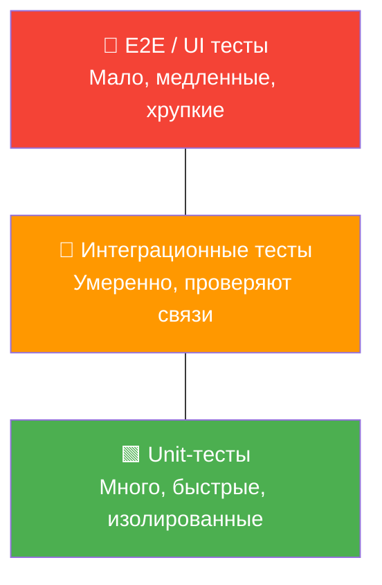
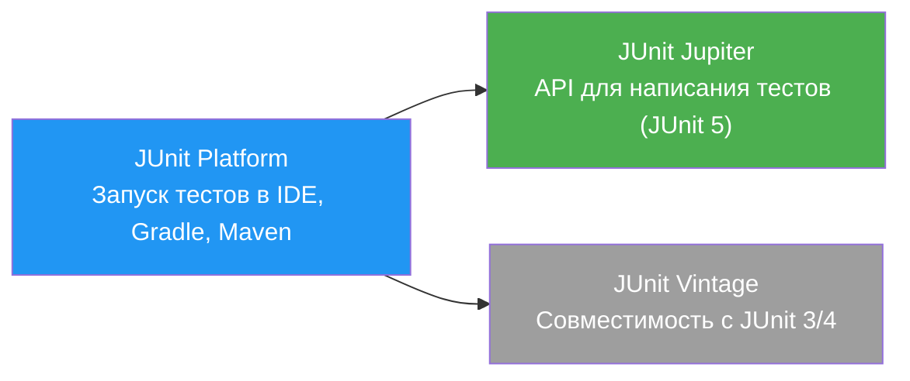
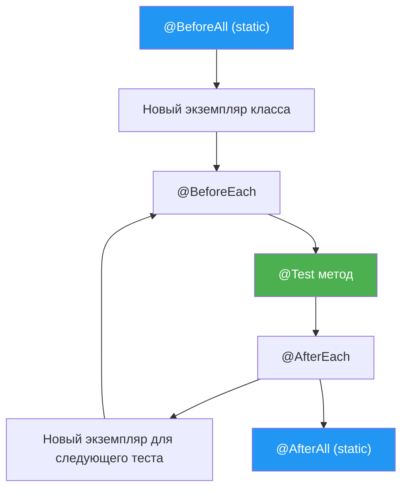
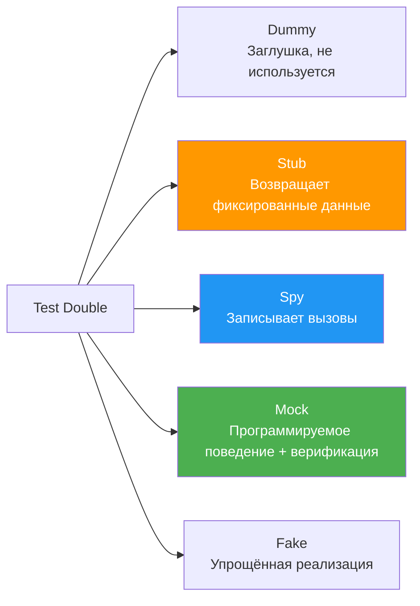

# Вопросы на собеседовании: `Unit Testing`

Краткие ответы по `Unit Testing`: изолированные проверки бизнес-логики, работа с `JUnit 5`, `Mockito`, `AssertJ`, `TDD` и поддерживаемая структура unit-тестов.

**Unit-тестирование** — фундамент пирамиды тестирования. Этот документ охватывает все аспекты написания быстрых и изолированных тестов без реальной инфраструктуры: от базовых `assertions` до продвинутых техник мокирования и параметризации.

## Роль документа в связке testing

- Этот файл отвечает за **unit-уровень**: отдельные классы/методы, моки и контракт поведения компонента.
- За проверку интеграции с БД, брокерами и внешними API отвечают [Integration Testing](integration-testing-interview.md).
- За общую стратегию покрытия и приоритизацию тестов отвечает [Стратегии тестирования](test-strategies-interview.md).
- За масштабирование автотестов в CI/CD и поддержку framework отвечает [Test Automation](test-automation-interview.md).

## Полезные ссылки

### Официальная документация

- [JUnit 5 User Guide](https://junit.org/junit5/docs/current/user-guide/) — полная документация JUnit 5
- [Mockito Documentation](https://javadoc.io/doc/org.mockito/mockito-core/latest/org/mockito/Mockito.html) — Javadoc Mockito
- [AssertJ Documentation](https://assertj.github.io/doc/) — fluent assertions для Java
- [Baeldung: Best Practices for Unit Testing in Java](https://www.baeldung.com/java-unit-testing-best-practices) — практические рекомендации
- [Baeldung: Guide to JUnit 5 Parameterized Tests](https://www.baeldung.com/parameterized-tests-junit-5) — параметризованные тесты
- [Baeldung: Mockito and JUnit 5](https://www.baeldung.com/mockito-junit-5-extension) — интеграция Mockito с JUnit 5
- [Testing Pyramid (Martin Fowler)](https://martinfowler.com/articles/practical-test-pyramid.html) — пирамида тестирования
- [TDD (Martin Fowler)](https://martinfowler.com/bliki/TestDrivenDevelopment.html) — Test-Driven Development

## Содержание

- [Полезные ссылки](#полезные-ссылки)
- [See also](#see-also)

**Основы Unit Testing**
- [Q1. (!) Что такое unit testing и зачем он нужен?](#q1--что-такое-unit-testing-и-зачем-он-нужен)
- [Q2. (!) Какие основные принципы unit testing (F.I.R.S.T)?](#q2--какие-основные-принципы-unit-testing-first)
- [Q3. Что такое пирамида тестирования?](#q3-что-такое-пирамида-тестирования)
- [Q4. (!) Как работает JUnit 5 и из чего он состоит?](#q4--как-работает-junit-5-и-из-чего-он-состоит)
- [Q5. Каков жизненный цикл теста в JUnit 5?](#q5-каков-жизненный-цикл-теста-в-junit-5)

**Assertions и проверки**
- [Q6. (!) Какие assertions доступны в JUnit 5?](#q6--какие-assertions-доступны-в-junit-5)
- [Q7. (!) Что такое AssertJ и чем он лучше стандартных assertions?](#q7--что-такое-assertj-и-чем-он-лучше-стандартных-assertions)
- [Q8. Что такое AssertJ soft assertions?](#q8-что-такое-assertj-soft-assertions)
- [Q9. Как тестировать исключения?](#q9-как-тестировать-исключения)

**Mocking и test doubles**
- [Q10. (!) Что такое test doubles (mock, stub, spy, fake)?](#q10--что-такое-test-doubles-mock-stub-spy-fake)
- [Q11. (!) Как использовать Mockito?](#q11--как-использовать-mockito)
- [Q12. Как работает ArgumentCaptor в Mockito?](#q12-как-работает-argumentcaptor-в-mockito)
- [Q13. Чем отличается Mock от Spy в Mockito?](#q13-чем-отличается-mock-от-spy-в-mockito)
- [Q14. Как тестировать статические методы?](#q14-как-тестировать-статические-методы)
- [Q15. Что такое BDD-стиль тестирования с Mockito?](#q15-что-такое-bdd-стиль-тестирования-с-mockito)
- [Q16. (!) Как правильно использовать @InjectMocks?](#q16--как-правильно-использовать-injectmocks)

**TDD и методологии**
- [Q17. (!) Что такое TDD (Test-Driven Development)?](#q17--что-такое-tdd-test-driven-development)
- [Q18. Чем TDD отличается от BDD?](#q18-чем-tdd-отличается-от-bdd)

**Параметризованные тесты**
- [Q19. (!) Что такое parameterized tests?](#q19--что-такое-parameterized-tests)
- [Q20. Как использовать @MethodSource и @CsvSource?](#q20-как-использовать-methodsource-и-csvsource)
- [Q21. Что такое @DynamicTest и когда использовать?](#q21-что-такое-dynamictest-и-когда-использовать)

**Структура и организация тестов**
- [Q22. (!) Как организовать структуру тестов?](#q22--как-организовать-структуру-тестов)
- [Q23. Что такое @Nested и зачем группировать тесты?](#q23-что-такое-nested-и-зачем-группировать-тесты)
- [Q24. Что такое test fixtures и test data builders?](#q24-что-такое-test-fixtures-и-test-data-builders)
- [Q25. Какие существуют конвенции именования тестов?](#q25-какие-существуют-конвенции-именования-тестов)
- [Q26. Как тестировать приватные методы?](#q26-как-тестировать-приватные-методы)

**Специальные сценарии**
- [Q27. Как тестировать асинхронный код (CompletableFuture)?](#q27-как-тестировать-асинхронный-код-completablefuture)
- [Q28. Как тестировать код с зависимостью от времени (Clock)?](#q28-как-тестировать-код-с-зависимостью-от-времени-clock)
- [Q29. Как тестировать Stream API и Optional?](#q29-как-тестировать-stream-api-и-optional)
- [Q30. Как тестировать многопоточный код?](#q30-как-тестировать-многопоточный-код)
- [Q31. Что такое @TempDir и зачем он нужен?](#q31-что-такое-tempdir-и-зачем-он-нужен)
- [Q32. Как тестировать логирование?](#q32-как-тестировать-логирование)
- [Q33. Как тестировать equals/hashCode/toString?](#q33-как-тестировать-equalshashcodetostring)

**Покрытие и качество**
- [Q34. (!) Как измерить покрытие кода (JaCoCo)?](#q34--как-измерить-покрытие-кода-jacoco)
- [Q35. Что такое mutation testing?](#q35-что-такое-mutation-testing)
- [Q36. Что такое @Tag и как фильтровать тесты?](#q36-что-такое-tag-и-как-фильтровать-тесты)
- [Q37. Что такое @RepeatedTest и @Timeout?](#q37-что-такое-repeatedtest-и-timeout)

**Продвинутые темы**
- [Q38. Как писать JUnit 5 Extensions?](#q38-как-писать-junit-5-extensions)
- [Q39. Как тестировать конструкторы и билдеры?](#q39-как-тестировать-конструкторы-и-билдеры)
- [Q40. (!) Best practices для unit-тестов?](#q40--best-practices-для-unit-тестов)

**Продвинутые возможности JUnit 5 и Mockito**
- [Q41. (!) Как работает @ExtendWith и когда писать собственный Extension?](#q41--как-работает-extendwith-и-когда-писать-собственный-extension)
- [Q42. (!) Что такое Mockito.STRICT_STUBS и зачем включать строгий режим?](#q42--что-такое-mockitostrict_stubs-и-зачем-включать-строгий-режим)
- [Q43. Как использовать @EnumSource и @ArgumentsSource в параметризованных тестах?](#q43-как-использовать-enumsource-и-argumentssource-в-параметризованных-тестах)
- [Q44. (!) Как выполнять рекурсивное сравнение объектов с AssertJ?](#q44--как-выполнять-рекурсивное-сравнение-объектов-с-assertj)
- [Q45. Как тестировать Spring-компоненты без поднятия контекста?](#q45-как-тестировать-spring-компоненты-без-поднятия-контекста)

## Q1. (!) Что такое `unit testing` и зачем он нужен?

`Unit testing` — это метод тестирования, при котором отдельные модули (`units`) кода тестируются **изолированно** от остальной системы. `Unit` — наименьший тестируемый компонент: отдельный метод, класс или группа тесно связанных функций.

### Зачем нужен `unit testing`?

| Цель | Описание |
|------|----------|
| Раннее обнаружение ошибок | Баги находятся до этапа интеграции, когда исправление дешевле |
| Упрощение рефакторинга | Тесты защищают от регрессий при изменении кода |
| Документация поведения | Тест показывает, **как** использовать класс и **что** он делает |
| Улучшение дизайна | Код, который сложно тестировать — сигнал плохого дизайна (tight coupling) |

```java
// Тест документирует поведение и защищает от регрессии
@Test
void shouldReturnEmptyListWhenNoItemsFound() {
    // Given
    ItemRepository repository = mock(ItemRepository.class);
    when(repository.findByCategory("books")).thenReturn(Collections.emptyList());
    ItemService service = new ItemService(repository);

    // When
    List<Item> items = service.findItemsByCategory("books");

    // Then
    assertThat(items).isEmpty();
}
```

На собеседовании важно подчеркнуть, что unit-тесты — это **инвестиция**: они замедляют начальную разработку, но экономят время на отладке, рефакторинге и онбординге новых разработчиков.

## Q2. (!) Какие основные принципы `unit testing` (`F.I.R.S.T`)?

Акроним **F.I.R.S.T** описывает ключевые свойства хорошего unit-теста:

| Принцип | Описание |
|---------|----------|
| **F**ast | Тест выполняется за миллисекунды, без I/O и сети |
| **I**ndependent | Тесты не зависят друг от друга и могут запускаться в любом порядке |
| **R**epeatable | Один и тот же результат при каждом запуске, в любой среде |
| **S**elf-validating | Тест сам проверяет результат (`assert`), без ручного анализа |
| **T**horough | Покрывает основной путь, граничные случаи и ошибки |

### Паттерн `AAA` (`Arrange-Act-Assert`)

Каждый тест следует трёхступенчатой структуре:

```java
@Test
void shouldApplyPremiumDiscount() {
    // Arrange — подготовка
    User premiumUser = new User("premium@example.com", UserType.PREMIUM);
    Product product = new Product("Laptop", 1000.0);
    DiscountService service = new DiscountService();

    // Act — действие
    double finalPrice = service.applyDiscount(product, premiumUser);

    // Assert — проверка
    assertThat(finalPrice).isCloseTo(850.0, within(0.01)); // 15% скидка
}
```

Альтернатива — `Given-When-Then` (BDD-стиль), семантически идентичная AAA.

## Q3. Что такое пирамида тестирования?

**Пирамида тестирования** (Testing Pyramid, описана Mike Cohn) — модель, показывающая оптимальное соотношение типов тестов. Подробнее в [вопросах по стратегиям тестирования](test-strategies-interview.md).



| Уровень | Количество | Скорость | Стоимость поддержки |
|---------|-----------|----------|---------------------|
| `Unit` | 70-80% | Миллисекунды | Низкая |
| `Integration` | 15-20% | Секунды | Средняя |
| `E2E` | 5-10% | Минуты | Высокая |

Unit-тесты составляют основу пирамиды: их должно быть больше всего, они самые быстрые и самые дешёвые в поддержке.

## Q4. (!) Как работает `JUnit 5` и из чего он состоит?

`JUnit 5` — фреймворк для тестирования `Java`-приложений, состоящий из трёх модулей:



### Основные аннотации

```java
import org.junit.jupiter.api.*;
import static org.junit.jupiter.api.Assertions.*;

class CalculatorTest {

    private Calculator calculator;

    @BeforeAll
    static void initAll() {
        // Один раз перед всеми тестами класса (метод static)
    }

    @BeforeEach
    void setUp() {
        calculator = new Calculator(); // Перед каждым тестом
    }

    @Test
    @DisplayName("Сложение двух положительных чисел")
    void shouldAddTwoNumbers() {
        assertEquals(5, calculator.add(2, 3));
    }

    @Test
    @Disabled("Функциональность не реализована")
    void shouldHandleLargeNumbers() {
        fail("Not implemented");
    }

    @AfterEach
    void tearDown() {
        calculator = null; // После каждого теста
    }

    @AfterAll
    static void tearDownAll() {
        // Один раз после всех тестов класса
    }
}
```

### Ключевые отличия `JUnit 5` от `JUnit 4`

| Аспект | `JUnit 4` | `JUnit 5` |
|--------|-----------|-----------|
| Аннотации | `@Before`, `@After` | `@BeforeEach`, `@AfterEach` |
| Расширения | `@RunWith`, `@Rule` | `@ExtendWith` |
| Assertions | `assertThat` (Hamcrest) | `assertAll`, `assertThrows` |
| Параметризация | `@RunWith(Parameterized.class)` | `@ParameterizedTest` |
| Видимость методов | `public` обязателен | Можно `package-private` |

## Q5. Каков жизненный цикл теста в `JUnit 5`?

По умолчанию `JUnit 5` создаёт **новый экземпляр** тестового класса для каждого тестового метода (`PER_METHOD`). Это гарантирует изоляцию между тестами.



Режим `@TestInstance(Lifecycle.PER_CLASS)` создаёт один экземпляр на весь класс. Это позволяет использовать нестатические `@BeforeAll`/`@AfterAll` и разделять состояние между тестами (с осторожностью):

```java
@TestInstance(TestInstance.Lifecycle.PER_CLASS)
class SharedStateTest {

    private final List<String> log = new ArrayList<>();

    @BeforeAll
    void initAll() { // Нестатический!
        log.add("init");
    }

    @Test
    void firstTest() {
        log.add("first");
        assertThat(log).containsExactly("init", "first");
    }
}
```

## Q6. (!) Какие `assertions` доступны в `JUnit 5`?

### Стандартные `JUnit 5 Assertions`

```java
import static org.junit.jupiter.api.Assertions.*;

@Test
void demonstrateAssertions() {
    // Базовые
    assertEquals(5, calculator.add(2, 3));
    assertNotEquals(6, calculator.add(2, 3));
    assertTrue(calculator.isPositive(5));
    assertFalse(calculator.isPositive(-1));
    assertNull(result);
    assertNotNull(result);

    // С сообщением об ошибке
    assertEquals(8, calculator.multiply(2, 4), "2 * 4 должно быть 8");

    // С дельтой для float/double
    assertEquals(3.14, calculator.getPi(), 0.01);

    // Группировка — выполняет ВСЕ проверки, даже если первая упала
    assertAll("Проверка пользователя",
        () -> assertEquals("John", user.getName()),
        () -> assertEquals("john@mail.com", user.getEmail()),
        () -> assertTrue(user.isActive())
    );

    // Проверка исключений
    var ex = assertThrows(IllegalArgumentException.class,
        () -> calculator.divide(10, 0));
    assertEquals("Division by zero", ex.getMessage());

    // Таймаут
    assertTimeout(Duration.ofMillis(100), () -> service.fastOperation());
}
```

`assertAll` — ключевое отличие от `JUnit 4`: собирает **все** ошибки, а не останавливается на первой.

## Q7. (!) Что такое `AssertJ` и чем он лучше стандартных `assertions`?

`AssertJ` — fluent assertions библиотека, обеспечивающая читаемый код и информативные сообщения об ошибках. Это де-факто стандарт в Java-проектах.

```java
import static org.assertj.core.api.Assertions.*;

@Test
void shouldDemonstrateAssertJ() {
    // Строки
    assertThat(name)
        .isNotBlank()
        .startsWith("Jo")
        .hasSize(4);

    // Числа
    assertThat(price)
        .isPositive()
        .isGreaterThan(10.0)
        .isCloseTo(99.99, within(0.01));

    // Коллекции
    assertThat(users)
        .hasSize(3)
        .extracting(User::getName)
        .containsExactly("Alice", "Bob", "Charlie");

    // Optional
    assertThat(Optional.of("value"))
        .isPresent()
        .contains("value");

    // Исключения
    assertThatThrownBy(() -> service.process(null))
        .isInstanceOf(NullPointerException.class)
        .hasMessageContaining("must not be null");

    // Коллекция объектов — проверка по нескольким полям
    assertThat(orders)
        .filteredOn(Order::getStatus, OrderStatus.COMPLETED)
        .extracting(Order::getTotal, Order::getCustomer)
        .containsExactly(
            tuple(100.0, "Alice"),
            tuple(200.0, "Bob")
        );
}
```

### Преимущества `AssertJ` над стандартными `assertions`

| Аспект | `JUnit Assertions` | `AssertJ` |
|--------|---------------------|-----------|
| Синтаксис | `assertEquals(expected, actual)` | `assertThat(actual).isEqualTo(expected)` |
| IDE autocomplete | Нет | Полный (через цепочку вызовов) |
| Сообщения об ошибках | Базовые | Детальные (показывает diff) |
| Коллекции | `assertTrue(list.contains(x))` | `assertThat(list).contains(x).hasSize(3)` |
| Цепочки | Нет | Да — fluent API |

## Q8. Что такое `AssertJ soft assertions`?

`SoftAssertions` позволяют собрать **все** ошибки из нескольких проверок и вывести их разом, вместо остановки на первой:

```java
@Test
void shouldValidateUserFields() {
    User user = userService.findById(1L);

    // Вариант 1: явный объект
    SoftAssertions softly = new SoftAssertions();
    softly.assertThat(user.getName()).isEqualTo("John");
    softly.assertThat(user.getEmail()).contains("@");
    softly.assertThat(user.getAge()).isBetween(18, 65);
    softly.assertAll(); // Бросит MultipleFailuresError со списком ВСЕХ ошибок

    // Вариант 2: статический метод (JUnit 5 + AssertJ)
    SoftAssertions.assertSoftly(soft -> {
        soft.assertThat(user.getName()).isEqualTo("John");
        soft.assertThat(user.getEmail()).contains("@");
        soft.assertThat(user.getAge()).isBetween(18, 65);
    });
}
```

Полезно при проверке нескольких полей DTO/entity — видно **все** несоответствия, а не только первое.

## Q9. Как тестировать исключения?

### `JUnit 5`: `assertThrows`

```java
@Test
void shouldThrowWithCorrectMessage() {
    var ex = assertThrows(IllegalArgumentException.class,
        () -> userService.createUser("", "password"));

    assertEquals("Username cannot be empty", ex.getMessage());
}
```

### `AssertJ`: `assertThatThrownBy`

```java
@Test
void shouldThrowCustomException() {
    assertThatThrownBy(() -> validator.validateEmail("invalid"))
        .isInstanceOf(ValidationException.class)
        .hasFieldOrPropertyWithValue("errorCode", "INVALID_EMAIL")
        .hasMessageContaining("Email format");
}
```

### С `Mockito`: имитация исключений от зависимости

```java
@Test
void shouldRetryOnTransientException() {
    when(externalService.call())
        .thenThrow(new TimeoutException("Temporary"))
        .thenReturn("success");

    String result = retryService.callWithRetry();

    assertEquals("success", result);
    verify(externalService, times(2)).call();
}
```

### `assertDoesNotThrow` — проверка отсутствия исключений

```java
@Test
void shouldHandleNullGracefully() {
    assertDoesNotThrow(() -> service.processOptionalData(null));
}
```

## Q10. (!) Что такое `test doubles` (`mock`, `stub`, `spy`, `fake`)?

`Test doubles` — объекты, заменяющие реальные зависимости в тестах. Термин введён Gerard Meszaros (xUnit Test Patterns).



| Тип | Описание | Пример | Когда использовать |
|-----|----------|--------|-------------------|
| **Dummy** | Передаётся, но не используется | `new Object()` как параметр | Заполнение обязательных параметров |
| **Stub** | Возвращает фиксированные данные | `when(repo.findAll()).thenReturn(list)` | Контроль входных данных |
| **Mock** | Поведение + верификация вызовов | `verify(service).sendEmail(...)` | Проверка взаимодействий |
| **Spy** | Обёртка реального объекта | `spy(new ArrayList<>())` | Частичное мокирование |
| **Fake** | Рабочая упрощённая реализация | `InMemoryRepository` вместо JDBC | Сложная логика без инфраструктуры |

На собеседовании часто спрашивают: «Когда `mock`, а когда `stub`?» Ответ: `mock` — когда важно **что вызвали** (поведение), `stub` — когда важно **что вернули** (состояние). Подробнее про мокирование в [интеграционных тестах](integration-testing-interview.md).

## Q11. (!) Как использовать `Mockito`?

`Mockito` — наиболее популярный фреймворк для создания `mock` и `stub` объектов в `Java`.

### Подключение к `JUnit 5`

```java
@ExtendWith(MockitoExtension.class)
class UserServiceTest {

    @Mock
    private UserRepository userRepository;

    @Mock
    private EmailService emailService;

    @InjectMocks
    private UserService userService;
```

### Stubbing — настройка возвращаемых значений

```java
    @Test
    void shouldReturnUserWhenFound() {
        User expected = new User("john@example.com");
        when(userRepository.findById(1L)).thenReturn(Optional.of(expected));

        Optional<User> result = userService.findById(1L);

        assertThat(result).isPresent().contains(expected);
    }
```

### Verification — проверка вызовов

```java
    @Test
    void shouldSaveAndSendWelcomeEmail() {
        User user = new User("john@example.com");
        when(userRepository.save(any(User.class))).thenReturn(user);

        userService.registerUser("john@example.com", "password");

        verify(userRepository).save(any(User.class));
        verify(emailService).sendWelcomeEmail("john@example.com");
        verify(emailService, never()).sendPasswordResetEmail(anyString());
    }
```

### Void-методы

```java
    @Test
    void shouldHandleVoidMethodException() {
        doThrow(new RuntimeException("SMTP down"))
            .when(emailService).sendWelcomeEmail("problem@mail.com");

        doNothing().when(emailService).sendWelcomeEmail("ok@mail.com");
    }
```

### `Argument Matchers`

```java
    @Test
    void shouldUseMatchers() {
        when(userRepository.findByEmail(anyString()))
            .thenReturn(Optional.of(new User()));
        when(userRepository.findById(eq(1L)))
            .thenReturn(Optional.of(new User()));

        // ВАЖНО: нельзя смешивать matchers и конкретные значения
        // verify(repo).save(eq(user), anyString()); — OK
        // verify(repo).save(user, anyString()); — ошибка!
    }
}
```

## Q12. Как работает `ArgumentCaptor` в `Mockito`?

`ArgumentCaptor` позволяет **захватить** аргумент, переданный в метод мока, для последующей проверки. Полезно когда аргумент создаётся внутри тестируемого метода.

```java
@Test
void shouldCaptureCreatedUser() {
    ArgumentCaptor<User> captor = ArgumentCaptor.forClass(User.class);

    userService.createUser("john@example.com", "password");

    verify(userRepository).save(captor.capture());

    User captured = captor.getValue();
    assertThat(captured.getEmail()).isEqualTo("john@example.com");
    assertThat(captured.getCreatedAt()).isNotNull();
    assertThat(captured.getStatus()).isEqualTo(UserStatus.ACTIVE);
}
```

Начиная с `Mockito 4.6+`, можно использовать `@Captor` как параметр метода:

```java
@Test
void shouldCapture(@Captor ArgumentCaptor<User> captor) {
    userService.createUser("john@example.com", "pass");
    verify(userRepository).save(captor.capture());
    assertThat(captor.getValue().getEmail()).isEqualTo("john@example.com");
}
```

**Важно**: `ArgumentCaptor` следует использовать с `verify()`, а не с `when()`. Для stubbing лучше `ArgumentMatcher`.

## Q13. Чем отличается `Mock` от `Spy` в `Mockito`?

| Аспект | `Mock` | `Spy` |
|--------|--------|-------|
| Создание | `mock(List.class)` | `spy(new ArrayList<>())` |
| Поведение по умолчанию | Все методы возвращают default (null/0/false) | Все методы вызывают **реальный** код |
| Когда мокировать | `when(mock.method()).thenReturn(...)` | `doReturn(...).when(spy).method()` |
| Применение | Полная замена зависимости | Частичное мокирование |

```java
@Test
void shouldDemonstrateSpy() {
    List<String> spy = spy(new ArrayList<>());

    spy.add("one");
    spy.add("two");
    assertEquals(2, spy.size()); // Реальный метод

    doReturn(100).when(spy).size(); // Перехват одного метода
    assertEquals(100, spy.size()); // Замоканный результат

    verify(spy).add("one"); // Верификация работает
}
```

**Подводный камень со `Spy`**: при использовании `when(spy.method()).thenReturn(...)` реальный метод **вызывается** при настройке stubbing. Поэтому для `spy` предпочтительнее `doReturn(...).when(spy).method()`.

## Q14. Как тестировать статические методы?

Начиная с `Mockito 3.4.0+` (с `mockito-inline`), статические методы можно мокировать через `MockedStatic`:

```java
@Test
void shouldMockStaticMethod() {
    try (MockedStatic<UUID> mockedUuid = mockStatic(UUID.class)) {
        UUID fixedUuid = UUID.fromString("12345678-1234-1234-1234-123456789012");
        mockedUuid.when(UUID::randomUUID).thenReturn(fixedUuid);

        String id = entityService.generateId();

        assertEquals("12345678-1234-1234-1234-123456789012", id);
    }
    // Вне try-with-resources статический мок автоматически снят
}
```

### Рекомендуемые альтернативы мокированию статики

1. **Не мокировать** — если метод чистый и детерминированный (`Math.abs`, `Collections.unmodifiableList`)
2. **Рефакторинг** — обернуть статический вызов в инстанс-метод и мокировать его:

```java
// Вместо прямого вызова UUID.randomUUID()
public class UuidGenerator {
    public UUID generate() {
        return UUID.randomUUID();
    }
}
// Теперь можно замокировать обычным mock(UuidGenerator.class)
```

## Q15. Что такое `BDD`-стиль тестирования с `Mockito`?

`BDD` (Behavior-Driven Development) использует термины `Given-When-Then` вместо `Arrange-Act-Assert`. `Mockito` предоставляет `BDDMockito` для более читаемого синтаксиса:

```java
import static org.mockito.BDDMockito.*;

@Test
void shouldCreateUserSuccessfully() {
    // Given
    User user = new User("john@example.com");
    given(userRepository.save(any(User.class))).willReturn(user);
    given(emailService.sendWelcomeEmail(anyString())).willReturn(true);

    // When
    User created = userService.createUser("john@example.com", "password");

    // Then
    assertThat(created.getEmail()).isEqualTo("john@example.com");
    then(userRepository).should().save(any(User.class));
    then(emailService).should().sendWelcomeEmail("john@example.com");
    then(emailService).should(never()).sendPasswordResetEmail(anyString());
}
```

| Стандартный стиль | BDD-стиль |
|-------------------|-----------|
| `when(...).thenReturn(...)` | `given(...).willReturn(...)` |
| `verify(mock).method()` | `then(mock).should().method()` |
| `doThrow(...).when(mock)` | `willThrow(...).given(mock)` |

## Q16. (!) Как правильно использовать `@InjectMocks`?

`@InjectMocks` создаёт экземпляр тестируемого класса и инъектирует в него моки (`@Mock`/`@Spy`):

```java
@ExtendWith(MockitoExtension.class)
class OrderServiceTest {

    @Mock
    private OrderRepository orderRepository;

    @Mock
    private PaymentGateway paymentGateway;

    @Mock
    private NotificationService notificationService;

    @InjectMocks
    private OrderService orderService; // Все @Mock инъектируются сюда

    @Test
    void shouldProcessOrder() {
        when(paymentGateway.charge(any())).thenReturn(PaymentResult.SUCCESS);

        orderService.processOrder(new Order(100.0));

        verify(orderRepository).save(any(Order.class));
        verify(notificationService).sendConfirmation(any());
    }
}
```

### Подводные камни `@InjectMocks`

1. **Порядок инъекции** — `Mockito` инъектирует по типу; если два мока одного типа — поведение неопределённо
2. **Не инъектирует примитивы** — строки, числа и т.д. нужно задать вручную
3. **Конструктор или сеттеры** — `Mockito` пробует constructor injection, затем setter, затем field injection
4. **Не создаёт Spring context** — это не `@MockBean`, работает без Spring

## Q17. (!) Что такое `TDD` (Test-Driven Development)?

`TDD` — методология разработки, при которой тесты пишутся **перед** кодом. Цикл **Red-Green-Refactor**:


### Пример цикла `TDD`

**1. RED** — написать тест для ещё не реализованной функциональности:

```java
@Test
void shouldCalculateFactorial() {
    Calculator calc = new Calculator();
    assertEquals(1, calc.factorial(0));
    assertEquals(1, calc.factorial(1));
    assertEquals(6, calc.factorial(3));
    assertEquals(24, calc.factorial(4));
}
```

**2. GREEN** — минимальный код для прохождения теста:

```java
public int factorial(int n) {
    if (n <= 1) return 1;
    return n * factorial(n - 1);
}
```

**3. REFACTOR** — улучшить код, сохраняя зелёные тесты:

```java
public int factorial(int n) {
    if (n < 0) throw new IllegalArgumentException("n must be >= 0");
    int result = 1;
    for (int i = 2; i <= n; i++) {
        result *= i;
    }
    return result;
}
```

### Преимущества `TDD`

- Код тестируем **by design** (дизайн через тестируемость)
- 100% покрытие бизнес-логики — каждая строка кода написана ради теста
- Тесты — живая документация

### Когда `TDD` не подходит

- Прототипы и исследовательский код
- UI-логика с частыми изменениями дизайна
- Код с тяжёлыми внешними зависимостями (проще интеграционные тесты)

## Q18. Чем `TDD` отличается от `BDD`?

| Аспект | `TDD` | `BDD` |
|--------|-------|-------|
| Фокус | Корректность реализации | Поведение с точки зрения бизнеса |
| Язык | Технический (assertEquals) | Доменный (Given-When-Then) |
| Аудитория | Разработчики | Разработчики + бизнес-аналитики |
| Инструменты | `JUnit`, `Mockito` | `Cucumber`, `Spock`, `JBehave` |
| Гранулярность | Метод/класс | Сценарий/фича |

```java
// TDD-стиль
@Test
void calculateDiscount_premiumUser_returns15Percent() {
    assertEquals(85.0, service.calculatePrice(100.0, UserType.PREMIUM), 0.01);
}

// BDD-стиль (с Mockito BDD)
@Test
void shouldApply15PercentDiscountForPremiumUsers() {
    // Given
    given(userService.getUserType(userId)).willReturn(UserType.PREMIUM);
    // When
    double price = pricingService.calculatePrice(100.0, userId);
    // Then
    assertThat(price).isEqualTo(85.0);
}
```

## Q19. (!) Что такое `parameterized tests`?

`Parameterized tests` позволяют запускать один и тот же тест с **разными наборами данных**, избегая дублирования кода. Требуют зависимость `junit-jupiter-params`.

### `@ValueSource` — простые значения

```java
@ParameterizedTest
@ValueSource(ints = {1, 2, 3, 4, 5})
void shouldReturnTrueForPositiveNumbers(int number) {
    assertTrue(calculator.isPositive(number));
}

@ParameterizedTest
@ValueSource(strings = {"", " ", "\t", "\n"})
void shouldDetectBlankStrings(String input) {
    assertTrue(StringUtils.isBlank(input));
}

@ParameterizedTest
@NullAndEmptySource // null + пустая строка
@ValueSource(strings = {" ", "\t"})
void shouldRejectInvalidInput(String input) {
    assertFalse(validator.isValid(input));
}
```

### `@EnumSource` — перебор enum-значений

```java
@ParameterizedTest
@EnumSource(value = OrderStatus.class, names = {"PENDING", "PROCESSING"})
void shouldAllowCancellation(OrderStatus status) {
    Order order = new Order(status);
    assertTrue(order.canCancel());
}

@ParameterizedTest
@EnumSource(value = OrderStatus.class, mode = EnumSource.Mode.EXCLUDE,
            names = {"DELIVERED", "CANCELLED"})
void shouldAllowModification(OrderStatus status) {
    Order order = new Order(status);
    assertTrue(order.canModify());
}
```

## Q20. Как использовать `@MethodSource` и `@CsvSource`?

### `@MethodSource` — данные из метода

```java
@ParameterizedTest
@MethodSource("provideValidEmails")
void shouldAcceptValidEmails(String email, String domain) {
    assertThat(validator.isValidEmail(email)).isTrue();
    assertThat(validator.extractDomain(email)).isEqualTo(domain);
}

static Stream<Arguments> provideValidEmails() {
    return Stream.of(
        Arguments.of("user@example.com", "example.com"),
        Arguments.of("admin@company.org", "company.org"),
        Arguments.of("test+tag@gmail.com", "gmail.com")
    );
}
```

### `@CsvSource` — табличные данные

```java
@ParameterizedTest
@CsvSource(delimiter = '|', textBlock = """
    hello  | 3 | hellohellohello
    abc    | 2 | abcabc
    ''     | 5 | ''
    x      | 1 | x
    """)
void shouldRepeatString(String input, int times, String expected) {
    assertEquals(expected, StringUtils.repeat(input, times));
}
```

### `@CsvFileSource` — данные из файла

```java
@ParameterizedTest
@CsvFileSource(resources = "/test-data/users.csv", numLinesToSkip = 1)
void shouldValidateUserFromFile(String email, String password, boolean valid) {
    assertEquals(valid, validator.isValid(email, password));
}
```

## Q21. Что такое `@DynamicTest` и когда использовать?

`@TestFactory` генерирует тесты в **runtime** — полезно для data-driven сценариев с данными из внешнего источника:

```java
@TestFactory
Stream<DynamicTest> shouldValidateAllCountryCodes() {
    Map<String, String> countryCodes = Map.of(
        "RU", "Russia", "US", "United States", "DE", "Germany"
    );

    return countryCodes.entrySet().stream()
        .map(entry -> dynamicTest(
            "Код " + entry.getKey() + " → " + entry.getValue(),
            () -> {
                Country country = countryService.findByCode(entry.getKey());
                assertThat(country.getName()).isEqualTo(entry.getValue());
            }
        ));
}
```

**Отличие от `@ParameterizedTest`**: динамические тесты не поддерживают lifecycle callbacks (`@BeforeEach`/`@AfterEach`), но позволяют генерировать произвольную структуру тестов.

## Q22. (!) Как организовать структуру тестов?

### Структура проекта

```text
src/
├── main/java/com/example/
│   ├── domain/       User.java, Order.java
│   ├── service/      UserService.java, OrderService.java
│   └── repository/   UserRepository.java
└── test/java/com/example/
    ├── domain/        UserTest.java, OrderTest.java
    ├── service/       UserServiceTest.java, OrderServiceTest.java
    ├── repository/    UserRepositoryTest.java
    └── testutil/      TestUserBuilder.java, TestOrderFactory.java
```

### Правила организации

1. **Пакет теста = пакет продуктового кода** — доступ к `package-private` методам
2. **Один тестовый класс на один продуктовый класс** (обычно)
3. **Test utilities** — билдеры, фабрики, вспомогательные классы в отдельном пакете `testutil`
4. **Никакого production-кода в тестовой директории**

```java
// Использование @Nested для группировки внутри класса
@ExtendWith(MockitoExtension.class)
class UserServiceTest {

    @Mock UserRepository repository;
    @InjectMocks UserService service;

    @Nested
    class CreateUser {
        @Test void shouldCreateWithValidData() { /* ... */ }
        @Test void shouldRejectDuplicateEmail() { /* ... */ }
    }

    @Nested
    class FindUser {
        @Test void shouldReturnUserById() { /* ... */ }
        @Test void shouldReturnEmptyForNonExistentId() { /* ... */ }
    }
}
```

## Q23. Что такое `@Nested` и зачем группировать тесты?

`@Nested` — вложенный тестовый класс в `JUnit 5`. Каждый `@Nested` класс может иметь свои `@BeforeEach`/`@AfterEach`, наследуя контекст внешнего класса:

```java
@DisplayName("Calculator")
class CalculatorTest {

    private Calculator calculator;

    @BeforeEach
    void setUp() {
        calculator = new Calculator();
    }

    @Nested
    @DisplayName("Сложение")
    class Addition {
        @Test void shouldAddPositives() {
            assertEquals(5, calculator.add(2, 3));
        }

        @Test void shouldAddNegatives() {
            assertEquals(-5, calculator.add(-2, -3));
        }

        @Nested
        @DisplayName("С нулём")
        class WithZero {
            @Test void shouldReturnSameNumber() {
                assertEquals(5, calculator.add(5, 0));
            }
        }
    }

    @Nested
    @DisplayName("Деление")
    class Division {
        @Test void shouldDivide() {
            assertEquals(2.5, calculator.divide(5, 2));
        }

        @Test void shouldThrowOnDivisionByZero() {
            assertThrows(ArithmeticException.class,
                () -> calculator.divide(5, 0));
        }
    }
}
```

В IDE это даёт иерархическое отображение тестов — улучшает навигацию и читаемость.

## Q24. Что такое `test fixtures` и `test data builders`?

### `Test fixture` — подготовка состояния

`@BeforeEach` настраивает общее состояние для всех тестов в классе:

```java
class OrderServiceTest {
    private OrderService service;
    private User testUser;

    @BeforeEach
    void setUp() {
        service = new OrderService(mock(OrderRepository.class));
        testUser = new User("test@mail.com", UserType.REGULAR);
    }
}
```

### `Test Data Builder` — паттерн для создания объектов

```java
public class TestUserBuilder {
    private String email = "default@example.com";
    private String name = "John Doe";
    private UserStatus status = UserStatus.ACTIVE;

    public TestUserBuilder email(String email) { this.email = email; return this; }
    public TestUserBuilder name(String name) { this.name = name; return this; }
    public TestUserBuilder inactive() { this.status = UserStatus.INACTIVE; return this; }

    public User build() {
        User user = new User(email, name);
        user.setStatus(status);
        return user;
    }

    public static TestUserBuilder aUser() { return new TestUserBuilder(); }
}

// Использование
@Test
void shouldDeactivateUser() {
    User user = aUser().email("john@mail.com").build();
    service.deactivate(user);
    assertThat(user.getStatus()).isEqualTo(UserStatus.INACTIVE);
}
```

Альтернативы: библиотеки `Instancio`, `EasyRandom` для автоматической генерации тестовых данных.

## Q25. Какие существуют конвенции именования тестов?

| Стиль | Пример | Когда использовать |
|-------|--------|-------------------|
| `should...` | `shouldReturnEmptyList()` | Наиболее распространённый |
| `Method_Condition_Result` | `findById_NonExistent_ReturnsEmpty()` | Чёткая привязка к методу |
| `given_when_then` | `givenInactiveUser_whenLogin_thenThrows()` | BDD-стиль |
| `@DisplayName` | `@DisplayName("Должен вернуть пустой список")` | Русскоязычные описания |

```java
class UserServiceTest {
    // Стиль should
    @Test void shouldCreateUserWithValidData() { }
    @Test void shouldThrowWhenEmailIsDuplicate() { }

    // Стиль Method_Condition_Result
    @Test void createUser_DuplicateEmail_ThrowsException() { }
    @Test void findById_ExistingId_ReturnsUser() { }

    // Стиль с @DisplayName
    @Test
    @DisplayName("Должен отклонить пользователя с невалидным email")
    void rejectInvalidEmail() { }
}
```

Главное — **единообразие** в пределах проекта. Имя теста должно описывать **поведение**, а не реализацию.

## Q26. Как тестировать приватные методы?

**Ответ**: обычно не нужно. Приватные методы тестируются **косвенно** через публичный API. Если приватный метод сложен — это сигнал к рефакторингу.

### Рекомендуемые подходы (по приоритету)

**1. Тестирование через публичные методы** (предпочтительно):

```java
@Test
void shouldCalculateTotalIncludingTax() {
    // Приватный calculateTax() тестируется косвенно
    BigDecimal total = calculator.calculateTotal(new BigDecimal("100"));
    assertEquals(new BigDecimal("120.00"), total); // 100 + 20% tax
}
```

**2. Выделение в отдельный класс** (если логика сложная):

```java
// Приватную логику вынести в TaxCalculator с публичным API
public class TaxCalculator {
    public BigDecimal calculate(BigDecimal amount) {
        return amount.multiply(new BigDecimal("0.20"));
    }
}
```

**3. Package-private видимость** (компромисс):

```java
class Calculator {
    // Изменено с private на package-private для тестирования
    BigDecimal calculateTax(BigDecimal amount) { /* ... */ }
}
```

**4. Reflection** — крайний случай для legacy-кода, **не рекомендуется**.

## Q27. Как тестировать асинхронный код (`CompletableFuture`)?

### `CompletableFuture.join()` / `get()`

```java
@Test
void shouldProcessAsyncResult() {
    CompletableFuture<String> future = service.processAsync("data");

    String result = future.join(); // Блокирует до завершения
    assertThat(result).isEqualTo("processed: data");
}

@Test
void shouldHandleAsyncTimeout() {
    CompletableFuture<String> future = service.slowOperation();

    assertThrows(TimeoutException.class,
        () -> future.get(100, TimeUnit.MILLISECONDS));
}
```

### `Awaitility` — ожидание условия

```java
@Test
void shouldUpdateStatusEventually() {
    service.startAsyncProcess(orderId);

    await()
        .atMost(5, TimeUnit.SECONDS)
        .pollInterval(100, TimeUnit.MILLISECONDS)
        .until(() -> orderRepository.findById(orderId).getStatus(),
               equalTo(OrderStatus.COMPLETED));
}
```

**Важно**: никогда не использовать `Thread.sleep()` в тестах — это flaky и медленно. Подробнее о тестировании асинхронного кода — в [Java Concurrency](../programming-languages/java/java-concurrency-interview.md).

## Q28. Как тестировать код с зависимостью от времени (`Clock`)?

Инъекция `java.time.Clock` — стандартный подход для тестируемого кода, зависящего от текущего времени:

```java
// Production код
public class SubscriptionService {
    private final Clock clock;

    public SubscriptionService(Clock clock) {
        this.clock = clock;
    }

    public boolean isExpired(Subscription sub) {
        return sub.getExpiresAt().isBefore(LocalDateTime.now(clock));
    }
}

// Тест
@Test
void shouldDetectExpiredSubscription() {
    Clock fixedClock = Clock.fixed(
        Instant.parse("2026-04-12T10:00:00Z"),
        ZoneId.of("UTC")
    );
    var service = new SubscriptionService(fixedClock);

    Subscription sub = new Subscription(
        LocalDateTime.of(2026, 4, 11, 10, 0)); // Вчера

    assertThat(service.isExpired(sub)).isTrue();
}
```

**Правило**: никогда не вызывать `LocalDateTime.now()` или `Instant.now()` напрямую — всегда через `Clock`. В `Spring` — `Clock` как `@Bean`.

## Q29. Как тестировать `Stream API` и `Optional`?

### `Stream` — собрать и проверить

```java
@Test
void shouldFilterActiveUsers() {
    List<User> users = List.of(
        aUser().name("Alice").build(),
        aUser().name("Bob").inactive().build(),
        aUser().name("Charlie").build()
    );

    List<String> activeNames = users.stream()
        .filter(User::isActive)
        .map(User::getName)
        .collect(toList());

    assertThat(activeNames)
        .hasSize(2)
        .containsExactly("Alice", "Charlie");
}
```

### `Optional` — `AssertJ` API

```java
@Test
void shouldHandleOptional() {
    Optional<User> found = service.findByEmail("john@mail.com");
    assertThat(found)
        .isPresent()
        .get()
        .extracting(User::getName)
        .isEqualTo("John");

    Optional<User> notFound = service.findByEmail("unknown@mail.com");
    assertThat(notFound).isEmpty();
}
```

## Q30. Как тестировать многопоточный код?

Тестирование многопоточного кода сложно из-за недетерминизма. Рекомендуемые подходы:

### 1. Выделить логику из многопоточного контекста

```java
// Вместо тестирования потоков — тестируем чистую логику
@Test
void shouldProcessItemCorrectly() {
    // Тестируем processItem(), а не запуск в ExecutorService
    Result result = processor.processItem(item);
    assertThat(result.isSuccess()).isTrue();
}
```

### 2. `CountDownLatch` для синхронизации

```java
@Test
void shouldHandleConcurrentAccess() throws InterruptedException {
    int threadCount = 10;
    CountDownLatch startLatch = new CountDownLatch(1);
    CountDownLatch doneLatch = new CountDownLatch(threadCount);
    AtomicInteger counter = new AtomicInteger(0);

    for (int i = 0; i < threadCount; i++) {
        new Thread(() -> {
            try {
                startLatch.await(); // Все стартуют одновременно
                counter.incrementAndGet();
            } catch (InterruptedException e) {
                Thread.currentThread().interrupt();
            } finally {
                doneLatch.countDown();
            }
        }).start();
    }

    startLatch.countDown(); // Старт
    doneLatch.await(5, TimeUnit.SECONDS); // Ждём завершения
    assertEquals(threadCount, counter.get());
}
```

### 3. `Awaitility` для асинхронных проверок

```java
@Test
void shouldEventuallyComplete() {
    service.startBackgroundTask();

    await().atMost(Duration.ofSeconds(5))
           .until(service::isTaskComplete);
}
```

Подробнее о многопоточности — в [Java Concurrency](../programming-languages/java/java-concurrency-interview.md).

## Q31. Что такое `@TempDir` и зачем он нужен?

`@TempDir` (`JUnit 5`) — автоматическое создание временной директории, которая удаляется после теста:

```java
@Test
void shouldWriteAndReadFile(@TempDir Path tempDir) throws IOException {
    Path file = tempDir.resolve("test-output.txt");
    Files.writeString(file, "Hello, World!");

    String content = Files.readString(file);
    assertThat(content).isEqualTo("Hello, World!");
    // tempDir и все файлы в ней удалятся автоматически
}

// Как поле — общая директория для всех тестов класса
@TempDir
static Path sharedTempDir;

@Test
void shouldCreateLogFile() throws IOException {
    Path logFile = sharedTempDir.resolve("app.log");
    logger.writeToFile(logFile, "Entry 1");
    assertThat(Files.exists(logFile)).isTrue();
}
```

Используется для тестирования файловых операций (export, import, сериализация) без ручной очистки.

## Q32. Как тестировать логирование?

### Подход 1: `ListAppender` (Logback)

```java
@Test
void shouldLogWarningOnRetry() {
    Logger logger = (Logger) LoggerFactory.getLogger(RetryService.class);
    ListAppender<ILoggingEvent> appender = new ListAppender<>();
    appender.start();
    logger.addAppender(appender);

    retryService.callWithRetry();

    assertThat(appender.list)
        .extracting(ILoggingEvent::getMessage, ILoggingEvent::getLevel)
        .contains(tuple("Retry attempt {}", Level.WARN));

    logger.detachAppender(appender);
}
```

### Подход 2: Не тестировать

Логирование — побочный эффект, а не бизнес-логика. Тестировать стоит только **критичные** логи (аудит, security events). Для остального — достаточно ручной проверки при разработке.

## Q33. Как тестировать `equals`/`hashCode`/`toString`?

### `EqualsVerifier` — автоматическая проверка контракта

```java
@Test
void shouldSatisfyEqualsContract() {
    EqualsVerifier.forClass(Money.class)
        .withOnlyTheseFields("amount", "currency") // Исключить id и т.д.
        .verify();
    // Проверяет: рефлексивность, симметричность, транзитивность,
    // null-обработку, consistency, hashCode consistency
}
```

### Ручная проверка `toString`

```java
@Test
void shouldContainKeyFieldsInToString() {
    User user = new User("john@mail.com", "John");
    String str = user.toString();

    assertThat(str)
        .contains("john@mail.com")
        .contains("John")
        .doesNotContain("password"); // Чувствительные данные не должны попасть в toString
}
```

## Q34. (!) Как измерить покрытие кода (`JaCoCo`)?

`JaCoCo` (Java Code Coverage) — инструмент для измерения покрытия кода тестами. Интеграция с `Gradle`:

```groovy
plugins {
    id 'jacoco'
}

jacocoTestReport {
    dependsOn test
    reports {
        html.required = true
        xml.required = true  // Для SonarQube
    }
}

jacocoTestCoverageVerification {
    violationRules {
        rule {
            limit {
                counter = 'LINE'
                minimum = 0.80 // 80% покрытие строк
            }
        }
        rule {
            limit {
                counter = 'BRANCH'
                minimum = 0.70 // 70% покрытие ветвей
            }
        }
    }
}
```

### Типы покрытия

| Метрика | Описание |
|---------|----------|
| Line coverage | Процент выполненных строк |
| Branch coverage | Процент пройденных ветвей (if/else/switch) |
| Method coverage | Процент вызванных методов |
| Class coverage | Процент классов с хотя бы одним тестом |

### Правильное отношение к покрытию

- **Не гнаться за 100%** — это приводит к бессмысленным тестам геттеров/сеттеров
- **Фокус на критичной логике** — бизнес-правила, валидация, расчёты
- **Покрытие ≠ качество** — 100% покрытия без осмысленных `assertions` бесполезно
- Рекомендуемый минимум: 70-80% line, 60-70% branch

Для анализа покрытия в CI/CD часто используют [SonarQube интеграцию](../code-quality/code-review-interview.md).

## Q35. Что такое `mutation testing`?

`Mutation testing` — метод оценки **качества** тестов: в production-код вносятся мелкие изменения (мутации), и проверяется, ловят ли их тесты.

### Инструмент: `PIT` (Pitest)

```groovy
plugins {
    id 'info.solidsoft.pitest' version '1.15.0'
}

pitest {
    targetClasses = ['com.example.service.*']
    targetTests = ['com.example.service.*Test']
    mutators = ['DEFAULTS']
    outputFormats = ['HTML']
}
```

### Типы мутаций

| Мутация | Пример | Описание |
|---------|--------|----------|
| Conditionals | `>` → `>=` | Изменение условий |
| Math | `+` → `-` | Изменение операторов |
| Return values | `return true` → `return false` | Изменение возвращаемых значений |
| Void method calls | Удаление вызова | Удаление побочных эффектов |

Если мутант **выживает** — тест не достаточно хорош. Mutation score 80%+ считается хорошим показателем.

## Q36. Что такое `@Tag` и как фильтровать тесты?

`@Tag` помечает тесты для фильтрации при запуске:

```java
@Tag("fast")
class CalculatorTest {
    @Test void shouldAdd() { /* ... */ }
}

@Tag("slow")
@Tag("integration")
class DatabaseTest {
    @Test void shouldSaveToDb() { /* ... */ }
}
```

### Фильтрация в `Gradle`

```groovy
test {
    useJUnitPlatform {
        includeTags 'fast'          // Только быстрые
        excludeTags 'slow'          // Без медленных
    }
}

// Отдельная задача для интеграционных
task integrationTest(type: Test) {
    useJUnitPlatform {
        includeTags 'integration'
    }
}
```

Стратегия для CI/CD: быстрые тесты на каждый коммит, медленные — по расписанию или на merge request. Подробнее — в [Test Automation](test-automation-interview.md).

## Q37. Что такое `@RepeatedTest` и `@Timeout`?

### `@RepeatedTest` — многократный запуск

```java
@RepeatedTest(value = 10, name = "Итерация {currentRepetition} из {totalRepetitions}")
void shouldBeStable(RepetitionInfo info) {
    Result result = service.processWithRandomSeed();
    assertThat(result).isNotNull();
    // Помогает выявить flaky тесты и race conditions
}
```

### `@Timeout` — ограничение времени выполнения

```java
@Test
@Timeout(value = 500, unit = TimeUnit.MILLISECONDS)
void shouldRespondQuickly() {
    String result = service.fastLookup("key");
    assertThat(result).isNotNull();
}

@Timeout(5) // 5 секунд — на весь класс
class PerformanceSensitiveTest {
    @Test void operation1() { /* ... */ }
    @Test void operation2() { /* ... */ }
}
```

## Q38. Как писать `JUnit 5 Extensions`?

`Extensions` — механизм расширения JUnit 5, заменяющий `@Rule` и `@RunWith` из JUnit 4. Используют lifecycle callbacks:

```java
// Extension для измерения времени тестов
public class TimingExtension implements BeforeTestExecutionCallback,
                                        AfterTestExecutionCallback {

    private static final Logger log = LoggerFactory.getLogger(TimingExtension.class);

    @Override
    public void beforeTestExecution(ExtensionContext context) {
        getStore(context).put("start", System.currentTimeMillis());
    }

    @Override
    public void afterTestExecution(ExtensionContext context) {
        long start = getStore(context).get("start", long.class);
        long duration = System.currentTimeMillis() - start;
        log.info("{} took {} ms", context.getDisplayName(), duration);
    }

    private ExtensionContext.Store getStore(ExtensionContext context) {
        return context.getStore(ExtensionContext.Namespace.create(
            getClass(), context.getRequiredTestMethod()));
    }
}

// Использование
@ExtendWith(TimingExtension.class)
class MyServiceTest {
    @Test void shouldBefast() { /* ... */ }
}
```

### Типы Extension callbacks

| Callback | Когда вызывается |
|----------|-----------------|
| `BeforeAllCallback` | Перед всеми тестами |
| `BeforeEachCallback` | Перед каждым тестом |
| `BeforeTestExecutionCallback` | Непосредственно перед `@Test` |
| `AfterTestExecutionCallback` | Сразу после `@Test` |
| `AfterEachCallback` | После каждого теста |
| `AfterAllCallback` | После всех тестов |
| `ParameterResolver` | Инъекция параметров в тест |
| `TestWatcher` | Наблюдение за результатами |

## Q39. Как тестировать конструкторы и билдеры?

### Конструктор — проверка полей и валидации

```java
@Test
void shouldCreateUserWithAllFields() {
    User user = new User("john@mail.com", "John", 25);

    assertThat(user.getEmail()).isEqualTo("john@mail.com");
    assertThat(user.getName()).isEqualTo("John");
    assertThat(user.getAge()).isEqualTo(25);
}

@Test
void shouldRejectNullEmail() {
    assertThatThrownBy(() -> new User(null, "John", 25))
        .isInstanceOf(NullPointerException.class)
        .hasMessageContaining("email");
}
```

### Builder — проверка дефолтов и цепочки

```java
@Test
void shouldApplyDefaultValues() {
    User user = User.builder().email("john@mail.com").build();

    assertThat(user.getStatus()).isEqualTo(UserStatus.ACTIVE); // default
    assertThat(user.getCreatedAt()).isNotNull();
}

@Test
void shouldOverrideDefaults() {
    User user = User.builder()
        .email("john@mail.com")
        .status(UserStatus.INACTIVE)
        .build();

    assertThat(user.getStatus()).isEqualTo(UserStatus.INACTIVE);
}
```

Не стоит тестировать тривиальные геттеры/сеттеры — фокус на **логике** в конструкторе и валидации.

## Q40. (!) `Best practices` для unit-тестов?

### Золотые правила

1. **Один тест — одно поведение**. Не проверять несколько сценариев в одном тесте
2. **Тесты независимы**. Порядок выполнения не важен
3. **Быстрые**. Unit-тест выполняется за миллисекунды
4. **Читаемые**. `Given-When-Then` или `AAA`; ясные имена
5. **Не тестировать чужой код**. Фреймворки и библиотеки уже протестированы
6. **Мокировать зависимости**. Не поднимать Spring context для unit-теста
7. **Не дублировать production-логику в тестах**. Тест проверяет результат, а не переписывает алгоритм
8. **Рефакторить тесты** как production-код — убирать дублирование, выделять хелперы

### Антипаттерны

| Антипаттерн | Описание | Решение |
|-------------|----------|---------|
| **Flaky test** | Тест иногда падает случайно | Убрать зависимость от времени, порядка, внешних систем |
| **Slow test** | Тест выполняется секунды | Мокировать I/O, убрать `Thread.sleep` |
| **Brittle test** | Тест ломается при рефакторинге | Тестировать поведение, не реализацию |
| **Giant test** | 100+ строк в одном тесте | Разбить по сценариям |
| **Logic in test** | `if`/`for` в тесте | Тест должен быть линейным |
| **Testing implementation** | `verify` каждого внутреннего вызова | Проверять результат, не как он получен |

```java
// ❌ Антипаттерн: тест привязан к реализации
@Test
void shouldProcessOrder() {
    service.processOrder(order);
    verify(repo).save(any());
    verify(validator).validate(any());  // Ломается при рефакторинге
    verify(logger).log(any());
}

// ✅ Хорошо: тест проверяет поведение
@Test
void shouldReturnProcessedOrderWithCorrectStatus() {
    Order result = service.processOrder(order);

    assertThat(result.getStatus()).isEqualTo(OrderStatus.PROCESSED);
    assertThat(result.getProcessedAt()).isNotNull();
}
```

## Q41. (!) Как работает `@ExtendWith` и когда писать собственный `Extension`?

`@ExtendWith` — механизм расширения JUnit 5, который позволяет подключать реализации `Extension` API для изменения поведения тестов: управления жизненным циклом, инъекции параметров, условного выполнения и т.д.

### Встроенные расширения

```java
// Подключение Mockito через @ExtendWith
@ExtendWith(MockitoExtension.class)
class OrderServiceTest {
    @Mock
    OrderRepository repository;

    @InjectMocks
    OrderService service;

    @Test
    void shouldSaveOrder() { ... }
}

// Подключение Spring через @ExtendWith
@ExtendWith(SpringExtension.class)
// или короче:
@SpringBootTest
class IntegrationTest { ... }

// Несколько расширений одновременно
@ExtendWith({MockitoExtension.class, TimingExtension.class})
class MultiExtensionTest { ... }
```

### Создание собственного Extension

`Extension` — это интерфейс-маркер; нужно реализовать один из callback-интерфейсов:

```java
// Расширение для логирования времени выполнения теста
public class TimingExtension implements BeforeTestExecutionCallback,
                                        AfterTestExecutionCallback {

    private static final String START_TIME_KEY = "start_time";

    @Override
    public void beforeTestExecution(ExtensionContext context) {
        context.getStore(GLOBAL).put(START_TIME_KEY, System.currentTimeMillis());
    }

    @Override
    public void afterTestExecution(ExtensionContext context) {
        long startTime = context.getStore(GLOBAL).remove(START_TIME_KEY, long.class);
        long duration = System.currentTimeMillis() - startTime;
        String testMethod = context.getRequiredTestMethod().getName();
        System.out.printf("[TIMING] %s took %d ms%n", testMethod, duration);
    }
}

// Расширение с инъекцией параметров
public class DatabaseExtension implements ParameterResolver {
    @Override
    public boolean supportsParameter(ParameterContext param, ExtensionContext ctx) {
        return param.getParameter().getType().equals(DataSource.class);
    }

    @Override
    public Object resolveParameter(ParameterContext param, ExtensionContext ctx) {
        return createTestDataSource(); // создаём тестовую БД
    }
}

// Программная регистрация через @RegisterExtension
class MyTest {
    @RegisterExtension
    static TimingExtension timing = new TimingExtension();

    @Test
    void shouldRunFast() { ... }
}
```

### Ключевые callback-интерфейсы

| Интерфейс | Назначение |
|-----------|-----------|
| `BeforeAllCallback` / `AfterAllCallback` | До/после всех тестов класса |
| `BeforeEachCallback` / `AfterEachCallback` | До/после каждого теста |
| `BeforeTestExecutionCallback` | Сразу перед вызовом метода теста |
| `ParameterResolver` | Инъекция параметров в методы теста |
| `TestInstancePostProcessor` | Постобработка экземпляра тестового класса |
| `ExecutionCondition` | Условное выполнение (`@DisabledOnOs`) |
| `TestWatcher` | Реакция на результат теста (pass/fail/abort) |

Использовать собственный `Extension` стоит, когда одна логика (подготовка данных, очистка ресурсов, логирование) нужна в нескольких тестовых классах.

## Q42. (!) Что такое `Mockito.STRICT_STUBS` и зачем включать строгий режим?

`STRICT_STUBS` — режим Mockito, который делает несколько полезных вещей:

1. Выбрасывает `UnnecessaryStubbingException` для стабов, которые не были вызваны в тесте
2. Выбрасывает `StubbingArgumentMismatchException`, если стаб настроен с одними аргументами, а реально вызван с другими
3. Автоматически верифицирует все стабы (implicit verification)

```java
// ✅ Включение через @ExtendWith (рекомендуется)
@ExtendWith(MockitoExtension.class)                    // STRICT_STUBS по умолчанию
class OrderServiceTest {
    @Mock OrderRepository repository;
    @InjectMocks OrderService service;

    @Test
    void shouldFindOrder() {
        when(repository.findById(1L)).thenReturn(Optional.of(new Order()));

        service.getOrder(1L);  // ✅ стаб используется

        // STRICT_STUBS автоматически проверит, что стаб был вызван
    }

    @Test
    void shouldFailWithUnnecessaryStubbing() {
        // ❌ Этот стаб никогда не вызывается — STRICT_STUBS выбросит исключение
        when(repository.findById(99L)).thenReturn(Optional.empty());

        service.getOrder(1L);  // вызывает findById(1L), а не (99L)!
    }
}

// Явное включение строгого режима
Mockito.mockitoSession()
    .initMocks(this)
    .strictness(Strictness.STRICT_STUBS)
    .startMocking();

// Уровни строгости
// LENIENT         — без проверок (legacy поведение)
// WARN            — предупреждения в консоль
// STRICT_STUBS    — исключения (рекомендуется)
```

`STRICT_STUBS` помогает находить:
- Избыточные стабы (copy-paste из других тестов)
- Неправильные аргументы в стабах (тест проходит, но по неверной причине)
- «Мёртвый» код настройки моков

## Q43. Как использовать `@EnumSource` и `@ArgumentsSource` в параметризованных тестах?

### `@EnumSource` — параметры из enum

```java
enum OrderStatus { PENDING, PROCESSING, SHIPPED, DELIVERED, CANCELLED }

@ParameterizedTest
@EnumSource(OrderStatus.class)                        // все значения enum
void shouldHandleAllStatuses(OrderStatus status) {
    assertThatNoException().isThrownBy(() ->
        orderService.processStatusChange(status));
}

@ParameterizedTest
@EnumSource(value = OrderStatus.class, names = {"PENDING", "PROCESSING"})
void shouldAllowCancellation(OrderStatus status) {
    assertThat(orderService.canCancel(status)).isTrue();
}

@ParameterizedTest
@EnumSource(
    value = OrderStatus.class,
    names = {"DELIVERED", "CANCELLED"},
    mode = EnumSource.Mode.EXCLUDE          // исключаем указанные
)
void shouldAllowModification(OrderStatus status) {
    assertThat(orderService.canModify(status)).isTrue();
}
```

### `@ArgumentsSource` — кастомный провайдер аргументов

```java
// Реализация провайдера
class ValidOrderArgumentsProvider implements ArgumentsProvider {
    @Override
    public Stream<? extends Arguments> provideArguments(ExtensionContext ctx) {
        return Stream.of(
            Arguments.of(new Order(1L, "USD", BigDecimal.TEN), true),
            Arguments.of(new Order(2L, "EUR", BigDecimal.ZERO), false),
            Arguments.of(new Order(3L, "USD", BigDecimal.valueOf(-1)), false)
        );
    }
}

// Использование
@ParameterizedTest
@ArgumentsSource(ValidOrderArgumentsProvider.class)
void shouldValidateOrder(Order order, boolean expectedValid) {
    assertThat(orderValidator.isValid(order)).isEqualTo(expectedValid);
}
```

### Сравнение источников параметров

| Аннотация | Когда использовать |
|-----------|-------------------|
| `@ValueSource` | Примитивы: int, String, Class |
| `@CsvSource` / `@CsvFileSource` | Табличные данные, несколько параметров |
| `@MethodSource` | Сложные объекты из статического метода |
| `@EnumSource` | Перебор значений enum |
| `@ArgumentsSource` | Сложная логика генерации, переиспользование |
| `@NullAndEmptySource` | Граничные случаи: null и пустая строка |

## Q44. (!) Как выполнять рекурсивное сравнение объектов с `AssertJ`?

Рекурсивное сравнение позволяет сравнивать объекты по значениям полей, без реализации `equals()`. Это особенно полезно для сложных графов объектов.

```java
// Базовое рекурсивное сравнение
Order expected = new Order(1L, "Alice", List.of(
    new OrderItem("Book", 2, BigDecimal.TEN)
));
Order actual = orderService.createOrder(createOrderRequest());

assertThat(actual)
    .usingRecursiveComparison()
    .isEqualTo(expected);

// Игнорирование отдельных полей (UUID, createdAt)
assertThat(actual)
    .usingRecursiveComparison()
    .ignoringFields("id", "createdAt", "updatedAt")
    .isEqualTo(expected);

// Игнорирование по типу
assertThat(actual)
    .usingRecursiveComparison()
    .ignoringFieldsOfTypes(UUID.class, LocalDateTime.class)
    .isEqualTo(expected);

// Сравнение коллекций с рекурсией (игнорируя порядок)
List<Order> actualOrders = orderService.findAll();
assertThat(actualOrders)
    .usingRecursiveFieldByFieldElementComparatorIgnoringFields("id", "createdAt")
    .containsExactlyInAnyOrderElementsOf(expectedOrders);

// Настройка сравнения чисел с допуском
assertThat(actual)
    .usingRecursiveComparison()
    .withEqualsForType(
        (a, b) -> a.subtract(b).abs().compareTo(BigDecimal.valueOf(0.01)) <= 0,
        BigDecimal.class
    )
    .isEqualTo(expected);

// Проверка только определённых полей
assertThat(actual)
    .usingRecursiveComparison()
    .comparingOnlyFields("status", "totalAmount")
    .isEqualTo(expected);
```

### Рекурсивное сравнение vs `equals()`

| Ситуация | Рекомендация |
|----------|-------------|
| Простые value-объекты с `equals()` | Используйте `isEqualTo()` напрямую |
| JPA-сущности (без `equals()`) | `usingRecursiveComparison().ignoringFields("id")` |
| DTO с генерируемыми полями | `ignoringFields("createdAt", "uuid")` |
| Глубокие графы объектов | `usingRecursiveComparison()` |

## Q45. Как тестировать `Spring`-компоненты без поднятия контекста?

Тестирование Spring-компонентов без контекста — ключевой навык для написания быстрых unit-тестов. Spring-компоненты — это обычные Java-классы; контекст нужен только для автовайринга и AOP.

```java
// ✅ Unit-тест Spring @Service — без контекста
class UserServiceTest {

    // Mockito создаёт мок без Spring
    @Mock
    private UserRepository userRepository;

    @Mock
    private EmailService emailService;

    @InjectMocks
    private UserService userService;  // реальный экземпляр, не мок

    @BeforeEach
    void setUp() {
        MockitoAnnotations.openMocks(this);
        // или использовать @ExtendWith(MockitoExtension.class)
    }

    @Test
    void shouldSendWelcomeEmailOnRegistration() {
        // Given
        User user = new User("alice@example.com", "Alice");
        when(userRepository.save(any(User.class))).thenReturn(user);

        // When
        userService.register(user);

        // Then
        verify(emailService).sendWelcome(user.getEmail());
    }
}

// ✅ Тестирование @Component с конфигурационными свойствами
class OrderValidatorTest {

    private OrderValidator validator;

    @BeforeEach
    void setUp() {
        // Создаём вручную с нужной конфигурацией
        OrderProperties props = new OrderProperties();
        props.setMaxAmount(BigDecimal.valueOf(10_000));
        props.setAllowedCurrencies(Set.of("USD", "EUR"));
        validator = new OrderValidator(props);
    }

    @Test
    void shouldRejectOrderExceedingLimit() {
        Order order = new Order(BigDecimal.valueOf(15_000), "USD");
        assertThat(validator.validate(order)).isFalse();
    }
}

// ✅ Тестирование @EventListener без контекста
class OrderEventHandlerTest {

    @Mock
    private NotificationService notificationService;

    @InjectMocks
    private OrderEventHandler handler;

    @Test
    void shouldNotifyOnOrderCreated() {
        OrderCreatedEvent event = new OrderCreatedEvent(new Order(1L));
        handler.onOrderCreated(event);  // вызываем напрямую
        verify(notificationService).notify(anyString());
    }
}
```

### Когда нужен Spring-контекст в unit-тесте?

Практически никогда. Spring-контекст (`@SpringBootTest`) — для **интеграционных** тестов. Если вы не можете написать unit-тест без `@SpringBootTest`, это сигнал нарушения принципов SOLID (тесная связность, нарушение DI).

| Ситуация | Решение |
|----------|---------|
| Зависимость от Spring `@Autowired` | Передавать через конструктор (constructor injection) |
| Зависимость от `@Value`-полей | Передавать через конструктор или сеттер |
| Зависимость от AOP (транзакции, кеш) | Тест проверяет логику, а не AOP — убрать `@Transactional` из unit-теста |
| Зависимость от Spring Events | Вызывать `@EventListener`-метод напрямую |

На собеседовании часто спрашивают: «Как вы решаете, что тестировать?» Ответ: **бизнес-логику и edge cases**. Не тестировать конфигурацию, маппинг без логики и тривиальные делегирования.

---

## See also

- [Integration Testing](integration-testing-interview.md) — интеграционное тестирование с Testcontainers и Spring
- [Стратегии тестирования](test-strategies-interview.md) — пирамида тестов, приоритизация покрытия
- [Test Automation](test-automation-interview.md) — автоматизация тестирования в CI/CD
- [Testcontainers](testcontainers-interview.md) — Docker-контейнеры в интеграционных тестах вместо H2
- [Design Patterns](../design-patterns/design-patterns-interview.md) — паттерны Builder, Factory в тестовых фикстурах
- [Java Core](../programming-languages/java/java-core-interview.md) — основы Java, необходимые для написания качественных тестов
- [Code Review](../code-quality/code-review-interview.md) — связь качества тестов и ревью
- [Spring Boot](../frameworks/spring/spring-boot-interview.md) — тестирование Spring-приложений (`@SpringBootTest`, `@MockBean`)
- [Java Concurrency](../programming-languages/java/java-concurrency-interview.md) — тестирование многопоточного кода
- [Chaos Engineering](chaos-engineering-interview.md) — устойчивость системы под отказами зависимостей
- [Contract Testing](contract-testing-interview.md) — Pact-контракты между сервисами
- [Load Testing](load-testing-interview.md) — нагрузочное тестирование, JMeter/Gatling
- [Mockito](mockito-interview.md) — глубокое погружение в Mockito API
- [Mutation Testing](mutation-testing-interview.md) — PIT и оценка качества тестов
