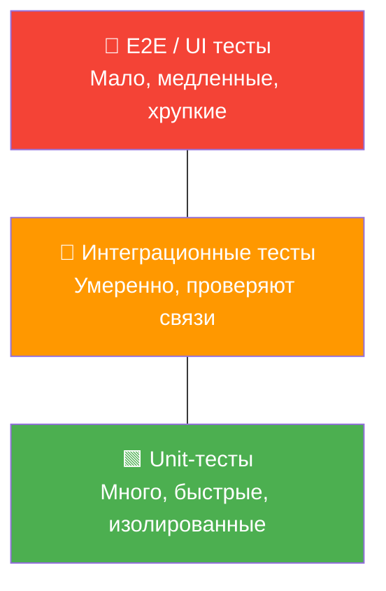
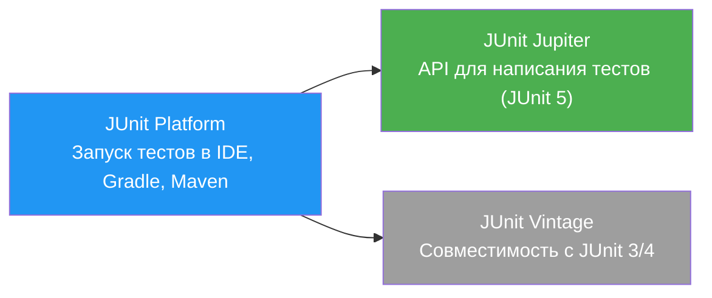
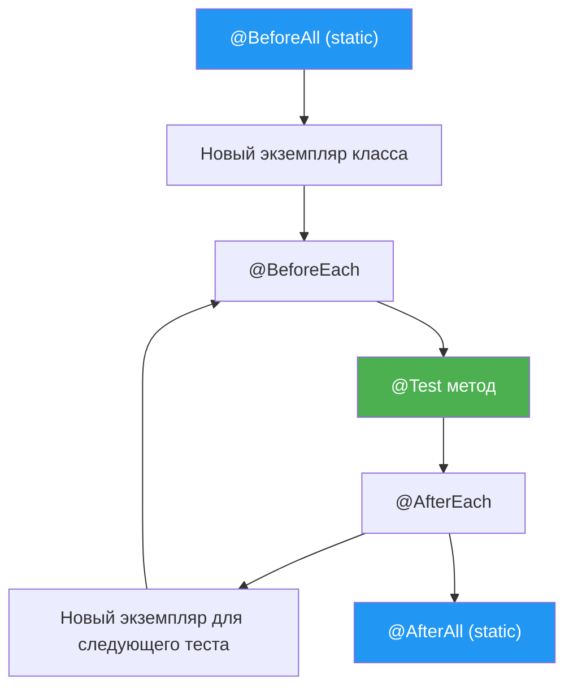
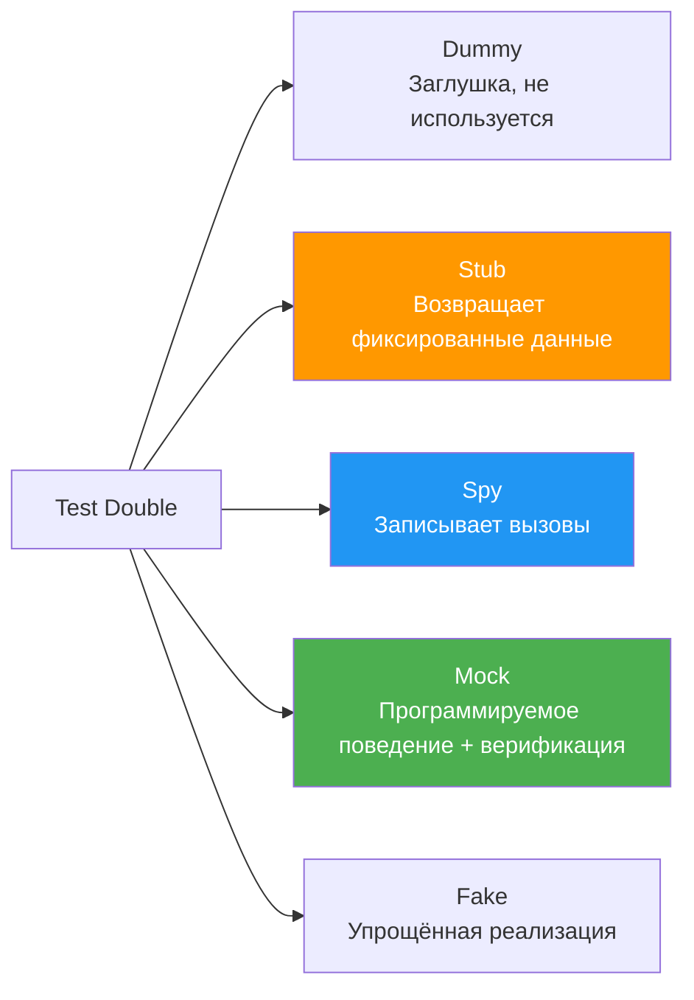

# Вопросы на собеседовании: `Unit Testing`

Краткие ответы по `Unit Testing`: изолированные проверки бизнес-логики, работа с `JUnit 5`, `Mockito`, `AssertJ`, `TDD` и поддерживаемая структура unit-тестов.

**Unit-тестирование** — фундамент пирамиды тестирования. Этот документ охватывает все аспекты написания быстрых и изолированных тестов без реальной инфраструктуры: от базовых `assertions` до продвинутых техник мокирования и параметризации.

## Роль документа в связке testing

- Этот файл отвечает за **unit-уровень**: отдельные классы/методы, моки и контракт поведения компонента.
- За проверку интеграции с БД, брокерами и внешними API отвечают [Integration Testing](integration-testing-interview.md).
- За общую стратегию покрытия и приоритизацию тестов отвечает [Стратегии тестирования](test-strategies-interview.md).
- За масштабирование автотестов в CI/CD и поддержку framework отвечает [Test Automation](test-automation-interview.md).

## Полезные ссылки

### Официальная документация

- [JUnit 5 User Guide](https://junit.org/junit5/docs/current/user-guide/) — полная документация JUnit 5
- [Mockito Documentation](https://javadoc.io/doc/org.mockito/mockito-core/latest/org/mockito/Mockito.html) — Javadoc Mockito
- [AssertJ Documentation](https://assertj.github.io/doc/) — fluent assertions для Java
- [Baeldung: Best Practices for Unit Testing in Java](https://www.baeldung.com/java-unit-testing-best-practices) — практические рекомендации
- [Baeldung: Guide to JUnit 5 Parameterized Tests](https://www.baeldung.com/parameterized-tests-junit-5) — параметризованные тесты
- [Baeldung: Mockito and JUnit 5](https://www.baeldung.com/mockito-junit-5-extension) — интеграция Mockito с JUnit 5
- [Testing Pyramid (Martin Fowler)](https://martinfowler.com/articles/practical-test-pyramid.html) — пирамида тестирования
- [TDD (Martin Fowler)](https://martinfowler.com/bliki/TestDrivenDevelopment.html) — Test-Driven Development

## Содержание

- [Полезные ссылки](#полезные-ссылки)
- [See also](#see-also)

**Основы Unit Testing**
- [Q1. (!) Что такое unit testing и зачем он нужен?](#q1--что-такое-unit-testing-и-зачем-он-нужен)
- [Q2. (!) Какие основные принципы unit testing (F.I.R.S.T)?](#q2--какие-основные-принципы-unit-testing-first)
- [Q3. Что такое пирамида тестирования?](#q3-что-такое-пирамида-тестирования)
- [Q4. (!) Как работает JUnit 5 и из чего он состоит?](#q4--как-работает-junit-5-и-из-чего-он-состоит)
- [Q5. Каков жизненный цикл теста в JUnit 5?](#q5-каков-жизненный-цикл-теста-в-junit-5)

**Assertions и проверки**
- [Q6. (!) Какие assertions доступны в JUnit 5?](#q6--какие-assertions-доступны-в-junit-5)
- [Q7. (!) Что такое AssertJ и чем он лучше стандартных assertions?](#q7--что-такое-assertj-и-чем-он-лучше-стандартных-assertions)
- [Q8. Что такое AssertJ soft assertions?](#q8-что-такое-assertj-soft-assertions)
- [Q9. Как тестировать исключения?](#q9-как-тестировать-исключения)

**Mocking и test doubles**
- [Q10. (!) Что такое test doubles (mock, stub, spy, fake)?](#q10--что-такое-test-doubles-mock-stub-spy-fake)
- [Q11. (!) Как использовать Mockito?](#q11--как-использовать-mockito)
- [Q12. Как работает ArgumentCaptor в Mockito?](#q12-как-работает-argumentcaptor-в-mockito)
- [Q13. Чем отличается Mock от Spy в Mockito?](#q13-чем-отличается-mock-от-spy-в-mockito)
- [Q14. Как тестировать статические методы?](#q14-как-тестировать-статические-методы)
- [Q15. Что такое BDD-стиль тестирования с Mockito?](#q15-что-такое-bdd-стиль-тестирования-с-mockito)
- [Q16. (!) Как правильно использовать @InjectMocks?](#q16--как-правильно-использовать-injectmocks)

**TDD и методологии**
- [Q17. (!) Что такое TDD (Test-Driven Development)?](#q17--что-такое-tdd-test-driven-development)
- [Q18. Чем TDD отличается от BDD?](#q18-чем-tdd-отличается-от-bdd)

**Параметризованные тесты**
- [Q19. (!) Что такое parameterized tests?](#q19--что-такое-parameterized-tests)
- [Q20. Как использовать @MethodSource и @CsvSource?](#q20-как-использовать-methodsource-и-csvsource)
- [Q21. Что такое @DynamicTest и когда использовать?](#q21-что-такое-dynamictest-и-когда-использовать)

**Структура и организация тестов**
- [Q22. (!) Как организовать структуру тестов?](#q22--как-организовать-структуру-тестов)
- [Q23. Что такое @Nested и зачем группировать тесты?](#q23-что-такое-nested-и-зачем-группировать-тесты)
- [Q24. Что такое test fixtures и test data builders?](#q24-что-такое-test-fixtures-и-test-data-builders)
- [Q25. Какие существуют конвенции именования тестов?](#q25-какие-существуют-конвенции-именования-тестов)
- [Q26. Как тестировать приватные методы?](#q26-как-тестировать-приватные-методы)

**Специальные сценарии**
- [Q27. Как тестировать асинхронный код (CompletableFuture)?](#q27-как-тестировать-асинхронный-код-completablefuture)
- [Q28. Как тестировать код с зависимостью от времени (Clock)?](#q28-как-тестировать-код-с-зависимостью-от-времени-clock)
- [Q29. Как тестировать Stream API и Optional?](#q29-как-тестировать-stream-api-и-optional)
- [Q30. Как тестировать многопоточный код?](#q30-как-тестировать-многопоточный-код)
- [Q31. Что такое @TempDir и зачем он нужен?](#q31-что-такое-tempdir-и-зачем-он-нужен)
- [Q32. Как тестировать логирование?](#q32-как-тестировать-логирование)
- [Q33. Как тестировать equals/hashCode/toString?](#q33-как-тестировать-equalshashcodetostring)

**Покрытие и качество**
- [Q34. (!) Как измерить покрытие кода (JaCoCo)?](#q34--как-измерить-покрытие-кода-jacoco)
- [Q35. Что такое mutation testing?](#q35-что-такое-mutation-testing)
- [Q36. Что такое @Tag и как фильтровать тесты?](#q36-что-такое-tag-и-как-фильтровать-тесты)
- [Q37. Что такое @RepeatedTest и @Timeout?](#q37-что-такое-repeatedtest-и-timeout)

**Продвинутые темы**
- [Q38. Как писать JUnit 5 Extensions?](#q38-как-писать-junit-5-extensions)
- [Q39. Как тестировать конструкторы и билдеры?](#q39-как-тестировать-конструкторы-и-билдеры)
- [Q40. (!) Best practices для unit-тестов?](#q40--best-practices-для-unit-тестов)

**Продвинутые возможности JUnit 5 и Mockito**
- [Q41. (!) Как работает @ExtendWith и когда писать собственный Extension?](#q41--как-работает-extendwith-и-когда-писать-собственный-extension)
- [Q42. (!) Что такое Mockito.STRICT_STUBS и зачем включать строгий режим?](#q42--что-такое-mockitostrict_stubs-и-зачем-включать-строгий-режим)
- [Q43. Как использовать @EnumSource и @ArgumentsSource в параметризованных тестах?](#q43-как-использовать-enumsource-и-argumentssource-в-параметризованных-тестах)
- [Q44. (!) Как выполнять рекурсивное сравнение объектов с AssertJ?](#q44--как-выполнять-рекурсивное-сравнение-объектов-с-assertj)
- [Q45. Как тестировать Spring-компоненты без поднятия контекста?](#q45-как-тестировать-spring-компоненты-без-поднятия-контекста)

## Q1. (!) Что такое `unit testing` и зачем он нужен?

`Unit testing` — это метод тестирования, при котором отдельные модули (`units`) кода тестируются **изолированно** от остальной системы. `Unit` — наименьший тестируемый компонент: отдельный метод, класс или группа тесно связанных функций.

### Зачем нужен `unit testing`?

| Цель | Описание |
|------|----------|
| Раннее обнаружение ошибок | Баги находятся до этапа интеграции, когда исправление дешевле |
| Упрощение рефакторинга | Тесты защищают от регрессий при изменении кода |
| Документация поведения | Тест показывает, **как** использовать класс и **что** он делает |
| Улучшение дизайна | Код, который сложно тестировать — сигнал плохого дизайна (tight coupling) |

```java
// Тест документирует поведение и защищает от регрессии
@Test
void shouldReturnEmptyListWhenNoItemsFound() {
    // Given
    ItemRepository repository = mock(ItemRepository.class);
    when(repository.findByCategory("books")).thenReturn(Collections.emptyList());
    ItemService service = new ItemService(repository);

    // When
    List<Item> items = service.findItemsByCategory("books");

    // Then
    assertThat(items).isEmpty();
}
```

На собеседовании важно подчеркнуть, что unit-тесты — это **инвестиция**: они замедляют начальную разработку, но экономят время на отладке, рефакторинге и онбординге новых разработчиков.


> [!mcq]
> - [ ] `Unit-тест` поднимает `Spring`-контекст с `H2` и проверяет полный пайплайн через REST | Это интеграционный тест: I/O, контейнер, медленный bootstrap. ❌ ПОСЛЕДСТВИЕ: pipeline 30 минут вместо 5, разработчик не запускает тесты локально, баги едут в `prod`.
> - [ ] `Unit-тест` обращается к реальной БД на dev-стенде через `@SpringBootTest` | Нарушает `F.I.R.S.T` (Independent, Repeatable): данные между тестами влияют друг на друга. ❌ ПОСЛЕДСТВИЕ: тест зелёный локально, флакающий в `CI` из-за гонки за shared `users` table.
> - [x] Изолированная проверка одного `unit` (метод/класс) с заглушенными зависимостями через `mock`/`stub` | `Unit` — наименьший тестируемый компонент; внешние коллабораторы заменяются `test doubles` для скорости и детерминизма. ✓ ПРИМЕНЯТЬ: `Mockito` + `JUnit 5` в `Spring Boot`-сервисах `Netflix`, где unit-suite на ~50K тестов проходит за 2 минуты. 📋 ПРАВИЛО: «Один unit, ноль I/O, миллисекунды». 🔗 См. Q2, Q3, Q10.
> - [ ] `Unit-тест` запускает реальный `Kafka` и проверяет публикацию события | Это интеграционный сценарий с `Testcontainers`, не unit. ❌ ПОСЛЕДСТВИЕ: `OOM` в `CI`-runner-е при параллельном запуске, `flaky` падения по `network timeout`.

## Q2. (!) Какие основные принципы `unit testing` (`F.I.R.S.T`)?

Акроним **F.I.R.S.T** описывает ключевые свойства хорошего unit-теста:

| Принцип | Описание |
|---------|----------|
| **F**ast | Тест выполняется за миллисекунды, без I/O и сети |
| **I**ndependent | Тесты не зависят друг от друга и могут запускаться в любом порядке |
| **R**epeatable | Один и тот же результат при каждом запуске, в любой среде |
| **S**elf-validating | Тест сам проверяет результат (`assert`), без ручного анализа |
| **T**horough | Покрывает основной путь, граничные случаи и ошибки |

### Паттерн `AAA` (`Arrange-Act-Assert`)

Каждый тест следует трёхступенчатой структуре:

```java
@Test
void shouldApplyPremiumDiscount() {
    // Arrange — подготовка
    User premiumUser = new User("premium@example.com", UserType.PREMIUM);
    Product product = new Product("Laptop", 1000.0);
    DiscountService service = new DiscountService();

    // Act — действие
    double finalPrice = service.applyDiscount(product, premiumUser);

    // Assert — проверка
    assertThat(finalPrice).isCloseTo(850.0, within(0.01)); // 15% скидка
}
```

Альтернатива — `Given-When-Then` (BDD-стиль), семантически идентичная AAA.


> [!mcq]
> - [ ] Fast, Integrated, Reliable, Stateful, Thorough | Подменяет `Independent` на `Integrated` — это противоречит сути unit-теста. ❌ ПОСЛЕДСТВИЕ: shared mutable state между `@Test` → flaky tests, fail только в `CI` с другим test ordering.
> - [x] Fast, Independent, Repeatable, Self-validating, Thorough | Тесты быстрые, независимые от порядка, повторяемые в любой среде, сами проверяют результат и покрывают граничные случаи. ✓ ПРИМЕНЯТЬ: `JUnit 5` сборки в `Booking.com` — 200K тестов выполняются за 7 минут на параллельных runner-ах благодаря `F.I.R.S.T`. 📋 ПРАВИЛО: «Fast → Independent → Repeatable → Self → Thorough». 🔗 См. Q1, Q3, Q40.
> - [ ] Functional, Integration, Regression, Smoke, Tracing | Это типы тестов в `QA`-таксономии, а не свойства unit-теста по Robert Martin. ❌ ПОСЛЕДСТВИЕ: команда называет интеграционные тесты unit-тестами, smoke-pipeline на каждом коммите вместо unit → 20-минутные `CI`-pipelines.
> - [ ] Fast, Isolated, Reusable, Stateless, Tested | `Reusable` и `Tested` не из `F.I.R.S.T` — это размытые качества кода. ❌ ПОСЛЕДСТВИЕ: разработчик считает тест с `Thread.sleep(1000)` «изолированным», `flaky` падения 5% билдов в `Jenkins`.

## Q3. Что такое пирамида тестирования?

**Пирамида тестирования** (Testing Pyramid, описана Mike Cohn) — модель, показывающая оптимальное соотношение типов тестов. Подробнее в [вопросах по стратегиям тестирования](test-strategies-interview.md).



| Уровень | Количество | Скорость | Стоимость поддержки |
|---------|-----------|----------|---------------------|
| `Unit` | 70-80% | Миллисекунды | Низкая |
| `Integration` | 15-20% | Секунды | Средняя |
| `E2E` | 5-10% | Минуты | Высокая |

Unit-тесты составляют основу пирамиды: их должно быть больше всего, они самые быстрые и самые дешёвые в поддержке.


> [!mcq]
> - [ ] Перевёрнутая пирамида: 70% `E2E`, 20% integration, 10% unit | `Selenium`/`Cypress` тесты дорогие в поддержке, медленные, хрупкие к UI-изменениям. ❌ ПОСЛЕДСТВИЕ: `ice-cream cone` антипаттерн — `regression`-suite 6 часов, релиз раз в неделю, 30% тестов flaky.
> - [ ] Равные доли: 33% unit, 33% integration, 33% `E2E` | Игнорирует разную стоимость поддержки и скорость обратной связи. ❌ ПОСЛЕДСТВИЕ: `E2E`-падения блокируют merge на 2 часа из-за UI-flake, тогда как unit нашёл бы регресс за 30 секунд.
> - [ ] Только unit-тесты, integration и `E2E` не нужны | Unit не ловит контракты между сервисами и реальные SQL-запросы. ❌ ПОСЛЕДСТВИЕ: `JPA`-баг с `LazyInitializationException` доходит до `prod`, hibernate-mapping сломан, но unit все зелёные.
> - [x] 70-80% unit, 15-20% integration, 5-10% `E2E` (Mike Cohn) | Много дешёвых быстрых unit внизу, меньше среднеуровневых integration, минимум медленных `E2E`. ✓ ПРИМЕНЯТЬ: `Spotify` engineering culture — unit-suite на каждый PR (5 мин), integration на merge (15 мин), `E2E` только на release-candidate. 📋 ПРАВИЛО: «Дёшево внизу, дорого наверху». 🔗 См. Q1, Q2, Q36.

## Q4. (!) Как работает `JUnit 5` и из чего он состоит?

`JUnit 5` — фреймворк для тестирования `Java`-приложений, состоящий из трёх модулей:



### Основные аннотации

```java
import org.junit.jupiter.api.*;
import static org.junit.jupiter.api.Assertions.*;

class CalculatorTest {

    private Calculator calculator;

    @BeforeAll
    static void initAll() {
        // Один раз перед всеми тестами класса (метод static)
    }

    @BeforeEach
    void setUp() {
        calculator = new Calculator(); // Перед каждым тестом
    }

    @Test
    @DisplayName("Сложение двух положительных чисел")
    void shouldAddTwoNumbers() {
        assertEquals(5, calculator.add(2, 3));
    }

    @Test
    @Disabled("Функциональность не реализована")
    void shouldHandleLargeNumbers() {
        fail("Not implemented");
    }

    @AfterEach
    void tearDown() {
        calculator = null; // После каждого теста
    }

    @AfterAll
    static void tearDownAll() {
        // Один раз после всех тестов класса
    }
}
```

### Ключевые отличия `JUnit 5` от `JUnit 4`

| Аспект | `JUnit 4` | `JUnit 5` |
|--------|-----------|-----------|
| Аннотации | `@Before`, `@After` | `@BeforeEach`, `@AfterEach` |
| Расширения | `@RunWith`, `@Rule` | `@ExtendWith` |
| Assertions | `assertThat` (Hamcrest) | `assertAll`, `assertThrows` |
| Параметризация | `@RunWith(Parameterized.class)` | `@ParameterizedTest` |
| Видимость методов | `public` обязателен | Можно `package-private` |


> [!mcq]
> - [ ] `JUnit 5` — это монолит, заменивший `JUnit 4`, без обратной совместимости | На самом деле `Vintage` запускает `JUnit 3/4` тесты на новой платформе. ❌ ПОСЛЕДСТВИЕ: миграция legacy-suite на 10K тестов блокируется на полгода, команда не может перейти на `@ParameterizedTest`.
> - [ ] `JUnit 5` состоит из одного модуля `junit-jupiter`, который заменяет `JUnit 4` целиком | Игнорирует `Platform` (запуск) и `Vintage` (legacy). ❌ ПОСЛЕДСТВИЕ: `IntelliJ IDEA` не запускает старые `@RunWith(Parameterized.class)` тесты — потеряно 2K покрытия.
> - [ ] `Platform` запускает только `Jupiter`-тесты, `JUnit 4` нужно мигрировать вручную | `Vintage` создан именно для запуска `JUnit 3/4` на новой `Platform`. ❌ ПОСЛЕДСТВИЕ: команда переписывает 5K старых тестов вручную вместо постепенной миграции, релиз отложен на квартал.
> - [x] `JUnit Platform` (запуск в `IDE`/`Gradle`) + `Jupiter` (новый API) + `Vintage` (запуск `JUnit 3/4`) | Трёхмодульная архитектура позволяет запускать старые и новые тесты бок о бок на одной платформе. ✓ ПРИМЕНЯТЬ: `Spring Boot 3.x` использует `Jupiter` для новых тестов и `Vintage` для legacy `Spring Test 4.x` без переписывания. 📋 ПРАВИЛО: «Platform запускает, Jupiter пишет, Vintage совместим». 🔗 См. Q5, Q6, Q41.

## Q5. Каков жизненный цикл теста в `JUnit 5`?

По умолчанию `JUnit 5` создаёт **новый экземпляр** тестового класса для каждого тестового метода (`PER_METHOD`). Это гарантирует изоляцию между тестами.



Режим `@TestInstance(Lifecycle.PER_CLASS)` создаёт один экземпляр на весь класс. Это позволяет использовать нестатические `@BeforeAll`/`@AfterAll` и разделять состояние между тестами (с осторожностью):

```java
@TestInstance(TestInstance.Lifecycle.PER_CLASS)
class SharedStateTest {

    private final List<String> log = new ArrayList<>();

    @BeforeAll
    void initAll() { // Нестатический!
        log.add("init");
    }

    @Test
    void firstTest() {
        log.add("first");
        assertThat(log).containsExactly("init", "first");
    }
}
```


> [!mcq]
> - [ ] По умолчанию один экземпляр класса на весь `class` (`PER_CLASS`), новый при `PER_METHOD` | Реальный default — `PER_METHOD` (новый instance на каждый тест). ❌ ПОСЛЕДСТВИЕ: разработчик кладёт изменяемое поле в тестовый класс — shared mutable state между `@Test` → flaky tests, fail только в `CI` с другим test ordering.
> - [x] По умолчанию `PER_METHOD` (новый instance на каждый `@Test`); `@TestInstance(Lifecycle.PER_CLASS)` — один на класс | Изоляция через свежий instance гарантирует `Independent` из `F.I.R.S.T`. ✓ ПРИМЕНЯТЬ: `Spring Framework` тесты используют `PER_METHOD` для unit, `PER_CLASS` для дорогих fixture (`@Nested` test classes). 📋 ПРАВИЛО: «Один тест — один instance — ноль состояния». 🔗 См. Q2, Q23, Q24.
> - [ ] `@BeforeAll` в `PER_METHOD` режиме должен быть нестатическим | Наоборот: в `PER_METHOD` `@BeforeAll` обязан быть `static`. ❌ ПОСЛЕДСТВИЕ: `JUnitException: @BeforeAll method must be static` при сборке, build падает в `Jenkins` сразу после миграции с `JUnit 4`.
> - [ ] `@BeforeEach` вызывается один раз перед всеми тестами класса | Это поведение `@BeforeAll`, не `@BeforeEach`. ❌ ПОСЛЕДСТВИЕ: разработчик кладёт инициализацию мока в `@BeforeAll`, состояние мока загрязняется между тестами, верификация ловит лишние вызовы.

## Q6. (!) Какие `assertions` доступны в `JUnit 5`?

### Стандартные `JUnit 5 Assertions`

```java
import static org.junit.jupiter.api.Assertions.*;

@Test
void demonstrateAssertions() {
    // Базовые
    assertEquals(5, calculator.add(2, 3));
    assertNotEquals(6, calculator.add(2, 3));
    assertTrue(calculator.isPositive(5));
    assertFalse(calculator.isPositive(-1));
    assertNull(result);
    assertNotNull(result);

    // С сообщением об ошибке
    assertEquals(8, calculator.multiply(2, 4), "2 * 4 должно быть 8");

    // С дельтой для float/double
    assertEquals(3.14, calculator.getPi(), 0.01);

    // Группировка — выполняет ВСЕ проверки, даже если первая упала
    assertAll("Проверка пользователя",
        () -> assertEquals("John", user.getName()),
        () -> assertEquals("john@mail.com", user.getEmail()),
        () -> assertTrue(user.isActive())
    );

    // Проверка исключений
    var ex = assertThrows(IllegalArgumentException.class,
        () -> calculator.divide(10, 0));
    assertEquals("Division by zero", ex.getMessage());

    // Таймаут
    assertTimeout(Duration.ofMillis(100), () -> service.fastOperation());
}
```

`assertAll` — ключевое отличие от `JUnit 4`: собирает **все** ошибки, а не останавливается на первой.


> [!mcq]
> - [ ] `assertEquals(actual, expected)` — порядок аргументов: actual, потом expected | Реальный порядок: `expected`, потом `actual`. ❌ ПОСЛЕДСТВИЕ: при падении сообщение `expected: 5 but was: 3` показывает данные наоборот, разработчик 30 минут ищет баг в проде вместо теста.
> - [ ] `assertThrows` падает, если код **не** бросил исключение, но не возвращает его | Возвращает пойманное исключение для дальнейших проверок. ❌ ПОСЛЕДСТВИЕ: разработчик не может проверить `getMessage()` или причину, тестируется только тип — баг с неправильным error code в `prod`.
> - [ ] `assertAll` останавливается на первой ошибке как `assertEquals` | Наоборот: собирает все ошибки в `MultipleFailuresError`. ❌ ПОСЛЕДСТВИЕ: разработчик отлаживает 5 циклов, исправляя по одному полю DTO вместо одного запуска с полным diff.
> - [x] `assertEquals/assertTrue/assertNull` + `assertAll` (группа), `assertThrows` (исключение), `assertTimeout` (таймаут) | `assertAll` собирает все падения сразу; `assertThrows` возвращает пойманное исключение для проверки `message`/`cause`. ✓ ПРИМЕНЯТЬ: `Spring Framework` test-suite использует `assertAll` для проверки нескольких полей `Bean` за один проход. 📋 ПРАВИЛО: «assertAll — все ошибки за один прогон». 🔗 См. Q5, Q7, Q9.

## Q7. (!) Что такое `AssertJ` и чем он лучше стандартных `assertions`?

`AssertJ` — fluent assertions библиотека, обеспечивающая читаемый код и информативные сообщения об ошибках. Это де-факто стандарт в Java-проектах.

```java
import static org.assertj.core.api.Assertions.*;

@Test
void shouldDemonstrateAssertJ() {
    // Строки
    assertThat(name)
        .isNotBlank()
        .startsWith("Jo")
        .hasSize(4);

    // Числа
    assertThat(price)
        .isPositive()
        .isGreaterThan(10.0)
        .isCloseTo(99.99, within(0.01));

    // Коллекции
    assertThat(users)
        .hasSize(3)
        .extracting(User::getName)
        .containsExactly("Alice", "Bob", "Charlie");

    // Optional
    assertThat(Optional.of("value"))
        .isPresent()
        .contains("value");

    // Исключения
    assertThatThrownBy(() -> service.process(null))
        .isInstanceOf(NullPointerException.class)
        .hasMessageContaining("must not be null");

    // Коллекция объектов — проверка по нескольким полям
    assertThat(orders)
        .filteredOn(Order::getStatus, OrderStatus.COMPLETED)
        .extracting(Order::getTotal, Order::getCustomer)
        .containsExactly(
            tuple(100.0, "Alice"),
            tuple(200.0, "Bob")
        );
}
```

### Преимущества `AssertJ` над стандартными `assertions`

| Аспект | `JUnit Assertions` | `AssertJ` |
|--------|---------------------|-----------|
| Синтаксис | `assertEquals(expected, actual)` | `assertThat(actual).isEqualTo(expected)` |
| IDE autocomplete | Нет | Полный (через цепочку вызовов) |
| Сообщения об ошибках | Базовые | Детальные (показывает diff) |
| Коллекции | `assertTrue(list.contains(x))` | `assertThat(list).contains(x).hasSize(3)` |
| Цепочки | Нет | Да — fluent API |


> [!mcq]
> - [x] Fluent-API библиотека (`assertThat(actual).isEqualTo(expected)`), цепочки проверок, детальные diff-сообщения | Цепочки на одном объекте + автодополнение в IDE для типа `actual`, читаемые сообщения с `expected`/`actual` diff. ✓ ПРИМЕНЯТЬ: `Spring Boot` testkit — `assertj-core` де-факто стандарт; используется в `quiz-app` для коллекций (`extracting`, `containsExactly`). 📋 ПРАВИЛО: «assertThat → fluent → ясный diff». 🔗 См. Q6, Q8, Q44.
> - [ ] `AssertJ` — это форк `Hamcrest`, идентичный по синтаксису | `Hamcrest` использует matchers (`is(equalTo(x))`), `AssertJ` — fluent цепочки. ❌ ПОСЛЕДСТВИЕ: команда мигрирует с `Hamcrest` на `AssertJ` через простой `find/replace`, 3K тестов компилируются, но падают на runtime.
> - [ ] `AssertJ` работает только с `JUnit 4`, для `JUnit 5` нужен `assertj-jupiter` | Работает с любым test-runner. ❌ ПОСЛЕДСТВИЕ: разработчик ищет несуществующий артефакт, тратит день на gradle-конфиг, в итоге переписывает на `JUnit 5 Assertions`.
> - [ ] `AssertJ` медленнее `JUnit Assertions` в 10× из-за reflection | На практике разница миллисекундная и незаметна в test-suite. ❌ ПОСЛЕДСТВИЕ: лид запрещает `AssertJ` ради «оптимизации», команда теряет читаемость и diff-сообщения, debug-time +30%.

## Q8. Что такое `AssertJ soft assertions`?

`SoftAssertions` позволяют собрать **все** ошибки из нескольких проверок и вывести их разом, вместо остановки на первой:

```java
@Test
void shouldValidateUserFields() {
    User user = userService.findById(1L);

    // Вариант 1: явный объект
    SoftAssertions softly = new SoftAssertions();
    softly.assertThat(user.getName()).isEqualTo("John");
    softly.assertThat(user.getEmail()).contains("@");
    softly.assertThat(user.getAge()).isBetween(18, 65);
    softly.assertAll(); // Бросит MultipleFailuresError со списком ВСЕХ ошибок

    // Вариант 2: статический метод (JUnit 5 + AssertJ)
    SoftAssertions.assertSoftly(soft -> {
        soft.assertThat(user.getName()).isEqualTo("John");
        soft.assertThat(user.getEmail()).contains("@");
        soft.assertThat(user.getAge()).isBetween(18, 65);
    });
}
```

Полезно при проверке нескольких полей DTO/entity — видно **все** несоответствия, а не только первое.


> [!mcq]
> - [ ] `SoftAssertions` отключают проверки и просто логируют ошибки | Они проверяют, но **накапливают** ошибки, бросая `MultipleFailuresError` в `assertAll()`. ❌ ПОСЛЕДСТВИЕ: разработчик думает, что тесты «мягкие» и игнорируют падения, в `prod` уезжает бракованный DTO с пустым `email`.
> - [ ] `SoftAssertions` блокируют параллельный запуск тестов | Никак не влияют на параллелизм; это локальная особенность одного теста. ❌ ПОСЛЕДСТВИЕ: команда отказывается от `soft assertions` ради «производительности», debug-time на проверку 10 полей DTO растёт в 5 раз.
> - [x] Накапливают ошибки нескольких `assertThat` и бросают `MultipleFailuresError` в `assertAll()`/`assertSoftly` | Полезно при проверке множества полей DTO/entity — видно все несоответствия за один прогон. ✓ ПРИМЕНЯТЬ: `Booking.com` тесты на DTO-маппинг используют `SoftAssertions` для проверки 20+ полей — debug-cycle сокращается с 20 минут до 1 минуты. 📋 ПРАВИЛО: «Soft — все падения за один прогон». 🔗 См. Q6, Q7, Q33.
> - [ ] `SoftAssertions` работают только в `JUnit 4` | Работают с любым test-framework, включая `JUnit 5`, `TestNG`, `Spock`. ❌ ПОСЛЕДСТВИЕ: команда переписывает 100 тестов на `assertAll()` из `JUnit 5` теряя `AssertJ`-цепочки и читаемость.

## Q9. Как тестировать исключения?

### `JUnit 5`: `assertThrows`

```java
@Test
void shouldThrowWithCorrectMessage() {
    var ex = assertThrows(IllegalArgumentException.class,
        () -> userService.createUser("", "password"));

    assertEquals("Username cannot be empty", ex.getMessage());
}
```

### `AssertJ`: `assertThatThrownBy`

```java
@Test
void shouldThrowCustomException() {
    assertThatThrownBy(() -> validator.validateEmail("invalid"))
        .isInstanceOf(ValidationException.class)
        .hasFieldOrPropertyWithValue("errorCode", "INVALID_EMAIL")
        .hasMessageContaining("Email format");
}
```

### С `Mockito`: имитация исключений от зависимости

```java
@Test
void shouldRetryOnTransientException() {
    when(externalService.call())
        .thenThrow(new TimeoutException("Temporary"))
        .thenReturn("success");

    String result = retryService.callWithRetry();

    assertEquals("success", result);
    verify(externalService, times(2)).call();
}
```

### `assertDoesNotThrow` — проверка отсутствия исключений

```java
@Test
void shouldHandleNullGracefully() {
    assertDoesNotThrow(() -> service.processOptionalData(null));
}
```


> [!mcq]
> - [ ] `try { service.call(); fail(); } catch (Exception e) { assertEquals("msg", e.getMessage()); }` | Старый `JUnit 3`-стиль: многословно, ловит лишний `Exception` (catch-all), не проверяет тип. ❌ ПОСЛЕДСТВИЕ: ловит `NullPointerException` из бага вместо ожидаемого `ValidationException`, тест зелёный — баг в `prod`.
> - [ ] `@Test(expected = IllegalArgumentException.class)` из `JUnit 4` | В `JUnit 5` этот атрибут удалён — нужно `assertThrows`. ❌ ПОСЛЕДСТВИЕ: после миграции тесты компилируются, но `expected` игнорируется, исключение никогда не проверяется — silent green.
> - [x] `assertThrows(Type.class, () -> code)` (`JUnit 5`) или `assertThatThrownBy(() -> code).isInstanceOf(...)` (`AssertJ`) | Возвращает пойманное исключение для проверки `getMessage()`, `getCause()`, custom-полей. ✓ ПРИМЕНЯТЬ: `Spring Framework` использует `assertThatThrownBy` с `hasMessageContaining` для проверки validation-error в `@RestControllerAdvice`. 📋 ПРАВИЛО: «assertThrows ловит, AssertJ проверяет message». 🔗 См. Q6, Q7, Q11.
> - [ ] `verify(mock).method()` в `Mockito` ловит исключения | `verify` проверяет вызовы, не исключения. ❌ ПОСЛЕДСТВИЕ: разработчик путает verification и assertion, исключение не ловится, `IllegalStateException` уходит в `prod`.

## Q10. (!) Что такое `test doubles` (`mock`, `stub`, `spy`, `fake`)?

`Test doubles` — объекты, заменяющие реальные зависимости в тестах. Термин введён Gerard Meszaros (xUnit Test Patterns).



| Тип | Описание | Пример | Когда использовать |
|-----|----------|--------|-------------------|
| **Dummy** | Передаётся, но не используется | `new Object()` как параметр | Заполнение обязательных параметров |
| **Stub** | Возвращает фиксированные данные | `when(repo.findAll()).thenReturn(list)` | Контроль входных данных |
| **Mock** | Поведение + верификация вызовов | `verify(service).sendEmail(...)` | Проверка взаимодействий |
| **Spy** | Обёртка реального объекта | `spy(new ArrayList<>())` | Частичное мокирование |
| **Fake** | Рабочая упрощённая реализация | `InMemoryRepository` вместо JDBC | Сложная логика без инфраструктуры |

На собеседовании часто спрашивают: «Когда `mock`, а когда `stub`?» Ответ: `mock` — когда важно **что вызвали** (поведение), `stub` — когда важно **что вернули** (состояние). Подробнее про мокирование в [интеграционных тестах](integration-testing-interview.md).


> [!mcq]
> - [ ] `Mock` — возвращает фиксированные данные (важно состояние); `Stub` — проверяет вызовы (важно поведение) | Перепутано: `Stub` про state, `Mock` про behaviour verification. ❌ ПОСЛЕДСТВИЕ: разработчик пишет `verify(stub).called()` на stub, тесты не ловят отсутствие вызовов — `email`-сервис не дёргается, регистрация молча ломается.
> - [ ] `Fake` — заглушка, не используется; `Dummy` — упрощённая работающая реализация | Перепутано: `Dummy` — заглушка, `Fake` — рабочая упрощённая реализация (`InMemoryRepository`). ❌ ПОСЛЕДСТВИЕ: команда называет `H2` «dummy» вместо `fake`, новые разработчики путают терминологию, code-review застревает на спорах.
> - [ ] `Spy` — это `mock` без реального объекта | `Spy` — обёртка вокруг **реального** объекта; `mock` — без реального объекта. ❌ ПОСЛЕДСТВИЕ: разработчик использует `spy(SomeClass.class)` без instance — `NullPointerException` при первом вызове реального метода.
> - [x] `Dummy` (заглушка), `Stub` (фикс. данные — state), `Mock` (поведение + verify), `Spy` (обёртка реального), `Fake` (рабочая упрощённая) | Терминология Gerard Meszaros (`xUnit Test Patterns`); `mock` про behaviour verification, `stub` про state. ✓ ПРИМЕНЯТЬ: `LinkedIn` использует `InMemoryRepository` (fake) для бизнес-логики, `Mockito` mocks для проверки контракта вызовов. 📋 ПРАВИЛО: «Stub отвечает, Mock проверяет, Fake работает». 🔗 См. Q11, Q13, Q24.

## Q11. (!) Как использовать `Mockito`?

`Mockito` — наиболее популярный фреймворк для создания `mock` и `stub` объектов в `Java`.

### Подключение к `JUnit 5`

```java
@ExtendWith(MockitoExtension.class)
class UserServiceTest {

    @Mock
    private UserRepository userRepository;

    @Mock
    private EmailService emailService;

    @InjectMocks
    private UserService userService;
```

### Stubbing — настройка возвращаемых значений

```java
    @Test
    void shouldReturnUserWhenFound() {
        User expected = new User("john@example.com");
        when(userRepository.findById(1L)).thenReturn(Optional.of(expected));

        Optional<User> result = userService.findById(1L);

        assertThat(result).isPresent().contains(expected);
    }
```

### Verification — проверка вызовов

```java
    @Test
    void shouldSaveAndSendWelcomeEmail() {
        User user = new User("john@example.com");
        when(userRepository.save(any(User.class))).thenReturn(user);

        userService.registerUser("john@example.com", "password");

        verify(userRepository).save(any(User.class));
        verify(emailService).sendWelcomeEmail("john@example.com");
        verify(emailService, never()).sendPasswordResetEmail(anyString());
    }
```

### Void-методы

```java
    @Test
    void shouldHandleVoidMethodException() {
        doThrow(new RuntimeException("SMTP down"))
            .when(emailService).sendWelcomeEmail("problem@mail.com");

        doNothing().when(emailService).sendWelcomeEmail("ok@mail.com");
    }
```

### `Argument Matchers`

```java
    @Test
    void shouldUseMatchers() {
        when(userRepository.findByEmail(anyString()))
            .thenReturn(Optional.of(new User()));
        when(userRepository.findById(eq(1L)))
            .thenReturn(Optional.of(new User()));

        // ВАЖНО: нельзя смешивать matchers и конкретные значения
        // verify(repo).save(eq(user), anyString()); — OK
        // verify(repo).save(user, anyString()); — ошибка!
    }
}
```


> [!mcq]
> - [ ] `verify(repo).save(eq(user), anyString())` — можно смешивать matchers и конкретные значения без `eq()` | Нельзя: либо все matchers, либо все значения. Без `eq()` будет `InvalidUseOfMatchersException`. ❌ ПОСЛЕДСТВИЕ: тесты падают на runtime после рефакторинга, разработчик 2 часа ищет «странные ошибки `Mockito`».
> - [x] `@ExtendWith(MockitoExtension.class)` + `@Mock`/`@InjectMocks`; stubbing через `when(...).thenReturn(...)`, verify через `verify(mock).method()` | Стандартная связка с `JUnit 5`; matchers (`any()`, `eq()`) либо все, либо никто. ✓ ПРИМЕНЯТЬ: `quiz-app` `SpacedRepetitionServiceTest` использует `@Mock` для `QuestionRepository` + `verify` для проверки сохранения сессии. 📋 ПРАВИЛО: «Mock + Stub + Verify — три кита Mockito». 🔗 См. Q10, Q12, Q16.
> - [ ] `Mockito.mock(Service.class)` нельзя использовать без `@ExtendWith(MockitoExtension.class)` | Можно: программный API работает без extension, просто без autoclose. ❌ ПОСЛЕДСТВИЕ: разработчик добавляет лишний extension к 200 тестам, конфликт с `@SpringBootTest`-extensions, build падает.
> - [ ] `when(mock.method()).thenReturn(x)` работает на `final` классах без дополнительной конфигурации | По умолчанию `Mockito` не мокирует `final` — нужен `mockito-inline` или `mock-maker-inline`. ❌ ПОСЛЕДСТВИЕ: mock final class без `MockMaker` config → `MockitoException` at runtime, тесты на `record`-классах массово падают.

## Q12. Как работает `ArgumentCaptor` в `Mockito`?

`ArgumentCaptor` позволяет **захватить** аргумент, переданный в метод мока, для последующей проверки. Полезно когда аргумент создаётся внутри тестируемого метода.

```java
@Test
void shouldCaptureCreatedUser() {
    ArgumentCaptor<User> captor = ArgumentCaptor.forClass(User.class);

    userService.createUser("john@example.com", "password");

    verify(userRepository).save(captor.capture());

    User captured = captor.getValue();
    assertThat(captured.getEmail()).isEqualTo("john@example.com");
    assertThat(captured.getCreatedAt()).isNotNull();
    assertThat(captured.getStatus()).isEqualTo(UserStatus.ACTIVE);
}
```

Начиная с `Mockito 4.6+`, можно использовать `@Captor` как параметр метода:

```java
@Test
void shouldCapture(@Captor ArgumentCaptor<User> captor) {
    userService.createUser("john@example.com", "pass");
    verify(userRepository).save(captor.capture());
    assertThat(captor.getValue().getEmail()).isEqualTo("john@example.com");
}
```

**Важно**: `ArgumentCaptor` следует использовать с `verify()`, а не с `when()`. Для stubbing лучше `ArgumentMatcher`.


> [!mcq]
> - [ ] `ArgumentCaptor` нужно использовать с `when(...)` для stubbing | Используется с `verify`, не с `when` — для stubbing есть `ArgumentMatcher`. ❌ ПОСЛЕДСТВИЕ: stubbing не срабатывает, mock возвращает default `null`, тест валится с `NullPointerException` в неожиданном месте.
> - [ ] `captor.getValue()` возвращает все захваченные аргументы как `List` | `getValue()` — последний вызов; для всех — `getAllValues()`. ❌ ПОСЛЕДСТВИЕ: при retry-логике с 3 вызовами проверяется только последний, баг с первым неправильным аргументом не детектится.
> - [x] Захватывает аргумент, переданный в mock-метод, для последующих проверок через `verify(mock).method(captor.capture())` | Полезно когда аргумент создаётся внутри тестируемого метода и недоступен снаружи. ✓ ПРИМЕНЯТЬ: `Spring Data JPA` тесты — captor захватывает entity, переданный в `repository.save()`, для проверки сгенерированных полей (`createdAt`, `id`). 📋 ПРАВИЛО: «Capture при verify, Match при stub». 🔗 См. Q11, Q13, Q15.
> - [ ] `ArgumentCaptor` работает только с примитивными типами | Работает с любым типом, включая generics через `forClass(Map.class)`. ❌ ПОСЛЕДСТВИЕ: разработчик пишет ручной `ArgumentMatcher` для DTO, 50 строк boilerplate, ломается при добавлении поля.

## Q13. Чем отличается `Mock` от `Spy` в `Mockito`?

| Аспект | `Mock` | `Spy` |
|--------|--------|-------|
| Создание | `mock(List.class)` | `spy(new ArrayList<>())` |
| Поведение по умолчанию | Все методы возвращают default (null/0/false) | Все методы вызывают **реальный** код |
| Когда мокировать | `when(mock.method()).thenReturn(...)` | `doReturn(...).when(spy).method()` |
| Применение | Полная замена зависимости | Частичное мокирование |

```java
@Test
void shouldDemonstrateSpy() {
    List<String> spy = spy(new ArrayList<>());

    spy.add("one");
    spy.add("two");
    assertEquals(2, spy.size()); // Реальный метод

    doReturn(100).when(spy).size(); // Перехват одного метода
    assertEquals(100, spy.size()); // Замоканный результат

    verify(spy).add("one"); // Верификация работает
}
```

**Подводный камень со `Spy`**: при использовании `when(spy.method()).thenReturn(...)` реальный метод **вызывается** при настройке stubbing. Поэтому для `spy` предпочтительнее `doReturn(...).when(spy).method()`.


> [!mcq]
> - [ ] `Mock` вызывает реальные методы, `Spy` — нет | Перепутано: `Spy` оборачивает реальный объект и вызывает реальные методы; `Mock` возвращает defaults. ❌ ПОСЛЕДСТВИЕ: разработчик путает `mock(List.class)` со `spy(new ArrayList<>())`, реальная коллекция не пополняется, тесты на сложение зелёные но `add` не работает.
> - [ ] `when(spy.method()).thenReturn(...)` безопасен и не вызывает реальный метод | На `Spy` это **вызовет** реальный метод при настройке — нужно `doReturn(...).when(spy).method()`. ❌ ПОСЛЕДСТВИЕ: реальный метод бросает `IOException` при stubbing, тест падает на setup-фазе с непонятной ошибкой.
> - [ ] `Spy` нельзя верифицировать через `verify()` | Можно: `verify(spy).add("x")` работает идентично mock. ❌ ПОСЛЕДСТВИЕ: разработчик пишет дополнительный mock рядом со spy для verification, 2× boilerplate, конфликты при инъекции.
> - [x] `Mock` — все методы возвращают default; `Spy` — обёртка реального объекта, методы вызывают реальный код, кроме явно застабленных через `doReturn().when(spy)` | Spy для частичного мокирования legacy-кода с большим количеством методов. ✓ ПРИМЕНЯТЬ: `Spring Framework` использует `@Spy` на `RestTemplate` для проверки HTTP-вызовов с реальной `URL`-сборкой. 📋 ПРАВИЛО: «Mock — пусто, Spy — реально, кроме стабов». 🔗 См. Q10, Q11, Q14.

## Q14. Как тестировать статические методы?

Начиная с `Mockito 3.4.0+` (с `mockito-inline`), статические методы можно мокировать через `MockedStatic`:

```java
@Test
void shouldMockStaticMethod() {
    try (MockedStatic<UUID> mockedUuid = mockStatic(UUID.class)) {
        UUID fixedUuid = UUID.fromString("12345678-1234-1234-1234-123456789012");
        mockedUuid.when(UUID::randomUUID).thenReturn(fixedUuid);

        String id = entityService.generateId();

        assertEquals("12345678-1234-1234-1234-123456789012", id);
    }
    // Вне try-with-resources статический мок автоматически снят
}
```

### Рекомендуемые альтернативы мокированию статики

1. **Не мокировать** — если метод чистый и детерминированный (`Math.abs`, `Collections.unmodifiableList`)
2. **Рефакторинг** — обернуть статический вызов в инстанс-метод и мокировать его:

```java
// Вместо прямого вызова UUID.randomUUID()
public class UuidGenerator {
    public UUID generate() {
        return UUID.randomUUID();
    }
}
// Теперь можно замокировать обычным mock(UuidGenerator.class)
```


> [!mcq]
> - [ ] `mockStatic(UUID.class)` без `try-with-resources` — мок останется на весь test-suite | Без `close()` мок утекает на следующие тесты в том же thread. ❌ ПОСЛЕДСТВИЕ: 50 последующих тестов в `CI` падают с непредсказуемыми UUID, разработчик чинит «flaky» 3 дня.
> - [ ] Только через `PowerMock` — `Mockito` не умеет статические методы | Начиная с `Mockito 3.4.0+` есть `mockStatic` с `mockito-inline`. ❌ ПОСЛЕДСТВИЕ: команда тащит legacy `PowerMock`, конфликты с `JUnit 5` extensions, build падает на upgrade `Java 17`.
> - [x] `Mockito.mockStatic(UUID.class)` в `try-with-resources` начиная с `Mockito 3.4.0+` (требует `mockito-inline`) | Альтернатива — рефакторинг: обернуть `UUID.randomUUID()` в инстанс-метод `UuidGenerator.generate()` и мокать его. ✓ ПРИМЕНЯТЬ: `quiz-app` тесты для генерации `sessionId` используют `UuidGenerator` через DI вместо `mockStatic`. 📋 ПРАВИЛО: «Лучше рефакторинг, чем mockStatic». 🔗 См. Q11, Q13, Q26.
> - [ ] `mockStatic` работает с любым `MockMaker` без дополнительной настройки | Требует `mockito-inline` (или `mockito-core 5.x+` с inline-default). ❌ ПОСЛЕДСТВИЕ: `MockitoException: Cannot mock static methods` на каждом тесте, локально работает, в `CI` падает.

## Q15. Что такое `BDD`-стиль тестирования с `Mockito`?

`BDD` (Behavior-Driven Development) использует термины `Given-When-Then` вместо `Arrange-Act-Assert`. `Mockito` предоставляет `BDDMockito` для более читаемого синтаксиса:

```java
import static org.mockito.BDDMockito.*;

@Test
void shouldCreateUserSuccessfully() {
    // Given
    User user = new User("john@example.com");
    given(userRepository.save(any(User.class))).willReturn(user);
    given(emailService.sendWelcomeEmail(anyString())).willReturn(true);

    // When
    User created = userService.createUser("john@example.com", "password");

    // Then
    assertThat(created.getEmail()).isEqualTo("john@example.com");
    then(userRepository).should().save(any(User.class));
    then(emailService).should().sendWelcomeEmail("john@example.com");
    then(emailService).should(never()).sendPasswordResetEmail(anyString());
}
```

| Стандартный стиль | BDD-стиль |
|-------------------|-----------|
| `when(...).thenReturn(...)` | `given(...).willReturn(...)` |
| `verify(mock).method()` | `then(mock).should().method()` |
| `doThrow(...).when(mock)` | `willThrow(...).given(mock)` |


> [!mcq]
> - [ ] `BDDMockito` — это альтернатива `Mockito` с другим engine | Это синтаксический сахар над `Mockito`, тот же engine. ❌ ПОСЛЕДСТВИЕ: команда тащит две библиотеки в classpath, конфликты версий, gradle build падает.
> - [x] Синонимы `given/willReturn/then` для `when/thenReturn/verify` для читаемости в стиле `Given-When-Then` | Семантически идентично, но читается как BDD-сценарий бизнес-аналитика. ✓ ПРИМЕНЯТЬ: `Cucumber`-step-definitions в `Wolt` order-pipeline тестах — `BDDMockito` совпадает с `Given-When-Then` сценарием по терминологии. 📋 ПРАВИЛО: «BDD — given/willReturn/then». 🔗 См. Q11, Q15, Q18.
> - [ ] `given().willReturn()` работает быстрее `when().thenReturn()` на 30% | Никакой разницы в производительности — это alias-методы. ❌ ПОСЛЕДСТВИЕ: команда массово рефакторит 5K тестов ради «оптимизации», теряет неделю, никаких метрик не меняется.
> - [ ] `BDDMockito` несовместим с `@Mock` и `@InjectMocks` | Полностью совместим — это просто другой синтаксис на том же mock. ❌ ПОСЛЕДСТВИЕ: разработчик пишет ручные `mock()` вместо `@Mock`, теряет автоинициализацию через `MockitoExtension`.

## Q16. (!) Как правильно использовать `@InjectMocks`?

`@InjectMocks` создаёт экземпляр тестируемого класса и инъектирует в него моки (`@Mock`/`@Spy`):

```java
@ExtendWith(MockitoExtension.class)
class OrderServiceTest {

    @Mock
    private OrderRepository orderRepository;

    @Mock
    private PaymentGateway paymentGateway;

    @Mock
    private NotificationService notificationService;

    @InjectMocks
    private OrderService orderService; // Все @Mock инъектируются сюда

    @Test
    void shouldProcessOrder() {
        when(paymentGateway.charge(any())).thenReturn(PaymentResult.SUCCESS);

        orderService.processOrder(new Order(100.0));

        verify(orderRepository).save(any(Order.class));
        verify(notificationService).sendConfirmation(any());
    }
}
```

### Подводные камни `@InjectMocks`

1. **Порядок инъекции** — `Mockito` инъектирует по типу; если два мока одного типа — поведение неопределённо
2. **Не инъектирует примитивы** — строки, числа и т.д. нужно задать вручную
3. **Конструктор или сеттеры** — `Mockito` пробует constructor injection, затем setter, затем field injection
4. **Не создаёт Spring context** — это не `@MockBean`, работает без Spring


> [!mcq]
> - [ ] `@InjectMocks` создаёт `Spring`-контекст и инъектирует `@MockBean` | Это `@MockBean`, а не `@InjectMocks`; `@InjectMocks` работает без Spring. ❌ ПОСЛЕДСТВИЕ: разработчик ждёт DI-magic от Spring, бины не инициализируются, `NullPointerException` на первом вызове.
> - [ ] `@InjectMocks` инъектирует только через field-injection | Пробует constructor → setter → field в этом порядке. ❌ ПОСЛЕДСТВИЕ: команда оставляет `@Autowired` на полях ради `@InjectMocks`, теряет immutability и testability через constructor injection.
> - [x] Создаёт реальный экземпляр класса и инъектирует все `@Mock`/`@Spy` через constructor → setter → field | Не создаёт Spring-контекст; не инъектирует примитивы и `String`. ✓ ПРИМЕНЯТЬ: `quiz-app` `AIQuestionServiceTest` — `@InjectMocks AIQuestionService` с `@Mock AiQuestionClient` через constructor. 📋 ПРАВИЛО: «Constructor first, then setter, then field». 🔗 См. Q10, Q11, Q41.
> - [ ] Если у класса два мока одного типа, `@InjectMocks` инъектирует оба корректно | Поведение неопределённо: `Mockito` инъектирует «какой-то» из них. ❌ ПОСЛЕДСТВИЕ: разработчик добавляет второй `@Mock OrderRepository` с другим scope, тест берёт случайный мок, `verify()` падает на «не вызывался».

## Q17. (!) Что такое `TDD` (Test-Driven Development)?

`TDD` — методология разработки, при которой тесты пишутся **перед** кодом. Цикл **Red-Green-Refactor**:


### Пример цикла `TDD`

**1. RED** — написать тест для ещё не реализованной функциональности:

```java
@Test
void shouldCalculateFactorial() {
    Calculator calc = new Calculator();
    assertEquals(1, calc.factorial(0));
    assertEquals(1, calc.factorial(1));
    assertEquals(6, calc.factorial(3));
    assertEquals(24, calc.factorial(4));
}
```

**2. GREEN** — минимальный код для прохождения теста:

```java
public int factorial(int n) {
    if (n <= 1) return 1;
    return n * factorial(n - 1);
}
```

**3. REFACTOR** — улучшить код, сохраняя зелёные тесты:

```java
public int factorial(int n) {
    if (n < 0) throw new IllegalArgumentException("n must be >= 0");
    int result = 1;
    for (int i = 2; i <= n; i++) {
        result *= i;
    }
    return result;
}
```

### Преимущества `TDD`

- Код тестируем **by design** (дизайн через тестируемость)
- 100% покрытие бизнес-логики — каждая строка кода написана ради теста
- Тесты — живая документация

### Когда `TDD` не подходит

- Прототипы и исследовательский код
- UI-логика с частыми изменениями дизайна
- Код с тяжёлыми внешними зависимостями (проще интеграционные тесты)


> [!mcq]
> - [ ] `Test-Driven Deployment`: писать deployment-скрипты до кода | Это про разработку, не deployment. ❌ ПОСЛЕДСТВИЕ: команда пишет terraform-тесты вместо unit-тестов, бизнес-логика без покрытия, баги в `prod`.
> - [ ] Сначала весь код, потом все тесты в конце спринта | Это antipattern «test-after development»; теряется design-feedback от тестов. ❌ ПОСЛЕДСТВИЕ: implementation-coupled тесты — каждый рефакторинг ломает 100+ тестов; разработчик удаляет тесты вместо рефакторинга.
> - [ ] Red → Refactor → Green: сначала падающий тест, потом рефакторинг, потом реализация | Перепутан порядок: правильно `Red → Green → Refactor`. ❌ ПОСЛЕДСТВИЕ: рефакторинг без зелёных тестов разламывает поведение, регресс уезжает в `prod`.
> - [x] Цикл `Red → Green → Refactor`: падающий тест → минимальная реализация → улучшение кода с зелёными тестами | Тесты пишутся **перед** кодом; design-by-tests гарантирует тестируемость и 100% покрытие бизнес-логики. ✓ ПРИМЕНЯТЬ: `Kent Beck` ввёл `TDD` в `Smalltalk`-проектах; `Spring Framework` core-команда использует `TDD` для bug-fixes (failing test первым в коммите). 📋 ПРАВИЛО: «Red, Green, Refactor — в этом порядке». 🔗 См. Q1, Q18, Q40.

## Q18. Чем `TDD` отличается от `BDD`?

| Аспект | `TDD` | `BDD` |
|--------|-------|-------|
| Фокус | Корректность реализации | Поведение с точки зрения бизнеса |
| Язык | Технический (assertEquals) | Доменный (Given-When-Then) |
| Аудитория | Разработчики | Разработчики + бизнес-аналитики |
| Инструменты | `JUnit`, `Mockito` | `Cucumber`, `Spock`, `JBehave` |
| Гранулярность | Метод/класс | Сценарий/фича |

```java
// TDD-стиль
@Test
void calculateDiscount_premiumUser_returns15Percent() {
    assertEquals(85.0, service.calculatePrice(100.0, UserType.PREMIUM), 0.01);
}

// BDD-стиль (с Mockito BDD)
@Test
void shouldApply15PercentDiscountForPremiumUsers() {
    // Given
    given(userService.getUserType(userId)).willReturn(UserType.PREMIUM);
    // When
    double price = pricingService.calculatePrice(100.0, userId);
    // Then
    assertThat(price).isEqualTo(85.0);
}
```


> [!mcq]
> - [ ] `TDD` использует доменный язык `Given-When-Then`, `BDD` — технический `assertEquals` | Перепутано: доменный — у `BDD`, технический — у `TDD`. ❌ ПОСЛЕДСТВИЕ: бизнес-аналитики не понимают `TDD`-тесты, не пишут acceptance-критериев, фичи едут с пропущенными edge cases.
> - [x] `TDD` фокусируется на корректности реализации (assertEquals), `BDD` — на поведении в доменных терминах (`Given-When-Then`, `Cucumber`) | `TDD` для разработчиков, `BDD` дополнительно для бизнес-аналитиков; гранулярность — метод vs сценарий. ✓ ПРИМЕНЯТЬ: `Booking.com` использует `TDD` для unit, `Cucumber` (`BDD`) для acceptance-тестов с feature-файлами от продактов. 📋 ПРАВИЛО: «TDD пишет код, BDD пишет фичу». 🔗 См. Q15, Q17, Q25.
> - [ ] `BDD` — это `TDD` без рефакторинга | `BDD` тоже включает refactor-фазу, отличие в гранулярности и языке. ❌ ПОСЛЕДСТВИЕ: команда отказывается от рефакторинга в `BDD`, accumulating tech debt, через год system unmaintainable.
> - [ ] `BDD` использует `JUnit`, `TDD` — `Cucumber` | Перепутано: `Cucumber`/`Spock`/`JBehave` — `BDD`-инструменты. ❌ ПОСЛЕДСТВИЕ: разработчик тащит `Cucumber` в unit-тесты, парсит Gherkin для тривиальной валидации, build slows down.

## Q19. (!) Что такое `parameterized tests`?

`Parameterized tests` позволяют запускать один и тот же тест с **разными наборами данных**, избегая дублирования кода. Требуют зависимость `junit-jupiter-params`.

### `@ValueSource` — простые значения

```java
@ParameterizedTest
@ValueSource(ints = {1, 2, 3, 4, 5})
void shouldReturnTrueForPositiveNumbers(int number) {
    assertTrue(calculator.isPositive(number));
}

@ParameterizedTest
@ValueSource(strings = {"", " ", "\t", "\n"})
void shouldDetectBlankStrings(String input) {
    assertTrue(StringUtils.isBlank(input));
}

@ParameterizedTest
@NullAndEmptySource // null + пустая строка
@ValueSource(strings = {" ", "\t"})
void shouldRejectInvalidInput(String input) {
    assertFalse(validator.isValid(input));
}
```

### `@EnumSource` — перебор enum-значений

```java
@ParameterizedTest
@EnumSource(value = OrderStatus.class, names = {"PENDING", "PROCESSING"})
void shouldAllowCancellation(OrderStatus status) {
    Order order = new Order(status);
    assertTrue(order.canCancel());
}

@ParameterizedTest
@EnumSource(value = OrderStatus.class, mode = EnumSource.Mode.EXCLUDE,
            names = {"DELIVERED", "CANCELLED"})
void shouldAllowModification(OrderStatus status) {
    Order order = new Order(status);
    assertTrue(order.canModify());
}
```


> [!mcq]
> - [ ] `@ParameterizedTest` работает только с `@ValueSource` примитивами | Поддерживает `@MethodSource`, `@CsvSource`, `@EnumSource`, `@ArgumentsSource`, `@CsvFileSource`. ❌ ПОСЛЕДСТВИЕ: разработчик копипастит 20 тестов с `@Test`, при изменении логики приходится менять 20 мест, рефакторинг застревает.
> - [x] `@ParameterizedTest` запускает один метод с разными наборами данных через `@ValueSource`/`@MethodSource`/`@CsvSource`/`@EnumSource` (нужен `junit-jupiter-params`) | Избегает дублирования — один шаблон теста, N data-sets. ✓ ПРИМЕНЯТЬ: `Spring Validation` test-suite — один `@ParameterizedTest` проверяет 50 email-форматов через `@CsvSource`. 📋 ПРАВИЛО: «Один тест — N наборов данных». 🔗 См. Q20, Q21, Q43.
> - [ ] Параметризованные тесты медленнее обычных в 10× из-за reflection | Разница миллисекундная — `JUnit` кэширует resolver-ы. ❌ ПОСЛЕДСТВИЕ: команда пишет 50 повторяющихся `@Test` ради «производительности», suite растёт, дублирование боёрплейта 1000 строк.
> - [ ] `@ValueSource` поддерживает массивы объектов | Только примитивы (`int`, `long`, `double`, `String`, `Class`) — для объектов нужен `@MethodSource`. ❌ ПОСЛЕДСТВИЕ: разработчик пишет `@ValueSource(objects = ...)` — compile-error, коммит блокирует ревью.

## Q20. Как использовать `@MethodSource` и `@CsvSource`?

### `@MethodSource` — данные из метода

```java
@ParameterizedTest
@MethodSource("provideValidEmails")
void shouldAcceptValidEmails(String email, String domain) {
    assertThat(validator.isValidEmail(email)).isTrue();
    assertThat(validator.extractDomain(email)).isEqualTo(domain);
}

static Stream<Arguments> provideValidEmails() {
    return Stream.of(
        Arguments.of("user@example.com", "example.com"),
        Arguments.of("admin@company.org", "company.org"),
        Arguments.of("test+tag@gmail.com", "gmail.com")
    );
}
```

### `@CsvSource` — табличные данные

```java
@ParameterizedTest
@CsvSource(delimiter = '|', textBlock = """
    hello  | 3 | hellohellohello
    abc    | 2 | abcabc
    ''     | 5 | ''
    x      | 1 | x
    """)
void shouldRepeatString(String input, int times, String expected) {
    assertEquals(expected, StringUtils.repeat(input, times));
}
```

### `@CsvFileSource` — данные из файла

```java
@ParameterizedTest
@CsvFileSource(resources = "/test-data/users.csv", numLinesToSkip = 1)
void shouldValidateUserFromFile(String email, String password, boolean valid) {
    assertEquals(valid, validator.isValid(email, password));
}
```


> [!mcq]
> - [ ] `@MethodSource` метод должен быть нестатическим | По умолчанию — `static`; нестатический работает только с `@TestInstance(PER_CLASS)`. ❌ ПОСЛЕДСТВИЕ: `JUnitException` на `provideArguments`, тест не запускается, build падает после миграции.
> - [ ] `@CsvSource` поддерживает только числа | Поддерживает строки, числа, boolean — с автоматической конвертацией. ❌ ПОСЛЕДСТВИЕ: разработчик пишет ручной парсинг `String.split(",")` в `@MethodSource` ради CSV-синтаксиса, 30 строк boilerplate на тест.
> - [ ] `@CsvFileSource` работает только с absolute path | `resources = "/test-data/users.csv"` — relative от `src/test/resources`. ❌ ПОСЛЕДСТВИЕ: разработчик хардкодит `/Users/.../users.csv`, тесты падают в `CI` на Linux runner-е, всё переписывается.
> - [x] `@MethodSource("provideX")` — `Stream<Arguments>` из `static`-метода; `@CsvSource` — inline табличные данные с поддержкой `textBlock`; `@CsvFileSource` — данные из ресурса | `@CsvSource` для inline-малых наборов, `@MethodSource` для сложных объектов, `@CsvFileSource` для больших dataset-ов. ✓ ПРИМЕНЯТЬ: `Spring Boot` validation-tests используют `@CsvSource` с `textBlock` для 30 email-сценариев в одном тесте. 📋 ПРАВИЛО: «Inline → CsvSource, Объекты → MethodSource, Файл → CsvFileSource». 🔗 См. Q19, Q21, Q43.

## Q21. Что такое `@DynamicTest` и когда использовать?

`@TestFactory` генерирует тесты в **runtime** — полезно для data-driven сценариев с данными из внешнего источника:

```java
@TestFactory
Stream<DynamicTest> shouldValidateAllCountryCodes() {
    Map<String, String> countryCodes = Map.of(
        "RU", "Russia", "US", "United States", "DE", "Germany"
    );

    return countryCodes.entrySet().stream()
        .map(entry -> dynamicTest(
            "Код " + entry.getKey() + " → " + entry.getValue(),
            () -> {
                Country country = countryService.findByCode(entry.getKey());
                assertThat(country.getName()).isEqualTo(entry.getValue());
            }
        ));
}
```

**Отличие от `@ParameterizedTest`**: динамические тесты не поддерживают lifecycle callbacks (`@BeforeEach`/`@AfterEach`), но позволяют генерировать произвольную структуру тестов.


> [!mcq]
> - [ ] `@ParameterizedTest` с `@MethodSource` тоже генерирует тесты в runtime и поддерживает `@BeforeEach` | На самом деле `@DynamicTest` создаёт тесты программно через `Stream<DynamicTest>`, а `@ParameterizedTest` ограничен compile-time источниками. ❌ ПОСЛЕДСТВИЕ: разработчик вкладывает условную логику в `@MethodSource` и получает один общий fail вместо отдельного теста на каждый кейс.
> - [x] `@TestFactory` возвращает `Stream<DynamicTest>`, кейсы строятся в runtime по данным из БД/файла, lifecycle `@BeforeEach` не вызывается между ними | Подходит для data-driven сценариев с произвольной структурой. ✓ ПРИМЕНЯТЬ: контракт-тесты на справочник стран `ISO 3166` загружают коды из CSV и для каждой строки строят отдельный `DynamicTest`. 📋 ПРАВИЛО: «Runtime данные → @TestFactory, compile-time → @ParameterizedTest». 🔗 См. Q19, Q20, Q43.
> - [ ] `@RepeatedTest(N)` идентичен `@TestFactory` — оба запускают тест N раз с разными данными | `@RepeatedTest` повторяет один и тот же тест без изменения входа, а `@TestFactory` строит уникальные кейсы. ❌ ПОСЛЕДСТВИЕ: команда заменяет параметризацию на `@RepeatedTest(50)` и теряет способность видеть, какой именно вход упал.
> - [ ] `DynamicTest` поддерживает `@BeforeEach`/`@AfterEach` так же, как обычные `@Test` | Динамические тесты не вызывают lifecycle callbacks между кейсами — это документированное ограничение JUnit 5. ❌ ПОСЛЕДСТВИЕ: setup, написанный в `@BeforeEach`, молча игнорируется и тесты делят грязное состояние, ломая F.I.R.S.T.

## Q22. (!) Как организовать структуру тестов?

### Структура проекта

```text
src/
├── main/java/com/example/
│   ├── domain/       User.java, Order.java
│   ├── service/      UserService.java, OrderService.java
│   └── repository/   UserRepository.java
└── test/java/com/example/
    ├── domain/        UserTest.java, OrderTest.java
    ├── service/       UserServiceTest.java, OrderServiceTest.java
    ├── repository/    UserRepositoryTest.java
    └── testutil/      TestUserBuilder.java, TestOrderFactory.java
```

### Правила организации

1. **Пакет теста = пакет продуктового кода** — доступ к `package-private` методам
2. **Один тестовый класс на один продуктовый класс** (обычно)
3. **Test utilities** — билдеры, фабрики, вспомогательные классы в отдельном пакете `testutil`
4. **Никакого production-кода в тестовой директории**

```java
// Использование @Nested для группировки внутри класса
@ExtendWith(MockitoExtension.class)
class UserServiceTest {

    @Mock UserRepository repository;
    @InjectMocks UserService service;

    @Nested
    class CreateUser {
        @Test void shouldCreateWithValidData() { /* ... */ }
        @Test void shouldRejectDuplicateEmail() { /* ... */ }
    }

    @Nested
    class FindUser {
        @Test void shouldReturnUserById() { /* ... */ }
        @Test void shouldReturnEmptyForNonExistentId() { /* ... */ }
    }
}
```


> [!mcq]
> - [ ] Хранить тесты в отдельном модуле `tests/` с собственным root-пакетом, отличным от продуктового кода | При другом пакете теряется доступ к `package-private` методам и приходится повышать видимость до `public` ради тестов. ❌ ПОСЛЕДСТВИЕ: команда открывает внутренние методы `public` ради unit-теста, чужой код начинает их вызывать, рефакторинг ломает API клиентов.
> - [ ] Один общий `AllTests.java` с инициализацией всех зависимостей через `@BeforeAll` static-полей | Общие static-поля делят состояние между классами тестов и провоцируют flaky-tests при параллельном запуске. ❌ ПОСЛЕДСТВИЕ: тест зелёный локально, красный в CI с `-PmaxParallelForks=4`, неделя на поиск shared mutable state.
> - [ ] Производственный код держать в `src/test/java`, чтобы test-utils были рядом и собирались вместе | Production-код в `test/` не попадает в jar и при выкатке падает `ClassNotFoundException`. ❌ ПОСЛЕДСТВИЕ: фабрика, случайно положенная в test source set, исчезает из артефакта, прод стартует с `NoClassDefFoundError`.
> - [x] `src/test/java` зеркалирует `src/main/java` по пакетам, один тестовый класс на один продуктовый, билдеры лежат в `testutil` | Совпадение пакетов даёт доступ к `package-private` без ослабления видимости, отдельный `testutil` изолирует фикстуры. ✓ ПРИМЕНЯТЬ: проект `Spring Boot` использует Maven Surefire с зеркальной структурой, билдеры `TestUserBuilder` лежат в `src/test/java/.../testutil`. 📋 ПРАВИЛО: «Зеркало пакетов + testutil рядом, не в main». 🔗 См. Q1, Q2, Q23.

## Q23. Что такое `@Nested` и зачем группировать тесты?

`@Nested` — вложенный тестовый класс в `JUnit 5`. Каждый `@Nested` класс может иметь свои `@BeforeEach`/`@AfterEach`, наследуя контекст внешнего класса:

```java
@DisplayName("Calculator")
class CalculatorTest {

    private Calculator calculator;

    @BeforeEach
    void setUp() {
        calculator = new Calculator();
    }

    @Nested
    @DisplayName("Сложение")
    class Addition {
        @Test void shouldAddPositives() {
            assertEquals(5, calculator.add(2, 3));
        }

        @Test void shouldAddNegatives() {
            assertEquals(-5, calculator.add(-2, -3));
        }

        @Nested
        @DisplayName("С нулём")
        class WithZero {
            @Test void shouldReturnSameNumber() {
                assertEquals(5, calculator.add(5, 0));
            }
        }
    }

    @Nested
    @DisplayName("Деление")
    class Division {
        @Test void shouldDivide() {
            assertEquals(2.5, calculator.divide(5, 2));
        }

        @Test void shouldThrowOnDivisionByZero() {
            assertThrows(ArithmeticException.class,
                () -> calculator.divide(5, 0));
        }
    }
}
```

В IDE это даёт иерархическое отображение тестов — улучшает навигацию и читаемость.


> [!mcq]
> - [ ] `@Nested` объединяет тесты в один файл, чтобы делить общие `@Mock`-поля без `@BeforeEach` инициализации | Сама вложенность не отменяет `@ExtendWith(MockitoExtension.class)` — моки нужно объявить на внешнем классе. ❌ ПОСЛЕДСТВИЕ: junior-разработчик объявляет моки на `@Nested` без `static`-ограничений, получает `NullPointerException` на каждый `when()`.
> - [ ] `@Nested` нужен только для `@DisplayName` — это косметика для отчётов и не влияет на структуру тестов | Иерархия влияет на отчётность IDE/JUnit Platform: вложенные тесты группируются и читаются как сценарий, а `@DisplayName` — лишь подпись. ❌ ПОСЛЕДСТВИЕ: команда отказывается от `@Nested`, тесты в одном `flat`-классе превращаются в 80 методов без структуры, навигация проседает.
> - [x] `@Nested` создаёт вложенный non-static класс с собственными `@BeforeEach`/`@AfterEach`, наследует контекст внешнего класса и группирует сценарии | Каждая вложенная группа изолирует setup конкретного use-case. ✓ ПРИМЕНЯТЬ: `Spring`-сервисы тестируются через `@Nested class CreateUser` / `@Nested class FindUser` для разделения CRUD-операций. 📋 ПРАВИЛО: «Один use-case = один @Nested класс с собственным setup». 🔗 См. Q5, Q22, Q25.
> - [ ] `@Nested` требует `static`-модификатора для корректной работы JUnit 5 Engine | Наоборот: вложенный класс должен быть **non-static**, иначе JUnit Platform не сможет получить ссылку на enclosing instance. ❌ ПОСЛЕДСТВИЕ: разработчик ставит `static` по привычке от JUnit 4, JUnit 5 молча пропускает класс — 0 тестов в отчёте, фейлы не видны.

## Q24. Что такое `test fixtures` и `test data builders`?

### `Test fixture` — подготовка состояния

`@BeforeEach` настраивает общее состояние для всех тестов в классе:

```java
class OrderServiceTest {
    private OrderService service;
    private User testUser;

    @BeforeEach
    void setUp() {
        service = new OrderService(mock(OrderRepository.class));
        testUser = new User("test@mail.com", UserType.REGULAR);
    }
}
```

### `Test Data Builder` — паттерн для создания объектов

```java
public class TestUserBuilder {
    private String email = "default@example.com";
    private String name = "John Doe";
    private UserStatus status = UserStatus.ACTIVE;

    public TestUserBuilder email(String email) { this.email = email; return this; }
    public TestUserBuilder name(String name) { this.name = name; return this; }
    public TestUserBuilder inactive() { this.status = UserStatus.INACTIVE; return this; }

    public User build() {
        User user = new User(email, name);
        user.setStatus(status);
        return user;
    }

    public static TestUserBuilder aUser() { return new TestUserBuilder(); }
}

// Использование
@Test
void shouldDeactivateUser() {
    User user = aUser().email("john@mail.com").build();
    service.deactivate(user);
    assertThat(user.getStatus()).isEqualTo(UserStatus.INACTIVE);
}
```

Альтернативы: библиотеки `Instancio`, `EasyRandom` для автоматической генерации тестовых данных.


> [!mcq]
> - [ ] Создавать готовый объект `new User("John", "j@m.com", ACTIVE)` напрямую в каждом тесте без билдера | Прямой конструктор привязывает тест к порядку и числу аргументов: добавили поле — нужно править 100 тестов. ❌ ПОСЛЕДСТВИЕ: добавление поля `phoneNumber` в `User` ломает 200 тестов одновременно, PR блокируется на день рефакторинга.
> - [x] `Test data builder` — flunet API с дефолтами и chained-сеттерами (`aUser().email(...).build()`), фикстура — общий setup в `@BeforeEach` | Билдер инкапсулирует валидные дефолты и переопределяет только релевантные для теста поля. ✓ ПРИМЕНЯТЬ: `OrderServiceTest` использует `aUser().withRole(ADMIN).build()` для каждого сценария, при добавлении поля правится только билдер. 📋 ПРАВИЛО: «Builder + дефолты vs прямой конструктор: один источник правды». 🔗 См. Q22, Q25, Q39.
> - [ ] Хранить десериализованные JSON-фикстуры из `src/test/resources/*.json` для всех unit-тестов | Внешние JSON-файлы скрывают данные теста — читателю придётся открывать второй файл, чтобы понять вход. ❌ ПОСЛЕДСТВИЕ: PR-review занимает в 3 раза дольше, потому что reviewer прыгает между Java и JSON, ломая контекст.
> - [ ] `@BeforeEach` с переиспользуемым static-полем `User commonUser`, изменяемым в тестах | Static-поле общее для всех методов класса, mutation одного теста ломает другой. ❌ ПОСЛЕДСТВИЕ: тест `shouldDeactivateUser` меняет `commonUser.status`, следующий тест видит чужое состояние, флак в CI.

## Q25. Какие существуют конвенции именования тестов?

| Стиль | Пример | Когда использовать |
|-------|--------|-------------------|
| `should...` | `shouldReturnEmptyList()` | Наиболее распространённый |
| `Method_Condition_Result` | `findById_NonExistent_ReturnsEmpty()` | Чёткая привязка к методу |
| `given_when_then` | `givenInactiveUser_whenLogin_thenThrows()` | BDD-стиль |
| `@DisplayName` | `@DisplayName("Должен вернуть пустой список")` | Русскоязычные описания |

```java
class UserServiceTest {
    // Стиль should
    @Test void shouldCreateUserWithValidData() { }
    @Test void shouldThrowWhenEmailIsDuplicate() { }

    // Стиль Method_Condition_Result
    @Test void createUser_DuplicateEmail_ThrowsException() { }
    @Test void findById_ExistingId_ReturnsUser() { }

    // Стиль с @DisplayName
    @Test
    @DisplayName("Должен отклонить пользователя с невалидным email")
    void rejectInvalidEmail() { }
}
```

Главное — **единообразие** в пределах проекта. Имя теста должно описывать **поведение**, а не реализацию.


> [!mcq]
> - [ ] Имена вида `test1()`, `test2()`, `testCreate()` достаточны — главное, чтобы тест работал | Безличные имена не описывают поведение, и при падении в CI отчёт не подсказывает, что сломалось. ❌ ПОСЛЕДСТВИЕ: алерт `test7 FAILED` в Jenkins требует открыть исходник и читать тело — MTTR на флак растёт с 2 до 20 минут.
> - [ ] Имя теста должно повторять название тестируемого метода, например, `createUser()` для `createUser` | Дубликат имени метода не отражает сценарий: `createUser` может проверять успех, дубль email или валидацию. ❌ ПОСЛЕДСТВИЕ: одинаковые имена `createUser` в трёх классах создают коллизию в Surefire-отчёте, фейл невозможно отличить.
> - [x] Имя описывает поведение: `should...`, `Method_Condition_Result`, `given_when_then` или `@DisplayName` — единообразно в проекте | Все четыре стиля акцентируют сценарий, а не имплементацию. ✓ ПРИМЕНЯТЬ: `Booking.com` использует `should...` для поиска, `given_when_then` — для платежей и `@DisplayName` — для русскоязычных бизнес-сценариев. 📋 ПРАВИЛО: «Имя теста = поведение, не имя метода». 🔗 См. Q15, Q24, Q40.
> - [ ] Имена тестов должны включать имя класса и порядковый номер: `UserServiceTest_001` | Номер отвлекает от смысла и устаревает при переупорядочивании. ❌ ПОСЛЕДСТВИЕ: PR удаляет тест #5, остальные не сдвигаются — `UserServiceTest_007` теряет смысл, ревью путается.

## Q26. Как тестировать приватные методы?

**Ответ**: обычно не нужно. Приватные методы тестируются **косвенно** через публичный API. Если приватный метод сложен — это сигнал к рефакторингу.

### Рекомендуемые подходы (по приоритету)

**1. Тестирование через публичные методы** (предпочтительно):

```java
@Test
void shouldCalculateTotalIncludingTax() {
    // Приватный calculateTax() тестируется косвенно
    BigDecimal total = calculator.calculateTotal(new BigDecimal("100"));
    assertEquals(new BigDecimal("120.00"), total); // 100 + 20% tax
}
```

**2. Выделение в отдельный класс** (если логика сложная):

```java
// Приватную логику вынести в TaxCalculator с публичным API
public class TaxCalculator {
    public BigDecimal calculate(BigDecimal amount) {
        return amount.multiply(new BigDecimal("0.20"));
    }
}
```

**3. Package-private видимость** (компромисс):

```java
class Calculator {
    // Изменено с private на package-private для тестирования
    BigDecimal calculateTax(BigDecimal amount) { /* ... */ }
}
```

**4. Reflection** — крайний случай для legacy-кода, **не рекомендуется**.


> [!mcq]
> - [ ] Использовать `ReflectionTestUtils.invokeMethod(obj, "privateMethod", args)` для каждого приватного метода | Reflection ломает абстракцию: тест проходит, а после рефакторинга падает по имени метода. ❌ ПОСЛЕДСТВИЕ: переименование `calculateTax` в `computeTax` ломает 30 reflection-тестов, рефакторинг откатывается.
> - [ ] Помечать все приватные методы как `public` ради тестируемости | Открытый метод становится частью API класса и обязывает к обратной совместимости. ❌ ПОСЛЕДСТВИЕ: внешний код начинает вызывать «временно публичный» метод, через год его нельзя удалить без breaking change.
> - [x] Тестировать через публичный API; если приватный метод критичен — выделить в отдельный класс или сменить видимость на `package-private` | Сложный приватный метод — сигнал к рефакторингу: вынести в новый класс с собственным тестом. ✓ ПРИМЕНЯТЬ: `Spring`-проекты Lombok-команд держат сервисы тонкими и тестируют через `public` методы, helper-классы выносятся в отдельные unit-test файлы. 📋 ПРАВИЛО: «Сложный private = новый класс, не reflection». 🔗 См. Q1, Q22, Q40.
> - [ ] Создавать `@VisibleForTesting`-аннотацию и оставлять методы `public` без ограничения | Аннотация — комментарий, JVM её не проверяет, любой код может вызвать «приватный» метод. ❌ ПОСЛЕДСТВИЕ: новичок копирует вызов из теста в продовый код, инкапсуляция тихо нарушена, баги размываются по слоям.

## Q27. Как тестировать асинхронный код (`CompletableFuture`)?

### `CompletableFuture.join()` / `get()`

```java
@Test
void shouldProcessAsyncResult() {
    CompletableFuture<String> future = service.processAsync("data");

    String result = future.join(); // Блокирует до завершения
    assertThat(result).isEqualTo("processed: data");
}

@Test
void shouldHandleAsyncTimeout() {
    CompletableFuture<String> future = service.slowOperation();

    assertThrows(TimeoutException.class,
        () -> future.get(100, TimeUnit.MILLISECONDS));
}
```

### `Awaitility` — ожидание условия

```java
@Test
void shouldUpdateStatusEventually() {
    service.startAsyncProcess(orderId);

    await()
        .atMost(5, TimeUnit.SECONDS)
        .pollInterval(100, TimeUnit.MILLISECONDS)
        .until(() -> orderRepository.findById(orderId).getStatus(),
               equalTo(OrderStatus.COMPLETED));
}
```

**Важно**: никогда не использовать `Thread.sleep()` в тестах — это flaky и медленно. Подробнее о тестировании асинхронного кода — в [Java Concurrency](../programming-languages/java/java-concurrency-interview.md).


> [!mcq]
> - [ ] Вставлять `Thread.sleep(1000)` после вызова async-метода и проверять результат | Сон фиксированной длины медленный и flaky: 99 раз пройдёт за 100 ms, на 100-й раз CI отстаёт и тест падает. ❌ ПОСЛЕДСТВИЕ: pipeline на 200 тестах с `sleep(1000)` идёт 5 минут вместо 30 секунд, CI становится узким местом релиза.
> - [x] `CompletableFuture.join()`/`get(timeout)` для ожидания результата, `Awaitility.await().atMost(...).until(...)` для проверки eventual condition | Оба способа явно ограничивают время и проверяют конкретное условие. ✓ ПРИМЕНЯТЬ: `Wolt` использует `Awaitility` в тестах payment-обработчика — `await().atMost(2s).until(() -> repo.findById(id).isPaid())`. 📋 ПРАВИЛО: «join() для известного результата, Awaitility для eventual». 🔗 См. Q9, Q30, Q40.
> - [ ] Запускать тест в `@RepeatedTest(100)` для маскировки race-conditions | Повторение не лечит race — оно лишь чаще проявляет flak. ❌ ПОСЛЕДСТВИЕ: команда повышает повторы до 1000, тест зелёный 99% раз, оставшийся 1% — production-инцидент с double-payment.
> - [ ] Заменять `CompletableFuture.supplyAsync(...)` на синхронный вызов внутри теста через мок executor | Это меняет поведение продового кода — тест проверяет несуществующую реальность. ❌ ПОСЛЕДСТВИЕ: тест зелёный, в проде async-обработчик зависает на 30 секунд под нагрузкой, p99 latency на API растёт до 30 s.

## Q28. Как тестировать код с зависимостью от времени (`Clock`)?

Инъекция `java.time.Clock` — стандартный подход для тестируемого кода, зависящего от текущего времени:

```java
// Production код
public class SubscriptionService {
    private final Clock clock;

    public SubscriptionService(Clock clock) {
        this.clock = clock;
    }

    public boolean isExpired(Subscription sub) {
        return sub.getExpiresAt().isBefore(LocalDateTime.now(clock));
    }
}

// Тест
@Test
void shouldDetectExpiredSubscription() {
    Clock fixedClock = Clock.fixed(
        Instant.parse("2026-04-12T10:00:00Z"),
        ZoneId.of("UTC")
    );
    var service = new SubscriptionService(fixedClock);

    Subscription sub = new Subscription(
        LocalDateTime.of(2026, 4, 11, 10, 0)); // Вчера

    assertThat(service.isExpired(sub)).isTrue();
}
```

**Правило**: никогда не вызывать `LocalDateTime.now()` или `Instant.now()` напрямую — всегда через `Clock`. В `Spring` — `Clock` как `@Bean`.


> [!mcq]
> - [ ] Использовать `LocalDateTime.now()` напрямую в продовом коде и `Mockito.mockStatic(LocalDateTime.class)` в тестах | `mockStatic` работает только в потоке-владельце mock и не покрывает многопоточные сценарии — тест падает в `@ParallelExecution`. ❌ ПОСЛЕДСТВИЕ: миграция на `@Execution(CONCURRENT)` ломает 40 тестов с `mockStatic`, регрессия пропускает баг с расчётом TTL.
> - [ ] Передавать `long currentTimeMillis` параметром в каждый метод, использующий время | Параметр в каждом методе захламляет API: вместо одной инжекции `Clock` — десятки сигнатур `(..., long now)`. ❌ ПОСЛЕДСТВИЕ: добавление часового пояса требует менять сотни сигнатур, рефакторинг занимает спринт.
> - [x] Внедрять `java.time.Clock` через конструктор; в тестах — `Clock.fixed(Instant, ZoneId)`, в проде — `Clock.systemUTC()` как Spring `@Bean` | `Clock` инкапсулирует получение времени и легко подменяется в unit-тесте. ✓ ПРИМЕНЯТЬ: `Spring`-сервисы подписок используют `@Bean Clock systemUTC()`, тесты ставят `Clock.fixed` и проверяют переходы дат. 📋 ПРАВИЛО: «Никогда now() напрямую — только через Clock». 🔗 См. Q1, Q22, Q40.
> - [ ] Вынести проверку времени в `Thread.sleep(60_000)` ради ожидания истечения подписки | Час сна в тесте на 1-минутный TTL — недопустимо для unit-уровня (F.I.R.S.T. Fast). ❌ ПОСЛЕДСТВИЕ: pipeline растягивается с 30 секунд до 2 часов, разработчики начинают `@Disabled`-ить тесты, покрытие падает.

## Q29. Как тестировать `Stream API` и `Optional`?

### `Stream` — собрать и проверить

```java
@Test
void shouldFilterActiveUsers() {
    List<User> users = List.of(
        aUser().name("Alice").build(),
        aUser().name("Bob").inactive().build(),
        aUser().name("Charlie").build()
    );

    List<String> activeNames = users.stream()
        .filter(User::isActive)
        .map(User::getName)
        .collect(toList());

    assertThat(activeNames)
        .hasSize(2)
        .containsExactly("Alice", "Charlie");
}
```

### `Optional` — `AssertJ` API

```java
@Test
void shouldHandleOptional() {
    Optional<User> found = service.findByEmail("john@mail.com");
    assertThat(found)
        .isPresent()
        .get()
        .extracting(User::getName)
        .isEqualTo("John");

    Optional<User> notFound = service.findByEmail("unknown@mail.com");
    assertThat(notFound).isEmpty();
}
```


> [!mcq]
> - [ ] Терминальные операции `Stream.toList()` собирать и сравнивать через `equals` на коллекции | Прямое сравнение коллекций не покажет, какой именно элемент отличается, и не работает для `Set` без определённого порядка. ❌ ПОСЛЕДСТВИЕ: ассерт `expected.equals(actual)` падает с `Expected: [...] but was: [...]` — diff на 200 элементов нечитаем, MTTR на флак растёт.
> - [ ] Тестировать промежуточные операции `filter`/`map` отдельно, обходя `forEach`-ом | Stream — ленивый, промежуточные операции выполняются только с терминалом, изолированный тест без `collect` ничего не проверит. ❌ ПОСЛЕДСТВИЕ: тест с пустым `peek` пропускает пайплайн, ошибка в `filter` уходит в прод.
> - [x] `AssertJ`-цепочки: `assertThat(stream.toList()).hasSize(N).containsExactly(...)` для коллекций; `.isPresent().get().extracting(...)` для `Optional` | Fluent API даёт читаемый diff и chain-проверки. ✓ ПРИМЕНЯТЬ: `Yandex Lavka` использует `assertThat(orders).extracting(Order::getStatus).containsOnly(PAID)` для проверки маппинга `Stream`. 📋 ПРАВИЛО: «AssertJ extracting + containsExactly: цепочка vs equals». 🔗 См. Q6, Q7, Q44.
> - [ ] Вызывать `Optional.get()` без `.isPresent()` и обрабатывать `NoSuchElementException` в `try/catch` | `get()` без проверки бросает исключение и тест падает с непонятной ошибкой вместо чёткого assertion-failure. ❌ ПОСЛЕДСТВИЕ: тест `findByEmail` молча валится с `NoSuchElementException`, отчёт не показывает, что email не найден.

## Q30. Как тестировать многопоточный код?

Тестирование многопоточного кода сложно из-за недетерминизма. Рекомендуемые подходы:

### 1. Выделить логику из многопоточного контекста

```java
// Вместо тестирования потоков — тестируем чистую логику
@Test
void shouldProcessItemCorrectly() {
    // Тестируем processItem(), а не запуск в ExecutorService
    Result result = processor.processItem(item);
    assertThat(result.isSuccess()).isTrue();
}
```

### 2. `CountDownLatch` для синхронизации

```java
@Test
void shouldHandleConcurrentAccess() throws InterruptedException {
    int threadCount = 10;
    CountDownLatch startLatch = new CountDownLatch(1);
    CountDownLatch doneLatch = new CountDownLatch(threadCount);
    AtomicInteger counter = new AtomicInteger(0);

    for (int i = 0; i < threadCount; i++) {
        new Thread(() -> {
            try {
                startLatch.await(); // Все стартуют одновременно
                counter.incrementAndGet();
            } catch (InterruptedException e) {
                Thread.currentThread().interrupt();
            } finally {
                doneLatch.countDown();
            }
        }).start();
    }

    startLatch.countDown(); // Старт
    doneLatch.await(5, TimeUnit.SECONDS); // Ждём завершения
    assertEquals(threadCount, counter.get());
}
```

### 3. `Awaitility` для асинхронных проверок

```java
@Test
void shouldEventuallyComplete() {
    service.startBackgroundTask();

    await().atMost(Duration.ofSeconds(5))
           .until(service::isTaskComplete);
}
```

Подробнее о многопоточности — в [Java Concurrency](../programming-languages/java/java-concurrency-interview.md).


> [!mcq]
> - [ ] Запускать многопоточный код в `@RepeatedTest(1000)` и считать тест надёжным, если 999 проходов прошли | Race-condition не лечится повторами; даже одно падение из тысячи означает регулярный production-инцидент. ❌ ПОСЛЕДСТВИЕ: тест passing 99,9% — баг попадает в прод, double-charge клиента раз в неделю.
> - [x] Выделять чистую логику из многопоточного контекста, тестировать её unit-тестами; для concurrency — `CountDownLatch` + `ExecutorService` + `Awaitility` | Большую часть бизнес-правил можно проверить без потоков; concurrency-сценарии — отдельным набором с явным контролем времени. ✓ ПРИМЕНЯТЬ: `LinkedIn`-команда тестирует логику счётчиков unit-тестами, а thread-safety — отдельным `ConcurrencyTest` через `CountDownLatch.await()`. 📋 ПРАВИЛО: «Выдели чистую логику + Latch для concurrency». 🔗 См. Q27, Q40, Q42.
> - [ ] Использовать `Thread.sleep(5000)` после `executor.submit(...)` и проверять результат | Сон фиксированной длины — медленно и хрупко: задача может закончиться позже на загруженном CI. ❌ ПОСЛЕДСТВИЕ: 50 тестов по `sleep(5s)` дают 4-минутный pipeline вместо 30 секунд, разработчики выключают параллельность.
> - [ ] Заменить `ExecutorService` на синхронный вызов в продовом коде ради тестируемости | Это ломает дизайн ради теста; продакшн теряет параллельность. ❌ ПОСЛЕДСТВИЕ: throughput сервиса проседает с 5K RPS до 500 RPS под нагрузкой, нужно срочно откатывать.

## Q31. Что такое `@TempDir` и зачем он нужен?

`@TempDir` (`JUnit 5`) — автоматическое создание временной директории, которая удаляется после теста:

```java
@Test
void shouldWriteAndReadFile(@TempDir Path tempDir) throws IOException {
    Path file = tempDir.resolve("test-output.txt");
    Files.writeString(file, "Hello, World!");

    String content = Files.readString(file);
    assertThat(content).isEqualTo("Hello, World!");
    // tempDir и все файлы в ней удалятся автоматически
}

// Как поле — общая директория для всех тестов класса
@TempDir
static Path sharedTempDir;

@Test
void shouldCreateLogFile() throws IOException {
    Path logFile = sharedTempDir.resolve("app.log");
    logger.writeToFile(logFile, "Entry 1");
    assertThat(Files.exists(logFile)).isTrue();
}
```

Используется для тестирования файловых операций (export, import, сериализация) без ручной очистки.


> [!mcq]
> - [ ] Создавать временные файлы вручную через `File.createTempFile` и удалять их в `@AfterEach` | Ручная очистка пропускается при упавшем тесте, мусор копится в `/tmp`. ❌ ПОСЛЕДСТВИЕ: после месяца `mvn test` `/tmp` забит на 50 GB, build-агент валится с `No space left on device`.
> - [x] `@TempDir` (поле `Path tempDir`) автоматически создаёт уникальную директорию и удаляет её после теста; `static`-поле — общая на класс | JUnit 5 убирает `@TempDir` через JVM shutdown hook независимо от исхода теста. ✓ ПРИМЕНЯТЬ: тесты сериализации в `Spring Boot` пишут JSON в `@TempDir` поле; integration-тесты импорта используют `static @TempDir` для общего dataset. 📋 ПРАВИЛО: «@TempDir поле — per test, static — per class». 🔗 См. Q5, Q22, Q40.
> - [ ] Использовать жёстко закодированный путь `/tmp/test-files/` для всех тестов класса | Жёсткий путь конфликтует на Windows, при параллельном запуске два теста дерутся за один файл. ❌ ПОСЛЕДСТВИЕ: тесты падают на CI с Windows-агентом, локально зелёные — день диагностики на «у меня всё работает».
> - [ ] `@TempDir` требует ручного `Files.deleteIfExists(...)` в `@AfterEach` для очистки | Нет, удаление автоматическое — это ключевое преимущество перед `createTempFile`. ❌ ПОСЛЕДСТВИЕ: разработчик дублирует cleanup в `@AfterEach`, тест падает с `NoSuchFileException` при попытке удалить уже удалённое.

## Q32. Как тестировать логирование?

### Подход 1: `ListAppender` (Logback)

```java
@Test
void shouldLogWarningOnRetry() {
    Logger logger = (Logger) LoggerFactory.getLogger(RetryService.class);
    ListAppender<ILoggingEvent> appender = new ListAppender<>();
    appender.start();
    logger.addAppender(appender);

    retryService.callWithRetry();

    assertThat(appender.list)
        .extracting(ILoggingEvent::getMessage, ILoggingEvent::getLevel)
        .contains(tuple("Retry attempt {}", Level.WARN));

    logger.detachAppender(appender);
}
```

### Подход 2: Не тестировать

Логирование — побочный эффект, а не бизнес-логика. Тестировать стоит только **критичные** логи (аудит, security events). Для остального — достаточно ручной проверки при разработке.


> [!mcq]
> - [ ] Тестировать каждый `log.debug(...)`/`log.info(...)` через `ListAppender` для гарантии 100% покрытия | Логи — побочный эффект, тотальное покрытие повышает coupling и ломает тесты при любом изменении сообщения. ❌ ПОСЛЕДСТВИЕ: рефакторинг текста сообщения с «User saved» на «User persisted» ломает 50 тестов, PR блокируется на день.
> - [x] Тестировать только критичные логи (аудит, security, retry) через `ListAppender` Logback или мок `Logger`; остальное — ручная проверка | Audit-логи — часть контракта системы, debug-сообщения — нет. ✓ ПРИМЕНЯТЬ: банк-сервисы Wolt тестируют `auditLogger.warn("Suspicious payment {}")` через `ListAppender`, обычный `log.debug` не покрывают. 📋 ПРАВИЛО: «Тестируй логи аудита, не debug-вывод». 🔗 См. Q1, Q40, Q42.
> - [ ] Использовать `System.setOut(new PrintStream(...))` для перехвата вывода и `assertThat(out.toString())` | `System.out` обходит SLF4J/Logback, не учитывает уровни и фильтры; флак при параллельном запуске. ❌ ПОСЛЕДСТВИЕ: тест падает в `@Execution(CONCURRENT)`, потому что чужой `System.out` попадает в перехват.
> - [ ] Маскировать логирование через `Mockito.mock(Logger.class)` без проверки контракта appender | `slf4j.Logger` — интерфейс, mock проходит, но в проде используется Logback `ClassicLogger`, поведение различно. ❌ ПОСЛЕДСТВИЕ: тест зелёный с моком, в проде MDC-контекст пустой и trace-id не попадает в Kibana.

## Q33. Как тестировать `equals`/`hashCode`/`toString`?

### `EqualsVerifier` — автоматическая проверка контракта

```java
@Test
void shouldSatisfyEqualsContract() {
    EqualsVerifier.forClass(Money.class)
        .withOnlyTheseFields("amount", "currency") // Исключить id и т.д.
        .verify();
    // Проверяет: рефлексивность, симметричность, транзитивность,
    // null-обработку, consistency, hashCode consistency
}
```

### Ручная проверка `toString`

```java
@Test
void shouldContainKeyFieldsInToString() {
    User user = new User("john@mail.com", "John");
    String str = user.toString();

    assertThat(str)
        .contains("john@mail.com")
        .contains("John")
        .doesNotContain("password"); // Чувствительные данные не должны попасть в toString
}
```


> [!mcq]
> - [ ] Писать ручной тест на каждый из 5 контрактов `equals` (рефлексивность, симметричность, транзитивность, консистентность, null-safety) | Ручная проверка пропускает edge-cases вроде subclass-equality и mutable-полей; одного теста на контракт недостаточно. ❌ ПОСЛЕДСТВИЕ: пропущенная транзитивность ломает `HashMap<User>`, ключи теряются после `put`, дубликаты пользователей в БД.
> - [x] `EqualsVerifier.forClass(...).verify()` — автоматическая проверка всех контрактов; для `toString` — `assertThat(str).contains(...)` и `.doesNotContain("password")` | `EqualsVerifier` покрывает рефлексивность, симметричность, транзитивность, null-safety и mutable-поля одним вызовом. ✓ ПРИМЕНЯТЬ: `Booking.com` использует `EqualsVerifier.forClass(Reservation.class).suppress(Warning.NONFINAL_FIELDS).verify()` в каждом domain-классе. 📋 ПРАВИЛО: «EqualsVerifier для контракта + AssertJ.contains для toString». 🔗 См. Q6, Q24, Q39.
> - [ ] Сравнивать `obj1.toString().equals(obj2.toString())` вместо `equals` — это покрывает все случаи | `toString` не контракт; разные объекты могут иметь одинаковый `toString` (формат) и разный `equals`. ❌ ПОСЛЕДСТВИЕ: `Set<User>` принимает «дубликаты» с одинаковым `toString`, в БД дубль user-ов на 1М записей.
> - [ ] Доверять `@Data`/`@EqualsAndHashCode` Lombok-а без тестов — генератор гарантирует корректность | Lombok генерирует код, но `@EqualsAndHashCode.Include` в неполном наборе полей может ломать симметричность. ❌ ПОСЛЕДСТВИЕ: разработчик добавил поле без `@Include`, `equals` молча игнорирует его, `HashMap.get` возвращает не тот объект.

## Q34. (!) Как измерить покрытие кода (`JaCoCo`)?

`JaCoCo` (Java Code Coverage) — инструмент для измерения покрытия кода тестами. Интеграция с `Gradle`:

```groovy
plugins {
    id 'jacoco'
}

jacocoTestReport {
    dependsOn test
    reports {
        html.required = true
        xml.required = true  // Для SonarQube
    }
}

jacocoTestCoverageVerification {
    violationRules {
        rule {
            limit {
                counter = 'LINE'
                minimum = 0.80 // 80% покрытие строк
            }
        }
        rule {
            limit {
                counter = 'BRANCH'
                minimum = 0.70 // 70% покрытие ветвей
            }
        }
    }
}
```

### Типы покрытия

| Метрика | Описание |
|---------|----------|
| Line coverage | Процент выполненных строк |
| Branch coverage | Процент пройденных ветвей (if/else/switch) |
| Method coverage | Процент вызванных методов |
| Class coverage | Процент классов с хотя бы одним тестом |

### Правильное отношение к покрытию

- **Не гнаться за 100%** — это приводит к бессмысленным тестам геттеров/сеттеров
- **Фокус на критичной логике** — бизнес-правила, валидация, расчёты
- **Покрытие ≠ качество** — 100% покрытия без осмысленных `assertions` бесполезно
- Рекомендуемый минимум: 70-80% line, 60-70% branch

Для анализа покрытия в CI/CD часто используют [SonarQube интеграцию](../code-quality/code-review-interview.md).


> [!mcq]
> - [ ] Гнаться за 100% line coverage — это единственный надёжный показатель качества тестов | 100% покрытия без осмысленных assertions бесполезно: тест может вызвать метод и ничего не проверить. ❌ ПОСЛЕДСТВИЕ: команда добивается 100% через `verify(service).doSmth()` без бизнес-проверок, баг в расчёте налога уходит в прод при «полном» покрытии.
> - [ ] Использовать только method coverage — он точнее всего отражает поведение | Method coverage не учитывает ветви: метод вызван, но `if/else` не пройден целиком. ❌ ПОСЛЕДСТВИЕ: метод `validate` с 5 ветвями покрыт «100% method», но 3 ветки никогда не выполнялись — баги в edge-case условиях.
> - [x] `JaCoCo` плагин даёт line/branch/method/class coverage; ориентир — 70-80% line, 60-70% branch на критичных пакетах, без слепой погони за 100% | Branch coverage важнее line — отражает покрытие условной логики. ✓ ПРИМЕНЯТЬ: `Spring Boot` проекты используют `jacocoTestCoverageVerification` с минимумом 70% на core-packages и игнором DTO. 📋 ПРАВИЛО: «Branch coverage > line; 70-80% — норма, 100% — ловушка». 🔗 См. Q1, Q35, Q40.
> - [ ] Покрытие генерируется автоматически без запуска тестов через статический анализ байткода | JaCoCo инструментирует байткод **во время выполнения** теста — без `mvn test` отчёт пуст. ❌ ПОСЛЕДСТВИЕ: разработчик отключает тесты в Maven `-DskipTests`, видит 0% coverage и удивляется, теряя час на выяснение.

## Q35. Что такое `mutation testing`?

`Mutation testing` — метод оценки **качества** тестов: в production-код вносятся мелкие изменения (мутации), и проверяется, ловят ли их тесты.

### Инструмент: `PIT` (Pitest)

```groovy
plugins {
    id 'info.solidsoft.pitest' version '1.15.0'
}

pitest {
    targetClasses = ['com.example.service.*']
    targetTests = ['com.example.service.*Test']
    mutators = ['DEFAULTS']
    outputFormats = ['HTML']
}
```

### Типы мутаций

| Мутация | Пример | Описание |
|---------|--------|----------|
| Conditionals | `>` → `>=` | Изменение условий |
| Math | `+` → `-` | Изменение операторов |
| Return values | `return true` → `return false` | Изменение возвращаемых значений |
| Void method calls | Удаление вызова | Удаление побочных эффектов |

Если мутант **выживает** — тест не достаточно хорош. Mutation score 80%+ считается хорошим показателем.


> [!mcq]
> - [ ] Mutation testing — это когда тесты случайно мутируют свои assertions для проверки качества | Мутируется **продовый** код, не тесты: PIT меняет `>` на `>=`, `+` на `-` и проверяет, что хотя бы один тест падает. ❌ ПОСЛЕДСТВИЕ: разработчик пишет случайные assertions «для мутации», смысла теста нет, баги в edge-case попадают в прод.
> - [x] PIT (`info.solidsoft.pitest`) меняет операторы и return-значения в продовом коде; если ни один тест не падает — мутант выжил, тест слабый | Mutation score 80%+ — индикатор реального качества тестов, в отличие от line coverage. ✓ ПРИМЕНЯТЬ: `Discord` использует PIT в core-сервисах рейтинга, mutation score 80% — обязателен для merge core-кода. 📋 ПРАВИЛО: «Coverage показывает выполнение, mutation — реальные assertions». 🔗 См. Q1, Q34, Q40.
> - [ ] PIT интегрирован в `JaCoCo` и не требует отдельного плагина | PIT — отдельный плагин `info.solidsoft.pitest`, не часть JaCoCo: они дополняют друг друга. ❌ ПОСЛЕДСТВИЕ: разработчик ждёт mutation-отчёта от JaCoCo, не получает и считает свои 80% coverage достаточными.
> - [ ] Mutation testing медленный и нужен только для legacy-кода без покрытия | Наоборот: на legacy без тестов PIT бесполезен — он требует существующих тестов. ❌ ПОСЛЕДСТВИЕ: команда запускает PIT на legacy, получает 0% mutation score из-за отсутствия тестов и отказывается от инструмента.

## Q36. Что такое `@Tag` и как фильтровать тесты?

`@Tag` помечает тесты для фильтрации при запуске:

```java
@Tag("fast")
class CalculatorTest {
    @Test void shouldAdd() { /* ... */ }
}

@Tag("slow")
@Tag("integration")
class DatabaseTest {
    @Test void shouldSaveToDb() { /* ... */ }
}
```

### Фильтрация в `Gradle`

```groovy
test {
    useJUnitPlatform {
        includeTags 'fast'          // Только быстрые
        excludeTags 'slow'          // Без медленных
    }
}

// Отдельная задача для интеграционных
task integrationTest(type: Test) {
    useJUnitPlatform {
        includeTags 'integration'
    }
}
```

Стратегия для CI/CD: быстрые тесты на каждый коммит, медленные — по расписанию или на merge request. Подробнее — в [Test Automation](test-automation-interview.md).


> [!mcq]
> - [ ] `@Tag` обязателен для запуска любого теста через JUnit Platform | `@Tag` — опциональная аннотация для фильтрации; без неё тест запустится в любом set-е. ❌ ПОСЛЕДСТВИЕ: команда зачем-то ставит `@Tag("test")` на каждый метод, конфигурация Surefire усложняется, новички путаются.
> - [ ] Разделять unit и integration через имя класса (`*ITTest` vs `*Test`) и Surefire/Failsafe — это корректнее, чем `@Tag` | Имя как фильтр работает, но `@Tag` поддерживает несколько меток одновременно (`@Tag("slow") @Tag("integration")`). ❌ ПОСЛЕДСТВИЕ: добавление новой категории «security» требует переименовать 200 файлов вместо одного `@Tag`.
> - [x] `@Tag("slow")` помечает тесты, `useJUnitPlatform { includeTags/excludeTags }` фильтрует на уровне Gradle/Maven; быстрые — на каждый push, медленные — по расписанию | Tag — каноничный способ разделения unit/integration/slow. ✓ ПРИМЕНЯТЬ: `Booking.com` запускает `excludeTags 'slow'` на каждый push (3 минуты), `includeTags 'integration'` ночью (45 минут). 📋 ПРАВИЛО: «@Tag + includeTags: pipeline быстрый днём, полный ночью». 🔗 См. Q22, Q34, Q40.
> - [ ] `@Tag` работает только с JUnit 4, в JUnit 5 заменён на `@Category` | Наоборот: `@Category` — JUnit 4, `@Tag` — JUnit 5. ❌ ПОСЛЕДСТВИЕ: разработчик ставит `@Category` в JUnit 5 проекте, аннотация игнорируется, фильтрация не работает, медленные тесты крутятся в каждом push.

## Q37. Что такое `@RepeatedTest` и `@Timeout`?

### `@RepeatedTest` — многократный запуск

```java
@RepeatedTest(value = 10, name = "Итерация {currentRepetition} из {totalRepetitions}")
void shouldBeStable(RepetitionInfo info) {
    Result result = service.processWithRandomSeed();
    assertThat(result).isNotNull();
    // Помогает выявить flaky тесты и race conditions
}
```

### `@Timeout` — ограничение времени выполнения

```java
@Test
@Timeout(value = 500, unit = TimeUnit.MILLISECONDS)
void shouldRespondQuickly() {
    String result = service.fastLookup("key");
    assertThat(result).isNotNull();
}

@Timeout(5) // 5 секунд — на весь класс
class PerformanceSensitiveTest {
    @Test void operation1() { /* ... */ }
    @Test void operation2() { /* ... */ }
}
```


> [!mcq]
> - [ ] `@RepeatedTest(N)` нужен для устранения flaky-тестов — повторяет, пока не пройдёт | `@RepeatedTest` запускает все N итераций, не «до первого успеха»; flak-тест всё равно покажет fail-итерации. ❌ ПОСЛЕДСТВИЕ: разработчик ставит `@RepeatedTest(50)` на flaky тест, pipeline удлиняется в 50 раз, флак не маскируется.
> - [x] `@RepeatedTest(N)` — детектирование flaky/non-deterministic кода (random, concurrency); `@Timeout(value=500, unit=MILLISECONDS)` — фейл, если тест дольше | Repeat помогает выявить нестабильность, Timeout — sla-проверка для критичных операций. ✓ ПРИМЕНЯТЬ: `Wolt` использует `@Timeout(500, MS)` на route-расчёте курьера и `@RepeatedTest(20)` на алгоритме randomized batching. 📋 ПРАВИЛО: «Repeat для нестабильности, Timeout для SLA». 🔗 См. Q1, Q9, Q30.
> - [ ] `@Timeout` принимает только секунды — миллисекунды не поддерживаются | `@Timeout(value=500, unit=TimeUnit.MILLISECONDS)` поддерживает любую `TimeUnit`. ❌ ПОСЛЕДСТВИЕ: разработчик пишет `@Timeout(0)` для «без таймаута», получает мгновенный fail на каждом тесте.
> - [ ] `@RepeatedTest` несовместим с `@ParameterizedTest` и не может принимать параметры | `RepetitionInfo` параметр поддерживается в методе `@RepeatedTest` для доступа к номеру итерации. ❌ ПОСЛЕДСТВИЕ: невозможность логировать итерацию делает диагностику flak-сценариев слепой, MTTR на разбор растёт.

## Q38. Как писать `JUnit 5 Extensions`?

`Extensions` — механизм расширения JUnit 5, заменяющий `@Rule` и `@RunWith` из JUnit 4. Используют lifecycle callbacks:

```java
// Extension для измерения времени тестов
public class TimingExtension implements BeforeTestExecutionCallback,
                                        AfterTestExecutionCallback {

    private static final Logger log = LoggerFactory.getLogger(TimingExtension.class);

    @Override
    public void beforeTestExecution(ExtensionContext context) {
        getStore(context).put("start", System.currentTimeMillis());
    }

    @Override
    public void afterTestExecution(ExtensionContext context) {
        long start = getStore(context).get("start", long.class);
        long duration = System.currentTimeMillis() - start;
        log.info("{} took {} ms", context.getDisplayName(), duration);
    }

    private ExtensionContext.Store getStore(ExtensionContext context) {
        return context.getStore(ExtensionContext.Namespace.create(
            getClass(), context.getRequiredTestMethod()));
    }
}

// Использование
@ExtendWith(TimingExtension.class)
class MyServiceTest {
    @Test void shouldBefast() { /* ... */ }
}
```

### Типы Extension callbacks

| Callback | Когда вызывается |
|----------|-----------------|
| `BeforeAllCallback` | Перед всеми тестами |
| `BeforeEachCallback` | Перед каждым тестом |
| `BeforeTestExecutionCallback` | Непосредственно перед `@Test` |
| `AfterTestExecutionCallback` | Сразу после `@Test` |
| `AfterEachCallback` | После каждого теста |
| `AfterAllCallback` | После всех тестов |
| `ParameterResolver` | Инъекция параметров в тест |
| `TestWatcher` | Наблюдение за результатами |


> [!mcq]
> - [ ] `Extension` — это синоним `@Rule` из JUnit 4, работает одинаково в обеих версиях | `@Rule` использовал `TestRule`, в JUnit 5 семейство callback-интерфейсов (`BeforeEach`, `AfterEach`, `ParameterResolver`) — нет прямого аналога. ❌ ПОСЛЕДСТВИЕ: миграция с JUnit 4 копирует `@Rule` поля, JUnit 5 их игнорирует, lifecycle-логика молча перестаёт работать.
> - [x] `Extension` — интерфейс с lifecycle callbacks (`BeforeAllCallback`, `ParameterResolver`, `TestWatcher`); подключается через `@ExtendWith(MyExtension.class)` или `META-INF/services` для автоподхвата | Расширения дают cross-cutting логику (timing, retry, fixture). ✓ ПРИМЕНЯТЬ: Spring Boot `@SpringBootTest` сам регистрирует `SpringExtension` через `META-INF/services` для автоподхвата. 📋 ПРАВИЛО: «Extension = lifecycle hook + ParameterResolver, регистрация через @ExtendWith». 🔗 См. Q5, Q11, Q41.
> - [ ] Extension может изменять байткод тестов через ASM или ByteBuddy | JUnit Extensions не модифицируют байткод; они работают через стандартные callbacks. ❌ ПОСЛЕДСТВИЕ: разработчик начинает писать ByteBuddy-агент вместо `BeforeEachCallback`, ломает совместимость с другими расширениями.
> - [ ] Все Extension автоматически применяются ко всем тестам без явной регистрации | Без `@ExtendWith` или `META-INF/services` JUnit не подхватит расширение. ❌ ПОСЛЕДСТВИЕ: разработчик пишет `MdcCleanupExtension`, забывает `@ExtendWith`, MDC течёт между тестами и flaky-результаты в logging-проверках.

## Q39. Как тестировать конструкторы и билдеры?

### Конструктор — проверка полей и валидации

```java
@Test
void shouldCreateUserWithAllFields() {
    User user = new User("john@mail.com", "John", 25);

    assertThat(user.getEmail()).isEqualTo("john@mail.com");
    assertThat(user.getName()).isEqualTo("John");
    assertThat(user.getAge()).isEqualTo(25);
}

@Test
void shouldRejectNullEmail() {
    assertThatThrownBy(() -> new User(null, "John", 25))
        .isInstanceOf(NullPointerException.class)
        .hasMessageContaining("email");
}
```

### Builder — проверка дефолтов и цепочки

```java
@Test
void shouldApplyDefaultValues() {
    User user = User.builder().email("john@mail.com").build();

    assertThat(user.getStatus()).isEqualTo(UserStatus.ACTIVE); // default
    assertThat(user.getCreatedAt()).isNotNull();
}

@Test
void shouldOverrideDefaults() {
    User user = User.builder()
        .email("john@mail.com")
        .status(UserStatus.INACTIVE)
        .build();

    assertThat(user.getStatus()).isEqualTo(UserStatus.INACTIVE);
}
```

Не стоит тестировать тривиальные геттеры/сеттеры — фокус на **логике** в конструкторе и валидации.


> [!mcq]
> - [ ] Тестировать каждый геттер и сеттер по одному `@Test` методу для 100% покрытия | Тривиальные accessors не несут логики; их «покрытие» раздувает test set без ценности. ❌ ПОСЛЕДСТВИЕ: 500 тестов на геттеры удлиняют pipeline на 2 минуты, добавление поля ломает 50 тестов сразу.
> - [x] Тестировать валидацию в конструкторе (`assertThatThrownBy`), дефолты билдера (`isEqualTo(default)`) и переопределение полей; геттеры/сеттеры — пропускать | Логика конструктора (валидация, дефолты) — реальный контракт класса. ✓ ПРИМЕНЯТЬ: `Booking.com` тестирует `Reservation.builder().startDate(null).build()` на `IllegalArgumentException` и проверяет дефолтный статус `PENDING`. 📋 ПРАВИЛО: «Тестируй валидацию и дефолты, не тривиальные accessors». 🔗 См. Q24, Q33, Q40.
> - [ ] Конструктор с валидацией заменить на static-фабрики и тестировать только их | Static-фабрики не отменяют валидацию: тот же контракт нужно проверить, просто в другом месте. ❌ ПОСЛЕДСТВИЕ: конструктор остаётся `public` без проверок, обходчик минует фабрику и создаёт invalid-объект, NPE в проде.
> - [ ] Тесты билдера должны вызывать каждый сеттер отдельно по одному `@Test` | Это противоречит builder-pattern идее цепочки; тест должен проверять fluent-цепочку как сценарий. ❌ ПОСЛЕДСТВИЕ: добавление сеттера требует нового теста, набор разрастается до 30 файлов на builder, поддержка проседает.

## Q40. (!) `Best practices` для unit-тестов?

### Золотые правила

1. **Один тест — одно поведение**. Не проверять несколько сценариев в одном тесте
2. **Тесты независимы**. Порядок выполнения не важен
3. **Быстрые**. Unit-тест выполняется за миллисекунды
4. **Читаемые**. `Given-When-Then` или `AAA`; ясные имена
5. **Не тестировать чужой код**. Фреймворки и библиотеки уже протестированы
6. **Мокировать зависимости**. Не поднимать Spring context для unit-теста
7. **Не дублировать production-логику в тестах**. Тест проверяет результат, а не переписывает алгоритм
8. **Рефакторить тесты** как production-код — убирать дублирование, выделять хелперы

### Антипаттерны

| Антипаттерн | Описание | Решение |
|-------------|----------|---------|
| **Flaky test** | Тест иногда падает случайно | Убрать зависимость от времени, порядка, внешних систем |
| **Slow test** | Тест выполняется секунды | Мокировать I/O, убрать `Thread.sleep` |
| **Brittle test** | Тест ломается при рефакторинге | Тестировать поведение, не реализацию |
| **Giant test** | 100+ строк в одном тесте | Разбить по сценариям |
| **Logic in test** | `if`/`for` в тесте | Тест должен быть линейным |
| **Testing implementation** | `verify` каждого внутреннего вызова | Проверять результат, не как он получен |

```java
// ❌ Антипаттерн: тест привязан к реализации
@Test
void shouldProcessOrder() {
    service.processOrder(order);
    verify(repo).save(any());
    verify(validator).validate(any());  // Ломается при рефакторинге
    verify(logger).log(any());
}

// ✅ Хорошо: тест проверяет поведение
@Test
void shouldReturnProcessedOrderWithCorrectStatus() {
    Order result = service.processOrder(order);

    assertThat(result.getStatus()).isEqualTo(OrderStatus.PROCESSED);
    assertThat(result.getProcessedAt()).isNotNull();
}
```


> [!mcq]
> - [ ] Проверять поведение через `verify(repo).save(any())` + `verify(validator).validate(any())` для гарантии вызова всех зависимостей | Implementation-coupled тесты ломаются при любом рефакторинге внутреннего кода. ❌ ПОСЛЕДСТВИЕ: вынесение `validator.validate` в `@PostConstruct` ломает 100+ тестов одним PR, разработчик откатывает рефакторинг.
> - [x] Тестировать поведение через результат: `assertThat(result.getStatus()).isEqualTo(PROCESSED)`; `verify` — только для side-effects без возвращаемого значения | Тест становится устойчив к рефакторингу: меняется реализация, контракт остаётся. ✓ ПРИМЕНЯТЬ: `Wolt` рефакторит `OrderService` каждый спринт — поведенческие тесты `assertThat(order.getStatus())` не ломаются, mock-verification только на `paymentGateway.charge`. 📋 ПРАВИЛО: «Test behavior, not implementation». 🔗 См. Q1, Q10, Q11.
> - [ ] Каждый тест должен использовать `Thread.sleep` и общий static-state для воспроизводимости | Sleep ломает F.I.R.S.T. Fast, shared state — Independent. ❌ ПОСЛЕДСТВИЕ: тест зелёный локально, флакающий в CI с `-PmaxParallelForks=4`; неделя на отладку shared mutable state.
> - [ ] Один большой `@Test` со всеми сценариями для экономии setup-кода | Один тест на всё нарушает «один тест — один сценарий», fail не показывает, какое условие сломалось. ❌ ПОСЛЕДСТВИЕ: pipeline валится с `expected: PROCESSED but was: PENDING`, разработчик не знает, какой из 10 сценариев упал, MTTR на разбор растёт.

## Q41. (!) Как работает `@ExtendWith` и когда писать собственный `Extension`?

`@ExtendWith` — механизм расширения JUnit 5, который позволяет подключать реализации `Extension` API для изменения поведения тестов: управления жизненным циклом, инъекции параметров, условного выполнения и т.д.

### Встроенные расширения

```java
// Подключение Mockito через @ExtendWith
@ExtendWith(MockitoExtension.class)
class OrderServiceTest {
    @Mock
    OrderRepository repository;

    @InjectMocks
    OrderService service;

    @Test
    void shouldSaveOrder() { ... }
}

// Подключение Spring через @ExtendWith
@ExtendWith(SpringExtension.class)
// или короче:
@SpringBootTest
class IntegrationTest { ... }

// Несколько расширений одновременно
@ExtendWith({MockitoExtension.class, TimingExtension.class})
class MultiExtensionTest { ... }
```

### Создание собственного Extension

`Extension` — это интерфейс-маркер; нужно реализовать один из callback-интерфейсов:

```java
// Расширение для логирования времени выполнения теста
public class TimingExtension implements BeforeTestExecutionCallback,
                                        AfterTestExecutionCallback {

    private static final String START_TIME_KEY = "start_time";

    @Override
    public void beforeTestExecution(ExtensionContext context) {
        context.getStore(GLOBAL).put(START_TIME_KEY, System.currentTimeMillis());
    }

    @Override
    public void afterTestExecution(ExtensionContext context) {
        long startTime = context.getStore(GLOBAL).remove(START_TIME_KEY, long.class);
        long duration = System.currentTimeMillis() - startTime;
        String testMethod = context.getRequiredTestMethod().getName();
        System.out.printf("[TIMING] %s took %d ms%n", testMethod, duration);
    }
}

// Расширение с инъекцией параметров
public class DatabaseExtension implements ParameterResolver {
    @Override
    public boolean supportsParameter(ParameterContext param, ExtensionContext ctx) {
        return param.getParameter().getType().equals(DataSource.class);
    }

    @Override
    public Object resolveParameter(ParameterContext param, ExtensionContext ctx) {
        return createTestDataSource(); // создаём тестовую БД
    }
}

// Программная регистрация через @RegisterExtension
class MyTest {
    @RegisterExtension
    static TimingExtension timing = new TimingExtension();

    @Test
    void shouldRunFast() { ... }
}
```

### Ключевые callback-интерфейсы

| Интерфейс | Назначение |
|-----------|-----------|
| `BeforeAllCallback` / `AfterAllCallback` | До/после всех тестов класса |
| `BeforeEachCallback` / `AfterEachCallback` | До/после каждого теста |
| `BeforeTestExecutionCallback` | Сразу перед вызовом метода теста |
| `ParameterResolver` | Инъекция параметров в методы теста |
| `TestInstancePostProcessor` | Постобработка экземпляра тестового класса |
| `ExecutionCondition` | Условное выполнение (`@DisabledOnOs`) |
| `TestWatcher` | Реакция на результат теста (pass/fail/abort) |

Использовать собственный `Extension` стоит, когда одна логика (подготовка данных, очистка ресурсов, логирование) нужна в нескольких тестовых классах.


> [!mcq]
> - [ ] `@ExtendWith(MockitoExtension.class)` подключается через runtime classpath без импорта; не требует gradle-зависимости | Расширение лежит в `org.mockito:mockito-junit-jupiter` — без зависимости класс не найдётся. ❌ ПОСЛЕДСТВИЕ: разработчик видит только `mockito-core`, ставит `@ExtendWith` и получает `ClassNotFoundException` на `MockitoExtension`, час на разбор.
> - [x] `@ExtendWith` подключает Extension декларативно; собственный пишут для cross-cutting логики (timing, MDC cleanup, fixture); `@RegisterExtension` — программная регистрация со state | Декларативный подход — для статических расширений, программный — когда нужен изменяемый state. ✓ ПРИМЕНЯТЬ: `Spring`-команды пишут `@ExtendWith(MockitoExtension.class)`; `MdcCleanupExtension` со state регистрируют через `@RegisterExtension static`. 📋 ПРАВИЛО: «@ExtendWith — для классов, @RegisterExtension — для state». 🔗 См. Q5, Q11, Q38.
> - [ ] Все `Extension` обязаны быть `static`-классами для оптимизации памяти | `Extension` — обычный класс, требование `static` касается только полей `@RegisterExtension static`. ❌ ПОСЛЕДСТВИЕ: разработчик делает `Extension` static-only, теряет возможность использовать конструктор с параметрами, костыли множатся.
> - [ ] `@ExtendWith` не работает на уровне метода — только на классе | `@ExtendWith` поддерживает оба уровня; на методе расширение применяется только к нему. ❌ ПОСЛЕДСТВИЕ: разработчик ставит `@ExtendWith` на класс ради одного теста, остальные тесты замедляются на инициализации tracer-а.

## Q42. (!) Что такое `Mockito.STRICT_STUBS` и зачем включать строгий режим?

`STRICT_STUBS` — режим Mockito, который делает несколько полезных вещей:

1. Выбрасывает `UnnecessaryStubbingException` для стабов, которые не были вызваны в тесте
2. Выбрасывает `StubbingArgumentMismatchException`, если стаб настроен с одними аргументами, а реально вызван с другими
3. Автоматически верифицирует все стабы (implicit verification)

```java
// ✅ Включение через @ExtendWith (рекомендуется)
@ExtendWith(MockitoExtension.class)                    // STRICT_STUBS по умолчанию
class OrderServiceTest {
    @Mock OrderRepository repository;
    @InjectMocks OrderService service;

    @Test
    void shouldFindOrder() {
        when(repository.findById(1L)).thenReturn(Optional.of(new Order()));

        service.getOrder(1L);  // ✅ стаб используется

        // STRICT_STUBS автоматически проверит, что стаб был вызван
    }

    @Test
    void shouldFailWithUnnecessaryStubbing() {
        // ❌ Этот стаб никогда не вызывается — STRICT_STUBS выбросит исключение
        when(repository.findById(99L)).thenReturn(Optional.empty());

        service.getOrder(1L);  // вызывает findById(1L), а не (99L)!
    }
}

// Явное включение строгого режима
Mockito.mockitoSession()
    .initMocks(this)
    .strictness(Strictness.STRICT_STUBS)
    .startMocking();

// Уровни строгости
// LENIENT         — без проверок (legacy поведение)
// WARN            — предупреждения в консоль
// STRICT_STUBS    — исключения (рекомендуется)
```

`STRICT_STUBS` помогает находить:
- Избыточные стабы (copy-paste из других тестов)
- Неправильные аргументы в стабах (тест проходит, но по неверной причине)
- «Мёртвый» код настройки моков


> [!mcq]
> - [ ] `STRICT_STUBS` — исключительно стилевая настройка, на поведение тестов не влияет | Режим бросает `UnnecessaryStubbingException` и `PotentialStubbingProblem` — это runtime-проверки, не стиль. ❌ ПОСЛЕДСТВИЕ: разработчик отключает strict-режим из-за «стилевых» жалоб, в команду возвращаются «мёртвые» стабы и тесты с argument mismatch.
> - [x] `STRICT_STUBS` (default в `MockitoExtension`) бросает `UnnecessaryStubbingException` для неиспользуемых стабов и ошибку при argument mismatch — отлавливает «мёртвые» моки и copy-paste | Включение помогает поддерживать тесты в чистоте. ✓ ПРИМЕНЯТЬ: `Mockito 3+` включает `STRICT_STUBS` по умолчанию в `@ExtendWith(MockitoExtension.class)`; `Spring Boot` 2.4+ использует это автоматически. 📋 ПРАВИЛО: «STRICT_STUBS by default — мёртвые моки = fail». 🔗 См. Q11, Q13, Q16.
> - [ ] `STRICT_STUBS` запрещает использование `Mockito.lenient()` в любом виде | Наоборот: `lenient()` — точечное исключение из строгого режима для конкретного стаба. ❌ ПОСЛЕДСТВИЕ: разработчик отключает строгий режим целиком ради одного `lenient`-кейса, теряет защиту от мёртвых стабов на всех тестах класса.
> - [ ] `STRICT_STUBS` доступен только в JUnit 4, в JUnit 5 заменён на стандартное поведение | Доступен в обоих: в JUnit 5 через `@ExtendWith(MockitoExtension.class)`, в JUnit 4 через `MockitoJUnit.rule().strictness(STRICT_STUBS)`. ❌ ПОСЛЕДСТВИЕ: разработчик после миграции на JUnit 5 не подключает `MockitoExtension`, тесты молча работают в LENIENT, мёртвые стабы возвращаются.

## Q43. Как использовать `@EnumSource` и `@ArgumentsSource` в параметризованных тестах?

### `@EnumSource` — параметры из enum

```java
enum OrderStatus { PENDING, PROCESSING, SHIPPED, DELIVERED, CANCELLED }

@ParameterizedTest
@EnumSource(OrderStatus.class)                        // все значения enum
void shouldHandleAllStatuses(OrderStatus status) {
    assertThatNoException().isThrownBy(() ->
        orderService.processStatusChange(status));
}

@ParameterizedTest
@EnumSource(value = OrderStatus.class, names = {"PENDING", "PROCESSING"})
void shouldAllowCancellation(OrderStatus status) {
    assertThat(orderService.canCancel(status)).isTrue();
}

@ParameterizedTest
@EnumSource(
    value = OrderStatus.class,
    names = {"DELIVERED", "CANCELLED"},
    mode = EnumSource.Mode.EXCLUDE          // исключаем указанные
)
void shouldAllowModification(OrderStatus status) {
    assertThat(orderService.canModify(status)).isTrue();
}
```

### `@ArgumentsSource` — кастомный провайдер аргументов

```java
// Реализация провайдера
class ValidOrderArgumentsProvider implements ArgumentsProvider {
    @Override
    public Stream<? extends Arguments> provideArguments(ExtensionContext ctx) {
        return Stream.of(
            Arguments.of(new Order(1L, "USD", BigDecimal.TEN), true),
            Arguments.of(new Order(2L, "EUR", BigDecimal.ZERO), false),
            Arguments.of(new Order(3L, "USD", BigDecimal.valueOf(-1)), false)
        );
    }
}

// Использование
@ParameterizedTest
@ArgumentsSource(ValidOrderArgumentsProvider.class)
void shouldValidateOrder(Order order, boolean expectedValid) {
    assertThat(orderValidator.isValid(order)).isEqualTo(expectedValid);
}
```

### Сравнение источников параметров

| Аннотация | Когда использовать |
|-----------|-------------------|
| `@ValueSource` | Примитивы: int, String, Class |
| `@CsvSource` / `@CsvFileSource` | Табличные данные, несколько параметров |
| `@MethodSource` | Сложные объекты из статического метода |
| `@EnumSource` | Перебор значений enum |
| `@ArgumentsSource` | Сложная логика генерации, переиспользование |
| `@NullAndEmptySource` | Граничные случаи: null и пустая строка |


> [!mcq]
> - [ ] `@EnumSource(OrderStatus.class)` всегда перебирает все значения; исключить через `mode = INCLUDE` нельзя | `@EnumSource` поддерживает `mode = INCLUDE/EXCLUDE` с `names = {...}` для фильтрации значений. ❌ ПОСЛЕДСТВИЕ: разработчик дублирует все 5 значений enum в `@CsvSource` ради исключения одного, дубль ломается при добавлении нового enum-значения.
> - [x] `@EnumSource(value=OrderStatus.class, mode=EXCLUDE, names={"CANCELLED"})` — перебор enum с фильтром; `@ArgumentsSource(ProviderClass.class)` — сложная генерация через `ArgumentsProvider` с переиспользованием | Каждый источник под свою задачу. ✓ ПРИМЕНЯТЬ: `Booking.com` тестирует переходы статусов через `@EnumSource(mode=EXCLUDE, names="ARCHIVED")`; сложные сценарии payment-валидации — через `@ArgumentsSource(PaymentScenarioProvider.class)`. 📋 ПРАВИЛО: «@EnumSource — перебор + фильтр, @ArgumentsSource — переиспользуемый набор». 🔗 См. Q19, Q20, Q21.
> - [ ] `@ArgumentsSource` требует, чтобы провайдер был объявлен внутри тестового класса | `ArgumentsProvider` — обычный класс, может лежать в `testutil`-пакете для переиспользования между тестами. ❌ ПОСЛЕДСТВИЕ: разработчик дублирует один и тот же провайдер в 10 тестов, изменение схемы данных требует 10 правок.
> - [ ] `@EnumSource` не поддерживает `@DisplayName` и не выводит имя enum-значения в отчёте | Поддерживает: имя значения подставляется автоматически в `@ParameterizedTest(name = "{0}")`. ❌ ПОСЛЕДСТВИЕ: разработчик пишет лишний `@DisplayName` для каждого значения, отчёт раздувается, поддержка усложняется.

## Q44. (!) Как выполнять рекурсивное сравнение объектов с `AssertJ`?

Рекурсивное сравнение позволяет сравнивать объекты по значениям полей, без реализации `equals()`. Это особенно полезно для сложных графов объектов.

```java
// Базовое рекурсивное сравнение
Order expected = new Order(1L, "Alice", List.of(
    new OrderItem("Book", 2, BigDecimal.TEN)
));
Order actual = orderService.createOrder(createOrderRequest());

assertThat(actual)
    .usingRecursiveComparison()
    .isEqualTo(expected);

// Игнорирование отдельных полей (UUID, createdAt)
assertThat(actual)
    .usingRecursiveComparison()
    .ignoringFields("id", "createdAt", "updatedAt")
    .isEqualTo(expected);

// Игнорирование по типу
assertThat(actual)
    .usingRecursiveComparison()
    .ignoringFieldsOfTypes(UUID.class, LocalDateTime.class)
    .isEqualTo(expected);

// Сравнение коллекций с рекурсией (игнорируя порядок)
List<Order> actualOrders = orderService.findAll();
assertThat(actualOrders)
    .usingRecursiveFieldByFieldElementComparatorIgnoringFields("id", "createdAt")
    .containsExactlyInAnyOrderElementsOf(expectedOrders);

// Настройка сравнения чисел с допуском
assertThat(actual)
    .usingRecursiveComparison()
    .withEqualsForType(
        (a, b) -> a.subtract(b).abs().compareTo(BigDecimal.valueOf(0.01)) <= 0,
        BigDecimal.class
    )
    .isEqualTo(expected);

// Проверка только определённых полей
assertThat(actual)
    .usingRecursiveComparison()
    .comparingOnlyFields("status", "totalAmount")
    .isEqualTo(expected);
```

### Рекурсивное сравнение vs `equals()`

| Ситуация | Рекомендация |
|----------|-------------|
| Простые value-объекты с `equals()` | Используйте `isEqualTo()` напрямую |
| JPA-сущности (без `equals()`) | `usingRecursiveComparison().ignoringFields("id")` |
| DTO с генерируемыми полями | `ignoringFields("createdAt", "uuid")` |
| Глубокие графы объектов | `usingRecursiveComparison()` |


> [!mcq]
> - [ ] Сравнивать DTO через `actual.equals(expected)` — это покрывает все вложенные поля автоматически | `equals` сравнивает только поля, для которых он переопределён; JPA-сущности часто без `equals` сравниваются по reference и тест провален. ❌ ПОСЛЕДСТВИЕ: команда добавляет поле в `Order`, забывает обновить `equals`, тесты «зелёные», но баг в маппинге уходит в прод.
> - [x] `assertThat(actual).usingRecursiveComparison().ignoringFields("id", "createdAt").isEqualTo(expected)` — глубокое сравнение полей с фильтром генерируемых; `withEqualsForType` для `BigDecimal` с допуском | Recursive игнорирует отсутствующий `equals` и читаемо ругается на конкретное поле. ✓ ПРИМЕНЯТЬ: `Booking.com` сравнивает `Reservation` через `usingRecursiveComparison().ignoringFields("id", "uuid")` и `.withEqualsForType(BigDecimal.class)` для платежных сумм. 📋 ПРАВИЛО: «Recursive + ignoringFields для генеренок vs equals». 🔗 См. Q6, Q7, Q33.
> - [ ] `usingRecursiveComparison()` всегда сравнивает по `equals` каждого поля и не позволяет настроить компараторы | Поддерживает `withEqualsForType`, `withComparatorForFields`, `comparingOnlyFields` — настройка гибкая. ❌ ПОСЛЕДСТВИЕ: разработчик пишет 50 ассертов на каждое поле вручную, поддержка теста становится дороже бизнес-логики.
> - [ ] Recursive comparison требует Lombok `@EqualsAndHashCode` для работы | Наоборот: оно нужно именно когда `equals` отсутствует или некорректен — Lombok здесь не нужен. ❌ ПОСЛЕДСТВИЕ: разработчик добавляет `@EqualsAndHashCode` на JPA-сущность с lazy-полями, `equals` триггерит N+1 при сравнении, тесты тормозят в 10 раз.

## Q45. Как тестировать `Spring`-компоненты без поднятия контекста?

Тестирование Spring-компонентов без контекста — ключевой навык для написания быстрых unit-тестов. Spring-компоненты — это обычные Java-классы; контекст нужен только для автовайринга и AOP.

```java
// ✅ Unit-тест Spring @Service — без контекста
class UserServiceTest {

    // Mockito создаёт мок без Spring
    @Mock
    private UserRepository userRepository;

    @Mock
    private EmailService emailService;

    @InjectMocks
    private UserService userService;  // реальный экземпляр, не мок

    @BeforeEach
    void setUp() {
        MockitoAnnotations.openMocks(this);
        // или использовать @ExtendWith(MockitoExtension.class)
    }

    @Test
    void shouldSendWelcomeEmailOnRegistration() {
        // Given
        User user = new User("alice@example.com", "Alice");
        when(userRepository.save(any(User.class))).thenReturn(user);

        // When
        userService.register(user);

        // Then
        verify(emailService).sendWelcome(user.getEmail());
    }
}

// ✅ Тестирование @Component с конфигурационными свойствами
class OrderValidatorTest {

    private OrderValidator validator;

    @BeforeEach
    void setUp() {
        // Создаём вручную с нужной конфигурацией
        OrderProperties props = new OrderProperties();
        props.setMaxAmount(BigDecimal.valueOf(10_000));
        props.setAllowedCurrencies(Set.of("USD", "EUR"));
        validator = new OrderValidator(props);
    }

    @Test
    void shouldRejectOrderExceedingLimit() {
        Order order = new Order(BigDecimal.valueOf(15_000), "USD");
        assertThat(validator.validate(order)).isFalse();
    }
}

// ✅ Тестирование @EventListener без контекста
class OrderEventHandlerTest {

    @Mock
    private NotificationService notificationService;

    @InjectMocks
    private OrderEventHandler handler;

    @Test
    void shouldNotifyOnOrderCreated() {
        OrderCreatedEvent event = new OrderCreatedEvent(new Order(1L));
        handler.onOrderCreated(event);  // вызываем напрямую
        verify(notificationService).notify(anyString());
    }
}
```

### Когда нужен Spring-контекст в unit-тесте?

Практически никогда. Spring-контекст (`@SpringBootTest`) — для **интеграционных** тестов. Если вы не можете написать unit-тест без `@SpringBootTest`, это сигнал нарушения принципов SOLID (тесная связность, нарушение DI).

| Ситуация | Решение |
|----------|---------|
| Зависимость от Spring `@Autowired` | Передавать через конструктор (constructor injection) |
| Зависимость от `@Value`-полей | Передавать через конструктор или сеттер |
| Зависимость от AOP (транзакции, кеш) | Тест проверяет логику, а не AOP — убрать `@Transactional` из unit-теста |
| Зависимость от Spring Events | Вызывать `@EventListener`-метод напрямую |

На собеседовании часто спрашивают: «Как вы решаете, что тестировать?» Ответ: **бизнес-логику и edge cases**. Не тестировать конфигурацию, маппинг без логики и тривиальные делегирования.

---

## See also

- [Integration Testing](integration-testing-interview.md) — интеграционное тестирование с Testcontainers и Spring
- [Стратегии тестирования](test-strategies-interview.md) — пирамида тестов, приоритизация покрытия
- [Test Automation](test-automation-interview.md) — автоматизация тестирования в CI/CD
- [Testcontainers](testcontainers-interview.md) — Docker-контейнеры в интеграционных тестах вместо H2
- [Design Patterns](../design-patterns/design-patterns-interview.md) — паттерны Builder, Factory в тестовых фикстурах
- [Java Core](../programming-languages/java/java-core-interview.md) — основы Java, необходимые для написания качественных тестов
- [Code Review](../code-quality/code-review-interview.md) — связь качества тестов и ревью
- [Spring Boot](../frameworks/spring/spring-boot-interview.md) — тестирование Spring-приложений (`@SpringBootTest`, `@MockBean`)
- [Java Concurrency](../programming-languages/java/java-concurrency-interview.md) — тестирование многопоточного кода
- [Chaos Engineering](chaos-engineering-interview.md) — устойчивость системы под отказами зависимостей
- [Contract Testing](contract-testing-interview.md) — Pact-контракты между сервисами
- [Load Testing](load-testing-interview.md) — нагрузочное тестирование, JMeter/Gatling
- [Mockito](mockito-interview.md) — глубокое погружение в Mockito API
- [Mutation Testing](mutation-testing-interview.md) — PIT и оценка качества тестов
