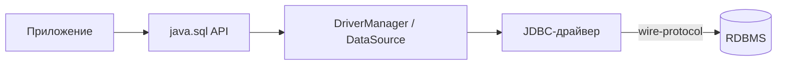

# Java JDBC: API доступа к БД

JDBC (`Java Database Connectivity`) — низкоуровневый API для работы с реляционными БД из Java. Поверх него построены Spring `JdbcTemplate`, JPA, jOOQ, MyBatis. Знание голого JDBC нужно чтобы понимать, что происходит под капотом и чинить проблемы с connection pool, транзакциями и утечками курсоров.

Шпаргалка покрывает основные сценарии: CRUD, `PreparedStatement`, batch, транзакции, LOB, metadata, обработка `SQLException` и связка с HikariCP.

## Полезные ссылки

### Официальная документация
- [JDBC Basics (Oracle Tutorial)](https://docs.oracle.com/javase/tutorial/jdbc/) — базовый тур по API
- [java.sql package (JDK 21)](https://docs.oracle.com/en/java/javase/21/docs/api/java.sql/module-summary.html) — API reference
- [JDBC 4.3 Specification (JSR 221)](https://www.oracle.com/java/technologies/javase/jdbc.html) — формальная спецификация

### Обучающие материалы
- [A Guide to JDBC](https://www.baeldung.com/java-jdbc) — базовый обзор
- [PreparedStatement in JDBC](https://www.baeldung.com/jdbc-prepared-statement)
- [JDBC Batch Operations](https://www.baeldung.com/jdbc-batch-processing)
- [JDBC Transactions](https://www.baeldung.com/java-jdbc-transactions)

### См. также
- [[java-basics|Java: основы]]
- [[java-exceptions|Java: исключения и SQLException]]
- [[java-hikaricp|HikariCP: пул соединений]]
- [[spring-data-jdbc|Spring Data JDBC]]
- [[spring-data-jpa|Spring Data JPA]]

## Содержание

- [Что такое JDBC](#что-такое-jdbc)
  - [Архитектура](#архитектура)
  - [Типы драйверов](#типы-драйверов)
- [Подключение к БД](#подключение-к-бд)
  - [JDBC URL](#jdbc-url)
  - [DriverManager vs DataSource](#drivermanager-vs-datasource)
  - [HikariCP как DataSource](#hikaricp-как-datasource)
- [Statement, PreparedStatement, CallableStatement](#statement-preparedstatement-callablestatement)
  - [Таблица сравнения](#таблица-сравнения)
  - [SQL-injection и защита](#sql-injection-и-защита)
- [ResultSet](#resultset)
  - [Типы ResultSet](#типы-resultset)
  - [Методы getXxx](#методы-getxxx)
  - [Fetch size и пагинация курсором](#fetch-size-и-пагинация-курсором)
- [Batch updates](#batch-updates)
- [Транзакции](#транзакции)
  - [Commit / rollback](#commit--rollback)
  - [Isolation levels](#isolation-levels)
  - [Savepoints](#savepoints)
- [LOB: BLOB и CLOB](#lob-blob-и-clob)
- [Metadata](#metadata)
- [Обработка ошибок](#обработка-ошибок)
  - [SQLException и SQLState](#sqlexception-и-sqlstate)
  - [Vendor-specific коды](#vendor-specific-коды)
- [Try-with-resources](#try-with-resources)
- [Полные примеры](#полные-примеры)
  - [CRUD](#crud)
  - [Пагинация](#пагинация)
- [JDBC vs JdbcTemplate vs JPA](#jdbc-vs-jdbctemplate-vs-jpa)
- [Лучшие практики](#лучшие-практики)
- [Решение проблем](#решение-проблем)
- [См. также](#см-также)

## Что такое JDBC

JDBC — стандартный API в пакете `java.sql` для выполнения SQL-запросов к реляционным БД. Драйвер конкретной БД реализует этот API, а приложение работает только с интерфейсами.

Основные интерфейсы:

- `Driver` — регистрируется через `DriverManager`, умеет открывать `Connection` по URL.
- `DataSource` — фабрика соединений; рекомендуется вместо `DriverManager` в production.
- `Connection` — открытая сессия к БД, границы транзакции.
- `Statement` / `PreparedStatement` / `CallableStatement` — исполнители SQL.
- `ResultSet` — курсор по результату `SELECT`.
- `DatabaseMetaData` / `ResultSetMetaData` — метаданные схемы и запроса.

### Архитектура



В production `DriverManager` используется редко: его заменяет пул соединений (`HikariDataSource`), который переиспользует физические коннекты и ограничивает их количество.

### Типы драйверов

Исторически JDBC описывал 4 типа драйверов. В 2020-х годах реально используются только Type 4.

| Тип | Описание | Статус |
|-----|----------|--------|
| Type 1 | JDBC-ODBC bridge | удалён из JDK 8 |
| Type 2 | Native-API (C-библиотеки) | legacy |
| Type 3 | Middleware net-protocol | legacy |
| Type 4 | Pure Java, прямой wire-protocol | **стандарт** (PostgreSQL, MySQL, Oracle, SQL Server) |

**Итог:** берите Type 4 — это все популярные драйверы (`org.postgresql.Driver`, `com.mysql.cj.jdbc.Driver`, `org.mariadb.jdbc.Driver`, `com.microsoft.sqlserver.jdbc.SQLServerDriver`).

## Подключение к БД

### JDBC URL

URL — строка с префиксом `jdbc:<subprotocol>:<subname>`. Формат зависит от драйвера.

| БД | Пример URL |
|----|------------|
| PostgreSQL | `jdbc:postgresql://host:5432/db?sslmode=require` |
| MySQL | `jdbc:mysql://host:3306/db?useSSL=true&serverTimezone=UTC` |
| MariaDB | `jdbc:mariadb://host:3306/db` |
| Oracle | `jdbc:oracle:thin:@//host:1521/SERVICE` |
| SQL Server | `jdbc:sqlserver://host:1433;databaseName=db;encrypt=true` |
| SQLite | `jdbc:sqlite:/path/to/file.db` |
| H2 (in-memory) | `jdbc:h2:mem:test;DB_CLOSE_DELAY=-1` |

Параметры в query-string (`?a=1&b=2`) настраивают таймауты, SSL, timezone, autoCommit и другие опции — читайте доку конкретного драйвера.

### DriverManager vs DataSource

`DriverManager.getConnection(url, user, pass)` — старый способ, для утилит и тестов.

```java
String url = "jdbc:postgresql://localhost:5432/quiz";
try (Connection conn = DriverManager.getConnection(url, "user", "pass")) {
    // ...
}
```

`DataSource` — предпочитаемый способ. Он абстрагирует источник соединений, позволяя подменить реализацию на пул.

```java
HikariConfig cfg = new HikariConfig();
cfg.setJdbcUrl("jdbc:postgresql://localhost:5432/quiz");
cfg.setUsername("user");
cfg.setPassword("pass");
cfg.setMaximumPoolSize(10);

DataSource ds = new HikariDataSource(cfg);

try (Connection conn = ds.getConnection()) {
    // conn возвращается в пул по close()
}
```

### HikariCP как DataSource

HikariCP — индустриальный стандарт пула соединений в JVM. Он fast-path для `getConnection()`, имеет жёсткие таймауты и хорошие метрики. В Spring Boot подключается автоматически через `application.yml`.

```yaml
spring:
  datasource:
    url: jdbc:postgresql://localhost:5432/quiz
    username: user
    password: pass
    hikari:
      maximum-pool-size: 20
      minimum-idle: 5
      connection-timeout: 30000
      idle-timeout: 600000
      max-lifetime: 1800000
```

Подробнее в [HikariCP: пул соединений](../../libraries/java/java-hikaricp.md).

## Statement, PreparedStatement, CallableStatement

### Таблица сравнения

| Характеристика | `Statement` | `PreparedStatement` | `CallableStatement` |
|----------------|-------------|---------------------|---------------------|
| SQL компилируется | каждый раз | один раз, переиспользуется | один раз, переиспользуется |
| Параметры | нет (строковая конкатенация) | `?` с `setXxx(i, value)` | `?` + `OUT` параметры |
| SQL-injection защита | нет | **да** | да |
| Хранимые процедуры | нет | нет | **да** (`{call proc(?, ?)}`) |
| Batch | да | да (эффективнее) | да |
| Использование | одноразовые DDL | 99% запросов в приложении | вызов stored procedures |

### SQL-injection и защита

**Опасно** — `Statement` со склеиванием строк:

```java
// НЕ ДЕЛАЙТЕ ТАК
String sql = "SELECT * FROM users WHERE name = '" + userInput + "'";
try (Statement st = conn.createStatement();
     ResultSet rs = st.executeQuery(sql)) { /* ... */ }
```

Если `userInput = "'; DROP TABLE users; --"` — получите классический SQL-injection.

**Безопасно** — `PreparedStatement` с параметрами:

```java
String sql = "SELECT id, email FROM users WHERE name = ?";
try (PreparedStatement ps = conn.prepareStatement(sql)) {
    ps.setString(1, userInput);
    try (ResultSet rs = ps.executeQuery()) {
        while (rs.next()) {
            long id = rs.getLong("id");
            String email = rs.getString("email");
        }
    }
}
```

Параметры пересылаются отдельно от SQL-текста, драйвер их эскейпит на уровне протокола.

**CallableStatement** — для вызова процедур:

```java
try (CallableStatement cs = conn.prepareCall("{call get_user_balance(?, ?)}")) {
    cs.setLong(1, userId);
    cs.registerOutParameter(2, Types.NUMERIC);
    cs.execute();
    BigDecimal balance = cs.getBigDecimal(2);
}
```

**Итог:** всегда используйте `PreparedStatement`. `Statement` — только для DDL без параметров (`CREATE TABLE`, `TRUNCATE`).

## ResultSet

`ResultSet` — курсор по результату запроса. По умолчанию — forward-only, read-only.

### Типы ResultSet

| Параметр | Значения |
|----------|----------|
| Направление | `TYPE_FORWARD_ONLY`, `TYPE_SCROLL_INSENSITIVE`, `TYPE_SCROLL_SENSITIVE` |
| Обновляемость | `CONCUR_READ_ONLY`, `CONCUR_UPDATABLE` |
| Holdability | `HOLD_CURSORS_OVER_COMMIT`, `CLOSE_CURSORS_AT_COMMIT` |

```java
// Прокручиваемый updatable ResultSet
try (PreparedStatement ps = conn.prepareStatement(
        "SELECT id, email FROM users WHERE active = true",
        ResultSet.TYPE_SCROLL_SENSITIVE,
        ResultSet.CONCUR_UPDATABLE);
     ResultSet rs = ps.executeQuery()) {

    rs.absolute(5);            // прыжок к 5-й строке
    rs.updateString("email", "new@example.com");
    rs.updateRow();            // UPDATE в БД
}
```

В 95% случаев хватает дефолтного forward-only read-only.

### Методы getXxx

| SQL тип | Метод | Java тип |
|---------|-------|----------|
| `INTEGER` | `getInt()` | `int` |
| `BIGINT` | `getLong()` | `long` |
| `NUMERIC` / `DECIMAL` | `getBigDecimal()` | `BigDecimal` |
| `VARCHAR` / `TEXT` | `getString()` | `String` |
| `BOOLEAN` | `getBoolean()` | `boolean` |
| `TIMESTAMP` | `getTimestamp()` / `getObject(i, LocalDateTime.class)` | `Timestamp` / `LocalDateTime` |
| `DATE` | `getDate()` / `getObject(i, LocalDate.class)` | `Date` / `LocalDate` |
| `BYTEA` / `BLOB` | `getBytes()` / `getBlob()` | `byte[]` / `Blob` |
| `UUID` (PG) | `getObject(i, UUID.class)` | `UUID` |
| `JSONB` (PG) | `getString(i)` + парсинг | `String` |

**JDBC 4.2+** даёт `getObject(int, Class<T>)` — используйте его для `java.time` типов, чтобы не иметь дело с `java.sql.Timestamp`.

```java
LocalDateTime created = rs.getObject("created_at", LocalDateTime.class);
UUID id = rs.getObject("id", UUID.class);
```

Проверка NULL: `getInt()` вернёт `0` для NULL — используйте `wasNull()` сразу после чтения, либо `getObject(i, Integer.class)` (вернёт `null`).

### Fetch size и пагинация курсором

При выборке миллиона строк `ResultSet` по умолчанию может загрузить всё в память. Установите `fetchSize`, чтобы читать порциями.

```java
conn.setAutoCommit(false); // обязательно для PostgreSQL cursor-based fetch
try (PreparedStatement ps = conn.prepareStatement("SELECT * FROM big_table")) {
    ps.setFetchSize(1000);
    try (ResultSet rs = ps.executeQuery()) {
        while (rs.next()) { /* обработка */ }
    }
}
```

Поведение `fetchSize` зависит от драйвера: PostgreSQL требует `autoCommit=false`, MySQL — `Integer.MIN_VALUE` для streaming.

## Batch updates

Batch объединяет несколько INSERT/UPDATE/DELETE в одну отправку на сервер. Даёт 10-50× ускорение при массовых операциях.

```java
String sql = "INSERT INTO users(name, email) VALUES (?, ?)";
conn.setAutoCommit(false);
try (PreparedStatement ps = conn.prepareStatement(sql)) {
    for (User u : users) {
        ps.setString(1, u.name());
        ps.setString(2, u.email());
        ps.addBatch();
        if (i % 1000 == 0) {
            ps.executeBatch(); // периодически сливать
        }
    }
    int[] counts = ps.executeBatch();
    conn.commit();
} catch (SQLException e) {
    conn.rollback();
    throw e;
}
```

Для PostgreSQL обязательно добавьте в URL `?reWriteBatchedInserts=true` — драйвер склеит батч в один `INSERT ... VALUES (...), (...), (...)`.

Методы:

- `addBatch()` — добавить параметризованную команду.
- `executeBatch()` — выполнить всё и вернуть массив `int[]` (кол-во затронутых строк по каждой команде).
- `clearBatch()` — сбросить накопленный батч.

## Транзакции

### Commit / rollback

По умолчанию `Connection` работает в режиме `autoCommit = true` — каждая команда коммитится отдельно. Для бизнес-транзакции выключите autoCommit.

```java
conn.setAutoCommit(false);
try {
    debit(conn, fromAccount, amount);
    credit(conn, toAccount, amount);
    conn.commit();
} catch (SQLException e) {
    conn.rollback();
    throw e;
} finally {
    conn.setAutoCommit(true); // вернуть в исходное состояние перед возвратом в пул
}
```

В Spring лучше использовать `@Transactional` или `TransactionTemplate` — они сами управляют границами транзакции.

### Isolation levels

| Уровень | Константа | Dirty read | Non-repeatable | Phantom |
|---------|-----------|------------|----------------|---------|
| Read Uncommitted | `TRANSACTION_READ_UNCOMMITTED` | возможен | возможен | возможен |
| Read Committed | `TRANSACTION_READ_COMMITTED` | нет | возможен | возможен |
| Repeatable Read | `TRANSACTION_REPEATABLE_READ` | нет | нет | возможен |
| Serializable | `TRANSACTION_SERIALIZABLE` | нет | нет | нет |

```java
conn.setTransactionIsolation(Connection.TRANSACTION_READ_COMMITTED);
```

Дефолты разных СУБД:

- PostgreSQL: `READ COMMITTED`
- MySQL (InnoDB): `REPEATABLE READ`
- Oracle: `READ COMMITTED`
- SQL Server: `READ COMMITTED`

Не все уровни поддерживаются везде (PostgreSQL не имеет настоящего `REPEATABLE READ` — он как SERIALIZABLE snapshot).

### Savepoints

Savepoint — точка внутри транзакции, к которой можно откатиться, не теряя всю транзакцию.

```java
conn.setAutoCommit(false);
try {
    doStep1(conn);
    Savepoint sp = conn.setSavepoint("after-step1");
    try {
        doStep2(conn);
    } catch (SQLException ex) {
        conn.rollback(sp); // откат только step2
    }
    conn.commit();
} catch (SQLException e) {
    conn.rollback();
}
```

## LOB: BLOB и CLOB

`BLOB` — бинарные данные, `CLOB` — длинный текст. В PostgreSQL им соответствуют `BYTEA` и `TEXT` (часто используют их напрямую вместо LOB API).

**Запись BLOB через поток:**

```java
try (PreparedStatement ps = conn.prepareStatement(
        "INSERT INTO files(name, data) VALUES (?, ?)");
     InputStream in = Files.newInputStream(path)) {
    ps.setString(1, "report.pdf");
    ps.setBinaryStream(2, in);
    ps.executeUpdate();
}
```

**Чтение BLOB как потока:**

```java
try (PreparedStatement ps = conn.prepareStatement(
        "SELECT data FROM files WHERE id = ?")) {
    ps.setLong(1, id);
    try (ResultSet rs = ps.executeQuery()) {
        if (rs.next()) {
            try (InputStream in = rs.getBinaryStream("data");
                 OutputStream out = Files.newOutputStream(target)) {
                in.transferTo(out);
            }
        }
    }
}
```

Потоковое чтение важно для больших файлов — `getBytes()` загрузит всё в память и уронит heap.

## Metadata

**DatabaseMetaData** — инфа о СУБД, схемах, таблицах, индексах:

```java
DatabaseMetaData md = conn.getMetaData();
System.out.println(md.getDatabaseProductName() + " " + md.getDatabaseProductVersion());

try (ResultSet tables = md.getTables(null, "public", "%", new String[]{"TABLE"})) {
    while (tables.next()) {
        System.out.println(tables.getString("TABLE_NAME"));
    }
}

try (ResultSet cols = md.getColumns(null, "public", "users", "%")) {
    while (cols.next()) {
        System.out.printf("%s %s (nullable=%s)%n",
            cols.getString("COLUMN_NAME"),
            cols.getString("TYPE_NAME"),
            cols.getString("IS_NULLABLE"));
    }
}
```

**ResultSetMetaData** — инфа о колонках текущего результата:

```java
try (ResultSet rs = ps.executeQuery()) {
    ResultSetMetaData rsmd = rs.getMetaData();
    for (int i = 1; i <= rsmd.getColumnCount(); i++) {
        System.out.println(rsmd.getColumnLabel(i) + " : " + rsmd.getColumnTypeName(i));
    }
}
```

Полезно для generic-маппинга (строить DTO динамически) или экспорта схемы.

## Обработка ошибок

### SQLException и SQLState

Все ошибки JDBC — наследники `SQLException`. У него три источника информации:

- `getMessage()` — текст ошибки от драйвера.
- `getSQLState()` — стандартный код `XXYYY` по ANSI/ISO SQL (`23505` — unique violation, `40001` — serialization failure).
- `getErrorCode()` — числовой vendor-specific код.

`SQLException` поддерживает цепочку через `getNextException()` (в batch может быть несколько ошибок).

```java
try {
    ps.executeUpdate();
} catch (SQLException e) {
    SQLException cur = e;
    while (cur != null) {
        log.error("SQLState={}, errorCode={}, msg={}",
            cur.getSQLState(), cur.getErrorCode(), cur.getMessage());
        cur = cur.getNextException();
    }
    throw e;
}
```

Подклассы для категоризации (JDBC 4.0+):

| Класс | Когда бросается |
|-------|-----------------|
| `SQLTransientException` | временная ошибка, повтор может помочь (таймаут, deadlock) |
| `SQLNonTransientException` | постоянная ошибка (синтаксис, constraint) |
| `SQLRecoverableException` | нужна работа приложения (reconnect) |
| `SQLIntegrityConstraintViolationException` | нарушение constraint |
| `SQLTimeoutException` | таймаут запроса |

### Vendor-specific коды

Мэппинг `SQLState` / `errorCode` для типичных случаев:

| Случай | PostgreSQL SQLState | MySQL errorCode |
|--------|---------------------|-----------------|
| Unique violation | `23505` | `1062` |
| Foreign key violation | `23503` | `1452` |
| Not null violation | `23502` | `1048` |
| Deadlock | `40P01` | `1213` |
| Serialization failure | `40001` | — |
| Connection failure | `08006` | `08S01` |

Spring транслирует `SQLException` в свою иерархию (`DataIntegrityViolationException`, `DuplicateKeyException`, `DeadlockLoserDataAccessException`) через `SQLExceptionTranslator` — не надо разбирать коды руками.

## Try-with-resources

`Connection`, `Statement`, `ResultSet` реализуют `AutoCloseable`. Всегда оборачивайте их в try-with-resources — иначе утечка курсоров и коннектов.

```java
try (Connection conn = ds.getConnection();
     PreparedStatement ps = conn.prepareStatement("SELECT 1");
     ResultSet rs = ps.executeQuery()) {
    // close() в обратном порядке автоматически
}
```

Порядок закрытия важен: сначала `ResultSet`, потом `Statement`, потом `Connection`. Try-with-resources это гарантирует.

Без try-with-resources потребуется вложенный try/finally на каждом ресурсе — легко забыть `close()` и вызвать connection leak (HikariCP залогирует warning через `leakDetectionThreshold`).

## Полные примеры

### CRUD

```java
public class UserDao {
    private final DataSource ds;

    public UserDao(DataSource ds) { this.ds = ds; }

    public long create(String name, String email) throws SQLException {
        String sql = "INSERT INTO users(name, email) VALUES (?, ?)";
        try (Connection c = ds.getConnection();
             PreparedStatement ps = c.prepareStatement(sql, Statement.RETURN_GENERATED_KEYS)) {
            ps.setString(1, name);
            ps.setString(2, email);
            ps.executeUpdate();
            try (ResultSet keys = ps.getGeneratedKeys()) {
                keys.next();
                return keys.getLong(1);
            }
        }
    }

    public Optional<User> findById(long id) throws SQLException {
        String sql = "SELECT id, name, email FROM users WHERE id = ?";
        try (Connection c = ds.getConnection();
             PreparedStatement ps = c.prepareStatement(sql)) {
            ps.setLong(1, id);
            try (ResultSet rs = ps.executeQuery()) {
                if (rs.next()) {
                    return Optional.of(new User(
                        rs.getLong("id"),
                        rs.getString("name"),
                        rs.getString("email")));
                }
                return Optional.empty();
            }
        }
    }

    public int updateEmail(long id, String email) throws SQLException {
        String sql = "UPDATE users SET email = ? WHERE id = ?";
        try (Connection c = ds.getConnection();
             PreparedStatement ps = c.prepareStatement(sql)) {
            ps.setString(1, email);
            ps.setLong(2, id);
            return ps.executeUpdate();
        }
    }

    public int delete(long id) throws SQLException {
        String sql = "DELETE FROM users WHERE id = ?";
        try (Connection c = ds.getConnection();
             PreparedStatement ps = c.prepareStatement(sql)) {
            ps.setLong(1, id);
            return ps.executeUpdate();
        }
    }
}
```

Обратите внимание на `RETURN_GENERATED_KEYS` — способ получить сгенерированный ID (`SERIAL`, `IDENTITY`, `AUTO_INCREMENT`).

### Пагинация

**Keyset-пагинация** (быстрая, стабильная):

```java
public List<User> pageAfter(long lastId, int size) throws SQLException {
    String sql = """
        SELECT id, name, email
        FROM users
        WHERE id > ?
        ORDER BY id
        LIMIT ?
        """;
    try (Connection c = ds.getConnection();
         PreparedStatement ps = c.prepareStatement(sql)) {
        ps.setLong(1, lastId);
        ps.setInt(2, size);
        try (ResultSet rs = ps.executeQuery()) {
            List<User> out = new ArrayList<>(size);
            while (rs.next()) {
                out.add(new User(rs.getLong("id"), rs.getString("name"), rs.getString("email")));
            }
            return out;
        }
    }
}
```

**OFFSET-пагинация** (проще, но деградирует на глубоких страницах):

```java
public List<User> page(int offset, int size) throws SQLException {
    String sql = "SELECT id, name, email FROM users ORDER BY id LIMIT ? OFFSET ?";
    try (Connection c = ds.getConnection();
         PreparedStatement ps = c.prepareStatement(sql)) {
        ps.setInt(1, size);
        ps.setInt(2, offset);
        // ...
    }
}
```

На глубине `OFFSET 1000000` БД всё равно читает миллион строк — на больших таблицах предпочитайте keyset.

## JDBC vs JdbcTemplate vs JPA

| Характеристика | JDBC (raw) | Spring `JdbcTemplate` | JPA / Hibernate |
|----------------|------------|------------------------|------------------|
| Уровень абстракции | низкий | средний | высокий |
| Boilerplate | много | минимум | почти нет |
| Контроль над SQL | полный | полный | частичный (query-by-example, JPQL) |
| Маппинг в объекты | ручной | `RowMapper`, `BeanPropertyRowMapper` | автоматический по аннотациям |
| Управление транзакциями | ручное | через `PlatformTransactionManager` | `@Transactional` |
| Ленивые связи (lazy) | нет | нет | да (`@ManyToOne(fetch=LAZY)`) |
| Кэш 1-го уровня | нет | нет | да (`PersistenceContext`) |
| N+1 риск | мал (всё явно) | мал | высокий (autoloading) |
| Exception translation | `SQLException` | `DataAccessException` | `DataAccessException` |
| Порог входа | низкий | низкий | высокий |
| Отладка SQL | простая | простая | сложная (генерируемый SQL) |

**Когда что использовать:**

- **Raw JDBC** — утилиты миграции, скрипты, batch-загрузка миллионов строк, драйверы/фреймворки.
- **JdbcTemplate / Spring Data JDBC** — сервис с простой реляционной моделью, когда важен контроль SQL и отсутствие магии. См. [Spring Data JDBC](../../frameworks/java-frameworks/spring/spring-data-jdbc.md).
- **JPA / Hibernate** — сложные агрегаты, много связей, редко пишете SQL. См. [Spring Data JPA](../../frameworks/java-frameworks/spring/spring-data-jpa.md).

**Пример сравнения:** вставка пользователя с возвратом ID.

```java
// Raw JDBC — ~15 строк с try-with-resources
PreparedStatement ps = conn.prepareStatement(SQL, RETURN_GENERATED_KEYS);
ps.setString(1, name); ps.setString(2, email);
ps.executeUpdate();
// ... getGeneratedKeys

// JdbcTemplate — 5 строк
KeyHolder kh = new GeneratedKeyHolder();
jdbc.update(c -> {
    var ps = c.prepareStatement(SQL, RETURN_GENERATED_KEYS);
    ps.setString(1, name); ps.setString(2, email);
    return ps;
}, kh);
long id = kh.getKey().longValue();

// JPA — 2 строки
User u = new User(name, email);
em.persist(u); // id проставится автоматически
```

## Лучшие практики

- **Всегда `PreparedStatement`.** `Statement` только для DDL без параметров.
- **Всегда try-with-resources.** Закрытие в `finally` вручную — источник утечек.
- **Всегда `DataSource` + пул.** `DriverManager` только для одноразовых скриптов.
- **Батчуйте вставки/апдейты.** 1 batch на 1000 строк вместо 1000 отдельных round-trip.
- **`setFetchSize()`** для выборок > 10K строк — иначе OOM.
- **Явно `autoCommit=false`** для бизнес-транзакций, commit/rollback в `finally`.
- **Логируйте SQL и параметры** через `p6spy` или `datasource-proxy` — драйвер сам этого не умеет.
- **Мерьте pool** через метрики (`HikariDataSource` → Micrometer).
- **Не смешивайте** `PreparedStatement.executeQuery()` с `executeUpdate()` — поведение разное, не те методы.
- **Timezone** — для `TIMESTAMP WITH TIME ZONE` используйте `OffsetDateTime`/`Instant`, не `java.util.Date`.

## Решение проблем

**Connection leak detected** (HikariCP):
- Не закрыли `Connection` — проверьте все ветки кода, оберните в try-with-resources.
- `leakDetectionThreshold` в HikariCP покажет stack trace места, где коннект взяли и не вернули.

**`ResultSet is closed`**:
- Прочитали `rs` после `close()` или `commit()` (при `CLOSE_CURSORS_AT_COMMIT`).
- Вызвали новый `executeQuery` на том же `Statement` (старый `ResultSet` автоматически закрылся).

**`No suitable driver found`**:
- Драйвер не в classpath — проверьте `build.gradle` / `pom.xml`.
- Начиная с JDBC 4.0 драйвер подгружается через `META-INF/services/java.sql.Driver` (ServiceLoader). Если jar кривой — `Class.forName("org.postgresql.Driver")` явно.

**Deadlock detected** (`SQLState=40P01`):
- Конкурирующие транзакции берут блокировки в разном порядке.
- Ретрайте транзакцию — это `SQLTransientException`.

**`OutOfMemoryError` при выборке**:
- Не поставили `fetchSize` — драйвер загрузил всю таблицу в память.
- Для PostgreSQL: `autoCommit=false` + `setFetchSize(1000)`.

**Таймаут `getConnection()`**:
- Пул исчерпан — коннекты не возвращаются.
- Увеличьте `maximumPoolSize` (но не лечите симптом — ищите утечку) или найдите долгие транзакции через `pg_stat_activity`.

**Неправильная timezone в `TIMESTAMP`**:
- Используйте `getObject(col, OffsetDateTime.class)` вместо `getTimestamp(col)`.
- Для MySQL добавьте `?serverTimezone=UTC` в URL.

## См. также

- [[java-basics|Java: основы]]
- [[java-exceptions|Java: исключения]]
- [[java-hikaricp|HikariCP: пул соединений]]
- [[java-jooq|jOOQ: type-safe SQL DSL]]
- [[spring-data-jdbc|Spring Data JDBC]]
- [[spring-data-jpa|Spring Data JPA]]
- [[spring-hibernate|Hibernate через Spring]]
- [[orm-basics|ORM: базовые концепции]]
- [[java-testcontainers|Testcontainers — интеграционные тесты БД]]
