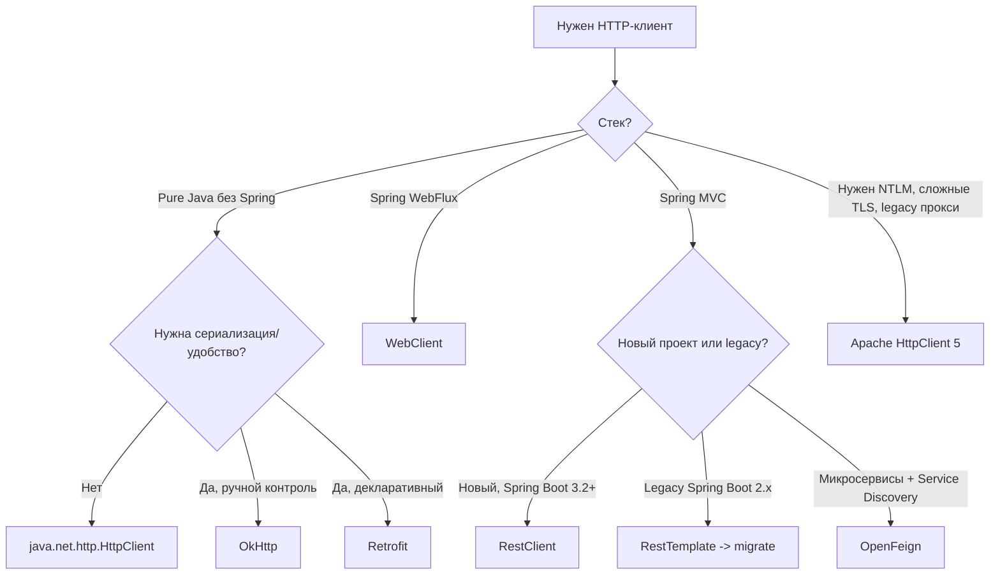

# HTTP-клиенты в Java

В JVM-экосистеме — восемь осмысленных вариантов HTTP-клиента. Они отличаются по уровню абстракции (raw vs декларативный), модели исполнения (sync/async/reactive), зависимостям и интеграции со Spring. Эта шпаргалка помогает выбрать подходящий и быстро написать код под типовые задачи.

Фокус: клиентский HTTP (вызываем чужой API), а не серверный (прием запросов). Для server-side см. [Spring MVC REST](../../frameworks/java-frameworks/spring/spring-rest.md) / [Spring WebFlux](../../frameworks/java-frameworks/spring/spring-webflux.md).

## Полезные ссылки

### Официальная документация
- [java.net.http (JDK 21)](https://docs.oracle.com/en/java/javase/21/docs/api/java.net.http/java/net/http/HttpClient.html)
- [Spring Framework Web Client docs](https://docs.spring.io/spring-framework/reference/integration/rest-clients.html)
- [Apache HttpComponents Client](https://hc.apache.org/httpcomponents-client-5.2.x/)
- [OkHttp](https://square.github.io/okhttp/)
- [Retrofit](https://square.github.io/retrofit/)
- [Spring Cloud OpenFeign](https://spring.io/projects/spring-cloud-openfeign)

### Обучающие материалы
- [Java HttpClient](https://www.baeldung.com/java-9-http-client)
- [RestTemplate Guide](https://www.baeldung.com/rest-template)
- [Spring WebClient](https://www.baeldung.com/spring-5-webclient)
- [Spring RestClient](https://www.baeldung.com/spring-boot-restclient)
- [Spring Cloud OpenFeign](https://www.baeldung.com/spring-cloud-openfeign)
- [A Guide to OkHttp](https://www.baeldung.com/guide-to-okhttp)
- [Retrofit Tutorial](https://www.baeldung.com/retrofit)

### См. также
- [Apache HttpClient: полное руководство](java-apache-httpclient.md)
- [OkHttp](java-okhttp.md)
- [Retrofit](java-retrofit.md)
- [Spring MVC REST](../../frameworks/java-frameworks/spring/spring-rest.md)
- [Spring WebFlux](../../frameworks/java-frameworks/spring/spring-webflux.md)
- [Project Reactor (Mono/Flux)](../../languages/java/java-reactive-project-reactor.md)
- [Resilience4j — Retry и Circuit Breaker](java-resilience4j.md)

## Содержание

- [Зачем вообще HTTP-клиент](#зачем-вообще-http-клиент)
- [Варианты и позиционирование](#варианты-и-позиционирование)
  - [java.net.http.HttpClient (JDK 11+)](#javanethttphttpclient-jdk-11)
  - [RestTemplate (Spring)](#resttemplate-spring)
  - [WebClient (Spring WebFlux)](#webclient-spring-webflux)
  - [RestClient (Spring 6.1+)](#restclient-spring-61)
  - [OpenFeign](#openfeign)
  - [Apache HttpClient 5](#apache-httpclient-5)
  - [OkHttp](#okhttp)
  - [Retrofit](#retrofit)
- [Большая таблица сравнения](#большая-таблица-сравнения)
- [Когда что выбирать](#когда-что-выбирать)
- [Типовые задачи](#типовые-задачи)
  - [GET с query-параметрами](#get-с-query-параметрами)
  - [POST с JSON-телом](#post-с-json-телом)
  - [Заголовки и аутентификация](#заголовки-и-аутентификация)
  - [Таймауты](#таймауты)
  - [Retry и fallback](#retry-и-fallback)
  - [Interceptors и логирование](#interceptors-и-логирование)
  - [Загрузка файла и multipart](#загрузка-файла-и-multipart)
  - [Streaming ответа](#streaming-ответа)
- [Обработка ошибок](#обработка-ошибок)
- [Лучшие практики](#лучшие-практики)
- [Решение проблем](#решение-проблем)
- [См. также](#см-также-1)

## Зачем вообще HTTP-клиент

Любой сервис что-то вызывает по HTTP: внешние API, соседние микросервисы, OAuth-провайдер, LLM, платёжный шлюз. Клиент решает:

- сериализацию тела (JSON, form, multipart, protobuf);
- управление соединениями (connection pooling, keep-alive, HTTP/2);
- таймауты, ретраи, circuit breaker;
- интеграцию с метриками и трейсингом;
- декларативный или императивный API.

Выбор зависит от стека (чистая Java, Spring MVC, WebFlux, Android), требований к перформансу и удобству.

## Варианты и позиционирование

### java.net.http.HttpClient (JDK 11+)

Клиент из стандартной библиотеки. Поддерживает HTTP/1.1, HTTP/2, WebSocket, sync и async. Без внешних зависимостей.

```java
HttpClient client = HttpClient.newBuilder()
    .version(HttpClient.Version.HTTP_2)
    .connectTimeout(Duration.ofSeconds(5))
    .build();

HttpRequest req = HttpRequest.newBuilder()
    .uri(URI.create("https://api.example.com/users/42"))
    .header("Accept", "application/json")
    .GET()
    .build();

HttpResponse<String> resp = client.send(req, BodyHandlers.ofString());
System.out.println(resp.statusCode() + " " + resp.body());

// Async
CompletableFuture<HttpResponse<String>> future =
    client.sendAsync(req, BodyHandlers.ofString());
```

**Плюсы:** в JDK, без зависимостей; sync + async + reactive через `CompletableFuture`; HTTP/2, WebSocket.
**Минусы:** нет встроенной сериализации JSON (нужен `ObjectMapper` вручную); нет interceptors; слабая интеграция со Spring.

### RestTemplate (Spring)

Синхронный HTTP-клиент, исторический default в Spring. **В Spring Framework 6 помечен как "maintenance mode"** — рекомендуется переход на `RestClient` или `WebClient`.

```java
RestTemplate rt = new RestTemplate();
User user = rt.getForObject(
    "https://api.example.com/users/{id}",
    User.class, 42);

ResponseEntity<User> resp = rt.exchange(
    "https://api.example.com/users",
    HttpMethod.POST,
    new HttpEntity<>(new User("Alice")),
    User.class);
```

**Плюсы:** привычный API, интеграция со Spring (`HttpMessageConverters`, `ClientHttpRequestFactory`, `ResponseErrorHandler`).
**Минусы:** deprecated-like статус, только sync, callback-style API (exchange) — неудобный.

### WebClient (Spring WebFlux)

Реактивный неблокирующий клиент на Project Reactor (`Mono`, `Flux`). Единственный правильный выбор в WebFlux-стеке.

```java
WebClient client = WebClient.builder()
    .baseUrl("https://api.example.com")
    .defaultHeader(HttpHeaders.ACCEPT, "application/json")
    .build();

Mono<User> user = client.get()
    .uri("/users/{id}", 42)
    .retrieve()
    .bodyToMono(User.class);

Flux<User> all = client.get()
    .uri("/users")
    .retrieve()
    .bodyToFlux(User.class);

// Блокирующее использование (в MVC)
User u = user.block();
```

**Плюсы:** reactive-stream, backpressure, HTTP/2, эффективен при большом количестве одновременных запросов.
**Минусы:** нужно понимать Reactor; в синхронном коде выглядит избыточно.

Подробнее о Reactor — [Project Reactor](../../languages/java/java-reactive-project-reactor.md).

### RestClient (Spring 6.1+)

Синхронный fluent клиент, наследующий API от WebClient. Введён в Spring Framework 6.1 / Boot 3.2 как замена RestTemplate.

```java
RestClient client = RestClient.builder()
    .baseUrl("https://api.example.com")
    .defaultHeader("Accept", "application/json")
    .build();

User u = client.get()
    .uri("/users/{id}", 42)
    .retrieve()
    .body(User.class);

ResponseEntity<User> resp = client.post()
    .uri("/users")
    .contentType(MediaType.APPLICATION_JSON)
    .body(new User("Alice"))
    .retrieve()
    .toEntity(User.class);
```

**Плюсы:** fluent API как у WebClient, но sync; нет зависимости на Reactor; штатный default для новых Spring Boot сервисов.
**Минусы:** только Spring 6.1+ / Boot 3.2+.

### OpenFeign

Декларативный HTTP-клиент: описываете интерфейс с аннотациями, Feign сам генерирует реализацию.

```java
@FeignClient(name = "user-service", url = "${user-service.url}")
public interface UserClient {

    @GetMapping("/users/{id}")
    User byId(@PathVariable("id") long id);

    @PostMapping("/users")
    User create(@RequestBody User user);
}
```

```java
@RestController
@RequiredArgsConstructor
class Controller {
    private final UserClient users;

    @GetMapping("/proxy/{id}")
    User proxy(@PathVariable long id) {
        return users.byId(id);
    }
}
```

**Плюсы:** декларативный API на интерфейсе; интеграция со Spring Cloud (service discovery, LoadBalancer); легко мокируется в тестах.
**Минусы:** только sync; требует Spring Cloud; дополнительная магия (AOP + proxy).

### Apache HttpClient 5

Зрелый мощный HTTP-клиент, много опций низкого уровня (NTLM, сложные прокси, TLS-настройки).

```java
try (CloseableHttpClient client = HttpClients.createDefault()) {
    HttpGet get = new HttpGet("https://api.example.com/users/42");
    get.setHeader("Accept", "application/json");

    String body = client.execute(get, resp -> {
        int sc = resp.getCode();
        return EntityUtils.toString(resp.getEntity());
    });
}
```

**Плюсы:** зрелая кодовая база, много настроек, HTTP/2, async-вариант `HttpAsyncClient`, NTLM, клиентские сертификаты.
**Минусы:** объёмный API, нет встроенной сериализации; интеграция со Spring — только как `ClientHttpRequestFactory` для RestTemplate/RestClient.

Подробнее — [Apache HttpClient](java-apache-httpclient.md).

### OkHttp

Популярный клиент от Square. Стандарт в Android, активно используется и на backend.

```java
OkHttpClient client = new OkHttpClient.Builder()
    .connectTimeout(5, TimeUnit.SECONDS)
    .readTimeout(10, TimeUnit.SECONDS)
    .build();

Request req = new Request.Builder()
    .url("https://api.example.com/users/42")
    .header("Accept", "application/json")
    .build();

try (Response resp = client.newCall(req).execute()) {
    String body = resp.body().string();
}
```

**Плюсы:** простой API, connection pooling из коробки, interceptors, HTTP/2, WebSocket; легковесный.
**Минусы:** нет Spring-интеграции «из коробки»; только sync + callback (не CompletableFuture/Mono).

Подробнее — [OkHttp](java-okhttp.md).

### Retrofit

Декларативный клиент от Square поверх OkHttp. Как OpenFeign, но не привязан к Spring.

```java
interface UserApi {
    @GET("/users/{id}")
    Call<User> byId(@Path("id") long id);

    @POST("/users")
    Call<User> create(@Body User user);
}

Retrofit retrofit = new Retrofit.Builder()
    .baseUrl("https://api.example.com")
    .addConverterFactory(JacksonConverterFactory.create())
    .build();

UserApi api = retrofit.create(UserApi.class);
User u = api.byId(42).execute().body();
```

**Плюсы:** декларативный API, хорошо вписывается в Android/Kotlin; гибкие ConverterFactory и CallAdapter (RxJava, Coroutines).
**Минусы:** зависит от OkHttp; не заточен под Spring; требует отдельного Converter для JSON.

Подробнее — [Retrofit](java-retrofit.md).

## Большая таблица сравнения

| Клиент | Sync | Async | Reactive | HTTP/2 | WebSocket | Декларативный | Spring intgr | Зависимости |
|--------|:----:|:-----:|:--------:|:------:|:---------:|:-------------:|:------------:|-------------|
| `java.net.http.HttpClient` | да | `CompletableFuture` | через `CF` | да | да | нет | опосредованно | JDK 11+ |
| `RestTemplate` | да | нет | нет | зависит от factory | нет | нет | нативная | `spring-web` |
| `WebClient` | блок. через `.block()` | да | `Mono`/`Flux` | да | да | нет | нативная | `spring-webflux` + Reactor + Netty/Jetty |
| `RestClient` | да | нет | нет | да | нет | нет | нативная | `spring-web` 6.1+ |
| `OpenFeign` | да | нет | нет | опосредованно | нет | **да** (интерфейсы) | нативная | `spring-cloud-openfeign` |
| `Apache HttpClient 5` | да | `Future` через `HttpAsyncClient` | через адаптеры | да | нет | нет | как factory | `httpclient5` |
| `OkHttp` | да | callback | через адаптеры | да | да | нет | через factory | `okhttp` |
| `Retrofit` | да | callback / `Call` | `RxJava2CallAdapter`, coroutines | через OkHttp | через OkHttp | **да** | нет | `retrofit` + `okhttp` |

## Когда что выбирать



**Кратко:**

- **Нет Spring, Java 11+** `java.net.http.HttpClient` (стандарт) или OkHttp (удобнее).
- **Spring Boot 3.2+ MVC** `RestClient`.
- **Spring Boot 2.x MVC** `RestTemplate` сейчас, план миграции на `RestClient` после апгрейда.
- **Spring WebFlux** `WebClient`.
- **Микросервисы + Spring Cloud** `OpenFeign` + `Resilience4j` (см. [Resilience4j](java-resilience4j.md)).
- **Android/Kotlin** OkHttp + Retrofit.
- **Enterprise с NTLM/сложным TLS/прокси** Apache HttpClient 5.

## Типовые задачи

### GET с query-параметрами

**java.net.http:**
```java
URI uri = URI.create("https://api.example.com/users?active=true&limit=10");
HttpRequest req = HttpRequest.newBuilder(uri).GET().build();
```

**RestClient:**
```java
User u = client.get()
    .uri(b -> b.path("/users").queryParam("active", true).queryParam("limit", 10).build())
    .retrieve().body(User.class);
```

**WebClient:** такой же API через `uriBuilder`.

**OkHttp:**
```java
HttpUrl url = HttpUrl.parse("https://api.example.com/users").newBuilder()
    .addQueryParameter("active", "true")
    .addQueryParameter("limit", "10")
    .build();
Request req = new Request.Builder().url(url).build();
```

### POST с JSON-телом

**java.net.http** (вручную через Jackson):
```java
String json = objectMapper.writeValueAsString(new User("Alice"));
HttpRequest req = HttpRequest.newBuilder(URI.create(url))
    .header("Content-Type", "application/json")
    .POST(BodyPublishers.ofString(json))
    .build();
```

**RestClient / WebClient** (JSON сам сериализуется через `MappingJackson2HttpMessageConverter`):
```java
User created = client.post()
    .uri("/users")
    .contentType(MediaType.APPLICATION_JSON)
    .body(new User("Alice"))
    .retrieve().body(User.class);
```

**OpenFeign:**
```java
User created = userClient.create(new User("Alice"));
```

### Заголовки и аутентификация

Bearer-токен через дефолтный заголовок (RestClient):
```java
RestClient client = RestClient.builder()
    .defaultHeader("Authorization", "Bearer " + token)
    .build();
```

Basic Auth:
```java
String auth = "Basic " + Base64.getEncoder()
    .encodeToString((user + ":" + pass).getBytes(StandardCharsets.UTF_8));
```

WebClient с ExchangeFilter (динамический токен):
```java
WebClient client = WebClient.builder()
    .filter((req, next) -> tokenProvider.get()
        .flatMap(t -> next.exchange(ClientRequest.from(req)
            .header("Authorization", "Bearer " + t).build())))
    .build();
```

### Таймауты

| Клиент | Connect timeout | Read/Response timeout |
|--------|-----------------|-----------------------|
| `java.net.http` | `HttpClient.Builder.connectTimeout(..)` | `HttpRequest.Builder.timeout(..)` |
| OkHttp | `connectTimeout` | `readTimeout`, `writeTimeout`, `callTimeout` |
| Apache HttpClient | `RequestConfig.setConnectTimeout` | `setResponseTimeout` |
| WebClient (Netty) | `HttpClient.create().responseTimeout(..)` | `readTimeout` через handler |
| RestClient (factory) | через `ClientHttpRequestFactory` (OkHttp/Apache/Jdk) |

Пример для WebClient на Netty:
```java
reactor.netty.http.client.HttpClient nettyClient = reactor.netty.http.client.HttpClient.create()
    .responseTimeout(Duration.ofSeconds(5));

WebClient client = WebClient.builder()
    .clientConnector(new ReactorClientHttpConnector(nettyClient))
    .build();
```

### Retry и fallback

Ретраи лучше делать через Resilience4j или Spring Retry, а не самописно. См. [Resilience4j](java-resilience4j.md).

WebClient + Reactor retry:
```java
client.get().uri("/users").retrieve().bodyToMono(User.class)
    .retryWhen(Retry.backoff(3, Duration.ofMillis(200))
        .filter(ex -> ex instanceof WebClientRequestException));
```

Resilience4j + декларативная аннотация:
```java
@Retry(name = "userService", fallbackMethod = "fallbackUser")
@CircuitBreaker(name = "userService")
User fetch(long id) { return client.byId(id); }

User fallbackUser(long id, Throwable ex) {
    return new User(id, "fallback");
}
```

### Interceptors и логирование

**OkHttp:**
```java
HttpLoggingInterceptor log = new HttpLoggingInterceptor();
log.setLevel(HttpLoggingInterceptor.Level.BODY);
OkHttpClient client = new OkHttpClient.Builder().addInterceptor(log).build();
```

**RestClient:**
```java
RestClient.builder()
    .requestInterceptor((req, body, exec) -> {
        req.getHeaders().add("X-Request-Id", UUID.randomUUID().toString());
        return exec.execute(req, body);
    })
    .build();
```

**WebClient:**
```java
WebClient.builder()
    .filter((req, next) -> {
        log.info("{} {}", req.method(), req.url());
        return next.exchange(req);
    })
    .build();
```

### Загрузка файла и multipart

**WebClient / RestClient:**
```java
MultipartBodyBuilder mp = new MultipartBodyBuilder();
mp.part("file", new FileSystemResource(path));
mp.part("meta", Map.of("desc", "report"));

client.post().uri("/upload")
    .contentType(MediaType.MULTIPART_FORM_DATA)
    .body(mp.build())
    .retrieve().toBodilessEntity();
```

**OkHttp:**
```java
RequestBody body = new MultipartBody.Builder()
    .setType(MultipartBody.FORM)
    .addFormDataPart("file", "report.pdf",
        RequestBody.create(file, MediaType.parse("application/pdf")))
    .addFormDataPart("desc", "report")
    .build();
```

### Streaming ответа

Для больших ответов не грузите всё в `byte[]`/`String`. Используйте поток/Publisher.

**java.net.http:**
```java
HttpResponse<InputStream> resp = client.send(req, BodyHandlers.ofInputStream());
try (InputStream in = resp.body()) { in.transferTo(out); }
```

**WebClient** (Server-Sent Events):
```java
Flux<User> stream = client.get().uri("/users/stream")
    .accept(MediaType.TEXT_EVENT_STREAM)
    .retrieve()
    .bodyToFlux(User.class);
```

## Обработка ошибок

Реакции на HTTP-статус отличаются:

| Клиент | 4xx / 5xx по умолчанию | Как настроить |
|--------|-------------------------|---------------|
| `java.net.http` | без исключения — `resp.statusCode()` | проверять вручную |
| OkHttp | без исключения — `resp.isSuccessful()` | проверять вручную |
| RestTemplate | бросает `HttpStatusCodeException` | `ResponseErrorHandler` |
| RestClient | бросает через `.retrieve()` | `onStatus(..)` |
| WebClient | бросает через `.retrieve()` | `onStatus(..)` |
| Feign | бросает через декодер | `ErrorDecoder` |

**RestClient/WebClient — кастомная обработка 404:**
```java
client.get().uri("/users/{id}", id)
    .retrieve()
    .onStatus(HttpStatusCode::is4xxClientError, (req, resp) -> {
        if (resp.getStatusCode().value() == 404)
            throw new NotFoundException();
        throw new ClientException(resp.getStatusCode().value());
    })
    .body(User.class);
```

**Feign ErrorDecoder:**
```java
@Bean
ErrorDecoder decoder() {
    return (methodKey, response) -> switch (response.status()) {
        case 404 -> new NotFoundException();
        case 429 -> new RetryableException(...);
        default -> new DefaultErrorDecoder().decode(methodKey, response);
    };
}
```

## Лучшие практики

- **Один клиент на приложение, а не `new` на каждый запрос.** У всех клиентов внутри connection pool — создавайте `@Bean` и инжектите.
- **Всегда явные таймауты** — connect + read. Без них тред висит вечно на сбое сети.
- **Ретраи только на идемпотентные методы** (`GET`, `PUT`, `DELETE`). POST — только если API гарантирует идемпотентность (через `Idempotency-Key`).
- **Circuit breaker** обязателен для вызовов внешних сервисов — см. [Resilience4j](java-resilience4j.md).
- **Корреляция:** пробрасывайте `X-Request-Id` / `traceparent` через interceptor — см. [OpenTelemetry](java-opentelemetry.md).
- **Логируйте тело выборочно** — не пишите в логи токены/PII. Используйте `HttpLoggingInterceptor.Level.HEADERS` в production.
- **Mock** — для тестов поднимайте [WireMock](java-wiremock.md) вместо моков клиента.
- **Стримьте большие ответы** через `InputStream`/`Flux<DataBuffer>`, не через `String`.
- **Не блокируйте WebClient** в event-loop — `.block()` допустим только в MVC-контексте, не в WebFlux-обработчике.
- **Apache HttpClient 5** в RestTemplate/RestClient как `ClientHttpRequestFactory` — если нужен HTTP/2 и connection pooling с метриками.

## Решение проблем

**`Connection reset by peer` / сервер закрывает keep-alive**
- Старый connection в пуле протух — проверьте `idleTimeout`/`keepAlive` на сервере, настройте `evictIdleConnections` у клиента.

`java.net.SocketTimeoutException: Read timed out`
- Истёк read-таймаут. Либо сервис медленный — увеличить, либо реальный зависон — нужно разбираться на другой стороне.

`PKIX path building failed`
- Клиент не доверяет сертификату сервера. Добавьте CA в truststore (`-Djavax.net.ssl.trustStore=...`) или замените `SSLContext`. Не отключайте верификацию в production.

**WebClient «висит» в WebFlux-приложении**
- Вы вызвали `.block()` в реактивном обработчике. Либо собирайте цепочку через `flatMap`, либо вызывайте снаружи (в `@Scheduled`).

**RestTemplate выдаёт 404 как `HttpClientErrorException`, а ожидался `Optional.empty()`**
- Надо обернуть через `ResponseErrorHandler` или мигрировать на RestClient с `.onStatus(..)`.

**Feign-клиент не работает**
- Проверьте `@EnableFeignClients` на конфигурации и `@FeignClient(name=..)` — `name` должен совпадать с именем в service discovery или быть явным `url=`.

**OkHttp не переиспользует соединения**
- Создавайте **один** `OkHttpClient` на приложение. Билдер каждый раз — отдельный пул.

**Большой heap на GET с большим телом**
- Не читайте через `String`/`byte[]`. Используйте `InputStream`/`Flux<DataBuffer>` или `BodyHandlers.ofFile(path)`.

**HTTP/2 не включается**
- Для `java.net.http.HttpClient` — `version(Version.HTTP_2)`. Для OkHttp — работает из коробки при `https`. Для RestClient/RestTemplate — нужен `ClientHttpRequestFactory` от Apache HttpClient 5 или JDK HttpClient.

## См. также

- [Apache HttpClient — полное руководство](java-apache-httpclient.md)
- [OkHttp](java-okhttp.md)
- [Retrofit](java-retrofit.md)
- [Project Reactor (Mono/Flux)](../../languages/java/java-reactive-project-reactor.md)
- [Spring WebFlux](../../frameworks/java-frameworks/spring/spring-webflux.md)
- [Spring MVC REST](../../frameworks/java-frameworks/spring/spring-rest.md)
- [Spring Cloud](../../frameworks/java-frameworks/spring/spring-cloud.md)
- [Resilience4j: Retry, Circuit Breaker](java-resilience4j.md)
- [OpenTelemetry — распределённый трейсинг](java-opentelemetry.md)
- [WireMock — мокирование HTTP в тестах](java-wiremock.md)
- [Java JDBC](../../languages/java/java-jdbc.md) — соседняя тема про работу с БД
