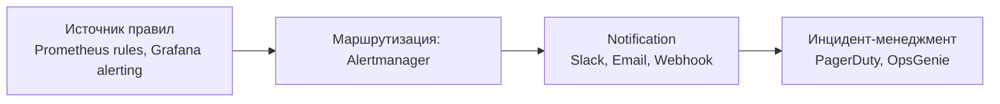

# Алертинг

Алертинг превращает метрики и логи в действия: правила срабатывают на нарушение SLO, сигнал доходит до on-call инженера через нужный канал, дубликаты подавляются, инциденты эскалируются. Раздел покрывает связку Prometheus + Alertmanager, интеграции с PagerDuty и Slack, а также базовые принципы построения алертов.

Для кого: SRE и backend-разработчики, которые настраивают правила в Prometheus/Grafana, маршрутизируют уведомления и хотят избежать alert fatigue. Документы дают минимальный конфиг для каждого инструмента и общие правила проектирования алертов.

## Полезные ссылки

### Основные документы
- [[alerting|Alerting (обзор)]] — концепции, каналы, частые ошибки
- [[alertmanager]] — маршрутизация, группировка, silence, inhibition
- [[pagerduty]] — инцидент-менеджмент и on-call ротации
- [[slack-alerting|Slack Alerting]] — форматирование, threads, mention-политика

### Соседние разделы
- [[README|Monitoring]] — корень раздела
- [[README|Metrics]] — Prometheus, Grafana, Micrometer
- [[README|Logging]] — структурированные логи как источник алертов
- [[README|Tracing]] — корреляция алерта с трейсом
- [[README|APM]] — альтернативные источники алертов

### Внешние ресурсы
- [Google SRE: Alerting on SLOs](https://sre.google/workbook/alerting-on-slos/)
- [Prometheus Alerting Best Practices](https://prometheus.io/docs/practices/alerting/)
- [PagerDuty Incident Response](https://response.pagerduty.com/)

## Содержание

- [Карта инструментов](#карта-инструментов)
- [Когда какой инструмент](#когда-какой-инструмент)
- [Связки с экосистемой](#связки-с-экосистемой)
- [Маршруты чтения](#маршруты-чтения)
- [Куда идти дальше](#куда-идти-дальше)

## Карта инструментов

## Когда какой инструмент

| Задача | Инструмент |
|--------|-----------|
| Правила на Prometheus-метрики (rate/latency/error) | Prometheus + [[alertmanager]] |
| Правила поверх Grafana Unified Alerting | Grafana (см. [[grafana]]) + [[alertmanager]] |
| Маршрутизация, группировка, silence | [[alertmanager]] |
| On-call, эскалации, schedule | [[pagerduty]] |
| Уведомления команде в чат | [[slack-alerting|Slack Alerting]] |
| Общие принципы и антипаттерны | [[alerting|Alerting (обзор)]] |

## Связки с экосистемой

- **Prometheus** ([[prometheus]]) отправляет алерты в Alertmanager через `alerting.alertmanagers`.
- **Grafana** ([[grafana]]) может использовать внешний Alertmanager или собственный Unified Alerting.
- **ELK** ([[elk-stack]]) — ElastAlert / Watcher для алертов на логи.
- **Jaeger/OTel** ([[jaeger]]) — алерты по аномалиям в трейсах через APM.
- **Kubernetes** ([[README]]) — kube-prometheus-stack содержит готовые алерты для control plane и нод.

## Маршруты чтения

- **Минимальный алертинг за день:** `Alerting (обзор)` -> `Alertmanager` -> `Slack Alerting`.
- **Production on-call:** весь раздел + `PagerDuty` + Google SRE Workbook (SLO-based alerting).
- **Диагностика alert fatigue:** `Alerting (обзор)` -> раздел группировки и inhibition в `Alertmanager`.

## Куда идти дальше

- Метрики и дашборды — [[README]]
- Практики мониторинга — [[monitoring-best-practices]]
- Observability в целом — [[observability-guide]]
- Логи и трейсы для расследования инцидента — [[README]], [[README]]
