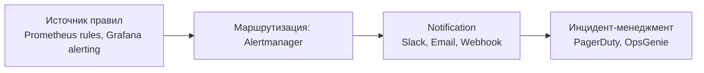

# Алертинг

Алертинг превращает метрики и логи в действия: правила срабатывают на нарушение SLO, сигнал доходит до on-call инженера через нужный канал, дубликаты подавляются, инциденты эскалируются. Раздел покрывает связку Prometheus + Alertmanager, интеграции с PagerDuty и Slack, а также базовые принципы построения алертов.

Для кого: SRE и backend-разработчики, которые настраивают правила в Prometheus/Grafana, маршрутизируют уведомления и хотят избежать alert fatigue. Документы дают минимальный конфиг для каждого инструмента и общие правила проектирования алертов.

## Полезные ссылки

### Основные документы
- [Alerting (обзор)](alerting.md) — концепции, каналы, частые ошибки
- [alertmanager](alertmanager.md) — маршрутизация, группировка, silence, inhibition
- [pagerduty](pagerduty.md) — инцидент-менеджмент и on-call ротации
- [Slack Alerting](slack-alerting.md) — форматирование, threads, mention-политика

### Соседние разделы
- [Monitoring](../../basics/README.md) — корень раздела
- [Metrics](../../basics/README.md) — Prometheus, Grafana, Micrometer
- [Logging](../../basics/README.md) — структурированные логи как источник алертов
- [Tracing](../../basics/README.md) — корреляция алерта с трейсом
- [APM](../../basics/README.md) — альтернативные источники алертов

### Внешние ресурсы
- [Google SRE: Alerting on SLOs](https://sre.google/workbook/alerting-on-slos/)
- [Prometheus Alerting Best Practices](https://prometheus.io/docs/practices/alerting/)
- [PagerDuty Incident Response](https://response.pagerduty.com/)

## Содержание

- [Карта инструментов](#карта-инструментов)
- [Когда какой инструмент](#когда-какой-инструмент)
- [Связки с экосистемой](#связки-с-экосистемой)
- [Маршруты чтения](#маршруты-чтения)
- [Куда идти дальше](#куда-идти-дальше)

## Карта инструментов

## Когда какой инструмент

| Задача | Инструмент |
|--------|-----------|
| Правила на Prometheus-метрики (rate/latency/error) | Prometheus + [alertmanager](alertmanager.md) |
| Правила поверх Grafana Unified Alerting | Grafana (см. [grafana](../metrics/grafana.md)) + [alertmanager](alertmanager.md) |
| Маршрутизация, группировка, silence | [alertmanager](alertmanager.md) |
| On-call, эскалации, schedule | [pagerduty](pagerduty.md) |
| Уведомления команде в чат | [Slack Alerting](slack-alerting.md) |
| Общие принципы и антипаттерны | [Alerting (обзор)](alerting.md) |

## Связки с экосистемой

- **Prometheus** ([prometheus](../metrics/prometheus.md)) отправляет алерты в Alertmanager через `alerting.alertmanagers`.
- **Grafana** ([grafana](../metrics/grafana.md)) может использовать внешний Alertmanager или собственный Unified Alerting.
- **ELK** ([elk-stack](../logging/elk-stack.md)) — ElastAlert / Watcher для алертов на логи.
- **Jaeger/OTel** ([jaeger](../tracing/jaeger.md)) — алерты по аномалиям в трейсах через APM.
- **Kubernetes** ([README](../../basics/README.md)) — kube-prometheus-stack содержит готовые алерты для control plane и нод.

## Маршруты чтения

- **Минимальный алертинг за день:** `Alerting (обзор)` -> `Alertmanager` -> `Slack Alerting`.
- **Production on-call:** весь раздел + `PagerDuty` + Google SRE Workbook (SLO-based alerting).
- **Диагностика alert fatigue:** `Alerting (обзор)` -> раздел группировки и inhibition в `Alertmanager`.

## Куда идти дальше

- Метрики и дашборды — [README](../../basics/README.md)
- Практики мониторинга — [monitoring-best-practices](../monitoring-best-practices.md)
- Observability в целом — [observability-guide](../observability-guide.md)
- Логи и трейсы для расследования инцидента — [README](../../basics/README.md), [README](../../basics/README.md)
