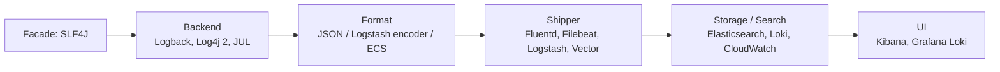

# Логирование

Раздел покрывает весь путь логов в JVM-приложениях: выбор фасада и бэкенда, уровни и MDC, структурированные JSON-логи с correlation-id, централизация через ELK/Fluentd, агрегация потоков логов через Kafka/Flink и лучшие практики производительности и безопасности.

Для кого: backend-инженеры и SRE, которые отвечают за наблюдаемость сервисов. Документы дают готовые конфиги Logback/Log4j, шаблоны JSON-логов, примеры агрегации и рекомендации по ретеншну и маскированию PII.

## Полезные ссылки

### Основные документы
- [Основы логирования](logging-basics.md) — уровни, фреймворки, JUL vs SLF4J vs Logback
- [slf4j](slf4j.md) — фасад, MDC, markers
- [logback](logback.md) — конфигурация, appenders, фильтры
- [log4j](log4j.md) — Apache Log4j 2, async logger, disruptor
- [Структурированное логирование](structured-logging.md) — JSON, correlation-id, ECS
- [Лучшие практики](logging-best-practices.md) — производительность, безопасность, PII
- [Централизованное логирование](centralized-logging.md) — сбор с множества нод
- [Агрегация логов](log-aggregation.md) — stream processing логов
- [ELK Stack](elk-stack.md) — Elasticsearch + Logstash + Kibana

### Подразделы
- [Fluentd](../../basics/README.md) — сборщик логов cross-source (CNCF)
- [Log Aggregation](../../basics/README.md) — решения по агрегации и обработке

### Соседние разделы
- [Monitoring](../../basics/README.md)
- [Metrics](../../basics/README.md)
- [Tracing](../../basics/README.md) — correlation trace-id <-> логи
- [Alerting](../../basics/README.md)
- [APM](../../basics/README.md)

### Внешние ресурсы
- [12 Factor App — Logs](https://12factor.net/logs)
- [Elastic Common Schema (ECS)](https://www.elastic.co/guide/en/ecs/current/index.html)
- [OpenTelemetry Logs](https://opentelemetry.io/docs/specs/otel/logs/)
- [OWASP Logging Cheat Sheet](https://cheatsheetseries.owasp.org/cheatsheets/Logging_Cheat_Sheet.html)

## Содержание

- [Карта инструментов](#карта-инструментов)
- [Когда что использовать](#когда-что-использовать)
- [Связки стека](#связки-стека)
- [Маршруты чтения](#маршруты-чтения)
- [Куда идти дальше](#куда-идти-дальше)

## Карта инструментов

## Когда что использовать

| Задача | Документ |
|--------|----------|
| Старт нового Java-сервиса | [slf4j](slf4j.md) + [logback](logback.md) |
| Высоконагруженное логирование (async) | [log4j](log4j.md) + disruptor |
| JSON-логи с correlation-id | [Структурированное логирование](structured-logging.md) |
| Сбор логов из множества подов | [Fluentd](../../basics/README.md), Filebeat -> ELK |
| Централизация и поиск | [ELK Stack](elk-stack.md), [Централизованное логирование](centralized-logging.md) |
| Stream processing логов | [Агрегация](../../basics/README.md) |
| Руководство по безопасности/PII | [Лучшие практики](logging-best-practices.md) |

## Связки стека

- **Prometheus** ([prometheus](../metrics/prometheus.md)) + **ELK** — метрики и логи в единой картине.
- **Jaeger/OpenTelemetry** ([README](../../basics/README.md)) — `trace_id` в логах связывает запрос со span-ом.
- **Grafana** ([grafana](../metrics/grafana.md)) — unified dashboards для метрик и Loki-логов.
- **Alertmanager** ([alertmanager](../alerting/alertmanager.md)) — алерты по паттернам логов через ElastAlert или Logstash-правила.
- **Kubernetes** — stdout/stderr подов собирает sidecar или node-agent (Fluent Bit, Filebeat).

## Маршруты чтения

- **Минимум для нового сервиса (1 день):** `logging-basics` -> `slf4j` -> `logback` -> `structured-logging`.
- **Production-ready pipeline:** + `centralized-logging` -> `elk-stack` -> `fluentd/` -> `logging-best-practices`.
- **Поиск узких мест в логах:** `log4j` (async) -> `log-aggregation/` -> профайлинг в [README](../../basics/README.md).

## Куда идти дальше

- Метрики — [README](../../basics/README.md)
- Распределённый трейсинг — [README](../../basics/README.md)
- Алерты на логи — [README](../../basics/README.md)
- Observability в целом — [observability-guide](../observability-guide.md)
