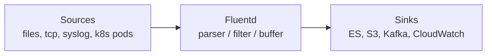

# Fluentd

Fluentd — open-source сборщик логов от CNCF, который унифицирует сбор, буферизацию и доставку логов из множества источников в множество приёмников. Используется как «клей» между приложениями/нодами и хранилищами логов (Elasticsearch, S3, Kafka, CloudWatch, Loki). Более лёгкий вариант — Fluent Bit, тот же проект, но на C и с меньшей памятью, оптимизирован для sidecar/daemon-set в Kubernetes.

Для кого: SRE и DevOps-инженеры, которые строят log pipeline в контейнерной или многоуровневой среде и выбирают между Fluentd, Logstash, Filebeat и Vector. Подраздел служит точкой входа: детальных конфигов Fluentd в репозитории пока нет, ссылки ведут на соседние документы и внешние материалы.

## Полезные ссылки

### Документы репозитория по теме
- [Централизованное логирование](../centralized-logging.md) — включает Fluentd/Fluent Bit как shipper
- [Агрегация логов](../log-aggregation.md) — stream-обработка поверх собранных логов
- [ELK Stack](../elk-stack.md) — типичный приёмник Fluentd-пайплайна
- [Структурированное логирование](../structured-logging.md) — формат, который Fluentd парсит и обогащает

### Соседние разделы
- [Logging (корень)](../../../basics/README.md)
- [Log Aggregation](../../../basics/README.md)
- [Monitoring](../../../basics/README.md)
- [Kubernetes](../../../basics/README.md) — запуск Fluentd как DaemonSet

### Внешние ресурсы
- [Fluentd Documentation](https://docs.fluentd.org/)
- [Fluent Bit Documentation](https://docs.fluentbit.io/)
- [Fluentd vs Fluent Bit](https://docs.fluentbit.io/manual/about/fluentd-and-fluent-bit)
- [Kubernetes Logging Architecture](https://kubernetes.io/docs/concepts/cluster-administration/logging/)
- [CNCF: Fluentd](https://www.cncf.io/projects/fluentd/)

## Содержание

- [Позиционирование Fluentd](#позиционирование-fluentd)
- [Fluentd vs альтернативы](#fluentd-vs-альтернативы)
- [Типичные связки стека](#типичные-связки-стека)
- [Маршруты чтения](#маршруты-чтения)
- [Куда идти дальше](#куда-идти-дальше)

## Позиционирование Fluentd

Fluentd реализует pattern "unified logging layer": входные плагины (input), фильтры (parse/record_transformer/grep), буфер (memory/file) и выходные плагины (match). Данные унифицируются в формате JSON с тегами маршрутизации.

## Fluentd vs альтернативы

| Инструмент | Когда выбирать |
|------------|----------------|
| Fluentd | Гибкие пайплайны, много source/sink плагинов, один агент на ноде |
| Fluent Bit | Sidecar/DaemonSet с низкой памятью (< 1 MB), простой pipeline |
| Filebeat | Уже используете Elastic Stack, нужен лёгкий shipper |
| Logstash | Нужна тяжёлая обработка/обогащение, не критичен footprint |
| Vector | Rust, unified agent для метрик+логов, высокая производительность |

## Типичные связки стека

- **Kubernetes -> Fluent Bit (DaemonSet) -> Fluentd (aggregator) -> Elasticsearch / Kafka** — стандартная двухуровневая схема.
- **App stdout -> Fluent Bit -> Loki + Grafana** ([grafana](../../metrics/grafana.md)) — лёгкая альтернатива ELK.
- **Fluentd -> Kafka -> Flink -> ES** — для stream processing логов, см. [README](../../../basics/README.md).
- **Приложение -> Fluentd -> CloudWatch / S3** — дешёвое архивирование.
- **Alertmanager** ([alertmanager](../../alerting/alertmanager.md)) не использует Fluentd напрямую, но алерты на паттерны логов строятся поверх ES, куда Fluentd доставляет данные.

## Маршруты чтения

- **Быстрый старт:** раздел про Fluentd в [centralized-logging.md](../centralized-logging.md) -> официальный quickstart Fluentd.
- **Kubernetes pipeline:** Kubernetes Logging Architecture (внешняя ссылка) -> DaemonSet с Fluent Bit -> агрегатор Fluentd.
- **Потоковая обработка логов:** [README](../../../basics/README.md).

## Куда идти дальше

- ELK в деталях — [elk-stack](../elk-stack.md)
- Лучшие практики логирования — [logging-best-practices](../logging-best-practices.md)
- Метрики и дашборды — [README](../../../basics/README.md)
- Kubernetes observability — [README](../../../basics/README.md)
