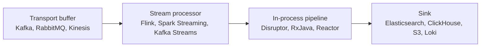

# Log Aggregation

Агрегация логов — это не просто сбор в хранилище, а обработка потоков: фильтрация, обогащение, парсинг, дедупликация, корреляция событий, построение метрик из логов, детект аномалий. Раздел раскрывает, когда нужна тяжёлая stream-processing поверх обычного ELK/Loki, и какие инструменты JVM-экосистемы для этого используются.

Для кого: инженеры, работающие с большими объёмами логов (сотни тысяч событий в секунду), командами security/fraud, и все, кому мало "просто положить JSON в Elasticsearch". Подраздел служит точкой входа: детальные материалы собраны в соседних файлах каталога logging/.

## Полезные ссылки

### Документы репозитория по теме
- [[log-aggregation|Агрегация логов]] — основной документ раздела (Kafka, Flink, Spark, Disruptor, RxJava/Reactor)
- [[centralized-logging|Централизованное логирование]] — доставка логов в центральное хранилище
- [[structured-logging|Структурированное логирование]] — формат для последующей агрегации
- [[elk-stack|ELK Stack]] — хранение и поиск после агрегации
- [[README|Fluentd]] — shipper-слой перед агрегатором

### Соседние разделы
- [[README|Logging (корень)]]
- [[README|Monitoring]]
- [[README|Metrics]] — derived metrics из логов
- [[README|Messaging]] — Kafka/RabbitMQ

### Внешние ресурсы
- [Apache Kafka](https://kafka.apache.org/)
- [Apache Flink](https://flink.apache.org/)
- [Apache Spark Streaming](https://spark.apache.org/streaming/)
- [LMAX Disruptor](https://lmax-exchange.github.io/disruptor/)
- [Elastic ECS](https://www.elastic.co/guide/en/ecs/current/index.html)

## Содержание

- [Когда нужна агрегация](#когда-нужна-агрегация)
- [Карта инструментов](#карта-инструментов)
- [Типичные связки стека](#типичные-связки-стека)
- [Маршруты чтения](#маршруты-чтения)
- [Куда идти дальше](#куда-идти-дальше)

## Когда нужна агрегация

- Объём логов > возможностей ES-индекса за разумные деньги.
- Требуется real-time обнаружение паттернов (fraud, security events, SLA breach).
- Нужны derived metrics (RPS, error rate) прямо из логов, без дублирующей инструментации.
- Корреляция событий между сервисами (multi-stream join).
- Обогащение логов данными из БД/справочников до записи в хранилище.

## Карта инструментов

## Типичные связки стека

- **App -> Fluent Bit -> Kafka -> Flink -> Elasticsearch** — классическая схема с буфером и enrichment.
- **App -> Logback Kafka appender -> Kafka Streams -> Grafana Loki** ([[grafana]]) — лёгкий стек.
- **App -> Disruptor -> async Logback -> файл** — in-process агрегация для минимизации влияния на hot-path.
- **Kafka -> Spark Streaming -> ClickHouse** — cost-effective аналитика по большим объёмам.
- Алерты по потоку строятся на выходе stream processor либо в [[alertmanager]] на derived-метриках.

## Маршруты чтения

- **Начало:** [[log-aggregation]] — основной Java-ориентированный документ.
- **Stream-подход:** Kafka Streams / Flink + [[README|../../messaging/README.md]].
- **Оптимизация in-process:** Disruptor -> [[log4j]] async logger.

## Куда идти дальше

- Hot-path логирование — [[log4j]], [[logback]]
- Fluentd-pipeline — [[README]]
- ELK — [[elk-stack]]
- Метрики из логов -> Prometheus — [[prometheus]]
