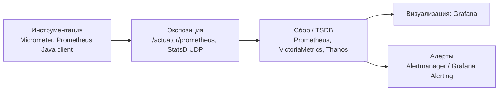

# Метрики

Метрики — один из трёх столпов observability: численные временные ряды о состоянии системы и приложений. Этот раздел покрывает сбор метрик (Prometheus, StatsD), их экспозицию из JVM-приложений (Micrometer), визуализацию (Grafana) и связку с алертингом и трейсингом.

Для кого: backend-инженеры и SRE, которые инструментируют Spring Boot / JVM-приложения, строят дашборды и настраивают SLO. Документы содержат минимальные конфиги, PromQL-примеры и шаблоны Grafana.

## Полезные ссылки

### Основные документы
- [[prometheus]] — pull-модель, PromQL, recording rules, Java client
- [[grafana]] — дашборды, алертинг, интеграция со Spring Boot
- [[micrometer]] — vendor-neutral API метрик для JVM
- [[statsd]] — лёгкий UDP-демон для push-модели

### Соседние разделы
- [[README|Monitoring]]
- [[README|Alerting]] — алерты на метрики (Alertmanager)
- [[README|Tracing]] — корреляция трейсов и метрик
- [[README|Logging]] — derived metrics из логов
- [[README|APM]]

### Внешние ресурсы
- [Prometheus](https://prometheus.io/docs/)
- [Grafana Docs](https://grafana.com/docs/)
- [Micrometer](https://micrometer.io/)
- [Google SRE Book: Monitoring](https://sre.google/sre-book/monitoring-distributed-systems/) — Four Golden Signals
- [RED / USE methodology](https://www.brendangregg.com/usemethod.html)

## Содержание

- [Карта инструментов](#карта-инструментов)
- [Когда что использовать](#когда-что-использовать)
- [Связки стека](#связки-стека)
- [Маршруты чтения](#маршруты-чтения)
- [Куда идти дальше](#куда-идти-дальше)

## Карта инструментов

## Когда что использовать

| Задача | Документ / инструмент |
|--------|-----------------------|
| Сбор метрик из JVM-приложения | [[micrometer]] + Spring Boot Actuator |
| Хранилище и запросы | [[prometheus]] + PromQL |
| Дашборды | [[grafana]] |
| Push-модель (UDP) для коротких задач/legacy | [[statsd]] |
| Long-term storage | Thanos / VictoriaMetrics (см. [[prometheus]]) |
| Алерты на метрики | [[alertmanager]] |

## Связки стека

- **Spring Boot + Micrometer + Prometheus** — базовая связка для любого Java-сервиса: Micrometer собирает, Actuator выставляет `/actuator/prometheus`, Prometheus скрейпит.
- **Prometheus + Alertmanager** ([[alertmanager]]) — правила в Prometheus, маршрутизация в Alertmanager.
- **Prometheus + Grafana** — дашборды с PromQL-запросами; Grafana Unified Alerting как альтернатива Alertmanager.
- **OpenTelemetry Metrics** ([[opentelemetry]]) — альтернатива Micrometer с общим SDK для трейсов/метрик/логов.
- **ELK + Prometheus Exporter** — derived metrics из логов (см. [[README]]).
- **Kubernetes** — `kube-prometheus-stack`, node-exporter, cAdvisor ([[infrastructure-monitoring]]).

## Маршруты чтения

- **Минимум для Spring Boot-сервиса:** `Micrometer` -> `Prometheus` -> `Grafana`.
- **Проектирование SLO:** `Prometheus` (recording rules) -> Google SRE Workbook -> `../alerting/README.md`.
- **Legacy push-стек:** `StatsD` -> `Prometheus` (через statsd_exporter).

## Куда идти дальше

- Алерты — [[README]]
- Трейсинг — [[README]]
- Логирование — [[README]]
- Observability — [[observability-guide]]
- Инфраструктурный мониторинг — [[infrastructure-monitoring]]
