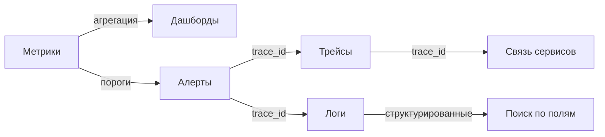
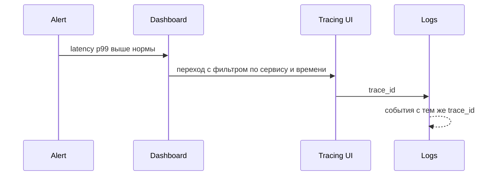
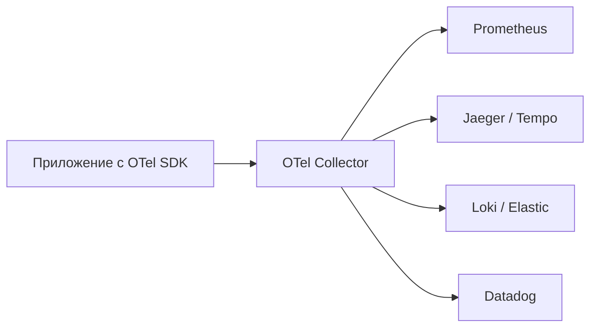

# Observability: руководство

Observability — способность отвечать на новые вопросы о работе системы по её
выходным данным, не выкатывая дополнительных проверок. Это шире мониторинга:
мониторинг следит за заранее известными показателями, observability позволяет
исследовать поведение системы постфактум.

Основа — три типа сигналов: метрики, логи, трейсы. Документ объясняет, что и
когда собирать, как считать SLI/SLO, как корректно настраивать sampling, как
коррелировать сигналы между собой через `trace_id`.

## Полезные ссылки

### Официальная документация

- [OpenTelemetry](https://opentelemetry.io/docs/) — стандарт сбора телеметрии
- [Prometheus](https://prometheus.io/docs/) — система метрик и алертинга
- [W3C Trace Context](https://www.w3.org/TR/trace-context/) — стандарт распространения trace_id
- [Google SRE Book](https://sre.google/sre-book/table-of-contents/) — главы про SLI, SLO, monitoring

### Обучающие материалы

- [Distributed Systems Observability (Cindy Sridharan)](https://www.oreilly.com/library/view/distributed-systems-observability/9781492043431/) — книга
- [The USE Method (Brendan Gregg)](https://www.brendangregg.com/usemethod.html) — для инфраструктуры
- [The RED Method (Tom Wilkie)](https://www.weave.works/blog/the-red-method-key-metrics-for-microservices-architecture/) — для сервисов

### См. также

- [Лучшие практики мониторинга](monitoring-best-practices.md) — оперативные принципы
- [Infrastructure Monitoring](infrastructure-monitoring.md) — мониторинг хостов, K8s, БД
- [Prometheus](metrics/prometheus.md) — сбор метрик
- [Micrometer](metrics/micrometer.md) — фасад метрик в JVM-сервисах
- [OpenTelemetry](tracing/opentelemetry.md) — трейсы и метрики через OTel
- [Distributed Tracing](tracing/distributed-tracing.md) — основы distributed tracing
- [Structured Logging](logging/structured-logging.md) — структурированные логи

## Содержание

- [Observability vs мониторинг](#observability-vs-мониторинг)
- [Три столпа: метрики, логи, трейсы](#три-столпа-метрики-логи-трейсы)
- [Какие метрики собирать](#какие-метрики-собирать)
  - [Golden Signals (Google SRE)](#golden-signals-google-sre)
  - [RED для сервисов](#red-для-сервисов)
  - [USE для ресурсов](#use-для-ресурсов)
- [SLI, SLO, SLA, error budget](#sli-slo-sla-error-budget)
- [Логи: что, как и куда](#логи-что-как-и-куда)
- [Трейсы и контекст](#трейсы-и-контекст)
- [Sampling: как не утонуть в данных](#sampling-как-не-утонуть-в-данных)
- [Корреляция сигналов](#корреляция-сигналов)
- [OpenTelemetry: единый стандарт](#opentelemetry-единый-стандарт)
- [Кардинальность лейблов](#кардинальность-лейблов)
- [Стоимость и retention](#стоимость-и-retention)
- [Решение проблем](#решение-проблем)
- [Лучшие практики](#лучшие-практики)

## Observability vs мониторинг

| Свойство | Мониторинг | Observability |
|----------|-----------|---------------|
| Цель | Реакция на известные сбои | Расследование неизвестных |
| Подход | Заранее заданные метрики и алерты | Высокая детализация плюс инструменты для произвольных запросов |
| Артефакты | Дашборды, алерты | Метрики плюс логи плюс трейсы плюс events |
| Ключевой вопрос | «Сломано ли?» | «Почему сломано?» |

В современной микросервисной системе одного мониторинга недостаточно: количество
комбинаций состояний слишком велико, чтобы заранее заводить алерты на всё.
Observability — это про возможность задать вопрос задним числом.

## Три столпа: метрики, логи, трейсы



| Сигнал | Что отвечает | Объём | Стоимость хранения |
|--------|--------------|-------|--------------------|
| Метрики | Что и сколько | Низкий (агрегаты) | Низкая |
| Логи | Что произошло, в деталях | Высокий | Высокая |
| Трейсы | Как запрос прошёл по сервисам | Средний (с sampling) | Средняя |

Каждый сигнал отвечает на свой класс вопросов. Метрики дают общий пульс,
логи — детали по конкретному событию, трейсы — путь запроса между сервисами.

## Какие метрики собирать

### Golden Signals (Google SRE)

Четыре универсальные метрики для любого сервиса:

| Сигнал | Что измеряет | Пример |
|--------|--------------|--------|
| Latency | Длительность запроса | p50, p95, p99 в миллисекундах |
| Traffic | Нагрузка | Запросы в секунду |
| Errors | Доля ошибок | 5xx / total |
| Saturation | Заполненность ресурса | CPU %, очередь Kafka, размер пула соединений |

Saturation сложнее остальных: критическая метрика часто специфична для системы
(длина очереди, использование пула, lock-wait time). Найди узкое место и
измеряй именно его.

### RED для сервисов

Подмножество Golden Signals для request-driven сервисов (HTTP, gRPC):

- Rate — запросы в секунду.
- Errors — доля или количество ошибок.
- Duration — распределение латентности.

Если в Prometheus развёрнут стандартный набор, RED получаются из одной метрики
типа Histogram:

```text
http_server_requests_seconds_count{service="orders",status="500"}
histogram_quantile(0.95, sum(rate(http_server_requests_seconds_bucket[5m])) by (le, service))
```

### USE для ресурсов

Для инфраструктуры (CPU, диск, сеть, память):

- Utilization — насколько ресурс использован (% времени или объёма).
- Saturation — очередь к ресурсу (load average, iowait, длина очереди).
- Errors — события сбоев (битые пакеты, дисковые ошибки).

USE применяется к каждому компоненту: на хосте отдельно к CPU, к памяти, к
каждому диску, к сетевым интерфейсам.

| Метод | Где применять |
|-------|---------------|
| Golden Signals | Любой пользовательский сервис |
| RED | HTTP/gRPC сервисы |
| USE | Хосты, K8s узлы, базы данных, очереди |

## SLI, SLO, SLA, error budget

| Понятие | Расшифровка | Пример |
|---------|-------------|--------|
| SLI | Service Level Indicator — измеряемая метрика | Доля HTTP-ответов с кодом 2xx или 3xx |
| SLO | Service Level Objective — целевое значение SLI | 99.9% за 30 дней |
| SLA | Service Level Agreement — контракт с пенальти | 99.5%, иначе компенсация заказчику |
| Error Budget | Допустимая доля сбоев | 100% минус SLO = 0.1% за 30 дней ≈ 43 минуты простоя |

Хороший SLI — это отношение «успешные / всего», не среднее. Среднее (например,
average latency) скрывает хвосты. Используй перцентили p95/p99.

```text
# SLI: доля «быстрых и успешных» запросов
sli = sum(rate(http_requests_total{status=~"2..|3..", duration_le="0.5"}[5m]))
    / sum(rate(http_requests_total[5m]))
```

Error budget — это явное соглашение, сколько ошибок допустимо. Когда бюджет
исчерпан до конца периода — нужно прекращать релизы и стабилизировать систему.

## Логи: что, как и куда

**Формат:** JSON, обязательные поля — `timestamp`, `level`, `message`, `service`,
`trace_id`, `span_id`. Дополнительно: `user_id`, `request_id`, бизнес-контекст.

```json
{
  "timestamp": "2026-04-26T12:00:00Z",
  "level": "ERROR",
  "service": "orders",
  "trace_id": "5b8aa5a2d2c872e8321cf37308d69df2",
  "span_id": "051581bf3cb55c13",
  "message": "Failed to charge payment",
  "order_id": "ord-1234",
  "amount": 100.50,
  "error": "PaymentDeclined: insufficient funds"
}
```

**Уровни:**

| Уровень | Когда использовать |
|---------|--------------------|
| ERROR | Сбой, требующий внимания: исключение, отказ зависимого сервиса |
| WARN | Аномалия, но без падения: ретрай помог, fallback сработал |
| INFO | Ключевые бизнес-события: создан заказ, успешная оплата |
| DEBUG | Детали для отладки, выключены в проде по умолчанию |
| TRACE | Очень подробный шаг — редко, только для расследований |

**Антипаттерны:**

- Логировать каждый HTTP-запрос на INFO — это работа метрик.
- Хранить персональные данные в логах без маскирования.
- Делать `log.info(payload.toString())` без структурирования.
- Бросать stack trace на каждый business validation error.

Подробнее — в [Structured Logging](logging/structured-logging.md).

## Трейсы и контекст

Трейс — дерево span'ов. Каждый span — операция: HTTP-запрос, SQL-запрос,
вызов Kafka. У span есть `trace_id` (общий для всего трейса), `span_id`
(уникальный) и `parent_span_id`.

Контекст распространяется между сервисами через HTTP-заголовки. Стандарт —
W3C Trace Context: заголовок `traceparent`.

```text
traceparent: 00-5b8aa5a2d2c872e8321cf37308d69df2-051581bf3cb55c13-01
             ^   ^                                ^                ^
             |   |                                |                флаги (sampled)
             |   |                                span_id
             |   trace_id
             версия
```

Что хорошо включать в спан:

- HTTP-метод, URL-template (без query), статус-код.
- Имя SQL-запроса (без параметров) и длительность.
- Имя Kafka-топика, оффсет, консьюмер-группу.
- Бизнес-идентификаторы как атрибуты (`order.id`, `user.id`).

Что не класть:

- Сырые SQL с пользовательскими параметрами (PII, риск утечки).
- Тело HTTP-запроса целиком.
- Аутентификационные токены.

## Sampling: как не утонуть в данных

При высокой нагрузке хранить 100% трейсов дорого и не нужно. Sampling
определяет, какую долю записывать.

| Стратегия | Как работает | Когда подходит |
|-----------|--------------|----------------|
| Head-based (probabilistic) | Решение в начале трейса (например, 10%) | Любая стационарная нагрузка |
| Tail-based | Решение по завершению трейса (по длительности, ошибкам) | Когда важно ловить аномалии |
| Adaptive | Автоматическая подстройка под объём трафика | Шумные сервисы |
| Per-route | Разные ставки для разных эндпоинтов | Health-чеки — 0%, оплаты — 100% |

> Tail-based sampling требует промежуточного буфера (OpenTelemetry Collector с
> tail-sampling processor) и больше памяти. Зато гарантированно ловит все ошибки
> и медленные запросы.

Базовая рекомендация: head-based 1–10% на стандартный трафик плюс отдельный
правило для ошибок и медленных запросов через tail-sampling.

## Корреляция сигналов

Цель: от алерта по метрике дойти до конкретного запроса в логах и трейсе.



Технические требования:

- В логи обязательно прокидывается `trace_id` (Spring: MDC + Logback pattern;
  Go: контекст-aware logger).
- В метриках можно добавлять exemplar — ссылку на конкретный trace, попавший
  в bucket гистограммы.
- Из дашборда есть переход в Jaeger/Tempo по `service` + временной диапазон.

Spring Boot пример с Logback и MDC:

```xml
<pattern>%d %-5level [%X{traceId:-},%X{spanId:-}] %logger{36} - %msg%n</pattern>
```

## OpenTelemetry: единый стандарт

OpenTelemetry (OTel) — стандарт CNCF для метрик, логов и трейсов. Заменяет
зоопарк вендорских SDK (Datadog, New Relic, Jaeger client).



Преимущества:

- Один SDK в коде — много backend'ов в Collector.
- Смена вендора — меняется только конфигурация Collector.
- Auto-instrumentation для популярных библиотек (HTTP, JDBC, Kafka).

Минимальная инструментация Java:

```bash
java -javaagent:opentelemetry-javaagent.jar \
     -Dotel.service.name=orders \
     -Dotel.exporter.otlp.endpoint=http://otel-collector:4317 \
     -jar app.jar
```

Подробнее — в [OpenTelemetry](tracing/opentelemetry.md).

## Кардинальность лейблов

Каждое уникальное сочетание лейблов в Prometheus — отдельная серия метрики.
Высокая кардинальность убивает Prometheus по памяти.

**Плохие лейблы (высокая кардинальность):**

- `user_id` — миллионы значений.
- `request_id` — уникален на каждый запрос.
- `email` — то же.
- Полный URL с query string.

**Хорошие лейблы:**

- `service`, `endpoint` (template, без переменных).
- `status_code` (десятки значений).
- `region`, `instance`.
- Бизнес-категории с фиксированным числом значений (`payment_method`).

> Правило: если лейбл может принимать тысячи и более значений — это поле для
> логов или трейса, не для метрики. Метрики предназначены для агрегатов.

## Стоимость и retention

| Сигнал | Типичный retention | Где экономить |
|--------|--------------------|---------------|
| Метрики | 30 дней высокого разрешения, год — пониженного | Recording rules для сжатия, downsampling |
| Логи | 7–30 дней | Sampling INFO, отдельный pipeline для ERROR |
| Трейсы | 3–7 дней | Sampling, не хранить health-чеки |

Закон Парето в логах: 90% объёма генерируют 10% строк (часто INFO от какого-то
шумного компонента). Точечный фикс одного логгера часто экономит больше, чем
повышение лимитов хранилища.

## Решение проблем

| Симптом | Причина | Что сделать |
|---------|---------|-------------|
| Трейсы обрываются между сервисами | Не пробрасывается `traceparent` | Проверить, что HTTP-клиент использует OTel auto-instrumentation; фолбэк — пробрасывать заголовки явно |
| Логи без `trace_id` | MDC не настроен или логгер не включает поле | Добавить `traceId` в pattern Logback; проверить, что логирование вызывается из контекста OTel |
| Prometheus падает по памяти | Высокая кардинальность лейблов | Найти проблемную метрику через `/api/v1/status/tsdb`, убрать лейбл с user_id и подобными |
| Метрики показывают нули после деплоя | Изменились имена метрик | Recording rules для совместимости, обновить дашборды и алерты |
| Алерты flapping (мигают) | Слишком короткое окно или малый порог | Использовать `for: 5m` в Prometheus, считать на 5–15 минут |
| 99-й перцентиль латентности шумит | Слишком короткое окно | Считать p99 за 5–10 минут, отдельные long-window SLO |
| Трейсы есть, но не видно SQL | JDBC-инструментация не подключена | Auto-instrumentation для JDBC включить через javaagent или модуль OTel |
| Sampling режет важные ошибки | Только head-based sampling | Добавить tail-sampling по `error=true` и `latency > N` |

## Лучшие практики

- Внедряй три сигнала одновременно: метрики плюс структурированные логи плюс
  trace_id с самого начала, не «сначала только логи, потом добавим».
- Считай SLO от пользовательского взгляда, не от технических компонентов.
- Алерты — только на симптом (latency, error rate), не на причину
  (CPU 80%). Причина расследуется по дашборду.
- Не клади в метрики поля высокой кардинальности — это работа логов и трейсов.
- В логах — обязательно `trace_id`. Это связующее звено всех трёх столпов.
- Sampling трейсов — head-based 1–10% плюс tail для ошибок и медленных.
- Используй OpenTelemetry, чтобы не быть привязанным к вендору.
- Регулярно проверяй кардинальность Prometheus и стоимость retention в логах —
  они растут незаметно.
- Делай runbooks для топ-алертов: куда смотреть, какие запросы запускать.
- Делай post-mortem после крупных инцидентов: что в observability помешало
  быстро найти причину, что добавить.

**Итог:** observability стоит на трёх сигналах с общим `trace_id` для корреляции.
Метрики — для дашбордов и алертов по симптомам, логи — для деталей события,
трейсы — для пути запроса между сервисами. SLO задают цель, error budget —
рамку для управления риском.
