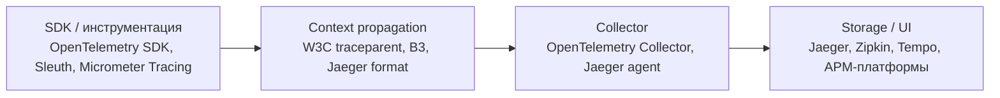

# Распределённый трейсинг

Распределённый трейсинг показывает путь запроса через множество сервисов: какие span-ы выполнялись, сколько заняли, где узкое место, где произошла ошибка. В связке с метриками и логами трейсы замыкают третий столп observability и незаменимы для диагностики производительности в микросервисной архитектуре.

Для кого: backend-инженеры и SRE в распределённых системах, архитекторы микросервисов, разработчики клиентских SDK. Документы дают базовые концепции (trace, span, context propagation), практические примеры инструментации и конфиги Jaeger/Zipkin для Spring Boot.

## Полезные ссылки

### Основные документы
- [[distributed-tracing|Distributed Tracing (концепции)]] — Span, Trace, Context Propagation, W3C Trace Context
- [[opentelemetry]] — единый vendor-neutral стандарт SDK + collector
- [[jaeger]] — CNCF-бэкенд для трейсов, UI, Spring Boot интеграция
- [[zipkin]] — альтернативный бэкенд, Sleuth-интеграция

### Соседние разделы
- [[README|Monitoring]]
- [[README|Metrics]] — Prometheus + Grafana
- [[README|Logging]] — корреляция `trace_id` с логами
- [[README|Alerting]]
- [[README|APM]]

### Внешние ресурсы
- [OpenTelemetry Project](https://opentelemetry.io/)
- [W3C Trace Context](https://www.w3.org/TR/trace-context/)
- [Jaeger](https://www.jaegertracing.io/)
- [Zipkin](https://zipkin.io/)
- [Google Dapper paper](https://research.google/pubs/pub36356/) — исходная идея distributed tracing

## Содержание

- [Карта инструментов](#карта-инструментов)
- [Когда что использовать](#когда-что-использовать)
- [Связки стека](#связки-стека)
- [Маршруты чтения](#маршруты-чтения)
- [Куда идти дальше](#куда-идти-дальше)

## Карта инструментов

## Когда что использовать

| Задача | Инструмент |
|--------|-----------|
| Vendor-neutral SDK, на долгий срок | [[opentelemetry]] |
| CNCF OSS backend с UI | [[jaeger]] |
| Простой backend, Sleuth + Spring Cloud | [[zipkin]] |
| Базовая теория, Span/Trace/Baggage | [[distributed-tracing|Distributed Tracing]] |
| Grafana Tempo (дешёвое хранилище) | связка OTel -> Tempo + [[grafana]] |
| Платный all-in-one APM | [[README]] (Datadog, New Relic) |

## Связки стека

- **OpenTelemetry SDK + OTel Collector + Jaeger/Zipkin/Tempo** — vendor-neutral путь.
- **Spring Boot + Micrometer Tracing + Zipkin/Jaeger** — стандарт для Spring с 3.x.
- **Prometheus + Jaeger + ELK** — три столпа observability, связка по `trace_id` во всех трёх.
- **Grafana** ([[grafana]]) умеет визуализировать трейсы (Tempo) рядом с метриками и логами (Loki).
- **Kubernetes** — OTel Operator автоматически инструментирует поды через auto-instrumentation.
- **Alertmanager** ([[alertmanager]]) работает на метриках, производных от трейсов (например, p99 latency из span-ов).

## Маршруты чтения

- **Концепции за час:** [[distributed-tracing]] -> W3C Trace Context (внешняя ссылка).
- **Быстрый старт Spring Boot:** [[opentelemetry]] -> [[jaeger]].
- **Миграция с Sleuth:** [[zipkin]] -> Micrometer Tracing -> OpenTelemetry.

## Куда идти дальше

- Метрики — [[README]]
- Логирование — [[README]]
- Observability — [[observability-guide]]
- APM-платформы — [[README]]
