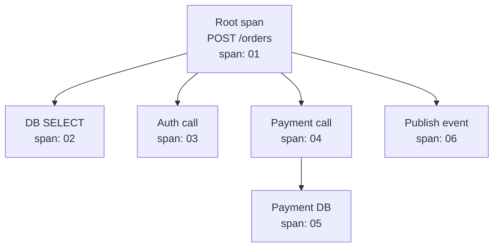
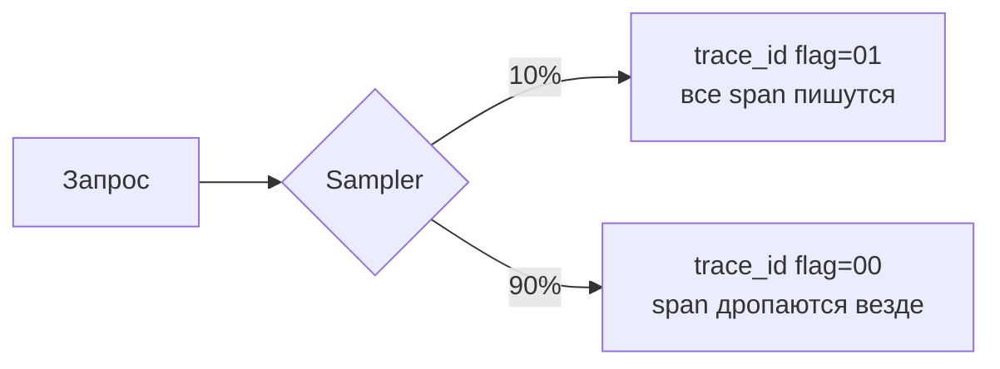
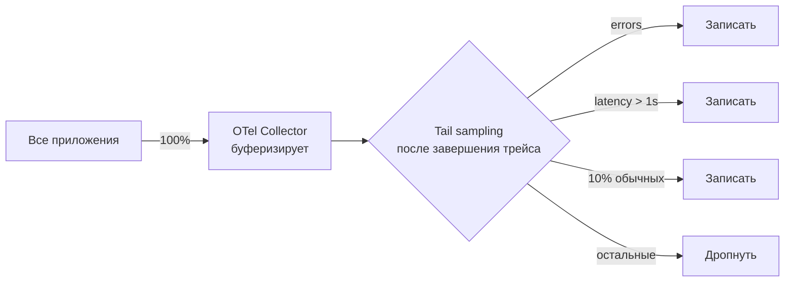
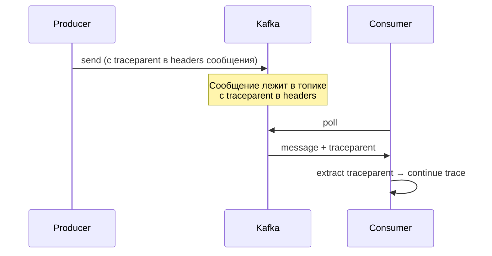
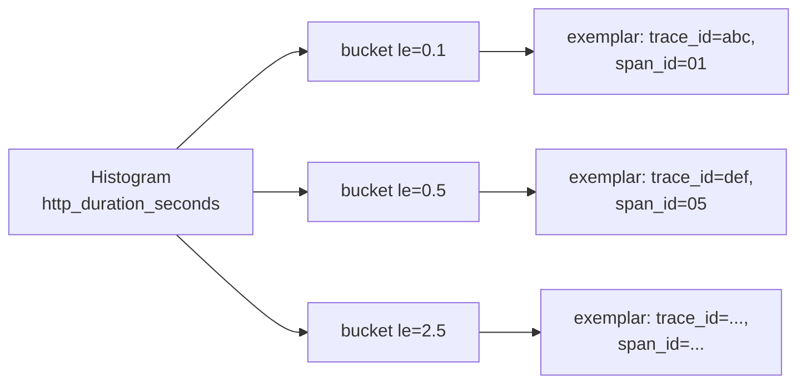

# Distributed Tracing: концепции

Distributed tracing — методика наблюдения за запросом, который проходит
через несколько процессов, сетей и хранилищ. Каждый шаг помечен общим
`trace_id`. По окончании запроса можно увидеть полное дерево вызовов:
кто кого звал, сколько занял каждый шаг, где была ошибка.

Документ описывает модель Dapper, propagation между сервисами (B3 vs W3C),
стратегии sampling, корреляцию с логами и метриками, сравнение backend'ов
(Jaeger, Zipkin, Tempo, Datadog APM, Honeycomb). Конкретика по
OpenTelemetry — в [OpenTelemetry](opentelemetry.md).

## Полезные ссылки

### Официальная документация

- [Dapper paper (Google)](https://research.google/pubs/pub36356/) — оригинал, 2010
- [W3C Trace Context](https://www.w3.org/TR/trace-context/) — стандартные заголовки
- [OpenTelemetry Tracing](https://opentelemetry.io/docs/concepts/signals/traces/) — концепции
- [OpenTracing (legacy)](https://opentracing.io/specification/) — устарел, заменён OTel

### Обучающие материалы

- [Mastering Distributed Tracing (Yuri Shkuro)](https://www.shkuro.com/books/2019-mastering-distributed-tracing/) — каноничная книга от автора Jaeger
- [The RED Method (Tom Wilkie)](https://www.weave.works/blog/the-red-method-key-metrics-for-microservices-architecture/) — request-driven метрики
- [Honeycomb: What is observability](https://www.honeycomb.io/blog/observability-101) — серия статей

### См. также

- [OpenTelemetry](opentelemetry.md) — стандарт сбора телеметрии
- [Jaeger](jaeger.md) — popular tracing backend
- [Zipkin](zipkin.md) — альтернативный backend
- [Observability: руководство](../observability-guide.md) — три столпа
- [Monitoring Best Practices](../monitoring-best-practices.md) — алерты и runbooks
- [Structured Logging](../logging/structured-logging.md) — корреляция с логами
- [Prometheus](../metrics/prometheus.md) — метрики и exemplars

## Содержание

- [Зачем нужен distributed tracing](#зачем-нужен-distributed-tracing)
- [Модель Dapper: trace и span](#модель-dapper-trace-и-span)
- [Анатомия span](#анатомия-span)
- [Span kinds: SERVER, CLIENT, PRODUCER, CONSUMER](#span-kinds-server-client-producer-consumer)
- [Propagation: B3 и W3C Trace Context](#propagation-b3-и-w3c-trace-context)
- [Baggage и пользовательский контекст](#baggage-и-пользовательский-контекст)
- [Sampling: head vs tail](#sampling-head-vs-tail)
- [Async и очереди: трейсинг через Kafka](#async-и-очереди-трейсинг-через-kafka)
- [Exemplars: связь метрик и трейсов](#exemplars-связь-метрик-и-трейсов)
- [Корреляция логов с трейсами](#корреляция-логов-с-трейсами)
- [Backend: Jaeger, Zipkin, Tempo, Datadog, Honeycomb](#backend-jaeger-zipkin-tempo-datadog-honeycomb)
- [Стоимость и хранение](#стоимость-и-хранение)
- [Что трассировать](#что-трассировать)
- [Что НЕ класть в spans](#что-не-класть-в-spans)
- [Решение проблем](#решение-проблем)
- [Лучшие практики](#лучшие-практики)

## Зачем нужен distributed tracing

В монолите проблема видна в стеке вызовов и логе одного процесса. В
микросервисной архитектуре один пользовательский запрос проходит через
5–20 сервисов. Логи разбросаны, времена отдельных шагов не сопоставимы,
причину тормозов не найти без общего идентификатора.

Distributed tracing решает три задачи:

| Задача | Что отвечает |
|--------|--------------|
| Диагностика медленных запросов | Какой шаг тормозит, какой сервис упал |
| Понимание зависимостей | Какие сервисы реально вызывает мой backend |
| Анализ архитектуры | Где избыточные хопы, что можно объединить |

Без трейсинга расследование медленного запроса в микросервисах — это
час разглядывания логов. С трейсингом — клик в UI Jaeger по `trace_id`
и сразу видно дерево с длительностью каждого узла.

## Модель Dapper: trace и span

Канонические понятия из статьи Google Dapper (2010):

- **Trace** — полный путь запроса по системе. Имеет `trace_id`.
- **Span** — одна операция в этом пути. У span есть `span_id` и `parent_span_id`.
- **Trace tree** — дерево, корень которого — root span (входной запрос).



Все 6 span'ов имеют один `trace_id`. У root span `parent_span_id` пуст.
У остальных он указывает на родителя.

Trace из 1 span — обычный одиночный вызов. Trace на 100+ span'ов — тяжёлая
бизнес-операция через 10 сервисов с 50 SQL-запросами и 30 кешами.

## Анатомия span

| Поле | Описание | Пример |
|------|----------|--------|
| `trace_id` | 16 байт hex, общий для всего трейса | `5b8aa5a2d2c872e8321cf37308d69df2` |
| `span_id` | 8 байт hex, уникальный | `051581bf3cb55c13` |
| `parent_span_id` | 8 байт hex, ссылка на родителя | `00f067aa0ba902b7` |
| `name` | Имя операции | `POST /orders`, `db.query` |
| `start_time` | Наносекунды | `1714145000123456789` |
| `end_time` | Наносекунды | `1714145000234567890` |
| `kind` | SERVER / CLIENT / PRODUCER / CONSUMER / INTERNAL | `SERVER` |
| `status` | OK / ERROR с описанием | `ERROR: timeout` |
| `attributes` | Key-value пары (тэги) | `http.status_code=500` |
| `events` | Лог-сообщения с timestamp в рамках span | `exception.thrown @ T+10ms` |
| `links` | Ссылки на другие span'ы (batch, fan-in) | `link to span X в trace Y` |
| `resource` | Атрибуты процесса (общие для всех span приложения) | `service.name=orders` |

Длительность = `end_time - start_time`. Это main signal для performance
analysis.

## Span kinds: SERVER, CLIENT, PRODUCER, CONSUMER

Тип span определяет роль операции и влияет на расчёт метрик.

| Kind | Когда |
|------|-------|
| `SERVER` | Вход в сервис: HTTP-handler, gRPC server method |
| `CLIENT` | Исходящий запрос: HTTP-call, JDBC query, Redis GET |
| `PRODUCER` | Отправка в очередь (Kafka, RabbitMQ) |
| `CONSUMER` | Чтение из очереди |
| `INTERNAL` | Внутренняя операция: бизнес-метод, парсинг |

Бэкенды используют kind для корректной отрисовки:

- Server-spans — вершины сервиса.
- Client-spans — стрелки между сервисами.
- Producer/Consumer — связь через очередь без direct call.

Стандарт OpenTelemetry также определяет атрибуты, специфичные для kind:
`http.method`, `http.route` для HTTP-server; `db.system`, `db.statement`
для DB-client; `messaging.system`, `messaging.destination.name` для очередей.

## Propagation: B3 и W3C Trace Context

Контекст между сервисами передаётся через HTTP/gRPC заголовки. Несколько
форматов исторически:

| Формат | Заголовки | Происхождение |
|--------|-----------|---------------|
| W3C Trace Context | `traceparent`, `tracestate` | Стандарт W3C, текущий default |
| B3 (single header) | `b3` | Zipkin Brave |
| B3 (multi header) | `x-b3-traceid`, `x-b3-spanid`, `x-b3-sampled`, `x-b3-parentspanid` | Zipkin |
| Jaeger | `uber-trace-id` | Jaeger |
| AWS X-Ray | `X-Amzn-Trace-Id` | AWS X-Ray |

W3C — современный стандарт, OTel по умолчанию использует именно его:

```text
traceparent: 00-5b8aa5a2d2c872e8321cf37308d69df2-051581bf3cb55c13-01
             ^   ^                                ^                ^
             |   |                                |                flags (sampled)
             |   |                                span_id
             |   trace_id (16 байт)
             версия
tracestate: vendor1=value1,vendor2=value2
```

`tracestate` — для вендорских данных (Datadog, AWS), не теряется при
проходе через системы.

`flags`:

- `01` — sampled (записать).
- `00` — not sampled (можно дропать).

Другие биты зарезервированы.

**Совместимость:** OTel умеет одновременно несколько форматов. Если у тебя
часть сервисов на старом Zipkin Brave, часть на OTel:

```bash
OTEL_PROPAGATORS=tracecontext,baggage,b3,b3multi,jaeger
```

OTel пропишет в исходящий запрос все включённые форматы. Входящий — попробует
прочитать первый совпавший.

> Для Greenfield-проекта только W3C Trace Context. B3 и Jaeger — для legacy
> совместимости.

## Baggage и пользовательский контекст

Baggage — отдельный механизм propagation для пользовательского контекста.
Не для самого трейса, а для того, что должно быть доступно всем downstream
сервисам.

```text
baggage: user.id=alice,tenant.id=t-12345,feature.flag=new-flow
```

Кейсы:

- Прокинуть `tenant_id` во все downstream сервисы для multi-tenant.
- Передать `feature_flag` для A/B-тестирования.
- Прокинуть `request_priority` для приоритезации.

```java
Baggage.current().toBuilder()
    .put("user.id", userId)
    .put("tenant.id", tenantId)
    .build()
    .makeCurrent();

// В downstream сервисе
String tenant = Baggage.current().getEntryValue("tenant.id");
```

> Не клади в baggage чувствительные данные — он передаётся в HTTP-заголовках
> в plain. И не клади много: каждый запрос несёт baggage, лишний килобайт
> заметно увеличивает трафик.

## Sampling: head vs tail

Хранить 100% трейсов в проде с миллионами RPS — дорого и не нужно. Sampling
решает, какую долю записывать.

### Head-based sampling

Решение принимается в начале трейса (на первом, root span). Если решено
не записывать — все downstream span'ы тоже пропускаются.



Стратегии head-based:

| Стратегия | Логика |
|-----------|--------|
| AlwaysOn | 100% — для dev и низкого трафика |
| AlwaysOff | 0% — выключено |
| TraceIdRatioBased | По хешу trace_id: детерминированно |
| ParentBased | Уважает решение родительского span |
| Adaptive | Подстраивается под текущую нагрузку |

**ParentBased + TraceIdRatioBased** — рекомендуемая комбинация:

```text
OTEL_TRACES_SAMPLER=parentbased_traceidratio
OTEL_TRACES_SAMPLER_ARG=0.1
```

Smart-кейс: «всегда сэмплировать health-чеки 0%, остальное 10%»:

```text
OTEL_TRACES_SAMPLER=parentbased_jaeger_remote
```

Плюсы head-based:

- Простота: решение мгновенное, вся цепочка пропускается без буфера.
- Не нужны промежуточные сервисы.

Минусы:

- Можем пропустить интересный трейс (с ошибкой или медленный).
- Нет контроля по содержимому.

### Tail-based sampling

Решение принимается после завершения трейса. Видим длительность, статус,
атрибуты — можем выбрать прицельно.



OTel Collector tail-sampling processor:

```yaml
processors:
  tail_sampling:
    decision_wait: 10s              # ждать после первого span трейса
    num_traces: 100000              # буфер
    expected_new_traces_per_sec: 50
    policies:
      - name: errors
        type: status_code
        status_code: { status_codes: [ERROR] }
      - name: slow
        type: latency
        latency: { threshold_ms: 1000 }
      - name: probabilistic
        type: probabilistic
        probabilistic: { sampling_percentage: 5 }
```

Плюсы tail-based:

- Гарантированно ловит ошибки и медленные запросы.
- Тонкая настройка по любым атрибутам.

Минусы:

- Collector держит в памяти весь трейс — нужно много RAM.
- Решение откладывается на 10–30 секунд.
- Сложнее эксплуатация: централизованный collector — точка отказа.

**Гибрид:** head-based 5–10% базово, tail-based для ошибок и медленных
запросов. Это даёт визуализацию через систему без потери критичных
случаев.

## Async и очереди: трейсинг через Kafka

Трейс может пересекать not-direct-call границы: producer → broker → consumer.



Подход:

- Producer: создаёт span типа PRODUCER, кладёт `traceparent` в headers
  Kafka-сообщения.
- Consumer: при чтении читает `traceparent` из headers, создаёт span типа
  CONSUMER со ссылкой на producer span (через link или parent).

Особенности:

- В трейсе появляется «промежуток» — время в очереди (между producer и
  consumer). Это часть трейса, видна в UI.
- Если consumer обрабатывает batch — можно создать один span на batch со
  ссылками (links) на все producer-spans.
- При длительной задержке в очереди (часы, дни) трейс может «протухнуть».
  Тогда лучше начать новый trace, но связать через link.

OpenTelemetry auto-instrumentation для Kafka, RabbitMQ, AWS SQS уже умеет
это автоматически.

## Exemplars: связь метрик и трейсов

Exemplar — конкретный пример, попавший в bucket гистограммы. Это ссылка
с метрики на trace, давший такое значение.



При взгляде на дашборд latency: видишь спайк p99 → клик на конкретный
bucket → переход в Tempo/Jaeger по `trace_id` → видишь, что именно тормозило.

Поддерживается в Prometheus (с протоколом OpenMetrics), Grafana Tempo,
Datadog. В OTel:

```java
DoubleHistogram histogram = meter.histogramBuilder("http.server.request.duration")
    .setUnit("s")
    .build();

// При записи добавляется exemplar с текущим Span
histogram.record(0.123, Attributes.of(stringKey("http.route"), "/orders"));
```

Это убирает разрыв между метриками и трейсами — самая мощная фича для
дебага в production.

## Корреляция логов с трейсами

Логи без `trace_id` — слепые. Структурированный лог должен содержать `trace_id`
и `span_id` каждой записи.

В Java через MDC:

```xml
<!-- logback.xml -->
<pattern>
  %d{ISO8601} %-5level [%X{trace_id:-},%X{span_id:-}] %logger{36} - %msg%n
</pattern>
```

OpenTelemetry Java agent автоматически кладёт `trace_id` и `span_id` в MDC
для Logback и Log4j. Ничего вручную не нужно.

В Go через slog handler:

```go
h := otelslog.NewHandler("orders")  // добавляет trace_id из контекста
slog.SetDefault(slog.New(h))
slog.InfoContext(ctx, "order created", "id", orderID)
// {"time":"...","level":"INFO","msg":"order created","id":"...","trace_id":"abc","span_id":"01"}
```

Workflow дебага:

1. Алерт по метрике → переход в дашборд.
2. Видишь exemplar спайка → клик по `trace_id` → Jaeger UI.
3. Видишь span с ошибкой → копируешь `trace_id`.
4. Идёшь в Loki/Elastic с фильтром `trace_id=...` → весь лог события.

Без correlation — этот поиск занимает 30 минут гадания.

## Backend: Jaeger, Zipkin, Tempo, Datadog, Honeycomb

Backend — система, хранящая трейсы и предоставляющая UI для поиска.

| Backend | Тип | Storage | Особенности |
|---------|-----|---------|-------------|
| Jaeger | OSS, CNCF | Cassandra, Elasticsearch, Badger (single-node), ScyllaDB | Богатый UI, дерево spans, service graph |
| Zipkin | OSS | Cassandra, Elasticsearch, MySQL | Старше Jaeger, проще, меньше функций |
| Grafana Tempo | OSS | Object storage (S3, GCS) | Очень дёшево, но без сложного поиска (TraceQL — недавно) |
| Datadog APM | SaaS | Datadog | Богатый UI, ML-anomaly, дорогой |
| Honeycomb | SaaS | Honeycomb | Лучший UI для exploratory analysis (BubbleUp), pricing per event |
| New Relic | SaaS | New Relic | APM-фокус, крепкий integraton с метриками |
| AWS X-Ray | Cloud | AWS-managed | AWS-only, простой |
| Lightstep / ServiceNow | SaaS | Cloud | Большая аналитика на трейсах |

| Сравнение | Jaeger | Tempo | Datadog APM | Honeycomb |
|-----------|--------|-------|-------------|-----------|
| Стоимость | OSS, своё железо | Очень дёшево (S3) | Дорогой по объёму | Per event, growing |
| Поиск по тегам | Есть | TraceQL (Grafana 10+) | Богатый | Лучший в индустрии |
| Service graph | Есть | Через Grafana | Есть | Есть |
| Корреляция с метриками | Через Grafana | Native в Grafana | Native | Native |
| Анализ паттернов | Слабо | Слабо | ML | BubbleUp (отличный) |
| Setup сложность | Средняя | Простая | Простая | Очень простая |

**Когда что:**

- **Tempo** — для cost-эффективного OSS-стека (Grafana + Loki + Mimir + Tempo).
  Не очень хорош для exploratory queries, но дёшев.
- **Jaeger** — для команд, которым нужен богатый UI и self-hosted.
- **Datadog/Honeycomb** — для команд с бюджетом, кому критичен time-to-debug.
- **AWS X-Ray** — для AWS-only команд, которые не хотят управлять своим
  инструментом.

## Стоимость и хранение

Главная проблема трейсов в проде — объём.

```text
1 span = ~1 KB сериализованных данных
1 трейс = 10-100 spans = 10-100 KB
1000 RPS × 100 spans/trace × 1 KB × 10% sampling = ~10 MB/s = ~30 TB/year
```

Подходы к удешевлению:

| Подход | Эффект |
|--------|--------|
| Aggressive sampling (1%) | x10–x100 уменьшение |
| Tail-based для критичных | Ловим важное, остальное — мало |
| Tempo на S3 | Object storage в 10x дешевле локального диска |
| Retention 3–7 дней | По истечении часто забываешь о трейсе |
| Drop низкоценных span'ов в Collector | health-чеки, healthz |

> Метрики живут год, логи — 7–30 дней, трейсы — 3–7 дней. Это типичная
> retention-политика. Трейсы не для исторического анализа; они для
> расследования сейчас.

## Что трассировать

Имеет смысл создавать spans для:

| Операция | Тип span |
|----------|----------|
| Входящий HTTP/gRPC запрос | SERVER |
| Исходящий HTTP/gRPC | CLIENT |
| SQL-запрос | CLIENT (db) |
| Чтение/запись в кеш | CLIENT (cache) |
| Отправка в очередь | PRODUCER |
| Чтение из очереди | CONSUMER |
| Вызов сторонней SaaS | CLIENT |
| Долгая бизнес-операция (> 10ms) | INTERNAL |

Не нужно создавать spans для:

- Тривиальных in-memory операций (сложение, сравнение).
- Каждой строки SQL: один span на запрос достаточно.
- Каждого вызова утилитного метода.

Всё ещё нужно сэмплирование — даже описанный список спанов даёт сотни на
один запрос в сложном flow.

## Что НЕ класть в spans

| Что | Почему |
|-----|--------|
| Полные SQL с пользовательскими параметрами | PII, риск утечки. Используй sanitizer |
| Тело HTTP-запроса целиком | Огромный объём, может быть PII |
| Auth-токены, API-ключи | Утечка = компрометация |
| Поля высокой кардинальности (user_id) | Не для метрик, но и не для атрибутов span (логично, но всё ещё растят базу) |
| Stack trace на каждый span | Только при ошибках через `recordException` |

OTel auto-instrumentation для JDBC по умолчанию включает sanitizer:

```text
otel.instrumentation.jdbc.statement-sanitizer.enabled=true
```

Перед prod включи. Это срежет литералы из SQL: `SELECT * FROM users WHERE id = 123`
становится `SELECT * FROM users WHERE id = ?`. Никаких персональных данных.

## Решение проблем

| Симптом | Причина | Что сделать |
|---------|---------|-------------|
| Трейсы не появляются в backend | Неправильный endpoint, недоступный Collector | Проверь `OTEL_EXPORTER_OTLP_ENDPOINT`, попробуй curl, посмотри логи приложения |
| Трейс обрывается между сервисами | Не передаётся `traceparent` | Auto-instrumentation HTTP-клиента, включить пропагатор B3 для legacy |
| Внутри одного сервиса span'ы без parent | Контекст не пробрасывается между потоками/корутинами | `Context.makeCurrent()`, для async — захват и восстановление контекста |
| Кардинальность метрик растёт из-за лейблов span | Atributos типа `user_id` уходят в metrics view | Не используй высоко-кардинальные attributes для метрик; для span — допустимо |
| Сэмплирование режет важные ошибки | Только head-based | Добавь tail-sampling для status=ERROR |
| Trace в Jaeger обрывается на async-обработке | Producer-Consumer не связаны | Включи Kafka-инструментацию OTel; проверь, что headers пробрасываются |
| Нет способа найти медленный trace | Нет exemplars и tail-sampling | Включи tail-sampling по latency, exemplars в Prometheus |
| 99-й перцентиль latency растёт, но в трейсах ничего | Sampling режет именно медленные | Tail-based по latency-threshold |
| `db.statement` содержит PII | Sanitizer не включён | `otel.instrumentation.jdbc.statement-sanitizer.enabled=true` |
| Высокая нагрузка от samplers | Probability 100% в проде | Снизить до 1–10% head + tail для error/slow |

## Лучшие практики

- W3C Trace Context — стандарт. B3/Jaeger — только для legacy compat.
- Auto-instrumentation покрывает 80% — Java agent, OTel SDK для Go/Python.
- Resource атрибуты обязательны: `service.name`, `service.version`,
  `deployment.environment`.
- Sampling: head-based 1–10% + tail для errors и slow.
- Корреляция с логами через `trace_id` в MDC/structured logging — обязательна.
- Sanitizer для SQL-statements в проде.
- Не клади PII, токены, тела запросов в attributes.
- Exemplars в Prometheus для перехода метрика → trace.
- Naming спанов — стандартный (HTTP-метод + route, db.operation),
  не кастомный.
- Async и очереди: пробрасывай контекст через headers сообщений,
  не теряй PRODUCER → CONSUMER связь.
- Backend выбирай по бюджету и команде: Tempo для cost-conscious,
  Honeycomb для analytics-driven, Datadog для full APM.
- Retention — 3–7 дней для трейсов. Не пытайся хранить год.
- Регулярно ревьюй — какие spans бесполезны, какие attributes не читают.
  Чисти.

**Итог:** distributed tracing — обязательная практика в микросервисах.
Trace = дерево span'ов с общим `trace_id`. Propagation через W3C Trace
Context. Sampling — гибрид head + tail. Корреляция с метриками (exemplars)
и логами (trace_id в MDC) превращает три разрозненных потока данных в
единое наблюдение. Backend — по бюджету: Tempo дешёвый, Datadog/Honeycomb
дорогой и удобный.
