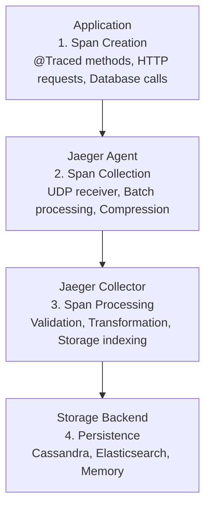
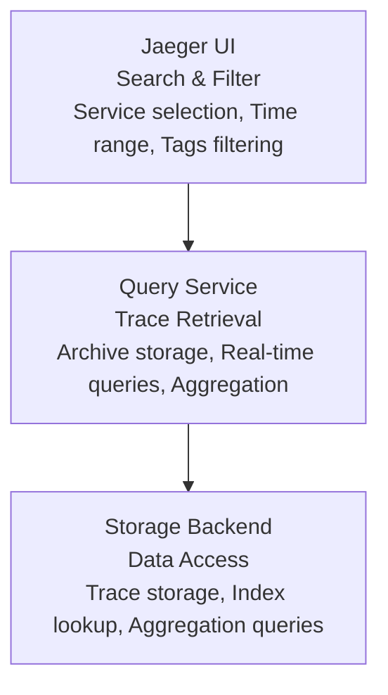
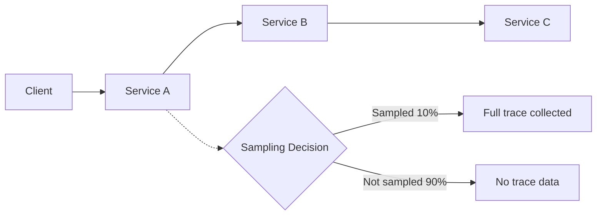
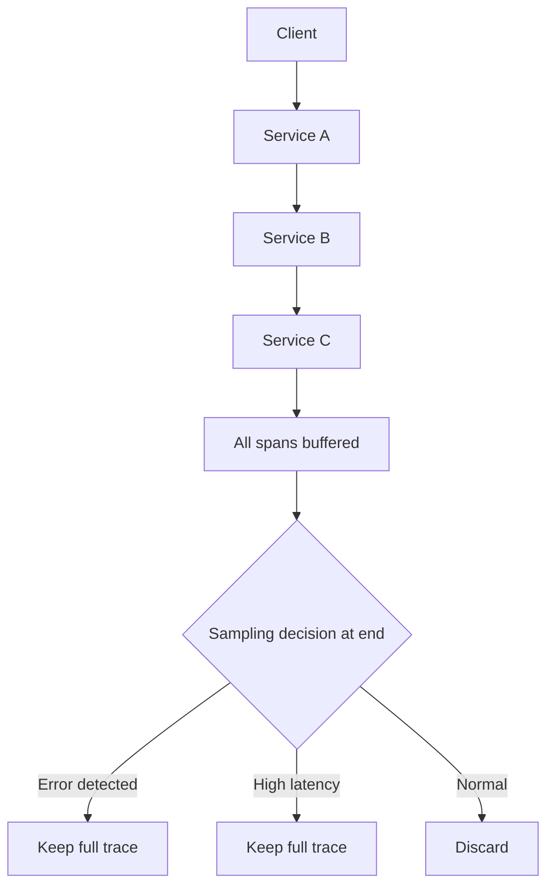

# Jaeger для Java

Комплексное руководство по использованию **Jaeger** для **distributed tracing** в **Java**-приложениях: настройка, интеграция с **Spring Boot**, анализ производительности и отладка распределенных систем.

## Полезные ссылки

### Официальная документация
- [Jaeger Documentation](https://www.jaegertracing.io/docs/) — основная документация
- [Jaeger Architecture](https://www.jaegertracing.io/docs/latest/architecture/)
- [Jaeger Client Libraries](https://www.jaegertracing.io/docs/latest/client-libraries/)

### Java интеграции
- [OpenTelemetry Java](https://opentelemetry.io/docs/instrumentation/java/) — стандарт для **tracing**
- [Spring Cloud Sleuth](https://spring.io/projects/spring-cloud-sleuth) — **Spring** интеграция
- [Micrometer Tracing](https://micrometer.io/docs/tracing) — **Tracing abstraction**

### Лучшие практики
- [Distributed Tracing Guide](https://opentelemetry.io/docs/concepts/observability-primer/)
- [OpenTelemetry Best Practices](https://opentelemetry.io/docs/best-practices/)
- [Tracing in Microservices](https://www.jaegertracing.io/docs/latest/)

### См. также
- [[grafana|Grafana]] — визуализация метрик
- [[distributed-tracing|Distributed Tracing]] — общие концепции
- [Monitoring README](../) — основы **Observability**

- [[zipkin|Zipkin]]
- [[opentelemetry|OpenTelemetry]]
- [[go-observability|Go: наблюдаемость]]
## Содержание

- [Введение в Jaeger](#введение-в-jaeger)
  - [Почему Jaeger?](#почему-jaeger)
  - [Основные компоненты](#основные-компоненты)
    - [Jaeger Client](#jaeger-client)
    - [Jaeger Agent](#jaeger-agent)
    - [Jaeger Collector](#jaeger-collector)
    - [Storage Backends](#storage-backends)
- [Архитектура Jaeger](#архитектура-jaeger)
  - [Hot path (production)](#hot-path-production)
  - [Query path (UI)](#query-path-ui)
  - [Sampling strategies](#sampling-strategies)
    - [Head sampling](#head-sampling)
    - [Tail sampling](#tail-sampling)
- [Установка и настройка](#установка-и-настройка)
  - [Установка Jaeger](#установка-jaeger)
    - [Docker (all-in-one)](#docker-all-in-one)
    - [Kubernetes развертывание](#kubernetes-развертывание)
  - [Storage configuration](#storage-configuration)
- [OpenTelemetry интеграция](#opentelemetry-интеграция)
  - [OpenTelemetry Java Agent](#opentelemetry-java-agent)
    - [Auto-instrumentation](#auto-instrumentation)
    - [Manual instrumentation](#manual-instrumentation)
- [Spring Boot интеграция](#spring-boot-интеграция)
  - [Spring Cloud Sleuth](#spring-cloud-sleuth)
    - [Maven зависимости](#maven-зависимости)
    - [Application properties](#application-properties)
    - [Custom tracing](#custom-tracing)
  - [Spring Boot 3 + Micrometer](#spring-boot-3-micrometer)
    - [Configuration](#configuration)
- [Micrometer Tracing](#micrometer-tracing)
  - [Micrometer Tracing API](#micrometer-tracing-api)
- [Custom instrumentation](#custom-instrumentation)
  - [Database tracing](#database-tracing)
    - [JDBC instrumentation](#jdbc-instrumentation)
  - [HTTP client tracing](#http-client-tracing)
    - [RestTemplate tracing](#resttemplate-tracing)
- [Context propagation](#context-propagation)
  - [Baggage propagation](#baggage-propagation)
- [Sampling strategies](#sampling-strategies-1)
  - [Probabilistic sampling](#probabilistic-sampling)
    - [Constant sampling](#constant-sampling)
- [Storage backends](#storage-backends-1)
  - [Cassandra configuration](#cassandra-configuration)
    - [Schema initialization](#schema-initialization)
    - [Production Cassandra](#production-cassandra)
  - [Elasticsearch configuration](#elasticsearch-configuration)
- [Query и анализ](#query-и-анализ)
  - [Jaeger Query API](#jaeger-query-api)
    - [Search traces](#search-traces)
    - [Dependencies](#dependencies)
  - [Advanced queries](#advanced-queries)
- [Performance monitoring](#performance-monitoring)
  - [Tracing metrics](#tracing-metrics)
  - [Performance dashboards](#performance-dashboards)
    - [Jaeger performance queries](#jaeger-performance-queries)
- [Решение проблем](#решение-проблем)
  - [Распространенные проблемы](#распространенные-проблемы)
    - [Traces not appearing](#traces-not-appearing)
    - [Missing spans](#missing-spans)
    - [High latency](#high-latency)
    - [Storage issues](#storage-issues)
  - [Debug techniques](#debug-techniques)
- [Лучшие практики](#лучшие-практики-1)
  - [1. Span naming](#1-span-naming)
    - [Consistent naming](#consistent-naming)
- [Частые вопросы](#частые-вопросы)

## Введение в Jaeger

**Jaeger** — это **open-source** система для **distributed tracing**, которая помогает отслеживать запросы через сложные распределенные системы. **Jaeger** собирает, хранит и визуализирует **traces** — последовательности связанных операций в микросервисной архитектуре.

### Почему Jaeger?

**Jaeger** предоставляет комплексные возможности для tracing:

1. **Distributed tracing** — отслеживание запросов через сервисы
2. **Performance analysis** — анализ **latency** и **bottlenecks**
3. **Root cause analysis** — быстрая диагностика проблем
4. **Service dependencies** — визуализация зависимостей
5. **Sampling** — эффективный сбор данных
6. **Multiple storage** — различные **backends** для хранения
7. **Open standards** — поддержка **OpenTelemetry**
8. **Real-time monitoring** — **live tracing** данных

### Основные компоненты

#### Jaeger Client
- **Instrumentation** — добавление **tracing** кода
- **Span creation** — создание и управление **spans**
- **Context propagation** — передача контекста между сервисами
- **Sampling** — выборка **traces** для анализа

#### Jaeger Agent
- **Data collection** — сбор **traces** от клиентов
- **Buffering** — буферизация данных
- **Batch sending** — пакетная отправка в **collector**
- **Load balancing** — распределение нагрузки

#### Jaeger Collector
- **Data processing** — обработка и валидация **traces**
- **Storage** — сохранение в **backend**
- **Indexing** — индексация для быстрого поиска
- **Aggregation** — агрегация данных

#### Storage Backends
- **Cassandra** — распределенное хранение
- **Elasticsearch** — поиск и аналитика
- **Memory** — **in-memory storage** для **development**
- **Badger** — **embedded key-value store**

## Архитектура Jaeger

### Hot path (production)



### Query path (UI)



### Sampling strategies

#### Head sampling


Решение консистентно для всех сервисов.

#### Tail sampling


## Установка и настройка

### Установка Jaeger

**Jaeger** может быть развернут различными способами: **all-in-one** для разработки, распределенное развертывание для **production**. Выбор архитектуры зависит от требований к масштабируемости и надежности.

#### Docker (all-in-one)

**All-in-one** образ объединяет все компоненты **Jaeger** в одном контейнере, что идеально подходит для разработки, тестирования и небольших **production** сред.

```bash
# Базовый запуск для development с debug логированием
docker run -d \
  --name jaeger \
  # UI порт для веб-интерфейса
  -p 16686:16686 \
  # Collector порт для приема traces (HTTP)
  -p 14268:14268 \
  # gRPC порт для приема traces
  -p 14250:14250 \
  # Используем официальный all-in-one образ
  jaegertracing/all-in-one:latest \
  # Детальное логирование для debugging
  --log-level=debug

# Проверка запуска
docker ps | grep jaeger
docker logs jaeger
```

**Запуск с persistent storage:**
```bash
# Jaeger с хранением данных на диске
docker run -d \
  --name jaeger \
  -p 16686:16686 \
  -p 14268:14268 \
  -p 14250:14250 \
  # Volume для хранения traces
  -v jaeger-data:/tmp \
  jaegertracing/all-in-one:latest \
  # Информационное логирование
  --log-level=info \
  # Максимальное количество traces в памяти (для ограничения потребления)
  --memory.max-traces=100000 \
  # Максимальный размер span в памяти
  --memory.max-traces=50000 \
  # Время жизни traces в памяти (24 часа)
  --span-storage-ttl=24h
```

Compose: образ `jaegertracing/all-in-one`, порты 16686 (UI), 14268 (HTTP), 14250 (gRPC), `COLLECTOR_OTLP_ENABLED=true`, `SPAN_STORAGE_TYPE=memory`. См. [документацию](https://www.jaegertracing.io/docs/latest/deployment/).

#### Kubernetes развертывание

Deployment с образом `jaegertracing/all-in-one`, порты 16686 (UI), 14268, 14250; env: `COLLECTOR_OTLP_ENABLED=true`, `SPAN_STORAGE_TYPE=memory`. Service (ClusterIP) для доступа к Jaeger. Для production: отдельные Collector и Query, Cassandra или Elasticsearch; PVC для хранения. Полные манифесты — [документация Jaeger](https://www.jaegertracing.io/docs/latest/deployment/#kubernetes).

### Storage configuration

**Cassandra:** StatefulSet с образом `cassandra:3.11`, keyspace и таблицы создаются Jaeger или вручную (см. [документацию](https://www.jaegertracing.io/docs/latest/deployment/#cassandra)). **Elasticsearch:** Deployment с образом Elasticsearch 7.x, индексы `jaeger-span-*`.

## OpenTelemetry интеграция

### OpenTelemetry Java Agent

#### Auto-instrumentation
```bash
# Запуск приложения с OpenTelemetry agent
java -javaagent:opentelemetry-javaagent.jar \
  -Dotel.service.name=my-service \
  -Dotel.traces.exporter=jaeger \
  -Dotel.exporter.jaeger.endpoint=http://jaeger:14268/api/traces \
  -jar my-application.jar

# С sampling
java -javaagent:opentelemetry-javaagent.jar \
  -Dotel.service.name=my-service \
  -Dotel.traces.sampler=traceidratio \
  -Dotel.traces.sampler.arg=0.1 \
  -Dotel.traces.exporter=jaeger \
  -Dotel.exporter.jaeger.endpoint=http://jaeger:14268/api/traces \
  -jar my-application.jar
```

#### Manual instrumentation

Зависимости **Maven** для **OpenTelemetry** и экспорта в **Jaeger**.

```xml
<dependency>
    <groupId>io.opentelemetry</groupId>
    <artifactId>opentelemetry-api</artifactId>
    <version>1.25.0</version>
</dependency>
<dependency>
    <groupId>io.opentelemetry</groupId>
    <artifactId>opentelemetry-sdk</artifactId>
    <version>1.25.0</version>
</dependency>
<dependency>
    <groupId>io.opentelemetry</groupId>
    <artifactId>opentelemetry-exporter-jaeger</artifactId>
    <version>1.25.0</version>
</dependency>
```

Настройка: `Resource` с именем сервиса, `JaegerGrpcSpanExporter` (endpoint Jaeger), `BatchSpanProcessor`, `SdkTracerProvider` с sampler (например `traceIdRatioBased(0.1)`), регистрация через `OpenTelemetrySdk.builder().setTracerProvider(tracerProvider).buildAndRegisterGlobal()`. Graceful shutdown: `tracerProvider.shutdown()`.

## Spring Boot интеграция

### Spring Cloud Sleuth

#### Maven зависимости
```xml
<dependency>
    <groupId>org.springframework.cloud</groupId>
    <artifactId>spring-cloud-starter-sleuth</artifactId>
</dependency>
<dependency>
    <groupId>org.springframework.cloud</groupId>
    <artifactId>spring-cloud-sleuth-zipkin</artifactId>
</dependency>
```

#### Application properties
```yaml
spring:
  application:
    name: user-service
  sleuth:
    sampler:
      probability: 0.1  # 10% sampling
    web:
      enabled: true
    messaging:
      enabled: true
  zipkin:
    base-url: http://zipkin:9411/  # Для совместимости
```

#### Custom tracing

`Tracer tracer` — инжектируется Sleuth. Создание span: `tracer.nextSpan().name("createUser").start()`, обёртка в `tracer.withSpanInScope(span)`, теги `span.tag("key", "value")`, дочерние span для вложенных операций, `span.error(e)` и `span.finish()` в finally.

### Spring Boot 3 + Micrometer

#### Configuration
```yaml
management:
  tracing:
    enabled: true
    sampling:
      probability: 0.1
  opentelemetry:
    tracing:
      endpoint: http://jaeger:14268/api/traces
```

`@Bean OpenTelemetry` с `SdkTracerProvider`, `JaegerGrpcSpanExporter`, `BatchSpanProcessor`, sampler; `@Bean Tracer` из `openTelemetry.getTracer("user-service", "1.0.0")`.

## Micrometer Tracing

### Micrometer Tracing API

**Observation API:** `Observation.createNotStarted("processPayment", observationRegistry).lowCardinalityKeyValue(...).observe(() -> { ... })` — создаёт span и метрики. **Timer API:** `Timer.builder("db.query.duration").register(registry)` и `queryTimer.recordCallable(() -> ...)` для замера длительности.

## Custom instrumentation

### Database tracing

#### JDBC instrumentation

Расширение `JdbcTemplate` или обёртка вызовов: span с именем `jdbc.query`, теги `db.statement`, `db.operation`, `db.instance`; вызов `super.queryForObject` в `withSpanInScope`, `span.error(e)` и `span.finish()` в finally.

JPA/Hibernate: оборачивание вызовов репозитория в span через @Aspect или использование автоинструментации OpenTelemetry.

### HTTP client tracing

#### RestTemplate tracing

`RestTemplate.getInterceptors().add(new ClientHttpRequestInterceptor)` — в interceptor создаётся span `http.client`, теги `http.method`, `http.url`, `http.status_code`; инъекция `x-trace-id` и `x-span-id` в заголовки запроса; вызов `execution.execute()` в `withSpanInScope`.

**WebClient:** ExchangeFilterFunction для span и инъекции trace context (аналогично RestTemplate).

**Kafka:** передача trace context в заголовках сообщений; ProducerInterceptor для создания span и инъекции x-trace-id/x-span-id. OpenTelemetry Java Agent инструментирует Kafka автоматически.

## Context propagation

### Baggage propagation

**Baggage** передаётся через `Baggage.current().toBuilder().put("key", "value").build().makeCurrent()`. **W3C Trace Context**: заголовок `traceparent` в формате `00-{traceId}-{spanId}-{flags}`; извлечение и инъекция через OpenTelemetry API.

## Sampling strategies

### Probabilistic sampling

#### Constant sampling
```java
@Configuration
public class SamplingConfig {

    @Bean
    public Sampler constantSampler() {
        // Sample 10% of all traces
        return Sampler.traceIdRatioBased(0.1);
    }

    @Bean
    public Sampler alwaysOnSampler() {
        // Sample all traces (for development)
        return Sampler.alwaysOn();
    }

    @Bean
    public Sampler alwaysOffSampler() {
        // Sample no traces (for high-throughput)
        return Sampler.alwaysOff();
    }
}
```

**Parent-based** и **dynamic sampling** позволяют выбирать по родительскому контексту или по нагрузке; см. [документацию Jaeger](https://www.jaegertracing.io/docs/latest/sampling/).

## Storage backends

### Cassandra configuration

#### Schema initialization
```bash
# Создание keyspace
cqlsh -e "CREATE KEYSPACE IF NOT EXISTS jaeger_v1 WITH REPLICATION = {'class' : 'SimpleStrategy', 'replication_factor' : 1 };"

# Создание таблиц (автоматически делает Jaeger)
# Или вручную:
cqlsh -e "USE jaeger_v1; DESCRIBE TABLES;"
```

#### Production Cassandra
```yaml
# Cassandra cluster configuration
apiVersion: cassandra.k8s.elastic.co/v1beta1
kind: CassandraCluster
metadata:
  name: jaeger-cassandra
spec:
  nodesPerRack: 3
  racks:
  - name: rack1
    zone: us-east1-a
  - name: rack2
    zone: us-east1-b
  - name: rack3
    zone: us-east1-c
  resources:
    requests:
      memory: 8Gi
      cpu: 2000m
    limits:
      memory: 16Gi
      cpu: 4000m
  storage:
    size: 500Gi
```

### Elasticsearch configuration

**Index templates** и **index lifecycle management**: шаблоны для `jaeger-span-*` (traceID, spanID, operationName, serviceName, startTime, duration); ILM для rollover, warm/cold и удаления старых индексов — см. [документацию Jaeger](https://www.jaegertracing.io/docs/latest/deployment/#elasticsearch).

## Query и анализ

### Jaeger Query API

#### Search traces
```bash
# Поиск traces по service
curl "http://jaeger:16686/api/traces?service=user-service&limit=20"

# Поиск с фильтрами
curl "http://jaeger:16686/api/traces?service=user-service&operation=createUser&limit=10&start=1609459200000&end=1609462800000"

# Поиск по trace ID
curl "http://jaeger:16686/api/traces/1234567890abcdef"

# Поиск с тегами
curl "http://jaeger:16686/api/traces?service=user-service&tags=%7B%22error%22%3A%22true%22%7D"
```

#### Dependencies
```bash
# Получение dependency graph
curl "http://jaeger:16686/api/dependencies?endTs=1609462800000&lookback=3600000000000"

# Services
curl "http://jaeger:16686/api/services"

# Operations для service
curl "http://jaeger:16686/api/operations?service=user-service"
```

### Advanced queries

Анализ задержек и ошибок: фильтрация по тегам `db.instance`, `http.url`, `error` через Jaeger Query API; агрегация по сервисам и операциям — см. [Jaeger Query API](https://www.jaegertracing.io/docs/latest/apis/#jaeger-query-api).

## Performance monitoring

### Tracing metrics

Jaeger экспортирует метрики коллектора, агента и query service в формате Prometheus. Ключевые метрики: jaeger_collector_traces_received_total, jaeger_collector_spans_received_total, jaeger_agent_queue_length.

### Performance dashboards

#### Jaeger performance queries
```promql
# Jaeger collector metrics
jaeger_collector_traces_received_total
jaeger_collector_spans_received_total
jaeger_collector_traces_dropped_total

# Processing latency
jaeger_collector_save_latency_bucket

# Storage performance
jaeger_cassandra_write_latency_bucket
jaeger_elasticsearch_index_latency_bucket

# Agent metrics
jaeger_agent_batch_size
jaeger_agent_queue_length

# Query service
jaeger_query_requests_total
jaeger_query_latency_bucket
```

## Решение проблем

### Распространенные проблемы

#### Traces not appearing

**Symptoms:**
- **Traces** отправляются но не отображаются в `UI`
- **Collector** получает данные но не сохраняет

**Solutions:**
```bash
# Проверить collector logs
docker logs jaeger-collector

# Проверить storage connection
curl http://jaeger-collector:14268/api/traces \
  -H "Content-Type: application/json" \
  -d '{"data":[{"traceID":"test"}]}'

# Проверить sampling
# Убедиться что sampling rate > 0
```

#### Missing spans

Проверить передачу контекста: вывод `Span.current().getSpanContext().getTraceId()` и `getSpanId()`; убедиться, что заголовки (traceparent, x-trace-id) пробрасываются между сервисами.

#### High latency

Снизить sampling rate; исключить health-check из sampling; включить batch export (maxSize 512, timeout 5s); проверить нагрузку на collector и storage.

#### Storage issues

Cassandra: `nodetool status`, `cqlsh -e "DESCRIBE KEYSPACES;"`. Elasticsearch: `curl http://elasticsearch:9200/_cluster/health`, `_cat/indices`. Проверить логи collector на ошибки записи.

### Debug techniques

Проверка: вывод `Span.current().getSpanContext().getTraceId()` и `getSpanId()`; проверка span processors и sampler через `GlobalOpenTelemetry.get().getTracerProvider()`; логи collector и storage.

## Лучшие практики

### 1. Span naming

#### Consistent naming

Единые имена: `http.client`, `http.server`, `db.query`, `user.create`, `msg.send`. Атрибуты: `http.method`, `http.url`, `db.operation`, `db.table`. Использовать `tracer.spanBuilder("http.client").setAttribute(...).startSpan()`.

Используйте семантические атрибуты (http.method, db.operation, error.type), заголовки W3C (traceparent, tracestate), записывайте ошибки в span через `span.recordException()` и `span.setStatus(StatusCode.ERROR)`, избегайте избыточной инструментации в горячих путях.

## Частые вопросы

**Почему трейсы не отображаются в Jaeger UI?** Проверьте: endpoint коллектора (14268/14250), доступность storage (Cassandra/Elasticsearch), что sampling rate > 0. Логи collector и приложения покажут ошибки экспорта или записи.

**Как выбрать sampling для production?** Для высокой нагрузки — probabilistic (например 0.01–0.1). Для отладки ошибок — tail sampling по статусу ошибки. Head sampling решает на входе запроса; tail — после прохождения цепочки.

**Нужен ли отдельный Jaeger Agent или можно слать в Collector напрямую?** Agent буферизует и батчит spans, снижая нагрузку на приложение и сглаживая пики. В Kubernetes обычно ставят Agent как sidecar; в остальных случаях можно слать напрямую в Collector при умеренной нагрузке.