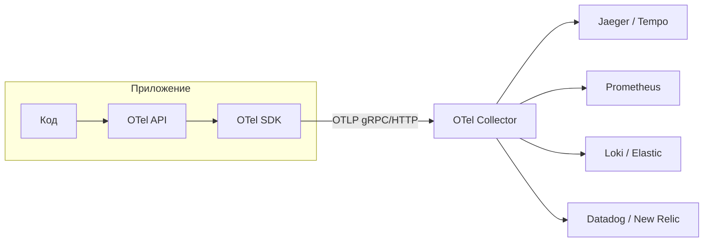
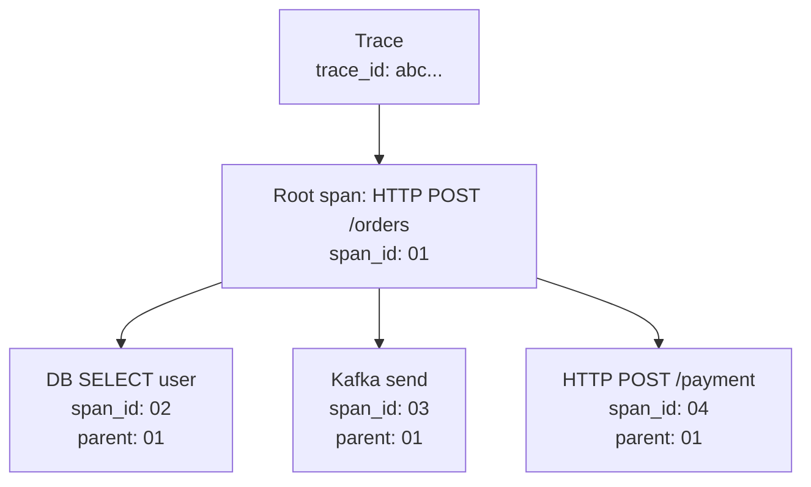

# OpenTelemetry

OpenTelemetry (OTel) — стандарт CNCF для сбора телеметрии: трейсов, метрик и
логов. Один SDK в коде, один протокол передачи (OTLP), любой backend на выбор.
Заменяет зоопарк вендорских SDK: Jaeger client, Datadog tracer, New Relic agent.

Документ покрывает: архитектуру SDK и Collector, авто-инструментацию через
Java agent и Go SDK, ручное создание span'ов, экспортеры, стратегии sampling,
semantic conventions, propagation между сервисами, типовые проблемы.

## Полезные ссылки

### Официальная документация

- [OpenTelemetry Documentation](https://opentelemetry.io/docs/) — основная документация
- [OpenTelemetry Specification](https://opentelemetry.io/docs/specs/otel/) — спецификация
- [Semantic Conventions](https://opentelemetry.io/docs/specs/semconv/) — стандартные имена атрибутов
- [Java Auto-Instrumentation](https://github.com/open-telemetry/opentelemetry-java-instrumentation) — javaagent
- [OTLP Protocol](https://opentelemetry.io/docs/specs/otlp/) — формат передачи

### Обучающие материалы

- [OpenTelemetry Demo](https://github.com/open-telemetry/opentelemetry-demo) — полноценный пример микросервисов
- [Mastering Distributed Tracing (Yuri Shkuro)](https://www.shkuro.com/books/2019-mastering-distributed-tracing/) — книга

### См. также

- [Observability: руководство](../observability-guide.md) — три столпа, SLI/SLO
- [Distributed Tracing](distributed-tracing.md) — основы трассировки
- [Jaeger](jaeger.md) — backend для трейсов
- [Zipkin](zipkin.md) — альтернативный backend
- [Prometheus](../metrics/prometheus.md) — backend для метрик
- [Micrometer](../metrics/micrometer.md) — фасад метрик в JVM
- [Structured Logging](../logging/structured-logging.md) — корреляция логов с трейсами

## Содержание

- [Что входит в OpenTelemetry](#что-входит-в-opentelemetry)
- [Архитектура: SDK и Collector](#архитектура-sdk-и-collector)
- [OTLP: единый протокол](#otlp-единый-протокол)
- [Trace, Span, контекст](#trace-span-контекст)
- [Авто-инструментация Java](#авто-инструментация-java)
- [Ручные span'ы в Java](#ручные-spanы-в-java)
- [Авто- и ручная инструментация Go](#авто--и-ручная-инструментация-go)
- [Метрики через OTel](#метрики-через-otel)
- [Логи через OTel](#логи-через-otel)
- [Resource и атрибуты](#resource-и-атрибуты)
- [Propagation между сервисами](#propagation-между-сервисами)
- [Sampling: head, tail, parent-based](#sampling-head-tail-parent-based)
- [OpenTelemetry Collector](#opentelemetry-collector)
- [Semantic Conventions](#semantic-conventions)
- [Решение проблем](#решение-проблем)
- [Лучшие практики](#лучшие-практики)

## Что входит в OpenTelemetry

| Компонент | Назначение |
|-----------|-----------|
| API | Интерфейсы для создания span/метрики/лога. Подключается в код |
| SDK | Реализация API: батчинг, sampling, экспорт |
| Auto-instrumentation | Готовые модули для популярных библиотек (HTTP, JDBC, Kafka) |
| OTLP | Протокол передачи телеметрии (gRPC или HTTP/protobuf) |
| Collector | Промежуточный сервис: receiver → processor → exporter |
| Semantic Conventions | Стандартные имена атрибутов (`http.method`, `db.system`) |

Что меняется при переходе на OTel:

- Один SDK заменяет несколько (Jaeger client + Micrometer + кастомные логгеры).
- Backend меняется без перекомпиляции приложения — только конфигурация Collector.
- Стандартные имена атрибутов: дашборды и алерты переносимы между сервисами.

## Архитектура: SDK и Collector



Два режима работы:

- **Прямой экспорт:** приложение шлёт OTLP в backend напрямую. Простой setup
  для одного-двух сервисов.
- **Через Collector:** приложение шлёт OTLP в Collector, Collector делает
  батчинг, sampling, обогащение, отправку в один или несколько backend'ов.
  Это путь для production.

Collector рекомендуется в проде по причинам:

- Снимает с приложений работу по retries, батчингу, fallback.
- Тонкая настройка sampling (особенно tail-based).
- Один или несколько backend'ов меняется без рестарта приложений.
- Защита от потери данных при перебоях (memory queue, persistent queue).

## OTLP: единый протокол

OpenTelemetry Protocol — формат поверх gRPC или HTTP/protobuf для передачи
trace/metrics/logs.

| Транспорт | Endpoint | Производительность |
|-----------|----------|--------------------|
| gRPC | `:4317` | Стандартный, эффективный |
| HTTP/protobuf | `:4318` | Когда gRPC недоступен (firewalls, proxies) |
| HTTP/JSON | `:4318` | Только для отладки, тяжелее |

Стандартные переменные среды для конфигурации SDK:

```bash
OTEL_SERVICE_NAME=orders
OTEL_RESOURCE_ATTRIBUTES=service.namespace=shop,service.version=1.2.3,deployment.environment=prod
OTEL_EXPORTER_OTLP_ENDPOINT=http://otel-collector:4317
OTEL_EXPORTER_OTLP_PROTOCOL=grpc
OTEL_TRACES_SAMPLER=parentbased_traceidratio
OTEL_TRACES_SAMPLER_ARG=0.1
OTEL_PROPAGATORS=tracecontext,baggage
```

Эти переменные работают одинаково для Java, Go, Python, Node, .NET — любой
SDK их понимает. Это упрощает деплой одинаковой конфигурации в Kubernetes.

## Trace, Span, контекст



Span — одна операция: HTTP-запрос, SQL, обращение к Kafka. Поля:

| Поле | Описание |
|------|----------|
| `trace_id` | 16 байт, общий для всего трейса |
| `span_id` | 8 байт, уникальный |
| `parent_span_id` | 8 байт, ссылка на родителя (пусто у root) |
| `name` | Имя операции (`POST /orders`, `db.query`) |
| `start_time`, `end_time` | Наносекунды |
| `attributes` | Key-value пары (стандартные имена из semconv) |
| `events` | Лог-сообщения с timestamp, привязанные к span |
| `links` | Ссылки на другие span'ы (например, batch-обработка) |
| `status` | OK / Error с описанием |
| `kind` | SERVER / CLIENT / PRODUCER / CONSUMER / INTERNAL |

## Авто-инструментация Java

OpenTelemetry Java Agent — JAR-файл, подключаемый через `-javaagent`. Без
изменений в коде покрывает HTTP-клиенты, JDBC, Kafka, Redis, MongoDB,
gRPC, Spring, Vert.x и десятки других.

```bash
java \
  -javaagent:/opt/opentelemetry-javaagent.jar \
  -Dotel.service.name=orders \
  -Dotel.exporter.otlp.endpoint=http://otel-collector:4317 \
  -Dotel.traces.sampler=parentbased_traceidratio \
  -Dotel.traces.sampler.arg=0.1 \
  -jar app.jar
```

В Docker образе:

```dockerfile
FROM eclipse-temurin:21-jre-alpine
ARG OTEL_VERSION=2.10.0
ADD https://github.com/open-telemetry/opentelemetry-java-instrumentation/releases/download/v${OTEL_VERSION}/opentelemetry-javaagent.jar /otel-agent.jar
COPY app.jar /app.jar
ENTRYPOINT ["java", "-javaagent:/otel-agent.jar", "-jar", "/app.jar"]
```

В Kubernetes — через OpenTelemetry Operator. Он автоматически инжектит agent
в Pod через init-container и переменные среды:

```yaml
metadata:
  annotations:
    instrumentation.opentelemetry.io/inject-java: "default/java-instrumentation"
```

Что покрывает агент Java из коробки (выборка):

| Категория | Библиотеки |
|-----------|-----------|
| HTTP сервер | Spring MVC, Spring WebFlux, Servlet, JAX-RS, Vert.x, Undertow |
| HTTP клиент | Apache HttpClient, OkHttp, Java HttpClient, RestTemplate, WebClient |
| БД | JDBC (Postgres, MySQL, Oracle, SQL Server), Hibernate, MongoDB, Cassandra |
| Очереди | Kafka, RabbitMQ, Pulsar, JMS, AWS SQS |
| Кеши | Redis (Lettuce, Jedis), Memcached, Hazelcast |
| Other | gRPC, Elasticsearch, Logback/Log4j MDC, Reactor, RxJava |

## Ручные span'ы в Java

Через `@WithSpan`-аннотацию (аннотации):

```java
import io.opentelemetry.instrumentation.annotations.WithSpan;
import io.opentelemetry.instrumentation.annotations.SpanAttribute;

public class OrderService {

    @WithSpan("OrderService.placeOrder")
    public Order placeOrder(@SpanAttribute("order.user_id") String userId,
                            @SpanAttribute("order.total") BigDecimal total) {
        // тело метода — span создаётся автоматически
        return repository.save(new Order(userId, total));
    }
}
```

Через API напрямую:

```java
import io.opentelemetry.api.GlobalOpenTelemetry;
import io.opentelemetry.api.trace.Span;
import io.opentelemetry.api.trace.Tracer;
import io.opentelemetry.context.Scope;

private static final Tracer tracer =
    GlobalOpenTelemetry.getTracer("com.example.orders", "1.0.0");

public Order placeOrder(String userId) {
    Span span = tracer.spanBuilder("OrderService.placeOrder")
        .setAttribute("order.user_id", userId)
        .setSpanKind(SpanKind.INTERNAL)
        .startSpan();

    try (Scope scope = span.makeCurrent()) {
        return repository.save(new Order(userId));
    } catch (Exception e) {
        span.recordException(e);
        span.setStatus(StatusCode.ERROR, e.getMessage());
        throw e;
    } finally {
        span.end();
    }
}
```

Spring Boot 3 + Micrometer Tracing — рекомендуемый путь в Spring-экосистеме.
Micrometer abstrакция, под капотом OTel или Brave (Zipkin):

```yaml
# pom.xml dependencies
- io.micrometer:micrometer-tracing-bridge-otel
- io.opentelemetry:opentelemetry-exporter-otlp
- net.ttddyy.observation:datasource-micrometer-spring-boot
```

```yaml
# application.yml
management:
  tracing:
    sampling:
      probability: 0.1
otel:
  service:
    name: orders
  exporter:
    otlp:
      endpoint: http://otel-collector:4317
```

## Авто- и ручная инструментация Go

В Go нет полноценной auto-instrumentation, как в Java. Подключение — через
библиотечные обёртки.

```go
import (
    "go.opentelemetry.io/otel"
    "go.opentelemetry.io/otel/sdk/resource"
    "go.opentelemetry.io/otel/sdk/trace"
    "go.opentelemetry.io/otel/exporters/otlp/otlptrace/otlptracegrpc"
    semconv "go.opentelemetry.io/otel/semconv/v1.26.0"
)

func setupTracing(ctx context.Context) (func(context.Context) error, error) {
    exporter, err := otlptracegrpc.New(ctx,
        otlptracegrpc.WithEndpoint("otel-collector:4317"),
        otlptracegrpc.WithInsecure(),
    )
    if err != nil {
        return nil, err
    }

    res, _ := resource.New(ctx,
        resource.WithAttributes(
            semconv.ServiceName("orders"),
            semconv.ServiceVersion("1.2.3"),
        ),
    )

    tp := trace.NewTracerProvider(
        trace.WithBatcher(exporter),
        trace.WithResource(res),
        trace.WithSampler(trace.ParentBased(trace.TraceIDRatioBased(0.1))),
    )
    otel.SetTracerProvider(tp)

    return tp.Shutdown, nil
}

// Ручной span
func (s *OrderService) PlaceOrder(ctx context.Context, userID string) error {
    ctx, span := otel.Tracer("orders").Start(ctx, "OrderService.placeOrder")
    defer span.End()

    span.SetAttributes(attribute.String("order.user_id", userID))

    if err := s.repo.Save(ctx, ...); err != nil {
        span.RecordError(err)
        span.SetStatus(codes.Error, err.Error())
        return err
    }
    return nil
}
```

Для популярных библиотек — обёртки `otelhttp`, `otelgrpc`, `otelpgx`,
`otelsql`, `otelfiber`, `otelgin`. Подключаются как middleware.

## Метрики через OTel

OTel Metrics API даёт три инструмента:

| Инструмент | Когда |
|-----------|-------|
| Counter | Только растущие значения (запросы, ошибки) |
| UpDownCounter | Может расти и падать (открытые соединения) |
| Histogram | Распределение (длительность, размер) |
| Gauge (observable) | Текущее значение, опрашивается callback'ом |

```java
Meter meter = GlobalOpenTelemetry.getMeter("com.example.orders");

LongCounter ordersTotal = meter.counterBuilder("orders.placed")
    .setDescription("Number of placed orders")
    .setUnit("{orders}")
    .build();

DoubleHistogram requestDuration = meter.histogramBuilder("http.server.request.duration")
    .setUnit("s")
    .build();

ordersTotal.add(1, Attributes.of(stringKey("payment_method"), "card"));
requestDuration.record(0.123, Attributes.of(stringKey("http.route"), "/orders"));
```

Spring Boot и Micrometer выдают эти метрики автоматически: достаточно подключить
`micrometer-registry-otlp` или использовать Collector Prometheus receiver.

## Логи через OTel

Logs API в OTel моложе trace и metrics. Стабильно работают через bridges:

| Платформа | Bridge |
|-----------|--------|
| Java + Logback | `opentelemetry-logback-appender-1.0` |
| Java + Log4j | `opentelemetry-log4j-appender-2.17` |
| Go | `go.opentelemetry.io/contrib/bridges/otelslog` |
| Python | `opentelemetry-instrumentation-logging` |

Bridge собирает логи, добавляет `trace_id` и `span_id`, отправляет через OTLP.
Альтернатива — оставить логи как есть (stdout → агент Filebeat/Fluent Bit),
а корреляцию обеспечить через MDC и pattern с `%X{trace_id}`.

## Resource и атрибуты

Resource — атрибуты, общие для всех span/metrics/logs из этого процесса.
Задаются один раз через переменную среды или Resource Detector.

```text
OTEL_RESOURCE_ATTRIBUTES=service.name=orders,service.namespace=shop,service.version=1.2.3,deployment.environment=prod,k8s.cluster.name=eu-west-1,k8s.pod.name=orders-7d9c8f9-x7b2k
```

| Группа атрибутов | Стандартные ключи |
|------------------|-------------------|
| Service | `service.name`, `service.namespace`, `service.version`, `service.instance.id` |
| Deployment | `deployment.environment` |
| Kubernetes | `k8s.cluster.name`, `k8s.namespace.name`, `k8s.pod.name`, `k8s.deployment.name` |
| Cloud | `cloud.provider`, `cloud.region`, `cloud.availability_zone` |
| Host | `host.name`, `host.type`, `os.type`, `process.pid` |

В Kubernetes это удобно делать через Downward API:

```yaml
env:
  - name: OTEL_RESOURCE_ATTRIBUTES
    value: "service.name=$(SERVICE_NAME),k8s.pod.name=$(POD_NAME),k8s.namespace.name=$(POD_NAMESPACE)"
  - name: POD_NAME
    valueFrom: { fieldRef: { fieldPath: metadata.name } }
  - name: POD_NAMESPACE
    valueFrom: { fieldRef: { fieldPath: metadata.namespace } }
```

## Propagation между сервисами

Стандарт W3C Trace Context — заголовок `traceparent`:

```text
traceparent: 00-5b8aa5a2d2c872e8321cf37308d69df2-051581bf3cb55c13-01
             ^   ^                                ^                ^
             версия trace_id                       span_id          flags (sampled)
```

Дополнительно — `tracestate` для вендорских данных и `baggage` для пользовательских.

| Стандарт | Заголовок | Откуда |
|----------|-----------|--------|
| W3C Trace Context | `traceparent`, `tracestate` | Стандарт OTel по умолчанию |
| W3C Baggage | `baggage` | Произвольные ключи-значения по запросу |
| B3 (Zipkin) | `b3` или `x-b3-*` | Legacy, для совместимости с Zipkin |
| Jaeger | `uber-trace-id` | Legacy |

Чтобы поддерживать несколько форматов:

```bash
OTEL_PROPAGATORS=tracecontext,baggage,b3
```

Baggage — для прокидывания пользовательского контекста через все сервисы:

```java
Baggage.current().toBuilder()
    .put("user.id", userId)
    .put("tenant.id", tenantId)
    .build()
    .makeCurrent();
```

> Не клади в baggage конфиденциальные данные — он передаётся в HTTP-заголовках
> в plain. И помни про размер: каждый запрос несёт baggage, лишний килобайт
> заметен.

## Sampling: head, tail, parent-based

Sampling решает, какую долю трейсов записывать.

| Стратегия | Когда работает | Особенности |
|-----------|----------------|-------------|
| AlwaysOn | Все 100% | Только для dev и низкого трафика |
| AlwaysOff | Ничего | Для отключения трейсинга |
| TraceIdRatioBased | Решение по trace_id (детерминированно) | Простая, head-based |
| ParentBased | Уважает решение родительского span | Корневой span сэмплируется по другой стратегии |
| Tail-based (Collector) | Решение после завершения трейса | По длительности, ошибкам, атрибутам |

Рекомендуемая стратегия — ParentBased + TraceIdRatioBased:

```text
OTEL_TRACES_SAMPLER=parentbased_traceidratio
OTEL_TRACES_SAMPLER_ARG=0.1
```

Это даёт: 10% root-span'ов сэмплируется, дальше потомки наследуют решение
родителя. Трейс всегда либо целиком записан, либо целиком пропущен.

Tail-based — настраивается на стороне Collector:

```yaml
processors:
  tail_sampling:
    decision_wait: 10s
    policies:
      - name: errors
        type: status_code
        status_code: { status_codes: [ERROR] }
      - name: slow
        type: latency
        latency: { threshold_ms: 1000 }
      - name: probabilistic
        type: probabilistic
        probabilistic: { sampling_percentage: 5 }
```

Tail-based ловит все ошибки и медленные запросы плюс 5% обычных, остальное —
выбрасывает. Цена — Collector держит в памяти полный трейс пока не закончится.

## OpenTelemetry Collector

Collector — pipeline из трёх компонентов: receiver → processor → exporter.

```yaml
# otel-collector-config.yaml
receivers:
  otlp:
    protocols:
      grpc: { endpoint: 0.0.0.0:4317 }
      http: { endpoint: 0.0.0.0:4318 }
  prometheus:
    config:
      scrape_configs:
        - job_name: app
          static_configs:
            - targets: ["app:8080"]

processors:
  batch:
    timeout: 5s
    send_batch_size: 512
  memory_limiter:
    check_interval: 1s
    limit_mib: 2048
  resource:
    attributes:
      - key: deployment.environment
        value: prod
        action: upsert
  attributes:
    actions:
      - key: http.client_ip
        action: delete
  tail_sampling:
    decision_wait: 10s
    policies:
      - name: errors
        type: status_code
        status_code: { status_codes: [ERROR] }

exporters:
  otlp/jaeger:
    endpoint: jaeger:4317
    tls: { insecure: true }
  prometheus:
    endpoint: 0.0.0.0:8889
  loki:
    endpoint: http://loki:3100/loki/api/v1/push

service:
  pipelines:
    traces:
      receivers: [otlp]
      processors: [memory_limiter, resource, attributes, tail_sampling, batch]
      exporters: [otlp/jaeger]
    metrics:
      receivers: [otlp, prometheus]
      processors: [memory_limiter, resource, batch]
      exporters: [prometheus]
    logs:
      receivers: [otlp]
      processors: [memory_limiter, batch]
      exporters: [loki]
```

Деплой Collector:

- В Kubernetes: DaemonSet (агент на каждой ноде, для приложений) плюс
  Deployment (gateway, для агрегации и tail-sampling).
- Standalone: один-два инстанса для небольшой инсталляции.
- Sidecar: реже, через OpenTelemetry Operator.

Memory limiter — обязательный processor: защищает Collector от OOM при
всплеске трафика.

## Semantic Conventions

Стандартные имена атрибутов — главное преимущество OTel в долгосрочной
перспективе. Дашборд латентности `http.server.request.duration` работает для
любого OTel-инструментированного сервиса.

| Группа | Атрибуты |
|--------|---------|
| HTTP | `http.request.method`, `http.response.status_code`, `http.route`, `url.path`, `url.scheme`, `server.address` |
| RPC | `rpc.system`, `rpc.service`, `rpc.method`, `rpc.grpc.status_code` |
| DB | `db.system`, `db.name`, `db.statement` (или `db.query.text`), `db.operation` |
| Messaging | `messaging.system`, `messaging.destination.name`, `messaging.operation`, `messaging.kafka.consumer.group` |
| Exception | `exception.type`, `exception.message`, `exception.stacktrace` |
| Network | `network.peer.address`, `network.peer.port`, `network.protocol.name` |

> Полный список — на сайте semantic conventions. Конвенции эволюционируют:
> в 1.x.0 многие имена менялись (`http.method` → `http.request.method`).
> Версионируй semconv-зависимости явно.

## Решение проблем

| Симптом | Причина | Решение |
|---------|---------|---------|
| Трейсы не появляются в backend | Неверный endpoint, недоступный Collector | Проверь `OTEL_EXPORTER_OTLP_ENDPOINT`, попробуй `curl -v ...`, посмотри логи приложения с `otel.javaagent.debug=true` |
| Трейсы обрываются между сервисами | `traceparent` не передаётся | Проверь, что HTTP-клиент инструментирован; для не-стандартных клиентов — ручной propagation |
| `service.name` = `unknown_service` | Не задана переменная | `OTEL_SERVICE_NAME` или Resource attribute `service.name` |
| Слишком много данных, OOM в Collector | Нет sampling, нет memory_limiter | Включи head-based sampling, добавь `memory_limiter` processor |
| Метрики из Spring Boot не приходят | Не подключён OTLP-exporter Micrometer | `micrometer-registry-otlp` плюс `management.otlp.metrics.export.url` |
| Высокая кардинальность метрик | `http.target` с query-string в лейбле | Нормализуй до `http.route` (template без переменных) |
| `Span` с пустым parent_span_id во вложенном вызове | Контекст не пробрасывается между потоками/корутинами | Используй `Context.makeCurrent()` или `runWithContext` |
| Старый Jaeger client в части сервисов | Гетерогенная инфраструктура при миграции | Включи `OTEL_PROPAGATORS=tracecontext,baggage,jaeger,b3` для совместимости |
| `db.statement` содержит секреты | По умолчанию инструментация пишет полный запрос | Включи sanitizer: `otel.instrumentation.jdbc.statement-sanitizer.enabled=true` |
| Telemetry стирается при graceful shutdown | Не вызван `shutdown()` SDK | В Java-агенте — встроено; в SDK — обязательно flush на старте корректного завершения |

## Лучшие практики

- В новых проектах — сразу OTel, не вендорские SDK. Снимает lock-in.
- Используй Java agent или OTel Operator — это даёт авто-инструментацию без кода.
- Конфигурируй через `OTEL_*` переменные среды, не через application.yml. Это
  стандартно работает в Java, Go, Python и упрощает Kubernetes.
- В проде — OTel Collector между приложениями и backend'ами.
- Sampling: 1–10% head-based + tail для ошибок и медленных запросов.
- В Resource — стандартные ключи: `service.name`, `service.version`,
  `deployment.environment`. Это база для всех дашбордов.
- Atomatic: пробрасывай `traceparent` во все исходящие запросы.
- Не клади в атрибуты PII, токены, длинные тела запросов. Это попадает в
  backend и хранится днями.
- Версионируй semantic conventions явно — конвенции меняются.
- Корреляция логов через `trace_id` в MDC/structured logging обязательна.
- Метрики приложения — через Micrometer (JVM) или OTel API напрямую
  (Go, Python). Не пиши свои счётчики поверх gauge.
- Алерты по SLO считай поверх OTel метрик (`http.server.request.duration`),
  это даёт переносимые алерты между сервисами.

**Итог:** OpenTelemetry — стандарт CNCF для трейсов, метрик и логов. SDK в коде,
OTLP в качестве протокола, Collector для production. Авто-инструментация
покрывает 80% задач в Java, для Go нужны библиотечные обёртки. Главные
рычаги — Resource (общие атрибуты), Propagation (traceparent), Sampling
(head + tail), Semantic Conventions (стандартные имена). Backend (Jaeger,
Tempo, Datadog, New Relic) меняется без перекомпиляции приложения.
