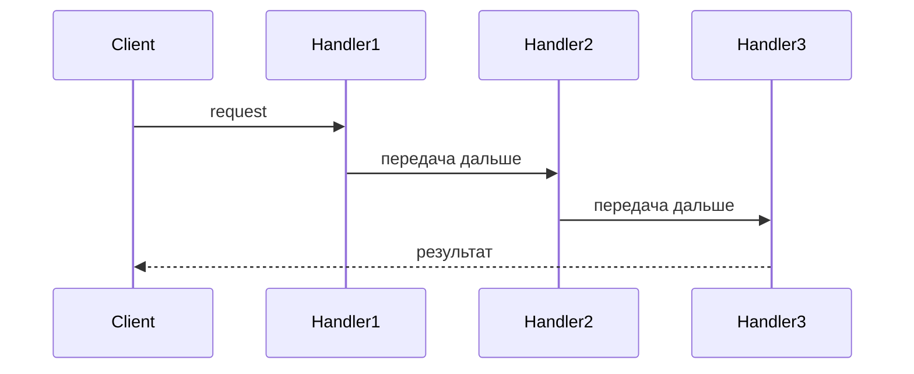
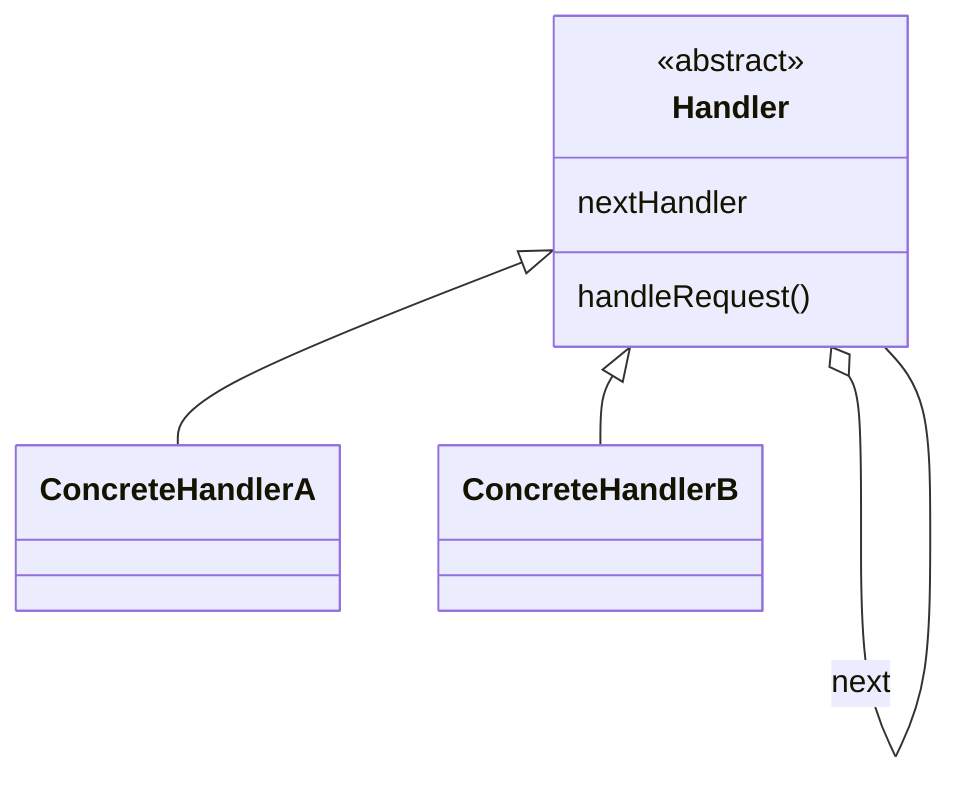

# Цепочка обязанностей (`Chain of Responsibility`)

Паттерн **Chain of Responsibility** (Цепочка обязанностей) — это поведенческий паттерн проектирования, который передаёт запрос по цепочке обработчиков. Каждый обработчик решает, обрабатывать ли запрос, или передать его следующему в цепочке.

## Полезные ссылки

### Официальная документация
- [Design Patterns: Elements of Reusable Object-Oriented Software](https://en.wikipedia.org/wiki/Design_Patterns)

### Ресурсы
- [Chain of Responsibility Pattern in Java](https://www.baeldung.com/chain-of-responsibility-pattern)
- [Chain of Responsibility Pattern in Kotlin](https://refactoring.guru/design-patterns/chain-of-responsibility)

### См. также
- [Command (Команда)](command.md)
- [Mediator (Посредник)](mediator.md)

## Содержание

- [Суть и запомнить](#суть-и-запомнить)
- [Введение](#введение)
- [Когда применять](#когда-применять)
- [Структура паттерна](#структура-паттерна)
- [Реализация на Java](#реализация-на-java)
  - [Пример: аутентификация](#пример-аутентификация)
- [Реализация на Kotlin](#реализация-на-kotlin)
- [Использование](#использование)
- [Лучшие практики](#лучшие-практики)

## Суть и запомнить

**Суть в одном предложении:** Запрос передаётся по цепочке обработчиков; каждый решает — обработать самому или передать дальше.

**Запомнить:**
- Обработчик знает о следующем в цепочке; связь настраивается снаружи.
- Один запрос — один обработчик (или ни один).
- Замена длинных if-else и ослабление связанности отправителя и получателя.

**Когда применять:** несколько кандидатов на обработку, порядок или набор обработчиков задаётся динамически.
## Введение

- Запрос передаётся по цепочке обработчиков.
- Каждый обработчик либо обрабатывает запрос, либо передаёт его следующему.
- Отправитель не привязан к конкретному получателю; цепочку можно собирать динамически.

## Когда применять

- Ослабление связанности отправителя и получателя
- Динамическая цепочка обработчиков во время выполнения
- Замена громоздких цепочек if/**else**

## Структура паттерна

Запрос передаётся по цепочке; каждый обработчик решает — обработать или передать дальше.





## Реализация на Java

### Пример: аутентификация

**Базовый обработчик:**

```java
// Базовый обработчик цепочки — интерфейс и абстрактный класс с next
public abstract class AuthenticationProcessor {
    protected AuthenticationProcessor nextProcessor;

    public AuthenticationProcessor(AuthenticationProcessor nextProcessor) {
        this.nextProcessor = nextProcessor;
    }

    public abstract boolean isAuthorized(AuthenticationProvider authProvider);
}
```

**Конкретные обработчики:**

```java
// Обработчик OAuth: если провайдер OAuth — авторизуем, иначе передаём по цепочке.
public class OAuthProcessor extends AuthenticationProcessor {
    public OAuthProcessor(AuthenticationProcessor nextProcessor) {
        super(nextProcessor);
    }

    @Override
    public boolean isAuthorized(AuthenticationProvider authProvider) {
        if (authProvider instanceof OAuthTokenProvider) {
            return true;
        } else if (nextProcessor != null) {
            return nextProcessor.isAuthorized(authProvider);
        }
        return false;
    }
}

// Обработчик логин/пароль: если провайдер UsernamePassword — авторизуем, иначе передаём дальше.
public class UsernamePasswordProcessor extends AuthenticationProcessor {
    public UsernamePasswordProcessor(AuthenticationProcessor nextProcessor) {
        super(nextProcessor);
    }

    @Override
    public boolean isAuthorized(AuthenticationProvider authProvider) {
        if (authProvider instanceof UsernamePasswordProvider) {
            return true;
        } else if (nextProcessor != null) {
            return nextProcessor.isAuthorized(authProvider);
        }
        return false;
    }
}
```

**Сборка цепочки и тест:**

```java
// Сборка цепочки: сначала UsernamePassword, затем OAuth; конец цепочки — null.
private static AuthenticationProcessor getChainOfAuthProcessor() {
    AuthenticationProcessor oAuthProcessor = new OAuthProcessor(null);
    return new UsernamePasswordProcessor(oAuthProcessor);
}

@Test
public void givenOAuthProvider_whenCheckingAuthorized_thenSuccess() {
    AuthenticationProcessor processor = getChainOfAuthProcessor();
    assertTrue(processor.isAuthorized(new OAuthTokenProvider()));
}
```

## Реализация на Kotlin

**В Kotlin** паттерн **Chain of Responsibility** может быть реализован следующим образом:

```kotlin
// Маркерные типы провайдеров аутентификации.
interface AuthenticationProvider

class OAuthTokenProvider : AuthenticationProvider
class UsernamePasswordProvider : AuthenticationProvider

// Базовый обработчик цепочки с ссылкой на следующий.
abstract class AuthenticationProcessor(protected val nextProcessor: AuthenticationProcessor?) {
    abstract fun isAuthorized(authProvider: AuthenticationProvider): Boolean
}

// OAuth-обработчик: при совпадении типа — true, иначе передаёт по цепочке.
class OAuthProcessor(nextProcessor: AuthenticationProcessor?) : AuthenticationProcessor(nextProcessor) {
    override fun isAuthorized(authProvider: AuthenticationProvider): Boolean {
        return when (authProvider) {
            is OAuthTokenProvider -> true
            else -> nextProcessor?.isAuthorized(authProvider) ?: false
        }
    }
}

// Обработчик логин/пароль: при совпадении — true, иначе передаёт дальше.
class UsernamePasswordProcessor(nextProcessor: AuthenticationProcessor?) : AuthenticationProcessor(nextProcessor) {
    override fun isAuthorized(authProvider: AuthenticationProvider): Boolean {
        return when (authProvider) {
            is UsernamePasswordProvider -> true
            else -> nextProcessor?.isAuthorized(authProvider) ?: false
        }
    }
}
```

**Использование:**

```kotlin
// Сборка цепочки: UsernamePassword -> OAuth -> конец.
fun getChainOfAuthProcessor(): AuthenticationProcessor {
    val oAuthProcessor = OAuthProcessor(null)
    return UsernamePasswordProcessor(oAuthProcessor)
}

fun main() {
    val processor = getChainOfAuthProcessor()
    val isAuthorized = processor.isAuthorized(OAuthTokenProvider())
    println(isAuthorized) // true
}
```

## Использование

- Когда есть несколько объектов, способных обработать запрос, и обработчик заранее неизвестен(цепочка может формироваться динамически).
- Когда нужно отправить запрос одному из нескольких обработчиков без явного указания получателя(например, обработка событий в UI).

## Лучшие практики

- **Один обработчик — одна ответственность:** каждый обработчик решает одну задачу(проверка, логирование, форматирование); не перегружайте обработчик несколькими несвязанными действиями.
- **Порядок цепочки:** порядок имеет значение; документируйте ожидаемый порядок и тестируйте с разными конфигурациями; при необходимости делайте цепочку настраиваемой(конфиг, DI).
- **Завершение цепочки:** явно определяйте, когда цепочка завершена(обработчик обработал запрос или передал дальше); избегайте «забытых» запросов, которые никто не обрабатывает.
- **Тестируемость:** тестируйте каждый обработчик отдельно и цепочку в сборе; используйте моки для подстановки следующего обработчика.
- **Производительность:** при длинных цепочках учитывайте накладные расходы; для простых случаев рассмотрите альтернативы(switch, таблица обработчиков).
