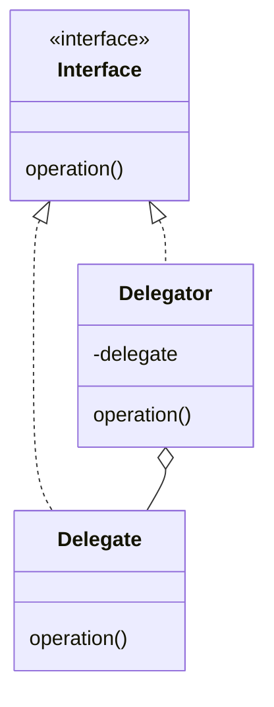

# Делегирование (`Delegate`)

Паттерн **Delegate** (Делегирование) позволяет объекту передать выполнение определённых операций другому объекту. Во многих
случаях делегирование предпочтительнее наследования. **Kotlin** отлично поддерживает это на уровне языка с помощью ключевого
слова `by`.

## Полезные ссылки

### Официальная документация

- [Kotlin Delegation](https://kotlinlang.org/docs/delegation.html)

### Ресурсы

- [Kotlin Delegation](https://www.baeldung.com/kotlin/delegation-pattern)
- [Java Delegation Pattern](https://www.baeldung.com/java-delegation-pattern)

### См. также

- [Decorator](../structural/decorator.md)
- [Proxy](../structural/proxy.md)

## Содержание

- [Введение](#введение)
- [Структура паттерна](#структура-паттерна)
- [Реализация на Kotlin](#реализация-на-kotlin)
- [Варианты использования](#варианты-использования)
- [Важные замечания](#важные-замечания)
- [Реализация на Java](#реализация-на-java)
  - [Реализация нескольких интерфейсов](#реализация-нескольких-интерфейсов)
- [Лучшие практики](#лучшие-практики)

## Суть и запомнить

**Суть в одном предложении:** Объект переадресует часть работы другому объекту (делегату); в Kotlin — через `by`.

**Запомнить:**
- Делегатор хранит ссылку на делегата и вызывает его методы.
- Альтернатива наследованию: переиспользование без иерархии.
- В Kotlin `by` автоматически пробрасывает вызовы к делегату.

**Когда применять:** переиспользование поведения без наследования, декорирование или композиция интерфейсов.
## Введение

Паттерн **Delegate** (Делегирование) позволяет объекту передать выполнение определённых операций другому объекту. Во многих случаях делегирование предпочтительнее наследования; **Kotlin** поддерживает его на уровне языка с помощью ключевого слова `by`.

## Структура паттерна

Объект-делегатор хранит ссылку на делегата и переадресует ему вызовы (в Kotlin — через `by`).



## Реализация на Kotlin

В этом уроке мы поговорим о встроенной в **Kotlin** поддержке шаблона делегирования и увидим её в действии.

**Во-первых, давайте предположим, что у нас есть пример кода со структурой ниже в сторонней библиотеке:**

```kotlin
// Интерфейс делегата и реализация — основа паттерна делегирования в Kotlin
interface Producer {
    fun produce(): String
}

class ProducerImpl : Producer {
    override fun produce() = "ProducerImpl"
}
```

**Далее украсим имеющуюся реализацию с помощью ключевого слова `by` и добавим дополнительную необходимую обработку:**

```kotlin
class EnhancedProducer(private val delegate: Producer) : Producer by delegate {
    override fun produce() = "${delegate.produce()} and EnhancedProducer"
}
```

Итак, в этом примере мы указали, что класс **EnhancedProducer** будет инкапсулировать объект делегата типа **Producer**. Кроме
того, он может использовать функциональные возможности реализации **Producer**.

**Наконец, давайте проверим, что он работает так, как ожидалось:**

```kotlin
val producer = EnhancedProducer(ProducerImpl())
assertThat(producer.produce()).isEqualTo("ProducerImpl and EnhancedProducer")
```

## Варианты использования

Теперь давайте рассмотрим два распространенных варианта использования шаблона делегирования.

Во-первых, мы можем использовать шаблон делегирования для реализации нескольких интерфейсов с использованием
**существующих реализаций:**

```kotlin
// Композитный сервис: делегирует UserService и MessageService разным реализациям через by.
class CompositeService : UserService by UserServiceImpl(), MessageService by MessageServiceImpl()
```

Во-вторых, мы можем использовать делегирование для улучшения существующей реализации.

Последнее — это то, что мы сделали в предыдущем разделе. Но более реальный пример, такой как приведенный ниже, особенно
**полезен, когда мы не можем изменить существующую реализацию — например, код сторонней библиотеки:**

```kotlin
// Делегатор с синхронизацией: вызовы к delegate обёрнуты в lock.
class SynchronizedProducer(private val delegate: Producer) : Producer by delegate {
    private val lock = ReentrantLock()

    override fun produce(): String {
        lock.withLock {
            return delegate.produce()
        }
    }
}
```

## Важные замечания

Теперь нам нужно всегда помнить, что делегат ничего не знает о декораторе. Таким образом, мы не должны пробовать с ними
подход, подобный методу шаблона **GoF**.

**Рассмотрим пример:**

```kotlin
// Интерфейс сервиса и базовая реализация.
interface Service {
    val seed: Int
    fun serve(action: (Int) -> Unit)
}

class ServiceImpl : Service {
    override val seed = 1
    override fun serve(action: (Int) -> Unit) {
        action(seed)
    }
}

// Декоратор переопределяет seed, но serve по-прежнему использует делегата (seed=1).
class ServiceDecorator : Service by ServiceImpl() {
    override val seed = 2
}
```

Здесь делегат(ServiceImpl) использует свойство, определенное в общем интерфейсе, и мы переопределяем его в декораторе (
**ServiceDecorator**). Однако это не влияет на обработку делегата:

```kotlin
val service = ServiceDecorator()
service.serve {
    assertThat(it).isEqualTo(1)
}
```

Наконец, важно отметить, что в **Kotlin** мы можем делегировать не только интерфейсы, но и отдельные свойства.

## Реализация на Java

**В Java паттерн Delegate может быть реализован через композицию:**

```java
// Интерфейс, реализуемый и делегатом, и делегатором.
public interface Producer {
    String produce();
}

// Конкретная реализация — объект, которому делегируются вызовы.
public class ProducerImpl implements Producer {
    @Override
    public String produce() {
        return "ProducerImpl";
    }
}

// Делегатор: хранит delegate и переадресует вызовы, при необходимости дополняя результат.
public class EnhancedProducer implements Producer {
    private final Producer delegate;

    public EnhancedProducer(Producer delegate) {
        this.delegate = delegate;
    }

    @Override
    public String produce() {
        return delegate.produce() + " and EnhancedProducer";
    }
}
```

**Использование:**

```java
Producer producer = new EnhancedProducer(new ProducerImpl());
String result = producer.produce();
// result = "ProducerImpl and EnhancedProducer"
```

### Реализация нескольких интерфейсов

```java
// Два интерфейса и их реализации.
public interface UserService {
    void createUser(String name);
}

public interface MessageService {
    void sendMessage(String message);
}

public class UserServiceImpl implements UserService {
    @Override
    public void createUser(String name) {
        System.out.println("Creating user: " + name);
    }
}

public class MessageServiceImpl implements MessageService {
    @Override
    public void sendMessage(String message) {
        System.out.println("Sending message: " + message);
    }
}

// Композитный сервис: делегирует вызовы двум делегатам.
public class CompositeService implements UserService, MessageService {
    private final UserService userService;
    private final MessageService messageService;

    public CompositeService(UserService userService, MessageService messageService) {
        this.userService = userService;
        this.messageService = messageService;
    }

    @Override
    public void createUser(String name) {
        userService.createUser(name);
    }

    @Override
    public void sendMessage(String message) {
        messageService.sendMessage(message);
    }
}
```

**Использование:**

```java
// Клиент создаёт композитный сервис и вызывает методы — вызовы делегируются реализациям.
CompositeService service = new CompositeService(
        new UserServiceImpl(),
        new MessageServiceImpl()
);
service.createUser("John");
service.sendMessage("Hello");
```

## Лучшие практики

- **Предпочитайте делегирование наследованию:** когда нужно переиспользовать поведение без жёсткой иерархии — используйте делегирование; **Kotlin** `by` автоматически пробрасывает вызовы к делегату.
- **Один делегат на интерфейс:** не смешивайте в одном классе делегирование нескольких не связанных интерфейсов без явной цели; иначе усложняется понимание потока вызовов.
- **Переопределяйте только нужные методы:** при использовании `by` переопределяйте только те методы, где нужно добавить логику или изменить поведение; остальные оставьте делегату.
- **Тестируемость:** внедряйте делегат через конструктор или **setter** для удобной подмены моками в тестах; избегайте создания делегата внутри класса.
- **Документируйте контракт:** явно указывайте в документации, какие методы делегируются без изменений, а какие переопределены и зачем.
