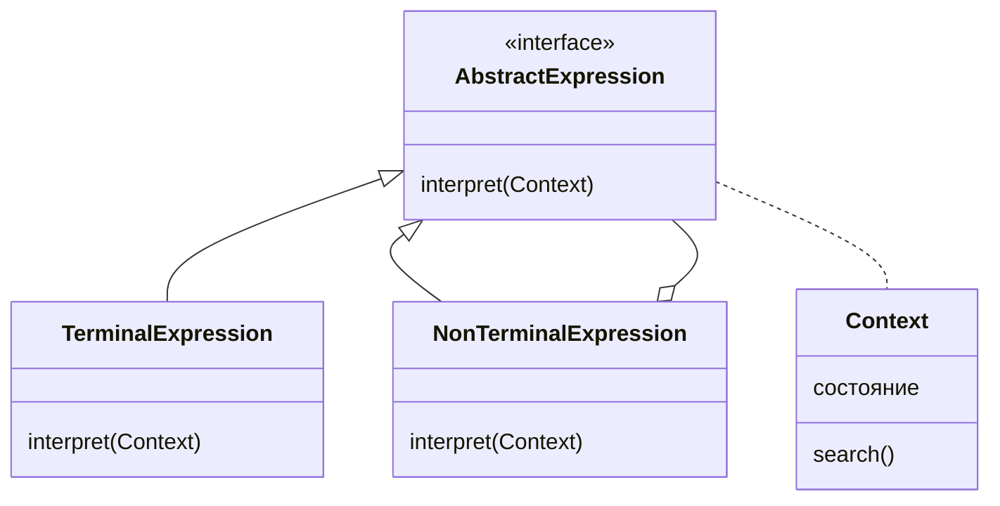

# Интерпретатор (`Interpreter`)

Паттерн **Interpreter** (Интерпретатор) — это поведенческий паттерн проектирования, который определяет грамматику конкретного языка объектно-ориентированным способом и позволяет интерпретировать предложения этого языка. Короче говоря, шаблон определяет грамматику конкретного языка объектно-ориентированным способом, который может быть оценен самим интерпретатором.

## Полезные ссылки

### Официальная документация
- [Design Patterns: Elements of Reusable Object-Oriented Software](https://en.wikipedia.org/wiki/Design_Patterns)

### Ресурсы
- [Interpreter Pattern in Java](https://refactoring.guru/design-patterns/interpreter/java/example)
- [Interpreter Pattern in Kotlin](https://refactoring.guru/design-patterns/interpreter)

### См. также
- [[visitor|Visitor (Посетитель)]]
- [[command|Command (Команда)]]

## Содержание

- [Суть и запомнить](#суть-и-запомнить)
- [Введение](#введение)
- [Структура паттерна](#структура-паттерна)
- [Реализация на Java](#реализация-на-java)
  - [Пример реализации](#пример-реализации)
- [Реализация на Kotlin](#реализация-на-kotlin)
- [Использование в JDK](#использование-в-jdk)
- [Лучшие практики](#лучшие-практики)

## Суть и запомнить

**Суть в одном предложении:** Грамматика языка в виде классов-выражений; предложение — дерево выражений, интерпретация обходом дерева с контекстом.

**Запомнить:**
- AbstractExpression (interpret), TerminalExpression и NonTerminalExpression.
- Контекст хранит состояние интерпретации.
- Клиент строит AST и вызывает interpret().

**Когда применять:** простая грамматика, DSL, формулы, парсеры.
## Введение

Имея это в виду, технически мы могли бы создать наше собственное регулярное выражение, собственный интерпретатор **DSL** или мы могли бы проанализировать любой из человеческих языков, построить абстрактные синтаксические деревья, а затем запустить интерпретацию.

Это лишь некоторые из потенциальных вариантов использования, но если мы немного подумаем, мы могли бы найти еще больше вариантов его использования, например, в наших **IDE**, поскольку они постоянно интерпретируют код, который мы пишем, и, таким образом, предоставляют нам бесценные подсказки.

Шаблон интерпретатора обычно следует использовать, когда грамматика относительно проста.

В противном случае его будет сложно поддерживать.

## Структура паттерна

Контекст хранит состояние интерпретации; выражения образуют дерево (терминальные и нетерминальные узлы).



На приведенной выше диаграмме показаны две основные сущности: контекст и выражение.

Теперь любой язык должен быть каким-то образом выражен, и слова(выражения) будут иметь какое-то значение в зависимости от данного контекста.

**AbstractExpression** определяет один абстрактный метод, который принимает контекст в качестве параметра. Благодаря этому каждое выражение будет влиять на контекст, менять свое состояние и либо продолжать интерпретацию, либо возвращать само результат.

Следовательно, контекст будет держателем глобального состояния обработки и будет повторно использоваться в течение всего процесса интерпретации.

Итак, в чем разница между **TerminalExpression** и **NonTerminalExpression**?

Выражение **NonTerminalExpression** может иметь одно или несколько других связанных с ним абстрактных выражений, поэтому его можно интерпретировать рекурсивно. В конце концов, процесс интерпретации должен завершиться выражением **TerminalExpression**, которое вернет результат.

Стоит отметить, что **NonTerminalExpression** является составным.

Наконец, роль клиента заключается в создании или использовании уже созданного абстрактного синтаксического дерева, которое представляет собой не что иное, как предложение, определенное в созданном языке.

## Реализация на Java

### Пример реализации

Чтобы показать шаблон в действии, мы создадим простой объектно-ориентированный синтаксис, подобный **SQL**, который затем будет интерпретирован и вернет нам результат.

Сначала мы определим выражения **Select**, **From** и **Where**, построим синтаксическое дерево в клиентском классе и запустим интерпретацию.

**Интерфейс Expression** будет иметь метод интерпретации:

```java
// Интерфейс выражения — метод interpret(context) для узлов AST
List<String> interpret(Context ctx);
```

**Далее мы определяем первое выражение, класс **Select**:**

```java
// Нетерминальное выражение: задаёт столбец и передаёт интерпретацию выражению From.
class Select implements Expression {
    private String column;
    private From from;

    @Override
    public List<String> interpret(Context ctx) {
        ctx.setColumn(column);
        return from.interpret(ctx);
    }
}
```

Он получает имя столбца, которое нужно выбрать, и другое конкретное выражение типа **From** в качестве параметров в конструкторе.

Обратите внимание, что в переопределенном методе **terpret**() он устанавливает состояние контекста и передает интерпретацию дальше другому выражению вместе с контекстом.

Таким образом, мы видим, что это **NonTerminalExpression**.

**Другим выражением является класс **From**:**

```java
// Нетерминальное/терминальное выражение: задаёт таблицу; при отсутствии Where завершает поиском.
class From implements Expression {
    private String table;
    private Where where;

    @Override
    public List<String> interpret(Context ctx) {
        ctx.setTable(table);
        if (where == null) {
            return ctx.search();
        }
        return where.interpret(ctx);
    }
}
```

Теперь в **SQL** предложение **where** является необязательным, поэтому этот класс является либо терминальным, либо нетерминальным выражением.

Если пользователь решит не использовать предложение **where**, выражение **From** будет завершено вызовом `**ctx.search**()` и возвратит результат. В противном случае это будет интерпретироваться дополнительно.

**Выражение Where** снова изменяет контекст, устанавливая необходимый фильтр, и завершает интерпретацию поисковым вызовом:**

```java
// Терминальное выражение: устанавливает фильтр в контексте и выполняет поиск.
class Where implements Expression {
    private Predicate<String> filter;

    @Override
    public List<String> interpret(Context ctx) {
        ctx.setFilter(filter);
        return ctx.search();
    }
}
```

Например, класс **Context** содержит данные, имитирующие таблицу базы данных.

**Обратите внимание, что у него есть три ключевых поля, которые изменяются каждым подклассом **Expression** и методом поиска:**

```java
// Контекст: хранит таблицу, столбец и фильтр; метод search() выполняет запрос по данным.
class Context {
    private static Map<String, List<Row>> tables = new HashMap<>();

    static {
        List<Row> list = new ArrayList<>();
        list.add(new Row("John", "Doe"));
        list.add(new Row("Jan", "Kowalski"));
        list.add(new Row("Dominic", "Doom"));
        tables.put("people", list);
    }

    private String table;
    private String column;
    private Predicate<String> whereFilter;

    List<String> search() {
        List<String> result = tables.entrySet()
            .stream()
            .filter(entry -> entry.getKey().equalsIgnoreCase(table))
            .flatMap(entry -> Stream.of(entry.getValue()))
            .flatMap(Collection::stream)
            .map(Row::toString)
            .flatMap(columnMapper)
            .filter(whereFilter)
            .collect(Collectors.toList());
        clear();
        return result;
    }
}
```

После завершения поиска контекст очищается, поэтому для столбца, таблицы и фильтра устанавливаются значения по умолчанию.

Таким образом, каждая интерпретация не повлияет на другую.

**В целях тестирования давайте взглянем на класс **InterpreterDemo**:**

```java
// Клиент: строит AST из выражений, создаёт контекст и запускает interpret().
public class InterpreterDemo {
    public static void main(String[] args) {
        Expression query = new Select("name", new From("people"));
        Context ctx = new Context();
        List<String> result = query.interpret(ctx);
        System.out.println(result);

        Expression query2 = new Select("*", new From("people"));
        List<String> result2 = query2.interpret(ctx);
        System.out.println(result2);

        Expression query3 = new Select("name",
            new From("people",
                new Where(name -> name.toLowerCase().startsWith("d"))));
        List<String> result3 = query3.interpret(ctx);
        System.out.println(result3);
    }
}
```

Сначала мы строим синтаксическое дерево с созданными выражениями, инициализируем контекст и затем запускаем интерпретацию. Контекст используется повторно, но, как мы показали выше, очищается после каждого поискового вызова.

**Запустив программу, вывод должен быть следующим:**

```text
[John, Jan, Dominic]
[John Doe, Jan Kowalski, Dominic Doom]
[Dominic]
```

Когда грамматика становится более сложной, ее становится труднее поддерживать.

Это видно на представленном примере. Было бы достаточно легко добавить еще одно выражение, например **Limit**, но его будет не так просто поддерживать, если мы решим продолжать расширять его всеми другими выражениями.

Шаблон проектирования интерпретатора отлично подходит для относительно простой интерпретации грамматики, которую не нужно сильно развивать и расширять.

В приведенном выше примере мы показали, что можно построить **SQL**-подобный запрос объектно-ориентированным способом с помощью шаблона интерпретатора.

## Реализация на Kotlin

**В Kotlin** паттерн **Interpreter** может быть реализован следующим образом:**

```kotlin
// Интерфейс выражения для узлов AST.
interface Expression {
    fun interpret(ctx: Context): List<String>
}

// Нетерминальное выражение: столбец и передача в From.
class Select(private val column: String, private val from: From) : Expression {
    override fun interpret(ctx: Context): List<String> {
        ctx.setColumn(column)
        return from.interpret(ctx)
    }
}

// Нетерминальное/терминальное выражение: таблица и опционально Where.
class From(private val table: String, private val where: Where? = null) : Expression {
    override fun interpret(ctx: Context): List<String> {
        ctx.setTable(table)
        return where?.interpret(ctx) ?: ctx.search()
    }
}

// Терминальное выражение: фильтр и поиск.
class Where(private val filter: (String) -> Boolean) : Expression {
    override fun interpret(ctx: Context): List<String> {
        ctx.setFilter(filter)
        return ctx.search()
    }
}

// Контекст интерпретации: таблица, столбец, фильтр и поиск.
class Context {
    private val tables = mapOf(
        "people" to listOf(
            Row("John", "Doe"),
            Row("Jan", "Kowalski"),
            Row("Dominic", "Doom")
        )
    )

    private var table: String = ""
    private var column: String = ""
    private var whereFilter: (String) -> Boolean = { true }

    fun setTable(table: String) {
        this.table = table
    }

    fun setColumn(column: String) {
        this.column = column
    }

    fun setFilter(filter: (String) -> Boolean) {
        this.whereFilter = filter
    }

    fun search(): List<String> {
        val result = tables[table]
            ?.flatMap { row ->
                when (column) {
                    "*" -> listOf(row.toString())
                    "name" -> listOf(row.firstName)
                    else -> emptyList()
                }
            }
            ?.filter(whereFilter)
            ?: emptyList()
        clear()
        return result
    }

    private fun clear() {
        table = ""
        column = ""
        whereFilter = { true }
    }
}

data class Row(val firstName: String, val lastName: String) {
    override fun toString() = "$firstName $lastName"
}
```

**Использование:**

```kotlin
fun main() {
    val ctx = Context()

    val query1 = Select("name", From("people"))
    println(query1.interpret(ctx)) // [John, Jan, Dominic]

    val query2 = Select("*", From("people"))
    println(query2.interpret(ctx)) // [John Doe, Jan Kowalski, Dominic Doom]

    val query3 = Select("name", From("people", Where { name ->
        name.toLowerCase().startsWith("d")
    }))
    println(query3.interpret(ctx)) // [Dominic]
}
```

## Использование в **JDK**

Наконец, вы можете найти использование этого шаблона в **JDK**, в частности, в `java.util.Pattern`, `java.text.Format` или `java.text.Normalizer`.

## Лучшие практики

- **Простая грамматика:** используйте интерпретатор только для относительно простых грамматик; для сложных языков предпочтительны парсер-генераторы(ANTLR, Javacc) или готовые библиотеки.
- **Дерево выражений:** представляйте предложения в виде **AST** (абстрактное синтаксическое дерево); каждый узел — выражение с методом `interpret(context)`; избегайте глубокой рекурсии при больших деревьях.
- **Контекст и состояние:** передавайте контекст интерпретации явно(переменные, scope); не храните глобальное состояние в узлах дерева.
- **Расширяемость:** добавление новых типов выражений не должно требовать изменения существующего кода; используйте полиморфизм и композицию.
- **Производительность:** интерпретатор обычно медленнее компилируемых решений; для горячих путей рассмотрите компиляцию в байткод или нативный код.