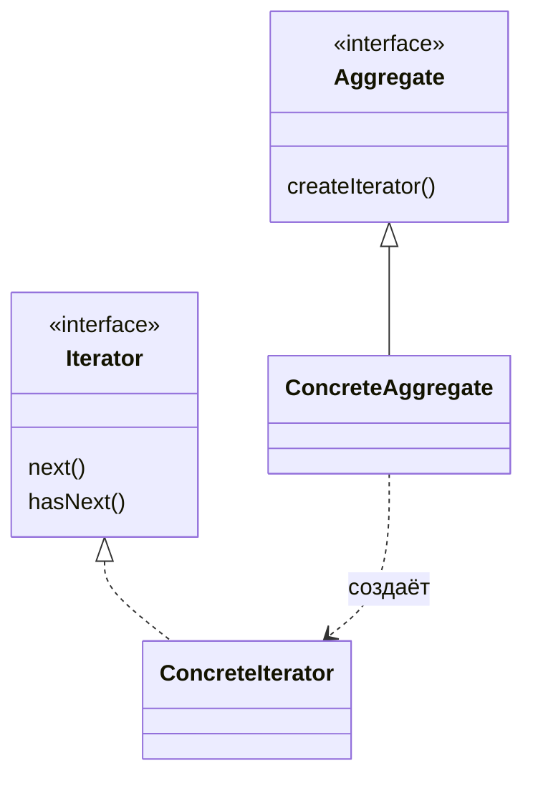

# Итератор (`Iterator`)

**Iterator** предоставляет способ последовательного доступа к элементам составного объекта без раскрытия его внутренней структуры.

## Полезные ссылки

### Официальная документация
- [Java Iterator](https://docs.oracle.com/en/java/javase/17/docs/api/java.base/java/util/Iterator.html)
- [Java Iterable](https://docs.oracle.com/en/java/javase/17/docs/api/java.base/java/lang/Iterable.html)
- [Java Spliterator](https://docs.oracle.com/en/java/javase/17/docs/api/java.base/java/util/Spliterator.html)

### См. также
- [Java Collections](../../languages/java/java-collections-list.md) — **Java Collections**
- [Stream API](../../languages/java/java-streams-fp.md) — **Stream API**
- [Visitor](visitor.md) — **Visitor Pattern**

## Содержание

- [Суть и запомнить](#суть-и-запомнить)
- [Что такое Iterator?](#что-такое-iterator)
  - [Основные характеристики](#основные-характеристики)
  - [Проблемы, которые решает](#проблемы-которые-решает)
- [Когда использовать Iterator?](#когда-использовать-iterator)
  - [Подходящие сценарии](#подходящие-сценарии)
  - [Признаки необходимости](#признаки-необходимости)
- [Структура паттерна](#структура-паттерна)
  - [Компоненты](#компоненты)
- [Реализация на Java](#реализация-на-java)
  - [Классический Iterator](#классический-iterator)
  - [Java Collections Iterator](#java-collections-iterator)
  - [Advanced Iterators](#advanced-iterators)
- [Продвинутые реализации](#продвинутые-реализации)
  - [1. Iterator с Java 8 Streams](#1-iterator-с-java-8-streams)
  - [2. Iterator с Database ResultSets](#2-iterator-с-database-resultsets)
- [Примеры использования](#примеры-использования)
  - [1. File System Iterator](#1-file-system-iterator)
  - [2. Composite Iterator](#2-composite-iterator)
  - [3. Iterator Chain](#3-iterator-chain)
- [Лучшие практики](#лучшие-практики)
  - [1. SOLID Principles](#1-solid-principles)
  - [2. Testing Iterator Pattern](#2-testing-iterator-pattern)
- [Решение проблем](#решение-проблем)
- [Частые вопросы](#частые-вопросы)
- [Заключение](#заключение)

## Суть и запомнить

**Суть в одном предложении:** Единый интерфейс обхода коллекции (hasNext, next); клиент не знает внутренней структуры; обход инкапсулирован в итераторе.

**Запомнить:**
- Aggregate создаёт Iterator; клиент ходит по элементам через итератор.
- В Java: Iterator/Iterable, for-each, Stream — варианты того же подхода.
- Позволяет иметь несколько активных обходов одной коллекции.

**Когда применять:** обход коллекций без раскрытия структуры, единый API для разных контейнеров, ленивый обход.

## Что такое **Iterator**?

**Iterator** — это поведенческий паттерн проектирования, который предоставляет способ последовательного доступа к элементам составного объекта, не раскрывая его внутренней структуры. **Iterator** инкапсулирует логику обхода коллекции.

### Основные характеристики

1. **Последовательный доступ**: Элементы доступны по одному
2. **Инкапсуляция обхода**: Логика обхода скрыта в итераторе
3. **Универсальный интерфейс**: Один интерфейс для разных коллекций
4. **Fail-fast поведение**: Обнаружение изменений во время итерации
5. **Внешний итератор**: Клиент контролирует процесс итерации

### Проблемы, которые решает

Ниже — сравнение обхода коллекций без единого интерфейса и с использованием паттерна **Iterator**.

```java
// Плохо: Разные способы обхода разных коллекций
public class CollectionProcessor {

    public void processArrayList(ArrayList<String> list) {
        for (int i = 0; i < list.size(); i++) {
            String item = list.get(i);
            processItem(item);
        }
    }

    public void processLinkedList(LinkedList<String> list) {
        for (String item : list) {
            processItem(item);
        }
    }

    public void processHashSet(HashSet<String> set) {
        for (String item : set) {
            processItem(item);
        }
    }

    public void processTreeSet(TreeSet<String> set) {
        for (String item : set) {
            processItem(item);
        }
    }

    public void processCustomCollection(CustomCollection collection) {
        // Как обходить кастомную коллекцию?
        // Нужно знать внутреннюю структуру!
        Node current = collection.getHead();
        while (current != null) {
            processItem(current.getData());
            current = current.getNext();
        }
    }

    private void processItem(String item) {
        System.out.println("Processing: " + item);
    }
}

// Хорошо: Iterator паттерн
public class CollectionProcessor {

    public void processCollection(Iterable<String> collection) {
        for (String item : collection) {
            processItem(item);
        }
    }

    // Или с явным использованием итератора
    public void processCollectionExplicitly(Iterable<String> collection) {
        Iterator<String> iterator = collection.iterator();
        while (iterator.hasNext()) {
            String item = iterator.next();
            processItem(item);
        }
    }

    private void processItem(String item) {
        System.out.println("Processing: " + item);
    }
}
```

## Когда использовать **Iterator**?

### Подходящие сценарии

- **Разные коллекции**: Единый интерфейс для разных типов коллекций
- **Скрытие структуры**: Клиент не должен знать внутреннюю структуру
- **Комплексный обход**: Логика обхода сложнее простого **for-each**
- **Ленивая загрузка**: Элементы загружаются по мере необходимости
- **Фильтрация**: Обход только определенных элементов

### Признаки необходимости

```java
// Признаки: Разные способы доступа к элементам
public class DataStructureProblems {

    // Проблема: Разные коллекции требуют разных подходов
    public void traverseCollections() {
        List<String> list = Arrays.asList("A", "B", "C");
        Set<String> set = new HashSet<>(Arrays.asList("X", "Y", "Z"));
        Map<String, String> map = new HashMap<>();

        // Для списка
        for (int i = 0; i < list.size(); i++) {
            System.out.println(list.get(i));
        }

        // Для множества
        for (String item : set) {
            System.out.println(item);
        }

        // Для карты - ключи
        for (String key : map.keySet()) {
            System.out.println(key);
        }

        // Для карты - значения
        for (String value : map.values()) {
            System.out.println(value);
        }

        // Для карты - пары
        for (Map.Entry<String, String> entry : map.entrySet()) {
            System.out.println(entry.getKey() + "=" + entry.getValue());
        }
    }

    // Проблема: Внутренняя структура раскрыта
    public void traverseCustomStructure(BinaryTree tree) {
        traverseNode(tree.getRoot());
    }

    private void traverseNode(BinaryTree.Node node) {
        if (node != null) {
            traverseNode(node.getLeft());
            System.out.println(node.getValue());
            traverseNode(node.getRight());
        }
    }

    // Решение: Iterator паттерн
    public void traverseWithIterator(Iterable<String> collection) {
        Iterator<String> iterator = collection.iterator();
        while (iterator.hasNext()) {
            System.out.println(iterator.next());
        }
    }
}
```

## Структура паттерна



```text
┌─────────────────────────────────────────────────────────────┐
│                    Client                                 │
│                                                             │
│  Aggregate aggregate = new ConcreteAggregate()              │
│  aggregate.addItem(item1)                                   │
│  aggregate.addItem(item2)                                   │
│                                                             │
│  Iterator iterator = aggregate.createIterator()             │
│  while (iterator.hasNext()) {                               │
│      Object item = iterator.next()                          │
│      // process item                                        │
│  }                                                          │
│                                                             │
└─────────────────────────────────────────────────────────────┼─┘
                                                              │
┌─────────────────────────────────────────────────────────────┼─┐
│                    Aggregate                              │ │
│                                                             │ │
│  ┌─────────────────────────────────────────────────────┐    │ │
│  │              createIterator()                      │    │ │
│  │                                                     │    │ │
│  │  // Создает конкретный Iterator для обхода           │    │ │
│  │  // элементов Aggregate                              │    │ │
│  └─────────────────────────────────────────────────────┘    │ │
└─────────────────────────────────────────────────────────────┘
                                                              │
┌─────────────────────────────────────────────────────────────┼─┐
│                    Iterator                               │ │
│                                                             │ │
│  ┌─────────────────────────────────────────────────────┐    │ │
│  │           hasNext()                                │    │ │
│  │           next()                                   │    │ │
│  │           remove()                                 │    │ │
│  │                                                     │    │ │
│  │  // Определяет интерфейс для доступа к элементам    │    │ │
│  │  // и навигации по ним                              │    │ │
│  └─────────────────────────────────────────────────────┘    │ │
└─────────────────────────────────────────────────────────────┘
                                                              │
┌─────────────────────────────────────────────────────────────┼─┐
│                ConcreteAggregate                          │ │
│                                                             │ │
│  ┌─────────────────────────────────────────────────────┐    │ │
│  │           createIterator()                          │    │ │
│  │                                                     │    │ │
│  │  // Создает экземпляр ConcreteIterator                │    │ │
│  └─────────────────────────────────────────────────────┘    │ │
└─────────────────────────────────────────────────────────────┘
                                                              │
┌─────────────────────────────────────────────────────────────┼─┐
│                ConcreteIterator                           │ │
│                                                             │ │
│  ┌─────────────────────────────────────────────────────┐    │ │
│  │           hasNext()                                │    │ │
│  │           next()                                   │    │ │
│  │           remove()                                 │    │ │
│  │                                                     │    │ │
│  │  // Реализует интерфейс Iterator                      │    │ │
│  │  // Отслеживает текущую позицию в обходе Aggregate    │    │ │
│  └─────────────────────────────────────────────────────┘    │ │
└─────────────────────────────────────────────────────────────┘
```

### Компоненты

1. **Iterator**: Интерфейс с методами **hasNext**(), **next**(), **remove**()
2. **ConcreteIterator**: Реализация итератора для конкретной коллекции
3. **Aggregate**: Интерфейс с методом **createIterator**()
4. **ConcreteAggregate**: Реализация агрегата, создающая конкретный итератор

## Реализация на Java

### Классический **Iterator**

```java
// Iterator интерфейс
interface Iterator<T> {
    boolean hasNext();
    T next();
    void remove(); // Optional
}

// Aggregate интерфейс
interface Aggregate<T> {
    Iterator<T> createIterator();
}

// Concrete Aggregate - Custom List
class CustomList<T> implements Aggregate<T> {
    private Object[] elements;
    private int size;
    private static final int DEFAULT_CAPACITY = 10;

    public CustomList() {
        elements = new Object[DEFAULT_CAPACITY];
        size = 0;
    }

    public void add(T element) {
        if (size == elements.length) {
            resize();
        }
        elements[size++] = element;
    }

    public T get(int index) {
        if (index < 0 || index >= size) {
            throw new IndexOutOfBoundsException();
        }
        return (T) elements[index];
    }

    public int size() {
        return size;
    }

    private void resize() {
        Object[] newElements = new Object[elements.length * 2];
        System.arraycopy(elements, 0, newElements, 0, size);
        elements = newElements;
    }

    @Override
    public Iterator<T> createIterator() {
        return new CustomListIterator<>(this);
    }

    // Inner class for iterator
    private static class CustomListIterator<T> implements Iterator<T> {
        private final CustomList<T> list;
        private int currentIndex;

        public CustomListIterator(CustomList<T> list) {
            this.list = list;
            this.currentIndex = 0;
        }

        @Override
        public boolean hasNext() {
            return currentIndex < list.size;
        }

        @Override
        public T next() {
            if (!hasNext()) {
                throw new NoSuchElementException();
            }
            return (T) list.elements[currentIndex++];
        }

        @Override
        public void remove() {
            if (currentIndex <= 0) {
                throw new IllegalStateException();
            }
            // Simplified remove - just shift elements
            System.arraycopy(list.elements, currentIndex,
                           list.elements, currentIndex - 1,
                           list.size - currentIndex);
            list.size--;
            currentIndex--;
        }
    }
}

// Tree Iterator
class BinaryTree<T> implements Aggregate<T> {
    private Node<T> root;

    public void add(T value) {
        root = addRecursive(root, value);
    }

    private Node<T> addRecursive(Node<T> current, T value) {
        if (current == null) {
            return new Node<>(value);
        }

        if (((Comparable<T>) value).compareTo(current.value) < 0) {
            current.left = addRecursive(current.left, value);
        } else if (((Comparable<T>) value).compareTo(current.value) > 0) {
            current.right = addRecursive(current.right, value);
        }

        return current;
    }

    @Override
    public Iterator<T> createIterator() {
        return new InOrderIterator<>(root);
    }

    private static class Node<U> {
        U value;
        Node<U> left;
        Node<U> right;

        Node(U value) {
            this.value = value;
        }
    }

    private static class InOrderIterator<U> implements Iterator<U> {
        private final Deque<Node<U>> stack = new ArrayDeque<>();
        private Node<U> current;

        public InOrderIterator(Node<U> root) {
            current = root;
        }

        @Override
        public boolean hasNext() {
            return current != null || !stack.isEmpty();
        }

        @Override
        public U next() {
            while (current != null) {
                stack.push(current);
                current = current.left;
            }

            if (stack.isEmpty()) {
                throw new NoSuchElementException();
            }

            Node<U> node = stack.pop();
            U result = node.value;
            current = node.right;
            return result;
        }

        @Override
        public void remove() {
            throw new UnsupportedOperationException();
        }
    }
}

public class IteratorDemo {
    public static void main(String[] args) {
        // Custom List
        CustomList<String> list = new CustomList<>();
        list.add("First");
        list.add("Second");
        list.add("Third");

        System.out.println("=== Custom List Iterator ===");
        Iterator<String> listIterator = list.createIterator();
        while (listIterator.hasNext()) {
            System.out.println(listIterator.next());
        }

        // Binary Tree
        BinaryTree<Integer> tree = new BinaryTree<>();
        tree.add(5);
        tree.add(3);
        tree.add(7);
        tree.add(1);
        tree.add(4);
        tree.add(6);
        tree.add(9);

        System.out.println("\n=== Binary Tree Iterator (In-order) ===");
        Iterator<Integer> treeIterator = tree.createIterator();
        while (treeIterator.hasNext()) {
            System.out.println(treeIterator.next());
        }
    }
}
```

### **Java Collections Iterator**

```java
// Использование Java Collections Iterator
public class CollectionsIteratorDemo {

    public static void demonstrateIterators() {
        // ArrayList
        List<String> arrayList = new ArrayList<>(Arrays.asList("A", "B", "C"));
        System.out.println("=== ArrayList ===");
        iterate(arrayList);

        // LinkedList
        List<String> linkedList = new LinkedList<>(Arrays.asList("X", "Y", "Z"));
        System.out.println("=== LinkedList ===");
        iterate(linkedList);

        // HashSet
        Set<String> hashSet = new HashSet<>(Arrays.asList("1", "2", "3"));
        System.out.println("=== HashSet ===");
        iterate(hashSet);

        // TreeSet (sorted)
        Set<String> treeSet = new TreeSet<>(Arrays.asList("3", "1", "2"));
        System.out.println("=== TreeSet (sorted) ===");
        iterate(treeSet);

        // HashMap keys
        Map<String, Integer> map = new HashMap<>();
        map.put("One", 1);
        map.put("Two", 2);
        map.put("Three", 3);
        System.out.println("=== HashMap Keys ===");
        iterate(map.keySet());

        // HashMap values
        System.out.println("=== HashMap Values ===");
        iterate(map.values());

        // HashMap entries
        System.out.println("=== HashMap Entries ===");
        iterateEntries(map.entrySet());
    }

    public static void iterate(Iterable<?> collection) {
        Iterator<?> iterator = collection.iterator();
        while (iterator.hasNext()) {
            System.out.println(iterator.next());
        }
    }

    public static void iterateEntries(Iterable<Map.Entry<String, Integer>> entries) {
        Iterator<Map.Entry<String, Integer>> iterator = entries.iterator();
        while (iterator.hasNext()) {
            Map.Entry<String, Integer> entry = iterator.next();
            System.out.println(entry.getKey() + " = " + entry.getValue());
        }
    }

    // Fail-fast behavior demonstration
    public static void demonstrateFailFast() {
        List<String> list = new ArrayList<>(Arrays.asList("A", "B", "C"));
        Iterator<String> iterator = list.iterator();

        System.out.println("=== Fail-fast demonstration ===");
        try {
            while (iterator.hasNext()) {
                String item = iterator.next();
                System.out.println("Processing: " + item);

                // Concurrent modification - should throw ConcurrentModificationException
                if ("B".equals(item)) {
                    list.add("D"); // This will cause fail-fast
                }
            }
        } catch (ConcurrentModificationException e) {
            System.out.println("Caught ConcurrentModificationException: " + e.getMessage());
        }
    }

    // Safe removal during iteration
    public static void demonstrateSafeRemoval() {
        List<String> list = new ArrayList<>(Arrays.asList("A", "B", "C", "B"));
        Iterator<String> iterator = list.iterator();

        System.out.println("=== Safe removal during iteration ===");
        while (iterator.hasNext()) {
            String item = iterator.next();
            System.out.println("Processing: " + item);

            // Safe removal using iterator.remove()
            if ("B".equals(item)) {
                iterator.remove();
                System.out.println("Removed: " + item);
            }
        }

        System.out.println("Final list: " + list);
    }

    public static void main(String[] args) {
        demonstrateIterators();
        System.out.println();
        demonstrateFailFast();
        System.out.println();
        demonstrateSafeRemoval();
    }
}
```

### **Advanced Iterators**

```java
// Продвинутые итераторы
public class AdvancedIteratorDemo {

    // Filtered Iterator
    static class FilteredIterator<T> implements Iterator<T> {
        private final Iterator<T> iterator;
        private final Predicate<T> predicate;
        private T nextElement;
        private boolean hasNext;

        public FilteredIterator(Iterator<T> iterator, Predicate<T> predicate) {
            this.iterator = iterator;
            this.predicate = predicate;
            advance();
        }

        private void advance() {
            hasNext = false;
            while (iterator.hasNext()) {
                T element = iterator.next();
                if (predicate.test(element)) {
                    nextElement = element;
                    hasNext = true;
                    break;
                }
            }
        }

        @Override
        public boolean hasNext() {
            return hasNext;
        }

        @Override
        public T next() {
            if (!hasNext) {
                throw new NoSuchElementException();
            }
            T result = nextElement;
            advance();
            return result;
        }

        @Override
        public void remove() {
            iterator.remove();
        }
    }

    // Transforming Iterator
    static class TransformingIterator<T, R> implements Iterator<R> {
        private final Iterator<T> iterator;
        private final Function<T, R> transformer;

        public TransformingIterator(Iterator<T> iterator, Function<T, R> transformer) {
            this.iterator = iterator;
            this.transformer = transformer;
        }

        @Override
        public boolean hasNext() {
            return iterator.hasNext();
        }

        @Override
        public R next() {
            return transformer.apply(iterator.next());
        }

        @Override
        public void remove() {
            iterator.remove();
        }
    }

    // Concatenating Iterator
    static class ConcatenatingIterator<T> implements Iterator<T> {
        private final Iterator<Iterator<T>> iterators;
        private Iterator<T> current;

        public ConcatenatingIterator(Iterator<Iterator<T>> iterators) {
            this.iterators = iterators;
            advanceToNextIterator();
        }

        private void advanceToNextIterator() {
            while ((current == null || !current.hasNext()) && iterators.hasNext()) {
                current = iterators.next();
            }
        }

        @Override
        public boolean hasNext() {
            advanceToNextIterator();
            return current != null && current.hasNext();
        }

        @Override
        public T next() {
            if (!hasNext()) {
                throw new NoSuchElementException();
            }
            return current.next();
        }

        @Override
        public void remove() {
            if (current != null) {
                current.remove();
            }
        }
    }

    // Limited Iterator
    static class LimitedIterator<T> implements Iterator<T> {
        private final Iterator<T> iterator;
        private final int limit;
        private int count = 0;

        public LimitedIterator(Iterator<T> iterator, int limit) {
            this.iterator = iterator;
            this.limit = limit;
        }

        @Override
        public boolean hasNext() {
            return count < limit && iterator.hasNext();
        }

        @Override
        public T next() {
            if (!hasNext()) {
                throw new NoSuchElementException();
            }
            count++;
            return iterator.next();
        }

        @Override
        public void remove() {
            iterator.remove();
        }
    }

    // Skipping Iterator
    static class SkippingIterator<T> implements Iterator<T> {
        private final Iterator<T> iterator;
        private final int skipCount;
        private int skipped = 0;

        public SkippingIterator(Iterator<T> iterator, int skipCount) {
            this.iterator = iterator;
            this.skipCount = skipCount;
            skip();
        }

        private void skip() {
            while (skipped < skipCount && iterator.hasNext()) {
                iterator.next();
                skipped++;
            }
        }

        @Override
        public boolean hasNext() {
            return iterator.hasNext();
        }

        @Override
        public T next() {
            return iterator.next();
        }

        @Override
        public void remove() {
            iterator.remove();
        }
    }

    public static void main(String[] args) {
        List<Integer> numbers = Arrays.asList(1, 2, 3, 4, 5, 6, 7, 8, 9, 10);

        // Filtered Iterator - только четные числа
        System.out.println("=== Filtered Iterator (even numbers) ===");
        Iterator<Integer> filtered = new FilteredIterator<>(numbers.iterator(), n -> n % 2 == 0);
        while (filtered.hasNext()) {
            System.out.println(filtered.next());
        }

        // Transforming Iterator - умножение на 2
        System.out.println("\n=== Transforming Iterator (multiply by 2) ===");
        Iterator<String> transformed = new TransformingIterator<>(numbers.iterator(), n -> "Number: " + (n * 2));
        while (transformed.hasNext()) {
            System.out.println(transformed.next());
        }

        // Limited Iterator - первые 3 элемента
        System.out.println("\n=== Limited Iterator (first 3) ===");
        Iterator<Integer> limited = new LimitedIterator<>(numbers.iterator(), 3);
        while (limited.hasNext()) {
            System.out.println(limited.next());
        }

        // Skipping Iterator - пропустить первые 5
        System.out.println("\n=== Skipping Iterator (skip first 5) ===");
        Iterator<Integer> skipping = new SkippingIterator<>(numbers.iterator(), 5);
        while (skipping.hasNext()) {
            System.out.println(skipping.next());
        }

        // Concatenating Iterator
        System.out.println("\n=== Concatenating Iterator ===");
        List<Integer> list1 = Arrays.asList(1, 2, 3);
        List<Integer> list2 = Arrays.asList(4, 5, 6);
        List<Integer> list3 = Arrays.asList(7, 8, 9);

        List<Iterator<Integer>> iterators = Arrays.asList(
            list1.iterator(), list2.iterator(), list3.iterator()
        );

        Iterator<Integer> concatenated = new ConcatenatingIterator<>(iterators.iterator());
        while (concatenated.hasNext()) {
            System.out.println(concatenated.next());
        }
    }
}
```

## Продвинутые реализации

### 1. **Iterator** с **Java** 8 **Streams**

```java
// Iterator с Java 8 Streams и Spliterator
public class StreamIteratorDemo {

    // Custom Spliterator для ленивой обработки
    static class LazyFileLineSpliterator implements Spliterator<String> {
        private final BufferedReader reader;
        private String nextLine;
        private boolean eof = false;

        public LazyFileLineSpliterator(BufferedReader reader) {
            this.reader = reader;
        }

        @Override
        public boolean tryAdvance(Consumer<? super String> action) {
            if (eof) {
                return false;
            }

            try {
                nextLine = reader.readLine();
                if (nextLine == null) {
                    eof = true;
                    return false;
                }
                action.accept(nextLine);
                return true;
            } catch (IOException e) {
                throw new UncheckedIOException(e);
            }
        }

        @Override
        public Spliterator<String> trySplit() {
            // Не поддерживаем параллельную обработку для простоты
            return null;
        }

        @Override
        public long estimateSize() {
            return Long.MAX_VALUE; // Неизвестный размер
        }

        @Override
        public int characteristics() {
            return ORDERED | NONNULL | IMMUTABLE;
        }
    }

    // Stream-based Iterator
    static class StreamBasedIterator<T> implements Iterator<T> {
        private final Stream<T> stream;
        private final Iterator<T> iterator;

        public StreamBasedIterator(Stream<T> stream) {
            this.stream = stream;
            this.iterator = stream.iterator();
        }

        @Override
        public boolean hasNext() {
            return iterator.hasNext();
        }

        @Override
        public T next() {
            return iterator.next();
        }

        @Override
        public void remove() {
            iterator.remove();
        }

        public Stream<T> getStream() {
            return stream;
        }
    }

    // Infinite Iterator
    static class InfiniteIterator<T> implements Iterator<T> {
        private final Supplier<T> generator;
        private T nextValue;

        public InfiniteIterator(Supplier<T> generator) {
            this.generator = generator;
            this.nextValue = generator.get();
        }

        @Override
        public boolean hasNext() {
            return true; // Бесконечный
        }

        @Override
        public T next() {
            T current = nextValue;
            nextValue = generator.get();
            return current;
        }

        @Override
        public void remove() {
            throw new UnsupportedOperationException();
        }
    }

    public static void main(String[] args) throws IOException {
        // 1. Stream-based filtering и mapping
        List<Integer> numbers = Arrays.asList(1, 2, 3, 4, 5, 6, 7, 8, 9, 10);

        System.out.println("=== Stream-based Iterator ===");
        StreamBasedIterator<Integer> streamIterator = new StreamBasedIterator<>(
            numbers.stream()
                .filter(n -> n % 2 == 0)  // Только четные
                .map(n -> n * 2)          // Умножить на 2
        );

        while (streamIterator.hasNext()) {
            System.out.println(streamIterator.next());
        }

        // 2. Custom Spliterator для файлов
        System.out.println("\n=== Custom Spliterator (simulated) ===");
        // Имитация чтения файла построчно
        List<String> lines = Arrays.asList("Line 1", "Line 2", "Line 3", "Line 4", "Line 5");

        Stream<String> lineStream = StreamSupport.stream(
            new Spliterator<String>() {
                private int index = 0;

                @Override
                public boolean tryAdvance(Consumer<? super String> action) {
                    if (index < lines.size()) {
                        action.accept(lines.get(index++));
                        return true;
                    }
                    return false;
                }

                @Override
                public Spliterator<String> trySplit() { return null; }

                @Override
                public long estimateSize() { return lines.size() - index; }

                @Override
                public int characteristics() { return ORDERED | SIZED | NONNULL; }
            },
            false
        );

        lineStream.filter(line -> line.contains("2") || line.contains("4"))
                 .forEach(System.out::println);

        // 3. Infinite Iterator
        System.out.println("\n=== Infinite Iterator (first 5) ===");
        InfiniteIterator<Integer> infinite = new InfiniteIterator<>(() -> (int) (Math.random() * 100));

        for (int i = 0; i < 5; i++) {
            System.out.println(infinite.next());
        }

        // 4. Parallel Stream Iterator
        System.out.println("\n=== Parallel Stream Processing ===");
        List<String> words = Arrays.asList("hello", "world", "java", "iterator", "pattern");

        words.parallelStream()
            .map(String::toUpperCase)
            .filter(word -> word.length() > 4)
            .forEach(System.out::println);
    }
}
```

### 2. **Iterator** с **Database ResultSets**

```java
// Iterator для работы с JDBC ResultSet
public class DatabaseIteratorDemo {

    // ResultSet Iterator
    static class ResultSetIterator<T> implements Iterator<T>, AutoCloseable {
        private final ResultSet resultSet;
        private final ResultSetMapper<T> mapper;
        private boolean hasNext;
        private boolean nextCalled = false;

        public ResultSetIterator(ResultSet resultSet, ResultSetMapper<T> mapper) throws SQLException {
            this.resultSet = resultSet;
            this.mapper = mapper;
            this.hasNext = resultSet.next();
        }

        @Override
        public boolean hasNext() {
            return hasNext;
        }

        @Override
        public T next() {
            if (!hasNext) {
                throw new NoSuchElementException();
            }

            try {
                T result = mapper.map(resultSet);
                hasNext = resultSet.next();
                nextCalled = true;
                return result;
            } catch (SQLException e) {
                throw new RuntimeException("Error reading from ResultSet", e);
            }
        }

        @Override
        public void remove() {
            throw new UnsupportedOperationException("Remove not supported for ResultSet");
        }

        @Override
        public void close() throws SQLException {
            resultSet.close();
        }
    }

    // Mapper interface
    interface ResultSetMapper<T> {
        T map(ResultSet rs) throws SQLException;
    }

    // User entity
    static class User {
        private final int id;
        private final String name;
        private final String email;

        public User(int id, String name, String email) {
            this.id = id;
            this.name = name;
            this.email = email;
        }

        @Override
        public String toString() {
            return "User{id=" + id + ", name='" + name + "', email='" + email + "'}";
        }
    }

    // Paged Iterator для больших результатов
    static class PagedIterator<T> implements Iterator<List<T>> {
        private final Connection connection;
        private final String sql;
        private final Object[] params;
        private final ResultSetMapper<T> mapper;
        private final int pageSize;
        private int currentPage = 0;
        private List<T> currentPageData;
        private boolean hasMorePages = true;

        public PagedIterator(Connection connection, String sql, Object[] params,
                           ResultSetMapper<T> mapper, int pageSize) {
            this.connection = connection;
            this.sql = sql;
            this.params = params;
            this.mapper = mapper;
            this.pageSize = pageSize;
        }

        @Override
        public boolean hasNext() {
            if (currentPageData == null) {
                loadNextPage();
            }
            return hasMorePages || (currentPageData != null && !currentPageData.isEmpty());
        }

        @Override
        public List<T> next() {
            if (!hasNext()) {
                throw new NoSuchElementException();
            }

            List<T> result = currentPageData;
            currentPageData = null; // Force loading next page
            return result;
        }

        @Override
        public void remove() {
            throw new UnsupportedOperationException();
        }

        private void loadNextPage() {
            try (PreparedStatement stmt = connection.prepareStatement(sql + " LIMIT ? OFFSET ?")) {
                // Set parameters
                int paramIndex = 1;
                if (params != null) {
                    for (Object param : params) {
                        stmt.setObject(paramIndex++, param);
                    }
                }
                stmt.setInt(paramIndex++, pageSize);
                stmt.setInt(paramIndex, currentPage * pageSize);

                try (ResultSet rs = stmt.executeQuery()) {
                    currentPageData = new ArrayList<>();
                    while (rs.next()) {
                        currentPageData.add(mapper.map(rs));
                    }

                    hasMorePages = currentPageData.size() == pageSize;
                    currentPage++;
                }
            } catch (SQLException e) {
                throw new RuntimeException("Error loading page", e);
            }
        }
    }

    // Lazy Iterator для больших наборов данных
    static class LazyDatabaseIterator<T> implements Iterator<T> {
        private final Connection connection;
        private final String sql;
        private final Object[] params;
        private final ResultSetMapper<T> mapper;
        private ResultSet resultSet;
        private boolean initialized = false;
        private boolean hasNext = false;

        public LazyDatabaseIterator(Connection connection, String sql, Object[] params,
                                  ResultSetMapper<T> mapper) {
            this.connection = connection;
            this.sql = sql;
            this.params = params;
            this.mapper = mapper;
        }

        private void initialize() throws SQLException {
            if (!initialized) {
                PreparedStatement stmt = connection.prepareStatement(sql);
                if (params != null) {
                    for (int i = 0; i < params.length; i++) {
                        stmt.setObject(i + 1, params[i]);
                    }
                }
                resultSet = stmt.executeQuery();
                initialized = true;
            }
        }

        @Override
        public boolean hasNext() {
            try {
                initialize();
                if (resultSet.next()) {
                    hasNext = true;
                    // Откатываем курсор назад для next()
                    // В реальности лучше использовать scrollable ResultSet
                    return true;
                }
                hasNext = false;
                return false;
            } catch (SQLException e) {
                throw new RuntimeException("Error checking hasNext", e);
            }
        }

        @Override
        public T next() {
            try {
                if (!hasNext && !hasNext()) {
                    throw new NoSuchElementException();
                }
                hasNext = false;
                return mapper.map(resultSet);
            } catch (SQLException e) {
                throw new RuntimeException("Error reading next", e);
            }
        }

        @Override
        public void remove() {
            throw new UnsupportedOperationException();
        }

        public void close() throws SQLException {
            if (resultSet != null) {
                resultSet.close();
            }
        }
    }

    public static void main(String[] args) {
        // Имитация работы с БД (в реальном коде использовался бы настоящий Connection)
        System.out.println("Database Iterator Pattern Demo");
        System.out.println("This example shows how to create iterators for database result sets");
        System.out.println("with support for paging and lazy loading.");

        // User mapper
        ResultSetMapper<User> userMapper = rs -> new User(
            rs.getInt("id"),
            rs.getString("name"),
            rs.getString("email")
        );

        System.out.println("\n=== Paged Iterator Example ===");
        // PagedIterator<User> pagedIterator = new PagedIterator<>(
        //     connection, "SELECT * FROM users WHERE active = ?", new Object[]{true},
        //     userMapper, 10
        // );

        System.out.println("\n=== Lazy Iterator Example ===");
        // try (LazyDatabaseIterator<User> lazyIterator = new LazyDatabaseIterator<>(
        //     connection, "SELECT * FROM users ORDER BY name", null, userMapper)) {
        //     while (lazyIterator.hasNext()) {
        //         User user = lazyIterator.next();
        //         System.out.println(user);
        //     }
        // }
    }
}
```

## Примеры использования

### 1. **File System Iterator**

```java
// Iterator для файловой системы
public class FileSystemIteratorDemo {

    // File System Iterator
    static class FileSystemIterator implements Iterator<java.io.File> {
        private final Queue<java.io.File> queue = new LinkedList<>();
        private final boolean recursive;

        public FileSystemIterator(java.io.File root, boolean recursive) {
            this.recursive = recursive;
            if (root.isDirectory()) {
                queue.addAll(Arrays.asList(root.listFiles()));
            } else {
                queue.add(root);
            }
        }

        @Override
        public boolean hasNext() {
            return !queue.isEmpty();
        }

        @Override
        public java.io.File next() {
            java.io.File file = queue.poll();

            if (recursive && file.isDirectory()) {
                java.io.File[] children = file.listFiles();
                if (children != null) {
                    for (java.io.File child : children) {
                        queue.add(child);
                    }
                }
            }

            return file;
        }

        @Override
        public void remove() {
            throw new UnsupportedOperationException();
        }
    }

    // Filtered File Iterator
    static class FilteredFileIterator implements Iterator<java.io.File> {
        private final Iterator<java.io.File> iterator;
        private final FileFilter filter;
        private java.io.File nextFile;
        private boolean hasNext;

        public FilteredFileIterator(java.io.File root, FileFilter filter, boolean recursive) {
            this.iterator = new FileSystemIterator(root, recursive);
            this.filter = filter;
            advance();
        }

        private void advance() {
            hasNext = false;
            while (iterator.hasNext()) {
                java.io.File file = iterator.next();
                if (filter.accept(file)) {
                    nextFile = file;
                    hasNext = true;
                    break;
                }
            }
        }

        @Override
        public boolean hasNext() {
            return hasNext;
        }

        @Override
        public java.io.File next() {
            if (!hasNext) {
                throw new NoSuchElementException();
            }
            java.io.File result = nextFile;
            advance();
            return result;
        }

        @Override
        public void remove() {
            throw new UnsupportedOperationException();
        }
    }

    public static void main(String[] args) {
        // Пример использования (адаптируйте пути к существующим директориям)
        System.out.println("File System Iterator Demo");
        System.out.println("This example shows how to create iterators for file system traversal");
        System.out.println("with support for filtering and recursive traversal.");

        // FileSystemIterator iterator = new FileSystemIterator(new java.io.File("/tmp"), true);
        // while (iterator.hasNext()) {
        //     java.io.File file = iterator.next();
        //     System.out.println(file.getAbsolutePath());
        // }

        // FilteredFileIterator filtered = new FilteredFileIterator(
        //     new java.io.File("/tmp"),
        //     file -> file.getName().endsWith(".txt"),
        //     true
        // );
        // while (filtered.hasNext()) {
        //     java.io.File file = filtered.next();
        //     System.out.println("Text file: " + file.getAbsolutePath());
        // }
    }
}
```

### 2. **Composite Iterator**

```java
// Iterator для композитных структур
public class CompositeIteratorDemo {

    // Component interface
    interface Component {
        Iterator<Component> createIterator();
        String getName();
        void add(Component component);
        List<Component> getChildren();
    }

    // Leaf
    static class Leaf implements Component {
        private final String name;

        public Leaf(String name) {
            this.name = name;
        }

        @Override
        public Iterator<Component> createIterator() {
            return new NullIterator();
        }

        @Override
        public String getName() { return name; }

        @Override
        public void add(Component component) {
            throw new UnsupportedOperationException();
        }

        @Override
        public List<Component> getChildren() {
            return Collections.emptyList();
        }

        @Override
        public String toString() {
            return "Leaf: " + name;
        }
    }

    // Composite
    static class Composite implements Component {
        private final String name;
        private final List<Component> children = new ArrayList<>();

        public Composite(String name) {
            this.name = name;
        }

        @Override
        public Iterator<Component> createIterator() {
            return new CompositeIterator(this);
        }

        @Override
        public String getName() { return name; }

        @Override
        public void add(Component component) {
            children.add(component);
        }

        @Override
        public List<Component> getChildren() {
            return new ArrayList<>(children);
        }

        @Override
        public String toString() {
            return "Composite: " + name;
        }
    }

    // Null Iterator для листьев
    static class NullIterator implements Iterator<Component> {
        @Override
        public boolean hasNext() { return false; }

        @Override
        public Component next() { throw new NoSuchElementException(); }

        @Override
        public void remove() { throw new UnsupportedOperationException(); }
    }

    // Composite Iterator
    static class CompositeIterator implements Iterator<Component> {
        private final Deque<Iterator<Component>> stack = new ArrayDeque<>();

        public CompositeIterator(Component root) {
            stack.push(Collections.singletonList(root).iterator());
        }

        @Override
        public boolean hasNext() {
            if (stack.isEmpty()) {
                return false;
            }

            Iterator<Component> iterator = stack.peek();
            if (!iterator.hasNext()) {
                stack.pop();
                return hasNext();
            }

            return true;
        }

        @Override
        public Component next() {
            if (!hasNext()) {
                throw new NoSuchElementException();
            }

            Iterator<Component> iterator = stack.peek();
            Component component = iterator.next();

            if (component instanceof Composite) {
                stack.push(component.getChildren().iterator());
            }

            return component;
        }

        @Override
        public void remove() {
            throw new UnsupportedOperationException();
        }
    }

    public static void main(String[] args) {
        // Создаем композитную структуру
        Composite root = new Composite("Root");
        Composite branch1 = new Composite("Branch1");
        Composite branch2 = new Composite("Branch2");

        root.add(branch1);
        root.add(branch2);
        root.add(new Leaf("Leaf1"));

        branch1.add(new Leaf("Leaf2"));
        branch1.add(new Leaf("Leaf3"));

        branch2.add(new Leaf("Leaf4"));
        Composite subBranch = new Composite("SubBranch");
        branch2.add(subBranch);
        subBranch.add(new Leaf("Leaf5"));

        // Обходим структуру
        System.out.println("=== Composite Iterator Traversal ===");
        Iterator<Component> iterator = root.createIterator();
        while (iterator.hasNext()) {
            Component component = iterator.next();
            System.out.println(component.toString());
        }
    }
}
```

### 3. **Iterator Chain**

```java
// Цепочка итераторов
public class IteratorChainDemo {

    // Iterator Chain - комбинирует несколько итераторов
    static class IteratorChain<T> implements Iterator<T> {
        private final Iterator<Iterator<T>> iterators;
        private Iterator<T> current;

        public IteratorChain(Iterator<Iterator<T>> iterators) {
            this.iterators = iterators;
            advanceToNextIterator();
        }

        public IteratorChain(Collection<Iterator<T>> iterators) {
            this(iterators.iterator());
        }

        @SafeVarargs
        public IteratorChain(Iterator<T>... iterators) {
            this(Arrays.asList(iterators));
        }

        private void advanceToNextIterator() {
            while ((current == null || !current.hasNext()) && iterators.hasNext()) {
                current = iterators.next();
            }
        }

        @Override
        public boolean hasNext() {
            advanceToNextIterator();
            return current != null && current.hasNext();
        }

        @Override
        public T next() {
            if (!hasNext()) {
                throw new NoSuchElementException();
            }
            return current.next();
        }

        @Override
        public void remove() {
            if (current != null) {
                current.remove();
            }
        }
    }

    // Iterator Factory для создания сложных итераторов
    static class IteratorFactory {
        public static <T> Iterator<T> filter(Iterator<T> iterator, Predicate<T> predicate) {
            return new Iterator<T>() {
                private T nextElement;
                private boolean hasNext;

                {
                    advance();
                }

                private void advance() {
                    hasNext = false;
                    while (iterator.hasNext()) {
                        T element = iterator.next();
                        if (predicate.test(element)) {
                            nextElement = element;
                            hasNext = true;
                            break;
                        }
                    }
                }

                @Override
                public boolean hasNext() { return hasNext; }

                @Override
                public T next() {
                    if (!hasNext) throw new NoSuchElementException();
                    T result = nextElement;
                    advance();
                    return result;
                }

                @Override
                public void remove() { iterator.remove(); }
            };
        }

        public static <T, R> Iterator<R> map(Iterator<T> iterator, Function<T, R> mapper) {
            return new Iterator<R>() {
                @Override
                public boolean hasNext() { return iterator.hasNext(); }

                @Override
                public R next() { return mapper.apply(iterator.next()); }

                @Override
                public void remove() { iterator.remove(); }
            };
        }

        public static <T> Iterator<T> limit(Iterator<T> iterator, int limit) {
            return new Iterator<T>() {
                private int count = 0;

                @Override
                public boolean hasNext() {
                    return count < limit && iterator.hasNext();
                }

                @Override
                public T next() {
                    if (!hasNext()) throw new NoSuchElementException();
                    count++;
                    return iterator.next();
                }

                @Override
                public void remove() { iterator.remove(); }
            };
        }

        public static <T> Iterator<T> skip(Iterator<T> iterator, int skipCount) {
            for (int i = 0; i < skipCount && iterator.hasNext(); i++) {
                iterator.next();
            }
            return iterator;
        }
    }

    // Fluent Iterator Builder
    static class IteratorBuilder<T> {
        private Iterator<T> iterator;

        public IteratorBuilder(Iterator<T> iterator) {
            this.iterator = iterator;
        }

        public IteratorBuilder<T> filter(Predicate<T> predicate) {
            this.iterator = IteratorFactory.filter(iterator, predicate);
            return this;
        }

        public <R> IteratorBuilder<R> map(Function<T, R> mapper) {
            this.iterator = IteratorFactory.map(iterator, mapper);
            return this;
        }

        public IteratorBuilder<T> limit(int limit) {
            this.iterator = IteratorFactory.limit(iterator, limit);
            return this;
        }

        public IteratorBuilder<T> skip(int skipCount) {
            this.iterator = IteratorFactory.skip(iterator, skipCount);
            return this;
        }

        public Iterator<T> build() {
            return iterator;
        }

        public List<T> toList() {
            List<T> result = new ArrayList<>();
            while (iterator.hasNext()) {
                result.add(iterator.next());
            }
            return result;
        }
    }

    public static void main(String[] args) {
        List<Integer> numbers = Arrays.asList(1, 2, 3, 4, 5, 6, 7, 8, 9, 10);

        // Iterator Chain
        System.out.println("=== Iterator Chain ===");
        List<Integer> evenNumbers = Arrays.asList(2, 4, 6, 8, 10);
        List<Integer> oddNumbers = Arrays.asList(1, 3, 5, 7, 9);

        IteratorChain<Integer> chain = new IteratorChain<>(
            evenNumbers.iterator(),
            oddNumbers.iterator()
        );

        while (chain.hasNext()) {
            System.out.println(chain.next());
        }

        // Fluent Iterator Builder
        System.out.println("\n=== Fluent Iterator Builder ===");
        List<String> result = new IteratorBuilder<>(numbers.iterator())
            .filter(n -> n % 2 == 0)          // Только четные
            .map(n -> "Number: " + n)         // Преобразовать в строку
            .limit(3)                         // Ограничить первыми 3
            .toList();                        // Собрать в список

        result.forEach(System.out::println);

        // Complex chain
        System.out.println("\n=== Complex Iterator Chain ===");
        List<Integer> list1 = Arrays.asList(1, 2, 3);
        List<Integer> list2 = Arrays.asList(4, 5, 6);
        List<Integer> list3 = Arrays.asList(7, 8, 9, 10);

        IteratorChain<Integer> complexChain = new IteratorChain<>(
            IteratorFactory.filter(list1.iterator(), n -> n > 1),
            IteratorFactory.map(list2.iterator(), n -> n * 10),
            IteratorFactory.limit(list3.iterator(), 2)
        );

        while (complexChain.hasNext()) {
            System.out.println(complexChain.next());
        }
    }
}
```

## Лучшие практики

### 1. **SOLID Principles**

```java
// Правильное применение SOLID принципов
interface Iterator<T> {
    boolean hasNext();
    T next();
    default void remove() {
        throw new UnsupportedOperationException();
    }
}

interface Aggregate<T> {
    Iterator<T> iterator();
}

// Single Responsibility: Каждый класс отвечает за одну операцию
class ListIterator<T> implements Iterator<T> {
    private final List<T> list;
    private int index = 0;

    public ListIterator(List<T> list) {
        this.list = list;
    }

    @Override
    public boolean hasNext() {
        return index < list.size();
    }

    @Override
    public T next() {
        if (!hasNext()) throw new NoSuchElementException();
        return list.get(index++);
    }
}

// Open/Closed: Новые типы коллекций добавляются без изменения существующего кода
class TreeIterator<T> implements Iterator<T> {
    private final Deque<Node<T>> stack = new ArrayDeque<>();

    public TreeIterator(Node<T> root) {
        pushLeft(root);
    }

    private void pushLeft(Node<T> node) {
        while (node != null) {
            stack.push(node);
            node = node.left;
        }
    }

    @Override
    public boolean hasNext() {
        return !stack.isEmpty();
    }

    @Override
    public T next() {
        if (!hasNext()) throw new NoSuchElementException();
        Node<T> node = stack.pop();
        if (node.right != null) {
            pushLeft(node.right);
        }
        return node.value;
    }
}

// Liskov Substitution: Все итераторы взаимозаменяемы
class IteratorProcessor {
    public static <T> void processAll(Iterator<T> iterator, Consumer<T> consumer) {
        while (iterator.hasNext()) {
            consumer.accept(iterator.next());
        }
    }
}

// Interface Segregation: Разделение интерфейсов для разных операций
interface ReadOnlyIterator<T> {
    boolean hasNext();
    T next();
}

interface MutableIterator<T> extends ReadOnlyIterator<T> {
    void remove();
}

// Dependency Inversion: Зависимости от абстракций
class CollectionProcessor {
    private final Aggregate<?> aggregate;

    public CollectionProcessor(Aggregate<?> aggregate) {
        this.aggregate = aggregate;
    }

    public void process(Consumer<Object> consumer) {
        Iterator<?> iterator = aggregate.iterator();
        while (iterator.hasNext()) {
            consumer.accept(iterator.next());
        }
    }
}
```

### 2. **Testing Iterator Pattern**

```java
@ExtendWith(MockitoExtension.class)
public class IteratorPatternTest {

    @Test
    void shouldIterateThroughAllElements() {
        List<String> list = Arrays.asList("A", "B", "C");
        Iterator<String> iterator = list.iterator();

        assertTrue(iterator.hasNext());
        assertEquals("A", iterator.next());
        assertTrue(iterator.hasNext());
        assertEquals("B", iterator.next());
        assertTrue(iterator.hasNext());
        assertEquals("C", iterator.next());
        assertFalse(iterator.hasNext());
    }

    @Test
    void shouldThrowExceptionWhenNoMoreElements() {
        List<String> list = Arrays.asList("A");
        Iterator<String> iterator = list.iterator();

        iterator.next(); // consume the element

        assertThrows(NoSuchElementException.class, iterator::next);
    }

    @Test
    void shouldSupportRemoveOperation() {
        List<String> list = new ArrayList<>(Arrays.asList("A", "B", "C"));
        Iterator<String> iterator = list.iterator();

        iterator.next(); // A
        iterator.remove();

        assertEquals(Arrays.asList("B", "C"), list);
    }

    @Test
    void shouldThrowExceptionWhenRemoveCalledBeforeNext() {
        List<String> list = new ArrayList<>(Arrays.asList("A", "B", "C"));
        Iterator<String> iterator = list.iterator();

        assertThrows(IllegalStateException.class, iterator::remove);
    }

    @Test
    void shouldDetectConcurrentModification() {
        List<String> list = new ArrayList<>(Arrays.asList("A", "B", "C"));
        Iterator<String> iterator = list.iterator();

        iterator.next(); // A
        list.add("D"); // Concurrent modification

        assertThrows(ConcurrentModificationException.class, iterator::next);
    }

    @Test
    void shouldSupportEmptyCollections() {
        List<String> list = Collections.emptyList();
        Iterator<String> iterator = list.iterator();

        assertFalse(iterator.hasNext());
        assertThrows(NoSuchElementException.class, iterator::next);
    }

    @ParameterizedTest
    @MethodSource("provideIteratorTestData")
    void shouldWorkWithDifferentCollectionTypes(Collection<String> collection) {
        Iterator<String> iterator = collection.iterator();
        List<String> result = new ArrayList<>();

        while (iterator.hasNext()) {
            result.add(iterator.next());
        }

        assertEquals(collection.size(), result.size());
        // Note: Order may differ for unordered collections like HashSet
    }

    static Stream<Collection<String>> provideIteratorTestData() {
        return Stream.of(
            Arrays.asList("A", "B", "C"),
            new LinkedList<>(Arrays.asList("X", "Y", "Z")),
            new HashSet<>(Arrays.asList("1", "2", "3")),
            new TreeSet<>(Arrays.asList("3", "1", "2"))
        );
    }

    @Test
    void shouldSupportCustomIteratorImplementation() {
        CustomList<String> list = new CustomList<>();
        list.add("First");
        list.add("Second");

        Iterator<String> iterator = list.iterator();

        assertTrue(iterator.hasNext());
        assertEquals("First", iterator.next());
        assertTrue(iterator.hasNext());
        assertEquals("Second", iterator.next());
        assertFalse(iterator.hasNext());
    }

    // Test double
    static class CustomList<T> extends ArrayList<T> {
        // Custom implementation can be tested here
    }
}
```


## Решение проблем

Типичные проблемы: неверное использование API (сверьтесь с примерами и разделом «Лучшие практики» выше), производительность (профилирование и настройки). Подробнее — в разделе «Лучшие практики» и в официальной документации из блока «Полезные ссылки».

## Частые вопросы

**Iterator vs for-each?** for-each использует Iterator под капотом. Прямой Iterator — когда нужен remove(), фильтрация или кастомная логика обхода.

**Iterator vs Stream?** Iterator — императивный, по одному элементу. Stream — декларативный, ленивый, с цепочками операций. Stream удобнее для трансформаций и фильтрации.


## Заключение

**Iterator** паттерн — фундаментальный паттерн для работы с коллекциями и последовательным доступом к элементам. Он обеспечивает единообразный интерфейс для обхода различных структур данных, скрывая их внутреннюю реализацию.

**Ключевые преимущества:**
- **Унификация**: Единый интерфейс для разных коллекций
- **Инкапсуляция**: Логика обхода скрыта в итераторе
- **Безопасность**: **Fail-fast** поведение для обнаружения изменений
- **Гибкость**: Поддержка различных стратегий обхода

**Используйте Iterator, когда:**
- Нужно единообразно работать с разными коллекциями
- Требуется скрыть внутреннюю структуру данных
- Необходимы специальные стратегии обхода(фильтрация, трансформация)
- Требуется ленивая загрузка элементов

**Iterator** часто используется вместе с:
- **Composite**: Для обхода древовидных структур
- **Visitor**: Для выполнения операций над элементами
- **Strategy**: Для различных стратегий обхода
- **Factory**: Для создания итераторов

Главное правило: всегда реализуйте **fail-fast** поведение для обнаружения конкурентных модификаций и предоставляйте понятные контракты для методов **hasNext**() и **next**()!
