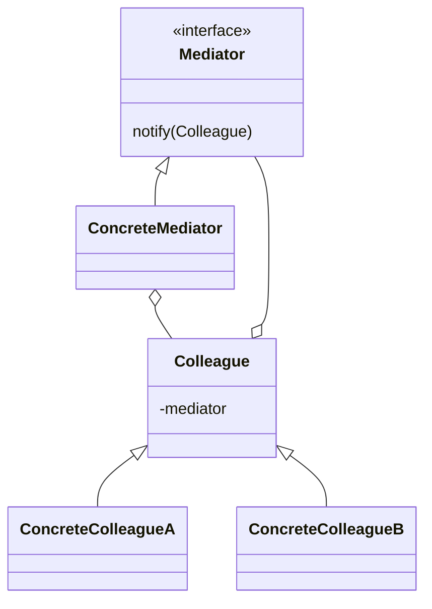

# Посредник (`Mediator`)

**Mediator** определяет объект, который инкапсулирует способ взаимодействия множества объектов. **Mediator** способствует **loosely coupled** коммуникациям между объектами, не заставляя их явно ссылаться друг на друга.

## Полезные ссылки

### Официальная документация
- [Java EventListener](https://docs.oracle.com/en/java/javase/17/docs/api/java.desktop/java/util/EventListener.html)
- [Java PropertyChangeSupport](https://docs.oracle.com/en/java/javase/17/docs/api/java.desktop/java/beans/PropertyChangeSupport.html)

### См. также
- [[java-collections-list|Java Collections]] — **Java Collections**
- [[observer|Observer]] — **Observer Pattern**
- [[command|Command]] — **Command Pattern**

## Содержание

- [Mediator (Посредник)](#mediator-посредник)
- [Суть и запомнить](#суть-и-запомнить)
- [Что такое Mediator?](#что-такое-mediator)
  - [Основные характеристики](#основные-характеристики)
  - [Проблемы, которые решает](#проблемы-которые-решает)
- [Когда использовать Mediator?](#когда-использовать-mediator)
  - [Подходящие сценарии](#подходящие-сценарии)
  - [Признаки необходимости](#признаки-необходимости)
- [Структура паттерна](#структура-паттерна)
  - [Компоненты](#компоненты)
- [Реализация на Java](#реализация-на-java)
  - [Классический Mediator](#классический-mediator)
  - [GUI Mediator (Swing-like)](#gui-mediator-swing-like)
  - [Event-driven Mediator](#event-driven-mediator)
- [Продвинутые реализации](#продвинутые-реализации)
  - [1. Hierarchical Mediator](#1-hierarchical-mediator)
  - [2. Mediator с Command паттерном](#2-mediator-с-command-паттерном)
- [Примеры использования](#примеры-использования)
  - [1. Air Traffic Control System](#1-air-traffic-control-system)
  - [2. E-commerce Order Processing](#2-e-commerce-order-processing)
  - [3. Workflow Management System](#3-workflow-management-system)
- [Лучшие практики](#лучшие-практики)
  - [1. SOLID Principles](#1-solid-principles)
  - [2. Testing Mediator Pattern](#2-testing-mediator-pattern)
- [Решение проблем](#решение-проблем)
- [Частые вопросы](#частые-вопросы)
- [Заключение](#заключение)

## Суть и запомнить

**Суть в одном предложении:** Компоненты не обращаются друг к другу напрямую; все взаимодействия идут через посредника — слабая связанность и одно место для логики взаимодействия.

**Запомнить:**
- Colleague держит ссылку на Mediator и шлёт ему сообщения; посредник решает, кого уведомить.
- Уменьшает количество связей между N компонентами (N² без посредника).
- Типично в диалогах UI, чатах, оркестрации сервисов.

**Когда применять:** много объектов общаются по-разному, нужно централизовать протокол взаимодействия.

## Что такое Mediator?

**Mediator** — это поведенческий паттерн проектирования, который позволяет уменьшить связанность между компонентами системы, заставляя их взаимодействовать не напрямую, а через центральный посредник. **Mediator** инкапсулирует логику взаимодействия между объектами.

### Основные характеристики

1. **Централизованное управление**: Все взаимодействия через один объект
2. **Свободная связанность**: Компоненты не знают друг о друге
3. **Инкапсуляция логики**: Логика взаимодействия в одном месте
4. **Упрощение коммуникаций**: Меньше прямых зависимостей
5. **Контролируемые взаимодействия**: Легко изменять и расширять

### Проблемы, которые решает

Пример: жёсткие связи между участниками чата и централизованное взаимодействие через **Mediator**.

```java
// Плохо: Жесткие связи между компонентами
public class ChatRoom {

    // Плохо: Каждый участник знает о всех остальных
    public class User {
        private String name;
        private List<User> friends = new ArrayList<>();

        public User(String name) {
            this.name = name;
        }

        public void addFriend(User friend) {
            friends.add(friend);
            friend.friends.add(this); // Обратная связь
        }

        public void sendMessage(String message) {
            System.out.println(name + " sends: " + message);
            // Отправка всем друзьям
            for (User friend : friends) {
                friend.receiveMessage(message, this);
            }
        }

        public void receiveMessage(String message, User sender) {
            System.out.println(name + " receives from " + sender.name + ": " + message);
        }
    }
}

// Хорошо: Mediator паттерн
public interface ChatMediator {
    void sendMessage(String message, User user);
    void addUser(User user);
}

public class ChatRoomMediator implements ChatMediator {
    private List<User> users = new ArrayList<>();

    @Override
    public void addUser(User user) {
        users.add(user);
    }

    @Override
    public void sendMessage(String message, User sender) {
        // Mediator знает как доставить сообщение всем участникам
        for (User user : users) {
            if (user != sender) { // Не отправляем себе
                user.receiveMessage(message);
            }
        }
    }
}

public class User {
    private String name;
    private ChatMediator mediator;

    public User(String name, ChatMediator mediator) {
        this.name = name;
        this.mediator = mediator;
    }

    public void sendMessage(String message) {
        System.out.println(name + " sends: " + message);
        mediator.sendMessage(message, this);
    }

    public void receiveMessage(String message) {
        System.out.println(name + " receives: " + message);
    }
}
```

## Когда использовать Mediator?

### Подходящие сценарии

- **Сложные взаимодействия**: Много объектов взаимодействуют друг с другом
- **GUI компоненты**: Диалоги, формы с множеством элементов управления
- **Распределенные системы**: Микросервисы, **event-driven** архитектуры
- **Игровые объекты**: `AI`, физика, рендеринг
- **Workflow системы**: Бизнес-процессы с множеством участников
- **Чат системы**: Коммуникации между пользователями

### Признаки необходимости

```java
// Признаки: Много зависимостей между объектами
public class AirTrafficControl {

    // Плохо: Каждый самолет знает о всех остальных
    public class Airplane {
        private String id;
        private List<Airplane> otherPlanes = new ArrayList<>();
        private AirTrafficControl atc;

        public Airplane(String id, AirTrafficControl atc) {
            this.id = id;
            this.atc = atc;
        }

        public void registerWithATC() {
            atc.registerAirplane(this);
        }

        public void requestLanding() {
            // Проверка конфликтов со всеми другими самолетами
            for (Airplane other : otherPlanes) {
                if (isConflicting(other)) {
                    System.out.println("Conflict with " + other.id);
                    return;
                }
            }
            System.out.println(id + " cleared to land");
        }

        public void updatePosition(int x, int y) {
            // Уведомление всех других самолетов
            for (Airplane other : otherPlanes) {
                other.checkForConflicts(this);
            }
        }

        private boolean isConflicting(Airplane other) {
            // Логика проверки конфликтов
            return false;
        }

        private void checkForConflicts(Airplane other) {
            // Проверка конфликтов
        }
    }

    // Хорошо: Mediator управляет всеми взаимодействиями
    public interface ATCMediator {
        void registerAirplane(Airplane airplane);
        void requestLanding(Airplane airplane);
        void notifyAirplanes(String message);
    }
}
```

## Структура паттерна



### Компоненты

1. **Mediator**: Интерфейс для коммуникации с коллегами
2. **ConcreteMediator**: Реализация логики взаимодействия
3. **Colleague**: Базовый класс для объектов, использующих **mediator**
4. **ConcreteColleague**: Конкретные реализации коллег

## Реализация на Java

### Классический Mediator

```java
// Mediator интерфейс
interface ChatMediator {
    void sendMessage(String message, User user);
    void addUser(User user);
}

// Concrete Mediator
class ChatRoom implements ChatMediator {
    private List<User> users = new ArrayList<>();

    @Override
    public void addUser(User user) {
        users.add(user);
        System.out.println(user.getName() + " joined the chat");
    }

    @Override
    public void sendMessage(String message, User sender) {
        for (User user : users) {
            if (user != sender) {
                user.receiveMessage(message, sender);
            }
        }
    }

    public void sendPrivateMessage(String message, User sender, User receiver) {
        receiver.receiveMessage("(Private) " + message, sender);
    }

    public List<User> getUsers() {
        return new ArrayList<>(users);
    }
}

// Colleague
abstract class User {
    protected ChatMediator mediator;
    protected String name;

    public User(ChatMediator mediator, String name) {
        this.mediator = mediator;
        this.name = name;
    }

    public abstract void sendMessage(String message);
    public abstract void receiveMessage(String message, User sender);

    public String getName() {
        return name;
    }
}

// Concrete Colleagues
class RegularUser extends User {

    public RegularUser(ChatMediator mediator, String name) {
        super(mediator, name);
    }

    @Override
    public void sendMessage(String message) {
        System.out.println(name + " sends: " + message);
        mediator.sendMessage(message, this);
    }

    @Override
    public void receiveMessage(String message, User sender) {
        System.out.println(name + " receives from " + sender.getName() + ": " + message);
    }
}

class AdminUser extends User {

    public AdminUser(ChatMediator mediator, String name) {
        super(mediator, name);
    }

    @Override
    public void sendMessage(String message) {
        System.out.println("[ADMIN] " + name + " sends: " + message);
        mediator.sendMessage("[ADMIN] " + message, this);
    }

    @Override
    public void receiveMessage(String message, User sender) {
        System.out.println("[ADMIN] " + name + " receives from " + sender.getName() + ": " + message);
    }

    public void kickUser(User user) {
        System.out.println("[ADMIN] " + name + " kicked " + user.getName());
        // В реальной системе здесь была бы логика удаления пользователя
    }
}

public class MediatorDemo {
    public static void main(String[] args) {
        ChatRoom chatRoom = new ChatRoom();

        User alice = new RegularUser(chatRoom, "Alice");
        User bob = new RegularUser(chatRoom, "Bob");
        User admin = new AdminUser(chatRoom, "Admin");

        chatRoom.addUser(alice);
        chatRoom.addUser(bob);
        chatRoom.addUser(admin);

        alice.sendMessage("Hello everyone!");
        bob.sendMessage("Hi Alice!");
        admin.sendMessage("Welcome to the chat!");
    }
}
```

### GUI Mediator (Swing-like)

```java
// GUI Mediator для форм
interface FormMediator {
    void notify(Component sender, String event);
    void addComponent(Component component);
}

// Form Components
abstract class Component {
    protected FormMediator mediator;
    protected String name;

    public Component(FormMediator mediator, String name) {
        this.mediator = mediator;
        this.name = name;
    }

    public abstract void changed();

    public String getName() {
        return name;
    }
}

class TextField extends Component {
    private String text = "";

    public TextField(FormMediator mediator, String name) {
        super(mediator, name);
    }

    public void setText(String text) {
        this.text = text;
        changed();
    }

    public String getText() {
        return text;
    }

    @Override
    public void changed() {
        mediator.notify(this, "textChanged");
    }
}

class Checkbox extends Component {
    private boolean checked = false;

    public Checkbox(FormMediator mediator, String name) {
        super(mediator, name);
    }

    public void setChecked(boolean checked) {
        this.checked = checked;
        changed();
    }

    public boolean isChecked() {
        return checked;
    }

    @Override
    public void changed() {
        mediator.notify(this, "checkedChanged");
    }
}

class Button extends Component {
    public Button(FormMediator mediator, String name) {
        super(mediator, name);
    }

    public void click() {
        mediator.notify(this, "clicked");
    }

    @Override
    public void changed() {
        // Button doesn't change, only triggers actions
    }
}

// Concrete Mediator
class UserRegistrationForm implements FormMediator {
    private TextField usernameField;
    private TextField emailField;
    private Checkbox termsCheckbox;
    private Button submitButton;

    public UserRegistrationForm() {
        // Create components
        usernameField = new TextField(this, "username");
        emailField = new TextField(this, "email");
        termsCheckbox = new Checkbox(this, "terms");
        submitButton = new Button(this, "submit");

        // Add to mediator
        addComponent(usernameField);
        addComponent(emailField);
        addComponent(termsCheckbox);
        addComponent(submitButton);
    }

    @Override
    public void addComponent(Component component) {
        // Components are already created and configured
    }

    @Override
    public void notify(Component sender, String event) {
        if ("textChanged".equals(event)) {
            validateForm();
        } else if ("checkedChanged".equals(event)) {
            validateForm();
        } else if ("clicked".equals(event) && "submit".equals(sender.getName())) {
            submitForm();
        }
    }

    private void validateForm() {
        boolean isValid = isFormValid();
        System.out.println("Form validation: " + (isValid ? "VALID" : "INVALID"));
        // В реальном приложении здесь включение/отключение кнопки submit
    }

    private boolean isFormValid() {
        return !usernameField.getText().trim().isEmpty() &&
               !emailField.getText().trim().isEmpty() &&
               emailField.getText().contains("@") &&
               termsCheckbox.isChecked();
    }

    private void submitForm() {
        if (isFormValid()) {
            System.out.println("Form submitted successfully!");
            System.out.println("Username: " + usernameField.getText());
            System.out.println("Email: " + emailField.getText());
            System.out.println("Terms accepted: " + termsCheckbox.isChecked());
        } else {
            System.out.println("Cannot submit invalid form!");
        }
    }

    // Getters for testing
    public TextField getUsernameField() { return usernameField; }
    public TextField getEmailField() { return emailField; }
    public Checkbox getTermsCheckbox() { return termsCheckbox; }
    public Button getSubmitButton() { return submitButton; }
}

public class GUIMediatorDemo {
    public static void main(String[] args) {
        UserRegistrationForm form = new UserRegistrationForm();

        // Simulate user interactions
        System.out.println("=== Filling out the form ===");

        form.getUsernameField().setText("john_doe");
        form.getEmailField().setText("john@example.com");
        form.getTermsCheckbox().setChecked(true);

        System.out.println("\n=== Submitting the form ===");
        form.getSubmitButton().click();

        System.out.println("\n=== Modifying form (invalid email) ===");
        form.getEmailField().setText("invalid-email");
        form.getSubmitButton().click();
    }
}
```

### Event-driven Mediator

```java
// Event-driven Mediator
interface EventMediator {
    void publish(String eventType, Object data);
    void subscribe(String eventType, EventHandler handler);
    void unsubscribe(String eventType, EventHandler handler);
}

interface EventHandler {
    void handle(String eventType, Object data);
}

// Concrete Mediator
class EventBus implements EventMediator {
    private Map<String, List<EventHandler>> subscribers = new ConcurrentHashMap<>();

    @Override
    public void publish(String eventType, Object data) {
        List<EventHandler> handlers = subscribers.get(eventType);
        if (handlers != null) {
            for (EventHandler handler : handlers) {
                try {
                    handler.handle(eventType, data);
                } catch (Exception e) {
                    System.err.println("Error handling event " + eventType + ": " + e.getMessage());
                }
            }
        }
    }

    @Override
    public void subscribe(String eventType, EventHandler handler) {
        subscribers.computeIfAbsent(eventType, k -> new CopyOnWriteArrayList<>()).add(handler);
    }

    @Override
    public void unsubscribe(String eventType, EventHandler handler) {
        List<EventHandler> handlers = subscribers.get(eventType);
        if (handlers != null) {
            handlers.remove(handler);
        }
    }

    public void clear() {
        subscribers.clear();
    }

    public Set<String> getEventTypes() {
        return new HashSet<>(subscribers.keySet());
    }
}

// Event-driven Components
abstract class EventDrivenComponent implements EventHandler {
    protected EventMediator mediator;
    protected String componentId;

    public EventDrivenComponent(EventMediator mediator, String componentId) {
        this.mediator = mediator;
        this.componentId = componentId;
        mediator.subscribe(getComponentType(), this);
    }

    protected abstract String getComponentType();

    protected void publishEvent(String eventType, Object data) {
        mediator.publish(eventType, new EventEnvelope(componentId, data));
    }

    @Override
    public void handle(String eventType, Object data) {
        if (data instanceof EventEnvelope) {
            EventEnvelope envelope = (EventEnvelope) data;
            if (!componentId.equals(envelope.getSourceId())) {
                handleEvent(eventType, envelope.getData());
            }
        }
    }

    protected abstract void handleEvent(String eventType, Object data);

    // Event envelope for metadata
    public static class EventEnvelope {
        private final String sourceId;
        private final Object data;
        private final long timestamp;

        public EventEnvelope(String sourceId, Object data) {
            this.sourceId = sourceId;
            this.data = data;
            this.timestamp = System.currentTimeMillis();
        }

        public String getSourceId() { return sourceId; }
        public Object getData() { return data; }
        public long getTimestamp() { return timestamp; }
    }
}

class DatabaseService extends EventDrivenComponent {

    public DatabaseService(EventMediator mediator) {
        super(mediator, "database");
    }

    @Override
    protected String getComponentType() {
        return "database";
    }

    @Override
    protected void handleEvent(String eventType, Object data) {
        switch (eventType) {
            case "user.created":
                User user = (User) data;
                saveUser(user);
                publishEvent("user.saved", user);
                break;
            case "user.updated":
                User updatedUser = (User) data;
                updateUser(updatedUser);
                publishEvent("user.updated.success", updatedUser);
                break;
            case "order.created":
                Order order = (Order) data;
                saveOrder(order);
                publishEvent("order.saved", order);
                break;
        }
    }

    private void saveUser(User user) {
        System.out.println("Database: Saving user " + user.getName());
    }

    private void updateUser(User user) {
        System.out.println("Database: Updating user " + user.getName());
    }

    private void saveOrder(Order order) {
        System.out.println("Database: Saving order " + order.getId());
    }
}

class EmailService extends EventDrivenComponent {

    public EmailService(EventMediator mediator) {
        super(mediator, "email");
    }

    @Override
    protected String getComponentType() {
        return "email";
    }

    @Override
    protected void handleEvent(String eventType, Object data) {
        switch (eventType) {
            case "user.created":
                User user = (User) data;
                sendWelcomeEmail(user);
                break;
            case "order.created":
                Order order = (Order) data;
                sendOrderConfirmation(order);
                break;
            case "payment.failed":
                Payment payment = (Payment) data;
                sendPaymentFailureEmail(payment);
                break;
        }
    }

    private void sendWelcomeEmail(User user) {
        System.out.println("Email: Sending welcome email to " + user.getEmail());
    }

    private void sendOrderConfirmation(Order order) {
        System.out.println("Email: Sending order confirmation for order " + order.getId());
    }

    private void sendPaymentFailureEmail(Payment payment) {
        System.out.println("Email: Sending payment failure notification");
    }
}

class PaymentService extends EventDrivenComponent {

    public PaymentService(EventMediator mediator) {
        super(mediator, "payment");
    }

    @Override
    protected String getComponentType() {
        return "payment";
    }

    @Override
    protected void handleEvent(String eventType, Object data) {
        switch (eventType) {
            case "order.created":
                Order order = (Order) data;
                processPayment(order);
                break;
        }
    }

    private void processPayment(Order order) {
        System.out.println("Payment: Processing payment for order " + order.getId());
        // Имитация обработки платежа
        boolean success = Math.random() > 0.2; // 80% success rate

        if (success) {
            publishEvent("payment.success", new Payment(order.getId(), order.getTotal()));
        } else {
            publishEvent("payment.failed", new Payment(order.getId(), order.getTotal()));
        }
    }

    public void initiatePayment(Order order) {
        publishEvent("order.created", order);
    }
}

// Domain objects
class User {
    private String name;
    private String email;

    public User(String name, String email) {
        this.name = name;
        this.email = email;
    }

    public String getName() { return name; }
    public String getEmail() { return email; }
}

class Order {
    private String id;
    private BigDecimal total;

    public Order(String id, BigDecimal total) {
        this.id = id;
        this.total = total;
    }

    public String getId() { return id; }
    public BigDecimal getTotal() { return total; }
}

class Payment {
    private String orderId;
    private BigDecimal amount;

    public Payment(String orderId, BigDecimal amount) {
        this.orderId = orderId;
        this.amount = amount;
    }

    public String getOrderId() { return orderId; }
    public BigDecimal getAmount() { return amount; }
}

public class EventDrivenMediatorDemo {
    public static void main(String[] args) {
        EventBus eventBus = new EventBus();

        // Create services
        DatabaseService dbService = new DatabaseService(eventBus);
        EmailService emailService = new EmailService(eventBus);
        PaymentService paymentService = new PaymentService(eventBus);

        // Create user and order
        User user = new User("John Doe", "john@example.com");
        Order order = new Order("ORD-001", BigDecimal.valueOf(99.99));

        System.out.println("=== User Registration Flow ===");
        eventBus.publish("user.created", new EventDrivenComponent.EventEnvelope("client", user));

        System.out.println("\n=== Order Creation Flow ===");
        paymentService.initiatePayment(order);

        System.out.println("\n=== Event types registered ===");
        System.out.println(eventBus.getEventTypes());
    }
}
```

## Продвинутые реализации

### 1. Hierarchical Mediator

```java
// Иерархический Mediator
interface HierarchicalMediator {
    void mediate(String message, Component sender);
    void addComponent(Component component);
    void removeComponent(Component component);
    HierarchicalMediator getParent();
    void setParent(HierarchicalMediator parent);
    List<HierarchicalMediator> getChildren();
}

abstract class BaseMediator implements HierarchicalMediator {
    protected List<Component> components = new ArrayList<>();
    protected HierarchicalMediator parent;
    protected List<HierarchicalMediator> children = new ArrayList<>();

    @Override
    public void addComponent(Component component) {
        components.add(component);
        component.setMediator(this);
    }

    @Override
    public void removeComponent(Component component) {
        components.remove(component);
        component.setMediator(null);
    }

    @Override
    public HierarchicalMediator getParent() {
        return parent;
    }

    @Override
    public void setParent(HierarchicalMediator parent) {
        this.parent = parent;
    }

    @Override
    public List<HierarchicalMediator> getChildren() {
        return new ArrayList<>(children);
    }

    public void addChild(HierarchicalMediator child) {
        children.add(child);
        child.setParent(this);
    }

    protected void propagateToParent(String message, Component sender) {
        if (parent != null) {
            parent.mediate(message, sender);
        }
    }

    protected void propagateToChildren(String message, Component sender) {
        for (HierarchicalMediator child : children) {
            child.mediate(message, sender);
        }
    }
}

// Application-level mediator
class ApplicationMediator extends BaseMediator {

    @Override
    public void mediate(String message, Component sender) {
        System.out.println("Application mediator received: " + message + " from " + sender.getName());

        switch (message) {
            case "user.action":
                handleUserAction(sender);
                break;
            case "system.event":
                handleSystemEvent(sender);
                break;
            case "error":
                handleError(sender);
                break;
            default:
                // Propagate to children or parent if needed
                propagateToChildren(message, sender);
        }
    }

    private void handleUserAction(Component sender) {
        System.out.println("Handling user action from: " + sender.getName());
        // Логика обработки пользовательских действий
    }

    private void handleSystemEvent(Component sender) {
        System.out.println("Handling system event from: " + sender.getName());
        // Логика обработки системных событий
    }

    private void handleError(Component sender) {
        System.out.println("Handling error from: " + sender.getName());
        // Логика обработки ошибок
    }
}

// Module-level mediators
class UIMediator extends BaseMediator {

    @Override
    public void mediate(String message, Component sender) {
        System.out.println("UI mediator received: " + message + " from " + sender.getName());

        switch (message) {
            case "button.clicked":
                handleButtonClick(sender);
                break;
            case "form.submitted":
                handleFormSubmit(sender);
                break;
            default:
                propagateToParent(message, sender);
        }
    }

    private void handleButtonClick(Component sender) {
        System.out.println("UI: Button clicked - " + sender.getName());
        // UI-specific logic
    }

    private void handleFormSubmit(Component sender) {
        System.out.println("UI: Form submitted - " + sender.getName());
        // Form validation and processing
    }
}

class BusinessLogicMediator extends BaseMediator {

    @Override
    public void mediate(String message, Component sender) {
        System.out.println("Business logic mediator received: " + message + " from " + sender.getName());

        switch (message) {
            case "business.rule":
                handleBusinessRule(sender);
                break;
            case "data.validation":
                handleDataValidation(sender);
                break;
            default:
                propagateToParent(message, sender);
        }
    }

    private void handleBusinessRule(Component sender) {
        System.out.println("BL: Processing business rule from " + sender.getName());
    }

    private void handleDataValidation(Component sender) {
        System.out.println("BL: Validating data from " + sender.getName());
    }
}

// Components
abstract class Component {
    protected HierarchicalMediator mediator;
    protected String name;

    public Component(String name) {
        this.name = name;
    }

    public void setMediator(HierarchicalMediator mediator) {
        this.mediator = mediator;
    }

    public void sendMessage(String message) {
        if (mediator != null) {
            mediator.mediate(message, this);
        }
    }

    public String getName() {
        return name;
    }
}

class UIButton extends Component {
    public UIButton(String name) {
        super(name);
    }

    public void click() {
        sendMessage("button.clicked");
    }
}

class UIForm extends Component {
    public UIForm(String name) {
        super(name);
    }

    public void submit() {
        sendMessage("form.submitted");
    }
}

class BusinessService extends Component {
    public BusinessService(String name) {
        super(name);
    }

    public void executeRule() {
        sendMessage("business.rule");
    }

    public void validateData() {
        sendMessage("data.validation");
    }
}

public class HierarchicalMediatorDemo {
    public static void main(String[] args) {
        // Create application mediator
        ApplicationMediator appMediator = new ApplicationMediator();

        // Create module mediators
        UIMediator uiMediator = new UIMediator();
        BusinessLogicMediator blMediator = new BusinessLogicMediator();

        // Build hierarchy
        appMediator.addChild(uiMediator);
        appMediator.addChild(blMediator);

        // Create components
        UIButton loginButton = new UIButton("loginButton");
        UIForm loginForm = new UIForm("loginForm");
        BusinessService authService = new BusinessService("authService");

        // Add components to mediators
        uiMediator.addComponent(loginButton);
        uiMediator.addComponent(loginForm);
        blMediator.addComponent(authService);

        // Simulate interactions
        System.out.println("=== UI Interactions ===");
        loginButton.click();
        loginForm.submit();

        System.out.println("\n=== Business Logic Interactions ===");
        authService.executeRule();
        authService.validateData();

        System.out.println("\n=== Direct Application Message ===");
        authService.sendMessage("system.event");
    }
}
```

### 2. Mediator с Command паттерном

```java
// Mediator с интеграцией Command паттерна
interface CommandMediator {
    void executeCommand(Command command, Object sender);
    void registerCommandHandler(String commandType, CommandHandler handler);
    void unregisterCommandHandler(String commandType, CommandHandler handler);
}

interface Command {
    String getType();
    Object getData();
}

interface CommandHandler {
    void handle(Command command, Object sender);
    String getSupportedCommandType();
}

abstract class BaseCommand implements Command {
    private final String type;
    private final Object data;

    protected BaseCommand(String type, Object data) {
        this.type = type;
        this.data = data;
    }

    @Override
    public String getType() {
        return type;
    }

    @Override
    public Object getData() {
        return data;
    }
}

// Concrete Commands
class CreateUserCommand extends BaseCommand {
    public CreateUserCommand(User user) {
        super("CREATE_USER", user);
    }

    public User getUser() {
        return (User) getData();
    }
}

class UpdateUserCommand extends BaseCommand {
    public UpdateUserCommand(User user) {
        super("UPDATE_USER", user);
    }

    public User getUser() {
        return (User) getData();
    }
}

class DeleteUserCommand extends BaseCommand {
    public DeleteUserCommand(String userId) {
        super("DELETE_USER", userId);
    }

    public String getUserId() {
        return (String) getData();
    }
}

// Concrete Mediator
class ApplicationCommandMediator implements CommandMediator {
    private final Map<String, List<CommandHandler>> handlers = new ConcurrentHashMap<>();
    private final List<Command> commandHistory = new ArrayList<>();

    @Override
    public void executeCommand(Command command, Object sender) {
        List<CommandHandler> commandHandlers = handlers.get(command.getType());

        if (commandHandlers != null && !commandHandlers.isEmpty()) {
            commandHistory.add(command);

            for (CommandHandler handler : commandHandlers) {
                try {
                    handler.handle(command, sender);
                } catch (Exception e) {
                    System.err.println("Error handling command " + command.getType() +
                                     " in handler " + handler.getClass().getSimpleName() +
                                     ": " + e.getMessage());
                    // В реальном приложении здесь был бы откат или компенсация
                }
            }
} else {
            throw new IllegalArgumentException("No handlers registered for command type: " + command.getType());
        }
    }

    @Override
    public void registerCommandHandler(String commandType, CommandHandler handler) {
        handlers.computeIfAbsent(commandType, k -> new CopyOnWriteArrayList<>()).add(handler);
    }

    @Override
    public void unregisterCommandHandler(String commandType, CommandHandler handler) {
        List<CommandHandler> commandHandlers = handlers.get(commandType);
        if (commandHandlers != null) {
            commandHandlers.remove(handler);
        }
    }

    public List<Command> getCommandHistory() {
        return new ArrayList<>(commandHistory);
    }

    public void clearHistory() {
        commandHistory.clear();
    }
}

// Command Handlers
class UserServiceHandler implements CommandHandler {

    private final Map<String, User> users = new ConcurrentHashMap<>();

    @Override
    public void handle(Command command, Object sender) {
        switch (command.getType()) {
            case "CREATE_USER":
                CreateUserCommand createCmd = (CreateUserCommand) command;
                User newUser = createCmd.getUser();
                users.put(newUser.getId(), newUser);
                System.out.println("User created: " + newUser.getName());
                break;

            case "UPDATE_USER":
                UpdateUserCommand updateCmd = (UpdateUserCommand) command;
                User updatedUser = updateCmd.getUser();
                users.put(updatedUser.getId(), updatedUser);
                System.out.println("User updated: " + updatedUser.getName());
                break;

            case "DELETE_USER":
                DeleteUserCommand deleteCmd = (DeleteUserCommand) command;
                String userId = deleteCmd.getUserId();
                User deletedUser = users.remove(userId);
                if (deletedUser != null) {
                    System.out.println("User deleted: " + deletedUser.getName());
                }
                break;
        }
    }

    @Override
    public String getSupportedCommandType() {
        return "USER_COMMANDS"; // Или возвращать массив поддерживаемых типов
    }

    public User getUser(String id) {
        return users.get(id);
    }
}

class AuditHandler implements CommandHandler {

    @Override
    public void handle(Command command, Object sender) {
        System.out.println("AUDIT: Command " + command.getType() +
                         " executed by " + sender.getClass().getSimpleName() +
                         " at " + new java.util.Date());
    }

    @Override
    public String getSupportedCommandType() {
        return "ALL_COMMANDS"; // Обрабатывает все команды
    }
}

class NotificationHandler implements CommandHandler {

    @Override
    public void handle(Command command, Object sender) {
        switch (command.getType()) {
            case "CREATE_USER":
                CreateUserCommand createCmd = (CreateUserCommand) command;
                sendWelcomeNotification(createCmd.getUser());
                break;
            case "DELETE_USER":
                DeleteUserCommand deleteCmd = (DeleteUserCommand) command;
                sendGoodbyeNotification(deleteCmd.getUserId());
                break;
        }
    }

    private void sendWelcomeNotification(User user) {
        System.out.println("NOTIFICATION: Welcome email sent to " + user.getEmail());
    }

    private void sendGoodbyeNotification(String userId) {
        System.out.println("NOTIFICATION: Goodbye email sent for user " + userId);
    }

    @Override
    public String getSupportedCommandType() {
        return "NOTIFICATION_COMMANDS";
    }
}

// Command Senders
abstract class CommandSender {
    protected CommandMediator mediator;

    public CommandSender(CommandMediator mediator) {
        this.mediator = mediator;
    }

    protected void sendCommand(Command command) {
        mediator.executeCommand(command, this);
    }
}

class UserController extends CommandSender {

    public UserController(CommandMediator mediator) {
        super(mediator);
    }

    public void createUser(String id, String name, String email) {
        User user = new User(id, name, email);
        CreateUserCommand command = new CreateUserCommand(user);
        sendCommand(command);
    }

    public void updateUser(String id, String name, String email) {
        User user = new User(id, name, email);
        UpdateUserCommand command = new UpdateUserCommand(user);
        sendCommand(command);
    }

    public void deleteUser(String id) {
        DeleteUserCommand command = new DeleteUserCommand(id);
        sendCommand(command);
    }
}

public class CommandMediatorDemo {
    public static void main(String[] args) {
        // Create mediator
        ApplicationCommandMediator mediator = new ApplicationCommandMediator();

        // Register handlers
        UserServiceHandler userHandler = new UserServiceHandler();
        AuditHandler auditHandler = new AuditHandler();
        NotificationHandler notificationHandler = new NotificationHandler();

        mediator.registerCommandHandler("CREATE_USER", userHandler);
        mediator.registerCommandHandler("UPDATE_USER", userHandler);
        mediator.registerCommandHandler("DELETE_USER", userHandler);

        mediator.registerCommandHandler("CREATE_USER", auditHandler);
        mediator.registerCommandHandler("UPDATE_USER", auditHandler);
        mediator.registerCommandHandler("DELETE_USER", auditHandler);

        mediator.registerCommandHandler("CREATE_USER", notificationHandler);
        mediator.registerCommandHandler("DELETE_USER", notificationHandler);

        // Create controller
        UserController controller = new UserController(mediator);

        // Execute commands
        System.out.println("=== Creating users ===");
        controller.createUser("1", "Alice", "alice@example.com");
        controller.createUser("2", "Bob", "bob@example.com");

        System.out.println("\n=== Updating user ===");
        controller.updateUser("1", "Alice Smith", "alice.smith@example.com");

        System.out.println("\n=== Deleting user ===");
        controller.deleteUser("2");

        System.out.println("\n=== Command history ===");
        for (Command cmd : mediator.getCommandHistory()) {
            System.out.println("- " + cmd.getType());
        }
    }
}
```

## Примеры использования

### 1. Air Traffic Control System

```java
// Air Traffic Control System
interface ATCMediator {
    void registerAirplane(Airplane airplane);
    void sendMessage(String message, Airplane sender);
    void requestLanding(Airplane airplane);
    void notifyWeatherChange(String weather);
}

class AirportControlTower implements ATCMediator {
    private List<Airplane> airplanes = new ArrayList<>();
    private String currentWeather = "CLEAR";

    @Override
    public void registerAirplane(Airplane airplane) {
        airplanes.add(airplane);
        System.out.println("Airplane " + airplane.getId() + " registered with control tower");
    }

    @Override
    public void sendMessage(String message, Airplane sender) {
        System.out.println("Tower receives from " + sender.getId() + ": " + message);
        // Broadcast to all other airplanes
        for (Airplane airplane : airplanes) {
            if (airplane != sender) {
                airplane.receiveMessage(message, sender);
            }
        }
    }

    @Override
    public void requestLanding(Airplane airplane) {
        System.out.println("Landing request from " + airplane.getId());

        // Check for conflicts
        boolean canLand = checkLandingClearance(airplane);

        if (canLand) {
            System.out.println("Cleared to land: " + airplane.getId());
            airplane.receiveMessage("Cleared to land runway 27L", null);
        } else {
            System.out.println("Holding pattern: " + airplane.getId());
            airplane.receiveMessage("Hold position, maintain altitude", null);
        }
    }

    @Override
    public void notifyWeatherChange(String weather) {
        this.currentWeather = weather;
        System.out.println("Weather changed to: " + weather);

        String message = "Weather update: " + weather;
        for (Airplane airplane : airplanes) {
            airplane.receiveMessage(message, null);
        }
    }

    private boolean checkLandingClearance(Airplane requestingAirplane) {
        // Simplified logic - in real system would check positions, altitudes, etc.
        return currentWeather.equals("CLEAR") &&
               airplanes.stream().filter(a -> a.isLanding()).count() == 0;
    }
}

abstract class Airplane {
    protected ATCMediator mediator;
    protected String id;
    protected int altitude;
    protected boolean landing = false;

    public Airplane(ATCMediator mediator, String id) {
        this.mediator = mediator;
        this.id = id;
        mediator.registerAirplane(this);
    }

    public void sendMessage(String message) {
        mediator.sendMessage(message, this);
    }

    public void receiveMessage(String message, Airplane sender) {
        String senderInfo = sender != null ? " from " + sender.getId() : "";
        System.out.println(id + " receives: " + message + senderInfo);
    }

    public void requestLanding() {
        landing = true;
        mediator.requestLanding(this);
    }

    public void changeAltitude(int newAltitude) {
        this.altitude = newAltitude;
        sendMessage("Changing altitude to " + newAltitude + " feet");
    }

    public String getId() { return id; }
    public boolean isLanding() { return landing; }
}

class CommercialAirplane extends Airplane {
    private String airline;
    private int passengerCount;

    public CommercialAirplane(ATCMediator mediator, String id, String airline, int passengerCount) {
        super(mediator, id);
        this.airline = airline;
        this.passengerCount = passengerCount;
    }

    @Override
    public void receiveMessage(String message, Airplane sender) {
        super.receiveMessage(message, sender);
        if (message.contains("Cleared to land")) {
            System.out.println(airline + " flight " + id + " beginning descent with " + passengerCount + " passengers");
        }
    }
}

class CargoAirplane extends Airplane {
    private double cargoWeight;

    public CargoAirplane(ATCMediator mediator, String id, double cargoWeight) {
        super(mediator, id);
        this.cargoWeight = cargoWeight;
    }

    @Override
    public void receiveMessage(String message, Airplane sender) {
        super.receiveMessage(message, sender);
        if (message.contains("Weather")) {
            System.out.println("Cargo plane " + id + " adjusting route due to weather, cargo: " + cargoWeight + " tons");
        }
    }
}

public class AirTrafficControlDemo {
    public static void main(String[] args) {
        ATCMediator tower = new AirportControlTower();

        Airplane plane1 = new CommercialAirplane(tower, "AA101", "American Airlines", 150);
        Airplane plane2 = new CommercialAirplane(tower, "UA202", "United Airlines", 180);
        Airplane plane3 = new CargoAirplane(tower, "FD303", 25.5);

        System.out.println("=== Normal operations ===");
        plane1.sendMessage("Level at 35,000 feet");
        plane2.changeAltitude(37000);
        plane3.sendMessage("Cargo secured, ready for landing");

        System.out.println("\n=== Landing requests ===");
        plane1.requestLanding();
        plane2.requestLanding(); // Should be denied due to first plane landing

        System.out.println("\n=== Weather change ===");
        tower.notifyWeatherChange("STORM_WARNING");

        System.out.println("\n=== Second landing attempt ===");
        plane2.requestLanding();
    }
}
```

### 2. E-commerce Order Processing

```java
// E-commerce Order Processing System
interface OrderMediator {
    void processOrder(Order order);
    void notifyComponent(String event, Object data, OrderComponent sender);
    void addComponent(OrderComponent component);
}

abstract class OrderComponent {
    protected OrderMediator mediator;
    protected String componentName;

    public OrderComponent(String componentName) {
        this.componentName = componentName;
    }

    public void setMediator(OrderMediator mediator) {
        this.mediator = mediator;
        mediator.addComponent(this);
    }

    protected void notifyMediator(String event, Object data) {
        mediator.notifyComponent(event, data, this);
    }

    public String getComponentName() {
        return componentName;
    }

    public abstract void handleEvent(String event, Object data);
}

class OrderProcessingMediator implements OrderMediator {
    private List<OrderComponent> components = new ArrayList<>();
    private Order currentOrder;

    @Override
    public void addComponent(OrderComponent component) {
        components.add(component);
    }

    @Override
    public void processOrder(Order order) {
        this.currentOrder = order;
        System.out.println("Processing order: " + order.getId());

        // Start processing chain
        notifyComponent("order.received", order, null);
    }

    @Override
    public void notifyComponent(String event, Object data, OrderComponent sender) {
        System.out.println("Mediator received event: " + event +
                         (sender != null ? " from " + sender.getComponentName() : ""));

        // Route events to appropriate components
        for (OrderComponent component : components) {
            if (component != sender) { // Don't send back to sender
                component.handleEvent(event, data);
            }
        }
    }
}

// Concrete Components
class InventoryService extends OrderComponent {

    public InventoryService() {
        super("InventoryService");
    }

    @Override
    public void handleEvent(String event, Object data) {
        if ("order.received".equals(event)) {
            Order order = (Order) data;
            checkInventory(order);
        }
    }

    private void checkInventory(Order order) {
        System.out.println("Checking inventory for order " + order.getId());
        // Simulate inventory check
        boolean available = order.getItems().stream()
            .allMatch(item -> item.getQuantity() <= 100); // Simplified

        if (available) {
            notifyMediator("inventory.available", order);
} else {
            notifyMediator("inventory.insufficient", order);
        }
    }
}

class PaymentService extends OrderComponent {

    public PaymentService() {
        super("PaymentService");
    }

    @Override
    public void handleEvent(String event, Object data) {
        if ("inventory.available".equals(event)) {
            Order order = (Order) data;
            processPayment(order);
        }
    }

    private void processPayment(Order order) {
        System.out.println("Processing payment for order " + order.getId() +
                         ", amount: $" + order.getTotal());
        // Simulate payment processing
        boolean success = Math.random() > 0.1; // 90% success rate

        if (success) {
            notifyMediator("payment.success", order);
        } else {
            notifyMediator("payment.failed", order);
        }
    }
}

class ShippingService extends OrderComponent {

    public ShippingService() {
        super("ShippingService");
    }

    @Override
    public void handleEvent(String event, Object data) {
        if ("payment.success".equals(event)) {
            Order order = (Order) data;
            arrangeShipping(order);
        }
    }

    private void arrangeShipping(Order order) {
        System.out.println("Arranging shipping for order " + order.getId());
        // Simulate shipping arrangement
        String trackingNumber = "TRK" + System.currentTimeMillis();
        notifyMediator("shipping.arranged", new ShippingInfo(order.getId(), trackingNumber));
    }
}

class NotificationService extends OrderComponent {

    public NotificationService() {
        super("NotificationService");
    }

    @Override
    public void handleEvent(String event, Object data) {
        switch (event) {
            case "payment.success":
                Order order = (Order) data;
                sendOrderConfirmation(order);
                break;
            case "shipping.arranged":
                ShippingInfo shipping = (ShippingInfo) data;
                sendShippingNotification(shipping);
                break;
            case "inventory.insufficient":
                Order failedOrder = (Order) data;
                sendOutOfStockNotification(failedOrder);
                break;
            case "payment.failed":
                Order paymentFailedOrder = (Order) data;
                sendPaymentFailedNotification(paymentFailedOrder);
                break;
        }
    }

    private void sendOrderConfirmation(Order order) {
        System.out.println("Sending order confirmation email for order " + order.getId());
    }

    private void sendShippingNotification(ShippingInfo shipping) {
        System.out.println("Sending shipping notification for order " +
                         shipping.getOrderId() + ", tracking: " + shipping.getTrackingNumber());
    }

    private void sendOutOfStockNotification(Order order) {
        System.out.println("Sending out of stock notification for order " + order.getId());
    }

    private void sendPaymentFailedNotification(Order order) {
        System.out.println("Sending payment failed notification for order " + order.getId());
    }
}

// Domain objects
class Order {
    private String id;
    private List<OrderItem> items;
    private BigDecimal total;

    public Order(String id, List<OrderItem> items) {
        this.id = id;
        this.items = items;
        this.total = items.stream()
            .map(item -> item.getPrice().multiply(BigDecimal.valueOf(item.getQuantity())))
            .reduce(BigDecimal.ZERO, BigDecimal::add);
    }

    public String getId() { return id; }
    public List<OrderItem> getItems() { return items; }
    public BigDecimal getTotal() { return total; }
}

class OrderItem {
    private String productId;
    private String productName;
    private BigDecimal price;
    private int quantity;

    public OrderItem(String productId, String productName, BigDecimal price, int quantity) {
        this.productId = productId;
        this.productName = productName;
        this.price = price;
        this.quantity = quantity;
    }

    public String getProductId() { return productId; }
    public String getProductName() { return productName; }
    public BigDecimal getPrice() { return price; }
    public int getQuantity() { return quantity; }
}

class ShippingInfo {
    private String orderId;
    private String trackingNumber;

    public ShippingInfo(String orderId, String trackingNumber) {
        this.orderId = orderId;
        this.trackingNumber = trackingNumber;
    }

    public String getOrderId() { return orderId; }
    public String getTrackingNumber() { return trackingNumber; }
}

public class EcommerceMediatorDemo {
    public static void main(String[] args) {
        // Create mediator
        OrderProcessingMediator mediator = new OrderProcessingMediator();

        // Create and register components
        InventoryService inventory = new InventoryService();
        PaymentService payment = new PaymentService();
        ShippingService shipping = new ShippingService();
        NotificationService notifications = new NotificationService();

        inventory.setMediator(mediator);
        payment.setMediator(mediator);
        shipping.setMediator(mediator);
        notifications.setMediator(mediator);

        // Create order
        List<OrderItem> items = Arrays.asList(
            new OrderItem("PROD1", "Laptop", BigDecimal.valueOf(1200.00), 1),
            new OrderItem("PROD2", "Mouse", BigDecimal.valueOf(25.00), 2)
        );
        Order order = new Order("ORD-001", items);

        // Process order
        System.out.println("=== Processing Order ===");
        mediator.processOrder(order);

        System.out.println("\n=== Processing Another Order (out of stock) ===");
        List<OrderItem> outOfStockItems = Arrays.asList(
            new OrderItem("PROD1", "Laptop", BigDecimal.valueOf(1200.00), 200) // Too many
        );
        Order outOfStockOrder = new Order("ORD-002", outOfStockItems);
        mediator.processOrder(outOfStockOrder);
    }
}
```

### 3. Workflow Management System

```java
// Workflow Management System
interface WorkflowMediator {
    void startWorkflow(WorkflowInstance workflow);
    void completeTask(String taskId, Map<String, Object> results);
    void notifyParticipants(String event, Object data);
    void registerParticipant(WorkflowParticipant participant);
}

abstract class WorkflowParticipant {
    protected WorkflowMediator mediator;
    protected String participantId;

    public WorkflowParticipant(String participantId) {
        this.participantId = participantId;
    }

    public void setMediator(WorkflowMediator mediator) {
        this.mediator = mediator;
        mediator.registerParticipant(this);
    }

    public abstract void handleEvent(String event, Object data);

    protected void notifyMediator(String event, Object data) {
        if (mediator != null) {
            mediator.notifyParticipants(event, new EventEnvelope(participantId, data));
        }
    }

    public String getParticipantId() {
        return participantId;
    }

    public static class EventEnvelope {
        private final String sourceId;
        private final Object data;

        public EventEnvelope(String sourceId, Object data) {
            this.sourceId = sourceId;
            this.data = data;
        }

        public String getSourceId() { return sourceId; }
        public Object getData() { return data; }
    }
}

class WorkflowEngine implements WorkflowMediator {
    private List<WorkflowParticipant> participants = new ArrayList<>();
    private Map<String, WorkflowInstance> activeWorkflows = new HashMap<>();
    private Map<String, Task> activeTasks = new HashMap<>();

    @Override
    public void registerParticipant(WorkflowParticipant participant) {
        participants.add(participant);
    }

    @Override
    public void startWorkflow(WorkflowInstance workflow) {
        activeWorkflows.put(workflow.getId(), workflow);
        System.out.println("Started workflow: " + workflow.getId());

        // Create first task
        Task firstTask = new Task("review", "Review application", "manager");
        activeTasks.put(firstTask.getId(), firstTask);

        notifyParticipants("workflow.started", workflow);
        notifyParticipants("task.created", firstTask);
    }

    @Override
    public void completeTask(String taskId, Map<String, Object> results) {
        Task task = activeTasks.remove(taskId);
        if (task != null) {
            System.out.println("Completed task: " + task.getName());

            // Process results and determine next steps
            boolean approved = (Boolean) results.getOrDefault("approved", false);

            if ("review".equals(task.getType()) && approved) {
                Task nextTask = new Task("approval", "Final approval", "director");
                activeTasks.put(nextTask.getId(), nextTask);
                notifyParticipants("task.created", nextTask);
            } else if ("approval".equals(task.getType()) && approved) {
                // Workflow completed
                WorkflowInstance workflow = activeWorkflows.remove(task.getWorkflowId());
                if (workflow != null) {
                    notifyParticipants("workflow.completed", workflow);
                }
            } else {
                // Workflow rejected
                WorkflowInstance workflow = activeWorkflows.remove(task.getWorkflowId());
                if (workflow != null) {
                    notifyParticipants("workflow.rejected", workflow);
                }
            }
        }
    }

    @Override
    public void notifyParticipants(String event, Object data) {
        for (WorkflowParticipant participant : participants) {
            participant.handleEvent(event, data);
        }
    }
}

class Manager extends WorkflowParticipant {

    public Manager() {
        super("manager");
    }

    @Override
    public void handleEvent(String event, Object data) {
        if ("task.created".equals(event)) {
            Task task = (Task) data;
            if ("manager".equals(task.getAssignee())) {
                System.out.println("Manager received task: " + task.getName());
                // Simulate task completion
                Map<String, Object> results = new HashMap<>();
                results.put("approved", true);
                results.put("comments", "Looks good");

                notifyMediator("task.completed", new TaskCompletion(task.getId(), results));
            }
        }
    }
}

class Director extends WorkflowParticipant {

    public Director() {
        super("director");
    }

    @Override
    public void handleEvent(String event, Object data) {
        if ("task.created".equals(event)) {
            Task task = (Task) data;
            if ("director".equals(task.getAssignee())) {
                System.out.println("Director received task: " + task.getName());
                // Simulate task completion
                Map<String, Object> results = new HashMap<>();
                results.put("approved", true);
                results.put("comments", "Approved");

                notifyMediator("task.completed", new TaskCompletion(task.getId(), results));
            }
        }
    }
}

class NotificationService extends WorkflowParticipant {

    public NotificationService() {
        super("notifications");
    }

    @Override
    public void handleEvent(String event, Object data) {
        switch (event) {
            case "workflow.started":
                WorkflowInstance workflow = (WorkflowInstance) data;
                System.out.println("NOTIFICATION: Workflow started - " + workflow.getId());
                break;
            case "workflow.completed":
                WorkflowInstance completedWorkflow = (WorkflowInstance) data;
                System.out.println("NOTIFICATION: Workflow completed - " + completedWorkflow.getId());
                break;
            case "workflow.rejected":
                WorkflowInstance rejectedWorkflow = (WorkflowInstance) data;
                System.out.println("NOTIFICATION: Workflow rejected - " + rejectedWorkflow.getId());
                break;
            case "task.created":
                Task task = (Task) data;
                System.out.println("NOTIFICATION: New task assigned to " + task.getAssignee() +
                                 " - " + task.getName());
                break;
        }
    }
}

class TaskCompletion {
    private final String taskId;
    private final Map<String, Object> results;

    public TaskCompletion(String taskId, Map<String, Object> results) {
        this.taskId = taskId;
        this.results = results;
    }

    public String getTaskId() { return taskId; }
    public Map<String, Object> getResults() { return results; }
}

class WorkflowInstance {
    private final String id;
    private final String type;
    private final LocalDateTime startTime;

    public WorkflowInstance(String id, String type) {
        this.id = id;
        this.type = type;
        this.startTime = LocalDateTime.now();
    }

    public String getId() { return id; }
    public String getType() { return type; }
    public LocalDateTime getStartTime() { return startTime; }
}

class Task {
    private final String id;
    private final String type;
    private final String name;
    private final String assignee;
    private final String workflowId;

    public Task(String type, String name, String assignee) {
        this.id = type + "_" + System.currentTimeMillis();
        this.type = type;
        this.name = name;
        this.assignee = assignee;
        this.workflowId = "wf_" + System.currentTimeMillis(); // Simplified
    }

    public String getId() { return id; }
    public String getType() { return type; }
    public String getName() { return name; }
    public String getAssignee() { return assignee; }
    public String getWorkflowId() { return workflowId; }
}

public class WorkflowMediatorDemo {
    public static void main(String[] args) {
        // Create mediator
        WorkflowEngine engine = new WorkflowEngine();

        // Create participants
        Manager manager = new Manager();
        Director director = new Director();
        NotificationService notifications = new NotificationService();

        manager.setMediator(engine);
        director.setMediator(engine);
        notifications.setMediator(engine);

        // Start workflow
        WorkflowInstance workflow = new WorkflowInstance("WF-001", "approval");
        engine.startWorkflow(workflow);

        // Simulate task completion (this would normally be done by participants)
        // In real system, participants would call completeTask when they finish their work
    }
}
```

## Лучшие практики

### 1. SOLID Principles

```java
// Правильное применение SOLID принципов
interface Mediator {
    void mediate(Colleague colleague, String message);
}

// Single Responsibility: Каждый коллега отвечает только за свою работу
class ConcreteColleagueA implements Colleague {
    private Mediator mediator;

    @Override
    public void setMediator(Mediator mediator) {
        this.mediator = mediator;
    }

    @Override
    public void send(String message) {
        mediator.mediate(this, message);
    }

    @Override
    public void receive(String message) {
        // Handle message specific to ColleagueA
        System.out.println("ColleagueA received: " + message);
    }
}

// Open/Closed: Новые коллеги добавляются без изменения mediator
class ConcreteMediator implements Mediator {
    private List<Colleague> colleagues = new ArrayList<>();

    public void addColleague(Colleague colleague) {
        colleagues.add(colleague);
        colleague.setMediator(this);
    }

    @Override
    public void mediate(Colleague sender, String message) {
        for (Colleague colleague : colleagues) {
            if (colleague != sender) {
                colleague.receive(message);
            }
        }
    }
}

// Liskov Substitution: Все коллеги взаимозаменяемы
interface Colleague {
    void setMediator(Mediator mediator);
    void send(String message);
    void receive(String message);
}

// Interface Segregation: Разделение интерфейсов
interface ChatMediator {
    void sendMessage(String message, User user);
}

interface UIMediator {
    void notify(Component component, String event);
}

// Dependency Inversion: Зависимости от абстракций
class Application {
    private Mediator mediator;

    public Application(Mediator mediator) {
        this.mediator = mediator;
    }

    public void run() {
        // Use mediator for communication
    }
}
```

### 2. Testing Mediator Pattern

```java
@ExtendWith(MockitoExtension.class)
public class MediatorPatternTest {

    @Mock
    private Colleague colleague1;

    @Mock
    private Colleague colleague2;

@Test
    void shouldBroadcastMessagesToAllColleaguesExceptSender() {
        ConcreteMediator mediator = new ConcreteMediator();
        mediator.addColleague(colleague1);
        mediator.addColleague(colleague2);

        mediator.mediate(colleague1, "test message");

        verify(colleague1, never()).receive("test message");
        verify(colleague2).receive("test message");
    }

    @Test
    void shouldAllowColleaguesToCommunicateThroughMediator() {
        ConcreteMediator mediator = new ConcreteMediator();
        mediator.addColleague(colleague1);
        mediator.addColleague(colleague2);

        when(colleague1.getMediator()).thenReturn(mediator);

        // Simulate colleague sending message
        mediator.mediate(colleague1, "hello");

        verify(colleague2).receive("hello");
    }

    @Test
    void shouldHandleColleagueRegistration() {
        ConcreteMediator mediator = new ConcreteMediator();

        mediator.addColleague(colleague1);

        verify(colleague1).setMediator(mediator);
    }

    @Test
    void shouldSupportComplexMessageRouting() {
        AdvancedMediator mediator = new AdvancedMediator();

        mediator.subscribe("topic1", colleague1);
        mediator.subscribe("topic2", colleague2);

        mediator.publish("topic1", "message1");

        verify(colleague1).receive(eq("message1"));
        verify(colleague2, never()).receive(any());
    }

    @ParameterizedTest
    @MethodSource("provideMediatorTestData")
    void shouldHandleDifferentMessageTypes(String messageType, String expectedResponse) {
        MessageMediator mediator = new MessageMediator();
        TestColleague colleague = new TestColleague();

        mediator.addColleague(colleague);
        mediator.sendMessage(messageType, "sender");

        assertEquals(expectedResponse, colleague.getLastReceivedMessage());
    }

    static Stream<Arguments> provideMediatorTestData() {
        return Stream.of(
            Arguments.of("greeting", "Hello!"),
            Arguments.of("farewell", "Goodbye!"),
            Arguments.of("unknown", "Unknown message type")
        );
    }

    @Test
    void shouldHandleMediatorFailuresGracefully() {
        ConcreteMediator mediator = new ConcreteMediator();
        mediator.addColleague(colleague1);

        doThrow(new RuntimeException("Receive failed")).when(colleague1).receive(any());

        // Should not throw exception
        assertDoesNotThrow(() -> mediator.mediate(colleague2, "test"));
    }

    @Test
    void shouldSupportHierarchicalMediators() {
        HierarchicalMediator parent = new HierarchicalMediatorImpl("parent");
        HierarchicalMediator child = new HierarchicalMediatorImpl("child");

        parent.addChild(child);

        TestColleague colleague = new TestColleague();
        child.addColleague(colleague);

        parent.broadcast("test message");

        assertEquals("test message", colleague.getLastReceivedMessage());
    }

    // Test doubles and utilities
    interface Colleague {
        void setMediator(Mediator mediator);
        void receive(String message);
        Mediator getMediator();
    }

    static class ConcreteMediator implements Mediator {
        private List<Colleague> colleagues = new ArrayList<>();

        public void addColleague(Colleague colleague) {
            colleagues.add(colleague);
            colleague.setMediator(this);
        }

        @Override
        public void mediate(Colleague sender, String message) {
            colleagues.stream()
                .filter(c -> c != sender)
                .forEach(c -> c.receive(message));
        }
    }

    interface Mediator {
        void mediate(Colleague colleague, String message);
    }

    interface AdvancedMediator extends Mediator {
        void subscribe(String topic, Colleague colleague);
        void publish(String topic, String message);
    }

    static class AdvancedMediatorImpl implements AdvancedMediator {
        private Map<String, List<Colleague>> subscriptions = new HashMap<>();

        @Override
        public void mediate(Colleague colleague, String message) {
            // Default implementation
        }

        @Override
        public void subscribe(String topic, Colleague colleague) {
            subscriptions.computeIfAbsent(topic, k -> new ArrayList<>()).add(colleague);
        }

        @Override
        public void publish(String topic, String message) {
            List<Colleague> subscribers = subscriptions.get(topic);
            if (subscribers != null) {
                subscribers.forEach(c -> c.receive(message));
            }
        }
    }

    interface MessageMediator {
        void addColleague(Colleague colleague);
        void sendMessage(String messageType, String sender);
    }

    static class MessageMediatorImpl implements MessageMediator {
        private List<Colleague> colleagues = new ArrayList<>();

        @Override
        public void addColleague(Colleague colleague) {
            colleagues.add(colleague);
        }

        @Override
        public void sendMessage(String messageType, String sender) {
            String response = switch (messageType) {
                case "greeting" -> "Hello!";
                case "farewell" -> "Goodbye!";
                default -> "Unknown message type";
            };

            colleagues.forEach(c -> c.receive(response));
        }
    }

    static class TestColleague implements Colleague {
        private Mediator mediator;
        private String lastReceivedMessage;

        @Override
        public void setMediator(Mediator mediator) {
            this.mediator = mediator;
        }

        @Override
        public void receive(String message) {
            this.lastReceivedMessage = message;
        }

        @Override
        public Mediator getMediator() {
            return mediator;
        }

        public String getLastReceivedMessage() {
            return lastReceivedMessage;
        }
    }

    interface HierarchicalMediator {
        void addChild(HierarchicalMediator child);
        void addColleague(Colleague colleague);
        void broadcast(String message);
    }

    static class HierarchicalMediatorImpl implements HierarchicalMediator {
        private final String name;
        private List<HierarchicalMediator> children = new ArrayList<>();
        private List<Colleague> colleagues = new ArrayList<>();

        public HierarchicalMediatorImpl(String name) {
            this.name = name;
        }

        @Override
        public void addChild(HierarchicalMediator child) {
            children.add(child);
        }

        @Override
        public void addColleague(Colleague colleague) {
            colleagues.add(colleague);
        }

        @Override
        public void broadcast(String message) {
            colleagues.forEach(c -> c.receive(message));
            children.forEach(c -> c.broadcast(message));
        }
    }
}
```


## Решение проблем

**Утечка памяти при множестве подписчиков.** Colleague регистрируется в Mediator, но не отписывается при уничтожении. Добавьте явный `unregister()`/`removeColleague()` и вызывайте его в `dispose` или при закрытии компонента.

**Циклические вызовы.** Colleague A уведомляет Mediator, Mediator вызывает Colleague B, B снова уведомляет Mediator — возможен цикл. Используйте флаг «in progress» или разделяйте синхронные и асинхронные уведомления.

**Медленная обработка.** Один Mediator обрабатывает всё последовательно. Для тяжёлой логики — асинхронная обработка (очередь, `CompletableFuture`) или разбиение на несколько специализированных посредников.

## Частые вопросы

**Когда применять Mediator?** Когда много объектов взаимодействуют сложным образом и прямые связи создают «паутину» зависимостей. Mediator централизует логику взаимодействия: компоненты общаются только через посредника.

**Mediator vs Observer?** Observer — широковещательная подписка; Mediator — маршрутизация сообщений между конкретными участниками. Observer подходит для событийного развязывания; Mediator — для координации группы компонентов (чат, форма, workflow).

**Риск «God Object»?** Да. Mediator может разрастись. Решение: разбить на несколько посредников (иерархия), вынести часть логики в отдельные handler'ы или комбинировать с Command.


## Заключение

**Mediator** паттерн — инструмент для управления сложными взаимодействиями между объектами. Он обеспечивает **loose coupling**, централизованное управление коммуникациями и упрощает поддержку и расширение системы.

**Ключевые преимущества:**
- **Loose Coupling**: Объекты не знают друг о друге напрямую
- **Централизованное управление**: Логика взаимодействий в одном месте
- **Упрощение коммуникаций**: Меньше прямых зависимостей
- **Гибкость**: Легко изменять и расширять взаимодействия

**Используйте Mediator, когда:**
- Много объектов взаимодействуют друг с другом сложным образом
- Нужно централизовать управление коммуникациями
- Требуется **loose coupling** между компонентами
- Система должна быть легко расширяемой

**Mediator** часто используется вместе с:
- **Observer**: Для широковещательных уведомлений
- **Command**: Для инкапсуляции запросов
- **Strategy**: Для выбора стратегии обработки сообщений
- **State**: Для управления состояниями через **mediator**
- **Facade**: Как упрощенный интерфейс к сложной системе

Главное правило: всегда проектируйте **mediator** интерфейсы с учетом будущих расширений, и избегайте создания "**God Object**" - **mediator** должен управлять коммуникациями, а не бизнес-логикой!