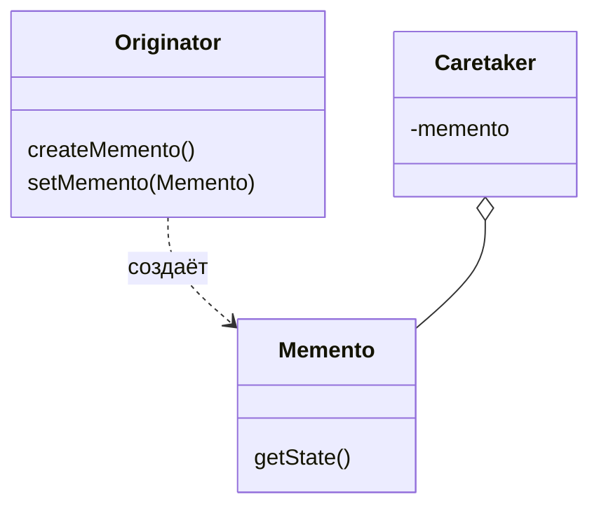

# Хранитель (Memento)

**Memento** захватывает и восстанавливает внутреннее состояние объекта без нарушения инкапсуляции. Позволяет сохранять и восстанавливать состояние объекта в любое время.

## Полезные ссылки

### Официальная документация
- [Java Serializable](https://docs.oracle.com/en/java/javase/17/docs/api/java.base/java/io/Serializable.html)
- [Java Cloneable](https://docs.oracle.com/en/java/javase/17/docs/api/java.base/java/lang/Cloneable.html)

### См. также
- [[java-collections-list|Java Collections]] — **Java Collections**
- [[command|Command]] — **Command Pattern**
- [[state|State]] — **State Pattern**

- [[iterator|Итератор (Iterator)]]
- [[visitor|Посетитель (Visitor)]]
## Содержание

- [Суть и запомнить](#суть-и-запомнить)
- [Что такое Memento?](#что-такое-memento)
  - [Основные характеристики](#основные-характеристики)
  - [Проблемы, которые решает](#проблемы-которые-решает)
- [Когда использовать Memento?](#когда-использовать-memento)
  - [Подходящие сценарии](#подходящие-сценарии)
  - [Признаки необходимости](#признаки-необходимости)
- [Структура паттерна](#структура-паттерна)
  - [Компоненты](#компоненты)
- [Реализация на Java](#реализация-на-java)
  - [Классический Memento](#классический-memento)
  - [Memento с Command паттерном](#memento-с-command-паттерном)
  - [Memento с сериализацией](#memento-с-сериализацией)
- [Продвинутые реализации](#продвинутые-реализации)
  - [1. Memento с ограниченной историей](#1-memento-с-ограниченной-историей)
  - [2. Memento с разными уровнями детализации](#2-memento-с-разными-уровнями-детализации)
- [Примеры использования](#примеры-использования)
  - [1. Text Editor с Undo/Redo](#1-text-editor-с-undoredo)
  - [2. Game Save System](#2-game-save-system)
  - [3. Database Transaction Rollback](#3-database-transaction-rollback)
- [Лучшие практики](#лучшие-практики)
  - [1. SOLID Principles](#1-solid-principles)
  - [2. Testing Memento Pattern](#2-testing-memento-pattern)
- [Решение проблем](#решение-проблем)
- [Частые вопросы](#частые-вопросы)
- [Заключение](#заключение)

## Суть и запомнить

**Суть в одном предложении:** Сохраняем снимок состояния объекта в Memento; Caretaker хранит снимки; Originator создаёт и восстанавливается из Memento без нарушения инкапсуляции.

**Запомнить:**
- Originator создаёт Memento с копией нужных полей и восстанавливается из него.
- Caretaker не имеет доступа к полям Memento — только хранит.
- Классика для Undo/Redo, сохранений в играх, отката транзакций.

**Когда применять:** undo/redo, сохранение/загрузка состояния, откат конфигурации.

## Что такое Memento?

**Memento** — это поведенческий паттерн проектирования, который позволяет сохранять и восстанавливать предыдущее состояние объекта без нарушения принципа инкапсуляции. Паттерн позволяет реализовать функциональность отмены операций(undo).

### Основные характеристики

1. **Сохранение состояния**: Захват внутреннего состояния объекта
2. **Восстановление**: Возможность вернуть объект к предыдущему состоянию
3. **Инкапсуляция**: Внешний код не имеет доступа к внутреннему состоянию
4. **Безопасность**: **Memento** защищает от случайного изменения состояния
5. **История состояний**: Поддержка множественных точек сохранения

### Проблемы, которые решает

Пример: сохранение и восстановление состояния редактора без нарушения инкапсуляции(Memento).

```java
// Плохо: Нарушение инкапсуляции для сохранения состояния
public class TextEditor {

    private String text = "";
    private int cursorPosition = 0;

    // Плохо: Геттеры раскрывают внутреннее состояние
    public String getText() { return text; }
    public int getCursorPosition() { return cursorPosition; }

    // Плохо: Сеттеры позволяют внешнему коду изменять состояние
    public void setText(String text) { this.text = text; }
    public void setCursorPosition(int cursorPosition) { this.cursorPosition = cursorPosition; }

    public void appendText(String newText) {
        text += newText;
        cursorPosition += newText.length();
    }

    public void deleteLastCharacter() {
        if (!text.isEmpty()) {
            text = text.substring(0, text.length() - 1);
            cursorPosition = Math.max(0, cursorPosition - 1);
        }
    }
}

// Клиент нарушает инкапсуляцию
class TextEditorClient {
    private TextEditor editor = new TextEditor();

    public void saveState() {
        // Плохо: Прямой доступ к внутреннему состоянию
        String savedText = editor.getText();
        int savedCursor = editor.getCursorPosition();
        // Сохранить где-то...
    }

    public void restoreState() {
        // Плохо: Прямое изменение внутреннего состояния
        editor.setText(savedText);
        editor.setCursorPosition(savedCursor);
    }
}

// Хорошо: Memento паттерн
public class TextEditor {
    private String text = "";
    private int cursorPosition = 0;

    // Создание memento
    public TextEditorMemento save() {
        return new TextEditorMemento(text, cursorPosition);
    }

    // Восстановление из memento
    public void restore(TextEditorMemento memento) {
        this.text = memento.getText();
        this.cursorPosition = memento.getCursorPosition();
    }

    public void appendText(String newText) {
        text += newText;
        cursorPosition += newText.length();
    }

    public void deleteLastCharacter() {
        if (!text.isEmpty()) {
            text = text.substring(0, text.length() - 1);
            cursorPosition = Math.max(0, cursorPosition - 1);
        }
    }

    public String getCurrentText() { return text; }
    public int getCurrentCursorPosition() { return cursorPosition; }
}

// Memento класс
public class TextEditorMemento {
    private final String text;
    private final int cursorPosition;

    // Пакетная видимость - только TextEditor может создавать экземпляры
    TextEditorMemento(String text, int cursorPosition) {
        this.text = text;
        this.cursorPosition = cursorPosition;
    }

    // Только TextEditor может получить состояние
    String getText() { return text; }
    int getCursorPosition() { return cursorPosition; }
}

// Caretaker управляет memento
public class TextEditorCaretaker {
    private final List<TextEditorMemento> history = new ArrayList<>();
    private final TextEditor editor;

    public TextEditorCaretaker(TextEditor editor) {
        this.editor = editor;
    }

    public void save() {
        history.add(editor.save());
    }

    public void undo() {
        if (!history.isEmpty()) {
            TextEditorMemento memento = history.remove(history.size() - 1);
            editor.restore(memento);
        }
    }

    public void showHistory() {
        System.out.println("History has " + history.size() + " saved states");
    }
}
```

## Когда использовать Memento?

### Подходящие сценарии

- **Undo/Redo**: Отмена и повтор операций
- **Снапшоты**: Сохранение состояния системы в определенные моменты
- **Транзакции**: Откат изменений при ошибке
- **Кэширование**: Сохранение промежуточных результатов
- **Игровые сохранения**: Сохранение прогресса игры

### Признаки необходимости

```java
// Признаки: Необходимость отката изменений
public class ComplexObject {

    // Сложное состояние
    private Map<String, Object> properties = new HashMap<>();
    private List<String> history = new ArrayList<>();
    private Set<String> flags = new HashSet<>();

    public void performComplexOperation() {
        // Долгая операция, которая может завершиться неудачей
        saveState(); // Сохранить состояние перед началом

        try {
            // Выполнить сложные изменения
            properties.put("status", "processing");
            history.add("operation started");

            // Имитация потенциальной ошибки
            if (Math.random() < 0.3) { // 30% шанс ошибки
                throw new RuntimeException("Operation failed");
            }

            properties.put("status", "completed");
            history.add("operation completed");

        } catch (Exception e) {
            restoreState(); // Откатить изменения
            throw e;
        }
    }

    // Плохо: Сложная логика сохранения/восстановления
    private Map<String, Object> savedProperties;
    private List<String> savedHistory;
    private Set<String> savedFlags;

    private void saveState() {
        savedProperties = new HashMap<>(properties);
        savedHistory = new ArrayList<>(history);
        savedFlags = new HashSet<>(flags);
    }

    private void restoreState() {
        properties = savedProperties;
        history = savedHistory;
        flags = savedFlags;
    }
}

// Хорошо: Memento паттерн
public class ComplexObjectMemento {
    private final Map<String, Object> properties;
    private final List<String> history;
    private final Set<String> flags;

    public ComplexObjectMemento(Map<String, Object> properties,
                               List<String> history,
                               Set<String> flags) {
        // Глубокое копирование
        this.properties = new HashMap<>(properties);
        this.history = new ArrayList<>(history);
        this.flags = new HashSet<>(flags);
    }

    // Геттеры для восстановления
    public Map<String, Object> getProperties() { return new HashMap<>(properties); }
    public List<String> getHistory() { return new ArrayList<>(history); }
    public Set<String> getFlags() { return new HashSet<>(flags); }
}
```

## Структура паттерна



### Компоненты

1. **Originator**: Объект, состояние которого нужно сохранять
2. **Memento**: Объект, хранящий состояние **originator**
3. **Caretaker**: Управляет **memento**, но не изменяет их
4. **Client**: Использует **caretaker** для сохранения/восстановления состояния

## Реализация на Java

### Классический Memento

```java
// Memento
public class TextEditorMemento {
    private final String text;
    private final int cursorPosition;
    private final LocalDateTime timestamp;

    // Package-private constructor - только TextEditor может создавать
    TextEditorMemento(String text, int cursorPosition) {
        this.text = text;
        this.cursorPosition = cursorPosition;
        this.timestamp = LocalDateTime.now();
    }

    // Package-private getters - только TextEditor может читать
    String getText() { return text; }
    int getCursorPosition() { return cursorPosition; }
    LocalDateTime getTimestamp() { return timestamp; }

    @Override
    public String toString() {
        return String.format("Memento at %s: cursor at %d, text length %d",
                           timestamp, cursorPosition, text.length());
    }
}

// Originator
public class TextEditor {
    private StringBuilder text = new StringBuilder();
    private int cursorPosition = 0;

    public void insertText(String newText) {
        text.insert(cursorPosition, newText);
        cursorPosition += newText.length();
    }

    public void deleteText(int length) {
        if (cursorPosition >= length) {
            text.delete(cursorPosition - length, cursorPosition);
            cursorPosition -= length;
        }
    }

    public void moveCursor(int position) {
        if (position >= 0 && position <= text.length()) {
            cursorPosition = position;
        }
    }

    // Создание memento
    public TextEditorMemento save() {
        return new TextEditorMemento(text.toString(), cursorPosition);
    }

    // Восстановление из memento
    public void restore(TextEditorMemento memento) {
        this.text = new StringBuilder(memento.getText());
        this.cursorPosition = memento.getCursorPosition();
    }

    public String getText() { return text.toString(); }
    public int getCursorPosition() { return cursorPosition; }
    public int getTextLength() { return text.length(); }
}

// Caretaker
public class TextEditorHistory {
    private final List<TextEditorMemento> history = new ArrayList<>();
    private final TextEditor editor;

    public TextEditorHistory(TextEditor editor) {
        this.editor = editor;
    }

    public void save() {
        history.add(editor.save());
        System.out.println("State saved. History size: " + history.size());
    }

    public void undo() {
        if (!history.isEmpty()) {
            TextEditorMemento memento = history.remove(history.size() - 1);
            editor.restore(memento);
            System.out.println("Undid to: " + memento);
        } else {
            System.out.println("No more states to undo");
        }
    }

    public void showHistory() {
        System.out.println("Edit history:");
        for (int i = 0; i < history.size(); i++) {
            System.out.println((i + 1) + ": " + history.get(i));
        }
    }

    public int getHistorySize() {
        return history.size();
    }
}

public class MementoDemo {
    public static void main(String[] args) {
        TextEditor editor = new TextEditor();
        TextEditorHistory history = new TextEditorHistory(editor);

        // Начальное состояние
        System.out.println("Initial state: '" + editor.getText() + "' at position " + editor.getCursorPosition());

        // Первое изменение
        editor.insertText("Hello");
        history.save();
        System.out.println("After insert 'Hello': '" + editor.getText() + "' at position " + editor.getCursorPosition());

        // Второе изменение
        editor.insertText(" World");
        history.save();
        System.out.println("After insert ' World': '" + editor.getText() + "' at position " + editor.getCursorPosition());

        // Третье изменение
        editor.moveCursor(5);
        editor.insertText(" Beautiful");
        history.save();
        System.out.println("After insert ' Beautiful': '" + editor.getText() + "' at position " + editor.getCursorPosition());

        // Показать историю
        System.out.println("\n" + history.showHistory());

        // Undo
        System.out.println("\n=== Performing undo ===");
        history.undo();
        System.out.println("After undo: '" + editor.getText() + "' at position " + editor.getCursorPosition());

        // Еще один undo
        history.undo();
        System.out.println("After second undo: '" + editor.getText() + "' at position " + editor.getCursorPosition());
    }
}
```

### Memento с Command паттерном

```java
// Memento для Command паттерна
interface Command {
    void execute();
    void undo();
    String getDescription();
}

public class CommandMemento {
    private final Command command;
    private final Object originatorState;

    public CommandMemento(Command command, Object originatorState) {
        this.command = command;
        this.originatorState = originatorState;
    }

    public Command getCommand() { return command; }
    public Object getOriginatorState() { return originatorState; }
}

// Originator с undo/redo
public class Document {
    private String content = "";
    private final List<CommandMemento> undoHistory = new ArrayList<>();
    private final List<CommandMemento> redoHistory = new ArrayList<>();

    public void executeCommand(Command command) {
        // Сохранить состояние перед выполнением
        CommandMemento memento = new CommandMemento(command, saveState());
        undoHistory.add(memento);

        // Выполнить команду
        command.execute();

        // Очистить redo историю при новом действии
        redoHistory.clear();
    }

    public void undo() {
        if (!undoHistory.isEmpty()) {
            CommandMemento memento = undoHistory.remove(undoHistory.size() - 1);
            redoHistory.add(memento);

            // Восстановить состояние
            restoreState(memento.getOriginatorState());
            System.out.println("Undid: " + memento.getCommand().getDescription());
        }
    }

    public void redo() {
        if (!redoHistory.isEmpty()) {
            CommandMemento memento = redoHistory.remove(redoHistory.size() - 1);
            undoHistory.add(memento);

            // Повторно выполнить команду
            memento.getCommand().execute();
            System.out.println("Redid: " + memento.getCommand().getDescription());
        }
    }

    private Object saveState() {
        return content; // В реальности может быть сложнее
    }

    private void restoreState(Object state) {
        this.content = (String) state;
    }

    // Методы для работы с контентом
    public void insertText(int position, String text) {
        content = content.substring(0, position) + text + content.substring(position);
    }

    public void deleteText(int start, int end) {
        content = content.substring(0, start) + content.substring(end);
    }

    public String getContent() { return content; }
    public int getLength() { return content.length(); }
}

// Concrete Commands
class InsertTextCommand implements Command {
    private final Document document;
    private final int position;
    private final String text;

    public InsertTextCommand(Document document, int position, String text) {
        this.document = document;
        this.position = position;
        this.text = text;
    }

    @Override
    public void execute() {
        document.insertText(position, text);
    }

    @Override
    public void undo() {
        document.deleteText(position, position + text.length());
    }

    @Override
    public String getDescription() {
        return "Insert '" + text + "' at position " + position;
    }
}

class DeleteTextCommand implements Command {
    private final Document document;
    private final int start;
    private final int end;
    private String deletedText;

    public DeleteTextCommand(Document document, int start, int end) {
        this.document = document;
        this.start = start;
        this.end = end;
        this.deletedText = document.getContent().substring(start, end);
    }

    @Override
    public void execute() {
        deletedText = document.getContent().substring(start, end);
        document.deleteText(start, end);
    }

    @Override
    public void undo() {
        document.insertText(start, deletedText);
    }

    @Override
    public String getDescription() {
        return "Delete text from " + start + " to " + end;
    }
}

public class CommandMementoDemo {
    public static void main(String[] args) {
        Document document = new Document();

        // Выполнить команды
        document.executeCommand(new InsertTextCommand(document, 0, "Hello"));
        System.out.println("Content: '" + document.getContent() + "'");

        document.executeCommand(new InsertTextCommand(document, 5, " World"));
        System.out.println("Content: '" + document.getContent() + "'");

        document.executeCommand(new InsertTextCommand(document, 11, "!"));
        System.out.println("Content: '" + document.getContent() + "'");

        // Undo
        System.out.println("\n=== Performing undo ===");
        document.undo();
        System.out.println("Content: '" + document.getContent() + "'");

        document.undo();
        System.out.println("Content: '" + document.getContent() + "'");

        // Redo
        System.out.println("\n=== Performing redo ===");
        document.redo();
        System.out.println("Content: '" + document.getContent() + "'");

        // Новое действие после undo (очищает redo историю)
        document.executeCommand(new InsertTextCommand(document, 5, " Beautiful"));
        System.out.println("Content: '" + document.getContent() + "'");

        // Попытка redo после нового действия
        document.redo(); // Не должно ничего сделать
        System.out.println("Content after failed redo: '" + document.getContent() + "'");
    }
}
```

### Memento с сериализацией

```java
// Memento с сериализацией
public class SerializableMemento implements Serializable {
    private static final long serialVersionUID = 1L;

    private final byte[] serializedState;
    private final LocalDateTime timestamp;
    private final String description;

    public SerializableMemento(Object state, String description) throws IOException {
        this.timestamp = LocalDateTime.now();
        this.description = description;

        // Сериализовать состояние
        try (ByteArrayOutputStream baos = new ByteArrayOutputStream();
             ObjectOutputStream oos = new ObjectOutputStream(baos)) {
            oos.writeObject(state);
            this.serializedState = baos.toByteArray();
        }
    }

    public Object getState() throws IOException, ClassNotFoundException {
        // Десериализовать состояние
        try (ByteArrayInputStream bais = new ByteArrayInputStream(serializedState);
             ObjectInputStream ois = new ObjectInputStream(bais)) {
            return ois.readObject();
        }
    }

    public LocalDateTime getTimestamp() { return timestamp; }
    public String getDescription() { return description; }

    @Override
    public String toString() {
        return String.format("Memento[%s]: %s", timestamp, description);
    }
}

// Originator с сериализацией
public class GameCharacter implements Serializable {
    private static final long serialVersionUID = 1L;

    private String name;
    private int level;
    private int health;
    private int mana;
    private Map<String, Integer> inventory;

    public GameCharacter(String name) {
        this.name = name;
        this.level = 1;
        this.health = 100;
        this.mana = 50;
        this.inventory = new HashMap<>();
        inventory.put("sword", 1);
        inventory.put("potion", 5);
    }

    public SerializableMemento save() throws IOException {
        return new SerializableMemento(this, "Level " + level + ", Health " + health);
    }

    public void restore(SerializableMemento memento) throws IOException, ClassNotFoundException {
        GameCharacter restored = (GameCharacter) memento.getState();
        this.name = restored.name;
        this.level = restored.level;
        this.health = restored.health;
        this.mana = restored.mana;
        this.inventory = new HashMap<>(restored.inventory);
    }

    // Геймплей методы
    public void levelUp() {
        level++;
        health += 20;
        mana += 10;
        System.out.println(name + " leveled up to " + level);
    }

    public void takeDamage(int damage) {
        health -= damage;
        if (health <= 0) {
            health = 0;
            System.out.println(name + " is defeated!");
        } else {
            System.out.println(name + " took " + damage + " damage, health: " + health);
        }
    }

    public void usePotion() {
        Integer potions = inventory.get("potion");
        if (potions != null && potions > 0) {
            inventory.put("potion", potions - 1);
            health += 30;
            System.out.println(name + " used potion, health: " + health + ", potions left: " + (potions - 1));
        } else {
            System.out.println("No potions left!");
        }
    }

    // Геттеры
    public String getName() { return name; }
    public int getLevel() { return level; }
    public int getHealth() { return health; }
    public int getMana() { return mana; }
    public Map<String, Integer> getInventory() { return new HashMap<>(inventory); }

    @Override
    public String toString() {
        return String.format("%s (Lv.%d) - HP:%d, MP:%d, Items:%s",
                           name, level, health, mana, inventory);
    }
}

// Caretaker для сохранения игры
public class GameSaveManager {
    private final Map<String, SerializableMemento> saves = new HashMap<>();
    private final GameCharacter character;

    public GameSaveManager(GameCharacter character) {
        this.character = character;
    }

    public void saveGame(String saveName) throws IOException {
        SerializableMemento memento = character.save();
        saves.put(saveName, memento);
        System.out.println("Game saved: " + saveName);
    }

    public void loadGame(String saveName) throws IOException, ClassNotFoundException {
        SerializableMemento memento = saves.get(saveName);
        if (memento != null) {
            character.restore(memento);
            System.out.println("Game loaded: " + saveName);
        } else {
            System.out.println("Save not found: " + saveName);
        }
    }

    public void listSaves() {
        System.out.println("Available saves:");
        saves.forEach((name, memento) ->
            System.out.println("- " + name + ": " + memento));
    }

    public Set<String> getSaveNames() {
        return new HashSet<>(saves.keySet());
    }
}

public class SerializableMementoDemo {
    public static void main(String[] args) throws IOException, ClassNotFoundException {
        GameCharacter character = new GameCharacter("Hero");
        GameSaveManager saveManager = new GameSaveManager(character);

        System.out.println("Initial state: " + character);

        // Играем
        character.levelUp();
        character.takeDamage(30);
        System.out.println("After battle: " + character);

        // Сохраняем игру
        saveManager.saveGame("checkpoint1");

        // Продолжаем игру
        character.usePotion();
        character.levelUp();
        character.takeDamage(50);
        System.out.println("After more gameplay: " + character);

        // Сохраняем еще одну точку
        saveManager.saveGame("checkpoint2");

        // Показать сохранения
        saveManager.listSaves();

        // Загружаем первое сохранение
        System.out.println("\n=== Loading checkpoint1 ===");
        saveManager.loadGame("checkpoint1");
        System.out.println("Loaded state: " + character);

        // Продолжаем с этого места
        character.usePotion();
        System.out.println("After using potion from loaded save: " + character);
    }
}
```

## Продвинутые реализации

### 1. Memento с ограниченной историей

```java
// Memento с ограниченной историей и компрессией
public class BoundedHistoryCaretaker<T extends Originator<T>> {
    private final CircularBuffer<Memento<T>> history;
    private final T originator;

    public BoundedHistoryCaretaker(T originator, int maxHistorySize) {
        this.originator = originator;
        this.history = new CircularBuffer<>(maxHistorySize);
    }

    public void save() {
        Memento<T> memento = originator.createMemento();
        history.add(memento);
        System.out.println("State saved. History size: " + history.size());
    }

    public void undo() {
        if (!history.isEmpty()) {
            Memento<T> memento = history.removeLast();
            originator.restoreFromMemento(memento);
            System.out.println("Undid to previous state");
        } else {
            System.out.println("No more states to undo");
        }
    }

    public void redo() {
        throw new UnsupportedOperationException("Redo not supported in bounded history");
    }

    public int getHistorySize() {
        return history.size();
    }

    public void clearHistory() {
        history.clear();
    }

    // Круговой буфер для ограниченной истории
    private static class CircularBuffer<T> {
        private final T[] buffer;
        private int head = 0;
        private int size = 0;

        @SuppressWarnings("unchecked")
        public CircularBuffer(int capacity) {
            buffer = (T[]) new Object[capacity];
        }

        public void add(T item) {
            buffer[head] = item;
            head = (head + 1) % buffer.length;
            if (size < buffer.length) {
                size++;
            }
        }

        public T removeLast() {
            if (size == 0) return null;

            head = (head - 1 + buffer.length) % buffer.length;
            T item = buffer[head];
            buffer[head] = null;
            size--;
            return item;
        }

        public int size() { return size; }

        public void clear() {
            Arrays.fill(buffer, null);
            head = 0;
            size = 0;
        }
    }
}

// Originator интерфейс
interface Originator<T extends Originator<T>> {
    Memento<T> createMemento();
    void restoreFromMemento(Memento<T> memento);
}

// Memento интерфейс
interface Memento<T extends Originator<T>> {
    LocalDateTime getTimestamp();
    String getDescription();
}

// Реализация для банковского счета
class BankAccount implements Originator<BankAccount> {
    private BigDecimal balance;
    private String accountId;
    private List<String> transactions = new ArrayList<>();

    public BankAccount(String accountId, BigDecimal initialBalance) {
        this.accountId = accountId;
        this.balance = initialBalance;
    }

    public void deposit(BigDecimal amount) {
        balance = balance.add(amount);
        transactions.add("Deposit: " + amount);
    }

    public void withdraw(BigDecimal amount) {
        if (balance.compareTo(amount) >= 0) {
            balance = balance.subtract(amount);
            transactions.add("Withdraw: " + amount);
        } else {
            throw new IllegalArgumentException("Insufficient funds");
        }
    }

    @Override
    public Memento<BankAccount> createMemento() {
        return new BankAccountMemento(balance, new ArrayList<>(transactions));
    }

    @Override
    public void restoreFromMemento(Memento<BankAccount> memento) {
        if (memento instanceof BankAccountMemento) {
            BankAccountMemento accountMemento = (BankAccountMemento) memento;
            this.balance = accountMemento.getBalance();
            this.transactions = new ArrayList<>(accountMemento.getTransactions());
        }
    }

    public BigDecimal getBalance() { return balance; }
    public String getAccountId() { return accountId; }
    public List<String> getTransactions() { return new ArrayList<>(transactions); }

    @Override
    public String toString() {
        return String.format("Account %s: $%s (%d transactions)",
                           accountId, balance, transactions.size());
    }
}

class BankAccountMemento implements Memento<BankAccount> {
    private final BigDecimal balance;
    private final List<String> transactions;
    private final LocalDateTime timestamp;

    public BankAccountMemento(BigDecimal balance, List<String> transactions) {
        this.balance = balance;
        this.transactions = new ArrayList<>(transactions);
        this.timestamp = LocalDateTime.now();
    }

    public BigDecimal getBalance() { return balance; }
    public List<String> getTransactions() { return new ArrayList<>(transactions); }

    @Override
    public LocalDateTime getTimestamp() { return timestamp; }

    @Override
    public String getDescription() {
        return String.format("Balance: $%s, Transactions: %d", balance, transactions.size());
    }
}

public class BoundedHistoryDemo {
    public static void main(String[] args) {
        BankAccount account = new BankAccount("ACC001", BigDecimal.valueOf(1000.00));
        BoundedHistoryCaretaker<BankAccount> history = new BoundedHistoryCaretaker<>(account, 3);

        System.out.println("Initial: " + account);

        // Выполняем операции с сохранением
        account.deposit(BigDecimal.valueOf(500));
        history.save();
        System.out.println("After deposit 500: " + account);

        account.withdraw(BigDecimal.valueOf(200));
        history.save();
        System.out.println("After withdraw 200: " + account);

        account.deposit(BigDecimal.valueOf(300));
        history.save();
        System.out.println("After deposit 300: " + account);

        account.withdraw(BigDecimal.valueOf(100));
        history.save(); // Это перезапишет самое старое сохранение
        System.out.println("After withdraw 100: " + account);

        System.out.println("History size: " + history.getHistorySize());

        // Undo операции
        System.out.println("\n=== Performing undo operations ===");
        for (int i = 0; i < 3; i++) {
            history.undo();
            System.out.println("After undo " + (i + 1) + ": " + account);
        }

        // Попытка undo за пределами истории
        history.undo(); // Не должно ничего сделать
        System.out.println("After failed undo: " + account);
    }
}
```

### 2. Memento с разными уровнями детализации

```java
// Memento с разными уровнями детализации
public abstract class AbstractMemento {
    private final LocalDateTime timestamp;
    private final String description;

    protected AbstractMemento(String description) {
        this.timestamp = LocalDateTime.now();
        this.description = description;
    }

    public LocalDateTime getTimestamp() { return timestamp; }
    public String getDescription() { return description; }

    // Фабричный метод для создания memento нужного уровня
    public static AbstractMemento create(MementoLevel level, Object originator, String description) {
        switch (level) {
            case FULL:
                return new FullMemento(originator, description);
            case INCREMENTAL:
                return new IncrementalMemento(originator, description);
            case METADATA_ONLY:
                return new MetadataMemento(originator, description);
            default:
                throw new IllegalArgumentException("Unknown memento level: " + level);
        }
    }
}

enum MementoLevel {
    METADATA_ONLY,    // Только метаданные
    INCREMENTAL,      // Инкрементальные изменения
    FULL             // Полное состояние
}

// Полное сохранение состояния
class FullMemento extends AbstractMemento {
    private final byte[] serializedState;

    public FullMemento(Object originator, String description) {
        super(description);
        try (ByteArrayOutputStream baos = new ByteArrayOutputStream();
             ObjectOutputStream oos = new ObjectOutputStream(baos)) {
            oos.writeObject(originator);
            this.serializedState = baos.toByteArray();
        } catch (IOException e) {
            throw new RuntimeException("Failed to serialize state", e);
        }
    }

    public Object getState() throws IOException, ClassNotFoundException {
        try (ByteArrayInputStream bais = new ByteArrayInputStream(serializedState);
             ObjectInputStream ois = new ObjectInputStream(bais)) {
            return ois.readObject();
        }
    }

    public long getSize() { return serializedState.length; }
}

// Инкрементальное сохранение (только изменения)
class IncrementalMemento extends AbstractMemento {
    private final Map<String, Object> changes;
    private final AbstractMemento baseMemento;

    public IncrementalMemento(Object originator, String description) {
        super(description);
        // В реальности нужно сравнивать с предыдущим состоянием
        this.changes = new HashMap<>();
        this.baseMemento = null; // Ссылка на базовое состояние
    }

    public Map<String, Object> getChanges() { return new HashMap<>(changes); }
}

// Только метаданные (для быстрого доступа)
class MetadataMemento extends AbstractMemento {
    private final Map<String, Object> metadata;

    public MetadataMemento(Object originator, String description) {
        super(description);
        this.metadata = extractMetadata(originator);
    }

    private Map<String, Object> extractMetadata(Object originator) {
        Map<String, Object> metadata = new HashMap<>();
        // Извлечение метаданных без полного состояния
        metadata.put("class", originator.getClass().getSimpleName());
        metadata.put("hashCode", originator.hashCode());
        return metadata;
    }

    public Map<String, Object> getMetadata() { return new HashMap<>(metadata); }
}

// Умный caretaker с выбором уровня детализации
public class SmartCaretaker<T> {
    private final List<AbstractMemento> history = new ArrayList<>();
    private final T originator;
    private final MementoStrategy strategy;

    public SmartCaretaker(T originator, MementoStrategy strategy) {
        this.originator = originator;
        this.strategy = strategy;
    }

    public void save(String description) {
        MementoLevel level = strategy.determineLevel(history.size(), description);
        AbstractMemento memento = AbstractMemento.create(level, originator, description);
        history.add(memento);

        System.out.println("Saved " + level + " memento: " + description);
    }

    @SuppressWarnings("unchecked")
    public void restore(int index) {
        if (index >= 0 && index < history.size()) {
            AbstractMemento memento = history.get(index);

            if (memento instanceof FullMemento) {
                try {
                    FullMemento fullMemento = (FullMemento) memento;
                    T restoredState = (T) fullMemento.getState();
                    // Восстановить состояние в originator
                    System.out.println("Restored from full memento");
                } catch (Exception e) {
                    System.err.println("Failed to restore: " + e.getMessage());
                }
            } else {
                System.out.println("Cannot restore from " + memento.getClass().getSimpleName());
            }
        }
    }

    public List<AbstractMemento> getHistory() {
        return new ArrayList<>(history);
    }

    // Стратегия выбора уровня memento
    public interface MementoStrategy {
        MementoLevel determineLevel(int historySize, String description);
    }

    // Простая стратегия: первые сохранения полные, остальные инкрементальные
    public static class SimpleMementoStrategy implements MementoStrategy {
        private final int fullSaveFrequency;

        public SimpleMementoStrategy(int fullSaveFrequency) {
            this.fullSaveFrequency = fullSaveFrequency;
        }

        @Override
        public MementoLevel determineLevel(int historySize, String description) {
            if (historySize % fullSaveFrequency == 0) {
                return MementoLevel.FULL;
            } else if (description.contains("minor")) {
                return MementoLevel.METADATA_ONLY;
            } else {
                return MementoLevel.INCREMENTAL;
            }
        }
    }
}

// Пример использования
class DocumentWithSmartHistory {
    private StringBuilder content = new StringBuilder();
    private final SmartCaretaker<DocumentWithSmartHistory> caretaker;

    public DocumentWithSmartHistory() {
        MementoStrategy strategy = new SmartCaretaker.SimpleMementoStrategy(5);
        this.caretaker = new SmartCaretaker<>(this, strategy);
    }

    public void appendText(String text) {
        content.append(text);
        caretaker.save("Appended: " + text);
    }

    public void deleteText(int length) {
        if (length <= content.length()) {
            String deleted = content.substring(content.length() - length);
            content.setLength(content.length() - length);
            caretaker.save("Deleted: " + deleted);
        }
    }

    public void minorEdit() {
        // Незначительное изменение
        caretaker.save("minor edit");
    }

    public String getContent() { return content.toString(); }

    public void showHistory() {
        List<AbstractMemento> history = caretaker.getHistory();
        System.out.println("Document history (" + history.size() + " entries):");
        for (int i = 0; i < history.size(); i++) {
            AbstractMemento memento = history.get(i);
            System.out.println((i + 1) + ": " + memento.getDescription() +
                             " (" + memento.getClass().getSimpleName() + ")");
        }
    }
}

public class SmartMementoDemo {
    public static void main(String[] args) {
        DocumentWithSmartHistory document = new DocumentWithSmartHistory();

        // Выполняем различные операции
        document.appendText("Hello");
        document.appendText(" World");
        document.minorEdit();
        document.appendText("!");
        document.deleteText(1);
        document.appendText("?");

        // Показываем историю сохранений
        document.showHistory();

        System.out.println("Final content: '" + document.getContent() + "'");
    }
}
```

## Примеры использования

### 1. Text Editor с Undo/Redo

```java
// Полноценный текстовый редактор с undo/redo
public class AdvancedTextEditor {
    private StringBuilder content = new StringBuilder();
    private int cursorPosition = 0;
    private final Deque<TextEditorMemento> undoStack = new ArrayDeque<>();
    private final Deque<TextEditorMemento> redoStack = new ArrayDeque<>();

    public void insertText(String text) {
        saveState();
        content.insert(cursorPosition, text);
        cursorPosition += text.length();
    }

    public void deleteText(int length) {
        if (cursorPosition >= length) {
            saveState();
            content.delete(cursorPosition - length, cursorPosition);
            cursorPosition -= length;
        }
    }

    public void moveCursor(int position) {
        if (position >= 0 && position <= content.length()) {
            cursorPosition = position;
        }
    }

    public void selectText(int start, int end) {
        // Упрощенная реализация выбора
        if (start >= 0 && end <= content.length() && start <= end) {
            cursorPosition = end; // Переместить курсор в конец выделения
        }
    }

    public void replaceText(String oldText, String newText) {
        saveState();
        int startIndex = content.indexOf(oldText);
        if (startIndex != -1) {
            content.replace(startIndex, startIndex + oldText.length(), newText);
            cursorPosition = startIndex + newText.length();
        }
    }

    public void undo() {
        if (!undoStack.isEmpty()) {
            TextEditorMemento currentState = createMemento();
            redoStack.push(currentState);

            TextEditorMemento previousState = undoStack.pop();
            restoreFromMemento(previousState);
        }
    }

    public void redo() {
        if (!redoStack.isEmpty()) {
            TextEditorMemento currentState = createMemento();
            undoStack.push(currentState);

            TextEditorMemento nextState = redoStack.pop();
            restoreFromMemento(nextState);
        }
    }

    private void saveState() {
        undoStack.push(createMemento());
        redoStack.clear(); // Очистить redo при новом действии
    }

    private TextEditorMemento createMemento() {
        return new TextEditorMemento(content.toString(), cursorPosition);
    }

    private void restoreFromMemento(TextEditorMemento memento) {
        this.content = new StringBuilder(memento.getText());
        this.cursorPosition = memento.getCursorPosition();
    }

    public String getContent() { return content.toString(); }
    public int getCursorPosition() { return cursorPosition; }
    public int getUndoStackSize() { return undoStack.size(); }
    public int getRedoStackSize() { return redoStack.size(); }

    public void printState() {
        System.out.println("Content: '" + getContent() + "'");
        System.out.println("Cursor at: " + getCursorPosition());
        System.out.println("Undo stack: " + getUndoStackSize());
        System.out.println("Redo stack: " + getRedoStackSize());
    }
}

class TextEditorMemento {
    private final String text;
    private final int cursorPosition;
    private final LocalDateTime timestamp;

    public TextEditorMemento(String text, int cursorPosition) {
        this.text = text;
        this.cursorPosition = cursorPosition;
        this.timestamp = LocalDateTime.now();
    }

    public String getText() { return text; }
    public int getCursorPosition() { return cursorPosition; }
    public LocalDateTime getTimestamp() { return timestamp; }

    @Override
    public String toString() {
        return String.format("Memento[%s]: cursor=%d, length=%d",
                           timestamp, cursorPosition, text.length());
    }
}

public class AdvancedTextEditorDemo {
    public static void main(String[] args) {
        AdvancedTextEditor editor = new AdvancedTextEditor();

        System.out.println("=== Initial State ===");
        editor.printState();

        System.out.println("\n=== Inserting Text ===");
        editor.insertText("Hello");
        editor.printState();

        editor.insertText(" World");
        editor.printState();

        System.out.println("\n=== Moving Cursor and Inserting ===");
        editor.moveCursor(5);
        editor.insertText(" Beautiful");
        editor.printState();

        System.out.println("\n=== Replacing Text ===");
        editor.replaceText("World", "Universe");
        editor.printState();

        System.out.println("\n=== Undo Operations ===");
        editor.undo();
        editor.printState();

        editor.undo();
        editor.printState();

        System.out.println("\n=== Redo Operations ===");
        editor.redo();
        editor.printState();

        System.out.println("\n=== New Operation (clears redo) ===");
        editor.insertText("!");
        editor.printState();

        // Попытка redo после нового действия
        editor.redo(); // Не должно ничего сделать
        editor.printState();
    }
}
```

### 2. Game Save System

```java
// Система сохранений для игры
public class GameSaveSystem {

    // Game State
    public static class GameState implements Serializable {
        private static final long serialVersionUID = 1L;

        private String playerName;
        private int level;
        private long experience;
        private List<String> inventory;
        private Map<String, Object> questProgress;
        private LocalDateTime lastSaved;

        public GameState(String playerName) {
            this.playerName = playerName;
            this.level = 1;
            this.experience = 0;
            this.inventory = new ArrayList<>();
            this.questProgress = new HashMap<>();
        }

        // Геймплей методы
        public void gainExperience(long exp) {
            this.experience += exp;
            checkLevelUp();
        }

        private void checkLevelUp() {
            int newLevel = (int) (experience / 1000) + 1;
            if (newLevel > level) {
                level = newLevel;
                System.out.println(playerName + " leveled up to " + level + "!");
            }
        }

        public void addItem(String item) {
            inventory.add(item);
        }

        public void completeQuest(String questId) {
            questProgress.put(questId, "completed");
        }

        // Getters
        public String getPlayerName() { return playerName; }
        public int getLevel() { return level; }
        public long getExperience() { return experience; }
        public List<String> getInventory() { return new ArrayList<>(inventory); }
        public Map<String, Object> getQuestProgress() { return new HashMap<>(questProgress); }

        @Override
        public String toString() {
            return String.format("Player: %s (Lv.%d, %d XP), Items: %d, Quests: %d",
                               playerName, level, experience, inventory.size(), questProgress.size());
        }
    }

    // Memento для игрового состояния
    public static class GameSave implements Serializable {
        private static final long serialVersionUID = 1L;

        private final byte[] gameStateData;
        private final LocalDateTime saveTime;
        private final String saveName;
        private final String description;

        public GameSave(GameState gameState, String saveName, String description) throws IOException {
            this.saveTime = LocalDateTime.now();
            this.saveName = saveName;
            this.description = description;

            // Сериализовать состояние игры
            try (ByteArrayOutputStream baos = new ByteArrayOutputStream();
                 ObjectOutputStream oos = new ObjectOutputStream(baos)) {
                oos.writeObject(gameState);
                this.gameStateData = baos.toByteArray();
            }
        }

        public GameState loadGameState() throws IOException, ClassNotFoundException {
            try (ByteArrayInputStream bais = new ByteArrayInputStream(gameStateData);
                 ObjectInputStream ois = new ObjectInputStream(bais)) {
                return (GameState) ois.readObject();
            }
        }

        public LocalDateTime getSaveTime() { return saveTime; }
        public String getSaveName() { return saveName; }
        public String getDescription() { return description; }

        @Override
        public String toString() {
            return String.format("Save '%s': %s (%s)", saveName, description, saveTime);
        }
    }

    // Save Manager
    public static class GameSaveManager {
        private final Map<String, GameSave> saves = new HashMap<>();
        private final GameState gameState;

        public GameSaveManager(GameState gameState) {
            this.gameState = gameState;
        }

        public void createSave(String saveName, String description) throws IOException {
            GameSave save = new GameSave(gameState, saveName, description);
            saves.put(saveName, save);
            System.out.println("Game saved: " + save);
        }

        public void loadSave(String saveName) throws IOException, ClassNotFoundException {
            GameSave save = saves.get(saveName);
            if (save != null) {
                GameState loadedState = save.loadGameState();
                // Копируем состояние обратно в текущую игру
                copyGameState(loadedState, gameState);
                System.out.println("Game loaded: " + save);
            } else {
                System.out.println("Save not found: " + saveName);
            }
        }

        private void copyGameState(GameState source, GameState target) {
            // В реальном приложении лучше использовать reflection или билдер
            // Здесь упрощенная копия для демонстрации
            try {
                // Используем сериализацию для глубокого копирования
                GameSave tempSave = new GameSave(source, "temp", "temp");
                GameState copiedState = tempSave.loadGameState();

                // Копируем поля (в реальности лучше использовать reflection API)
                java.lang.reflect.Field[] fields = GameState.class.getDeclaredFields();
                for (java.lang.reflect.Field field : fields) {
                    field.setAccessible(true);
                    Object value = field.get(copiedState);
                    field.set(target, value);
                }
            } catch (Exception e) {
                System.err.println("Failed to copy game state: " + e.getMessage());
            }
        }

        public void listSaves() {
            System.out.println("Available saves:");
            saves.values().forEach(save -> System.out.println("- " + save));
        }

        public Set<String> getSaveNames() {
            return new HashSet<>(saves.keySet());
        }

        public void deleteSave(String saveName) {
            if (saves.remove(saveName) != null) {
                System.out.println("Save deleted: " + saveName);
            } else {
                System.out.println("Save not found: " + saveName);
            }
        }
    }

    public static void main(String[] args) throws IOException, ClassNotFoundException {
        // Создаем игру
        GameState gameState = new GameState("Hero");
        GameSaveManager saveManager = new GameSaveManager(gameState);

        System.out.println("=== Starting Game ===");
        System.out.println(gameState);

        // Играем
        gameState.gainExperience(500);
        gameState.addItem("sword");
        gameState.addItem("shield");
        gameState.completeQuest("tutorial");

        System.out.println("\n=== After Some Gameplay ===");
        System.out.println(gameState);

        // Сохраняем игру
        saveManager.createSave("checkpoint1", "After tutorial completion");

        // Продолжаем игру
        gameState.gainExperience(800);
        gameState.addItem("armor");
        gameState.completeQuest("first_battle");

        System.out.println("\n=== After More Gameplay ===");
        System.out.println(gameState);

        // Сохраняем еще одну точку
        saveManager.createSave("checkpoint2", "After first battle");

        // Показываем доступные сохранения
        System.out.println("\n=== Available Saves ===");
        saveManager.listSaves();

        // Загружаем первое сохранение
        System.out.println("\n=== Loading Checkpoint 1 ===");
        saveManager.loadSave("checkpoint1");
        System.out.println("Loaded state: " + gameState);

        // Продолжаем с этого места
        gameState.gainExperience(200);
        System.out.println("After gaining experience from loaded save: " + gameState);

        // Загружаем второе сохранение
        System.out.println("\n=== Loading Checkpoint 2 ===");
        saveManager.loadSave("checkpoint2");
        System.out.println("Loaded state: " + gameState);
    }
}
```

### 3. Database Transaction Rollback

```java
// Memento для транзакций базы данных
public class DatabaseTransactionManager {

    // Transaction Context
    public static class TransactionContext {
        private final Map<String, Object> originalValues = new HashMap<>();
        private final List<String> modifiedTables = new ArrayList<>();
        private boolean active = true;

        public void saveOriginalValue(String table, String id, Object value) {
            originalValues.put(table + "." + id, value);
        }

        public Object getOriginalValue(String table, String id) {
            return originalValues.get(table + "." + id);
        }

        public void addModifiedTable(String table) {
            if (!modifiedTables.contains(table)) {
                modifiedTables.add(table);
            }
        }

        public List<String> getModifiedTables() {
            return new ArrayList<>(modifiedTables);
        }

        public boolean isActive() { return active; }
        public void setActive(boolean active) { this.active = active; }
    }

    // Memento для транзакции
    public static class TransactionMemento {
        private final TransactionContext context;
        private final LocalDateTime timestamp;
        private final String description;

        public TransactionMemento(TransactionContext context, String description) {
            // Глубокое копирование контекста
            this.context = copyContext(context);
            this.timestamp = LocalDateTime.now();
            this.description = description;
        }

        private TransactionContext copyContext(TransactionContext original) {
            TransactionContext copy = new TransactionContext();
            copy.originalValues.putAll(original.originalValues);
            copy.modifiedTables.addAll(original.modifiedTables);
            copy.active = original.active;
            return copy;
        }

        public TransactionContext getContext() {
            return copyContext(context); // Возвращаем копию
        }

        public LocalDateTime getTimestamp() { return timestamp; }
        public String getDescription() { return description; }
    }

    // Transaction Manager
    public static class TransactionManager {
        private final List<TransactionMemento> savepoints = new ArrayList<>();
        private TransactionContext currentContext = new TransactionContext();

        public void beginTransaction() {
            currentContext = new TransactionContext();
            System.out.println("Transaction started");
        }

        public void createSavepoint(String name) {
            TransactionMemento memento = new TransactionMemento(currentContext, name);
            savepoints.add(memento);
            System.out.println("Savepoint created: " + name);
        }

        public void rollbackToSavepoint(String name) {
            TransactionMemento targetSavepoint = null;
            int savepointIndex = -1;

            // Найти savepoint
            for (int i = savepoints.size() - 1; i >= 0; i--) {
                if (savepoints.get(i).getDescription().equals(name)) {
                    targetSavepoint = savepoints.get(i);
                    savepointIndex = i;
                    break;
                }
            }

            if (targetSavepoint != null) {
                // Восстановить контекст
                currentContext = targetSavepoint.getContext();

                // Удалить более поздние savepoints
                while (savepoints.size() > savepointIndex + 1) {
                    savepoints.remove(savepoints.size() - 1);
                }

                System.out.println("Rolled back to savepoint: " + name);
            } else {
                throw new IllegalArgumentException("Savepoint not found: " + name);
            }
        }

        public void commit() {
            if (currentContext.isActive()) {
                System.out.println("Transaction committed");
                // В реальной системе здесь выполнялся бы commit
                savepoints.clear();
                currentContext.setActive(false);
            }
        }

        public void rollback() {
            if (currentContext.isActive()) {
                System.out.println("Transaction rolled back");
                // Восстановить исходное состояние
                savepoints.clear();
                currentContext.setActive(false);
            }
        }

        // Методы для работы с данными в транзакции
        public void updateRecord(String table, String id, Object newValue) {
            if (!currentContext.isActive()) {
                throw new IllegalStateException("No active transaction");
            }

            // Сохранить оригинальное значение
            Object originalValue = getCurrentValue(table, id);
            currentContext.saveOriginalValue(table, id, originalValue);

            // Отметить таблицу как измененную
            currentContext.addModifiedTable(table);

            // Имитировать обновление
            System.out.println("Updated " + table + "." + id + ": " + originalValue + " -> " + newValue);
        }

        private Object getCurrentValue(String table, String id) {
            // В реальной системе здесь был бы запрос к БД
            return "original_value_for_" + table + "_" + id;
        }

        public TransactionContext getCurrentContext() {
            return currentContext;
        }

        public List<String> getSavepointNames() {
            return savepoints.stream()
                .map(TransactionMemento::getDescription)
                .collect(Collectors.toList());
        }
    }

    public static void main(String[] args) {
        TransactionManager tm = new TransactionManager();

        System.out.println("=== Starting Transaction ===");
        tm.beginTransaction();

        // Выполняем операции
        tm.updateRecord("users", "user1", "new_name");
        tm.updateRecord("orders", "order1", "shipped");

        // Создаем savepoint
        tm.createSavepoint("after_user_update");

        // Выполняем еще операции
        tm.updateRecord("products", "prod1", "out_of_stock");
        tm.updateRecord("inventory", "inv1", "depleted");

        // Создаем еще один savepoint
        tm.createSavepoint("after_inventory_update");

        System.out.println("\nCurrent savepoints: " + tm.getSavepointNames());

        // Откатываемся к первому savepoint
        System.out.println("\n=== Rolling back to 'after_user_update' ===");
        tm.rollbackToSavepoint("after_user_update");

        System.out.println("Remaining savepoints: " + tm.getSavepointNames());

        // Фиксируем транзакцию
        System.out.println("\n=== Committing Transaction ===");
        tm.commit();

        // Пытаемся выполнить операцию после commit (должно провалиться)
        try {
            tm.updateRecord("test", "test", "value");
        } catch (IllegalStateException e) {
            System.out.println("Expected error after commit: " + e.getMessage());
        }
    }
}
```

## Лучшие практики

### 1. SOLID Principles

```java
// Правильное применение SOLID принципов
interface Memento {
    LocalDateTime getTimestamp();
    String getDescription();
}

// Single Responsibility: Каждый класс отвечает за одну задачу
class TextDocumentMemento implements Memento {
    private final String content;
    private final LocalDateTime timestamp;

    public TextDocumentMemento(String content) {
        this.content = content;
        this.timestamp = LocalDateTime.now();
    }

    public String getContent() { return content; }

    @Override
    public LocalDateTime getTimestamp() { return timestamp; }

    @Override
    public String getDescription() {
        return "Text content (" + content.length() + " chars)";
    }
}

// Open/Closed: Новые типы memento добавляются без изменения существующих
class ImageDocumentMemento implements Memento {
    private final byte[] imageData;
    private final LocalDateTime timestamp;

    public ImageDocumentMemento(byte[] imageData) {
        this.imageData = imageData;
        this.timestamp = LocalDateTime.now();
    }

    public byte[] getImageData() { return imageData.clone(); }

    @Override
    public LocalDateTime getTimestamp() { return timestamp; }

    @Override
    public String getDescription() {
        return "Image data (" + imageData.length + " bytes)";
    }
}

// Liskov Substitution: Все memento взаимозаменяемы
class DocumentHistory {
    private final List<Memento> history = new ArrayList<>();

    public void save(Memento memento) {
        history.add(memento);
    }

    public Memento getLast() {
        return history.isEmpty() ? null : history.get(history.size() - 1);
    }

    public List<Memento> getAll() {
        return new ArrayList<>(history);
    }
}

// Interface Segregation: Разделение интерфейсов
interface UndoableCommand {
    void execute();
    void undo();
}

interface MementoCommand extends UndoableCommand {
    Memento createMemento();
    void restoreMemento(Memento memento);
}

// Dependency Inversion: Зависимости от абстракций
class CommandProcessor {
    private final List<UndoableCommand> commands = new ArrayList<>();

    public void executeCommand(UndoableCommand command) {
        commands.add(command);
        command.execute();
    }

    public void undoLastCommand() {
        if (!commands.isEmpty()) {
            UndoableCommand command = commands.remove(commands.size() - 1);
            command.undo();
        }
    }
}
```

### 2. Testing Memento Pattern

```java
@ExtendWith(MockitoExtension.class)
public class MementoPatternTest {

    @Test
    void shouldSaveAndRestoreOriginatorState() {
        TextEditor editor = new TextEditor("Initial content");
        TextEditorCaretaker caretaker = new TextEditorCaretaker(editor);

        // Изменяем состояние
        editor.setContent("Modified content");
        assertEquals("Modified content", editor.getContent());

        // Сохраняем состояние
        caretaker.save();

        // Изменяем еще раз
        editor.setContent("Further modified");
        assertEquals("Further modified", editor.getContent());

        // Восстанавливаем
        caretaker.restore();
        assertEquals("Modified content", editor.getContent());
    }

    @Test
    void shouldHandleMultipleMementos() {
        TextEditor editor = new TextEditor("Version 1");
        TextEditorCaretaker caretaker = new TextEditorCaretaker(editor);

        // Создаем несколько версий
        caretaker.save(); // Version 1

        editor.setContent("Version 2");
        caretaker.save(); // Version 2

        editor.setContent("Version 3");
        caretaker.save(); // Version 3

        // Проверяем восстановление к разным версиям
        caretaker.restoreToVersion(1);
        assertEquals("Version 1", editor.getContent());

        caretaker.restoreToVersion(2);
        assertEquals("Version 2", editor.getContent());

        caretaker.restoreToVersion(3);
        assertEquals("Version 3", editor.getContent());
    }

    @Test
    void shouldPreventMementoModification() {
        TextEditor editor = new TextEditor("Secret data");
        Memento memento = editor.createMemento();

        // Попытка изменить memento должна провалиться
        // (предполагая что memento immutable)
        assertThrows(UnsupportedOperationException.class, () -> {
            // Попытка изменить внутреннее состояние memento
            java.lang.reflect.Field field = memento.getClass().getDeclaredField("content");
            field.setAccessible(true);
            field.set(memento, "Hacked content");
        });
    }

    @Test
    void shouldHandleEmptyHistory() {
        TextEditor editor = new TextEditor("Content");
        TextEditorCaretaker caretaker = new TextEditorCaretaker(editor);

        // Попытка восстановления без сохранений
        assertDoesNotThrow(() -> caretaker.restore());
        // Состояние должно остаться неизменным
        assertEquals("Content", editor.getContent());
    }

    @Test
    void shouldLimitHistorySize() {
        TextEditor editor = new TextEditor("Base");
        BoundedCaretaker caretaker = new BoundedCaretaker(editor, 2);

        caretaker.save(); // 1
        editor.setContent("V1");
        caretaker.save(); // 2
        editor.setContent("V2");
        caretaker.save(); // 3 (удаляет 1)

        // Должны иметь только 2 последних сохранения
        assertEquals(2, caretaker.getHistorySize());
        caretaker.restore(); // Восстанавливает V2
        assertEquals("V2", editor.getContent());
    }

    @ParameterizedTest
    @MethodSource("provideMementoTestData")
    void shouldSerializeAndDeserializeMementos(String content, String expectedContent) {
        TextEditor editor = new TextEditor(content);
        Memento memento = editor.createMemento();

        // Сериализация/десериализация
        Memento deserializedMemento = serializeAndDeserialize(memento);

        editor.restore(deserializedMemento);
        assertEquals(expectedContent, editor.getContent());
    }

    static Stream<Arguments> provideMementoTestData() {
        return Stream.of(
            Arguments.of("Simple text", "Simple text"),
            Arguments.of("Text with spaces", "Text with spaces"),
            Arguments.of("", "")
        );
    }

    @Test
    void shouldHandleConcurrentAccess() throws InterruptedException {
        TextEditor editor = new TextEditor("Initial");
        TextEditorCaretaker caretaker = new TextEditorCaretaker(editor);

        // Многопоточный доступ
        ExecutorService executor = Executors.newFixedThreadPool(5);
        CountDownLatch latch = new CountDownLatch(5);

        for (int i = 0; i < 5; i++) {
            final int threadId = i;
            executor.submit(() -> {
                try {
                    caretaker.save();
                    editor.setContent("Thread " + threadId);
                    Thread.sleep(10);
                    caretaker.restore();
                } catch (InterruptedException e) {
                    Thread.currentThread().interrupt();
                } finally {
                    latch.countDown();
                }
            });
        }

        assertTrue(latch.await(5, TimeUnit.SECONDS));
        executor.shutdown();
    }

    // Test doubles and utilities
    static class TextEditor {
        private String content;

        public TextEditor(String content) {
            this.content = content;
        }

        public void setContent(String content) {
            this.content = content;
        }

        public String getContent() {
            return content;
        }

        public Memento createMemento() {
            return new TextEditorMemento(content);
        }

        public void restore(Memento memento) {
            if (memento instanceof TextEditorMemento) {
                TextEditorMemento textMemento = (TextEditorMemento) memento;
                this.content = textMemento.getContent();
            }
        }
    }

    static class TextEditorMemento implements Memento {
        private final String content;
        private final LocalDateTime timestamp;

        public TextEditorMemento(String content) {
            this.content = content;
            this.timestamp = LocalDateTime.now();
        }

        public String getContent() { return content; }

        @Override
        public LocalDateTime getTimestamp() { return timestamp; }

        @Override
        public String getDescription() {
            return "Content: " + content.substring(0, Math.min(content.length(), 20));
        }
    }

    static class TextEditorCaretaker {
        private final List<Memento> history = new ArrayList<>();
        private final TextEditor editor;

        public TextEditorCaretaker(TextEditor editor) {
            this.editor = editor;
        }

        public void save() {
            history.add(editor.createMemento());
        }

        public void restore() {
            if (!history.isEmpty()) {
                Memento memento = history.remove(history.size() - 1);
                editor.restore(memento);
            }
        }

        public void restoreToVersion(int version) {
            if (version > 0 && version <= history.size()) {
                Memento memento = history.get(version - 1);
                editor.restore(memento);
            }
        }
    }

    static class BoundedCaretaker {
        private final CircularBuffer<Memento> history;
        private final TextEditor editor;

        public BoundedCaretaker(TextEditor editor, int maxSize) {
            this.editor = editor;
            this.history = new CircularBuffer<>(maxSize);
        }

        public void save() {
            history.add(editor.createMemento());
        }

        public void restore() {
            Memento memento = history.removeLast();
            if (memento != null) {
                editor.restore(memento);
            }
        }

        public int getHistorySize() {
            return history.size();
        }
    }

    static class CircularBuffer<T> {
        private final T[] buffer;
        private int head = 0;
        private int size = 0;

        @SuppressWarnings("unchecked")
        public CircularBuffer(int capacity) {
            buffer = (T[]) new Object[capacity];
        }

        public void add(T item) {
            buffer[head] = item;
            head = (head + 1) % buffer.length;
            if (size < buffer.length) {
                size++;
            }
        }

        public T removeLast() {
            if (size == 0) return null;

            head = (head - 1 + buffer.length) % buffer.length;
            T item = buffer[head];
            buffer[head] = null;
            size--;
            return item;
        }

        public int size() { return size; }
    }

    // Utility method for serialization testing
    private static Memento serializeAndDeserialize(Memento memento) {
        try {
            ByteArrayOutputStream baos = new ByteArrayOutputStream();
            ObjectOutputStream oos = new ObjectOutputStream(baos);
            oos.writeObject(memento);

            ByteArrayInputStream bais = new ByteArrayInputStream(baos.toByteArray());
            ObjectInputStream ois = new ObjectInputStream(bais);
            return (Memento) ois.readObject();
        } catch (Exception e) {
            throw new RuntimeException("Serialization test failed", e);
        }
    }

    interface Memento {
        LocalDateTime getTimestamp();
        String getDescription();
    }
}
```


## Решение проблем

**Memento раскрывает внутреннее состояние.** Caretaker не должен иметь геттеров к полям memento. Используйте package-private или nested class, чтобы только Originator мог создавать и читать memento.

**Глубокое копирование при сложном состоянии.** Если состояние содержит ссылки на изменяемые объекты (списки, карты), копируйте их рекурсивно в memento. Иначе restore() восстановит ссылки на те же объекты, которые могли измениться.

**История раздувается.** При частых сохранениях (каждое нажатие клавиши) — ограничьте размер или сохраняйте только при «значимых» действиях. Для больших объектов рассмотрите инкрементальные или сжатые memento.

## Частые вопросы

**Когда применять Memento?** При необходимости undo/redo, сохранения/загрузки состояния (игры, редакторы), отката конфигурации или транзакций. Memento сохраняет снимок без нарушения инкапсуляции — Caretaker не имеет доступа к полям.

**Memento vs Serialization?** Сериализация — простой способ сохранить объект целиком, но требует `Serializable` и может затронуть лишние данные. Memento даёт точный контроль над тем, что сохраняется, и скрывает структуру от Caretaker.

**Как ограничить размер истории?** Используйте `BoundedHistoryCaretaker` с `CircularBuffer` или `Deque` фиксированного размера. При переполнении удаляйте самые старые memento. Для экономии памяти — инкрементальные или сжатые memento.


## Заключение

**Memento** паттерн — инструмент для реализации механизмов сохранения и восстановления состояния объектов. Он обеспечивает безопасное хранение состояния без нарушения инкапсуляции и позволяет реализовать сложную функциональность **undo**/**redo**.

**Ключевые преимущества:**
- **Инкапсуляция**: Внутреннее состояние остается скрытым
- **Гибкость**: Поддержка разных уровней детализации
- **Безопасность**: **Memento** защищены от несанкционированного изменения
- **История**: Поддержка множественных точек восстановления

**Используйте Memento, когда:**
- Нужно сохранять и восстанавливать состояние объектов
- Требуется функциональность **undo**/**redo**
- Важна безопасность внутреннего состояния
- Необходимы снапшоты системы в определенные моменты времени

**Memento** часто используется вместе с:
- **Command**: Для сохранения состояния перед выполнением команд
- **State**: Для сохранения состояний в машине состояний
- **Prototype**: Для создания копий объектов
- **Caretaker**: Для управления **memento**

Главное правило: всегда проектируйте **memento** как **immutable** объекты с четко определенным интерфейсом доступа, и никогда не позволяйте внешнему коду напрямую изменять сохраненное состояние!