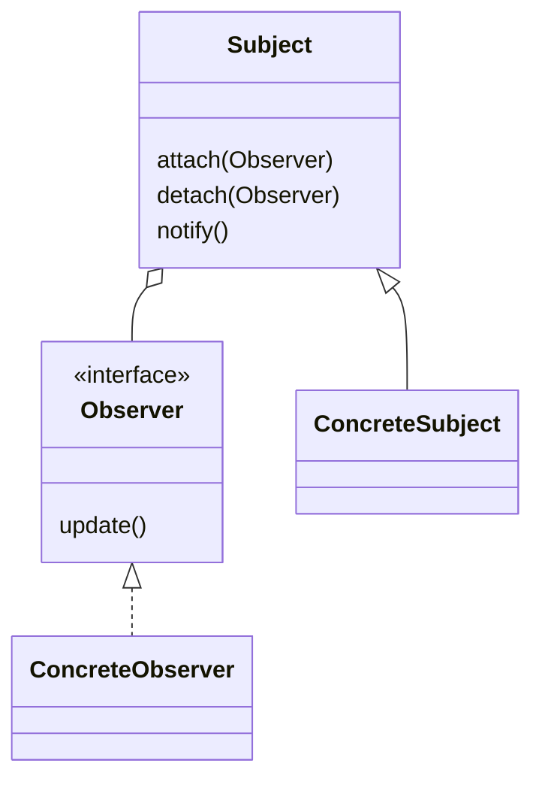

# Наблюдатель (Observer)

**Observer** определяет зависимость «один ко многим» между объектами, при которой изменение состояния одного объекта приводит к оповещению всех зависимых объектов.

## Полезные ссылки

### Официальная документация
- [Java Observable](https://docs.oracle.com/en/java/javase/17/docs/api/java.base/java/util/Observable.html)
- [Java PropertyChangeListener](https://docs.oracle.com/en/java/javase/17/docs/api/java.desktop/java/beans/PropertyChangeListener.html)

### См. также
- [[java-concurrency-basics|Java Concurrency]] — Java Concurrency
- [[spring-framework-interview|Spring Core]] — события и ApplicationEvent
- [Kotlin Delegates](https://kotlinlang.org/docs/delegation.html) — делегаты и observable

## Содержание

- [Суть и запомнить](#суть-и-запомнить)
- [Что такое Observer?](#что-такое-observer)
  - [Основные характеристики](#основные-характеристики)
  - [Проблемы, которые решает](#проблемы-которые-решает)
- [Когда использовать Observer?](#когда-использовать-observer)
  - [Подходящие сценарии](#подходящие-сценарии)
  - [Признаки необходимости](#признаки-необходимости)
- [Структура паттерна](#структура-паттерна)
  - [Компоненты](#компоненты)
- [Реализация на Java](#реализация-на-java)
  - [Классический Observer](#классический-observer)
  - [Java Observable (устаревший)](#java-observable-устаревший)
  - [Property Change Listener](#property-change-listener)
- [Реализация на Kotlin](#реализация-на-kotlin)
  - [Классическая реализация (GoF)](#классическая-реализация-gof)
  - [Реализация через Delegates.observable](#реализация-через-delegatesobservable)
- [Продвинутые реализации](#продвинутые-реализации)
  - [1. Reactive Observer с RxJava](#1-reactive-observer-с-rxjava)
- [Примеры использования](#примеры-использования)
  - [1. Model-View-Controller (MVC)](#1-model-view-controller-mvc)
  - [2. Cache Invalidation](#2-cache-invalidation)
- [Лучшие практики](#лучшие-практики)
  - [1. Потокобезопасность](#1-потокобезопасность)
  - [2. Memory Leaks Prevention](#2-memory-leaks-prevention)
  - [3. Тестирование Observer](#3-тестирование-observer)
- [Решение проблем](#решение-проблем)
- [FAQ](#faq)
- [Заключение](#заключение)

## Суть и запомнить

**Суть в одном предложении:** Один субъект уведомляет много подписчиков об изменении состояния; связь «один ко многим» без жёсткой зависимости.

**Запомнить:**
- Subject держит список Observer и вызывает у них update при изменении.
- Наблюдатели подписываются/отписываются динамически.
- Слабая связанность: субъект не знает деталей наблюдателей.
- В Java: PropertyChangeListener, в Kotlin — Delegates.observable, в реактивном стиле — RxJava.

**Когда применять:** события в UI, уведомления, кэш-инвалидация, модель в MVC.

## Что такое Observer?

**Observer** — это поведенческий паттерн проектирования, который создает механизм подписки, позволяющий одним объектам следить и реагировать на события, происходящие в других объектах.

### Основные характеристики

1. **Связь один ко многим**: Один субъект, множество наблюдателей
2. **Автоматическое оповещение**: Изменения состояния автоматически рассылаются подписчикам
3. **Слабая связанность**: Субъект и наблюдатели слабо связаны
4. **Динамическая подписка**: Возможность подписки и отписки во время выполнения

### Проблемы, которые решает

Сравнение: ручное обновление каждого дисплея vs **Observable**/**notifyObservers**.

```java
// Плохо: Жесткая связь между компонентами
public class WeatherStation {
    private WeatherDisplay display1;
    private WeatherDisplay display2;
    private WeatherDisplay display3;

    public WeatherStation() {
        this.display1 = new WeatherDisplay();
        this.display2 = new WeatherDisplay();
        this.display3 = new WeatherDisplay();
    }

    public void setTemperature(float temp) {
        // Нужно вручную обновлять каждый дисплей
        display1.updateTemperature(temp);
        display2.updateTemperature(temp);
        display3.updateTemperature(temp);
    }
}

// Хорошо: Observer паттерн
public class WeatherStation extends Observable {
    private float temperature;

    public void setTemperature(float temp) {
        this.temperature = temp;
        setChanged(); // Отмечаем что состояние изменилось
        notifyObservers(temperature); // Автоматически оповещаем всех наблюдателей
    }
}

// Наблюдатели подписываются автоматически
weatherStation.addObserver(display1);
weatherStation.addObserver(display2);
weatherStation.addObserver(display3);
```

## Когда использовать Observer?

### Подходящие сценарии

- **GUI компоненты**: Кнопки, поля ввода реагируют на события
- **Мониторинг**: Системы оповещений, логирования
- **Кэши**: Инвалидация кэша при изменении данных
- **Reactive programming**: **RxJava**, **Project Reactor**
- **Распределенные системы**: Оповещения между сервисами

### Признаки необходимости

```java
// Признаки: Множество объектов реагируют на изменения одного
public class Indicators {

    // Один объект изменяется, многие должны знать
    public class DataModel {
        private List<View> views = new ArrayList<>();

        public void addView(View view) {
            views.add(view);
        }

        public void updateData(Object data) {
            // Нужно оповестить все views
            for (View view : views) {
                view.refresh(data);
            }
        }
    }

    // Событийно-ориентированная архитектура
    public class EventBus {
        private Map<String, List<EventListener>> listeners = new HashMap<>();

        public void subscribe(String eventType, EventListener listener) {
            listeners.computeIfAbsent(eventType, k -> new ArrayList<>()).add(listener);
        }

        public void publish(String eventType, Object event) {
            List<EventListener> eventListeners = listeners.get(eventType);
            if (eventListeners != null) {
                for (EventListener listener : eventListeners) {
                    listener.onEvent(event);
                }
            }
        }
    }
}
```
## Структура паттерна



### Компоненты

1. **Subject/Observable**: Объект, за которым наблюдают
2. **Observer**: Интерфейс для наблюдателей
3. **ConcreteObserver**: Конкретные реализации наблюдателей
4. **Client**: Код, устанавливающий связи между субъектом и наблюдателями

## Реализация на Java

### Классический Observer

```java
// Subject интерфейс
interface Subject {
    void attach(Observer observer);
    void detach(Observer observer);
    void notifyObservers();
}

// Observer интерфейс
interface Observer {
    void update(Subject subject, Object data);
}

// Конкретный Subject
class WeatherStation implements Subject {
    private List<Observer> observers = new ArrayList<>();
    private float temperature;
    private float humidity;
    private float pressure;

    @Override
    public void attach(Observer observer) {
        observers.add(observer);
    }

    @Override
    public void detach(Observer observer) {
        observers.remove(observer);
    }

    @Override
    public void notifyObservers() {
        for (Observer observer : observers) {
            observer.update(this, null);
        }
    }

    public void setMeasurements(float temperature, float humidity, float pressure) {
        this.temperature = temperature;
        this.humidity = humidity;
        this.pressure = pressure;
        measurementsChanged();
    }

    private void measurementsChanged() {
        notifyObservers();
    }

    // Геттеры для наблюдателей
    public float getTemperature() { return temperature; }
    public float getHumidity() { return humidity; }
    public float getPressure() { return pressure; }
}

// Конкретные наблюдатели
class CurrentConditionsDisplay implements Observer {
    private float temperature;
    private float humidity;
    private Subject weatherData;

    public CurrentConditionsDisplay(Subject weatherData) {
        this.weatherData = weatherData;
        weatherData.attach(this);
    }

    @Override
    public void update(Subject subject, Object data) {
        if (subject instanceof WeatherStation) {
            WeatherStation weatherStation = (WeatherStation) subject;
            this.temperature = weatherStation.getTemperature();
            this.humidity = weatherStation.getHumidity();
            display();
        }
    }

    public void display() {
        System.out.println("Current conditions: " + temperature +
            "F degrees and " + humidity + "% humidity");
    }
}

class StatisticsDisplay implements Observer {
    private List<Float> temperatures = new ArrayList<>();
    private Subject weatherData;

    public StatisticsDisplay(Subject weatherData) {
        this.weatherData = weatherData;
        weatherData.attach(this);
    }

    @Override
    public void update(Subject subject, Object data) {
        if (subject instanceof WeatherStation) {
            WeatherStation weatherStation = (WeatherStation) subject;
            temperatures.add(weatherStation.getTemperature());
            display();
        }
    }

    public void display() {
        float sum = 0;
        for (Float temp : temperatures) {
            sum += temp;
        }
        float avg = sum / temperatures.size();
        float max = Collections.max(temperatures);
        float min = Collections.min(temperatures);

        System.out.println("Avg/Max/Min temperature = " + avg + "/" + max + "/" + min);
    }
}

// Клиент
public class WeatherStationDemo {
    public static void main(String[] args) {
        WeatherStation weatherData = new WeatherStation();

        CurrentConditionsDisplay currentDisplay = new CurrentConditionsDisplay(weatherData);
        StatisticsDisplay statisticsDisplay = new StatisticsDisplay(weatherData);

        weatherData.setMeasurements(80, 65, 30.4f);
        weatherData.setMeasurements(82, 70, 29.2f);
        weatherData.setMeasurements(78, 90, 29.2f);

        // Отписка наблюдателя
        weatherData.detach(currentDisplay);
        weatherData.setMeasurements(75, 85, 30.0f);
    }
}
```

### Java Observable (устаревший)

```java
// Использование встроенного Observable (устаревшего)
class WeatherData extends Observable {
    private float temperature;
    private float humidity;
    private float pressure;

    public void measurementsChanged() {
        setChanged();
        notifyObservers();
    }

    public void setMeasurements(float temperature, float humidity, float pressure) {
        this.temperature = temperature;
        this.humidity = humidity;
        this.pressure = pressure;
        measurementsChanged();
    }

    public float getTemperature() { return temperature; }
    public float getHumidity() { return humidity; }
    public float getPressure() { return pressure; }
}

// Наблюдатель для устаревшего API
class CurrentConditionsDisplay implements java.util.Observer {
    private float temperature;
    private float humidity;
    private Observable weatherData;

    public CurrentConditionsDisplay(Observable weatherData) {
        this.weatherData = weatherData;
        weatherData.addObserver(this);
    }

    @Override
    public void update(Observable o, Object arg) {
        if (o instanceof WeatherData) {
            WeatherData weatherData = (WeatherData) o;
            this.temperature = weatherData.getTemperature();
            this.humidity = weatherData.getHumidity();
            display();
        }
    }

    public void display() {
        System.out.println("Current conditions: " + temperature +
            "F degrees and " + humidity + "% humidity");
    }
}
```

### Property Change Listener

```java
// Современный подход с PropertyChangeSupport
class PropertyChangeWeatherStation {
    private PropertyChangeSupport support = new PropertyChangeSupport(this);
    private float temperature;
    private float humidity;

    public void addPropertyChangeListener(PropertyChangeListener listener) {
        support.addPropertyChangeListener(listener);
    }

    public void removePropertyChangeListener(PropertyChangeListener listener) {
        support.removePropertyChangeListener(listener);
    }

    public void addPropertyChangeListener(String propertyName, PropertyChangeListener listener) {
        support.addPropertyChangeListener(propertyName, listener);
    }

    public void setTemperature(float temperature) {
        float oldValue = this.temperature;
        this.temperature = temperature;
        support.firePropertyChange("temperature", oldValue, temperature);
    }

    public void setHumidity(float humidity) {
        float oldValue = this.humidity;
        this.humidity = humidity;
        support.firePropertyChange("humidity", oldValue, humidity);
    }

    public float getTemperature() { return temperature; }
    public float getHumidity() { return humidity; }
}

// Наблюдатель для конкретного свойства
class TemperatureDisplay implements PropertyChangeListener {
    @Override
    public void propertyChange(PropertyChangeEvent evt) {
        if ("temperature".equals(evt.getPropertyName())) {
            System.out.println("Temperature changed from " +
                evt.getOldValue() + " to " + evt.getNewValue());
        }
    }
}

// Универсальный наблюдатель
class UniversalDisplay implements PropertyChangeListener {
    @Override
    public void propertyChange(PropertyChangeEvent evt) {
        System.out.println("Property '" + evt.getPropertyName() +
            "' changed from " + evt.getOldValue() + " to " + evt.getNewValue());
    }
}

public class PropertyChangeDemo {
    public static void main(String[] args) {
        PropertyChangeWeatherStation station = new PropertyChangeWeatherStation();

        TemperatureDisplay tempDisplay = new TemperatureDisplay();
        UniversalDisplay universalDisplay = new UniversalDisplay();

        // Подписка на все изменения
        station.addPropertyChangeListener(universalDisplay);

        // Подписка только на температуру
        station.addPropertyChangeListener("temperature", tempDisplay);

        station.setTemperature(75.0f);
        station.setHumidity(60.0f);
        station.setTemperature(80.0f);
    }
}
```

## Реализация на Kotlin

В Kotlin удобно использовать делегаты `Delegates.observable` и лямбды вместо явных интерфейсов.

### Классическая реализация (GoF)

Интерфейс наблюдателя и метод обновления:

```kotlin
interface IObserver {
    fun update()
}
```

Интерфейс субъекта — управление списком наблюдателей и рассылка событий:

```kotlin
interface IObservable {
    val observers: MutableList<IObserver>

    fun add(observer: IObserver) {
        observers.add(observer)
    }

    fun remove(observer: IObserver) {
        observers.remove(observer)
    }

    fun sendUpdateEvent() {
        observers.forEach { it.update() }
    }
}
```

Наблюдаемый объект и наблюдатель:

```kotlin
class Newsletter : IObservable {
    override val observers: MutableList<IObserver> = mutableListOf()

    var newestArticleUrl: String = ""
        set(value) {
            field = value
            sendUpdateEvent()
        }
}

class Reader(private val newsletter: Newsletter) : IObserver {
    override fun update() {
        println("New article: ${newsletter.newestArticleUrl}")
    }
}
```

### Реализация через Delegates.observable

В Kotlin можно использовать наблюдаемые делегаты и хранить подписчиков как список лямбд:

```kotlin
import kotlin.properties.Delegates

class Newsletter {
    val newestArticleObservers = mutableListOf<(String) -> Unit>()

    var newestArticleUrl: String by Delegates.observable("") { _, _, newValue ->
        newestArticleObservers.forEach { it(newValue) }
    }
}

// Подписка
val newsletter = Newsletter()
newsletter.newestArticleObservers.add { url ->
    println("New article: $url")
}
```

## Продвинутые реализации

### 1. Reactive Observer с RxJava

```java
// RxJava-style Observer
public class ReactiveObserverDemo {

    static class TemperatureSensor {
        private PublishSubject<Float> temperatureSubject = PublishSubject.create();

        public Observable<Float> temperatureObservable() {
            return temperatureSubject;
        }

        public void setTemperature(float temperature) {
            temperatureSubject.onNext(temperature);
        }

        public void complete() {
            temperatureSubject.onComplete();
        }
    }

    static class TemperatureDisplay {
        private Disposable subscription;

        public void subscribe(TemperatureSensor sensor) {
            subscription = sensor.temperatureObservable()
                .subscribe(
                    temperature -> System.out.println("Temperature: " + temperature + "°C"),
                    error -> System.err.println("Error: " + error.getMessage()),
                    () -> System.out.println("Monitoring completed")
                );
        }

        public void unsubscribe() {
            if (subscription != null && !subscription.isDisposed()) {
                subscription.dispose();
            }
        }
    }

    static class TemperatureAlerter {
        private Disposable subscription;

        public void subscribe(TemperatureSensor sensor) {
            subscription = sensor.temperatureObservable()
                .filter(temp -> temp > 30.0f)
                .subscribe(
                    temp -> System.out.println("ALERT: High temperature: " + temp + "°C"),
                    error -> System.err.println("Alert error: " + error.getMessage())
                );
        }

        public void unsubscribe() {
            if (subscription != null && !subscription.isDisposed()) {
                subscription.dispose();
            }
        }
    }

    static class TemperatureStatistics {
        private List<Float> readings = new ArrayList<>();
        private Disposable subscription;

        public void subscribe(TemperatureSensor sensor) {
            subscription = sensor.temperatureObservable()
                .subscribe(
                    temp -> {
                        readings.add(temp);
                        displayStatistics();
                    },
                    error -> System.err.println("Stats error: " + error.getMessage()),
                    () -> displayFinalStatistics()
                );
        }

        private void displayStatistics() {
            if (readings.size() >= 5) {
                double avg = readings.stream().mapToDouble(Float::doubleValue).average().orElse(0);
                System.out.println("Last 5 readings average: " + String.format("%.2f", avg) + "°C");
            }
        }

        private void displayFinalStatistics() {
            if (!readings.isEmpty()) {
                double avg = readings.stream().mapToDouble(Float::doubleValue).average().orElse(0);
                double max = readings.stream().mapToDouble(Float::doubleValue).max().orElse(0);
                double min = readings.stream().mapToDouble(Float::doubleValue).min().orElse(0);
                System.out.println("Final stats - Avg: " + String.format("%.2f", avg) +
                    "°C, Max: " + max + "°C, Min: " + min + "°C");
            }
        }

        public void unsubscribe() {
            if (subscription != null && !subscription.isDisposed()) {
                subscription.dispose();
            }
        }
    }

    public static void main(String[] args) throws InterruptedException {
        TemperatureSensor sensor = new TemperatureSensor();

        TemperatureDisplay display = new TemperatureDisplay();
        TemperatureAlerter alerter = new TemperatureAlerter();
        TemperatureStatistics stats = new TemperatureStatistics();

        // Подписка наблюдателей
        display.subscribe(sensor);
        alerter.subscribe(sensor);
        stats.subscribe(sensor);

        // Имитация изменений температуры
        sensor.setTemperature(20.5f);
        Thread.sleep(1000);
        sensor.setTemperature(25.0f);
        Thread.sleep(1000);
        sensor.setTemperature(35.0f); // Вызовет алерт
        Thread.sleep(1000);
        sensor.setTemperature(22.0f);
        Thread.sleep(1000);
        sensor.setTemperature(28.0f);
        Thread.sleep(1000);

        // Завершение
        sensor.complete();

        // Отписка (хотя complete уже отписал)
        display.unsubscribe();
        alerter.unsubscribe();
        stats.unsubscribe();
    }
}
```

## Примеры использования

### 1. Model-View-Controller (MVC)

```java
// MVC с Observer паттерном
public class MVCExample {

    // Model
    static class WeatherModel {
        private final List<WeatherView> views = new ArrayList<>();
        private float temperature;
        private float humidity;

        public void addView(WeatherView view) {
            views.add(view);
        }

        public void removeView(WeatherView view) {
            views.remove(view);
        }

        public void setMeasurements(float temperature, float humidity) {
            this.temperature = temperature;
            this.humidity = humidity;
            notifyViews();
        }

        private void notifyViews() {
            for (WeatherView view : views) {
                view.update(temperature, humidity);
            }
        }

        public float getTemperature() { return temperature; }
        public float getHumidity() { return humidity; }
    }

    // View interface
    interface WeatherView {
        void update(float temperature, float humidity);
    }

    // Concrete Views
    static class CurrentConditionsView implements WeatherView {
        @Override
        public void update(float temperature, float humidity) {
            System.out.println("Current conditions: " + temperature + "°C, " + humidity + "% humidity");
        }
    }

    static class StatisticsView implements WeatherView {
        private final List<Float> temperatures = new ArrayList<>();

        @Override
        public void update(float temperature, float humidity) {
            temperatures.add(temperature);
            if (temperatures.size() >= 3) {
                double avg = temperatures.stream().mapToDouble(Float::doubleValue).average().orElse(0);
                System.out.println("Average temperature (last 3): " + String.format("%.2f", avg) + "°C");
            }
        }
    }

    static class ForecastView implements WeatherView {
        @Override
        public void update(float temperature, float humidity) {
            String forecast = temperature > 25 ? "Hot and humid" :
                            temperature > 20 ? "Warm" :
                            temperature > 10 ? "Cool" : "Cold";
            System.out.println("Weather forecast: " + forecast);
        }
    }

    public static void main(String[] args) {
        WeatherModel model = new WeatherModel();

        // Создание представлений
        WeatherView currentView = new CurrentConditionsView();
        WeatherView statsView = new StatisticsView();
        WeatherView forecastView = new ForecastView();

        // Регистрация представлений в модели
        model.addView(currentView);
        model.addView(statsView);
        model.addView(forecastView);

        // Изменение данных в модели автоматически обновляет все представления
        model.setMeasurements(22.0f, 65.0f);
        model.setMeasurements(18.5f, 72.0f);
        model.setMeasurements(26.0f, 55.0f);

        // Отписка представления
        model.removeView(forecastView);
        model.setMeasurements(15.0f, 80.0f);
    }
}
```

### 2. Cache Invalidation

```java
@Service
public class CacheInvalidationExample {

    // Subject - Cache Manager
    static class CacheManager {
        private final Map<String, CacheObserver> observers = new ConcurrentHashMap<>();
        private final Map<String, Object> cache = new ConcurrentHashMap<>();

        public void addObserver(String key, CacheObserver observer) {
            observers.put(key, observer);
        }

        public void removeObserver(String key) {
            observers.remove(key);
        }

        public void put(String key, Object value) {
            cache.put(key, value);
            // Оповещение наблюдателей об изменении
            CacheObserver observer = observers.get(key);
            if (observer != null) {
                observer.onCacheUpdate(key, value);
            }
        }

        public Object get(String key) {
            return cache.get(key);
        }

        public void invalidate(String key) {
            Object oldValue = cache.remove(key);
            // Оповещение об инвалидации
            CacheObserver observer = observers.get(key);
            if (observer != null) {
                observer.onCacheInvalidate(key, oldValue);
            }
        }

        public void clear() {
            Set<String> keys = new HashSet<>(cache.keySet());
            cache.clear();

            // Оповещение об инвалидации всех записей
            for (String key : keys) {
                CacheObserver observer = observers.get(key);
                if (observer != null) {
                    observer.onCacheInvalidate(key, null);
                }
            }
        }
    }

    // Observer interface
    interface CacheObserver {
        void onCacheUpdate(String key, Object newValue);
        void onCacheInvalidate(String key, Object oldValue);
    }

    // Concrete observers
    static class DatabaseCacheObserver implements CacheObserver {
        private final String tableName;

        public DatabaseCacheObserver(String tableName) {
            this.tableName = tableName;
        }

        @Override
        public void onCacheUpdate(String key, Object newValue) {
            System.out.println("Database observer [" + tableName + "]: Cache updated for key '" + key + "'");
            // Здесь можно синхронизировать с БД
        }

        @Override
        public void onCacheInvalidate(String key, Object oldValue) {
            System.out.println("Database observer [" + tableName + "]: Cache invalidated for key '" + key + "'");
            // Здесь можно обновить БД или выполнить другие действия
        }
    }

    static class LoggingCacheObserver implements CacheObserver {
        @Override
        public void onCacheUpdate(String key, Object newValue) {
            System.out.println("Log: Cache entry '" + key + "' updated to '" + newValue + "'");
        }

        @Override
        public void onCacheInvalidate(String key, Object oldValue) {
            System.out.println("Log: Cache entry '" + key + "' invalidated (was '" + oldValue + "')");
        }
    }

    static class MetricsCacheObserver implements CacheObserver {
        private final Map<String, AtomicInteger> updateCounts = new ConcurrentHashMap<>();
        private final Map<String, AtomicInteger> invalidateCounts = new ConcurrentHashMap<>();

        @Override
        public void onCacheUpdate(String key, Object newValue) {
            updateCounts.computeIfAbsent(key, k -> new AtomicInteger()).incrementAndGet();
            System.out.println("Metrics: Total updates for '" + key + "': " +
                updateCounts.get(key).get());
        }

        @Override
        public void onCacheInvalidate(String key, Object oldValue) {
            invalidateCounts.computeIfAbsent(key, k -> new AtomicInteger()).incrementAndGet();
            System.out.println("Metrics: Total invalidations for '" + key + "': " +
                invalidateCounts.get(key).get());
        }
    }

    public static void main(String[] args) {
        CacheManager cache = new CacheManager();

        // Регистрация наблюдателей
        cache.addObserver("user:123", new DatabaseCacheObserver("users"));
        cache.addObserver("user:123", new LoggingCacheObserver());
        cache.addObserver("user:123", new MetricsCacheObserver());

        cache.addObserver("product:456", new DatabaseCacheObserver("products"));
        cache.addObserver("product:456", new LoggingCacheObserver());

        // Операции с кэшем
        cache.put("user:123", "John Doe");
        cache.put("product:456", "Laptop");
        cache.invalidate("user:123");
        cache.clear();
    }
}
```

## Лучшие практики

### 1. Потокобезопасность

```java
public class ThreadSafeObserver {

    // Thread-safe Subject
    static class ThreadSafeSubject {
        private final List<Observer> observers = new CopyOnWriteArrayList<>();
        private final Object lock = new Object();
        private boolean changed = false;

        public void addObserver(Observer observer) {
            observers.add(observer);
        }

        public void removeObserver(Observer observer) {
            observers.remove(observer);
        }

        protected void setChanged() {
            synchronized (lock) {
                changed = true;
            }
        }

        protected void clearChanged() {
            synchronized (lock) {
                changed = false;
            }
        }

        public boolean hasChanged() {
            synchronized (lock) {
                return changed;
            }
        }

        // Thread-safe оповещение
        protected void notifyObservers(Object arg) {
            List<Observer> observersCopy;
            boolean hasChanged;

            synchronized (lock) {
                hasChanged = changed;
                changed = false;
                observersCopy = new ArrayList<>(observers);
            }

            if (hasChanged) {
                // Оповещение вне synchronized блока
                for (Observer observer : observersCopy) {
                    observer.update(this, arg);
                }
            }
        }
    }

    // Thread-safe Observer с debounce
    static class DebouncedObserver implements Observer {
        private final Observer delegate;
        private final ScheduledExecutorService scheduler = Executors.newSingleThreadScheduledExecutor();
        private ScheduledFuture<?> scheduledTask;
        private final long delayMs;

        public DebouncedObserver(Observer delegate, long delayMs) {
            this.delegate = delegate;
            this.delayMs = delayMs;
        }

        @Override
        public void update(Observable o, Object arg) {
            // Отмена предыдущей задачи
            if (scheduledTask != null) {
                scheduledTask.cancel(false);
            }

            // Планирование новой задачи
            scheduledTask = scheduler.schedule(() -> {
                delegate.update(o, arg);
            }, delayMs, TimeUnit.MILLISECONDS);
        }

        public void shutdown() {
            scheduler.shutdown();
        }
    }
}
```

### 2. Memory Leaks Prevention

```java
public class MemoryLeakPrevention {

    // Weak References для предотвращения memory leaks
    static class WeakObserverSubject {
        private final List<WeakReference<Observer>> observers = new CopyOnWriteArrayList<>();

        public void addObserver(Observer observer) {
            observers.add(new WeakReference<>(observer));
            // Очистка мертвых ссылок
            cleanupDeadReferences();
        }

        public void removeObserver(Observer observer) {
            observers.removeIf(ref -> {
                Observer obs = ref.get();
                return obs == null || obs.equals(observer);
            });
        }

        public void notifyObservers(Object arg) {
            cleanupDeadReferences();

            for (WeakReference<Observer> ref : observers) {
                Observer observer = ref.get();
                if (observer != null) {
                    observer.update(this, arg);
                }
            }
        }

        private void cleanupDeadReferences() {
            observers.removeIf(ref -> ref.get() == null);
        }
    }

    // Lifecycle-aware Observer
    interface LifecycleObserver extends Observer, AutoCloseable {
        @Override
        void close(); // Для очистки ресурсов
    }

    static class LifecycleSubject {
        private final List<LifecycleObserver> observers = new CopyOnWriteArrayList<>();

        public void addObserver(LifecycleObserver observer) {
            observers.add(observer);
        }

        public void removeObserver(LifecycleObserver observer) {
            observers.remove(observer);
        }

        public void destroy() {
            // Корректное завершение всех наблюдателей
            for (LifecycleObserver observer : observers) {
                try {
                    observer.close();
                } catch (Exception e) {
                    // Log error
                }
            }
            observers.clear();
        }

        public void notifyObservers(Object arg) {
            for (LifecycleObserver observer : observers) {
                observer.update(this, arg);
            }
        }
    }
}
```

### 3. Тестирование Observer

```java
@ExtendWith(MockitoExtension.class)
public class ObserverTest {

    @Mock
    private Observer observer1;

    @Mock
    private Observer observer2;

    @Test
    void shouldNotifyAllObserversWhenStateChanges() {
        TestSubject subject = new TestSubject();

        subject.addObserver(observer1);
        subject.addObserver(observer2);

        subject.setState("new state");

        verify(observer1).update(subject, "new state");
        verify(observer2).update(subject, "new state");
    }

    @Test
    void shouldNotNotifyRemovedObserver() {
        TestSubject subject = new TestSubject();

        subject.addObserver(observer1);
        subject.addObserver(observer2);
        subject.removeObserver(observer1);

        subject.setState("new state");

        verify(observer1, never()).update(any(), any());
        verify(observer2).update(subject, "new state");
    }

    @Test
    void shouldHandleObserverExceptionsGracefully() {
        TestSubject subject = new TestSubject();

        doThrow(new RuntimeException("Observer failed")).when(observer1).update(any(), any());

        subject.addObserver(observer1);
        subject.addObserver(observer2);

        // Не должно бросить исключение
        assertDoesNotThrow(() -> subject.setState("new state"));

        verify(observer1).update(subject, "new state");
        verify(observer2).update(subject, "new state");
    }

    @Test
    void shouldSupportAsyncNotifications() throws InterruptedException {
        TestSubject subject = new TestSubject();
        CountDownLatch latch = new CountDownLatch(2);

        Observer asyncObserver1 = (o, arg) -> {
            try {
                Thread.sleep(100); // Имитация работы
                latch.countDown();
            } catch (InterruptedException e) {
                Thread.currentThread().interrupt();
            }
        };

        Observer asyncObserver2 = (o, arg) -> {
            try {
                Thread.sleep(50); // Имитация работы
                latch.countDown();
            } catch (InterruptedException e) {
                Thread.currentThread().interrupt();
            }
        };

        subject.addObserver(asyncObserver1);
        subject.addObserver(asyncObserver2);

        long startTime = System.nanoTime();
        subject.setStateAsync("async state");

        // Ожидание завершения асинхронных операций
        assertTrue(latch.await(1, TimeUnit.SECONDS));

        long duration = (System.nanoTime() - startTime) / 1_000_000;
        assertTrue(duration >= 100, "Async operations should take at least 100ms");
    }

    @Test
    void shouldPreventMemoryLeaks() {
        WeakReferenceSubject subject = new WeakReferenceSubject();

        // Создание наблюдателя и получение weak reference
        TestObserver observer = new TestObserver();
        WeakReference<TestObserver> observerRef = new WeakReference<>(observer);

        subject.addObserver(observer);
        assertNotNull(observerRef.get(), "Observer should be reachable");

        // Удаление сильной ссылки
        observer = null;

        // Принудительный GC
        System.gc();
        try {
            Thread.sleep(100);
        } catch (InterruptedException e) {
            Thread.currentThread().interrupt();
        }

        // Наблюдатель должен быть garbage collected
        subject.notifyObservers("test");
        // cleanupDeadReferences вызывается автоматически

        assertNull(observerRef.get(), "Observer should be garbage collected");
    }

    // Test classes
    static class TestSubject extends Observable {
        public void setState(String state) {
            setChanged();
            notifyObservers(state);
        }

        public void setStateAsync(String state) {
            CompletableFuture.runAsync(() -> {
                setChanged();
                notifyObservers(state);
            });
        }
    }

    static class WeakReferenceSubject {
        private final List<WeakReference<Observer>> observers = new CopyOnWriteArrayList<>();

        public void addObserver(Observer observer) {
            observers.add(new WeakReference<>(observer));
            cleanupDeadReferences();
        }

        public void notifyObservers(Object arg) {
            cleanupDeadReferences();

            for (WeakReference<Observer> ref : observers) {
                Observer observer = ref.get();
                if (observer != null) {
                    observer.update(this, arg);
                }
            }
        }

        private void cleanupDeadReferences() {
            observers.removeIf(ref -> ref.get() == null);
        }
    }

    static class TestObserver implements Observer {
        @Override
        public void update(Observable o, Object arg) {
            // Test implementation
        }
    }
}
```


## Решение проблем

Типичные проблемы: неверное использование API (сверьтесь с примерами и разделом «Лучшие практики» выше), производительность (профилирование и настройки). Подробнее — в разделе «Лучшие практики» и в официальной документации из блока «Полезные ссылки».

## FAQ

Подробнее см. разделы «Когда использовать» и «Лучшие практики» выше.


## Заключение

**Observer** паттерн — фундаментальный паттерн для реализации реактивных систем и **loosely coupled** архитектур. Он обеспечивает эффективное оповещение множества объектов об изменениях состояния одного объекта.

**Ключевые преимущества:**
- **Свободная связь**: **Subject** и **Observers** слабо связаны
- **Динамическая подписка**: Возможность подписки и отписки во время выполнения
- **Масштабируемость**: Легко добавлять новых наблюдателей
- **Переиспользование**: Один **Subject** может использоваться множеством **Observers**

**Используйте Observer, когда:**
- Изменения одного объекта требуют изменений в других объектах
- Нужно **broadcast** коммуникации(один ко многим)
- Система должна быть **loosely coupled**
- Требуется реактивное программирование

**Observer** часто используется вместе с:
- **Mediator**: Для централизованного управления коммуникациями
- **Command**: Для выполнения действий в ответ на события
- **Memento**: Для сохранения состояния перед оповещением
- **Strategy**: Для выбора стратегии обработки событий

Главное правило: всегда учитывайте **потокобезопасность** и предотвращайте **утечки памяти** при работе с долгоживущими объектами!